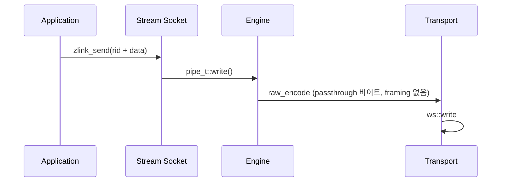

[English](https://zlink-systems.github.io/zlink/spec/core/socket/08-stream/) | 한국어

<!-- zlink-nav:start -->
[소켓 목차](README.ko.md) | [이전: ROUTER](07-router.ko.md) | [다음: 프로토콜 개요](../protocol/README.ko.md)
<!-- zlink-nav:end -->

# 소켓 — STREAM

> **이 장이 정의하는 것** — STREAM 소켓의 raw TCP 연결 노출과
> [result/errno](../03-errors.ko.md#result와-errno-대응) 공개 계약.

이 문서는 ZLink Core의 범용 raw STREAM 공개 계약을 정의합니다.
TCP/WS 연결의 byte record 또는 고정 framing packet을 routing ID로 송수신하는
C API와 bindings 개발자를 대상으로 합니다.

## 1. 범위

STREAM은 accept한 client 연결마다 4바이트 routing ID를 부여하는 bind 전용
raw socket입니다. `zlink_connect()`는 지원하지 않습니다. application은
routing ID로 client를 선택해 전송하고 수신 결과에서 source routing ID를
확인합니다.

STREAM은 application payload와 상위 protocol 의미를 해석하지 않습니다.

## 2. 생성, bind와 option

```c
ZLINK_EXPORT void *zlink_socket (void *context_, zlink_socket_type_t type_);
ZLINK_EXPORT zlink_bind_result_t zlink_bind (void *s_, const char *addr_);
ZLINK_EXPORT zlink_close_result_t zlink_close (void *s_);

typedef enum zlink_stream_option_t
{
    ZLINK_STREAM_OPT_NOTIFY = 0x3501
} zlink_stream_option_t;

ZLINK_EXPORT zlink_config_result_t zlink_set_stream_option (
  void *handle_, zlink_stream_option_t option_,
  const void *optval_, size_t optvallen_);
ZLINK_EXPORT zlink_config_result_t zlink_get_stream_option (
  void *handle_, zlink_stream_option_t option_,
  void *optval_, size_t *optvallen_);
```

`zlink_socket(context_, ZLINK_SOCKET_STREAM)`으로 생성합니다.
`ZLINK_STREAM_OPT_NOTIFY`는 bind 전에 설정하는 `int` 0 또는 1입니다. 값 1은
client 연결과 해제를 길이 0인 data record로 수신하게 하며 source routing ID가
대상 client를 식별합니다.

공통 HWM, timeout, linger, TLS와 buffer option은 `zlink_set_option()`과
`zlink_get_option()`을 사용합니다.

## 3. 수신 모드

한 STREAM handle은 다음 세 모드 가운데 하나만 사용합니다.

1. raw part receive: `zlink_recv_part()`로 raw record의 파트를 수신합니다.
2. raw callback: `zlink_recv_handler()`가 raw record를 callback에 전달합니다.
3. packet callback: `zlink_stream_packet_handler()`가 고정 framing packet을
   조립해 전달합니다.

첫 raw part 수신 또는 handler 등록이 수신 모드를 고정합니다. 같은 handle에서
다른 수신 모드를 활성화하거나 handler를 다시 등록하면 busy 결과와
`errno == EBUSY`로 실패합니다. data-plane `ZLINK_POLLIN`은 raw part receive
모드에 속합니다. send-ready handler와 `ZLINK_POLLOUT`은 수신 모드와
독립적입니다.

## 4. Routed part send

```c
ZLINK_EXPORT zlink_submit_result_t zlink_send_part_rid (
  void *s_,
  const zlink_routing_id_t *target_rid_,
  zlink_msg_t *part_,
  zlink_send_flags_t flags_,
  zlink_part_flag_t part_flag_);
```

STREAM은 한 번에 raw data part 하나를 target client로 전송합니다.
`target_rid_`는 STREAM이 해당 연결에 부여한 유효한 4바이트 routing ID여야
하며 `part_flag_`는 `ZLINK_PART_FINAL`이어야 합니다. `ZLINK_PART_MORE`는
`ZLINK_SUBMIT_NOT_SUPPORTED`, `errno == ENOTSUP`입니다.

STREAM send는 multipart sequence를 열지 않습니다. `ZLINK_PART_MORE` 실패 뒤에도
staging된 파트는 없고 다음 호출은 독립된 single-part record입니다. 따라서 다른
raw socket의 multipart 원자적 abort 규칙은 STREAM에 적용되지 않습니다.

성공하면 `part_`의 내용이 소비됩니다. backpressure로
`ZLINK_SUBMIT_BACKPRESSURED`, `errno == EAGAIN`을 반환하면 내용은 호출자에게
남으므로 같은 메시지로 재시도할 수 있습니다. 그 밖의 실패에서는 내용이
소비됩니다. 호출 전에 재사용 가능성이 있는 payload의 복사본을 준비하면 실패
종류와 무관하게 호출자 코드의 소유권 처리를 일정하게 유지할 수 있습니다.

연결을 찾을 수 없으면 `ZLINK_SUBMIT_NOT_CONNECTED`를 반환합니다. 전체 결과
대응은 [errno map](../03-errors.ko.md#result와-errno-대응)을 따릅니다.

## 5. Raw part receive

```c
ZLINK_EXPORT zlink_recv_result_t zlink_recv_part (
  void *s_,
  const zlink_routing_id_t **source_rid_out_,
  zlink_msg_t *part_out_,
  zlink_part_flag_t *has_more_out_,
  zlink_recv_flags_t flags_);
```

`part_out_`은 초기화된 메시지여야 하며 `has_more_out_`과 함께 필수입니다.
`source_rid_out_`은 선택 사항입니다. 성공하면 source client의 routing ID를
가리키는 Core 소유 borrowed view를 받습니다. 이 view가 다음 raw receive 뒤에도
필요하면 그 전에 복사해야 합니다.

성공하면 수신 파트의 소유권이 호출자에게 이전되며 호출자는
`zlink_msg_close(part_out_)`를 정확히 한 번 호출해야 합니다. 파트를 받기 전에
실패하면 소유권이 이전되지 않습니다. `*has_more_out_`은 다음 파트가 있으면
`ZLINK_PART_MORE`, 마지막 파트이면 `ZLINK_PART_FINAL`입니다.
`ZLINK_DONTWAIT` 호출에 데이터가 없으면 `ZLINK_RECV_NO_DATA`를 반환합니다.

## 6. Raw callback

```c
ZLINK_EXPORT zlink_handler_result_t zlink_recv_handler (
  void *s_, zlink_socket_msg_handler_fn handler_, void *userdata_);
```

raw callback은 STREAM에서만 지원합니다. source routing ID는 callback 동안만
유효한 borrowed view입니다. callback으로 전달된 모든 message part의 소유권은
callback으로 이전되며 각 파트를 정확히 한 번 소비하거나 닫아야 합니다.
callback 안에서 같은 handle에 receive handler를 다시 등록하거나 close하면
busy 결과와 `errno == EBUSY`로 실패합니다.

## 7. Packet callback과 framing

```c
typedef void (*zlink_stream_packet_handler_fn) (
  void *stream_,
  const zlink_routing_id_t *source_rid_,
  zlink_msg_t *header_,
  zlink_msg_t *body_,
  void *userdata_);

ZLINK_EXPORT zlink_handler_result_t zlink_stream_packet_handler (
  void *stream_, zlink_stream_packet_handler_fn handler_, void *userdata_);
```

packet mode는 각 client byte stream에서 다음 frame을 순서대로 조립합니다.

```text
+----------------+----------------+----------------+---------------+
| header_size:u16| body_size:u32  | header bytes   | body bytes    |
+----------------+----------------+----------------+---------------+
| big endian     | big endian     | exact length   | exact length  |
+----------------+----------------+----------------+---------------+
```

`header_size`는 unsigned 16-bit, `body_size`는 unsigned 32-bit 길이입니다.
두 payload 길이는 0일 수 있으며 callback은 이 경우에도 `NULL`이 아니라 길이
0인 유효한 `zlink_msg_t`를 받습니다. source routing ID는 callback 동안만
유효한 borrowed view입니다. `header_`와 `body_`의 소유권은 callback으로
이전되므로 각각 정확히 한 번 소비하거나 닫아야 합니다.

## 8. 비동기 송신 admission과 thread safety

```c
ZLINK_EXPORT zlink_submit_result_t zlink_send_async (
  void *s_, zlink_msg_t *parts_, size_t part_count_,
  const zlink_send_async_options_t *options_,
  zlink_send_op_id_t *op_id_out_);

ZLINK_EXPORT zlink_handler_result_t zlink_send_complete_handler (
  void *s_, zlink_send_complete_handler_fn handler_, void *userdata_);

ZLINK_EXPORT zlink_submit_result_t zlink_send_async_cancel (
  void *s_, zlink_send_op_id_t op_id_);
```

STREAM은 프레임 경계가 없는 raw 바이트를 나르므로 STREAM 레코드는 항상 정확히
1 part입니다. `part_count_`가 1이 아니면 `ZLINK_SUBMIT_NOT_SUPPORTED`입니다.
`options_->target`은 하나의 exact peer를 지정하며 그 identity는
`zlink_select_routed_submit_target()`에서 얻습니다.

완료는 Core 송신 큐로의 admission을 뜻하며 peer 전달이 아닙니다. 소유권 이전,
target별 FIFO 순서, socket 단위 pending 상한, operation별 timeout, 취소, close
fail-fast, 콜백 규칙 등 계약 전체는 [소켓 공통](README.ko.md)이 소유합니다.

공개 socket handle의 thread-safety와 close 계약은 [소켓 공통](README.ko.md)을
따릅니다. 같은 `zlink_msg_t`를 여러 스레드가 동시에 사용할 수 없습니다.

## Receive flow state

STREAM에는 paired DEALER/ROUTER completion lane이 없으므로 receive-flow 상태도 없다.
`zlink_socket_set_receive_flow_state()`는 STREAM socket에 대해 `errno == ENOTSUP`과 함께
`ZLINK_CONFIG_NOT_SUPPORTED`를 반환하고 아무것도 바꾸지 않는다. 위에서 설명한 byte HWM,
low water mark와 transport backpressure는 그대로 유지된다. STREAM socket의 monitor는
`ZLINK_MONITOR_STATUS_DETAIL_FLOW_STATE`를 설정하지 않고
`ZLINK_EVENT_SEND_FLOW_PAUSED`, `ZLINK_EVENT_SEND_FLOW_RESUMED`,
`ZLINK_EVENT_FLOW_STATE_STALE`를 발생시키지 않는다.

## 내부 구조

> **이 장의 계약 소유 문서** — STREAM 소켓의 공개 계약은 이 문서의 계약 부분이 다룬다.
> 이 절은 그 중 WS/WSS 경로의 내부 최적화 구조를 설명한다.

### 개요

STREAM 소켓은 ZMP(zlink Message Protocol) 핸드셰이크 없이 연결하는 외부 클라이언트
(웹 브라우저, 게임 클라이언트 등)와 RAW 통신을 지원한다. tcp, tls, ws, wss transport를
지원하며, 특히 WS/WSS 경로의 성능 최적화에 집중한다.

### 아키텍처

#### 컴포넌트 구성

| 컴포넌트 | 파일 | 역할 |
|----------|------|------|
| stream_t | src/runtime/sockets/stream/stream.cpp | STREAM 소켓 로직 |
| raw_encoder_t | src/runtime/protocol/raw_encoder.cpp | passthrough 인코딩 (framing 없음) |
| raw_decoder_t | src/runtime/protocol/raw_decoder.cpp | passthrough 디코딩 (바이트 span -> msg_t) |
| asio_raw_engine_t | src/runtime/engine/asio/asio_raw_engine.cpp | RAW I/O 엔진 |
| ws_transport_t | src/runtime/transports/ws/ | WebSocket transport |
| wss_transport_t | src/runtime/transports/tls/ | WebSocket + TLS transport |

#### 데이터 흐름



### WS/WSS 성능 특성

#### Read Path
- 데이터는 Beast read buffer(`message_buffer`)에서 출력 `msg_t` 로
  복사된다 (delivery 시 단일 copy).

#### Write Path
- `msg_t` payload 를 Beast write 버퍼로 직접 전달한다 (중간 copy 없음).

#### Beast Write Buffer
- Beast write 버퍼 기본값은 64KB다. WS write는 전달받은 버퍼 하나를
  단일 binary frame(`async_write` 한 번)으로 보낸다.

#### 프레임 분할
- `auto_fragment(false)` — 논리 메시지 하나가 하나의 WebSocket 프레임에
  대응한다.

### 측정 처리량

표준 벤치마크 머신의 단일 socket 대표 처리량:

| Transport | Throughput |
|-----------|------------|
| TCP       | 1493 MB/s  |
| WS        |  696 MB/s  |
| WSS 1KB   |  382 MB/s  |

WS 프레이밍을 택해서 얻는 이득은 대용량 메시지에서 가장 크다. 64KB 이상
payload 에서는 WS 가 TCP 라인 레이트에 근접하고, WSS 비용은 TLS 암호화
오버헤드가 좌우한다.

### 설계 트레이드오프

- Speculative write 미지원 (WebSocket 프레임 기반)
- Gather write는 WS/WSS에서 미지원 (`supports_gather_write()`가 false)
- TLS/WSS는 암호화 오버헤드 존재

### Packet Handler 수신 모드

STREAM 소켓에는 서로 배타적인 수신 모드가 셋 있다. 소켓 하나당 하나만
활성화할 수 있으며, 같은 소켓에 두 번째 활성화를 시도하면 `EBUSY`로
실패한다.

| 모드 | 활성화 방식 | 전달 형태 |
|------|-------------|-----------|
| Raw recv | 기본 | `zlink_recv()`가 read 단위로 raw bytes 반환 |
| Raw callback | `zlink_recv_handler()` | `zlink_socket_msg_handler_fn` 이 raw bytes 를 받는다 |
| Packet callback | `zlink_stream_packet_handler()` | `zlink_stream_packet_handler_fn` 이 header / body 로 이미 분리된 `zlink_msg_t` 를 받는다 |

Packet handler 모드는 raw STREAM 바이트 파이프 위에 `header + body` 프레이밍을
올리는 애플리케이션 프로토콜을 위한 것이다 — 예를 들어 주문 처리 게이트웨이가
작은 제어 헤더 뒤에 큰 payload를 싣는 경우다. 호출자마다 똑같은
length-prefix(길이 접두사) 디코더와 버퍼링 상태 머신을 거듭 구현하는
대신, STREAM 이 내부에서 frame 을 파싱하고 이미 할당된
`zlink_msg_t` 를 콜백에 넘긴다.

#### Wire framing

각 논리 packet 은 wire 에 다음 형식으로 실린다:

```
+------------------+--------------------+----------------+-------------------+
| u16 header_size  | u32 body_size      | header bytes   | body bytes        |
| (big-endian)     | (big-endian)       | (header_size)  | (body_size)       |
+------------------+--------------------+----------------+-------------------+
```

- `header_size` 는 2-byte big-endian unsigned integer.
- `body_size` 는 4-byte big-endian unsigned integer.
- 두 size 는 모두 `0` 일 수 있다. `header_size=0 && body_size=0` 인 패킷도
  콜백을 그대로 유발하며, header 와 body 가 비어 있어도 non-`NULL`
  인 `zlink_msg_t` 두 개로 전달된다.
- size 검사는 `maxmsgsize` 가 양수로 설정된 경우에만 적용된다(기본값 `-1`은
  무제한). 설정된 한계를 넘는 size 광고는 malformed framing 으로 취급된다 (아래 "Malformed framing" 참고).

#### Per-connection 누적기

들어오는 바이트는 각 연결(pipe)의 packet state(`pipe_t::_stream_packet_state`)를
거친다. handler 는 `pipe_->stream_packet_state()` 로 이 상태에 접근한다.

```
  wire bytes (arbitrary fragmentation)
         |
         v
  +-------------------------+
  | pipe packet state       |
  |   stage: prefix_stage   |
  |          header_stage   |
  |          body_stage     |
  +-------------------------+
         |
         v
  callback(stream, source_rid, header_msg, body_msg, userdata)
```

먼저 length field 가 파싱된다. `header_size` 와 `body_size` 가 모두 확정되면
이후 도착하는 바이트가 해당 연결의 packet state 의 header / body buffer 에
누적된다. 패킷이 완성되면 그 누적 buffer 들이 새로 초기화된 `zlink_msg_t`
header / body 로 move(zero-copy)되어 콜백에 전달된다. Delivery 시점에는
추가 copy 가 없다 — move 가 조립된 buffer 를 콜백이 받을 message 로 옮긴다.

#### Callback 규약

Signature:

```
zlink_stream_packet_handler_fn(stream,
                               source_rid,    // borrowed view
                               header_msg,    // ownership 이전
                               body_msg,      // ownership 이전
                               userdata)
```

- `source_rid` 는 콜백 실행 동안만 유효한 빌린 참조(borrowed view)다. 콜백
  뒤에도 보존하려면 복사해야 한다.
- `header_msg` 와 `body_msg` 는 wire size 가 `0` 이어도 항상
  non-`NULL` 로 전달된다. 두 메시지의 ownership 이 콜백으로 넘어가며,
  콜백이 `zlink_msg_close()` 로 닫을 책임을 진다.
- 같은 `source_rid` 에서 오는 패킷들은 직렬화된다. 같은 피어의 뒤
  패킷이 앞 패킷을 앞지를 수 없다. 서로 다른 `source_rid` 의 패킷
  은 서로 다른 worker 스레드에서 병렬로 dispatch될 수 있다.
- 콜백 안에서의 self-close 는 raw `zlink_recv_handler` 케이스와 같은
  규칙을 따른다. 콜백 안에서 수신 모드를 바꾸거나 소켓을 닫으려
  하면 `EBUSY` 로 실패한다.

#### Malformed framing

다음 상황은 malformed 로 보고 해당 연결을 닫는다.

- 선언된 `header_size` 또는 `body_size` 가 내부 한계를 넘는 경우.
- Length field 는 도착했지만 전체 패킷이 도착하기 전에 피어가 close /
  reset 되는 경우 — 즉 mid-length 또는 mid-payload close.

이 경우 STREAM monitor 에 해당 `source_rid` 의 disconnect 이벤트로
노출된다. 불완전한 패킷은 절대 콜백으로 전달되지 않으며,
연결과 함께 decoder state 도 폐기된다.

#### 왜 STREAM 안에서 decode 하는가

애플리케이션마다 따로 하는 대신 STREAM 안에서 decode 하도록 둔 이유는 두 가지다.

- **복사 한 번 감소.** 애플리케이션이 "조립된" contiguous buffer 를 한 번
  만졌다가 다시 쪼갤 필요가 없다. 누적 buffer 가 header / body message 로
  move(zero-copy)된다.
- **순서 보장.** Per-`source_rid` 직렬화를 decoder 쪽에서 강제하므로,
  호출자가 raw byte delivery 위에 별도 reorder 로직을 올릴 필요가 없다.

### 현재 STREAM 런타임 기본값

STREAM 은 transport 전반에 공통된 기본 성능 프로파일을 쓴다.
STREAM 외 공통 소켓 기본값은 [소켓 — 공통 명세의 내부 구조](README.ko.md#내부-구조)를 참고한다.

#### 내부 상수 고정 항목

아래 값들은 내부 상수로 고정되며 STREAM env 로 제어하지 않는다:
- handler allocator: 활성
- read drain: 활성
- speculative write: STREAM/TCP 경로에서 상시 on 고정
- RX slab buffering: 활성
- speculative write byte budget: `2097152`
- read drain max loops: `64`
- read drain max bytes: `1048576`

#### 소켓/리스너 기본값

- backlog: `65536`
- `sndhwm` / `rcvhwm`: Core memory budget을 STREAM 역할 하한·상한으로
  water-filling한 physical queue별 applied HWM
- `sndbuf` / `rcvbuf`: 기본값 `-1`. OS 기본 버퍼와 TCP 자동 조정에 맡김
- accept 동시성(STREAM 전용): 기본 `4`, 최대 `128`
- 세션 스케줄러(STREAM): 기본 `rr`

#### 현재 유지되는 STREAM 런타임 환경변수

- `ZLINK_ASIO_STREAM_ACCEPT_CONCURRENCY`: 기본 `4`, 최대 `128`로 제한
- `ZLINK_ASIO_STREAM_SESSION_SCHED` (`rr|minload`): 기본 `rr`
- `ZLINK_ASIO_STREAM_ENABLE_NON_TCP_SPEC_READ`: 기본 비활성
- `ZLINK_ASIO_STREAM_DISABLE_GATHER`: 기본 비활성이라 STREAM gather-write 는 유지됨
- `ZLINK_ASIO_STREAM_GATHER_THRESHOLD`: 기본 `1024`
- `ZLINK_ASIO_STREAM_TINY_GATHER_THRESHOLD`: 기본 `0`
- `ZLINK_ASIO_STREAM_INITIAL_TARGET_CAP`: 기본 `4096`
- `ZLINK_ASIO_STREAM_BATCH_SIZE`: 기본 `4096`
- `ZLINK_ASIO_STREAM_BATCH_HEADROOM`: 기본 `64`

### Peer rid disconnect

STREAM의 public routing id는 서버가 연결별로 부여한 4바이트 connection id다.
`zlink_disconnect_rid()`는 이 id를 `uint32_t`로 해석해 STREAM 라우팅 맵에서
pipe를 찾고 종료 요청을 넣는다. 4바이트가 아닌 rid는 잘못된 인자로 실패한다.
