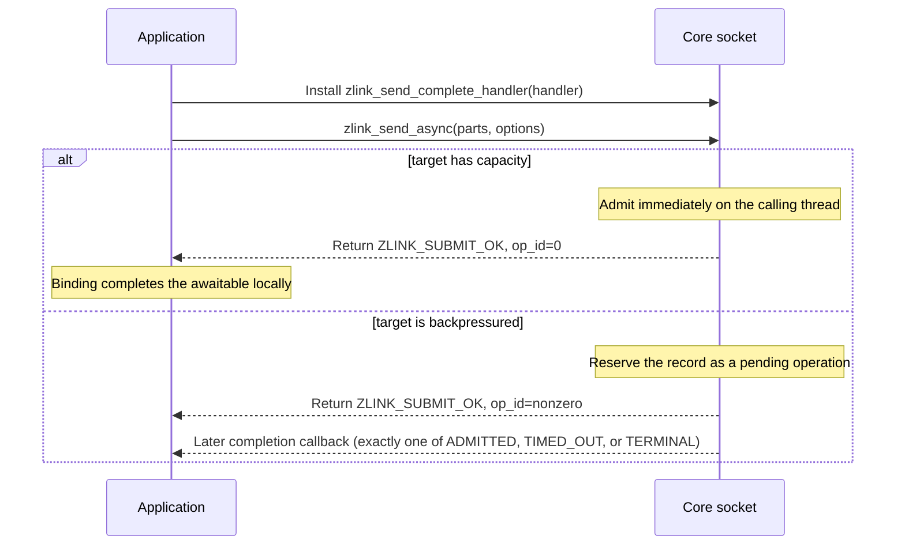

[한국어](https://zlink-systems.github.io/zlink/ko/spec/core/socket/) | English

<!-- zlink-nav:start -->
[Core Spec Index](../README.en.md) | [Previous: Runtime Boundary](../08-runtime-boundary.en.md) | [Next: PAIR](01-pair.en.md)
<!-- zlink-nav:end -->

# Socket — Common Specification

> **What this chapter defines** — the public contract for the common
> foundations (options and API forms) that apply to every socket type.
> Each socket specification defines its type-specific details.

## 1. Socket overview

A zlink [socket](../glossary.en.md#socket) is an endpoint that sends and
receives messages, and it always belongs to a
[Context](../glossary.en.md#context). This document covers the common
foundations shared by every socket type: creation, connection, termination,
common options, the form of send and receive APIs, and thread safety.
Separate files define each type's type-specific options, data-plane APIs, and
behavioral details.

| Socket Type | Spec |
|-------------|------|
| 01. PAIR | [pair.md](01-pair.en.md) |
| 02. PUB | [pub.md](02-pub.en.md) |
| 03. SUB | [sub.md](03-sub.en.md) |
| 04. XPUB | [xpub.md](04-xpub.en.md) |
| 05. XSUB | [xsub.md](05-xsub.en.md) |
| 06. DEALER | [dealer.md](06-dealer.en.md) |
| 07. ROUTER | [router.md](07-router.en.md) |
| 08. STREAM | [stream.md](08-stream.en.md) |

The following documents own the related contracts.

| Related contract | Owning document |
|---|---|
| Type-specific options, data plane, and behavioral details | Each socket specification in the table above |
| Context lifetime and context options | [Context](../01-context.en.md) |
| Message lifecycle and ownership | [Message](../02-message.en.md) |
| Auto HWM budget calculation and admission | [Auto HWM](../systems/06-auto-hwm.en.md) |
| Complete result enums and error tables | [Errors](../03-errors.en.md) |

## 2. Thread safety

Public socket handle APIs are thread-safe by default. Not every API has the
same cost model, though.

- `send` is a hot-path API and can be called concurrently from multiple threads.
- `bind/connect/disconnect`, subscribe/unsubscribe, option/query, and monitor
  operations are valid runtime control-path calls. Correctness is preserved,
  but execution order may follow internal serialization.
- `close` uses a fail-fast lifecycle gate. If another thread is running an
  admitted API or callback on the same handle, close fails with `EBUSY`. Once
  close is accepted, new API entry fails with `ESHUTDOWN`.
- Only a small set of exceptions remain outside the default allowance:
  init-only configuration, callback-context restrictions on specific
  reentrant APIs, and concurrent sharing of the same `zlink_msg_t` instance.

## 3. Receive model

Receive surfaces are fixed per socket type. The default model is
`recv + poller`; only a few exception types expose callback-based receive.

| Socket Type | Receive Surface | Notes |
|-------------|-----------------|------|
| PAIR | `zlink_recv_part()` | part receive only |
| DEALER | `zlink_recv_part()` (+ `zlink_dealer_request_part()` completion callback) | part-receive data plane |
| SUB | `zlink_subscribe_part()` | topic-part receive only |
| XSUB | `zlink_subscribe_part()` | topic-part receive only |
| ROUTER | `zlink_router_recv_part()` (+ `zlink_router_request_part()` completion callback) | part-receive data plane |
| STREAM | `zlink_recv_part()` / `zlink_recv_handler()` / `zlink_stream_packet_handler()` | Choose one of the three modes (exception) |
| PUB | N/A | send-only |
| XPUB | `zlink_xpub_recv_part()` (subscription events, recv-only) | data plane is send |
| monitor / timer | recv and callback both supported | observation / utility layer |

Key principles:

- For raw data-plane receive, `recv + poller` is the primary path: the
  server loop observes `ZLINK_POLLIN` and pulls data with a recv-family
  function.
- The request completion callback on `DEALER` / `ROUTER` is an async
  operation completion surface, not a data-plane receive callback. The
  two roles are kept separate.
- STREAM is the exception. Because of its raw transport nature, one of
  three receive models (raw recv, raw callback, packet callback) can be
  chosen per handle. A second attempt to activate a different mode on the
  same handle fails with `EBUSY`.

## 4. Types and constants

### Socket Types

```c
typedef enum zlink_socket_type_t
{
    ZLINK_SOCKET_ANY    = 0,       // Reserved wildcard value; not for creation and consumed by no API
    ZLINK_SOCKET_PAIR   = 0x1001,
    ZLINK_SOCKET_PUB    = 0x1002,
    ZLINK_SOCKET_SUB    = 0x1003,
    ZLINK_SOCKET_DEALER = 0x1004,
    ZLINK_SOCKET_ROUTER = 0x1005,
    ZLINK_SOCKET_XPUB   = 0x1006,
    ZLINK_SOCKET_XSUB   = 0x1007,
    ZLINK_SOCKET_STREAM = 0x1008
} zlink_socket_type_t;
```

`ZLINK_SOCKET_ANY` is a reserved wildcard value. It is not used to create a
socket, and no API consumes it. Use the normalized `ZLINK_SOCKET_*` constants
shown above to create an actual socket.

### Send Flags

```c
typedef enum zlink_send_flags_t
{
    ZLINK_SEND_FLAGS_NONE     = 0,       // No flags; blocking send behavior
    ZLINK_SEND_FLAGS_DONTWAIT = 0x0001u  // Non-blocking; return ZLINK_SUBMIT_BACKPRESSURED if it would block
} zlink_send_flags_t;

#define ZLINK_DONTWAIT ZLINK_SEND_FLAGS_DONTWAIT  // Short public name
```

### Recv Flags

```c
typedef enum zlink_recv_flags_t
{
    ZLINK_RECV_FLAGS_NONE     = 0,       // No flags; blocking receive behavior
    ZLINK_RECV_FLAGS_DONTWAIT = 0x0001u  // Non-blocking receive; return ZLINK_RECV_NO_DATA immediately when no message is available
} zlink_recv_flags_t;
```

Used by `zlink_recv_part`, `zlink_subscribe_part`, the socket-specific
`zlink_*_recv_part` family, and the monitor `zlink_*_monitor_recv` functions.

### Message part flag

```c
typedef enum zlink_part_flag_t
{
    ZLINK_PART_FINAL = 0,  // The current part is the last part
    ZLINK_PART_MORE = 1    // Another part follows in the same multipart message
} zlink_part_flag_t;
```

### Routing ID duplicate policy

```c
typedef enum zlink_rid_duplicate_policy_t
{
    ZLINK_RID_DUPLICATE_REJECT = 0,   // Keep the existing pipe and do not register the new duplicate pipe (default)
    ZLINK_RID_DUPLICATE_HANDOVER = 1  // A reconnecting pipe in the same direction takes over the existing pipe
} zlink_rid_duplicate_policy_t;
```

`ZLINK_OPT_RID_DUPLICATE_POLICY` controls what happens when a local socket
observes another peer with the same routing id. The option value is an
`int`; the default is `ZLINK_RID_DUPLICATE_REJECT`.

`ZLINK_RID_DUPLICATE_REJECT` keeps the existing pipe and does not register the
new duplicate pipe. Under `ZLINK_RID_DUPLICATE_HANDOVER`, a reconnecting pipe
in the same direction takes over the existing pipe. If pipes in opposite
directions collide, both peers compare their routing IDs and choose the same
single direction.

This option is meaningful only for sockets that can observe a peer-advertised
routing id. STREAM assigns its own 4-byte connection routing ids, so this
option does not affect STREAM.

### Submit retry mode

```c
typedef enum zlink_submit_retry_mode_t
{
    ZLINK_SUBMIT_RETRY_OFF = 0,           // Do not retry automatically
    ZLINK_SUBMIT_RETRY_LOCAL_FAILURE = 1  // Retry only local failures before handoff to the peer queue
} zlink_submit_retry_mode_t;
```

`ZLINK_SUBMIT_RETRY_OFF` disables automatic retry.
`ZLINK_SUBMIT_RETRY_LOCAL_FAILURE` permits retry only for a local failure that
occurs before the send is handed to a peer queue. This mode does not guarantee
peer delivery or processing. [Send retry in §5 Options](#send-retry) describes
retry eligibility and results.

### Receive flow state

```c
typedef enum zlink_receive_flow_state_t
{
    ZLINK_RECEIVE_FLOW_RUNNING = 0,  // Tell peers to keep sending
    ZLINK_RECEIVE_FLOW_PAUSED = 1    // Tell peers not to send new messages to this socket
} zlink_receive_flow_state_t;
```

This is the receive-flow state a DEALER or ROUTER socket publishes to peers
that send to it over the paired
[completion progress lane](../glossary.en.md#completion-progress-lane).
`ZLINK_RECEIVE_FLOW_RUNNING`
asks those peers to keep sending; `ZLINK_RECEIVE_FLOW_PAUSED` asks them to stop
sending new messages to this socket. The value is an absolute socket-wide
state, not a counter, so setting the state a socket already holds changes
nothing and succeeds. Only DEALER and ROUTER have this lane;
[DEALER](06-dealer.en.md) and [ROUTER](07-router.en.md) own the resulting
behavior.

### Send result

```c
typedef enum zlink_submit_result_t
{
    /* Submit succeeded. */
    ZLINK_SUBMIT_OK = 0,                 // The message was sent successfully

    /* Normal control-flow result. */
    ZLINK_SUBMIT_BACKPRESSURED = 1,      // The send queue is full (HWM reached)
    ZLINK_SUBMIT_NOT_CONNECTED = 2,      // The target path or peer is not connected yet
    ZLINK_SUBMIT_NOT_FOUND = 3,          // The target peer or routed destination was not found
    ZLINK_SUBMIT_NOT_ADMITTED = 13,      // The target route was identified, but admission policy rejected the submit

    /* Runtime / lifecycle failure. */
    ZLINK_SUBMIT_TERMINATED = 4,         // The context was terminated

    /* Caller contract violation. */
    ZLINK_SUBMIT_INVALID_HANDLE = 5,     // The handle is NULL or invalid
    ZLINK_SUBMIT_INVALID_ARGUMENT = 6,   // An argument violates the API contract
    ZLINK_SUBMIT_NOT_SUPPORTED = 7,      // The operation or flags are not supported
    ZLINK_SUBMIT_INVALID_STATE = 8,      // The handle is in an invalid state
    ZLINK_SUBMIT_THREAD_VIOLATION = 9,   // The allowed thread model was violated

    /* Internal failure. */
    ZLINK_SUBMIT_OUT_OF_MEMORY = 10,     // Memory allocation failed while preparing the submit
    ZLINK_SUBMIT_SEQ_EXHAUSTED = 11,     // Request sequence space was exhausted
    ZLINK_SUBMIT_INTERNAL_ERROR = 12     // Internal send/request/reply submit error
} zlink_submit_result_t;
```

Used as the canonical normalized submit outcome for send, request submit,
and reply submit APIs. Exported C APIs return this enum directly. Internal
implementation paths still use detailed `errno`, and exported API
boundaries normalize those values into this public contract.

### Request Completion

```c
typedef enum zlink_request_result_t
{
    /* Reply completed successfully. */
    ZLINK_REQUEST_OK = 0,                  // Reply payload was received successfully

    /* Completion failure visible to the requester. */
    ZLINK_REQUEST_TIMED_OUT       = 101,   // No reply arrived within the configured time
    ZLINK_REQUEST_NOT_FOUND       = 102,   // The target was absent and the request completed with an error reply
    ZLINK_REQUEST_TERMINATED      = 103,   // Context or socket ended before a terminal reply (ETERM or ESHUTDOWN)
    ZLINK_REQUEST_PROTOCOL_ERROR  = 104,   // The reply envelope or error-reply payload was malformed
    ZLINK_REQUEST_INTERNAL_ERROR  = 105,   // Completion failed without a more specific public bucket
    ZLINK_REQUEST_REJECTED        = 106,   // The target explicitly rejected the request
    ZLINK_REQUEST_CONFLICT        = 107,   // The request conflicts with current routing or operation state
    ZLINK_REQUEST_BUSY            = 108,   // The target is busy and cannot accept the request now
    ZLINK_REQUEST_NOT_CONNECTED   = 109,   // There is no active connection to the target
    ZLINK_REQUEST_INVALID_ARGUMENT = 110,  // The request contains an invalid argument
    ZLINK_REQUEST_INVALID_STATE   = 111,   // The target is in a state that rejects this request
    ZLINK_REQUEST_NOT_SUPPORTED   = 112,   // The target does not support the operation
    ZLINK_REQUEST_BACKPRESSURED   = 113    // Non-blocking outbound admission lacked capacity
} zlink_request_result_t;
```

Used as the canonical normalized completion outcome for
`zlink_reply_handler_fn`. The callback receives `result_` directly as a
`zlink_request_result_t` value.

### Security Mechanisms

```c
#define ZLINK_NULL 0   // No security mechanism (default)
#define ZLINK_PLAIN 1  // PLAIN username/password authentication
```

### Callback types

#### zlink_socket_msg_handler_fn

```c
typedef void (*zlink_socket_msg_handler_fn) (
  const zlink_routing_id_t *source_rid_,
  zlink_msg_t *parts_,
  size_t part_count_,
  void *userdata_);
```

This type is used by the raw receive callback for raw `STREAM`. It is invoked
on the owning [I/O thread](../glossary.en.md#io-thread), and ownership of every
message part transfers to the callback. Each part must be closed or consumed
exactly once. Use it with `zlink_recv_handler()`.

#### zlink_stream_packet_handler_fn

```c
typedef void (*zlink_stream_packet_handler_fn) (
  void *stream_,
  const zlink_routing_id_t *source_rid_,
  zlink_msg_t *header_,
  zlink_msg_t *body_,
  void *userdata_);
```

This is the packet-level receive callback type for raw `STREAM`. `source_rid_`
is a borrowed view of the routing ID of the client connection that sent the
packet. `header_` and `body_` are the header and body payloads assembled under
the fixed framing convention. Even when their length is zero, they are valid,
non-NULL `zlink_msg_t` objects. Ownership of both `msg_t` values transfers to
the callback. Use this type with `zlink_stream_packet_handler()`.

#### Send completion types

```c
typedef enum zlink_send_complete_result_t {
  ZLINK_SEND_ADMITTED = 0,     // The record was admitted to the Core send queue, not received by the peer
  ZLINK_SEND_TIMED_OUT = 201,  // The per-operation timeout_ms expired
  ZLINK_SEND_TERMINAL = 202    // Final failure; terminal_errno carries the cause
} zlink_send_complete_result_t;

typedef uint64_t zlink_send_op_id_t;

typedef struct zlink_send_complete_event_t {
  zlink_send_op_id_t op_id;                // Pending operation id; always non-zero in a completion event
  void *userdata;                          // Returned unchanged from the submit options
  zlink_routing_id_t peer_rid;             // Target identity; always populated
  uint64_t transport_pair_id;              // 0 for a socket without a routed target
  uint64_t transport_pair_generation;      // 0 for a socket without a routed target
  zlink_send_complete_result_t result;
  int terminal_errno;                      // Cause errno for non-ADMITTED results (ETIMEDOUT for TIMED_OUT)
} zlink_send_complete_event_t;

typedef void (*zlink_send_complete_handler_fn) (
  void *subject_, const zlink_send_complete_event_t *event_,
  void *userdata_);

typedef struct zlink_send_async_options_t {
  uint32_t struct_size;
  uint32_t timeout_ms;
  void *userdata;
  const zlink_routed_submit_target_t *target;
} zlink_send_async_options_t;
```

`ZLINK_SEND_ADMITTED` means that the record was admitted to the Core send
queue. It does not mean that the peer received it; use request/reply when
delivery confirmation is required. `ZLINK_SEND_TIMED_OUT` means the
per-operation `timeout_ms` expired and records `ETIMEDOUT` in
`terminal_errno`. `ZLINK_SEND_TERMINAL` is a final failure whose cause is in
`terminal_errno`. Cancellation and socket close use `ECANCELED`, context
termination uses `ETERM`, and other cases carry a route-failure errno.

`struct_size` must equal `sizeof(zlink_send_async_options_t)`; otherwise the
submit fails with `EINVAL`. `timeout_ms == 0` means no deadline. `op_id_out_`
is optional. Immediate admission and failed submission set it to `0`; a record
retained by Core receives a non-zero id.

A non-zero `op_id` is a Core-assigned, socket-local monotonic value. Zero means
the record was admitted immediately, no callback will run, and there is no
operation to cancel. `userdata` is returned unchanged from the submit options.
Target identity fields are always populated and are zero for a socket without
a routed target.

#### zlink_reply_handler_fn

```c
typedef void (*zlink_reply_handler_fn) (
  zlink_request_result_t result_,
  zlink_msg_t *parts_,
  size_t part_count_,
  void *userdata_);
```

This callback reports asynchronous request-reply completion. It runs when a
reply arrives or the request times out. On timeout, `result_` is
`ZLINK_REQUEST_TIMED_OUT` and `parts_` is NULL. On success, `result_` is
`ZLINK_REQUEST_OK` and ownership of every message part transfers to the
callback. `result_` is not a submit failure; it is the request-completion
outcome expressed as a `zlink_request_result_t` value. This callback is an
async-operation completion notification, not data-plane receive, and is used
only by the request APIs of `DEALER` and `ROUTER`.

A socket permits at most 65,536 requests whose callbacks have not completed.
Core reserves a completion slot before transmitting a request. If no slot is
available, submit returns `ZLINK_SUBMIT_BACKPRESSURED` with `errno` set to
`EAGAIN`. Replies, timeouts, and disconnect completions use the same
reservation, so stopping callback processing on the owner thread cannot grow
the control queue beyond this limit.

## 5. Options

Socket options use type-specific enums and functions. Common options use
`zlink_set_option()` / `zlink_get_option()`, while socket-type-specific
options use dedicated functions such as
`zlink_set_router_option()`, `zlink_set_dealer_option()`,
`zlink_set_pub_option()`, `zlink_set_sub_option()`, and
`zlink_set_stream_option()`. ROUTING_ID uses the dedicated
`zlink_set_routing_id()` / `zlink_get_routing_id()` functions. Standard TLS
server/client role configuration uses `zlink_set_tls_server()` /
`zlink_set_tls_client()`, while `ZLINK_OPT_TLS_*` configures or queries
individual TLS values only on supported raw network sockets.
SUBSCRIBE/UNSUBSCRIBE uses `zlink_set_subscription()` /
`zlink_unset_subscription()`.

### Common options (`zlink_option_t`)

```c
typedef enum zlink_option_t {
  ZLINK_OPT_AFFINITY                  = 0x3001,  // I/O thread affinity bitmask (uint64_t)
  ZLINK_OPT_RATE                      = 0x3003,  // Multicast data rate (kbps, int)
  ZLINK_OPT_RECOVERY_IVL              = 0x3004,  // Multicast recovery interval (ms, int)
  ZLINK_OPT_SNDBUF                    = 0x3005,  // Kernel send-buffer size (int; -1=keep OS default, >=0=request size from OS)
  ZLINK_OPT_RCVBUF                    = 0x3006,  // Kernel receive-buffer size (int; -1=keep OS default, >=0=request size from OS)
  ZLINK_OPT_FD                        = 0x3007,  // File descriptor (zlink_fd_t, read-only)
  ZLINK_OPT_EVENTS                    = 0x3008,  // Event-state bitmask (int, read-only)
  ZLINK_OPT_TYPE                      = 0x3009,  // Socket type (int, read-only)
  ZLINK_OPT_LINGER                    = 0x300A,  // Shutdown wait (ms, int; -1=infinite, 0=immediate)
  ZLINK_OPT_RECONNECT_IVL             = 0x300B,  // Initial reconnect interval (ms, int)
  ZLINK_OPT_BACKLOG                   = 0x300C,  // Listener backlog (int)
  ZLINK_OPT_RECONNECT_IVL_MAX         = 0x300D,  // Maximum reconnect interval (ms, int; 0=use IVL only)
  ZLINK_OPT_MAXMSGSIZE                = 0x300E,  // Maximum inbound message size (int64_t; -1=unlimited)
  ZLINK_OPT_SNDHWM                    = 0x300F,  // Accounted-byte HWM for a directional send pipe (uint64_t; default 4,096,000, 0=unlimited)
  ZLINK_OPT_RCVHWM                    = 0x3010,  // Accounted-byte HWM for a directional receive pipe (uint64_t; default 4,096,000, 0=unlimited)
  ZLINK_OPT_MULTICAST_HOPS            = 0x3011,  // Multicast TTL (int)
  ZLINK_OPT_RCVTIMEO                  = 0x3012,  // Receive timeout (ms, int; default 1000; explicitly setting -1 means infinite)
  ZLINK_OPT_SNDTIMEO                  = 0x3013,  // Send timeout (ms, int; default 1000; explicitly setting -1 means infinite)
  ZLINK_OPT_LAST_ENDPOINT             = 0x3014,  // Bound endpoint (string, read-only)
  ZLINK_OPT_TCP_KEEPALIVE             = 0x3015,  // SO_KEEPALIVE (int; -1=OS, 0=off, 1=on)
  ZLINK_OPT_TCP_KEEPALIVE_CNT         = 0x3016,  // TCP_KEEPCNT (int; -1=OS default)
  ZLINK_OPT_TCP_KEEPALIVE_IDLE        = 0x3017,  // TCP_KEEPIDLE (seconds, int; -1=OS default)
  ZLINK_OPT_TCP_KEEPALIVE_INTVL       = 0x3018,  // TCP_KEEPINTVL (seconds, int; -1=OS default)
  ZLINK_OPT_IMMEDIATE                 = 0x3019,  // Queue messages only to completed connections (int)
  ZLINK_OPT_IPV6                      = 0x301A,  // Enable IPv6 on the socket (int; 0=off, positive=on, getter returns 0/1)
  ZLINK_OPT_CONFLATE                  = 0x301B,  // Keep only the latest message per topic (int)
  ZLINK_OPT_TOS                       = 0x301C,  // IP Type-of-Service value (int)
  ZLINK_OPT_HANDSHAKE_IVL             = 0x301D,  // ZMTP handshake timeout (ms, int)
  ZLINK_OPT_BLOCKY                    = 0x301E,  // Identifier unsupported by the socket option API; see below
  ZLINK_OPT_INVERT_MATCHING           = 0x3020,  // Invert topic matching (int)
  ZLINK_OPT_CONNECT_TIMEOUT           = 0x3024,  // Connection timeout (ms, int)
  ZLINK_OPT_TCP_MAXRT                 = 0x3025,  // Maximum TCP retransmission timeout (ms, int)
  ZLINK_OPT_MULTICAST_MAXTPDU         = 0x3026,  // Maximum multicast TPDU size (int)
  ZLINK_OPT_BINDTODEVICE              = 0x3027,  // Network-interface binding (string)
  ZLINK_OPT_TLS_CERT                   = 0x3028,  // Path to a PEM-encoded TLS certificate (string)
  ZLINK_OPT_TLS_KEY                    = 0x3029,  // Path to a PEM-encoded TLS private key (string)
  ZLINK_OPT_TLS_CA                     = 0x302A,  // Path to a PEM-encoded CA certificate bundle (string)
  ZLINK_OPT_TLS_VERIFY                 = 0x302B,  // Enable TLS peer verification (int; 0=off, positive=on, getter returns 0/1)
  ZLINK_OPT_TLS_REQUIRE_CLIENT_CERT    = 0x302C,  // Require a client certificate (int; 0=off, positive=on, getter returns 0/1)
  ZLINK_OPT_TLS_HOSTNAME               = 0x302D,  // Hostname for SNI and certificate verification (string)
  ZLINK_OPT_TLS_TRUST_SYSTEM           = 0x302E,  // Trust the system CA certificate store (int; 0=off, positive=on, getter returns 0/1)
  ZLINK_OPT_TLS_PASSWORD               = 0x302F,  // Private-key password (string)
  ZLINK_OPT_ZMP_METADATA               = 0x3030,  // Enable or disable attached ZMP metadata (int; 0=off, positive=on, getter returns 0/1)
  ZLINK_OPT_TCP_NODELAY                = 0x3031,  // Enable TCP_NODELAY (int; 0=off, positive=on, getter returns 0/1)
  ZLINK_OPT_RID_DUPLICATE_POLICY       = 0x3033,  // Peer routing-ID duplicate policy (int; default REJECT; see §4)
  ZLINK_OPT_SUBMIT_RETRY_MODE          = 0x3037,  // Local submit-failure retry mode (int; OFF or LOCAL_FAILURE; raw socket default off)
  ZLINK_OPT_SUBMIT_RETRY_TIMEOUT       = 0x3038,  // Local submit-failure retry budget (ms, int; raw socket default 0, 0 disables retry)
  ZLINK_OPT_SUBMIT_RETRY_ATTEMPTS      = 0x3039,  // Additional retry attempts after the first submit (int; raw socket default 0, current maximum 16)
  ZLINK_OPT_SEND_PENDING_MAX_MSGS      = 0x303A,  // Maximum async-send pending operations (uint64_t, 0 unlimited, default 0)
  ZLINK_OPT_SEND_PENDING_MAX_BYTES     = 0x303B   // Maximum async-send pending bytes (uint64_t, 0 unlimited, default 0)
} zlink_option_t;
```

These options are used with `zlink_set_option()` / `zlink_get_option()` and
apply to raw sockets and discovery.

`ZLINK_OPT_BLOCKY` is an identifier unsupported by the socket option API.
`zlink_set_option()` / `zlink_get_option()` return
`ZLINK_CONFIG_NOT_SUPPORTED` / `ENOTSUP`. Configure context-termination
behavior with `ZLINK_CTX_OPT_BLOCKY` (`int`; 0=off, positive=on, getter returns
0/1).

#### Transport/Buffer

The two [HWM](../glossary.en.md#hwm) `uint64_t` options
(`ZLINK_OPT_SNDHWM`, `ZLINK_OPT_RCVHWM`) require exactly
`sizeof(uint64_t)` bytes in
`zlink_set_option()` and `zlink_get_option()`. A four-byte value is rejected
with `ZLINK_CONFIG_INVALID_ARGUMENT`. The removed socket option value `0x3034`
is also unknown and fails with `ZLINK_CONFIG_INVALID_ARGUMENT` and `EINVAL`.
Pipe admission accounts the actual retained bytes.

HWM is applied to each HWM-controlled application directional pipe. The
DEALER/ROUTER completion progress lane carries only terminal replies and error
replies and applies no automatic HWM, manual `SNDHWM` or `RCVHWM`, LWM, or Core
budget reservation. Once the accounted bytes reach the
limit, further writes wait until the receiver returns enough byte credit. This
limiting behavior is [backpressure](../glossary.en.md#backpressure). An
empty pipe may admit one message whose accounted size is larger than its HWM,
so a finite HWM does not reject every legal large message. The message must
still satisfy `ZLINK_OPT_MAXMSGSIZE`. This exception admits at most one such
message before further writes wait. Even when `ZLINK_OPT_MAXMSGSIZE` is
unlimited, the exception applies only to one complete message whose total
accounted size is known at admission: a single-part or total-known message. An
incremental multipart whose final total is unknown follows the ordinary byte
HWM from its first `MORE` frame, so frames cannot accumulate without a bound.
Core adds neither known-total metadata nor a whole-transaction reservation for
this exception.

Admission charges one frame at a time. An ordinary frame is charged its
payload byte count plus `sizeof(zlink_msg_t)`, so an empty frame is not free
and a pipe holding many small frames reaches its HWM before its payload sum
does. A delimiter, join, or leave frame carries no application payload and is
charged the `sizeof(zlink_msg_t)` metadata cost only. The same charge is
returned when the frame leaves the pipe.

The low water mark is the byte level at which a pipe returns read credit to a
blocked writer. Its default is `ceil(hwm_bytes / 2)` for the applied HWM of
that direction. A pipe may also carry a low-water-mark hint. A hint is used
only when it is below that default; a hint at or above the default leaves the
default in place. A hint greater than or equal to the HWM is clamped to
`hwm_bytes - 1`, and a clamped value below `1` becomes `1`, so the resulting
mark is always inside `1 .. hwm_bytes - 1`. A hint of `0` means no hint. An
unlimited HWM has no low water mark.

Core normally batches credit at that low water mark. If a sender actually
reaches its HWM, it first checks the monotonic bytes already read by its peer.
If the receiver later drains all currently visible input, it may return one
credit update before the LWM and wake the blocked writer then. This recovery
applies only to an HWM-blocked sender and therefore does not create a
cross-thread command for every normal low-depth message. A receiver that
drains a pipe no writer is waiting on sends no wakeup. This pipe threshold is
independent of a Framework receive-resume threshold.

#### Send retry

Submit retry only retries local submit failures classified as `ENOTCONN`,
`EHOSTUNREACH`, or `ECONNREFUSED`. A blocking submit to a locally initiated
paired endpoint treats these connectivity errors as retryable until the pair
validates. When the wait budget or attempt count is exhausted, the last
attempt's connectivity errno is preserved and normalized into the public
result. `ENOTCONN` and `EHOSTUNREACH` return
`ZLINK_SUBMIT_NOT_CONNECTED`; `ECONNREFUSED` returns
`ZLINK_SUBMIT_NOT_ADMITTED`. `ZLINK_DONTWAIT` calls, backpressure (`EAGAIN`),
admission rejection, argument errors, and reply timeout after successful
request submit are not retried.

### Dedicated functions (not option enums)

- **Routing ID**: `zlink_set_routing_id()` / `zlink_get_routing_id()`
- **TLS**: `zlink_set_tls_server()` / `zlink_set_tls_client()`
- **Subscribe/Unsubscribe**: `zlink_set_subscription()` / `zlink_unset_subscription()`

## 6. Functions

### zlink_socket

Create a socket.

```c
ZLINK_EXPORT void *zlink_socket (void *context_, zlink_socket_type_t type_);
```

Creates a new socket within the given context. The `type_` parameter selects
the messaging pattern. Receive mode for raw sockets is fixed per type:
`PAIR`, `DEALER`, `SUB`, and `XSUB` use part receive, and `ROUTER` uses
`zlink_router_recv_part()`. Only `STREAM` offers a choice of raw part receive, raw
callback (`zlink_recv_handler()`), or packet callback
(`zlink_stream_packet_handler()`). The socket must be closed with
`zlink_close()` before the context is terminated.

**Returns:** Socket handle on success, `NULL` on failure (errno is set).

**Errors:** `EINVAL` if the socket type is invalid. `EMFILE` if the maximum
number of sockets has been reached. `ETERM` if the context was terminated.

**Thread safety:** Thread-safe with respect to the context.

**See also:** `zlink_close`, `zlink_ctx_new`

---

### zlink_recv_handler

Attach a raw receive callback to a raw `STREAM` socket.

```c
ZLINK_EXPORT zlink_handler_result_t zlink_recv_handler (
  void *s_, zlink_socket_msg_handler_fn handler_, void *userdata_);
```

Direct receive callback registration scoped to raw `STREAM`. Supported
subjects are raw `STREAM` only; other subjects (PAIR, DEALER, etc.) fail
with `ENOTSUP`. After attach, `zlink_recv_part()`,
`zlink_stream_packet_handler()`, and data-plane poller `ZLINK_POLLIN` on
the same handle fail with `errno=EBUSY`. A second attach on the same
handle also fails with `errno=EBUSY`.

See [stream.md](08-stream.en.md) for the full contract.

**Returns:** `ZLINK_HANDLER_OK` on success. On failure, returns a
`zlink_handler_result_t` value. Detailed internal errno remains available
through `zlink_errno()` for diagnostics.

**See also:** `zlink_stream_packet_handler`, `zlink_socket`, `zlink_close`

---

### zlink_recv_part

Receive one message part from a raw socket.

```c
ZLINK_EXPORT zlink_recv_result_t zlink_recv_part (void *s_,
                                                  const zlink_routing_id_t **source_rid_out_,
                                                  zlink_msg_t *part_out_,
                                                  zlink_part_flag_t *has_more_out_,
                                                  zlink_recv_flags_t flags_);
```

Supported types are raw `PAIR`, `DEALER`, and `STREAM`. Raw `PUB`, `XPUB`,
`SUB`, `XSUB`, and `ROUTER` are not supported; the function returns
`ZLINK_RECV_NOT_SUPPORTED` and sets `errno` to `ENOTSUP`. `part_out_` must be
an initialized message, and `part_out_` and `has_more_out_` are required.

On success, ownership of the received part transfers to the caller, which
must call `zlink_msg_close(part_out_)` exactly once. A failure does not
transfer ownership of a part. `source_rid_out_` is optional. `STREAM` returns
a Core-owned view of the routing ID, while `PAIR` and `DEALER` return `NULL`.
The caller must copy this view if it must remain valid after the next raw recv
call. `*has_more_out_` is `ZLINK_PART_MORE` when another part follows and
`ZLINK_PART_FINAL` for the last part.

Receive every part from the first through the last part of one multipart
message with this function on the same thread. With
`ZLINK_RECV_FLAGS_DONTWAIT`, no available part returns `ZLINK_RECV_NO_DATA`
and sets `errno` to `EAGAIN`.

---

### zlink_close

Close a socket and release its resources.

```c
ZLINK_EXPORT zlink_close_result_t zlink_close (void *s_);
```

Closes the socket and releases all associated resources. Any outstanding
messages in the send queue are discarded or sent depending on the
`ZLINK_OPT_LINGER` setting. Public handles follow a tiered contract: hot-path send
operations can be called concurrently from multiple threads, low-frequency control paths
serialize for correctness, and close/destroy uses a stricter lifecycle gate.
If another thread has an in-flight callback or admitted API on the same
handle, close fails with `errno=EBUSY`. After close is accepted, new API entry
fails with `errno=ESHUTDOWN`. Self-close from a send-completion or monitor callback
is deferred until callback epilogue. Self-close from a raw STREAM message or
packet callback is not deferred, however; it fails with `ZLINK_CLOSE_BUSY` and
`errno == EBUSY` (see [Socket — STREAM](08-stream.en.md)).

**Returns:** `ZLINK_CLOSE_OK` on success; otherwise a `zlink_close_result_t` value. `zlink_errno()` retains the detailed internal errno for diagnostics.

**Errors:** `EFAULT` if the pointer is invalid, or `ESTALE` if the opaque
value is stale. `EBUSY` if a callback or operation is in-flight on the handle.

**See also:** `zlink_socket`

---

### zlink_set_option

Set a common socket option.

```c
ZLINK_EXPORT zlink_config_result_t zlink_set_option (void *handle_,
                      zlink_option_t option_,
                      const void *optval_,
                      size_t optvallen_);
```

Configures a common option. `handle_` may be a raw socket or discovery. The
`option_` parameter is a value from the `zlink_option_t` enum. The `optval_`
pointer supplies the value and `optvallen_` specifies its size in bytes.
`ZLINK_OPT_SNDHWM` and `ZLINK_OPT_RCVHWM` require an exact `uint64_t` value.

Configuration timing for raw sockets and discovery follows each option contract.

**Returns:** `ZLINK_CONFIG_OK` on success; otherwise a `zlink_config_result_t` value. `zlink_errno()` retains the detailed internal errno for diagnostics.

**Errors:** `EINVAL` if the option is unknown, its value is out of range, or a
byte-count option does not use the exact required size.
`ETERM` if the context was terminated.

**See also:** `zlink_get_option`

---

### zlink_get_option

Get a common socket option.

```c
ZLINK_EXPORT zlink_config_result_t zlink_get_option (void *handle_,
                      zlink_option_t option_,
                      void *optval_,
                      size_t *optvallen_);
```

Retrieves the current value of a common option. `handle_` may be a raw socket or
discovery. The two HWM byte-count options require a `uint64_t` output buffer
and an exact `*optvallen_` of `sizeof(uint64_t)` on input. Any other size,
including a larger scratch buffer or a legacy 4-byte one, fails with
`ZLINK_CONFIG_INVALID_ARGUMENT` and `errno == EINVAL` instead of truncating or
partially filling the value. On success `*optvallen_` stays `sizeof(uint64_t)`.

**Returns:** `ZLINK_CONFIG_OK` on success; otherwise a `zlink_config_result_t` value. `zlink_errno()` retains the detailed internal errno for diagnostics.

**See also:** `zlink_set_option`

---

### zlink_socket_set_receive_flow_state

Set this socket's receive-flow state and synchronise it to the paired
completion lane.

```c
ZLINK_EXPORT zlink_config_result_t zlink_socket_set_receive_flow_state (
  void *handle_, zlink_receive_flow_state_t state_);
```

Stores `state_` as the socket-wide receive-flow state and sends it to every
peer connected over the paired DEALER/ROUTER completion lane. The call
completes when the socket-owning runtime thread has stored the local state; it
does not wait for any peer to observe it. Repeating the current state succeeds
and sends nothing new.

**Returns:** `ZLINK_CONFIG_OK` on success, including a repeat of the current
state. A socket type without a completion lane returns
`ZLINK_CONFIG_NOT_SUPPORTED` and keeps its byte HWM and transport backpressure
unchanged. [Errors](../03-errors.en.md) owns the full result table.

**See also:** `zlink_monitor_status`

---

### zlink_set_routing_id

Set the routing identity on a socket.

```c
ZLINK_EXPORT zlink_config_result_t zlink_set_routing_id (void *handle_,
                           const void *data_,
                           size_t size_);
```

Sets the routing ID of a raw socket. Its length is 1..255 bytes and the value is
binary-safe. Set it before bind or connect. Other handle kinds return
`ZLINK_CONFIG_NOT_SUPPORTED` with `errno == ENOTSUP`.
Raw `STREAM` is an exception: Core assigns a 4-byte routing ID per connection,
so setting it through this function is rejected with
`ZLINK_CONFIG_INVALID_ARGUMENT` and `errno == EINVAL`.
If the caller does not set a routing ID, Core assigns a 16-byte binary routing
ID with the RFC 4122 UUID v4 bit layout when it creates the socket. The default
value is raw UUID bytes, not a UUID string.

**Returns:** `ZLINK_CONFIG_OK` on success; otherwise a `zlink_config_result_t` value. `zlink_errno()` retains the detailed internal errno for diagnostics.

**See also:** `zlink_get_routing_id`

---

### zlink_get_routing_id

Get the routing identity of a socket.

```c
ZLINK_EXPORT zlink_config_result_t zlink_get_routing_id (void *handle_,
                           zlink_routing_id_t *out_);
```

Copies the caller-configured or Core-generated routing ID of a raw socket into
a caller-owned `zlink_routing_id_t`.

**Returns:** `ZLINK_CONFIG_OK` on success; otherwise a `zlink_config_result_t` value. `zlink_errno()` retains the detailed internal errno for diagnostics.

**See also:** `zlink_set_routing_id`

---

### zlink_set_tls_server

Configure TLS for a server socket.

```c
ZLINK_EXPORT zlink_config_result_t zlink_set_tls_server (void *handle_,
                           const char *cert_,
                           const char *key_,
                           int require_client_cert_);
```

Configures a TLS certificate and private key on a server socket and selects
whether to require a client certificate.

This function applies to raw server sockets that support TLS. Unsupported raw socket types and other handle kinds
return `ZLINK_CONFIG_NOT_SUPPORTED` with `errno == ENOTSUP`.

**Returns:** `ZLINK_CONFIG_OK` on success; otherwise a `zlink_config_result_t` value. `zlink_errno()` retains the detailed internal errno for diagnostics.

**See also:** `zlink_set_tls_client`, `zlink_bind`

---

### zlink_set_tls_client

Configure TLS for a client socket.

```c
ZLINK_EXPORT zlink_config_result_t zlink_set_tls_client (void *handle_,
                           const char *ca_cert_,
                           const char *hostname_,
                           int trust_system_);
```

Configures a CA certificate, a hostname for SNI and certificate verification,
and whether to trust the system CA certificate store on a client socket.

This function applies to raw client sockets that support TLS. Unsupported raw socket types and other handle kinds return
`ZLINK_CONFIG_NOT_SUPPORTED` with `errno == ENOTSUP`.

**Returns:** `ZLINK_CONFIG_OK` on success; otherwise a `zlink_config_result_t` value. `zlink_errno()` retains the detailed internal errno for diagnostics.

**See also:** `zlink_set_tls_server`, `zlink_connect`

---

### zlink_bind

Bind a socket to an address.

```c
ZLINK_EXPORT zlink_bind_result_t zlink_bind (void *s_, const char *addr_);
```

Binds the socket to a local endpoint. The endpoint string uses the format
`transport://address`. The supported `transport` values are:

- `tcp://interface:port` or `tcp://*:port`
- `inproc://name` (in-process)
- `ipc://pathname` (inter-process, POSIX only)
- `ws://interface:port` (WebSocket)
- `tls://interface:port` (TLS-encrypted TCP)

A socket can be bound to multiple endpoints. For TCP, if port 0 is specified
the system assigns an ephemeral port; use `ZLINK_OPT_LAST_ENDPOINT` to retrieve
the actual endpoint.

**Returns:** `ZLINK_BIND_OK` on success; otherwise a `zlink_bind_result_t` value. `zlink_errno()` retains the detailed internal errno for diagnostics.

**Errors:** `EADDRINUSE` if the address is already in use. `EADDRNOTAVAIL` if
the interface does not exist. `EPROTONOSUPPORT` if the transport is not
supported.

**See also:** `zlink_connect`, `zlink_unbind`

---

### zlink_connect

Connect a socket to a remote address.

```c
ZLINK_EXPORT zlink_connect_result_t zlink_connect (void *s_, const char *addr_);
```

Connects the socket to a remote endpoint. The endpoint format is the same as
for `zlink_bind()`. A socket can connect to multiple endpoints, and the
library handles reconnection automatically if the peer becomes unavailable.

**Returns:** `ZLINK_CONNECT_OK` on success; otherwise a `zlink_connect_result_t` value. `zlink_errno()` retains the detailed internal errno for diagnostics.

**See also:** `zlink_bind`, `zlink_disconnect`

---

### zlink_unbind

Unbind a socket from an address.

```c
ZLINK_EXPORT zlink_connect_result_t zlink_unbind (void *s_, const char *addr_);
```

Removes a previously established binding.

**Returns:** `ZLINK_CONNECT_OK` on success; otherwise a `zlink_connect_result_t` value. `zlink_errno()` retains the detailed internal errno for diagnostics.

**See also:** `zlink_bind`

---

### zlink_disconnect

Disconnect a socket from a remote address.

```c
ZLINK_EXPORT zlink_connect_result_t zlink_disconnect (void *s_, const char *addr_);
```

Removes a previously established connection.

**Returns:** `ZLINK_CONNECT_OK` on success; otherwise a `zlink_connect_result_t` value. `zlink_errno()` retains the detailed internal errno for diagnostics.

**See also:** `zlink_connect`

---

### zlink_disconnect_rid

Disconnect a connected peer by routing id.

```c
ZLINK_EXPORT zlink_connect_result_t zlink_disconnect_rid (
  void *s_,
  const zlink_routing_id_t *peer_rid_);
```

`peer_rid_` must not be empty. On success, the matched peer pipe enters the
asynchronous termination flow. A successful return does not mean the remote
peer has already processed the termination event.

ROUTER and STREAM use their routing maps for lookup. For STREAM,
`peer_rid_` must be the 4-byte connection routing id. Other socket types scan
the current connected-pipe source routing id snapshot. If more than one pipe
has the same routing id, the target is ambiguous and the call fails.

**Returns:** `ZLINK_CONNECT_OK` on success. Missing target maps to
`ZLINK_CONNECT_NOT_FOUND`, duplicate routing id maps to
`ZLINK_CONNECT_CONFLICT`, and lifecycle ownership conflict maps to
`ZLINK_CONNECT_BUSY`. `zlink_errno()` keeps the detailed internal errno for
diagnostics.

**See also:** `zlink_disconnect`, `ZLINK_OPT_RID_DUPLICATE_POLICY`

---

### zlink_disconnect_transport_pair

Disconnect the exact transport pair identified by monitor identity.

```c
ZLINK_EXPORT zlink_connect_result_t zlink_disconnect_transport_pair (
  void *s_, uint64_t transport_pair_id_, uint64_t transport_pair_generation_);
```

`transport_pair_id_` and `transport_pair_generation_` must be copied from a
monitor event for the connection to be terminated. The operation terminates
every lane belonging to that exact pair and does not affect another connection
that uses the same peer routing ID. Either value being zero is an invalid
argument, and an identity that is no longer attached returns
`ZLINK_CONNECT_NOT_FOUND`.

**Returns:** `ZLINK_CONNECT_OK` when at least one lane was scheduled for
termination; otherwise a `zlink_connect_result_t` value. `zlink_errno()` keeps
the detailed internal errno for diagnostics.

**See also:** `zlink_disconnect_rid`, `zlink_socket_monitor_recv`

---

### Asynchronous send admission

Hand one complete multipart record to Core. Immediate admission completes in
the return path; only an operation retained after HWM pressure receives exactly
one completion callback.

```c
ZLINK_EXPORT zlink_submit_result_t zlink_send_async (
  void *s_, zlink_msg_t *parts_, size_t part_count_,
  const zlink_send_async_options_t *options_,
  zlink_send_op_id_t *op_id_out_);

ZLINK_EXPORT zlink_handler_result_t zlink_send_complete_handler (
  void *s_, zlink_send_complete_handler_fn handler_, void *userdata_);

ZLINK_EXPORT zlink_submit_result_t zlink_send_async_cancel (
  void *s_, zlink_send_op_id_t op_id_);
```

`zlink_send_async` supported subjects: raw `PAIR`, `DEALER`, `ROUTER`, and
`STREAM`. Other socket types return `ZLINK_SUBMIT_NOT_SUPPORTED`. STREAM
carries raw bytes with no frame boundaries, so a STREAM record is exactly one
part.

On `ZLINK_SUBMIT_OK` ownership of every entry in `parts_[0 .. part_count_)`
transfers to Core and the caller must not touch those messages again, close
included. On any other result ownership stays with the caller.

The call never blocks. When the target has room the record is admitted on the
calling thread, `*op_id_out_` is set to zero, and no completion callback runs.
When the target is backpressured Core retains the record as a pending operation
and sets a non-zero operation id. Exactly one callback later reports admission,
timeout, cancellation, or termination. The byte high-water mark accounts the
record as one message, exactly as a synchronous multipart send does.



Pending operations are unlimited by default, so normal HWM pressure becomes an
asynchronous wait rather than a submit failure. An application can opt into an
overload policy by setting `ZLINK_OPT_SEND_PENDING_MAX_MSGS` or
`ZLINK_OPT_SEND_PENDING_MAX_BYTES` to a non-zero value. Exceeding an explicitly
configured bound returns `ZLINK_SUBMIT_BACKPRESSURED` and leaves part ownership
with the caller. Zero, the default, means unlimited.

Pending operations for one target are admitted, and completed, in submit
order. Head-of-line blocking within a target is intentional, because the target
queue is one logical stream. There is no ordering guarantee between different
targets, and a synchronous send competes for the same high-water mark on equal
terms; no special case reorders it around pending operations.

ROUTER requires `options_->target`. Raw STREAM async send also requires a
non-NULL exact target. DEALER may pass `NULL`, in which case Core
commits one selection at submit time - deferring the choice to completion time
would make per-target order impossible to state. PAIR ignores the field.

`zlink_send_complete_handler` is replace-only and `NULL` is invalid. It must be
installed before the first `zlink_send_async`; otherwise the submit fails with
`errno=EINVAL`, because the operation would have no way to report its outcome.
Replacing the handler from inside this socket's own completion callback fails
with `errno=EDEADLK`.

The callback contract is:

- Exactly one completion runs per operation that returned `ZLINK_SUBMIT_OK`
  with a non-zero operation id. Immediate admission returns an operation id of
  zero and has no callback.
- Completions for the same target run in submit order.
- Completions for one socket never run concurrently with each other.
- No fixed thread is promised. The callback can run on the Core async mailbox
  thread after backpressure clears, on the Core deadline thread on timeout, on the closing thread during
  close or context termination, or on the thread that called
  `zlink_poller_wait` while a `ZLINK_POLLCOMPLETION` registration owns
  completion dispatch for this socket.
- The callback must only hand the completion to application state. Calling any
  send, publish, or request entry point from inside it fails with
  `errno=EDEADLK`.

Registering the socket on a poller with `ZLINK_POLLCOMPLETION` transfers
dispatch ownership of this callback from the Core async mailbox thread to the
thread that calls `zlink_poller_wait`. That is a change of dispatch location
only: the same registration, the same callback, the same event, the same
guarantees. The two dispatch owners are mutually exclusive per socket. Core
retains every accepted pending operation and completes each exactly once, so no
completion is lost.

`zlink_send_async_cancel` is a request. `ZLINK_SUBMIT_OK` means the cancel was
accepted and the completion reports `ZLINK_SEND_TERMINAL` with `ECANCELED`.
`ZLINK_SUBMIT_NOT_FOUND` means no pending operation carries that id.
`ZLINK_SUBMIT_INVALID_STATE` means admission is already committed and the
completion reports `ZLINK_SEND_ADMITTED`. A cancelled operation still completes
exactly once; silence would strand the caller's suspension forever.

`zlink_close` and `zlink_ctx_term` fail every pending operation immediately,
with `ECANCELED` and `ETERM` respectively, before returning. `ZLINK_OPT_LINGER`
does not apply: linger covers bytes already admitted to a pipe, and a pending
operation has not been admitted.

**Returns:** `zlink_send_async` and `zlink_send_async_cancel` return
`ZLINK_SUBMIT_OK` on success; `zlink_send_complete_handler` returns
`ZLINK_HANDLER_OK`. `zlink_errno()` retains the detailed internal errno for
diagnostics.

**See also:** `zlink_send_part`, `zlink_send_part_rid`,
`zlink_select_routed_submit_target`

---

### Routed submit target selection

```c
typedef struct zlink_routed_submit_target_t {
  zlink_routing_id_t peer_rid;
  uint64_t transport_pair_id;
  uint64_t transport_pair_generation;
} zlink_routed_submit_target_t;

ZLINK_EXPORT zlink_submit_result_t zlink_select_routed_submit_target (
  void *socket_, const zlink_routing_id_t *router_rid_or_null_,
  zlink_routed_submit_target_t *target_out_);

```

`zlink_select_routed_submit_target()` returns the exact value identity a
binding uses before registering a pending operation. ROUTER and raw STREAM
pass a non-NULL RID in `router_rid_or_null_`; DEALER passes NULL. ROUTER
snapshots that RID's admitted application pipe. DEALER commits one
weighted-selection step across every connected positive-weight application
pipe. The candidate set includes pipes
temporarily inactive because of HWM. A blocked A therefore is not silently
rerouted to B; an operation that selected A waits only for A's exact readiness.

The returned value is not a pipe-lifetime, HWM-credit, or Core-resource lease.
Connection state and credit may change immediately after selection, so a later
exact submit may still return `BACKPRESSURED` or a terminal route result. The
value names an exact target for that later submit, including the `target` field
of `zlink_send_async_options_t`; any pending state for it belongs to Core. A
stale pair generation never retargets to another connection.

The Core part sequence keeps the exact pair fence selected by the first part
through FINAL and rolls back the whole record on an intermediate failure, so no
prefix becomes visible to the peer. `zlink_send_async` submits the complete
record in one call, so a caller that uses it never holds that sequence across
its own code.

The request part API installs reply correlation and its timeout lifecycle
before the first frame can become visible on the wire; a failed submit removes
both and does not invoke the handler. After `ZLINK_SUBMIT_OK`, the handler runs
exactly once with a reply or terminal result.

A `ZLINK_SEND_TERMINAL` completion reports `ENOTCONN` for application-pipe
detach or disconnect, `ECANCELED` for cancel or socket close, and `ETERM` for
context termination. When terminal causes race, the completion carries the
first cause that became final; the operation still completes exactly once.

### zlink_multipart_close

Close all parts in a multipart message array.

```c
ZLINK_EXPORT void zlink_multipart_close (zlink_msg_t *parts, size_t part_count);
```

Convenience function that calls `zlink_msg_close()` on each element.

**See also:** `zlink_msg_close`

---

### zlink_socket_monitor_open

Open a socket monitor handle in recv model.

```c
ZLINK_EXPORT void *zlink_socket_monitor_open (void *s_,
                                 const zlink_socket_monitor_open_options_t *options_);
```

Creates a monitor for socket `s_` and returns a handle. The `options_->events`
bitmask selects which events to observe. If `options_->monitor_hwm_bytes` is
`0`, the monitor queue uses Core's default byte budget; a positive value uses
that value as the monitor queue's byte HWM. [Monitoring](../06-monitoring.en.md)
owns the budget rules. The monitor starts in **recv model**;
use `zlink_socket_monitor_recv()` to pull events or
`zlink_socket_monitor_handler()` to transition to callback-only model.
The monitor handle must be closed with `zlink_monitor_close()` when no longer
needed.

**Returns:** Monitor handle on success, `NULL` on failure (errno is set).

**See also:** `zlink_socket_monitor_handler`, `zlink_socket_monitor_recv`,
`zlink_monitor_status`, `zlink_monitor_close`

## 7. Internals

> **The document that owns this chapter's contract** — the public contract
> for each option is covered by the contract part of this document and the
> [socket options guide](../../../guide/12-socket-options.en.md). This section
> explains internal defaults and storage layout.

`options_t` stores common raw-socket and transport defaults. Typed socket
implementations validate pattern-specific options before applying them.

### Queue planning

`sndhwm` and `rcvhwm` are 64-bit accounted-byte limits. Their manual default is
`4,096,000` bytes, and `0` means unlimited. There is no message-count HWM
compatibility state. A runtime shrink keeps already queued messages and defers
the effective reduction until retained bytes fall below the new limit, then
applies the deferred shrink immediately.

Automatic HWM uses the context Core memory budget, profile role bounds, and a
registry of unique physical directional queues. The registry records one
inproc ypipe once rather than once per endpoint and identifies it with a stable
queue ID and generation. After manual reservations, bounded
[water-filling](../glossary.en.md#water-filling) starts each physical queue at
its role minimum and raises unsaturated queues to
their role maximum. Division remainders are granted one byte at a time in
stable queue-ID order.

Core does not add the values of two inproc endpoints. One finite-manual endpoint
sets the cap; two finite-manual endpoints use the smaller cap; an
unlimited-manual endpoint paired with an automatic endpoint uses the automatic
plan. Two unlimited endpoints remain unlimited for admission while reserving
the role maximum once for planning.

The DEALER/ROUTER completion progress lane carries only terminal replies and
error replies. It applies no automatic or manual HWM, LWM, inproc boost, role
bounds, or Core budget reservation. Disabling automatic HWM preserves the last
applied HWM on live pipes and excludes them from subsequent automatic planning.

The Core pipe low watermark is `ceil(hwm_bytes / 2)`. This value controls byte
credit updates and is not configurable through a Framework receive-resume
profile.

### Application-visible state

`zlink_monitor_status()` ABI version 4 exposes planned, applied, and deferred
64-bit HWM byte values; pending-message counts and pending bytes; bytes in
flight; the minimum message charge; and oversize single-message admission
counters, and adds a receive-flow-state detail flag plus five flow-metric
fields. The context budget snapshot distinguishes physical-queue capacity,
provisional and committed queue bytes, and completion and monitor queues. Its
ABI-compatibility retained-credit fields are always zero. These fields are diagnostic snapshots. Applications
configure policy inputs through public options rather than mutating internal
values.

### Transport defaults

Reconnect, TCP keepalive, kernel buffers, TOS, handshake intervals, and TLS
fields are applied by the relevant transport. Unsupported combinations fail
through the typed configuration result.

## 8. Implementation and contract-test verification requirements

Verify the following using only the public surface: socket creation,
connection, options, send/receive functions, return values and `errno`, and
callback invocation. Each item maps to one unit test.

**Creation and lifetime**
- On success, `zlink_socket` returns a non-NULL handle. An invalid type produces
  `EINVAL`, reaching the maximum socket count produces `EMFILE`, and a
  terminated Context produces `ETERM`.
- On success, `zlink_close` returns `ZLINK_CLOSE_OK`. An invalid pointer
  produces `EFAULT`, and a stale opaque value produces `ESTALE`.
- When another thread is executing an admitted API or callback on the same
  handle, `zlink_close` fails with `EBUSY`; after close is accepted, new API
  entry fails with `ESHUTDOWN`.
- Self-close from a send-completion or monitor callback is deferred until the
  callback epilogue.
- On success, `zlink_socket_monitor_open` returns a monitor handle. On failure,
  it returns `NULL` with `errno` set. The returned monitor starts in recv mode.

**Options**
- `ZLINK_OPT_SNDHWM` and `ZLINK_OPT_RCVHWM` accept exactly
  `sizeof(uint64_t)` for both set and get. Any other size, including four
  bytes, fails with `ZLINK_CONFIG_INVALID_ARGUMENT` and `EINVAL` without
  truncating or partially filling the value. After a successful get,
  `*optvallen_` remains `sizeof(uint64_t)`.
- The removed socket option value `0x3034` fails with
  `ZLINK_CONFIG_INVALID_ARGUMENT` and `EINVAL`.
- Passing `ZLINK_OPT_BLOCKY` to `zlink_set_option()` or `zlink_get_option()`
  produces `ZLINK_CONFIG_NOT_SUPPORTED` / `ENOTSUP`.
- An unknown option, out-of-range value, or invalid byte-count size produces
  `EINVAL`; a terminated Context produces `ETERM`.

**HWM admission** (see [Transport/Buffer](#transportbuffer))
- When accounted bytes reach the HWM, subsequent writes wait until the receiver
  returns byte credit.
- An empty pipe accepts one complete message whose total accounted size is
  known at admission even when it exceeds the HWM. That message must still
  pass `ZLINK_OPT_MAXMSGSIZE`, and writes after the one accepted message wait.
- An incremental multipart whose final size is unknown follows the ordinary
  byte HWM starting with its first `MORE` frame.
- An empty frame still has a nonzero charge (payload plus
  `sizeof(zlink_msg_t)`), so repeatedly sending empty frames reaches the HWM;
  the same charge is returned when a frame leaves the pipe.
- The default low water mark is `ceil(hwm_bytes / 2)`, a hint is always clamped
  to `1 .. hwm_bytes - 1`, and a sender that reached HWM can wake before LWM
  after the receiver drains all currently visible input.

**Receive**
- `zlink_recv_part` succeeds only on raw `PAIR`, `DEALER`, and `STREAM`. On raw
  `PUB`, `XPUB`, `SUB`, `XSUB`, and `ROUTER`, it produces
  `ZLINK_RECV_NOT_SUPPORTED` and `ENOTSUP`.
- When no part is available under `ZLINK_RECV_FLAGS_DONTWAIT`, the result is
  `ZLINK_RECV_NO_DATA` with `EAGAIN`.
- A successful receive transfers part ownership to the caller, which closes it
  exactly once; a failed receive does not transfer ownership.
  `source_rid_out_` is a Core-owned view on `STREAM` and is `NULL` on `PAIR`
  and `DEALER`.
- After one receive mode is attached to raw `STREAM`, the other receive
  surfaces on that handle (`zlink_recv_part`, `zlink_stream_packet_handler`,
  and data-plane `ZLINK_POLLIN`) and a second attach produce `EBUSY`.
  `zlink_recv_handler` on a non-STREAM subject produces `ENOTSUP`.

**Routing ID and connection termination**
- If no routing ID is set, socket creation assigns a 16-byte binary routing ID
  with the RFC 4122 UUID v4 bit layout, which `zlink_get_routing_id` returns.
- `zlink_set_routing_id` accepts a binary-safe value of 1..255 bytes. A
  non-raw-socket handle produces `ZLINK_CONFIG_NOT_SUPPORTED` and `ENOTSUP`.
- TLS setters succeed only on raw sockets that support TLS. Unsupported types
  and other handles produce `ZLINK_CONFIG_NOT_SUPPORTED` and `ENOTSUP`.
- `zlink_bind` produces `EADDRINUSE` for an address in use,
  `EADDRNOTAVAIL` for a nonexistent interface, and `EPROTONOSUPPORT` for an
  unsupported transport. After binding TCP port 0, the actual endpoint is
  available through `ZLINK_OPT_LAST_ENDPOINT`.
- `zlink_disconnect_rid` produces `ZLINK_CONNECT_NOT_FOUND` for no target,
  `ZLINK_CONNECT_CONFLICT` for a duplicate routing ID, and
  `ZLINK_CONNECT_BUSY` for a lifecycle ownership conflict.
- `zlink_disconnect_transport_pair` fails with an invalid argument when either
  value is zero and produces `ZLINK_CONNECT_NOT_FOUND` for an identity already
  removed.

**Asynchronous send**
- Calling `zlink_send_async` without first installing a completion handler
  fails with `errno=EINVAL`; replacing the handler inside its own completion
  callback produces `EDEADLK`.
- Each operation that returns `ZLINK_SUBMIT_OK` with a non-zero operation id
  invokes its completion callback exactly once. An operation id of zero means
  immediate admission and no callback. Completions for the same target run in
  submit order, and completions for one socket never run concurrently.
- Pending-limit options default to zero, meaning unlimited. Exceeding an
  explicitly configured non-zero limit (`ZLINK_OPT_SEND_PENDING_MAX_MSGS` /
  `MAX_BYTES`) produces `ZLINK_SUBMIT_BACKPRESSURED` and leaves part ownership
  with the caller.
- If `zlink_send_async_cancel` returns `ZLINK_SUBMIT_OK`, completion is
  `ZLINK_SEND_TERMINAL` + `ECANCELED`; if it returns
  `ZLINK_SUBMIT_INVALID_STATE`, completion is `ZLINK_SEND_ADMITTED`; an absent
  ID produces `ZLINK_SUBMIT_NOT_FOUND`.
- Before returning, `zlink_close` and `zlink_ctx_term` complete every pending
  operation with `ECANCELED` and `ETERM`, respectively.
  `ZLINK_OPT_LINGER` does not apply.
- Calling a send, publish, or request entry point inside the completion
  callback produces `EDEADLK`.
- `zlink_send_async` on an unsupported socket type produces
  `ZLINK_SUBMIT_NOT_SUPPORTED`, and a STREAM record allows exactly one part.

**Request completion**
- When one socket reaches 65,536 incomplete requests, the next submit produces
  `ZLINK_SUBMIT_BACKPRESSURED` and `EAGAIN`.
- On request timeout, `zlink_reply_handler_fn` receives
  `ZLINK_REQUEST_TIMED_OUT` in `result_` and NULL in `parts_`. On success, it
  receives `ZLINK_REQUEST_OK`, and part ownership transfers to the callback.
- A failed submit does not invoke the handler. After `ZLINK_SUBMIT_OK`, the
  handler is invoked exactly once with a reply or terminal result.

**Receive-flow state**
- Setting the current state again with `zlink_socket_set_receive_flow_state`
  succeeds and sends nothing new.
- A socket type without a completion lane returns
  `ZLINK_CONFIG_NOT_SUPPORTED` and preserves its existing byte HWM and
  transport backpressure.
