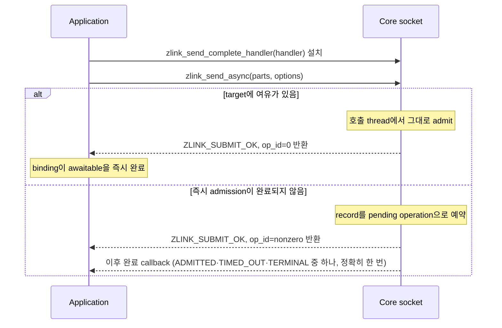

[English](https://zlink-systems.github.io/zlink/spec/core/socket/) | 한국어

<!-- zlink-nav:start -->
[Core 스펙 목차](../README.ko.md) | [이전: Runtime 경계](../08-runtime-boundary.ko.md) | [다음: PAIR](01-pair.ko.md)
<!-- zlink-nav:end -->

# Socket 공통

> **이 장이 정의하는 것** — 모든 socket type에 적용되는 공통 기반(옵션·API 형태)의
> 공개 계약. type별 세부사항은 각 socket 명세가 정의한다.

## 1. Socket 공통 개요

zlink의 [socket](../glossary.ko.md#socket)은 message를 주고받는 endpoint이며, 반드시 어떤
[Context](../glossary.ko.md#context)에 속한다. 이 문서는 모든 socket type에 적용되는 공통
기반 — 생성·연결·종료, 공통 옵션, 송수신 API의 형태와 thread 안전성 — 을 다룬다.
type별 명세(type 전용 옵션, data plane API, 동작 세부사항)는 별도 파일에 있다.

| socket type | 명세 |
|-----------|------|
| 01. PAIR | [pair.ko.md](01-pair.ko.md) |
| 02. PUB | [pub.ko.md](02-pub.ko.md) |
| 03. SUB | [sub.ko.md](03-sub.ko.md) |
| 04. XPUB | [xpub.ko.md](04-xpub.ko.md) |
| 05. XSUB | [xsub.ko.md](05-xsub.ko.md) |
| 06. DEALER | [dealer.ko.md](06-dealer.ko.md) |
| 07. ROUTER | [router.ko.md](07-router.ko.md) |
| 08. STREAM | [stream.ko.md](08-stream.ko.md) |

관련 계약의 소유 문서는 다음과 같다.

| 관련 계약 | 정의하는 문서 |
|---|---|
| type별 전용 옵션·data plane·동작 세부 | 위 표의 각 socket 명세 |
| Context 수명과 context 옵션 | [Context](../01-context.ko.md) |
| message lifecycle와 ownership | [Message](../02-message.ko.md) |
| Auto HWM budget 계산·admission | [Auto HWM](../systems/06-auto-hwm.ko.md) |
| 결과 enum 전체와 오류 표 | [Errors](../03-errors.ko.md) |

## 2. 스레드 안전성

공개 socket 핸들 API는 기본적으로 thread-safe하다. 다만 모든 API가 같은
비용 모델을 갖는 것은 아니다.

- `send`는 여러 thread에서 동시 호출을 허용하는 hot path다.
- `bind/connect/disconnect`, subscribe/unsubscribe, option/query, monitor는
  runtime에 호출 가능한 control path다. correctness는 보장되지만 실행
  순서는 내부 직렬화에 따라 결정될 수 있다.
- `close`는 fail-fast lifecycle gate를 사용한다. 다른 thread가 같은 핸들에서
  admitted API나 callback을 실행 중이면 `EBUSY`, close가 accepted된 뒤 새 API
  진입은 `ESHUTDOWN`이다.
- 예외는 소수만 남긴다. init-only 설정, callback context에서 금지된 일부
  reentrant API, 같은 `zlink_msg_t` instance의 동시 공유는 기본 허용 범위
  밖이다.

## 3. 수신 모델

socket type별 수신 모델은 아래와 같이 고정한다. 기본 모델은
`recv + poller`이며, 예외 type만 callback 기반 수신을 지원한다.

| socket type | 수신 표면 | 비고 |
|-----------|-----------|------|
| PAIR | `zlink_recv_part()` | part receive 전용 |
| DEALER | `zlink_recv_part()` (+ `zlink_dealer_request_part()` completion callback) | part receive data plane |
| SUB | `zlink_subscribe_part()` | topic part receive 전용 |
| XSUB | `zlink_subscribe_part()` | topic part receive 전용 |
| ROUTER | `zlink_router_recv_part()` (+ `zlink_router_request_part()` completion callback) | part receive data plane |
| STREAM | `zlink_recv_part()` / `zlink_recv_handler()` / `zlink_stream_packet_handler()` | 세 모드 중 하나 선택 (예외) |
| PUB | 해당 없음 | 송신 전용 |
| XPUB | `zlink_xpub_recv_part()` (구독 이벤트 recv-only) | 데이터 plane은 송신 |
| monitor / timer | recv / callback 모두 지원 | 관찰/유틸 계층 |

핵심 원칙은 다음과 같다.

- raw data-plane 수신은 recv + poller 조합이 기본이며, server 루프는
  `ZLINK_POLLIN`을 관찰한 뒤 recv 계열 함수로 데이터를 가져오는 방식을 쓴다.
- `DEALER`/`ROUTER`의 request completion callback은 data-plane receive가
  아니라 비동기 작업 완료 통지다. 이 둘은 역할이 다르므로 같은 범주로
  묶지 않는다.
- STREAM만은 예외다. raw transport 특성상 세 가지 수신 모드(raw recv,
  raw callback, packet callback) 중 하나를 선택할 수 있다. 한 핸들에서
  두 번째 모드로 전환하려 하면 `EBUSY`로 실패한다.

## 4. 타입과 상수

### Socket type

```c
typedef enum zlink_socket_type_t
{
    ZLINK_SOCKET_ANY    = 0,       // 예약된 wildcard 값 — 생성용 아님, 소비 API 없음
    ZLINK_SOCKET_PAIR   = 0x1001,
    ZLINK_SOCKET_PUB    = 0x1002,
    ZLINK_SOCKET_SUB    = 0x1003,
    ZLINK_SOCKET_DEALER = 0x1004,
    ZLINK_SOCKET_ROUTER = 0x1005,
    ZLINK_SOCKET_XPUB   = 0x1006,
    ZLINK_SOCKET_XSUB   = 0x1007,
    ZLINK_SOCKET_STREAM = 0x1008
} zlink_socket_type_t;
```

`ZLINK_SOCKET_ANY`는 예약된 wildcard 값이다. socket 생성에 사용하지 않으며 이를 소비하는
API도 없다. 실제 socket 생성에는 위에 표시된 정규화된 `ZLINK_SOCKET_*` 상수를 사용한다.

### 송신 flag

```c
typedef enum zlink_send_flags_t
{
    ZLINK_SEND_FLAGS_NONE     = 0,       // flag 없음; blocking 송신 동작
    ZLINK_SEND_FLAGS_DONTWAIT = 0x0001u  // non-blocking 모드; blocking 시 ZLINK_SUBMIT_BACKPRESSURED 반환
} zlink_send_flags_t;

#define ZLINK_DONTWAIT ZLINK_SEND_FLAGS_DONTWAIT  // 짧게 쓰는 공개 이름
```

### 수신 flag

```c
typedef enum zlink_recv_flags_t
{
    ZLINK_RECV_FLAGS_NONE     = 0,       // flag 없음; blocking 수신 동작
    ZLINK_RECV_FLAGS_DONTWAIT = 0x0001u  // non-blocking 수신; 수신할 message가 없으면 ZLINK_RECV_NO_DATA를 즉시 반환
} zlink_recv_flags_t;
```

`zlink_recv_part`, `zlink_subscribe_part`, socket별 `zlink_*_recv_part` 계열, 그리고
monitor `zlink_*_monitor_recv` 함수들이 이 flag를 사용한다.

### Message part flag

```c
typedef enum zlink_part_flag_t
{
    ZLINK_PART_FINAL = 0,  // 현재 part가 마지막
    ZLINK_PART_MORE = 1    // 같은 multipart message에 다음 part가 있음
} zlink_part_flag_t;
```

### rid 중복 정책

```c
typedef enum zlink_rid_duplicate_policy_t
{
    ZLINK_RID_DUPLICATE_REJECT = 0,   // 기존 pipe 유지, 새 중복 pipe를 등록하지 않음 (기본값)
    ZLINK_RID_DUPLICATE_HANDOVER = 1  // 같은 방향의 재연결 pipe가 기존 pipe를 인수
} zlink_rid_duplicate_policy_t;
```

`ZLINK_OPT_RID_DUPLICATE_POLICY`는 같은 local socket에 동일한 peer
routing id가 들어왔을 때의 정책을 정한다. 값은 `int`로 설정하며,
기본값은 `ZLINK_RID_DUPLICATE_REJECT`다.

`ZLINK_RID_DUPLICATE_REJECT`는 기존 pipe를 유지하고 새 중복 pipe를 등록하지
않는다. `ZLINK_RID_DUPLICATE_HANDOVER`에서는 같은 방향에서 다시 연결한 pipe가
기존 pipe를 인수한다. 서로 반대 방향의 pipe가 충돌하면 두 peer의 routing id를
비교해 양쪽이 같은 방향 하나를 선택한다.

이 옵션은 peer가 광고한 routing id를 관찰할 수 있는 socket에서만 의미가
있다. STREAM은 server가 연결별 4-byte routing id를 직접 만들기 때문에
이 옵션의 영향을 받지 않는다.

### 송신 재시도 모드

```c
typedef enum zlink_submit_retry_mode_t
{
    ZLINK_SUBMIT_RETRY_OFF = 0,           // 자동 재시도를 하지 않음
    ZLINK_SUBMIT_RETRY_LOCAL_FAILURE = 1  // peer queue에 넘기기 전의 local 실패만 재시도 가능
} zlink_submit_retry_mode_t;
```

`ZLINK_SUBMIT_RETRY_OFF`는 자동 재시도를 하지 않는다.
`ZLINK_SUBMIT_RETRY_LOCAL_FAILURE`는 송신을 peer queue에 넘기기 전에 발생한
local 실패만 재시도할 수 있음을 나타낸다. 이 모드는 peer 전달이나 처리
완료를 보장하지 않는다. 재시도 대상과 결과는 [§5 옵션의 송신 재시도](#송신-재시도)가
설명한다.

### 수신 flow state

```c
typedef enum zlink_receive_flow_state_t
{
    ZLINK_RECEIVE_FLOW_RUNNING = 0,  // 계속 보내라는 뜻
    ZLINK_RECEIVE_FLOW_PAUSED = 1    // 이 socket으로 새 message를 보내지 말라는 뜻
} zlink_receive_flow_state_t;
```

DEALER와 ROUTER socket이 paired [completion progress lane](../glossary.ko.md#completion-progress-lane)으로
자신에게 보내는 peer에게 알리는 receive-flow 상태다. `ZLINK_RECEIVE_FLOW_RUNNING`은
계속 보내라는 뜻이고 `ZLINK_RECEIVE_FLOW_PAUSED`는 이 socket으로 새 message를 보내지
말라는 뜻이다. 이 값은 counter가 아니라 socket 전체에 적용되는 절대 상태이므로, 이미
유지하는 상태를 다시 설정하면 아무것도 바꾸지 않고 성공한다. 이 lane은 DEALER와
ROUTER에만 있으며 결과 동작은 [DEALER](06-dealer.ko.md)와
[ROUTER](07-router.ko.md)가 소유한다.

### 송신 결과

```c
typedef enum zlink_submit_result_t
{
    /* Submit succeeded. */
    ZLINK_SUBMIT_OK = 0,                 // message가 성공적으로 송신됨

    /* Normal control-flow result. */
    ZLINK_SUBMIT_BACKPRESSURED = 1,      // 송신 queue가 가득 참 (HWM 도달)
    ZLINK_SUBMIT_NOT_CONNECTED = 2,      // 대상 경로나 peer가 아직 연결되지 않음
    ZLINK_SUBMIT_NOT_FOUND = 3,          // 대상 peer 또는 routed destination을 찾지 못함
    ZLINK_SUBMIT_NOT_ADMITTED = 13,      // target route는 식별했지만 handshake 또는 신규 outbound weight 같은 admission 정책이 submit을 거부함

    /* Runtime / lifecycle failure. */
    ZLINK_SUBMIT_TERMINATED = 4,         // context가 종료됨

    /* Caller contract violation. */
    ZLINK_SUBMIT_INVALID_HANDLE = 5,     // 핸들이 NULL이거나 유효하지 않음
    ZLINK_SUBMIT_INVALID_ARGUMENT = 6,   // API 계약에 맞지 않는 인자
    ZLINK_SUBMIT_NOT_SUPPORTED = 7,      // 지원하지 않는 작업 또는 flags
    ZLINK_SUBMIT_INVALID_STATE = 8,      // 핸들이 잘못된 상태에 있음
    ZLINK_SUBMIT_THREAD_VIOLATION = 9,   // 허용된 thread 모델을 위반함

    /* Internal failure. */
    ZLINK_SUBMIT_OUT_OF_MEMORY = 10,     // submit 준비 중 memory 할당 실패
    ZLINK_SUBMIT_SEQ_EXHAUSTED = 11,     // request sequence 공간이 소진됨
    ZLINK_SUBMIT_INTERNAL_ERROR = 12     // 내부 send/request/reply submit 오류
} zlink_submit_result_t;
```

send, request submit, reply submit API의 공개 결과를 정규화할 때
사용하는 기준 enum이다. exported C API는 이 enum을 직접 반환한다.
내부 구현 경로는 계속 상세 `errno`를 사용하고, exported API 경계에서 그
값을 이 공개 결과 계약으로 정규화한다.

### Request Completion

```c
typedef enum zlink_request_result_t
{
    /* Reply completed successfully. */
    ZLINK_REQUEST_OK = 0,                  // reply payload를 정상 수신함

    /* Completion failure visible to the requester. */
    ZLINK_REQUEST_TIMED_OUT       = 101,   // 설정된 시간 안에 reply가 도착하지 않음
    ZLINK_REQUEST_NOT_FOUND       = 102,   // 대상이 없어 error reply로 완료됨
    ZLINK_REQUEST_TERMINATED      = 103,   // terminal reply 전에 Context 또는 socket이 종료됨 (ETERM 또는 ESHUTDOWN)
    ZLINK_REQUEST_PROTOCOL_ERROR  = 104,   // reply metadata 또는 error reply payload가 잘못됨
    ZLINK_REQUEST_INTERNAL_ERROR  = 105,   // 더 세분화된 public bucket 없이 request completion이 실패함
    ZLINK_REQUEST_REJECTED        = 106,   // target이 request를 명시적으로 거부함
    ZLINK_REQUEST_CONFLICT        = 107,   // request가 현재 routing 또는 operation 상태와 충돌함
    ZLINK_REQUEST_BUSY            = 108,   // target이 바빠 지금은 request를 받을 수 없음
    ZLINK_REQUEST_NOT_CONNECTED   = 109,   // target에 대한 활성 연결 없음
    ZLINK_REQUEST_INVALID_ARGUMENT = 110,  // request에 잘못된 인자가 담김
    ZLINK_REQUEST_INVALID_STATE   = 111,   // target이 이 request를 거부하는 상태임
    ZLINK_REQUEST_NOT_SUPPORTED   = 112,   // target이 지원하지 않는 작업
    ZLINK_REQUEST_BACKPRESSURED   = 113    // non-blocking outbound admission이 capacity 부족으로 실패함
} zlink_request_result_t;
```

`zlink_reply_handler_fn`의 completion 결과를 정규화할 때 사용하는 기준
enum이다. callback은 `result_`를 `zlink_request_result_t` 값으로
직접 전달한다.

### 보안 메커니즘

```c
#define ZLINK_NULL 0   // 보안 메커니즘 없음 (기본값)
#define ZLINK_PLAIN 1  // PLAIN 사용자명/비밀번호 인증
```

### Callback 타입

#### zlink_socket_msg_handler_fn

```c
typedef void (*zlink_socket_msg_handler_fn) (
  const zlink_routing_id_t *source_rid_,
  zlink_msg_t *parts_,
  size_t part_count_,
  void *userdata_);
```

raw `STREAM`의 raw 수신 callback에 사용되는 타입이다. 소유
[I/O thread](../glossary.ko.md#io-thread)에서 호출되며, 모든 message part의
소유권이 callback으로 이전된다. 각 part는 정확히 한 번 닫거나 소비해야 한다.
`zlink_recv_handler()`와 함께 사용한다.

#### zlink_stream_packet_handler_fn

```c
typedef void (*zlink_stream_packet_handler_fn) (
  void *stream_,
  const zlink_routing_id_t *source_rid_,
  zlink_msg_t *header_,
  zlink_msg_t *body_,
  void *userdata_);
```

raw `STREAM`의 packet 단위 수신 callback 타입이다. `source_rid_`는 packet을
보낸 client 연결의 routing id를 가리키는 borrowed view이고, `header_`와
`body_`는 고정 framing 규약에 따라 조립된 packet의 header/body payload다.
길이가 0인 경우에도 NULL이 아닌 유효한 `zlink_msg_t`로 전달되며,
두 `msg_t`의 소유권은 callback으로 이전된다. `zlink_stream_packet_handler()`
와 함께 사용한다.

#### 송신 완료 타입

```c
typedef enum zlink_send_complete_result_t {
  ZLINK_SEND_ADMITTED = 0,     // record가 Core 송신 queue에 admit됨 (peer 수신 아님)
  ZLINK_SEND_TIMED_OUT = 201,  // operation별 timeout_ms 만료
  ZLINK_SEND_TERMINAL = 202    // 최종 실패; 사유는 terminal_errno
} zlink_send_complete_result_t;

typedef uint64_t zlink_send_op_id_t;

typedef struct zlink_send_complete_event_t {
  zlink_send_op_id_t op_id;                // pending operation id; completion event에서는 항상 nonzero
  void *userdata;                          // submit option에 넘긴 값을 그대로 돌려줌
  zlink_routing_id_t peer_rid;             // target identity — 항상 채워짐
  uint64_t transport_pair_id;              // routed target이 없는 socket에서는 0
  uint64_t transport_pair_generation;      // routed target이 없는 socket에서는 0
  zlink_send_complete_result_t result;
  int terminal_errno;                      // ADMITTED가 아닌 결과의 사유 errno (TIMED_OUT이면 ETIMEDOUT)
} zlink_send_complete_event_t;

typedef void (*zlink_send_complete_handler_fn) (
  void *subject_, const zlink_send_complete_event_t *event_,
  void *userdata_);

typedef struct zlink_send_async_options_t {
  uint32_t struct_size;
  uint32_t timeout_ms;
  void *userdata;
  const zlink_routed_submit_target_t *target;
} zlink_send_async_options_t;
```

`ZLINK_SEND_ADMITTED`는 record가 Core 송신 queue에 admit됐다는 뜻이다. peer가
받았다는 뜻이 아니므로 전달 확인이 필요하면 request/reply를 사용한다.
`ZLINK_SEND_TIMED_OUT`은 operation별 `timeout_ms` 만료이며 `terminal_errno`에 `ETIMEDOUT`을 기록한다.
`ZLINK_SEND_TERMINAL`은 최종 실패이며 사유는 `terminal_errno`에 담긴다.
취소와 socket close는 `ECANCELED`, context 종료는 `ETERM`, 그 밖에는 route
실패 errno다.

`struct_size`는 `sizeof(zlink_send_async_options_t)`와 같아야 하며, 다르면 submit이
`EINVAL`로 실패한다. `timeout_ms == 0`은 deadline 없음을 뜻한다. `op_id_out_`은 선택
사항이며, 전달한 경우 즉시 admission과 실패한 submit은 `0`, Core가 보관한 pending
operation은 nonzero id를 기록한다.

nonzero `op_id`는 Core가 부여하는 socket local 단조 증가 값이다. `0`은 즉시
admission되어 callback이 필요 없다는 뜻이며 cancel 대상이 아니다. `userdata`는
submit option에 넘긴 값을 그대로 돌려준다. target identity field는 확정된
pending key를 나타낸다. routed target이 없는 socket에서는 `peer_rid`가 비어
있고 두 transport-pair field가 0이다. operation id는 재사용하지 않는다.
socket local `uint64_t` sequence가 소진된 뒤 pending id가 필요한 submit은
`EOVERFLOW`와 함께 `ZLINK_SUBMIT_SEQ_EXHAUSTED`를 반환하고 소유권은
호출자에게 남긴다.

#### zlink_reply_handler_fn

```c
typedef void (*zlink_reply_handler_fn) (
  zlink_request_result_t result_,
  zlink_msg_t *parts_,
  size_t part_count_,
  void *userdata_);
```

비동기 request-reply 완료 callback이다. 응답이 도착하거나 요청이 timeout되면
호출된다. timeout 시 `result_`는 `ZLINK_REQUEST_TIMED_OUT`이고 `parts_`는
NULL이다. 성공 시 `result_`는 `ZLINK_REQUEST_OK`이고 모든 message part의
소유권이 callback으로 이전된다. 유효한 wire error reply이면 `result_`는 첫 4 byte Big Endian
errno를 매핑한 non-OK 값이고, `parts_`는 errno part 뒤의 payload이며 그 message 소유권도
callback으로 이전된다. Error reply의 errno part가 없거나 크기가 4 byte가 아니거나 값이 `0`이면
`result_`는 `ZLINK_REQUEST_PROTOCOL_ERROR`이고 `part_count_`는 `0`이다. `result_`는 submit
실패가 아니라 `zlink_request_result_t` 값으로 request completion 결과를 나타낸다. 이 callback은
data-plane receive가 아니라 async operation completion 통지 축이며, `DEALER`/`ROUTER`의
request API에서만 사용된다.

socket 하나에서 callback이 끝나지 않은 request는 최대 65,536건이다. Core는
request를 전송하기 전에 completion slot을 예약한다. slot이 없으면 submit 결과는
`ZLINK_SUBMIT_BACKPRESSURED`이고 `errno`는 `EAGAIN`이다. reply, timeout과
disconnect completion은 같은 예약을 사용하므로 owner thread가 callback 처리를
중단해도 control queue가 이 상한을 넘어 증가하지 않는다.

## 5. 옵션

socket 옵션은 type별 전용 enum과 함수를 사용한다. 공통 옵션은
`zlink_set_option()` / `zlink_get_option()`으로, socket 타입별 옵션은
`zlink_set_router_option()`, `zlink_set_dealer_option()`,
`zlink_set_pub_option()`, `zlink_set_sub_option()`,
`zlink_set_stream_option()` 등 전용 함수로 설정한다.
ROUTING_ID는 `zlink_set_routing_id()` / `zlink_get_routing_id()` 전용
함수를 사용한다. TLS server/client role의 표준 설정은 `zlink_set_tls_server()` /
`zlink_set_tls_client()`를 사용하고, `ZLINK_OPT_TLS_*`는 지원하는 raw network socket의 개별 TLS 값을
설정하거나 조회할 때만 사용한다. SUBSCRIBE/UNSUBSCRIBE는 `zlink_set_subscription()` /
`zlink_unset_subscription()` 전용 함수를 사용한다.

### 공통 옵션 (`zlink_option_t`)

```c
typedef enum zlink_option_t {
  ZLINK_OPT_AFFINITY                  = 0x3001,  // I/O thread affinity bitmask (uint64_t)
  ZLINK_OPT_RATE                      = 0x3003,  // multicast 전송률 (kbps, int)
  ZLINK_OPT_RECOVERY_IVL              = 0x3004,  // multicast 복구 간격 (ms, int)
  ZLINK_OPT_SNDBUF                    = 0x3005,  // kernel 송신 buffer 크기 (int; -1=OS 기본값 유지, 0 이상=OS에 크기 요청)
  ZLINK_OPT_RCVBUF                    = 0x3006,  // kernel 수신 buffer 크기 (int; -1=OS 기본값 유지, 0 이상=OS에 크기 요청)
  ZLINK_OPT_FD                        = 0x3007,  // file descriptor (zlink_fd_t, 읽기 전용)
  ZLINK_OPT_EVENTS                    = 0x3008,  // 이벤트 상태 bitmask (int, 읽기 전용)
  ZLINK_OPT_TYPE                      = 0x3009,  // socket type (int, 읽기 전용)
  ZLINK_OPT_LINGER                    = 0x300A,  // 종료 시 대기 (ms, int; -1=무한, 0=즉시)
  ZLINK_OPT_RECONNECT_IVL             = 0x300B,  // 초기 재연결 간격 (ms, int)
  ZLINK_OPT_BACKLOG                   = 0x300C,  // listener backlog (int)
  ZLINK_OPT_RECONNECT_IVL_MAX         = 0x300D,  // 최대 재연결 간격 (ms, int; 0=IVL만 사용)
  ZLINK_OPT_MAXMSGSIZE                = 0x300E,  // 최대 인바운드 message 크기 (int64_t; -1=무제한)
  ZLINK_OPT_SNDHWM                    = 0x300F,  // directional send pipe의 accounted byte HWM (uint64_t; 기본값 4,096,000, 0=무제한)
  ZLINK_OPT_RCVHWM                    = 0x3010,  // directional receive pipe의 accounted byte HWM (uint64_t; 기본값 4,096,000, 0=무제한)
  ZLINK_OPT_MULTICAST_HOPS            = 0x3011,  // multicast TTL (int)
  ZLINK_OPT_RCVTIMEO                  = 0x3012,  // 수신 timeout (ms, int; 기본 1000; 명시적으로 -1 설정 시 무한)
  ZLINK_OPT_SNDTIMEO                  = 0x3013,  // 송신 timeout (ms, int; 기본 1000; 명시적으로 -1 설정 시 무한)
  ZLINK_OPT_LAST_ENDPOINT             = 0x3014,  // binding된 endpoint (string, 읽기 전용)
  ZLINK_OPT_TCP_KEEPALIVE             = 0x3015,  // SO_KEEPALIVE (int; -1=OS, 0=off, 1=on)
  ZLINK_OPT_TCP_KEEPALIVE_CNT         = 0x3016,  // TCP_KEEPCNT (int; -1=OS 기본값)
  ZLINK_OPT_TCP_KEEPALIVE_IDLE        = 0x3017,  // TCP_KEEPIDLE (초, int; -1=OS 기본값)
  ZLINK_OPT_TCP_KEEPALIVE_INTVL       = 0x3018,  // TCP_KEEPINTVL (초, int; -1=OS 기본값)
  ZLINK_OPT_IMMEDIATE                 = 0x3019,  // 완료된 연결에만 message queue 사용 (int)
  ZLINK_OPT_IPV6                      = 0x301A,  // socket에서 IPv6 활성화 (int; 0=off, 양수=on, getter는 0/1 반환)
  ZLINK_OPT_CONFLATE                  = 0x301B,  // topic당 최신 message만 유지 (int)
  ZLINK_OPT_TOS                       = 0x301C,  // IP Type-of-Service 값 (int)
  ZLINK_OPT_HANDSHAKE_IVL             = 0x301D,  // ZMTP handshake timeout (ms, int)
  ZLINK_OPT_BLOCKY                    = 0x301E,  // socket option API가 지원하지 않는 식별자 — 아래 설명 참조
  ZLINK_OPT_INVERT_MATCHING           = 0x3020,  // topic 매칭 반전 (int)
  ZLINK_OPT_CONNECT_TIMEOUT           = 0x3024,  // 연결 timeout (ms, int)
  ZLINK_OPT_TCP_MAXRT                 = 0x3025,  // 최대 TCP 재전송 timeout (ms, int)
  ZLINK_OPT_MULTICAST_MAXTPDU         = 0x3026,  // 최대 multicast TPDU 크기 (int)
  ZLINK_OPT_BINDTODEVICE              = 0x3027,  // network interface binding (string)
  ZLINK_OPT_TLS_CERT                   = 0x3028,  // PEM 인코딩 TLS 인증서 경로 (string)
  ZLINK_OPT_TLS_KEY                    = 0x3029,  // PEM 인코딩 TLS 개인 키 경로 (string)
  ZLINK_OPT_TLS_CA                     = 0x302A,  // PEM 인코딩 CA 인증서 번들 경로 (string)
  ZLINK_OPT_TLS_VERIFY                 = 0x302B,  // TLS peer 검증 활성화 (int; 0=off, 양수=on, getter는 0/1 반환)
  ZLINK_OPT_TLS_REQUIRE_CLIENT_CERT    = 0x302C,  // client 인증서 요구 (int; 0=off, 양수=on, getter는 0/1 반환)
  ZLINK_OPT_TLS_HOSTNAME               = 0x302D,  // SNI 및 인증서 검증용 hostname (string)
  ZLINK_OPT_TLS_TRUST_SYSTEM           = 0x302E,  // 시스템 CA 인증서 저장소 신뢰 (int; 0=off, 양수=on, getter는 0/1 반환)
  ZLINK_OPT_TLS_PASSWORD               = 0x302F,  // 개인 키 암호 (string)
  ZLINK_OPT_ZMP_METADATA               = 0x3030,  // ZMP metadata 첨부 on/off (int; 0=off, 양수=on, getter는 0/1 반환)
  ZLINK_OPT_TCP_NODELAY                = 0x3031,  // TCP_NODELAY 활성화 (int; 0=off, 양수=on, getter는 0/1 반환)
  ZLINK_OPT_RID_DUPLICATE_POLICY       = 0x3033,  // peer routing id 중복 정책 (int; 기본 REJECT — §4 rid 중복 정책 참조)
  ZLINK_OPT_SUBMIT_RETRY_MODE          = 0x3037,  // local submit 실패 재시도 모드 (int; ZLINK_SUBMIT_RETRY_OFF 또는 ZLINK_SUBMIT_RETRY_LOCAL_FAILURE, raw socket 기본값 off)
  ZLINK_OPT_SUBMIT_RETRY_TIMEOUT       = 0x3038,  // local submit 실패 재시도 예산 (ms, int; raw socket 기본값 0, 0이면 재시도 없음)
  ZLINK_OPT_SUBMIT_RETRY_ATTEMPTS      = 0x3039,  // 최초 submit 이후 추가 재시도 횟수 (int; raw socket 기본값 0, 현재 상한 16)
  ZLINK_OPT_SEND_PENDING_MAX_MSGS      = 0x303A,  // async send pending 건수 상한 (uint64_t, 0 unlimited, 기본 0)
  ZLINK_OPT_SEND_PENDING_MAX_BYTES     = 0x303B   // async send pending byte 상한 (uint64_t, 0 unlimited, 기본 0)
} zlink_option_t;
```

`zlink_set_option()` / `zlink_get_option()`과 함께 사용하며,
raw socket과 discovery에 적용된다.

`ZLINK_OPT_BLOCKY`는 socket option API가 지원하지 않는 식별자다.
`zlink_set_option()`/`zlink_get_option()`은 `ZLINK_CONFIG_NOT_SUPPORTED`/`ENOTSUP`을
반환하며, context 종료 동작은 `ZLINK_CTX_OPT_BLOCKY`로 설정한다 (`int`, 0=off, 양수=on,
getter는 0/1 반환).

#### Transport/Buffer

두 [HWM](../glossary.ko.md#hwm) `uint64_t` option(`ZLINK_OPT_SNDHWM`, `ZLINK_OPT_RCVHWM`)은
`zlink_set_option()`과 `zlink_get_option()`에서 정확히
`sizeof(uint64_t)` byte를 사용해야 한다. 4-byte 값은
`ZLINK_CONFIG_INVALID_ARGUMENT`로 거절한다. 제거된 socket option 값 `0x3034`도
알 수 없는 option이므로 `ZLINK_CONFIG_INVALID_ARGUMENT`와 `EINVAL`로 실패한다.
pipe admission은 실제로 보관한 byte를 계산한다.

HWM은 각 HWM-controlled application directional pipe에 적용한다. DEALER·ROUTER의
completion progress lane은 terminal reply와
error reply 전용이며 auto HWM, manual `SNDHWM`·`RCVHWM`, LWM과 Core budget reservation을
적용하지 않는다. accounted byte가 limit에 도달하면 receiver가 충분한 byte credit을
반환할 때까지 이후 write가 대기한다 — 이 제한 동작이
[backpressure](../glossary.ko.md#backpressure)다. 비어 있는 pipe에는
accounted 크기가 HWM보다 큰 message 한 건을 허용할 수 있다. 따라서 유효한 큰
message를 HWM이 작다는 이유만으로 모두 거절하지 않는다. 이 message도
`ZLINK_OPT_MAXMSGSIZE`를 만족해야 하며, 한 건을 허용한 뒤에는 이후 write가 대기한다.
`ZLINK_OPT_MAXMSGSIZE`가 무제한인 방향에서도 admission 시점에 전체 accounted 크기를 아는
complete message 한 건, 즉 single-part 또는 total-known message에만 이 예외를 적용한다.
최종 전체 크기를 모르는 incremental multipart에는 첫 `MORE` frame부터 일반 byte HWM을 적용하므로
frame이 제한 없이 누적되지 않는다. 이 예외를 위해 known-total metadata나 transaction 전체
reservation을 추가하지 않는다.

admission은 frame 단위로 charge한다. 일반 frame의 charge는 payload byte 수에
`sizeof(zlink_msg_t)`를 더한 값이므로 빈 frame도 비용이 0이 아니고, 작은 frame을 많이
보관한 pipe는 payload 합계보다 먼저 HWM에 도달한다. delimiter, join과 leave frame은
application payload가 없으므로 `sizeof(zlink_msg_t)` metadata 비용만 charge한다.
frame이 pipe에서 빠질 때 같은 charge를 되돌려 준다.

low water mark는 pipe가 대기 중인 writer에게 read credit을 돌려주는 byte 수준이다.
기본값은 해당 방향에 적용된 HWM의 `ceil(hwm_bytes / 2)`다. pipe는 low water mark
hint를 가질 수도 있다. hint는 그 기본값보다 낮을 때만 사용하며, 기본값 이상인 hint는
기본값을 그대로 둔다. HWM 이상인 hint는 `hwm_bytes - 1`로 clamp하고, clamp한 값이 `1`
미만이면 `1`로 만들므로 결과는 항상 `1 .. hwm_bytes - 1` 범위 안에 있다. hint `0`은
hint가 없다는 뜻이다. 무제한 HWM에는 low water mark가 없다.

Core는 보통 이 low water mark에서 credit을 묶어서 반환한다. sender가 실제 HWM에
도달한 경우에는 이미 읽힌 누적 byte를 직접 확인하고, 그 뒤 receiver가 현재 보이는 입력을
모두 읽으면 LWM 전에도 한 번 credit을 반환하고 대기 중인 writer를 깨울 수 있다. 이
복구는 HWM에 도달한 sender에만 적용하므로 낮은 queue depth의 정상 message마다
cross-thread command를 만들지 않는다. 기다리는 writer가 없는 pipe를 receiver가 비워도
wakeup을 보내지 않는다. 이 pipe 기준은 Framework의 receive 재개 기준과 별개다.

#### 송신 재시도

submit retry는 `ENOTCONN`, `EHOSTUNREACH` 또는 `ECONNREFUSED`로 분류되는 local
submit 실패만 짧게 다시 시도한다. locally initiated paired endpoint의 blocking
submit은 pair 검증이 끝날 때까지 이 연결 오류를 재시도 대상으로 처리한다. 대기
예산이나 시도 횟수가 끝나면 마지막 시도의 연결 실패 errno를 보존해 공개 result로
정규화한다. `ENOTCONN`과 `EHOSTUNREACH`는 `ZLINK_SUBMIT_NOT_CONNECTED`,
`ECONNREFUSED`는 `ZLINK_SUBMIT_NOT_ADMITTED`로 반환한다.
`ZLINK_DONTWAIT` 호출, backpressure(`EAGAIN`), admission 거절, 인자 오류, request
submit 성공 뒤의 reply timeout은 retry 대상이 아니다.

### 전용 함수 (옵션 enum이 아님)

- **Routing ID**: `zlink_set_routing_id()` / `zlink_get_routing_id()`
- **TLS**: `zlink_set_tls_server()` / `zlink_set_tls_client()`
- **Subscribe/Unsubscribe**: `zlink_set_subscription()` / `zlink_unset_subscription()`

## 6. 함수

### zlink_socket

socket을 생성한다.

```c
ZLINK_EXPORT void *zlink_socket (void *context_, zlink_socket_type_t type_);
```

지정된 context 내에서 새 socket을 생성한다. `type_` 매개변수는 messaging pattern을
선택한다. raw socket의 수신 모델은 타입별로 고정된다. `PAIR`, `DEALER`,
`SUB`, `XSUB`는 part receive를 사용하며, `ROUTER`는
`zlink_router_recv_part()`로 수신한다. `STREAM`만이 예외 타입으로,
raw part receive / raw callback
(`zlink_recv_handler()`) / packet callback
(`zlink_stream_packet_handler()`) 세 모드 중 하나를 선택해 사용할 수
있다. socket은 context가 종료되기 전에 `zlink_close()`로 닫아야 한다.

**반환값:** 성공 시 socket 핸들, 실패 시 `NULL` (errno가 설정됨).

**에러:** socket 타입이 유효하지 않으면 `EINVAL`. 최대 socket 수에 도달하면
`EMFILE`. Context가 종료된 경우 `ETERM`.

**스레드 안전성:** Context에 대해 스레드 안전하다.

**참고:** `zlink_close`, `zlink_ctx_new`

---

### zlink_recv_handler

raw `STREAM` socket에 raw 수신 callback을 부착한다.

```c
ZLINK_EXPORT zlink_handler_result_t zlink_recv_handler (
  void *s_, zlink_socket_msg_handler_fn handler_, void *userdata_);
```

raw `STREAM` 전용 direct receive callback 등록 함수다. 지원 대상은
raw `STREAM` 뿐이며, 다른 subject(PAIR, DEALER 등)는 `ENOTSUP`로 실패한다.
attach 이후 같은 핸들의 `zlink_recv_part()`, `zlink_stream_packet_handler()`,
data-plane `ZLINK_POLLIN`은 `errno=EBUSY`로 실패한다. 동일 핸들에 대한
두 번째 attach도 `errno=EBUSY`다.

자세한 계약은 [stream.ko.md](08-stream.ko.md)를 참조한다.

**반환값:** 성공 시 `ZLINK_HANDLER_OK`. 실패 시에는 `zlink_handler_result_t`
값을 반환한다. 상세 내부 errno는 진단을 위해 `zlink_errno()`로 유지된다.

**참고:** `zlink_stream_packet_handler`, `zlink_socket`, `zlink_close`

---

### zlink_recv_part

raw socket에서 message part 하나를 수신한다.

```c
ZLINK_EXPORT zlink_recv_result_t zlink_recv_part (void *s_,
                                                  const zlink_routing_id_t **source_rid_out_,
                                                  zlink_msg_t *part_out_,
                                                  zlink_part_flag_t *has_more_out_,
                                                  zlink_recv_flags_t flags_);
```

지원 타입은 raw `PAIR`, `DEALER`, `STREAM`이다. raw `PUB`, `XPUB`,
`SUB`, `XSUB`, `ROUTER`에는 사용할 수 없으며
`ZLINK_RECV_NOT_SUPPORTED`를 반환하고 `errno`를 `ENOTSUP`로 설정한다.
`part_out_`은 초기화된 message여야 하고 `part_out_`과 `has_more_out_`은
필수다.

성공하면 수신한 part의 소유권이 호출자에게 이전되므로 호출자는
`zlink_msg_close(part_out_)`를 정확히 한 번 호출해야 한다. 실패하면 part
소유권은 이전되지 않는다. `source_rid_out_`은 선택 사항이다. `STREAM`은
Core가 소유한 routing ID 보기를 반환하고 `PAIR`와 `DEALER`는 `NULL`을
반환한다. 이 보기는 다음 raw 수신 호출 뒤에도 유지해야 한다면 호출자가
복사해야 한다. `*has_more_out_`은 다음 part가 있으면 `ZLINK_PART_MORE`,
마지막 part이면 `ZLINK_PART_FINAL`이다.

한 multipart message의 첫 part부터 마지막 part까지 같은 thread에서 이 함수로
계속 수신해야 한다. `ZLINK_RECV_FLAGS_DONTWAIT`를 사용하고 수신할 part가
없으면 `ZLINK_RECV_NO_DATA`를 반환하고 `errno`를 `EAGAIN`으로 설정한다.

---

### zlink_close

socket을 닫고 자원을 해제한다.

```c
ZLINK_EXPORT zlink_close_result_t zlink_close (void *s_);
```

socket을 닫고 관련된 모든 자원을 해제한다. 송신 대기열에 남아 있는 message는
`ZLINK_OPT_LINGER` 설정에 따라 폐기되거나 송신된다. 공개 핸들은 계층적 계약을
따른다: hot-path send 작업은 여러 thread에서 동시 호출이 가능하고, 저빈도
제어 경로는 정확성을 위해 직렬화되며, close/destroy는 엄격한 lifecycle gate를
사용한다. 다른 thread에서 동일 핸들에 대해 callback이나 API 호출이 진행 중이면
`errno=EBUSY`로 실패한다. close가 accepted된 뒤 새 API 진입은
`errno=ESHUTDOWN`으로 실패한다. send-completion 또는 monitor callback 내에서의
self-close는 callback 에필로그까지 지연된다. 단, raw STREAM의 message·packet
callback 안에서의 self-close는 지연되지 않고 `ZLINK_CLOSE_BUSY`, `errno == EBUSY`로
실패한다 ([Socket — STREAM](08-stream.ko.md) 참조).

**반환값:** 성공 시 `ZLINK_CLOSE_OK`, 실패 시 `zlink_close_result_t` 값. `zlink_errno()`는 진단용 내부 errno를 그대로 유지한다.

**에러:** pointer가 유효하지 않으면 `EFAULT`, opaque value가 stale 상태이면 `ESTALE`.
callback이나 작업이 진행 중이면 `EBUSY`.

**참고:** `zlink_socket`

---

### zlink_set_option

공통 옵션을 설정한다.

```c
ZLINK_EXPORT zlink_config_result_t zlink_set_option (void *handle_,
                      zlink_option_t option_,
                      const void *optval_,
                      size_t optvallen_);
```

공통 옵션을 설정한다. `handle_`은 raw socket 또는 discovery다.
`option_` 매개변수는 `zlink_option_t` enum 값이다. `optval_`
pointer는 값을 제공하고 `optvallen_`은 크기를 byte 단위로 지정한다.
`ZLINK_OPT_SNDHWM`과 `ZLINK_OPT_RCVHWM`은 정확한 `uint64_t` 값을 요구한다.

raw socket과 discovery의 설정 시점은 각 option 계약을 따른다.

**반환값:** 성공 시 `ZLINK_CONFIG_OK`, 실패 시 `zlink_config_result_t` 값. `zlink_errno()`는 진단용 내부 errno를 그대로 유지한다.

**에러:** 옵션을 알 수 없거나 값이 범위를 벗어나거나 byte-count option의 크기가
정확하지 않으면 `EINVAL`. Context가 종료된 경우 `ETERM`.

**참고:** `zlink_get_option`

---

### zlink_get_option

공통 옵션을 조회한다.

```c
ZLINK_EXPORT zlink_config_result_t zlink_get_option (void *handle_,
                      zlink_option_t option_,
                      void *optval_,
                      size_t *optvallen_);
```

공통 옵션의 현재 값을 가져온다. `handle_`은 raw socket 또는 discovery다. 두 HWM
byte-count option에는 `uint64_t` output buffer가 필요하고, 호출할 때
`*optvallen_`이 정확히 `sizeof(uint64_t)`여야 한다. 더 큰 임시 buffer나 이전
4-byte 크기를 포함해 그 밖의 크기는 값을 잘라 쓰거나 일부만 채우지 않고
`ZLINK_CONFIG_INVALID_ARGUMENT`와 `errno == EINVAL`로 실패한다. 성공하면
`*optvallen_`은 `sizeof(uint64_t)`를 유지한다.

**반환값:** 성공 시 `ZLINK_CONFIG_OK`, 실패 시 `zlink_config_result_t` 값. `zlink_errno()`는 진단용 내부 errno를 그대로 유지한다.

**참고:** `zlink_set_option`

---

### zlink_socket_set_receive_flow_state

이 socket의 receive-flow 상태를 설정하고 paired completion lane으로 동기화한다.

```c
ZLINK_EXPORT zlink_config_result_t zlink_socket_set_receive_flow_state (
  void *handle_, zlink_receive_flow_state_t state_);
```

`state_`를 socket 전체의 receive-flow 상태로 저장하고, paired DEALER/ROUTER
completion lane으로 연결된 모든 peer에게 보낸다. 이 호출은 socket을 소유한
runtime thread가 local 상태를 저장한 시점에 완료되며 peer가 관측할 때까지
기다리지 않는다. 현재 상태를 다시 설정하면 성공하고 새로 보내는 것은 없다.

**반환값:** 성공 시 `ZLINK_CONFIG_OK`이며 현재 상태를 다시 설정한 경우도
포함한다. completion lane이 없는 socket 유형은 `ZLINK_CONFIG_NOT_SUPPORTED`를
반환하고 기존 byte HWM과 transport backpressure를 그대로 유지한다. 전체 결과
표는 [Errors](../03-errors.ko.md)가 소유한다.

**참고:** `zlink_monitor_status`

---

### zlink_set_routing_id

socket의 routing identity를 설정한다.

```c
ZLINK_EXPORT zlink_config_result_t zlink_set_routing_id (void *handle_,
                           const void *data_,
                           size_t size_);
```

raw socket의 routing ID를 설정한다. 길이는 1..255 bytes이며 값은 binary-safe하다. bind 또는 connect 전에
설정한다. 다른 핸들 종류는
`ZLINK_CONFIG_NOT_SUPPORTED`, `errno == ENOTSUP`이다. raw `STREAM`은 예외다 —
Core가 연결별 4-byte routing ID를 발급하므로 이 함수로 설정하면
`ZLINK_CONFIG_INVALID_ARGUMENT`, `errno == EINVAL`로 거절한다.
caller가 routing ID를 설정하지 않으면 Core는 socket 생성 시 RFC 4122 UUID v4 bit layout의 16-byte binary
routing ID를 발급한다. 이 기본값은 UUID 문자열이 아니라 raw 16 bytes다.

**반환값:** 성공 시 `ZLINK_CONFIG_OK`, 실패 시 `zlink_config_result_t` 값. `zlink_errno()`는 진단용 내부 errno를 그대로 유지한다.

**참고:** `zlink_get_routing_id`

---

### zlink_get_routing_id

socket의 routing identity를 조회한다.

```c
ZLINK_EXPORT zlink_config_result_t zlink_get_routing_id (void *handle_,
                           zlink_routing_id_t *out_);
```

raw socket에 설정되었거나 Core가 자동 발급한 routing ID를 caller-owned `zlink_routing_id_t`에 복사한다.

**반환값:** 성공 시 `ZLINK_CONFIG_OK`, 실패 시 `zlink_config_result_t` 값. `zlink_errno()`는 진단용 내부 errno를 그대로 유지한다.

**참고:** `zlink_set_routing_id`

---

### zlink_set_tls_server

서버 측 TLS를 구성한다.

```c
ZLINK_EXPORT zlink_config_result_t zlink_set_tls_server (void *handle_,
                           const char *cert_,
                           const char *key_,
                           int require_client_cert_);
```

server socket에 TLS 인증서, 개인 키를 설정하고, client 인증서 요구 여부를
지정한다.

이 함수는 TLS를 지원하는 raw server socket에 적용된다. 지원하지 않는 raw socket type과 다른 핸들은
`ZLINK_CONFIG_NOT_SUPPORTED`, `errno == ENOTSUP`이다.

**반환값:** 성공 시 `ZLINK_CONFIG_OK`, 실패 시 `zlink_config_result_t` 값. `zlink_errno()`는 진단용 내부 errno를 그대로 유지한다.

**참고:** `zlink_set_tls_client`, `zlink_bind`

---

### zlink_set_tls_client

클라이언트 측 TLS를 구성한다.

```c
ZLINK_EXPORT zlink_config_result_t zlink_set_tls_client (void *handle_,
                           const char *ca_cert_,
                           const char *hostname_,
                           int trust_system_);
```

client socket에 CA 인증서, hostname(SNI 및 인증서 검증용), 시스템 CA
저장소 신뢰 여부를 설정한다.

이 함수는 TLS를 지원하는 raw client socket에 적용된다. 지원하지 않는 raw socket type과 다른 핸들은
`ZLINK_CONFIG_NOT_SUPPORTED`, `errno == ENOTSUP`이다.

**반환값:** 성공 시 `ZLINK_CONFIG_OK`, 실패 시 `zlink_config_result_t` 값. `zlink_errno()`는 진단용 내부 errno를 그대로 유지한다.

**참고:** `zlink_set_tls_server`, `zlink_connect`

---

### zlink_bind

socket을 주소에 binding한다.

```c
ZLINK_EXPORT zlink_bind_result_t zlink_bind (void *s_, const char *addr_);
```

socket을 local endpoint에 binding한다. endpoint 문자열은
`transport://address` 형식을 사용하며, 지원되는 `transport`는 다음과 같다:

- `tcp://interface:port` 또는 `tcp://*:port`
- `inproc://name` (process 내 직접 연결, in-process transport)
- `ipc://pathname` (process 간, POSIX 전용)
- `ws://interface:port` (WebSocket)
- `tls://interface:port` (TLS 암호화 TCP)

socket은 여러 endpoint에 binding할 수 있다. TCP의 경우 port 0을 지정하면
시스템이 임시 port를 할당한다. 실제 endpoint를 가져오려면
`ZLINK_OPT_LAST_ENDPOINT`를 사용한다.

**반환값:** 성공 시 `ZLINK_BIND_OK`, 실패 시 `zlink_bind_result_t` 값. `zlink_errno()`는 진단용 내부 errno를 그대로 유지한다.

**에러:** 주소가 이미 사용 중이면 `EADDRINUSE`. interface가 존재하지 않으면
`EADDRNOTAVAIL`. `transport`가 지원되지 않으면 `EPROTONOSUPPORT`.

**참고:** `zlink_connect`, `zlink_unbind`

---

### zlink_connect

socket을 원격 주소에 연결한다.

```c
ZLINK_EXPORT zlink_connect_result_t zlink_connect (void *s_, const char *addr_);
```

socket을 원격 endpoint에 연결한다. endpoint 형식은 `zlink_bind()`와
동일하다. socket은 여러 endpoint에 연결할 수 있으며, peer가 사용 불가능해지면
library가 자동으로 재연결을 처리한다.

**반환값:** 성공 시 `ZLINK_CONNECT_OK`, 실패 시 `zlink_connect_result_t` 값. `zlink_errno()`는 진단용 내부 errno를 그대로 유지한다.

**참고:** `zlink_bind`, `zlink_disconnect`

---

### zlink_unbind

socket의 주소 binding을 해제한다.

```c
ZLINK_EXPORT zlink_connect_result_t zlink_unbind (void *s_, const char *addr_);
```

이전에 설정된 binding을 제거한다.

**반환값:** 성공 시 `ZLINK_CONNECT_OK`, 실패 시 `zlink_connect_result_t` 값. `zlink_errno()`는 진단용 내부 errno를 그대로 유지한다.

**참고:** `zlink_bind`

---

### zlink_disconnect

socket의 원격 주소 연결을 해제한다.

```c
ZLINK_EXPORT zlink_connect_result_t zlink_disconnect (void *s_, const char *addr_);
```

이전에 설정된 연결을 제거한다.

**반환값:** 성공 시 `ZLINK_CONNECT_OK`, 실패 시 `zlink_connect_result_t` 값. `zlink_errno()`는 진단용 내부 errno를 그대로 유지한다.

**참고:** `zlink_connect`

---

### zlink_disconnect_rid

socket에 연결된 peer를 routing id로 찾아 종료한다.

```c
ZLINK_EXPORT zlink_connect_result_t zlink_disconnect_rid (
  void *s_,
  const zlink_routing_id_t *peer_rid_);
```

`peer_rid_`는 비어 있으면 안 된다. 성공하면 해당 peer pipe는 비동기
종료 절차에 들어간다. 성공 반환은 remote peer가 종료 이벤트를 이미
처리했다는 뜻이 아니다.

ROUTER와 STREAM은 routing map을 사용해 대상을 찾는다. STREAM에서는
`peer_rid_`가 반드시 4-byte 연결 routing id여야 한다. 그 외 socket은
현재 연결된 pipe의 source routing id snapshot에서 일치하는 peer를 찾는다.
동일한 routing id가 둘 이상이면 대상을 확정할 수 없으므로 실패한다.

**반환값:** 성공 시 `ZLINK_CONNECT_OK`. 대상 없음은
`ZLINK_CONNECT_NOT_FOUND`, 중복 routing id는 `ZLINK_CONNECT_CONFLICT`,
lifecycle 소유권 충돌은 `ZLINK_CONNECT_BUSY`다. `zlink_errno()`는
진단용 내부 errno를 그대로 유지한다.

**참고:** `zlink_disconnect`, `ZLINK_OPT_RID_DUPLICATE_POLICY`

---

### zlink_disconnect_transport_pair

monitor 이벤트에서 얻은 transport pair identity와 일치하는 연결만
비동기 종료 대상으로 지정한다.

```c
ZLINK_EXPORT zlink_connect_result_t zlink_disconnect_transport_pair (
  void *s_, uint64_t transport_pair_id_, uint64_t transport_pair_generation_);
```

`transport_pair_id_`와 `transport_pair_generation_`은 종료할 연결의 monitor
이벤트에서 복사해야 한다. 이 함수는 해당 pair에 속한 모든 lane을 종료
대상으로 지정하며, 같은 peer routing id를 사용하는 다른 연결에는 영향을
주지 않는다. 두 값 중 하나라도 0이면 잘못된 인자이며, 이미 제거된
identity를 지정하면 `ZLINK_CONNECT_NOT_FOUND`를 반환한다.

**반환값:** 하나 이상의 lane을 종료 대상으로 지정하면
`ZLINK_CONNECT_OK`를 반환한다. 그 밖의 경우에는
`zlink_connect_result_t` 오류를 반환하고, 자세한 원인은 `zlink_errno()`로
확인한다.

**참고:** `zlink_disconnect_rid`, `zlink_socket_monitor_recv`

---

### 비동기 송신 admission

완전한 multipart record 하나를 Core에 인계한다. 즉시 admission은 반환값으로
완료한다. nonzero operation id를 받은 operation만 완료 통지를 정확히 한 번
받으며, 여기에는 HWM/FIFO admission을 위해 보관한 record와 Core가 소유권을
가져간 뒤 terminal 결과를 보고해야 하는 record가 포함된다.

```c
ZLINK_EXPORT zlink_submit_result_t zlink_send_async (
  void *s_, zlink_msg_t *parts_, size_t part_count_,
  const zlink_send_async_options_t *options_,
  zlink_send_op_id_t *op_id_out_);

ZLINK_EXPORT zlink_handler_result_t zlink_send_complete_handler (
  void *s_, zlink_send_complete_handler_fn handler_, void *userdata_);

ZLINK_EXPORT zlink_submit_result_t zlink_send_async_cancel (
  void *s_, zlink_send_op_id_t op_id_);
```

`zlink_send_async` 지원 대상은 raw `PAIR`, `DEALER`, `ROUTER`, `STREAM`이다.
그 밖의 socket 타입은 `ZLINK_SUBMIT_NOT_SUPPORTED`다. STREAM은 frame
경계가 없는 raw byte를 나르므로 STREAM record는 항상 정확히 1 part다.

`ZLINK_SUBMIT_OK`이면 `parts_[0 .. part_count_)` 전부의 소유권이 Core로
넘어가고 호출자는 이후 close를 포함해 그 message를 만지지 않는다. 그 밖의
결과에서는 소유권이 호출자에게 남는다.

이 호출은 blocking하지 않는다. target에 여유가 있으면 호출 thread에서 그대로
admit하고 `op_id_out_`에 `0`을 기록하며 callback은 실행하지 않는다. Core가
즉시 admission을 완료하지 못하면 record를 pending operation으로 보관하고
nonzero id를 기록한다. 일반적으로 target HWM이나 같은 target의 앞선 record
때문이지만 물리
admission 경합도 이 경로를 사용할 수 있다. 이 operation은 admission, timeout,
cancel 또는 종료 시 callback으로 완료된다. nonzero id의 callback은
`zlink_send_async`가 반환하기 전에 실행될 수도 있다. byte HWM 회계는 동기
multipart send와 동일하게 record 하나를 message 하나로 계산한다.



pending operation은 기본적으로 개수와 byte를 제한하지 않는다. 따라서 정상적인
HWM 진입은 submit 실패가 아니라 비동기 대기다. 앱이 명시적인 overload 정책을
원하면 `ZLINK_OPT_SEND_PENDING_MAX_MSGS`와
`ZLINK_OPT_SEND_PENDING_MAX_BYTES`를 nonzero로 설정할 수 있다. 설정한 상한을
넘기면 `ZLINK_SUBMIT_BACKPRESSURED`를 반환하고 part 소유권은 호출자에게 남는다.
두 옵션의 기본값 `0`은 unlimited다.

같은 target의 pending operation은 제출 순서대로 admit된다. target 내부의
head-of-line 차단은 의도된 동작이다. 그 target queue가 하나의 논리 stream이기
때문이다. 한 target의 block 자체가 다른 target을 pending으로 만들지는 않지만,
socket 하나의 물리 admission attempt는 직렬화된다. callback은 socket 단위로
직렬화되지만 제출 순서를 나타내지는 않는다. timeout, cancel, terminal route
경합에서는 뒤 operation이 먼저 완료될 수 있다. 동기 send는 같은 HWM을 두고
동등하게 경쟁하며, 같은 target의 앞선 pending operation을 건너뛰는 특례는 없다.

ROUTER와 raw STREAM은 `options_->target`이 필요하다. 호출자는
`zlink_select_routed_submit_target()`이 반환한 exact target을 넘기거나, 두
transport-pair field를 0으로 둔 peer-only target을 넘길 수 있다. peer-only
target이면 Core가 이 submit 안에서 exact pair를 snapshot한다. record가
pending이 되어도 그 exact pair가 FIFO key로 유지되고 다른 pair로
retarget되지 않는다. DEALER는 `NULL`을 넘길 수 있으며 이 경우 Core가 제출
시점에 선택을 확정한다. PAIR는 이 field를 무시한다.

`zlink_send_complete_handler`는 교체 전용이고 `NULL`은 유효하지 않다. 첫
`zlink_send_async` 이전에 반드시 설치해야 하며, 그렇지 않으면 submit이
`errno=EINVAL`로 실패한다. 결과를 보고할 곳이 없는 operation이 되기
때문이다. 완료 callback 안에서 send-completion handler를 교체하면 대상이 다른
socket이어도 `errno=EDEADLK`로 실패한다.

callback 계약은 다음과 같다.

- `ZLINK_SUBMIT_OK`과 nonzero `op_id`를 반환한 pending operation마다 완료가
  정확히 한 번 실행된다. `op_id == 0`인 즉시 admission에는 callback이 없다.
- 한 socket의 완료끼리는 절대 동시에 실행되지 않는다.
- 같은 target의 admission은 FIFO지만 timeout, cancel, terminal route event가 뒤
  operation을 먼저 확정하면 callback 순서는 제출 순서와 다를 수 있다.
- exact target detach와 진행 중인 admission attempt가 경합하면 pipe queue admission이
  먼저 끝난 operation은 `ZLINK_SEND_ADMITTED`, detach가 아직 pending인 operation을 먼저
  확정하면 `ZLINK_SEND_TERMINAL`이다. 두 결과 모두 정상이며 callback은 정확히 한 번이다.
- nonzero operation id의 callback은 해당 `zlink_send_async`가 반환하기 전에
  실행될 수도 있다.
- 고정된 thread를 약속하지 않는다. callback은 backpressure가 풀린 뒤에는 Core
  async mailbox thread에서, timeout에서는 Core deadline thread에서, close나
  context 종료에서는 그것을 호출한 thread에서, 그리고 이 socket에
  `ZLINK_POLLCOMPLETION` 등록이 있으면 `zlink_poller_wait`를 호출한 thread에서
  실행될 수 있다.
- callback은 완료를 앱 상태에 전달하는 일만 해야 한다. callback 안에서 어떤
  socket이든 send, publish, request 계열 진입점을 호출하면 `errno=EDEADLK`로
  실패하며 send-completion handler 교체도 동일하다.

`ZLINK_POLLCOMPLETION`으로 socket을 poller에 등록하면 이 callback의 dispatch
소유권이 Core async mailbox thread에서 `zlink_poller_wait` 호출 thread로
넘어간다. dispatch 위치만 달라질 뿐 등록 API도, callback도, 이벤트도, 보장도
같다. 두 dispatch 소유자는 socket 단위로 상호 배타적이다. Core는 자신이 접수한
pending operation을 모두 보관하고 각각 정확히 한 번 완료하므로 통지가 유실되지
않는다.

`zlink_send_async_cancel`은 요청이다. `ZLINK_SUBMIT_OK`은 취소가 접수됐고
완료가 `ZLINK_SEND_TERMINAL` + `ECANCELED`로 온다는 뜻이다.
`ZLINK_SUBMIT_NOT_FOUND`는 그 id의 pending operation이 없다는 뜻이다.
`ZLINK_SUBMIT_INVALID_STATE`는 다른 resolver가 이미 operation을 claim하여
cancel이 이기지 못했다는 뜻이다. 기존 resolver가 완료를 정확히 한 번 발생시키며,
일반적으로 `ZLINK_SEND_ADMITTED`지만 이미 처리 중인 route failure라면
`ZLINK_SEND_TERMINAL`일 수 있다. op id 0은 유효하지 않고 cancel 전에 이미
완료된 id는 `ZLINK_SUBMIT_NOT_FOUND`다. 취소된 operation도 완료는 정확히 한
번 발생한다. 통지가 없으면 호출자의 suspension이 영원히 매달리기 때문이다.

`zlink_close`와 `zlink_ctx_term`은 반환 전에 모든 pending operation을 각각
`ECANCELED`와 `ETERM`으로 즉시 실패시킨다. `ZLINK_OPT_LINGER`는 적용되지
않는다. linger는 이미 pipe에 admit된 byte를 다루고 pending operation은
아직 admit되지 않았기 때문이다.

**반환값:** `zlink_send_async`와 `zlink_send_async_cancel`은 성공 시
`ZLINK_SUBMIT_OK`, `zlink_send_complete_handler`는 `ZLINK_HANDLER_OK`를
반환한다. `zlink_errno()`는 진단용 내부 errno를 그대로 유지한다.

**참고:** `zlink_send_part`, `zlink_send_part_rid`,
`zlink_select_routed_submit_target`

---

### Routed submit target 선택

```c
typedef struct zlink_routed_submit_target_t {
  zlink_routing_id_t peer_rid;
  uint64_t transport_pair_id;
  uint64_t transport_pair_generation;
} zlink_routed_submit_target_t;

ZLINK_EXPORT zlink_submit_result_t zlink_select_routed_submit_target (
  void *socket_, const zlink_routing_id_t *router_rid_or_null_,
  zlink_routed_submit_target_t *target_out_);

```

`zlink_select_routed_submit_target()`은 binding이 pending operation을 등록하기 전에 사용할
exact value identity를 반환한다. ROUTER와 raw STREAM에서는 `router_rid_or_null_`에 non-NULL RID를 전달하고,
DEALER에서는 NULL을 전달한다. ROUTER는 해당 RID의 admitted application pipe를 snapshot한다.
DEALER는 연결됐고 가중치가 양수인 application pipe 전체를 대상으로 weighted selection 한 단계를
확정한다. 이 후보 집합에는 HWM으로 일시 정지된 pipe도 포함된다. 따라서 A가 막혔다는 이유로
선택 자체가 B로 우회되지 않으며, A를 선택한 operation은 A의 exact readiness만 기다린다.

반환값은 pipe lifetime, HWM credit 또는 Core 자원을 점유하는 lease가 아니다. 선택 직후에도
연결 상태나 credit은 바뀔 수 있으므로 이후의 exact submit은 `BACKPRESSURED` 또는 terminal
route 결과를 반환할 수 있다. 이 값은 이후 exact submit이 가리킬 target을 지정하며
`zlink_send_async_options_t`의 `target` field가 그중 하나다. 그 target의 pending 상태는 Core가
소유한다. stale pair generation은 다른 연결로 retarget하지 않는다.

ROUTER와 raw STREAM에서 `zlink_send_async_options_t::target`은 `peer_rid`만
채우고 두 transport-pair field를 0으로 둘 수도 있다. 이는 selection을
생략하는 값이 아니라 fused selection 요청이다. Core는 pending record를
만들기 전에 `zlink_send_async` 호출 안에서 동일한 exact identity를
snapshot하며, 위 exact-pair FIFO와 stale-generation 규칙은 그대로 적용된다.

Core part sequence는 첫 part가 선택한 exact pair fence를 FINAL까지 유지하고 중간 실패를
전체 rollback하므로 peer에 prefix가 보이지 않는다. `zlink_send_async`는 완전한 record를 한
번의 호출로 제출하므로 이 sequence를 앱 코드 구간에 걸쳐 점유하는 일이 없다.

request part API는 첫 frame이 wire에 보이기 전에 reply correlation과 timeout lifecycle을
등록하며, submit 실패 시 이를 제거하고 handler를 호출하지 않는다. `ZLINK_SUBMIT_OK` 뒤에는
handler가 reply 또는 terminal 결과로 정확히 한 번 호출된다.

`ZLINK_SEND_TERMINAL` 완료는 application pipe detach·disconnect에 `ENOTCONN`, 취소와
socket close에 `ECANCELED`, context 종료에 `ETERM`을 전달한다. 여러 종료 원인이
경합하면 처음 확정된 원인을 싣고, operation은 그래도 정확히 한 번 완료된다.

### zlink_multipart_close

multipart message 배열의 모든 part를 close한다.

```c
ZLINK_EXPORT void zlink_multipart_close (zlink_msg_t *parts, size_t part_count);
```

각 원소에 대해 `zlink_msg_close()`를 호출하는 편의 함수다.

**참고:** `zlink_msg_close`

---

### zlink_socket_monitor_open

recv 모드로 socket monitor 핸들을 열고 반환한다.

```c
ZLINK_EXPORT void *zlink_socket_monitor_open (void *s_,
                                 const zlink_socket_monitor_open_options_t *options_);
```

socket `s_`에 대한 monitor를 생성하고 핸들을 반환한다. `options_->events`
bitmask로 관찰할 이벤트를 선택한다. `options_->monitor_hwm_bytes`가 `0`이면 Core
기본 byte 예산을, 양수면 그 값을 monitor queue의 byte HWM으로 사용한다 — 예산
규칙은 [Monitoring](../06-monitoring.ko.md)이 소유한다. monitor는 **recv 모드**로 시작한다.
`zlink_socket_monitor_recv()`로 이벤트를 직접 수신하거나,
`zlink_socket_monitor_handler()`로 callback-only 모드로 전환할 수 있다.
반환된 핸들은 더 이상 필요하지 않을 때 `zlink_monitor_close()`로 닫아야 한다.

**반환값:** 성공 시 monitor 핸들, 실패 시 `NULL` (errno가 설정됨).

**참고:** `zlink_socket_monitor_handler`, `zlink_socket_monitor_recv`,
`zlink_monitor_status`, `zlink_monitor_close`

## 7. 내부 구조

> **이 장의 계약 소유 문서** — option별 공개 계약은 이 문서의 계약 부분과
> [socket 옵션 가이드](../../../guide/12-socket-options.ko.md)가 다룬다. 이 절은 내부 기본값과
> 저장 구조를 설명한다.

`options_t`는 공통 raw-socket과 transport 기본값을 저장한다. typed socket 구현은 pattern별 option을
검증한 뒤 적용한다.

### Queue 계획

`sndhwm`과 `rcvhwm`은 accounted byte를 제한하는 64-bit 값이다. 수동 기본값은
`4,096,000` bytes이며 `0`은 무제한이다. message count HWM을 위한 호환 state는
유지하지 않는다. runtime에서 HWM을 줄여도 이미 queue에 있는 message는 제거하지 않는다.
보관 byte가 새 limit 아래로 감소하는 순간 deferred shrink를 적용한다.

automatic HWM은 context의 Core memory budget, profile 역할 경계와 고유 physical
directional queue registry를 사용한다. registry는 같은 inproc ypipe를 endpoint마다
중복 등록하지 않고 stable queue ID와 generation으로 한 번만 센다. manual reservation을
뺀 budget은 역할별 하한에서 시작해 상한에 도달하지 않은 physical queue에 bounded
[water-filling](../glossary.ko.md#water-filling)으로 나눈다. 나눗셈 remainder는
stable queue ID 순서로 1 byte씩 지급한다.

inproc 양 endpoint 값은 더하지 않는다. 한쪽만 finite manual이면 그 cap, 양쪽이 finite
manual이면 더 작은 cap, 한쪽이 unlimited manual이고 다른 쪽이 auto이면 auto plan을
사용한다. 양쪽이 unlimited면 admission은 unlimited로 유지하되 역할별 상한을 계산용으로
한 번 예약한다.

DEALER·ROUTER completion progress lane은 terminal reply와 error reply 전용이다. 이
lane에는 auto/manual HWM, LWM, inproc boost, 역할별 경계와 Core budget reservation을
적용하지 않는다. auto HWM을 비활성화하면 live pipe의 마지막 applied HWM을 유지하고
이후 automatic planning에서 제외한다.

Core pipe low watermark는 `ceil(hwm_bytes / 2)`다. 이 값은 byte credit 반환을
제어하며 Framework의 receive 재개 profile로 변경할 수 없다.

### Application에 보이는 상태

`zlink_monitor_status()` ABI version 4는 계획·적용·보류된 64-bit HWM byte,
pending message count와 pending byte, in-flight byte, minimum message charge와
oversize 단일 message 허용 counter를 제공하고, receive-flow 상태 detail flag와
다섯 개의 flow metric field를 추가한다. context budget snapshot은 physical queue
capacity, provisional·committed queue byte와 completion·monitor queue를 각각
구분한다. ABI 호환용 retained-credit field는 항상 0이다. 이 field는 진단 snapshot이다. application은 내부 값을 직접
바꾸지 않고 public option으로 policy 입력을 설정한다.

### Transport 기본값

reconnect, TCP keepalive, kernel buffer, TOS, handshake interval과 TLS field는 해당 transport가
적용한다. 지원하지 않는 조합은 typed configuration result로 실패한다.

## 8. 구현 및 contract test 검증 요구

공개 표면(socket 생성·연결·옵션·송수신 함수, 반환값·errno, callback 호출)만으로 다음을
확인한다. 각 항목은 unit test 하나로 이어진다.

**생성과 수명**
- `zlink_socket`은 성공 시 non-NULL 핸들을 반환하고, 유효하지 않은 타입은 `EINVAL`, 최대 socket 수 도달은 `EMFILE`, 종료된 context는 `ETERM`이다.
- `zlink_close`는 성공 시 `ZLINK_CLOSE_OK`를 반환한다. 유효하지 않은 pointer는 `EFAULT`, stale opaque value는 `ESTALE`이다.
- 다른 thread가 같은 핸들에서 admitted API나 callback을 실행 중일 때 `zlink_close`는 `EBUSY`로 실패하고, close가 accepted된 뒤 새 API 진입은 `ESHUTDOWN`이다.
- send-completion 또는 monitor callback 안의 self-close는 callback 에필로그까지 지연된다.
- `zlink_socket_monitor_open`은 성공 시 monitor 핸들을, 실패 시 `NULL`과 설정된 errno를 반환하며, 반환된 monitor는 recv 모드로 시작한다.

**옵션**
- `ZLINK_OPT_SNDHWM`·`ZLINK_OPT_RCVHWM`은 set·get 모두 정확히 `sizeof(uint64_t)` 크기만 받는다. 4-byte를 포함한 그 밖의 크기는 값을 잘라 쓰거나 일부만 채우지 않고 `ZLINK_CONFIG_INVALID_ARGUMENT`와 `EINVAL`로 실패하며, get 성공 시 `*optvallen_`은 `sizeof(uint64_t)`를 유지한다.
- 제거된 socket option 값 `0x3034`는 `ZLINK_CONFIG_INVALID_ARGUMENT`와 `EINVAL`로 실패한다.
- `ZLINK_OPT_BLOCKY`를 `zlink_set_option()`/`zlink_get_option()`에 주면 `ZLINK_CONFIG_NOT_SUPPORTED`/`ENOTSUP`이다.
- 알 수 없는 옵션, 범위 밖 값, 잘못된 byte-count 크기는 `EINVAL`, 종료된 context는 `ETERM`이다.

**HWM admission** ([Transport/Buffer](#transportbuffer) 참조)
- accounted byte가 HWM에 도달하면 receiver가 byte credit을 반환할 때까지 이후 write가 대기한다.
- 비어 있는 pipe는 admission 시점에 전체 accounted 크기를 아는 complete message 한 건을 HWM보다 크더라도 수락하고, 그 message도 `ZLINK_OPT_MAXMSGSIZE` 검사를 통과해야 하며, 한 건 수락 뒤의 write는 대기한다.
- 최종 크기를 모르는 incremental multipart는 첫 `MORE` frame부터 일반 byte HWM이 적용된다.
- 빈 frame도 charge가 0이 아니므로(payload + `sizeof(zlink_msg_t)`) 빈 frame만 반복 송신해도 HWM에 도달하고, frame이 pipe에서 빠지면 같은 charge가 돌아온다.
- low water mark 기본값은 `ceil(hwm_bytes / 2)`이고, hint는 항상 `1 .. hwm_bytes - 1` 범위로 clamp되며, HWM에 도달한 sender는 receiver가 현재 보이는 입력을 모두 읽으면 LWM 전에도 깨어날 수 있다.

**수신**
- `zlink_recv_part`는 raw `PAIR`·`DEALER`·`STREAM`에서만 성공하고, raw `PUB`·`XPUB`·`SUB`·`XSUB`·`ROUTER`에서는 `ZLINK_RECV_NOT_SUPPORTED`와 `ENOTSUP`이다.
- `ZLINK_RECV_FLAGS_DONTWAIT`에 수신할 part가 없으면 `ZLINK_RECV_NO_DATA`와 `EAGAIN`이다.
- 성공한 수신은 part 소유권을 호출자에게 이전하고(정확히 한 번 close), 실패한 수신은 이전하지 않는다. `source_rid_out_`은 `STREAM`에서 Core-owned view, `PAIR`·`DEALER`에서 `NULL`이다.
- raw `STREAM`에서 한 수신 모드를 attach한 뒤 같은 핸들의 다른 수신 표면(`zlink_recv_part`, `zlink_stream_packet_handler`, data-plane `ZLINK_POLLIN`)과 두 번째 attach는 `EBUSY`이고, `STREAM`이 아닌 subject에 대한 `zlink_recv_handler`는 `ENOTSUP`이다.

**routing ID와 연결 종료**
- routing ID를 설정하지 않으면 socket 생성 시 RFC 4122 UUID v4 bit layout의 16-byte binary routing ID가 자동 발급되고 `zlink_get_routing_id`로 조회된다.
- `zlink_set_routing_id`는 1..255 byte binary-safe 값을 받고, raw socket이 아닌 핸들 종류는 `ZLINK_CONFIG_NOT_SUPPORTED`와 `ENOTSUP`이다.
- TLS setter는 TLS를 지원하는 raw socket에서만 성공하고, 지원하지 않는 type과 다른 핸들은 `ZLINK_CONFIG_NOT_SUPPORTED`와 `ENOTSUP`이다.
- `zlink_bind`는 사용 중인 주소에 `EADDRINUSE`, 없는 interface에 `EADDRNOTAVAIL`, 지원하지 않는 transport에 `EPROTONOSUPPORT`이며, TCP port 0으로 bind하면 `ZLINK_OPT_LAST_ENDPOINT`로 실제 endpoint를 조회할 수 있다.
- `zlink_disconnect_rid`는 대상 없음에 `ZLINK_CONNECT_NOT_FOUND`, 중복 routing id에 `ZLINK_CONNECT_CONFLICT`, lifecycle 소유권 충돌에 `ZLINK_CONNECT_BUSY`다.
- `zlink_disconnect_transport_pair`는 두 값 중 하나라도 0이면 잘못된 인자로 실패하고, 이미 제거된 identity에는 `ZLINK_CONNECT_NOT_FOUND`다.

**비동기 송신**
- 완료 handler를 설치하지 않은 채 `zlink_send_async`를 호출하면 `errno=EINVAL`로 실패하고, 완료 callback 안에서 어떤 socket의 handler든 교체하면 `EDEADLK`다.
- `ZLINK_SUBMIT_OK`과 nonzero op id를 반환한 operation마다 완료 callback이 정확히 한 번 실행되며 op id 0인 즉시 admission에는 callback이 없다. 같은 target의 admission은 FIFO지만 timeout·cancel·terminal 경합에서 callback 순서는 달라질 수 있다. 한 socket의 완료끼리는 동시에 실행되지 않고 callback은 submit 반환 전에도 실행될 수 있다.
- pending 상한 옵션의 기본값 `0`은 unlimited다. 앱이 nonzero 상한을 명시했고 이를 초과하면 `ZLINK_SUBMIT_BACKPRESSURED`이며 part 소유권은 호출자에게 남는다.
- `zlink_send_async_cancel`이 `ZLINK_SUBMIT_OK`이면 완료가 `ZLINK_SEND_TERMINAL`+`ECANCELED`로 온다. `ZLINK_SUBMIT_INVALID_STATE`이면 기존 resolver가 정확히 한 번 `ADMITTED` 또는 `TERMINAL`을 완료하며, 없는 id는 `ZLINK_SUBMIT_NOT_FOUND`다.
- `zlink_close`와 `zlink_ctx_term`은 반환 전에 모든 pending operation을 각각 `ECANCELED`·`ETERM`으로 완료시키며 `ZLINK_OPT_LINGER`는 적용하지 않는다.
- 완료 callback 안에서 어떤 socket이든 send·publish·request 계열 진입점을 호출하면 `EDEADLK`다.
- 지원하지 않는 socket 타입의 `zlink_send_async`는 `ZLINK_SUBMIT_NOT_SUPPORTED`이고, STREAM record는 정확히 1 part만 허용된다.

**request completion**
- socket 하나의 미완료 request가 65,536건에 도달하면 다음 submit은 `ZLINK_SUBMIT_BACKPRESSURED`와 `EAGAIN`이다.
- request timeout 시 `zlink_reply_handler_fn`의 `result_`는 `ZLINK_REQUEST_TIMED_OUT`이고 `parts_`는 NULL이며, 성공 시 `ZLINK_REQUEST_OK`와 함께 part 소유권이 callback으로 이전된다.
- 유효한 wire error reply는 errno를 매핑한 non-OK result와 errno part 뒤의 payload를 callback에 전달하며, 잘못된 errno part는 `ZLINK_REQUEST_PROTOCOL_ERROR`와 part 수 `0`을 전달한다.
- submit이 실패하면 handler는 호출되지 않고, `ZLINK_SUBMIT_OK` 뒤에는 reply 또는 terminal 결과로 정확히 한 번 호출된다.

**receive-flow 상태**
- 현재 상태를 다시 설정하는 `zlink_socket_set_receive_flow_state`는 성공하고 새로 보내는 것이 없다.
- completion lane이 없는 socket 유형은 `ZLINK_CONFIG_NOT_SUPPORTED`를 반환하며 기존 byte HWM과 transport backpressure를 유지한다.

<!-- zlink-nav:start -->
[Core 스펙 목차](../README.ko.md) | [이전: Runtime 경계](../08-runtime-boundary.ko.md) | [다음: PAIR](01-pair.ko.md)
<!-- zlink-nav:end -->
