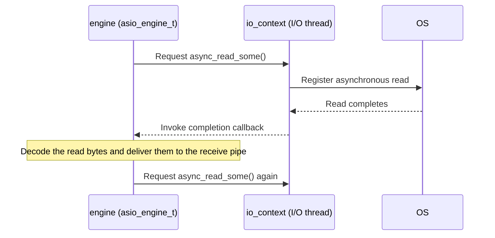

[한국어](https://zlink-systems.github.io/zlink/ko/spec/core/systems/03-io-thread/) | English

<!-- zlink-nav:start -->
[Systems Index](README.en.md) | [Previous: Threading Model](02-threading-model.en.md) | [Next: Thread Safety](04-thread-safety.en.md)
<!-- zlink-nav:end -->

# I/O thread

> **What this chapter defines** — What an I/O thread does, how it is created, how work is
> distributed, and its internal implementation.

## 1. I/O thread overview

An [I/O thread](../glossary.en.md#io-thread) is a background thread created and managed by a
[Context](../glossary.en.md#context) that performs the actual network send and receive operations.
I/O threads are central to zlink networking: all actual network send and receive operations,
protocol encoding and decoding, and connection management occur on I/O threads.

Each I/O thread runs a dedicated **asynchronous event loop** that performs the following tasks:

1. Polls the read/write readiness of registered [sockets](../glossary.en.md#socket)
2. Processes commands received through a mailbox (an inter-thread command delivery channel)
3. Executes timers

This document describes the observable behavior of I/O thread creation and lifetime, as well as
the internal implementation of the event loop, command processing, and thread assignment. The
high-level threading model (application threads, the reaper thread, and inter-thread
communication) is covered by the [Core threading model](02-threading-model.en.md).

The following documents own the related contracts:

| Related contract | Defining document |
|---|---|
| The `ZLINK_IO_THREADS` option and its default value | [Context](../01-context.en.md#4-options) |
| High-level thread kinds and inter-thread communication | [Core threading model](02-threading-model.en.md) |
| Short definitions of each term | [Core glossary](../glossary.en.md) |

## 2. Creation and lifetime

I/O threads are created lazily: `zlink_ctx_new()` allocates the context, but does not start the
threads until the first socket is created.

```c
void *ctx = zlink_ctx_new();
zlink_ctx_set(ctx, ZLINK_IO_THREADS, 4);  /* Must be set before the first socket is created */

void *socket = zlink_socket(ctx, ZLINK_SOCKET_DEALER);  /* This call starts the threads */
```

Thread names follow the pattern `IO/0`, `IO/1`, ... `IO/N-1`. The [Context](../01-context.en.md#4-options)
document owns the contract for the `ZLINK_IO_THREADS` option that determines the thread count and
its default value.

Internally, `ctx_runtime_resources.cpp:start_io_threads_locked()` creates `io_thread_count`
instances of `io_thread_t`. Each thread receives a unique slot ID, and its mailbox is registered in
the context's slot registry for command routing.

## 3. Internal structure

> **Contract ownership for this section** — This section describes the implementation. If the
> implementation changes, update this document to match the code. [Context](../01-context.en.md#4-options)
> owns the thread-count option contract, and the [Core threading model](02-threading-model.en.md)
> owns the high-level description of thread kinds and inter-thread communication.

### 3.1 Event loop

Each I/O thread owns a Boost ASIO-based poller (`asio_poller.cpp`). The main loop in
`poller_t::loop()` repeats the following cycle:

1. Execute expired timers.
2. Batch-process ready I/O events with a non-blocking `io_context.poll()` to improve throughput.
3. If no events are ready, block for up to 100 ms with `io_context.run_for(≤100ms)` to prevent
   busy-wait CPU consumption.
4. Clean up retired poll entries and return to step 1.

### 3.2 Socket I/O handling

Network I/O uses the Proactor model: instead of directly polling read/write readiness, it submits
asynchronous I/O requests to the OS and processes only their completion results. When the engine
(`asio_engine_t`) calls `async_read_some()` / `async_write_some()` on the transport, the I/O
thread's `io_context` waits for the OS asynchronous I/O operation to complete and then invokes the
completion callback. The engine does not directly poll read/write readiness; it processes only
completion results.



- **Read completion** → Pass the read bytes to the protocol decoder to decode frames, deliver the
  message to the receive pipe, and issue `async_read_some()` again.
- **Write completion** → Encode and send the message pulled from the send pipe, then issue the next
  `async_write_some()` if data remains.

The `asio_poller` `async_wait` readiness path is used only to wake up mailbox command processing,
not for network data.

### 3.3 Command processing

Each I/O thread has a **mailbox**: a command pipe (`ypipe_t<command_t>`, with the sender side
protected by a mutex) paired with a signaler for wake-up notifications.

```cpp
// io_thread.cpp — process_mailbox()
do {
    command_t cmd;
    int rc = _mailbox.recv(&cmd, 0);
    while (rc == 0 || errno == EINTR) {      // Retry on EINTR
        if (rc == 0)
            cmd.destination->process_command(cmd);
        rc = _mailbox.recv(&cmd, 0);
    }
} while (_mailbox.reschedule_if_needed());    // Reschedule if commands remain
```

Commands arrive from application threads through `ctx_t::send_command()` and include the
following kinds:

| Command | Purpose |
|---------|---------|
| `plug` | Attach a new session/engine to this I/O thread |
| `attach` | Attach an engine to a session |
| `bind` | Establish a pipe between a session and socket |
| `activate_read` | Resume reading from a pipe |
| `activate_write` | Resume writing to a pipe |
| `stop` | Shut down the I/O thread |

The mailbox is connected to the I/O thread's `io_context` through `set_io_context()`. Sending a
command posts an ASIO handler, which wakes the blocking event loop and processes the command.

### 3.4 Thread assignment

When a socket creates a new connection, it selects an I/O thread according to the following
criteria:

1. **Affinity mask** — Restricts the candidate set when configured.
2. **Load distribution** — Objects placed once per socket, such as a listener or the socket's
   asynchronous command owner, select the candidate thread with the fewest registered handles
   (least load). Transport connections (connected and accepted sessions) select candidates in
   round-robin order. STREAM sessions are round-robin by default as well; if the
   `ZLINK_ASIO_STREAM_SESSION_SCHED=minload` environment variable is set, STREAM sessions alone
   select the least-loaded thread.

This distributes network connections across I/O threads. The assignment unit is a **connection**,
not a socket: when one socket has multiple connections, those connections may span multiple I/O
threads.

## 4. Tuning guidelines

| Scenario | Recommended `ZLINK_IO_THREADS` |
|----------|--------------------------------|
| One socket, few connections | 1 |
| Many sockets or many connections | 2–4 (default: 4) |
| High-performance server (100+ connections) | Match the number of available CPU cores |

Setting more I/O threads than the number of CPU cores provides no benefit and only increases
context-switch overhead. Profile with the [performance benchmarks](../../../../../bindings/c/perf)
before increasing the value beyond 4.

## 5. Key source files

| File | Role |
|------|------|
| `core/src/runtime/core/io_thread.hpp/.cpp` | I/O thread class and mailbox processing |
| `core/src/runtime/core/ctx_runtime_resources.cpp` | Thread creation in `start_io_threads_locked()` |
| `core/src/runtime/engine/asio/asio_poller.hpp/.cpp` | Boost ASIO event loop and socket monitoring |
| `core/src/runtime/core/poller_base.hpp` | Worker thread base class |
| `core/src/runtime/core/mailbox.hpp` | Lock-free command queue and signaler |

## 6. Implementation and contract-test verification requirements

This document is implementation narrative, so it carries no contract-test items of the public
contract. The contract verified through the public surface is the set/get and error behavior of the
`ZLINK_IO_THREADS` option, owned by
[Context](../01-context.en.md#6-implementation-and-contract-test-verification).

Whether the narrative in §2 and §3 still matches the code is checked with the following internal
check conditions (observed through the process thread list and internal placement, not the public
API).

- With only `zlink_ctx_new()` called there is no I/O thread; creating the first socket starts them.
- If `ZLINK_IO_THREADS` is set to N before the first socket is created, the thread names are
  `IO/0` … `IO/N-1`.
- The assignment unit is a connection — several connections of one socket may span several I/O
  threads.
