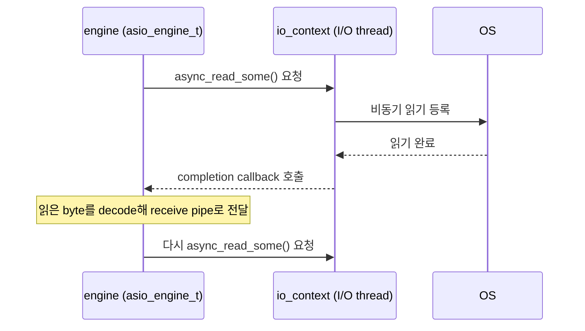

[English](https://zlink-systems.github.io/zlink/spec/core/systems/03-io-thread/) | 한국어

<!-- zlink-nav:start -->
[시스템 목차](README.ko.md) | [이전: Threading model](02-threading-model.ko.md) | [다음: Thread safety](04-thread-safety.ko.md)
<!-- zlink-nav:end -->

# I/O thread

> **이 장이 정의하는 것** — I/O thread가 무엇을 하고, 어떻게 생성되며, 작업이 어떻게
> 분배되는지, 그리고 그 내부 구현.

## 1. I/O thread 개요

[I/O thread](../glossary.ko.md#io-thread)는 [Context](../glossary.ko.md#context)가 만들고
관리하는 background thread로, 네트워크 송수신을 실제로 처리한다. I/O thread는 zlink
네트워킹의 핵심이다 — 실제 네트워크 송수신, protocol encoding/decoding, connection 관리가
모두 I/O thread에서 일어난다.

각 I/O thread는 전용 **비동기 이벤트 루프**를 실행하며 다음을 수행한다.

1. 등록된 [socket](../glossary.ko.md#socket)의 읽기/쓰기 준비 상태를 polling
2. mailbox(thread 간 command 전달 채널)를 통해 수신된 command 처리
3. timer 실행

이 문서는 I/O thread의 생성·수명이라는 관찰 가능한 동작과, 이벤트 루프·command 처리·thread
할당의 내부 구현을 설명한다. 고수준 threading model(application thread, reaper thread,
thread 간 통신)은 [Core threading model](02-threading-model.ko.md)이 다룬다.

관련 계약의 소유 문서는 다음과 같다.

| 관련 계약 | 정의하는 문서 |
|---|---|
| `ZLINK_IO_THREADS` 옵션과 기본값 | [Context](../01-context.ko.md#4-옵션) |
| 고수준 thread 종류와 thread 간 통신 | [Core threading model](02-threading-model.ko.md) |
| 각 용어의 짧은 정의 | [Core 용어](../glossary.ko.md) |

## 2. 생성과 수명

I/O thread는 지연(lazy) 생성된다 — `zlink_ctx_new()`는 context를 할당하지만 첫 번째
socket이 생성될 때까지 thread를 실행하지 않는다.

```c
void *ctx = zlink_ctx_new();
zlink_ctx_set(ctx, ZLINK_IO_THREADS, 4);  /* 첫 socket 생성 전에 설정해야 한다 */

void *socket = zlink_socket(ctx, ZLINK_SOCKET_DEALER);  /* 이 호출이 thread 실행을 시작한다 */
```

thread 이름은 `IO/0`, `IO/1`, ... `IO/N-1` 패턴을 따른다. thread 수를 정하는
`ZLINK_IO_THREADS` 옵션과 그 기본값의 계약은 [Context](../01-context.ko.md#4-옵션)가
소유한다.

내부적으로 `ctx_runtime_resources.cpp:start_io_threads_locked()`가 `io_thread_count`개의
`io_thread_t` instance를 생성한다. 각 thread는 고유 slot ID를 받고, mailbox가 context의
slot registry에 등록되어 command routing에 쓰인다.

## 3. 내부 구조

> **이 절의 계약 소유** — 이 절은 구현 서술이다. 구현이 바뀌면 문서를 코드에 맞춘다.
> thread 수 옵션의 계약은 [Context](../01-context.ko.md#4-옵션)가, thread 종류와 thread 간
> 통신의 고수준 설명은 [Core threading model](02-threading-model.ko.md)이 소유한다.

### 3.1 이벤트 루프

각 I/O thread는 Boost ASIO 기반 poller(`asio_poller.cpp`)를 소유한다. `poller_t::loop()`의
메인 루프는 다음 사이클을 반복한다.

1. 만료된 timer를 실행한다.
2. non-blocking `io_context.poll()`로 준비된 I/O 이벤트를 한 번에 배치 처리한다 —
   throughput을 높이기 위해서다.
3. 준비된 이벤트가 없으면 `io_context.run_for(≤100ms)`로 최대 100ms blocking한다 —
   busy-wait CPU 소비를 방지하기 위해서다.
4. 폐기된 poll entry를 정리하고 1로 돌아간다.

### 3.2 Socket I/O 처리

네트워크 I/O는 Proactor 모델로 처리한다 — 읽기/쓰기 준비 상태를 직접 polling하는 대신 OS에
비동기 I/O를 요청해 두고 완료 결과만 처리하는 방식이다. engine(`asio_engine_t`)이
transport에 `async_read_some()` / `async_write_some()`을 요청하면 I/O thread의
`io_context`가 OS 비동기 I/O 완료를 기다렸다가 completion callback을 부른다. engine은
읽기/쓰기 준비 상태를 직접 polling하지 않고 완료 결과만 처리한다.



- **Read 완료** → 읽은 byte를 protocol decoder에 넘겨 frame을 decode한 뒤 receive pipe로
  message를 전달하고, 다시 `async_read_some()`을 건다.
- **Write 완료** → send pipe에서 꺼낸 message를 encode해 보낸 뒤, 남은 data가 있으면 다음
  `async_write_some()`을 건다.

`asio_poller`의 `async_wait` readiness 경로는 네트워크 data가 아니라 mailbox command
wakeup에만 쓴다.

### 3.3 Command 처리

각 I/O thread는 **mailbox**를 가진다 — command pipe(`ypipe_t<command_t>`, 전송 측은
mutex로 보호)와 깨우기 신호용 signaler의 조합이다.

```cpp
// io_thread.cpp — process_mailbox()
do {
    command_t cmd;
    int rc = _mailbox.recv(&cmd, 0);
    while (rc == 0 || errno == EINTR) {      // EINTR 재시도
        if (rc == 0)
            cmd.destination->process_command(cmd);
        rc = _mailbox.recv(&cmd, 0);
    }
} while (_mailbox.reschedule_if_needed());    // 남은 command 있으면 재예약
```

command는 application thread에서 `ctx_t::send_command()`로 도착하며, 다음과 같은 종류가
있다.

| Command | 용도 |
|---------|------|
| `plug` | 새 session/engine을 이 I/O thread에 부착 |
| `attach` | engine을 session에 부착 |
| `bind` | session과 socket 사이 pipe 수립 |
| `activate_read` | pipe 읽기 재개 |
| `activate_write` | pipe 쓰기 재개 |
| `stop` | I/O thread 종료 |

mailbox는 I/O thread의 `io_context`에 연결되어(`set_io_context()`), command를 send하면
ASIO handler가 post되어 blocking 대기 중인 이벤트 루프가 깨어나 command를 처리한다.

### 3.4 Thread 할당

socket이 새 connection을 생성할 때 다음 기준으로 I/O thread를 선택한다.

1. **affinity mask** — 설정된 경우 후보 집합을 제한한다.
2. **부하 분산** — 일반 connection은 후보 중 등록된 핸들 수가 가장 적은
   thread(least-load)를 고르고, STREAM connection은 기본적으로 후보를 round-robin으로
   고른다. 환경 변수 `ZLINK_ASIO_STREAM_SESSION_SCHED=minload`를 설정하면 STREAM
   connection도 least-load로 고른다.

이렇게 네트워크 connection이 I/O thread에 분산된다. 할당 단위는 socket이 아닌
**connection**이다 — 하나의 socket이 여러 connection을 가지면 여러 I/O thread에 걸칠 수
있다.

## 4. 튜닝 가이드라인

| 시나리오 | 권장 `ZLINK_IO_THREADS` |
|----------|------------------------|
| socket 1개, connection 소수 | 1 |
| socket 다수 또는 connection 다수 | 2–4 (기본값 4) |
| 고성능 서버 (100+ connection) | 가용 CPU 코어 수에 맞춤 |

I/O thread를 CPU 코어 수 이상으로 설정해도 이점이 없고 context-switch 오버헤드만
늘어난다. 4 이상으로 올리기 전에 [perf 벤치마크](../../../../../bindings/c/perf)로
프로파일링하라.

## 5. 주요 소스 파일

| 파일 | 역할 |
|------|------|
| `core/src/runtime/core/io_thread.hpp/.cpp` | I/O thread 클래스, mailbox 처리 |
| `core/src/runtime/core/ctx_runtime_resources.cpp` | `start_io_threads_locked()`에서 thread 생성 |
| `core/src/runtime/engine/asio/asio_poller.hpp/.cpp` | Boost ASIO 이벤트 루프, socket 모니터링 |
| `core/src/runtime/core/poller_base.hpp` | Worker thread 기반 클래스 |
| `core/src/runtime/core/mailbox.hpp` | Lock-free command queue + signaler |

## 6. 구현 및 contract test 검증 요구

이 절은 작업자가 확인할 항목을 모은다. 공개 표면(`zlink_ctx_new`·`zlink_ctx_set`·
`zlink_socket`)과 OS가 노출하는 process의 thread 목록·이름만으로 관찰할 수 있는 동작이며,
각 항목은 test 하나로 이어진다.

**생성과 수명**
- `zlink_ctx_new()`만 호출한 상태에서는 I/O thread가 실행되지 않는다 — 첫 번째 socket을
  생성해야 thread가 실행된다.
- 첫 socket 생성 전에 `ZLINK_IO_THREADS`를 N으로 설정하고 socket을 만들면, thread 이름이
  `IO/0`, `IO/1`, ... `IO/N-1` 패턴을 따른다.

**thread 할당**
- 하나의 socket이 여러 connection을 가지면 그 connection들은 여러 I/O thread에 걸칠 수
  있다 — 할당 단위는 socket이 아니라 connection이다.

`ZLINK_IO_THREADS` 옵션 자체의 설정·조회와 오류 계약 검증은
[Context](../01-context.ko.md#6-구현-및-contract-test-검증-요구)가 소유한다.
