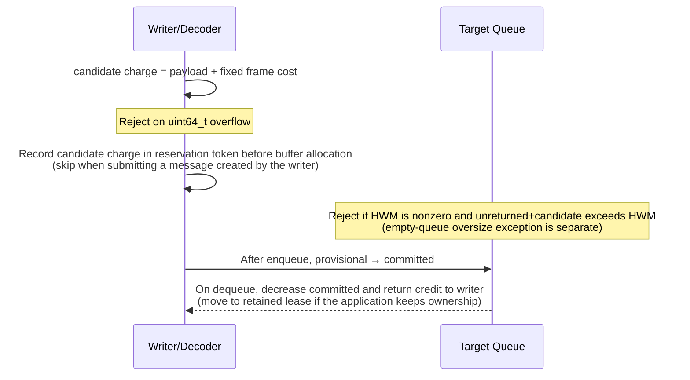

[한국어](https://zlink-systems.github.io/zlink/ko/spec/core/systems/06-auto-hwm/) | English

<!-- zlink-nav:start -->
[Systems Index](README.en.md) | [Previous: Per-Connection Memory](05-connection-memory.en.md) | [Next: Core Source Layout](07-core-source-layout.en.md)
<!-- zlink-nav:end -->

# Auto HWM

> **What this chapter defines** — Auto HWM budget calculation and admission contracts, the related context functions, and their internal implementation.

## 1. Auto HWM Overview

zlink Core automatically calculates the byte limit ([HWM](../glossary.en.md#hwm)) retained by each socket queue from the context memory budget and distributes it among the queues, so the application does not have to set every limit individually. This automatic policy is called the [Auto HWM budget](../glossary.en.md#auto-hwm-budget).

This document defines the public contract for the inputs used to calculate that budget and how it applies to message admission, the related context functions, and their internal implementation. The functions belong to the context object (`zlink_ctx_*`), but this document covers them together under the single topic of Auto HWM.

The following documents own related contracts.

| Related contract | Defining document |
|---|---|
| Auto HWM option enums and defaults | [Context](../01-context.en.md#4-options) |
| Socket HWM options and observable behavior | [Socket Common](../socket/README.en.md) |
| Short definitions of terms | [Core Glossary](../glossary.en.md) |

## 2. Auto HWM Budget Calculation

This section defines the public calculation and admission contracts. The [Internals](#4-internals) section of this document owns queue-local state, decoder reservations, and data-path cost boundaries.

Core checks the following inputs in priority order and selects the first usable value. The `ZLINK_CTX_OPT_AUTO_HWM_*` values below are [Context options](../01-context.en.md#4-options) that the application sets with `zlink_ctx_set_data`.

1. A positive `ZLINK_CTX_OPT_AUTO_HWM_CORE_BUDGET_BYTES`
2. A positive `ZLINK_CTX_OPT_AUTO_HWM_MEMORY_LIMIT_BYTES`
3. A positive runtime memory hint. If Core also detected a finite hard limit, the smaller of the two values
4. A finite hard limit detected by Core
5. Physical memory detected by Core

A manual Core budget is used as-is without applying the profile percentage or effective cap. For every other memory input, Core applies the selected profile percentage once and then clamps the result to the effective cap below.

This budget has the following properties.

- It is the basis for distributing the steady-state HWM of each application directional pipe. It is not a hard cap compared against context-wide usage.
- Each pipe checks only its own queue bytes and HWM.
- A pipe that reaches its HWM or uses the empty-pipe oversize exception does not reduce another pipe's HWM or stop that pipe's admission.

| Profile | Percentage | Fixed cap | General data role minimum | General data role maximum | STREAM minimum | STREAM maximum |
|---|---:|---:|---:|---:|---:|---:|
| Compact | 2% | 64 MiB | 32 KiB | 512 KiB | 8 KiB | 32 KiB |
| LowLatency | 3% | 256 MiB | 32 KiB | 2 MiB | 16 KiB | 64 KiB |
| Balanced | 5% | 512 MiB | 64 KiB | 1 MiB | 64 KiB | 128 KiB |
| Throughput | 8% | 1024 MiB | 128 KiB | 8 MiB | 256 KiB | 512 KiB |

The role-specific bounds are as follows.

- STREAM role: STREAM bounds.
- `none` role: excluded from planning.
- Every other current role: general data bounds.
- Exception — the `recv_ingress` role (SUB/XSUB) under the Balanced profile: 2 MiB instead of the general data maximum.

The profile percentage alone does not determine the budget. The budget is the percentage-based value clamped to the **[effective cap](../glossary.en.md#effective-cap)**. The effective cap is the larger of the profile's fixed cap and the floor required for all active application directional queues to reach their role minimums. A fixed cap alone pushes queue-heavy deployments below their queue minimums, while a queue floor alone allows a large host with only a few queues to reserve several GiB.

The following expressions produce the final Core budget (`effectiveCoreBudgetBytes`). This budget is the basis for distributing the steady-state HWM of each queue described above.

```text
percentShareBytes =                                            // memory limit × profile percentage
    (resolvedMemoryLimitBytes / 100) * profilePercent
  + ((resolvedMemoryLimitBytes % 100) * profilePercent) / 100  // avoid overflow with integer division

effectiveCapBytes =                                            // larger of the two values below
    max (profileFixedCapBytes,                                 //   profile fixed cap
         activeDirectionalQueueCount * perQueueMinimumBytes)   //   total needed for all queues to receive their minimum

effectiveCoreBudgetBytes = min (percentShareBytes, effectiveCapBytes)  // final budget obtained by clamping the percentage value to the cap above
```

`perQueueMinimumBytes` is the general data role minimum for that profile. `activeDirectionalQueueCount` is known only after the physical queue registry has resolved every plannable application direction, so the budget is finalized at that point (context finalize). Setting a manual Core budget skips this entire calculation.

When Core detects a finite hard limit, setting an explicit memory limit or manual Core budget above that limit fails with `EINVAL`. A runtime memory hint may still be set, and calculation uses the smaller of the hint and the finite hard limit. Physical memory and the finite hard limit are detected only once when the context starts and are not detected again while it runs.

When an Auto HWM option setter succeeds, it stores the configured value and schedules a new calculation through the normal debounce path. `zlink_ctx_get_data` returns the stored configured value immediately, but the budget snapshot returns the last recorded plan and may therefore contain the previous result until recalculation. Calling `zlink_ctx_auto_hwm_recalculate` records a new plan immediately.

The ABI v1 planner uses the context's physical directional queue registry. The registry registers each application ypipe direction once and owns the following state.

- An endpoint-independent stable queue ID and generation
- Send and receive roles and profile bounds
- Manual HWM, current applied HWM, and accounted bytes

Even when two endpoints observe the same inproc ypipe, Core counts it only once per direction. A new pipe pair uses the following reservation rules for each direction.

- Application direction: atomically reserves the role-specific minimum. If both directions cannot be reserved, Core rejects the entire reservation before publishing the attach and does not register only a subset of the directions.
- Manual direction: also reserves the role-specific minimum before attach. A finite manual HWM applies to admission immediately and is included in the next plan's manual reservation sum and aggregate HWM statistics.
- Direction with manual HWM `0`: admission remains unlimited, while the next plan uses the role-specific maximum as its calculation reservation and sets the flag that indicates the aggregate HWM is not finite.

Among automatic directions, Core distributes the remaining budget by repeatedly and evenly raising queues that have not yet reached their maximum. This distribution method is called [water-filling](../glossary.en.md#water-filling). An inproc physical ypipe does not add the values from both endpoints. It calculates one final cap using the following rules, then reserves and applies that cap once in the registry.

| Send endpoint | Receive endpoint | Final physical ypipe cap |
|---|---|---|
| Auto | Auto | Water-filling result |
| Finite manual | Auto | Finite manual cap |
| Auto | Finite manual | Finite manual cap |
| Finite manual A | Finite manual B | `min(A, B)` |
| Unlimited manual | Finite manual | Finite manual cap |
| Finite manual | Unlimited manual | Finite manual cap |
| Unlimited manual | Auto | Auto plan |
| Auto | Unlimited manual | Auto plan |
| Unlimited manual | Unlimited manual | Admission is unlimited; use the role-specific maximum as the calculation reservation |

If the budget remaining after subtracting manual reservations is less than the sum of the minimums for all automatic directions, Core does not reduce the minimums and sets the insufficient-budget flag. When the budget is sufficient, Core divides the remainder by the number of unique physical queues that have not reached their maximum and repeatedly increases each queue up to its maximum. It assigns division remainders one byte at a time in stable queue ID order. The same registry snapshot and inputs therefore always produce the same result.

When a new input cannot secure the required reservation, Core handles each situation as follows.

| Situation | Core behavior |
|---|---|
| A new explicit memory limit or manual Core budget cannot accommodate the current manual HWMs and automatic minimums together | Stores the value and schedules recalculation. The planner preserves the automatic minimums and sets the insufficient-budget flag. |
| A new synchronous inproc attach cannot reserve the required minimum | Fails with `ENOBUFS` |
| The runtime memory hint decreases while running | Records the new value without removing existing pipes or messages. If the recalculated result is insufficient, sets the insufficient-budget flag. |
| Physical memory or the hard limit decreases while running | Does not change the current context's inputs or plan because they are not detected again after context startup. |
| A new asynchronous network attach has not obtained the required reservation | Does not publish the attach and terminates the failed connection attempt. |

When the number of connections changes a per-queue target, Core applies the change as follows.

| Change | Core behavior |
|---|---|
| A connection increase lowers the per-queue target | Records the new target immediately and blocks further admission until current retained bytes drain below the new target |
| A connection decrease raises the target | Applies it after the cooldown only to a live queue with the same generation |
| Detached queue | Removes it when no outstanding retained lease remains, or preserves it as a retired queue while a lease remains |

The **observable behavior** of multipart reservation, the empty-queue oversize exception, and retained-credit leases is owned by [§5 Verification Requirements](#5-implementation-and-contract-test-verification-requirements), while their **implementation mechanisms** are owned by [§4 Internals](#4-internals).

```text
originQueueUsedBytes(queue) =
    physicalQueueAccountedBytes(queue)
  + applicationLeaseBytesFrom(queue)
```

Ordinary admission checks only this origin-local sum and that queue's applied HWM. It does not block other queues merely because the context's `current_accounted_bytes` exceeds `effective_core_budget_bytes`.

`total_planned_hwm_bytes` is the sum of the current targets for application directions, and `total_applied_hwm_bytes` is the sum of the HWMs actually applied to live application directions. A retired entry retains only outstanding leases and deferred origin credit; it is excluded from the applied capacity sum and the new water-filling denominator. `core_queue_accounted_bytes` and `application_accounted_bytes` distinguish only the owner, and their sum, `current_accounted_bytes`, does not change before and after an ownership transfer.

The DEALER and ROUTER [completion progress lane](../glossary.en.md#completion-progress-lane) does not apply a byte HWM, LWM, inproc HWM boost, or the legacy 256 KiB floor, and it is excluded from the water-filling denominator above. This lane owns the progress of terminal replies and error replies and also synchronizes receive-flow-state frames between peers. The completion lane is excluded from HWM admission and Core budget reservation, but its current and peak accounted bytes and pending message count are observed separately. These values are included in `total_messaging_accounted_bytes` and excluded from application water-filling.

## 3. Functions

### zlink_ctx_auto_hwm_recalculate

Immediately reapplies the automatic HWM plan to the entire current context.

```c
ZLINK_EXPORT zlink_config_result_t zlink_ctx_auto_hwm_recalculate(void *context_);
```

This function immediately recalculates automatic HWM for sockets that still follow the automatic queue and buffer policy. Values the user changed manually remain unchanged, and sockets with Auto HWM disabled remain disabled. Use it after changing the Auto HWM profile or a memory budget input to record a new plan without waiting for the normal refresh path.

**Returns:** `ZLINK_CONFIG_OK` on success; otherwise, a `zlink_config_result_t` value. `zlink_errno()` preserves the internal errno for diagnostics.

**Errors:**
- `EFAULT` -- invalid context handle.

**Thread safety:** Safe to call from any thread.

**See also:** `zlink_ctx_set`, `zlink_monitor_status`

---

### zlink_ctx_get_auto_hwm_budget_snapshot

Retrieves the last recorded context-wide Auto HWM plan in a versioned structure.

```c
#define ZLINK_AUTO_HWM_BUDGET_SNAPSHOT_ABI_V1 1u

#define ZLINK_AUTO_HWM_BUDGET_FLAG_PLANNING_ACTIVE       (1u << 0)  // Auto HWM was active in the last plan
#define ZLINK_AUTO_HWM_BUDGET_FLAG_INSUFFICIENT          (1u << 1)  // budget cannot fit manual reservations and required automatic minimums together
#define ZLINK_AUTO_HWM_BUDGET_FLAG_AGGREGATE_HWM_VALID   (1u << 2)  // no unlimited manual direction, so the HWM sum can be interpreted as finite
#define ZLINK_AUTO_HWM_BUDGET_FLAG_AGGREGATE_OVERFLOW    (1u << 3)  // planner/queue aggregation exceeded uint64_t and saturated

typedef struct zlink_auto_hwm_budget_snapshot_t {
  uint32_t abi_version;                         // caller sets to ABI_V1
  uint32_t struct_size;                         // caller sets allocated size → Core returns the full v1 size
  uint64_t budget_generation;                   // increments for each new recorded plan (new context=0)
  uint64_t measurement_epoch;                   // increments for each metrics reset (new context=1)
  uint64_t configured_memory_limit_bytes;       // configured explicit memory limit
  uint64_t runtime_memory_limit_bytes;          // runtime memory hint
  uint64_t resolved_memory_limit_bytes;         // limit actually used for calculation
  uint64_t configured_core_budget_bytes;        // configured manual Core budget
  uint64_t effective_core_budget_bytes;         // final budget after applying the effective cap
  uint64_t total_planned_hwm_bytes;             // sum of current target HWMs for application directions
  uint64_t total_applied_hwm_bytes;             // sum of HWMs actually applied to live directions
  uint64_t manual_reserved_hwm_bytes;           // sum of reservations for manual directions
  uint64_t core_queue_accounted_bytes;          // accounted bytes owned by Core
  uint64_t application_accounted_bytes;         // reserved (always 0)
  uint64_t current_accounted_bytes;             // equal to core_queue_accounted_bytes
  uint64_t provisional_accounted_bytes;         // reservation for incomplete multipart messages
  uint64_t peak_accounted_bytes;                // maximum observed in the current epoch
  uint64_t completion_current_accounted_bytes;  // current bytes in completion lanes
  uint64_t completion_peak_accounted_bytes;     // maximum bytes in completion lanes
  uint64_t completion_pending_message_count;    // messages pending in completion lanes
  uint64_t total_messaging_accounted_bytes;     // application+completion accounted-byte sum
  uint64_t monitor_queue_applied_hwm_bytes;     // sum of HWMs for open monitor directions
  uint64_t monitor_queue_accounted_bytes;       // sum of bytes held by monitor directions
  uint64_t total_instance_applied_hwm_bytes;    // total_applied + monitor HWM
  uint64_t total_instance_accounted_bytes;      // total_messaging + monitor accounted bytes
  uint64_t oversize_admission_count;            // empty-queue oversize exceptions admitted
  uint64_t largest_oversize_message_bytes;      // largest such message
  uint64_t active_directional_queue_count;      // active application directions (counted once per direction)
  uint64_t active_completion_directional_queue_count;// active completion directions
  uint64_t active_send_queue_count;             // send-perspective count in the last plan
  uint64_t active_receive_queue_count;          // receive-perspective count in the last plan
  uint64_t outstanding_application_lease_count; // reserved (always 0)
  uint64_t retired_queue_count;                 // reserved (always 0)
  uint64_t deferred_origin_credit_bytes;        // reserved (always 0)
  uint64_t unlimited_manual_queue_count;        // unlimited manual directions
  uint32_t blocked_ratio_ppm;                   // ratio of first attempts blocked by HWM (ppm)
  uint32_t flags;                               // ZLINK_AUTO_HWM_BUDGET_FLAG_* bits
  uint64_t reserved_u64[8];                     // reserved (all 0)
} zlink_auto_hwm_budget_snapshot_t;

ZLINK_EXPORT zlink_config_result_t
zlink_ctx_get_auto_hwm_budget_snapshot(
  void *context_,
  zlink_auto_hwm_budget_snapshot_t *snapshot_);
```

The caller zero-initializes the structure, sets `abi_version` to `ZLINK_AUTO_HWM_BUDGET_SNAPSHOT_ABI_V1`, and sets `struct_size` to the allocated byte size. A null snapshot or a size shorter than the two header fields fails with `EINVAL`; an unsupported version fails with `ENOTSUP`; an invalid context fails with `EFAULT`; and a terminating context fails with `ETERM`. On success, Core writes only the smaller prefix of the caller size and the Core v1 size. The returned `struct_size` is the full size of the Core v1 structure.

`active_directional_queue_count` and `active_completion_directional_queue_count` count each unique physical ypipe direction shared by reader and writer endpoints only once. Completion directions are excluded from the application-direction planning denominator and HWM admission. `active_send_queue_count` and `active_receive_queue_count` are the perspective-specific counts from the last socket plan. A new context starts with `budget_generation` 0 and `measurement_epoch` 1. `budget_generation` increments whenever a new plan is recorded, and `measurement_epoch` increments when metrics are reset.

Physical queue accounting follows these rules.

- Adds the payload and `sizeof(zlink_msg_t)` for each frame.
- Includes incomplete multipart frames in `provisional_accounted_bytes`; at the final frame, converts the same bytes to committed state without incrementing them again.
- Read, rollback, hiccup, termination, and conflate replacement return the charge for the frames they actually remove.
- Completion directions report separate current and peak values and a complete-message pending count.

`monitor_queue_applied_hwm_bytes` sums the currently applied HWM once for every unique physical ypipe direction of an open monitor. It does not separately add the options copied to the reader and writer endpoints. `monitor_queue_accounted_bytes` sums the accounted bytes of frames currently retained by those same monitor directions. Neither value is included in application planning, `total_applied_hwm_bytes`, `current_accounted_bytes`, or `total_messaging_accounted_bytes`; they are added only to the following instance totals.

```text
total_instance_applied_hwm_bytes =
    total_applied_hwm_bytes + monitor_queue_applied_hwm_bytes

total_instance_accounted_bytes =
    total_messaging_accounted_bytes + monitor_queue_accounted_bytes
```

Completion queues have no HWM, so they are not added to `total_instance_applied_hwm_bytes`. If either sum exceeds the `uint64_t` range, it saturates at `UINT64_MAX` and sets `ZLINK_AUTO_HWM_BUDGET_FLAG_AGGREGATE_OVERFLOW`.

`peak_accounted_bytes` is the largest total observed in the current measurement epoch when a budget snapshot query or Auto HWM recalculation inspects the queues. It does not guarantee that it records values retained only briefly between two inspections.

A snapshot is a consistent registry view that belongs to one `budget_generation`. It does not mix queue counts, capacity, and accounted counters from different generations. Current counters may change while the snapshot is constructed, but the returned aggregate and component fields must remain mutually consistent at the same snapshot boundary.

Registry-owned fields and sampled fields become visible at different times.

- Sampling fields — `current_accounted_bytes`, `provisional_accounted_bytes`, and `peak_accounted_bytes`. These values are sampled from per-pipe accounting when the snapshot is constructed.

`blocked_ratio_ppm` is calculated with the following expression.

```text
floor(first_blocked_admission_attempts * 1,000,000 / total_admission_attempts)
```

The ratio is 0 when `total_admission_attempts` is 0. A retry after the same submission wakes is not counted again. Only the first attempt blocked by the target application pipe's HWM is included in the numerator; transport I/O waits and context aggregate usage are excluded.

---

### zlink_ctx_reset_auto_hwm_budget_metrics

Changes the current Auto HWM measurement epoch.

```c
ZLINK_EXPORT zlink_config_result_t
zlink_ctx_reset_auto_hwm_budget_metrics(void *context_);
```

On success, this function increments `measurement_epoch` by 1, rebases the application and completion peaks to their current accounted bytes, and resets the blocked and total admission-attempt counters, `blocked_ratio_ppm`, the cumulative oversize count, and the largest oversize value to 0. It does not change current bytes, monitor queue HWM or accounted bytes, the budget, plan, queue counts, or `budget_generation`. An invalid context fails with `EFAULT`, and a terminating context fails with `ETERM`.

## 4. Internals

This document defines the state that Core maintainers must read and update in the message processing path when implementing Auto HWM memory limits. The [Auto HWM Budget Calculation](#2-auto-hwm-budget-calculation) section of this document and the [Socket specification](../socket/README.en.md#transportbuffer) own the application-visible budget calculation, HWM scope, and errors.

### Value Limited by HWM

Auto HWM distributes a context memory budget among application directional queues to determine each queue's HWM. Message admission is based on the unreturned bytes and applied HWM of the physical queue that will receive the message, not on context-wide usage.

The unreturned bytes of one physical queue are the sum of the following values.

```text
frameCharge = payloadBytes + sizeof(msg_t)

outstandingCharge =
    provisionalCharge
  + committedQueueCharge
  + retainedLeaseCharge
```

`sizeof(msg_t)` is not a measurement of allocator usage. Even a frame with no payload consumes a queue slot and message object, so this fixed value prevents its byte HWM cost from becoming 0. Payload-only accounting cannot impose a memory limit because it allows empty single-part messages or empty multipart frames to remain in a queue indefinitely regardless of HWM.

`provisionalCharge` is the value reserved before the decoder allocates a payload buffer. `committedQueueCharge` is the value of frames retained by the queue. When the application continues to hold a message dequeued from the queue, that value moves to `retainedLeaseCharge`. The unreturned total does not change when ownership moves.

For example, if the HWM is 1,024 bytes and the unreturned charge is 900 bytes, ordinary admission accepts only a frame whose charge is at most 124 bytes. Another queue being empty or the context-wide sum being below the budget does not change this decision.

### Separation of Responsibilities

| Processing location | Input | Result |
|---|---|---|
| Budget planner | Memory inputs, profile, application queue list | Target HWM for each queue |
| Queue configuration path | Target HWM, current applied value, queue generation | HWM to apply to the same generation |
| Message processing path | Target queue's unreturned charge, frame charge | Admission or backpressure |
| Snapshot path | Per-queue HWM and charge | Context query result |

The budget planner runs only when an option changes or a queue attaches or detaches. Context-wide sums and snapshot statistics produced by the planner are not used as message admission conditions.

### Message Processing Sequence

Ordinary frames are processed in the following order.



1. The writer or decoder adds the fixed frame cost to the payload size to calculate the candidate charge.
2. If the addition exceeds the `uint64_t` range, it does not admit the frame.
3. Before allocating the payload buffer, the decoder records the target queue reference, generation, and candidate charge in a reservation token. Accounting for the charge begins at frame write. This step is skipped when the application writer submits a message it has already created.
4. If the applied HWM is nonzero and adding the candidate charge to the unreturned charge exceeds the HWM, it does not admit the frame. The public empty-queue oversize exception applies separately.
5. After enqueue completes, it converts the value from provisional state to committed state without adding the reserved value again.
6. When the queue removes a frame, it decreases the committed value. If the application continues to hold the frame, the same value moves to a retained lease; otherwise, byte credit is returned to the writer.
7. Drop, allocation failure, protocol error, and termination each return only the value they actually own, exactly once.

In this sequence, normal frame processing reads and updates only local state created with the queue.

### Multipart and Large Messages

A multipart message accumulates the charge of each frame. After reading a frame's payload size from the wire header, the decoder records the frame's charge in a reservation token before buffer allocation. The final frame makes the entire multipart available to read without incrementing the values reserved for earlier frames again.

When a multipart message whose final size is not yet known reaches HWM, Core stops before allocating the buffer for the next `MORE` frame. However, if the multipart started on an empty queue, it may admit the final frame to complete one record even when that frame exceeds HWM. Eligibility is fixed by whether the queue was empty immediately before the first frame and does not apply to an intermediate `MORE` frame. If allocation failure or a protocol error discards the multipart, Core returns every charge that the multipart reserved or recorded in the queue.

An empty queue may admit one complete message whose total charge is known at admission, and the final frame of a multipart that started while the queue was empty, even when either exceeds HWM. This exception does not apply to two messages simultaneously and does not bypass the `ZLINK_OPT_MAXMSGSIZE` check. See the [HWM description in the Socket specification](../socket/README.en.md#transportbuffer) for detailed public behavior.

### Retained Receive and Queue Generation

A receive that retains a frame's memory until the application returns it is called a retained receive. A retained receive does not return the charge when removing the frame from the queue; it returns the charge to the writer of the original queue generation when the lease ends.

Detaching or reconnecting a queue creates a new generation. Ending a lease from an earlier generation does not reduce the charge of the new generation or wake its writer. The earlier generation retains only the return target until its last lease and reservation end, then is removed.

### HWM Changes

Increasing the HWM applies the new value to the current queue generation. When the HWM is decreased and the unreturned charge is greater than the new target, Core does not remove frames already admitted. It stops accepting new frames, waits until the charge reaches or falls below the target, and then applies the new HWM.

Application HWM does not apply to the completion queue through which DEALER and ROUTER advance terminal replies and error replies and synchronize receive-flow-state frames. Monitor queues are also excluded from the queue list used to distribute the application budget.

### Message-Path Cost Limits

The send, receive, and decoder admission paths do not perform the following operations.

- Acquire a context-wide mutex
- Search a global map for a queue ID or reservation ID
- Allocate heap memory for each frame reservation
- Update context-wide current, provisional, or peak sums for each frame
- Update global atomics for statistics not used in HWM decisions
- Query the usage of another physical queue

A decoder reservation is represented by inline state owned by the decoder or pipe. The required values are the target queue reference, generation, reserved charge, and whether a reservation exists. The queue lifecycle registry may be used for queue attach, detach, and cleanup of earlier generations, but it is not queried for every ordinary frame admission.

### Snapshots and Metrics

A snapshot builds context totals from queue-local state when queried. It may use the required registry lock while constructing the snapshot, but it does not serialize every queue with the same lock used by the message processing path.

Peak statistics record the largest total observed when a snapshot query or Auto HWM recalculation collects values from each queue. Because Core does not update the context-wide sum for every frame, a value retained only between two observation points may not be included in the peak. Resetting statistics or repeatedly querying the snapshot does not change HWM admission results or writer credit.

### Implementation Locations

| Responsibility | Implementation location |
|---|---|
| Profile bounds and per-queue HWM calculation | `auto_hwm_policy.*` |
| Context inputs, recalculation, and snapshot API | `ctx_auto_hwm_*` |
| Physical queue identity and generation | `ctx_physical_queue_registry.*` |
| Queue-local charge, HWM decision, and byte credit | `pipe.*` |
| Reservation before allocation | `zmp_decoder.*`, `session_base_pipe_io.cpp`, `pipe.*` |
| Retained lease release | Retained receive API and queue lifecycle code |

## 5. Implementation and Contract-Test Verification Requirements

This section collects the items that workers must verify. These behaviors are observable only through the **public surface**—the context options `zlink_ctx_set_data`/`zlink_ctx_get_data`, `zlink_ctx_get_auto_hwm_budget_snapshot`, send and recv admission results, and errno—not through internal implementation. Each item maps to one unit test.

**Options and budget**
- Setting a memory limit or manual Core budget larger than a finite hard limit detected by Core fails with `EINVAL`.
- A valid memory limit or manual Core budget is stored and recalculation is scheduled even when the value is less than the sum of current manual HWMs and automatic minimums. The recalculated snapshot preserves the automatic minimums and sets `ZLINK_AUTO_HWM_BUDGET_FLAG_INSUFFICIENT`.
- Physical memory and the hard limit are detected only once when the context starts. Changing them while the context runs does not trigger detection again. Only a decreased runtime memory hint is stored as a new input, and `ZLINK_AUTO_HWM_BUDGET_FLAG_INSUFFICIENT` is set when it causes a shortage.
- Calling `zlink_ctx_set_data`/`zlink_ctx_get_data` for an Auto HWM byte option with a size other than exactly `sizeof(uint64_t)` fails with `EINVAL` and leaves the value unchanged.
- With the same connection configuration and inputs, the snapshot's `effective_core_budget_bytes` is always the same (deterministic).
- A new pipe pair first reserves the role-specific minimum for each direction regardless of the manual HWM size. A finite manual HWM applies to admission immediately and is included in the next snapshot's `manual_reserved_hwm_bytes` and aggregate HWM statistics.

**Admission (byte accounting)**
- A frame with no payload still consumes HWM—repeatedly sending empty frames eventually blocks admission at the HWM.
- An empty queue admits one complete message of known total size even above HWM and rejects a second oversize message.
- An unknown-size multipart blocks further `MORE` frames from the point HWM is exceeded. However, it admits the final frame of a multipart that started on an empty queue even when the frame exceeds HWM, and this exception does not apply to an intermediate `MORE` frame. After the multipart is discarded, the snapshot's `provisional_accounted_bytes` returns to 0.

**Credit, lease, and generation**
- After an ordinary recv, the sender can send again; a retained receive keeps the snapshot's `application_accounted_bytes` until the lease is released.
- Detaching a socket while holding a lease does not increase credit for a new generation (snapshot).

**HWM changes**
- Lowering the HWM preserves frames already admitted, and the new HWM applies to admission after the retained amount drains below the new target.

**Excluded targets**
- DEALER and ROUTER completion replies, receive-flow-state frames, and monitor traffic do not change application send admission results or the denominator of the snapshot's `total_planned_hwm_bytes`.

**Snapshot invariance**
- Calling `zlink_ctx_get_auto_hwm_budget_snapshot` or `zlink_ctx_reset_auto_hwm_budget_metrics` does not change the admission or rejection result for the same send sequence.
- An unsupported `abi_version` fails with `ENOTSUP`, and a terminating context fails with `ETERM`.
