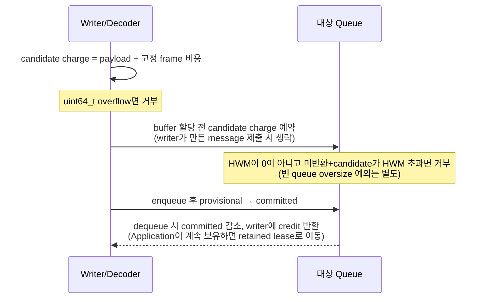

[English](https://zlink-systems.github.io/zlink/spec/core/systems/06-auto-hwm/) | 한국어

<!-- zlink-nav:start -->
[시스템 목차](README.ko.md) | [이전: Connection별 memory](05-connection-memory.ko.md) | [다음: Core source layout](07-core-source-layout.ko.md)
<!-- zlink-nav:end -->

# Auto HWM

> **이 장이 정의하는 것** — Auto HWM budget 계산·admission 계약과 관련 context 함수, 그리고 그 내부 구현.

## 1. Auto HWM 개요

zlink Core는 socket queue가 유지할 byte 상한([HWM](../glossary.ko.md#hwm))을 application이 일일이
정하지 않아도 되도록, context 메모리 예산에서 자동으로 계산해 각 queue에 나눠 준다. 이 자동
정책을 [Auto HWM](../glossary.ko.md#auto-hwm-budget)이라 한다.

이 문서는 그 budget을 어떤 입력으로 계산하고 어떻게 message admission에 적용하는지의 공개 계약,
관련 context 함수, 그리고 그 내부 구현을 정의한다. 함수는 context 객체(`zlink_ctx_*`)에 속하지만
Auto HWM이라는 하나의 주제로 여기서 함께 다룬다.

관련 계약의 소유 문서는 다음과 같다.

| 관련 계약 | 정의하는 문서 |
|---|---|
| Auto HWM 옵션 enum과 기본값 | [Context](../01-context.ko.md#4-옵션) |
| socket HWM 옵션과 관찰 동작 | [Socket 공통](../socket/README.ko.md) |
| 각 용어의 짧은 정의 | [Core 용어](../glossary.ko.md) |

## 2. Auto HWM budget 계산

이 절은 공개 계산과 admission 계약을 정의한다. Queue-local 상태, decoder reservation과
data path 비용 경계는 이 문서의 [내부 구조](#4-내부-구조) 절이 소유한다.

Core는 다음 입력을 우선순위 순으로 검사해 처음 사용할 수 있는 값을 고른다. 아래
`ZLINK_CTX_OPT_AUTO_HWM_*`는 application이 `zlink_ctx_set_data`로 설정하는
[Context 옵션](../01-context.ko.md#4-옵션)이다.

1. 양수 `ZLINK_CTX_OPT_AUTO_HWM_CORE_BUDGET_BYTES`
2. 양수 `ZLINK_CTX_OPT_AUTO_HWM_MEMORY_LIMIT_BYTES`
3. 양수 runtime memory hint. Core가 finite hard limit도 감지했으면 두 값의 최솟값
4. Core가 감지한 finite hard limit
5. Core가 감지한 physical memory

수동 Core budget은 profile 비율과 effective cap을 적용하지 않고 그대로 사용한다.
그 밖의 memory 입력에는 선택한 profile 비율을 한 번 적용한 뒤 아래의 effective cap으로
잘라낸다.

이 budget의 성격은 다음과 같다.

- 각 application directional pipe의 정상 상태 HWM을 나누는 기준이다. context 전체 사용량을 비교하는 hard cap이 아니다.
- 각 pipe는 자신의 HWM과, 그 pipe에서 Framework로 이전된 [retained-credit lease](../glossary.ko.md#retained-credit-lease)만 함께 검사한다.
- 한 pipe가 HWM에 도달하거나 빈 pipe oversize 예외를 써도 다른 pipe의 HWM을 줄이거나 admission을 중단하지 않는다.

| Profile | 비율 | 고정 cap | 일반 data 역할 하한 | 일반 data 역할 상한 | STREAM 하한 | STREAM 상한 |
|---|---:|---:|---:|---:|---:|---:|
| Compact | 2% | 64 MiB | 32 KiB | 512 KiB | 8 KiB | 32 KiB |
| LowLatency | 3% | 256 MiB | 32 KiB | 2 MiB | 16 KiB | 64 KiB |
| Balanced | 5% | 512 MiB | 64 KiB | 1 MiB | 64 KiB | 128 KiB |
| Throughput | 8% | 1024 MiB | 128 KiB | 8 MiB | 256 KiB | 512 KiB |

역할별로 사용하는 경계는 다음과 같다.

- STREAM 역할: STREAM 경계.
- `none` 역할: 계획에서 제외.
- 그 밖의 현재 역할: 일반 data 경계.
- 예외 — Balanced profile의 `recv_ingress` 역할(SUB/XSUB): 일반 data 상한 대신 2 MiB.

Budget은 profile 비율만으로 정해지지 않는다. 비율로 계산한 값을 **[effective cap](../glossary.ko.md#effective-cap)**으로
자른 값이 budget이다. Effective cap은 profile의 고정 cap과, 활성 application
directional queue 전부가 자기 역할 하한에 도달하는 데 필요한 바닥값 중 큰 쪽이다.
고정 cap만 두면 queue가 많은 배치가 자기 하한 아래로 밀리고, queue 바닥값만 두면
큰 호스트가 몇 개 안 되는 queue에 수 GiB를 예약하게 된다.

이 세 식으로 최종 Core budget(`effectiveCoreBudgetBytes`)을 구한다. 이 budget이 위에서 말한
각 queue의 정상 상태 HWM을 나누는 기준이 된다.

```text
percentShareBytes =                                            // memory 한도 × profile 비율
    (resolvedMemoryLimitBytes / 100) * profilePercent
  + ((resolvedMemoryLimitBytes % 100) * profilePercent) / 100  // 정수 나눗셈으로 overflow 회피

effectiveCapBytes =                                            // 아래 둘 중 큰 값
    max (profileFixedCapBytes,                                 //   profile 고정 cap
         activeDirectionalQueueCount * perQueueMinimumBytes)   //   모든 queue가 최소 하한 받는 총량

effectiveCoreBudgetBytes = min (percentShareBytes, effectiveCapBytes)  // 비율값을 위 cap으로 자른 최종 budget
```

`perQueueMinimumBytes`는 해당 profile의 일반 data 역할 하한이다.
`activeDirectionalQueueCount`는 physical queue registry가 계획 가능한 application
direction을 전부 확정한 뒤에야 알 수 있으므로, budget은 그 시점(context finalize)에
확정된다. 수동 Core budget을 설정하면 이 계산 전체를 건너뛴다.

Core가 finite hard limit을 감지한 경우, 그보다 큰 명시적 memory limit이나 수동 Core
budget 설정은 `EINVAL`로 실패한다. Runtime memory hint는 설정할 수 있으며 실제
계산에서는 finite hard limit과의 최솟값을 사용한다.

Auto HWM option setter가 성공하면 설정값을 저장하고 기본 debounce 경로로 새 계산을
예약한다. `zlink_ctx_get_data`는 저장된 설정값을 즉시 반환하지만 budget snapshot은
마지막으로 기록한 plan을 반환하므로 재계산 전에는 이전 결과일 수 있다.
`zlink_ctx_auto_hwm_recalculate`를 호출하면 새 plan을 즉시 기록한다.

ABI v1 planner는 context의 physical directional queue registry를 사용한다. Registry는 각
application ypipe 방향을 한 번만 등록하고 다음을 소유한다.

- endpoint와 독립된 stable queue ID와 generation
- send·receive 역할과 profile 경계
- manual HWM, current applied HWM과 accounted byte

같은 inproc ypipe를 두 endpoint가 관찰해도 한 방향으로만 집계한다. 새 pipe pair의 방향별
예약 규칙은 다음과 같다.

- application 방향: 역할별 하한을 원자적으로 예약한다. 두 방향을 모두 예약할 수 없으면 attach를 공개하기 전에 전체 예약을 거절하고 일부 방향만 등록하지 않는다.
- 수동 방향: 유한한 수동 HWM을 예약한다.
- 수동 HWM이 `0`인 방향: admission은 계속 무제한이되, 계산용 예약에는 역할별 상한을 쓰고 aggregate HWM이 유한하지 않다는 flag를 설정한다.

자동 방향들 사이에서는 남은 budget을 아직 상한에 못 미친 queue들에 물을 붓듯 고르게
채워 올려 나눈다. 이 분배 방식을 [water-filling](../glossary.ko.md#water-filling)이라 한다. Inproc physical ypipe는 양
endpoint의 값을 더하지 않고 다음 규칙으로 최종 cap 하나를 계산한다. 이 cap은 registry에서
한 번만 예약하고 적용한다.

| 송신 endpoint | 수신 endpoint | Physical ypipe 최종 cap |
|---|---|---|
| Auto | Auto | Water-filling 결과 |
| Finite manual | Auto | Finite manual cap |
| Auto | Finite manual | Finite manual cap |
| Finite manual A | Finite manual B | `min(A, B)` |
| Unlimited manual | Finite manual | Finite manual cap |
| Finite manual | Unlimited manual | Finite manual cap |
| Unlimited manual | Auto | Auto plan |
| Auto | Unlimited manual | Auto plan |
| Unlimited manual | Unlimited manual | Admission은 unlimited, 역할별 상한을 계산용 reservation으로 사용 |

수동 예약을 뺀 budget이 모든 자동 방향의 하한 합계보다 작으면 하한을 낮추지 않고
budget 부족 flag를 설정한다. 충분하면 아직 상한에 도달하지 않은 고유 physical queue
수로 남은 budget을 나누고 각 queue를 상한까지 반복해서 증가시킨다. 나눗셈 remainder는
stable queue ID 순서로 1 byte씩 배정한다. 따라서 같은 registry snapshot과 입력은 항상
같은 결과를 만든다.

새 입력이 필요한 예약을 확보하지 못하면 Core는 상황별로 다음과 같이 처리한다.

| 상황 | Core 동작 |
|---|---|
| 새 explicit memory limit 또는 수동 Core budget이 현재 수동 reservation과 자동 하한을 함께 수용하지 못함 | setter가 `ENOBUFS`로 실패하고 이전 설정과 plan을 유지 |
| 새 동기 inproc attach가 필요한 하한을 예약하지 못함 | `ENOBUFS`로 실패 |
| Runtime memory hint 또는 감지한 hard limit이 실행 중 감소 | 기존 pipe와 message를 제거하지 않고 새 입력을 기록한 뒤 budget 부족 flag를 설정 |
| 새 비동기 network attach가 필요한 reservation을 얻기 전 | publish하지 않고 실패한 연결 시도를 종료 |

연결 수가 바뀌어 queue별 목표가 변할 때는 다음과 같이 적용한다.

| 변화 | Core 동작 |
|---|---|
| 연결 증가로 queue별 목표가 감소 | 새 목표를 즉시 기록하고, 현재 보관량이 새 목표 아래로 drain될 때까지 추가 admission을 막음 |
| 연결 감소로 목표가 증가 | cooldown 뒤 같은 generation의 live queue에만 적용 |
| Detach된 queue | outstanding retained lease가 없으면 제거하고, lease가 남으면 retired queue로 유지 |

multipart 예약, 빈 queue oversize 예외, retained-credit lease의 **관찰 가능한 동작**은
[§5 검증 요구](#5-구현-및-contract-test-검증-요구)가, 그 **구현 메커니즘**은
[§4 내부 구조](#4-내부-구조)가 소유한다.

```text
originQueueUsedBytes(queue) =
    physicalQueueAccountedBytes(queue)
  + applicationLeaseBytesFrom(queue)
```

일반 admission은 이 origin-local 합계와 그 queue의 적용 HWM만 검사한다. Context의
`current_accounted_bytes`가 `effective_core_budget_bytes`보다 크다는 이유로 다른 queue를
함께 차단하지 않는다.

`total_planned_hwm_bytes`는 현재 application 방향 목표 합계이고
`total_applied_hwm_bytes`는 live application 방향에 실제 적용된 HWM 합계이다. Retired
entry는 outstanding lease와 deferred origin credit만 유지하며 applied capacity 합계와 새
water-filling 분모에는 포함되지 않는다.
`core_queue_accounted_bytes`와 `application_accounted_bytes`는 owner만 구분하며 두 값을 더한
`current_accounted_bytes`는 owner 이전 전후에 변하지 않는다.

DEALER·ROUTER의 [completion progress lane](../glossary.ko.md#completion-progress-lane)에는 byte HWM, LWM, inproc HWM boost와
legacy 256 KiB floor를 적용하지 않으며 위 water-filling 분모에서도 제외한다. 이
lane은 terminal reply와 error reply의 진행성만 소유한다. Completion lane은 HWM
admission과 Core budget reservation에서 제외하지만 current·peak accounted byte와 pending
message count를 별도로 관찰한다. 이 값은 `total_messaging_accounted_bytes`에는 포함되고
application water-filling에는 포함되지 않는다.

## 3. 함수

### zlink_ctx_auto_hwm_recalculate

현재 context 전체에 자동 HWM 계획을 즉시 다시 적용한다.

```c
ZLINK_EXPORT zlink_config_result_t zlink_ctx_auto_hwm_recalculate(void *context_);
```

이 함수는 아직 자동 queue/buffer 정책을 따르는 소켓에 대해 즉시 자동 HWM
재계산을 실행한다. 사용자가 수동으로 바꾼 값은 그대로 유지되고, 자동 HWM을
꺼 둔 경우도 그대로 유지된다. Auto HWM profile이나 memory budget 입력을
바꾼 뒤 일반 refresh 경로를 기다리지 않고 새 계획을 기록할 때 사용한다.

**반환값:** 성공 시 `ZLINK_CONFIG_OK`, 실패 시 `zlink_config_result_t` 값.
`zlink_errno()`는 진단용 내부 errno를 그대로 유지한다.

**에러:**
- `EFAULT` -- 유효하지 않은 context 핸들.

**스레드 안전성:** 모든 스레드에서 안전하게 호출할 수 있다.

**참고:** `zlink_ctx_set`, `zlink_monitor_status`

---

### zlink_ctx_get_auto_hwm_budget_snapshot

마지막으로 기록한 context-wide Auto HWM 계획을 versioned 구조체로 조회한다.

```c
#define ZLINK_AUTO_HWM_BUDGET_SNAPSHOT_ABI_V1 1u

#define ZLINK_AUTO_HWM_BUDGET_FLAG_PLANNING_ACTIVE       (1u << 0)  // 마지막 plan에서 Auto HWM 활성
#define ZLINK_AUTO_HWM_BUDGET_FLAG_INSUFFICIENT          (1u << 1)  // 수동 예약+필요 자동 하한을 budget에 함께 못 넣음
#define ZLINK_AUTO_HWM_BUDGET_FLAG_AGGREGATE_HWM_VALID   (1u << 2)  // manual unlimited 방향 없어 HWM 합계를 유한값으로 해석 가능
#define ZLINK_AUTO_HWM_BUDGET_FLAG_AGGREGATE_OVERFLOW    (1u << 3)  // planner/queue 합산이 uint64_t 넘어 포화

typedef struct zlink_auto_hwm_budget_snapshot_t {
  uint32_t abi_version;                         // caller가 ABI_V1로 설정
  uint32_t struct_size;                         // caller 할당 크기 설정 → 반환 시 Core v1 전체 크기
  uint64_t budget_generation;                   // 새 plan 기록마다 증가 (새 context=0)
  uint64_t measurement_epoch;                   // metrics reset마다 증가 (새 context=1)
  uint64_t configured_memory_limit_bytes;       // 설정한 명시적 memory limit
  uint64_t runtime_memory_limit_bytes;          // runtime memory hint
  uint64_t resolved_memory_limit_bytes;         // 실제 계산에 쓴 limit
  uint64_t configured_core_budget_bytes;        // 설정한 수동 Core budget
  uint64_t effective_core_budget_bytes;         // effective cap 적용 후 최종 budget
  uint64_t total_planned_hwm_bytes;             // 현재 application 방향 목표 HWM 합계
  uint64_t total_applied_hwm_bytes;             // live 방향에 실제 적용된 HWM 합계
  uint64_t manual_reserved_hwm_bytes;           // 수동 방향 예약 합계
  uint64_t core_queue_accounted_bytes;          // Core가 보유한 accounted byte
  uint64_t application_accounted_bytes;         // lease로 이전된 accounted byte
  uint64_t current_accounted_bytes;             // 위 둘의 포화 합 (owner 이전만으로 불변)
  uint64_t provisional_accounted_bytes;         // 미완료 multipart 예약분
  uint64_t peak_accounted_bytes;                // 현재 epoch 관측 최대
  uint64_t completion_current_accounted_bytes;  // completion lane 현재 byte
  uint64_t completion_peak_accounted_bytes;     // completion lane 최대 byte
  uint64_t completion_pending_message_count;    // completion lane 대기 message 수
  uint64_t total_messaging_accounted_bytes;     // application+completion accounted 합계
  uint64_t monitor_queue_applied_hwm_bytes;     // 열린 monitor 방향 HWM 합계
  uint64_t monitor_queue_accounted_bytes;       // monitor 방향 보유 byte 합계
  uint64_t total_instance_applied_hwm_bytes;    // total_applied + monitor HWM
  uint64_t total_instance_accounted_bytes;      // total_messaging + monitor accounted
  uint64_t oversize_admission_count;            // 빈 queue oversize 예외 수락 수
  uint64_t largest_oversize_message_bytes;      // 그중 최대 message 크기
  uint64_t active_directional_queue_count;      // 활성 application 방향 수 (방향당 1회)
  uint64_t active_completion_directional_queue_count;// 활성 completion 방향 수
  uint64_t active_send_queue_count;             // 마지막 plan의 send 관점 count
  uint64_t active_receive_queue_count;          // 마지막 plan의 receive 관점 count
  uint64_t outstanding_application_lease_count; // 아직 release 안 된 public lease 수
  uint64_t retired_queue_count;                 // retained origin 때문에 유지되는 방향 수
  uint64_t deferred_origin_credit_bytes;        // 아직 writer에 게시 안 된 exact-origin byte
  uint64_t unlimited_manual_queue_count;        // 무제한 수동 방향 수
  uint32_t blocked_ratio_ppm;                   // HWM으로 처음 block된 시도 비율 (ppm)
  uint32_t flags;                               // ZLINK_AUTO_HWM_BUDGET_FLAG_* bit
  uint64_t reserved_u64[8];                     // 예약 (모두 0)
} zlink_auto_hwm_budget_snapshot_t;

ZLINK_EXPORT zlink_config_result_t
zlink_ctx_get_auto_hwm_budget_snapshot(
  void *context_,
  zlink_auto_hwm_budget_snapshot_t *snapshot_);
```

호출자는 구조체를 0으로 초기화하고 `abi_version`을
`ZLINK_AUTO_HWM_BUDGET_SNAPSHOT_ABI_V1`, `struct_size`를 자신이 할당한 byte
크기로 설정한다. Null snapshot이나 header 두 field보다 짧은 크기는 `EINVAL`,
지원하지 않는 version은 `ENOTSUP`, 유효하지 않은 context는 `EFAULT`, 종료 중인
context는 `ETERM`으로 실패한다. 성공하면 caller 크기와 Core v1 크기 중 작은 prefix만 기록한다.
반환된 `struct_size`는 Core v1 구조체의 전체 크기이다.

`active_directional_queue_count`와
`active_completion_directional_queue_count`는 reader와 writer endpoint가 공유하는
고유 physical ypipe 방향을 한 번만 집계한다. Completion 방향은 application
방향의 planning 분모와 HWM admission에서 제외된다. `active_send_queue_count`와
`active_receive_queue_count`는 마지막 socket plan의 관점별 count이다. 새 context의 `budget_generation`은 0,
`measurement_epoch`은 1이다. `budget_generation`은 새 계획을 기록할 때 증가하고
`measurement_epoch`은 metrics reset 때 증가한다.

Physical queue accounting 규칙은 다음과 같다.

- payload와 각 frame의 `sizeof(zlink_msg_t)`를 합산한다.
- 끝나지 않은 multipart frame은 `provisional_accounted_bytes`에 포함하고, final frame에서 같은 byte를 중복 증가시키지 않고 committed 상태로 전환한다.
- Read, rollback, hiccup, termination과 conflate replacement는 실제 제거한 frame의 charge를 반환한다.
- Completion 방향은 별도 current·peak·complete-message pending count로 보고한다.

`monitor_queue_applied_hwm_bytes`는 열려 있는 monitor의 고유한 physical ypipe
방향마다 현재 적용된 HWM을 한 번씩 합산한다. Reader와 writer endpoint에 복사된
option을 각각 더하지 않는다. `monitor_queue_accounted_bytes`는 같은 monitor
방향들이 현재 보유한 frame의 accounted byte를 합산한다. 두 값은 application
planning, `total_applied_hwm_bytes`, `current_accounted_bytes`와
`total_messaging_accounted_bytes`에 포함하지 않고 다음 instance 합계에서만 더한다.

```text
total_instance_applied_hwm_bytes =
    total_applied_hwm_bytes + monitor_queue_applied_hwm_bytes

total_instance_accounted_bytes =
    total_messaging_accounted_bytes + monitor_queue_accounted_bytes
```

Completion queue에는 HWM이 없으므로 `total_instance_applied_hwm_bytes`에 더하지
않는다. 위 합계가 `uint64_t` 범위를 넘으면 `UINT64_MAX`로 포화하고
`ZLINK_AUTO_HWM_BUDGET_FLAG_AGGREGATE_OVERFLOW`를 설정한다.

Retained-credit receive가 physical frame을 반환하면 해당 charge는 원자적으로
`core_queue_accounted_bytes`에서 `application_accounted_bytes`로 이동한다.
`current_accounted_bytes`는 두 field의 포화 합이며 owner 이전만으로 변하지 않는다.
`peak_accounted_bytes`는 현재 measurement epoch에서 budget snapshot 조회 또는 Auto HWM
재계산이 queue를 확인한 시점의 합계 중 가장 큰 값이다. 두 확인 시점 사이에서 더
짧게 유지된 값까지 기록한다고 보장하지 않는다.
`outstanding_application_lease_count`는 아직 release되지 않은 public lease 수이고,
`deferred_origin_credit_bytes`는 internal framing token 또는 public lease가 보유해 writer에
아직 게시하지 않은 exact-origin byte이다. `retired_queue_count`는 detach 또는 generation
교체 뒤에도 retained origin 때문에 유지되는 directional queue generation 수이다. Old
generation release는 새 generation의 accounting, credit과 wake에 합쳐지지 않으며 마지막
origin release 뒤 retired 항목이 제거된다.

Snapshot은 한 `budget_generation`에 속한 일관된 registry view이다. Queue count, capacity와
accounted counter를 서로 다른 generation에서 섞지 않는다. Current counter가 snapshot을
만드는 동안 변할 수 있더라도 반환된 합계와 구성 field는 같은 snapshot 경계에서 서로
일치해야 한다.

Registry가 소유하는 field와 sampling한 field는 보이는 시점이 다르다.

- 동기 갱신 field — `application_accounted_bytes`, `outstanding_application_lease_count`, `deferred_origin_credit_bytes`. Registry가 값을 바꾼 호출과 동기적으로 갱신한다.
- sampling field — `current_accounted_bytes`, `provisional_accounted_bytes`, `peak_accounted_bytes`. snapshot을 만들 때 pipe별 회계에서 sampling한 값이다. lease release는 credit을 소유 pipe에 비동기로 publish한다.

따라서 다른 thread에서 `zlink_hwm_budget_lease_release`를 호출한 직후에 찍은 snapshot에는
아직 그 byte가 남아 있을 수 있다. 계약이 보장하는 것은 exactly-once release와 snapshot 내부
일관성이며, release가 바로 다음 snapshot에 보인다는 것은 아니다. 정리된 값을 관측해야 하면
snapshot을 polling한다.

`blocked_ratio_ppm`은 다음 식으로 계산한다.

```text
floor(first_blocked_admission_attempts * 1,000,000 / total_admission_attempts)
```

`total_admission_attempts`가 0이면 비율도 0이다.
같은 submit의 wake 뒤 재시도는 다시 세지 않는다. 대상 application pipe의 HWM 때문에
처음 block된 시도만 분자에 넣고 transport I/O wait와 context aggregate 사용량은 제외한다.

---

### zlink_ctx_reset_auto_hwm_budget_metrics

현재 Auto HWM measurement epoch을 변경한다.

```c
ZLINK_EXPORT zlink_config_result_t
zlink_ctx_reset_auto_hwm_budget_metrics(void *context_);
```

성공하면 `measurement_epoch`을 1 증가시키고 application·completion peak를 현재
accounted byte로 다시 기준화하며 blocked·전체 admission attempt counter,
`blocked_ratio_ppm`, oversize 누적 count와 최대값을 0으로 초기화한다.
현재 byte, monitor queue의 HWM·accounted byte, budget, plan, queue count와
`budget_generation`은 바꾸지 않는다.
유효하지 않은 context는 `EFAULT`, 종료 중인 context는 `ETERM`으로 실패한다.

## 4. 내부 구조

이 문서는 Core 유지보수자가 Auto HWM의 memory 제한을 구현할 때, message 처리 경로에서
어떤 상태를 읽고 변경해야 하는지 정의한다. Application이 관찰하는 budget 계산, HWM
적용 범위와 오류는 이 문서의 [Auto HWM budget 계산](#2-auto-hwm-budget-계산) 절과
[Socket 스펙](../socket/README.ko.md#transportbuffer)가 소유한다.

### HWM이 제한하는 값

Auto HWM은 context memory budget을 application용 directional queue에 나누어 각 queue의
HWM을 정한다. Message를 받아들일지는 context 전체 사용량이 아니라, 그 message가 들어갈
physical queue의 미반환 byte와 적용된 HWM으로 판단한다.

한 physical queue의 미반환 byte는 다음 값의 합이다.

```text
frameCharge = payloadBytes + sizeof(msg_t)

outstandingCharge =
    provisionalCharge
  + committedQueueCharge
  + retainedLeaseCharge
```

`sizeof(msg_t)`는 allocator 사용량을 측정한 값이 아니다. Payload가 없는 frame도 queue
slot과 message object를 사용하므로, byte HWM에서 비용이 0이 되지 않게 하는 고정값이다.
Payload만 합산하면 빈 single-part message나 빈 multipart frame을 HWM과 관계없이 계속
보관할 수 있으므로 memory 제한으로 사용할 수 없다.

`provisionalCharge`는 decoder가 payload buffer를 할당하기 전에 예약한 값이다.
`committedQueueCharge`는 queue가 보관하는 frame의 값이다. Queue에서 꺼낸 message를
Application이 계속 보유하면 그 값은 `retainedLeaseCharge`로 이동한다. 소유 위치가
바뀌어도 writer가 돌려받지 못한 합계는 변하지 않는다.

예를 들어 HWM이 1,024 byte이고 미반환 charge가 900 byte이면, charge가 124 byte 이하인
frame만 일반 규칙으로 받아들인다. 다른 queue가 비어 있거나 context 전체 합계가 budget
아래라는 사실은 이 판단을 바꾸지 않는다.

### 책임 분리

| 처리 위치 | 입력 | 결과 |
|---|---|---|
| Budget planner | memory 입력, profile, application queue 목록 | queue별 목표 HWM |
| Queue 설정 경로 | 목표 HWM, 현재 적용값, queue generation | 같은 generation에 적용할 HWM |
| Message 처리 경로 | 대상 queue의 미반환 charge, frame charge | 수락 또는 backpressure |
| Snapshot 경로 | queue별 HWM과 charge | context 조회 결과 |

Budget planner는 option 변경과 queue 연결·해제 때만 실행한다. Planner가 만든 context 전체
합계와 snapshot 통계는 message 수락 조건으로 사용하지 않는다.

### Message 처리 순서

일반 frame은 다음 순서로 처리한다.



1. Writer 또는 decoder가 payload 크기에 고정 frame 비용을 더해 candidate charge를 구한다.
2. 덧셈이 `uint64_t` 범위를 넘으면 frame을 받아들이지 않는다.
3. Decoder는 payload buffer를 할당하기 전에 대상 queue의 local 상태에 candidate charge를
   예약한다. Application writer가 이미 만든 message를 제출할 때는 이 단계를 생략한다.
4. 적용된 HWM이 0이 아니고 미반환 charge에 candidate charge를 더한 값이 HWM보다 크면
   frame을 받아들이지 않는다. 공개 스펙의 빈 queue oversize 예외는 별도로 적용한다.
5. Enqueue가 끝나면 예약한 값을 다시 더하지 않고 provisional 상태에서 committed 상태로
   바꾼다.
6. Queue가 frame을 제거하면 committed 값을 줄인다. Application이 frame을 계속 보유하면
   같은 값을 retained lease로 옮기고, 그렇지 않으면 writer에 byte credit을 반환한다.
7. Drop, allocation 실패, protocol 오류와 종료는 자신이 실제로 보유한 값을 한 번만
   반환한다.

이 순서에서 정상 frame 처리는 queue와 함께 생성한 local 상태만 읽고 변경한다.

### Multipart와 큰 message

Multipart는 각 frame의 charge를 누적한다. Decoder는 wire header에서 frame payload 크기를
확인한 뒤 buffer allocation 전에 그 frame의 charge를 예약한다. 마지막 frame은 앞에서
예약한 값을 다시 증가시키지 않고 multipart 전체를 읽을 수 있게 공개한다.

최종 크기를 아직 모르는 multipart가 HWM에 도달하면 다음 frame의 buffer를 할당하기 전에
멈춘다. Allocation 실패나 protocol 오류로 multipart를 폐기하면 그 multipart가 예약하거나
queue에 기록한 charge를 모두 반환한다.

비어 있는 queue에는 전체 charge를 admission 시점에 아는 complete message 한 건을 HWM보다
크더라도 받아들일 수 있다. 이 예외는 두 message에 동시에 적용하지 않으며
`ZLINK_OPT_MAXMSGSIZE` 검사를 건너뛰지 않는다. 자세한 공개 동작은
[Socket 스펙의 HWM 설명](../socket/README.ko.md#transportbuffer)을 따른다.

### Retained receive와 queue generation

Queue에서 꺼낸 frame의 memory를 Application이 반환할 때까지 유지하는 receive를 retained
receive라고 한다. Retained receive는 queue에서 frame을 제거할 때 charge를 반환하지 않고,
lease가 끝날 때 원래 queue generation의 writer에 반환한다.

Queue를 detach하거나 다시 연결하면 새 generation을 만든다. 이전 generation의 lease가
끝나도 새 generation의 charge를 줄이거나 writer를 깨우지 않는다. 이전 generation은 마지막
lease와 예약이 끝날 때까지 반환 대상만 유지한 뒤 제거한다.

### HWM 변경

HWM을 늘리면 현재 queue generation에 새 값을 적용한다. HWM을 줄였을 때 미반환 charge가
새 목표보다 크면 이미 받아들인 frame을 제거하지 않는다. 새 frame을 받지 않고 charge가
목표 이하가 될 때까지 기다린 뒤 새 HWM을 적용한다.

DEALER·ROUTER가 terminal reply와 error reply를 진행시키는 completion queue에는 application
HWM을 적용하지 않는다. Monitor queue도 application budget을 나누는 queue 목록에서 제외한다.

### Message 처리 경로의 비용 제한

Send, receive와 decoder admission 경로에서는 다음 작업을 수행하지 않는다.

- context 전체 mutex 획득
- queue ID나 reservation ID를 찾기 위한 전역 map 탐색
- reservation을 위한 frame별 heap allocation
- context 전체 current·provisional·peak 합계의 frame별 갱신
- HWM 판단에 사용하지 않는 통계의 global atomic 갱신
- 다른 physical queue의 사용량 조회

Decoder reservation은 decoder 또는 pipe가 소유한 inline 상태로 표현한다. 필요한 값은 대상
queue 참조, generation, reserved charge와 예약 여부다. Queue lifecycle registry는 queue
연결·해제와 이전 generation 정리에 사용할 수 있지만, 정상 frame을 받을 때마다 조회하지
않는다.

### Snapshot과 통계

Snapshot은 조회 시점에 queue별 local 상태를 모아 context 합계를 만든다. Snapshot을 만드는
동안에는 필요한 registry lock을 사용할 수 있지만, message 처리 경로와 같은 lock으로 모든
queue를 직렬화하지 않는다.

Peak 통계는 snapshot 조회와 Auto HWM 재계산이 queue별 값을 모은 시점의 합계 중 가장 큰
값을 기록한다. Frame마다 context 전체 합계를 갱신하지 않으므로 두 관측 시점 사이에서만
유지된 값은 peak에 포함되지 않을 수 있다. 통계를 reset하거나 snapshot 조회를 반복해도 HWM
수락 결과와 writer credit은 바뀌지 않는다.

### 구현 위치

| 책임 | 구현 위치 |
|---|---|
| Profile 경계와 queue별 HWM 계산 | `auto_hwm_policy.*` |
| Context 입력, 재계산과 snapshot API | `ctx_auto_hwm_*` |
| Physical queue identity와 generation | `ctx_physical_queue_registry.*` |
| Queue-local charge, HWM 판단과 byte credit | `pipe.*` |
| Allocation 전 reservation | `zmp_decoder.*`, `session_base_pipe_io.cpp`, `pipe.*` |
| Retained lease release | retained receive API와 queue lifecycle code |

## 5. 구현 및 contract test 검증 요구

이 절은 작업자가 확인할 항목을 모은다. 내부 구현이 아니라 **공개 표면**(context 옵션
`zlink_ctx_set_data`/`zlink_ctx_get_data`, `zlink_ctx_get_auto_hwm_budget_snapshot`, send·recv
admission 결과, errno)만으로 관찰할 수 있는 동작이며, 각 항목은 unit test 하나로 이어진다.

**옵션과 budget**
- Core가 finite hard limit을 감지한 상태에서 그보다 큰 memory limit이나 수동 Core budget을 설정하면 `EINVAL`이다.
- Auto HWM byte 옵션을 정확히 `sizeof(uint64_t)`가 아닌 크기로 `zlink_ctx_set_data`/`zlink_ctx_get_data` 호출하면 `EINVAL`이고 값이 바뀌지 않는다.
- 같은 연결 구성과 입력에서 snapshot의 `effective_core_budget_bytes`는 항상 같다(결정적).

**admission (byte 회계)**
- payload가 없는 frame도 HWM을 소비한다 — 빈 frame만 반복해 보내도 HWM에서 admission이 막힌다.
- 빈 queue는 전체 크기를 아는 complete message 1건을 HWM 초과여도 수락하고, 두 번째 oversize는 거부한다.
- 미리 크기를 모르는 multipart는 HWM 초과 지점부터 막히고, 폐기한 뒤 snapshot의 `provisional_accounted_bytes`가 0으로 돌아온다.

**credit·lease·generation**
- 일반 recv 뒤 sender가 다시 보낼 수 있고, retained receive는 lease를 release하기 전에는 snapshot의 `application_accounted_bytes`가 유지된다.
- lease를 보유한 채 socket을 detach해도 새 generation의 credit이 늘지 않는다(snapshot).

**HWM 변경**
- HWM을 낮추면 이미 받은 frame은 유지되고, 보관량이 새 목표 아래로 drain된 뒤에 새 HWM이 admission에 적용된다.

**제외 대상**
- DEALER·ROUTER completion reply와 monitor 트래픽은 application send admission 결과와 snapshot의 `total_planned_hwm_bytes` 분모를 바꾸지 않는다.

**snapshot 불변성**
- `zlink_ctx_get_auto_hwm_budget_snapshot`이나 `zlink_ctx_reset_auto_hwm_budget_metrics`를 호출해도 같은 send sequence의 수락·거부 결과가 동일하다.
- 지원하지 않는 `abi_version`은 `ENOTSUP`, 종료 중인 context는 `ETERM`으로 실패한다.
