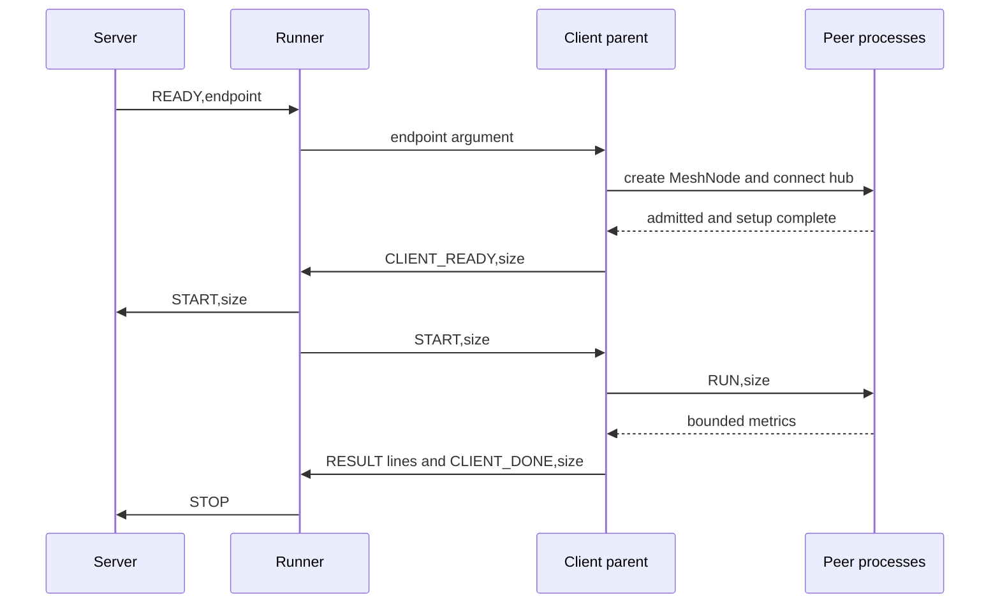

# zlink Multi Performance Test Policy

> **적용 범위**: zlink 전체 (core + bindings) — multi-client 벤치마크
> **Policy Version**: 2.0
> **Date**: 2026-07-18
> **Scope**: zlink multi-client 성능 테스트 정책
>
> 본 정책은 `bindings/c/perf`의 multi C benchmark runner와 in-repo multi perf 자산이 존재하는
> 바인딩에 동일한 기준으로 적용한다.
> 단, 각 언어의 구현 완성도와 지원 패턴 범위는 다를 수 있으므로 실제 parity
> 수준은 언어별로 점검/정렬 대상이 된다.
>
> 언어별 적용 범위는 [PERF_POLICY.md](PERF_POLICY.md) 상단을 참조한다.
>
> **상위 문서**: [PERF_POLICY.md](PERF_POLICY.md) — 공통 원칙, 디렉터리 구조,
> RESULT 형식, 결과 저장, 출력 형식, 실패 처리, 환경 변수(공통), 리팩토링 원칙
>
> **관련 문서**: [PERF_SINGLE_TEST_POLICY.md](PERF_SINGLE_TEST_POLICY.md), [PERF_SPOT_TEST_POLICY.md](PERF_SPOT_TEST_POLICY.md)
>
> 본 문서는 multi suite **전용** 정책만 기술한다.
> 양 suite에 공통으로 적용되는 규칙은 상위 문서에서 관리한다.
---

## 1. Multi 핵심 정책

| 항목 | 기준 |
|------|------|
| 측정 모델 | time-based, 패턴별 phase: ready → active. active에서 throughput과 latency를 함께 측정한다 |
| throughput | `recv_count / duration_seconds` — echo 패턴: `ops/s`, one-way 패턴: `msg/s` |
| latency | active phase에서 수신된 메시지의 내장 timestamp(header) 기반 집계다 |
| 대표값 | median (runs > 1) |
| 기본 runs | 1 |

- 목적: 벤치 코드가 병목이 되지 않게 유지하면서, 선택된 I/O 모델의 성능을 측정한다.
- 한 줄 요약: `multi = poller POLLIN drain + POLLOUT backpressure`
  - backpressure 전략: `echo 서버: deque, echo 클라이언트/one-way sender: bool 플래그`

### 1.1 I/O 모델

- **recv 모델**:
  - recv: poller `POLLIN` readiness 감지 → `zlink_recv()` / `zlink_msg_recv()`
    비동기 drain 루프 (react 방식). poller가 readable을 알려주면 수신 가능한
    만큼 drain한다.
  - send: `send(..., DONTWAIT)` nonblocking send 사용.
  - send backpressure: poller `POLLOUT` readiness 감지 → writable 상태에서만
    send 수행. `EAGAIN` 발생 시 `POLLOUT`을 대기하고, writable이 되면 재개한다.
  - app thread가 poller event loop를 직접 구동하며, `POLLIN` / `POLLOUT`
    이벤트에 따라 recv drain과 send 재개를 처리한다.
  - `send_ready_handler`는 사용하지 않는다.
- multi one-way와 send/send echo pattern은 recv 모델로 측정한다. raw socket
  request/reply pattern은 public completion poller로 reply completion을 측정한다.
- Spot 계열은 direct message callback이나 socket poller를 사용하지 않는다.
  MeshNode의 `zlink_mesh_node_drain_ready()`로 ready record를 받고 claim을 얻은 뒤
  `zlink_mesh_claim_recv_batch()`로 record를 읽는다.
- `MULTI_SPOT_REQREP` server는 `ZLINK_MESH_RECORD_SPOT_REQUEST`를 읽고
  `zlink_mesh_reply()`로 응답한다. requester는 infrastructure claim batch의
  `ZLINK_MESH_RECORD_COMPLETION`을 읽은 뒤 다음 request를 제출한다.
- `MULTI_SPOT_SENDSEND` 양쪽은 `ZLINK_MESH_RECORD_SPOT_SEND`를 읽는다. hub는 source
  Spot 주소로 `zlink_spot_send_to_spot()`을 호출해 echo를 반환한다.
- `MULTI_STREAM`은 raw callback을 테스트하지 않고
  `zlink_stream_packet_handler()`를 기준으로 packet receive surface를 테스트한다.
- `while (send 실패)` 식의 즉시 재시도는 금지한다.

#### Ready source dispatch

poller wait 이후 hot path는 poller가 ready로 보고한 source만 처리해야 한다.
이는 측정 의미를 바꾸기 위한 규칙이 아니라, 언어별 perf harness가 불필요한
반복 작업을 측정값에 섞지 않도록 하는 구현 parity 규칙이다.

- C `zlink_poll`처럼 API가 poll item 배열에 `revents`를 기록하는 형태라면,
  poll item 배열을 순회할 수 있다. 이 경우에도 `revents == 0` 항목은 즉시
  건너뛰고, 실제 recv drain이나 send 재개는 ready bit가 있는 source에서만
  수행한다.
- C++처럼 wait 결과가 ready event 목록이면 그 목록만 dispatch한다.
- Java, .NET 등 managed binding perf는 poll 결과를 ready index 목록이나
  ready event 목록으로 보존해야 한다. active hot path에서 매 wake마다 전체
  socket 수를 다시 훑으면서 `isReady(index)`를 반복 호출하는 구조는 피한다.
- 이 규칙은 echo client의 `inflight 1`, nonblocking send, `POLLIN` drain,
  `POLLOUT` backpressure 의미를 바꾸지 않는다.

### 1.2 Backpressure 전략

역할별 backpressure 전략:

- **send/send echo 서버** (소켓 1개 × 클라이언트 N개):
  - `EAGAIN` 시 per-socket pending deque에 메시지를 저장한다.
  - pending이 있는 동안 새 send는 pending deque에 추가만 한다.
  - poller `POLLOUT` readiness에서 pending deque를 `EAGAIN`까지 drain한다.
  - 소켓 1개로 N개 클라이언트를 처리하므로, EAGAIN 중에도 다른 클라이언트의 메시지가 도착할 수 있어 deque가 필요하다.
- **send/send echo 클라이언트** (per-socket, inflight 1):
  - `EAGAIN` 시 `bool send_pending` 플래그만 설정한다.
  - poller `POLLOUT` readiness에서 플래그 확인 후 재전송한다.
  - 응답 수신 → 다음 전송의 1:1 대응이므로 deque 불필요하다.
  - 이 `inflight 1`은 구현 선택이 아니라 측정 계약이다.
    `MULTI_DEALER_ROUTER_SENDSEND`, `MULTI_ROUTER_ROUTER_SENDSEND`,
    `MULTI_STREAM` echo client는 소켓별 outstanding send를 반드시 1개로 유지해야
    하며, 숨은 추가 inflight/deque/window를 두면 안 된다.
  - 기존 `MULTI_DEALER_ROUTER`, `MULTI_ROUTER_ROUTER` 이름은 위 send/send echo
    pattern의 호환 이름이다.
- **request/reply 클라이언트** (per-socket, inflight 1):
  - client process는 N개 requester socket을 하나의 active poller loop에서
    multiplex한다. socket마다 별도 recv/progress thread를 만들지 않는다.
  - 각 requester socket은 inflight request를 1개만 유지한다.
  - public request API로 request를 제출하고, 같은 active poller에 completion
    대상을 `POLLCOMPLETION` 단독으로 등록한다.
  - requester socket은 request 제출 뒤에도 reply 수신/progress 경로를 계속
    실행해야 한다. `POLLCOMPLETION`은 이 requester socket reply progress와
    completion callback drain을 public poller loop에 묶는 등록이다.
  - completion drain 뒤 다음 request를 제출한다. 별도 progress thread, timer,
    pipe wake, sleep fallback은 금지한다.
- **one-way sender** (단일 흐름):
  - `EAGAIN` 시 `bool send_pending` 플래그만 설정한다.
  - poller `POLLOUT` readiness에서 플래그 확인 후 재전송한다.
- **one-way receiver**: send 없음, backpressure 불필요.

### 1.3 동시성

- app thread가 poller event loop를 단일 스레드로 구동하므로 직렬화된다.

### 1.3.1 Poller wait timeout 정책

multi 패턴의 poller wait는 core readiness/completion 신호가 깨우는 방식을
기준으로 한다. wire-level stop token으로 종료되는 순수 recv/readiness loop는
**`-1` (signal-driven 무한 wait)** 을 사용한다. 반면 active duration이나
request timeout 같은 application clock을 직접 닫아야 하는 sender/requester
loop는 C 기준처럼 deadline 재확인을 위한 bounded wait를 둘 수 있다. 이 bounded
wait는 신호 누락을 덮는 timer fallback이 아니라, poller wakeup 뒤 같은 loop에서
active deadline을 다시 확인하기 위한 상한이다.

| 항목 | 규칙 |
|------|------|
| wire stop token으로 종료되는 recv/readiness loop | **`-1`** (signal-driven wait) |
| active duration/request timeout을 직접 닫는 sender/requester loop | C 기준 bounded wait. MeshNode Spot 계열은 nonblocking ready/claim drain 뒤 deadline을 다시 확인 |
| 짧은 timer tick 기반 fallback (1–25 ms) | 금지. 과거 wakeup 누락 우회용으로 사용됐으나 core fix 이후 사용 금지. 단, C 기준 코드가 같은 위치에서 `perf_socket_poll(NULL, 0, N)`을 쓰는 idle wait는 `PERF_POLICY.md`의 empty-poll 예외를 따른다 |
| 종료 / cooldown 용 별도 deadline 검사 | 별도 application clock 으로 처리하고 poller timeout 으로 대체하지 않음 |

송수신 양방향 가능한 Spot 워크로드(`MULTI_SPOT_SENDSEND`)의 각 peer는 outstanding
send를 1개만 유지하고 echo record를 읽은 뒤 다음 send를 제출한다. `EAGAIN`이면
ready/claim 진행을 계속한 뒤 다시 제출한다. 별도 송신 간격이나 재시도 횟수 상한을
두지 않는다.

request completion이 있는 socket request/reply 워크로드는 같은 active poller에 completion 대상을
**`ZLINK_POLLCOMPLETION` 단독**으로 등록한다. `ZLINK_POLLCOMPLETION`은
`POLLIN`/`POLLOUT` readiness와 섞어 등록하지 않는다. completion event는 public
event로 보고되지 않을 수 있지만, poller wait가 hidden completion queue를
drain하면 app thread는 즉시 완료된 slot state를 다시 확인하고 그 slot의 다음
request를 submit해야 한다. binding perf는 이 completion poller 의미를 따라야
하며, completion progress를 위해 socket별 recv/progress thread, timer, pipe,
setInterval, sleep fallback을 추가하면 측정이 무효다.
socket request/reply 워크로드에서 이 completion drain은 requester socket의 reply
수신/progress를 포함한다. requester 가 request만 submit하고 socket receive/progress
를 돌리지 않는 구조는 reply completion을 관측할 수 없으므로 정책 위반이다.
Node처럼 callback 전달이 event loop turn에서 완료되는 binding은 poller wait 이후
callback dispatch turn을 한 번 허용한다. 이 turn은 `POLLCOMPLETION` poller가
completion을 drain한 뒤 언어 런타임 callback을 실행시키는 단계일 뿐이며, 별도
timer나 progress pump로 completion을 진행하면 안 된다.

Spot request/reply는 위 socket poller 규칙의 대상이 아니다. requester MeshNode의
infrastructure claim batch에서 completion record를 읽는 Core 10.0.0 공개 경로를 사용한다.

#### Shutdown / phase 종료 신호 — wire-level stop token

receiver 또는 server thread 가 sender / phase 종료를 감지해야 하는 경우
**별도의 fd / signal helper 를 사용하지 않는다**. 대신 sender 가 phase
종료 시 wire 위로 stop token (`__zlink_perf_stop__`) 메시지를 송신한다.
receiver 는 `-1` poller wait 으로 대기하다가 메시지를 받으면 먼저 stop
token인지 검사한다. active 집계 구간은 pattern별 application clock 으로
닫으며, stop token은 `-1` wait 을 깨우고 phase 종료를 알리는 wire-level
신호다.
`MULTI_PUBSUB`도 같은 규칙을 따른다. active payload와 같은 topic 위로
stop token을 blocking publish 하며, client는 payload header를 해석하기 전에
stop token을 먼저 검사한다. PUBSUB의 active 집계는 여전히 configured
duration 안의 `phase_active` payload만 포함한다.

| 항목 | 규칙 |
|------|------|
| stop token literal | `__zlink_perf_stop__` (multi/single 공통, `k_stop_token`) |
| sender 측 | active phase 종료 후 stop token blocking send/publish (deadline 무시). raw one-way는 필요한 socket마다 송신한다 |
| receiver 측 | `-1` poller wait → recv → `is_stop_token(...)` 먼저 검사 → pattern별 phase 종료 처리 |
| atomic flag + 짧은 polling 패턴 | **금지**. 동일 process 내 thread 간 종료 동기화도 wire stop token 으로 통일 |

이 패턴의 장점:
- 별도 fd / eventfd / pipe / cancellation token 불필요 → cross-platform
  분기 없음
- 모든 binding 이 동일한 idiom 으로 구현 가능
- 기존 multi server 의 stop token 처리와 일치 (`is_stop_token` 헬퍼 그대로 활용)
- poller timeout fallback 없이도 phase 종료 시 receiver 를 깨울 수 있음

> 회귀 가드: `core/tests/integration/test_spot_poller.cpp` 의
> `test_spot_poller_wait_all_returns_promptly_after_*` 와
> `test_spot_poller_accepts_pollin_or_pollout_combined` 참조.

### 1.4 성능 참고

- 정상 perf에서는 auto-HWM과 backpressure가 burst를 조절한다. EAGAIN은
  현재 부하와 자동 계산된 물리 HWM에 따라 발생할 수 있으며, runner가 이를
  없애기 위해 고정 HWM이나 전송 속도 제한을 적용하지 않는다.
- deque/플래그는 정확성을 위한 safety net이며, hot path에서는 `empty()` / `bool` 체크만 수행된다.

### 1.5 Ready Gate

ready gate는 패턴이 실제 active payload를 시작할 수 있는 최소 조건만 확인한다.

| 패턴군 | ready 조건 |
|---|---|
| raw socket | client socket의 `CONNECTION_READY` 확인 뒤 `CLIENT_READY,<size>` 출력 |
| `MULTI_SPOT_PUBSUB` | N개 peer MeshNode가 hub에 admitted되고 subscription descriptor와 hub Spot generation setup 완료 |
| `MULTI_SPOT_REQREP` / `MULTI_SPOT_SENDSEND` | N개 peer MeshNode가 hub에 admitted되고 hub Spot generation setup 완료 |
| `MULTI_STREAM` | STREAM 연결과 패턴별 HELLO/READY 계약 완료 |

Spot 계열에서 `clients`는 peer MeshNode 수다. client parent는 N개 child process를 만들고,
각 child는 MeshNode 하나와 entry Spot 하나를 만든다. 모든 peer는 hub에만 연결한다.
`connect_peer()` 제출 성공만으로 ready를 선언하지 않으며, `zlink_mesh_node_peers()`의
`ZLINK_MESH_PEER_ADMITTED` 상태와 setup request/reply 완료를 확인한다.

Spot 계열은 Core 9의 별도 control SpotNode, `CONTROL_READY`, `DATA_ENDPOINT`,
`READY_COUNT` protocol을 사용하지 않는다. 모든 child가 준비되면 client parent가
`CLIENT_READY,<size>`를 출력하고 runner가 server와 client에 `START,<size>`를 전달한다.
세부 토폴로지와 record 종류는 [Core 10.0.0 Spot 성능 시험 정책](./PERF_SPOT_TEST_POLICY.md)을 따른다.

### 1.6 Auto-HWM 정책

- multi 기본 HWM 정책은 context auto-HWM 이다. perf는
  `ZLINK_CTX_OPT_AUTO_HWM_ENABLE` 을 켜고 benchmark socket과 spot handle의
  기본 `SNDHWM`, `RCVHWM`을 core 계산값에 맡긴다.
- multi 기본 OS socket buffer 정책은 `SNDBUF=-1`, `RCVBUF=-1`이다. 기본
  경로는 OS 기본 buffer와 TCP 자동 조정에 맡긴다.
- multi 기본 context I/O thread 수는 server와 raw socket client 모두 `4`다. C 기준과
  binding perf는 이 값을 같게 적용해야 한다. 언어 runtime 기본값을 그대로
  쓰거나 single suite 기본값 `1`을 multi에 가져오면 비교 의미가 달라진다.
  Spot peer process는 MeshNode 하나와 peer 연결 하나만 소유하므로 context I/O thread
  기본값을 `1`로 두며, `PERF_MULTI_SPOT_NODE_IO_THREADS`로 별도 비교할 수 있다.
- 기본 실행에서는 pattern/role 특례 없이 같은 context budget을 공유한다.
  숫자 HWM이나 transport buffer를 직접 주입해서 결과를 고정하지 않는다.
- multi runner는 실행 중인 메시지 크기를 context
  `ZLINK_CTX_OPT_AUTO_HWM_MSG_UNIT_BYTES`로 전달한다. 이 값은 최대 메시지
  크기 제한이 아니라 auto-HWM 예산을 메시지 슬롯으로 바꾸는 계획 단위다.
- C, .NET, Java 등 multi perf는 size 케이스마다 아래 순서를 지켜야 한다.
  1. benchmark context를 만든다.
  2. socket 또는 MeshNode와 Spot을 만들고 bind/connect 준비를 끝낸다.
  3. 해당 케이스의 payload size를 context
     `AUTO_HWM_MSG_UNIT_BYTES`로 설정하고 auto-HWM을 다시 계산한다.
  4. ready gate 이후 active phase를 시작한다.
- 이 순서가 빠지면 작은 메시지와 큰 메시지가 같은 HWM 계획 단위를 쓰게 되어
  C 기준과 비교 의미가 달라진다.
- MeshNode와 Spot handle에는 raw socket 공통 옵션을 설정하지 않는다.
  `ZLINK_OPT_AUTO_HWM_MSG_UNIT_BYTES`는 raw socket 옵션이므로 SPOT_PUBSUB 서비스
  핸들에 적용하려는 코드는 정책 위반이다. C API에서는 해당 호출이 `EINVAL`로
  실패한다. MeshNode 내부 data path는 context message unit을 따른다.
- `PERF_MULTI_HWM`, `PERF_MULTI_SNDHWM`, `PERF_MULTI_RCVHWM`, `PERF_SNDBUF`,
  `PERF_RCVBUF` 는 debug 전용 override 이다. 기본 경로에서는 비활성이고,
  `PERF_MULTI_ALLOW_MANUAL_SOCKET_OVERRIDES=1` 또는
  `PERF_ALLOW_MANUAL_SOCKET_OVERRIDES=1` 이 켜졌을 때만 허용한다.
- Spot 계열은 별도 control socket을 만들지 않는다.

OOM을 피하려고 숫자 HWM, 송신 간격, peer 수, payload 크기, active duration을 낮추면
공식 결과로 인정하지 않는다. `EAGAIN`은 auto-HWM이 만든 backpressure로 처리하고,
Core가 backpressure를 반환하지 않은 채 메모리를 계속 늘리면 Core 버그로 수정한다.

### 1.7 금지 단계

multi lifecycle에서 아래 단계는 만들지 않는다.

- `preflight`
- `prime`
- `stable`
- `quiet`
- `quiescent`
- `server stop wait`

위 항목이 이미 존재하지만 실제로는 ready 이벤트 대기나 phase 종료 정리를
우회적으로 표현한 것뿐이면 삭제하고 `ready -> active`에 흡수한다.

---

## 2. 프로세스 모델

Multi 벤치마크는 **server/client 별도 프로세스**로 동작한다.

| 역할 | 바이너리 | 책임 |
|------|----------|------|
| server | `comp_src_<pattern>_server(.exe)` | bind, relay/echo |
| client | `comp_src_<pattern>_client(.exe)` | connect, 패턴별 phase 정책에 따라 throughput/latency 측정 |

```text
┌─ server process ─────────────────────┐    ┌─ client process ──────────────────────┐
│  bind(endpoint)                      │    │  connect(endpoint) × N clients        │
│  relay/echo received messages        │◄──►│  phase별 throughput/latency 측정         │
│  READY stdout / stdin STOP 제어       │    │  RESULT: throughput, latency, p95/p99  │
└──────────────────────────────────────┘    └───────────────────────────────────────┘
                        ▲                                      ▲
                        └────── 스크립트가 양쪽 프로세스를 관리 ──┘
```

### 2.1 프로세스 간 조정 프로토콜

| 단계 | 동작 |
|------|------|
| 1. server 시작 | 스크립트가 server 바이너리를 spawn |
| 2. server READY | server가 bind 완료 후 stdout에 `READY,<endpoint>` 출력 |
| 3. client 시작 | 스크립트가 READY를 읽은 후 client 바이너리를 spawn (`--endpoint <endpoint>`) |
| 4. 측정 수행 | client가 active phase에서 throughput/latency를 동시 측정 |
| 5. client 종료 | client가 phase 완료 후 종료 (exit code 0) |
| 6. server 종료 | 스크립트가 server stdin에 `STOP` 메시지 송신 → graceful shutdown 대기 → timeout 시 SIGTERM (Linux) / TerminateProcess (Windows) → 재 timeout 시 SIGKILL (Linux). server/client가 출력한 RESULT line을 합산 |

> **server 종료 순서**: ① stdin `STOP\n` 송신 + stdin close ② shutdown timeout 대기 ③ `terminate()` (SIGTERM) ④ 2차 timeout 대기 ⑤ `kill()` (SIGKILL). server는 stdin에서 `STOP` 또는 `QUIT` 수신 시 graceful shutdown을 수행한다.

- server는 client 종료까지 상시 대기하며 relay/echo를 수행한다.
- phase 전환은 패턴별로 제어한다: echo는 client가 phase를 제어하고 server는 relay/echo 대기, one-way는 sender/receiver가 동일 순서의 phase를 수행한다. throughput/latency는 모두 active phase 한 구간에서 계산한다.
- multi active 유효 메시지 규칙은 패턴별 정책 문서에 정의된 단일 기준으로
  고정한다. C 기준과 모든 bindings는 같은 pattern에서 동일한 active 유효 메시지
  의미를 사용해야 한다.
- 스크립트는 양쪽 프로세스의 stdout을 수집하고, 종료 코드를 확인하여 결과를 합산한다.
- `READY,<endpoint>`는 프로세스 orchestration 용도다. benchmark start gate를 대체하지 않는다.
- raw socket client 의 연결 준비 조건은 각 바이너리 내부의
  `CONNECTION_READY` gate가 담당한다. runner-barrier raw pattern 의 실제 active
  시작 조건은 패턴별 `CLIENT_READY` / `START` 계약이 담당한다.
- Spot 계열은 모든 peer MeshNode의 admission과 hub Spot generation setup이 끝난 뒤
  client parent가 출력하는 `CLIENT_READY`와 runner의 `START`를 시작 조건으로 사용한다.

### 2.1.1 Runner ↔ 바이너리 Orchestration 메시지 규격

runner(스크립트/Python 엔진)와 server/client 바이너리는 **stdin/stdout 텍스트
프로토콜**로 프로세스 lifecycle을 조정한다. 각 메시지는 한 줄(`\n` 종단)이다.

- **즉시 flush 필수**: 모든 제어 메시지(`READY`, `CLIENT_READY`, `RESULT` 등)는
  출력 즉시 stdout을 flush해야 한다. runner는 메시지 도착으로 다음 단계를
  결정하므로, 버퍼링 지연은 orchestration 실패를 유발한다.
- managed runtime(Java, .NET 등)은 stdout auto-flush를 활성화하거나 매 라인
  출력 후 명시적 flush를 수행해야 한다.

#### Server stdout → Runner

| 메시지 | 형식 | 의미 |
|--------|------|------|
| `READY` | `READY,<endpoint>` | bind 완료, benchmark endpoint 전달 |
| `RESULT` | `RESULT,<lib>,<pattern>,<transport>,<size>,<metric>,<value>` | 측정 결과 |
| `UNSUPPORTED` | `UNSUPPORTED,<lib>,<pattern>,<transport>` | transport 미지원 |

#### Client stdout → Runner

| 메시지 | 형식 | 의미 |
|--------|------|------|
| `CLIENT_READY` | `CLIENT_READY,<msg_size>` | client가 해당 size 케이스 준비 완료 |
| `CLIENT_DONE` | `CLIENT_DONE,<msg_size>` | client가 해당 size RESULT 출력까지 완료 |
| `RESULT` | `RESULT,<lib>,<pattern>,<transport>,<size>,<metric>,<value>` | 측정 결과 |
| `UNSUPPORTED` | `UNSUPPORTED,<lib>,<pattern>,<transport>` | transport 미지원 |
| `SKIP` | `SKIP,<lib>,<pattern>,<transport>,<reason>` | 건너뛰기 |

#### Runner → Server stdin

| 메시지 | 형식 | 의미 |
|--------|------|------|
| `START` | `START,<msg_size>` | 해당 size 케이스 active 시작 |
| `STOP` | `STOP` | graceful shutdown 요청 |
| `QUIT` | `QUIT` | graceful shutdown 요청 (`STOP`과 동일) |

#### Runner → Client stdin

| 메시지 | 형식 | 의미 |
|--------|------|------|
| `START` | `START,<msg_size>` | 해당 size 케이스 active 시작 |
| `PHASE_ACTIVE` | `PHASE_ACTIVE,<msg_size>` | C runner 호환용 one-way 보조 token. active gate가 아니며 client가 필수 조건으로 기다리면 안 됨 |

#### Spot 계열 process 내부 조정

Spot 계열은 runner 외의 별도 network control channel을 만들지 않는다. server는 hub
MeshNode endpoint를 `READY,<endpoint>`로 출력한다. client parent는 child process를 만들고
endpoint를 전달한다. 각 child의 admission과 setup request/reply가 끝나면 parent가
`CLIENT_READY,<size>`를 출력한다.

| 방향 | token | 의미 |
|---|---|---|
| Server → Runner | `READY,<endpoint>` | hub MeshNode bind 완료 |
| Client → Runner | `CLIENT_READY,<size>` | 모든 peer MeshNode admission과 setup 완료 |
| Runner → 양쪽 | `START,<size>` | active 구간 시작 |
| Client → Runner | `CLIENT_DONE,<size>` | child 결과 집계와 RESULT 출력 완료 |
| Runner → 양쪽 | `STOP` | 종료와 정리 요청 |

#### 패턴별 Orchestration 시퀀스

raw socket과 Spot 계열은 공통 runner token을 사용한다. 패턴별 ready 조건만 다르다.



Spot pub/sub server는 active deadline까지 Logical Multicast를 publish하고 cooldown header를
보낸다. request/reply와 send/send server는 client active 구간 동안 ready/claim batch를
계속 drain해 reply 또는 echo send를 제출한다.

#### 메시지 규격 정리

- 모든 메시지는 `\n` 종단 한 줄 텍스트.
- 필드 구분자는 `,` (comma).
- `PHASE_ACTIVE,<msg_size>`는 C runner 호환용 보조 token이다. 실제 active 시작
  조건은 아니므로, 언어별 client가 이 token을 기다리는 구조를 만들면 안 된다.
- raw socket의 실제 연결 확인은 바이너리 내부 `CONNECTION_READY`가 담당한다.
  Spot의 실제 연결 확인은 peer admission과 setup request/reply가 담당한다.
  그 확인이 끝난 뒤 `CLIENT_READY,<msg_size>`와 `START,<msg_size>`가 active 시작
  barrier를 구성한다.

### 2.2 소스 파일 구조

```text
perf/multi/
├── common/
│   ├── perf_common.hpp                # 공통 (settings, result, utilities)
│   └── perf_common_multi.hpp          # multi 설정
├── src/
│   ├── perf_multi_<pattern>_server.cpp    # server (server)
│   ├── perf_multi_<pattern>_client.cpp    # client (client)
│   └── ...
```

- 모든 패턴은 `_server.cpp` / `_client.cpp` **별도 소스 파일 / 별도 바이너리**로 작성한다.
- 별도 모델 구분용 server 파일이나 별도 public pattern 이름을 추가하지 않는다.
- 공통 로직(settings 해석, RESULT 출력, TLS 설정 등)은 multi common 계층에 유지한다. 단, 정책은 공통 로직의 정확한 파일명이나 파일 배치를 고정하지 않는다.

---

## 3. Test Phase

### 3.1 전체 실행 구조

```text
┌─ pattern loop ──────────────────────────────────────────────────────────────┐
│  ┌─ transport loop ──────────────────────────────────────────────────────┐  │
│  │  ┌─ run loop ──────────────────────────────────────────────────────┐  │  │
│  │  │  [size loop]                                                    │  │  │
│  │  │    [1] spawn server(pattern, transport)                         │  │  │
│  │  │    [2] wait READY,<endpoint>                                    │  │  │
│  │  │    [3] spawn client(pattern, transport, size, endpoint)         │  │  │
│  │  │    [4] client 종료, RESULT line 수집                            │  │  │
│  │  │    [5] server 종료, server RESULT line 수집                     │  │  │
│  │  │  → run_cooldown (3s)                                            │  │  │
│  │  └────────────────────────────────────────────────────────────────┘  │  │
│  │  → transport_transition_cooldown (3s)                                │  │
│  └──────────────────────────────────────────────────────────────────────┘  │
│  → pattern_transition_cooldown (3s)                                        │
└────────────────────────────────────────────────────────────────────────────┘
```

```text
for pattern in [MULTI_DEALER_DEALER, MULTI_PUBSUB, ...]:
    for transport in pattern_transports:
        for run in 1..N:
            for size in msg_sizes:
                spawn server(pattern, transport)
                wait READY
                spawn client(pattern, transport, size, endpoint)
                wait client exit
                stop server
            run_cooldown
        transport_transition_cooldown
    pattern_transition_cooldown
```

### 3.2 Client 프로세스 내부 Phase (size 1개 기준)

```text
[ready] -> [active(throughput+latency)]
```

> echo는 client가 phase를 제어하며 server는 relay/echo 대기한다. one-way는 sender/receiver가 동일 순서의 phase를 수행한다.

| Phase | 방식 | 기본값 | 환경 변수 |
|-------|------|--------|-----------|
| ready | event-based | raw socket client=`CONNECTION_READY`, one-way raw start=`CLIENT_READY`/`START`, Spot=peer admission + setup request/reply + `CLIENT_READY`/`START` | `PERF_MULTI_CONNECT_READY_TIMEOUT_MS` |
| active | time-based | 5s | `PERF_MULTI_DURATION_SECONDS` |

> `PERF_MULTI_SETTLE_MS`는 C multi perf에서 삭제됐다. benchmark phase를 추가하는
> 호환용 settle 환경 변수는 두지 않는다.

### 3.3 Cooldown

| 전환 구간 | 기본값 | 환경 변수 | 이유 |
|-----------|--------|-----------|------|
| run 간 cooldown | 3000ms | `PERF_MULTI_RUN_COOLDOWN_MS` | 동일 조합 반복 run 사이 안정화 |
| transport 전환 | 3000ms | `PERF_MULTI_TRANSPORT_TRANSITION_MS` | 이전 transport 소켓 정리 (TIME_WAIT 해소) |
| pattern 전환 | 3000ms | `PERF_MULTI_PATTERN_TRANSITION_MS` | 이전 패턴의 전체 클라이언트 소켓 정리 |

- Multi 벤치마크는 대량의 클라이언트 소켓(1000~10000)을 사용하므로, transport/pattern 전환 시 OS 소켓 리소스 해제를 위한 충분한 대기가 필요하다.
- 전환 cooldown은 이전 server/client 프로세스 종료 후 다음 server 실행 전에 **스크립트 레벨**에서 `sleep`으로 수행한다.
- 마지막 transport/pattern 이후에는 전환 cooldown을 수행하지 않는다.

### 3.4 실행 계약 불변식

> 바이너리/runner 책임 분리의 공통 원칙은
> [PERF_POLICY.md § 1.2](PERF_POLICY.md) 참조.

- `pattern/transport/size` 는 측정의 최소 독립 단위다.
- 각 size 케이스는 반드시 **독립된 server/client 프로세스 쌍**으로 실행한다.
- runner는 size마다 server/client 바이너리를 **다시 실행**해야 한다.
- 여러 size를 하나의 server/client 생명주기에 묶어 실행하는 리팩토링은 정책 위반이다.
- server/client 바이너리는 해당 size 케이스를 측정하고 `RESULT` line만 출력한다.
- size 반복 실행, runs 집계, markdown table 출력, 결과 파일 저장은 runner 책임이다.
- size 간 상태 공유는 허용하지 않는다. 다음 size는 이전 size의 연결, ready 상태,
  active 집계, control state를 이어받아서는 안 된다.
- `transport_transition_ms`, `pattern_transition_ms` cooldown은 이전 케이스 종료
  후 다음 케이스 시작 전에만 적용한다. active 구간 안으로 밀어 넣거나 측정 시간에
  포함시키면 안 된다.
- runner 리팩토링은 위 불변식을 유지해야 하며, 변경 시 자동 검증(test)도 함께
  갱신해야 한다.

### 3.5 Size 전환/active-only 정책

- Multi는 run 내부에서 size loop를 수행하며, size마다 server/client를 별도 실행한다.
- size 변경은 이전 server/client 프로세스를 종료하고 새 프로세스 쌍을 재시작하는
  것으로 처리한다. 동일 프로세스 안에서 소켓을 유지한 채 size만 바꾸지 않는다.
- multi 기본 측정은 `ready -> active`만 사용한다.
- active 이전 추가 warmup phase나 active warmup 환경 변수는 두지 않는다.
- active 구간 밖의 송수신은 준비 확인과 종료 정리에만 한정한다.

---

## 4. Throughput/Bandwidth 측정

### 4.1 패턴 방향 분류

각 패턴은 메시지 흐름 방향에 따라 **echo(왕복)** 또는 **one-way(단방향)**으로 분류되며, throughput 단위가 다르다.

| 방향 | 단위 | 의미 | 측정 지점 | 패턴 |
|------|------|------|-----------|------|
| send/send echo | `ops/s` | send/recv 기반 왕복 완료 수/초 | client 측 recv | MULTI_DEALER_ROUTER_SENDSEND, MULTI_ROUTER_ROUTER_SENDSEND, MULTI_STREAM, MULTI_SPOT_SENDSEND |
| request/reply | `ops/s` | public request/reply 완료 수/초 | client 측 completion | MULTI_DEALER_ROUTER_REQREP, MULTI_ROUTER_ROUTER_REQREP, MULTI_SPOT_REQREP |
| one-way | `msg/s` | 단방향 수신 수/초 | receiver 측 recv | MULTI_DEALER_DEALER, MULTI_PUBSUB, MULTI_SPOT_PUBSUB |

- echo 패턴: client가 send → server echo → client recv. 1 rtt = 2 message hops. client가 echo를 수신한 횟수를 카운트한다.
- `MULTI_DEALER_ROUTER_SENDSEND` 와 `MULTI_ROUTER_ROUTER_SENDSEND` 는
  public send/recv API로 왕복 echo를 만든다. 기존 `MULTI_DEALER_ROUTER`,
  `MULTI_ROUTER_ROUTER` 이름은 이 두 패턴의 호환 이름이다.
- `MULTI_DEALER_ROUTER_REQREP` 와 `MULTI_ROUTER_ROUTER_REQREP` 는 public
  request/reply API와 `POLLCOMPLETION`으로 왕복 완료를 만든다.
- one-way 패턴: sender가 송신한 메시지를 receiver가 수신한다(서버 relay 또는 server push 포함). 1 msg = 1 message hop으로 보고, receiver 수신 수를 카운트한다.
- 동일 단위의 패턴 간에만 throughput을 직접 비교할 수 있다.

### 4.2 Throughput 계산

1. duration 구간의 수신량으로 계산한다.
2. `throughput = recv_count / duration_seconds`
3. active 구간 밖의 데이터는 계산에서 제외한다.

### 4.3 Bandwidth (네트워크 전송량)

throughput과 메시지 크기로부터 실제 네트워크 전송량(MB/s)을 계산한다. 패턴 방향에 따라 계산이 다르다.

| 방향 | 계산식 | 의미 |
|------|--------|------|
| echo (`ops/s`) | `throughput × msg_size × 2 / 1,000,000` | 양방향 총 전송량 (send + recv) |
| one-way (`msg/s`) | `throughput × msg_size / 1,000,000` | 단방향 전송량 |

- 단위: `MB/s` (1 MB = 1,000,000 bytes, SI 기준)
- echo 패턴은 send/recv 양방향 데이터가 이동하므로 `×2`를 적용한다.
- bandwidth는 throughput 단위(ops/s vs msg/s)가 다른 패턴 간에도 **실제 데이터 처리량**으로 직접 비교할 수 있는 공통 지표이다.

---

## 5. Latency 측정

latency는 패턴 유형에 따라 측정 방식을 분리한다.

### 5.1 Phase 순서

각 size는 아래 순서로 측정한다.

1. echo 패턴: ready → active phase
2. one-way 패턴: ready → active phase
- 기본 echo/one-way 패턴은 active phase 단일 실행에서 throughput/latency를 동시에 산출한다.
- `MULTI_SPOT_PUBSUB`도 별도 송신 간격이나 latency-only pass를 두지 않는다.
  active 구간의 timestamp 차이는 queue 체류 시간을 포함한 포화 조건의 지연 시간이다.

### 5.2 패턴별 divisor 규칙

| 유형 | divisor | 적용 패턴 |
|------|---------|-----------|
| 양방향 RTT | `2` | MULTI_DEALER_ROUTER_SENDSEND, MULTI_ROUTER_ROUTER_SENDSEND, MULTI_DEALER_ROUTER_REQREP, MULTI_ROUTER_ROUTER_REQREP, MULTI_STREAM, MULTI_SPOT_REQREP, MULTI_SPOT_SENDSEND |
| 단방향 | `received_count` | MULTI_DEALER_DEALER, MULTI_PUBSUB, MULTI_SPOT_PUBSUB |

### 5.3 계산식

- mean: active phase에서 수집한 샘플의 산술 평균
- p95: 샘플의 95th percentile
- p99: 샘플의 99th percentile
- mean은 active 유효 record 전체의 count와 합으로 정확히 계산한다.
- p95/p99는 메모리가 처리량에 비례해 증가하지 않도록 bounded reservoir sample로
  계산한다. sample 상한은 메시지 queue, HWM, 송신률 또는 완료 수를 제한하지 않는다.
- RTT 샘플(echo): `sample_ns = (recv_ts_ns - sent_ts_ns) / 2`
- 단방향 샘플(one-way): 수신 메시지에 포함된 송신 타임스탬프 기준 `now_ns - sent_ts_ns`
- active 구간 밖의 데이터는 계산에서 제외한다.
- sample은 내부적으로 nanosecond 단위로 누적하고, RESULT line과 사람이 읽는
  report/table에는 millisecond 단위로 표시한다.

### 5.4 one-way latency 집계 규칙

one-way 패턴 latency는 패턴의 실제 receiver 측에서 측정한다.

- `MULTI_DEALER_DEALER`: server(receiver) 기준으로 latency 측정
- `MULTI_PUBSUB`, `MULTI_SPOT_PUBSUB`: client(receiver) 기준으로 latency 측정
- active phase 구간에서 수신한 메시지는 throughput count와 mean 집계에 모두 포함한다.
- mean은 `lat_sum / lat_count`로 계산하고, p95/p99만 bounded reservoir를 사용한다.

### 5.5 Header 기반 필터 규칙

- 측정 메시지 payload 선두에는 공통 metric header를 포함한다: `magic`, `run_id`, `phase`, `msg_size`, `seq`, `sent_ts_ns`.
- receiver는 header를 decode하여 `phase == active`, `msg_size == expected_size`,
  `run_id == current_case_run_id` 조건을 만족하는 샘플만 집계한다.
- ROUTER 계열 multipart 수신은 routing frame이 앞에 올 수 있으므로 capture buffer에서 header magic을 스캔해 payload header를 탐지한다.
- header 불일치(다른 size/phase, stale 메시지)는 수신 드레인만 수행하고 메트릭 집계에서 제외한다.

---

## 6. 유효성 판정 (multi 전용)

> 상태 분류(success / unsupported / skip / fail), retry 금지,
> UNSUPPORTED 오용 금지, inflight 금지 등 공통 실패 처리 정책은
> [PERF_POLICY.md § 7](PERF_POLICY.md) 참조.

### 6.1 상태 판정 토큰

스크립트는 바이너리의 stdout과 종료 코드를 조합하여 상태를 판정한다.

| 상태 | 판정 기준 |
|------|-----------|
| success | exit code 0 + RESULT line 존재 |
| unsupported | stdout에 `UNSUPPORTED` 토큰 출력 + exit code 0, 또는 stderr에 `protocol not supported` 포함 |
| skip | stdout에 `SKIP` 토큰 출력 + exit code 0 |
| fail | exit code ≠ 0, 또는 timeout, 또는 RESULT line 미출력 (exit 0이나 데이터 없음 = no_data) |

- `UNSUPPORTED` 토큰 형식: `UNSUPPORTED,<lib>,<pattern>,<transport>`
- `SKIP` 토큰 형식: `SKIP,<lib>,<pattern>,<transport>,<reason>`
- **stderr 기반 unsupported 판정**: 바이너리 stderr에 `protocol not supported` 문자열이 포함되면 실행 엔진이 해당 조합을 `unsupported`로 자동 분류한다. 이는 런타임에서 지원되지 않는 transport를 감지하는 메커니즘이다.
- 동일 조합에서 RESULT line과 UNSUPPORTED/SKIP 토큰이 동시에 출력되면 **RESULT line을 우선**한다.
- MULTI_STREAM에서 테스트 모델 위반(예: non-STREAM server 사용, zlink STREAM
  client `connect()` 경로 사용)은 `UNSUPPORTED`/`SKIP` 대상이 아니다.
  해당 구현 경로는 코드에서 삭제하고 정책 모델로 재구현해야 한다.

### 6.2 유효성 규칙

1. 모든 `pattern/transport/size` 조합에서 RESULT line이 출력되어야 한다.
2. `unsupported`는 fail 집계에서 제외한다.
3. `skip`은 fail 집계에서 제외한다. 단, 결과 테이블에서 skip 조합의 행은 `fail`로 표시된다 (내부적으로는 skip으로 분류되어 완료 판정에서 제외).
4. runs > 1인 경우 대표값은 **median**을 사용한다.
5. 동일 `pattern/transport/size/metric` 조합의 RESULT line이 **중복** 출력되면 **마지막 값**을 사용한다. 중복 자체는 에러가 아니며 warning을 출력한다.
6. RESULT line의 필드 수가 7개가 아니면 해당 라인을 무시하고 warning을 출력한다.

### 6.3 종료 코드

| 종료 코드 | 의미 | 상황 |
|-----------|------|------|
| 0 | 성공 | 모든 조합 complete |
| 1 | 실행 오류 | 빌드 실패, 바이너리 미존재, partial 결과 |

- partial 상태(일부 조합 실패)는 종료 코드 1이다.
- 여러 오류 조건이 동시에 발생하면 가장 높은 종료 코드를 반환한다.

### 6.4 옵션 우선순위

실행 옵션이 여러 경로로 지정될 수 있는 경우 아래 우선순위를 따른다 (높은 순).

| 옵션 | CLI 인자 | 환경 변수 | 기본값 |
|------|----------|-----------|--------|
| runs | `--runs N` | — | 1 |
| msg sizes | `--msg-sizes` | `PERF_MSG_SIZES` | 표준 6종 |
| transports | `--transports` | `PERF_TRANSPORTS` | 패턴별 기본값 (§ 8.3 참조) |
| clients | `--clients` | `PERF_MULTI_CLIENTS` | 100 (stream=10000), 메모리 가드 초과 시 해당 pattern skip |

- **CLI 인자 > 환경 변수 > 기본값** 순으로 적용한다.
- shell entrypoint의 메모리 가드(`PERF_MULTI_MEMORY_BUDGET_PCT` 기반)가 예상 메모리 사용량이 예산을
  넘는다고 판단하면 해당 pattern을 실행하지 않는다. client 수나 전송 속도를 자동으로 낮추지 않는다.
  `PERF_SKIP_MEMORY_CHECK=1`로 이 사전 검사를 비활성화할 수 있다.

---

## 7. Metric Tiers

> Tier 1 필수 메트릭(throughput, bandwidth, latency, latency_p95, latency_p99)과
> RESULT line 형식은 [PERF_POLICY.md § 4.2](PERF_POLICY.md) 참조.

### 7.1 Tier 2: 권장 (RESULT line 미출력, 향후 확장 예약)

| 메트릭 | 단위 | 설명 |
|--------|------|------|
| `connect_ms` | ms | 전체 클라이언트 연결 완료 시간 |
| `ready_ms` | ms | 연결 후 준비 완료 대기 시간 |

- Tier 2 메트릭은 현재 RESULT line에 출력하지 않는다. 향후 구현 시 RESULT line에 추가할 수 있다.
- 누락 시 완료 판정에 영향 없음.

### 7.2 Tier 3: 정보성

- 이번 정책에서는 cpu/mem 계열 정보성 metric을 기본 RESULT line과 결과 테이블에 포함하지 않는다.
- 정보성 metric이 필요하면 별도 진단 작업으로 분리한다.

---

## 8. Pattern & Transport Matrix

### 8.1 지원 패턴

MULTI_DEALER_DEALER, MULTI_DEALER_ROUTER_SENDSEND, MULTI_ROUTER_ROUTER_SENDSEND,
MULTI_DEALER_ROUTER_REQREP, MULTI_ROUTER_ROUTER_REQREP, MULTI_PUBSUB, MULTI_SPOT_PUBSUB,
MULTI_SPOT_REQREP, MULTI_SPOT_SENDSEND, MULTI_STREAM

`MULTI_DEALER_ROUTER` 와 `MULTI_ROUTER_ROUTER` 는 기존 결과와 runner 호환을 위한
send/send echo alias 이다. 새 문서, 새 runner 옵션, 새 결과 표에서는 각각
`MULTI_DEALER_ROUTER_SENDSEND`, `MULTI_ROUTER_ROUTER_SENDSEND` 를 사용한다.

#### 바인딩 소스 파일 명명 규칙

모든 벤치마크 소스 파일은 **`perf_`** 접두어를 사용한다. multi는 server/client 역할 분리를 필수로 하며, 소스 위치는 [PERF_POLICY.md § 2.0.2](PERF_POLICY.md)를 참조한다.

| 언어 | server 파일 | client 파일 | 예시 |
|------|-----------|-----------|------|
| C binding reference | `perf_multi_<pattern>_server.cpp` | `perf_multi_<pattern>_client.cpp` | `perf_multi_stream_server.cpp` |
| C++ binding | `perf_multi_<pattern>_server.cpp` 또는 `perf_main.cpp --multi-server` | `perf_multi_<pattern>_client.cpp` 또는 `perf_main.cpp --multi-client` | `perf_multi_stream_server.cpp` |
| .NET | `PerfMulti<Pattern>Server.cs` | `PerfMulti<Pattern>Client.cs` 또는 `PerfMain --multi-client` | `PerfMultiStreamServer.cs` |
| Java | `PerfMulti<Pattern>Server.java` | `PerfMulti<Pattern>Client.java` 또는 `PerfMain --multi-client` | `PerfMultiStreamServer.java` |
| Node | `perf_multi_<pattern>_server.js` | `perf_multi_<pattern>_client.js` | `perf_multi_stream_server.js` |
| Python | `perf_multi_<pattern>_server.py` | `perf_multi_<pattern>_client.py` | `perf_multi_stream_server.py` |

- STREAM 계열은 public pattern 이름을 `stream` 하나만 사용한다.
- 별도 모델 구분용 파일명 규칙을 추가하지 않는다.
- 공통 유틸리티 파일도 `perf_` 접두어: `perf_common.hpp`, `PerfCommon.cs`, `PerfUtil.java`, `perf_common.py` 등
- 실행 스크립트: C 기준과 각 bindings는 `perf/run_benchmarks_multi.sh` / `.ps1` 또는 동등한 binding-local 실행기를 사용한다 ([PERF_POLICY.md § 3.1](PERF_POLICY.md) 참조)
- 파일 분리 대신 단일 runner를 사용하는 경우에도 실행 시점에서는 반드시 server/client 별도 프로세스로 동작해야 하며 READY/RESULT 프로토콜은 동일하게 준수한다.

#### 패턴별 목표 소스 파일 / 바이너리 매핑 (C binding reference)

server/client 분리 패턴은 **별도 소스 파일 / 별도 바이너리**로 작성하는 것을
원칙으로 한다. 기본 소스 경로: `perf/multi/src/`

- C binding도 같은 원칙을 쓴다. 실제 경로는 `bindings/c/perf/multi/src/`이고,
  공통 helper는 `bindings/c/perf/multi/common/`과
  `bindings/c/perf/common/streamclient/` 아래에 둔다.
- 아래 표는 새 패턴 이름을 반영한 목표 파일명이다. 기존 C 기준 파일이 아직
  목표 이름으로 옮겨지지 않은 경우에는 현재 파일을 호환 alias로만 취급하고,
  새 문서, 새 runner 옵션, 새 결과 표는 목표 이름을 기준으로 작성한다.

| 패턴 | server 소스 | server 바이너리 | client 소스 | client 바이너리 |
|------|------------|----------------|------------|----------------|
| MULTI_DEALER_DEALER | `*_dealer_dealer_server.cpp` | `comp_src_dealer_dealer_server` | `*_dealer_dealer_client.cpp` | `comp_src_dealer_dealer_client` |
| MULTI_DEALER_ROUTER_SENDSEND | `*_dealer_router_sendsend_server.cpp` | `comp_src_dealer_router_sendsend_server` | `*_dealer_router_sendsend_client.cpp` | `comp_src_dealer_router_sendsend_client` |
| MULTI_ROUTER_ROUTER_SENDSEND | `*_router_router_sendsend_server.cpp` | `comp_src_router_router_sendsend_server` | `*_router_router_sendsend_client.cpp` | `comp_src_router_router_sendsend_client` |
| MULTI_DEALER_ROUTER_REQREP | `*_dealer_router_reqrep_server.cpp` | `comp_src_dealer_router_reqrep_server` | `*_dealer_router_reqrep_client.cpp` | `comp_src_dealer_router_reqrep_client` |
| MULTI_ROUTER_ROUTER_REQREP | `*_router_router_reqrep_server.cpp` | `comp_src_router_router_reqrep_server` | `*_router_router_reqrep_client.cpp` | `comp_src_router_router_reqrep_client` |
| MULTI_PUBSUB | `*_pubsub_server.cpp` | `comp_src_pubsub_server` | `*_pubsub_client.cpp` | `comp_src_pubsub_client` |
| MULTI_SPOT_PUBSUB | `*_spot_server.cpp` | `comp_src_spot_pubsub_server` | `*_spot_client.cpp` | `comp_src_spot_pubsub_client` |
| MULTI_SPOT_REQREP | `*_spot_server.cpp` (replier) | `comp_src_spot_reqrep_server` | `*_spot_client.cpp` (requester) | `comp_src_spot_reqrep_client` |
| MULTI_SPOT_SENDSEND | `*_spot_server.cpp` | `comp_src_spot_sendsend_server` | `*_spot_client.cpp` | `comp_src_spot_sendsend_client` |
| MULTI_STREAM | `*_stream_server.cpp` | `comp_src_stream_server` | `perf/common/streamclient/perf_stream_client.cpp` (shared) | `perf_stream_client` (shared) |

> 위 표의 `*`는 `perf_multi`를 축약한 것이다 (예: `*_stream_server.cpp` = `perf_multi_stream_server.cpp`).
> 기존 C 기준 파일 `perf_multi_dealer_router_*` 와 `perf_multi_router_router_*` 는
> `*_sendsend_*` 로 옮기는 대상이다. 전환 전에는 호환 alias 로만 취급하며,
> 새로 추가하는 request/reply 패턴은 `*_reqrep_*` 목표 이름을 사용한다.
> STREAM client 예외(C 기준): `MULTI_STREAM` client는 [PERF_POLICY.md § 7.5](PERF_POLICY.md)의 STREAM client 예외에 따라 `perf/common/streamclient/` 공용 구현을 사용한다. C++ 등 다른 binding perf runner가 이 공용 `perf_stream_client`를 symlink나 wrapper로 연결해 실행하는 것은 정책 위반이 아니다. 이 client는 외부 raw peer 검증 인프라이며, 측정 대상 binding surface는 각 언어의 `MULTI_STREAM` server/packet handler 구현이다. public pattern은 `MULTI_STREAM` 하나만 유지한다.
> Spot 계열 topology 고정: `MULTI_SPOT_PUBSUB`, `MULTI_SPOT_REQREP`,
> `MULTI_SPOT_SENDSEND`에서 `--clients N`은 peer MeshNode 수다. client parent가
> child process N개를 만들고, 각 child는 MeshNode 하나와 entry Spot 하나를 만든다.
> 각 peer는 hub MeshNode에만 연결한다.

#### MULTI_STREAM 계열 패턴

> **STREAM 소켓은 multi suite에서만 테스트한다.** single suite에서는 STREAM 테스트를 수행하지 않는다.

- MULTI_STREAM server는 `zlink_stream_packet_handler()`를 기준으로 packet
  단위 수신한다.
- **Wire protocol**: client는
  `[2B header size][4B body size][header][body]` framing으로 통일한다.
  상세는 [PERF_POLICY.md § 2.0.3 Wire Protocol](PERF_POLICY.md)을 참조한다.
- server는 raw recv 경계나 raw callback을 테스트하지 않는다.
  `zlink_stream_packet_handler()`가 전달한 완성 packet만 echo해야 한다.
- 위 계약은 packet semantics를 고정하는 것이며, 내부 자료구조/세부 단계까지
  고정하지 않는다.
- 수신 방식만 다르므로 throughput/latency 차이를 직접 비교할 수 있다.
- `MULTI_STREAM_LEN32BE`는 삭제되었다. 문서, 스크립트, 빌드 설정, 코드에 잔존 구현이 있으면 모두 삭제해야 하며, 삭제된 패턴을 alias/legacy path로 유지하지 않는다.
- MULTI_STREAM의 server 프로세스는 반드시 zlink
  STREAM 소켓으로 `bind`해야 하며, DEALER/ROUTER/PUBSUB 등 non-STREAM 소켓으로
  대체할 수 없다.
- client 프로세스는 raw transport(`tcp`,`tls`,`ws`,`wss`)로 `connect`해야 하며, zlink STREAM 소켓의 client `connect()` 경로를 사용하지 않는다.
- 각 size 측정에서 `connect_ok`는 `target clients`와 동일해야 한다(100%). 하나라도 미달하면 해당 조합은 `fail`이다.
- 위 모델을 위반한 구현은 정책 위반이므로 해당 코드를 삭제하고 정책 모델로 다시 구현해야 한다.
- 위반 구현에서 나온 실행 결과는 정책 산출물로 인정하지 않는다.
- raw `STREAM` callback mode는 perf에서 별도 테스트하지 않는다.

### 8.2 표준 메시지 크기

| 패턴군 | 크기 |
|--------|------|
| MULTI_DEALER / MULTI_ROUTER / MULTI_PUBSUB | `[64, 256, 1024, 4096, 65536, 131072]` |
| MULTI_STREAM | `[64, 256, 1024, 65536]` |
| MULTI_SPOT_PUBSUB / MULTI_SPOT_REQREP / MULTI_SPOT_SENDSEND | `[64, 256, 1024, 4096, 65536, 131072]` |

- STREAM 계열은 대량 동시 연결 환경에서 테스트하므로 65536B까지만 측정한다.

### 8.3 transport

| 패턴군 | transport |
|--------|-----------|
| MULTI_DEALER_DEALER, MULTI_DEALER_ROUTER_SENDSEND, MULTI_ROUTER_ROUTER_SENDSEND, MULTI_DEALER_ROUTER_REQREP, MULTI_ROUTER_ROUTER_REQREP, MULTI_PUBSUB | tcp, tls, ws, wss (Python 엔진 기본값에 ipc 포함, 단 shell entrypoint 기본값은 tcp,tls,ws,wss; Windows: ipc 제외) |
| MULTI_SPOT_PUBSUB / MULTI_SPOT_REQREP / MULTI_SPOT_SENDSEND | tcp, tls, ws, wss |
| MULTI_STREAM | tcp, tls, ws, wss |

---

## 9. 실행 방법

> 정책 준수 실행기 목록과 공통 통합 실행 옵션은
> [PERF_POLICY.md § 3](PERF_POLICY.md) 참조.

### 9.1 실행기 체인

```text
run_benchmarks_multi.sh / .ps1                         # 공식 multi entrypoint
    → multi Python execution engine                    # 옵션 정규화/수집/집계
        → comp_src_*_server(.exe)                      # server 프로세스
        → comp_src_*_client(.exe)                      # client 프로세스
        → perf_stream_client                           # STREAM 공유 raw client
```

- 공식 계약은 `run_benchmarks_multi.sh` / `.ps1`가 multi suite의 entrypoint라는 점과, 내부 엔진이 server/client 프로세스 lifecycle 및 RESULT 수집을 책임진다는 점이다.
- `perf_stream_client`는 `bindings/c/perf/common/streamclient/`에서 제공하는 공용
  raw transport client다. 모든 binding perf runner가 같은 바이너리를 재사용할
  수 있으며, 이는 STREAM server 측 binding 성능을 같은 외부 peer 조건에서
  비교하기 위한 예외다.
- shell entrypoint 간 재호출 여부, 환경 변수 전달 방식, Python 엔진 연결 방식은 구현 세부이며 정책이 고정하지 않는다.

### 9.2 CLI 옵션

| 옵션 | 설명 | 기본값 |
|------|------|--------|
| `--pattern NAME` | 측정할 패턴 (쉼표 구분 가능). `MULTI_` 접두어 생략 가능 | 전체 MULTI_* 패턴 |
| `--build-dir PATH` | 빌드 디렉터리 경로 | 자동 탐색 |
| `--runs N` | 패턴/transport/size 조합당 반복 횟수 | Linux: 1, Windows PS1: 3 |
| `--reuse-build` | 기존 빌드 디렉터리 재사용 (configure/build 생략) | off |
| `--clean-build` | 빌드 디렉터리 삭제 후 클린 configure/build 수행 | off (기본은 증분 빌드) |
| `--pin-cpu` | CPU 고정 (Linux: taskset, Windows: processor affinity) | off |
| `--io-threads N` | 서버/클라이언트 io threads 동시 설정 (레거시 별칭) | — |
| `--server-io-threads N` | 서버 io threads (Linux sh만 지원) | 4 |
| `--client-io-threads N` | 클라이언트 io threads (Linux sh만 지원) | 4 |
| `--msg-sizes LIST` | 메시지 크기 목록 (쉼표 구분). STREAM 계열은 § 8.2 참조 | `64,256,1024,4096,65536,131072` (STREAM: `64,256,1024,65536`) |
| `--transports LIST` | transport 목록 (쉼표 구분) | `tcp,tls,ws,wss` |
| `--output PATH` | 결과를 파일에 동시 출력 (tee) | stdout만 |
| `--results-dir PATH` | 결과 저장 루트 디렉터리 override | `perf/results` |
| `--results-tag NAME` | 결과 파일명에 태그 추가 | 없음 |
| `--duration N` | 측정 시간(초) | 5 |
| `--clients N` | 클라이언트 소켓 수 | 100 (stream=10000) |
| `--hwm N` | debug 전용 소켓 HWM 공통 fallback. `PERF_MULTI_ALLOW_MANUAL_SOCKET_OVERRIDES=1` 필요 | auto-HWM |
| `--send-hwm N` | debug 전용 소켓 송신 HWM. `PERF_MULTI_ALLOW_MANUAL_SOCKET_OVERRIDES=1` 필요 | `--hwm` fallback |
| `--recv-hwm N` | debug 전용 소켓 수신 HWM. `PERF_MULTI_ALLOW_MANUAL_SOCKET_OVERRIDES=1` 필요 | `--hwm` fallback |
| `--buf SIZE` | debug 전용 송수신 OS buffer 공통 override. `PERF_MULTI_ALLOW_MANUAL_SOCKET_OVERRIDES=1` 필요 | `-1` |
| `--sndbuf SIZE` | debug 전용 송신 OS buffer override. `PERF_MULTI_ALLOW_MANUAL_SOCKET_OVERRIDES=1` 필요 | `--buf` |
| `--rcvbuf SIZE` | debug 전용 수신 OS buffer override. `PERF_MULTI_ALLOW_MANUAL_SOCKET_OVERRIDES=1` 필요 | `--buf` |
| `--sndtimeo N` / `--send-timeout-ms N` | 송신 타임아웃(ms) | 200 |
| `--rcvtimeo N` / `--recv-timeout-ms N` | 수신 타임아웃(ms) | 200 |
| `--connect-concurrency N` | 동시 연결 수 | auto (clients≥10000: 1024, 기타: 128) |
| `--transport-transition-ms N` | transport 전환 cooldown(ms) | 3000 |
| `--pattern-transition-ms N` | pattern 전환 cooldown(ms) | 3000 |
| `--server-ready-timeout-ms N` | server READY 대기 타임아웃(ms) | 10000 |
| `--connect-ready-timeout-ms N` | 연결 준비 대기 타임아웃(ms) | 1000 |
| `--monitor-hwm N` | 모니터 소켓 HWM | 1000 |
| `--server-shutdown-timeout-ms N` | server 종료 대기 타임아웃(ms) | 5000 |
| `--server-bind-port N` | server 바인드 포트 (0=자동 할당) | 0 |
| `--auto-hwm-profile NAME` | context auto-HWM profile (`compact`, `low_latency`, `balanced`, `throughput`) | `balanced` |

#### 빌드 모드 동작

| 항목 | 기본 (증분 빌드) | `--reuse-build` | `--clean-build` |
|------|------------------|-----------------|-----------------|
| 빌드 디렉터리 삭제 | 생략 | 생략 | 실행 |
| CMake configure | 실행 | 생략 | 실행 |
| CMake build | 실행 | 생략 | 실행 |
| 빌드 디렉터리 미존재 시 | 생성 후 진행 | 에러 후 중단 | 생성 후 진행 |

- 기본 모드는 항상 해당 suite의 최신 benchmark binary/script를 사용해야 한다. 즉 multi official runner는 기본 실행에서 현재 소스 기준 configure/build를 수행해야 하며, `--reuse-build`를 주지 않았는데 stale 산출물을 실행하면 정책 위반이다.
- `clients`, `stream clients`, `server/client io_threads`, `hwm` 기본값은 multi baseline 의미의 일부다. 기본값을 바꾸면 runner 구현, help 출력, Effective Options, 문서 예시를 같은 변경에서 함께 갱신해야 한다.
- 수정 후 검증은 multi smoke를 포함해야 하며, smoke 정의와 실행 규칙은
  [PERF_POLICY.md § 3.2](PERF_POLICY.md)를 따른다.

### 9.3 실행 예시

```bash
# 전체 멀티 패턴 실행 (stdout만)
bindings/c/perf/run_benchmarks_multi.sh

# 특정 패턴만 실행
bindings/c/perf/run_benchmarks_multi.sh --pattern MULTI_STREAM

# 여러 패턴
bindings/c/perf/run_benchmarks_multi.sh --pattern MULTI_DEALER_DEALER,MULTI_PUBSUB

# 클라이언트 수/메시지 크기 제한
bindings/c/perf/run_benchmarks_multi.sh --clients 1000 --msg-sizes 64,1024

# 태그 추가
bindings/c/perf/run_benchmarks_multi.sh --results-tag debug1

# 5회 반복, CPU 고정
bindings/c/perf/run_benchmarks_multi.sh --runs 5 --pin-cpu

# 측정 시간 조정
bindings/c/perf/run_benchmarks_multi.sh --duration 10
```

### 9.4 바이너리 직접 실행

개별 벤치마크 바이너리를 직접 실행할 수 있다. server/client를 별도 프로세스로 실행해야 한다.

```bash
# server 먼저 실행 (bind 후 READY,<endpoint> 출력)
<server_binary> <lib_name> <transport>

# client 실행 (server의 READY endpoint를 전달)
<client_binary> <lib_name> <transport> <size> --endpoint <endpoint>
```

```bash
# 예시: MULTI_DEALER_DEALER
# 터미널 1 (server)
./core/build/linux-x64/bin/comp_src_dealer_dealer_server current tcp
# stdout: READY,tcp://0.0.0.0:15557

# 터미널 2 (client)
./core/build/linux-x64/bin/comp_src_dealer_dealer_client current tcp 1024 --endpoint tcp://127.0.0.1:15557

# 예시: MULTI_STREAM (recv mode)
./core/build/linux-x64/bin/comp_src_stream_server current tcp
./core/build/linux-x64/bin/perf_stream_client current tcp 1024 --endpoint tcp://127.0.0.1:15557

# 예시: MULTI_STREAM
./core/build/linux-x64/bin/comp_src_stream_server current tcp
./core/build/linux-x64/bin/perf_stream_client current tcp 1024 --endpoint tcp://127.0.0.1:15557
```

| 인자 | 대상 | 설명 |
|------|------|------|
| `lib_name` | server/client | 라이브러리 식별자 (`current`) |
| `transport` | server/client | `tcp`, `tls`, `ws`, `wss`, `ipc` (패턴별, § 8.3 참조) |
| `size` | client만 | 메시지 크기(bytes) |
| `--endpoint` | client만 | server가 READY로 출력한 endpoint 주소 |

---

## 10. 출력 형식 (multi 전용)

> RESULT line 형식(`RESULT,<lib>,<pattern>,<transport>,<size>,<metric>,<value>`),
> 공통 출력 규칙, 실패 요약 형식은 [PERF_POLICY.md § 4–5](PERF_POLICY.md) 참조.

### 10.1 RESULT line metric (multi)

| metric | 출력 프로세스 | 설명 | 필수 |
|--------|-------------|------|------|
| `throughput` | client | echo 패턴: 왕복 완료 수 (`ops/s`), one-way 패턴: 단방향 수신 수 (`msg/s`) — § 4.1 참조 | MUST |
| `bandwidth` | client | 네트워크 전송량 (MB/s) — § 4.3 참조 | MUST |
| `latency` | client | 레이턴시 (ms) | MUST |
| `latency_p95` | client | 95th percentile 레이턴시 (ms) | MUST |
| `latency_p99` | client | 99th percentile 레이턴시 (ms) | MUST |

- cpu/mem 계열 metric은 multi 기본 RESULT line에 포함하지 않는다.
- size별 측정값이 아닌 바이너리 1회 실행 전체의 단일 측정값을 복제하는 것은 허용하지 않는다.
- server/client 리소스는 size별 RESULT line에 해당 size 케이스 값으로 귀속되어야 한다.

### 10.2 테이블 형식

```text
## PATTERN: MULTI_DEALER_DEALER (one-way)

### Transport: tcp
| Size     |       Throughput |  Bandwidth |  Lat.Mean(ms) |   Lat.P95(ms) |   Lat.P99(ms) |
|----------|------------------|------------|---------------|---------------|---------------|
| 64B      |   150.00 Kmsg/s  |   9.6 MB/s |      0.05 ms  |      0.06 ms  |      0.08 ms  |
| 1024B    |   120.30 Kmsg/s  | 123.2 MB/s |      0.05 ms  |      0.07 ms  |      0.09 ms  |


===============================================================================

## PATTERN: MULTI_STREAM (echo)

### Transport: tcp
| Size     |       Throughput |  Bandwidth |  Lat.Mean(ms) |   Lat.P95(ms) |   Lat.P99(ms) |
|----------|------------------|------------|---------------|---------------|---------------|
| 64B      |   320.00 Kops/s  |  41.0 MB/s |      0.03 ms  |      0.05 ms  |      0.06 ms  |
| 1024B    |   280.50 Kops/s  | 574.5 MB/s |      0.04 ms  |      0.05 ms  |      0.07 ms  |
```

- throughput 단위: echo 패턴 `Kops/s` (ops/sec / 1000), one-way 패턴 `Kmsg/s` (msg/sec / 1000) — § 4.1 참조
- bandwidth 단위: `MB/s` (메가바이트/초) — § 4.3 참조
- latency 단위: `ms` (밀리초, mean/p95/p99, external display)
- transport 미지원 시: `N/A`

### 10.3 진행 로그

실행 중 **사이즈별 결과 테이블 행을 즉시 출력**하여 진행 상황과 측정 데이터를 동시에 제공한다.

> 공통 진행 로그 규칙은 [PERF_POLICY.md § 5.2](PERF_POLICY.md) 참조.

#### runs=1 출력 형식

`run N/M:` 및 `median:` 레이블 없이 테이블만 출력한다.

```text
  > Benchmarking current for MULTI_DEALER_DEALER...
    Testing tcp | 64B,256B,1024B,65536B,131072B,262144B:
      | Size     |       Throughput |    Bandwidth |  Lat.Mean(ms) |   Lat.P95(ms) |   Lat.P99(ms) |
      |----------|------------------|--------------|---------------|---------------|---------------|
      | 64B      |    121.98 Kops/s |    15.61 MB/s |      0.81 ms  |      1.01 ms  |      1.26 ms  |
      | 256B     |    234.56 Kops/s |    60.05 MB/s |      0.75 ms  |      0.92 ms  |      1.19 ms  |
      | 1024B    |    ...
    Testing tcp: Done
    [transport cooldown 3000ms]
```

#### runs > 1 출력 형식

각 run마다 테이블을 출력하고, 마지막에 `median:` 테이블을 출력한다.

```text
  > Benchmarking current for MULTI_DEALER_DEALER...
    Testing tcp | 64B,256B,1024B:
      run 1/3:
        | Size     |       Throughput |    Bandwidth |  Lat.Mean(ms) |   Lat.P95(ms) |   Lat.P99(ms) |
        |----------|------------------|--------------|---------------|---------------|---------------|
        | 64B      |    121.98 Kops/s |    15.61 MB/s |      0.81 ms  |      1.01 ms  |      1.26 ms  |
        | 256B     |    ...
        | 1024B    |    ...
      [cooldown 3000ms]
      run 2/3:
        ...
      [cooldown 3000ms]
      run 3/3:
        ...
      median:
        | Size     |       Throughput |    Bandwidth |  Lat.Mean(ms) |   Lat.P95(ms) |   Lat.P99(ms) |
        |----------|------------------|--------------|---------------|---------------|---------------|
        | 64B      |    ...
        | 256B     |    ...
        | 1024B    |    ...
    Testing tcp: Done
    [transport cooldown 3000ms]
```

- run 간 `[cooldown Nms]`, transport 간 `[transport cooldown Nms]` 표시
- 실패 발생 시: `(failures=N) Done`
- transport 미지원 시: `unsupported Done`

### 10.4 실패 요약

실패가 있는 경우 마지막에 요약이 출력된다.

```text
## Failures
- MULTI_STREAM current wss 65536B: timeout
```

---

## 11. 결과 저장 (multi 전용)

> 파일명 형식, 저장 경로, 보존 정책 등 공통 규칙은
> [PERF_POLICY.md § 2.1–2.3, § 4.3](PERF_POLICY.md) 참조.

- **시간대**: `YYYYMMDD_HHMMSS`는 **로컬 시간** 기준이다. 결과 파일은 로컬 머신에만 저장되므로 로컬 시간이 직관적이다.
- **태그 포함 정렬**: 태그는 타임스탬프 뒤에 위치하므로 사전순 정렬 시 동일 시각의 파일 간 순서만 영향받는다.
- **저장 단위**: 스크립트 1회 실행 = 1개 결과 파일. 실행에서 측정된 모든 패턴/transport/size 조합의 결과가 하나의 파일에 기록된다.
- **예외**: nofile/memory guard로 **모든 패턴**이 skip된 경우, 결과 파일을 생성하지 않고 `exit 0`으로 종료한다. skip 사유는 콘솔 `## Skips` 섹션에 출력된다.
- 결과는 항상 `report/`에 저장된다 (`status=partial`이어도 저장).
- multi 엔진은 `PERF_RESULTS_MAX_FILES` 환경 변수를 읽는다 (기본 100).

결과 파일 저장 흐름:

```text
실행 완료
    → results/multi/report/ 에 실행 옵션 헤더 + TABLE 저장 (complete/partial 무관)
```

결과 파일에는 아래가 순서대로 기록된다.

1. `## Effective Options (start)` — 불릿 목록 형식 (lang, suite, runs, patterns, transports, msg_sizes, clients, pin_cpu, duration_seconds)
2. 패턴/트랜스포트별 실행 로그 및 테이블
3. `## Effective Options (result)` — 불릿 목록 형식
4. `## Result Data` — 성공한 조합이 있을 때만 기록한다. 성공한 조합의
   `RESULT,current,...` 라인만 넣고, `UNSUPPORTED`, `SKIP`, `FAIL` 토큰은
   이 섹션에 넣지 않는다.
5. Completion (`success`, `unsupported`, `skip`, `fail`, `status`, `expected_result_lines`, `actual_result_lines`)
6. `## Skips` — skip이 있을 때만 기록한다.
7. `## Failures` — fail이 있을 때만 기록한다.
8. `Saved result file: ... (status=...)`

---

## 12. Environment Variables (multi 전용)

> 공통 환경 변수(`PERF_DEBUG`, `PERF_IO_THREADS`, `PERF_MSG_SIZES`,
> `PERF_TRANSPORTS`, `PERF_TASKSET`, `PERF_FAIL_FAST`,
> `PERF_DISABLE_RESOURCE_METRICS`, `PERF_MAX_SOCKETS`)는
> [PERF_POLICY.md § 8](PERF_POLICY.md) 참조.

### 12.1 Phase 제어

| 변수 | 설명 | 기본값 |
|------|------|--------|
| `PERF_MULTI_DURATION_SECONDS` | 측정 시간(초) | 5 |
| `PERF_MULTI_SETTLE_MS` | 삭제됨. C multi perf는 이 값을 읽지 않으며 benchmark phase를 만들지 않는다 | — |
| `PERF_MULTI_TRANSPORT_TRANSITION_MS` | transport 전환 cooldown(ms) | 3000 |
| `PERF_MULTI_PATTERN_TRANSITION_MS` | pattern 전환 cooldown(ms) | 3000 |
| `PERF_MULTI_SIZE_TRANSITION_MS`, `PERF_STREAM_SIZE_TRANSITION_MS` | **삭제 대상**. 구현에 존재하면 제거해야 한다 | — |

### 12.2 클라이언트 제어

| 변수 | 설명 | 기본값 |
|------|------|--------|
| `PERF_MULTI_MSG_SIZES` | multi benchmark 바이너리에서 읽는 size 목록 fallback. runner는 보통 공통 `PERF_MSG_SIZES`로 전달한다 | 공통 기본값 |
| `PERF_MULTI_CLIENTS` | raw 패턴의 client socket 수. Spot 패턴에서는 peer MeshNode 수 | 100 (stream=10000) |
| `PERF_MULTI_DEFAULT_CLIENTS` | `PERF_MULTI_CLIENTS` 미설정 시 raw/spot 계열 기본 client 수 | 100 |
| `PERF_MULTI_DEFAULT_STREAM_CLIENTS` | `PERF_MULTI_CLIENTS` 미설정 시 STREAM 계열 기본 client 수 | 10000 |
| `PERF_MULTI_STREAM_MSG_SIZES` | STREAM 계열 전용 size 목록. 미설정 시 `PERF_MSG_SIZES`가 설정되어 있으면 그 값을 사용하고, 둘 다 미설정이면 기본값 사용 | `64,256,1024,65536` |
| `PERF_MULTI_HWM` | debug 전용 공통 HWM override. allow flag가 켜진 경우에만 사용 | 비활성 |
| `PERF_MULTI_SNDHWM` | debug 전용 송신 HWM override | 비활성 |
| `PERF_MULTI_RCVHWM` | debug 전용 수신 HWM override | 비활성 |
| `PERF_MULTI_CONNECT_CONCURRENCY` | 동시 연결 수 | auto (clients≥10000: 1024, 기타: 128) |
| `PERF_MULTI_CONNECT_READY_TIMEOUT_MS` | 연결 준비 타임아웃(ms) | 1000 |
| `PERF_MULTI_SERVICE_CLIENTS` | 서비스 클라이언트 수 상한 (0=제한 없음) | 0 |
| `PERF_MULTI_SPOT_NODE_IO_THREADS` | Spot peer process 하나의 context I/O thread 수 | 1 |
| `PERF_MULTI_LATENCY_SAMPLE_CAP` | 공통 multi p95/p99 reservoir 상한. `0`이면 sample 미보관 | 65,536 |

### 12.3 송수신 제어

| 변수 | 설명 | 기본값 |
|------|------|--------|
| `PERF_MULTI_SNDTIMEO_MS` | 송신 타임아웃(ms) | 200 |
| `PERF_MULTI_RCVTIMEO_MS` | 수신 타임아웃(ms) | 200 |
| `PERF_MULTI_SNDBUF` | debug 전용 송신 OS buffer override. allow flag가 켜진 경우에만 사용 | 비활성 |
| `PERF_MULTI_RCVBUF` | debug 전용 수신 OS buffer override. allow flag가 켜진 경우에만 사용 | 비활성 |
| `PERF_MULTI_ALLOW_MANUAL_SOCKET_OVERRIDES` | 수동 HWM/SNDBUF/RCVBUF override 허용 플래그 | 0 |
| `PERF_MULTI_MONITOR_HWM` | 모니터 소켓 HWM | 1000 |
| `PERF_MULTI_PUBSUB_XPUB_NODROP` | PUBSUB 서버의 `ZLINK_XPUB_NODROP` 기본값 | 1 |
| `PERF_MULTI_PRINT_AUTO_HWM_DETAIL` | auto-HWM detail 출력 여부. `0`이면 출력하지 않는다 | 1 |

- `PERF_MULTI_CLIENT_POLL_TIMEOUT_MS`, `PERF_MULTI_CLIENT_IDLE_SLEEP_US`, `PERF_MULTI_SEND_BACKOFF_US`, `PERF_MULTI_BLOCKING_SEND`는 삭제됐다.
- `PERF_MULTI_RECV_BATCH`, `PERF_MULTI_SEND_WORKERS`, `PERF_SERVER_RECV_THREADS`는 삭제됐다.

### 12.4 프로세스 조정

| 변수 | 설명 | 기본값 |
|------|------|--------|
| `PERF_MULTI_TIMEOUT_SECONDS` | client 실행 timeout(초) | auto (`duration`/`size` 기반) |
| `PERF_MULTI_SERVER_READY_TIMEOUT_MS` | server READY 대기 타임아웃(ms) | 10000 |
| `PERF_MULTI_SERVER_SHUTDOWN_TIMEOUT_MS` | server 종료 대기 타임아웃(ms) | 5000 |
| `PERF_MULTI_SERVER_BIND_PORT` | server bind 포트 (0=자동 할당) | 0 |

- server READY 타임아웃 초과 시 해당 run을 실패 처리하고 server 프로세스를 강제 종료한다.
- server 종료 시퀀스: stdin `STOP\n` 송신 → shutdown timeout 대기 → `terminate()` (SIGTERM) → 2차 timeout 대기 → `kill()` (SIGKILL).
- `PERF_MULTI_SERVER_BIND_PORT=0`이면 OS가 사용 가능한 포트를 자동 할당한다.

### 12.5 기타

| 변수 | 설명 | 기본값 |
|------|------|--------|
| `PERF_MULTI_RUN_COOLDOWN_MS` | run 간 cooldown(ms) | 3000 |
| `PERF_MULTI_SERVER_IO_THREADS` | 서버 I/O threads | 4 |
| `PERF_MULTI_CLIENT_IO_THREADS` | 클라이언트 I/O threads | 4 |
| `PERF_MULTI_STREAM_SERVER_IO_THREADS` | 서버 I/O threads (stream) | 4 |
| `PERF_MULTI_STREAM_CLIENT_IO_THREADS` | 클라이언트 I/O threads (stream) | 4 |
| `PERF_MULTI_DEFAULT_IO_THREADS` | I/O threads 공통 기본값 | 4 |
| `PERF_SKIP_NOFILE_CHECK` | nofile limit 검사 생략 | 0 |
| `PERF_SKIP_MEMORY_CHECK` | 메모리 가드 검사 생략 | 0 |
| `PERF_MULTI_MEMORY_BUDGET_PCT` | MemAvailable 대비 예산 비율(%) | 70 |
| `PERF_MULTI_MEMORY_BASE_MB` | 기본 메모리 예약(MB) | 512 |
| `PERF_MULTI_MEMORY_PER_CLIENT_KB` | 클라이언트당 예상 메모리(KB) | 1024 |
| `PERF_STREAM_NON_TCP_CLIENTS_MAX` | STREAM 계열 non-tcp transport의 최대 client cap | 10000 |
| `PERF_RESULTS_MAX_FILES` | report/ 디렉터리 최대 파일 수 | 100 |
| `PERF_CAPTURE_MAX_BYTES` | 프로세스 stdout 캡처 최대 바이트 | 4194304 (4MB) |

Python multi perf는 위 I/O thread 기본값의 예외다. Python runner의 기본
server/client I/O thread 수는 `1`이며, Effective Options에 실제 값을
기록해야 한다. Python callback은 GIL 때문에 동시에 실행되지 않으므로 기본값
`4`는 `MULTI_SPOT_REQREP` 같은 callback-heavy 패턴에서 처리량 개선보다 CPU
포화와 thread 경합을 먼저 만든다. C baseline과 같은 리소스 조건을 확인할
때는 `--io-threads 4` 또는 `PERF_IO_THREADS=4`를 명시해서 실행한다.

> **삭제된 환경 변수**: `PERF_MULTI_ATTEMPTS`, `PERF_MULTI_STREAM_ATTEMPTS`는 삭제 대상이다. 구현에 존재하면 제거해야 한다. Retry 금지 정책은 [PERF_POLICY.md § 7](PERF_POLICY.md) 참조.

---

## 13. 구현 제약 (multi 전용)

> Public API 전용, retry/workaround 금지, 코어 로직 인라인 원칙, 공통화 경계 등
> 공통 구현 제약은 [PERF_POLICY.md § 1.1, § 8](PERF_POLICY.md) 참조.

### 13.1 불필요한 메모리 할당/복사 금지

측정 구간(active phase)에서 벤치마크 코드가 유발하는 불필요한 메모리 할당·복사는 측정 결과를 왜곡하므로 금지한다.

| 구분 | 권장 | 금지 |
|------|------|------|
| 송신 버퍼 | active 시작 전 사전 할당, duration 내 재사용 | 매 send마다 `std::vector` 생성/resize |
| 수신 버퍼 | 고정 크기 버퍼 또는 pool | 매 recv마다 동적 할당 |
| 수신 데이터 | 필요한 metric header만 추출 후 경량 event로 전달 | 수신 payload 전체를 별도 컨테이너에 복사 |
| recv hot path | timestamp/phase 추출 후 인라인 집계 | 수신 payload 전체를 별도 컨테이너에 push |
| routing_id | 필요 시 고정 버퍼에 1회 저장 | 매 메시지마다 `std::vector<unsigned char>` 할당 |
| 카운터/통계 | `std::atomic<int64_t>`, bounded SPSC queue의 경량 event | active 구간마다 heap 할당이 필요한 동적 컨테이너 push |

- active phase 이전(setup/connect)과 active 이후(결과 출력/정리)에서는 할당/복사에 제한이 없다.
- `zlink_msg_data()` 반환 포인터를 직접 참조하여 불필요한 복사를 피한다.
- Multi의 대량 클라이언트(1000~10000) 환경에서는 per-client 버퍼도 setup 시 사전 할당하고, duration 내에서 재사용한다.

### 13.2 연결 준비 확인: C 기준 start contract 전용

client 프로세스가 server에 대한 benchmark start gate를 확인할 때는 반드시
pattern별 공식 start contract 를 사용한다.

| 항목 | 규칙 |
|------|------|
| raw socket client 연결 확인 API | `zlink_socket_monitor_open(...)` 뒤에 `CONNECTION_READY` 직접 대기 helper 사용 |
| runner-barrier raw start API | `CONNECTION_READY` 확인 뒤 `CLIENT_READY` / `START` runner orchestration 사용 |
| SPOT_PUBSUB / SPOT_REQREP / SPOT_SENDSEND 연결 확인 API | `zlink_mesh_node_peers()`에서 hub 상태가 `ZLINK_MESH_PEER_ADMITTED`인지 확인하고 node request/reply로 hub Spot generation을 받음 |
| 대기 방식 | app thread에서 타임아웃 기반 bounded wait — busy-wait/sleep 금지 |
| 타임아웃 | `PERF_MULTI_CONNECT_READY_TIMEOUT_MS` (기본 1000ms) 초과 시 run 실패 처리 |
| Monitor HWM | raw monitor 사용 시 `PERF_MULTI_MONITOR_HWM` (기본 1,000) |

- raw socket client monitor handle은 pattern 파일 안에서 직접 열고 닫되, ready gate는
  expected client 수 `CONNECTION_READY` counting 으로 끝낸다.
- runner-barrier raw 는 먼저 `CONNECTION_READY` 로 연결 준비를 닫고, suite별
  패턴 표의 `CLIENT_READY` / `START` 계약으로 active start gate 를 닫는다.
- SPOT_PUBSUB / SPOT_REQREP / SPOT_SENDSEND의 client parent는 모든 child의 admission과
  setup이 끝난 뒤 `CLIENT_READY`를 출력한다. runner의 `START`가 active 시작을 확정한다.
- server 측에서도 runner-barrier raw 는 `START` stdin token 을 기준으로 active
  송신을 시작한다. Spot server도 같은 `START` stdin token을 사용하며 별도 control
  channel이나 broadcast를 만들지 않는다.

### 13.3 코어 로직 인라인 (multi 보충)

> 기본 인라인 원칙은 [PERF_POLICY.md § 7.5](PERF_POLICY.md) 참조.

- **server 바이너리**: 소켓 생성, bind, poller 등록, recv drain, send backpressure,
  phase 제어가 각 파일에 인라인으로 존재해야 한다.
- **client 바이너리**: 소켓 생성, connect, monitor-ready gate, send/recv API
  호출이 각 파일에 인라인으로 존재해야 한다.
- **동일 파일 내 extract method(의미 단위 함수 분리)** 는 허용/권장한다.
- **template policy 패턴**: 동일 구조의 echo/relay 패턴에서 send/recv API
  호출만 다른 경우, 각 패턴 파일이 policy struct로 send/recv API를
  명시적으로 정의하고 공통 phase/event loop를 template header에 두는 것을
  허용한다. 조건:
  - 패턴 파일에 policy struct(send/recv API 호출)와 소켓/handle 생성이
    인라인으로 존재해야 한다.
  - template은 compile-time inline이어야 하며 런타임 간접 호출을 사용하지 않는다.
  - template 내부에 pattern별 분기가 없어야 한다.
  - 구조가 다른 패턴을 같은 template에 합치지 않는다.

예외: STREAM client(`bindings/c/perf/common/streamclient/`)는 검증 인프라 코드로
분류하며 공통 모듈화를 허용한다. 언어별 binding perf가 이 공용 client를 직접
실행하거나 runtime bin에 연결해 쓰는 것은 허용된다. 이 예외는 STREAM client에만
적용되며, STREAM server benchmark는 각 binding의 public API surface를 사용해야
한다.

---

## Appendix: 계산 레퍼런스

```python
import statistics

def aggregate_runs(values):
    """runs > 1인 경우 대표값 산출"""
    if not values:
        return 0.0
    return statistics.median(values)

def throughput_per_sec(recv_count, duration_seconds):
    return recv_count / max(1, duration_seconds)

def bandwidth_mbps(throughput, msg_size, is_echo):
    """echo 패턴: 양방향(×2), one-way 패턴: 단방향"""
    multiplier = 2 if is_echo else 1
    return throughput * msg_size * multiplier / 1_000_000

def latency_rtt_ns(elapsed_ns, roundtrip_count):
    """MULTI_*_SENDSEND, MULTI_*_REQREP, MULTI_STREAM"""
    return elapsed_ns / max(1, roundtrip_count * 2)

def latency_oneway_ns(elapsed_ns, count):
    """MULTI_DEALER_DEALER, MULTI_PUBSUB, MULTI_SPOT_PUBSUB: count=received_count"""
    return elapsed_ns / max(1, count)
```
