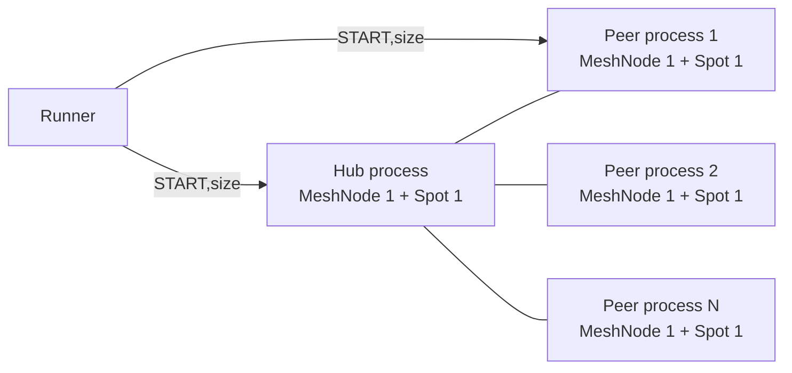

# Core 10.0.0 Spot 성능 시험 정책

이 문서는 Core 10.0.0의 RouteMesh 공개 API로 Spot 성능을 측정하는 방법을 정의한다.
공통 결과 형식과 runner 책임은
[`PERF_POLICY.md`](./PERF_POLICY.md), single 실행 규칙은
[`PERF_SINGLE_TEST_POLICY.md`](./PERF_SINGLE_TEST_POLICY.md), multi 실행 규칙은
[`PERF_MULTI_TEST_POLICY.md`](./PERF_MULTI_TEST_POLICY.md)를 함께 따른다.

## 1. 패턴 이름과 측정 흐름

| Suite | 입력 패턴 | 결과 패턴 | 측정 흐름 |
|---|---|---|---|
| single | `SPOT_PUBSUB` | `SPOT_PUBSUB` | 같은 MeshNode에 속한 publisher Spot에서 subscriber Spot으로 Logical Multicast |
| multi | `SPOT_PUBSUB` | `MULTI_SPOT_PUBSUB` | hub Spot이 Logical Multicast를 전송하고 peer Spot들이 수신 |
| multi | `SPOT_REQREP` | `MULTI_SPOT_REQREP` | peer Spot이 hub Spot에 직접 request를 보내고 reply completion을 수신 |
| multi | `SPOT_SENDSEND` | `MULTI_SPOT_SENDSEND` | peer Spot이 hub Spot에 직접 send하고 hub Spot이 source Spot으로 send |

이 패턴들은 Core 9의 Spot 시험과 논리적 메시지 흐름이 같다. 다만 Core 10.0.0에서
Spot은 독립된 네트워크 node가 아니라 MeshNode가 소유하는 논리적 목적지이므로, 물리적 연결은
MeshNode peer 연결로 구성한다. 이전 결과와 새 결과는 토폴로지가 다르므로 같은 수치 계열로
직접 비교하지 않는다.

## 2. Multi 토폴로지

`--clients N`은 peer MeshNode 수다. client 실행기는 child process를 N개 만들고, 각 child process는
MeshNode 1개와 entry Spot 1개를 만든다. hub process에는 MeshNode 1개와 entry Spot 1개가 있다.



peer MeshNode는 hub MeshNode에만 연결한다. peer끼리 추가 연결하지 않는다. 이 시험이 확인하려는
부하는 hub MeshNode 하나가 N개의 admitted peer를 관리하면서 Spot 메시지를 처리하는 비용이다.
전체 토폴로지의 연결 수를 늘리는 것이 목적이 아니다.

Core 10.0.0은 같은 process에서 같은 MeshName을 가진 MeshNode를 둘 이상 만들 수 없다. 따라서
multi client는 child process마다 MeshNode 하나를 배치한다. 각 child context는 I/O thread 하나를
기본값으로 사용한다. 이 값은 OOM 회피를 위한 전송 제한이 아니라 peer 하나에 MeshNode 하나를
배치하는 기준 구성이다. 필요한 비교 시험에서는 `PERF_MULTI_SPOT_NODE_IO_THREADS`로 바꿀 수 있다.
runner의 client I/O thread 값을 모든 child process에 반복 적용해 총 thread 수를 의도와 다르게
늘리지 않는다.

## 3. 연결 준비와 시작 조건

server는 hub MeshNode를 시작한 뒤 `READY,<endpoint>`를 출력한다. 각 peer는 다음 순서가 모두 끝난
뒤에만 준비된 것으로 계산한다.

1. peer MeshNode와 entry Spot을 만든다.
2. `zlink_mesh_node_connect_peer()`로 hub endpoint에 연결한다.
3. `zlink_mesh_node_peers()`에서 hub peer 상태가 `ZLINK_MESH_PEER_ADMITTED`인지 확인한다.
4. node request/reply로 hub entry Spot의 generation을 받는다.
5. `SPOT_PUBSUB`이면 `perf-hub` ChannelName과 `bench` topic 구독이 peer descriptor에 반영되도록
   MeshNode 시작 전에 등록한다.

모든 peer가 이 조건을 만족하면 client가 `CLIENT_READY,<size>`를 출력한다. runner는 server와
client 양쪽에 `START,<size>`를 전달한다. Core 9에서 사용하던 별도 Spot control node,
`CONTROL_READY`, `DATA_ENDPOINT`, `READY_COUNT` 프로토콜은 사용하지 않는다.

## 4. 수신과 응답 API

Spot 메시지는 callback이나 제거된 Spot 구독 수신 함수로 처리하지 않는다.
`zlink_mesh_node_drain_ready()`로 ready record를 받고, claim을 얻은 뒤
`zlink_mesh_claim_recv_batch()`로 application 또는 infrastructure record를 읽는다.

| 패턴 | 수신 record | 응답 |
|---|---|---|
| `SPOT_PUBSUB` | `ZLINK_MESH_RECORD_SPOT_MULTICAST` | 없음 |
| `SPOT_REQREP` | hub: `ZLINK_MESH_RECORD_SPOT_REQUEST`, peer: `ZLINK_MESH_RECORD_COMPLETION` | `zlink_mesh_reply()` |
| `SPOT_SENDSEND` | 양쪽: `ZLINK_MESH_RECORD_SPOT_SEND` | `zlink_spot_send_to_spot()` |

direct Spot 주소에는 target node routing ID, target Spot routing ID와 Spot generation이 필요하다.
hub generation은 측정 시작 전 node request/reply로 전달한다. send/send의 peer generation은
성능 측정용 metric header 바로 뒤에 넣어 hub가 source Spot으로 응답할 때 사용한다.

## 5. 처리량과 지연 시간

모든 payload는 공통 metric header를 포함한다. 처리량과 지연 시간에는 active phase와 현재
`run_id`, `msg_size`가 일치하는 record만 포함한다.

- pub/sub 처리량은 모든 peer Spot이 받은 active multicast record 수의 합이다.
- request/reply 처리량은 peer들이 받은 성공 completion 수의 합이다.
- send/send 처리량은 peer들이 받은 echo send 수의 합이다.
- request/reply와 send/send bandwidth는 왕복 두 방향을 반영한다.
- 평균 지연 시간은 모든 성공 record를 대상으로 계산한다.
- p95와 p99는 각 child가 유지하는 bounded reservoir sample을 parent가 합쳐 계산한다. parent는
  child별 실제 성공 record 수를 sample 수로 나눈 값을 각 sample의 가중치로 사용하므로, 처리량이
  다른 child도 전체 record에서 차지하는 비율만큼 percentile에 반영된다.

multi child 하나는 지연 시간 sample을 최대 1,024개만 보관한다. 공통 multi benchmark sampler의
기본 상한은 65,536개이며 `PERF_MULTI_LATENCY_SAMPLE_CAP`으로 바꿀 수 있다. single의 기본 상한은
1,000,000개이며 `PERF_SINGLE_LATENCY_SAMPLE_CAP`으로 바꿀 수 있다. 상한을 `0`으로 설정하면
percentile sample을 보관하지 않고 평균값을 p95와 p99 대체값으로 사용한다.

이 sample 상한은 메시지 queue, HWM, peer 수, active duration, 송신 횟수를 바꾸지 않는다. 모든
성공 record의 수와 지연 시간 합계는 상한과 관계없이 계속 누적한다.

## 6. Burst와 OOM 판정

공식 Spot 성능 시험은 OOM을 피하기 위해 전송 간격, 초당 전송 제한, 작은 payload, 적은 peer,
한 번에 처리할 요청 수 같은 별도 제한을 넣지 않는다. 각 size 시작 시 hub와 모든 peer context에
현재 payload 크기를 `ZLINK_CTX_OPT_AUTO_HWM_MSG_UNIT_BYTES`로 반영하고 auto-HWM을 다시 계산한다.
단일 target 전송은 공개 API가 `EAGAIN`을 반환하면 준비 상태가 회복될 때 계속한다. Logical
Multicast는 target별 수락 수가 0일 때만 같은 sequence를 다시 제출한다. 일부 target이 이미
수락했다면 같은 sequence를 재제출하지 않고 다음 sequence로 진행한다. 따라서 burst 제한 책임은
Core의 auto-HWM과 backpressure에 있고, 재시도 때문에 먼저 수락한 target에 중복 message가 생기지
않는다.

Logical Multicast에는 publish 전용 NODROP option을 설정하지 않는다. 각 remote target은 MeshNode
내부 ROUTER의 HWM·send timeout·`DONTWAIT` 동작을 그대로 사용하고, 먼저 수용된 target은 이후
target의 backpressure 때문에 rollback하지 않는다. receiver의 local Spot mailbox가 가득 차면 해당
local 대상만 drop되며 별도 staging·재시도·peer 종료 정책을 추가하지 않는다.

다음 현상은 시험 조건을 낮춰서 통과시키지 않고 Core 버그 후보로 처리한다.

- auto-HWM이 현재 payload 크기를 반영하지 않는다.
- `EAGAIN`을 반환하지 않은 채 queue 메모리가 제한 없이 증가한다.
- phase가 끝나거나 process가 종료된 뒤에도 메시지 메모리가 회수되지 않는다.
- 같은 조건을 반복할 때 RSS 또는 swap 사용량이 계속 증가한다.
- kernel OOM killer가 `libzlink`를 사용하는 benchmark process를 종료한다.

OOM 재현 시에는 적용된 auto-HWM 값, process tree RSS, swap, kernel OOM 기록을 보존하고 Core
회귀 test로 원인을 고정한다. 수정 뒤 peer 수, payload, duration을 줄이지 않은 같은 조건으로
재검증해야 한다.

## 7. 지원 transport

Spot multi peer 토폴로지는 `tcp`, `tls`, `ws`, `wss`를 지원한다. `inproc`은 process 경계를 넘을 수
없으므로 multi Spot에 사용하지 않는다. `ipc`는 표준 Spot 비교 transport에 포함하지 않는다.

single `SPOT_PUBSUB`은 한 MeshNode 안의 Logical Multicast 비용을 측정한다. transport 표시는
공통 결과 표와 실행 옵션 호환을 위해 유지하지만 active payload는 peer 연결을 통과하지 않는다.
네트워크 transport별 Spot 비용은 multi 패턴으로 판단한다.

## 8. 단계별 실행

새 Core 또는 새 토폴로지를 확인할 때는 다음 순서를 지킨다.

```bash
# 1. 두 peer로 세 흐름 확인
bindings/c/perf/run_benchmarks_multi.sh \
  --pattern SPOT_PUBSUB,SPOT_REQREP,SPOT_SENDSEND \
  --transports tcp --msg-sizes 64 --duration 1 --clients 2

# 2. 열 peer로 admission과 동시 처리 확인
bindings/c/perf/run_benchmarks_multi.sh \
  --pattern SPOT_PUBSUB,SPOT_REQREP,SPOT_SENDSEND \
  --transports tcp --msg-sizes 64 --duration 1 --clients 10

# 3. 표준 부하인 100 peer 확인
bindings/c/perf/run_benchmarks_multi.sh \
  --pattern SPOT_PUBSUB,SPOT_REQREP,SPOT_SENDSEND \
  --transports tcp --msg-sizes 64 --duration 1 --clients 100
```

각 단계에서 result status가 `complete`인지, 실행 뒤 child process가 남지 않았는지, RSS 합계가
실행 종료 뒤 감소하는지 확인한다. 큰 payload와 모든 transport를 포함한 전체 측정은 100 peer
64-byte 단계가 통과한 뒤에 실행한다.
