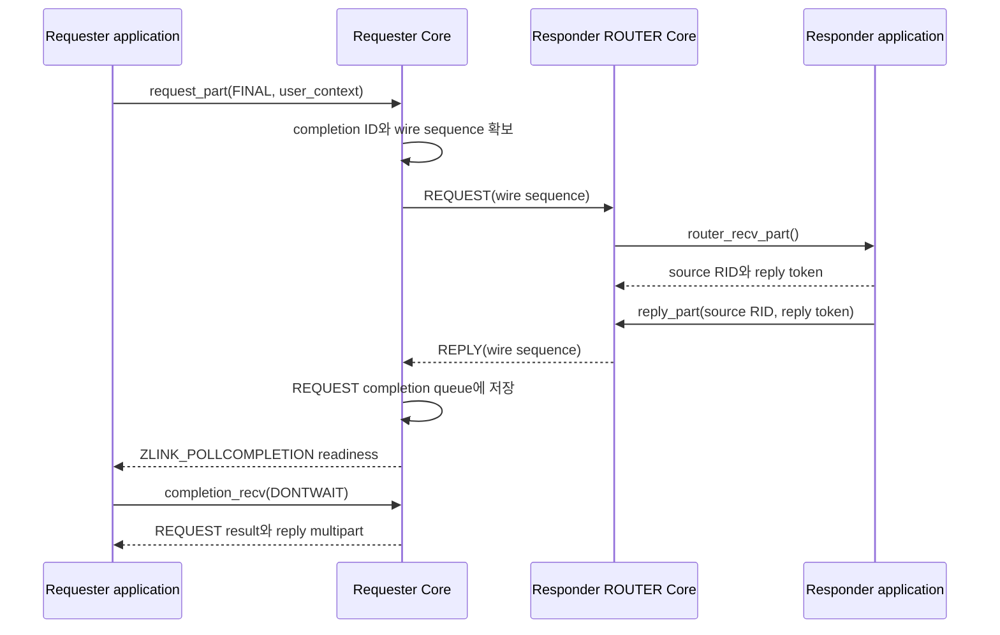

# Core socket pull receive·completion 0.16.0 확정 스펙 draft

[실행 계획](core-send-dontwait-completion-0.16.0-plan.ko.md)

> **확정된 0.16.0 이행안** — 이 문서에 미정 선택지는 없다. 정식 Core·binding·
> Framework 스펙으로 옮길 때의 단일 입력이다. 다만 아직 정식 공개 계약은 아니며,
> 보호 문서를 수정하기 전까지 현재 API와 동작은 기존 정식 스펙이 소유한다.

이 문서는 Core socket의 send·receive·request/reply·completion 통지를 callback 없이
한 thread에서 pull하는 0.16.0 공개 모델을 확정한 draft다. STREAM은 첫 bind/connect 전에 raw byte
수신과 packet 수신 중 하나를 명시적으로 고른다. 구현 단계, binding·Framework 반영과
0.16.0 release 순서는 [실행 계획](core-send-dontwait-completion-0.16.0-plan.ko.md)이 소유한다.

## 1. 범위와 계약 소유 문서

확정 범위는 다음과 같다.

- 기존 part send의 `NONE`·`DONTWAIT` 선택과 backpressure 해제 뒤 재전송 완료
- SEND와 REQUEST 결과를 한 queue에서 받는 pull completion
- 일반 recv 네 종류와 STREAM 전용 packet recv
- DEALER→ROUTER·ROUTER→ROUTER request/reply
- monitor와 timer의 pull 수신
- 물리 transport pair·generation을 public target에서 제외한 reconnect/resend

이 draft의 확정 계약을 옮길 정식 위치는 다음과 같다.

| 계약 | 정식 위치 |
|---|---|
| 공통 send·recv·completion·request/reply | `core/doc/spec/core/socket/README.{ko,en}.md` |
| polling과 `ZLINK_POLLCOMPLETION` | `core/doc/spec/core/05-polling.{ko,en}.md` |
| PAIR의 단일 논리 route | `core/doc/spec/core/socket/01-pair.{ko,en}.md` |
| DEALER target 선택과 request | `core/doc/spec/core/socket/06-dealer.{ko,en}.md` |
| ROUTER RID·reply token·request/reply | `core/doc/spec/core/socket/07-router.{ko,en}.md` |
| STREAM RAW/PACKET mode와 packet framing | `core/doc/spec/core/socket/08-stream.{ko,en}.md` |
| request/reply wire correlation과 lane | `core/doc/spec/core/protocol/01-zmp.{ko,en}.md` |
| monitor event | `core/doc/spec/core/04-events.{ko,en}.md`, `06-monitoring.{ko,en}.md` |
| result와 errno | `core/doc/spec/core/03-errors.{ko,en}.md` |

## 2. 공개 모델

Core가 application에 “처리할 것이 생겼다”고 알리는 경로는 poller readiness와 pull recv로
통일한다. Core는 application callback을 호출하지 않는다.

| 받을 내용 | poller readiness | 내용을 꺼내는 함수 | 소비 주체 |
|---|---|---|---|
| 일반 DATA | `ZLINK_POLLIN` | socket 종류에 맞는 `*_recv_part()` | application의 receive loop |
| STREAM packet | `ZLINK_POLLIN` | `zlink_stream_recv_packet()` | PACKET mode receive loop |
| SEND·REQUEST 완료 | `ZLINK_POLLCOMPLETION` | `zlink_completion_recv()` | completion drain loop |
| socket monitor event | `ZLINK_POLLIN` | `zlink_socket_monitor_recv()` | monitor loop |
| timer fire count | timer readiness | `zlink_timer_recv()` | timer loop |

`ZLINK_POLLCOMPLETION`은 payload가 아니다. `zlink_poller_wait()`는 completion을 제거하거나
callback을 실행하지 않으며 기존 `zlink_poller_event_t`에 operation payload를 추가하지 않는다.
기존 public bit 값 `ZLINK_POLLCOMPLETION = 32`를 유지한다.
준비된 socket을 찾은 caller가 `zlink_completion_recv(..., ZLINK_RECV_FLAGS_DONTWAIT)`를
`ZLINK_RECV_NO_DATA`가 나올 때까지 호출한다.

`zlink_free_fn`은 zero-copy memory를 반납하는 함수이고 `zlink_thread_fn`은 사용자가 지정한
thread entry다. 둘은 사용자 통지 callback이 아니므로 유지한다. Framework의 session·actor 같은
application handler도 Framework queue와 실행 gate 뒤에서 호출되므로 이 Core callback 제거
범위에 포함하지 않는다.

## 3. 일반 part send와 backpressure 완료

다음 선언은 0.16.0의 exact target C interface를 표현하는 **contract
pseudocode**다. 정식 스펙과 public header를 반영하기 전에는 현재 선언과 다르다.

```c
typedef uint64_t zlink_completion_id_t;

ZLINK_EXPORT zlink_submit_result_t zlink_send_part(
  void *s_,
  zlink_msg_t *part_,
  zlink_send_flags_t flags_,
  zlink_part_flag_t part_flag_,
  void *user_context_,
  zlink_completion_id_t *completion_id_out_);

ZLINK_EXPORT zlink_submit_result_t zlink_send_part_rid(
  void *s_,
  const zlink_routing_id_t *target_rid_,
  zlink_msg_t *part_,
  zlink_send_flags_t flags_,
  zlink_part_flag_t part_flag_,
  void *user_context_,
  zlink_completion_id_t *completion_id_out_);

ZLINK_EXPORT zlink_submit_result_t zlink_publish_part(
  void *subject_,
  const char *topic_id_,
  zlink_msg_t *part_,
  zlink_send_flags_t flags_,
  zlink_part_flag_t part_flag_);
```

`zlink_send_part()`는 PAIR·DEALER처럼 Core가 논리 target을 고르는 socket에 사용한다.
`zlink_send_part_rid()`는 ROUTER·STREAM처럼 caller가 논리 routing ID를 지정하는 socket에
사용한다. 물리 connection ID와 generation은 인자로 받지 않는다. PUB·XPUB topic 송신인
`zlink_publish_part()`는 이번 completion 확장 범위에 포함하지 않는다.

`flags_`와 `user_context_`를 직접 받는다. 확장 예정이 없는 두 값을
`struct_size`까지 포함한 options 구조체로 감싸지 않는다. 기존 part API의
`(part, flags, part_flag)` prefix를 그대로 유지하고 completion correlation 인자만 뒤에
추가한다.
`flags_`는 `ZLINK_SEND_FLAGS_NONE`·`ZLINK_SEND_FLAGS_DONTWAIT` 둘 중 하나만,
`part_flag_`는 `ZLINK_PART_MORE`·`ZLINK_PART_FINAL` 둘 중 하나만 허용한다. 범위 밖
값과 알 수 없는 bit는 `ZLINK_SUBMIT_INVALID_ARGUMENT`+`EINVAL`로 sequence 전체를
폐기한다.

`_part`는 한 호출이 `zlink_msg_t` 하나의 소유권을 옮기고 `MORE`·`FINAL`로 multipart 경계를
표현한다는 뜻이다. Whole-message `zlink_send()` alias나 별도 `zlink_send_async()`를 만들지
않는다.

### 3.1 제출 결과와 완료 ID

| 호출 결과 | submit 반환 | 완료 ID | 후속 completion |
|---|---|---:|---|
| `MORE` staging 성공 | `ZLINK_SUBMIT_OK` | 0 | 없음 |
| `NONE` FINAL이 local send queue에 들어감 | `ZLINK_SUBMIT_OK` | 0 | 없음 |
| `DONTWAIT` FINAL이 즉시 local send queue에 들어감 | `ZLINK_SUBMIT_OK` | 0 | 없음 |
| `DONTWAIT` FINAL을 Core가 backpressure pending으로 보관 | `ZLINK_SUBMIT_OK` | nonzero | SEND 한 건 |
| application pending 상한 또는 completion reservation 상한을 넘어 Core가 보관하지 못함 | `ZLINK_SUBMIT_BACKPRESSURED`, `errno=EAGAIN` | 0 | 없음 |
| validation·target 실패 | 해당 submit result | 0 | 없음 |

`NONE FINAL`은 호출 진입 시 socket의 `ZLINK_OPT_SNDTIMEO`를 snapshot하고 local send
queue admission까지 기다린다. 기본값은 1,000 ms, `0`은 즉시, `-1`은 무한 대기다.
시간 안에 admission되지 않으면 `ZLINK_SUBMIT_BACKPRESSURED`+`EAGAIN`, ID `0`, completion
없음으로 실패한다. `DONTWAIT FINAL`은 기다리지 않고 즉시 admission하거나 아래 pending
reservation을 시도한다. 두 경로 모두 실패한 `FINAL`과 이미 staging한 `MORE` prefix를
소비·폐기한다.

완료 ID는 socket 안에서 여러 완료를 구분하는 correlation 값이다. `0`은 이미 admission됐거나
Core가 operation을 접수하지 않았기 때문에 후속 completion이 없다는 뜻이다. Nonzero ID는
`ADMITTED` 또는 재시도할 수 없는 local terminal 결과를 queue에 정확히 한 번 만든다. Socket이
열려 있고 caller가 drain하는 동안에는 그 record를 정확히 한 번 관찰한다. Caller가 socket을
close해 queue를 버리면 unread record의 전달을 요구할 수 없다. ID는 취소 handle이 아니며
재사용하지 않는다.

`completion_id_out_`은 선택 output이다. non-NULL이면 다른 validation 전에 `0`으로 초기화한다.
Caller가 output을 생략해도 pending operation의 completion에는 Core가 부여한 nonzero ID가
들어간다. `user_context_`는 callback 인자가 아니라 submit 전에 만들어 둔 Task·Future·Promise
상태를 completion과 연결하기 위한 opaque echo 값이다. `DONTWAIT FINAL`에서만 non-NULL을
허용하고, `MORE`나 `NONE FINAL`의 non-NULL은
`ZLINK_SUBMIT_INVALID_ARGUMENT`+`EINVAL`로 거부한다. Core는 이 pointer를 dereference·free하지
않는다. Caller는 completion을 recv·close하거나 socket을 폐기할 때까지 pointee의 수명을
유지한다. 즉시 admission이면 ID 0이고 context를 돌려줄 completion을 만들지 않는다.

0.16.0은 기존 request completion 상한인 socket당 65,536개를 SEND·REQUEST가
공유하는 **unified completion reservation 상한**으로 재정의한다. 이 값은 0.16.0에서
별도 public option으로 노출하지 않는다. SEND는 `DONTWAIT FINAL`이 즉시 admission되지
않아 pending으로 전환될 때만 slot을 예약하고, REQUEST는 successful `FINAL`이면 항상
예약한다. Slot은 예약부터 completion record가 `zlink_completion_recv()`로 queue에서
빠질 때까지 점유하며 socket close가 unread record를 정리하면 함께 해제한다.

상한이 찼 시점에 SEND가 direct admission되지 못했거나 REQUEST `FINAL`이 들어오면
Core는 operation을 접수하지 않고 `ZLINK_SUBMIT_BACKPRESSURED`, `errno=EAGAIN`, ID `0`을
반환한다. 기존 part API 계약대로 성공·실패와 관계없이 호출에 넘긴 `part_`를
소비한다. 이미 staging한 `MORE` prefix와 실패한 `FINAL`을 함께 폐기하고 sequence를
닫는다. 재시도해야 하는 caller는 호출 전에 전체 record를 별도로 보관해야 한다. 이 상한은
socket-local pending pool의 개수·byte option과
별도이며, 둘 중 먼저 닿는 상한이 같은 backpressured 결과를 만든다.

기존 `ZLINK_OPT_SEND_PENDING_MAX_MSGS`와 `ZLINK_OPT_SEND_PENDING_MAX_BYTES`는 request도
같은 pool을 쓰는 의미를 정확히 드러내도록 각각 `ZLINK_OPT_PENDING_MAX_MSGS`와
`ZLINK_OPT_PENDING_MAX_BYTES`로 rename한다. Numeric value `0x303A`, `0x303B`는 유지하지만
0.15 이름의 alias는 두지 않는다. 둘 다 `uint64_t`, 기본값 `0`은 unlimited다. 0.16.0에서는
즉시 admission되지 않아 Core가 payload를 보관하는 DONTWAIT SEND와 REQUEST가 하나의
socket-local pending pool을 공유한다. `MAX_MSGS`는 완전한 multipart record 수,
`MAX_BYTES`는 각 part마다 `max(payload size, sizeof(zlink_msg_t))`를 합한 값이다.
합산은 overflow 시 `UINT64_MAX`로 포화한다. `MORE` staging 중에는 이 pool을 예약하지
않고, `FINAL`에서 전체 record charge를 계산해 pending으로 전환할 때 원자적으로
검사·예약한다. 상한 실패는 위 표대로 전체 sequence를 소비·폐기한다. Immediate
admission과 `NONE` wait는 pending pool을 쓰지 않는다. Pending payload가 admission되거나
terminal로 끝나면 count·byte를 해제하지만 unified completion slot은 caller가 record를
recv할 때까지 유지한다. 실행 중 option을 줄여도 기존 reservation을 eviction하지 않고
이후 reservation에만 새 값을 적용한다.

두 option의 get/set은 PAIR·DEALER·ROUTER·STREAM socket에서만 지원한다. PUB·XPUB과 그 밖의
socket은 `ZLINK_CONFIG_NOT_SUPPORTED`+`ENOTSUP`로 실패하고 기존 option 상태를 바꾸지 않는다.
Core enum과 C ABI header mirror·수동 FFI/internal generated constant는 새 이름으로 맞추되,
0.15에 없던 고수준 binding option façade를 새로 만들지 않는다.

### 3.2 소유권과 재전송

`MORE`는 socket-local sequence에 part를 보관한다. `zlink_send_part*()`,
`zlink_request_part()`, `zlink_reply_part()`는 모두 submit 결과와 관계없이 호출에 넘긴
`part_`를 소비하고 빈 initialized 상태로 두는 기존 part API 소유권 계약을 유지한다.
`FINAL`이 성공해야 완전한 record 하나로 admission된다. 같은 sequence의 함수
family·target·flags는 같아야 한다. 중간 실패는 staging한 record 전체와 실패한 part를
폐기해 peer가 prefix만 보지 않게 한다. Caller가 전체 record를 재시도해야 한다면
첫 part를 호출하기 전에 별도 복사본을 보관한다.

Core가 pending record를 접수한 뒤에는 payload와 재시도를 Core가 소유한다. Application은 이
operation을 취소하거나 같은 payload를 다시 제출하지 않는다. Completion의 `ADMITTED`는 local
send queue admission이며 peer 수신 확인이 아니다. Peer가 처리한 결과가 필요하면 request/reply를
사용한다.

일시적인 transport 종료는 **local admission 전 DONTWAIT Core pending record와 진행 중인
`NONE FINAL` admission wait**의 terminal 결과가 아니다. PAIR은 socket의 단일 logical route,
DEALER는 FINAL에서 처음 선택한 configured endpoint, ROUTER·STREAM은 logical peer RID를
기준으로 target을 고정한다. DONTWAIT pending은 FIFO를 유지하고 새 physical connection에
다시 admission을 시도한다. `NONE`은 pending pool을 예약하지 않지만 snapshot한 `SNDTIMEO`
budget 안에서 같은 target의 reconnect와 admission을 기다리며 다른 endpoint로 retarget하지
않는다. `zlink_disconnect()`로 configured endpoint를 제거하거나
`zlink_disconnect_rid()`로 logical RID를 명시적으로 제거한 경우와 영구적인 protocol
거절처럼 socket이 열린 상태에서 다시 시도할 수 없을 때, **이미 successful DONTWAIT submit으로
접수한 pending record만** observable terminal completion을 만든다. 아직 API가 반환하지 않은
`NONE` send/request admission wait는 명시적 target 제거 시
`ZLINK_SUBMIT_NOT_FOUND`+`ENOENT`, 영구 peer-type 거절 시
`ZLINK_SUBMIT_NOT_ADMITTED`+`EPROTOTYPE`, context termination 시
`ZLINK_SUBMIT_TERMINATED`+`ETERM`, socket shutdown 시
`ZLINK_SUBMIT_TERMINATED`+`ESHUTDOWN`으로 동기 종료한다. Admission 전/API 반환 전 allocation
failure는 `ZLINK_SUBMIT_OUT_OF_MEMORY`+`ENOMEM`, 그 밖의 runtime failure는
`ZLINK_SUBMIT_INTERNAL_ERROR`+`EIO`로 동기 종료한다.
모두 ID 0·completion 없음이며 request가 임시 예약한 slot/ID를 반납하고 sequence 전체를
소비·폐기한다. Socket close와 context termination은 API가 이미 반환한 pending·unread record를
더 drain할 수 없는 lifecycle 종료이므로 내부 폐기하고 terminal completion 전달을 보장하지 않는다.

이 계약에서 사용하는 `EPROTOTYPE`·`EOVERFLOW`는 public portable errno다.
Platform `<errno.h>`가 정의하지 않으면 `zlink_errno.h`가
`#ifndef EPROTOTYPE` 경로에서 `ZLINK_HAUSNUMERO + 23`,
`#ifndef EOVERFLOW` 경로에서 `ZLINK_HAUSNUMERO + 24`로 정의하며 Core와 native
header mirror는 같은 값을 사용한다. Completion ID sequence 소진도 이 `EOVERFLOW`를
사용한다.

재시도 경계는 local send queue admission까지다. ID `0` 또는 `ZLINK_SEND_ADMITTED`가
확정된 뒤에는 payload가 기존 transport/pipe 전달 계약으로 넘어가며 Core는 application
record의 별도 복사본, delivery ACK나 deduplication sequence를 만들지 않는다. 그 뒤
disconnect가 발생해 peer가 record를 받지 못해도 같은 application record를 새 connection에
replay하지 않는다. Peer 처리까지 관찰해야 하는 application은 request/reply 또는 자신의
application protocol을 사용한다.

## 4. 통합 completion pull

SEND와 REQUEST는 한 socket-local completion queue를 사용한다. 한 함수로 비우면 binding과
Framework가 한 poller thread에서 완료 순서를 관찰하고 Task·Future 상태를 정리할 수 있다.

다음 선언은 0.16.0 exact target C interface를 표현하는 **contract pseudocode**다.

```c
typedef enum zlink_completion_kind_t {
  ZLINK_COMPLETION_SEND = 1,     /* DONTWAIT send의 지연 admission 결과 */
  ZLINK_COMPLETION_REQUEST = 2   /* request의 reply·timeout·terminal 결과 */
} zlink_completion_kind_t;

typedef enum zlink_send_complete_result_t {
  ZLINK_SEND_ADMITTED = 0,       /* local send queue admission 완료 */
  ZLINK_SEND_TERMINAL = 202      /* send_terminal_errno에 최종 사유가 있음 */
} zlink_send_complete_result_t;

typedef struct zlink_completion_t {
  uint32_t struct_size;                  /* sizeof(zlink_completion_t) */
  zlink_completion_kind_t kind;          /* SEND 또는 REQUEST */
  zlink_completion_id_t completion_id;   /* socket-local, 항상 nonzero */
  void *user_context;                    /* submit 값을 그대로 돌려줌 */

  zlink_routing_id_t peer_rid;           /* 논리 peer, 적용되지 않으면 empty */
  zlink_send_complete_result_t send_result; /* SEND에서만 사용 */
  int send_terminal_errno;               /* SEND TERMINAL에서만 사용 */

  zlink_request_result_t request_result; /* REQUEST에서만 사용 */
  zlink_msg_t *reply_parts;               /* REQUEST payload, 없으면 NULL */
  size_t reply_part_count;                /* REQUEST payload part 수 */
} zlink_completion_t;

ZLINK_EXPORT zlink_recv_result_t zlink_completion_recv(
  void *s_,
  zlink_completion_t *completion_out_,
  zlink_recv_flags_t flags_);

ZLINK_EXPORT void zlink_completion_close(
  zlink_completion_t *completion_);
```

Caller는 output을 0으로 초기화하고 `struct_size`를 설정한 뒤 recv에 넘긴다. 한 successful recv는
SEND 또는 REQUEST 중 한 종류만 반환하며 사용하지 않는 field는 0·empty·NULL이다.
이 API에서 empty output은 `struct_size == sizeof(zlink_completion_t)`이고 `struct_size`를
제외한 모든 public member를 field별로 검사했을 때 0·empty·NULL인 aggregate다. Padding byte는
비교하지 않는다. 이 predicate를 만족하지 않는 aggregate는 SEND payload가 없더라도 non-empty다.
Recv는 `struct_size` 불일치나 이전 payload가 남은 non-empty output을
`ZLINK_RECV_INVALID_STATE`+`EINVAL`로 거부해 덮어쓰기 leak을 막는다. `NO_DATA`와 다른
실패는 **호출 시 empty였던** output을 empty로 유지한다. Non-empty 또는 잘못된
`struct_size`를 전달해 validation이 실패하면 caller가 이미 소유한 기존 content를 전혀
변경하지 않는다.

`peer_rid`는 operation을 예약할 때 확정한 logical peer snapshot이며 다음 행렬을 따른다.

| Completion | `peer_rid` |
|---|---|
| PAIR SEND | empty |
| DEALER SEND | empty; public target은 configured endpoint 선택이고 RID target이 아님 |
| ROUTER·STREAM SEND | submit의 target RID |
| DEALER REQUEST | empty; public target 인자가 `NULL`임 |
| ROUTER REQUEST | submit의 target ROUTER RID |

Terminal record도 같은 snapshot을 유지하며 reconnect 뒤 새 physical connection ID를 넣지
않는다. 이 field는 진단과 correlation용 value이고 후속 send target capability가 아니다.

다음 행렬은 API가 successful submit으로 반환해 nonzero ID를 공개한 operation의 observable
completion과, close/context의 별도 no-delivery lifecycle을 고정한다. 아직 반환하지 않은 `NONE`
admission wait의 동기 submit 실패는 §3.2를 따르며 이 completion 행렬에 들어오지 않는다.

| 원인 | SEND completion | REQUEST completion |
|---|---|---|
| 정상 local admission / 유효 reply | `ZLINK_SEND_ADMITTED`, errno 0 | `ZLINK_REQUEST_OK` 또는 기존 wire error-reply mapping |
| Request reply timeout | 해당 없음 | `ZLINK_REQUEST_TIMED_OUT` |
| configured endpoint 또는 logical RID의 명시적 제거 | `ZLINK_SEND_TERMINAL`, `ENOENT` | `ZLINK_REQUEST_NOT_FOUND` |
| 영구적인 peer type 거절 | `ZLINK_SEND_TERMINAL`, `EPROTOTYPE` | `ZLINK_REQUEST_REJECTED` |
| malformed protocol | `ZLINK_SEND_TERMINAL`, `EPROTO` | `ZLINK_REQUEST_PROTOCOL_ERROR` |
| context termination | completion 전달을 보장하지 않고 pending·unread record를 내부 폐기 | 동일; binding은 waiter를 terminated error로 종료 |
| accepted 뒤 allocation·runtime failure | `ZLINK_SEND_TERMINAL`, 실제 `ENOMEM` 또는 `EIO` | `ZLINK_REQUEST_INTERNAL_ERROR` |
| transient physical disconnect | terminal record 없음; DONTWAIT admission 전이면 logical target에 재시도하고 진행 중인 NONE wait는 남은 `SNDTIMEO` 안에서 같은 target을 기다림 | admission 전 DONTWAIT pending은 같은 target에 재시도하고 reply timeout 미시작; admission 후 payload replay 없이 correlation과 이미 시작한 budget 유지 |
| socket close | unread·새 terminal record를 application에 전달하지 않고 내부 폐기 | 동일; binding은 자신의 waiter를 shutdown error로 종료 |

Submit validation, no-target, pending/completion reservation 포화처럼 Core가 operation을
접수하지 않은 실패는 completion을 만들지 않고 submit 반환값·errno로만 관찰한다.

REQUEST reply는 Core가 enqueue 전에 확보한 contiguous `zlink_msg_t[]`로 보관한다.
Wire error reply는 내부 errno part를 먼저 닫고 application에 노출할 payload part만 새
Core allocation의 index 0부터 contiguous array로 정규화한다. Public `reply_parts`는 항상 그
allocator base를 가리키며 middle pointer를 가리키지 않는다. 노출 payload가 없으면
`reply_parts == NULL`, `reply_part_count == 0`이다. 이 정규화 allocation이 실패하면 원래
payload를 닫고 `ZLINK_REQUEST_INTERNAL_ERROR`·payload 없음으로 completion을 만든다.
Successful recv가 `reply_parts` pointer와 각 message의 소유권을 caller에게 이동하므로 recv
자체는 allocation하지 않는다. Caller는 message를 읽거나 `zlink_msg_move()`로 옮길 수
있지만 array를 직접 free하지 않는다. 마지막에 `zlink_completion_close()`를 호출하면
남은 message를 닫고 Core allocator로 array를 해제한다. Close는 SEND·빈 record에도 안전한
idempotent 호출이며 모든 field를 0으로 되돌리되 `struct_size`는 보존해 즉시 재사용할
수 있게 한다. `completion_ == NULL`은 no-op이다. `struct_size`가 `0` 또는
`sizeof(zlink_completion_t)`가 아니면 caller가 만든 pointer를 해제하지 않고 no-op으로
끝낸다. Close가 해제하는 pointer는 successful recv가 만든 record에 한정하며 caller가
field를 위조·변경한 aggregate는 유효한 입력이 아니다. Binding은 native message를
language 객체로 이동한 뒤 `finally`/RAII에서 반드시 close한다. Reply storage 확보가
실패하면 예약된 completion을 버리지 않고 `ZLINK_REQUEST_INTERNAL_ERROR`·payload 없음으로
enqueue한다.

Caller는 REQUEST뿐 아니라 SEND를 포함한 모든 successful recv 뒤 output을
`zlink_completion_close()`로 닫고 다시 사용한다. SEND에는 heap payload가 없지만 close가
field를 빈 상태로 되돌리는 lifecycle boundary다. 새로 `{0}` 초기화하고
`struct_size`를 설정한 다른 output을 쓰는 것도 허용한다.

### 4.1 Readiness와 drain

`ZLINK_POLLCOMPLETION`은 다음 `zlink_completion_recv()`가 한 건을 반환할 수 있다는
level-triggered readiness다. Poller wait가 completion을 소비하지 않으므로 event array 용량과
completion 개수는 관계가 없다. Caller는 준비된 socket마다 DONTWAIT recv를 반복해 queue를
비운다. Queue에 record가 남아 있으면 readiness도 유지된다.

`zlink_poller_add()`와 `zlink_poller_modify()`는 PAIR·DEALER·ROUTER·STREAM socket에
`ZLINK_POLLCOMPLETION`을 단독으로 또는 `POLLIN`·`POLLOUT`과 OR한 값으로 받는다.
Modify로 completion bit를 추가·제거하는 것도 허용한다. 그 밖의 source에서 이 bit를
사용하거나 `zlink_poll()` item에 넣으면 `ZLINK_CONFIG_INVALID_ARGUMENT`+`EINVAL`로
거부한다. Add·modify·remove는 queue payload를 소비하지 않는다.

한 socket의 completion bit를 소유하는 poller registration은 최대 하나다. 다른
poller가 이미 소유한 socket에 completion bit를 add하거나 modify로 추가하면
`ZLINK_CONFIG_INVALID_STATE`+`EBUSY`로 실패하고 기존 registration은 변하지 않는다.
기존 owner가 modify로 bit를 제거하거나 registration을 remove한 뒤에는 다른 poller가
소유할 수 있다. 전환 중 queue record와 readiness는 유실되지 않는다.

Application과 각 binding은 socket마다 completion drain owner를 하나 둔다. C caller가
같은 socket queue를 두 thread에서 동시에 drain하는 것은 지원하지 않는다. 고수준 binding은
자체 socket runtime과 public poller 중 하나만 owner가 되게 등록·제거에서 소유권을 원자적으로
이전한다. 두 consumer가 경쟁하는 구현은 허용하지 않는다.

Core는 operation을 접수하기 전에 §3.1의 socket당 65,536개 공유 slot 중 하나를
확보한다. 접수한 operation의 결과를 queue 용량 때문에 버리거나 합치지 않는다.
SEND와 REQUEST가 함께 준비되면 각 resolver가 terminal 결과를 socket-local ready queue에
enqueue하는 단일 mutex/strand의 linearization 순서대로 한 건씩 반환한다. 이는 submit 순서나
target별 wire 순서를 뜻하지 않는다. 서로 다른 target의 완료 순서는 submit 순서와 다를 수
있으므로 caller는 `completion_id` 또는 `user_context`로 구분한다.

Completion ID는 SEND·REQUEST가 공유하는 socket-local 단조 증가 nonzero 공간이다.
Socket close 전에 재사용하지 않으며 다음 ID를 만들 수 없으면 operation을 접수하지 않고
`ZLINK_SUBMIT_SEQ_EXHAUSTED`+`EOVERFLOW`, ID 0을 반환한다. `zlink_completion_recv()`는
completion lane을 갖는 PAIR·DEALER·ROUTER·STREAM에서만 성공한다. 빈 queue의 DONTWAIT는
`ZLINK_RECV_NO_DATA`+`EAGAIN`, 다른 socket은 `ZLINK_RECV_NOT_SUPPORTED`+`ENOTSUP`다.
Validation·reservation·`SNDTIMEO` 실패 중 내부에서 예약했다 반납한 ID는 다시
사용하지 않을 수 있으므로 successful operation의 ID가 연속이라는 보장은 없다.
Caller는 크기·간격·순서를 해석하지 않고 correlation에만 사용한다.

`zlink_completion_recv()`의 `flags_`는 `NONE` 또는 `DONTWAIT`만 허용하고 알 수 없는 bit는
`ZLINK_RECV_INVALID_STATE`+`EINVAL`이다. `DONTWAIT`의 empty queue는 즉시
`ZLINK_RECV_NO_DATA`+`EAGAIN`이다. `NONE`은 진입 시 socket `RCVTIMEO`를 snapshot해 record를
기다리며 기본값 1,000 ms, `0`은 즉시, `-1`은 무한 대기다. 만료도
`ZLINK_RECV_NO_DATA`+`EAGAIN`이고 output은 empty를 유지한다. NULL socket/output은
`ZLINK_RECV_INVALID_HANDLE`+`EFAULT`이며 queue를 건드리지 않는다.
Blocking wait 중 context termination은 `ZLINK_RECV_TERMINATED`+`ETERM`, socket shutdown은
`ZLINK_RECV_INVALID_STATE`+`ESHUTDOWN`으로 깨어나며 empty output을 유지한다.

### 4.2 REQUEST payload와 close

REQUEST success는 `ZLINK_REQUEST_OK`와 reply multipart를 반환한다. 유효한 wire error reply는
첫 part가 4-byte Big Endian nonzero errno일 때 `core/03-errors`의 request-completion mapping을
그대로 적용하고 errno part 뒤의 multipart를 반환한다. Errno part가 없거나 4 byte가 아니거나
값이 0이면 `ZLINK_REQUEST_PROTOCOL_ERROR`·payload 없음이다. Timeout·protocol error·payload가
없는 terminal result에는 `reply_parts == NULL`, `reply_part_count == 0`이다.
이 non-OK payload를 public value로 관찰하는 표면은 Core/C의 raw completion API뿐이며,
고수준 binding은 §11.1의 typed error·cleanup 계약을 따른다.
이 record의 `peer_rid`는 completion이 자체 소유하는 value이며 recv API의 borrowed pointer가
아니다.

Socket close는 새 completion recv를 가능하게 하는 drain 단계가 아니다. Close가 수락되면 Core는
pending operation을 끝내고 아직 application이 꺼내지 않은 completion과 packet을 내부에서
정리한다. Caller가 결과나 payload를 필요로 하면 close 전에 queue를 비워야 한다. Binding은
shutdown을 시작할 때 새 submit을 막고, 가능한 completion을 먼저 drain한 뒤 남은 language-level
waiter를 shutdown 결과로 끝낸다.

## 5. 일반 recv와 STREAM packet recv

일반 raw·routed·subscription record를 받는 public recv family는 다음 네 종류다. STREAM packet
recv는 고정 framing을 선택한 STREAM만 사용하는 별도 전문 함수이며 이 네 raw family를 다시
나누는 함수가 아니다.

```c
typedef uint64_t zlink_reply_token_t; /* DATA는 0, REQUEST는 nonzero */

ZLINK_EXPORT zlink_recv_result_t zlink_recv_part(
  void *s_,
  const zlink_routing_id_t **source_rid_out_,
  zlink_msg_t *part_out_,
  zlink_part_flag_t *has_more_out_,
  zlink_recv_flags_t flags_);

ZLINK_EXPORT zlink_recv_result_t zlink_router_recv_part(
  void *router_,
  const zlink_routing_id_t **source_rid_out_,
  zlink_reply_token_t *reply_token_out_,
  zlink_msg_t *part_out_,
  zlink_part_flag_t *has_more_out_,
  zlink_recv_flags_t flags_);

ZLINK_EXPORT zlink_recv_result_t zlink_subscribe_part(
  void *sub_,
  const zlink_routing_id_t **source_rid_out_,
  char *topic_id_buf_,
  size_t topic_id_capacity_,
  size_t *topic_id_len_out_,
  zlink_msg_t *part_out_,
  zlink_part_flag_t *has_more_out_,
  zlink_recv_flags_t flags_);

ZLINK_EXPORT zlink_recv_result_t zlink_xpub_recv_part(
  void *xpub_,
  const zlink_routing_id_t **source_rid_out_,
  int *subscribed_out_,
  char *topic_id_buf_,
  size_t topic_id_capacity_,
  size_t *topic_id_len_out_,
  zlink_recv_flags_t flags_);
```

| 함수 | 사용하는 socket과 record |
|---|---|
| `zlink_recv_part()` | PAIR·DEALER의 DATA, RAW mode STREAM byte record |
| `zlink_router_recv_part()` | ROUTER의 DATA 또는 REQUEST |
| `zlink_subscribe_part()` | SUB·XSUB의 topic DATA |
| `zlink_xpub_recv_part()` | XPUB의 subscribe/unsubscribe event |

Output과 실패 계약은 다음과 같이 고정한다.

| 함수 | 필수 output | 선택 output | 성공 시 값 |
|---|---|---|---|
| `zlink_recv_part` | 초기화된 `part_out_`, `has_more_out_` | `source_rid_out_` | PAIR·DEALER source는 `NULL`, RAW STREAM은 borrowed RID |
| `zlink_router_recv_part` | `source_rid_out_`, `reply_token_out_`, 초기화된 `part_out_`, `has_more_out_` | 없음 | DATA token `0`, REQUEST의 모든 part에 같은 nonzero token |
| `zlink_subscribe_part` | `topic_id_len_out_`, 초기화된 `part_out_`, `has_more_out_` | `source_rid_out_` | SUB·XSUB source는 `NULL`; topic byte는 NUL 없이 복사 |
| `zlink_xpub_recv_part` | `subscribed_out_`, `topic_id_len_out_` | `source_rid_out_` | subscribe `1`/unsubscribe `0`, peer RID와 topic byte |

필수 handle/output이 `NULL`이면 `ZLINK_RECV_INVALID_HANDLE`+`EFAULT`, 알 수 없는
`flags_` bit는 `ZLINK_RECV_INVALID_STATE`+`EINVAL`다. Part output은 호출 전에
initialized 상태여야 하며 content가 있어도 된다. Successful recv는 기존 content를
해제하고 새 part ownership을 옮긴다. Caller는 그 part를 다음 successful overwrite 전에
옮기거나 `zlink_msg_close()`로 닫는다. `ZLINK_RECV_NO_DATA`와 그 밖의 실패는 아래 buffer
예외를 제외하고 모든 output과 message content를 변경하지 않는다. Caller는 성공 또는
명시된 buffer-too-small output 외에는 output 값을 읽지 않는다.

`zlink_subscribe_part()`는 `topic_id_capacity_ < required_topic_length`이면 필요한 길이만
`*topic_id_len_out_`에 쓰고 `ZLINK_RECV_BUFFER_TOO_SMALL`+`ENOBUFS`를 반환한다. Queue의
record와 다른 output은 그대로라 충분한 buffer로 재시도할 수 있다. Capacity가 0보다 큰데
buffer가 `NULL`이면 queue를 건드리지 않고 invalid-handle로 실패한다.
길이 0 topic은 capacity 0·NULL buffer로도 성공하고 record를 소비한다.
`zlink_xpub_recv_part()`도 같은 retryable buffer 계약으로 통일한다. Capacity가 required length보다
작으면 필요한 길이만 쓰고 `ZLINK_RECV_BUFFER_TOO_SMALL`+`ENOBUFS`를 반환하며
event를 dequeue하지 않는다. 0.15의 dequeue 뒤 `ZLINK_RECV_INTERNAL_ERROR`+`EMSGSIZE`
동작은 0.16.0에서 제거한다.

한 multipart record의 첫 part부터 `FINAL`까지 같은 thread와 같은 recv family를 사용한다.
중간에 다른 thread·family가 진입하면 `ZLINK_RECV_INVALID_STATE`+`EBUSY`이고 staged record는
원래 owner가 계속 받을 수 있다. `DONTWAIT`에서 record가 없으면
`ZLINK_RECV_NO_DATA`+`EAGAIN`이다. 표의 socket 종류가 아닌 handle은
`ZLINK_RECV_NOT_SUPPORTED`+`ENOTSUP`다.

네 data recv와 `zlink_stream_recv_packet()`의 `NONE`도 호출 진입 시 socket `RCVTIMEO`를
snapshot해 기본 1,000 ms, `0` 즉시, `-1` 무한 대기로 기다린다. Timeout은
`ZLINK_RECV_NO_DATA`+`EAGAIN`이며 output을 변경하지 않는다. `DONTWAIT`은 같은 no-data
결과를 즉시 반환한다.
Blocking wait 중 context termination은 `ZLINK_RECV_TERMINATED`+`ETERM`, socket shutdown은
`ZLINK_RECV_INVALID_STATE`+`ESHUTDOWN`으로 깨어나며 output content를 변경하지 않는다.

Requester가 보낸 REQUEST의 REPLY는 일반 recv로 나오지 않는다. Core가 wire correlation을 찾아
REQUEST completion으로 queue에 넣는다. DEALER는 inbound typed REQUEST를 받거나 reply하는
socket이 아니다.

ROUTER의 DATA는 source logical RID와 token `0`을 반환한다. REQUEST는 같은 source RID와 Core가
만든 nonzero opaque reply token을 반환한다. Multipart REQUEST의 모든 part에는 같은 RID와 token을
반환한다. Token은 wire request sequence가 아니며 application은 값을 해석·생성·변경하지 않는다.
Application은 `ZLINK_PART_FINAL`까지 REQUEST 전체를 받은 뒤에만 reply sequence를 시작한다.

C ABI의 `zlink_reply_token_t`는 복사·비교·by-value 전달을 위해 64-bit 표현을
공개하지만 계약상 opaque다. Caller가 관찰할 의미는 DATA의 `0`과 REQUEST의
nonzero 구분뿐이며 숫자 연산·직렬화·다른 socket에 재사용한 결과는 유효하지
않다. 고수준 binding은 이 제약을 public constructor가 없는 strong type으로 강제한다.

Recv가 반환한 `const zlink_routing_id_t *`는 해당 successful call에서부터 같은 socket의
다음 data recv API—`zlink_recv_part`, `zlink_router_recv_part`, `zlink_subscribe_part`,
`zlink_xpub_recv_part`, `zlink_stream_recv_packet`—에 진입하거나 socket을 close하는 시점 중
먼저 오는 때까지 유효한 Core-owned borrowed view다. Poller wait, completion recv와 monitor
recv는 이 view를 무효화하지 않는다. Multipart의 각 part는 같은 RID 값을 반환하지만
pointer 수명을 연장하지 않는다. 다음 data recv 뒤에도 사용할 caller와 모든 고수준
binding은 receive 반환 직후 owned RID로 복사한다.
View backing storage는 TLS가 아니라 해당 socket이 소유한다. 그러므로 같은 thread에서 다른
socket의 data recv에 진입해도 이 view는 유효하다. 반대로 같은 socket의 다음 data recv는
성공·`NO_DATA`·오류 여부와 관계없이 API 진입 시점에 이전 view를 무효화한다.

## 6. STREAM RAW/PACKET mode

STREAM 사용자는 최초 successful bind 또는 connect 전에 raw byte record와 framed packet 중 하나를
명시적으로 선택한다.
첫 recv가 mode를 암묵적으로 고르지 않으며, 한 handle에서 두 mode를 함께 사용하지 않는다.

다음 선언은 0.16.0 exact target interface를 표현하는 **contract pseudocode**다.

```c
typedef enum zlink_stream_recv_mode_t {
  ZLINK_STREAM_RECV_MODE_UNSPECIFIED = 0, /* bind/connect할 수 없는 초기값 */
  ZLINK_STREAM_RECV_MODE_RAW = 1,         /* zlink_recv_part() 사용 */
  ZLINK_STREAM_RECV_MODE_PACKET = 2       /* zlink_stream_recv_packet() 사용 */
} zlink_stream_recv_mode_t;

typedef enum zlink_stream_option_t {
  ZLINK_STREAM_OPT_NOTIFY = 0x3501,
  ZLINK_STREAM_OPT_RECV_MODE = 0x3502
} zlink_stream_option_t;

ZLINK_EXPORT zlink_recv_result_t zlink_stream_recv_packet(
  void *stream_,
  const zlink_routing_id_t **source_rid_out_,
  zlink_msg_t *header_out_,
  zlink_msg_t *body_out_,
  zlink_recv_flags_t flags_);
```

Mode의 기본값은 `UNSPECIFIED`다. `RAW` 또는 `PACKET`을 설정하지 않은 bind는 endpoint side
effect 없이 `ZLINK_BIND_INVALID_ARGUMENT`+`EINVAL`, connect는 side effect 없이
`ZLINK_CONNECT_INVALID_ARGUMENT`+`EINVAL`로 실패한다. Getter는 초기
`UNSPECIFIED`를 반환한다. Setter는 정확한 enum size와 `RAW`·`PACKET`만 받고
`UNSPECIFIED`, 알 수 없는 값과 size mismatch는 `ZLINK_CONFIG_INVALID_ARGUMENT`+`EINVAL`다.
Failed bind/connect는 mode를 freeze하지 않는다. 첫 successful bind 또는 connect 뒤에는 같은
값을 다시 설정하는 것까지 `ZLINK_CONFIG_INVALID_STATE`+`EBUSY`로 실패한다. RAW는
`zlink_recv_part()`만, PACKET은
`zlink_stream_recv_packet()`만 허용하며 잘못된 recv family는 `ZLINK_RECV_NOT_SUPPORTED`와
`ENOTSUP`으로 실패한다.

PACKET mode는 peer별 byte stream에서 다음 한 packet을 완성한 뒤 queue에 넣는다.

```text
+----------------+----------------+----------------+---------------+
| header_size:u16| body_size:u32  | header bytes   | body bytes    |
+----------------+----------------+----------------+---------------+
| big endian     | big endian     | exact length   | exact length  |
+----------------+----------------+----------------+---------------+
```

Wire 자체가 `header_size <= UINT16_MAX`, `body_size <= UINT32_MAX`를 보장한다. 6-byte prefix를
완전히 읽은 순간 socket의 `ZLINK_OPT_MAXMSGSIZE`를 snapshot한다. 값이 양수이고 header,
body 또는 overflow-safe `header + body` 합이 그 값을 넘으면 malformed다. `0`과 음수는
unlimited다. 합은 넓은 unsigned type에서 계산해 wraparound로 검사를 우회하지 못하게 한다.

`source_rid_out_`은 선택 output이고 `header_out_`·`body_out_`은 서로 다른 pointer인 필수
output이다. 두 message는 호출 전에 initialized empty 상태여야 한다. NULL 필수 output은
`ZLINK_RECV_INVALID_HANDLE`+`EFAULT`, alias나 non-empty message는
`ZLINK_RECV_INVALID_STATE`+`EINVAL`다. Successful recv는 source RID의 borrowed view와
header/body message ownership을 caller에게 옮긴다. Caller는 둘을 각각 정확히 한 번
`zlink_msg_close()`하거나 다음 owner로 move한다. `NO_DATA`와 모든 실패는 source pointer와
두 message를 변경하지 않는다. 길이 `0 + 0`인 packet도 길이 0인 유효한 message 두 개로
반환한다. RID는 §5의 공통 borrowed-view lifetime을 그대로 따른다.

`ZLINK_POLLIN`은 완성되어 위 output으로 받을 packet이 하나 이상 있을 때만 준비된다.

같은 source RID의 packet 순서는 보존한다. 서로 다른 source의 packet은 Core receive queue에
들어간 순서대로 caller가 관찰한다. Queue는 기존 `RCVHWM`을 따르고 별도 무제한 packet queue를
만들지 않는다. Queue가 가득 차면 pipe read를 멈춰 backpressure를 전파하며 packet을 조용히
버리지 않는다. Size 위반이나 prefix·header·body 중간에 끊긴 packet은 application queue에
넣지 않고 해당 peer만 종료하며 disconnect와 RID는 monitor에서 받는다. 다른 peer의 decoder와
queue에는 영향을 주지 않는다.

`ZLINK_STREAM_OPT_NOTIFY`가 만드는 길이 0 raw record는 RAW mode 전용이다. PACKET mode에서
`NOTIFY=1` 설정을 거부한다. `NOTIFY=1`을 먼저 설정하고 PACKET을 선택해도 같다.
설정 순서와 관계없이 충돌 조합을 만드는 두 번째 호출이
`ZLINK_CONFIG_NOT_SUPPORTED`+`ENOTSUP`로 실패하고 기존 상태는 변하지 않는다. RAW와
`NOTIFY=1`은 함께 사용할 수 있고 PACKET에서 `NOTIFY=0` set/get도 허용한다. 첫 successful
bind/connect 뒤에는 mode뿐 아니라 NOTIFY setter도 같은 값을 포함해
`ZLINK_CONFIG_INVALID_STATE`+`EBUSY`다. PACKET 사용자는 `zlink_socket_monitor_recv()`로
연결·해제 상태와 RID를 받는다. Receive mode는 `ZLINK_POLLOUT`과 send 계약을
변경하지 않는다.

## 7. Request와 reply

다음 선언은 0.16.0 exact target C interface를 표현하는 **contract pseudocode**다.

```c
ZLINK_EXPORT zlink_submit_result_t zlink_request_part(
  void *s_,
  const zlink_routing_id_t *target_router_rid_or_null_,
  zlink_msg_t *part_,
  zlink_send_flags_t flags_,
  zlink_part_flag_t part_flag_,
  uint32_t timeout_ms_,
  void *user_context_,
  zlink_completion_id_t *completion_id_out_);

ZLINK_EXPORT zlink_submit_result_t zlink_reply_part(
  void *router_,
  const zlink_routing_id_t *source_rid_,
  zlink_reply_token_t reply_token_,
  zlink_msg_t *part_,
  zlink_part_flag_t part_flag_);
```

| Requester | target 인자 | Responder | 결과 |
|---|---|---|---|
| DEALER | `NULL` | Core가 선택한 known ROUTER logical route | 허용 |
| DEALER | `NULL`, known ROUTER route 없음 | 해당 없음 | `ZLINK_SUBMIT_NOT_CONNECTED`+`ENOTCONN` |
| DEALER | `NULL`, known ROUTER route가 모두 weight 0 | 해당 없음 | `ZLINK_SUBMIT_NOT_ADMITTED`+`ECONNREFUSED` |
| ROUTER | 대상 ROUTER의 non-NULL RID | ROUTER | 허용 |
| ROUTER | DEALER의 RID | DEALER | `ZLINK_SUBMIT_NOT_ADMITTED`+`EPROTOTYPE`, 일반 DATA는 허용 |
| 그 밖의 socket | 어떤 값이든 | 해당 없음 | `ZLINK_SUBMIT_NOT_SUPPORTED`+`ENOTSUP` |

DEALER typed request의 weighted selection 후보는 handshake에서 remote type이 ROUTER로
확인된 양수-weight logical route뿐이다. DEALER peer는 일반 DATA 후보에는 남지만 request
후보에서는 제외한다. 이전 handshake에서 ROUTER로 확인됐고 configured endpoint가 아직 남아 있는
detached route는 마지막 양수 weight로 reconnect 후보가 될 수 있다. 한 번도 handshake하지
않아 peer type을 모르는 endpoint를 ROUTER라고 가정하지 않는다. `NONE FINAL`은 unknown
endpoint의 handshake를 포함해 `SNDTIMEO` 안에서 eligible ROUTER가 생기기를 기다린다.
Deadline 또는 즉시 판정 시 handshake에서 ROUTER로 확인된 route가 하나라도 있지만 모두
weight 0이면 `ZLINK_SUBMIT_NOT_ADMITTED`+`ECONNREFUSED`, known ROUTER가 하나도 없으면
`ZLINK_SUBMIT_NOT_CONNECTED`+`ENOTCONN`이다. `DONTWAIT FINAL`도 같은 판정식을 즉시 적용하며,
known detached positive-weight ROUTER를 선택한 경우에만 그 configured endpoint에 pending된다. Target은
`FINAL`에서 한 번 선택하고 그 operation이 끝날 때까지 다른 endpoint로 retarget하지 않는다.

인자는 기존 request part 순서인 `(part, flags, part_flag, timeout)`을 유지하고 callback
대신 `user_context_`와 output ID를 뒤에 둔다. `MORE`는 `timeout_ms_ == 0`,
`user_context_ == NULL`로 호출한다. 이를 어기면 sequence 전체를 폐기하고
`ZLINK_SUBMIT_INVALID_ARGUMENT`+`EINVAL`로 실패한다. DEALER는 target이 반드시 `NULL`,
ROUTER는 non-NULL이어야 하며 어기면 같은 invalid-argument 결과다. RID가 routing map에
없으면 `ZLINK_SUBMIT_NOT_FOUND`+`ENOENT`다.

Request `completion_id_out_`은 선택 output이다. Non-NULL이면 다른 validation 전에
`0`으로 초기화하며 `MORE`와 모든 submit 실패는 `0`을 유지한다. Successful
`FINAL`은 output 생략 여부와 관계없이 Core가 nonzero ID를 만들고, output이
non-NULL이면 그 값을 기록한다.

Request `FINAL`의 `user_context_`는 `NONE`·`DONTWAIT` 모두에서 NULL 또는 opaque pointer를
받는다. Successful `FINAL`의 ID와 `user_context_`는 정확히 한 REQUEST completion에
그대로 들어간다. Core는 pointer를 dereference·free하지 않으며 caller는 completion을
recv·close하거나 socket을 폐기할 때까지 pointee의 수명을 유지한다. Submit 실패에는
completion·context echo가 없으므로 caller는 반환 직후 자신의 context state를 정리할 수 있다.

`MORE` 성공과 submit 실패는 completion ID `0`이다. Successful `FINAL`은 reply가 즉시 도착할 수
있으므로 Core가 request를 wire에 공개하기 전에 nonzero completion ID와 §3.1의 공유
queue slot을 확보한다. Flags가 `NONE`이어도 reservation 포화는 transport wait가 아니므로
block하지 않고 `ZLINK_SUBMIT_BACKPRESSURED`, `errno=EAGAIN`, ID `0`으로 실패한다.
그 뒤 reply·timeout·terminal 가운데 정확히 한 건을 `ZLINK_COMPLETION_REQUEST`로 queue에 넣는다.
Socket이 열려 있고 caller가 drain하는 동안 그 record를 한 번 반환하며, close로 버린 unread
completion은 전달 보장에 포함하지 않는다.

`NONE FINAL`은 공유 slot·ID를 예약한 뒤 socket `SNDTIMEO` 범위에서 outbound local
admission을 기다린다. 만료하면 reservation을 반납하고
`ZLINK_SUBMIT_BACKPRESSURED`+`EAGAIN`, ID `0`, completion 없음으로 실패한다.
Admission 전 명시적 제거·peer-type 거절·context/socket lifecycle·internal failure도 §3.2의
동기 submit result·errno로 끝내고 임시 reservation을 반납해 외부 ID `0`, completion 없음이다.
`DONTWAIT FINAL`은 Core pending count·byte limit이 허용하면 admission 전 record도
Core가 접수하고 nonzero REQUEST ID를 반환한다. 이 pending 단계는 별도 SEND
completion을 만들지 않으며 reply timeout도 아직 시작하지 않는다.

Request에는 protocol reply를 기다리는 timeout이 유지된다. Send admission completion의
operation별 timeout을 제거하는 것과 다른 계약이다. `timeout_ms_ == 0`은 FINAL에서
requester socket의 request timeout을 snapshot하며 기본값은 5,000 ms다. Monotonic timeout은
request record가 outbound local send queue에 admission된 시점에 시작한다. FINAL API 진입부터
admission까지의 pending 시간은 reply timeout에 포함하지 않는다. Admission 뒤 disconnect가
생겨도 request payload를 replay하지 않고 pending correlation과 이미 시작한 budget만 유지한다.
Responder가 request를 이미 받아 새 logical route로 reply하면 남은 budget 안에서 완료될 수
있고, request가 유실됐으면 timeout으로 끝난다. Reply와 timeout resolver 중 pending
correlation을 원자적으로 먼저 제거한 하나만 completion을 enqueue하며 late loser는 버린다.
Timeout scheduler 준비가 admission 뒤 실패하면 payload 없는
`ZLINK_REQUEST_INTERNAL_ERROR` completion을 만든다. `DONTWAIT` request가
admission 전에 pending이 되어도 별도 SEND completion을 만들지 않고 동일 REQUEST ID로
reply·timeout·terminal 중 하나만 반환한다.

Responder ROUTER는 REQUEST 전체를 `zlink_router_recv_part()`로 받은 뒤 source RID와 reply token을
그대로 `zlink_reply_part()`에 사용한다. Reply token은 어느 REQUEST에 답하는지를 찾는
socket-local 값이다. Wire request sequence는 Core끼리 REPLY를 연결하는 내부 metadata이므로 두
값이 같다는 보장은 없다.

`zlink_reply_part()`는 flags·timeout·user context·completion ID를 받지 않는 synchronous
admission API다. Non-NULL initialized `part_`는 결과와 관계없이 소비되어 empty
initialized 상태가 된다. RID·token·REQUEST-complete validation은 reply sequence의 첫
`MORE` 또는 `FINAL`에서 하고, 첫 part가 token을 해당 sequence에 원자적으로
checkout한다. Successful `MORE`는 part를 local staging하고 checkout을 유지하며
token을 소비하거나 completion을 만들지 않는다.

`FINAL`은 socket의 `ZLINK_OPT_SNDTIMEO`를 snapshot해 logical source RID의 completion
route가 admission 가능해질 때까지 기다린다. 기본 `SNDTIMEO`는 1,000 ms이고 `0`은
즉시, `-1`은 무한 대기다. Successful `FINAL`만 token을 registry에서 소비하며
local completion-route admission을 뜻할 뿐 requester application 수신·acceptance를 보장하지
않는다. 대기 만료는 `ZLINK_SUBMIT_BACKPRESSURED`+`EAGAIN`, admission 전 allocation
실패는 `ZLINK_SUBMIT_OUT_OF_MEMORY`+`ENOMEM`, 그 밖의 runtime failure는
`ZLINK_SUBMIT_INTERNAL_ERROR`+`EIO`다. Context termination은
`ZLINK_SUBMIT_TERMINATED`+`ETERM`, socket shutdown은
`ZLINK_SUBMIT_TERMINATED`+`ESHUTDOWN`이다. Logical RID가 명시적으로 제거됐거나
token이 없음·소비됨·RID 불일치이면 `ZLINK_SUBMIT_NOT_FOUND`+`ENOENT`, REQUEST
`FINAL`을 받기 전 reply는 `ZLINK_SUBMIT_INVALID_STATE`+`EBUSY`다.

첫 part의 checkout 전 validation이 실패하면 그 call의 `part_`만 소비하고 기존
sequence는 없다. Checkout한 sequence 내 call이 실패하면 아래 concurrent second-sequence
예외를 제외하고 실패한 part와 이미 staging한 prefix를 모두 폐기하고 checkout을
해제한다. Timeout·allocation·runtime·early-reply·후속 part mismatch 실패 후에도 socket·logical RID가
live이고 token이 아직 registry에 있으면 token은 유효하여 caller가 보관한 전체 reply를
처음부터 재시도할 수 있다. RID 제거·socket shutdown·context termination은 해당
token을 lifecycle과 함께 무효화한다. 같은 token이 이미 첫 sequence에 checkout된 상태에서
별도 second sequence가 시작하면 `ZLINK_SUBMIT_INVALID_STATE`+`EBUSY`로 second call의
`part_`만 소비하고 기존 sequence의 staging·checkout은 그대로 유지한다. 이미 시작한
sequence의 후속 part가 다른 RID·token을 쓰면
`ZLINK_SUBMIT_INVALID_ARGUMENT`+`EINVAL`로 해당 sequence를 폐기하고 original checkout을
해제하며 original token은 live인 한 유지한다. 어느 reply 결과도 completion ID나
completion record를 만들지 않는다.

Token은 `(responder ROUTER socket, source logical RID)` 범위의 opaque nonzero capability다.
Application은 생성·숫자 변환·연산하지 않는다. Successful reply `FINAL`만 token을
소비한다. Successful `MORE`는 staging을 유지하고, `MORE` 뒤의 실패는 staging한
reply 전체를 폐기하되 token이 live이면 caller가 보관한 전체 reply를 처음부터
재시도할 수 있다. 물리 disconnect·
generation 변경과 requester timeout은 responder token을 무효화하지 않는다. 늦은 reply는
requester에 이미 pending sequence가 없으면 폐기된다. Responder socket close와 명시적 logical
RID 제거, context termination은 해당 token을 무효화한다.
첫 `MORE`가 성공한 뒤 caller가 `FINAL`을 호출하지 않으면 checkout·staging·token slot은
명시적 logical RID 제거나 responder socket close까지 남는다. 이를 풀 public
abandon/cancel API는 두지 않는다.

Requester timeout은 responder에게 전달되는 취소 신호가 아니다. 따라서 timeout 뒤
`zlink_reply_part(FINAL)`도 logical completion route의 local admission에 성공하면
`ZLINK_SUBMIT_OK`를 반환하고 token을 소비할 수 있다. Requester Core는 이미 correlation이
없으므로 그 late reply를 폐기한다. Reply 성공은 requester 수신·acceptance를 보장하지 않는다.

Token ID는 responder ROUTER socket에서 단조 증가하는 nonzero 64-bit 값이고 socket close
전에 재사용하지 않는다. 다음 nonzero ID를 만들 수 없으면 새 REQUEST를
application queue에 넣지 않고 internal error reply로 종료해 requester에
`ZLINK_REQUEST_INTERNAL_ERROR`를 반환한다. Token·registry slot은 만들지 않는다.

Public reply-token abandon·cancel API는 두지 않는다. Responder application은 받은 REQUEST를
successful reply `FINAL`로 닫아야 하며, payload가 필요 없으면 빈 message 하나를 유효한
reply로 보낸다. Framework는 handler 실패도 자신의 error reply payload로 닫는다.
Application이 token을 버리면 해당 slot은 logical RID 제거나 responder socket close까지
남으며, 이는 아래 65,536 상한에서 제한된 backpressure로 드러난다.

Responder ROUTER의 live reply-token registry는 socket당 65,536개로 고정한다. 이는 §3.1의
requester completion reservation과 다른 자원이다. Registry가 차면 새 typed REQUEST를
application queue로 꺼내지 않는다. Token reservation이 필요한 REQUEST가 ingress head에
도달한 source pipe만 read/credit을 멈춘다. 전역 cap 때문에 다른 pipe의 새 REQUEST도
token을 예약할 수 없지만, fair queue는 blocked REQUEST head를 건너뛰어 다른 pipe의 DATA와
이미 application queue에 들어온 record를 계속 진행시킨다. 같은 pipe에서 REQUEST 뒤에 온
DATA는 wire FIFO를 앞지르지 않는다. 이미 application queue에 admission된 record, DATA 또는
token slot을 예약할 수 있는 완전한 REQUEST 중 적어도 하나가 있을 때 `ZLINK_POLLIN`을
level-trigger한다. Admission된 record가 없고 모든 readable head가
token-blocked REQUEST이면 readiness를 내린다. Slot이 해제될 때 paused pipe를 round-robin으로
한 건씩 redrive하고 readiness를 재평가해 특정 source가 굶지 않게 한다. Token을 자동
eviction하거나 REQUEST를 조용히 drop하지 않는다.



일시적인 disconnect는 request나 reply의 논리 target을 바꾸지 않는다. Local admission 전
pending record만 같은 RID 또는 configured endpoint의 reconnect를 기다린다. Admission 뒤
request correlation은 timeout까지 남지만 payload를 replay하지 않으며, admitted reply도
재전송하지 않는다. 명시적 logical endpoint/RID 제거 또는 영구 protocol 거절은 socket이
열려 있으면 terminal completion을 만들고, socket close와 context 종료는 pending·unread
record를 내부 폐기한다.

## 8. Core cancellation 경계

Core가 successful submit으로 payload를 소유한 뒤에는 send/request operation을 취소하는 public
API가 없다. Completion ID는 결과를 구분할 뿐 operation을 제어하지 않는다.

Binding과 Framework는 cancellation을 다음 경계로 표현한다.

| cancellation 시점 | 처리 |
|---|---|
| Core submit 전 | Core를 호출하지 않고 language operation을 canceled로 끝냄 |
| Framework가 소유한 queue에서 대기 중 | 해당 queue에서 제거하고 Core에 제출하지 않음 |
| Core가 successful submit으로 소유권을 받은 뒤 | caller의 기다림만 중단할 수 있음. Core admission·request는 계속될 수 있음 |
| caller가 기다림을 중단한 뒤 completion 도착 | socket owner가 반드시 drain하고 native payload를 해제함 |
| shutdown | 새 submit을 막고 가능한 completion을 drain한 뒤 socket/context 수명으로 나머지를 정리함 |

따라서 cancellation 뒤 “Core가 절대 늦게 admission하지 않는다”는 보장은 없다. 이 경계를
.NET `CancellationToken`, Java Future/coroutine, JavaScript Promise, Python Future, Rust Future,
Go Context 같은 언어 관용과 분리한다.

## 9. 제외할 public 계약

0.16.0에서 다음 API·field를 정식 계약, header, export와 binding FFI에서 함께 제외한다.

| 제외할 항목 | 남는 경로 |
|---|---|
| `zlink_send_async`, `zlink_send_async_options_t` | 기존 `zlink_send_part*`의 direct `flags_`·`user_context_`·ID output |
| `zlink_send_options_t`, `zlink_request_options_t` 추가안 | 각 함수의 direct parameter |
| `zlink_send_async_cancel` | Core operation cancel 없음 |
| `zlink_send_op_id_t`, `ZLINK_SEND_TIMED_OUT`, send `timeout_ms` | `zlink_completion_id_t`, ADMITTED/TERMINAL |
| `zlink_send_complete_handler`, `zlink_send_complete_handler_fn` | `zlink_completion_recv()` |
| `zlink_reply_handler_fn`과 request handler 인자 | REQUEST completion pull |
| `zlink_recv_handler`, `zlink_socket_msg_handler_fn` | `zlink_recv_part()` |
| `zlink_stream_packet_handler`, `zlink_stream_packet_handler_fn` | `zlink_stream_recv_packet()` |
| `zlink_socket_monitor_handler`, monitor handler typedef·ignore handler | `zlink_socket_monitor_recv()` |
| `zlink_timer_handler`, `zlink_timer_handler_fn` | `zlink_timer_recv()` |
| DEALER/ROUTER별 request 이름 | `zlink_request_part()` |
| `zlink_router_reply_part` | `zlink_reply_part()` |
| `zlink_dealer_recv_part`, `zlink_dealer_reply_part`, DEALER message type | DEALER DATA는 `zlink_recv_part()`, reply는 completion |
| `zlink_router_recv_part_v2` | `zlink_router_recv_part()` |
| `zlink_routed_submit_target_t`, select/exact-pair send·request·disconnect | logical endpoint 또는 RID target |
| public `transport_pair_id`, `transport_pair_generation`, stale-generation flag | Core 내부 reconnect 상태 |
| `Zlink-Pair-Id`, `Zlink-Pair-Generation` | wire property에서 제거; logical RID·configured endpoint로 reconnect |
| `zlink_send_complete_recv()` | send 전용 함수 없이 통합 `zlink_completion_recv()` |
| `ZLINK_OPT_SEND_PENDING_MAX_MSGS/BYTES` | 같은 numeric value의 `ZLINK_OPT_PENDING_MAX_MSGS/BYTES`; old alias 없음 |

`connection_id`는 monitor의 진단·correlation 값으로만 유지하고 send target, reply target 또는
reconnect fence로 사용하지 않는다. `Zlink-Lane`은 Application/Completion wire lane을
구분하는 내부 protocol property로 유지한다. Public `ZLINK_EVENT_FLOW_STATE_STALE`은 같은
connection의 flow epoch 중복·역행(`FLOW_STATE_STALE_EPOCH`)에서만 발생한다. 물리 connection
identity 불일치로 Core가 내부 폐기하는 flow-state frame은 public monitor event를 만들지
않으며, `flow_state_stale_total` counter는 내부 폐기를 포함해 무시한 flow-state frame 총수를
세는 진단 값으로 유지한다.

## 10. 확정 결정 요약

이 draft에는 구현자가 다시 선택할 항목이 없다.

| 주제 | 0.16.0 확정 계약 |
|---|---|
| Send·request 인자 | options 구조체 없이 `flags_`, `timeout_ms_`, `user_context_`, ID output을 직접 전달 |
| NONE send | 진입 시 `SNDTIMEO` snapshot, 같은 logical target admission만 대기, ID 0·completion 없음 |
| Reconnect replay 경계 | Admission 전 pending/NONE wait만 같은 target에 재시도; ID 0·ADMITTED 뒤 application payload replay 없음 |
| Completion payload | Core가 enqueue 전에 reply array를 확보하고 recv에서 소유권 이동, `zlink_completion_close()`로 일괄 정리 |
| Borrowed RID | Socket-owned storage; 같은 socket의 다음 data recv 진입 또는 close 전까지. 고수준 binding은 즉시 복사 |
| Reply token | Logical RID 기준 opaque capability. Successful reply FINAL·logical RID 제거·socket/context lifecycle 종료만 무효화 |
| Reply-token bound | Responder ROUTER당 65,536. 포화 시 pipe read 정지로 backpressure, eviction·drop 없음 |
| ROUTER→DEALER request | `ZLINK_SUBMIT_NOT_ADMITTED`+`EPROTOTYPE`; 같은 RID로 DATA send는 허용 |
| Request timeout | Outbound local admission부터 시작, reconnect는 남은 monotonic budget을 재사용 |
| STREAM mode | 첫 bind/connect 전 RAW/PACKET 필수·첫 성공 뒤 immutable·PACKET과 NOTIFY 배타, §6 result/errno 고정 |
| Completion bound | SEND·REQUEST 공유 socket당 65,536, 0.16.0 public option 없음 |
| Pending bound | `PENDING_MAX_MSGS/BYTES`를 DONTWAIT SEND·REQUEST가 공유; 0x303A/0x303B 유지, old alias·새 고수준 façade 없음 |
| Completion polling | Core/C wait는 non-consuming level readiness; 고수준 binding wait는 native completion의 live-waiter settle 또는 detached-state cleanup을 끝낸 progress event |
| Cancellation | Core successful submit 뒤 operation cancel 없음. Language wait cancellation과 Core lifecycle만 사용 |
| Binding send/request | C만 raw ID·context·drain 노출. 고수준은 sync/awaitable 또는 Go 단일 Context terminal로 고정 |
| Binding operation type | Routed/non-routed send builder 통합, public send/request flags·send timeout·request callback 제거 |
| Binding eventing | C는 level readiness, 고수준 `PollCompletion`은 drain 완료 progress event로 유지; monitor·timer·STREAM callback은 pull로 전환 |
| 진행 순서 | 이 확정 draft를 한·영 정식 스펙에 먼저 옮기고 contract test를 추가한 뒤 구현 |

## 11. First-party binding 공개 API 확정 계약

이 절의 code fence는 public signature와 visibility를 고정한 **signature outline**이며 method body는
생략한다. 그대로 복사하는 source skeleton이 아니다. 구현은 각 언어 문법에 맞는 body/import를
추가하되 이름·visibility·인자·반환형·수명 계약을 바꾸지 않는다.

### 11.1 공통 규칙

- C binding만 Core의 `completion_id`, `user_context`, tagged completion과 raw drain 함수를
  공개한다. C++, .NET, Go, Java/Kotlin, Node, Python, Rust는 이 값을 runtime 내부
  correlation으로 숨기고 기존 언어의 awaitable·blocking result로 변환한다.
- C++·.NET·Java/Kotlin·Node·Python·Rust의 blocking send/request terminal은 Core
  `NONE`, async·awaitable terminal은 Core `DONTWAIT`만 사용한다. Go는 §11.8의
  단일 `Submit(context.Context)` terminal이 Core `DONTWAIT` 후 internal completion을 기다린다.
  따라서 모든 고수준 send/request builder의 public `flags` 선택과
  `submit_sync(DONTWAIT)`는 제거한다. Pending completion을 반환할 표면이 없는 sync
  terminal에 DONTWAIT를 남기면 완료를 유실하기 때문이다. PUB·XPUB publish flag는
  별도 lossy/NODROP 계약이므로 유지한다. 현재 publish가 공용 send operation type을
  재사용하는 Go·Python은 publish를 별도 `PublishOp`로 분리해(§11.7·§11.8) 기존
  flags·synchronous submit 표면을 유지하고, 이미 publish operation type이 분리된
  나머지 언어는 기존 publish 표면을 변경하지 않는다.
- Send operation별 timeout은 모든 binding에서 제거하고 request reply timeout만 유지한다.
  Request callback terminal과 callback type은 전부 제거한다. C++·.NET·Java/Kotlin·
  Node·Python·Rust의 send/request에는 blocking과 awaitable terminal을 하나씩 남기고,
  Go의 send/request에는 §11.8의 Context terminal 하나씩만 남긴다. Reply는 모든
  고수준 binding에서 아래에 정한 synchronous terminal 하나만 남긴다.
- Reply terminal은 모든 binding에서 Core `zlink_reply_part()`의 synchronous `NONE`
  admission으로 고정한다. C++·Go·Node·Python·Rust의 reply builder에 남아 있던
  public flags를 제거하고 .NET·Java/Kotlin의 기존 flag-없는 `Submit/submit`을 유지한다.
- C binding은 §3.2의 입력 part 소비 계약을 그대로 노출한다. 고수준 binding은
  0.15의 언어별 message ownership을 변경하지 않는다. Lvalue·managed message를
  받는 기존 binding이 submit 실패 시 payload를 caller에 복구했다면 0.16에서도
  binding staging에서 복구하고, rvalue·move input은 기존대로 소비한다. 이 복구는
  language ownership adapter일 뿐 retransmit queue가 아니다.
- `PollCompletion` public flag는 모든 binding에서 유지하되 계층별 의미를
  구분한다. C는 §4.1의 non-consuming level readiness 그대로다. Raw completion을 노출하지
  않는 고수준 binding에서는 “이 wait가 native completion을 한 건 이상 drain해
  live waiter settle 또는 detached state cleanup까지 완료했다”는 **completion progress
  event**다. 다음 raw recv 성공 가능성이나 public Future·Task·Promise의 새 상태 변화를
  보장하지 않는다. 이 flag로 socket을 public poller에 등록하면 `Poller.wait()` 호출 thread가
  native queue를 DONTWAIT로 빌 때까지 drain하고 각 record의 live waiter settle 또는
  canceled/dropped waiter cleanup을 끝낸 뒤, 실제로 한 건 이상 완전 처리했을 때만 progress
  bit를 반환한다. Pre-return completion은 아래 submit publish와 join하여
  settle/cleanup을 끝내기 전에 progress bit를 반환하지 않는다. `POLLIN`이 함께 준비돼도
  application DATA는 소비하지 않는다. 미등록 socket은 binding runtime의 socket당 단일
  owner가 drain한다. 등록·제거는 owner를 원자적으로 이전해 두 consumer 경쟁을 막는다.
  Public poller가 owner인 동안 caller가 `wait()`를 호출하지 않으면 해당 socket의 모든
  completion-backed terminal 진행도 멈춘다. 여기에는 awaitable send/request뿐 아니라
  C++·.NET·Java/Kotlin·Node·Python·Rust의 blocking request와 Go의
  `Submit(context.Context)`가 포함된다. Blocking terminal은 owner를 몰래 가져오거나
  자체 drain thread를 만들지 않는다. 따라서 public poller owner를 유지한 채 blocking
  terminal을 사용할 때는 다른 thread·goroutine이 같은 poller의 `wait()` loop를 계속
  실행해야 한다. 같은 실행 thread에서 `wait()` 사이에 blocking terminal을 호출하는
  사용법은 금지한다. Core timeout 결과가 이미 queue에 들어왔어도 다음 drain 전에는
  language terminal이 settle되지 않는다. Completion bit를 제거하거나 socket을 poller에서
  빼면 runtime owner가 다시 drain하여 이미 queue에 있던 결과까지 settle한다.
- Completion을 기다리는 모든 고수준 terminal—awaitable send/request,
  blocking request, Go `Submit(context.Context)`—은 native `FINAL` 호출 전에 language
  operation state를 stable `user_context`로 찾을 수 있게 socket-local registry에 provisional로
  먼저 등록한다. ID는 native 반환 전에 알 수 없으므로 ID registry를 선행 생성하지
  않는다. Blocking send와
  reply는 completion을 만들지 않으므로 이 registry 계약에서 제외한다.
  Native submit이 실패하면 ID `0`을 확인하고 state를 unregister한 뒤 exact submit
  error로 settle/throw한다. Submit이 성공하고 ID `0`이면 immediate send success로
  inline settle하고 unregister한다. Successful REQUEST는 항상 nonzero ID다. Submit이
  성공하고 ID가 nonzero면 provisional state에 submit outcome·ID·Core ownership을 atomically
  publish한다. Completion이 native submit 반환보다 먼저 drain되면 context로 state를
  찾아 result와 aggregate ownership을 state에 capture하고 아래 result별 payload
  transfer/cleanup을 적용하되, submit outcome·ownership publish와
  합류하기 전에 user-visible terminal을 settle하지 않는다. Submit publish와 completion
  capture의 2-phase state machine에서 이 두 상태가 모두 되었을 때만 public terminal을
  exactly once settle하고 registry entry를 한 번 제거한다. Native synchronous submit
  failure에는 completion이 절대 생기지 않는 invariant를 유지한다.
  이 publish+capture join은 successful nonzero submit의 정상 completion 경로에만 필수다.
  Native 호출 전 cancellation이 이미 확정되면 Core를 호출하지 않고 provisional state도
  남기지 않는다. Native 호출 중 cancellation이 경합하면 synchronous submit failure가
  호출 중에는 pending claim으로만 기록하고 native 반환 전 waiter를 settle하지
  않는다. Synchronous submit failure가 반환된 경우 submit error가 우선하고 state를
  제거한다. Submit이 성공한 경우에는
  language cancellation arbiter와 completion/ID0 success 경로 중 원자적으로 먼저 claim한
  하나만 live waiter를 settle한다. Cancellation/Future drop이 이기면 waiter만
  canceled/detached로 한 번 끝내고 registry state는 late completion 또는 socket/context
  lifecycle cleanup까지 유지한다. 늦은 completion은 payload/state를 정리하되 public waiter를
  다시 settle하지 않는다. Cancellation이 이미 이긴 successful ID0 send도 success로
  재-settle하지 않고 unregister/cleanup만 한다. Socket close·context termination으로
  completion 없이 끝나면 live waiter만 shutdown·terminated error로 settle하고,
  이미 canceled/dropped waiter는 다시 settle하지 않으며 모든 registry state를 제거한다.
- C는 non-OK REQUEST completion의 error-reply payload까지 raw record로 공개한다.
  C++·.NET·Java/Kotlin·Node·Python·Go·Rust는 `request_result != ZLINK_REQUEST_OK`이면
  기존 언어별 typed request error로 settle/throw하고 error payload를 message collection이나
  exception/error property로 노출하지 않는다. 새 public error-payload accessor·type은 추가하지
  않는다. Drain adapter는 non-OK payload를 language message로 move하지 않고,
  user-visible error settle 전 `finally`/RAII에서 `zlink_completion_close()`를 정확히 한 번
  호출해 모든 native reply message와 allocator base를 정리한다. Empty error payload,
  submit-return 전 completion, caller wait cancellation/Future drop, public-poller drain, language wrapper
  allocation/conversion 실패도 같은 cleanup 경로를 사용한다. `ZLINK_REQUEST_OK`일 때만
  reply message ownership을 language result collection으로 이동하며 conversion 중 실패하면
  이미 만든 wrapper와 남은 native part·array를 모두 정리한다. Go request의
  non-OK completion은 항상 `(nil, typed request error)`로 반환한다. Go Context
  cancellation이 arbiter를 이기면 `(nil, ctx.Err())`로 한 번 반환하고 late non-OK
  completion은 payload cleanup만 하며 typed request error로 재-settle하지 않는다.
- Public request sequence는 모두 `ReplyToken` strong type으로 바꾼다. 유효 token은 ROUTER
  REQUEST recv만 만들며 public constructor·parse·raw 숫자 변환·ordering·serialization을
  제공하지 않는다. Token은 `(responder socket instance, opaque value)`로 equality와 hash를
  지원하고 immutable copy가 가능하다. 다른 responder socket의 같은 raw value는 같지 않다.
  Token은 resource handle이 아니므로 close가 없다. 언어가 default/zero 생성을 막을 수 없으면
  그 값은 invalid이고 reply 시작 시 language invalid-argument로 거부한다. 명시적
  `Router.reply(rid, token)`은 token owner와 receiver socket이 다르면 native 호출 전에
  invalid-argument로 실패한다.
- High-level `ReplyToken`의 internal-only 생성 경로도 고정한다. C++은
  `detail::received_access_t` friend, .NET은 `internal ReplyToken(owner,value)`, Java는
  non-exported `ContractAccess.ReplyTokenAccess`를 class static initializer에서 private
  constructor method reference로 등록하는 경로를 사용한다. Node는 class static block이
  module-private `makeReplyToken(owner,value)` closure를 설치하고 sentinel을 export하지 않는다.
  Python은 module-private `_reply_token_from_native`가 `object.__new__(ReplyToken)`과
  `object.__setattr__`로 private `_owner`·`_value`를 채운 immutable instance를 만든다. Go는
  binding package 내부 unexported struct literal, Rust는
  `pub(crate) fn from_native(owner, value)`를 사용한다. 이 경로들은 ROUTER REQUEST recv
  adapter만 호출하며 public declaration·reflection-friendly raw factory·test hook으로 노출하지 않는다.
  언어 reflection·unsafe로 private state를 조작한 위조 token 방어는 모든 언어에서 계약 범위
  밖이다.
- C++과 Rust는 언어에 안정적인 객체 identity가 없으므로 ROUTER wrapper 생성 시 heap
  owner tag 하나를 만들고(C++ `std::shared_ptr<const void>`, Rust `Arc`) token이 그 tag를
  공유 보유한다. Equality·hash와 reply owner validation은 tag identity와 opaque value를
  함께 사용한다. Live token이 tag를 유지하므로 wrapper close/destruction 뒤 주소 재사용으로
  다른 socket의 token과 같아지는 일이 없고, 별도 nonce 발급·process-lifetime 재사용 금지·
  소진 오류 규칙은 두지 않는다. Wrapper move는 같은 tag를 옮긴다. Tag는 internal이며
  public accessor·serialization은 없다.
- STREAM handler를 제거하고 첫 bind/connect 전 receive mode와 reusable packet output을 추가한다.
  모든 고수준 binding의 receive-mode enum은 `UNSPECIFIED`, `RAW`, `PACKET` 세 값을
  노출하며 기본값은 `UNSPECIFIED`다. Getter는 초기 값을 반환하지만 setter는
  `UNSPECIFIED`를 invalid argument로 거부하고 `RAW`·`PACKET`만 받는다.
  Packet output은 empty 상태로 생성하고 같은 instance를 반복 recv에 사용한다. 각 recv
  진입은 이전 header/body를 먼저 close/drop하고 output을 empty로 만든다. 성공하면 output이
  owned RID copy와 header/body를 소유하며, `NO_DATA`와 오류면 empty로 남는다. `close`/`Dispose`
  는 idempotent하게 현재 payload를 비우고 Rust의 consuming `close(self)`를 제외하면 storage를
  다시 recv에 사용할 수 있다. 같은 output의 concurrent recv는 invalid-state다. 성공 뒤 얻은
  message reference는 다음 recv 진입이나 close 전까지만 유효하며 더 오래 보관하려면 move/copy한다.
  Monitor/timer callback만 제거한다. 기존 monitor 생성·open·`recv`·`status`·close와 timer
  생성·`start`·`stop`·`recv`·destroy/Drop lifecycle은 유지한다.
  Transport pair/generation target·field·method와
  stale-generation flag는 제거하되 진단용 `connection_id`는 유지한다.
- `ZLINK_OPT_PENDING_MAX_MSGS/BYTES` rename은 Core enum과 C/C++/Go/Rust native header
  mirror·수동 FFI/internal generated constant에 반영한다. Old `SEND_PENDING` 이름은 제거하며
  0.15에 없던 idiomatic high-level option property나 method를 새로 만들지 않는다.
- 0.15 compatibility shim·alias·dual ABI를 두지 않는다. 모든 0.16 binding package는 Core
  0.16을 exact dependency로 가진다.

#### 11.1.1 고수준 operation 시작 API

Routed/non-routed operation type을 통합한 뒤 socket과 `Received`가 builder를 만드는 exact
표면은 다음과 같다. 기존 언어 naming은 유지하고 Go는 overload 대신 `SendTo`를 유지한다.

| Binding | PAIR | DEALER | ROUTER | STREAM |
|---|---|---|---|---|
| C++ | `send_operation_t send()` | `send_operation_t send()`; `request_operation_t request()` | `send_operation_t send(const routing_id_t&)`; `request_operation_t request(const routing_id_t&)`; `reply_operation_t reply(const routing_id_t&, reply_token_t)` | `send_operation_t send(const routing_id_t&)` |
| .NET | `SendOperation Send()` | `SendOperation Send()`; `RequestOperation Request()` | `SendOperation Send(RoutingId)`; `RequestOperation Request(RoutingId)`; `ReplyOperation Reply(RoutingId, ReplyToken)` | `SendOperation Send(RoutingId)` |
| Java/Kotlin | `SendOperation send()` | `SendOperation send()`; `RequestOperation request()` | `SendOperation send(RoutingId)`; `RequestOperation request(RoutingId)`; `ReplyOperation reply(RoutingId, ReplyToken)` | `SendOperation send(RoutingId)` |
| Node | `send(): SendOperation` | `send(): SendOperation`; `request(): RequestOperation` | `send(routingId): SendOperation`; `request(routingId): RequestOperation`; `reply(routingId, token): ReplyOperation` | `send(routingId): SendOperation` |
| Python | `send() -> SendOp` | `send() -> SendOp`; `request() -> RequestOp` | `send(routing_id) -> SendOp`; `request(routing_id) -> RequestOp`; `reply(routing_id, token) -> ReplyOp` | `send(routing_id) -> SendOp` |
| Go | `Send() SendOp` | `Send() SendOp`; `Request() RequestOp` | `SendTo(RoutingID) SendOp`; `Request(RoutingID) RequestOp`; `Reply(RoutingID, ReplyToken) ReplyOp` | `SendTo(RoutingID) SendOp` |
| Rust | `send(&self) -> SendOp<Empty>` | 같은 send; `request(&self) -> RequestOp<Empty>` | `send(&self,&RoutingId) -> SendOp<Empty>`; `request(&self,&RoutingId) -> RequestOp<Empty>`; `reply(&self,&RoutingId,ReplyToken) -> ReplyOp<Empty>` | `send(&self,&RoutingId) -> SendOp<Empty>` |

Receive envelope convenience는 제거하지 않는다. C++·.NET·Java/Kotlin·Node·Python·Go·Rust의
`Received.send()/Send()`는 source target을 capture한 통합 send operation을, `Received.reply()/Reply()`는
source RID와 `ReplyToken`을 capture한 reply operation을 반환한다. Reply가 없는 DATA envelope에서
`reply()`를 호출하면 language invalid-state로 실패한다. Token accessor는 언어 관용에 따라
`optional`/nullable/`(value,bool)`이며 exact 이름은 아래 언어 절을 따른다.

### 11.2 C binding

`bindings/c/include` mirror는 §3~§7의 C ABI와 값·layout이 같아야 한다. 추가·변경
표면은 다음이다.

```c
zlink_send_part(..., zlink_send_flags_t flags_,
                zlink_part_flag_t part_flag_, void *user_context_,
                zlink_completion_id_t *completion_id_out_);
zlink_send_part_rid(..., zlink_send_flags_t flags_,
                    zlink_part_flag_t part_flag_, void *user_context_,
                    zlink_completion_id_t *completion_id_out_);
zlink_request_part(..., zlink_send_flags_t flags_,
                   zlink_part_flag_t part_flag_, uint32_t timeout_ms_,
                   void *user_context_, zlink_completion_id_t *completion_id_out_);
zlink_reply_part(..., zlink_reply_token_t reply_token_, ...);
zlink_completion_recv(...);
zlink_completion_close(...);
zlink_stream_recv_packet(...);
```

`zlink_send_async*`, send/request/recv/STREAM/monitor/timer callback type·등록 함수,
dealer/router별 request/reply·exact-pair API와 `_v2` recv를 제거한다. C application만
`ZLINK_POLLCOMPLETION` 후 `zlink_completion_recv()`를 직접 drain한다.
`zlink_enum.h`의 pending option은 `ZLINK_OPT_PENDING_MAX_MSGS = 0x303A`,
`ZLINK_OPT_PENDING_MAX_BYTES = 0x303B`만 공개하고 old `SEND_PENDING` enumerator는 제거한다.

### 11.3 C++ binding

Target은 §11.1.1의 `send(...)`·`request(...)`가 operation 생성 시에 capture한다. PAIR·DEALER·
ROUTER·STREAM은 모두 `send_operation_t`를 반환하고 routed 전용 operation type을 만들지 않는다.

```cpp
class send_submit_operation_t {
public:
    send_submit_operation_t&& message(message_t&) &&;
    send_submit_operation_t&& message(message_t&&) &&;
    void submit() &&;                 // Core NONE, admission까지 blocking
    async_result_t<void> async() &&;  // Core DONTWAIT + completion drain
};

class request_submit_operation_t {
public:
    request_submit_operation_t&& message(message_t&) &&;
    request_submit_operation_t&& message(message_t&&) &&;
    request_submit_operation_t&& timeout(std::chrono::milliseconds) &&;
    std::vector<message_t> submit() &&;
    async_result_t<std::vector<message_t>> async() &&;
};

class reply_token_t final {
public:
    reply_token_t() = delete;
    reply_token_t(const reply_token_t&) = default;
    reply_token_t& operator=(const reply_token_t&) = default;
    friend bool operator==(const reply_token_t&, const reply_token_t&) noexcept;

private:
    reply_token_t(std::shared_ptr<const void> owner, uint64_t value) noexcept;
    std::shared_ptr<const void> owner_;
    uint64_t value_;
    friend struct detail::received_access_t;
    friend struct reply_token_hash_t;
};

struct reply_token_hash_t {
    std::size_t operator()(const reply_token_t&) const noexcept;
};

class reply_submit_operation_t {
public:
    reply_submit_operation_t&& message(message_t&) &&;
    void submit() &&;                 // Core reply NONE + SNDTIMEO
};

enum class stream_recv_mode_t : int {
    unspecified = 0,
    raw = 1,
    packet = 2
};

class stream_packet_t final {
public:
    stream_packet_t() = default;
    ~stream_packet_t();
    stream_packet_t(stream_packet_t&&) noexcept = default;
    stream_packet_t& operator=(stream_packet_t&&) noexcept = default;
    stream_packet_t(const stream_packet_t&) = delete;
    stream_packet_t& operator=(const stream_packet_t&) = delete;

    bool empty() const noexcept;
    const std::optional<routing_id_t>& routing_id() const noexcept;
    message_t& header();              // empty면 invalid-state throw
    message_t& body();                // empty면 invalid-state throw
    void close() noexcept;            // payload를 비우며 다시 recv 가능

private:
    std::optional<routing_id_t> routing_id_;
    std::optional<message_t> header_;
    std::optional<message_t> body_;
    friend class stream_socket_t;
};

bool stream_socket_t::recv_packet(
    stream_packet_t& out, recv_flags_t flags = recv_flags_t::none);

stream_recv_mode_t stream_socket_options_t::recv_mode() const;
void stream_socket_options_t::recv_mode(stream_recv_mode_t mode);
```

`submit()`의 실패는 `submit_error_t`를 throw하고, `async()`의 실패는 `async_result_t`의
오류로 전달한다. `received_t::request_seq()`는
`const std::optional<reply_token_t>& reply_token() const noexcept`로 바꾸고, 명시적 ROUTER
reply는 `reply(const routing_id_t&, reply_token_t)`를 사용한다. `reply_token_t`는 default·숫자
생성과 raw accessor가 없고 copy·equality·`reply_token_hash_t`만 공개한다. Equality·hash와
reply owner validation은 §11.1의 shared owner tag identity와 opaque `value_`를 함께
사용한다. `stream_packet_t`는
move-only reusable output이다. `recv_packet()`은 §11.1의 reset·ownership·`NO_DATA` 계약을 따른다.

모든 send/request/reply `.flags(...)`, send `.timeout(...)`, request callback overload/type,
`async_result_t::cancel()`, STREAM packet handler, monitor `on_event`/`ignore_event`, timer
`on_fire`, pair/generation member와 exact-pair method를 제거한다. PAIR/STREAM send의 기존
`bool submit()`도 DONTWAIT 즉시 성패 의미가 사라지므로 `void submit()`으로 통일한다.
`routed_send_operation_t`·`routed_send_submit_operation_t`는 제거하고 모든 socket의
`send(...)`가 target을 내부에 capture한 `send_operation_t`를 반환하게 한다.

### 11.4 .NET binding

```csharp
public interface SendSubmitOperation
{
    SendSubmitOperation Message(Message message);
    void Submit();
    Task Async(CancellationToken cancellationToken = default);
}

public interface RequestSubmitOperation
{
    RequestSubmitOperation Message(Message message);
    RequestSubmitOperation Timeout(TimeSpan timeout);
    IReadOnlyList<Message> Submit();
    Task<IReadOnlyList<Message>> Async(
        CancellationToken cancellationToken = default);
}

public interface ReplySubmitOperation
{
    ReplySubmitOperation Message(Message message);
    void Submit();
}

public sealed class ReplyToken : IEquatable<ReplyToken>
{
    private readonly object _owner;
    private readonly ulong _value;

    internal ReplyToken(object owner, ulong value)
    {
        _owner = owner;
        _value = value;
    }

    public bool Equals(ReplyToken? other) => other is not null
        && ReferenceEquals(_owner, other._owner) && _value == other._value;
    public override bool Equals(object? obj) =>
        obj is ReplyToken other && Equals(other);
    public override int GetHashCode() =>
        HashCode.Combine(
            System.Runtime.CompilerServices.RuntimeHelpers.GetHashCode(_owner), _value);
    public override string ToString() => nameof(ReplyToken);
}

public enum StreamReceiveMode
{
    Unspecified = 0,
    Raw = 1,
    Packet = 2
}

public sealed class StreamPacket : IDisposable
{
    private StreamPacket();
    public static StreamPacket Create();
    public bool IsEmpty { get; }
    public RoutingId? RoutingId { get; }
    public Message? Header { get; }
    public Message? Body { get; }
    public void Dispose();             // idempotent reset; 다시 recv 가능
}

public interface IStreamSocket
{
    SendOperation Send(RoutingId routingId);
    bool Recv(Received result, RecvFlags flags = RecvFlags.None);       // RAW
    bool RecvPacket(StreamPacket result,
                    RecvFlags flags = RecvFlags.None);                 // PACKET
}
```

`Received.RequestSeq`는 `ReplyToken? Received.ReplyToken`으로 바꾸고, ROUTER reply는
`Reply(RoutingId, ReplyToken)`을 사용한다. `ReplyToken`을 struct로 만들지 않는다. Sealed reference
type과 internal constructor로 `default(ReplyToken)` forge를 없애고 equality·hash는 owner와 opaque
value를 함께 비교한다. `ToString()`은 raw 값을 노출하지 않는다.
`StreamSocketOptions.ReceiveMode { get; set; }`를 추가한다. `StreamPacket.Create()`는 empty output을
만들고 `RecvPacket()`과 `Dispose()`는 §11.1의 reset·ownership·`NO_DATA` 계약을 따른다.

Send/request `Flags`·`Submit(SendFlags)`, request callback delegate/overload, `IStreamSocket.TrySend`,
out-parameter RAW recv `IStreamSocket.RecvPart`—위 signature의 `Recv(Received, RecvFlags)`로
대체—, STREAM callback, `ISocketMonitor.OnEvent`, `IZlinkTimer.OnFire`, pair/generation
property·method를 제거한다. `CancellationToken`은
유지하되 Core 전 submit 차단 또는 successful submit 후 Task wait cancellation만 표현한다.
`RoutedSendOperation`·`RoutedSendSubmitOperation`은 제거하고 모든 socket의
`Send(...)`가 target을 capture한 `SendOperation`을 반환한다.

### 11.5 Java/Kotlin binding

Kotlin은 독립 native binding ABI를 만들지 않고 이 Java 계약을 그대로 사용한다.

```java
public interface SendSubmitOperation {
    SendSubmitOperation message(Message part);
    CompletionStage<Void> submit();
    void submit_sync();
}

public interface RequestSubmitOperation {
    RequestSubmitOperation message(Message part);
    RequestSubmitOperation timeout(Duration timeout);
    CompletionStage<List<Message>> submit();
    List<Message> submit_sync();
}

public final class ReplyToken {
    private final Object owner;
    private final long value;

    private ReplyToken(Object owner, long value) {
        this.owner = owner;
        this.value = value;
    }

    @Override public boolean equals(Object other) {
        return other instanceof ReplyToken token
            && owner == token.owner && value == token.value;
    }
    @Override public int hashCode() {
        return 31 * System.identityHashCode(owner) + Long.hashCode(value);
    }
    @Override public String toString() { return "ReplyToken"; }
}

public interface StreamSocket {
    SendOperation send(RoutingId rid);
    boolean recv(Received out, RecvFlags flags);             // RAW
    boolean recvPacket(StreamPacket out, RecvFlags flags);  // PACKET
}

public enum StreamRecvMode {
    UNSPECIFIED,
    RAW,
    PACKET
}

public final class StreamSocketOptions {
    public StreamRecvMode recvMode();
    public void recvMode(StreamRecvMode mode);
}

public interface ReplySubmitOperation {
    ReplySubmitOperation message(Message part);
    void submit();
}

public final class StreamPacket implements AutoCloseable {
    public StreamPacket();
    public boolean isEmpty();
    public Optional<RoutingId> routingId();
    public Message header();          // empty면 IllegalStateException
    public Message body();            // empty면 IllegalStateException
    @Override public void close();    // idempotent reset; 다시 recv 가능
}
```

`Received.requestSeq()`는 `Optional<ReplyToken> replyToken()`으로, ROUTER reply는
`reply(RoutingId, ReplyToken)`으로 바꾼다. `ReplyToken`의 constructor와 native 생성 bridge는
module 내부에서만 접근하며 public raw accessor는 없다. Equality·hash는 owner와 opaque value를
함께 비교한다. `StreamPacket`과 `recvPacket()`은 §11.1의 reset·ownership·`NO_DATA` 계약을 따른다.
Kotlin도 별도 wrapper나 token 숫자 변환 없이 이 nullable/`Optional` 계약을 사용한다.
`AsyncSend*`·`RoutedSend*` 작업 type은
`SendOperation` 계열로 통합하고 `StreamSocket.sendAsync()`를 제거한다.
Send/request flags, request `BiConsumer` terminal, STREAM `onPacket`, monitor `onEvent`/ignore,
timer `onFire`, pair/generation 표면을 제거한다.

### 11.6 Node/TypeScript binding

```ts
export interface SendSubmitOperation {
  message(message: MessageLike): SendSubmitOperation;
  submit(): Promise<void>;
  submit_sync(): void;
}

export class ReplyToken {
  readonly #owner: object;
  readonly #value: bigint;
  private constructor(secret: symbol, owner: object, value: bigint);
  equals(other: ReplyToken): boolean;
  hashCode(): number;
  toString(): "ReplyToken";
}

export interface RequestSubmitOperation {
  message(message: MessageLike): RequestSubmitOperation;
  timeout(timeoutMs: number): RequestSubmitOperation;
  submit(): Promise<Message[]>;
  submit_sync(): Message[];
}

export interface ReplySubmitOperation
  extends PartBuilder<ReplySubmitOperation> {
  submit(): void;
}

export interface StreamSocket {
  send(routingId: RoutingId): SendOperation;
  recv(out: Received, flags?: RecvFlags): boolean;
  recvPacket(out: StreamPacket, flags?: RecvFlags): boolean;
}

export const StreamRecvMode: Readonly<{
  Unspecified: 0;
  Raw: 1;
  Packet: 2;
}>;
export type StreamRecvMode =
  typeof StreamRecvMode[keyof typeof StreamRecvMode];

export interface StreamSocketOptions {
  recvMode: StreamRecvMode;
}

export class StreamPacket {
  constructor();
  readonly isEmpty: boolean;
  readonly routingId: RoutingId | null;
  readonly header: Message | null;
  readonly body: Message | null;
  close(): void;                      // idempotent reset; 다시 recv 가능
}
```

`Received.replyToken: ReplyToken | null`과 `RouterSocket.reply(RoutingId, ReplyToken)`을 사용한다.
Branded `bigint`는 raw 값으로 사용할 수 있으므로 사용하지 않는다. `ReplyToken` runtime constructor는
module-private sentinel 없이는 항상 실패하며 internal factory만 owner와 opaque value를 채운다.
`equals()`·`hashCode()`는 두 값을 함께 비교하고 raw conversion·serialization은 제공하지 않는다.
`StreamPacket`과 `recvPacket()`은 §11.1의 reset·ownership·`NO_DATA` 계약을 따른다.
`RoutedSendOperation`·`ImmediateSendOperation`, `StreamSocket.trySend()`/
`setPacketHandler()`, `RequestCallback`과 callback overload, callback에만 필요한
`StreamPacketBodyMaterialization`, monitor/timer callback과 pair/generation 표면을 제거한다.
`ReplySubmitOperation`의 `Flaggable` 상속과 reply flags도 제거한다.
TypeScript declaration과 generated JavaScript를 같은 commit에서 맞춘다.

### 11.7 Python binding

```python
class SendOp(Protocol):
    def message(self, payload) -> "SendOp": ...
    def messages(self, *payloads) -> "SendOp": ...
    def submit(self) -> Awaitable[None]: ...
    def submit_sync(self) -> None: ...

class RequestOp(Protocol):
    def message(self, payload) -> "RequestOp": ...
    def messages(self, *payloads) -> "RequestOp": ...
    def timeout(self, timeout) -> "RequestOp": ...
    def submit(self) -> Awaitable[list[Message]]: ...
    def submit_sync(self) -> list[Message]: ...

class ReplyOp(Protocol):
    def message(self, payload) -> "ReplyOp": ...
    def messages(self, *payloads) -> "ReplyOp": ...
    def submit(self) -> None: ...

class PublishOp(Protocol):
    def message(self, payload) -> "PublishOp": ...
    def messages(self, *payloads) -> "PublishOp": ...
    def flags(self, flags) -> "PublishOp": ...
    def submit(self) -> None: ...

@final
class ReplyToken:
    __slots__ = ("_owner", "_value")

    def __new__(cls) -> NoReturn:
        raise TypeError("ReplyToken is created by ROUTER request receive")

    def __eq__(self, other: object) -> bool: ...
    def __hash__(self) -> int: ...
    def __repr__(self) -> str: return "ReplyToken()"
    def __copy__(self) -> "ReplyToken": return self
    def __deepcopy__(self, memo) -> "ReplyToken": return self
    def __reduce_ex__(self, protocol):
        raise TypeError("ReplyToken cannot be serialized")

class StreamRecvMode(IntEnum):
    UNSPECIFIED = 0
    RAW = 1
    PACKET = 2

class StreamSocketOptions(Protocol):
    @property
    def recv_mode(self) -> StreamRecvMode: ...

    @recv_mode.setter
    def recv_mode(self, mode: StreamRecvMode) -> None: ...

class StreamPacket:
    routing_id: RoutingId | None
    header: Message | None
    body: Message | None

    def __init__(self) -> None: ...
    @property
    def is_empty(self) -> bool: ...
    def close(self) -> None: ...       # idempotent reset; 다시 recv 가능
    def __enter__(self) -> "StreamPacket": ...
    def __exit__(self, exc_type, exc, tb) -> None: ...

class Received:
    routing_id: RoutingId | None
    reply_token: ReplyToken | None

class StreamSocket:
    def send(self, routing_id: RoutingId) -> SendOp: ...
    def recv_into(
        self, out: Received, *, flags: RecvFlags = RecvFlags.NONE
    ) -> bool: ...
    def recv_packet_into(
        self, out: StreamPacket, *, flags: RecvFlags = RecvFlags.NONE
    ) -> bool: ...
```

`ReplyToken`의 public construction은 항상 실패하고 module-private native factory만
`object.__new__(ReplyToken)`과 `object.__setattr__`로 private `_owner`·`_value`를 채운
immutable instance를 만든다. Equality·hash는 owner identity와 opaque value를 함께 사용하고,
`_owner`가 채워지지 않은 instance는 reply 진입 전 invalid-argument로 거부한다. Reflection으로
private field를 조작한 위조 token 방어는 §11.1대로 계약 범위 밖이다.
`copy.copy()`·`copy.deepcopy()`는 immutable self를 반환한다. Raw property·`int()` 변환·pickle
serialization은 제공하지 않는다. `StreamPacket`과 `recv_packet_into()`는 §11.1의 reset·ownership·`NO_DATA` 계약을 따른다.
PUB·XPUB의 `publish(topic)`은 flags 없는 새 `SendOp` 대신 위 `PublishOp`를 반환해
0.15 publish의 flags·synchronous submit 표면을 유지한다.
`RoutedSendOp`, `StreamSocket.send_async()`/`on_packet()`,
request callback 인자, reply의 `_FlaggedFluentMessageOp`·flags, monitor `ignore_handler`/`on_event`,
timer `on_fire`, pair/generation
표면을 제거하고 type stub·runtime·sample을 함께 갱신한다.

### 11.8 Go binding

Go는 별도 async 이름·callback·completion channel을 두지 않고 goroutine에서 blocking하는
단일 terminal을 사용한다. 구현은 Core DONTWAIT로 submit한 뒤 internal completion을
기다리므로 `Context` cancellation이 native operation이 아닌 caller wait만 종료할 수 있다.

```go
type SendOp interface {
    Message(*Message) SendSubmitOp
    MoveMessage(*Message) SendSubmitOp
    Bytes([]byte) SendSubmitOp
}

type SendSubmitOp interface {
    Message(*Message) SendSubmitOp
    MoveMessage(*Message) SendSubmitOp
    Bytes([]byte) SendSubmitOp
    Submit(context.Context) error
}

type RequestOp interface {
    Message(*Message) RequestSubmitOp
    Bytes([]byte) RequestSubmitOp
}

type RequestSubmitOp interface {
    Message(*Message) RequestSubmitOp
    Bytes([]byte) RequestSubmitOp
    Timeout(time.Duration) RequestSubmitOp
    Submit(context.Context) ([]*Message, error)
}

type ReplyOp interface {
    Message(*Message) ReplySubmitOp
}

type ReplySubmitOp interface {
    Message(*Message) ReplySubmitOp
    Submit(context.Context) error
}

type PublishOp interface {
    Message(*Message) PublishSubmitOp
    MoveMessage(*Message) PublishSubmitOp
    Bytes([]byte) PublishSubmitOp
}

type PublishSubmitOp interface {
    Message(*Message) PublishSubmitOp
    MoveMessage(*Message) PublishSubmitOp
    Bytes([]byte) PublishSubmitOp
    Flags(SendFlags) PublishSubmitOp
    Submit(context.Context) (bool, error)
}

type ReplyToken struct {
    owner *replyTokenOwner
    value uint64
}

func (r *Received) ReplyToken() (ReplyToken, bool)
func (s *RouterSocket) Reply(
    rid RoutingID, token ReplyToken) ReplyOp

type StreamReceiveMode int32

const (
    StreamReceiveUnspecified StreamReceiveMode = iota
    StreamReceiveRaw
    StreamReceivePacket
)

type StreamPacket struct { /* unexported reusable state */ }

func (p *StreamPacket) Empty() bool
func (p *StreamPacket) RoutingID() RoutingID
func (p *StreamPacket) HasRoutingID() bool
func (p *StreamPacket) Header() *Message
func (p *StreamPacket) Body() *Message
func (p *StreamPacket) Close() error

func (s *StreamSocket) RecvPacket(
    out *StreamPacket, flags RecvFlags) (bool, error)
func (s *StreamSocket) ReceiveMode() (StreamReceiveMode, error)
func (s *StreamSocket) SetReceiveMode(StreamReceiveMode) error
```

`ReplyToken`은 comparable·copyable value다. Public constructor와 raw accessor는 없지만 Go 문법상
`ReplyToken{}`은 만들 수 있으므로 `owner == nil` 또는 `value == 0`인 token은 invalid다. `Reply()`는
builder를 만들기 전에 invalid token과 다른 socket owner를 거부한다. `StreamPacket` zero value는
empty reusable output이다. Empty 상태에서 `HasRoutingID()`는 false, `RoutingID()`는 zero value,
`Header()`·`Body()`는 nil을 반환하며 `Close()` 뒤에도 같다. `Close()`와 `RecvPacket()`은 §11.1의
reset·ownership·`NO_DATA` 계약을 따른다. `PubSocket.Publish(topic)`과
`XPubSocket.Publish(topic)`은 flags 없는 새 `SendOp` 대신 위 `PublishOp`를 반환해 0.15
publish의 `Flags`·submit 의미를 유지한다. Send/request/reply `Flags`, `RequestSyncSubmitOp`, completion channel과
`RequestReplyCompletion`, `Received.RequestSeq`, STREAM/monitor/timer callback과 pair/generation
표면—`SocketMonitor.OnEvent`, `Timer.OnFire`를 포함—을 제거한다.
`RoutedSendOp`·`RoutedSendSubmitOp`는 `SendOp`·`SendSubmitOp`로
통합하고 모든 socket send가 target을 builder 내부에 capture한다. 동시 request는 caller가
goroutine으로 구성한다. Reply `Submit(ctx)`의 Context는 native 호출 전에만 확인하고,
호출 진입 후의 admission 대기는 socket `SNDTIMEO`가 소유한다.

### 11.9 Rust binding

```rust
#[derive(Clone)]
pub struct ReplyToken {
    owner: Arc<RouterOwnerTag>,
    value: u64,
}

impl PartialEq for ReplyToken { /* owner tag identity(Arc::ptr_eq) + value */ }
impl Eq for ReplyToken {}
impl std::hash::Hash for ReplyToken { /* owner tag 주소 + value */ }

impl std::fmt::Debug for ReplyToken {
    fn fmt(&self, f: &mut std::fmt::Formatter<'_>) -> std::fmt::Result {
        f.write_str("ReplyToken")
    }
}

impl SendOp<Ready> {
    pub fn submit(
        self,
    ) -> impl Future<Output = Result<(), SubmitError>> + Send;
    pub fn submit_sync(self) -> Result<(), SubmitError>;
}

impl RequestOp<Ready> {
    pub fn timeout(self, timeout: Duration) -> Self;
    pub fn submit(
        self,
    ) -> impl Future<Output = Result<Vec<Message>, ZlinkError>> + Send;
    pub fn submit_sync(self) -> Result<Vec<Message>, ZlinkError>;
}

impl Received {
    pub fn reply_token(&self) -> Option<ReplyToken>;
}

impl ReplyOp<Ready> {
    pub fn submit(self) -> Result<(), SubmitError>;
}

#[repr(i32)]
#[derive(Clone, Copy, Debug, PartialEq, Eq)]
pub enum StreamRecvMode {
    Unspecified = 0,
    Raw = 1,
    Packet = 2,
}

pub struct StreamPacket {
    routing_id: Option<RoutingId>,
    header: Option<Message>,
    body: Option<Message>,
}

impl Default for StreamPacket {
    fn default() -> Self;
}

impl StreamPacket {
    pub fn empty() -> Self;
    pub fn is_empty(&self) -> bool;
    pub fn routing_id(&self) -> Option<&RoutingId>;
    pub fn header(&self) -> Option<&Message>;
    pub fn body(&self) -> Option<&Message>;
    pub fn close(self) -> Result<(), CloseError>;
}

impl StreamSocket {
    pub fn recv_packet(
        &self, out: &mut StreamPacket, flags: RecvFlags,
    ) -> Result<bool, RecvError>;
}

impl StreamSocketOptions<'_> {
    pub fn recv_mode(&self) -> Result<StreamRecvMode, ConfigError>;
    pub fn set_recv_mode(
        &self, mode: StreamRecvMode,
    ) -> Result<(), ConfigError>;
}
```

`ReplyToken` field는 private이며 `Default`·`From<u64>`·`Into<u64>`를 구현하지 않는다. `Debug`도
raw 값을 숨긴다. Token은 `Copy`가 아닌 `Clone`이며, equality·hash와 reply owner
validation은 §11.1의 shared owner tag identity와 opaque value를 함께 사용한다. `StreamPacket`은
Drop으로 payload를 정리하며 `recv_packet()`은 §11.1의 reset·ownership·`NO_DATA` 계약을 따른다.
`RoutedSendOp`, send `.timeout(Duration)`, `RequestCallbackOp`/`on_reply()`,
`ReplyOp::flags()`, STREAM callback, `SocketMonitor::on_event()`·`ignore_handler()`·`snapshot()`,
`Timer::on_fire()`,
pair/generation 표면을 제거한다. Future drop 또는 executor task abort는 Core cancel을
호출하지 않고 waiter만 detach한다. Runtime은 late completion을 drain한다.

### 11.10 Eventing pull API와 completion progress

Callback을 제거해도 기존 monitor·timer pull과 public `PollCompletion` event는
모든 binding에 남긴다. Exact target 표면은 다음과 같다.

| Binding | Monitor | Timer | Completion event |
|---|---|---|---|
| C | `zlink_socket_monitor_open()`, `zlink_socket_monitor_recv()`, `zlink_monitor_status()`, `zlink_monitor_close()` | `zlink_timer_new()`, `zlink_timer_start()`, `zlink_timer_stop()`, `zlink_timer_recv()`, `zlink_timer_destroy()` | `ZLINK_POLLCOMPLETION`; caller가 `zlink_completion_recv()` drain |
| C++ | `optional<monitor_event_t> recv(recv_flags_t=none)`, `monitor_status_t status()`, `close()` | `start(duration, uint64_t=0)`, `stop()`, `optional<uint64_t> recv()`, `close()` | `poll_event_flag_t::pollcompletion` |
| .NET | `MonitorEvent? Recv(RecvFlags=None)`, `MonitorStatus Status()`, `Close()` | `Start(TimeSpan, ulong)`, `Stop()`, `ulong? Recv(RecvFlags=None)`, `Close()` | `PollEventFlags.PollCompletion` |
| Go | `Recv(RecvFlags) (*MonitorEvent,error)`, `Status() (*MonitorStatus,error)`, `Close() error` | `Start(intervalNs,repeatCount uint64) error`, `Stop() error`, `Recv() (uint64,bool,error)`, `Close() error` | `PollCompletion` |
| Java/Kotlin | `MonitorEvent recv()`, nullable `MonitorEvent recv(RecvFlags)`, `MonitorStatus status()`, `close()` | `start(Duration,long)`, `stop()`, `long recv()`, `close()` | `PollEventFlags.POLLCOMPLETION` |
| Node | `recv(flags?: RecvFlags): MonitorEvent\|null`, `status(): MonitorStatus`, `close()` | `start(intervalNs:bigint,repeatCount:bigint)`, `stop()`, `recv(): bigint\|null`, `close()` | `PollEventFlag.PollCompletion` |
| Python | `recv(*, flags=RecvFlags.NONE) -> MonitorEvent\|None`, `status() -> MonitorStatus`, `close() -> None` | `start(interval_ns:int,repeat_count:int)`, `stop()`, `recv() -> int\|None`, `close()` | `PollEventFlag.POLLCOMPLETION` |
| Rust | `recv() -> Result<MonitorEvent,RecvError>`, `recv_with_flags(RecvFlags) -> Result<Option<MonitorEvent>,RecvError>`, `status() -> Result<MonitorStatus,ConfigError>`, `close(&mut self) -> Result<(),CloseError>` | `start(&self,u64,u64) -> Result<(),ConfigError>`, `stop(&self) -> Result<(),ConfigError>`, `recv() -> Result<Option<u64>,RecvError>`; lifecycle은 `Drop` | `POLLCOMPLETION` |

Monitor DONTWAIT no-data는 C++ `nullopt`, .NET `null`, Java/Kotlin `null`, Node `null`,
Python `None`, Rust `Ok(None)`로 고정한다. Go는 현재 계약을 유지해 `*RecvError`의
`NO_DATA`로 구분한다. Java/Kotlin timer `recv()`의 no-data도 현재 typed receive exception을
유지하고, 나머지 표의 nullable/optional timer는 빈 값을 반환한다.

고수준 binding의 completion progress event에는 raw payload가 없다. Socket을 public poller에
completion flag로 등록하면 그 `wait` thread가 native queue를 `NO_DATA`까지 drain해
관련 live waiter를 settle하거나 detached state를 cleanup한 뒤 한 건 이상 완전
처리했다는 bit를 반환한다. Cleanup-only record도 bit를 만들지만 public operation의
새 상태 변화를 뜻하지 않는다. Pre-return capture는 submit publish와 join해
settle/cleanup을 끝내기 전에 bit를 만들지 않는다. 반환 시 native queue가
비어 있을 수 있으므로 Core/C의 level readiness와 같은 뜻이 아니다. 미등록 socket은 binding runtime
owner가 drain한다. 등록·수정·제거 중 owner 이전은 원자적이며 둘이 같이 drain하지
않는다. 이 소유권 이전 계약은 public poller 계약 test로 고정한다.
Public poller owner가 `wait()`를 호출하지 않는 동안 해당 awaitable은 진행하지
않는다. Blocking request와 Go `Submit(context.Context)`도 completion-backed이므로 같은
규칙을 따른다. Public poller owner를 유지하면서 blocking terminal을 호출하려면 다른
thread·goroutine의 지속적인 `wait()` loop가 필요하고, 같은 실행 thread에서 두 호출을
직렬로 사용하는 것은 금지한다. Blocking terminal이 owner를 가져오거나 helper drain
thread를 만들지 않는다. Completion bit 제거·registration remove는 runtime drain을 재개한다.

### 11.11 Binding 호환성과 정식 문서

이 변경은 C ABI break이고 나머지 binding의 source break다. Java/Kotlin은 재컴파일,
Node는 declaration·generated output 동기화, Python은 callback/별도 send migration, Rust는
제거 method의 compile-time migration이 필요하다. 정식 계약은 다음 한·영 문서에 같이
반영한다.

- `bindings/doc/spec/async-coroutine-policy.{ko,en}.md`
- `bindings/doc/spec/async-execution-model.{ko,en}.md`
- `bindings/doc/spec/{c,cpp,dotnet,go,java,node,python,rust}/README.{ko,en}.md`

## 12. 구현 및 contract test 검증 요구

정식 스펙과 public API를 반영한 뒤 공개 C 함수, 반환값·errno, message ownership과
poller event만으로 다음을 확인한다.
각 항목은 contract test 하나로 이어진다.

**Part send와 logical reconnect**

- `DONTWAIT FINAL`이 즉시 admission되면 ID가 0이고 completion이 없으며, Core가 record를
  보관하면 nonzero ID와 SEND completion이 정확히 한 번 반환된다.
- `NONE FINAL`은 호출 진입 시 `SNDTIMEO` 0/positive/-1을 snapshot한다. 진행 중 detach 뒤에도
  같은 target만 남은 budget 동안 기다리고 reconnect하면 admission되며, 만료하면
  `ZLINK_SUBMIT_BACKPRESSURED`+`EAGAIN`, ID 0, completion 없음과 전체 입력 소비로 끝난다.
  Admission 전 explicit removal, peer-type reject, context termination, socket shutdown과
  allocation/runtime failure는 §3.2의 exact submit result·errno—특히
  `OUT_OF_MEMORY`+`ENOMEM`과 `INTERNAL_ERROR`+`EIO`를 분리—, ID 0, no completion이며
  NONE request의 provisional reservation도 반납한다.
- Admission 전 pending target의 transport를 끊었다가 같은 logical target을 reconnect하면
  record가 FIFO로 admission되며 disconnect만으로 TERMINAL completion이 생기지 않는다.
  Detach/admission race에서 detach-wins는 reconnect retry, admission-wins는 ADMITTED 뒤
  payload shadow 해제와 새 connection no-replay를 각각 확인한다.
- `ZLINK_OPT_PENDING_MAX_MSGS/BYTES`는 0x303A/0x303B와 기본 0/unlimited를 유지하고 old
  `SEND_PENDING` symbol·export·native mirror 이름은 없다. SEND·REQUEST 공유 MSGS/BYTES,
  multipart의 part별 `max(payload,sizeof(zlink_msg_t))`, `UINT64_MAX` 포화, MORE 미예약,
  FINAL 원자 reservation, admission·terminal release, runtime shrink no-eviction/new-only
  rejection을 확인한다. PAIR·DEALER·ROUTER·STREAM 외 get/set은
  `ZLINK_CONFIG_NOT_SUPPORTED`+`ENOTSUP`다.
- Completion ID를 인자로 받는 cancel API와 physical pair/generation send API가 public header와
  export에 없다.

**Completion readiness와 ownership**

- Completion이 하나 이상 있으면 `ZLINK_POLLCOMPLETION`이 준비되고 poller wait만으로 queue가
  줄지 않으며, DONTWAIT recv로 마지막 record를 꺼낸 뒤 readiness가 해제된다.
- Completion recv `NONE`은 진입 시 `RCVTIMEO` 0/positive/-1을 snapshot하고 timeout 시
  `ZLINK_RECV_NO_DATA`+`EAGAIN`·empty output이며, NULL socket/output과 unknown flags는 §4의
  exact 오류로 queue를 건드리지 않는다. Blocking 중 context/socket 종료는 각각
  `ZLINK_RECV_TERMINATED`+`ETERM`, `ZLINK_RECV_INVALID_STATE`+`ESHUTDOWN`·empty output이다.
- PAIR·DEALER·ROUTER·STREAM의 poller add·modify에서 completion bit 추가·제거가
  성공하고 payload를 소비하지 않는다. 다른 source와 `zlink_poll()` item은
  `ZLINK_CONFIG_INVALID_ARGUMENT`+`EINVAL`로 거부된다.
- 두 poller가 같은 socket의 completion bit를 소유하려 하면 두 번째 add·modify가
  `ZLINK_CONFIG_INVALID_STATE`+`EBUSY`로 실패한다. 기존 owner가 bit를 제거한 뒤
  이전하면 기존 completion과 readiness가 유실되지 않는다.
- SEND와 REQUEST completion을 여러 건 섞어 제출하면 각 nonzero ID와 `user_context`가 한 번씩
  single mutex/strand append linearization 순서로 반환되고 event array 크기 때문에 유실되거나
  합쳐지지 않는다. Submit 순서와 다를 수 있으므로 ID/context correlation만 사용한다.
- `peer_rid`는 PAIR·DEALER SEND와 DEALER REQUEST에서 empty, ROUTER·STREAM SEND와 ROUTER
  REQUEST에서 submit RID snapshot이며 reconnect의 physical identity로 바뀌지 않는다. Explicit
  endpoint/RID 제거, permanent peer type/protocol 거절, accepted 뒤 allocation/runtime failure,
  transient disconnect는 §4 terminal result·errno로, socket close/context termination은 같은 표의
  no-delivery lifecycle 행으로 확인한다.
- SEND pending과 REQUEST를 섞어 65,536개 slot을 점유하면 다음 completion-bearing
  `FINAL`은 `ZLINK_SUBMIT_BACKPRESSURED`+`EAGAIN`, ID 0으로 실패한다. 기존 part 계약대로
  Core는 실패한 `FINAL`과 이미 staging한 prefix를 소비·폐기하며 operation·slot은
  접수하지 않는다. 한 completion을 recv하여 slot을 비우면 다음 submit이 다시 접수된다.
- REQUEST success와 유효한 error reply는 multipart 소유권을 caller에게 넘기고
  `zlink_completion_close()`가 이를 한 번 정리한다. Error reply는 errno part를 제외한 새
  contiguous array의 base index 0부터 노출하며 2개 이상 payload의 close/free를 allocator·ASan으로
  확인한다. 정규화 allocation 실패는 payload 없는 `ZLINK_REQUEST_INTERNAL_ERROR`다.
  Errno part 없음·4-byte 아님·zero는 `ZLINK_REQUEST_PROTOCOL_ERROR`·payload 없음이다.
- 잘못된 `struct_size`와 non-empty completion output은 record를 dequeue·overwrite하지 않는다.
  `zlink_completion_close(NULL)`, SEND·empty close는 안전하고 close는 idempotent하며
  `struct_size`를 보존해 같은 output을 즉시 재사용할 수 있다.
- Socket close와 context termination은 pending·unread record를 내부 정리하고 새 terminal
  completion 전달을 보장하지 않는다. Binding은 waiter를 각각 shutdown·terminated error로 끝낸다.

**Receive family와 STREAM mode**

- 일반 DATA·ROUTER REQUEST·subscription DATA·XPUB event가 각각 지정된 네 recv 함수로만
  반환된다. 각 필수·선택 output과 성공 ownership, 실패 시 output 불변을 §5 행렬대로 확인한다.
- Data/packet recv `NONE`은 snapshot한 `RCVTIMEO` 0/positive/-1을 따르고 timeout은
  `ZLINK_RECV_NO_DATA`+`EAGAIN`·output 불변이다. Blocking 중 context/socket 종료는 각각
  `ZLINK_RECV_TERMINATED`+`ETERM`, `ZLINK_RECV_INVALID_STATE`+`ESHUTDOWN`·output 불변이다.
- SUB·XPUB의 nonempty topic buffer가 0/too-small이면 required length만 바꾸고
  `ZLINK_RECV_BUFFER_TOO_SMALL`+`ENOBUFS`로 record를 보존한다. Source/subscribed와 message는
  바뀌지 않으며 충분한 buffer 재호출이 같은 record를 정확히 한 번 성공한 뒤 `NO_DATA`가 된다.
  Empty topic은 capacity 0·NULL buffer로 성공·소비하고, positive capacity와 NULL buffer는
  topic 길이에 관계없이 `EFAULT`·비소비다.
- Socket A에서 받은 borrowed RID는 같은 thread의 socket B data recv 뒤에도 유지되고 A의 다음
  data recv 진입—실패 포함—에서 무효화된다. A의 poller wait·completion recv·monitor recv는
  무효화하지 않는다.
- STREAM은 첫 bind/connect 전에 RAW 또는 PACKET을 골라야 한다. UNSPECIFIED bind는
  `ZLINK_BIND_INVALID_ARGUMENT`+`EINVAL`, connect는
  `ZLINK_CONNECT_INVALID_ARGUMENT`+`EINVAL`이며 둘 다 endpoint side effect가 없다. 첫
  successful bind/connect 뒤 mode·NOTIFY 설정은
  `ZLINK_CONFIG_INVALID_STATE`+`EBUSY`, 다른 mode의 recv는
  `ZLINK_RECV_NOT_SUPPORTED`+`ENOTSUP`로 실패한다. PACKET·`NOTIFY=1` 충돌은
  설정 순서와 관계없이 두 번째 호출이 `ZLINK_CONFIG_NOT_SUPPORTED`+`ENOTSUP`를
  반환하고 기존 상태를 바꾸지 않는다.
- PACKET mode의 `ZLINK_POLLIN`은 완성된 packet에서만 준비되고, 6-byte length prefix가 여러 raw
  read로 나뉘어도 header/body를 정확히 한 번 반환한다.
- PACKET output의 NULL·alias·non-empty 오류와 no-data는 source/header/body를 바꾸지 않는다.
  Prefix 완성 시 snapshot한 positive `MAXMSGSIZE`는 header·body·overflow-safe 합 각각에
  적용하고 0/negative는 unlimited이며, 위반은 해당 peer만 종료하고 monitor disconnect를 만든다.
- PACKET receive가 느려져 RCVHWM에 도달하면 peer send에 backpressure가 전파되고 packet 유실,
  순서 변경과 무제한 memory 증가는 없다.
- PACKET mode에서 `ZLINK_STREAM_OPT_NOTIFY=1`은 실패하고 연결·해제 RID는 monitor recv로 받는다.

**Request/reply 방향**

- DEALER→ROUTER와 ROUTER→ROUTER request는 successful FINAL마다 nonzero ID를 반환하고
  reply·timeout·terminal 중 하나를 REQUEST completion으로 정확히 한 번 반환한다.
- Request ID output은 optional이고 non-NULL이면 다른 validation 전 0이다. MORE·submit
  실패는 0·context echo 없음이고, successful FINAL은 output을 생략해도 internal
  nonzero ID와 context를 정확히 한 REQUEST completion에 넣는다.
- DEALER request는 handshake-known positive-weight ROUTER만 선택하고 DEALER peer는 제외한다.
  Known ROUTER 없음은 `NOT_CONNECTED`+`ENOTCONN`, known ROUTER가 있지만 모두 weight 0이면
  `NOT_ADMITTED`+`ECONNREFUSED`다. `NONE`은 never-handshaken endpoint의 handshake를
  `SNDTIMEO`까지 기다린 뒤 같은 판정식을 적용하고, FINAL에서 선택한 endpoint를 reconnect 중
  다른 endpoint로 retarget하지 않는다.
- ROUTER→DEALER typed request는 `ZLINK_SUBMIT_NOT_ADMITTED`+`EPROTOTYPE`로 실패하지만
  같은 RID의 일반 DATA 송신은
  성공할 수 있다.
- ROUTER DATA의 reply token은 0이고 REQUEST token은 nonzero이며, source RID와 token으로
  `zlink_reply_part()`를 호출하면 원래 requester의 completion에 reply가 도착한다.
- Reply `FINAL`은 `SNDTIMEO` 범위에서 reconnect를 기다리고, 만료하면
  `ZLINK_SUBMIT_BACKPRESSURED`+`EAGAIN`으로 실패하되 token은 재시도할 수 있다. 없는·
  소비된·RID 불일치 token은 `ZLINK_SUBMIT_NOT_FOUND`+`ENOENT`, REQUEST `FINAL` 전
  reply는 `ZLINK_SUBMIT_INVALID_STATE`+`EBUSY`다.
- Reply allocation/runtime/context/socket 실패는 각각
  `OUT_OF_MEMORY`+`ENOMEM`, `INTERNAL_ERROR`+`EIO`,
  `TERMINATED`+`ETERM/ESHUTDOWN`이다. 모든 call이 part를 소비하되 successful
  MORE는 staging·checkout을 유지하고 successful FINAL만 token을 소비한다. 실패
  sequence는 prefix·checkout을 정리하고 live token을 유지하며, RID/socket lifecycle은
  token을 무효화한다. Concurrent second sequence EBUSY는 첫 sequence를 건드리지
  않고 후속 RID/token mismatch는 original sequence를 폐기·checkout 해제한다.
- Request reply는 `zlink_recv_part()`나 `zlink_router_recv_part()`에 나타나지 않는다.
- Request timeout은 outbound local admission 시점에서 시작하고 reconnect는 남은
  monotonic budget을 reset하지 않는다. Admission 전 DONTWAIT pending은 같은 logical target에
  retry하고 timeout을 시작하지 않으며, admission 후에는 request payload를 replay하지 않고
  correlation과 이미 시작한 budget만 유지한다. `timeout_ms_ == 0`의 기본 snapshot은 5,000 ms다.
- Reply token은 physical disconnect·generation 변경·requester timeout으로 무효화되지
  않고 successful reply FINAL·logical RID 제거·responder socket/context lifecycle
  종료에서만 무효화된다.
  Responder registry 65,536개 포화는 pipe read backpressure를 만들며 eviction·drop은 없다.
- Reply하지 않은 token을 자동 소비하거나 cancel하지 않는다. 65,536개를 채우면
  새 REQUEST가 backpressure되고, empty-message reply·logical RID 제거·socket close 중 하나로
  slot을 해제한다.
- Registry 포화 시 token-blocked REQUEST를 dequeue하지 않고 다른 pipe DATA는 진행하지만 같은
  pipe 뒤 DATA는 앞지르지 않는다. Application queue가 비었고 모든 readable head가 blocked
  REQUEST이면 `POLLIN`이 꺼지고,
  slot 해제 뒤 paused pipe가 round-robin redrive되어 starvation이 없다.

**Pull-only public surface**

- Socket receive, STREAM packet, send/request completion, monitor와 timer를 각각 pull 함수로
  소비할 수 있으며 public notification handler typedef와 등록 함수가 header·export에 없다.
- `zlink_poller_event_t`는 operation payload를 포함하지 않고 `ZLINK_POLLCOMPLETION` readiness만
  반환한다.

**Binding public surface**

- C는 direct `flags`·`user_context`·completion ID output과 raw completion drain을 노출하고
  send/request options 구조체와 separate async/cancel API를 노출하지 않는다.
- Core/C와 native mirror/internal FFI는 `PENDING_MAX_MSGS/BYTES` 새 이름만 사용하고 고수준
  binding에는 새 option façade를 만들지 않는다.
- C++·.NET·Java/Kotlin·Node·Python·Rust의 blocking terminal은 Core `NONE`, awaitable
  terminal은 Core `DONTWAIT`를 사용한다. Go의 단일 `Submit(context.Context)` terminal은
  Core `DONTWAIT` 후 internal completion을 기다린다. 모든 고수준 binding에 public
  send/request flags, send timeout, request callback은 없다. PUB·XPUB publish는 언어별
  publish operation type이 flags를 유지하고, Go·Python은 §11.7·§11.8의 분리된
  `PublishOp`를 반환한다.
- 모든 binding은 `PollCompletion`을 유지하고 public poller와 runtime drain owner가 경합하지
  않는다. C는 non-consuming level readiness, 고수준 binding은 native queue를 drain·settle한
  건이 있을 때만 반환하는 progress event이며 후속 raw recv 성공이나 DATA 소비를 뜻하지 않는다.
  Callback을 제거한 monitor·timer·STREAM은 §11.10의 exact pull API로 소비한다.
- Awaitable send/request·blocking request·Go send/request는 native FINAL 전 stable context
  provisional state를 등록한다. Binding-internal barrier로 pre-return drain을 강제해
  submit outcome/ID publish와 completion capture가 합류한 뒤만 exactly-once settle·remove함을
  검증한다. Synchronous submit failure는 ID 0·completion 없음, successful immediate send는
  ID 0·inline success, successful request는 항상 nonzero다.
- C만 non-OK error-reply payload를 raw로 노출한다. 나머지 binding은 기존 typed
  request error만 노출하고 2-part 이상·empty error payload, pre-return drain, cancellation/drop,
  public-poller drain·wrapper conversion 실패에서 user settle 전 native aggregate와 partial
  wrapper를 leak·double-close 없이 정리한다.
- 언어별 `ReplyToken`은 ROUTER REQUEST recv만 만들고 owner-aware equality/hash를 제공하되 raw
  생성·변환·serialization이 없다. 다른 socket의 token·default/zero invalid token은 native
  진입 전 거부한다.
  `copy.copy()`·`copy.deepcopy()`는 동일 valid instance를 반환하고 reply에 계속 사용할 수
  있음을 검증한다. C++·Rust는 wrapper move 후 같은 owner tag 유지와 ROUTER close/recreate
  뒤 stale token의 owner 불일치 거부를 검증한다. STREAM mode와 reusable
  packet output은 §11.3~§11.9 exact signature와 reset·ownership·default/zero 수명 규칙을
  따른다. C++·.NET·Java/Kotlin·Node·Python·Go의 close는 idempotent reset 후
  reuse하고, Rust는 consuming `close(self)`·Drop exactly-once cleanup과 use-after-close/double-close
  compile-fail을 검증한다.
- 언어별 compile/contract test는 §11의 exact 추가·제거 표면과 0.15 compatibility
  alias·dual ABI 부재를 확인한다.

[실행 계획](core-send-dontwait-completion-0.16.0-plan.ko.md)
