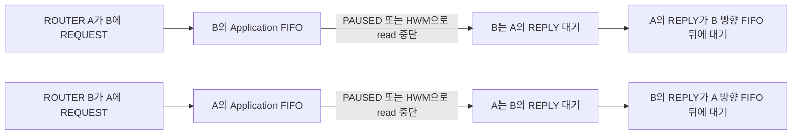
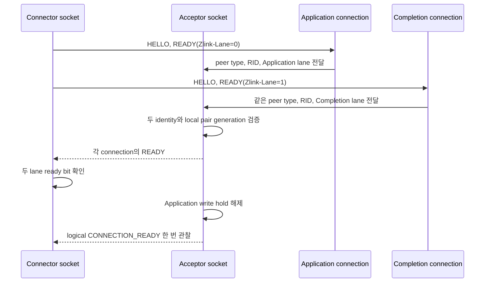
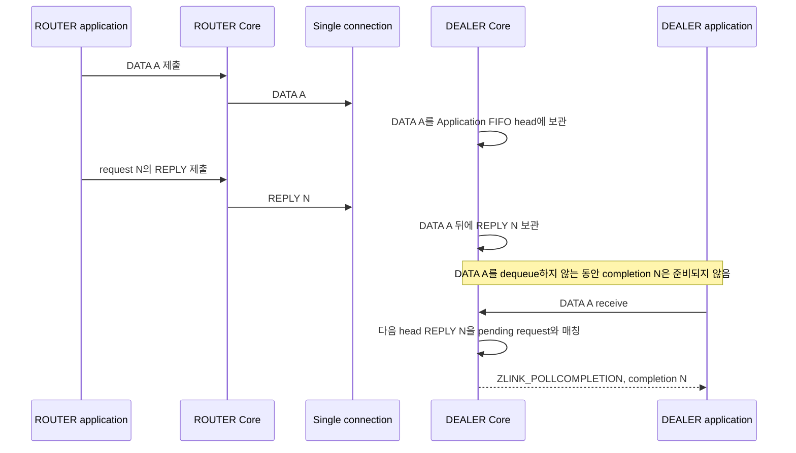
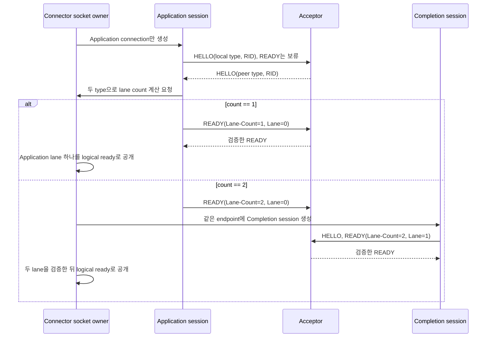

# DEALER-ROUTER single lane 설계

[문서 목차](../README.ko.md)

> 이 문서는 Core 0.16.0에서 DEALER-ROUTER의 physical transport를 두 connection에서
> 한 connection으로 줄일 개발자를 위한 설계다. §1은 현재 구현, §2는 목표 모델과 결정,
> §3은 목표 계약, §4는 구현 계획, §5는 공개 표면으로 확인할 검증 요구를 설명한다.
> 보호된 정식 스펙을 대신하지 않으며, 이 문서를 작성하는 작업에서는 코드와 정식 스펙을
> 변경하지 않는다.

결론은 A안이다. DEALER-ROUTER는 Application lane 하나만 사용하고 ROUTER-ROUTER는
Application lane과 Completion lane을 유지한다. 0.16.0의 typed request는 DEALER에서
ROUTER로만 향하므로 DEALER-ROUTER에는 completion을 별도 connection으로 분리해야 끊을
수 있는 양방향 request wait cycle이 없다. 반면 ROUTER-ROUTER는 양쪽이 서로 request를
보낼 수 있으므로 두 lane을 유지해야 한다.

B안처럼 모든 socket 쌍을 한 connection으로 통일하려면 receiver가 `PAUSED`를 보낸 뒤에도
wire에 남아 있는 Application record를 계속 읽어야 한다. 현재 option과 transport 관측값만으로는
그 byte 창의 portable한 최댓값을 정할 수 없다. 따라서 B안은 유한한 negotiated credit을 새로
정의하기 전에는 memory 상한과 교착 부재를 함께 증명하지 못한다.

이 설계의 범위는 다음과 같다.

- DEALER-ROUTER와 ROUTER-ROUTER의 connection 수, READY metadata, frame 경로, HWM,
  reconnect, monitor 의미를 정한다.
- Core의 socket-local completion queue와 `ZLINK_POLLCOMPLETION`은 유지한다. Transport의
  Completion lane과 public completion queue는 서로 다른 개념이다.
- Application Job Queue의 permit 수와 pause·resume threshold는 바꾸지 않는다.
- Public 함수, enum 값, struct layout과 binding method를 추가하거나 제거하지 않는다.
- 구버전 wire를 수용하는 fallback, dual handshake와 rolling-upgrade shim을 만들지 않는다.

## 1. 현재 lane 모델과 바꾸려는 문제

### 1.1 두 lane이 끊는 wait cycle

현재 DEALER와 ROUTER socket은 상대 type을 알기 전부터 logical peer 하나에 physical
connection 두 개를 연다. Application lane은 DATA와 REQUEST를, Completion lane은 REPLY,
error reply와 receive-flow state를 운반한다. 정식 ZMP 계약도 같은 구분을 정의한다
(`core/doc/spec/core/protocol/01-zmp.ko.md:169-188`).

두 lane을 둔 이유는 같은 방향 FIFO에 request와 reply가 함께 있을 때 생기는 다음 cycle을
끊기 위해서다.



현재 Completion lane은 Application HWM과 Core budget에서 제외된다. Application ingress가
멈춰도 terminal reply와 flow-state frame을 읽을 수 있다
(`core/doc/spec/core/socket/README.ko.md:413-426`,
`core/doc/spec/core/systems/05-connection-memory.ko.md:80-90`). 이 원칙은
ROUTER-ROUTER에서 계속 필요하다.

0.16.0의 typed request 방향은 더 좁다. DEALER는 ROUTER로 request할 수 있지만 ROUTER가
DEALER RID로 typed request를 보내면 `EPROTOTYPE`이다
(`core/doc/spec/core/socket/README.ko.md:965-986`,
`core/src/runtime/sockets/router/router_admission.cpp:78-119`). 따라서 DEALER-ROUTER에는
위 그림의 두 request edge가 동시에 존재하지 않는다.

### 1.2 Connector와 acceptor가 현재 connection을 만드는 방법

현재 connector는 local socket type만 보고 lane 수를 정한다.

- Inproc connect는 local type이 DEALER 또는 ROUTER이면 `lane_count == 2`로 정하고,
  index 0에 Application pipe, index 1에 Completion pipe를 만든다
  (`core/src/runtime/sockets/common/socket_base_endpoint.cpp:176-229`).
- TCP·IPC·TLS·WS·WSS connect도 같은 조건으로 pair ID와 공유
  `transport_pair_state_t`를 만든 뒤 session 두 개를 연다. Completion session은 HWM을
  `0`으로 두고 socket buffer를 completion 정책으로 제한한다
  (`core/src/runtime/sockets/common/socket_base_endpoint.cpp:345-373`).
- `transport_pair_state_t`는 generation과 두 ready bit를 공유한다. 두 bit가 모두 설정된
  때만 reset을 끝낸다 (`core/src/runtime/core/options.hpp:37-41,54-108`).

Connector는 Application connection을 먼저 열고 Completion connection을 두 번째로 연다.
각 session의 option에는 같은 local pair ID·generation, 서로 다른 lane 값과
`transport_pair_initiator == true`가 들어간다. 이 pair ID와 generation은 process-local이며
wire property가 아니다.

Acceptor는 connection을 먼저 만들지 않는다. Connector가 연 두 physical connection을 각각
accept하고, 각 connection의 HELLO에서 peer type과 RID를 읽는다. READY를 받을 때 같은 peer
RID를 key로 local pair ID·generation을 할당하거나 기존 값을 재사용한다
(`core/src/runtime/engine/asio/asio_zmp_engine.cpp:421-440,496-579`,
`core/src/runtime/sockets/common/socket_base_api.cpp:65-124`). 두 lane의 peer identity가 같고
두 READY가 모두 검증된 뒤에만 Application pipe를 공개 scheduler에 붙인다
(`core/src/runtime/sockets/common/socket_base_api.cpp:301-363`).



Passive side는 자기 READY를 transport에 모두 기록한 뒤에 lane readiness를 공개한다.
Physical lane 하나의 wire handshake가 끝난 것만으로는 logical peer가 ready가 아니다
(`core/src/runtime/engine/asio/asio_zmp_engine.cpp:357-373`).

### 1.3 `Zlink-Lane`과 현재 frame 경로

DEALER 또는 ROUTER의 READY에는 `Zlink-Lane` 한 byte가 들어간다. `0`은 Application,
`1`은 Completion이다. Encoder와 parser는
`core/src/runtime/protocol/zmp_metadata.hpp:75-95,117-136`에 있다. Local socket type이
DEALER 또는 ROUTER이면 이 property가 반드시 있어야 하며, connector는 받은 lane이 그
session을 열 때 정한 lane과 같은지도 확인한다
(`core/src/runtime/engine/asio/asio_zmp_engine.cpp:515-553`).

현재 post-handshake traffic은 다음과 같이 나뉜다.

| Frame·record | 현재 physical lane | 현재 소비 지점과 근거 |
|---|---|---|
| DATA | Application | Socket 종류별 ordinary receive. ZMP 표는 `core/doc/spec/core/protocol/01-zmp.ko.md:234-248`에 있다. |
| REQUEST | Application | DEALER weighted route 또는 ROUTER exact RID route로 제출한다. `core/src/api/socket/socket_request_reply_submit_api.cpp:805-868,971-994`, `core/src/runtime/sockets/router/router_admission.cpp:78-119` |
| REPLY·error reply | Completion | Completion owner가 pending sequence를 찾아 socket-local completion queue에 넣는다. DATA·REQUEST가 이 lane에 오면 protocol error다. `core/src/api/socket/socket_request_reply_dispatch.cpp:183-260` |
| FLOWSTATE | Completion | Session command path 또는 inproc completion pipe에서 Core가 소비하고 paired Application pipe에 PAUSED·RUNNING을 적용한다. `core/src/runtime/sockets/common/socket_base_flow_state.cpp:129-277` |
| WEIGHT | Application | Network에서는 ZMP command, inproc에서는 owner command로 소비한다. Completion lane에는 쓰지 않는다. `core/src/runtime/sockets/common/socket_base_dispatch.cpp:256-325,384-447` |
| HELLO·READY·handshake ERROR | 각 physical connection의 handshake | Application data보다 먼저 각 connection에서 처리한다. `core/src/runtime/engine/asio/asio_zmp_engine.cpp:396-493` |
| ROUTER synthetic RID preamble | Application | Completion connection에는 만들지 않는다. `core/doc/spec/core/protocol/01-zmp.ko.md:179-188` |

REPLY route는 REQUEST를 받은 Application pipe에서 시작한다. Responder ROUTER는 source RID와
reply token에 저장한 source pipe를 사용해 그 pair의 Completion pipe를 찾는다. 그 physical
source가 사라졌으면 같은 logical RID의 최신 ready Completion pipe를 다시 찾는다
(`core/src/api/socket/socket_request_reply_runtime_io.cpp:1474-1604,1681-1699`). 따라서
reply token은 physical connection보다 오래 살 수 있다는 공개 계약을 지킨다
(`core/doc/spec/core/socket/README.ko.md:1029-1039`).

### 1.4 Pair readiness, reconnect와 detach

Pair table은 `(pair_id, generation)`을 key로 Application·Completion pipe, validation 상태,
remote flow state와 ready 여부를 함께 소유한다. 두 lane이 준비되면 현재 local receive-flow
상태를 Completion pipe로 다시 보내고, remote PAUSED를 Application pipe에 적용한 뒤 write
hold를 해제한다 (`core/src/runtime/sockets/common/socket_base_api.cpp:438-523`).

Connector의 두 session은 같은 `transport_pair_state_t`를 사용한다. 한 lane이 실패하면
generation을 한 번 증가시키고 두 session을 새 generation으로 다시 연결한다
(`core/src/runtime/core/session_base.cpp:593-627`). Socket 쪽에서 한 pipe의 termination을
받으면 pair table에서 sibling을 찾아 함께 종료한다
(`core/src/runtime/sockets/common/socket_base_api.cpp:1199-1255,1334-1340`). 이전 generation의
FLOWSTATE와 REPLY는 새 generation에 적용하지 않는다.

Monitor는 physical event의 `transport_lane`을 그대로 공개한다
(`core/include/zlink/eventing/api.h:13-18,38-49`,
`core/src/runtime/sockets/common/socket_base_monitor.cpp:772-791`). 다만
`CONNECTION_READY`는 두 ready bit가 모두 설정된 logical peer를 한 번만 센다
(`core/src/runtime/sockets/common/socket_monitor_runtime.cpp:151-165`). Receive-flow event는
frame을 실어 온 Completion lane이 아니라 상태가 적용된 Application pipe의 lane과
`connection_id`를 보고한다
(`core/src/runtime/sockets/common/socket_base_flow_state.cpp:420-487`,
`core/doc/spec/core/04-events.ko.md:51-76`).

### 1.5 DEALER inbound의 남는 HOL

DEALER-ROUTER를 한 connection으로 합치면 ROUTER에서 DEALER로 향하는 다음 두 record가 한
FIFO를 사용한다.

```text
[ROUTER push DATA A][ROUTER push DATA B][REPLY N]
```

DEALER가 A를 dequeue하지 않으면 REPLY N도 앞지르지 못한다. REPLY가 request timeout 전에
queue head에 도달한다는 보장은 없다. 이는 latency coupling이며 terminal completion의 독립
progress 보장이 아니다.

이 상태는 Core의 양방향 request wait cycle이 아니다. ROUTER는 이 DEALER에 typed request를
보낼 수 없으므로 DEALER가 돌려줄 REPLY를 기다리면서 자기 receive를 멈추는 반대 edge가 없다.
DEALER의 request timeout은 기다림을 terminal로 끝낸다. Application이 별도 protocol로 만든
상호 대기는 이 설계가 보장하는 Core liveness 범위가 아니다.

## 2. 목표 모델 비교와 결정

### 2.1 공통 불변 조건

A안과 B안을 비교할 때 다음 조건은 바꾸지 않는다.

1. ZMP kind와 request sequence는 Core 내부 protocol 정보이며 binding과 application이 만들거나
   해석하지 않는다.
2. Framework Application Job Queue는 job permit 수로 제한한다. Core HWM은 physical queue가
   보유한 byte로 제한한다. 한 값을 다른 값으로 환산하지 않는다
   (`framework/doc/framework/common/spec/server/01-execution/04-application-job-queue-and-backpressure.ko.md:59-73`).
3. Receive-flow state는 socket-wide absolute `RUNNING`·`PAUSED`다. Peer별 public setter를
   추가하지 않는다.
4. Public DATA receive와 `ZLINK_POLLCOMPLETION`을 분리한다. REPLY를 DATA로 반환하지 않는다.
5. Mixed-version peer를 지원하는 fallback과 두 wire 모델의 자동 판별을 추가하지 않는다.

### 2.2 A안 — socket 쌍 type에 따라 lane 수를 정한다

권고 정책은 다음과 같다. 표의 queue는 transport physical queue와 socket-local public
completion queue를 구분해 적었다.

| Socket 쌍 | Physical connection | Transport queue와 record | Receive-flow·HWM 정책 |
|---|---:|---|---|
| PAIR | 1 | 기존 Application queue | Receive-flow 미지원, 기존 byte HWM 유지 |
| STREAM | 1 | 기존 packet·raw Application queue | Receive-flow 미지원, 기존 byte HWM 유지 |
| PUB-SUB·XPUB-XSUB | 1 | 기존 publish·subscription queue | Receive-flow 미지원, 기존 byte HWM 유지 |
| DEALER-ROUTER | 1 | DATA·REQUEST·REPLY·error reply가 한 Application physical FIFO를 공유한다. Core는 head kind를 보고 DATA·REQUEST는 public receive로, REPLY·error reply는 socket-local completion queue로 보낸다. | 일반 record 네 종류는 같은 byte HWM과 remote PAUSED를 적용한다. FLOWSTATE·WEIGHT 같은 Core control은 HWM·remote PAUSED를 우회하되 이미 commit한 record와 열린 multipart를 앞지르지 않는다. |
| ROUTER-ROUTER | 2 | Application은 DATA·REQUEST·WEIGHT, Completion은 REPLY·error reply·FLOWSTATE를 운반한다. | Application만 byte HWM·remote PAUSED를 적용한다. Completion은 현재처럼 HWM과 Core budget에서 제외한다. |

현재 wire compatibility가 허용하는 DEALER-DEALER의 목표 lane 수는
[OPEN QUESTIONS](#open-questions)에 남긴다. 이 판정은 lane-count 함수와 wire metadata를
구현하기 전의 설계 gate다. 판정 전 정책 함수가 확정하는 값은 DEALER-ROUTER의 `1`과
ROUTER-ROUTER의 `2`뿐이며, DEALER-DEALER 입력은 구현 가능한 목표값으로 취급하지 않는다.
아래 handshake의 대칭성 설명에서 DEALER-DEALER를 포함하는 문장은 감독자가 지원과 count를
승인한 뒤에만 적용한다.

#### DEALER-ROUTER single lane의 경로와 순서

DEALER에서 ROUTER로 향하는 single lane에는 DATA, REQUEST와 Core control이 흐른다. ROUTER에서
DEALER로 향하는 같은 full-duplex connection에는 DATA, REPLY, error reply와 Core control이
흐른다. ROUTER→DEALER REQUEST는 계속 `EPROTOTYPE`으로 거절한다.

REPLY와 error reply는 Application physical queue의 normal record다. 따라서 다음 조건을
적용한다.

- 앞에서 commit한 DATA를 앞지르지 않는다.
- 같은 queue의 byte HWM과 peer가 알린 PAUSED를 우회하지 않는다.
- Responder의 `zlink_reply_part(FINAL)`은 기존 `SNDTIMEO` 안에서 admission을 기다리며,
  기다림이 끝나면 `ZLINK_SUBMIT_BACKPRESSURED`가 될 수 있다.
- Requester에서는 REPLY가 head에 도달해 pending sequence와 일치한 뒤에만
  `ZLINK_POLLCOMPLETION`이 준비된다. 그 전에 request timeout이 먼저 terminal을 확정할 수 있다.
- REPLY는 `zlink_recv_part()`에 나타나지 않고 DATA는 `zlink_completion_recv()`에 나타나지
  않는다.

FLOWSTATE와 WEIGHT는 Core control이다. Sender는 WEIGHT의 전용 boundary-staging 원칙을 본떠
FLOWSTATE용 latest-absolute pending slot을 별도로 두고, Application HWM과 remote PAUSED를
우회해 control을 기록해야 한다. 현재 generic control writer를 재사용한다는 뜻은 아니다. 이
우회는 이미 encoder나 pipe에 commit한 byte를 건너뛰거나 Application multipart 중간에 frame을 끼워 넣는
우선순위 전송이 아니다. Network receiver는 wire byte 순서로 control을 decode하며, 앞선
Application record가 queue에 admission된 뒤 application callback이 실행되기 전이라도 control을
적용할 수 있다. HWM 때문에 transport read가 control frame 앞에서 멈추면 그 control도 늦어진다.
Inproc은 같은 message-boundary 규칙과 socket-owner 직렬화를 지키는 owner control을 사용한다.

두 pending control slot은 각 update마다 공유 monotonic counter에서 새 enqueue sequence를 받는다.
같은 kind의 새 absolute value가 이전 slot을 덮으면 sequence도 새 update 시점으로 옮긴다. Boundary에서
살아남은 slot을 sequence 오름차순으로 append한다. 예를 들어 `FLOW(PAUSED) → WEIGHT →
FLOW(RUNNING)`이면 superseded PAUSED는 wire에 쓰지 않고 WEIGHT 뒤에 최신 RUNNING을 쓴다. 이는
사라진 중간 absolute state의 순서를 보장하지 않고, 살아남은 latest value 사이의 enqueue 순서를
보장한다.



#### A안의 교착 부재 논증

DEALER-ROUTER에서는 typed request edge가 DEALER→ROUTER 하나뿐이다. Single lane에서
ROUTER→DEALER DATA가 REPLY를 늦추거나 PAUSED가 REPLY admission을 막을 수 있지만,
ROUTER가 같은 DEALER의 REPLY를 기다리는 반대 typed request edge는 만들 수 없다. 따라서
두 peer의 Application FIFO가 서로의 terminal reply를 가두는 Core wait cycle은 없다. 지연은
request timeout 또는 reply submit timeout으로 끝날 수 있으며 성공 latency는 보장하지 않는다.

ROUTER-ROUTER에서는 양쪽 request edge가 모두 존재한다. A안은 이 쌍의 REPLY·error reply와
FLOWSTATE를 HWM 없는 Completion lane으로 유지한다. 두 Application lane이 모두 PAUSED여도
각 peer의 completion owner가 별도 physical queue를 읽으므로 이미 admission된 request의
terminal reply는 Application drain을 기다리지 않는다. Connection 유지와 allocation 성공이라는
현재 completion 조건은 그대로다.

### 2.3 A안의 handshake와 lifecycle

Lane 수를 local socket type만으로 정하면 양쪽이 서로 다른 connection 수를 열 수 있다. 목표
handshake는 HELLO에서 확인한 두 socket type과 READY의 명시적 lane count를 함께 검증한다.
현재 initiator가 peer HELLO를 받기 전에 HELLO와 READY를 연달아 쓰는 순서
(`core/src/runtime/engine/asio/asio_zmp_engine.cpp:234-261`)도 바꾼다. 양쪽은 HELLO만 먼저 쓰고,
peer HELLO를 검증해 count를 결정한 뒤 READY를 쓴다.

목표 READY property는 다음과 같다.

| Property | 적용 범위 | 값과 검증 |
|---|---|---|
| `Socket-Type` | 기존 metadata 규칙 | HELLO에서 확인한 peer type과 같아야 한다. |
| `Routing-Id` | DEALER·ROUTER | 같은 logical peer의 모든 lane에서 같아야 한다. |
| `Zlink-Lane-Count` | DEALER·ROUTER, 새 mandatory property | 1 byte `1` 또는 `2`. DEALER-ROUTER이면 `1`, ROUTER-ROUTER이면 `2`다. DEALER-DEALER 값은 OPEN QUESTION 1의 판정을 따른다. |
| `Zlink-Lane` | DEALER·ROUTER | 1 byte. Count 1에서는 `0`만, count 2에서는 `0`과 `1`을 정확히 한 번씩 허용한다. |

승인된 socket 쌍의 lane-count 함수는 `(local_type, peer_type)`의 순서를 바꿔도 같은 값을
반환한다. A가 보는 `(A local, B peer)`는 B가 보는 `(B local, A peer)`와 순서만 반대이므로
양쪽이 같은 count를 계산한다. READY의 advertised count가 계산값과 다르면 협상하지 않고
protocol error로 닫는다. 지원 여부나 count가 정해지지 않은 socket 쌍도 public ready가 되지
않는다.

Connector는 처음에 Application connection 하나만 연다. 그 connection에서는 HELLO만 먼저
보내고, peer HELLO에서 type을 확인한 뒤 socket owner가 count를 결정한다. Engine I/O thread는
그 결정을 받을 때까지 READY를 보류한다. Endpoint가 취소되거나 `HANDSHAKE_IVL`이 끝나면 보류한
READY와 optional child-session 생성을 함께 취소한다. 다음 순서는 이 owner 경계를 포함한다.



Acceptor는 Application READY의 count가 2이면 같은 peer RID의 Completion connection을
`HANDSHAKE_IVL` 안에서 기다린다. Count 1도 READY write drain만으로 ready가 되지 않는다. Session
bind, socket lane-set admission, Application scheduler attach와 write-hold release를 차례로 끝낸
뒤 logical ready를 공개한다
(`core/src/runtime/sockets/common/socket_base_api.cpp:336-363,489-544`). Count 1에서 lane 1이
오거나 count 2에서 lane이 중복·누락되거나 두 connection의 type·RID·count가 다르면 관련 lane
set 전체를 닫는다.

Inproc은 wire HELLO가 없으므로 endpoint resolution에서 두 socket type을 같은 lane-count 함수에
넣는다. Connect가 bind보다 먼저라 peer type을 아직 모르면 Application intent 하나만 보관하고
public ready를 내지 않는다. Bind가 peer를 제공한 뒤 count를 확정하고, ROUTER-ROUTER일 때만
Completion pipe를 추가한다. Completion pipe를 먼저 추측해 만들었다가 DEALER peer이면 닫는
경로는 두지 않는다.

구버전 peer는 `Zlink-Lane-Count`를 보내지 않는다. 새 Core는 property 누락, 잘못된 길이,
계산값 불일치와 예상하지 않은 lane을 READY protocol error로 처리하고 logical ready를 공개하지
않는다. 새 Core는 구버전처럼 DEALER-ROUTER에 두 lane을 여는 fallback을 두지 않는다. 양쪽
binary를 함께 교체하고 새 connection을 여는 배포만 지원한다.

Reconnect와 detach는 lane count에 따라 같은 상태 기계를 사용한다.

- Lane set은 expected ready mask를 소유한다. Count 1의 mask는 Application bit, count 2의 mask는
  Application+Completion bit다.
- Count 1도 local pair ID·generation을 유지해 pending request, FLOWSTATE와 monitor lifecycle을
  같은 구조로 fence한다. 다만 sibling pipe는 없다.
- Active connector의 count 1 connection이 끊기면 공유 state의 generation을 한 번 증가시키고
  Application session 하나만 다시 연다. Count 2의 한 lane이 끊기면 현재처럼 두 lane을 모두
  닫고 같은 새 local generation으로 다시 연다. Passive acceptor는 reconnect 때 peer와 generation을
  공유한다고 가정하지 않고, 새 local pair identity·generation을 할당할 수 있다
  (`core/src/runtime/sockets/common/socket_base_api.cpp:65-125,1205-1213`).
- 새 generation이 ready가 되면 socket의 현재 local receive-flow absolute state를 다시 보낸다.
  이전 connection ID·generation의 REPLY와 FLOWSTATE는 폐기한다.
- Reply token은 계속 logical RID에 속한다. DEALER peer의 reply route는 현재 ready Application
  pipe, ROUTER peer의 reply route는 현재 ready Completion pipe를 선택한다.

### 2.4 B안 — 모든 쌍을 한 connection으로 통일한다

B안은 `Zlink-Lane`, pair handshake와 Completion physical connection을 모두 없앤다. Receiver는
ZMP kind를 wire ingress에서 확인해 DATA·REQUEST를 Application queue에, REPLY·error reply와
control을 Completion queue에 넣는다. Receiver가 `PAUSED`를 알린 뒤 sender는 DATA·REQUEST만
멈추고 REPLY·FLOWSTATE와 protocol control은 계속 보낸다. 구조는 HTTP/2의 logical stream별
flow control과 비슷하지만 현재 ZMP에는 byte credit이나 acknowledged receive window가 없다.

#### Soft HWM 초과 창

Receiver가 Application queue의 soft HWM `H`에서 PAUSED를 보낸 시점에는 peer와 network가 이미
Application byte를 소유할 수 있다. 모든 peer가 PAUSED를 지킨 뒤 안정된 시점의 보유량은 다음
형태로만 나타낼 수 있다.

```text
Q_application <= H + sum(W_peer)

W_peer =
    peer Core outbound queue에 이미 admission된 Application byte
  + encoder·TLS·WebSocket user-space buffer
  + effective kernel send buffer
  + network·TCP receive window 안의 byte
  + effective kernel receive buffer
  + decoder read batch
  + HWM보다 큰 complete record 한 건의 oversize 여유
```

각 `W_peer`가 유한하면 한 implementation과 한 설정에서는 초과량도 유한하다. 그러나 현재
계약으로는 portable한 숫자를 계산하거나 설정할 수 없다.

- `SNDHWM`은 Core queue만 제한하고 kernel·TLS·WS·network byte를 제한하지 않는다.
- `SNDBUF`·`RCVBUF`는 운영체제에 요청한 값이며 실제 buffer와 autotuning 결과 전체를
  보고하지 않는다. 현재 memory spec도 kernel autotuning과 TLS storage가 monitor 밖이라고
  명시한다 (`core/doc/spec/core/systems/05-connection-memory.ko.md:92-105`).
- TCP receive window와 transport 중간 buffer는 peer가 보낸 READY metadata로 협상하지 않는다.
- `MAXMSGSIZE`가 무제한일 수 있고, 현재 HWM은 빈 pipe의 큰 complete message 한 건을 허용한다
  (`core/doc/spec/core/systems/05-connection-memory.ko.md:65-69`).

따라서 `hard_cap = H + configured_in_flight_window`를 계약으로 만들려면 먼저 transport와
관계없는 byte credit, finite maximum record, sender가 미확인 Application byte를 제한하는 규칙,
reconnect 때 credit을 초기화하는 generation을 wire에 추가해야 한다. 현재 public option을
조합하는 것만으로는 충분하지 않다.

#### B안의 교착 부재 조건

다음 세 조건이 모두 참이면 compliant peer 사이에서는 양방향 request cycle이 생기지 않는다.

1. Sender가 PAUSED를 받은 뒤 새 DATA·REQUEST를 admission하지 않고, REPLY·control을 앞선
   미전송 Application queue와 독립적으로 scheduler에 제출한다.
2. Receiver가 `H + W_max`까지 Application prefix를 계속 읽어, single wire에서 그 뒤에 있는
   REPLY·control까지 도달한다.
3. Hard cap은 `H + W_max`보다 작지 않고 `W_max`는 protocol이 보장하는 유한한 값이다.

현재는 세 번째 조건을 만족하는 계약이 없다. Hard cap에 도달해 read를 멈추는 안전판은
noncompliant peer로부터 memory를 보호하지만, 같은 stream의 Application prefix 뒤에 있는
REPLY도 함께 막는다. 이 fallback에서는 liveness를 포기하므로 unconditional한 교착 부재를
주장할 수 없다. B안을 채택하려면 먼저 negotiated credit 설계를 별도 정식 계약으로 승인해야
한다.

### 2.5 비교

| 기준 | A안: 쌍 type별 1·2 lane | B안: 모든 쌍 1 connection |
|---|---|---|
| 순환 교착 | DEALER-ROUTER는 request 방향 제약으로 cycle이 없고, ROUTER-ROUTER는 Completion lane으로 끊는다. | Finite negotiated window와 compliant sender를 전제로만 증명된다. Hard-cap fallback은 HOL을 다시 허용한다. |
| 구현 복잡도 | Lane-count handshake, dynamic second session과 single-lane head kind 분기가 필요하다. 기존 pair·completion owner를 ROUTER-ROUTER에 재사용한다. | 모든 receive ingress demux, kind별 sender gate, soft HWM, hard cap, violation 진단, credit reconnect를 새로 소유해야 한다. |
| Memory 상한 | DEALER-ROUTER의 모든 normal record는 기존 physical byte HWM 안에 있다. ROUTER-ROUTER Completion lane의 현재 별도 회계는 유지한다. | `H + in-flight`이나 현재 계약에서는 in-flight를 정량화할 수 없다. |
| Latency | DEALER-ROUTER는 앞선 push DATA와 PAUSED가 REPLY를 늦출 수 있다. ROUTER-ROUTER reply isolation은 유지한다. | 모든 쌍에서 이미 serialized된 Application prefix가 REPLY를 늦춘다. Receiver demux는 wire 순서를 지우지 못한다. |
| Reconnect | Count 1은 한 session, count 2는 기존 pair generation으로 다시 연다. | PAUSED, credit, soft-overrun byte와 hard-cap 위반 상태를 generation별로 초기화해야 한다. |
| Migration | DEALER-ROUTER와 handshake 분기를 바꾸고 ROUTER-ROUTER pair를 보존한다. | Pair, lane metadata, monitor lane 의미, memory accounting과 모든 request-reply transport를 함께 바꾼다. |
| Setup resource | DEALER-ROUTER의 fd, TLS·WS handshake와 base buffer가 절반으로 줄어든다. ROUTER-ROUTER는 그대로다. | ROUTER-ROUTER까지 모두 줄어든다. 대신 queue demux와 flow-control state가 모든 connection에 생긴다. |
| Steady-state perf | DEALER-ROUTER setup과 idle memory 개선을 기대한다. Push와 reply가 섞인 p99는 악화될 수 있다. | Connection 수는 줄지만 kind scheduler, extra queue와 soft-HWM accounting 비용이 모든 record에 생긴다. |
| Rollback 범위 | Lane-count branch와 DEALER-ROUTER data path를 되돌리면 기존 두-lane 모델로 돌아간다. | Wire·memory·scheduler를 함께 되돌려야 한다. |

### 2.6 권고

A안을 0.16.0 목표로 채택한다. 이 결정은 불필요해진 DEALER-ROUTER Completion connection만
제거하고, 원래 두 lane이 해결한 ROUTER-ROUTER HOL cycle은 유지한다. DEALER inbound의
reply latency coupling은 숨기지 않고 Core와 Framework 계약에 기록한다.

B안은 폐기하지 않고 후속 연구 대상으로 남긴다. 다시 검토하려면 `W_max`를 wire credit으로
정의하고, hard cap 전까지 receiver가 읽기를 계속할 수 있음을 증명하며, compliant·noncompliant
peer 각각의 liveness와 memory 결과를 contract test로 먼저 고정해야 한다.

## OPEN QUESTIONS

다음 두 항목은 이 문서의 근거만으로 제품 계약을 확정할 권한이 없어 감독자 판정이 필요하다.

1. **DEALER-DEALER lane 수** — 현재 HELLO compatibility는 DEALER-DEALER를 허용한다
   (`core/src/runtime/protocol/zmp_control.hpp:187-193`). DEALER의 typed request target은 ROUTER만
   허용하므로 같은 request cycle은 없다
   (`core/src/runtime/sockets/dealer/dealer.cpp:245-253`). 권고값은 single lane 1이다. 감독자는
   이 조합을 0.16.0에서 계속 지원할지, 지원한다면 count 1로 둘지 승인해야 한다.
2. **ZMP version byte** — 구현 기준안은 `zmp_version == 0x01`을 유지하고 mandatory
   `Zlink-Lane-Count` 누락으로 old peer를 fail-fast한다. Formal version 정책이 wire 구조 변경마다
   version 증가를 요구한다면 version byte도 함께 올려야 한다. 어느 선택이든 fallback과 mixed
   connection은 지원하지 않는다.

**판정(2026-09-02, 감독자·사용자 승인)**: A안을 0.16.0 목표로 채택한다.
1. DEALER-DEALER는 계속 지원하며 lane count `1`이다(typed request 불가라 cycle 없음; C perf
   표준 pattern과 Framework가 사용).
2. ZMP VERSION은 `0x01`을 유지한다. VERSION은 header 배치 계약이며 READY metadata 집합
   변경(0.16.0의 pair property 제거와 같은 선례)으로 올리지 않는다. Mandatory
   `Zlink-Lane-Count` 누락은 READY protocol error로 fail-fast한다.

## 3. 계약 변경

### 3.1 Core 정식 스펙

구현과 같은 변경에서 다음 Korean owner 문서를 먼저 고치고 English mirror를 함께 맞춘다.
이 목록은 이 설계 문서 작성 작업에서 실제 파일을 수정하라는 뜻이 아니다.

| 정식 스펙 | 바꿀 계약 |
|---|---|
| `core/doc/spec/core/protocol/01-zmp.ko.md` | §4.1의 모든 DEALER·ROUTER=2 규칙을 pair type별 count로 바꾼다. `Zlink-Lane-Count`, 대칭 계산, count별 허용 `Zlink-Lane`, missing·mismatch·duplicate 처리와 no-shim을 정의한다. DEALER-ROUTER single stream의 DATA·REQUEST·REPLY·error reply·FLOWSTATE·WEIGHT 경로와 FIFO를 kind 표에 기록한다. ROUTER-ROUTER의 기존 두-lane 표는 유지한다. |
| `core/doc/spec/core/socket/README.ko.md` | Pull completion API는 유지하되 transport Completion lane과 구분한다. Receive-flow setter가 DEALER-ROUTER에서는 single Application connection의 Core control, ROUTER-ROUTER에서는 Completion lane을 사용한다고 고친다. HWM 절은 DEALER-ROUTER REPLY·error reply도 Application physical HWM과 PAUSED를 적용하고 ROUTER-ROUTER Completion만 제외한다고 바꾼다. Request timeout보다 reply가 늦을 수 있는 경계를 기록한다. |
| `core/doc/spec/core/socket/06-dealer.ko.md` | DATA와 reply가 한 inbound FIFO를 공유하지만 public receive와 completion 결과는 계속 분리된다고 정의한다. Receive-flow 전송 경로, reconnect resync와 DEALER inbound HOL·timeout 문장을 추가한다. Weight는 single Application connection을 사용한다. |
| `core/doc/spec/core/socket/07-router.ko.md` | Peer type에 따라 reply route가 DEALER의 Application pipe 또는 ROUTER의 Completion pipe를 고른다고 정의한다. ROUTER→DEALER typed request `EPROTOTYPE`은 유지한다. Receive-flow broadcast도 peer type에 따라 경로를 고른다. |
| `core/doc/spec/core/04-events.ko.md` | “paired DEALER/ROUTER completion lane”을 receive-flow 지원 D/R connection으로 바꾼다. Flow event는 두 모델 모두 상태가 적용된 Application pipe와 현재 `connection_id`, Application `transport_lane`을 보고한다는 기존 결과를 유지한다. |
| `core/doc/spec/core/06-monitoring.ko.md` | `transport_lane`은 physical connection 분류라는 뜻을 유지한다. DEALER-ROUTER의 모든 physical event는 Application, ROUTER-ROUTER만 Completion 값을 낼 수 있다고 명시한다. `CONNECTION_READY`는 count 1·2 모두 logical peer당 한 번이다. `DETAIL_FLOW_STATE` 조건은 “Completion lane 보유”가 아니라 “DEALER 또는 ROUTER receive-flow 지원”으로 바꾼다. Auto-HWM snapshot ABI version은 유지하고, D/R reply가 `completion_current_accounted_bytes`, `completion_peak_accounted_bytes`, `completion_pending_message_count`와 `active_completion_directional_queue_count`에 들어가지 않는다는 조건을 고정한다. |
| `core/doc/spec/core/05-polling.ko.md` | Poll bit와 함수는 바꾸지 않는다. DEALER-ROUTER에서 앞선 DATA record의 마지막 part를 dequeue하기 전에는 뒤 REPLY가 physical head가 아니므로 `POLLIN`만 준비되고 `POLLCOMPLETION`은 준비되지 않을 수 있다고 정의한다. Head REPLY를 socket-local completion queue로 옮긴 뒤에는 기존 level-trigger와 `NO_DATA`까지 drain하는 규칙을 적용한다. |
| `core/doc/spec/core/08-runtime-boundary.ko.md` | 모든 DEALER/ROUTER가 두 connection을 가진다는 §3·§6 설명을 pair type별 모델로 바꾼다. Framework는 계속 public raw socket API만 사용하며 raw FLOWSTATE를 만들지 않는다는 경계는 유지한다. |
| `core/doc/spec/core/systems/05-connection-memory.ko.md` | HWM 없는 Completion memory와 64 KiB completion socket-buffer cap은 ROUTER-ROUTER에만 적용한다. DEALER-ROUTER reply byte는 Application queue accounting에 포함한다. 한 connection 제거로 줄어드는 idle·kernel·TLS memory와 변하지 않는 process hard-cap 부재를 구분한다. |
| `core/doc/spec/core/systems/06-auto-hwm.ko.md` | Application water-filling 방향 수는 DEALER-ROUTER single pipe를 기존 Application 방향 한 개로 계속 센다. Controlled D/R reply queue의 byte delta는 `core_queue_accounted_bytes`·`current_accounted_bytes`, 필요하면 `provisional_accounted_bytes`, `peak_accounted_bytes`와 `total_messaging_accounted_bytes`에 나타난다. `application_accounted_bytes`는 예약값 0을 유지한다. `completion_current_accounted_bytes`, `completion_peak_accounted_bytes`, `completion_pending_message_count`와 `active_completion_directional_queue_count`는 ROUTER-ROUTER Completion만 센다. DEALER-ROUTER reply의 HWM block은 Application admission으로 처리한다. Field layout과 ABI version은 바꾸지 않는다. |
| `core/doc/spec/core/glossary.ko.md` | `completion progress lane`을 모든 DEALER·ROUTER의 필수 경로가 아니라 ROUTER-ROUTER가 bidirectional request cycle을 끊기 위해 쓰는 별도 connection으로 좁힌다. Socket-local completion queue와 구분한다. |
| `core/doc/spec/core/03-errors.ko.md` | Receive-flow 미지원 이유를 “Completion lane 없음”에서 socket type 지원 여부로 바꾼다. DEALER는 별도 Completion lane이 없어도 setter를 계속 지원한다. Result·errno 숫자는 바꾸지 않는다. |
| `core/doc/spec/core/07-utilities.ko.md` | Proxy가 “Completion lane을 bridge하지 않는다”는 설명을 lane 유무가 아니라 request correlation·reply target state를 bridge하지 않는다는 계약으로 고친다. Single DEALER-ROUTER connection이 생겼다고 transparent request proxy가 되는 것은 아니다. |
| `core/doc/spec/core/socket/{01-pair,02-pub,03-sub,04-xpub,05-xsub,08-stream}.ko.md` | “별도 Completion lane이 없으므로 receive-flow를 지원하지 않는다”는 추론을 제거하고 해당 socket type이 receive-flow 대상이 아니라는 직접 규칙으로 바꾼다. Public 결과는 그대로다. |

현재 `core/doc/spec/core/protocol/01-zmp.ko.md:171-232`,
`core/doc/spec/core/08-runtime-boundary.ko.md:79-87,168-179`,
`core/doc/spec/core/systems/05-connection-memory.ko.md:80-90,131-136`이 모든 D/R에 별도
Completion lane이 있다고 서술한다. 위 표는 이 current-contract drift를 남기지 않기 위한
최소 owner 목록이다.

### 3.2 DEALER inbound HOL 문장

다음 문장을 ZMP §4.1, DEALER의 DATA·request completion 절, Socket 공통의 request·HWM 절에
같은 의미로 둔다.

> DEALER-ROUTER single connection에서 ROUTER가 먼저 보낸 DATA와 이후 REPLY·error reply는
> 같은 FIFO를 사용한다. DEALER가 앞선 DATA를 dequeue하지 않거나 local PAUSED가 유지되면
> REPLY는 앞지르지 못하며 request timeout이 먼저 terminal completion을 만들 수 있다.

Framework의 ClientServer 문서에는 Core 용어를 application 관점으로 바꿔 다음 문장을 둔다.

> Client DEALER가 Server ROUTER의 앞선 one-way DATA를 Core에서 receive하지 않거나
> receive-flow를 PAUSED로 유지하면 같은 connection 뒤의 reply도 늦어진다. 따라서
> ClientServer request timeout이 reply보다 먼저 확정될 수 있으며, timeout 뒤 늦은 reply는
> 기존 first-terminal 규칙에 따라 폐기된다.

이 문장은 “느리지만 결국 reply가 온다”는 보장이 아니다. Disconnect, allocation failure와
timeout의 기존 terminal 규칙이 그대로 먼저 끝낼 수 있다.

### 3.3 Framework receive-flow와 backpressure 스펙

Framework의 queue 크기, permit 계산과 threshold는 바꾸지 않는다. Lane을 progress 보장의
근거로 쓴 문장만 topology별로 좁힌다.

| Framework owner 문서 | 바꿀 내용 |
|---|---|
| `framework/doc/framework/common/spec/server/01-execution/04-application-job-queue-and-backpressure.ko.md` | §3에서 pre-receive terminal completion은 Framework permit을 계속 우회한다고 유지한다. 다만 ClientServer DEALER의 reply는 Core single FIFO와 byte HWM을 먼저 통과하므로 Application Job Queue 우회가 Core transport progress를 보장하지 않는다고 쓴다. §6의 “paired D/R”을 RouteMesh R-R 2 lane과 ClientServer D-R 1 lane으로 나눈다. |
| `framework/doc/framework/common/spec/server/01-execution/01-submit-and-completion.ko.md` | “Publish와 raw reply는 HWM-free”(`:454`)를 topology별로 나눈다. RouteMesh R-R raw reply는 기존 Completion lane에서 HWM-free다. ClientServer D-R raw reply는 single Application connection의 HWM·PAUSED와 `SNDTIMEO` admission을 적용하며 `BACKPRESSURED`가 될 수 있다. Framework completion queue에 들어간 뒤의 permit 우회와 first-terminal 규칙은 유지한다. |
| `framework/doc/framework/common/spec/server/00-foundation/06-framework-api.ko.md` | “Reply completion은 ordinary Core HWM을 사용하지 않는다”(`:101-105`)를 RouteMesh R-R에 한정한다. Record permit 표(`:149-158`)는 reply가 Core에서 completion으로 식별된 뒤에는 permit을 쓰지 않는다는 뜻으로 유지한다. “기존 Completion connection”(`:553-559`)을 topology별 경로로 바꾼다. |
| `framework/doc/framework/common/spec/server/01-execution/02-handler-turn-and-execution-gate.ko.md` | Completion connection에 의존하는 infrastructure-progress 설명을 RouteMesh R-R와 ClientServer D-R로 나눠, ClientServer reply가 single connection의 앞선 DATA 뒤에서 늦을 수 있음을 기록한다. |
| `framework/doc/framework/common/spec/server/02-channel-transport/03-client-server-channel.ko.md` | 실제 DEALER→ROUTER transport를 쓰는 현재 계약(`:314-317`)과 first-terminal request 규칙(`:338-381`)에 §3.2의 Client 문장을 추가한다. Retry target을 바꾸지 않는 규칙은 유지한다. |
| `framework/doc/framework/common/spec/server/03-spot-actor/03-mesh-node.ko.md` | Request completion, liveness, admission, relocation과 reply-recovery control이 쓰는 “기존 Completion connection”(`:387-389`)을 RouteMesh의 R-R 두-lane 경로로 명시한다. ClientServer의 D-R single-lane 규칙을 이 경로에 적용하지 않는다. |
| `framework/doc/framework/common/spec/server/02-channel-transport/05-transport-liveness.ko.md` | RouteMesh와 ClientServer를 모두 “paired DEALER/ROUTER”라고 부르는 receive-flow 범위를 topology별 lane 정책으로 바꾼다. Liveness message 자체는 application record라는 경계를 유지한다. |
| `framework/doc/framework/common/spec/server/00-foundation/02-glossary.ko.md` | Completion connection 정의를 RouteMesh R-R에 한정하고 ClientServer의 public completion 결과와 transport lane을 구분한다. Core HWM과 Application Job Queue 정의는 바꾸지 않는다. |
| `framework/doc/framework/common/spec/server/06-observability/01-runtime-monitoring.ko.md`, `02-runtime-metrics.ko.md` | Core snapshot을 그대로 투영한다는 원칙은 유지한다. DEALER-ROUTER reply byte가 `core_hwm.accounted`, ROUTER-ROUTER Completion byte만 `completion_accounted`에 들어가는 새 Core 의미를 설명한다. Metric 이름과 label은 바꾸지 않는다. |

RouteMesh의 MeshNode는 ROUTER-ROUTER를 사용하므로 기존 Completion progress 보장을 유지한다.
ClientServer만 DEALER-ROUTER single FIFO의 latency 경계를 받는다. Framework가 이를 보상하려고
임시 reply queue, raw frame parser나 Core HWM 조정기를 추가해서는 안 된다.

### 3.4 Binding 공개 API와 문서

Public API shape에는 변화가 없다.

- `zlink_socket_set_receive_flow_state()`와 `zlink_receive_flow_state_t`를 유지한다
  (`core/include/zlink/socket/api.h:179-197`, `core/include/zlink_enum.h:182-192`).
- `ZLINK_MONITOR_TRANSPORT_LANE_APPLICATION == 0`과
  `ZLINK_MONITOR_TRANSPORT_LANE_COMPLETION == 1`을 유지한다. ROUTER-ROUTER가 Completion 값을
  계속 사용하므로 enum을 제거하지 않는다 (`core/include/zlink/eventing/api.h:13-18`).
- `zlink_completion_recv()`, completion ID, reply token, request·reply 함수의 signature와 result
  enum을 바꾸지 않는다.
- Lane 수를 설정하거나 조회하는 public socket option을 추가하지 않는다.
- Monitor struct layout과 ABI version을 바꾸지 않는다.

관찰 의미는 바뀐다.

- DEALER-ROUTER의 connection event는 모두 Application lane이다. ROUTER-ROUTER만 physical
  Completion event를 낼 수 있다.
- DEALER-ROUTER reply byte와 pending physical record는 Application HWM accounting에 들어간다.
- DEALER-ROUTER reply submit은 기존 result 집합 안에서 HWM 때문에
  `BACKPRESSURED`가 될 수 있고, request completion은 앞선 DATA 때문에 늦을 수 있다.
- Receive-flow status bit와 field는 Completion lane 보유 여부가 아니라 DEALER·ROUTER type
  지원 여부로 해석한다.

Repository 검색에서 C ABI와 C++·Go·Java·Node·Python·Rust projection은 이미
`transport_lane` 또는 `transportLane`을 전달한다. .NET은 native layout에서 field를 보관하지만
현재 public monitor record에 새 lane selector를 추가할 근거는 없다. 모든 binding은 기존
field·enum을 유지하고 주석, contract test와 spec의 “모든 D/R reply는 HWM 없는 Completion
lane” 문장만 topology별로 바꾼다. 확인에 사용한 검색은 다음과 같다.

```bash
rg -n "transport_lane|TransportLane|transportLane" bindings framework/languages
rg -n "completion lane|Completion lane|completion progress lane|paired DEALER" \
  bindings/doc/spec core/include bindings/*/include bindings/*/src
```

`bindings/doc/spec/README.ko.md:1317-1318,1697-1705,4058-4061,4271-4283`과 다음 language owner의
raw reply 문장은 DEALER peer와 ROUTER peer를 나눠 고쳐야 한다.

- `bindings/doc/spec/cpp/README.ko.md:467-471`
- `bindings/doc/spec/dotnet/README.ko.md:305-309`
- `bindings/doc/spec/java/README.ko.md:633-638`
- `bindings/doc/spec/node/README.ko.md:531-536`
- `bindings/doc/spec/rust/README.ko.md:394-399`

DEALER peer로 보내는 reply는 Application HWM·PAUSED와 `SNDTIMEO`를 적용해 기존
`BACKPRESSURED` result가 가능하고, ROUTER peer로 보내는 reply는 기존 one-shot HWM-free
Completion 계약을 유지한다고 쓴다. Source·binary API compatibility는 유지되지만 wire
compatibility와 일부 monitor·backpressure 의미는 호환되지 않는다.

### 3.5 Wire 배포 계약

0.16.0에서는 같은 logical topology에 참여하는 Core를 함께 교체한다. New-old connection은
mandatory lane-count 검증에서 실패하고 `CONNECTION_READY`가 되지 않는다. 구버전 property를
읽는 fallback, old two-lane을 감지해 잠시 사용하는 mode와 feature flag는 두지 않는다.

READY property 변경과 data-path 변경은 한 release 경계에서 함께 배포한다. Property만 먼저
보내거나 single-lane receiver만 먼저 배포하면 mixed peer가 일부 record를 처리할 수 있으므로
허용하지 않는다. Formal ZMP version byte 판정은 OPEN QUESTION 2의 결론을 따른다.

## 4. 구현 계획

### 4.1 구현 순서

구현은 다음 순서로 진행한다. OPEN QUESTION 1의 DEALER-DEALER 지원·count와 OPEN QUESTION 2의
version 정책을 먼저 판정해야 1단계를 시작할 수 있다. 각 단계의 test가 통과한 뒤 다음 단계로
넘어간다.

1. 두 socket type에서 expected lane count와 ready mask를 계산하는 owner 함수를 ZMP protocol
   계층에 둔다.
2. READY metadata와 raw handshake validation을 먼저 바꾼다. Mixed model은 data plane이
   열리기 전에 실패해야 한다.
3. Connector와 inproc endpoint를 Application-first 생성으로 바꾸고, ROUTER-ROUTER일 때만
   Completion session·pipe를 추가한다.
4. Pair table readiness·reconnect·detach를 expected mask 1 또는 3으로 일반화한다.
5. DEALER-ROUTER Application pipe에서 head kind로 ordinary receive와 completion drain을
   직렬화한다. Reply route와 FLOWSTATE 경로를 peer type별로 고른다.
6. Monitor와 physical queue accounting을 새 lane class에 맞춘다.
7. Core public headers의 주석, binding spec·projection 주석과 Framework owner spec을 고친다.
8. Contract test, reconnect matrix와 perf matrix를 통과한 뒤 baseline 변경 여부를 측정값으로
   판정한다.

### 4.2 Core file별 변경 지점

| File | 구현 변경 |
|---|---|
| `core/src/runtime/protocol/zmp_metadata.hpp` | `Zlink-Lane-Count` encode·parse를 추가한다. D/R READY에서 Lane과 Count를 mandatory로 검증하고 non-D/R에서는 둘 다 거절한다. 현재 Lane encode·parse 지점은 `:75-95,117-136`이다. |
| `core/src/runtime/protocol/zmp_control.hpp` | HELLO에서 확인한 `(local type, peer type)`으로 symmetric lane count를 계산하는 한 owner를 둔다. 현재 D/R compatibility는 `:187-193`이다. Type compatibility와 lane count를 서로 다른 규칙으로 유지한다. |
| `core/src/runtime/engine/asio/asio_zmp_engine.{hpp,cpp}` | Initiator의 현재 HELLO+READY 즉시 write(`asio_zmp_engine.cpp:234-261`)를 HELLO-first로 바꾼다. Peer HELLO를 읽은 뒤 engine I/O thread가 socket owner에 type을 전달하고, owner의 expected count 결정을 받아야 READY를 쓴다. Endpoint cancel과 `HANDSHAKE_IVL` timeout은 보류한 READY와 optional child-session 명령을 함께 끝낸다. READY count·lane·RID를 검증하되 public readiness는 session bind·scheduler attach 뒤에만 허용한다. 현재 parse·READY 분기는 `:421-440,496-587`이다. |
| `core/src/runtime/sockets/common/socket_base_endpoint.cpp` | Local D/R type만 보고 두 session을 여는 `:176-229,345-373` 분기를 제거한다. Network는 Application session만 먼저 열고 owner command로 Completion session을 늦게 만든다. Inproc은 두 endpoint type이 확인된 뒤 count를 정한다. |
| `core/src/runtime/sockets/common/socket_base_endpoint_factory.cpp`, `socket_endpoint_runtime.cpp` | Application-first connection intent, peer type 확정과 optional Completion child session을 endpoint lifetime에 묶는다. Disconnect는 logical intent 하나를 제거하고 count 2의 두 child를 함께 정리한다. |
| `core/src/runtime/core/ctx_inproc_registry.cpp`와 pending inproc representation | Connect-before-bind와 bind-before-connect 모두 bind resolution 뒤 두 type으로 count를 확정한다. Count 2에서만 completion pipe, completion HWM 0과 no-RID-preamble 설정을 추가하고 count 1에서는 Application pipe 하나만 bind한다. 현재 completion 판별·HWM·bind owner는 `ctx_inproc_registry.cpp:220-322`다. |
| `core/src/runtime/core/options.hpp` | `transport_pair_state_t`에 immutable expected lane count·ready mask를 둔다. `mark_ready()`의 현재 hard-coded `ready == 3`(`:83-93`)을 expected mask 비교로 바꾼다. Count 확정 전에는 Application write hold를 풀지 않는다. |
| `core/src/runtime/core/session_base.cpp` | Count 1 reconnect는 Application session 하나, count 2 reconnect는 두 sibling을 같은 새 generation으로 연다. 현재 shared reset 경로 `:593-627`을 expected mask에 맞춘다. |
| `core/src/runtime/sockets/common/socket_base_api.{hpp,cpp}` | Pair attach가 `application && completion`을 hard-code한 `socket_base_api.cpp:301-363`을 expected mask로 바꾼다. Count 1도 pair ID·generation과 flow state를 소유하지만 sibling pipe는 없다. `read_activated()`의 현재 “Completion이면 completion owner, 그 밖이면 public receive” 분기(`:1076-1139`)를 normalized head kind로 나눈다. One-lane termination도 reply target, pending-flow slot, ready monitor와 request correlation을 같은 local generation key로 정리한다. Count 2의 sibling teardown은 유지한다. |
| `core/src/runtime/sockets/common/socket_base_dispatch.cpp` | FLOWSTATE의 허용 physical lane을 peer policy로 검증한다. Count 1에서는 Application, count 2에서는 Completion만 허용한다. WEIGHT는 두 경우 모두 Application만 허용한다. Network와 inproc control을 socket owner에서 직렬화한다. |
| `core/src/runtime/sockets/common/socket_base_flow_state.cpp`, `flow_state_frame.hpp` | 현재 Completion-only target·writer·pre-ready winner(`socket_base_flow_state.cpp:70-90,129-161,184-250,315-342`)를 lane policy로 일반화한다. Setter는 count 1의 Application source와 count 2의 Completion source를 고른다. Count 1은 Application pipe에 latest-absolute FLOWSTATE pending slot을 두고 HWM·remote PAUSED는 우회하되 inactive·initial transport hold는 우회하지 않는다. 수신은 source lane, connection ID·generation을 검사하고 target Application pipe에 적용한다. Pre-ready pending-flow buffer도 source lane에 독립적인 pair state로 옮긴다. |
| `core/src/api/socket/socket_request_reply_dispatch.cpp` | `process_completion_pipe()`를 count 2 전용 drain과 count 1 head-kind drain이 공유할 수 있게 분리한다. Count 1에서는 REPLY·error reply head만 소비하고 DATA·REQUEST head는 건드리지 않는다. 현재 Completion-only kind 검증은 `:183-260`이다. |
| `core/src/api/socket/socket_request_reply_internal.hpp`, `socket_request_reply_runtime_io.cpp` | `router_reply_target_t`에 source peer socket type을 immutable value로 저장하고 constructor·copy·alias가 함께 보존하게 한다. 현재 state는 pipe, source identity, sequence와 pair ID·generation만 가진다(`socket_request_reply_internal.hpp:124-134`). `retain_reply_completion_pipe()`를 “reply transport pipe” 선택으로 일반화해 source가 detach된 뒤에도 저장한 type이 DEALER이면 current Application pipe, ROUTER이면 Completion pipe를 pin한다. Logical RID reconnect fallback과 one-reply token commit은 유지한다. 현재 선택 경로는 `socket_request_reply_runtime_io.cpp:1474-1604,1681-1699`이다. |
| `core/src/api/socket/socket_request_reply_submit_api.cpp`, `socket_request_reply_pending_api.cpp` | Pending request가 count 1의 current Application connection에서 온 reply를 받되 retired connection의 reply는 거절하도록 route generation을 유지한다. Public completion ID·timeout·first-terminal 규칙은 바꾸지 않는다. |
| `core/src/runtime/sockets/dealer/dealer.cpp`, `router/router_admission.cpp`, `router/router_recv_path.cpp` | Scheduler가 count 1 Application route도 ready로 인정하게 한다. ROUTER request target의 peer-type check와 `EPROTOTYPE`은 유지한다. Ordinary receive 뒤 다음 head가 reply이면 completion drain을 다시 깨운다. |
| `core/src/runtime/core/pipe.{hpp,cpp}` | 모든 queued head first frame의 normalized ZMP kind를 side effect 없이 반환하는 probe를 새로 둔다. Metadata 없는 single-part frame도 DATA로 반환해야 한다. 현재 `check_read_with_record_admission()`은 boolean만 반환하고 일부 metadata frame에만 callback을 적용하므로(`pipe.cpp:926-935,957-1007`) 이 용도로 재사용하지 않는다. FLOWSTATE에는 WEIGHT의 boundary staging(`:1989-2067`)과 별도인 latest-absolute pending slot을 추가한다. 두 slot은 update마다 monotonic sequence를 갱신하고 boundary에서 살아남은 latest value를 sequence 순으로 append한다. 열린 multipart의 FINAL·rollback 전에는 append하지 않는다. 모든 dequeue는 socket receive owner scope에서 직렬화한다. |
| `core/src/runtime/sockets/common/socket_monitor_runtime.cpp`, `socket_base_monitor.cpp` | Ready mask를 count별로 판정한다. D/R single physical event의 lane은 Application, R/R Completion child만 Completion이다. Logical ready count는 peer당 한 번 유지한다. |
| `core/src/runtime/core/ctx_physical_queue_registry.cpp`, `ctx_auto_hwm_recalc.cpp` | Count 1 pipe 전체를 Application class로 기록해 reply byte도 `core_queue_accounted_bytes`·`current_accounted_bytes`·`provisional_accounted_bytes`·`peak_accounted_bytes`와 `total_messaging_accounted_bytes`에 포함한다. Completion current·peak·pending-message·direction count는 count 2 Completion만 합산한다. Reserved `application_accounted_bytes`와 public snapshot layout은 바꾸지 않는다. |
| `core/include/zlink/socket/api.h`, `zlink_enum.h`, `zlink/eventing/api.h` | Signature·값·layout은 그대로 두고 “모든 D/R completion lane” 주석을 pair-type 정책으로 고친다. Binding에 복제된 C header는 정식 생성 절차로 갱신한다. |

### 4.3 Single-lane receive와 completion 직렬화

Count 1 pipe에는 reader가 둘 생겨서는 안 된다. Ordinary receive와 async completion owner가 같은
ypipe를 동시에 dequeue하면 DATA가 completion으로 가거나 REPLY가 application에 노출될 수 있다.
현재 `check_read_with_record_admission()`은 head kind API가 아니므로 사용하지 않는다. 모든 first
frame을 보는 새 non-consuming normalized-kind probe와 `read_activated()` owner 분기를 다음처럼
구현한다.

1. Read activation이 오면 queued head의 첫 frame을 consume하지 않고 검사한다. Metadata가 없는
   single-part frame도 normalized DATA로 판정한다.
2. Head가 REPLY·error reply이면 FQ를 activate하지 않고 completion owner를 깨워 whole record를
   기존 pending matcher로 소비한다. Exact local pair ID·generation을 matcher에 전달한다. 연속된 reply는
   공정성 budget 안에서 계속 처리하고 `ZLINK_POLLCOMPLETION`을 갱신한다.
3. Head가 DATA·REQUEST이면 completion owner를 깨우지 않고 queue에 그대로 둔 채 socket 종류의
   FQ activation, `POLLIN`과 receive admission이 소유하게 한다. Completion owner는 그 뒤를 보지
   않는다.
4. Ordinary receive가 complete DATA·REQUEST 하나를 꺼낸 뒤 같은 owner가 head probe를 다시
   예약한다. 뒤따른 REPLY가 application의 다음 receive 호출을 기다리지 않게 한다.
5. 첫 frame kind가 허용되지 않거나 multipart의 후속 frame에 새 kind가 있으면 기존 ZMP
   protocol error로 connection을 닫는다.
6. FLOWSTATE와 WEIGHT network command는 session decode에서 ypipe admission 전에 Core가 소비한다
   (`core/src/runtime/core/session_base_pipe_io.cpp:159-179`). Inproc은 같은 owner command로
   전달한다. 어느 경로도 public DATA나 completion payload가 되지 않는다. 앞선 DATA가 decoder나
   HWM admission을 막아 transport read가 멈춘 경우에는 뒤 control도 늦어진다.

이 절차는 queue를 두 개로 복사하는 B안 ingress demux가 아니다. DATA와 REPLY는 dequeue 전까지
한 physical FIFO와 한 HWM charge를 공유한다. Head 앞의 DATA를 별도 unbounded staging에 옮기지
않는다.

### 4.4 Reply route와 flow-state route

Responder가 REQUEST를 public receive에 내보낼 때 source pipe, logical RID, peer socket type,
pair generation과 wire sequence를 reply token state에 저장한다. `zlink_reply_part(FINAL)`은
다음 순서로 target을 고른다.

1. Token의 source pipe가 current이고 peer type이 DEALER이면 그 Application pipe를 pin한다.
2. Source가 사라졌으면 같은 logical RID의 최신 ready DEALER Application pipe를 찾는다.
3. Peer type이 ROUTER이면 현재처럼 source pair 또는 최신 same-RID Completion pipe를 pin한다.
4. 선택한 pipe의 current connection ID를 multipart 전체에 한 번 snapshot한다.
5. 첫 frame 전에 route가 사라지면 `SNDTIMEO` 안에서 current same-RID route를 다시 찾는다.
   Prefix가 이미 이동한 뒤 실패하면 기존 rollback·error 규칙을 유지한다.

Receive-flow setter도 ready peer를 순회하면서 peer type별 route를 고른다. Count 1에서는
Application connection의 control path, count 2에서는 Completion connection에 absolute state를
보낸다. Count 1의 FLOWSTATE와 WEIGHT는 각각 pending slot을 가진다. Overwrite도 새 monotonic
sequence를 받아 superseded value를 없애고, 살아남은 두 latest value를 sequence 순으로 다음 record
boundary에 append한다. 두 control은 Application HWM·remote PAUSED를 우회하지만 inactive·initial
transport hold는 우회하지 않고, 이미 commit된 record byte를 앞지르지 않는다. Reconnect ready
직전에 latest state를 한 번 다시 보내며 stale epoch와 connection ID를 계속 fence한다.

Reply route의 “latest same-RID”는 responder가 아직 wire에 쓰지 않은 reply의 전송 후보만 바꾼다.
Requester의 completion matcher는 request를 제출할 때 기록한 exact local pair ID·generation을
계속 요구한다 (`core/src/api/socket/socket_request_reply_pending_api.cpp:98-120`). 이전 generation의
late reply를 새 generation request에 승격하지 않는다.

### 4.5 현재 lane 가정 test inventory

다음 검색으로 current lane 가정을 찾았다.

```bash
rg -n "two lane|two-lane|both lanes|completion lane|completion_lane|\
transport_lane_completion|Zlink-Lane|paired transport|paired_transport|pair ready|pair_ready" \
  core/tests bindings/*/tests bindings/*/perf
```

변경 단위는 다음과 같다.

| Test file | 변경·유지·제거할 가정 |
|---|---|
| `core/tests/integration/test_zmp_metadata.cpp` | `:1479-1563`의 identity·duplicate·incomplete pair test를 count 1 D/R과 count 2 R/R로 나눈다. Missing·invalid·mismatched `Zlink-Lane-Count`, old READY와 unexpected lane 1을 추가한다. `:1565-1650` stale Completion reconnect는 R/R에 유지하고 D/R stale single connection case를 추가한다. `:1652` Completion lane kind 거절은 R/R에 유지한다. |
| `core/tests/unittest/unittest_zmp_decoder.cpp` | `:675-705` READY metadata test에 Lane-Count 1·2와 missing·invalid parser를 추가한다. R/R Completion `Zlink-Lane=1` case는 유지한다. |
| `core/tests/integration/test_flow_state_paired.cpp` | Remote pause, HWM 합성, multipart, epoch, reconnect, stale, owner-thread, no-public-frame test를 D/R single과 R/R paired matrix로 나눈다. `test_flow_frame_on_the_application_lane_is_rejected`(`:1651-1656`)는 “count 1에서는 허용, count 2에서는 거절”로 교체한다. R/R completion-lane isolation test는 유지한다. |
| `core/tests/integration/test_flow_state_c_api.cpp` | PAIR·PUB/SUB·STREAM not-supported는 유지한다. 기존 D/R flow event가 Application lane을 보고하는 case(`:463-516`)에 single transport를 고정한다. 별도 Completion lane 없이 setter가 동작하고 FLOWSTATE가 public receive에 나타나지 않으며, DATA-head ordering과 stale-generation fence가 유지되는 case를 추가한다. |
| `core/tests/integration/monitoring/test_monitor_enhanced.cpp` | Passive READY drain arrival `2` 가정(`:458-547`)을 D/R=1, R/R=2 matrix로 바꾼다. Logical ready event 한 번과 first delivery는 둘 다 유지한다. |
| `core/tests/integration/monitoring/test_monitor_socket_contract.cpp` | Inproc D/R과 WS·WSS D/R의 “both lanes” 이름과 assertion을 single connection으로 바꾼다(`:1127-1136,1334-1363`). Two-DEALER case는 OPEN QUESTION 1에서 count 1을 승인한 경우에만 single assertion으로 바꾸며, 판정 전에는 구현·검증 대상이 아니다. R/R ready matrix(`:1367-1369`)는 두 lane을 명시해 유지한다. |
| `core/tests/integration/test_router_handover.cpp` | Same-direction과 cross-direction 모두 현재 R/R case(`:133-158,212-237`)이므로 two-lane pair generation 검증으로 유지한다. 이 파일을 D/R로 재분류하지 않는다. D/R reconnect와 current reply token이 retired physical pipe를 사용하지 않는 case는 `test_zmp_metadata.cpp` 또는 새 request-reply integration test에 추가한다. |
| `core/tests/integration/test_router_multiple_dealers.cpp` | `test_completion_pipe_does_not_apply_hwm_admission`(`:1258-1289`)은 PAIR owner에 수동 completion pipepair를 붙인 generic admission test이므로 그대로 유지한다. 별도 실제 R/R integration case로 Completion route의 HWM bypass를 유지하고, D/R REPLY가 Application HWM과 PAUSED를 적용하는 대칭 case를 추가한다. |
| `core/tests/integration/test_ctx_destroy.cpp` | `:605-637`은 PAIR에 application/completion pipepair를 수동 부착한 termination race이므로 synthetic two-pipe race로 유지한다. D/R·R/R lane-count lifecycle로 재분류하지 않는다. |
| `core/tests/unittest/unittest_socket_runtime.cpp` | Transport-pair endpoint erase(`:79`)를 유지하고 expected mask 1·3, count 1 one-lane cleanup과 count 2 sibling cleanup을 helper 단위로 추가한다. |
| `core/tests/unittest/unittest_zmp_contract_edges.cpp` | Completion buffer, missing completion과 stale token edge(`:26,284,424`)를 D/R single-head drain과 R/R completion-lane matrix에서 유지한다. Exact generation mismatch가 late reply를 승격하지 않는 case를 추가한다. |
| `core/tests/unittest/unittest_auto_hwm_policy.cpp` | Existing completion accounting cases(`:351,374,604`)를 보존한다. Controlled D/R reply delta가 `core_queue_accounted_bytes`·`current_accounted_bytes`·`provisional_accounted_bytes`·`peak_accounted_bytes`·`total_messaging_accounted_bytes`에 반영되고 Completion field에는 반영되지 않는 snapshot을 추가한다. Reserved `application_accounted_bytes`는 0, D/R active Application count는 기존 값, active Completion count는 0이며 R/R 분류는 변하지 않아야 한다. |
| Binding runtime·contract tests | Go `bindings/go/monitor_test.go:95-174`, Rust `bindings/rust/tests/monitor_tests.rs:96-125`, Python `bindings/python/tests/test_flow_state_parity.py:298-303`, C++ `bindings/cpp/tests/contract/test_cpp_contract_flow_state.cpp:157-162` 등 lane field를 내는 binding은 D/R Application과 R/R Completion을 runtime으로 확인한다. .NET은 public lane field가 없으므로 `test_flow_state.cs:13,90-102`와 `test_router_multiple_dealers.cs:183-303`에서 pair identity·generation·flow 의미를 확인한다. 모든 언어에서 receive-flow와 completion signature를 compile하고 raw-reply HWM expectation을 peer type별로 나눈다. |

삭제하는 것은 D/R에도 반드시 두 physical lane이 있어야 한다는 assertion뿐이다. Identity mismatch,
duplicate lane, incomplete R/R pair fence, R/R Completion kind restriction, stale generation과
application receive에 FLOWSTATE가 나타나지 않는 test는 제거하지 않는다.

### 4.6 Perf 영향과 측정

현재 C single benchmark는 DEALER-ROUTER session ready를 monitor로 기다린다
(`bindings/c/perf/single/src/perf_dealer_router.cpp:40-92`)이고 request-reply cell은
`DEALER_ROUTER_REQREP`을 별도로 측정한다
(`bindings/c/perf/single/src/perf_dealer_router_reqrep.cpp:16-71`). 기존 baseline 수치를 목표로
고정하지 않고 같은 revision의 before·after를 비교한다.

예상은 다음과 같으며 판정은 측정값으로만 한다.

- `DEALER_ROUTER`와 `DEALER_ROUTER_REQREP`의 connect-to-ready는 TCP connection, TLS handshake,
  WS upgrade와 fd가 두 개에서 하나로 줄어 개선될 가능성이 있다.
- Idle memory와 kernel socket buffer는 줄어든다. Auto HWM의 Application 방향 분모는 원래도
  Application lane 한 방향을 셌으므로 per-queue HWM이 두 배가 된다고 가정하지 않는다.
- Pure one-way steady throughput은 Completion session 관리가 사라져 개선될 수 있지만 mandatory
  head-kind probe 비용이 생긴다. 방향과 크기별로 측정한다.
- `DEALER_ROUTER_REQREP`의 unloaded median은 connection 수 감소 효과를 받을 수 있다. ROUTER
  push DATA와 REPLY를 섞은 pressure cell의 p95·p99와 timeout 비율은 악화될 수 있다.
- `ROUTER_ROUTER`와 `ROUTER_ROUTER_REQREP`은 negative control이다. Connection 수와 lane behavior는
  정확히 같아야 한다. Steady-state pass·fail 임계값은 implementation revision에서 승인된 기존
  performance gate가 소유하며 이 설계가 완화하지 않는다.

현재 C runner의 지원 범위를 억지로 합치지 않고 다음 matrix를 각각 실행한다.

| Runner | Transport | Cell |
|---|---|---|
| C single | inproc, ipc, tcp | `DEALER_ROUTER`, `DEALER_ROUTER_REQREP`, `ROUTER_ROUTER`, `ROUTER_ROUTER_REQREP` 중 runner가 등록한 cell |
| C multi | tcp, tls, ws, wss | 같은 이름의 multi cell 중 runner가 등록한 cell |

각 지원 cell과 표준 message size를 최소 5회 반복하고 before·after median과 MAD를 함께 남긴다.
지원하지 않는 transport·cell은 명시적으로 skip하며 다른 runner의 통과로 대체하지 않는다. Standard
`RESULT`에는 해당 cell이 원래 내는 throughput·bandwidth·latency 값만 기록한다. 현재 cell이 내지
않는 accepted physical connection 수, connect-to-ready 시간, timeout·backpressure count와 peak
memory는 기존 결과에 있다고 가정하지 않는다. Connection 수는 §5.1 contract test로 확인하고,
ready·resource 관측은 별도 benchmark instrumentation으로 추가한다. Push DATA와 REPLY를 섞는
pressure workload도 기존 pure `DEALER_ROUTER_REQREP`과 분리된 새 cell로 추가한다.

Performance pass·fail은 승인된 gate threshold를 적용한다. 승인된 threshold가 없는 새 관측치는
median·MAD와 raw run을 보고하되 임의의 “noise” 숫자로 baseline을 갱신하지 않는다. R/R negative
control이 gate를 넘으면 동일 조건 반복으로 median 변화가 지속되는지 확인하고 공통 hot path
regression을 조사한다.

### 4.7 위험과 완화

| 위험 | 결과 | 완화 |
|---|---|---|
| First Application READY 뒤 R/R Completion session 생성이 늦음 | Public ready가 너무 일찍 나오거나 handshake fence가 오작동할 수 있다. | Expected mask 확정 전 write hold를 유지하고 count 2는 두 READY write drain 뒤에만 ready를 공개한다. |
| Old peer가 새 READY의 unknown property를 무시함 | 한쪽만 single ready가 될 수 있다. | New peer는 상대 READY의 mandatory Lane-Count가 없으면 자기 public ready 전에 닫는다. Mixed fallback을 두지 않는다. |
| Single pipe의 completion worker와 ordinary receive가 경쟁함 | REPLY가 DATA로 노출되거나 DATA가 유실될 수 있다. | Socket owner 한 곳에서 non-consuming head probe와 dequeue를 직렬화한다. 별도 reader thread와 staging queue를 만들지 않는다. |
| FLOWSTATE가 Application HWM 뒤에 갇힘 | PAUSE·RUNNING 반영이 늦고 sender가 HWM까지 더 보낼 수 있다. | Control enqueue는 HWM·remote PAUSED를 우회하고 latest absolute state를 합친다. 이미 commit된 wire prefix는 앞지르지 않는다는 지연 경계를 계약에 기록한다. |
| D/R REPLY가 push DATA 뒤에 갇힘 | Request timeout과 reply submit backpressure가 늘 수 있다. | §3.2 문장을 공개 계약으로 두고 pressure perf cell과 deterministic ordering test를 추가한다. Hidden priority queue로 의미를 바꾸지 않는다. |
| Reconnect 뒤 old single connection의 REPLY·FLOWSTATE 수락 | 잘못된 request completion이나 permanent PAUSED가 생길 수 있다. | Pair generation, physical `connection_id`, current logical RID route를 모두 확인한다. Old connection raw-wire test를 둔다. |
| Completion accounting 의미 drift | Framework status와 dashboard가 memory를 잘못 해석할 수 있다. | Snapshot layout은 유지하고 D/R reply를 Application, R/R completion을 Completion으로 black-box snapshot test한다. Framework metric 설명도 함께 바꾼다. |
| Pending inproc connect에서 peer type을 모름 | 잘못된 pipe 수를 먼저 만들 수 있다. | Application intent만 보관하고 bind resolution 뒤 count를 확정한다. Public ready 전에는 send route를 공개하지 않는다. |
| WS·WSS·TLS만 optional second session 생성 경로가 다름 | Transport별 connection count나 ready timing이 달라질 수 있다. | 공통 endpoint intent가 session 생성을 소유한다. TCP는 raw ZMP accept, IPC·inproc은 pipe·monitor, TLS·WS·WSS는 각 transport handshake를 통과하는 native listener·monitor test로 나눈다. |

### 4.8 Migration과 rollback 경계

Migration 단위는 Core wire, Core public-header 주석, binding package, Core·binding spec과 Framework
runtime spec을 포함한 0.16.0 release다. Runtime feature flag로 old two-lane D/R과 new single-lane
D/R을 섞지 않는다.

구현 중 rollback 경계는 mandatory READY validation이다. Data path를 single로 공개하기 전에는
기존 fixed two-lane branch로 전체를 되돌릴 수 있다. Wire가 release된 뒤에는 통신 peer 전체를
이전 0.16.0 artifact와 spec으로 함께 되돌려야 하며, new-old mixed deployment는 rollback 방법이
아니다. Persistent data migration은 없고 pending request와 connection은 process restart에서 기존
terminal 규칙으로 끝난다.

## 5. 구현 및 contract test 검증 요구

이 절은 마지막 top-level 절이다. 내부 map이나 private helper를 직접 읽는 것만으로 통과시키지
않고 public Core API, monitor·status와 raw wire에서 관찰되는 결과로 확인한다. 각 항목은 독립된
test 단위다.

### 5.1 Wire와 physical connection 수

1. **D/R count 1** — TCP raw acceptor에 DEALER를 connect하면 physical connection을 정확히 하나만
   accept하고 READY에 `Zlink-Lane-Count=1`, `Zlink-Lane=0`이 있다. 같은 검증을 local socket
   monitor의 Application lane event와 함께 수행한다.
2. **R/R count 2** — ROUTER를 ROUTER에 connect하면 같은 logical RID로 physical connection 두
   개를 accept하고 READY lane 0·1을 각각 한 번 관찰한다. 두 lane 전에는 public
   `CONNECTION_READY`가 없다.
3. **나머지 pattern count 1** — PAIR, STREAM과 PUB-SUB family는 기존처럼 physical connection
   하나이며 D/R lane property를 보내지 않는다.
4. **대칭 type 결정** — Bind·connect 방향을 바꾸어도 D/R은 1, R/R은 2다. Inproc connect-before-bind와
   bind-before-connect도 같은 수다.
5. **필수 property** — Lane-Count 누락, 길이 0·2, 값 0·3, local 계산과 불일치, count 1의 lane 1,
   count 2의 duplicate·missing lane을 각각 보내면 payload가 전달되기 전에
   `HANDSHAKE_FAILED_PROTOCOL`과 disconnect를 관찰한다.
6. **Old peer 거절** — current old-style D/R READY 두 개를 보내되 Lane-Count를 생략하면 new
   socket은 logical ready가 되지 않는다. 한 lane의 DATA도 application receive에 나타나지 않는다.
7. **Transport matrix** — TCP raw ZMP accept test는 physical accept와 READY metadata를 직접 센다.
   IPC는 server endpoint와 monitor, inproc은 pipe·monitor lifecycle로 count를 확인한다. TLS는 TLS
   handshake를, WS·WSS는 WebSocket upgrade와 필요한 TLS handshake를 통과한 transport-native
   listener·monitor test에서 D/R 1과 R/R 2를 확인한다. TLS·WS·WSS를 평문 raw acceptor로
   검증하지 않는다. 지원하지 않는 transport는 명시적으로 skip하되 다른 transport 통과로
   대신하지 않는다.

### 5.2 Public request·reply와 FIFO

1. **Reply at head** — DEALER가 request를 보낸 뒤 ROUTER가 바로 reply하면 DEALER application이
   `zlink_recv_part()`를 호출하지 않아도 `ZLINK_POLLCOMPLETION`과 정확히 한 REQUEST completion을
   받는다.
2. **Multipart DATA before REPLY** — ROUTER가 DEALER에 multipart DATA A를 먼저 보내고 같은
   request의 REPLY N을 보내면, DEALER가 A의 `FINAL` part를 dequeue하기 전에는 N의 completion이
   없다. A의 마지막 part를 받은 뒤 N이 정확히 한 번 completion으로 나오며 REPLY payload는
   DATA receive에 나타나지 않는다.
3. **Reply before DATA** — REPLY N 뒤 DATA B 순서이면 completion N을 먼저 관찰할 수 있고 B는
   이후 `POLLIN`에서 받는다. 두 public queue 사이에 전역 poll event 순서는 보장하지 않되 각
   record의 destination을 바꾸지 않는다.
4. **Timeout wins** — 앞선 DATA와 낮은 D/R HWM으로 REPLY를 막아 request timeout이 먼저 끝나게
   한다. Request completion은 timeout 하나뿐이고 이후 DATA를 drain해 도착한 late REPLY는 두
   번째 completion을 만들지 않는다.
5. **Reply submit backpressure** — DEALER가 PAUSED이거나 D/R outbound HWM이 full일 때 ROUTER
   `zlink_reply_part(FINAL)`은 `SNDTIMEO` 뒤 기존 `BACKPRESSURED` result를 반환할 수 있다. RUNNING과
   byte credit이 모두 회복되면 보관한 complete reply로 재시도할 수 있다.
6. **R/R isolation** — 두 ROUTER가 서로 REQUEST를 보낸 뒤 양쪽 Application receive-flow를
   PAUSED로 둔다. 각 REPLY는 Completion lane으로 진행해 timeout 전에 정확히 한 completion을
   만든다.
7. **Type restriction** — ROUTER가 connected DEALER RID로 typed request하면 계속
   `ZLINK_SUBMIT_NOT_ADMITTED`와 `EPROTOTYPE`이다. 같은 RID의 DATA send는 성공할 수 있다.

### 5.3 Receive-flow와 HWM

1. **D/R control path** — DEALER와 ROUTER 각각에서 PAUSED·RUNNING을 설정하면 peer의
   Application pipe send가 상태에 맞게 막히고 풀린다. Public DATA receive에는 FLOWSTATE frame이
   한 건도 없다.
2. **R/R completion path** — Application lane을 HWM full로 만든 상태에서도 Completion lane의
   PAUSED·RUNNING과 REPLY가 진행한다.
3. **D/R normal kind 합성** — D/R single lane의 DATA, REQUEST, REPLY·error reply는 local HWM과
   remote PAUSED 중 하나라도 남으면 admission되지 않는다. 둘이 모두 해제돼야 writable event가
   생긴다.
4. **Control bypass 경계** — HWM full이나 remote PAUSED 중 FLOWSTATE의 latest absolute state와
   WEIGHT를 기록할 수 있다. 각 overwrite는 새 enqueue sequence를 받으며 살아남은 latest value만
   sequence 순서를 지킨다. `FLOW(PAUSED) → WEIGHT → FLOW(RUNNING)`을 열린 multipart 중에
   제출하면 FINAL 또는 rollback 뒤 WEIGHT, RUNNING만 차례로 나타나고 PAUSED는 나타나지 않는다.
   Inactive·initial transport hold는 우회하지 않는다.
5. **Stale generation** — Old D/R connection에서 보낸 높은 epoch PAUSED를 reconnect 뒤 주입해도
   새 Application pipe를 막지 않고 stale counter만 증가한다. 같은 current connection에서 중복·역행
   epoch는 `FLOW_STATE_STALE` event를 낸다.
6. **Reconnect resync** — PAUSED 상태에서 D/R을 reconnect하면 새 single connection ready 뒤 추가
   setter 호출 없이 peer send가 막힌다. R/R은 새 Completion lane으로 같은 상태를 받는다.
7. **Snapshot accounting** — 다른 traffic이 없는 controlled D/R에서 REPLY를 queue에 남기면
   `core_queue_accounted_bytes`·`current_accounted_bytes`, multipart면
   `provisional_accounted_bytes`, `peak_accounted_bytes`와 `total_messaging_accounted_bytes`의 delta에
   반영된다. Reserved `application_accounted_bytes`는 0을 유지한다. D/R의
   `completion_current_accounted_bytes`, `completion_peak_accounted_bytes`,
   `completion_pending_message_count`와 `active_completion_directional_queue_count`에는 들어가지
   않고 `active_directional_queue_count`의 기존 Application 방향만 유지한다. R/R REPLY는 반대로
   Completion field에 들어간다. Struct layout과 ABI version은 그대로다.

### 5.4 Monitor, polling과 lifecycle

1. **Lane event** — D/R connect, ready, weight, flow, disconnect event의 `transport_lane`은
   Application이다. R/R Completion physical event만 Completion을 보고한다. Receive-flow event는
   두 모델 모두 적용 대상 Application lane과 current `connection_id`를 보고한다.
2. **Logical ready count** — D/R count 1과 R/R count 2가 각각 ready peer count를 1만 증가시킨다.
   한 R/R lane만 ready이면 증가하지 않는다.
3. **Polling separation** — D/R queue head가 multipart DATA이면 `POLLIN`은 준비될 수 있지만 그
   뒤 REPLY의 `POLLCOMPLETION`은 준비되지 않는다. DATA의 `FINAL` part를 dequeue해 REPLY가
   physical head가 되고 socket-local completion queue로 이동한 뒤 completion readiness가
   발생한다. Completion queue가 남아 있는 동안 기존 level-trigger를 유지하고 caller가
   `NO_DATA`까지 drain한다.
4. **Detach count 1** — D/R single connection을 끊으면 disconnect·ready-count 감소가 한 번
   발생하고 존재하지 않는 sibling event나 second reconnect가 없다.
5. **Detach count 2** — R/R 한 lane을 끊으면 두 lane이 같은 logical generation에서 종료되고,
   새 두 lane이 모두 검증되기 전에는 ready가 복구되지 않는다.
6. **Reply token reconnect** — REQUEST를 받은 ROUTER의 original D/R connection을 끊고 같은 RID로
   reconnect한 뒤 live reply token을 사용하면 새 Application connection으로 reply한다. Retired
   connection의 late reply는 current request를 완료하지 않는다.
7. **Status ABI** — 기존 struct size, ABI version, enum 값과 reserved field가 그대로다.
   `DETAIL_FLOW_STATE`는 D/R count 1과 R/R count 2 모두 설정되고 다른 socket type에는 없다.

### 5.5 Framework와 binding 공개 검증

1. **ClientServer reply delay** — Public Framework ClientServer API로 Server가 one-way DATA 뒤에
   request reply를 보내게 한다. Client Application Job Queue가 receive를 멈춘 동안 request가
   configured timeout으로 끝날 수 있고, queue를 drain한 뒤 late reply가 두 번째 terminal을
   만들지 않는지 확인한다.
2. **RouteMesh completion progress** — 두 MeshNode의 Application Job Queue가 모두 PAUSED인 상태에서
   이미 시작한 cross-node request reply가 R/R Completion lane으로 끝나는지 확인한다.
3. **Permit 경계** — ClientServer REPLY가 Core physical head가 되어 socket-local completion
   queue로 이동한 뒤에는 Framework Application Job Queue permit을 얻지 않는다. 앞선 DATA는
   ordinary permit을 얻기 전 Core에서 dequeue하지 않는다. 이 permit 우회가 앞선 Core FIFO·HWM을
   통과시키지는 않는다는 것도 같은 test에서 확인한다.
4. **Binding API parity** — C, C++, .NET, Java, Node, Python, Go와 Rust에서 receive-flow setter,
   request·reply, completion recv와 monitor 기존 signature를 compile한다. 새 lane-count API가
   public surface에 생기지 않았음을 declaration inventory로 확인한다. DEALER peer raw reply의
   `BACKPRESSURED`와 ROUTER peer raw reply의 HWM-free 결과를 language runtime contract test로
   나눈다.
5. **Monitor projection** — Lane field를 공개하는 C++·Go·Java·Node·Python·Rust binding은 runtime
   connect로 D/R Application과 R/R Completion 값을 그대로 투영하는지 확인한다. .NET처럼 lane
   field를 공개하지 않는 binding에는 새 public field를 추가하지 않고 pair identity·generation과
   flow event 의미를 검증한다.
6. **Spec drift gate** — Korean·English Core spec, binding spec과 Framework owner spec에서
   “모든 DEALER/ROUTER가 두 lane”, “모든 D/R reply가 HWM-free Completion lane” 문장이 남지
   않았는지 repository-wide `rg`로 확인한다.

### 5.6 Perf와 완료 판정

1. Before·after가 같은 compiler, build type, host, transport option과 benchmark revision을 사용한다.
2. C single은 지원하는 inproc·ipc·tcp, C multi는 지원하는 tcp·tls·ws·wss에서
   `DEALER_ROUTER`, `DEALER_ROUTER_REQREP`과 각 R/R counterpart를 transport·message size별 5회
   이상 실행한다. 지원하지 않는 cell은 skip 사유를 남기며 다른 matrix로 대체하지 않는다.
3. Standard `RESULT`에는 cell이 원래 내는 성능값과 before·after median·MAD를 기록한다. Accepted
   connection 수는 §5.1 contract test, ready latency와 fd·buffer·peak memory는 별도 setup
   instrumentation, timeout·backpressure는 새 pressure workload에서 수집한다.
4. `ROUTER_ROUTER`, `ROUTER_ROUTER_REQREP`은 negative control이다. Lane 수는 정확히 2이고
   completion progress test와 implementation revision의 승인된 performance gate를 통과해야 한다.
   새 관측치에 승인된 threshold가 없으면 raw runs와 median·MAD만 보고하고 baseline을 바꾸지 않는다.
5. D/R setup resource가 한 physical connection 기준으로 줄었는지 확인한다. 수치가 예상과 다르면
   baseline을 먼저 바꾸지 않고 fd, handshake와 buffer 관측으로 원인을 분리한다.
6. 기존 pure `DEALER_ROUTER_REQREP`과 별도로 ROUTER push DATA와 REPLY를 섞는 D/R pressure cell을
   추가하고 timeout·backpressure 비율과 p95·p99를 남긴다. Pure reqrep 평균에 합쳐 latency
   coupling을 숨기지 않는다.
7. 모든 wire, public API, monitor, reconnect, Framework와 perf gate가 통과하고 OPEN QUESTION 두
   항목이 판정된 뒤에만 0.16.0 lane 전환을 완료로 판정한다.
