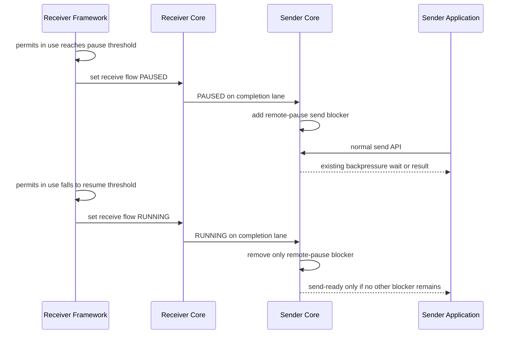

# HWM과 application backpressure 설계 의도

> 이 문서는 Core와 Framework 작업이 공유하는 설계 배경과 책임 경계를 설명한다. 공개 API나
> 현재 구현 계약을 직접 정의하는 spec이 아니다. 실제 구현과 공개 동작은 각 정식 spec에서
> 확정한다.

## 1. 이 문서를 먼저 읽는 이유

HWM과 backpressure를 하나의 장치로 설명하면 구현 책임이 섞인다. Core socket queue가
application의 처리 능력을 추측하거나, Framework job queue가 Core의 queued byte를 직접
관리하는 구조가 되기 쉽다.

이 설계는 두 문제를 분리한다.

| 계층 | 해결하는 문제 | 기준 단위 | 실패했을 때 남는 보호 |
|---|---|---|---|
| Core byte HWM | Connection 수와 message 크기 때문에 socket queue memory가 burst하는 것을 제한한다. | Queue가 보관하는 accounted byte | TCP와 finite byte HWM이 sender를 차단한다. |
| Framework job backpressure | Application handler가 처리할 수 있는 job보다 더 빠르게 유입되는 traffic을 줄인다. | Host가 사용 중인 application job permit 수 | Job hard 상한과 기존 timeout·route 정책이 남는다. |

Core HWM은 “application이 힘들다”를 판단하지 않는다. Framework pressure는 socket memory
사용량을 계산하지 않는다. 두 계층은 독립적으로 동작하며 한쪽 상태를 다른 쪽 counter에
복사하지 않는다.

## 2. Core byte HWM의 목적

### 2.1 Message count가 아닌 byte

Message 수가 같아도 memory 사용량은 다르다.

```text
1,000 messages x 1 KiB != 1,000 messages x 1 MiB
```

따라서 Core는 application directional pipe가 실제로 보관하는 frame charge를 byte로
계산한다. 일반 frame은 payload와 `msg_t` metadata를 포함한다. HWM에 도달하면 기존 send가
backpressured 상태가 되고, receiver가 충분한 byte를 소비하거나 blocked queue를 완전히
비우면 sender가 다시 진행할 수 있다.

기존 count HWM의 동작 의미는 유지한다.

- HWM에 도달하면 sender가 멈춘다.
- 기본적으로 HWM의 절반에 해당하는 byte를 소비하면 credit을 알린다.
- LWM hint가 있으면 더 이른 credit 경계를 사용할 수 있다.
- HWM에 실제로 막힌 writer가 있고 queue가 완전히 비면 LWM 전에도 진행을 복구한다.
- Application send의 `EAGAIN`, send timeout, send-ready와 multipart 결과는 바뀌지 않는다.

### 2.2 Memory budget의 의미

Connection마다 directional queue가 있으므로 connection 수가 증가하면 잠재 backlog도
증가한다. Core messaging budget은 이 위험을 줄이기 위해 automatic HWM을 계산하는 입력이다.
하지만 context 전체 allocation을 매번 비교하는 global hard cap은 아니다.

Manual finite HWM, manual unlimited와 automatic minimum 부족 예외가 있으므로 모든 pipe HWM
합계가 budget 이하라고 보장하지 않는다. Application 개발자는 workload, connection 수와
가용 memory를 기준으로 finite override를 선택할 수 있다. Core는 합리적인 default,
calculation snapshot과 insufficient 상태를 제공한다.

정상 data frame마다 context 전체 atomic 합계나 global mutex를 갱신해 hard cap을 만들지
않는다. 이 비용은 connection 수가 많고 message가 작을 때 hot path 회귀를 만들 수 있다.

### 2.3 Core HWM이 최종 안전장치인 이유

Framework가 빠르게 PAUSE를 보내도 이미 다음 위치에 data가 존재할 수 있다.

- Remote application과 Framework queue
- Remote Core socket queue
- OS send buffer와 network
- Local OS receive buffer
- Local Core socket queue

Control state가 늦거나 유실돼도 finite byte HWM과 TCP backpressure가 결국 memory burst를
제한해야 한다. Flow state를 추가하기 위해 기존 HWM을 제거하거나 unlimited로 바꾸지 않는다.

## 3. Framework job backpressure의 목적

### 3.1 Application이 처리할 수 있는 job 수

Framework는 message를 handler가 처리할 job으로 바꾼다. 이 계층에서 의미 있는 capacity는
payload byte가 아니라 동시에 수용할 수 있는 application job permit 수다.

첫 범위의 pressure count는 다음과 같다.

```text
application job permits in use
  = reserved supply permits
  + queued application jobs
```

Queue hard 상한은 Framework가 제공하는 기본값 또는 Application 개발자가 성능 시험으로
정한 값이다. Framework는 CPU 사용률이나 request payload 크기로 hard 상한을 자동 추측하지
않는다.

### 3.2 80% PAUSE와 60% RESUME

Hard 상한에 도달한 뒤에야 remote traffic이 줄기 시작하면 이미 여러 network buffer에 data가
쌓여 있을 수 있다. Framework는 여유가 남은 80%에서 PAUSE를 시작하고, 충분히 회복된 60%
이하에서 RUNNING으로 돌아간다.

```text
RUNNING
  permits in use >= 80% threshold -> PAUSED

PAUSED
  permits in use <= 60% threshold -> RUNNING
```

60%와 80% 사이에서는 이전 상태를 유지한다. 이 hysteresis는 작은 queue 변화마다
PAUSE·RESUME이 반복되는 진동을 막는다. 80%와 60%는 기본값이며 Application 개발자가 실제
처리량 시험으로 조정할 수 있다.

### 3.3 Host 전체 pressure와 개별 queue

첫 구현은 host-shared application job queue만 판단한다. Actor, Spot, service 또는 특정
connection 하나의 pressure로 host 전체를 자동 정지하지 않는다. 개별 owner의 structural
queue 상한과 오류는 기존 계약을 유지한다.

향후 per-owner pressure가 필요해도 host state와 별도 scope로 설계해야 한다. 가장 느린 queue
하나를 그대로 host 전체 PAUSE로 승격하지 않는다.

## 4. PAUSE와 RUNNING 전달 경로

### 4.1 기존 completion lane 사용

Paired DEALER/ROUTER는 application lane과 별도의 completion lane,
`transport_lane_completion`을 사용한다. 첫 Core 구현은 이 lane에 Core가 내부 처리하는
`PAUSED`·`RUNNING` 절대 상태를 추가한다.

```text
Receiver Framework
  job permits reach 80%
      |
      v
Receiver Core local state = PAUSED
      |
      | completion lane
      v
Sender Core remote-pause reason = active
      |
      v
Existing application send waits as normal backpressure
```

PAUSE 횟수를 누적하지 않는다. Generation과 epoch를 검증하고 최신 절대 상태만 적용한다.
Reconnect한 pair에는 현재 local state를 다시 동기화한다.

### 4.2 범용 Framework control channel이 아님

Completion lane을 heartbeat, topology, relocation 또는 임의 Framework message를 위한 raw
control channel로 확장하지 않는다. Application과 Framework가 flow frame을 직접 receive하지
않으며 다음 API를 추가하지 않는다.

- Raw Core control send/recv
- Data queue에서 특정 message만 꺼내는 selective receive
- Remote PAUSE를 우회하는 infrastructure send

첫 remote PAUSE 범위는 completion lane이 있는 paired DEALER/ROUTER다. PAIR, PUB/SUB 계열,
Classic fanout과 STREAM은 기존 byte HWM·bounded queue·transport backpressure를 유지한다.

## 5. 기존 send backpressure와의 합성

Remote PAUSE는 local HWM을 덮어쓰지 않는다. Send가 대기하는 원인은 서로 독립적이다.

```text
send blocked
  = local byte HWM full
  OR remote flow state PAUSED
  OR paired transport waiting
  OR pipe termination
```

RESUME은 remote-pause 원인만 제거한다. Local HWM이 계속 full이면 send-ready가 발생하지
않는다. 반대로 byte credit이 돌아와도 remote PAUSE가 남아 있으면 writable이 아니다.

Application이 보는 send 동작은 기존과 같아야 한다.

- Nonblocking send는 기존 `EAGAIN` 또는 binding의 기존 backpressured 결과를 사용한다.
- Blocking·async send는 기존 send timeout까지 기다린다.
- Timeout, cancellation과 shutdown의 첫 terminal만 유효하다.
- 이미 시작한 multipart message는 기존 atomicity를 유지하고 다음 message부터 PAUSE를
  적용한다.
- 이미 제출된 request나 one-way를 PAUSE 때문에 자동 replay하지 않는다.

## 6. Heartbeat가 data line에 남는 이유

Heartbeat는 단순히 TCP connection이 존재하는지 확인하는 신호가 아니다. 실시간 messaging
route가 기존 deadline 안에 실제 Framework protocol progress를 만들 수 있는지 확인한다.

PAUSE 동안 heartbeat를 selective receive로 우회하면 앞선 application data가 멈춰 있어도
route가 정상인 것처럼 보일 수 있다. 따라서 heartbeat와 Framework control은 data-line FIFO를
유지한다.

Topology별 유효한 progress 증거는 기존 계약을 따른다.

| Topology | Liveness deadline을 갱신하는 증거 |
|---|---|
| RouteMesh·ClientServer | 현재 connection이 기다리는 ID와 같은 첫 `livenessAck` |
| Classic fanout | 기존 application record 또는 publisher beacon 규칙 |
| STREAM | 기존 stream session·transport liveness 규칙 |

PAUSE가 기존 heartbeat timeout 동안 회복되지 않으면 route를 not-ready 또는
`Unavailable`로 전환한다. TCP와 completion lane이 유지된 사실만으로 available을 유지하지
않는다. 새 request는 현재 available target 선택 규칙으로 새 operation을 시작한다.

## 7. 전체 정상 흐름



PAUSE frame보다 먼저 application lane에 들어간 message는 FIFO 순서대로 남는다. Framework가
queue를 완전히 중단하기 전에 여유 20%를 사용하는 이유가 이 in-flight traffic을 흡수하기
위해서다. 이 여유가 모든 workload를 보장하지 않으므로 Core byte HWM이 별도 안전장치로
남는다.

## 8. 장기 stall 흐름

```text
PAUSED
  -> permits in use <= 60% threshold: RUNNING
  -> topology liveness deadline expires: route not-ready / Unavailable
```

실시간 messaging에서는 PAUSE가 몇 초·몇십 초 동안 계속되는 것을 무제한 정상 상태로 보지
않는다. 기존 send·request deadline이 끝나면 기존 오류로 호출자에게 알린다. Retry, drop,
다른 node 선택과 사용자 오류 처리는 기존 Application·Framework policy가 결정한다.

별도 public max-pause timeout은 첫 계약에 추가하지 않는다. 기존 send timeout과 topology
liveness deadline이 각각 operation과 route의 종료 시점을 소유한다.

## 9. 의도적으로 포함하지 않는 범위

- Context 전체 allocation을 frame마다 검사하는 global memory hard cap
- Actor·Spot·service·connection별 PAUSE scope
- Request 크기와 예상 reply 크기를 합산한 자동 pressure 계산
- CPU·GC·latency를 조합한 adaptive threshold
- Framework heartbeat의 completion-lane 이동
- PAUSE 중 heartbeat selective receive 또는 side backlog
- Infrastructure message용 PAUSE 우회 send
- PAUSE 때문에 이미 제출한 operation을 다른 route로 자동 replay

Request가 작고 reply가 큰 workload처럼 job count만으로 비용을 표현하기 어려운 경우가 있다.
이 문제는 향후 node/application pressure 모델로 확장할 수 있지만 첫 계약에 넣지 않는다.

## 10. 작업 단계와 문서 관계

Core와 Framework는 동시에 변경하지 않는다.

1. [Core byte HWM과 흐름 제어 작업 계획](./core-byte-hwm-flow-control-plan.ko.md)
   - Byte-HWM 성능 회복
   - Paired completion-lane flow state
   - Core API, binding, event와 metric
   - 짧은 `0.10.1` paired 성능 비교
2. Core 완료 보고와 package provenance 확정
3. [Framework job backpressure 후속 계획](./framework-job-backpressure-plan.ko.md)
   - Job permit 80%/60% state machine
   - Core API 연결
   - Topology liveness, status, metric과 언어 parity

Core 완료 뒤 Framework를 자동으로 이어서 수행하지 않는다. Framework 작업자는 Core의 확정
API, 지원 topology, lifecycle test와 성능 report를 입력으로 다시 확인한다.

## 11. 용어 요약

| 용어 | 이 계획에서의 의미 |
|---|---|
| Byte HWM | Application directional pipe가 보관할 accounted byte 상한 |
| Actual LWM | Default `ceil(HWM/2)`에 optional hint를 적용한 credit 경계 |
| Core messaging budget | Automatic per-pipe HWM을 계산하는 planning input. Context hard cap이 아님 |
| Pressure count | Reserved supply permit과 queued application job의 합 |
| PAUSED | Receiver가 remote sender의 새 application send를 줄이도록 요청한 절대 상태 |
| RUNNING | Remote-pause 차단 원인을 제거하라는 절대 상태 |
| Completion lane | Paired DEALER/ROUTER의 `transport_lane_completion` connection |
| Data line | Application message와 Framework heartbeat·control의 FIFO lane |

이 용어의 공개 이름과 exact type은 각 정식 spec이 소유한다.
