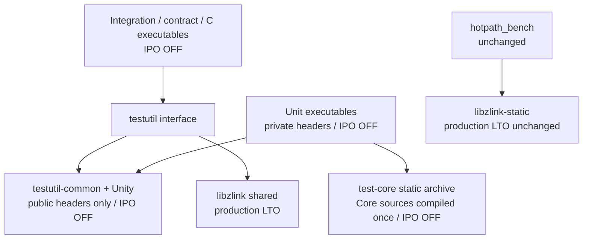

# Core tests public API 링크 분리 결과

작업 기준: detached worktree `/home/hep7/project/zlink-core-tests`, HEAD `dd2cd53a89a553618e6ccc9c620ef2c693ffa4d6`.
코드 변경은 이 worktree에만 남겼으며 commit하지 않았다. Main tree에는 요청받은 이 보고서만 작성했다. 패치: `/tmp/zlink-core-tests/fix.patch`.

## 결과

**최종 클린 Release+LTO 빌드와 전체 lane 검증을 완료했다.** Unit 57개, integration 127개, regression 26개가 모두 통과했다. E2E는 등록된 테스트가 없다. 별도 C 테스트, hotpath, Debug 전체 빌드와 공유 링크 검사도 통과했다. Release 전체 빌드는 250.08초에서 70.67초로 줄었다. 조사 중 재현한 기존 STREAM shutdown 간헐 실패는 해결한 것으로 간주하지 않고 남은 한계에 기록한다.

Integration/contract 테스트는 공개 C 헤더와 shared `libzlink`를 사용한다. 내부 구조·fault injection·owner 상태 검사는 `unittest/`로 옮겨, 한 번 컴파일한 non-LTO `test-core` archive를 공유한다. 공개 ABI와 제품 LTO 설정은 유지했다. 새 공개 경로에서 드러난 HWM 재시도 계수 결함은 Core 소유 모듈의 기존 상태와 플래그로 수정했다.

이 checkout의 실제 빌드 대상은 변경 전 integration/C 실행 파일 79개, unit 26개였다. 요청에 적힌 123/28과 다르며, CTest의 개별 case/alias 등록 수와 실행 파일 수를 구분했다. 변경 후에는 integration/C 78개와 unit 51개다. 내부 전용 receive-transaction 실행 파일 하나를 unit으로 이동했고, 혼합 파일의 내부 검사를 추가 unit으로 분리했다.

수정 전/후 규칙 수: integration이 접근하는 Core API 표면 2개(공개/내부) → 1개(공개); 테스트별 private-link 예외 → 0개. Unit의 내부 ABI 설정과 non-LTO Core 링크는 각각 CMake 한 곳이 소유한다. HWM 계수도 raw/public retry의 두 규칙 → 첫 admission만 기록하는 한 규칙(2 → 1)으로 맞췄다.

## 클린 Release+LTO 측정

Ninja generator를 사용했고 configure 옵션은 요청과 같다. 각 측정에서 전체 build target을 clean하고 `.ninja_log`를 비운 뒤 라이브러리와 나머지를 순서대로 측정했다. 첫 단계는 shared `libzlink`, 나머지에는 제품 static archive·benchmark·모든 테스트·변경 후의 non-LTO test-core 컴파일이 포함된다. 시간 단위는 초다.

```sh
CMAKE_GENERATOR=Ninja cmake -S core -B core/build-gate \
  -DCMAKE_BUILD_TYPE=Release -DBUILD_TESTS=ON -DWITH_TLS=ON -DBUILD_BENCHMARKS=ON
cmake --build core/build-gate --target clean
cmake --build core/build-gate --target libzlink -j8
cmake --build core/build-gate -j8
```

| 측정 | shared library wall | 나머지 wall | 전체 wall | 전체 user+system CPU | .ninja_log bytes |
|---|---:|---:|---:|---:|---:|
| 변경 전 | 25.53 | 224.55 | 250.08 | 4171.19 | 41,742 |
| 분리 후 1차 | 68.66 | 43.45 | 112.11 | 568.93 | 64,578 |
| 분리 후 2차 | 26.28 | 44.42 | 70.70 | 547.95 | 64,488 |
| unit 설정 수정 후 (경합 측정) | 62.63 | 866.36 | 928.99 | 649.06 | 65,512 |
| 공개 metric assertion 복원 후 | 57.47 | 232.25 | 289.72 | 648.93 | 65,038 |
| 최종 Core 계수 수정 후 | 25.74 | 44.93 | 70.67 | 549.65 | 64,722 |

최종 source의 전체 wall은 250.08초 → 70.67초(71.7% 감소)다. Shared library는 25.53초 → 25.74초, 나머지는 224.55초 → 44.93초다. Integration 링크 중앙값은 15.51초 → 0.0965초(99.4% 감소), unit은 4.492초 → 0.245초(94.5% 감소)다. 전체 CPU 합계도 4,171.19초 → 549.65초(86.8% 감소)로 줄었다.

분리 후 1·2차는 최종 unit 설정 헤더 수정 전의 클린 빌드다. 2차 전체 wall은 250.08초 → 70.70초(71.7% 감소), 나머지 빌드는 224.55초 → 44.42초였다. unit 설정 수정 후 측정에서는 실행 중 호스트 load average가 약 30~39로 관찰됐고, wall이 928.99초로 늘었다. 이를 최종 속도 개선 수치로 해석하지 않는다. 같은 측정의 CPU 합계는 4,171.19초 → 649.06초로 84.4% 줄었다. 제품 Core object 154개의 Ninja command hash는 변경 전과 동일하다. 이는 제품 빌드 옵션이 같다는 증거이며, 계수 결함을 수정한 Core source 내용까지 같다는 뜻은 아니다. 단일 호스트의 경합 때문에 wall 비교의 재현성에는 제한이 있다. 공개 metric assertion 복원 후의 중간 측정은 289.72초였다. 최종 측정은 Core 계수 수정과 모든 regression을 포함하며, 라이브러리 wall이 변경 전과 비슷한 조건에서 70.67초였다.

| 측정 | 링크 그룹 | 실행 파일 수 | 링크 wall 합계 | 중앙값 | 최대값 |
|---|---|---:|---:|---:|---:|
| 변경 전 | integration/C | 79 | 1211.069 | 15.5100 | 20.578 |
| 변경 전 | unit | 26 | 129.277 | 4.4920 | 12.597 |
| 분리 후 1차 | integration/C | 78 | 7.263 | 0.0900 | 0.130 |
| 분리 후 1차 | unit | 50 | 10.694 | 0.2330 | 0.257 |
| 분리 후 2차 | integration/C | 78 | 6.934 | 0.0855 | 0.151 |
| 분리 후 2차 | unit | 50 | 11.911 | 0.2595 | 0.299 |
| unit 설정 수정 후 (경합 측정) | integration/C | 78 | 211.332 | 3.1605 | 7.281 |
| unit 설정 수정 후 (경합 측정) | unit | 50 | 369.849 | 7.1980 | 14.936 |
| 공개 metric assertion 복원 후 | integration/C | 78 | 13.126 | 0.1735 | 0.355 |
| 공개 metric assertion 복원 후 | unit | 51 | 24.363 | 0.5210 | 0.619 |
| 최종 Core 계수 수정 후 | integration/C | 78 | 7.684 | 0.0965 | 0.141 |
| 최종 Core 계수 수정 후 | unit | 51 | 11.273 | 0.2450 | 0.269 |

위 링크 합계는 병렬 작업별 Ninja duration의 합이며 전체 wall과 합산하지 않는다. 원시 로그와 모든 실행 파일의 개별 링크 시간은 `/tmp/zlink-core-tests/logs/{before,after-architecture,after-before-unit-config,after-unit-config,after-public-contract-exposed,after}*.ninja_log`, `*-integration-links.tsv`, `*-unittest-links.tsv`, `*-{library,rest}.time`에 보존했다.

## 링크 구조와 변경 파일



- `core/src/runtime/sockets/common/{socket_base.hpp,socket_base_msg.cpp,socket_send_complete.cpp,socket_send_submit.cpp}`: 기존 logical wait 등록 상태를 이용해 같은 public submit의 wake 후 재시도가 HWM 분자·분모에 다시 기록되지 않도록 수정했다. 새 저장 상태·타이머·retry·public API는 없다.
- `core/CMakeLists.txt`: 제품 Core source 목록과 플랫폼 의존성을 재사용하는 `test-core`를 추가했다. 제품 static archive를 unit에 전이 링크하지 않는다. MSVC의 기존 PCH writer 순서에 test-core를 포함했다.
- `core/tests/CMakeLists.txt`, `unittest/CMakeLists.txt`: 공개/내부 include 경계, shared 링크/RPATH, unit 등록과 IPO 정책을 분리했다. Windows PATH는 split case와 C 테스트를 포함하는 한 곳에서 설정하며, 선택적 ZMQ runtime 경로를 보존했다. Unit은 Core가 생성한 같은 `platform.hpp`를 강제 include한다.
- `testutil*`, `test_platform.hpp.in`: private header·private socket type 매핑·private poller를 제거했다. OS descriptor/기능 선택은 공개 `zlink_fd_t`, 시스템 헤더, CMake configure probe를 사용한다. 알려진 socket role의 공개 part/RID/topic API를 명시적으로 사용하며, MORE/FINAL은 실제 공개 출력으로 검사한다.
- `testutil_unity.cpp`, `testutil_unity.hpp`: 기존 HWM snapshot helper의 동일한 두 정의를 공용 helper 한 곳으로 옮겼다. API 성공 assertion과 snapshot 해석은 한 소유자만 유지한다.
- `integration/*.cpp`, `integration/monitoring/*.cpp` 및 새 `unittest_*.cpp`: 아래 표와 부록에 따라 공개 관찰과 내부 검사를 분리했다. 공용 completion/wire fixture도 단일 헤더로 모았다.
- `contract_socket_pair_fixture.hpp`, `contract_zmp_engine_fixture.hpp`: 기존 pipepair/bind-command와 실제 engine/session owner를 사용한다. 후자는 메모리 transport로 handshake/write-drain/종료 순서를 제어한다. 새 runtime hook은 추가하지 않았다.

대안인 단일 aggregate unittest 실행 파일은 각 소스의 `main`, Unity setup/teardown와 전역 fixture를 다시 조정해야 하고 기존 CTest 프로세스 격리를 바꾼다. non-LTO archive 하나를 두는 방식이 기존 등록·격리를 유지하면서 링크 규칙 수를 줄인다. `-ffat-lto-objects`는 사용하지 않았다.

Unit 내부 설정 헤더는 공용 public helper에서 암묵적으로 얻지 않는다. 초기 lane 실행의 `unittest_zmp_decoder` 실패는 configured `ZLINK_HAVE_SO_PEERCRED` 누락으로 호출자 `options_t`가 856bytes, Core가 1000bytes였던 테스트 ABI 불일치였다. 한 곳의 강제 include로 수정한 뒤 해당 테스트와 전체 unit lane, Debug 전체 빌드가 통과했다. Core runtime 결함으로 우회하지 않았다.

## 요청한 7개 파일의 분리

아래 파일명은 `core/tests/integration/` 기준이며 unit 목적지는 `core/tests/unittest/` 기준이다. 모든 이동·대체 assertion의 원본 행/표현과 목적지는 부록에 있다.

| 원본 | integration에 남은 공개 계약 | unit으로 옮긴 내부 검사 |
|---|---|---|
| `test_flow_state_c_api.cpp` | 13개 공개 config/event/lifecycle case; 공개 monitor status와 실제 송수신 | `unittest_flow_state_monitor`: epoch 주입, stale/외부/종료 pipe, bookkeeping·순서·metric; flow socket 검사와 공유 fixture |
| `test_flow_state_paired.cpp` | 5개 transport pause/resume/reconnect/weight 관찰 | `unittest_flow_state_socket`: 25개 socket/pipe case의 epoch, generation, lane, multipart atomicity, credit, weight owner 검사 |
| `test_dealer_router_single_lane_contract.cpp` | 29개 공개 request/reply/flow/transport case | `unittest_single_lane_accounting`: 4개 physical accounting/topology/helper/HWM 검사; retired pipe stale-frame case는 `unittest_flow_state_monitor` |
| `test_phase3_request_reply_contract.cpp` | 18개 공개 request/reply/completion case | `unittest_phase3_request_reply_owners`: 5개 failpoint·blocking completion/HWM cycle·per-pipe budget/stale requeue·FIFO/intrusive node 검사 |
| `monitoring/test_monitor_enhanced.cpp` | READY 후 첫 양방향 전달 등 공개 monitor 계약 | `unittest_monitor_ready_drain`: 2개 passive READY drain case; 실제 hook 안의 drain 후/engine_ready 전 count=0와 pair 미완료 관찰 보존 |
| `test_helper_recv_part_basic.cpp` | 공개 part/RID/storage/topic/record 경계 | `unittest_receive_metadata`: 3개 owned RID/private request metadata rejection 검사 |
| `test_multi_socket_contract_regressions.cpp` | 공개 ROUTER/PUBSUB 및 topic-size query의 비소비 계약 | `unittest_publish_rollback`: private publish fault injection 후 정확한 다음 topic/payload 경계 |

Flow 원본 46 case의 625 assertion을 대조했다. 26개 네트워크 setup/teardown 성공 검사는 unit의 실제 pipe 생성·bind-command admission·종료 조건으로 대체했고, 공개 연결/재연결·트래픽은 integration에서 유지했다. epoch wrap의 내부 강제 trigger와 공개 TCP reconnect 관찰은 각 소유 테스트로 분리했다. 다섯 phase3 owner case의 동기화·HWM·완료 내용·기존 시간 경계는 그대로 유지했다.

## 추가로 발견한 내부 의존성

직접 `src/` include가 없던 파일도 기존 testutil이 private 타입과 helper를 노출해 내부 구조를 사용하고 있었다. 이 경계를 닫기 위해 다음 검사를 함께 이동했다.

| 원본 그룹 | unit 목적지 / 보존한 검사 |
|---|---|
| ctx options | `unittest_auto_hwm_physical_attempt`: private MORE 물리 제출과 최초 attempt blocked ratio의 원본 전체 case. 공개 FINAL의 backpressure·drain·reset 관찰은 integration에 유지 |
| ctx destroy | `unittest_ctx_lifecycle`: 13개 수명/종료/queue/owner case. 실제 engine connection ID 두 검사는 passive ready 및 active pair lifecycle unit으로 이동 |
| router concurrent receive | `unittest_router_receive_queue`: 7개 queue/pipe 종료·prefetch·record 격리 case |
| ZMP receive transaction 전체 파일 | `unittest_receive_transaction`: 10개 receive transaction/mailbox/fence/capacity case |
| phase3 completion | `unittest_submit_errors`: 2개 OOM/EIO 및 동기 실패/ID/소비 상태 검사 |
| reconnect options | `unittest_submit_retry`: 3개 내부 send fault/credit/admission case. 기존 40ms timeout과 20~200ms elapsed assertion 보존 |
| public inproc multipart | `unittest_router_message_envelope`: 내부 RID envelope 검사. 공개 multipart reset/RID/shape는 integration에 유지 |
| ASIO WS | `unittest_ws_transport_config`: thread-safe 내부 초기화; 공개 WS/WSS/Beast 송수신 유지 |
| XPUB no-drop | `unittest_pubsub_raw_hwm`: 2개 raw pipe byte-HWM case; 정확한 1999/2000, 4000 send 및 250ms 경계 보존 |
| router multiple dealers | `unittest_router_pipe_contract`: 27개 pipe/LB/DIST/accounting case; `unittest_router_peer_weight`: 1개 owner weight case; 공개 routing/backpressure 4개 유지 |
| PUBSUB filter | `unittest_xsub_pipe_termination`: 중간 종료된 multipart가 다른 peer record와 합쳐지지 않는 검사 |
| helper interleave | `unittest_complete_record_admission`: 4개 내부 complete-record admission/atomicity case |
| monitor socket contract | `unittest_monitor_queue_accounting`: 정확히 한 pending monitor event의 queue accounting |
| proxy | `unittest_proxy_metadata`: 3개 request metadata 제거·거부·capture rollback case |
| ZMP metadata / WS-WSS | `unittest_zmp_engine_controls` 4개, `unittest_zmp_pair_lifecycle` 1개, `unittest_ws_metadata` 4개. 공개 raw-wire 계약은 독립 wire fixture로 유지 |

추가 5개 그룹 assertion audit는 1,128개 원본 occurrence 중 유지 373, 정확한 표현 이동 684, 공개 API/fixture 대체 71개다. Root 담당 7개 추가 그룹은 1,283개 중 유지 856, 이동 400, 대체 25, 중복 제거 2개다. 요청한 7개 중 monitor/helper/multi-socket 3개는 458개 중 유지 378, 이동 42, 대체 38개다. 이 수는 소스상의 occurrence이며 반복 실행 횟수나 서로 겹치는 부록까지 합친 전체 coverage 수로 해석하지 않는다.

## 제거한 assertion과 근거

| 원본 위치 (HEAD) | 제거한 표현 | 유지된 검증 / 이유 |
|---|---|---|
| `test_public_inproc_multipart_send.cpp:624` | `TEST_ASSERT_EQUAL_UINT64(2, part_count)` | 실제 공개 receive 두 번의 성공과 첫 MORE/둘째 FINAL이 정확히 2개 part를 입증한다. 로컬 count를 대입해 재검사하는 중복은 남기지 않았다. RID/payload도 그대로 검사한다. |
| 같은 파일 `:646` | `TEST_ASSERT_EQUAL_UINT64(1, part_count)` | 실제 공개 receive 성공과 FINAL이 다음 record의 정확한 1개 part를 입증한다. |
| `test_zmp_metadata.cpp:2146` | `TEST_ASSERT_EQUAL_INT(EACCES, request_result_internal::to_errno(request_completion.request_result))` | 바로 앞 공개 completion 결과의 REJECTED 검사는 유지한다. 정확한 REJECTED→EACCES 매핑은 기존 `unittest_result_enum_mapping.cpp:53-54`가 소유한다. |
| `test_dealer_router_single_lane_contract.cpp:133` | `TEST_ASSERT_TRUE(resolve_ready_pair(...))` in `assert_physical_pair_topology` | 호출자가 없던 helper다. 실제 topology/identity 검사는 `unittest_single_lane_accounting`에서 보존한다. |
| 같은 파일 `:172`의 `assert_inproc_physical_pair_topology` | `TEST_ASSERT_NOT_NULL(owner)` | 호출자가 없던 helper다. 실제 양쪽 owner/count1/count2/lane/identity 검사는 같은 unit에 남는다. |

`test_ctx_options`의 최초 물리 attempt 비율 검사도 내부 send 경계의 원본 그대로 unit에 옮겼다. 공개 MORE는 staging, FINAL은 전체 record 제출이며, 내부 raw send와 제출 횟수 관찰 경계가 다르다. 공개 비율 assertion을 2/3 등으로 낮추지 않았다.

이외 원본 네트워크 생성·연결·정리 assertion이 unit의 deterministic setup으로 바뀐 부분은 부록에서 각각 **replacement**로 표시했다. 결과·errno·payload·identity·flags·queue·owner·시간 경계 assertion을 완화하지 않았다. 실제 TCP engine-generated ID를 단순 상수 주입으로만 대체하지 않았으며, 실제 passive/active memory engine의 생성 결과와 endpoint ID 일치까지 검사한다.

## 최종 검증

```sh
bash core/tests/run_test_lanes.sh --build-dir core/build-gate \
  --include-e2e --include-regression --unittest-jobs 8
ctest --test-dir core/build-gate -R '^test_pub_monitor_close_full_mask$' --output-on-failure
ctest --test-dir core/build-gate -R '^hotpath_gate$' -V
```

| lane | 실행된 CTest 등록 | 실패 | wall seconds |
|---|---:|---:|---:|
| unittest | 57 | 0 | 5.94 |
| integration | 127 | 0 | 187.20 |
| e2e | 0 (등록 없음) | 0 | — |
| regression | 26 | 0 | 49.12 |

최종 전체 lane script는 한 번의 호출로 모든 요청 lane을 완료했고 exit code는 0, 전체 wall은 242.28초다. 원시 결과는 `/tmp/zlink-core-tests/logs/final-lanes.log`와 `final-lanes-status.json`에 있다. 조사 단계에서 발생했던 실패와 최종 통과 결과를 구분한다.

Unit/integration/regression의 겹치는 alias는 기존 lane 정책에 따라 각각 실행했다. E2E는 이 configure에서 등록 0개이며 실행했다고 주장하지 않는다. 기존 무라벨 C 테스트도 별도 PASS다. `run_test_lanes.sh`는 수정하지 않았다. H3 stale/order와 내부 wake alias는 unit 실행 파일로 옮기고 unittest/parallel-safe 라벨을 부여했다. 나머지 integration/serial 계약과 hotpath 라벨을 보존했다.

Hotpath는 변경 전 PASS(CTest 4.30초), 변경 후도 다음과 같이 기존 ±5% 기준 PASS다. 이는 아래 측정 cell 비율 판정이며 CTest 프로세스의 wall-time ±5%를 뜻하지 않는다. `hotpath_gate`, benchmark source, `hotpath_reference.json`은 수정하지 않았다.

```text
cell | reference | measured | ratio | verdict
--- | ---: | ---: | ---: | ---
dealer_dealer_inproc | 3455.381 | 3441.916 | 0.9961 | PASS
dealer_router_reqrep_inproc | 12054.895 | 12158.792 | 1.0086 | PASS
pair_inproc | 2681.957 | 2701.410 | 1.0073 | PASS
router_router_tcp | 2972.882 | 2984.099 | 1.0038 | PASS
```

Debug configure와 전체 build도 PASS다. Worktree 밖을 가리킬 수 있는 build script를 실행하지 않고 다음 플래그를 복제했다. 초기 전체 Debug build는 library/test-core 124.99초 + 나머지 66.67초였고, 최종 Core 계수·공용 helper 변경 후 전체 incremental build도 49.37초에 완료했다. 최종 로그는 `/tmp/zlink-core-tests/logs/debug-final-build.log`와 `.time`에 있다.

```sh
CMAKE_GENERATOR=Ninja cmake -S core -B core/build-dev \
  -DCMAKE_BUILD_TYPE=Debug -DENABLE_LTO=OFF \
  -DZLINK_BUILD_TESTS=ON -DBUILD_TESTS=ON -DWITH_TLS=ON -DBUILD_BENCHMARKS=ON
cmake --build core/build-dev -j8
```

ASAN/TSAN/UBSAN의 기존 compiler/linker flag 설정과 build 경로는 변경하지 않았다. test-core와 테스트도 해당 directory flags를 상속한다. Windows/MSVC PATH·PCH 경로는 CMake로 보존·검토했으며 이 Linux 환경에서 Windows나 sanitizer 전체 preset 실행은 하지 않았다.

## 공개 링크 증거

`nm -D --undefined-only`, `nm -D --defined-only libzlink.so`, 공개 header 선언, `ldd`, `readelf -d`를 대조했다. 현재 Ninja graph의 integration/C 실행 파일 78개 모두 worktree의 `libzlink.so.0`를 로드한다. 공개 헤더에 없는 `zlink_*` import 0개, shared export에 없는 import 0개, private `zlink::` import 0개, 내장된 Core C++ 함수 0개다. 정상적인 C/C++/OS runtime symbol은 당연히 별도로 존재한다.

Ninja dependency graph의 integration object 78개와 helper object 3개에서 Core private header 의존성 0개를 확인했다. 생성된 test/helper/unit/test-core compile/link 명령의 LTO 옵션도 0개다. 제품 Core와 hotpath의 LTO 명령은 남아 있다. 예시 executable의 NEEDED는 `libzlink.so.0`, RUNPATH는 `/home/hep7/project/zlink-core-tests/core/build-gate/lib`다. C 테스트도 같은 결과다. Unit executable은 shared Core 없이 test-core archive를 사용한다.

원시 증거: `/tmp/zlink-core-tests/logs/public-link-audit.json`, `public-include-audit.json`, `ipo-policy-audit.json`, `final-link-summary.json`, `test_flow_state_c_api-dynamic.txt`, `test_pub_monitor_close_full_mask-dynamic.txt`, `unittest_zmp_decoder-dynamic.txt`.

## 문장 제안 — 적용하지 않음

`core/tests/README.md`에 추가할 정확한 문장:

> Integration, contract, and end-to-end tests use only the public C API headers under `core/include` and link the shared `libzlink`, with the same exported-symbol boundary as application code.
>
> Assertions about private Core structures, injected failures, and implementation-owned state belong under `core/tests/unittest`; unit executables link the single non-LTO `test-core` archive.
>
> Shared test helpers must remain public-API-only; platform feature selection is generated locally for tests, and private Core configuration is owned by the unit-test build.
>
> Test executables and test support archives do not enable IPO; production libraries and the hotpath benchmark retain their configured LTO policy.

CONTRIBUTING의 test lane/build 설명에 추가할 정확한 문장:

> Integration·contract·e2e 테스트는 `core/include`의 공개 C API만 사용하고 shared `libzlink`에 연결한다.
>
> 내부 자료구조·fault injection·owner 상태 assertion은 `core/tests/unittest`에 두고, 한 번 컴파일한 non-LTO `test-core` archive를 사용한다.
>
> 테스트 코드와 공용 helper에 Core의 private header·symbol을 노출하거나, 테스트 실행 파일마다 제품 Core archive를 LTO 링크하지 않는다.
>
> 테스트 분리 시 원본 assertion의 이동·공개 관찰 대체·중복 제거 근거와 CTest lane을 함께 대조하며, 제품 LTO 설정과 hotpath 기준은 유지한다.

요청된 `core/CONTRIBUTING.ko.md`는 이 checkout에 없다. 대신 실제 저장소 루트 `CONTRIBUTING.ko.md`의 관련 §4/§5/§9와 tests README/policy를 읽었다. 위 문장은 실제 CONTRIBUTING 위치에 적용할 제안이며, 어떤 README/CONTRIBUTING/spec 파일에도 적용하지 않았다.

## BLOCKERS 및 남은 한계

최종 요청 검증을 막는 실패는 없다. 다음 기존 문제와 미검증 환경은 남아 있다.

1. **기존 STREAM shutdown 간헐 실패:** 수정하지 않은 `test_stream_packet_progress`는 testutil을 포함하지 않는다. 동일 test object를 기존 production static archive에 연결한 비교 실행에서도 partial input 전체 drain 후 shutdown이 관찰되는 같은 assertion 실패를 재현했다. 실제 shutdown 호출 내부가 monitor quiescence를 기다리는 동안 termination 발행이 지연되는 stack을 확인했다. 최종 전체 lane은 통과했지만 이 간헐 원인을 수정한 것은 아니다. 원본 assertion·입력량·순서는 보존했다. 상세 repro와 증거의 한계는 부록에 있다.
2. **Endpoint timeout:** 최초 전체 integration 실행에서 `test_endpoint_release`가 10초 timeout을 냈다. 소스/timeout 변경 없이 같은 바이너리의 단독 실행은 3.60초 PASS였고 최종 전체 lane도 통과했다. 간헐 원인을 수정했다고 주장하지 않는다.

**해결된 HWM blocker:** 공개 blocking FINAL의 post-resume `blocked_ratio_ppm`은 666,666에서 계약상 정확한 1,000,000으로 수정됐다. 기존 `logical_wait_registered`와 admission 기록 플래그를 연결해 동일 제출의 wake 후 재시도가 분자·분모에 다시 기록되지 않도록 했다. 최초 물리 MORE assertion은 unit으로 이동하고, 공개 metric assertion은 정확한 값 그대로 유지했다. Multipart 재시도도 정확한 1,000,000, 서로 다른 두 제출은 정확한 500,000을 검사한다. 독립 공개 API repro도 FAIL → PASS다. 새 상태·타이머·retry·public API는 없다.

- 최종 wall-time 비교는 호스트 경합 영향을 받았다. 원시 측정값을 모두 제시하며, CPU와 개별 링크 명령/시간으로 반복 Core LTO 제거를 확인했다.
- GCC Release에서 test-only monitor atomic store 경고 1건이 남는다. Assembly 대조에서 정상 경로와 별도 컴파일된 Core 모두 필드 offset `core+0x798`을 사용한다. GCC가 실패한 Unity assertion의 `UnityFail()`이 반환한다고 분석하는 null 경로에서 경고하며, 실제 첫 실패는 longjmp로 종료한다. 포인터/레이아웃 불일치는 아니며 경고 억제나 부정확한 전역 noreturn을 추가하지 않았다.
- 기존 공개 API 관찰: `zlink_get_option(TYPE)`이 ROUTER의 공개 enum 4101 대신 내부 enum 6을 반환한다. 공개 C repro `/tmp/zlink-core-tests/option-type-repro.c`, 출력 `rc=0 expected_public=4101 observed=6 bytes=4`; 소유 위치 `core/src/api/core/zlink_option.cpp:153`. 이번 helper는 알고 있는 role의 공개 API를 명시적으로 사용해 TYPE 매핑을 재구현하지 않았다. 별도 Core 계약 검토 대상으로 보고하며 runtime/spec 변경은 하지 않았다.
- Windows/MSVC와 ASAN/TSAN/UBSAN 실실행은 미검증 범위다. 설정 경로는 유지했다.

소유 계층: Core socket submit/admission accounting — 기존 logical wait owner와 counter 갱신 지점.

Spec: `core/doc/spec/core/systems/06-auto-hwm.ko.md:339–347`, `core/doc/spec/core/06-monitoring.ko.md:182–184`.

교차언어 대조: C++·.NET·Java binding은 같은 Core snapshot을 읽는다. 독립 counter나 Framework 보상은 없으며 binding/Framework 수정은 없다. 상세 경로는 계수 수정 부록에 있다.

변경 분류: **B — 새 공개 테스트 경로에서 드러난 기존 Core 계수 결함 수정.** STREAM 기존 결함은 별도 보고하며 runtime 수정에 포함하지 않았다.

## Assertion 상세 부록

각 표의 HEAD 행은 작업 기준 commit 위치, current 행은 이 패치의 위치다. 소스 occurrence·helper 호출·fixture 경계 대조를 함께 기록한다. 서로 다른 범위의 audit를 단순 합산하지 않는다.

<details>
<summary>요청 7개 중 single-lane / phase3 contract</summary>

## Assertion-by-assertion movement/replacement inventory

The inventory below lists every original assertion expression that is absent from its original integration source after whitespace/protocol-namespace normalization, including dead-helper/setup assertions. Repeated identical expressions retained elsewhere are matched by occurrence count; complete moved cases preserve their full original sequence in the named unit tests above. Unchanged integration assertions are not repeated.

### test_phase3_request_reply_contract.cpp: 243 moved/replaced/dead assertion expressions

- Original `test_phase3_request_reply_contract.cpp:338`: `TEST_ASSERT_EQUAL_INT ( 0, as_socket (socket_)->test_process_commands_only ())`
- Original `test_phase3_request_reply_contract.cpp:374`: `TEST_ASSERT_EQUAL_INT ( ZLINK_SUBMIT_OK, zlink_request_part (router_, &target_, &request, ZLINK_SEND_FLAGS_NONE, ZLINK_PART_FINAL, 120000, user_context_, &completion_id))`
- Original `test_phase3_request_reply_contract.cpp:640`: `TEST_ASSERT_EQUAL_INT ( request.source_rid.size, zlink_send (router, request.source_rid.data, request.source_rid.size, ZLINK_SNDMORE))`
- Original `test_phase3_request_reply_contract.cpp:644`: `TEST_ASSERT_EQUAL_INT (sizeof (data) - 1, zlink_send (router, data, sizeof (data) - 1, 0))`
- Original `test_phase3_request_reply_contract.cpp:889`: `TEST_ASSERT_NOT_EQUAL (0, completion_id)`
- Original `test_phase3_request_reply_contract.cpp:1512`: `TEST_ASSERT_EQUAL_INT ( ZLINK_BIND_OK, zlink_bind (router, "inproc://phase3-reply-final-oom"))`
- Original `test_phase3_request_reply_contract.cpp:1515`: `TEST_ASSERT_EQUAL_INT ( ZLINK_CONNECT_OK, zlink_connect (dealer, "inproc://phase3-reply-final-oom"))`
- Original `test_phase3_request_reply_contract.cpp:1538`: `TEST_ASSERT_EQUAL_INT ( ZLINK_SUBMIT_OUT_OF_MEMORY, zlink_reply_part (router, &request.source_rid, request.reply_token, &failed_final, ZLINK_PART_FINAL))`
- Original `test_phase3_request_reply_contract.cpp:1542`: `TEST_ASSERT_EQUAL_INT (ENOMEM, zlink_errno ())`
- Original `test_phase3_request_reply_contract.cpp:1557`: `TEST_ASSERT_EQUAL_INT (ZLINK_SUBMIT_OK, retry_result)`
- Original `test_phase3_request_reply_contract.cpp:1561`: `TEST_ASSERT_EQUAL_INT (ZLINK_COMPLETION_REQUEST, completion.kind)`
- Original `test_phase3_request_reply_contract.cpp:1562`: `TEST_ASSERT_EQUAL_UINT64 (request_id, completion.completion_id)`
- Original `test_phase3_request_reply_contract.cpp:1563`: `TEST_ASSERT_EQUAL_INT (ZLINK_REQUEST_OK, completion.request_result)`
- Original `test_phase3_request_reply_contract.cpp:1564`: `TEST_ASSERT_EQUAL_UINT64 (1, completion.reply_part_count)`
- Original `test_phase3_request_reply_contract.cpp:1565`: `TEST_ASSERT_EQUAL_STRING ( "fresh-reply-after-oom", part_string (&completion.reply_parts[0]).c_str ())`
- Original `test_phase3_request_reply_contract.cpp:1583`: `TEST_ASSERT_EQUAL_INT ( ZLINK_BIND_OK, zlink_bind (router, "inproc://phase3-reply-final-eio"))`
- Original `test_phase3_request_reply_contract.cpp:1586`: `TEST_ASSERT_EQUAL_INT ( ZLINK_CONNECT_OK, zlink_connect (dealer, "inproc://phase3-reply-final-eio"))`
- Original `test_phase3_request_reply_contract.cpp:1609`: `TEST_ASSERT_EQUAL_INT ( ZLINK_SUBMIT_INTERNAL_ERROR, zlink_reply_part (router, &request.source_rid, request.reply_token, &failed_final, ZLINK_PART_FINAL))`
- Original `test_phase3_request_reply_contract.cpp:1613`: `TEST_ASSERT_EQUAL_INT (EIO, zlink_errno ())`
- Original `test_phase3_request_reply_contract.cpp:1627`: `TEST_ASSERT_EQUAL_INT (ZLINK_COMPLETION_REQUEST, completion.kind)`
- Original `test_phase3_request_reply_contract.cpp:1628`: `TEST_ASSERT_EQUAL_UINT64 (request_id, completion.completion_id)`
- Original `test_phase3_request_reply_contract.cpp:1629`: `TEST_ASSERT_EQUAL_INT (ZLINK_REQUEST_OK, completion.request_result)`
- Original `test_phase3_request_reply_contract.cpp:1630`: `TEST_ASSERT_EQUAL_UINT64 (1, completion.reply_part_count)`
- Original `test_phase3_request_reply_contract.cpp:1631`: `TEST_ASSERT_EQUAL_STRING ( "fresh-reply-after-eio", part_string (&completion.reply_parts[0]).c_str ())`
- Original `test_phase3_request_reply_contract.cpp:1671`: `TEST_ASSERT_EQUAL_INT ( ZLINK_SUBMIT_OK, zlink_reply_part (router, &request.source_rid, request.reply_token, &prefix, ZLINK_PART_MORE))`
- Original `test_phase3_request_reply_contract.cpp:1722`: `TEST_ASSERT_EQUAL_INT ( ZLINK_SUBMIT_OK, zlink_reply_part (router, &request.source_rid, request.reply_token, &prefix, ZLINK_PART_MORE))`
- Original `test_phase3_request_reply_contract.cpp:1751`: `TEST_ASSERT_NOT_NULL (dealer)`
- Original `test_phase3_request_reply_contract.cpp:1765`: `TEST_ASSERT_NOT_EQUAL (0, request.reply_token)`
- Original `test_phase3_request_reply_contract.cpp:1834`: `TEST_ASSERT_EQUAL_INT ( ZLINK_SUBMIT_OK, zlink_reply_part (router, &request.source_rid, request.reply_token, &retry, ZLINK_PART_FINAL))`
- Original `test_phase3_request_reply_contract.cpp:1859`: `TEST_ASSERT_NOT_NULL (router)`
- Original `test_phase3_request_reply_contract.cpp:1860`: `TEST_ASSERT_NOT_NULL (dealer)`
- Original `test_phase3_request_reply_contract.cpp:1874`: `TEST_ASSERT_NOT_EQUAL (0, request.reply_token)`
- Original `test_phase3_request_reply_contract.cpp:1931`: `TEST_ASSERT_NOT_NULL (router)`
- Original `test_phase3_request_reply_contract.cpp:2197`: `TEST_ASSERT_NOT_NULL (router)`
- Original `test_phase3_request_reply_contract.cpp:2198`: `TEST_ASSERT_NOT_NULL (dealer)`
- Original `test_phase3_request_reply_contract.cpp:2201`: `TEST_ASSERT_EQUAL_INT ( ZLINK_CONFIG_OK, zlink_set_option (dealer, ZLINK_OPT_SNDHWM, &hwm, sizeof (hwm)))`
- Original `test_phase3_request_reply_contract.cpp:2204`: `TEST_ASSERT_EQUAL_INT ( ZLINK_CONFIG_OK, zlink_set_option (dealer, ZLINK_OPT_RCVHWM, &hwm, sizeof (hwm)))`
- Original `test_phase3_request_reply_contract.cpp:2207`: `TEST_ASSERT_EQUAL_INT ( ZLINK_CONFIG_OK, zlink_set_option (dealer, ZLINK_OPT_SNDTIMEO, &initial_send_timeout_ms, sizeof (initial_send_timeout_ms)))`
- Original `test_phase3_request_reply_contract.cpp:2212`: `TEST_ASSERT_EQUAL_INT ( ZLINK_CONFIG_OK, zlink_set_option (router, ZLINK_OPT_SNDHWM, &hwm, sizeof (hwm)))`
- Original `test_phase3_request_reply_contract.cpp:2215`: `TEST_ASSERT_EQUAL_INT ( ZLINK_CONFIG_OK, zlink_set_option (router, ZLINK_OPT_RCVHWM, &hwm, sizeof (hwm)))`
- Original `test_phase3_request_reply_contract.cpp:2218`: `TEST_ASSERT_EQUAL_INT ( ZLINK_CONFIG_OK, zlink_set_option (router, ZLINK_OPT_SNDTIMEO, &router_send_timeout_ms, sizeof (router_send_timeout_ms)))`
- Original `test_phase3_request_reply_contract.cpp:2223`: `TEST_ASSERT_EQUAL_INT ( ZLINK_CONFIG_OK, zlink_set_option (router, ZLINK_OPT_RCVTIMEO, &router_receive_timeout_ms, sizeof (router_receive_timeout_ms)))`
- Original `test_phase3_request_reply_contract.cpp:2228`: `TEST_ASSERT_EQUAL_INT (ZLINK_BIND_OK, zlink_bind (router, endpoint))`
- Original `test_phase3_request_reply_contract.cpp:2229`: `TEST_ASSERT_EQUAL_INT (ZLINK_CONNECT_OK, zlink_connect (dealer, endpoint))`
- Original `test_phase3_request_reply_contract.cpp:2237`: `TEST_ASSERT_EQUAL_INT ( ZLINK_SUBMIT_OK, zlink_send_part (dealer, &prime, ZLINK_SEND_FLAGS_NONE, ZLINK_PART_FINAL, NULL, &prime_completion_id))`
- Original `test_phase3_request_reply_contract.cpp:2241`: `TEST_ASSERT_EQUAL_UINT64 (0, prime_completion_id)`
- Original `test_phase3_request_reply_contract.cpp:2246`: `TEST_ASSERT_EQUAL_INT (ZLINK_CONFIG_OK, zlink_msg_init (&prime_received))`
- Original `test_phase3_request_reply_contract.cpp:2249`: `TEST_ASSERT_EQUAL_INT ( ZLINK_RECV_OK, zlink_router_recv_part (router, &prime_source_rid, &prime_reply_token, &prime_received, &prime_part_flag, ZLINK_RECV_FLAGS_NONE))`
- Original `test_phase3_request_reply_contract.cpp:2254`: `TEST_ASSERT_NOT_NULL (prime_source_rid)`
- Original `test_phase3_request_reply_contract.cpp:2255`: `TEST_ASSERT_EQUAL_UINT64 (0, prime_reply_token)`
- Original `test_phase3_request_reply_contract.cpp:2256`: `TEST_ASSERT_EQUAL_INT (ZLINK_PART_FINAL, prime_part_flag)`
- Original `test_phase3_request_reply_contract.cpp:2257`: `TEST_ASSERT_EQUAL_INT (ZLINK_CONFIG_OK, zlink_msg_close (&prime_received))`
- Original `test_phase3_request_reply_contract.cpp:2264`: `TEST_ASSERT_NOT_NULL (poller)`
- Original `test_phase3_request_reply_contract.cpp:2265`: `TEST_ASSERT_EQUAL_INT ( ZLINK_CONFIG_OK, zlink_poller_add (poller, dealer, dealer, ZLINK_POLLCOMPLETION))`
- Original `test_phase3_request_reply_contract.cpp:2273`: `TEST_ASSERT_EQUAL_INT (ZLINK_CONFIG_OK, first.init_result)`
- Original `test_phase3_request_reply_contract.cpp:2274`: `TEST_ASSERT_EQUAL_INT (ZLINK_SUBMIT_OK, first.submit_result)`
- Original `test_phase3_request_reply_contract.cpp:2275`: `TEST_ASSERT_EQUAL_INT (0, first.submit_errno)`
- Original `test_phase3_request_reply_contract.cpp:2276`: `TEST_ASSERT_NOT_EQUAL (0, first.completion_id)`
- Original `test_phase3_request_reply_contract.cpp:2277`: `TEST_ASSERT_TRUE (first.consumed)`
- Original `test_phase3_request_reply_contract.cpp:2278`: `TEST_ASSERT_EQUAL_INT (ZLINK_CONFIG_OK, first.close_result)`
- Original `test_phase3_request_reply_contract.cpp:2283`: `TEST_ASSERT_EQUAL_INT (ZLINK_CONFIG_OK, zlink_msg_init (&first_request))`
- Original `test_phase3_request_reply_contract.cpp:2286`: `TEST_ASSERT_EQUAL_INT ( ZLINK_RECV_OK, zlink_router_recv_part (router, &first_source_rid, &first_reply_token, &first_request, &first_part_flag, ZLINK_RECV_FLAGS_NONE))`
- Original `test_phase3_request_reply_contract.cpp:2291`: `TEST_ASSERT_NOT_NULL (first_source_rid)`
- Original `test_phase3_request_reply_contract.cpp:2293`: `TEST_ASSERT_NOT_EQUAL (0, first_reply_token)`
- Original `test_phase3_request_reply_contract.cpp:2294`: `TEST_ASSERT_EQUAL_INT (ZLINK_PART_FINAL, first_part_flag)`
- Original `test_phase3_request_reply_contract.cpp:2295`: `TEST_ASSERT_EQUAL_UINT64 (payload_size, zlink_msg_size (&first_request))`
- Original `test_phase3_request_reply_contract.cpp:2297`: `TEST_ASSERT_EQUAL_INT (ZLINK_CONFIG_OK, zlink_msg_close (&first_request))`
- Original `test_phase3_request_reply_contract.cpp:2302`: `TEST_ASSERT_EQUAL_INT ( 0, as_socket (dealer)->select_routed_submit_target ( NULL, &dealer_target))`
- Original `test_phase3_request_reply_contract.cpp:2308`: `TEST_ASSERT_NOT_EQUAL (0, dealer_pair_id)`
- Original `test_phase3_request_reply_contract.cpp:2309`: `TEST_ASSERT_NOT_EQUAL (0, dealer_pair_generation)`
- Original `test_phase3_request_reply_contract.cpp:2316`: `TEST_ASSERT_NOT_NULL (as_socket (router)->test_pair_pipe ( router_pair_id, router_pair_generation, false))`
- Original `test_phase3_request_reply_contract.cpp:2320`: `TEST_ASSERT_EQUAL_INT ( ZLINK_CONFIG_OK, zlink_msg_init_size (&first_reply, payload_size))`
- Original `test_phase3_request_reply_contract.cpp:2323`: `TEST_ASSERT_EQUAL_INT ( ZLINK_SUBMIT_OK, zlink_reply_part (router, &first_source_rid_copy, first_reply_token, &first_reply, ZLINK_PART_FINAL))`
- Original `test_phase3_request_reply_contract.cpp:2337`: `TEST_ASSERT_NOT_NULL (router_reply_pipe)`
- Original `test_phase3_request_reply_contract.cpp:2343`: `TEST_ASSERT_TRUE (first_reply_hwm_full)`
- Original `test_phase3_request_reply_contract.cpp:2344`: `TEST_ASSERT_TRUE (first_reply_in_flight_bytes != 0)`
- Original `test_phase3_request_reply_contract.cpp:2346`: `TEST_ASSERT_EQUAL_INT ( ZLINK_CONFIG_OK, zlink_set_option (dealer, ZLINK_OPT_SNDTIMEO, &dealer_send_timeout_ms, sizeof (dealer_send_timeout_ms)))`
- Original `test_phase3_request_reply_contract.cpp:2354`: `TEST_ASSERT_EQUAL_INT (ZLINK_CONFIG_OK, second.init_result)`
- Original `test_phase3_request_reply_contract.cpp:2355`: `TEST_ASSERT_EQUAL_INT (ZLINK_SUBMIT_OK, second.submit_result)`
- Original `test_phase3_request_reply_contract.cpp:2356`: `TEST_ASSERT_EQUAL_INT (0, second.submit_errno)`
- Original `test_phase3_request_reply_contract.cpp:2357`: `TEST_ASSERT_NOT_EQUAL (0, second.completion_id)`
- Original `test_phase3_request_reply_contract.cpp:2358`: `TEST_ASSERT_TRUE (second.consumed)`
- Original `test_phase3_request_reply_contract.cpp:2359`: `TEST_ASSERT_EQUAL_INT (ZLINK_CONFIG_OK, second.close_result)`
- Original `test_phase3_request_reply_contract.cpp:2489`: `TEST_ASSERT_TRUE (second_reply_attempted)`
- Original `test_phase3_request_reply_contract.cpp:2490`: `TEST_ASSERT_TRUE (second_reply_waiting_for_hwm)`
- Original `test_phase3_request_reply_contract.cpp:2491`: `TEST_ASSERT_TRUE (blocked_reply_in_flight_bytes != 0)`
- Original `test_phase3_request_reply_contract.cpp:2492`: `TEST_ASSERT_EQUAL_INT (ZLINK_CONFIG_OK, third.init_result)`
- Original `test_phase3_request_reply_contract.cpp:2493`: `TEST_ASSERT_EQUAL_INT (ZLINK_SUBMIT_OK, third.submit_result)`
- Original `test_phase3_request_reply_contract.cpp:2494`: `TEST_ASSERT_EQUAL_INT (0, third.submit_errno)`
- Original `test_phase3_request_reply_contract.cpp:2495`: `TEST_ASSERT_NOT_EQUAL (0, third.completion_id)`
- Original `test_phase3_request_reply_contract.cpp:2496`: `TEST_ASSERT_TRUE (third.consumed)`
- Original `test_phase3_request_reply_contract.cpp:2497`: `TEST_ASSERT_EQUAL_INT (ZLINK_CONFIG_OK, third.close_result)`
- Original `test_phase3_request_reply_contract.cpp:2498`: `TEST_ASSERT_TRUE (application_pipe_probed)`
- Original `test_phase3_request_reply_contract.cpp:2499`: `TEST_ASSERT_TRUE (application_hwm_full)`
- Original `test_phase3_request_reply_contract.cpp:2500`: `TEST_ASSERT_FALSE (application_remote_paused)`
- Original `test_phase3_request_reply_contract.cpp:2501`: `TEST_ASSERT_TRUE (application_in_flight_bytes != 0)`
- Original `test_phase3_request_reply_contract.cpp:2502`: `TEST_ASSERT_EQUAL_INT (ZLINK_CONFIG_OK, fourth.init_result)`
- Original `test_phase3_request_reply_contract.cpp:2503`: `TEST_ASSERT_EQUAL_INT (ZLINK_SUBMIT_OK, fourth.submit_result)`
- Original `test_phase3_request_reply_contract.cpp:2504`: `TEST_ASSERT_EQUAL_INT (0, fourth.submit_errno)`
- Original `test_phase3_request_reply_contract.cpp:2505`: `TEST_ASSERT_NOT_EQUAL (0, fourth.completion_id)`
- Original `test_phase3_request_reply_contract.cpp:2506`: `TEST_ASSERT_TRUE (fourth.consumed)`
- Original `test_phase3_request_reply_contract.cpp:2507`: `TEST_ASSERT_EQUAL_INT (ZLINK_CONFIG_OK, fourth.close_result)`
- Original `test_phase3_request_reply_contract.cpp:2508`: `TEST_ASSERT_EQUAL_INT (1, first_poll_count)`
- Original `test_phase3_request_reply_contract.cpp:2509`: `TEST_ASSERT_EQUAL_INT (ZLINK_CONFIG_OK, first_poll_error)`
- Original `test_phase3_request_reply_contract.cpp:2510`: `TEST_ASSERT_EQUAL_PTR (dealer, first_event.socket)`
- Original `test_phase3_request_reply_contract.cpp:2511`: `TEST_ASSERT_EQUAL_PTR (dealer, first_event.user_data)`
- Original `test_phase3_request_reply_contract.cpp:2512`: `TEST_ASSERT_TRUE ( (first_event.events & ZLINK_POLLCOMPLETION) != 0)`
- Original `test_phase3_request_reply_contract.cpp:2514`: `TEST_ASSERT_TRUE (blocking_to_event_ms >= 0)`
- Original `test_phase3_request_reply_contract.cpp:2515`: `TEST_ASSERT_TRUE (blocking_to_event_ms < dealer_send_timeout_ms)`
- Original `test_phase3_request_reply_contract.cpp:2516`: `TEST_ASSERT_TRUE (first_request_to_event_ms >= 0)`
- Original `test_phase3_request_reply_contract.cpp:2517`: `TEST_ASSERT_TRUE (first_request_to_event_ms < request_timeout_ms)`
- Original `test_phase3_request_reply_contract.cpp:2518`: `TEST_ASSERT_EQUAL_UINT64 (worker_request_count, worker_result.received)`
- Original `test_phase3_request_reply_contract.cpp:2519`: `TEST_ASSERT_EQUAL_UINT64 (worker_request_count, worker_result.replied)`
- Original `test_phase3_request_reply_contract.cpp:2520`: `TEST_ASSERT_EQUAL_INT (ZLINK_RECV_OK, worker_result.recv_result)`
- Original `test_phase3_request_reply_contract.cpp:2521`: `TEST_ASSERT_EQUAL_INT (ZLINK_SUBMIT_OK, worker_result.reply_result)`
- Original `test_phase3_request_reply_contract.cpp:2522`: `TEST_ASSERT_TRUE (completion_shape_ok)`
- Original `test_phase3_request_reply_contract.cpp:2523`: `TEST_ASSERT_EQUAL_UINT64 (4, completion_ids.size ())`
- Original `test_phase3_request_reply_contract.cpp:2524`: `TEST_ASSERT_EQUAL_UINT64 (completion_ids.size (), completion_count)`
- Original `test_phase3_request_reply_contract.cpp:2525`: `TEST_ASSERT_EQUAL_INT (ZLINK_CONFIG_OK, remove_result)`
- Original `test_phase3_request_reply_contract.cpp:2526`: `TEST_ASSERT_EQUAL_INT (ZLINK_CLOSE_OK, destroy_result)`
- Original `test_phase3_request_reply_contract.cpp:2545`: `TEST_ASSERT_NOT_NULL (requester)`
- Original `test_phase3_request_reply_contract.cpp:2546`: `TEST_ASSERT_NOT_NULL (responder_a)`
- Original `test_phase3_request_reply_contract.cpp:2547`: `TEST_ASSERT_NOT_NULL (responder_b)`
- Original `test_phase3_request_reply_contract.cpp:2551`: `TEST_ASSERT_EQUAL_INT ( ZLINK_CONFIG_OK, zlink_set_router_option (responder_a, ZLINK_ROUTER_OPT_CONNECT_ROUTING_ID, requester_rid_text, strlen (requester_rid_text)))`
- Original `test_phase3_request_reply_contract.cpp:2557`: `TEST_ASSERT_EQUAL_INT ( ZLINK_CONFIG_OK, zlink_set_router_option (responder_b, ZLINK_ROUTER_OPT_CONNECT_ROUTING_ID, requester_rid_text, strlen (requester_rid_text)))`
- Original `test_phase3_request_reply_contract.cpp:2563`: `TEST_ASSERT_EQUAL_INT (ZLINK_BIND_OK, zlink_bind (requester, endpoint_a))`
- Original `test_phase3_request_reply_contract.cpp:2565`: `TEST_ASSERT_EQUAL_INT (ZLINK_BIND_OK, zlink_bind (requester, endpoint_b))`
- Original `test_phase3_request_reply_contract.cpp:2567`: `TEST_ASSERT_EQUAL_INT (ZLINK_CONNECT_OK, zlink_connect (responder_a, endpoint_a))`
- Original `test_phase3_request_reply_contract.cpp:2569`: `TEST_ASSERT_EQUAL_INT (ZLINK_CONNECT_OK, zlink_connect (responder_b, endpoint_b))`
- Original `test_phase3_request_reply_contract.cpp:2592`: `TEST_ASSERT_EQUAL_INT (ZLINK_PART_FINAL, requests_a.back ().part_flag)`
- Original `test_phase3_request_reply_contract.cpp:2601`: `TEST_ASSERT_EQUAL_INT (ZLINK_PART_FINAL, request_b.part_flag)`
- Original `test_phase3_request_reply_contract.cpp:2615`: `TEST_ASSERT_NOT_NULL (poller)`
- Original `test_phase3_request_reply_contract.cpp:2616`: `TEST_ASSERT_EQUAL_INT ( ZLINK_CONFIG_OK, zlink_poller_add (poller, requester, requester, ZLINK_POLLCOMPLETION))`
- Original `test_phase3_request_reply_contract.cpp:2626`: `TEST_ASSERT_EQUAL_INT ( ZLINK_SUBMIT_OK, zlink_reply_part (responder_a, &requests_a[i].source_rid, requests_a[i].reply_token, &prefix, ZLINK_PART_MORE))`
- Original `test_phase3_request_reply_contract.cpp:2635`: `TEST_ASSERT_EQUAL_INT ( ZLINK_SUBMIT_OK, zlink_reply_part (responder_a, &requests_a[i].source_rid, requests_a[i].reply_token, &final, ZLINK_PART_FINAL))`
- Original `test_phase3_request_reply_contract.cpp:2647`: `TEST_ASSERT_EQUAL_INT ( ZLINK_SUBMIT_OK, zlink_reply_part (responder_b, &request_b.source_rid, request_b.reply_token, &reply_b, ZLINK_PART_FINAL))`
- Original `test_phase3_request_reply_contract.cpp:2658`: `TEST_ASSERT_EQUAL_INT ( 1, zlink_poller_wait (poller, &event, 1, kWaitMilliseconds, &poll_error))`
- Original `test_phase3_request_reply_contract.cpp:2661`: `TEST_ASSERT_EQUAL_INT (ZLINK_CONFIG_OK, poll_error)`
- Original `test_phase3_request_reply_contract.cpp:2662`: `TEST_ASSERT_EQUAL_PTR (requester, event.socket)`
- Original `test_phase3_request_reply_contract.cpp:2663`: `TEST_ASSERT_TRUE ((event.events & ZLINK_POLLCOMPLETION) != 0)`
- Original `test_phase3_request_reply_contract.cpp:2668`: `TEST_ASSERT_EQUAL_INT ( ZLINK_RECV_OK, zlink_completion_recv (requester, &completion, ZLINK_RECV_FLAGS_DONTWAIT))`
- Original `test_phase3_request_reply_contract.cpp:2672`: `TEST_ASSERT_EQUAL_INT (ZLINK_COMPLETION_REQUEST, completion.kind)`
- Original `test_phase3_request_reply_contract.cpp:2673`: `TEST_ASSERT_EQUAL_UINT64 (completion_ids_a[i], completion.completion_id)`
- Original `test_phase3_request_reply_contract.cpp:2675`: `TEST_ASSERT_EQUAL_PTR (&contexts_a[i], completion.user_context)`
- Original `test_phase3_request_reply_contract.cpp:2676`: `TEST_ASSERT_EQUAL_INT (ZLINK_REQUEST_OK, completion.request_result)`
- Original `test_phase3_request_reply_contract.cpp:2677`: `TEST_ASSERT_EQUAL_UINT64 (2, completion.reply_part_count)`
- Original `test_phase3_request_reply_contract.cpp:2678`: `TEST_ASSERT_EQUAL_STRING ( "fairness-a-prefix", part_string (&completion.reply_parts[0]).c_str ())`
- Original `test_phase3_request_reply_contract.cpp:2681`: `TEST_ASSERT_EQUAL_STRING ( "fairness-a-final", part_string (&completion.reply_parts[1]).c_str ())`
- Original `test_phase3_request_reply_contract.cpp:2691`: `TEST_ASSERT_EQUAL_INT ( ZLINK_RECV_OK, zlink_completion_recv (requester, &completion_b, ZLINK_RECV_FLAGS_DONTWAIT))`
- Original `test_phase3_request_reply_contract.cpp:2695`: `TEST_ASSERT_EQUAL_UINT64 (completion_id_b, completion_b.completion_id)`
- Original `test_phase3_request_reply_contract.cpp:2697`: `TEST_ASSERT_EQUAL_PTR (&context_b, completion_b.user_context)`
- Original `test_phase3_request_reply_contract.cpp:2698`: `TEST_ASSERT_EQUAL_INT (ZLINK_REQUEST_OK, completion_b.request_result)`
- Original `test_phase3_request_reply_contract.cpp:2700`: `TEST_ASSERT_EQUAL_UINT64 (1, completion_b.reply_part_count)`
- Original `test_phase3_request_reply_contract.cpp:2701`: `TEST_ASSERT_EQUAL_STRING ( "fairness-b-final", part_string (&completion_b.reply_parts[0]).c_str ())`
- Original `test_phase3_request_reply_contract.cpp:2705`: `TEST_ASSERT_TRUE (as_socket (requester)->test_completion_pair_queued ( pair_a_id, pair_a_generation))`
- Original `test_phase3_request_reply_contract.cpp:2719`: `TEST_ASSERT_EQUAL_INT (EAGAIN, zlink_errno ())`
- Original `test_phase3_request_reply_contract.cpp:2723`: `TEST_ASSERT_EQUAL_INT (ZLINK_RECV_OK, result)`
- Original `test_phase3_request_reply_contract.cpp:2724`: `TEST_ASSERT_LESS_THAN_UINT64 (a_record_count, next_a_completion)`
- Original `test_phase3_request_reply_contract.cpp:2725`: `TEST_ASSERT_EQUAL_UINT64 (completion_ids_a[next_a_completion], already_published.completion_id)`
- Original `test_phase3_request_reply_contract.cpp:2727`: `TEST_ASSERT_EQUAL_PTR (&contexts_a[next_a_completion], already_published.user_context)`
- Original `test_phase3_request_reply_contract.cpp:2729`: `TEST_ASSERT_EQUAL_INT (ZLINK_REQUEST_OK, already_published.request_result)`
- Original `test_phase3_request_reply_contract.cpp:2731`: `TEST_ASSERT_EQUAL_UINT64 (2, already_published.reply_part_count)`
- Original `test_phase3_request_reply_contract.cpp:2736`: `TEST_ASSERT_TRUE (next_a_completion + budget <= a_record_count)`
- Original `test_phase3_request_reply_contract.cpp:2737`: `TEST_ASSERT_TRUE (as_socket (requester)->test_completion_pair_queued ( pair_a_id, pair_a_generation))`
- Original `test_phase3_request_reply_contract.cpp:2775`: `TEST_ASSERT_TRUE (old_completion_detached)`
- Original `test_phase3_request_reply_contract.cpp:2776`: `TEST_ASSERT_EQUAL_INT (1, owner_poll_result)`
- Original `test_phase3_request_reply_contract.cpp:2777`: `TEST_ASSERT_EQUAL_INT (ZLINK_CONFIG_OK, owner_poll_error)`
- Original `test_phase3_request_reply_contract.cpp:2778`: `TEST_ASSERT_EQUAL_PTR (requester, owner_event.socket)`
- Original `test_phase3_request_reply_contract.cpp:2779`: `TEST_ASSERT_TRUE ( (owner_event.events & ZLINK_POLLCOMPLETION) != 0)`
- Original `test_phase3_request_reply_contract.cpp:2789`: `TEST_ASSERT_EQUAL_INT ( ZLINK_RECV_OK, zlink_completion_recv (requester, &completion, ZLINK_RECV_FLAGS_DONTWAIT))`
- Original `test_phase3_request_reply_contract.cpp:2793`: `TEST_ASSERT_EQUAL_UINT64 (completion_ids_a[i], completion.completion_id)`
- Original `test_phase3_request_reply_contract.cpp:2795`: `TEST_ASSERT_EQUAL_PTR (&contexts_a[i], completion.user_context)`
- Original `test_phase3_request_reply_contract.cpp:2796`: `TEST_ASSERT_EQUAL_INT (ZLINK_REQUEST_OK, completion.request_result)`
- Original `test_phase3_request_reply_contract.cpp:2797`: `TEST_ASSERT_EQUAL_UINT64 (2, completion.reply_part_count)`
- Original `test_phase3_request_reply_contract.cpp:2808`: `TEST_ASSERT_EQUAL_INT (EAGAIN, zlink_errno ())`
- Original `test_phase3_request_reply_contract.cpp:2812`: `TEST_ASSERT_EQUAL_INT (ZLINK_RECV_OK, detached_result)`
- Original `test_phase3_request_reply_contract.cpp:2813`: `TEST_ASSERT_EQUAL_INT (ZLINK_COMPLETION_REQUEST, detached_completion.kind)`
- Original `test_phase3_request_reply_contract.cpp:2815`: `TEST_ASSERT_EQUAL_INT (ZLINK_REQUEST_NOT_CONNECTED, detached_completion.request_result)`
- Original `test_phase3_request_reply_contract.cpp:2817`: `TEST_ASSERT_EQUAL_UINT64 (0, detached_completion.reply_part_count)`
- Original `test_phase3_request_reply_contract.cpp:2826`: `TEST_ASSERT_LESS_THAN_UINT64 (a_record_count, matched)`
- Original `test_phase3_request_reply_contract.cpp:2827`: `TEST_ASSERT_FALSE (detached_request_seen[matched])`
- Original `test_phase3_request_reply_contract.cpp:2828`: `TEST_ASSERT_EQUAL_PTR (&contexts_a[matched], detached_completion.user_context)`
- Original `test_phase3_request_reply_contract.cpp:2833`: `TEST_ASSERT_FALSE (as_socket (requester)->test_completion_pair_queued ( pair_a_id, pair_a_generation))`
- Original `test_phase3_request_reply_contract.cpp:2837`: `TEST_ASSERT_NOT_NULL (replacement_a)`
- Original `test_phase3_request_reply_contract.cpp:2839`: `TEST_ASSERT_EQUAL_INT ( ZLINK_CONFIG_OK, zlink_set_router_option (replacement_a, ZLINK_ROUTER_OPT_CONNECT_ROUTING_ID, requester_rid_text, strlen (requester_rid_text)))`
- Original `test_phase3_request_reply_contract.cpp:2845`: `TEST_ASSERT_EQUAL_INT (ZLINK_CONNECT_OK, zlink_connect (replacement_a, endpoint_a))`
- Original `test_phase3_request_reply_contract.cpp:2859`: `TEST_ASSERT_TRUE (replacement_pair_id != pair_a_id || replacement_generation != pair_a_generation)`
- Original `test_phase3_request_reply_contract.cpp:2863`: `TEST_ASSERT_EQUAL_INT ( ZLINK_SUBMIT_OK, zlink_reply_part (replacement_a, &replacement_request.source_rid, replacement_request.reply_token, &replacement_reply, ZLINK_PART_FINAL))`
- Original `test_phase3_request_reply_contract.cpp:2874`: `TEST_ASSERT_EQUAL_INT ( 1, zlink_poller_wait (poller, &event, 1, kWaitMilliseconds, &poll_error))`
- Original `test_phase3_request_reply_contract.cpp:2877`: `TEST_ASSERT_EQUAL_INT (ZLINK_CONFIG_OK, poll_error)`
- Original `test_phase3_request_reply_contract.cpp:2878`: `TEST_ASSERT_FALSE (as_socket (requester)->test_completion_pair_queued ( pair_a_id, pair_a_generation))`
- Original `test_phase3_request_reply_contract.cpp:2883`: `TEST_ASSERT_EQUAL_INT ( ZLINK_RECV_OK, zlink_completion_recv (requester, &replacement_completion, ZLINK_RECV_FLAGS_DONTWAIT))`
- Original `test_phase3_request_reply_contract.cpp:2887`: `TEST_ASSERT_EQUAL_UINT64 (replacement_completion_id, replacement_completion.completion_id)`
- Original `test_phase3_request_reply_contract.cpp:2889`: `TEST_ASSERT_EQUAL_PTR (&replacement_context, replacement_completion.user_context)`
- Original `test_phase3_request_reply_contract.cpp:2891`: `TEST_ASSERT_EQUAL_INT (ZLINK_REQUEST_OK, replacement_completion.request_result)`
- Original `test_phase3_request_reply_contract.cpp:2893`: `TEST_ASSERT_EQUAL_UINT64 (1, replacement_completion.reply_part_count)`
- Original `test_phase3_request_reply_contract.cpp:2895`: `TEST_ASSERT_EQUAL_STRING ( "replacement-reply", part_string (&replacement_completion.reply_parts[0]).c_str ())`
- Original `test_phase3_request_reply_contract.cpp:2900`: `TEST_ASSERT_EQUAL_INT (ZLINK_CONFIG_OK, zlink_poller_remove (poller, requester))`
- Original `test_phase3_request_reply_contract.cpp:2902`: `TEST_ASSERT_EQUAL_INT (ZLINK_CLOSE_OK, zlink_poller_destroy (&poller))`
- Original `test_phase3_request_reply_contract.cpp:2915`: `TEST_ASSERT_NOT_NULL (router)`
- Original `test_phase3_request_reply_contract.cpp:2916`: `TEST_ASSERT_NOT_NULL (dealer)`
- Original `test_phase3_request_reply_contract.cpp:2919`: `TEST_ASSERT_EQUAL_INT (ZLINK_BIND_OK, zlink_bind (router, endpoint))`
- Original `test_phase3_request_reply_contract.cpp:2920`: `TEST_ASSERT_EQUAL_INT (ZLINK_CONNECT_OK, zlink_connect (dealer, endpoint))`
- Original `test_phase3_request_reply_contract.cpp:2927`: `TEST_ASSERT_EQUAL_INT ( 0, as_socket (dealer)->select_routed_submit_target (NULL, &target))`
- Original `test_phase3_request_reply_contract.cpp:2929`: `TEST_ASSERT_NOT_EQUAL (0, target.transport_pair_id)`
- Original `test_phase3_request_reply_contract.cpp:2930`: `TEST_ASSERT_NOT_EQUAL (0, target.transport_pair_generation)`
- Original `test_phase3_request_reply_contract.cpp:2935`: `TEST_ASSERT_NOT_NULL (poller)`
- Original `test_phase3_request_reply_contract.cpp:2936`: `TEST_ASSERT_EQUAL_INT ( ZLINK_CONFIG_OK, zlink_poller_add (poller, dealer, dealer, ZLINK_POLLCOMPLETION))`
- Original `test_phase3_request_reply_contract.cpp:2950`: `TEST_ASSERT_EQUAL_INT ( ZLINK_SUBMIT_OK, zlink_request_part (dealer, NULL, &request, ZLINK_SEND_FLAGS_DONTWAIT, ZLINK_PART_FINAL, 5000, &contexts[i], &completion_ids[i]))`
- Original `test_phase3_request_reply_contract.cpp:2955`: `TEST_ASSERT_NOT_EQUAL (0, completion_ids[i])`
- Original `test_phase3_request_reply_contract.cpp:2958`: `TEST_ASSERT_NOT_EQUAL (0, requests[i].reply_token)`
- Original `test_phase3_request_reply_contract.cpp:2965`: `TEST_ASSERT_EQUAL_INT ( requests[0].source_rid.size, zlink_send (router, requests[0].source_rid.data, requests[0].source_rid.size, ZLINK_SNDMORE))`
- Original `test_phase3_request_reply_contract.cpp:2969`: `TEST_ASSERT_EQUAL_INT ( sizeof (public_payload) - 1, zlink_send (router, public_payload, sizeof (public_payload) - 1, 0))`
- Original `test_phase3_request_reply_contract.cpp:2975`: `TEST_ASSERT_EQUAL_INT ( ZLINK_SUBMIT_OK, zlink_reply_part (router, &requests[i].source_rid, requests[i].reply_token, &reply, ZLINK_PART_FINAL))`
- Original `test_phase3_request_reply_contract.cpp:2984`: `TEST_ASSERT_FALSE (as_socket (dealer)->test_completion_pair_queued ( target.transport_pair_id, target.transport_pair_generation))`
- Original `test_phase3_request_reply_contract.cpp:2993`: `TEST_ASSERT_EQUAL_INT ( 1, zlink_poller_wait (poller, &event, 1, kWaitMilliseconds, &poll_error))`
- Original `test_phase3_request_reply_contract.cpp:2996`: `TEST_ASSERT_EQUAL_INT (ZLINK_CONFIG_OK, poll_error)`
- Original `test_phase3_request_reply_contract.cpp:2997`: `TEST_ASSERT_EQUAL_PTR (dealer, event.socket)`
- Original `test_phase3_request_reply_contract.cpp:2998`: `TEST_ASSERT_TRUE ((event.events & ZLINK_POLLCOMPLETION) != 0)`
- Original `test_phase3_request_reply_contract.cpp:2999`: `TEST_ASSERT_FALSE (as_socket (dealer)->test_completion_pair_queued ( target.transport_pair_id, target.transport_pair_generation))`
- Original `test_phase3_request_reply_contract.cpp:3005`: `TEST_ASSERT_EQUAL_INT ( ZLINK_RECV_OK, zlink_completion_recv (dealer, &completion, ZLINK_RECV_FLAGS_DONTWAIT))`
- Original `test_phase3_request_reply_contract.cpp:3009`: `TEST_ASSERT_EQUAL_UINT64 (completion_ids[i], completion.completion_id)`
- Original `test_phase3_request_reply_contract.cpp:3010`: `TEST_ASSERT_EQUAL_PTR (&contexts[i], completion.user_context)`
- Original `test_phase3_request_reply_contract.cpp:3011`: `TEST_ASSERT_EQUAL_INT (ZLINK_REQUEST_OK, completion.request_result)`
- Original `test_phase3_request_reply_contract.cpp:3012`: `TEST_ASSERT_EQUAL_UINT64 (1, completion.reply_part_count)`
- Original `test_phase3_request_reply_contract.cpp:3013`: `TEST_ASSERT_EQUAL_STRING ( reply_payloads[i], part_string (&completion.reply_parts[0]).c_str ())`
- Original `test_phase3_request_reply_contract.cpp:3024`: `TEST_ASSERT_EQUAL_INT ( ZLINK_SUBMIT_OK, zlink_request_part (dealer, NULL, &request, ZLINK_SEND_FLAGS_DONTWAIT, ZLINK_PART_FINAL, 5000, &contexts[2], &completion_ids[2]))`
- Original `test_phase3_request_reply_contract.cpp:3029`: `TEST_ASSERT_NOT_EQUAL (0, completion_ids[2])`
- Original `test_phase3_request_reply_contract.cpp:3035`: `TEST_ASSERT_EQUAL_INT ( ZLINK_SUBMIT_OK, zlink_reply_part (router, &requests[2].source_rid, requests[2].reply_token, &reply, ZLINK_PART_FINAL))`
- Original `test_phase3_request_reply_contract.cpp:3045`: `TEST_ASSERT_EQUAL_INT ( 1, zlink_poller_wait (poller, &event, 1, kWaitMilliseconds, &poll_error))`
- Original `test_phase3_request_reply_contract.cpp:3048`: `TEST_ASSERT_EQUAL_INT (ZLINK_CONFIG_OK, poll_error)`
- Original `test_phase3_request_reply_contract.cpp:3049`: `TEST_ASSERT_TRUE ((event.events & ZLINK_POLLCOMPLETION) != 0)`
- Original `test_phase3_request_reply_contract.cpp:3050`: `TEST_ASSERT_FALSE (as_socket (dealer)->test_completion_pair_queued ( target.transport_pair_id, target.transport_pair_generation))`
- Original `test_phase3_request_reply_contract.cpp:3055`: `TEST_ASSERT_EQUAL_INT ( ZLINK_RECV_OK, zlink_completion_recv (dealer, &completion, ZLINK_RECV_FLAGS_DONTWAIT))`
- Original `test_phase3_request_reply_contract.cpp:3059`: `TEST_ASSERT_EQUAL_UINT64 (completion_ids[2], completion.completion_id)`
- Original `test_phase3_request_reply_contract.cpp:3060`: `TEST_ASSERT_EQUAL_PTR (&contexts[2], completion.user_context)`
- Original `test_phase3_request_reply_contract.cpp:3061`: `TEST_ASSERT_EQUAL_INT (ZLINK_REQUEST_OK, completion.request_result)`
- Original `test_phase3_request_reply_contract.cpp:3062`: `TEST_ASSERT_EQUAL_UINT64 (1, completion.reply_part_count)`
- Original `test_phase3_request_reply_contract.cpp:3063`: `TEST_ASSERT_EQUAL_STRING ( reply_payloads[2], part_string (&completion.reply_parts[0]).c_str ())`
- Original `test_phase3_request_reply_contract.cpp:3069`: `TEST_ASSERT_EQUAL_INT ( ZLINK_RECV_NO_DATA, zlink_completion_recv (dealer, &completion, ZLINK_RECV_FLAGS_DONTWAIT))`
- Original `test_phase3_request_reply_contract.cpp:3073`: `TEST_ASSERT_EQUAL_INT (EAGAIN, zlink_errno ())`
- Original `test_phase3_request_reply_contract.cpp:3076`: `TEST_ASSERT_EQUAL_INT (ZLINK_CONFIG_OK, zlink_poller_remove (poller, dealer))`
- Original `test_phase3_request_reply_contract.cpp:3078`: `TEST_ASSERT_EQUAL_INT (ZLINK_CLOSE_OK, zlink_poller_destroy (&poller))`

### test_dealer_router_single_lane_contract.cpp: 46 moved/replaced/dead assertion expressions

- Original `test_dealer_router_single_lane_contract.cpp:107`: `TEST_ASSERT_NOT_EQUAL (0, pair_id)`
- Original `test_dealer_router_single_lane_contract.cpp:108`: `TEST_ASSERT_NOT_EQUAL (0, generation)`
- Original `test_dealer_router_single_lane_contract.cpp:113`: `TEST_ASSERT_NOT_NULL (application)`
- Original `test_dealer_router_single_lane_contract.cpp:114`: `TEST_ASSERT_EQUAL_INT (zlink::transport_lane_application, application->get_transport_lane ())`
- Original `test_dealer_router_single_lane_contract.cpp:116`: `TEST_ASSERT_EQUAL_UINT (router_router_ ? 2u : 1u, application->get_transport_lane_count ())`
- Original `test_dealer_router_single_lane_contract.cpp:119`: `TEST_ASSERT_NOT_NULL (completion)`
- Original `test_dealer_router_single_lane_contract.cpp:120`: `TEST_ASSERT_EQUAL_INT (zlink::transport_lane_completion, completion->get_transport_lane ())`
- Original `test_dealer_router_single_lane_contract.cpp:122`: `TEST_ASSERT_EQUAL_UINT (2u, completion->get_transport_lane_count ())`
- Original `test_dealer_router_single_lane_contract.cpp:124`: `TEST_ASSERT_NULL (completion)`
- Original `test_dealer_router_single_lane_contract.cpp:133`: `TEST_ASSERT_TRUE (resolve_ready_pair (socket_, peer_routing_id_, &pair_id, &generation))`
- Original `test_dealer_router_single_lane_contract.cpp:172`: `TEST_ASSERT_NOT_NULL (owner)`
- Original `test_dealer_router_single_lane_contract.cpp:2024`: `TEST_ASSERT_FALSE_MESSAGE (routed_send_sequence_still_active, routed_send_diagnostic)`
- Original `test_dealer_router_single_lane_contract.cpp:2677`: `TEST_ASSERT_TRUE (resolve_ready_pair_identity ( blocked.dealer, reinterpret_cast<const unsigned char *> (&blocked_router_instance), sizeof (blocked_router_instance), &blocked_pair_id, &blocked_generation))`
- Original `test_dealer_router_single_lane_contract.cpp:2690`: `TEST_ASSERT_TRUE (zlink_test_wait_until (contract_wait_ms, [&] { bool active = false; bool hwm_full = false; bool remote_paused = false; return as_socket (blocked.dealer)->test_application_pipe_flow_probe ( blocked_pair_id, blocked_generation, &active, &hwm_full, &remote_paused) && !active && hwm_full && !remote_paused; }))`
- Original `test_dealer_router_single_lane_contract.cpp:2710`: `TEST_ASSERT_TRUE (zlink_test_wait_until (contract_wait_ms, [&] { bool active = false; bool hwm_full = false; bool remote_paused = false; return as_socket (blocked.dealer)->test_application_pipe_flow_probe ( blocked_pair_id, blocked_generation, &active, &hwm_full, &remote_paused) && !active && hwm_full && remote_paused; }))`
- Original `test_dealer_router_single_lane_contract.cpp:2780`: `TEST_ASSERT_TRUE (resolve_ready_pair ( dealer, "sl-stale-peer", &old_pair_id, &old_generation))`
- Original `test_dealer_router_single_lane_contract.cpp:2785`: `TEST_ASSERT_NOT_NULL (retired_application)`
- Original `test_dealer_router_single_lane_contract.cpp:2838`: `TEST_ASSERT_TRUE (zlink_test_wait_until (contract_wait_ms, [&] { return as_socket (dealer)->test_pair_pipe (old_pair_id, old_generation, false) == NULL && read_monitor_status (monitor).flow_paused_connections == 0; }))`
- Original `test_dealer_router_single_lane_contract.cpp:2849`: `TEST_ASSERT_TRUE (resolve_ready_pair ( dealer, "sl-stale-peer", &current_pair_id, &current_generation))`
- Original `test_dealer_router_single_lane_contract.cpp:2851`: `TEST_ASSERT_TRUE (current_pair_id != old_pair_id || current_generation != old_generation)`
- Original `test_dealer_router_single_lane_contract.cpp:2858`: `TEST_ASSERT_TRUE (zlink_test_wait_until (contract_wait_ms, [&] { return read_monitor_status (monitor).flow_state_stale_total == before_retired.flow_state_stale_total + 1; }))`
- Original `test_dealer_router_single_lane_contract.cpp:2862`: `TEST_ASSERT_TRUE (test_monitor_probe_wait_no_additional ( &probe, before_retired_events, 100))`
- Original `test_dealer_router_single_lane_contract.cpp:2951`: `TEST_ASSERT_TRUE (zlink_test_wait_until (contract_wait_ms, [&] { // Explicit disconnect is asynchronous; drive the disconnecting // socket owner while observing teardown on the peer monitor. (void) as_socket (rr.second)->process_submit_commands (); const zlink_monitor_status_t status = read_monitor_status (rr_monitor); return as_socket (rr.first)->test_monitor_ready_count () == 0 && status.flow_paused_connections == 0; }))`
- Original `test_dealer_router_single_lane_contract.cpp:2969`: `TEST_ASSERT_TRUE (resolve_ready_pair_identity ( rr.first, reinterpret_cast<const unsigned char *> (&rr_second_instance), sizeof (rr_second_instance), &rr_current_pair_id, &rr_current_generation))`
- Original `test_dealer_router_single_lane_contract.cpp:3082`: `TEST_ASSERT_TRUE (prefix_entered)`
- Original `test_dealer_router_single_lane_contract.cpp:3083`: `TEST_ASSERT_EQUAL_INT (ZLINK_CONFIG_OK, provisional_snapshot_rc)`
- Original `test_dealer_router_single_lane_contract.cpp:3084`: `TEST_ASSERT_EQUAL_INT (ZLINK_SUBMIT_OK, final_result)`
- Original `test_dealer_router_single_lane_contract.cpp:3086`: `TEST_ASSERT_TRUE (provisional.core_queue_accounted_bytes > baseline.core_queue_accounted_bytes)`
- Original `test_dealer_router_single_lane_contract.cpp:3088`: `TEST_ASSERT_TRUE (provisional.current_accounted_bytes > baseline.current_accounted_bytes)`
- Original `test_dealer_router_single_lane_contract.cpp:3090`: `TEST_ASSERT_TRUE (provisional.provisional_accounted_bytes > baseline.provisional_accounted_bytes)`
- Original `test_dealer_router_single_lane_contract.cpp:3092`: `TEST_ASSERT_TRUE (provisional.peak_accounted_bytes >= provisional.current_accounted_bytes)`
- Original `test_dealer_router_single_lane_contract.cpp:3094`: `TEST_ASSERT_TRUE (provisional.total_messaging_accounted_bytes > baseline.total_messaging_accounted_bytes)`
- Original `test_dealer_router_single_lane_contract.cpp:3096`: `TEST_ASSERT_EQUAL_UINT64 ( baseline.completion_current_accounted_bytes, provisional.completion_current_accounted_bytes)`
- Original `test_dealer_router_single_lane_contract.cpp:3099`: `TEST_ASSERT_EQUAL_UINT64 ( baseline.completion_pending_message_count, provisional.completion_pending_message_count)`
- Original `test_dealer_router_single_lane_contract.cpp:3218`: `TEST_ASSERT_TRUE (rr_prefix_entered)`
- Original `test_dealer_router_single_lane_contract.cpp:3219`: `TEST_ASSERT_EQUAL_INT (ZLINK_CONFIG_OK, rr_provisional_snapshot_rc)`
- Original `test_dealer_router_single_lane_contract.cpp:3220`: `TEST_ASSERT_EQUAL_INT (ZLINK_SUBMIT_OK, rr_final_result)`
- Original `test_dealer_router_single_lane_contract.cpp:3222`: `TEST_ASSERT_EQUAL_UINT64 (rr_baseline.core_queue_accounted_bytes, rr_provisional.core_queue_accounted_bytes)`
- Original `test_dealer_router_single_lane_contract.cpp:3224`: `TEST_ASSERT_EQUAL_UINT64 (rr_baseline.current_accounted_bytes, rr_provisional.current_accounted_bytes)`
- Original `test_dealer_router_single_lane_contract.cpp:3226`: `TEST_ASSERT_EQUAL_UINT64 (rr_baseline.provisional_accounted_bytes, rr_provisional.provisional_accounted_bytes)`
- Original `test_dealer_router_single_lane_contract.cpp:3228`: `TEST_ASSERT_TRUE ( rr_provisional.completion_current_accounted_bytes > rr_baseline.completion_current_accounted_bytes)`
- Original `test_dealer_router_single_lane_contract.cpp:3231`: `TEST_ASSERT_TRUE (rr_provisional.completion_peak_accounted_bytes >= rr_provisional.completion_current_accounted_bytes)`
- Original `test_dealer_router_single_lane_contract.cpp:3233`: `TEST_ASSERT_EQUAL_UINT64 ( rr_baseline.completion_pending_message_count, rr_provisional.completion_pending_message_count)`
- Original `test_dealer_router_single_lane_contract.cpp:3236`: `TEST_ASSERT_EQUAL_UINT64 ( rr_provisional.completion_current_accounted_bytes - rr_baseline.completion_current_accounted_bytes, rr_provisional.total_messaging_accounted_bytes - rr_baseline.total_messaging_accounted_bytes)`
- Original `test_dealer_router_single_lane_contract.cpp:3754`: `TEST_ASSERT_TRUE (zlink_test_wait_until (contract_wait_ms, [&] { (void) as_socket (dr.dealer)->process_submit_commands (); return (read_monitor_status (monitor).state_flags & ZLINK_MONITOR_STATE_READY) == 0; }))`
- Original `test_dealer_router_single_lane_contract.cpp:3777`: `TEST_ASSERT_TRUE (zlink_test_wait_until (contract_wait_ms, [&] { (void) as_socket (rr.second)->process_submit_commands (); return (read_monitor_status (monitor).state_flags & ZLINK_MONITOR_STATE_READY) == 0; }))`

</details>

<details>
<summary>Flow 원본 case와 전체 assertion 및 공개 PUBSUB/ROUTER 대체</summary>

## Case migration inventory

| Original source / case | Assertion sites | Destination |
|---|---:|---|
| test_flow_state_c_api.cpp / test_valid_state_on_dealer_and_router_succeeds_and_is_idempotent | 5 | core/tests/integration/test_flow_state_c_api.cpp / test_valid_state_on_dealer_and_router_succeeds_and_is_idempotent |
| test_flow_state_c_api.cpp / test_null_or_invalid_handle_is_invalid_handle | 1 | core/tests/integration/test_flow_state_c_api.cpp / test_null_or_invalid_handle_is_invalid_handle |
| test_flow_state_c_api.cpp / test_out_of_range_state_is_invalid_argument | 3 | core/tests/integration/test_flow_state_c_api.cpp / test_out_of_range_state_is_invalid_argument |
| test_flow_state_c_api.cpp / test_unsupported_socket_types_report_not_supported | 2 | core/tests/integration/test_flow_state_c_api.cpp / test_unsupported_socket_types_report_not_supported |
| test_flow_state_c_api.cpp / test_close_admitted_first_reports_invalid_state_or_handle | 3 | core/tests/integration/test_flow_state_c_api.cpp / test_close_admitted_first_reports_invalid_state_or_handle |
| test_flow_state_c_api.cpp / test_close_races_with_set_receive_flow_state | 4 | core/tests/integration/test_flow_state_c_api.cpp / test_close_races_with_set_receive_flow_state |
| test_flow_state_c_api.cpp / test_pause_and_resume_each_emit_exactly_one_event | 20 | core/tests/integration/test_flow_state_c_api.cpp / test_pause_and_resume_each_emit_exactly_one_event |
| test_flow_state_c_api.cpp / test_duplicate_frame_emits_stale_event | 13 | core/tests/unittest/unittest_flow_state_monitor.cpp / test_duplicate_frame_emits_stale_event |
| test_flow_state_c_api.cpp / test_data_traffic_emits_no_flow_events | 3 | core/tests/integration/test_flow_state_c_api.cpp / test_data_traffic_emits_no_flow_events |
| test_flow_state_c_api.cpp / test_same_state_forward_epoch_and_repeated_local_set_emit_no_event | 11 | core/tests/unittest/unittest_flow_state_monitor.cpp / test_same_state_forward_epoch_and_repeated_local_set_emit_no_event |
| test_flow_state_c_api.cpp / test_resumed_routing_id_and_epoch_stale_match_prior_transition | 19 | core/tests/unittest/unittest_flow_state_monitor.cpp / test_resumed_routing_id_and_epoch_stale_match_prior_transition |
| test_flow_state_c_api.cpp / test_resumed_while_hwm_blocked_is_not_writable_and_send_stays_rejected | 12 | core/tests/unittest/unittest_flow_state_monitor.cpp / test_resumed_while_hwm_blocked_is_not_writable_and_send_stays_rejected |
| test_flow_state_c_api.cpp / test_flow_event_numeric_values_and_each_excluded_mask | 18 | core/tests/unittest/unittest_flow_state_monitor.cpp / test_flow_event_numeric_values_and_each_excluded_mask |
| test_flow_state_c_api.cpp / test_shared_monitor_preserves_explicit_commit_order_across_connections | 27 | core/tests/unittest/unittest_flow_state_monitor.cpp / test_shared_monitor_preserves_explicit_commit_order_across_connections |
| test_flow_state_c_api.cpp / test_pause_applied_by_pair_admission_is_booked | 21 | core/tests/unittest/unittest_flow_state_monitor.cpp / test_pause_applied_by_pair_admission_is_booked |
| test_flow_state_c_api.cpp / test_late_flow_state_from_a_terminated_pair_changes_nothing | 17 | core/tests/unittest/unittest_flow_state_monitor.cpp / test_late_flow_state_from_a_terminated_pair_changes_nothing |
| test_flow_state_c_api.cpp / test_late_flow_state_from_a_foreign_pipe_changes_nothing | 20 | core/tests/unittest/unittest_flow_state_monitor.cpp / test_late_flow_state_from_a_foreign_pipe_changes_nothing |
| test_flow_state_c_api.cpp / test_terminating_a_received_but_unapplied_pause_leaves_the_gauge_alone | 13 | core/tests/unittest/unittest_flow_state_monitor.cpp / test_terminating_a_received_but_unapplied_pause_leaves_the_gauge_alone |
| test_flow_state_c_api.cpp / test_terminating_an_accounted_pause_releases_it_and_closes_the_duration | 10 | core/tests/unittest/unittest_flow_state_monitor.cpp / test_terminating_an_accounted_pause_releases_it_and_closes_the_duration |
| test_flow_state_c_api.cpp / test_paused_pair_lifecycle_keeps_gauge_and_events_matched | 17 | core/tests/integration/test_flow_state_c_api.cpp / test_paused_pair_lifecycle_keeps_gauge_and_events_matched |
| test_flow_state_c_api.cpp / test_flow_state_metrics_snapshot_and_reset | 23 | core/tests/unittest/unittest_flow_state_monitor.cpp / test_flow_state_metrics_snapshot_and_reset |
| test_flow_state_paired.cpp / test_unsupported_socket_types_report_not_supported | 10 | core/tests/unittest/unittest_flow_state_socket.cpp / test_unsupported_socket_types_report_not_supported |
| test_flow_state_paired.cpp / test_invalid_state_is_rejected | 9 | core/tests/unittest/unittest_flow_state_socket.cpp / test_invalid_state_is_rejected |
| test_flow_state_paired.cpp / test_remote_pause_blocks_sender_and_resume_releases_it | 7 | core/tests/unittest/unittest_flow_state_socket.cpp / test_remote_pause_blocks_sender_and_resume_releases_it |
| test_flow_state_paired.cpp / test_local_hwm_and_remote_pause_are_independent | 13 | core/tests/unittest/unittest_flow_state_socket.cpp / test_local_hwm_and_remote_pause_are_independent |
| test_flow_state_paired.cpp / test_pause_mid_multipart_preserves_atomicity | 6 | core/tests/unittest/unittest_flow_state_socket.cpp / test_pause_mid_multipart_preserves_atomicity |
| test_flow_state_paired.cpp / test_duplicate_and_stale_frames_are_ignored | 11 | core/tests/unittest/unittest_flow_state_socket.cpp / test_duplicate_and_stale_frames_are_ignored |
| test_flow_state_paired.cpp / test_new_and_reconnected_pairs_receive_the_latest_state | 10 | core/tests/unittest/unittest_flow_state_socket.cpp / test_new_and_reconnected_pairs_receive_the_latest_state |
| test_flow_state_paired.cpp / test_flow_state_epoch_edge_cases | 11 | core/tests/unittest/unittest_flow_state_socket.cpp / test_flow_state_epoch_edge_cases |
| test_flow_state_paired.cpp / test_generation_change_resets_the_epoch_sequence | 7 | core/tests/unittest/unittest_flow_state_socket.cpp / test_generation_change_resets_the_epoch_sequence |
| test_flow_state_paired.cpp / test_flow_frame_cannot_complete_a_truncated_reply | 30 | core/tests/unittest/unittest_flow_state_socket.cpp / test_flow_frame_cannot_complete_a_truncated_reply |
| test_flow_state_paired.cpp / test_epoch_zero_is_refused_by_the_pipe_command | 4 | core/tests/unittest/unittest_flow_state_socket.cpp / test_epoch_zero_is_refused_by_the_pipe_command |
| test_flow_state_paired.cpp / test_epoch_wraparound_forces_a_new_connection_generation | 3 | core/tests/unittest/unittest_flow_state_socket.cpp / test_epoch_wraparound_forces_a_new_connection_generation |
| test_flow_state_paired.cpp / test_flow_frame_before_registration_is_promoted_after_validation | 30 | core/tests/unittest/unittest_flow_state_socket.cpp / test_flow_frame_before_registration_is_promoted_after_validation |
| test_flow_state_paired.cpp / test_resume_rereads_credit_published_before_the_waiter_was_armed | 24 | core/tests/unittest/unittest_flow_state_socket.cpp / test_resume_rereads_credit_published_before_the_waiter_was_armed |
| test_flow_state_paired.cpp / test_router_peer_state_reports_remote_pause | 9 | core/tests/unittest/unittest_flow_state_socket.cpp / test_router_peer_state_reports_remote_pause |
| test_flow_state_paired.cpp / test_flow_frame_before_reply_is_consumed_on_a_local_pair | 25 | core/tests/unittest/unittest_flow_state_socket.cpp / test_flow_frame_before_reply_is_consumed_on_a_local_pair |
| test_flow_state_paired.cpp / test_peer_weight_change_does_not_leak_to_public_receive | 19 | core/tests/unittest/unittest_flow_state_socket.cpp / test_peer_weight_change_does_not_leak_to_public_receive |
| test_flow_state_paired.cpp / test_inproc_peer_weight_is_owner_control_in_both_directions | 40 | core/tests/unittest/unittest_flow_state_socket.cpp / test_inproc_peer_weight_is_owner_control_in_both_directions |
| test_flow_state_paired.cpp / test_peer_weight_update_is_safe_for_async_readers | 4 | core/tests/unittest/unittest_flow_state_socket.cpp / test_peer_weight_update_is_safe_for_async_readers |
| test_flow_state_paired.cpp / test_network_peer_weight_keeps_wire_control_and_exact_pair_state | 18 | core/tests/unittest/unittest_flow_state_socket.cpp / test_pair_replacement_keeps_exact_peer_weight_state |
| test_flow_state_paired.cpp / test_flow_frame_uses_count_selected_control_lane | 34 | core/tests/unittest/unittest_flow_state_socket.cpp / test_flow_frame_uses_count_selected_control_lane |
| test_flow_state_paired.cpp / test_router_routing_id_part_holds_message_atomicity_across_pause | 12 | core/tests/unittest/unittest_flow_state_socket.cpp / test_router_routing_id_part_holds_message_atomicity_across_pause |
| test_flow_state_paired.cpp / test_resume_while_hwm_full_still_recovers_through_byte_credit | 13 | core/tests/unittest/unittest_flow_state_socket.cpp / test_resume_while_hwm_full_still_recovers_through_byte_credit |
| test_flow_state_paired.cpp / test_stale_flow_state_command_cannot_override_a_newer_epoch | 6 | core/tests/unittest/unittest_flow_state_socket.cpp / test_stale_flow_state_command_cannot_override_a_newer_epoch |
| test_flow_state_paired.cpp / test_no_application_recv_returns_a_flow_frame | 8 | core/tests/unittest/unittest_flow_state_socket.cpp / test_no_application_recv_returns_a_flow_frame |

## Assertion-level inventory

Each row gives the original source line and exact assertion text. `local fixture` identifies the 26 transport setup/teardown assertions deliberately replaced during migration; all other rows retain the observation in the mapped case or its shared fixture/public equivalent.

### c_api / test_valid_state_on_dealer_and_router_succeeds_and_is_idempotent

Destination: `core/tests/integration/test_flow_state_c_api.cpp::test_valid_state_on_dealer_and_router_succeeds_and_is_idempotent`

- `335` `TEST_ASSERT_EQUAL_INT ( ZLINK_CONFIG_OK, zlink_socket_set_receive_flow_state (dealer, ZLINK_RECEIVE_FLOW_PAUSED))`
- `339` `TEST_ASSERT_EQUAL_INT ( ZLINK_CONFIG_OK, zlink_socket_set_receive_flow_state (dealer, ZLINK_RECEIVE_FLOW_PAUSED))`
- `342` `TEST_ASSERT_EQUAL_INT ( ZLINK_CONFIG_OK, zlink_socket_set_receive_flow_state (dealer, ZLINK_RECEIVE_FLOW_RUNNING))`
- `346` `TEST_ASSERT_EQUAL_INT ( ZLINK_CONFIG_OK, zlink_socket_set_receive_flow_state (router, ZLINK_RECEIVE_FLOW_PAUSED))`
- `349` `TEST_ASSERT_EQUAL_INT ( ZLINK_CONFIG_OK, zlink_socket_set_receive_flow_state (router, ZLINK_RECEIVE_FLOW_PAUSED))`

### c_api / test_null_or_invalid_handle_is_invalid_handle

Destination: `core/tests/integration/test_flow_state_c_api.cpp::test_null_or_invalid_handle_is_invalid_handle`

- `359` `TEST_ASSERT_EQUAL_INT ( ZLINK_CONFIG_INVALID_HANDLE, zlink_socket_set_receive_flow_state (NULL, ZLINK_RECEIVE_FLOW_PAUSED))`

### c_api / test_out_of_range_state_is_invalid_argument

Destination: `core/tests/integration/test_flow_state_c_api.cpp::test_out_of_range_state_is_invalid_argument`

- `369` `TEST_ASSERT_EQUAL_INT ( ZLINK_CONFIG_INVALID_ARGUMENT, zlink_socket_set_receive_flow_state ( dealer, static_cast<zlink_receive_flow_state_t> (2)))`
- `373` `TEST_ASSERT_EQUAL_INT ( ZLINK_CONFIG_INVALID_ARGUMENT, zlink_socket_set_receive_flow_state ( dealer, static_cast<zlink_receive_flow_state_t> (-1)))`
- `377` `TEST_ASSERT_EQUAL_INT ( ZLINK_CONFIG_INVALID_ARGUMENT, zlink_socket_set_receive_flow_state ( router, static_cast<zlink_receive_flow_state_t> (999)))`

### c_api / test_unsupported_socket_types_report_not_supported

Destination: `core/tests/integration/test_flow_state_c_api.cpp::test_unsupported_socket_types_report_not_supported`

- `393` `TEST_ASSERT_EQUAL_INT ( ZLINK_CONFIG_NOT_SUPPORTED, zlink_socket_set_receive_flow_state (socket, ZLINK_RECEIVE_FLOW_PAUSED))`
- `396` `TEST_ASSERT_EQUAL_INT ( ZLINK_CONFIG_NOT_SUPPORTED, zlink_socket_set_receive_flow_state (socket, ZLINK_RECEIVE_FLOW_RUNNING))`

### c_api / test_close_admitted_first_reports_invalid_state_or_handle

Destination: `core/tests/integration/test_flow_state_c_api.cpp::test_close_admitted_first_reports_invalid_state_or_handle`

- `423` `TEST_ASSERT_SUCCESS_ERRNO ( zlink_set_option (dealer, ZLINK_OPT_LINGER, &zero, sizeof (zero)))`
- `425` `TEST_ASSERT_EQUAL_INT (ZLINK_CLOSE_OK, zlink_close (dealer))`
- `430` `TEST_ASSERT_TRUE (result == ZLINK_CONFIG_INVALID_STATE || result == ZLINK_CONFIG_INVALID_HANDLE)`

### c_api / test_close_races_with_set_receive_flow_state

Destination: `core/tests/integration/test_flow_state_c_api.cpp::test_close_races_with_set_receive_flow_state`

- `464` `TEST_ASSERT_TRUE (close_result == ZLINK_CLOSE_OK || close_result == ZLINK_CLOSE_BUSY)`
- `467` `TEST_ASSERT_EQUAL_INT (EBUSY, close_errno)`
- `468` `TEST_ASSERT_EQUAL_INT (ZLINK_CLOSE_OK, zlink_close (dealer))`
- `472` `TEST_ASSERT_TRUE (result == ZLINK_CONFIG_OK || result == ZLINK_CONFIG_INVALID_STATE || result == ZLINK_CONFIG_INVALID_HANDLE)`

### c_api / test_pause_and_resume_each_emit_exactly_one_event

Destination: `core/tests/integration/test_flow_state_c_api.cpp::test_pause_and_resume_each_emit_exactly_one_event`

- `493` `TEST_ASSERT_EQUAL_INT ( ZLINK_CONFIG_OK, zlink_socket_set_receive_flow_state (fixture.router, ZLINK_RECEIVE_FLOW_PAUSED))`
- `496` `TEST_ASSERT_TRUE (fixture.wait_for_applied_pause (true))`
- `497` `TEST_ASSERT_TRUE (test_monitor_probe_wait_count (&probe, 1, 2000))`
- `499` `TEST_ASSERT_TRUE (test_monitor_probe_wait_no_additional (&probe, 1, 200))`
- `500` `TEST_ASSERT_EQUAL_UINT64 ( static_cast<uint64_t> (ZLINK_EVENT_SEND_FLOW_PAUSED), test_monitor_probe_event_at (&probe, 0))`
- `506` `TEST_ASSERT_TRUE (paused.value != 0)`
- `507` `TEST_ASSERT_TRUE (paused.routing_id.size > 0)`
- `508` `TEST_ASSERT_TRUE (paused.connection_id != 0)`
- `509` `TEST_ASSERT_EQUAL_UINT (ZLINK_MONITOR_TRANSPORT_LANE_APPLICATION, paused.transport_lane)`
- `512` `TEST_ASSERT_EQUAL_UINT32 ( 0u, paused.flags & ZLINK_MONITOR_EVENT_FLAG_SEND_FLOW_WRITABLE)`
- `516` `TEST_ASSERT_EQUAL_INT ( ZLINK_CONFIG_OK, zlink_socket_set_receive_flow_state (fixture.router, ZLINK_RECEIVE_FLOW_RUNNING))`
- `519` `TEST_ASSERT_TRUE (fixture.wait_for_applied_pause (false))`
- `520` `TEST_ASSERT_TRUE (test_monitor_probe_wait_count (&probe, 2, 2000))`
- `521` `TEST_ASSERT_TRUE (test_monitor_probe_wait_no_additional (&probe, 2, 200))`
- `522` `TEST_ASSERT_EQUAL_UINT64 ( static_cast<uint64_t> (ZLINK_EVENT_SEND_FLOW_RESUMED), test_monitor_probe_event_at (&probe, 1))`
- `528` `TEST_ASSERT_TRUE (resumed.value > paused_epoch)`
- `529` `TEST_ASSERT_TRUE (routing_id_equal (paused.routing_id, resumed.routing_id))`
- `530` `TEST_ASSERT_EQUAL_UINT64 (paused.connection_id, resumed.connection_id)`
- `531` `TEST_ASSERT_EQUAL_UINT (ZLINK_MONITOR_TRANSPORT_LANE_APPLICATION, resumed.transport_lane)`
- `533` `TEST_ASSERT_EQUAL_UINT32 ( ZLINK_MONITOR_EVENT_FLAG_SEND_FLOW_WRITABLE, resumed.flags & ZLINK_MONITOR_EVENT_FLAG_SEND_FLOW_WRITABLE)`

### c_api / test_duplicate_frame_emits_stale_event

Destination: `core/tests/unittest/unittest_flow_state_monitor.cpp::test_duplicate_frame_emits_stale_event`

- `552` `TEST_ASSERT_TRUE (fixture.inject (zlink::flow_state::receive_flow_paused, 5))`
- `553` `TEST_ASSERT_TRUE (fixture.wait_for_applied_pause (true))`
- `554` `TEST_ASSERT_TRUE (test_monitor_probe_wait_count (&probe, 1, 2000))`
- `557` `TEST_ASSERT_TRUE (fixture.inject (zlink::flow_state::receive_flow_paused, 5))`
- `558` `TEST_ASSERT_TRUE (test_monitor_probe_wait_count (&probe, 2, 2000))`
- `559` `TEST_ASSERT_TRUE (test_monitor_probe_wait_no_additional (&probe, 2, 200))`
- `561` `TEST_ASSERT_EQUAL_UINT64 ( static_cast<uint64_t> (ZLINK_EVENT_SEND_FLOW_PAUSED), test_monitor_probe_event_at (&probe, 0))`
- `563` `TEST_ASSERT_EQUAL_UINT64 ( static_cast<uint64_t> (ZLINK_EVENT_FLOW_STATE_STALE), test_monitor_probe_event_at (&probe, 1))`
- `569` `TEST_ASSERT_TRUE (routing_id_equal (paused.routing_id, stale.routing_id))`
- `570` `TEST_ASSERT_EQUAL_UINT64 (paused.connection_id, stale.connection_id)`
- `571` `TEST_ASSERT_EQUAL_UINT (ZLINK_MONITOR_TRANSPORT_LANE_APPLICATION, stale.transport_lane)`
- `573` `TEST_ASSERT_EQUAL_UINT32 ( ZLINK_MONITOR_EVENT_FLAG_FLOW_STATE_STALE_EPOCH, stale.flags & ZLINK_MONITOR_EVENT_FLAG_FLOW_STATE_STALE_EPOCH)`
- `576` `TEST_ASSERT_EQUAL_UINT64 (5, stale.value)`

### c_api / test_data_traffic_emits_no_flow_events

Destination: `core/tests/integration/test_flow_state_c_api.cpp::test_data_traffic_emits_no_flow_events`

- `595` `TEST_ASSERT_GREATER_THAN_INT (0, rid_size)`
- `598` `TEST_ASSERT_TRUE (test_monitor_probe_wait_no_additional (&probe, 0, 200))`
- `599` `TEST_ASSERT_EQUAL_INT (0, test_monitor_probe_count (&probe))`

### c_api / test_same_state_forward_epoch_and_repeated_local_set_emit_no_event

Destination: `core/tests/unittest/unittest_flow_state_monitor.cpp::test_same_state_forward_epoch_and_repeated_local_set_emit_no_event`

- `617` `TEST_ASSERT_TRUE ( fixture.inject (zlink::flow_state::receive_flow_paused, 10))`
- `619` `TEST_ASSERT_TRUE (fixture.wait_for_applied_pause (true))`
- `620` `TEST_ASSERT_TRUE (test_monitor_probe_wait_count (&probe, 1, 2000))`
- `622` `TEST_ASSERT_TRUE ( fixture.inject (zlink::flow_state::receive_flow_paused, 11))`
- `624` `TEST_ASSERT_TRUE ( test_monitor_probe_wait_no_additional (&probe, 1, 200))`
- `626` `TEST_ASSERT_EQUAL_INT (1, test_monitor_probe_count (&probe))`
- `639` `TEST_ASSERT_EQUAL_INT ( ZLINK_CONFIG_OK, zlink_socket_set_receive_flow_state ( fixture.router, ZLINK_RECEIVE_FLOW_PAUSED))`
- `643` `TEST_ASSERT_TRUE (fixture.wait_for_applied_pause (true))`
- `644` `TEST_ASSERT_TRUE (test_monitor_probe_wait_count (&probe, 1, 2000))`
- `645` `TEST_ASSERT_EQUAL_INT ( ZLINK_CONFIG_OK, zlink_socket_set_receive_flow_state ( fixture.router, ZLINK_RECEIVE_FLOW_PAUSED))`
- `649` `TEST_ASSERT_TRUE ( test_monitor_probe_wait_no_additional (&probe, 1, 200))`

### c_api / test_resumed_routing_id_and_epoch_stale_match_prior_transition

Destination: `core/tests/unittest/unittest_flow_state_monitor.cpp::test_resumed_routing_id_and_epoch_stale_match_prior_transition`

- `665` `TEST_ASSERT_TRUE ( fixture.inject (zlink::flow_state::receive_flow_paused, 20))`
- `667` `TEST_ASSERT_TRUE (fixture.wait_for_applied_pause (true))`
- `668` `TEST_ASSERT_TRUE (test_monitor_probe_wait_count (&probe, 1, 2000))`
- `672` `TEST_ASSERT_TRUE ( fixture.inject (zlink::flow_state::receive_flow_running, 21))`
- `674` `TEST_ASSERT_TRUE (fixture.wait_for_applied_pause (false))`
- `675` `TEST_ASSERT_TRUE (test_monitor_probe_wait_count (&probe, 2, 2000))`
- `678` `TEST_ASSERT_EQUAL_UINT64 (ZLINK_EVENT_SEND_FLOW_RESUMED, resumed.event)`
- `679` `TEST_ASSERT_TRUE (resumed.routing_id.size > 0)`
- `680` `TEST_ASSERT_TRUE (routing_id_equal (paused.routing_id, resumed.routing_id))`
- `681` `TEST_ASSERT_EQUAL_UINT64 (paused.connection_id, resumed.connection_id)`
- `682` `TEST_ASSERT_EQUAL_UINT (ZLINK_MONITOR_TRANSPORT_LANE_APPLICATION, resumed.transport_lane)`
- `685` `TEST_ASSERT_TRUE ( fixture.inject (zlink::flow_state::receive_flow_running, 21))`
- `687` `TEST_ASSERT_TRUE (test_monitor_probe_wait_count (&probe, 3, 2000))`
- `690` `TEST_ASSERT_EQUAL_UINT64 (ZLINK_EVENT_FLOW_STATE_STALE, stale.event)`
- `691` `TEST_ASSERT_EQUAL_UINT32 ( ZLINK_MONITOR_EVENT_FLAG_FLOW_STATE_STALE_EPOCH, stale.flags & ZLINK_MONITOR_EVENT_FLAG_FLOW_STATE_STALE_EPOCH)`
- `694` `TEST_ASSERT_EQUAL_UINT64 (resumed.value, stale.value)`
- `695` `TEST_ASSERT_TRUE (routing_id_equal (resumed.routing_id, stale.routing_id))`
- `696` `TEST_ASSERT_EQUAL_UINT64 (resumed.connection_id, stale.connection_id)`
- `697` `TEST_ASSERT_EQUAL_UINT (ZLINK_MONITOR_TRANSPORT_LANE_APPLICATION, stale.transport_lane)`

### c_api / test_resumed_while_hwm_blocked_is_not_writable_and_send_stays_rejected

Destination: `core/tests/unittest/unittest_flow_state_monitor.cpp::test_resumed_while_hwm_blocked_is_not_writable_and_send_stays_rejected`

- `711` `TEST_ASSERT_SUCCESS_ERRNO (zlink_set_option ( fixture.dealer, ZLINK_OPT_SNDTIMEO, &no_wait, sizeof (no_wait)))`
- `715` `TEST_ASSERT_TRUE (filler_count > 0)`
- `720` `TEST_ASSERT_TRUE ( fixture.inject (zlink::flow_state::receive_flow_paused, 30))`
- `722` `TEST_ASSERT_TRUE (fixture.wait_for_applied_pause (true))`
- `723` `TEST_ASSERT_TRUE (test_monitor_probe_wait_count (&probe, 1, 2000))`
- `724` `TEST_ASSERT_TRUE ( fixture.inject (zlink::flow_state::receive_flow_running, 31))`
- `726` `TEST_ASSERT_TRUE (fixture.wait_for_applied_pause (false))`
- `727` `TEST_ASSERT_TRUE (test_monitor_probe_wait_count (&probe, 2, 2000))`
- `740` `TEST_ASSERT_EQUAL_UINT64 (ZLINK_EVENT_SEND_FLOW_RESUMED, resumed.event)`
- `741` `TEST_ASSERT_EQUAL_INT (ZLINK_SUBMIT_BACKPRESSURED, next_send)`
- `742` `TEST_ASSERT_EQUAL_INT (EAGAIN, next_send_errno)`
- `743` `TEST_ASSERT_EQUAL_UINT32_MESSAGE ( 0u, writable_flag, "RESUMED reported writable while byte HWM still rejected send")`

### c_api / test_flow_event_numeric_values_and_each_excluded_mask

Destination: `core/tests/unittest/unittest_flow_state_monitor.cpp::test_flow_event_numeric_values_and_each_excluded_mask`

- `750` `TEST_ASSERT_EQUAL_UINT32 (1u << 16, ZLINK_EVENT_SEND_FLOW_PAUSED)`
- `752` `TEST_ASSERT_EQUAL_UINT32 (1u << 17, ZLINK_EVENT_SEND_FLOW_RESUMED)`
- `754` `TEST_ASSERT_EQUAL_UINT32 (1u << 18, ZLINK_EVENT_FLOW_STATE_STALE)`
- `755` `TEST_ASSERT_EQUAL_UINT32 (0x7FFFFu, ZLINK_EVENT_ALL)`
- `765` `TEST_ASSERT_TRUE ( fixture.inject (zlink::flow_state::receive_flow_paused, 40))`
- `767` `TEST_ASSERT_TRUE (fixture.wait_for_applied_pause (true))`
- `768` `TEST_ASSERT_TRUE ( test_monitor_probe_wait_no_additional (&probe, 0, 200))`
- `782` `TEST_ASSERT_TRUE ( fixture.inject (zlink::flow_state::receive_flow_paused, 41))`
- `784` `TEST_ASSERT_TRUE (fixture.wait_for_applied_pause (true))`
- `785` `TEST_ASSERT_TRUE (test_monitor_probe_wait_count (&probe, 1, 2000))`
- `786` `TEST_ASSERT_TRUE ( fixture.inject (zlink::flow_state::receive_flow_running, 42))`
- `788` `TEST_ASSERT_TRUE (fixture.wait_for_applied_pause (false))`
- `789` `TEST_ASSERT_TRUE ( test_monitor_probe_wait_no_additional (&probe, 1, 200))`
- `803` `TEST_ASSERT_TRUE ( fixture.inject (zlink::flow_state::receive_flow_paused, 43))`
- `805` `TEST_ASSERT_TRUE (fixture.wait_for_applied_pause (true))`
- `806` `TEST_ASSERT_TRUE (test_monitor_probe_wait_count (&probe, 1, 2000))`
- `807` `TEST_ASSERT_TRUE ( fixture.inject (zlink::flow_state::receive_flow_paused, 43))`
- `809` `TEST_ASSERT_TRUE ( test_monitor_probe_wait_no_additional (&probe, 1, 200))`

### c_api / test_shared_monitor_preserves_explicit_commit_order_across_connections

Destination: `core/tests/unittest/unittest_flow_state_monitor.cpp::test_shared_monitor_preserves_explicit_commit_order_across_connections`

- `826` `TEST_ASSERT_SUCCESS_ERRNO ( zlink_set_option (router, ZLINK_OPT_LINGER, &zero, sizeof (zero)))`
- `828` `TEST_ASSERT_SUCCESS_ERRNO ( zlink_set_option (dealer_a, ZLINK_OPT_LINGER, &zero, sizeof (zero)))`
- `830` `TEST_ASSERT_SUCCESS_ERRNO ( zlink_set_option (dealer_b, ZLINK_OPT_LINGER, &zero, sizeof (zero)))`
- `832` `TEST_ASSERT_SUCCESS_ERRNO ( zlink_set_routing_id (dealer_a, "commit-a", 8))`
- `834` `TEST_ASSERT_SUCCESS_ERRNO ( zlink_set_routing_id (dealer_b, "commit-b", 8))`
- `836` **local fixture** `TEST_ASSERT_SUCCESS_ERRNO (zlink_bind (router, endpoint))`
- `837` **local fixture** `TEST_ASSERT_SUCCESS_ERRNO (zlink_connect (dealer_a, endpoint))`
- `838` **local fixture** `TEST_ASSERT_SUCCESS_ERRNO (zlink_connect (dealer_b, endpoint))`
- `842` `TEST_ASSERT_GREATER_THAN_INT ( 0, zlink_recv (router, rid_buf, sizeof (rid_buf), 0))`
- `846` `TEST_ASSERT_GREATER_THAN_INT ( 0, zlink_recv (router, rid_buf, sizeof (rid_buf), 0))`
- `852` `TEST_ASSERT_EQUAL_INT (ZLINK_CONFIG_OK, zlink_get_routing_id (dealer_a, &rid_a))`
- `854` `TEST_ASSERT_EQUAL_INT (ZLINK_CONFIG_OK, zlink_get_routing_id (dealer_b, &rid_b))`
- `860` `TEST_ASSERT_NOT_EQUAL (target_a.transport_pair_id, target_b.transport_pair_id)`
- `866` `TEST_ASSERT_TRUE (inject_flow_for_target ( router, target_a, zlink::flow_state::receive_flow_paused, 50))`
- `868` `TEST_ASSERT_TRUE (test_monitor_probe_wait_count (&probe, 1, 2000))`
- `869` `TEST_ASSERT_TRUE (inject_flow_for_target ( router, target_b, zlink::flow_state::receive_flow_paused, 60))`
- `871` `TEST_ASSERT_TRUE (test_monitor_probe_wait_count (&probe, 2, 2000))`
- `872` `TEST_ASSERT_TRUE (test_monitor_probe_wait_no_additional (&probe, 2, 200))`
- `878` `TEST_ASSERT_TRUE (routing_id_equal (rid_a, first.routing_id))`
- `879` `TEST_ASSERT_TRUE (routing_id_equal (rid_b, second.routing_id))`
- `880` `TEST_ASSERT_TRUE (first.connection_id != 0)`
- `881` `TEST_ASSERT_TRUE (second.connection_id != 0)`
- `882` `TEST_ASSERT_NOT_EQUAL (first.connection_id, second.connection_id)`
- `883` `TEST_ASSERT_EQUAL_UINT (ZLINK_MONITOR_TRANSPORT_LANE_APPLICATION, first.transport_lane)`
- `885` `TEST_ASSERT_EQUAL_UINT (ZLINK_MONITOR_TRANSPORT_LANE_APPLICATION, second.transport_lane)`
- `887` `TEST_ASSERT_EQUAL_UINT64 (50, first.value)`
- `888` `TEST_ASSERT_EQUAL_UINT64 (60, second.value)`

### c_api / test_pause_applied_by_pair_admission_is_booked

Destination: `core/tests/unittest/unittest_flow_state_monitor.cpp::test_pause_applied_by_pair_admission_is_booked`

- `921` `TEST_ASSERT_NOT_NULL (application)`
- `924` `TEST_ASSERT_TRUE (fixture.inject_frame ( zlink::flow_state::receive_flow_paused, 11, false))`
- `926` `TEST_ASSERT_FALSE (as_socket (fixture.dealer) ->application_pipe_remote_flow_paused ( fixture.pair_id, fixture.pair_generation))`
- `929` `TEST_ASSERT_EQUAL_UINT64 ( 0, read_flow_metrics (fixture.dealer).pause_applied)`
- `934` `TEST_ASSERT_TRUE (as_socket (fixture.dealer) ->application_pipe_remote_flow_paused ( fixture.pair_id, fixture.pair_generation))`
- `939` `TEST_ASSERT_EQUAL_UINT64 (1, metrics.paused_connections)`
- `940` `TEST_ASSERT_EQUAL_UINT64 (1, metrics.pause_applied)`
- `941` `TEST_ASSERT_EQUAL_UINT64 (0, metrics.resume_applied)`
- `943` `TEST_ASSERT_TRUE (test_monitor_probe_wait_count (&probe, 1, 2000))`
- `944` `TEST_ASSERT_TRUE (test_monitor_probe_wait_no_additional (&probe, 1, 200))`
- `945` `TEST_ASSERT_EQUAL_UINT64 ( static_cast<uint64_t> (ZLINK_EVENT_SEND_FLOW_PAUSED), test_monitor_probe_event_at (&probe, 0))`
- `950` `TEST_ASSERT_EQUAL_UINT64 (11, paused_event.value)`
- `951` `TEST_ASSERT_TRUE (paused_event.routing_id.size > 0)`
- `952` `TEST_ASSERT_TRUE (paused_event.connection_id != 0)`
- `953` `TEST_ASSERT_EQUAL_UINT (ZLINK_MONITOR_TRANSPORT_LANE_APPLICATION, paused_event.transport_lane)`
- `961` `TEST_ASSERT_EQUAL_UINT64 ( 1, read_flow_metrics (fixture.dealer).pause_applied)`
- `963` `TEST_ASSERT_EQUAL_INT (1, test_monitor_probe_count (&probe))`
- `966` `TEST_ASSERT_TRUE (fixture.inject (zlink::flow_state::receive_flow_running, 12))`
- `967` `TEST_ASSERT_TRUE (fixture.wait_for_applied_pause (false))`
- `969` `TEST_ASSERT_EQUAL_UINT64 (0, resumed_metrics.paused_connections)`
- `970` `TEST_ASSERT_EQUAL_UINT64 (1, resumed_metrics.resume_applied)`

### c_api / test_late_flow_state_from_a_terminated_pair_changes_nothing

Destination: `core/tests/unittest/unittest_flow_state_monitor.cpp::test_late_flow_state_from_a_terminated_pair_changes_nothing`

- `990` `TEST_ASSERT_SUCCESS_ERRNO ( zlink_set_option (router_a, ZLINK_OPT_LINGER, &zero, sizeof (zero)))`
- `995` `TEST_ASSERT_SUCCESS_ERRNO ( zlink_set_option (router_b, ZLINK_OPT_LINGER, &zero, sizeof (zero)))`
- `1000` `TEST_ASSERT_SUCCESS_ERRNO ( zlink_set_option (dealer, ZLINK_OPT_LINGER, &zero, sizeof (zero)))`
- `1002` **local fixture** `TEST_ASSERT_SUCCESS_ERRNO (zlink_connect (dealer, endpoint_a))`
- `1003` **local fixture** `TEST_ASSERT_SUCCESS_ERRNO (zlink_connect (dealer, endpoint_b))`
- `1022` `TEST_ASSERT_TRUE (seen_a)`
- `1023` `TEST_ASSERT_TRUE (seen_b)`
- `1026` `TEST_ASSERT_EQUAL_INT ( ZLINK_CONFIG_OK, zlink_socket_set_receive_flow_state (router_a, ZLINK_RECEIVE_FLOW_PAUSED))`
- `1041` `TEST_ASSERT_TRUE (paused)`
- `1057` `TEST_ASSERT_NOT_NULL (held_b)`
- `1060` **local fixture** `TEST_ASSERT_SUCCESS_ERRNO (zlink_disconnect (dealer, endpoint_b))`
- `1076` `TEST_ASSERT_TRUE (gone)`
- `1079` `TEST_ASSERT_EQUAL_UINT64 (1, before.paused_connections)`
- `1090` `TEST_ASSERT_EQUAL_UINT64 (before.paused_connections, after.paused_connections)`
- `1092` `TEST_ASSERT_EQUAL_UINT64 (before.pause_applied, after.pause_applied)`
- `1093` `TEST_ASSERT_EQUAL_UINT64 (before.resume_applied, after.resume_applied)`
- `1094` `TEST_ASSERT_TRUE (test_monitor_probe_wait_no_additional (&probe, 0, 200))`

### c_api / test_late_flow_state_from_a_foreign_pipe_changes_nothing

Destination: `core/tests/unittest/unittest_flow_state_monitor.cpp::test_late_flow_state_from_a_foreign_pipe_changes_nothing`

- `1113` `TEST_ASSERT_SUCCESS_ERRNO ( zlink_set_option (first, ZLINK_OPT_LINGER, &zero, sizeof (zero)))`
- `1115` `TEST_ASSERT_SUCCESS_ERRNO ( zlink_set_option (second, ZLINK_OPT_LINGER, &zero, sizeof (zero)))`
- `1117` `TEST_ASSERT_SUCCESS_ERRNO (zlink_set_routing_id ( first, first_rid_text, sizeof (first_rid_text) - 1))`
- `1119` `TEST_ASSERT_SUCCESS_ERRNO (zlink_set_routing_id ( second, second_rid_text, sizeof (second_rid_text) - 1))`
- `1121` `TEST_ASSERT_EQUAL_INT ( ZLINK_CONFIG_OK, zlink_set_router_option (second, ZLINK_ROUTER_OPT_CONNECT_ROUTING_ID, first_rid_text, sizeof (first_rid_text) - 1))`
- `1125` **local fixture** `TEST_ASSERT_SUCCESS_ERRNO (zlink_bind (first, endpoint))`
- `1126` **local fixture** `TEST_ASSERT_SUCCESS_ERRNO (zlink_connect (second, endpoint))`
- `1134` `TEST_ASSERT_EQUAL_INT (ZLINK_CONFIG_OK, zlink_get_routing_id (first, &first_rid))`
- `1146` `TEST_ASSERT_NOT_NULL (application)`
- `1147` `TEST_ASSERT_NOT_NULL (completion)`
- `1148` `TEST_ASSERT_EQUAL_UINT (2u, application->get_transport_lane_count ())`
- `1149` `TEST_ASSERT_EQUAL_UINT (2u, completion->get_transport_lane_count ())`
- `1150` `TEST_ASSERT_EQUAL_INT (zlink::transport_lane_completion, completion->get_transport_lane ())`
- `1153` `TEST_ASSERT_EQUAL_INT ( ZLINK_CONFIG_OK, zlink_socket_set_receive_flow_state (first, ZLINK_RECEIVE_FLOW_PAUSED))`
- `1169` `TEST_ASSERT_TRUE (paused)`
- `1172` `TEST_ASSERT_EQUAL_UINT64 (1, before.paused_connections)`
- `1184` `TEST_ASSERT_EQUAL_UINT64 (before.paused_connections, after.paused_connections)`
- `1186` `TEST_ASSERT_EQUAL_UINT64 (before.pause_applied, after.pause_applied)`
- `1187` `TEST_ASSERT_EQUAL_UINT64 (before.resume_applied, after.resume_applied)`
- `1188` `TEST_ASSERT_TRUE (test_monitor_probe_wait_no_additional (&probe, 0, 200))`

### c_api / test_terminating_a_received_but_unapplied_pause_leaves_the_gauge_alone

Destination: `core/tests/unittest/unittest_flow_state_monitor.cpp::test_terminating_a_received_but_unapplied_pause_leaves_the_gauge_alone`

- `1210` `TEST_ASSERT_SUCCESS_ERRNO ( zlink_set_option (router_a, ZLINK_OPT_LINGER, &zero, sizeof (zero)))`
- `1215` `TEST_ASSERT_SUCCESS_ERRNO ( zlink_set_option (router_b, ZLINK_OPT_LINGER, &zero, sizeof (zero)))`
- `1220` `TEST_ASSERT_SUCCESS_ERRNO ( zlink_set_option (dealer, ZLINK_OPT_LINGER, &zero, sizeof (zero)))`
- `1222` **local fixture** `TEST_ASSERT_SUCCESS_ERRNO (zlink_connect (dealer, endpoint_a))`
- `1223` **local fixture** `TEST_ASSERT_SUCCESS_ERRNO (zlink_connect (dealer, endpoint_b))`
- `1245` `TEST_ASSERT_TRUE (seen_a)`
- `1246` `TEST_ASSERT_TRUE (seen_b)`
- `1249` `TEST_ASSERT_EQUAL_INT ( ZLINK_CONFIG_OK, zlink_socket_set_receive_flow_state (router_a, ZLINK_RECEIVE_FLOW_PAUSED))`
- `1263` `TEST_ASSERT_TRUE (paused)`
- `1281` `TEST_ASSERT_TRUE (found_b)`
- `1282` `TEST_ASSERT_EQUAL_UINT64 (1, read_flow_metrics (dealer).paused_connections)`
- `1285` **local fixture** `TEST_ASSERT_SUCCESS_ERRNO (zlink_disconnect (dealer, endpoint_b))`
- `1291` `TEST_ASSERT_EQUAL_UINT64 (1, read_flow_metrics (dealer).paused_connections)`

### c_api / test_terminating_an_accounted_pause_releases_it_and_closes_the_duration

Destination: `core/tests/unittest/unittest_flow_state_monitor.cpp::test_terminating_an_accounted_pause_releases_it_and_closes_the_duration`

- `1306` `TEST_ASSERT_EQUAL_INT ( ZLINK_CONFIG_OK, zlink_socket_set_receive_flow_state (fixture.router, ZLINK_RECEIVE_FLOW_PAUSED))`
- `1310` `TEST_ASSERT_TRUE (fixture.wait_for_applied_pause (true))`
- `1311` `TEST_ASSERT_EQUAL_UINT64 ( 1, read_flow_metrics (fixture.dealer).paused_connections)`
- `1319` `TEST_ASSERT_TRUE (as_socket (fixture.dealer)->test_set_pair_received_flow_state ( fixture.pair_id, fixture.pair_generation, false))`
- `1321` `TEST_ASSERT_TRUE (as_socket (fixture.dealer) ->application_pipe_remote_flow_paused ( fixture.pair_id, fixture.pair_generation))`
- `1325` **local fixture** `TEST_ASSERT_SUCCESS_ERRNO ( zlink_disconnect (fixture.dealer, fixture.endpoint))`
- `1338` `TEST_ASSERT_TRUE (released)`
- `1341` `TEST_ASSERT_EQUAL_UINT64 (0, metrics.paused_connections)`
- `1343` `TEST_ASSERT_TRUE (metrics.last_pause_duration_ms > 0)`
- `1345` `TEST_ASSERT_EQUAL_UINT64 (0, metrics.resume_applied)`

### c_api / test_paused_pair_lifecycle_keeps_gauge_and_events_matched

Destination: `core/tests/integration/test_flow_state_c_api.cpp::test_paused_pair_lifecycle_keeps_gauge_and_events_matched`

- `1367` `TEST_ASSERT_SUCCESS_ERRNO ( zlink_set_option (dealer, ZLINK_OPT_LINGER, &zero, sizeof (zero)))`
- `1379` `TEST_ASSERT_SUCCESS_ERRNO ( zlink_set_option (router, ZLINK_OPT_LINGER, &zero, sizeof (zero)))`
- `1382` `TEST_ASSERT_SUCCESS_ERRNO (zlink_set_option ( router, ZLINK_OPT_RCVTIMEO, &recv_timeout, sizeof (recv_timeout)))`
- `1385` `TEST_ASSERT_SUCCESS_ERRNO (zlink_connect (dealer, endpoint))`
- `1398` `TEST_ASSERT_GREATER_THAN_INT (0, rid_size)`
- `1406` `TEST_ASSERT_EQUAL_INT ( ZLINK_CONFIG_OK, zlink_socket_set_receive_flow_state (router, ZLINK_RECEIVE_FLOW_PAUSED))`
- `1422` `TEST_ASSERT_TRUE (paused)`
- `1425` `TEST_ASSERT_EQUAL_UINT64 (static_cast<uint64_t> (cycle + 1), read_flow_metrics (dealer).pause_applied)`
- `1427` `TEST_ASSERT_TRUE (test_monitor_probe_wait_count (&probe, cycle + 1, 2000))`
- `1428` `TEST_ASSERT_TRUE ( test_monitor_probe_wait_no_additional (&probe, cycle + 1, 100))`
- `1430` `TEST_ASSERT_EQUAL_UINT64 ( static_cast<uint64_t> (ZLINK_EVENT_SEND_FLOW_PAUSED), test_monitor_probe_event_at (&probe, cycle))`
- `1435` `TEST_ASSERT_SUCCESS_ERRNO (zlink_disconnect (dealer, endpoint))`
- `1448` `TEST_ASSERT_TRUE (released)`
- `1451` `TEST_ASSERT_EQUAL_UINT64 (0, read_flow_metrics (dealer).resume_applied)`
- `1457` `TEST_ASSERT_EQUAL_UINT64 (0, final_metrics.paused_connections)`
- `1458` `TEST_ASSERT_EQUAL_UINT64 (static_cast<uint64_t> (cycles), final_metrics.pause_applied)`
- `1460` `TEST_ASSERT_EQUAL_INT (cycles, test_monitor_probe_count (&probe))`

### c_api / test_flow_state_metrics_snapshot_and_reset

Destination: `core/tests/unittest/unittest_flow_state_monitor.cpp::test_flow_state_metrics_snapshot_and_reset`

- `1472` `TEST_ASSERT_TRUE ((status.detail_flags & ZLINK_MONITOR_STATUS_DETAIL_FLOW_STATE) != 0)`
- `1473` `TEST_ASSERT_EQUAL_UINT64 (0, status.flow_paused_connections)`
- `1474` `TEST_ASSERT_EQUAL_UINT64 (0, status.flow_pause_applied_total)`
- `1475` `TEST_ASSERT_EQUAL_UINT64 (0, status.flow_resume_applied_total)`
- `1476` `TEST_ASSERT_EQUAL_UINT64 (0, status.flow_state_stale_total)`
- `1478` `TEST_ASSERT_EQUAL_INT ( ZLINK_CONFIG_OK, zlink_socket_set_receive_flow_state (fixture.router, ZLINK_RECEIVE_FLOW_PAUSED))`
- `1481` `TEST_ASSERT_TRUE (fixture.wait_for_applied_pause (true))`
- `1484` `TEST_ASSERT_EQUAL_UINT64 (1, status.flow_paused_connections)`
- `1485` `TEST_ASSERT_EQUAL_UINT64 (1, status.flow_pause_applied_total)`
- `1486` `TEST_ASSERT_EQUAL_UINT64 (0, status.flow_resume_applied_total)`
- `1488` `TEST_ASSERT_EQUAL_INT ( ZLINK_CONFIG_OK, zlink_socket_set_receive_flow_state (fixture.router, ZLINK_RECEIVE_FLOW_RUNNING))`
- `1491` `TEST_ASSERT_TRUE (fixture.wait_for_applied_pause (false))`
- `1494` `TEST_ASSERT_EQUAL_UINT64 (0, status.flow_paused_connections)`
- `1495` `TEST_ASSERT_EQUAL_UINT64 (1, status.flow_pause_applied_total)`
- `1496` `TEST_ASSERT_EQUAL_UINT64 (1, status.flow_resume_applied_total)`
- `1500` `TEST_ASSERT_TRUE (fixture.inject (zlink::flow_state::receive_flow_running, 1))`
- `1502` `TEST_ASSERT_EQUAL_UINT64 (1, status.flow_state_stale_total)`
- `1503` `TEST_ASSERT_EQUAL_UINT64 (1, status.flow_pause_applied_total)`
- `1504` `TEST_ASSERT_EQUAL_UINT64 (1, status.flow_resume_applied_total)`
- `1510` `TEST_ASSERT_EQUAL_UINT64 (0, status.flow_paused_connections)`
- `1511` `TEST_ASSERT_EQUAL_UINT64 (0, status.flow_pause_applied_total)`
- `1512` `TEST_ASSERT_EQUAL_UINT64 (0, status.flow_resume_applied_total)`
- `1513` `TEST_ASSERT_EQUAL_UINT64 (0, status.flow_state_stale_total)`

### paired / test_unsupported_socket_types_report_not_supported

Destination: `core/tests/unittest/unittest_flow_state_socket.cpp::test_unsupported_socket_types_report_not_supported`

- `394` `TEST_ASSERT_FALSE ( zlink::socket_base_t::socket_type_supports_receive_flow_state ( types[i]))`
- `397` `TEST_ASSERT_EQUAL_INT ( -1, as_socket (socket)->set_local_receive_flow_state (k_paused))`
- `399` `TEST_ASSERT_EQUAL_INT (ENOTSUP, errno)`
- `400` `TEST_ASSERT_EQUAL_INT ( -1, as_socket (socket)->set_local_receive_flow_state (k_running))`
- `402` `TEST_ASSERT_EQUAL_INT (ENOTSUP, errno)`
- `410` `TEST_ASSERT_SUCCESS_ERRNO ( zlink_set_option (binder, ZLINK_OPT_LINGER, &zero, sizeof (zero)))`
- `414` `TEST_ASSERT_SUCCESS_ERRNO ( zlink_set_option (connecter, ZLINK_OPT_LINGER, &zero, sizeof (zero)))`
- `416` **local fixture** `TEST_ASSERT_SUCCESS_ERRNO (zlink_connect (connecter, endpoint))`
- `417` `TEST_ASSERT_EQUAL_INT ( -1, as_socket (binder)->set_local_receive_flow_state (k_paused))`
- `419` `TEST_ASSERT_EQUAL_INT (ENOTSUP, errno)`

### paired / test_invalid_state_is_rejected

Destination: `core/tests/unittest/unittest_flow_state_socket.cpp::test_invalid_state_is_rejected`

- `429` `TEST_ASSERT_EQUAL_INT ( -1, as_socket (dealer)->set_local_receive_flow_state (2))`
- `431` `TEST_ASSERT_EQUAL_INT (EINVAL, errno)`
- `432` `TEST_ASSERT_EQUAL_INT ( -1, as_socket (dealer)->set_local_receive_flow_state (-1))`
- `434` `TEST_ASSERT_EQUAL_INT (EINVAL, errno)`
- `436` `TEST_ASSERT_EQUAL_INT ( 0, as_socket (dealer)->set_local_receive_flow_state (k_running))`
- `438` `TEST_ASSERT_EQUAL_INT ( 0, as_socket (dealer)->set_local_receive_flow_state (k_running))`
- `440` `TEST_ASSERT_EQUAL_INT ( k_running, as_socket (dealer)->get_local_receive_flow_state ())`
- `442` `TEST_ASSERT_EQUAL_INT ( 0, as_socket (dealer)->set_local_receive_flow_state (k_paused))`
- `444` `TEST_ASSERT_EQUAL_INT ( k_paused, as_socket (dealer)->get_local_receive_flow_state ())`

### paired / test_remote_pause_blocks_sender_and_resume_releases_it

Destination: `core/tests/unittest/unittest_flow_state_socket.cpp::test_remote_pause_blocks_sender_and_resume_releases_it`

- `456` `TEST_ASSERT_EQUAL_INT ( 0, as_socket (fixture.router)->set_local_receive_flow_state (k_paused))`
- `458` `TEST_ASSERT_TRUE (fixture.wait_for_applied_pause (true))`
- `459` `TEST_ASSERT_TRUE (as_socket (fixture.dealer)->remote_receive_flow_paused ( fixture.pair_id, fixture.pair_generation))`
- `461` `TEST_ASSERT_TRUE (stays_blocked (fixture.dealer, 100))`
- `463` `TEST_ASSERT_EQUAL_INT ( 0, as_socket (fixture.router)->set_local_receive_flow_state (k_running))`
- `465` `TEST_ASSERT_TRUE (fixture.wait_for_applied_pause (false))`
- `466` `TEST_ASSERT_TRUE (wait_for_send_success (fixture.dealer, 5000))`

### paired / test_local_hwm_and_remote_pause_are_independent

Destination: `core/tests/unittest/unittest_flow_state_socket.cpp::test_local_hwm_and_remote_pause_are_independent`

- `482` `TEST_ASSERT_EQUAL_INT (EAGAIN, zlink_errno ())`
- `486` `TEST_ASSERT_TRUE (hwm_full)`
- `490` `TEST_ASSERT_TRUE (fixture.inject ( zlink::flow_state::frame_protocol_version, k_paused, 1))`
- `492` `TEST_ASSERT_TRUE (fixture.wait_for_applied_pause (true))`
- `496` `TEST_ASSERT_TRUE (stays_blocked (fixture.dealer, 150))`
- `499` `TEST_ASSERT_TRUE (fixture.inject ( zlink::flow_state::frame_protocol_version, k_running, 2))`
- `501` `TEST_ASSERT_TRUE (fixture.wait_for_applied_pause (false))`
- `502` `TEST_ASSERT_TRUE (wait_for_send_success (fixture.dealer, 5000))`
- `506` `TEST_ASSERT_TRUE (fixture.inject ( zlink::flow_state::frame_protocol_version, k_paused, 3))`
- `508` `TEST_ASSERT_TRUE (fixture.wait_for_applied_pause (true))`
- `509` `TEST_ASSERT_TRUE (fixture.inject ( zlink::flow_state::frame_protocol_version, k_running, 4))`
- `511` `TEST_ASSERT_TRUE (fixture.wait_for_applied_pause (false))`
- `512` `TEST_ASSERT_TRUE (wait_for_send_success (fixture.dealer, 5000))`

### paired / test_pause_mid_multipart_preserves_atomicity

Destination: `core/tests/unittest/unittest_flow_state_socket.cpp::test_pause_mid_multipart_preserves_atomicity`

- `524` `TEST_ASSERT_TRUE (dealer_send_nonblocking (fixture.dealer, "part-one", ZLINK_SNDMORE))`
- `526` `TEST_ASSERT_TRUE (fixture.inject ( zlink::flow_state::frame_protocol_version, k_paused, 1))`
- `528` `TEST_ASSERT_TRUE (fixture.wait_for_applied_pause (true))`
- `531` `TEST_ASSERT_TRUE (dealer_send_nonblocking (fixture.dealer, "part-two", 0))`
- `533` `TEST_ASSERT_TRUE (stays_blocked (fixture.dealer, 100))`
- `538` `TEST_ASSERT_GREATER_THAN_INT (0, rid_size)`

### paired / test_duplicate_and_stale_frames_are_ignored

Destination: `core/tests/unittest/unittest_flow_state_socket.cpp::test_duplicate_and_stale_frames_are_ignored`

- `553` `TEST_ASSERT_TRUE (fixture.inject ( zlink::flow_state::frame_protocol_version, k_paused, 5))`
- `555` `TEST_ASSERT_TRUE (fixture.wait_for_applied_pause (true))`
- `558` `TEST_ASSERT_TRUE (fixture.inject ( zlink::flow_state::frame_protocol_version, k_paused, 5))`
- `561` `TEST_ASSERT_TRUE (fixture.inject ( zlink::flow_state::frame_protocol_version, k_running, 4))`
- `565` `TEST_ASSERT_TRUE (fixture.inject_from_other_connection (k_running, 99))`
- `567` `TEST_ASSERT_TRUE (fixture.inject (99, k_running, 101))`
- `570` `TEST_ASSERT_TRUE ( as_socket (fixture.dealer)->application_pipe_remote_flow_paused ( fixture.pair_id, fixture.pair_generation))`
- `573` `TEST_ASSERT_TRUE (stays_blocked (fixture.dealer, 100))`
- `576` `TEST_ASSERT_TRUE (fixture.inject ( zlink::flow_state::frame_protocol_version, k_running, 102))`
- `578` `TEST_ASSERT_TRUE (fixture.wait_for_applied_pause (false))`
- `579` `TEST_ASSERT_TRUE (wait_for_send_success (fixture.dealer, 5000))`

### paired / test_new_and_reconnected_pairs_receive_the_latest_state

Destination: `core/tests/unittest/unittest_flow_state_socket.cpp::test_new_and_reconnected_pairs_receive_the_latest_state`

- `591` `TEST_ASSERT_SUCCESS_ERRNO ( zlink_set_option (router, ZLINK_OPT_LINGER, &zero, sizeof (zero)))`
- `596` `TEST_ASSERT_EQUAL_INT ( 0, as_socket (router)->set_local_receive_flow_state (k_paused))`
- `600` `TEST_ASSERT_SUCCESS_ERRNO ( zlink_set_option (dealer, ZLINK_OPT_LINGER, &zero, sizeof (zero)))`
- `602` **local fixture** `TEST_ASSERT_SUCCESS_ERRNO (zlink_connect (dealer, endpoint))`
- `621` `TEST_ASSERT_TRUE (paused_seen)`
- `626` **local fixture** `TEST_ASSERT_SUCCESS_ERRNO (zlink_disconnect (dealer, endpoint))`
- `627` **local fixture** `TEST_ASSERT_SUCCESS_ERRNO (zlink_connect (dealer, endpoint))`
- `645` `TEST_ASSERT_TRUE (reconnected_paused)`
- `648` `TEST_ASSERT_EQUAL_INT ( 0, as_socket (router)->set_local_receive_flow_state (k_running))`
- `663` `TEST_ASSERT_TRUE (resumed)`

### paired / test_flow_state_epoch_edge_cases

Destination: `core/tests/unittest/unittest_flow_state_socket.cpp::test_flow_state_epoch_edge_cases`

- `696` `TEST_ASSERT_TRUE ( as_socket (fixture.dealer) ->test_deliver_flow_state_command (fixture.pair_id, fixture.pair_generation, 1, high_epoch))`
- `701` `TEST_ASSERT_TRUE (fixture.wait_for_applied_pause (true))`
- `704` `TEST_ASSERT_TRUE ( as_socket (fixture.dealer) ->test_deliver_flow_state_command (fixture.pair_id, fixture.pair_generation, 0, high_epoch))`
- `709` `TEST_ASSERT_TRUE ( as_socket (fixture.dealer) ->test_deliver_flow_state_command (fixture.pair_id, fixture.pair_generation, 0, high_epoch - 1))`
- `718` `TEST_ASSERT_TRUE ( as_socket (fixture.dealer)->application_pipe_remote_flow_paused ( fixture.pair_id, fixture.pair_generation))`
- `723` `TEST_ASSERT_TRUE ( as_socket (fixture.dealer) ->test_deliver_flow_state_command (fixture.pair_id, fixture.pair_generation, 0, UINT64_MAX))`
- `728` `TEST_ASSERT_TRUE (fixture.wait_for_applied_pause (false))`
- `733` `TEST_ASSERT_TRUE ( as_socket (fixture.dealer) ->test_deliver_flow_state_command (fixture.pair_id, fixture.pair_generation, 1, 1))`
- `741` `TEST_ASSERT_FALSE ( as_socket (fixture.dealer)->application_pipe_remote_flow_paused ( fixture.pair_id, fixture.pair_generation))`
- `749` `TEST_ASSERT_EQUAL_INT ( 0, as_socket (fixture.router)->set_local_receive_flow_state (k_paused))`
- `751` `TEST_ASSERT_TRUE ( as_socket (fixture.router)->test_local_receive_flow_epoch () != 0)`

### paired / test_generation_change_resets_the_epoch_sequence

Destination: `core/tests/unittest/unittest_flow_state_socket.cpp::test_generation_change_resets_the_epoch_sequence`

- `764` `TEST_ASSERT_TRUE ( as_socket (fixture.dealer) ->test_deliver_flow_state_command (fixture.pair_id, fixture.pair_generation, 1, UINT64_MAX))`
- `769` `TEST_ASSERT_TRUE (fixture.wait_for_applied_pause (true))`
- `772` **local fixture** `TEST_ASSERT_SUCCESS_ERRNO (zlink_disconnect (fixture.dealer, fixture.endpoint))`
- `773` **local fixture** `TEST_ASSERT_SUCCESS_ERRNO (zlink_connect (fixture.dealer, fixture.endpoint))`
- `790` `TEST_ASSERT_TRUE (replaced)`
- `794` `TEST_ASSERT_TRUE ( as_socket (fixture.dealer) ->test_deliver_flow_state_command (target.transport_pair_id, target.transport_pair_generation, 1, 1))`
- `799` `TEST_ASSERT_TRUE (wait_for_pipe_pause (fixture.dealer, target.transport_pair_id, target.transport_pair_generation, true))`

### paired / test_flow_frame_cannot_complete_a_truncated_reply

Destination: `core/tests/unittest/unittest_flow_state_socket.cpp::test_flow_frame_cannot_complete_a_truncated_reply`

- `820` `TEST_ASSERT_SUCCESS_ERRNO ( zlink_set_option (router, ZLINK_OPT_LINGER, &zero, sizeof (zero)))`
- `822` **local fixture** `TEST_ASSERT_SUCCESS_ERRNO ( zlink_bind (router, "inproc://flow_state_truncated_reply"))`
- `826` `TEST_ASSERT_SUCCESS_ERRNO ( zlink_set_option (dealer, ZLINK_OPT_LINGER, &zero, sizeof (zero)))`
- `828` **local fixture** `TEST_ASSERT_SUCCESS_ERRNO ( zlink_connect (dealer, "inproc://flow_state_truncated_reply"))`
- `832` `TEST_ASSERT_SUCCESS_ERRNO (zlink_msg_init_size (&request_part, 4))`
- `835` `TEST_ASSERT_EQUAL_INT (ZLINK_SUBMIT_OK, zlink_request_part ( dealer, NULL, &request_part, ZLINK_SEND_FLAGS_NONE, ZLINK_PART_FINAL, 1500, NULL, &completion_id))`
- `840` `TEST_ASSERT_TRUE (completion_id != 0)`
- `846` `TEST_ASSERT_EQUAL_INT (ZLINK_RECV_OK, zlink_router_recv (router, &peer_rid, &request_seq, &parts, &part_count, 0))`
- `849` `TEST_ASSERT_NOT_NULL (peer_rid)`
- `855` `TEST_ASSERT_EQUAL_INT ( 0, as_socket (router)->select_routed_submit_target (&rid_value, &target))`
- `857` `TEST_ASSERT_TRUE (target.transport_pair_id != 0)`
- `861` `TEST_ASSERT_NOT_NULL (router_control)`
- `862` `TEST_ASSERT_EQUAL_UINT (1u, router_control->get_transport_lane_count ())`
- `863` `TEST_ASSERT_EQUAL_INT (zlink::transport_lane_application, router_control->get_transport_lane ())`
- `865` `TEST_ASSERT_NULL (as_socket (router)->test_pair_pipe ( target.transport_pair_id, target.transport_pair_generation, true))`
- `867` `TEST_ASSERT_FALSE_MESSAGE ( router_control->check_read (), "Application control source retained a routing-id preamble")`
- `872` `TEST_ASSERT_EQUAL_INT (0, reply_head.init_size (4))`
- `874` `TEST_ASSERT_EQUAL_INT ( 0, reply_head.set_request_reply_metadata ( zlink::request_reply::reply_type, request_seq))`
- `878` `TEST_ASSERT_TRUE (router_control->write (&reply_head))`
- `879` `TEST_ASSERT_EQUAL_INT (0, reply_head.init ())`
- `880` `TEST_ASSERT_EQUAL_INT (0, reply_head.close ())`
- `887` `TEST_ASSERT_EQUAL_INT (0, flow.init ())`
- `888` `TEST_ASSERT_EQUAL_INT (0, zlink::flow_state::init_frame (&flow, frame))`
- `891` `TEST_ASSERT_TRUE (router_control->write_and_flush (&flow))`
- `892` `TEST_ASSERT_EQUAL_INT (0, flow.init ())`
- `893` `TEST_ASSERT_EQUAL_INT (0, flow.close ())`
- `904` `TEST_ASSERT_EQUAL_INT (ZLINK_RECV_NO_DATA, recv_rc)`
- `905` `TEST_ASSERT_EQUAL_INT (EAGAIN, zlink_errno ())`
- `909` `TEST_ASSERT_TRUE (completion.request_result != ZLINK_REQUEST_OK)`
- `932` `TEST_ASSERT_TRUE (old_pair_removed)`

### paired / test_epoch_zero_is_refused_by_the_pipe_command

Destination: `core/tests/unittest/unittest_flow_state_socket.cpp::test_epoch_zero_is_refused_by_the_pipe_command`

- `946` `TEST_ASSERT_TRUE ( as_socket (fixture.dealer) ->test_deliver_flow_state_command (fixture.pair_id, fixture.pair_generation, 1, 0))`
- `954` `TEST_ASSERT_FALSE ( as_socket (fixture.dealer)->application_pipe_remote_flow_paused ( fixture.pair_id, fixture.pair_generation))`
- `960` `TEST_ASSERT_TRUE ( as_socket (fixture.dealer) ->test_deliver_flow_state_command (fixture.pair_id, fixture.pair_generation, 1, 1))`
- `964` `TEST_ASSERT_TRUE (fixture.wait_for_applied_pause (true))`

### paired / test_epoch_wraparound_forces_a_new_connection_generation

Destination: `core/tests/unittest/unittest_flow_state_socket.cpp::test_epoch_wraparound_forces_a_new_connection_generation`

- `981` `TEST_ASSERT_EQUAL_INT ( 0, as_socket (fixture.router)->set_local_receive_flow_state (k_paused))`
- `983` `TEST_ASSERT_TRUE ( as_socket (fixture.router)->test_local_receive_flow_epoch () != 0)`
- `1006` `TEST_ASSERT_TRUE (replaced_and_paused)`

### paired / test_flow_frame_before_registration_is_promoted_after_validation

Destination: `core/tests/unittest/unittest_flow_state_socket.cpp::test_flow_frame_before_registration_is_promoted_after_validation`

- `1019` `TEST_ASSERT_SUCCESS_ERRNO ( zlink_set_option (dealer, ZLINK_OPT_LINGER, &zero, sizeof (zero)))`
- `1032` `TEST_ASSERT_SUCCESS_ERRNO (zlink::pipepair ( parents, pipes, hwms, conflates, false, zlink::transport_lane_application))`
- `1055` `TEST_ASSERT_TRUE (source_connection_id != 0)`
- `1060` `TEST_ASSERT_SUCCESS_ERRNO (paused_msg.init ())`
- `1061` `TEST_ASSERT_SUCCESS_ERRNO ( zlink::flow_state::init_frame (&paused_msg, paused_frame))`
- `1064` `TEST_ASSERT_TRUE ( dealer_socket->consume_receive_flow_state_frame (pipes[0], paused_msg))`
- `1066` `TEST_ASSERT_SUCCESS_ERRNO (paused_msg.close ())`
- `1073` `TEST_ASSERT_TRUE (dealer_socket->test_pending_flow_buffered ( &buffered_paused, &buffered_epoch, &buffered_pair_id, &buffered_generation, &buffered_source_connection_id))`
- `1076` `TEST_ASSERT_TRUE (buffered_paused)`
- `1077` `TEST_ASSERT_EQUAL_UINT64 (1, buffered_epoch)`
- `1078` `TEST_ASSERT_EQUAL_UINT64 (pair_id, buffered_pair_id)`
- `1079` `TEST_ASSERT_EQUAL_UINT64 (generation, buffered_generation)`
- `1080` `TEST_ASSERT_EQUAL_UINT64 (source_connection_id, buffered_source_connection_id)`
- `1082` `TEST_ASSERT_FALSE ( dealer_socket->test_pair_is_ready (pair_id, generation))`
- `1084` `TEST_ASSERT_FALSE ( dealer_socket->remote_receive_flow_paused (pair_id, generation))`
- `1093` `TEST_ASSERT_TRUE (dealer_socket->test_buffer_flow_frame ( pair_id, generation, foreign_connection_id, false, buffered_epoch + 8))`
- `1098` `TEST_ASSERT_TRUE (dealer_socket->test_pair_is_ready (pair_id, generation))`
- `1099` `TEST_ASSERT_TRUE ( dealer_socket->remote_receive_flow_paused (pair_id, generation))`
- `1101` `TEST_ASSERT_TRUE (dealer_socket->application_pipe_remote_flow_paused ( pair_id, generation))`
- `1103` `TEST_ASSERT_FALSE ( dealer_socket->test_pending_flow_buffered (NULL, NULL))`
- `1105` `TEST_ASSERT_TRUE (stays_blocked (dealer, 100))`
- `1112` `TEST_ASSERT_SUCCESS_ERRNO (running_msg.init ())`
- `1113` `TEST_ASSERT_SUCCESS_ERRNO ( zlink::flow_state::init_frame (&running_msg, running_frame))`
- `1116` `TEST_ASSERT_TRUE ( dealer_socket->consume_receive_flow_state_frame (pipes[0], running_msg))`
- `1118` `TEST_ASSERT_SUCCESS_ERRNO (running_msg.close ())`
- `1131` `TEST_ASSERT_TRUE (converged)`
- `1132` `TEST_ASSERT_TRUE (wait_for_send_success (dealer, 5000))`
- `1135` `TEST_ASSERT_SUCCESS_ERRNO (delivered.init ())`
- `1136` `TEST_ASSERT_TRUE (pipes[1]->read (&delivered))`
- `1137` `TEST_ASSERT_SUCCESS_ERRNO (delivered.close ())`

### paired / test_resume_rereads_credit_published_before_the_waiter_was_armed

Destination: `core/tests/unittest/unittest_flow_state_socket.cpp::test_resume_rereads_credit_published_before_the_waiter_was_armed`

- `1168` `TEST_ASSERT_TRUE (dealer_send_nonblocking (fixture.dealer, payload.c_str (), 0))`
- `1169` `TEST_ASSERT_TRUE (as_socket (fixture.dealer) ->test_application_pipe_flow_probe ( fixture.pair_id, fixture.pair_generation, NULL, NULL, NULL, NULL, &before))`
- `1173` `TEST_ASSERT_TRUE (dealer_send_nonblocking (fixture.dealer, payload.c_str (), 0))`
- `1174` `TEST_ASSERT_TRUE (as_socket (fixture.dealer) ->test_application_pipe_flow_probe ( fixture.pair_id, fixture.pair_generation, NULL, NULL, NULL, NULL, &after))`
- `1178` `TEST_ASSERT_GREATER_THAN_UINT64 (before, after)`
- `1185` `TEST_ASSERT_SUCCESS_ERRNO ( zlink_set_option (fixture.dealer, ZLINK_OPT_SNDHWM, &hwm, sizeof (hwm)))`
- `1188` `TEST_ASSERT_TRUE ( dealer_send_nonblocking (fixture.dealer, payload.c_str (), 0))`
- `1196` `TEST_ASSERT_TRUE (as_socket (fixture.dealer) ->test_application_pipe_flow_probe ( fixture.pair_id, fixture.pair_generation, &out_active, &hwm_full, &remote_paused, &byte_waiter, &in_flight))`
- `1200` `TEST_ASSERT_EQUAL_UINT64 (hwm, in_flight)`
- `1201` `TEST_ASSERT_TRUE (hwm_full)`
- `1202` `TEST_ASSERT_TRUE (out_active)`
- `1203` `TEST_ASSERT_FALSE (byte_waiter)`
- `1205` `TEST_ASSERT_TRUE ( as_socket (fixture.dealer) ->test_deliver_flow_state_command (fixture.pair_id, fixture.pair_generation, 1, 1))`
- `1209` `TEST_ASSERT_TRUE (fixture.wait_for_applied_pause (true))`
- `1211` `TEST_ASSERT_FALSE (dealer_send_nonblocking (fixture.dealer, "payload", 0))`
- `1212` `TEST_ASSERT_EQUAL_INT (EAGAIN, zlink_errno ())`
- `1218` `TEST_ASSERT_GREATER_THAN_INT ( 0, zlink_recv (fixture.router, rid, sizeof (rid), 0))`
- `1223` `TEST_ASSERT_TRUE (as_socket (fixture.dealer) ->test_application_pipe_flow_probe ( fixture.pair_id, fixture.pair_generation, &out_active, &hwm_full, &remote_paused, &byte_waiter, &in_flight))`
- `1228` `TEST_ASSERT_EQUAL_UINT64 (hwm, in_flight)`
- `1229` `TEST_ASSERT_TRUE (hwm_full)`
- `1230` `TEST_ASSERT_FALSE (byte_waiter)`
- `1232` `TEST_ASSERT_TRUE ( as_socket (fixture.dealer) ->test_deliver_flow_state_command (fixture.pair_id, fixture.pair_generation, 0, 2))`
- `1236` `TEST_ASSERT_TRUE (fixture.wait_for_applied_pause (false))`
- `1240` `TEST_ASSERT_TRUE (wait_for_send_success (fixture.dealer, 5000))`

### paired / test_router_peer_state_reports_remote_pause

Destination: `core/tests/unittest/unittest_flow_state_socket.cpp::test_router_peer_state_reports_remote_pause`

- `1254` `TEST_ASSERT_SUCCESS_ERRNO ( zlink_set_option (router, ZLINK_OPT_LINGER, &zero, sizeof (zero)))`
- `1259` `TEST_ASSERT_SUCCESS_ERRNO ( zlink_set_option (dealer, ZLINK_OPT_LINGER, &zero, sizeof (zero)))`
- `1261` **local fixture** `TEST_ASSERT_SUCCESS_ERRNO (zlink_connect (dealer, endpoint))`
- `1266` `TEST_ASSERT_GREATER_THAN_INT (0, rid_size)`
- `1287` `TEST_ASSERT_TRUE (resolved)`
- `1290` `TEST_ASSERT_EQUAL_INT ( ZLINK_POLLOUT, as_socket (router)->get_peer_state (rid, static_cast<size_t> (rid_size)) & ZLINK_POLLOUT)`
- `1295` `TEST_ASSERT_TRUE ( as_socket (router)->test_deliver_flow_state_command ( target.transport_pair_id, target.transport_pair_generation, 1, 1))`
- `1298` `TEST_ASSERT_TRUE (wait_for_pipe_pause (router, target.transport_pair_id, target.transport_pair_generation, true))`
- `1303` `TEST_ASSERT_EQUAL_INT ( 0, as_socket (router)->get_peer_state (rid, static_cast<size_t> (rid_size)) & ZLINK_POLLOUT)`

### paired / test_flow_frame_before_reply_is_consumed_on_a_local_pair

Destination: `core/tests/unittest/unittest_flow_state_socket.cpp::test_flow_frame_before_reply_is_consumed_on_a_local_pair`

- `1321` `TEST_ASSERT_SUCCESS_ERRNO (zlink_msg_init_size (&request_part, 4))`
- `1324` `TEST_ASSERT_EQUAL_INT ( ZLINK_SUBMIT_OK, zlink_request_part (fixture.dealer, NULL, &request_part, ZLINK_SEND_FLAGS_NONE, ZLINK_PART_FINAL, 1500, NULL, &completion_id))`
- `1329` `TEST_ASSERT_TRUE (completion_id != 0)`
- `1335` `TEST_ASSERT_EQUAL_INT ( ZLINK_RECV_OK, zlink_router_recv (fixture.router, &peer_rid, &request_seq, &parts, &part_count, 0))`
- `1339` `TEST_ASSERT_NOT_NULL (peer_rid)`
- `1340` `TEST_ASSERT_TRUE (request_seq != 0)`
- `1345` `TEST_ASSERT_NOT_NULL (router_control)`
- `1346` `TEST_ASSERT_EQUAL_UINT (1u, router_control->get_transport_lane_count ())`
- `1347` `TEST_ASSERT_EQUAL_INT (zlink::transport_lane_application, router_control->get_transport_lane ())`
- `1355` `TEST_ASSERT_EQUAL_INT (0, flow.init ())`
- `1356` `TEST_ASSERT_EQUAL_INT (0, zlink::flow_state::init_frame (&flow, frame))`
- `1359` `TEST_ASSERT_TRUE (router_control->write_and_flush (&flow))`
- `1360` `TEST_ASSERT_EQUAL_INT (0, flow.init ())`
- `1361` `TEST_ASSERT_EQUAL_INT (0, flow.close ())`
- `1364` `TEST_ASSERT_EQUAL_INT (0, reply.init_size (4))`
- `1366` `TEST_ASSERT_EQUAL_INT ( 0, reply.set_request_reply_metadata ( zlink::request_reply::reply_type, request_seq))`
- `1371` `TEST_ASSERT_TRUE (router_control->write_and_flush (&reply))`
- `1372` `TEST_ASSERT_EQUAL_INT (0, reply.init ())`
- `1373` `TEST_ASSERT_EQUAL_INT (0, reply.close ())`
- `1386` `TEST_ASSERT_EQUAL_INT (ZLINK_RECV_NO_DATA, recv_rc)`
- `1387` `TEST_ASSERT_EQUAL_INT (EAGAIN, zlink_errno ())`
- `1397` `TEST_ASSERT_TRUE (applied)`
- `1398` `TEST_ASSERT_TRUE (completed)`
- `1399` `TEST_ASSERT_EQUAL_UINT64 (completion_id, completion.completion_id)`
- `1400` `TEST_ASSERT_EQUAL_INT (ZLINK_REQUEST_OK, completion.request_result)`

### paired / test_peer_weight_change_does_not_leak_to_public_receive

Destination: `core/tests/unittest/unittest_flow_state_socket.cpp::test_peer_weight_change_does_not_leak_to_public_receive`

- `1415` `TEST_ASSERT_EQUAL_INT ( ZLINK_CONFIG_OK, zlink_set_router_option (fixture.router, ZLINK_ROUTER_OPT_WEIGHT, &weight, sizeof (weight)))`
- `1422` `TEST_ASSERT_NOT_NULL (dealer_control)`
- `1423` `TEST_ASSERT_EQUAL_UINT (1u, dealer_control->get_transport_lane_count ())`
- `1424` `TEST_ASSERT_EQUAL_INT (zlink::transport_lane_application, dealer_control->get_transport_lane ())`
- `1426` `TEST_ASSERT_FALSE (dealer_control->check_read ())`
- `1429` `TEST_ASSERT_SUCCESS_ERRNO (zlink_msg_init_size (&request, 4))`
- `1432` `TEST_ASSERT_EQUAL_INT ( ZLINK_SUBMIT_OK, zlink_request_part (fixture.dealer, NULL, &request, ZLINK_SEND_FLAGS_NONE, ZLINK_PART_FINAL, 1500, NULL, &completion_id))`
- `1437` `TEST_ASSERT_TRUE (completion_id != 0)`
- `1443` `TEST_ASSERT_EQUAL_INT ( ZLINK_RECV_OK, zlink_router_recv (fixture.router, &peer_rid, &request_seq, &parts, &part_count, 0))`
- `1447` `TEST_ASSERT_NOT_NULL (peer_rid)`
- `1448` `TEST_ASSERT_TRUE (request_seq != 0)`
- `1453` `TEST_ASSERT_SUCCESS_ERRNO (zlink_msg_init_size (&reply, 4))`
- `1455` `TEST_ASSERT_EQUAL_INT ( ZLINK_SUBMIT_OK, zlink_reply_part (fixture.router, &reply_rid, request_seq, &reply, ZLINK_PART_FINAL))`
- `1470` `TEST_ASSERT_EQUAL_INT (ZLINK_RECV_NO_DATA, recv_rc)`
- `1471` `TEST_ASSERT_EQUAL_INT (EAGAIN, zlink_errno ())`
- `1477` `TEST_ASSERT_TRUE (completed)`
- `1478` `TEST_ASSERT_EQUAL_UINT64 (completion_id, completion.completion_id)`
- `1479` `TEST_ASSERT_EQUAL_INT (ZLINK_REQUEST_OK, completion.request_result)`
- `1481` `TEST_ASSERT_NOT_NULL ( as_socket (fixture.dealer)->test_pair_pipe ( fixture.pair_id, fixture.pair_generation, false))`

### paired / test_inproc_peer_weight_is_owner_control_in_both_directions

Destination: `core/tests/unittest/unittest_flow_state_socket.cpp::test_inproc_peer_weight_is_owner_control_in_both_directions`

- `1495` `TEST_ASSERT_TRUE (wait_for_paired_peer_weights (&fixture, 37, 0))`
- `1501` `TEST_ASSERT_EQUAL_INT (-1, zlink_recv (fixture.router, raw, sizeof (raw), ZLINK_DONTWAIT))`
- `1503` `TEST_ASSERT_EQUAL_INT (EAGAIN, zlink_errno ())`
- `1510` `TEST_ASSERT_GREATER_THAN_INT (0, rid_size)`
- `1511` `TEST_ASSERT_EQUAL_MEMORY (fixture.peer_rid.data (), rid, fixture.peer_rid.size ())`
- `1514` `TEST_ASSERT_EQUAL_INT (-1, zlink_recv (fixture.router, raw, sizeof (raw), ZLINK_DONTWAIT))`
- `1516` `TEST_ASSERT_EQUAL_INT (EAGAIN, zlink_errno ())`
- `1520` `TEST_ASSERT_EQUAL_UINT64 ( send_attempts_before, zlink::socket_base_t::test_local_peer_weight_send_attempt_count ())`
- `1533` `TEST_ASSERT_EQUAL_INT ( ZLINK_CONFIG_OK, zlink_set_router_option (fixture.router, ZLINK_ROUTER_OPT_WEIGHT, &router_weight, sizeof (router_weight)))`
- `1537` `TEST_ASSERT_EQUAL_INT ( ZLINK_CONFIG_OK, zlink_set_dealer_option (fixture.dealer, ZLINK_DEALER_OPT_WEIGHT, &dealer_weight, sizeof (dealer_weight)))`
- `1541` `TEST_ASSERT_TRUE (wait_for_paired_peer_weights ( &fixture, static_cast<uint32_t> (router_weight), static_cast<uint32_t> (dealer_weight)))`
- `1545` `TEST_ASSERT_TRUE (test_monitor_probe_wait_count (&dealer_probe, 1, 3000))`
- `1546` `TEST_ASSERT_TRUE (test_monitor_probe_wait_count (&router_probe, 1, 3000))`
- `1551` `TEST_ASSERT_EQUAL_UINT64 (ZLINK_EVENT_PEER_WEIGHT_CHANGED, dealer_event.event)`
- `1553` `TEST_ASSERT_EQUAL_UINT64 (static_cast<uint64_t> (router_weight), dealer_event.value)`
- `1555` `TEST_ASSERT_TRUE (dealer_event.connection_id != 0)`
- `1556` `TEST_ASSERT_TRUE (dealer_event.routing_id.size > 0)`
- `1557` `TEST_ASSERT_EQUAL_UINT (ZLINK_MONITOR_TRANSPORT_LANE_APPLICATION, dealer_event.transport_lane)`
- `1559` `TEST_ASSERT_EQUAL_UINT64 (ZLINK_EVENT_PEER_WEIGHT_CHANGED, router_event.event)`
- `1561` `TEST_ASSERT_EQUAL_UINT64 (static_cast<uint64_t> (dealer_weight), router_event.value)`
- `1563` `TEST_ASSERT_TRUE (router_event.connection_id != 0)`
- `1564` `TEST_ASSERT_TRUE (router_event.routing_id.size > 0)`
- `1565` `TEST_ASSERT_EQUAL_UINT (ZLINK_MONITOR_TRANSPORT_LANE_APPLICATION, router_event.transport_lane)`
- `1571` `TEST_ASSERT_EQUAL_INT ( ZLINK_CONFIG_OK, zlink_set_router_option (fixture.router, ZLINK_ROUTER_OPT_WEIGHT, &router_weight, sizeof (router_weight)))`
- `1575` `TEST_ASSERT_EQUAL_INT ( ZLINK_CONFIG_OK, zlink_set_dealer_option (fixture.dealer, ZLINK_DEALER_OPT_WEIGHT, &dealer_weight, sizeof (dealer_weight)))`
- `1581` `TEST_ASSERT_TRUE ( test_monitor_probe_wait_no_additional (&dealer_probe, 1, 200))`
- `1583` `TEST_ASSERT_TRUE ( test_monitor_probe_wait_no_additional (&router_probe, 1, 200))`
- `1587` `TEST_ASSERT_EQUAL_INT (-1, zlink_recv (fixture.dealer, raw, sizeof (raw), ZLINK_DONTWAIT))`
- `1589` `TEST_ASSERT_EQUAL_INT (EAGAIN, zlink_errno ())`
- `1590` `TEST_ASSERT_EQUAL_INT (-1, zlink_recv (fixture.router, raw, sizeof (raw), ZLINK_DONTWAIT))`
- `1592` `TEST_ASSERT_EQUAL_INT (EAGAIN, zlink_errno ())`
- `1597` `TEST_ASSERT_TRUE (resolve_router_pair_identity ( &fixture, &router_pair_id, &router_generation))`
- `1601` `TEST_ASSERT_NOT_NULL (dealer_control)`
- `1602` `TEST_ASSERT_NOT_NULL (router_control)`
- `1603` `TEST_ASSERT_EQUAL_UINT (1u, dealer_control->get_transport_lane_count ())`
- `1604` `TEST_ASSERT_EQUAL_UINT (1u, router_control->get_transport_lane_count ())`
- `1605` `TEST_ASSERT_NULL (as_socket (fixture.dealer)->test_pair_pipe ( fixture.pair_id, fixture.pair_generation, true))`
- `1607` `TEST_ASSERT_NULL (as_socket (fixture.router)->test_pair_pipe ( router_pair_id, router_generation, true))`
- `1609` `TEST_ASSERT_FALSE (dealer_control->check_read ())`
- `1610` `TEST_ASSERT_FALSE (router_control->check_read ())`

### paired / test_peer_weight_update_is_safe_for_async_readers

Destination: `core/tests/unittest/unittest_flow_state_socket.cpp::test_peer_weight_update_is_safe_for_async_readers`

- `1662` `TEST_ASSERT_FALSE (update_failed)`
- `1663` `TEST_ASSERT_FALSE (invalid_value_seen.load (std::memory_order_relaxed))`
- `1664` `TEST_ASSERT_GREATER_THAN_UINT64 (0, read_count.load ( std::memory_order_relaxed))`
- `1667` `TEST_ASSERT_EQUAL_UINT32 (37, as_socket (router)->local_peer_weight ())`

### paired / test_network_peer_weight_keeps_wire_control_and_exact_pair_state

Destination: `core/tests/unittest/unittest_flow_state_socket.cpp::test_pair_replacement_keeps_exact_peer_weight_state`

- `1675` `TEST_ASSERT_TRUE (wait_for_paired_peer_weights (&fixture, 23, 0))`
- `1679` `TEST_ASSERT_EQUAL_INT ( ZLINK_CONFIG_OK, zlink_set_router_option (fixture.router, ZLINK_ROUTER_OPT_WEIGHT, &router_weight, sizeof (router_weight)))`
- `1683` `TEST_ASSERT_EQUAL_INT ( ZLINK_CONFIG_OK, zlink_set_dealer_option (fixture.dealer, ZLINK_DEALER_OPT_WEIGHT, &dealer_weight, sizeof (dealer_weight)))`
- `1687` `TEST_ASSERT_TRUE (wait_for_paired_peer_weights ( &fixture, static_cast<uint32_t> (router_weight), static_cast<uint32_t> (dealer_weight)))`
- `1696` `TEST_ASSERT_SUCCESS_ERRNO (zlink_set_option ( fixture.router, ZLINK_OPT_RID_DUPLICATE_POLICY, &handover, sizeof (handover)))`
- `1701` **local fixture** `TEST_ASSERT_SUCCESS_ERRNO ( zlink_disconnect (fixture.dealer, fixture.endpoint))`
- `1703` **local fixture** `TEST_ASSERT_SUCCESS_ERRNO (zlink_connect (fixture.dealer, fixture.endpoint))`
- `1704` `TEST_ASSERT_TRUE (fixture.resolve_reconnected_dealer_target ( old_pair_id, old_generation))`
- `1706` `TEST_ASSERT_TRUE (wait_for_paired_peer_weights ( &fixture, static_cast<uint32_t> (router_weight), static_cast<uint32_t> (dealer_weight)))`
- `1714` `TEST_ASSERT_TRUE (resolve_router_pair_identity ( &fixture, &router_pair_id, &router_generation))`
- `1718` `TEST_ASSERT_NOT_NULL (dealer_control)`
- `1719` `TEST_ASSERT_NOT_NULL (router_control)`
- `1720` `TEST_ASSERT_EQUAL_UINT (1u, dealer_control->get_transport_lane_count ())`
- `1721` `TEST_ASSERT_EQUAL_UINT (1u, router_control->get_transport_lane_count ())`
- `1722` `TEST_ASSERT_NULL (as_socket (fixture.dealer)->test_pair_pipe ( fixture.pair_id, fixture.pair_generation, true))`
- `1724` `TEST_ASSERT_NULL (as_socket (fixture.router)->test_pair_pipe ( router_pair_id, router_generation, true))`
- `1726` `TEST_ASSERT_FALSE (dealer_control->check_read ())`
- `1727` `TEST_ASSERT_FALSE (router_control->check_read ())`

### paired / test_flow_frame_uses_count_selected_control_lane

Destination: `core/tests/unittest/unittest_flow_state_socket.cpp::test_flow_frame_uses_count_selected_control_lane`

- `1743` `TEST_ASSERT_NOT_NULL (application)`
- `1744` `TEST_ASSERT_EQUAL_UINT (1u, application->get_transport_lane_count ())`
- `1745` `TEST_ASSERT_NULL (as_socket (fixture.dealer)->test_pair_pipe ( fixture.pair_id, fixture.pair_generation, true))`
- `1753` `TEST_ASSERT_EQUAL_INT (0, msg.init ())`
- `1754` `TEST_ASSERT_EQUAL_INT (0, zlink::flow_state::init_frame (&msg, frame))`
- `1757` `TEST_ASSERT_TRUE ( as_socket (fixture.dealer) ->consume_receive_flow_state_frame (application, msg))`
- `1760` `TEST_ASSERT_EQUAL_INT (0, msg.close ())`
- `1761` `TEST_ASSERT_TRUE (fixture.wait_for_applied_pause (true))`
- `1773` `TEST_ASSERT_SUCCESS_ERRNO ( zlink_set_option (first, ZLINK_OPT_LINGER, &zero, sizeof (zero)))`
- `1775` `TEST_ASSERT_SUCCESS_ERRNO ( zlink_set_option (second, ZLINK_OPT_LINGER, &zero, sizeof (zero)))`
- `1777` `TEST_ASSERT_SUCCESS_ERRNO (zlink_set_routing_id ( first, first_rid_text, sizeof (first_rid_text) - 1))`
- `1779` `TEST_ASSERT_SUCCESS_ERRNO (zlink_set_routing_id ( second, second_rid_text, sizeof (second_rid_text) - 1))`
- `1781` `TEST_ASSERT_EQUAL_INT ( ZLINK_CONFIG_OK, zlink_set_router_option (second, ZLINK_ROUTER_OPT_CONNECT_ROUTING_ID, first_rid_text, sizeof (first_rid_text) - 1))`
- `1787` **local fixture** `TEST_ASSERT_SUCCESS_ERRNO (zlink_bind (first, endpoint))`
- `1788` **local fixture** `TEST_ASSERT_SUCCESS_ERRNO (zlink_connect (second, endpoint))`
- `1796` `TEST_ASSERT_EQUAL_INT (ZLINK_CONFIG_OK, zlink_get_routing_id (first, &first_rid))`
- `1813` `TEST_ASSERT_TRUE (resolved)`
- `1823` `TEST_ASSERT_NOT_NULL (application)`
- `1824` `TEST_ASSERT_NOT_NULL (completion)`
- `1825` `TEST_ASSERT_EQUAL_UINT (2u, application->get_transport_lane_count ())`
- `1826` `TEST_ASSERT_EQUAL_UINT (2u, completion->get_transport_lane_count ())`
- `1827` `TEST_ASSERT_EQUAL_INT (zlink::transport_lane_application, application->get_transport_lane ())`
- `1829` `TEST_ASSERT_EQUAL_INT (zlink::transport_lane_completion, completion->get_transport_lane ())`
- `1831` `TEST_ASSERT_EQUAL_PTR ( completion, as_socket (second)->completion_pipe_for_transport_pair ( target.transport_pair_id, target.transport_pair_generation))`
- `1841` `TEST_ASSERT_EQUAL_INT (0, application_msg.init ())`
- `1842` `TEST_ASSERT_EQUAL_INT ( 0, zlink::flow_state::init_frame (&application_msg, frame))`
- `1846` `TEST_ASSERT_TRUE ( as_socket (second)->consume_receive_flow_state_frame ( application, application_msg))`
- `1849` `TEST_ASSERT_EQUAL_INT (0, application_msg.close ())`
- `1854` `TEST_ASSERT_FALSE (as_socket (second)->remote_receive_flow_paused ( target.transport_pair_id, target.transport_pair_generation))`
- `1858` `TEST_ASSERT_EQUAL_INT (0, completion_msg.init ())`
- `1859` `TEST_ASSERT_EQUAL_INT ( 0, zlink::flow_state::init_frame (&completion_msg, frame))`
- `1863` `TEST_ASSERT_TRUE ( as_socket (second)->consume_receive_flow_state_frame ( completion, completion_msg))`
- `1866` `TEST_ASSERT_EQUAL_INT (0, completion_msg.close ())`
- `1867` `TEST_ASSERT_TRUE (wait_for_pipe_pause ( second, target.transport_pair_id, target.transport_pair_generation, true))`

### paired / test_router_routing_id_part_holds_message_atomicity_across_pause

Destination: `core/tests/unittest/unittest_flow_state_socket.cpp::test_router_routing_id_part_holds_message_atomicity_across_pause`

- `1887` `TEST_ASSERT_SUCCESS_ERRNO ( zlink_set_option (router, ZLINK_OPT_LINGER, &zero, sizeof (zero)))`
- `1889` `TEST_ASSERT_SUCCESS_ERRNO (zlink_set_router_option ( router, ZLINK_ROUTER_OPT_MANDATORY, &mandatory, sizeof (mandatory)))`
- `1894` `TEST_ASSERT_SUCCESS_ERRNO ( zlink_set_option (dealer, ZLINK_OPT_LINGER, &zero, sizeof (zero)))`
- `1896` **local fixture** `TEST_ASSERT_SUCCESS_ERRNO (zlink_connect (dealer, endpoint))`
- `1901` `TEST_ASSERT_GREATER_THAN_INT (0, rid_size)`
- `1922` `TEST_ASSERT_TRUE (resolved)`
- `1926` `TEST_ASSERT_EQUAL_INT (rid_size, zlink_send (router, rid, rid_size, ZLINK_SNDMORE | ZLINK_DONTWAIT))`
- `1929` `TEST_ASSERT_TRUE ( as_socket (router)->test_deliver_flow_state_command ( target.transport_pair_id, target.transport_pair_generation, 1, 1))`
- `1932` `TEST_ASSERT_TRUE (wait_for_pipe_pause (router, target.transport_pair_id, target.transport_pair_generation, true))`
- `1937` `TEST_ASSERT_EQUAL_INT (7, zlink_send (router, "payload", 7, ZLINK_DONTWAIT))`
- `1941` `TEST_ASSERT_EQUAL_INT ( -1, zlink_send (router, rid, rid_size, ZLINK_SNDMORE | ZLINK_DONTWAIT))`
- `1943` `TEST_ASSERT_EQUAL_INT (EAGAIN, zlink_errno ())`

### paired / test_resume_while_hwm_full_still_recovers_through_byte_credit

Destination: `core/tests/unittest/unittest_flow_state_socket.cpp::test_resume_while_hwm_full_still_recovers_through_byte_credit`

- `1965` `TEST_ASSERT_TRUE (as_socket (fixture.dealer) ->test_application_pipe_flow_probe ( fixture.pair_id, fixture.pair_generation, &out_active, &hwm_full, &remote_paused))`
- `1969` `TEST_ASSERT_FALSE (hwm_full)`
- `1972` `TEST_ASSERT_EQUAL_INT ( static_cast<int> (oversize.size ()), zlink_send (fixture.dealer, oversize.data (), static_cast<int> (oversize.size ()), ZLINK_DONTWAIT))`
- `1978` `TEST_ASSERT_TRUE (as_socket (fixture.dealer) ->test_application_pipe_flow_probe ( fixture.pair_id, fixture.pair_generation, &out_active, &hwm_full, &remote_paused))`
- `1982` `TEST_ASSERT_TRUE (hwm_full)`
- `1983` `TEST_ASSERT_TRUE (out_active)`
- `1985` `TEST_ASSERT_TRUE ( as_socket (fixture.dealer) ->test_deliver_flow_state_command (fixture.pair_id, fixture.pair_generation, 1, 1))`
- `1989` `TEST_ASSERT_TRUE (fixture.wait_for_applied_pause (true))`
- `1993` `TEST_ASSERT_FALSE (dealer_send_nonblocking (fixture.dealer, "payload", 0))`
- `1994` `TEST_ASSERT_EQUAL_INT (EAGAIN, zlink_errno ())`
- `1996` `TEST_ASSERT_TRUE ( as_socket (fixture.dealer) ->test_deliver_flow_state_command (fixture.pair_id, fixture.pair_generation, 0, 2))`
- `2000` `TEST_ASSERT_TRUE (fixture.wait_for_applied_pause (false))`
- `2004` `TEST_ASSERT_TRUE (wait_for_send_success (fixture.dealer, 5000))`

### paired / test_stale_flow_state_command_cannot_override_a_newer_epoch

Destination: `core/tests/unittest/unittest_flow_state_socket.cpp::test_stale_flow_state_command_cannot_override_a_newer_epoch`

- `2020` `TEST_ASSERT_TRUE ( as_socket (fixture.dealer) ->test_deliver_flow_state_command (fixture.pair_id, fixture.pair_generation, 1, 1))`
- `2024` `TEST_ASSERT_TRUE ( as_socket (fixture.dealer) ->test_deliver_flow_state_command (fixture.pair_id, fixture.pair_generation, 0, 2))`
- `2029` `TEST_ASSERT_TRUE ( as_socket (fixture.dealer) ->test_deliver_flow_state_command (fixture.pair_id, fixture.pair_generation, 1, 1))`
- `2042` `TEST_ASSERT_FALSE (as_socket (fixture.dealer)->remote_receive_flow_paused ( fixture.pair_id, fixture.pair_generation))`
- `2044` `TEST_ASSERT_FALSE ( as_socket (fixture.dealer)->application_pipe_remote_flow_paused ( fixture.pair_id, fixture.pair_generation))`
- `2047` `TEST_ASSERT_TRUE (wait_for_send_success (fixture.dealer, 5000))`

### paired / test_no_application_recv_returns_a_flow_frame

Destination: `core/tests/unittest/unittest_flow_state_socket.cpp::test_no_application_recv_returns_a_flow_frame`

- `2059` `TEST_ASSERT_EQUAL_INT ( 0, as_socket (fixture.router)->set_local_receive_flow_state (k_paused))`
- `2062` `TEST_ASSERT_EQUAL_INT ( 0, as_socket (fixture.router)->set_local_receive_flow_state (k_running))`
- `2066` `TEST_ASSERT_TRUE (fixture.wait_for_applied_pause (false))`
- `2074` `TEST_ASSERT_EQUAL_INT (-1, rc)`
- `2075` `TEST_ASSERT_EQUAL_INT (EAGAIN, zlink_errno ())`
- `2081` `TEST_ASSERT_TRUE (wait_for_send_success (fixture.dealer, 5000))`
- `2084` `TEST_ASSERT_GREATER_THAN_INT (0, rid_size)`
- `2087` `TEST_ASSERT_EQUAL_INT (rid_size, zlink_send (fixture.router, rid, rid_size, ZLINK_SNDMORE))`

## Additional assigned PUB/SUB migration

Owned additional files: `core/tests/integration/test_xpub_nodrop.cpp`, `test_pubsub.cpp`, `test_transport_matrix.cpp`, new `core/tests/unittest/unittest_pubsub_raw_hwm.cpp`. No other source changes for this follow-up task.

### XPUB raw HWM split

- Original raw empty-frame `test()` -> `unittest_pubsub_raw_hwm::test_nodrop_raw_empty_frame_hwm` (14 original assertion sites).
- Original `test_default_publish_drops_instead_of_backpressuring` -> same-named unit case (9 original assertion sites).
- Four bind/connect fixture success assertions are replaced by the shared local pipe fixture. Every other assertion and all numeric settings remain: 2000*sizeof(zlink_msg_t),1999 initial sends,2000 second-stage marker,200*sizeof(zlink_msg_t),4000 lossy sends,250ms receive timeout,zero send timeout,exact send/receive count comparison and EAGAIN expectations.
- Raw subscription acknowledgement remains exactly one byte of value1, asserted by a direct internal receive. Raw empty frames are sent with send_msg_internal and received with recv_buffer_internal, so public topic framing cannot change HWM charge. No network bind/connect in the unit.
- Public `test_pub_nodrop_default_is_zero` (2 assertion sites) and typed TCP publish/drain (12 assertion sites) remain unchanged. Removed unused kTcpSendTimeoutMs and unused callback counter mutex/cv; added directly used standard headers.
- Unit direct run passed2/2: `/tmp/zlink-core-tests/logs/pubsub-raw-hwm-unit.log`. Final public CTest passed3/3: test_pubsub0.31s, test_xpub_nodrop0.19s, test_transport_matrix10.18s; log `/tmp/zlink-core-tests/logs/pubsub-transport-public-final.log`. No remaining failure in these owned cases.

### Public PUB/SUB and transport helpers

- test_pubsub retains payload `test` over TCP using public publish/subscribe and verifies explicit topic as well.
- transport_matrix retains every original transport cell, payload, RID and timing setting. PUB/SUB uses topic `matrix`, payloads unchanged. ROUTER/DEALER and ROUTER/ROUTER use public RID metadata rather than treating RID as an application frame. Shared routed helper still asserts RID length/content, payload length/content, FINAL flag and successful admission.
- The three original outgoing RID-prefix success assertions are represented by successful whole-record admission through send_routed_string_expect_success. This preserves send success without inventing a public routing-ID part.
- Read-only remaining-default-target inventory: `/tmp/zlink-core-tests/pubsub-public-inventory.md`. No unowned default PUB/SUB raw-helper blocker remained after the two assigned public migrations.

### XPUB assertion inventory


Destination: `unittest_pubsub_raw_hwm::test_nodrop_raw_empty_frame_hwm`

- `test_xpub_nodrop.cpp:157` `TEST_ASSERT_SUCCESS_ERRNO (zlink_set_option (pub, ZLINK_OPT_SNDHWM, &hwm, sizeof (hwm)))`
- `test_xpub_nodrop.cpp:159` **local fixture** `TEST_ASSERT_SUCCESS_ERRNO (zlink_bind (pub, "inproc://soname"))`
- `test_xpub_nodrop.cpp:163` `TEST_ASSERT_SUCCESS_ERRNO ( zlink_set_pub_option (pub, ZLINK_PUB_OPT_NODROP, &wait, sizeof (wait)))`
- `test_xpub_nodrop.cpp:168` **local fixture** `TEST_ASSERT_SUCCESS_ERRNO (zlink_connect (sub, "inproc://soname"))`
- `test_xpub_nodrop.cpp:171` `TEST_ASSERT_SUCCESS_ERRNO (zlink_set_subscription (sub, ""))`
- `test_xpub_nodrop.cpp:182` `TEST_ASSERT_SUCCESS_ERRNO (zlink_send (pub, static_cast<const void *> (NULL), 0, 0))`
- `test_xpub_nodrop.cpp:191` `TEST_ASSERT_EQUAL_INT (EAGAIN, errno)`
- `test_xpub_nodrop.cpp:194` `TEST_ASSERT_EQUAL_INT (0, rc)`
- `test_xpub_nodrop.cpp:199` `TEST_ASSERT_SUCCESS_ERRNO ( zlink_set_option (sub, ZLINK_OPT_RCVTIMEO, &sub_rcvtimeo, sizeof (sub_rcvtimeo)))`
- `test_xpub_nodrop.cpp:205` `TEST_ASSERT_EQUAL_INT (send_count, recv_count)`
- `test_xpub_nodrop.cpp:210` `TEST_ASSERT_SUCCESS_ERRNO ( zlink_set_option (pub, ZLINK_OPT_SNDTIMEO, &timeout, sizeof (timeout)))`
- `test_xpub_nodrop.cpp:220` `TEST_ASSERT_EQUAL_INT (EAGAIN, errno)`
- `test_xpub_nodrop.cpp:224` `TEST_ASSERT_SUCCESS_ERRNO (zlink_recv (sub, NULL, 0, 0))`
- `test_xpub_nodrop.cpp:231` `TEST_ASSERT_EQUAL_INT (send_count, recv_count)`

Destination: `unittest_pubsub_raw_hwm::test_default_publish_drops_instead_of_backpressuring`

- `test_xpub_nodrop.cpp:373` `TEST_ASSERT_SUCCESS_ERRNO (zlink_set_option (pub, ZLINK_OPT_SNDHWM, &hwm, sizeof (hwm)))`
- `test_xpub_nodrop.cpp:374` **local fixture** `TEST_ASSERT_SUCCESS_ERRNO (zlink_bind (pub, "inproc://nodrop-default"))`
- `test_xpub_nodrop.cpp:379` `TEST_ASSERT_SUCCESS_ERRNO (zlink_set_option (sub, ZLINK_OPT_RCVHWM, &hwm, sizeof (hwm)))`
- `test_xpub_nodrop.cpp:380` **local fixture** `TEST_ASSERT_SUCCESS_ERRNO (zlink_connect (sub, "inproc://nodrop-default"))`
- `test_xpub_nodrop.cpp:381` `TEST_ASSERT_SUCCESS_ERRNO (zlink_set_subscription (sub, ""))`
- `test_xpub_nodrop.cpp:389` `TEST_ASSERT_SUCCESS_ERRNO (zlink_send (pub, static_cast<const void *> (NULL), 0, 0))`
- `test_xpub_nodrop.cpp:392` `TEST_ASSERT_SUCCESS_ERRNO ( zlink_set_option (sub, ZLINK_OPT_RCVTIMEO, &sub_rcvtimeo, sizeof (sub_rcvtimeo)))`
- `test_xpub_nodrop.cpp:398` `TEST_ASSERT_EQUAL_INT (EAGAIN, errno)`
- `test_xpub_nodrop.cpp:401` `TEST_ASSERT_TRUE (recv_count < send_target)`

Destination: `integration/test_xpub_nodrop::test_pub_nodrop_default_is_zero`

- `test_xpub_nodrop.cpp:358` `TEST_ASSERT_SUCCESS_ERRNO ( zlink_get_pub_option (pub, ZLINK_PUB_OPT_NODROP, &value, &size))`
- `test_xpub_nodrop.cpp:360` `TEST_ASSERT_EQUAL_INT (0, value)`

Destination: `integration/test_xpub_nodrop::test_pub_blocking_publish_succeeds_while_subscriber_drains_tcp`

- `test_xpub_nodrop.cpp:240` `TEST_ASSERT_SUCCESS_ERRNO (zlink_ctx_set (get_test_context (), ZLINK_IO_THREADS, 1))`
- `test_xpub_nodrop.cpp:248` `TEST_ASSERT_SUCCESS_ERRNO ( zlink_set_pub_option (pub, ZLINK_PUB_OPT_NODROP, &wait, sizeof (wait)))`
- `test_xpub_nodrop.cpp:250` `TEST_ASSERT_SUCCESS_ERRNO ( zlink_set_option (pub, ZLINK_OPT_SNDTIMEO, &kPubSendTimeoutMs, sizeof (kPubSendTimeoutMs)))`
- `test_xpub_nodrop.cpp:252` `TEST_ASSERT_SUCCESS_ERRNO (zlink_set_subscription (sub, ""))`
- `test_xpub_nodrop.cpp:292` `TEST_ASSERT_TRUE ( open_delivery_ready_monitor (pub, ZLINK_EVENT_CONNECTION_READY, &pub_monitor))`
- `test_xpub_nodrop.cpp:294` `TEST_ASSERT_TRUE ( open_delivery_ready_monitor (sub, ZLINK_EVENT_CONNECTION_READY, &sub_monitor))`
- `test_xpub_nodrop.cpp:297` `TEST_ASSERT_SUCCESS_ERRNO (zlink_connect (sub, endpoint))`
- `test_xpub_nodrop.cpp:298` `TEST_ASSERT_TRUE (wait_delivery_ready (&pub_monitor, 5000))`
- `test_xpub_nodrop.cpp:299` `TEST_ASSERT_TRUE (wait_delivery_ready (&sub_monitor, 5000))`
- `test_xpub_nodrop.cpp:335` `TEST_ASSERT_EQUAL_INT_MESSAGE (target_messages, send_result, "blocking publish timed out or failed while subscriber drained")`
- `test_xpub_nodrop.cpp:337` `TEST_ASSERT_EQUAL_INT_MESSAGE (0, callback_state.error.load (std::memory_order_acquire), "subscriber recv observed malformed topic/payload shape")`
- `test_xpub_nodrop.cpp:339` `TEST_ASSERT_EQUAL_INT_MESSAGE ( target_messages, recv_result, "subscriber did not drain the expected number of published messages")`


## Final registered ROUTER/STREAM compatibility audit

Read-only scan enumerated all 78 integration compilation entries (77 C++ plus one C) from core/build-gate/build.ninja. Generic helper call sites were traced to socket construction/caller types, including shared integration fixtures. No additional ROUTER/STREAM misuse was found beyond the following four cases. Root authorized these three source edits after the audit; no new helper or runtime change was added.

| Source and original case | Original calls/coverage | Public replacement and assertion preservation |
| --- | --- | --- |
| integration/test_ctx_options.cpp, test_auto_hwm_inproc_pending_router_router_adds_completion_after_bind, original lines 701–704 | Raw ROUTER target SERVER as MORE, then payload; separate receive checks for CLIENT and payload | Existing send_routed_string_expect_success(client, SERVER, payload) submits target RID as metadata and payload FINAL. Existing recv_routed_string_expect_success(server, payload, CLIENT) preserves exact CLIENT RID size/bytes and payload size/bytes, checks nonempty source, and explicitly asserts FINAL. The raw routing preamble is no longer a public payload. All budget, generation, queue-count, bind/connect, timeout and cleanup assertions remain unchanged. |
| integration/test_ctx_options.cpp, test_auto_hwm_inproc_atomic_minimum_reservation_preserves_pending_connection, original lines 757–758 | Separate ROUTER receives/checks for D1 and still-connected | Existing routed receive helper preserves exact D1 size/bytes and still-connected size/bytes, and explicitly asserts FINAL. All budget, generation, queue-count and failure result/errno assertions remain unchanged. |
| integration/test_helper_more_bad_send.cpp, test_wrong_send_helper_aborts_open_sequence_after_bad_recv_attempt, original lines 62–63 and 70–71 | Two separate raw ROUTER RID/payload pairs: D1/part-2 and D1/after-reset | Each pair becomes one existing routed receive helper invocation preserving exact D1 RID size/bytes, payload size/bytes and explicit FINAL. All MORE submit, bad receive NO_DATA/EAGAIN, wrong-family INVALID_ARGUMENT/EINVAL, completion-ID zero, consumed-size zero and subsequent FINAL assertions remain unchanged. |
| integration/test_flow_state_c_api.cpp, test_paused_pair_lifecycle_keeps_gauge_and_events_matched, original line 592 | Best-effort DONTWAIT raw ROUTER drain loop after successful hello; original strict-helper migration incorrectly left generic zlink_recv, which exits on NOT_SUPPORTED | Replace only the receive expression with existing test_recv_router byte overload. It calls zlink_router_recv_part and drains payload records while routing ID remains metadata. Loop condition, buffer size, flags, all deadlines and all hello/monitor/gauge/event assertions remain unchanged. This repairs a silent drain coverage gap identified in the final audit. |

No assertions were removed. The earlier raw RID frame send success is represented by the public routed send success for the same exact target; public receive validates the same RID/payload values without a synthetic RID frame. No separate unit relocation is needed because these four cases assert public behavior. At this handoff, root requested no build/CTest execution; only source diff checks were performed. Root's final gate will validate the edits.


## Auto HWM physical-attempt split and retained public contract failure

**Historical pre-fix diagnosis: superseded by the authorized class B owner fix recorded at the end of this report and in `/tmp/zlink-core-tests/core-hwm-accounting-fix-report.md`. All retained exact public HWM assertions now pass.**

Root assigned the final-lane failure at test_ctx_options::test_auto_hwm_blocked_ratio_counts_only_first_physical_attempt. The original initial MORE helper called send_msg_internal and physically attempted an incomplete frame; the shared public helper now calls zlink_send_part, whose MORE staging at core/src/api/socket/socket_message_send_api.cpp:427–439 returns SUBMIT_OK without physical admission. Moving that raw rejection into the unit layer is a valid test-boundary migration.

Final mapping:

- Original test_auto_hwm_blocked_ratio_counts_only_first_physical_attempt now also runs with its full original raw semantics in new core/tests/unittest/unittest_auto_hwm_physical_attempt.cpp, registered by root under that basename. Live bind/connect is replaced by the existing contract_socket_pair_t(PAIR, PAIR, pair_id0, generation0, attachtrue, physical_hwm). Raw internal send/recv retain exact physical behavior. No network transport is opened; the original local asynchronous sender/credit wait remains.
- Public case renamed test_auto_hwm_public_blocking_send_reports_backpressure_and_reset. Only the initial raw MORE rejection and immediately resulting ratio observation leave integration. All remaining assertions, including exact post-resume blocked_ratio_ppm1000000, remain public. No666666 expectation or inequality is substituted.
- Numeric constraints preserved:64-byte payload; physical_hwm=8*(64+sizeof(zlink_msg_t)); each endpoint HWM=physical_hwm/2; oversized raw MORE payload=physical_hwm with byte m;2000ms send timeout;1s blocked-observation deadline;1ms polling;0ms future probes;20ms drain waits;1s final resume wait; ratio values0 and1000000; reset increments measurement_epoch by exactly1. All original assertions survive in the unit except two live bind/connect assertions replaced by asserted local pipe creation; these bind/connect assertions also remain in the public counterpart.

Public contract evidence prevents hiding the second failure:

- core/doc/spec/core/systems/06-auto-hwm.ko.md:339–347 and corresponding English272–278 define blocked_ratio_ppm and explicitly exclude retries after the same submit wakes. core/doc/spec/core/06-monitoring.ko.md:182–184 repeats the socket metric rule.
- Public blocking FINAL at core/src/api/socket/socket_message_send_api.cpp:383 enters send_completion_submit_blocking. PAIR dispatch at socket_send_submit.cpp:518 enters wait_for_completion_submit_admission; its loop at:378/:397 calls try_admit_send_parts_scoped again after wake. That function calls send_direct_with_retry at socket_send_complete.cpp:386; socket_base_msg.cpp:444 increments total attempts and:467–471 increments blocked attempts. Repeated public owner attempts are therefore recounted. Raw send's own retry loop at socket_base_msg.cpp:665 repeats xsend without incrementing those counters, which explains the unit/public difference.
- The first public-only focused attempt returned post-resume666666 instead of1000000. A tentative split moving that check passed, but reading the spec proved it would hide a public Core contract defect; the exact assertion was restored before final handoff. The passing auto-hwm-physical-split-ctest.log is superseded and must not be cited as final validation.
- Remaining failure is existing Core behavior newly exposed through public shared calls (classification B), owned by Core submit/admission accounting. No runtime or specification edits were made. A runtime owner fix or explicit unresolved-failure handoff is required; test expectation must not be weakened.

Original assertion-site inventory for the complete physical case:

| Original line | Assertion | Final coverage |
| --- | --- | --- |
|447|`TEST_ASSERT_SUCCESS_ERRNO ( zlink_set_option (receiver, ZLINK_OPT_RCVHWM, &endpoint_hwm, sizeof (endpoint_hwm)))`|Preserved in both raw unit and public blocking-send/reset case; public after-resume1000000 remains an intentionally failing contract check.|
|450|`TEST_ASSERT_SUCCESS_ERRNO ( zlink_set_option (sender, ZLINK_OPT_SNDHWM, &endpoint_hwm, sizeof (endpoint_hwm)))`|Preserved in both raw unit and public blocking-send/reset case; public after-resume1000000 remains an intentionally failing contract check.|
|453|`TEST_ASSERT_SUCCESS_ERRNO ( zlink_set_option (sender, ZLINK_OPT_SNDTIMEO, &send_timeout_ms, sizeof (send_timeout_ms)))`|Preserved in both raw unit and public blocking-send/reset case; public after-resume1000000 remains an intentionally failing contract check.|
|456|`TEST_ASSERT_SUCCESS_ERRNO ( zlink_bind (receiver, "inproc://auto-hwm-blocked-ratio"))`|Public setup unchanged; unit replaces live setup with asserted contract_socket_pair_t creation at identical physical HWM.|
|458|`TEST_ASSERT_SUCCESS_ERRNO ( zlink_connect (sender, "inproc://auto-hwm-blocked-ratio"))`|Public setup unchanged; unit replaces live setup with asserted contract_socket_pair_t creation at identical physical HWM.|
|461|`TEST_ASSERT_SUCCESS_ERRNO (zlink_ctx_reset_auto_hwm_budget_metrics (ctx))`|Preserved in both raw unit and public blocking-send/reset case; public after-resume1000000 remains an intentionally failing contract check.|
|464|`TEST_ASSERT_FAILURE_ERRNO ( EAGAIN, zlink_send (sender, oversized_more.data (), oversized_more.size (), ZLINK_DONTWAIT &#124; ZLINK_SNDMORE))`|Moved to raw unit only: identical -1/EAGAIN assertion, raw send_msg_internal MORE admission.|
|468|`TEST_ASSERT_EQUAL_UINT32 ( 1000000, read_auto_hwm_budget_snapshot (ctx).blocked_ratio_ppm)`|Moved to raw unit only: exact1000000 after raw MORE rejection; snapshot-result success assertion also retained in unit.|
|477|`TEST_ASSERT_GREATER_THAN_INT (0, queued)`|Preserved in both raw unit and public blocking-send/reset case; public after-resume1000000 remains an intentionally failing contract check.|
|478|`TEST_ASSERT_EQUAL_INT (EAGAIN, errno)`|Preserved in both raw unit and public blocking-send/reset case; public after-resume1000000 remains an intentionally failing contract check.|
|480|`TEST_ASSERT_SUCCESS_ERRNO (zlink_ctx_reset_auto_hwm_budget_metrics (ctx))`|Preserved in both raw unit and public blocking-send/reset case; public after-resume1000000 remains an intentionally failing contract check.|
|483|`TEST_ASSERT_EQUAL_UINT32 (0, before.blocked_ratio_ppm)`|Preserved in both raw unit and public blocking-send/reset case; public after-resume1000000 remains an intentionally failing contract check.|
|498|`TEST_ASSERT_EQUAL_UINT32 (1000000, blocked.blocked_ratio_ppm)`|Preserved in both raw unit and public blocking-send/reset case; public after-resume1000000 remains an intentionally failing contract check.|
|505|`TEST_ASSERT_EQUAL_INT ( static_cast<int> (sizeof (received)), zlink_recv (receiver, received, sizeof (received), 0))`|Preserved in both raw unit and public blocking-send/reset case; public after-resume1000000 remains an intentionally failing contract check.|
|512|`TEST_ASSERT_EQUAL_INT (std::future_status::ready, resumed)`|Preserved in both raw unit and public blocking-send/reset case; public after-resume1000000 remains an intentionally failing contract check.|
|513|`TEST_ASSERT_EQUAL_INT (static_cast<int> (sizeof (payload)), blocked_send.get ())`|Preserved in both raw unit and public blocking-send/reset case; public after-resume1000000 remains an intentionally failing contract check.|
|518|`TEST_ASSERT_EQUAL_UINT32 (1000000, after.blocked_ratio_ppm)`|Preserved in both raw unit and public blocking-send/reset case; public after-resume1000000 remains an intentionally failing contract check.|
|520|`TEST_ASSERT_SUCCESS_ERRNO (zlink_ctx_reset_auto_hwm_budget_metrics (ctx))`|Preserved in both raw unit and public blocking-send/reset case; public after-resume1000000 remains an intentionally failing contract check.|
|523|`TEST_ASSERT_EQUAL_UINT64 (after.measurement_epoch + 1, reset.measurement_epoch)`|Preserved in both raw unit and public blocking-send/reset case; public after-resume1000000 remains an intentionally failing contract check.|
|525|`TEST_ASSERT_EQUAL_UINT32 (0, reset.blocked_ratio_ppm)`|Preserved in both raw unit and public blocking-send/reset case; public after-resume1000000 remains an intentionally failing contract check.|

There are20 direct original assertion sites plus the shared snapshot-helper API-success assertion. Setup/teardown socket helper assertions remain. New unit additionally asserts explicit message initialization/close for each raw operation.

Before the Core owner fix, the focused log /tmp/zlink-core-tests/logs/auto-hwm-physical-split-final-ctest.log recorded a passing raw unit and the restored public ratio failure. This intermediate result is superseded by the owner-fix evidence below and the final all-lane PASS in this report.


## Final Auto HWM outcome — class B owner fix supersedes the blocker

The public repro demonstrated that test-only relocation would conceal a real contract violation; the Core owner fix preserves that public contract. The original public ratio assertion stays at exactly1000000 and now passes. The prior unresolved-failure and no-runtime-edit statements above describe the pre-fix stage only. The complete current report is `/tmp/zlink-core-tests/core-hwm-accounting-fix-report.md`; no expectation was changed to666666 or weakened.

- Owner: Core socket submit/admission accounting; spec `core/doc/spec/core/systems/06-auto-hwm.ko.md:339–347`, `core/doc/spec/core/06-monitoring.ko.md:182–184`.
- Classification: B, existing defect exposed by public integration. Cross-language: C++, .NET and Java read the same Core snapshot; no Framework/binding compensation or runtime edit.
- Rules before/after:2→1, initial admission counts and same-submission wake retries do not. Existing recording flag plus existing wait-registration state; no added state/helper layer/timer. Existing initial multipart part-count accounting remains unchanged.
- Four runtime sources only: socket_base.hpp (default-true internal flag), socket_base_msg.cpp (gate denominator like numerator), socket_send_complete.cpp (propagate flag and gate fast success), socket_send_submit.cpp (derive flag from existing logical wait). POSDDD/system-design principles read before edits; no spec/docs edited.
- New public multipart case verifies exact1000000, successful FINAL, two exact64-byte delivered parts and reset. New distinct single-part submission case verifies one success plus one nonempty-queue oversized FINAL EAGAIN yields exactly500000, with exact payload delivery. No retries or timing budgets added.
- Shared snapshot helper now has one owner at testutil_unity.cpp:417; root moved the identical helper body from both tests, preserving its CONFIG_OK assertion.
- Final test_ctx_options passes all26 cases0.36s; raw unit passes0.02s. Other focused admission/multipart/request targets all pass. Existing standalone shared C API repro changes after666666/FAIL to after1000000/PASS; before/after logs retained separately. Full evidence in the dedicated fix report. Root owns final full validation.

Current assertion mapping after shared-helper dedup (original line → unit line / public integration line):

| Original line | Raw unit current line | Public counterpart current line | Assertion status |
| --- | --- | --- | --- |
|447|28|435|RCVHWM success|
|450|31|438|SNDHWM success|
|453|34|441|SNDTIMEO success,2000ms|
|456|37|444|unit local fixture; public bind success preserved|
|458|37|446|unit local fixture; public connect success preserved|
|461|49|449|initial reset success|
|464|52|unit only|raw MORE -1/EAGAIN only; public MORE staging has a different contract|
|468|56|unit only|raw MORE ratio exactly1000000|
|477|65|459|queued >0|
|478|66|460|fill ended EAGAIN|
|480|68|462|measurement reset success|
|483|71|465|initial ratio0|
|498|86|486|blocked ratio1000000|
|505|93|494|drain returns64 bytes|
|512|100|502|future ready within original1s|
|513|101|503|blocking send returns64|
|518|106|509|post-wake ratio1000000; now PASS in both layers|
|520|108|529|final reset success|
|523|111|532|measurement epoch +1|
|525|113|534|reset ratio0|

Unit source: `core/tests/unittest/unittest_auto_hwm_physical_attempt.cpp`; integration source: `core/tests/integration/test_ctx_options.cpp`. Unit original case name remains `test_auto_hwm_blocked_ratio_counts_only_first_physical_attempt`; public case is `test_auto_hwm_public_blocking_send_reports_backpressure_and_reset` (line540). Added public cases are `test_auto_hwm_public_multipart_retry_counts_one_submission` (line545) and `test_auto_hwm_distinct_public_submissions_are_counted_separately` (line550). All20 original direct assertion sites and snapshot API success survive under the exact mappings above. Added delivery checks are integration lines512/515/519/521/523/524; distinct submissions assert first success572, initial ratio575, second EAGAIN581, exact500000 at585, receive size588 and payload591. No original assertion is discarded.

</details>

<details>
<summary>요청 7개 중 monitor / recv-part / multi-socket</summary>

# Original-seven offender assertion audit: owned sources

Read-only comparison of HEAD `dd2cd53a89a553618e6ccc9c620ef2c693ffa4d6` to current files. Scope: monitoring/test_monitor_enhanced.cpp, test_helper_recv_part_basic.cpp and test_multi_socket_contract_regressions.cpp; the other four original offenders belong to the other agents. No source edits, builds or tests were performed by this audit.

## Result
The three originals contain 458 lexical TEST_ASSERT/TEST_FAIL occurrences: 378 retained in integration, 42 moved with unchanged expressions, 38 replaced by public equivalents or deterministic fixture setup. Nested macros count separately. Every moved/replaced source occurrence is listed below by original case/helper, HEAD line, expression and current destination. Additional copied helper assertions are listed separately. All original cases remain registered across integration/unit, with only the documented skip-topic→query-topic case rename.

The monitor drained-hook observation was audited beyond expression matching: contract_split restored snapshots taken inside the real passive-ready-drained hook, after transport drain and before engine_ready. This closes the initially observed ordering-coverage gap. Pre-drain and partial count 2 admission checks are additional coverage. Actual engine/session/monitor producer paths run through the custom memory transport.

## Summary
| Original file | Retained | Moved exact | Replaced |
|---|---:|---:|---:|
| test_monitor_enhanced.cpp | 98 | 3 | 24 |
| test_helper_recv_part_basic.cpp | 102 | 34 | 6 |
| test_multi_socket_contract_regressions.cpp | 178 | 5 | 8 |

## Exact moved/replaced inventory

### test_monitor_enhanced.cpp

#### run_passive_paired_ready_waits_for_ready_reply_write_drain

| HEAD line | Original assertion | Current mapping / coverage disposition |
|---:|---|---|
| 489 | `TEST_ASSERT_NOT_NULL (server)` | `core/tests/unittest/unittest_monitor_ready_drain.cpp:48` — exact assertion moved with original case/helper condition. |
| 490 | `TEST_ASSERT_NOT_NULL (client)` | `core/tests/unittest/unittest_monitor_ready_drain.cpp:62` — Peer socket setup is replaced by explicit HELLO/READY input to the real engine. The peer RID ACTIVE and socket type are encoded in the fixture; nonzero negotiated pair identity, expected drain callbacks and final READY assert acceptance. Public client socket construction/connect coverage remains in test_monitor_open_and_connection_ready at integration/monitoring/test_monitor_enhanced.cpp:371,382. |
| 499 | `TEST_ASSERT_SUCCESS_ERRNO ( zlink_set_routing_id (server, server_id, sizeof (server_id) - 1))` | `core/tests/unittest/unittest_monitor_ready_drain.cpp:51` — Same server routing-ID setter success, now using the exact literal PASSIVE/7. Applied to both lane-count variants; original count 2 value unchanged. |
| 501 | `TEST_ASSERT_SUCCESS_ERRNO ( zlink_set_routing_id (client, client_id, sizeof (client_id) - 1))` | `core/tests/unittest/unittest_monitor_ready_drain.cpp:62` — Client ROUTER RID/CONNECT_ROUTING_ID setup becomes a raw protocol peer fixture: ACTIVE and peer socket type are explicit HELLO/READY metadata. The test owns the passive engine, so no active public socket option setter is invoked here. Public ROUTER RID/connector-option setter success remains asserted in integration/test_ctx_destroy.cpp:102-106, test_router_router_connection_ready; no passive engine readiness assertion is removed. |
| 503 | `TEST_ASSERT_SUCCESS_ERRNO (zlink_set_router_option ( client, ZLINK_ROUTER_OPT_CONNECT_ROUTING_ID, server_id, sizeof (server_id) - 1))` | `core/tests/unittest/unittest_monitor_ready_drain.cpp:62` — Client ROUTER RID/CONNECT_ROUTING_ID setup becomes a raw protocol peer fixture: ACTIVE and peer socket type are explicit HELLO/READY metadata. The test owns the passive engine, so no active public socket option setter is invoked here. Public ROUTER RID/connector-option setter success remains asserted in integration/test_ctx_destroy.cpp:102-106, test_router_router_connection_ready; no passive engine readiness assertion is removed. |
| 514 | `TEST_ASSERT_NOT_NULL (internal_server)` | `core/tests/unittest/unittest_monitor_ready_drain.cpp:56` — Internal handle lookup feeds the real engine fixture and all readiness/pair-state assertions. Original server!=NULL assertion remains at the start; the engine constructor and subsequent owner calls require the same valid core. This is setup validation, not an omitted readiness-state check. |
| 568 | `TEST_ASSERT_SUCCESS_ERRNO (zlink_monitor_close (&monitor))` | `core/tests/unittest/contract_zmp_engine_fixture.hpp:57` — Public monitor-handle close is replaced by fixture destructor clearing monitor events and stopping its actual event queue. No public monitor handle is allocated in this unit. The same successful zlink_monitor_close contract remains checked by test_monitor_open_and_connection_ready and other retained public monitor cases (current integration lines348,395,554,607). |
| 572 | `TEST_ASSERT_EQUAL_INT (0, connect_rc)` | `core/tests/unittest/unittest_monitor_ready_drain.cpp:62` — Public connect success is replaced by driving actual HELLO/READY parsing and session admission through the memory transport. Nonzero pair ID/generation, exact hook arrival count and READY publication prove the fixture reached the required handshake boundary; public connect success remains in integration. |
| 573 | `TEST_ASSERT_TRUE (drain_reached)` | `core/tests/unittest/unittest_monitor_ready_drain.cpp:93` — Exact expected callback count (1 for DEALER/ROUTER,2 for ROUTER/ROUTER) replaces the captured drain_arrivals variable; it also implies original drain_reached for these nonzero expectations. |
| 574 | `TEST_ASSERT_TRUE (pair_id != 0)` | `core/tests/unittest/unittest_monitor_ready_drain.cpp:65` — exact assertion moved with original case/helper condition. |
| 575 | `TEST_ASSERT_TRUE (pair_generation != 0)` | `core/tests/unittest/unittest_monitor_ready_drain.cpp:66` — Same nonzero transport-pair generation assertion; variable renamed from pair_generation to generation. |
| 576 | `TEST_ASSERT_EQUAL_UINT (expected_drain_arrivals_, drain_arrivals)` | `core/tests/unittest/unittest_monitor_ready_drain.cpp:93` — Exact expected callback count (1 for DEALER/ROUTER,2 for ROUTER/ROUTER) replaces the captured drain_arrivals variable; it also implies original drain_reached for these nonzero expectations. |
| 577 | `TEST_ASSERT_TRUE (identity_consistent)` | `core/tests/unittest/unittest_monitor_ready_drain.cpp:94` — Same all-callback pair ID/generation consistency predicate, now stored in a synchronous local gate. |
| 578 | `TEST_ASSERT_EQUAL_UINT32 (0, ready_count_before)` | `core/tests/unittest/unittest_monitor_ready_drain.cpp:95` — Exact original post-drain/pre-engine_ready observation preserved: observer ORs actual test_monitor_ready_count() inside every passive drained hook; this final assertion requires every observed count be0. Additional before-drain and one-lane-only checks remain. |
| 579 | `TEST_ASSERT_FALSE (pair_ready_before)` | `core/tests/unittest/unittest_monitor_ready_drain.cpp:96` — Exact original post-drain/pre-engine_ready observation preserved: observer samples test_pair_is_ready(pair_id,generation) in every drained hook and ORs results; assertion requires all false. No callback blocking or live network timing is used. |
| 581 | `TEST_ASSERT_TRUE (ready_seen)` | `core/tests/unittest/unittest_monitor_ready_drain.cpp:105` — Actual monitor producer queue must deliver an event, followed by exact CONNECTION_READY event-type assertion. Replaces public monitor worker polling with deterministic dequeue of the same producer record. |
| 582 | `TEST_ASSERT_EQUAL_UINT32 (1, ready_count_after)` | `core/tests/unittest/unittest_monitor_ready_drain.cpp:102` — Same post-admission READY count1, read directly after explicit transport completion/owner pumping. |
| 583 | `TEST_ASSERT_TRUE (pair_ready_after)` | `core/tests/unittest/unittest_monitor_ready_drain.cpp:103` — Same exact pair ID/generation readiness after drain and admission. |
| 584 | `TEST_ASSERT_EQUAL_UINT64 (1, ready_event.value)` | `core/tests/unittest/unittest_monitor_ready_drain.cpp:107` — Public event.value maps to producer record values[0]; exact1 retained. |
| 585 | `TEST_ASSERT_TRUE (ready_event.connection_id != 0)` | `core/tests/unittest/unittest_monitor_ready_drain.cpp:108` — Same nonzero ready-event connection ID using the producer record endpoint field before public event encoding. |
| 586 | `TEST_ASSERT_EQUAL_UINT (ZLINK_MONITOR_TRANSPORT_LANE_APPLICATION, ready_event.transport_lane)` | `core/tests/unittest/unittest_monitor_ready_drain.cpp:109` — exact assertion moved with original case/helper condition. |
| 588 | `TEST_ASSERT_TRUE ( (ready_event.flags & ZLINK_MONITOR_EVENT_FLAG_CONNECTION_READY_EDGE) != 0)` | `core/tests/unittest/unittest_monitor_ready_drain.cpp:111` — Public event.flags maps to producer internal_flags; exact READY_EDGE bit remains required. |

#### test_dealer_router_monitor_ready_implies_first_bidirectional_delivery

| HEAD line | Original assertion | Current mapping / coverage disposition |
|---:|---|---|
| 696 | `TEST_ASSERT_SUCCESS_ERRNO (zlink_recv (server, rid_buf, sizeof (rid_buf), 0))` | `core/tests/integration/monitoring/test_monitor_enhanced.cpp:496` — Raw synthetic RID-frame receive success becomes public router_recv_part success and nonnull source RID. Exact payload size 10/data dealer-msg, token0 and FINAL are additionally asserted. |
| 697 | `TEST_ASSERT_EQUAL_INT (server_monitor_probe.ready.routing_id.size, rid_size)` | `core/tests/integration/monitoring/test_monitor_enhanced.cpp:500` — Same source RID size equals monitor READY routing ID size, using public source_rid output. |
| 698 | `TEST_ASSERT_EQUAL_MEMORY (server_monitor_probe.ready.routing_id.data, rid_buf, rid_size)` | `core/tests/integration/monitoring/test_monitor_enhanced.cpp:502` — Same exact source RID bytes equal monitor READY ID, using public source_rid output. |
| 701 | `TEST_ASSERT_EQUAL_INT (server_monitor_probe.ready.routing_id.size, TEST_ASSERT_SUCCESS_ERRNO (zlink_send ( server, server_monitor_probe.ready.routing_id.data, server_monitor_probe.ready.routing_id.size, ZLINK_SNDMORE)))` | `core/tests/integration/monitoring/test_monitor_enhanced.cpp:509` — Nested original assertions checked a synthetic destination RID-frame write and its byte count. Public send uses that same monitor routing_id as explicit destination and asserts12-byte router-reply delivery submission. The peer still receives exact router-reply. Destination identity is no longer a separately submitted payload frame. |
| 702 | `TEST_ASSERT_SUCCESS_ERRNO (zlink_send ( server, server_monitor_probe.ready.routing_id.data, server_monitor_probe.ready.routing_id.size, ZLINK_SNDMORE))` | `core/tests/integration/monitoring/test_monitor_enhanced.cpp:509` — Nested original assertions checked a synthetic destination RID-frame write and its byte count. Public send uses that same monitor routing_id as explicit destination and asserts12-byte router-reply delivery submission. The peer still receives exact router-reply. Destination identity is no longer a separately submitted payload frame. |

### test_helper_recv_part_basic.cpp

#### test_router_direct_single_part_uses_owned_source_rid_storage

| HEAD line | Original assertion | Current mapping / coverage disposition |
|---:|---|---|
| 218 | `TEST_ASSERT_SUCCESS_ERRNO (zlink_set_routing_id (dealer, "D1", 2))` | `core/tests/unittest/unittest_receive_metadata.cpp:30` — exact assertion moved with original case/helper condition. |
| 219 | `TEST_ASSERT_SUCCESS_ERRNO ( zlink_bind (router, "inproc://helper-router-direct-source-rid-storage"))` | `core/tests/unittest/unittest_receive_metadata.cpp:31` — Endpoint bind/connect setup replaced by a real ROUTER/DEALER owner pair with synthetic pipes. Pipe allocation, routing-ID retrieval and owner command progress are asserted by contract_socket_pair_fixture. Exact borrowed source pointer==owned last_recv_source_rid_view, RID D1, request_seq0, one-part single payload assertions remain unchanged. |
| 221 | `TEST_ASSERT_SUCCESS_ERRNO ( zlink_connect (dealer, "inproc://helper-router-direct-source-rid-storage"))` | `core/tests/unittest/unittest_receive_metadata.cpp:31` — Endpoint bind/connect setup replaced by a real ROUTER/DEALER owner pair with synthetic pipes. Pipe allocation, routing-ID retrieval and owner command progress are asserted by contract_socket_pair_fixture. Exact borrowed source pointer==owned last_recv_source_rid_view, RID D1, request_seq0, one-part single payload assertions remain unchanged. |
| 227 | `TEST_ASSERT_NOT_NULL (router_handle.socket)` | `core/tests/unittest/unittest_receive_metadata.cpp:35` — exact assertion moved with original case/helper condition. |
| 231 | `TEST_ASSERT_SUCCESS_ERRNO ( zlink_send (dealer, &outbound, 1, static_cast<zlink_send_flags_t> (0)))` | `core/tests/unittest/unittest_receive_metadata.cpp:39` — exact assertion moved with original case/helper condition. |
| 238 | `TEST_ASSERT_SUCCESS_ERRNO ( zlink::socket_reqrep_internal::recv_router_message_direct ( as_socket_handle (router), &source_rid, &request_seq, &parts, &part_count, 0))` | `core/tests/unittest/unittest_receive_metadata.cpp:46` — exact assertion moved with original case/helper condition. |
| 243 | `TEST_ASSERT_EQUAL_PTR ( router_handle.socket->last_recv_source_rid_view (), source_rid)` | `core/tests/unittest/unittest_receive_metadata.cpp:51` — exact assertion moved with original case/helper condition. |
| 245 | `TEST_ASSERT_EQUAL_UINT64 (0, request_seq)` | `core/tests/unittest/unittest_receive_metadata.cpp:53` — exact assertion moved with original case/helper condition. |
| 246 | `TEST_ASSERT_EQUAL_UINT8 (2, source_rid->size)` | `core/tests/unittest/unittest_receive_metadata.cpp:54` — exact assertion moved with original case/helper condition. |
| 247 | `TEST_ASSERT_EQUAL_MEMORY ("D1", source_rid->data, 2)` | `core/tests/unittest/unittest_receive_metadata.cpp:55` — exact assertion moved with original case/helper condition. |
| 248 | `TEST_ASSERT_EQUAL_UINT64 (1, part_count)` | `core/tests/unittest/unittest_receive_metadata.cpp:56` — exact assertion moved with original case/helper condition. |
| 249 | `TEST_ASSERT_EQUAL_MEMORY ("single", zlink_msg_data (&parts[0]), 6)` | `core/tests/unittest/unittest_receive_metadata.cpp:57` — exact assertion moved with original case/helper condition. |

#### test_subscribe_receive_surfaces_reject_request_metadata_after_topic

| HEAD line | Original assertion | Current mapping / coverage disposition |
|---:|---|---|
| 465 | `TEST_ASSERT_NOT_NULL (pub)` | `core/tests/unittest/unittest_receive_metadata.cpp:70` — exact assertion moved with original case/helper condition. |
| 466 | `TEST_ASSERT_NOT_NULL (sub)` | `core/tests/unittest/unittest_receive_metadata.cpp:71` — exact assertion moved with original case/helper condition. |
| 471 | `TEST_ASSERT_SUCCESS_ERRNO (zlink_bind (pub, endpoint))` | `core/tests/unittest/unittest_receive_metadata.cpp:73` — Endpoint setup replaced by synthetic PUB/SUB owners; subscription command processing is pumped synchronously. Both original aggregate and part receive branches still reject injected post-topic request metadata with INTERNAL_ERROR/EPROTO and unchanged empty outputs. |
| 472 | `TEST_ASSERT_SUCCESS_ERRNO (zlink_connect (sub, endpoint))` | `core/tests/unittest/unittest_receive_metadata.cpp:73` — Endpoint setup replaced by synthetic PUB/SUB owners; subscription command processing is pumped synchronously. Both original aggregate and part receive branches still reject injected post-topic request metadata with INTERNAL_ERROR/EPROTO and unchanged empty outputs. |
| 473 | `TEST_ASSERT_SUCCESS_ERRNO (zlink_set_subscription (sub, ""))` | `core/tests/unittest/unittest_receive_metadata.cpp:74` — exact assertion moved with original case/helper condition. |
| 479 | `TEST_ASSERT_SUCCESS_ERRNO ( reinterpret_cast<zlink::msg_t *> (&payload) ->set_request_reply_metadata ( zlink::request_reply::request_type, 77 + aggregate))` | `core/tests/unittest/unittest_receive_metadata.cpp:80` — exact assertion moved with original case/helper condition. |
| 483 | `TEST_ASSERT_SUCCESS_ERRNO ( zlink_publish (pub, "topic", &payload, 1, ZLINK_SEND_FLAGS_NONE))` | `core/tests/unittest/unittest_receive_metadata.cpp:84` — exact assertion moved with original case/helper condition. |
| 494 | `TEST_ASSERT_EQUAL_INT ( ZLINK_RECV_INTERNAL_ERROR, zlink_subscribe (sub, NULL, &parts, &part_count, topic, &topic_len, ZLINK_RECV_FLAGS_NONE))` | `core/tests/unittest/unittest_receive_metadata.cpp:95` — exact assertion moved with original case/helper condition. |
| 499 | `TEST_ASSERT_NULL (parts)` | `core/tests/unittest/unittest_receive_metadata.cpp:100` — exact assertion moved with original case/helper condition. |
| 500 | `TEST_ASSERT_EQUAL_UINT64 (0, part_count)` | `core/tests/unittest/unittest_receive_metadata.cpp:101` — exact assertion moved with original case/helper condition. |
| 505 | `TEST_ASSERT_SUCCESS_ERRNO (zlink_msg_init (&part))` | `core/tests/unittest/unittest_receive_metadata.cpp:106` — exact assertion moved with original case/helper condition. |
| 507 | `TEST_ASSERT_EQUAL_INT ( ZLINK_RECV_INTERNAL_ERROR, zlink_subscribe_part ( sub, NULL, topic, sizeof (topic), &topic_len, &part, &has_more, ZLINK_RECV_FLAGS_NONE))` | `core/tests/unittest/unittest_receive_metadata.cpp:108` — exact assertion moved with original case/helper condition. |
| 513 | `TEST_ASSERT_EQUAL_UINT64 (0, zlink_msg_size (&part))` | `core/tests/unittest/unittest_receive_metadata.cpp:114` — exact assertion moved with original case/helper condition. |
| 516 | `TEST_ASSERT_FALSE ( reinterpret_cast<zlink::msg_t *> (&part) ->get_request_reply_metadata (&kind, &sequence))` | `core/tests/unittest/unittest_receive_metadata.cpp:117` — exact assertion moved with original case/helper condition. |
| 519 | `TEST_ASSERT_SUCCESS_ERRNO (zlink_msg_close (&part))` | `core/tests/unittest/unittest_receive_metadata.cpp:120` — exact assertion moved with original case/helper condition. |
| 521 | `TEST_ASSERT_EQUAL_INT (EPROTO, observed_errno)` | `core/tests/unittest/unittest_receive_metadata.cpp:122` — exact assertion moved with original case/helper condition. |

#### test_filtered_subscribe_still_rejects_request_metadata_in_record_tail

| HEAD line | Original assertion | Current mapping / coverage disposition |
|---:|---|---|
| 532 | `TEST_ASSERT_NOT_NULL (pub)` | `core/tests/unittest/unittest_receive_metadata.cpp:133` — exact assertion moved with original case/helper condition. |
| 533 | `TEST_ASSERT_NOT_NULL (sub)` | `core/tests/unittest/unittest_receive_metadata.cpp:134` — exact assertion moved with original case/helper condition. |
| 538 | `TEST_ASSERT_SUCCESS_ERRNO ( zlink_set_option (pub, ZLINK_OPT_INVERT_MATCHING, &invert, sizeof (invert)))` | `core/tests/unittest/unittest_receive_metadata.cpp:139` — exact assertion moved with original case/helper condition. |
| 541 | `TEST_ASSERT_SUCCESS_ERRNO ( zlink_bind (pub, "inproc://filtered-subscribe-later-kind"))` | `core/tests/unittest/unittest_receive_metadata.cpp:142` — Filtered SUB setup uses a synthetic pair and explicit subscription command progress. Publisher invert-matching and wanted/other-topic conditions remain, as do EPROTO/internal-error/null-parts/count0 assertions after malformed tail metadata. |
| 543 | `TEST_ASSERT_SUCCESS_ERRNO ( zlink_connect (sub, "inproc://filtered-subscribe-later-kind"))` | `core/tests/unittest/unittest_receive_metadata.cpp:142` — Filtered SUB setup uses a synthetic pair and explicit subscription command progress. Publisher invert-matching and wanted/other-topic conditions remain, as do EPROTO/internal-error/null-parts/count0 assertions after malformed tail metadata. |
| 545 | `TEST_ASSERT_SUCCESS_ERRNO (zlink_set_subscription (sub, "wanted"))` | `core/tests/unittest/unittest_receive_metadata.cpp:143` — exact assertion moved with original case/helper condition. |
| 551 | `TEST_ASSERT_SUCCESS_ERRNO ( reinterpret_cast<zlink::msg_t *> (&payload) ->set_request_reply_metadata ( zlink::request_reply::request_type, 99))` | `core/tests/unittest/unittest_receive_metadata.cpp:149` — exact assertion moved with original case/helper condition. |
| 555 | `TEST_ASSERT_SUCCESS_ERRNO ( zlink_publish (pub, "other-topic", &payload, 1, ZLINK_SEND_FLAGS_NONE))` | `core/tests/unittest/unittest_receive_metadata.cpp:153` — exact assertion moved with original case/helper condition. |
| 564 | `TEST_ASSERT_EQUAL_INT ( ZLINK_RECV_INTERNAL_ERROR, zlink_subscribe (sub, NULL, &parts, &part_count, topic, &topic_len, ZLINK_RECV_FLAGS_NONE))` | `core/tests/unittest/unittest_receive_metadata.cpp:162` — exact assertion moved with original case/helper condition. |
| 568 | `TEST_ASSERT_EQUAL_INT (EPROTO, errno)` | `core/tests/unittest/unittest_receive_metadata.cpp:166` — exact assertion moved with original case/helper condition. |
| 569 | `TEST_ASSERT_NULL (parts)` | `core/tests/unittest/unittest_receive_metadata.cpp:167` — exact assertion moved with original case/helper condition. |
| 570 | `TEST_ASSERT_EQUAL_UINT64 (0, part_count)` | `core/tests/unittest/unittest_receive_metadata.cpp:168` — exact assertion moved with original case/helper condition. |

### test_multi_socket_contract_regressions.cpp

#### send_router_envelope_payload

| HEAD line | Original assertion | Current mapping / coverage disposition |
|---:|---|---|
| 144 | `TEST_ASSERT_SUCCESS_ERRNO (zlink_msg_init_size (&parts[0], target_size))` | `core/tests/integration/test_multi_socket_contract_regressions.cpp:140` — The temporary identity message allocation becomes construction of public zlink_routing_id_t with the same target bytes/length. There is no synthetic RID payload frame to allocate in the public send API. Exact routed reply delivery remains checked. |
| 145 | `TEST_ASSERT_SUCCESS_ERRNO (zlink_msg_init_size (&parts[1], payload_size))` | `core/tests/integration/test_multi_socket_contract_regressions.cpp:144` — Payload allocation and aggregate envelope submit success become the existing public send_part_rid byte helper, asserted to submit exactly payload_size bytes. Same target RID and payload bytes supplied; receiving DEALER still checks pong shape and source-ID semantics. |
| 148 | `TEST_ASSERT_SUCCESS_ERRNO (zlink_send (router_, parts, 2, 0))` | `core/tests/integration/test_multi_socket_contract_regressions.cpp:144` — Payload allocation and aggregate envelope submit success become the existing public send_part_rid byte helper, asserted to submit exactly payload_size bytes. Same target RID and payload bytes supplied; receiving DEALER still checks pong shape and source-ID semantics. |

#### recv_subscribe_expect_payload_without_topic_copy

| HEAD line | Original assertion | Current mapping / coverage disposition |
|---:|---|---|
| 455 | `TEST_ASSERT_SUCCESS_ERRNO ( zlink_subscribe (sub_, NULL, &parts, &part_count, NULL, &topic_len, 0))` | `core/tests/integration/test_multi_socket_contract_regressions.cpp:465` — Original NULL-output aggregate convenience is replaced by the documented public buffer-size query: exact BUFFER_TOO_SMALL/ENOBUFS, required length and unchanged part/MORE are asserted, then exact-size topic buffer receive succeeds. All original topic-length, single-part count and payload length/bytes remain. The temporary copied topic is intentionally discarded. |

#### recv_subscribe_expect_payload_parts_without_topic_copy

| HEAD line | Original assertion | Current mapping / coverage disposition |
|---:|---|---|
| 474 | `TEST_ASSERT_SUCCESS_ERRNO ( zlink_subscribe (sub_, NULL, &parts, &part_count, NULL, &topic_len, 0))` | `core/tests/integration/test_multi_socket_contract_regressions.cpp:476` — Same explicit public query/receive adaptation for multipart; successful final receive at current497 retains exact2 parts and both payload byte/length assertions, with no automatic retry added to shared helpers. |

#### test_pubsub_publish_rollback_preserves_next_topic_boundary

| HEAD line | Original assertion | Current mapping / coverage disposition |
|---:|---|---|
| 1148 | `TEST_ASSERT_SUCCESS_ERRNO (zlink_set_subscription (sub, k_pubsub_topic))` | `core/tests/unittest/unittest_publish_rollback.cpp:75` — exact assertion moved with original case/helper condition. |
| 1149 | `TEST_ASSERT_SUCCESS_ERRNO ( zlink_bind (pub, "inproc://pubsub_publish_eagain_preserves_boundary"))` | `core/tests/unittest/unittest_publish_rollback.cpp:76` — Synthetic XPUB/SUB owner pair replaces bind/connect. Subscription observation is now public xpub_recv_part with subscribed1, topic size5 and exact bench bytes; equivalent to original {1,b,e,n,c,h} subscription frame check. |
| 1151 | `TEST_ASSERT_SUCCESS_ERRNO ( zlink_connect (sub, "inproc://pubsub_publish_eagain_preserves_boundary"))` | `core/tests/unittest/unittest_publish_rollback.cpp:76` — Synthetic XPUB/SUB owner pair replaces bind/connect. Subscription observation is now public xpub_recv_part with subscribed1, topic size5 and exact bench bytes; equivalent to original {1,b,e,n,c,h} subscription frame check. |
| 1157 | `TEST_ASSERT_SUCCESS_ERRNO (zlink_msg_init_size (&topic_part, std::strlen (k_pubsub_topic)))` | `core/tests/unittest/unittest_publish_rollback.cpp:88` — exact assertion moved with original case/helper condition. |
| 1159 | `TEST_ASSERT_EQUAL_INT (static_cast<int> (std::strlen (k_pubsub_topic)), test_send_single_msg (&topic_part, pub, ZLINK_SNDMORE))` | `core/tests/unittest/unittest_publish_rollback.cpp:92` — Original test_send_single_msg raw path submitted the private topic frame and returned its length. Unit explicitly invokes the same socket send owner with a message initialized to strlen(bench) and SNDMORE, asserting success. Original rollback success, receive NO_DATA/EAGAIN and recovered-topic/payload checks remain unchanged. |
| 1164 | `TEST_ASSERT_SUCCESS_ERRNO (pub_socket->rollback ())` | `core/tests/unittest/unittest_publish_rollback.cpp:94` — exact assertion moved with original case/helper condition. |
| 1172 | `TEST_ASSERT_EQUAL_INT (ZLINK_RECV_NO_DATA, zlink_subscribe (sub, NULL, &parts, &part_count, topic, &topic_len, ZLINK_DONTWAIT))` | `core/tests/unittest/unittest_publish_rollback.cpp:102` — exact assertion moved with original case/helper condition. |
| 1174 | `TEST_ASSERT_EQUAL_INT (EAGAIN, zlink_errno ())` | `core/tests/unittest/unittest_publish_rollback.cpp:104` — exact assertion moved with original case/helper condition. |

## Shared helper assertions also used by the moved unit cases
These original helper definitions remain in integration and are also copied into the unit source. Their assertion expressions and call purposes are unchanged; the moved cases still execute the initialization, timeout and recovered-payload checks.

### helper_recv_part_basic

| Original helper / HEAD line | Assertion | Unit destination |
|---|---|---|
| `set_recv_timeout_ms`:40 | `TEST_ASSERT_SUCCESS_ERRNO ( zlink_set_option (socket_, ZLINK_OPT_RCVTIMEO, &timeout_ms_, sizeof (timeout_ms_)))` | `core/tests/unittest/unittest_receive_metadata.cpp:15` |
| `init_part`:91 | `TEST_ASSERT_SUCCESS_ERRNO (zlink_msg_init_size (part_, strlen (text_)))` | `core/tests/unittest/unittest_receive_metadata.cpp:21` |

### multi_socket_contract_regressions

| Original helper / HEAD line | Assertion | Unit destination |
|---|---|---|
| `set_timeout_opts`:87 | `TEST_ASSERT_SUCCESS_ERRNO ( zlink_set_option (socket_, ZLINK_OPT_SNDTIMEO, &timeout_ms, sizeof (timeout_ms)))` | `core/tests/unittest/unittest_publish_rollback.cpp:19` |
| `set_timeout_opts`:89 | `TEST_ASSERT_SUCCESS_ERRNO ( zlink_set_option (socket_, ZLINK_OPT_RCVTIMEO, &timeout_ms, sizeof (timeout_ms)))` | `core/tests/unittest/unittest_publish_rollback.cpp:21` |
| `set_timeout_opts`:91 | `TEST_ASSERT_SUCCESS_ERRNO ( zlink_set_option (socket_, ZLINK_OPT_LINGER, &linger_ms, sizeof (linger_ms)))` | `core/tests/unittest/unittest_publish_rollback.cpp:23` |
| `publish_payload`:358 | `TEST_ASSERT_SUCCESS_ERRNO (zlink_msg_init_size (&part, payload_.size ()))` | `core/tests/unittest/unittest_publish_rollback.cpp:42` |
| `publish_payload`:360 | `TEST_ASSERT_SUCCESS_ERRNO (zlink_publish (pub_, k_pubsub_topic, &part, 1, 0))` | `core/tests/unittest/unittest_publish_rollback.cpp:44` |
| `recv_subscribe_expect_topic_and_payload`:437 | `TEST_ASSERT_SUCCESS_ERRNO ( zlink_subscribe (sub_, NULL, &parts, &part_count, topic, &topic_len, 0))` | `core/tests/unittest/unittest_publish_rollback.cpp:55` |
| `recv_subscribe_expect_topic_and_payload`:439 | `TEST_ASSERT_EQUAL_UINT64 (std::strlen (k_pubsub_topic), topic_len)` | `core/tests/unittest/unittest_publish_rollback.cpp:57` |
| `recv_subscribe_expect_topic_and_payload`:440 | `TEST_ASSERT_EQUAL_MEMORY (k_pubsub_topic, topic, topic_len)` | `core/tests/unittest/unittest_publish_rollback.cpp:58` |
| `recv_subscribe_expect_topic_and_payload`:441 | `TEST_ASSERT_EQUAL_UINT64 (1, part_count)` | `core/tests/unittest/unittest_publish_rollback.cpp:59` |
| `recv_subscribe_expect_topic_and_payload`:442 | `TEST_ASSERT_NOT_NULL (parts)` | `core/tests/unittest/unittest_publish_rollback.cpp:60` |
| `recv_subscribe_expect_topic_and_payload`:443 | `TEST_ASSERT_EQUAL_UINT64 (payload_.size (), zlink_msg_size (&parts[0]))` | `core/tests/unittest/unittest_publish_rollback.cpp:61` |
| `recv_subscribe_expect_topic_and_payload`:444 | `TEST_ASSERT_EQUAL_MEMORY (payload_.data (), zlink_msg_data (&parts[0]), payload_.size ())` | `core/tests/unittest/unittest_publish_rollback.cpp:62` |

## Assertion-helper call-site mappings
- Original monitor setup calls set_zero_linger and open_raw_monitor remain exercised by public monitor cases. The unit directly asserts the server linger setter, uses the real monitor producer queue fixture, and closes its owner socket; public monitor-open/close lifecycle checks remain integration.
- Original monitor dealer/router case called recv_string_expect_success(server, "dealer-msg",0) after consuming a synthetic RID envelope. It now asserts public router_recv_part success, source RID, token0, FINAL, payload size 10 and exact dealer-msg bytes. The original router-reply send and client receive payload are preserved.
- Original rollback case at HEAD test_multi_socket_contract_regressions.cpp:1154 called recv_array_expect_success on `{1, b,e,n,c,h}`. Current unittest_publish_rollback.cpp:80-85 asserts xpub_recv_part==OK, subscribed==1, topic size5 and exact bench bytes. This preserves every subscription control value through public outputs.
- Original rollback recovered-message helpers publish_payload and recv_subscribe_expect_topic_and_payload still execute after rollback and are mapped in the copied-helper table. Exact bench topic, one payload part and the same64-byte recovered message are preserved.
- The private aggregate NULL-topic convenience case is renamed test_pubsub_subscribe_can_query_topic_size_and_keep_multipart_payload. The public SUB contract requires a destination buffer; explicit size-query and receive assertions preserve the observable required length and all payload/part-shape assertions while adding non-consuming BUFFER_TOO_SMALL checks. No new retry loop/budget or shared-helper fallback exists.

## One removed errno assertion outside the three-file scope
- Original `core/tests/integration/test_zmp_metadata.cpp:2146`, helper `run_raw_error_reply_case`: `TEST_ASSERT_EQUAL_INT (EACCES, zlink::request_result_internal::to_errno (request_completion.request_result))`, executed only when expected_result_==ZLINK_REQUEST_REJECTED.
- The preceding original completion.request_result==expected_result_ assertion remains in the public raw-error fixture. Therefore on this branch the removed expression reduces exactly to `to_errno(ZLINK_REQUEST_REJECTED)==EACCES`.
- Exact existing coverage: `core/tests/unittest/unittest_result_enum_mapping.cpp:53-54`, case test_request_result_maps_to_canonical_errno, asserts `TEST_ASSERT_EQUAL_INT (EACCES, zlink::request_result_internal::to_errno (ZLINK_REQUEST_REJECTED))`. Only this private enum mapping duplicate was removed; raw-wire completion result, ID, user context, payload count/bytes and duplicate completion-drain assertions remain.

## Evidence limits
Counts refer to source-level assertion occurrences and include conditional branches/loops once; they do not claim a runtime assertion count. Changed fixture setup and helper invocations were manually reviewed. Public socket allocation/options/bind/connect/monitor-close setup that no longer exists in deterministic units is explicitly identified above, with retained public setup/contract coverage; it is not silently claimed to execute in the unit.

Machine-readable full inventory including retained occurrences: `/tmp/zlink-core-tests/other-seven-assertion-audit-data.json`. Root-owned split audit and resolved ctx engine-ID mapping are tracked separately in `/tmp/zlink-core-tests/root-assertion-audit.md`.

</details>

<details>
<summary>추가 root 소유 7개 파일</summary>

# Root split assertion audit

Compared original tracked sources at HEAD `dd2cd53a89a553618e6ccc9c620ef2c693ffa4d6` against current files in `/home/hep7/project/zlink-core-tests`. Read-only source audit; no builds or tests were run for this task.

## Result and method
All original registered cases are present across their integration/unit destinations. The lexical inventory contains 1,283 original TEST_ASSERT/TEST_FAIL occurrences: 856 remain in their original source, 400 move with unchanged expressions, 25 are replaced by explicit public equivalents or deterministic component setup, and 2 are dropped duplicates whose exact record-cardinality checks remain in actual public receive outputs. Counts are source occurrences, not loop iterations; conditional WS/WSS assertions are included. Shared helper invocations and changed setup boundaries were reviewed separately so expression equality is not treated as proof of equal coverage.

No identified coverage gap remains in the audited source. Both original live pipe-ID checks are now exercised through actual engine/session initialization: passive count2 and active reconnect count2. The audit originally rejected a fixture that preloaded IDs; that artificial case has been removed. Contract_split reported the real engine cases passing and zero network connect/bind/listen/accept syscalls; this audit independently checked the final assertion and fixture mappings, without running tests.

## Live connection-ID coverage
- Original `test_ctx_destroy.cpp:499` maps to `unittest_monitor_ready_drain.cpp:99` in the passive count2 wrapper; original `:502` maps to `unittest_zmp_pair_lifecycle.cpp:273` after active reconnect count2 READY. Both use `contract_zmp_engine_fixture.hpp:24`, whose predicate preserves exact count2, every pipe live-ID nonzero, and endpoint-ID==live-ID. These fields are assigned by actual engines/sessions. The original public READY event routing ID and nonzero logical connection ID assertions remain in integration.

## Summary by source
| Original source | Retained | Moved exact | Replaced setup/API | Dropped duplicate | Case registration disposition |
|---|---:|---:|---:|---:|---|
| test_ctx_destroy.cpp | 75 | 128 | 3 | 0 | 23 → 23; two assertions also mapped into existing engine cases |
| test_router_concurrent_routed_recv.cpp | 39 | 84 | 0 | 0 | 9 → 9 |
| test_zmp_request_reply_receive_transaction.cpp | 0 | 123 | 4 | 0 | 10 → 10 |
| test_phase3_completion_contract.cpp | 346 | 24 | 0 | 0 | 17 → 17 |
| test_reconnect_options.cpp | 48 | 19 | 9 | 0 | 9 → 9 |
| test_public_inproc_multipart_send.cpp | 225 | 16 | 6 | 2 | 18 → 18 |
| test_asio_ws.cpp | 123 | 6 | 3 | 0 | 17 → 17 |

## Shared-helper call-site changes
- `test_phase3_completion_contract::setup_pair` is no longer called by the two moved fault cases. Its original assertions at HEAD lines80,81,83,87,95,96,104,108,112,115,119,120,122,125, plus init_part/assert_part_consumed helpers, are still present and executed by public cases `test_pair_none_and_immediate_dontwait_have_zero_id_and_no_completion`, `test_pair_none_timeout_has_zero_id_no_completion_and_consumes_input`, and the DONTWAIT HWM case through current setup_pair calls at lines347,436,1000. In the units, shared synthetic pipe/owner construction establishes readiness. Thus setup probe execution is removed from those two fault-case invocations, not from coverage of the public pair contract.
- The moved router-envelope case omits `prime_router_recv_plane` and its empty-receive assertions (HEAD lines77/78) and replaces `recv_router_until_message` with an asserted successful public aggregate receive. Both original helpers remain used by the other public inproc routed cases. Their NO_DATA/EAGAIN and timeout checks are setup/polling coverage; the moved unit tests the internal envelope transaction after synchronous attachment.
- The public receive-reset case replaces two aggregate receive-helper calls with three explicit successful `zlink_router_recv_part` calls. It preserves exact payload bytes, source IDs and pointer-lifetime assertions. First MORE then FINAL, followed by a later FINAL, proves the same two-part/one-part record shape. The redundant `part_count == 2/1` assertions and local assignments are removed. Exactly two successful receives with MORE then FINAL, followed by one successful receive with FINAL, carry the original cardinality coverage; these are actual API outputs, not fixture-assigned values.
- The reconnect multipart fault case removes its ready payload exchange and bounded readiness loop. Synchronous pair attachment replaces that setup, while the tested one/two multipart delivery remains exact and gains explicit MORE/FINAL checks.
- In ctx monitor-owner handoff, current unit lines1001-1003 attach a synthetic PAIR and invoke the existing emit_inproc_connection_ready producer. The original event_progressed_after_handoff assertion still observes actual local monitor worker progress after the hook-controlled handoff. Endpoint registry setup is no longer exercised in that unit; the assertion still tests the intended monitor owner progression.

## Every moved or replaced assertion
Original line numbers below refer to HEAD. Destination line numbers refer to the audited current snapshot. Each unchanged expression appears once per original source occurrence; repeated expressions in a loop retain their original loop/case context.

### test_ctx_destroy.cpp
Moved cases retain their internal lifecycle, termination, queue-accounting, owner-gate and errno assertions. Both live-pipe-ID checks now execute against actual passive/active engine-session paths; the artificial ID case is removed. The zero-pipe predicate is simplified without changing its condition.

#### test_pipe_lifetime_state_rejects_invalid_transitions

| HEAD line | Original assertion expression | Destination and disposition |
|---:|---|---|
| 301 | `TEST_ASSERT_TRUE ( zlink::session_termination_test_access_t::lifetime_underflow_rejected ())` | `core/tests/unittest/unittest_ctx_lifecycle.cpp:292` — exact expression moved; same case/helper and asserted condition retained. |
| 303 | `TEST_ASSERT_TRUE ( zlink::session_termination_test_access_t::lifetime_overflow_rejected ())` | `core/tests/unittest/unittest_ctx_lifecycle.cpp:294` — exact expression moved; same case/helper and asserted condition retained. |
| 305 | `TEST_ASSERT_TRUE (zlink::session_termination_test_access_t:: lifetime_retain_after_terminal_rejected ())` | `core/tests/unittest/unittest_ctx_lifecycle.cpp:296` — exact expression moved; same case/helper and asserted condition retained. |

#### test_pipe_lifetime_state_assigns_one_delete_owner

| HEAD line | Original assertion expression | Destination and disposition |
|---:|---|---|
| 311 | `TEST_ASSERT_TRUE (zlink::session_termination_test_access_t:: lifetime_concurrent_completion_has_one_delete_owner ())` | `core/tests/unittest/unittest_ctx_lifecycle.cpp:302` — exact expression moved; same case/helper and asserted condition retained. |

#### test_router_router_connection_ready

| HEAD line | Original assertion expression | Destination and disposition |
|---:|---|---|
| 499 | `TEST_ASSERT_TRUE ( zlink::session_termination_test_access_t:: attached_pipe_connection_ids_are_live (server_public_handle.socket, 2))` | `core/tests/unittest/unittest_monitor_ready_drain.cpp:99` — **engine equivalent**. The original passive/server predicate is asserted against application.core after actual engine/session count-2 HELLO/READY admission. test_passive_router_pair_ready_waits_for_both_ready_reply_write_drains supplies expected_drain_arrivals_=2. Shared predicate at contract_zmp_engine_fixture.hpp:24 requires exact pipe count, every live connection ID nonzero, and endpoint ID equality. IDs are generated by the actual engine/session; none are manually injected. |
| 502 | `TEST_ASSERT_TRUE ( zlink::session_termination_test_access_t:: attached_pipe_connection_ids_are_live (client_public_handle.socket, 2))` | `core/tests/unittest/unittest_zmp_pair_lifecycle.cpp:273` — **engine equivalent**. The original active/client predicate is asserted against driver.core,2 in test_owner_timeout_before_commit_leaves_no_stale_completion_child after actual active engine/session reconnect and both lane READY admissions. It invokes the same shared live-ID predicate as the passive case; the synthetic preloaded-ID ctx case has been removed. |

#### test_ctx_term_rearms_reaper_when_last_socket_closes_during_restart

| HEAD line | Original assertion expression | Destination and disposition |
|---:|---|---|
| 585 | `TEST_ASSERT_NOT_NULL (ctx)` | `core/tests/unittest/unittest_ctx_lifecycle.cpp:378` — exact expression moved; same case/helper and asserted condition retained. |
| 588 | `TEST_ASSERT_NOT_NULL (socket)` | `core/tests/unittest/unittest_ctx_lifecycle.cpp:381` — exact expression moved; same case/helper and asserted condition retained. |
| 590 | `TEST_ASSERT_SUCCESS_ERRNO (zlink_ctx_shutdown (ctx))` | `core/tests/unittest/unittest_ctx_lifecycle.cpp:383` — exact expression moved; same case/helper and asserted condition retained. |
| 594 | `TEST_ASSERT_SUCCESS_ERRNO (zlink_close (socket))` | `core/tests/unittest/unittest_ctx_lifecycle.cpp:387` — exact expression moved; same case/helper and asserted condition retained. |
| 595 | `TEST_ASSERT_SUCCESS_ERRNO (internal_ctx->wait_for_socket_count_at_most (0, 5000))` | `core/tests/unittest/unittest_ctx_lifecycle.cpp:388` — exact expression moved; same case/helper and asserted condition retained. |
| 600 | `TEST_ASSERT_SUCCESS_ERRNO (zlink_ctx_term (ctx))` | `core/tests/unittest/unittest_ctx_lifecycle.cpp:393` — exact expression moved; same case/helper and asserted condition retained. |

#### test_pending_inproc_disconnect_releases_socket_before_context_term

| HEAD line | Original assertion expression | Destination and disposition |
|---:|---|---|
| 606 | `TEST_ASSERT_NOT_NULL (ctx)` | `core/tests/unittest/unittest_ctx_lifecycle.cpp:398` — exact expression moved; same case/helper and asserted condition retained. |
| 609 | `TEST_ASSERT_NOT_NULL (socket)` | `core/tests/unittest/unittest_ctx_lifecycle.cpp:401` — exact expression moved; same case/helper and asserted condition retained. |
| 610 | `TEST_ASSERT_SUCCESS_ERRNO (zlink_connect (socket, "inproc://pending-disconnect"))` | `core/tests/unittest/unittest_ctx_lifecycle.cpp:402` — exact expression moved; same case/helper and asserted condition retained. |
| 611 | `TEST_ASSERT_SUCCESS_ERRNO (zlink_disconnect (socket, "inproc://pending-disconnect"))` | `core/tests/unittest/unittest_ctx_lifecycle.cpp:403` — exact expression moved; same case/helper and asserted condition retained. |
| 612 | `TEST_ASSERT_SUCCESS_ERRNO (zlink_close (socket))` | `core/tests/unittest/unittest_ctx_lifecycle.cpp:404` — exact expression moved; same case/helper and asserted condition retained. |
| 615 | `TEST_ASSERT_SUCCESS_ERRNO (internal_ctx->wait_for_socket_count_at_most (0, 5000))` | `core/tests/unittest/unittest_ctx_lifecycle.cpp:407` — exact expression moved; same case/helper and asserted condition retained. |
| 616 | `TEST_ASSERT_SUCCESS_ERRNO (zlink_ctx_term (ctx))` | `core/tests/unittest/unittest_ctx_lifecycle.cpp:408` — exact expression moved; same case/helper and asserted condition retained. |

#### test_engine_less_session_releases_socket_term_ack_with_pending_message

| HEAD line | Original assertion expression | Destination and disposition |
|---:|---|---|
| 622 | `TEST_ASSERT_NOT_NULL (ctx_handle)` | `core/tests/unittest/unittest_ctx_lifecycle.cpp:413` — exact expression moved; same case/helper and asserted condition retained. |
| 624 | `TEST_ASSERT_NOT_NULL (socket_handle)` | `core/tests/unittest/unittest_ctx_lifecycle.cpp:415` — exact expression moved; same case/helper and asserted condition retained. |
| 631 | `TEST_ASSERT_NOT_NULL (io_thread)` | `core/tests/unittest/unittest_ctx_lifecycle.cpp:422` — exact expression moved; same case/helper and asserted condition retained. |
| 637 | `TEST_ASSERT_NOT_NULL (session)` | `core/tests/unittest/unittest_ctx_lifecycle.cpp:428` — exact expression moved; same case/helper and asserted condition retained. |
| 643 | `TEST_ASSERT_SUCCESS_ERRNO ( zlink::pipepair (parents, pipes, hwms, conflates, true))` | `core/tests/unittest/unittest_ctx_lifecycle.cpp:434` — exact expression moved; same case/helper and asserted condition retained. |
| 654 | `TEST_ASSERT_SUCCESS_ERRNO (message.init_size (1))` | `core/tests/unittest/unittest_ctx_lifecycle.cpp:445` — exact expression moved; same case/helper and asserted condition retained. |
| 656 | `TEST_ASSERT_TRUE (pipes[1]->write_and_flush (&message))` | `core/tests/unittest/unittest_ctx_lifecycle.cpp:447` — exact expression moved; same case/helper and asserted condition retained. |
| 657 | `TEST_ASSERT_SUCCESS_ERRNO (message.close ())` | `core/tests/unittest/unittest_ctx_lifecycle.cpp:448` — exact expression moved; same case/helper and asserted condition retained. |
| 667 | `TEST_ASSERT_TRUE_MESSAGE ( waiting, "session pipe did not enter waiting-for-delimiter")` | `core/tests/unittest/unittest_ctx_lifecycle.cpp:458` — exact expression moved; same case/helper and asserted condition retained. |
| 673 | `TEST_ASSERT_TRUE (blocked.terminating)` | `core/tests/unittest/unittest_ctx_lifecycle.cpp:464` — exact expression moved; same case/helper and asserted condition retained. |
| 674 | `TEST_ASSERT_EQUAL_UINT64 (blocked.sent, blocked.processed)` | `core/tests/unittest/unittest_ctx_lifecycle.cpp:465` — exact expression moved; same case/helper and asserted condition retained. |
| 675 | `TEST_ASSERT_EQUAL_INT (1, blocked.term_acks)` | `core/tests/unittest/unittest_ctx_lifecycle.cpp:466` — exact expression moved; same case/helper and asserted condition retained. |
| 684 | `TEST_ASSERT_EQUAL_UINT64 (completed.sent, completed.processed)` | `core/tests/unittest/unittest_ctx_lifecycle.cpp:475` — exact expression moved; same case/helper and asserted condition retained. |
| 685 | `TEST_ASSERT_EQUAL_INT (0, completed.term_acks)` | `core/tests/unittest/unittest_ctx_lifecycle.cpp:476` — exact expression moved; same case/helper and asserted condition retained. |
| 686 | `TEST_ASSERT_TRUE ( zlink::session_termination_test_access_t::socket_destroyed (socket))` | `core/tests/unittest/unittest_ctx_lifecycle.cpp:477` — exact expression moved; same case/helper and asserted condition retained. |
| 689 | `TEST_ASSERT_SUCCESS_ERRNO (zlink_close (socket_handle))` | `core/tests/unittest/unittest_ctx_lifecycle.cpp:480` — exact expression moved; same case/helper and asserted condition retained. |
| 690 | `TEST_ASSERT_SUCCESS_ERRNO (ctx->wait_for_socket_count_at_most (0, 1000))` | `core/tests/unittest/unittest_ctx_lifecycle.cpp:481` — exact expression moved; same case/helper and asserted condition retained. |
| 691 | `TEST_ASSERT_SUCCESS_ERRNO (zlink_ctx_term (ctx_handle))` | `core/tests/unittest/unittest_ctx_lifecycle.cpp:482` — exact expression moved; same case/helper and asserted condition retained. |

#### test_terminating_lane_cannot_complete_delayed_pair_admission

| HEAD line | Original assertion expression | Destination and disposition |
|---:|---|---|
| 697 | `TEST_ASSERT_NOT_NULL (ctx_handle)` | `core/tests/unittest/unittest_ctx_lifecycle.cpp:487` — exact expression moved; same case/helper and asserted condition retained. |
| 699 | `TEST_ASSERT_NOT_NULL (socket_handle)` | `core/tests/unittest/unittest_ctx_lifecycle.cpp:489` — exact expression moved; same case/helper and asserted condition retained. |
| 710 | `TEST_ASSERT_SUCCESS_ERRNO ( zlink::pipepair (parents, application, hwms, conflates, true, zlink::transport_lane_application))` | `core/tests/unittest/unittest_ctx_lifecycle.cpp:500` — exact expression moved; same case/helper and asserted condition retained. |
| 713 | `TEST_ASSERT_SUCCESS_ERRNO ( zlink::pipepair (parents, completion, hwms, conflates, true, zlink::transport_lane_completion))` | `core/tests/unittest/unittest_ctx_lifecycle.cpp:503` — exact expression moved; same case/helper and asserted condition retained. |
| 744 | `TEST_ASSERT_FALSE (application[0]->is_lifecycle_active ())` | `core/tests/unittest/unittest_ctx_lifecycle.cpp:534` — exact expression moved; same case/helper and asserted condition retained. |
| 745 | `TEST_ASSERT_FALSE (application[0]->has_completed_termination ())` | `core/tests/unittest/unittest_ctx_lifecycle.cpp:535` — exact expression moved; same case/helper and asserted condition retained. |
| 752 | `TEST_ASSERT_FALSE ( socket->transport_pair_application_ready (application[0]))` | `core/tests/unittest/unittest_ctx_lifecycle.cpp:542` — exact expression moved; same case/helper and asserted condition retained. |
| 756 | `TEST_ASSERT_EQUAL_INT (1, application_peer_sink.completion_count)` | `core/tests/unittest/unittest_ctx_lifecycle.cpp:546` — exact expression moved; same case/helper and asserted condition retained. |
| 757 | `TEST_ASSERT_EQUAL_INT (1, completion_peer_sink.completion_count)` | `core/tests/unittest/unittest_ctx_lifecycle.cpp:547` — exact expression moved; same case/helper and asserted condition retained. |
| 758 | `TEST_ASSERT_TRUE (zlink::session_termination_test_access_t:: attached_pipe_connection_ids_are_live (socket, 0))` | `core/tests/unittest/unittest_ctx_lifecycle.cpp:548` — **exact predicate simplification**. TEST_ASSERT_EQUAL_UINT64(0, attached_pipe_count(socket)) is logically identical to attached_pipe_connection_ids_are_live(socket,0): the old helper first required size==0, then executed no per-pipe ID checks. The sole live-ID predicate now belongs to the engine fixture; no coverage is removed. |
| 761 | `TEST_ASSERT_SUCCESS_ERRNO (zlink_close (socket_handle))` | `core/tests/unittest/unittest_ctx_lifecycle.cpp:551` — exact expression moved; same case/helper and asserted condition retained. |
| 762 | `TEST_ASSERT_SUCCESS_ERRNO (zlink_ctx_term (ctx_handle))` | `core/tests/unittest/unittest_ctx_lifecycle.cpp:552` — exact expression moved; same case/helper and asserted condition retained. |

#### test_reciprocal_pipe_ack_is_queued_before_local_completion

| HEAD line | Original assertion expression | Destination and disposition |
|---:|---|---|
| 768 | `TEST_ASSERT_NOT_NULL (ctx_handle)` | `core/tests/unittest/unittest_ctx_lifecycle.cpp:557` — exact expression moved; same case/helper and asserted condition retained. |
| 770 | `TEST_ASSERT_NOT_NULL (socket_handle)` | `core/tests/unittest/unittest_ctx_lifecycle.cpp:559` — exact expression moved; same case/helper and asserted condition retained. |
| 779 | `TEST_ASSERT_SUCCESS_ERRNO ( zlink::pipepair (parents, pipes, hwms, conflates, true))` | `core/tests/unittest/unittest_ctx_lifecycle.cpp:568` — exact expression moved; same case/helper and asserted condition retained. |
| 796 | `TEST_ASSERT_EQUAL_INT (1, refs_at_completion)` | `core/tests/unittest/unittest_ctx_lifecycle.cpp:585` — exact expression moved; same case/helper and asserted condition retained. |
| 797 | `TEST_ASSERT_EQUAL_INT (1, passive_sink.completion_count)` | `core/tests/unittest/unittest_ctx_lifecycle.cpp:586` — exact expression moved; same case/helper and asserted condition retained. |
| 799 | `TEST_ASSERT_SUCCESS_ERRNO (zlink_close (socket_handle))` | `core/tests/unittest/unittest_ctx_lifecycle.cpp:588` — exact expression moved; same case/helper and asserted condition retained. |
| 800 | `TEST_ASSERT_SUCCESS_ERRNO (zlink_ctx_term (ctx_handle))` | `core/tests/unittest/unittest_ctx_lifecycle.cpp:589` — exact expression moved; same case/helper and asserted condition retained. |

#### test_concurrent_pipe_acks_detach_pair_once

| HEAD line | Original assertion expression | Destination and disposition |
|---:|---|---|
| 806 | `TEST_ASSERT_NOT_NULL (ctx_handle)` | `core/tests/unittest/unittest_ctx_lifecycle.cpp:594` — exact expression moved; same case/helper and asserted condition retained. |
| 808 | `TEST_ASSERT_NOT_NULL (socket_handle)` | `core/tests/unittest/unittest_ctx_lifecycle.cpp:596` — exact expression moved; same case/helper and asserted condition retained. |
| 818 | `TEST_ASSERT_SUCCESS_ERRNO ( zlink::pipepair (parents, pipes, hwms, conflates, true))` | `core/tests/unittest/unittest_ctx_lifecycle.cpp:606` — exact expression moved; same case/helper and asserted condition retained. |
| 844 | `TEST_ASSERT_EQUAL_INT ( 1, sinks[0].completion_count.load (std::memory_order_relaxed))` | `core/tests/unittest/unittest_ctx_lifecycle.cpp:632` — exact expression moved; same case/helper and asserted condition retained. |
| 846 | `TEST_ASSERT_EQUAL_INT ( 1, sinks[1].completion_count.load (std::memory_order_relaxed))` | `core/tests/unittest/unittest_ctx_lifecycle.cpp:634` — exact expression moved; same case/helper and asserted condition retained. |
| 850 | `TEST_ASSERT_SUCCESS_ERRNO (zlink_close (socket_handle))` | `core/tests/unittest/unittest_ctx_lifecycle.cpp:638` — exact expression moved; same case/helper and asserted condition retained. |
| 851 | `TEST_ASSERT_SUCCESS_ERRNO (zlink_ctx_term (ctx_handle))` | `core/tests/unittest/unittest_ctx_lifecycle.cpp:639` — exact expression moved; same case/helper and asserted condition retained. |

#### test_retained_peer_snapshot_outlives_concurrent_pipe_acks

| HEAD line | Original assertion expression | Destination and disposition |
|---:|---|---|
| 857 | `TEST_ASSERT_NOT_NULL (ctx_handle)` | `core/tests/unittest/unittest_ctx_lifecycle.cpp:644` — exact expression moved; same case/helper and asserted condition retained. |
| 859 | `TEST_ASSERT_NOT_NULL (socket_handle)` | `core/tests/unittest/unittest_ctx_lifecycle.cpp:646` — exact expression moved; same case/helper and asserted condition retained. |
| 868 | `TEST_ASSERT_SUCCESS_ERRNO ( zlink::pipepair (parents, pipes, hwms, conflates, true))` | `core/tests/unittest/unittest_ctx_lifecycle.cpp:655` — exact expression moved; same case/helper and asserted condition retained. |
| 874 | `TEST_ASSERT_TRUE (pipes[0]->retain_lifetime_ref ())` | `core/tests/unittest/unittest_ctx_lifecycle.cpp:661` — exact expression moved; same case/helper and asserted condition retained. |
| 876 | `TEST_ASSERT_EQUAL_PTR (pipes[1], retained_peer)` | `core/tests/unittest/unittest_ctx_lifecycle.cpp:663` — exact expression moved; same case/helper and asserted condition retained. |
| 897 | `TEST_ASSERT_NULL (pipes[0]->get_peer ())` | `core/tests/unittest/unittest_ctx_lifecycle.cpp:684` — exact expression moved; same case/helper and asserted condition retained. |
| 898 | `TEST_ASSERT_NULL (retained_peer->get_peer ())` | `core/tests/unittest/unittest_ctx_lifecycle.cpp:685` — exact expression moved; same case/helper and asserted condition retained. |
| 899 | `TEST_ASSERT_TRUE (pipes[0]->has_completed_termination ())` | `core/tests/unittest/unittest_ctx_lifecycle.cpp:686` — exact expression moved; same case/helper and asserted condition retained. |
| 900 | `TEST_ASSERT_TRUE (retained_peer->has_completed_termination ())` | `core/tests/unittest/unittest_ctx_lifecycle.cpp:687` — exact expression moved; same case/helper and asserted condition retained. |
| 901 | `TEST_ASSERT_EQUAL_INT ( 1, zlink::session_termination_test_access_t::lifetime_refs (pipes[0]))` | `core/tests/unittest/unittest_ctx_lifecycle.cpp:688` — exact expression moved; same case/helper and asserted condition retained. |
| 903 | `TEST_ASSERT_EQUAL_INT ( 1, zlink::session_termination_test_access_t::lifetime_refs (retained_peer))` | `core/tests/unittest/unittest_ctx_lifecycle.cpp:690` — exact expression moved; same case/helper and asserted condition retained. |
| 908 | `TEST_ASSERT_SUCCESS_ERRNO (zlink_close (socket_handle))` | `core/tests/unittest/unittest_ctx_lifecycle.cpp:695` — exact expression moved; same case/helper and asserted condition retained. |
| 909 | `TEST_ASSERT_SUCCESS_ERRNO (zlink_ctx_term (ctx_handle))` | `core/tests/unittest/unittest_ctx_lifecycle.cpp:696` — exact expression moved; same case/helper and asserted condition retained. |

#### test_routing_id_snapshot_is_consistent_during_publication

| HEAD line | Original assertion expression | Destination and disposition |
|---:|---|---|
| 915 | `TEST_ASSERT_NOT_NULL (ctx_handle)` | `core/tests/unittest/unittest_ctx_lifecycle.cpp:701` — exact expression moved; same case/helper and asserted condition retained. |
| 917 | `TEST_ASSERT_NOT_NULL (socket_handle)` | `core/tests/unittest/unittest_ctx_lifecycle.cpp:703` — exact expression moved; same case/helper and asserted condition retained. |
| 926 | `TEST_ASSERT_SUCCESS_ERRNO ( zlink::pipepair (parents, pipes, hwms, conflates, true))` | `core/tests/unittest/unittest_ctx_lifecycle.cpp:712` — exact expression moved; same case/helper and asserted condition retained. |
| 975 | `TEST_ASSERT_EQUAL_INT (0, failures.load (std::memory_order_relaxed))` | `core/tests/unittest/unittest_ctx_lifecycle.cpp:761` — exact expression moved; same case/helper and asserted condition retained. |
| 996 | `TEST_ASSERT_SUCCESS_ERRNO (zlink_close (socket_handle))` | `core/tests/unittest/unittest_ctx_lifecycle.cpp:782` — exact expression moved; same case/helper and asserted condition retained. |
| 997 | `TEST_ASSERT_SUCCESS_ERRNO (zlink_ctx_term (ctx_handle))` | `core/tests/unittest/unittest_ctx_lifecycle.cpp:783` — exact expression moved; same case/helper and asserted condition retained. |

#### test_session_decoder_queue_accounting_publication

| HEAD line | Original assertion expression | Destination and disposition |
|---:|---|---|
| 1003 | `TEST_ASSERT_NOT_NULL (ctx_handle)` | `core/tests/unittest/unittest_ctx_lifecycle.cpp:788` — exact expression moved; same case/helper and asserted condition retained. |
| 1005 | `TEST_ASSERT_NOT_NULL (socket_handle)` | `core/tests/unittest/unittest_ctx_lifecycle.cpp:790` — exact expression moved; same case/helper and asserted condition retained. |
| 1014 | `TEST_ASSERT_SUCCESS_ERRNO (zlink::pipepair ( parents, pipes, hwms, conflates, true, zlink::transport_lane_application, zlink::auto_hwm_role_none, false, zlink::physical_queue_class_application, 0))` | `core/tests/unittest/unittest_ctx_lifecycle.cpp:799` — exact expression moved; same case/helper and asserted condition retained. |
| 1024 | `TEST_ASSERT_SUCCESS_ERRNO (frame_template.init_size (1))` | `core/tests/unittest/unittest_ctx_lifecycle.cpp:809` — exact expression moved; same case/helper and asserted condition retained. |
| 1027 | `TEST_ASSERT_SUCCESS_ERRNO (frame_template.close ())` | `core/tests/unittest/unittest_ctx_lifecycle.cpp:812` — exact expression moved; same case/helper and asserted condition retained. |
| 1076 | `TEST_ASSERT_EQUAL_INT (0, failures.load (std::memory_order_relaxed))` | `core/tests/unittest/unittest_ctx_lifecycle.cpp:861` — exact expression moved; same case/helper and asserted condition retained. |
| 1077 | `TEST_ASSERT_EQUAL_UINT64 ( final_bytes, pipes[0]->get_snd_queue_accounted_bytes ())` | `core/tests/unittest/unittest_ctx_lifecycle.cpp:862` — exact expression moved; same case/helper and asserted condition retained. |
| 1082 | `TEST_ASSERT_SUCCESS_ERRNO (msg.init ())` | `core/tests/unittest/unittest_ctx_lifecycle.cpp:867` — exact expression moved; same case/helper and asserted condition retained. |
| 1083 | `TEST_ASSERT_TRUE (pipes[1]->read (&msg))` | `core/tests/unittest/unittest_ctx_lifecycle.cpp:868` — exact expression moved; same case/helper and asserted condition retained. |
| 1084 | `TEST_ASSERT_SUCCESS_ERRNO (msg.close ())` | `core/tests/unittest/unittest_ctx_lifecycle.cpp:869` — exact expression moved; same case/helper and asserted condition retained. |
| 1086 | `TEST_ASSERT_EQUAL_UINT64 (0, pipes[0]->get_snd_queue_accounted_bytes ())` | `core/tests/unittest/unittest_ctx_lifecycle.cpp:871` — exact expression moved; same case/helper and asserted condition retained. |
| 1093 | `TEST_ASSERT_SUCCESS_ERRNO (msg.init_size (multipart_sizes[i]))` | `core/tests/unittest/unittest_ctx_lifecycle.cpp:878` — exact expression moved; same case/helper and asserted condition retained. |
| 1100 | `TEST_ASSERT_SUCCESS_ERRNO (pipes[0]->reserve_inbound_decoder_frame ( multipart_sizes[i], msg.flags (), true, &storage, &reservation))` | `core/tests/unittest/unittest_ctx_lifecycle.cpp:885` — exact expression moved; same case/helper and asserted condition retained. |
| 1102 | `TEST_ASSERT_SUCCESS_ERRNO ( pipes[0]->write_reserved_decoder_frame (&msg, &reservation))` | `core/tests/unittest/unittest_ctx_lifecycle.cpp:887` — exact expression moved; same case/helper and asserted condition retained. |
| 1104 | `TEST_ASSERT_SUCCESS_ERRNO (msg.init ())` | `core/tests/unittest/unittest_ctx_lifecycle.cpp:889` — exact expression moved; same case/helper and asserted condition retained. |
| 1107 | `TEST_ASSERT_EQUAL_UINT64 ( expected, pipes[0]->get_snd_queue_accounted_bytes ())` | `core/tests/unittest/unittest_ctx_lifecycle.cpp:892` — exact expression moved; same case/helper and asserted condition retained. |
| 1114 | `TEST_ASSERT_SUCCESS_ERRNO (msg.init ())` | `core/tests/unittest/unittest_ctx_lifecycle.cpp:899` — exact expression moved; same case/helper and asserted condition retained. |
| 1115 | `TEST_ASSERT_TRUE (pipes[1]->read (&msg))` | `core/tests/unittest/unittest_ctx_lifecycle.cpp:900` — exact expression moved; same case/helper and asserted condition retained. |
| 1116 | `TEST_ASSERT_EQUAL_UINT64 ( i == 0 ? multipart_bytes[1] : 0, pipes[0]->get_snd_queue_accounted_bytes ())` | `core/tests/unittest/unittest_ctx_lifecycle.cpp:901` — exact expression moved; same case/helper and asserted condition retained. |
| 1119 | `TEST_ASSERT_SUCCESS_ERRNO (msg.close ())` | `core/tests/unittest/unittest_ctx_lifecycle.cpp:904` — exact expression moved; same case/helper and asserted condition retained. |
| 1141 | `TEST_ASSERT_SUCCESS_ERRNO (zlink_close (socket_handle))` | `core/tests/unittest/unittest_ctx_lifecycle.cpp:926` — exact expression moved; same case/helper and asserted condition retained. |
| 1142 | `TEST_ASSERT_SUCCESS_ERRNO (zlink_ctx_term (ctx_handle))` | `core/tests/unittest/unittest_ctx_lifecycle.cpp:927` — exact expression moved; same case/helper and asserted condition retained. |

#### test_monitor_owner_start_waits_for_idle_detach_linearization

| HEAD line | Original assertion expression | Destination and disposition |
|---:|---|---|
| 1313 | `TEST_ASSERT_TRUE (owner_acquired)` | `core/tests/unittest/unittest_ctx_lifecycle.cpp:1023` — exact expression moved; same case/helper and asserted condition retained. |
| 1314 | `TEST_ASSERT_TRUE (idle_stop_entered)` | `core/tests/unittest/unittest_ctx_lifecycle.cpp:1024` — exact expression moved; same case/helper and asserted condition retained. |
| 1315 | `TEST_ASSERT_TRUE (monitor_acquire_entered)` | `core/tests/unittest/unittest_ctx_lifecycle.cpp:1025` — exact expression moved; same case/helper and asserted condition retained. |
| 1316 | `TEST_ASSERT_TRUE (monitor_was_blocked_at_gate)` | `core/tests/unittest/unittest_ctx_lifecycle.cpp:1026` — exact expression moved; same case/helper and asserted condition retained. |
| 1317 | `TEST_ASSERT_TRUE (monitor_opened)` | `core/tests/unittest/unittest_ctx_lifecycle.cpp:1027` — exact expression moved; same case/helper and asserted condition retained. |
| 1318 | `TEST_ASSERT_TRUE (event_progressed_after_handoff)` | `core/tests/unittest/unittest_ctx_lifecycle.cpp:1028` — exact expression moved; same case/helper and asserted condition retained. |
| 1319 | `TEST_ASSERT_EQUAL_INT (ZLINK_CLOSE_OK, monitor_close_rc)` | `core/tests/unittest/unittest_ctx_lifecycle.cpp:1029` — exact expression moved; same case/helper and asserted condition retained. |
| 1320 | `TEST_ASSERT_EQUAL_INT (ZLINK_CLOSE_OK, peer_close_rc)` | `core/tests/unittest/unittest_ctx_lifecycle.cpp:1030` — exact expression moved; same case/helper and asserted condition retained. |
| 1321 | `TEST_ASSERT_EQUAL_INT (ZLINK_CLOSE_OK, source_close_rc)` | `core/tests/unittest/unittest_ctx_lifecycle.cpp:1031` — exact expression moved; same case/helper and asserted condition retained. |
| 1322 | `TEST_ASSERT_EQUAL_INT (0, ctx_term_rc)` | `core/tests/unittest/unittest_ctx_lifecycle.cpp:1032` — exact expression moved; same case/helper and asserted condition retained. |

#### test_transport_owner_start_waits_for_explicit_async_quiesce

| HEAD line | Original assertion expression | Destination and disposition |
|---:|---|---|
| 1460 | `TEST_ASSERT_TRUE (initial_owner_started)` | `core/tests/unittest/unittest_ctx_lifecycle.cpp:1169` — exact expression moved; same case/helper and asserted condition retained. |
| 1461 | `TEST_ASSERT_TRUE (explicit_stop_entered)` | `core/tests/unittest/unittest_ctx_lifecycle.cpp:1170` — exact expression moved; same case/helper and asserted condition retained. |
| 1462 | `TEST_ASSERT_TRUE (submit_budget_waited_for_quiesce)` | `core/tests/unittest/unittest_ctx_lifecycle.cpp:1171` — exact expression moved; same case/helper and asserted condition retained. |
| 1463 | `TEST_ASSERT_EQUAL_INT (-1, submit_budget_acquire_rc)` | `core/tests/unittest/unittest_ctx_lifecycle.cpp:1172` — exact expression moved; same case/helper and asserted condition retained. |
| 1464 | `TEST_ASSERT_EQUAL_INT (EAGAIN, submit_budget_acquire_errno)` | `core/tests/unittest/unittest_ctx_lifecycle.cpp:1173` — exact expression moved; same case/helper and asserted condition retained. |
| 1465 | `TEST_ASSERT_GREATER_OR_EQUAL_INT64 (15, submit_budget_elapsed.count ())` | `core/tests/unittest/unittest_ctx_lifecycle.cpp:1174` — exact expression moved; same case/helper and asserted condition retained. |
| 1467 | `TEST_ASSERT_LESS_OR_EQUAL_INT64 (500, submit_budget_elapsed.count ())` | `core/tests/unittest/unittest_ctx_lifecycle.cpp:1176` — exact expression moved; same case/helper and asserted condition retained. |
| 1469 | `TEST_ASSERT_TRUE (transport_waiting_for_quiesce)` | `core/tests/unittest/unittest_ctx_lifecycle.cpp:1178` — exact expression moved; same case/helper and asserted condition retained. |
| 1470 | `TEST_ASSERT_TRUE (transport_was_blocked_before_detach)` | `core/tests/unittest/unittest_ctx_lifecycle.cpp:1179` — exact expression moved; same case/helper and asserted condition retained. |
| 1471 | `TEST_ASSERT_TRUE (completion_wait_finished)` | `core/tests/unittest/unittest_ctx_lifecycle.cpp:1180` — exact expression moved; same case/helper and asserted condition retained. |
| 1472 | `TEST_ASSERT_TRUE (completion_poller_acquired)` | `core/tests/unittest/unittest_ctx_lifecycle.cpp:1181` — exact expression moved; same case/helper and asserted condition retained. |
| 1473 | `TEST_ASSERT_TRUE (transport_wait_finished)` | `core/tests/unittest/unittest_ctx_lifecycle.cpp:1182` — exact expression moved; same case/helper and asserted condition retained. |
| 1474 | `TEST_ASSERT_EQUAL_INT_MESSAGE (0, transport_acquire_rc, strerror (transport_acquire_errno))` | `core/tests/unittest/unittest_ctx_lifecycle.cpp:1183` — exact expression moved; same case/helper and asserted condition retained. |
| 1476 | `TEST_ASSERT_TRUE (replacement_owner_active)` | `core/tests/unittest/unittest_ctx_lifecycle.cpp:1185` — exact expression moved; same case/helper and asserted condition retained. |
| 1477 | `TEST_ASSERT_TRUE (command_progressed_after_handoff)` | `core/tests/unittest/unittest_ctx_lifecycle.cpp:1186` — exact expression moved; same case/helper and asserted condition retained. |
| 1478 | `TEST_ASSERT_EQUAL_INT (ZLINK_CLOSE_OK, source_close_rc)` | `core/tests/unittest/unittest_ctx_lifecycle.cpp:1187` — exact expression moved; same case/helper and asserted condition retained. |
| 1479 | `TEST_ASSERT_EQUAL_INT (0, ctx_term_rc)` | `core/tests/unittest/unittest_ctx_lifecycle.cpp:1188` — exact expression moved; same case/helper and asserted condition retained. |

### test_router_concurrent_routed_recv.cpp
Every moved assertion and its original synthetic-pipe/control-hook body is unchanged. The two public concurrent receive/delivery cases stay integration; the seven internal record/termination cases are all registered in the unit main.

#### write_internal_pipe_message

| HEAD line | Original assertion expression | Destination and disposition |
|---:|---|---|
| 199 | `TEST_ASSERT_SUCCESS_ERRNO (msg.init_size (size))` | `core/tests/unittest/unittest_router_receive_queue.cpp:160` — exact expression moved; same case/helper and asserted condition retained. |
| 203 | `TEST_ASSERT_TRUE (pipe_->write_and_flush (&msg))` | `core/tests/unittest/unittest_router_receive_queue.cpp:164` — exact expression moved; same case/helper and asserted condition retained. |
| 204 | `TEST_ASSERT_SUCCESS_ERRNO (msg.close ())` | `core/tests/unittest/unittest_router_receive_queue.cpp:165` — exact expression moved; same case/helper and asserted condition retained. |

#### write_internal_pipe_part

| HEAD line | Original assertion expression | Destination and disposition |
|---:|---|---|
| 213 | `TEST_ASSERT_SUCCESS_ERRNO (msg.init_size (size))` | `core/tests/unittest/unittest_router_receive_queue.cpp:174` — exact expression moved; same case/helper and asserted condition retained. |
| 217 | `TEST_ASSERT_TRUE (pipe_->write (&msg))` | `core/tests/unittest/unittest_router_receive_queue.cpp:178` — exact expression moved; same case/helper and asserted condition retained. |
| 219 | `TEST_ASSERT_SUCCESS_ERRNO (msg.close ())` | `core/tests/unittest/unittest_router_receive_queue.cpp:180` — exact expression moved; same case/helper and asserted condition retained. |

#### write_internal_admitted_pipe_part

| HEAD line | Original assertion expression | Destination and disposition |
|---:|---|---|
| 229 | `TEST_ASSERT_SUCCESS_ERRNO (msg.init_size (size))` | `core/tests/unittest/unittest_router_receive_queue.cpp:190` — exact expression moved; same case/helper and asserted condition retained. |
| 234 | `TEST_ASSERT_SUCCESS_ERRNO (msg.set_request_reply_metadata ( zlink::zmp_kind_request, request_sequence_))` | `core/tests/unittest/unittest_router_receive_queue.cpp:195` — exact expression moved; same case/helper and asserted condition retained. |
| 236 | `TEST_ASSERT_TRUE (pipe_->write (&msg))` | `core/tests/unittest/unittest_router_receive_queue.cpp:197` — exact expression moved; same case/helper and asserted condition retained. |
| 238 | `TEST_ASSERT_SUCCESS_ERRNO (msg.close ())` | `core/tests/unittest/unittest_router_receive_queue.cpp:199` — exact expression moved; same case/helper and asserted condition retained. |

#### run_router_recv_serializes_fq_with_pipe_termination

| HEAD line | Original assertion expression | Destination and disposition |
|---:|---|---|
| 710 | `TEST_ASSERT_NOT_NULL (router_handle)` | `core/tests/unittest/unittest_router_receive_queue.cpp:226` — exact expression moved; same case/helper and asserted condition retained. |
| 713 | `TEST_ASSERT_NOT_NULL (router_pin.socket)` | `core/tests/unittest/unittest_router_receive_queue.cpp:229` — exact expression moved; same case/helper and asserted condition retained. |
| 725 | `TEST_ASSERT_SUCCESS_ERRNO ( zlink::pipepair (parents, pipes, hwms, conflates, true))` | `core/tests/unittest/unittest_router_receive_queue.cpp:241` — exact expression moved; same case/helper and asserted condition retained. |
| 812 | `TEST_ASSERT_EQUAL_INT (0, recv_result.rc)` | `core/tests/unittest/unittest_router_receive_queue.cpp:328` — exact expression moved; same case/helper and asserted condition retained. |
| 813 | `TEST_ASSERT_EQUAL_INT (0, recv_result.errno_value)` | `core/tests/unittest/unittest_router_receive_queue.cpp:329` — exact expression moved; same case/helper and asserted condition retained. |
| 815 | `TEST_ASSERT_EQUAL_STRING ("payload", recv_result.payload.c_str ())` | `core/tests/unittest/unittest_router_receive_queue.cpp:331` — exact expression moved; same case/helper and asserted condition retained. |
| 816 | `TEST_ASSERT_EQUAL_UINT (6, recv_result.source_rid.size)` | `core/tests/unittest/unittest_router_receive_queue.cpp:332` — exact expression moved; same case/helper and asserted condition retained. |
| 817 | `TEST_ASSERT_EQUAL_MEMORY ("peer-A", recv_result.source_rid.data, recv_result.source_rid.size)` | `core/tests/unittest/unittest_router_receive_queue.cpp:333` — exact expression moved; same case/helper and asserted condition retained. |
| 820 | `TEST_ASSERT_EQUAL_STRING ("peer-A", recv_result.payload.c_str ())` | `core/tests/unittest/unittest_router_receive_queue.cpp:336` — exact expression moved; same case/helper and asserted condition retained. |
| 821 | `TEST_ASSERT_TRUE ((recv_result.flags & zlink::msg_t::more) != 0)` | `core/tests/unittest/unittest_router_receive_queue.cpp:337` — exact expression moved; same case/helper and asserted condition retained. |
| 826 | `TEST_ASSERT_SUCCESS_ERRNO (payload.init ())` | `core/tests/unittest/unittest_router_receive_queue.cpp:342` — exact expression moved; same case/helper and asserted condition retained. |
| 827 | `TEST_ASSERT_SUCCESS_ERRNO (router->xrecv (&payload))` | `core/tests/unittest/unittest_router_receive_queue.cpp:343` — exact expression moved; same case/helper and asserted condition retained. |
| 828 | `TEST_ASSERT_EQUAL_UINT (7, payload.size ())` | `core/tests/unittest/unittest_router_receive_queue.cpp:344` — exact expression moved; same case/helper and asserted condition retained. |
| 829 | `TEST_ASSERT_EQUAL_MEMORY ("payload", payload.data (), payload.size ())` | `core/tests/unittest/unittest_router_receive_queue.cpp:345` — exact expression moved; same case/helper and asserted condition retained. |
| 831 | `TEST_ASSERT_SUCCESS_ERRNO (payload.close ())` | `core/tests/unittest/unittest_router_receive_queue.cpp:347` — exact expression moved; same case/helper and asserted condition retained. |
| 834 | `TEST_ASSERT_NOT_NULL (gate.observed_fq)` | `core/tests/unittest/unittest_router_receive_queue.cpp:350` — exact expression moved; same case/helper and asserted condition retained. |
| 835 | `TEST_ASSERT_EQUAL_UINT (0, gate.observed_fq->test_pipe_count ())` | `core/tests/unittest/unittest_router_receive_queue.cpp:351` — exact expression moved; same case/helper and asserted condition retained. |
| 841 | `TEST_ASSERT_SUCCESS_ERRNO (ctx->wait_for_socket_count_at_most (0, 5000))` | `core/tests/unittest/unittest_router_receive_queue.cpp:357` — exact expression moved; same case/helper and asserted condition retained. |
| 842 | `TEST_ASSERT_TRUE_MESSAGE ( receive_mutex_held, "ROUTER recv did not hold the FQ termination lock domain")` | `core/tests/unittest/unittest_router_receive_queue.cpp:358` — exact expression moved; same case/helper and asserted condition retained. |

#### run_router_multipart_pipe_termination_does_not_join_next_peer_record

| HEAD line | Original assertion expression | Destination and disposition |
|---:|---|---|
| 863 | `TEST_ASSERT_NOT_NULL (router_handle)` | `core/tests/unittest/unittest_router_receive_queue.cpp:379` — exact expression moved; same case/helper and asserted condition retained. |
| 866 | `TEST_ASSERT_NOT_NULL (router_pin.socket)` | `core/tests/unittest/unittest_router_receive_queue.cpp:382` — exact expression moved; same case/helper and asserted condition retained. |
| 873 | `TEST_ASSERT_SUCCESS_ERRNO ( zlink::pipepair (parents, pipe_a, hwms, conflates, true))` | `core/tests/unittest/unittest_router_receive_queue.cpp:389` — exact expression moved; same case/helper and asserted condition retained. |
| 875 | `TEST_ASSERT_SUCCESS_ERRNO ( zlink::pipepair (parents, pipe_b, hwms, conflates, true))` | `core/tests/unittest/unittest_router_receive_queue.cpp:391` — exact expression moved; same case/helper and asserted condition retained. |
| 896 | `TEST_ASSERT_SUCCESS_ERRNO (first.init ())` | `core/tests/unittest/unittest_router_receive_queue.cpp:412` — exact expression moved; same case/helper and asserted condition retained. |
| 899 | `TEST_ASSERT_SUCCESS_ERRNO ( router->recv_routed (&first, &source_rid, ZLINK_DONTWAIT))` | `core/tests/unittest/unittest_router_receive_queue.cpp:415` — exact expression moved; same case/helper and asserted condition retained. |
| 901 | `TEST_ASSERT_EQUAL_UINT (9, first.size ())` | `core/tests/unittest/unittest_router_receive_queue.cpp:417` — exact expression moved; same case/helper and asserted condition retained. |
| 902 | `TEST_ASSERT_EQUAL_MEMORY ("payload-A", first.data (), first.size ())` | `core/tests/unittest/unittest_router_receive_queue.cpp:418` — exact expression moved; same case/helper and asserted condition retained. |
| 903 | `TEST_ASSERT_TRUE ((first.flags () & zlink::msg_t::more) != 0)` | `core/tests/unittest/unittest_router_receive_queue.cpp:419` — exact expression moved; same case/helper and asserted condition retained. |
| 904 | `TEST_ASSERT_EQUAL_UINT8 (6, source_rid.size)` | `core/tests/unittest/unittest_router_receive_queue.cpp:420` — exact expression moved; same case/helper and asserted condition retained. |
| 905 | `TEST_ASSERT_EQUAL_MEMORY ("peer-A", source_rid.data, source_rid.size)` | `core/tests/unittest/unittest_router_receive_queue.cpp:421` — exact expression moved; same case/helper and asserted condition retained. |
| 906 | `TEST_ASSERT_SUCCESS_ERRNO (first.close ())` | `core/tests/unittest/unittest_router_receive_queue.cpp:422` — exact expression moved; same case/helper and asserted condition retained. |
| 910 | `TEST_ASSERT_TRUE (router->xhas_in ())` | `core/tests/unittest/unittest_router_receive_queue.cpp:426` — exact expression moved; same case/helper and asserted condition retained. |
| 931 | `TEST_ASSERT_EQUAL_INT (ECONNABORTED, errno)` | `core/tests/unittest/unittest_router_receive_queue.cpp:447` — exact expression moved; same case/helper and asserted condition retained. |
| 939 | `TEST_ASSERT_EQUAL_INT (-1, followup_rc)` | `core/tests/unittest/unittest_router_receive_queue.cpp:455` — exact expression moved; same case/helper and asserted condition retained. |
| 940 | `TEST_ASSERT_EQUAL_INT (read_false_abort_ ? ECONNABORTED : EAGAIN, errno)` | `core/tests/unittest/unittest_router_receive_queue.cpp:456` — exact expression moved; same case/helper and asserted condition retained. |
| 942 | `TEST_ASSERT_SUCCESS_ERRNO (zlink_msg_close (&followup))` | `core/tests/unittest/unittest_router_receive_queue.cpp:458` — exact expression moved; same case/helper and asserted condition retained. |
| 948 | `TEST_ASSERT_EQUAL_INT ( -1, zlink::socket_reqrep_internal::recv_router_message_direct ( router_pin, &aborted_source_rid, &aborted_request_seq, &aborted_parts, &aborted_part_count, ZLINK_DONTWAIT))` | `core/tests/unittest/unittest_router_receive_queue.cpp:464` — exact expression moved; same case/helper and asserted condition retained. |
| 952 | `TEST_ASSERT_EQUAL_INT (EAGAIN, errno)` | `core/tests/unittest/unittest_router_receive_queue.cpp:468` — exact expression moved; same case/helper and asserted condition retained. |
| 959 | `TEST_ASSERT_SUCCESS_ERRNO ( zlink::socket_reqrep_internal::recv_router_message_direct ( router_pin, &next_source_rid, &request_seq, &parts, &part_count, ZLINK_DONTWAIT))` | `core/tests/unittest/unittest_router_receive_queue.cpp:475` — exact expression moved; same case/helper and asserted condition retained. |
| 963 | `TEST_ASSERT_NOT_NULL (next_source_rid)` | `core/tests/unittest/unittest_router_receive_queue.cpp:479` — exact expression moved; same case/helper and asserted condition retained. |
| 964 | `TEST_ASSERT_EQUAL_UINT8 (6, next_source_rid->size)` | `core/tests/unittest/unittest_router_receive_queue.cpp:480` — exact expression moved; same case/helper and asserted condition retained. |
| 965 | `TEST_ASSERT_EQUAL_MEMORY ("peer-B", next_source_rid->data, next_source_rid->size)` | `core/tests/unittest/unittest_router_receive_queue.cpp:481` — exact expression moved; same case/helper and asserted condition retained. |
| 967 | `TEST_ASSERT_EQUAL_UINT64 (0, request_seq)` | `core/tests/unittest/unittest_router_receive_queue.cpp:483` — exact expression moved; same case/helper and asserted condition retained. |
| 968 | `TEST_ASSERT_EQUAL_UINT64 (2, part_count)` | `core/tests/unittest/unittest_router_receive_queue.cpp:484` — exact expression moved; same case/helper and asserted condition retained. |
| 969 | `TEST_ASSERT_EQUAL_UINT64 (9, zlink_msg_size (&parts[0]))` | `core/tests/unittest/unittest_router_receive_queue.cpp:485` — exact expression moved; same case/helper and asserted condition retained. |
| 970 | `TEST_ASSERT_EQUAL_MEMORY ("payload-B", zlink_msg_data (&parts[0]), zlink_msg_size (&parts[0]))` | `core/tests/unittest/unittest_router_receive_queue.cpp:486` — exact expression moved; same case/helper and asserted condition retained. |
| 972 | `TEST_ASSERT_EQUAL_UINT64 (0, zlink_msg_size (&parts[1]))` | `core/tests/unittest/unittest_router_receive_queue.cpp:488` — exact expression moved; same case/helper and asserted condition retained. |
| 979 | `TEST_ASSERT_SUCCESS_ERRNO ( ctx->wait_for_socket_count_at_most (0, 5000))` | `core/tests/unittest/unittest_router_receive_queue.cpp:495` — exact expression moved; same case/helper and asserted condition retained. |

#### run_router_prefetched_reject_consume_discards_record

| HEAD line | Original assertion expression | Destination and disposition |
|---:|---|---|
| 1009 | `TEST_ASSERT_NOT_NULL (router_handle)` | `core/tests/unittest/unittest_router_receive_queue.cpp:525` — exact expression moved; same case/helper and asserted condition retained. |
| 1012 | `TEST_ASSERT_NOT_NULL (router_pin.socket)` | `core/tests/unittest/unittest_router_receive_queue.cpp:528` — exact expression moved; same case/helper and asserted condition retained. |
| 1019 | `TEST_ASSERT_SUCCESS_ERRNO ( zlink::pipepair (parents, pipes, hwms, conflates, true))` | `core/tests/unittest/unittest_router_receive_queue.cpp:535` — exact expression moved; same case/helper and asserted condition retained. |
| 1049 | `TEST_ASSERT_TRUE (router->xhas_in ())` | `core/tests/unittest/unittest_router_receive_queue.cpp:565` — exact expression moved; same case/helper and asserted condition retained. |
| 1054 | `TEST_ASSERT_SUCCESS_ERRNO (rejected.init ())` | `core/tests/unittest/unittest_router_receive_queue.cpp:570` — exact expression moved; same case/helper and asserted condition retained. |
| 1059 | `TEST_ASSERT_EQUAL_INT ( -1, router->xrecv_routed ( &rejected, &rejected_source, NULL, &rejected_source_pipe, &reject_prefetched_record_and_consume, &probe))` | `core/tests/unittest/unittest_router_receive_queue.cpp:575` — exact expression moved; same case/helper and asserted condition retained. |
| 1063 | `TEST_ASSERT_EQUAL_INT (ENOMEM, errno)` | `core/tests/unittest/unittest_router_receive_queue.cpp:579` — exact expression moved; same case/helper and asserted condition retained. |
| 1064 | `TEST_ASSERT_EQUAL_INT (1, probe.callback_count)` | `core/tests/unittest/unittest_router_receive_queue.cpp:580` — exact expression moved; same case/helper and asserted condition retained. |
| 1065 | `TEST_ASSERT_TRUE (probe.expected_pipe_seen)` | `core/tests/unittest/unittest_router_receive_queue.cpp:581` — exact expression moved; same case/helper and asserted condition retained. |
| 1066 | `TEST_ASSERT_EQUAL (multipart_, probe.more_seen)` | `core/tests/unittest/unittest_router_receive_queue.cpp:582` — exact expression moved; same case/helper and asserted condition retained. |
| 1067 | `TEST_ASSERT_EQUAL (!multipart_, probe.metadata_seen)` | `core/tests/unittest/unittest_router_receive_queue.cpp:583` — exact expression moved; same case/helper and asserted condition retained. |
| 1068 | `TEST_ASSERT_NULL (rejected_source_pipe)` | `core/tests/unittest/unittest_router_receive_queue.cpp:584` — exact expression moved; same case/helper and asserted condition retained. |
| 1069 | `TEST_ASSERT_EQUAL_UINT64 (0, rejected.size ())` | `core/tests/unittest/unittest_router_receive_queue.cpp:585` — exact expression moved; same case/helper and asserted condition retained. |
| 1070 | `TEST_ASSERT_SUCCESS_ERRNO (rejected.close ())` | `core/tests/unittest/unittest_router_receive_queue.cpp:586` — exact expression moved; same case/helper and asserted condition retained. |
| 1075 | `TEST_ASSERT_TRUE (router->xhas_in ())` | `core/tests/unittest/unittest_router_receive_queue.cpp:591` — exact expression moved; same case/helper and asserted condition retained. |
| 1077 | `TEST_ASSERT_SUCCESS_ERRNO (next.init ())` | `core/tests/unittest/unittest_router_receive_queue.cpp:593` — exact expression moved; same case/helper and asserted condition retained. |
| 1081 | `TEST_ASSERT_SUCCESS_ERRNO (router->xrecv_routed ( &next, &next_source, NULL, &next_source_pipe))` | `core/tests/unittest/unittest_router_receive_queue.cpp:597` — exact expression moved; same case/helper and asserted condition retained. |
| 1083 | `TEST_ASSERT_EQUAL_PTR (pipes[0], next_source_pipe)` | `core/tests/unittest/unittest_router_receive_queue.cpp:599` — exact expression moved; same case/helper and asserted condition retained. |
| 1084 | `TEST_ASSERT_EQUAL_UINT (std::strlen (peer_id), next_source.size)` | `core/tests/unittest/unittest_router_receive_queue.cpp:600` — exact expression moved; same case/helper and asserted condition retained. |
| 1085 | `TEST_ASSERT_EQUAL_MEMORY (peer_id, next_source.data, next_source.size)` | `core/tests/unittest/unittest_router_receive_queue.cpp:601` — exact expression moved; same case/helper and asserted condition retained. |
| 1086 | `TEST_ASSERT_EQUAL_UINT ( std::strlen ("record-after-reject-consume"), next.size ())` | `core/tests/unittest/unittest_router_receive_queue.cpp:602` — exact expression moved; same case/helper and asserted condition retained. |
| 1088 | `TEST_ASSERT_EQUAL_MEMORY ( "record-after-reject-consume", next.data (), next.size ())` | `core/tests/unittest/unittest_router_receive_queue.cpp:604` — exact expression moved; same case/helper and asserted condition retained. |
| 1090 | `TEST_ASSERT_FALSE ((next.flags () & zlink::msg_t::more) != 0)` | `core/tests/unittest/unittest_router_receive_queue.cpp:606` — exact expression moved; same case/helper and asserted condition retained. |
| 1091 | `TEST_ASSERT_EQUAL_INT (1, probe.callback_count)` | `core/tests/unittest/unittest_router_receive_queue.cpp:607` — exact expression moved; same case/helper and asserted condition retained. |
| 1092 | `TEST_ASSERT_SUCCESS_ERRNO (next.close ())` | `core/tests/unittest/unittest_router_receive_queue.cpp:608` — exact expression moved; same case/helper and asserted condition retained. |
| 1098 | `TEST_ASSERT_SUCCESS_ERRNO ( ctx->wait_for_socket_count_at_most (0, 5000))` | `core/tests/unittest/unittest_router_receive_queue.cpp:614` — exact expression moved; same case/helper and asserted condition retained. |

### test_zmp_request_reply_receive_transaction.cpp
All ten original case registrations are present in the unit. Only two endpoint setups change; every record transaction, capacity, command-fence, signal-edge, EAGAIN/EPROTO and payload assertion is retained.

#### init_payload

| HEAD line | Original assertion expression | Destination and disposition |
|---:|---|---|
| 199 | `TEST_ASSERT_SUCCESS_ERRNO (zlink_msg_init_size (part_, payload_.size ()))` | `core/tests/unittest/unittest_receive_transaction.cpp:200` — exact expression moved; same case/helper and asserted condition retained. |

#### send_request_record

| HEAD line | Original assertion expression | Destination and disposition |
|---:|---|---|
| 213 | `TEST_ASSERT_SUCCESS_ERRNO ( reinterpret_cast<zlink::msg_t *> (&part) ->set_request_reply_metadata ( zlink::request_reply::request_type, sequence_))` | `core/tests/unittest/unittest_receive_transaction.cpp:214` — exact expression moved; same case/helper and asserted condition retained. |
| 218 | `TEST_ASSERT_EQUAL_INT ( ZLINK_SUBMIT_OK, zlink_send_part (sender_, &part, ZLINK_SEND_FLAGS_NONE, i == 0 ? ZLINK_PART_MORE : ZLINK_PART_FINAL, NULL, NULL))` | `core/tests/unittest/unittest_receive_transaction.cpp:219` — exact expression moved; same case/helper and asserted condition retained. |
| 222 | `TEST_ASSERT_SUCCESS_ERRNO (zlink_msg_close (&part))` | `core/tests/unittest/unittest_receive_transaction.cpp:223` — exact expression moved; same case/helper and asserted condition retained. |

#### write_internal_router_identity

| HEAD line | Original assertion expression | Destination and disposition |
|---:|---|---|
| 231 | `TEST_ASSERT_SUCCESS_ERRNO (identity.init_size (size))` | `core/tests/unittest/unittest_receive_transaction.cpp:232` — exact expression moved; same case/helper and asserted condition retained. |
| 234 | `TEST_ASSERT_TRUE (pipe_->write_and_flush (&identity))` | `core/tests/unittest/unittest_receive_transaction.cpp:235` — exact expression moved; same case/helper and asserted condition retained. |
| 235 | `TEST_ASSERT_SUCCESS_ERRNO (identity.close ())` | `core/tests/unittest/unittest_receive_transaction.cpp:236` — exact expression moved; same case/helper and asserted condition retained. |

#### write_internal_request_record

| HEAD line | Original assertion expression | Destination and disposition |
|---:|---|---|
| 245 | `TEST_ASSERT_SUCCESS_ERRNO (part.init_size (payload.size ()))` | `core/tests/unittest/unittest_receive_transaction.cpp:246` — exact expression moved; same case/helper and asserted condition retained. |
| 249 | `TEST_ASSERT_SUCCESS_ERRNO ( part.set_request_reply_metadata ( zlink::request_reply::request_type, sequence_))` | `core/tests/unittest/unittest_receive_transaction.cpp:250` — exact expression moved; same case/helper and asserted condition retained. |
| 252 | `TEST_ASSERT_TRUE (pipe_->write (&part))` | `core/tests/unittest/unittest_receive_transaction.cpp:253` — exact expression moved; same case/helper and asserted condition retained. |
| 254 | `TEST_ASSERT_TRUE (pipe_->write_and_flush (&part))` | `core/tests/unittest/unittest_receive_transaction.cpp:255` — exact expression moved; same case/helper and asserted condition retained. |
| 256 | `TEST_ASSERT_SUCCESS_ERRNO (part.close ())` | `core/tests/unittest/unittest_receive_transaction.cpp:257` — exact expression moved; same case/helper and asserted condition retained. |

#### assert_two_part_record

| HEAD line | Original assertion expression | Destination and disposition |
|---:|---|---|
| 290 | `TEST_ASSERT_EQUAL_INT (0, result_.rc)` | `core/tests/unittest/unittest_receive_transaction.cpp:291` — exact expression moved; same case/helper and asserted condition retained. |
| 291 | `TEST_ASSERT_EQUAL_INT (0, result_.errnum)` | `core/tests/unittest/unittest_receive_transaction.cpp:292` — exact expression moved; same case/helper and asserted condition retained. |
| 292 | `TEST_ASSERT_EQUAL_UINT64 (2, result_.parts.size ())` | `core/tests/unittest/unittest_receive_transaction.cpp:293` — exact expression moved; same case/helper and asserted condition retained. |
| 295 | `TEST_ASSERT_EQUAL_STRING (expected_first.c_str (), result_.parts[0].c_str ())` | `core/tests/unittest/unittest_receive_transaction.cpp:296` — exact expression moved; same case/helper and asserted condition retained. |
| 296 | `TEST_ASSERT_EQUAL_STRING (expected_second.c_str (), result_.parts[1].c_str ())` | `core/tests/unittest/unittest_receive_transaction.cpp:297` — exact expression moved; same case/helper and asserted condition retained. |

#### run_two_reader_record_test

| HEAD line | Original assertion expression | Destination and disposition |
|---:|---|---|
| 303 | `TEST_ASSERT_NOT_NULL (receiver)` | `core/tests/unittest/unittest_receive_transaction.cpp:304` — exact expression moved; same case/helper and asserted condition retained. |
| 304 | `TEST_ASSERT_NOT_NULL (sender)` | `core/tests/unittest/unittest_receive_transaction.cpp:305` — exact expression moved; same case/helper and asserted condition retained. |
| 307 | `TEST_ASSERT_SUCCESS_ERRNO (zlink_bind (receiver, endpoint))` | `core/tests/unittest/unittest_receive_transaction.cpp:307` — **replaced setup**. `contract_socket_pair_t pair (receiver, sender)` supplies a count-1 socket/pipe pair. Pipe allocation, owner bind and command-progress success are asserted by the shared fixture. Original record-contention and two-part payload assertions are unchanged. |
| 308 | `TEST_ASSERT_SUCCESS_ERRNO (zlink_connect (sender, endpoint))` | `core/tests/unittest/unittest_receive_transaction.cpp:307` — **replaced setup**. Same fixture replaces endpoint connection; this case now exercises record ownership without a live inproc attach/settle period. |
| 339 | `TEST_ASSERT_TRUE_MESSAGE (acquired, "first reader did not acquire record scope")` | `core/tests/unittest/unittest_receive_transaction.cpp:337` — exact expression moved; same case/helper and asserted condition retained. |
| 341 | `TEST_ASSERT_TRUE_MESSAGE (contended, "second reader did not contend on record scope")` | `core/tests/unittest/unittest_receive_transaction.cpp:339` — exact expression moved; same case/helper and asserted condition retained. |
| 347 | `TEST_ASSERT_TRUE (first.sequence != 0)` | `core/tests/unittest/unittest_receive_transaction.cpp:345` — exact expression moved; same case/helper and asserted condition retained. |
| 348 | `TEST_ASSERT_TRUE (second.sequence != 0)` | `core/tests/unittest/unittest_receive_transaction.cpp:346` — exact expression moved; same case/helper and asserted condition retained. |
| 349 | `TEST_ASSERT_TRUE (first.sequence != second.sequence)` | `core/tests/unittest/unittest_receive_transaction.cpp:347` — exact expression moved; same case/helper and asserted condition retained. |

#### test_router_record_fences_mailbox_read_activation

| HEAD line | Original assertion expression | Destination and disposition |
|---:|---|---|
| 364 | `TEST_ASSERT_NOT_NULL (router)` | `core/tests/unittest/unittest_receive_transaction.cpp:362` — exact expression moved; same case/helper and asserted condition retained. |
| 372 | `TEST_ASSERT_SUCCESS_ERRNO ( zlink::pipepair (parents, activated_pipe, hwms, conflates, true))` | `core/tests/unittest/unittest_receive_transaction.cpp:370` — exact expression moved; same case/helper and asserted condition retained. |
| 374 | `TEST_ASSERT_SUCCESS_ERRNO ( zlink::pipepair (parents, first_pipe, hwms, conflates, true))` | `core/tests/unittest/unittest_receive_transaction.cpp:372` — exact expression moved; same case/helper and asserted condition retained. |
| 393 | `TEST_ASSERT_SUCCESS_ERRNO ( zlink::session_termination_test_access_t::process_socket_commands ( handle.socket))` | `core/tests/unittest/unittest_receive_transaction.cpp:391` — exact expression moved; same case/helper and asserted condition retained. |
| 444 | `TEST_ASSERT_TRUE_MESSAGE (acquired, "record reader did not acquire receive scope")` | `core/tests/unittest/unittest_receive_transaction.cpp:442` — exact expression moved; same case/helper and asserted condition retained. |
| 446 | `TEST_ASSERT_TRUE_MESSAGE ( command_probed, "activate_read command did not reach the receive sync boundary")` | `core/tests/unittest/unittest_receive_transaction.cpp:444` — exact expression moved; same case/helper and asserted condition retained. |
| 449 | `TEST_ASSERT_TRUE_MESSAGE ( command_sync_was_busy, "activate_read command did not wait for the open receive record")` | `core/tests/unittest/unittest_receive_transaction.cpp:447` — exact expression moved; same case/helper and asserted condition retained. |
| 452 | `TEST_ASSERT_TRUE_MESSAGE ( command_public_api_sync_owned, "public command drain did not own socket API synchronization")` | `core/tests/unittest/unittest_receive_transaction.cpp:450` — exact expression moved; same case/helper and asserted condition retained. |
| 455 | `TEST_ASSERT_FALSE_MESSAGE ( command_completed_while_record_open, "activate_read command mutated receive state before record completion")` | `core/tests/unittest/unittest_receive_transaction.cpp:453` — exact expression moved; same case/helper and asserted condition retained. |
| 458 | `TEST_ASSERT_EQUAL_INT (0, command_rc)` | `core/tests/unittest/unittest_receive_transaction.cpp:456` — exact expression moved; same case/helper and asserted condition retained. |
| 459 | `TEST_ASSERT_EQUAL_INT (0, command_errno)` | `core/tests/unittest/unittest_receive_transaction.cpp:457` — exact expression moved; same case/helper and asserted condition retained. |
| 461 | `TEST_ASSERT_TRUE (first.sequence != 0)` | `core/tests/unittest/unittest_receive_transaction.cpp:459` — exact expression moved; same case/helper and asserted condition retained. |
| 466 | `TEST_ASSERT_TRUE (activated.sequence != 0)` | `core/tests/unittest/unittest_receive_transaction.cpp:464` — exact expression moved; same case/helper and asserted condition retained. |
| 467 | `TEST_ASSERT_TRUE (activated.sequence != first.sequence)` | `core/tests/unittest/unittest_receive_transaction.cpp:465` — exact expression moved; same case/helper and asserted condition retained. |
| 476 | `TEST_ASSERT_SUCCESS_ERRNO ( zlink::session_termination_test_access_t::process_socket_commands ( handle.socket))` | `core/tests/unittest/unittest_receive_transaction.cpp:474` — exact expression moved; same case/helper and asserted condition retained. |
| 483 | `TEST_ASSERT_SUCCESS_ERRNO ( ctx->wait_for_socket_count_at_most (0, 5000))` | `core/tests/unittest/unittest_receive_transaction.cpp:481` — exact expression moved; same case/helper and asserted condition retained. |

#### test_count1_router_adopts_anonymous_pipe_on_first_activation

| HEAD line | Original assertion expression | Destination and disposition |
|---:|---|---|
| 490 | `TEST_ASSERT_NOT_NULL (router)` | `core/tests/unittest/unittest_receive_transaction.cpp:488` — exact expression moved; same case/helper and asserted condition retained. |
| 497 | `TEST_ASSERT_SUCCESS_ERRNO ( zlink::pipepair (parents, pipes, hwms, conflates, true))` | `core/tests/unittest/unittest_receive_transaction.cpp:495` — exact expression moved; same case/helper and asserted condition retained. |
| 514 | `TEST_ASSERT_TRUE (pipes[0]->transport_pair_application_ready_cached ())` | `core/tests/unittest/unittest_receive_transaction.cpp:512` — exact expression moved; same case/helper and asserted condition retained. |
| 515 | `TEST_ASSERT_FALSE (pipes[0]->public_receive_active_cached ())` | `core/tests/unittest/unittest_receive_transaction.cpp:513` — exact expression moved; same case/helper and asserted condition retained. |
| 516 | `TEST_ASSERT_EQUAL_UINT64 (0, pipes[0]->router_route_binding_token ())` | `core/tests/unittest/unittest_receive_transaction.cpp:514` — exact expression moved; same case/helper and asserted condition retained. |
| 524 | `TEST_ASSERT_SUCCESS_ERRNO ( zlink::session_termination_test_access_t::process_socket_commands ( handle.socket))` | `core/tests/unittest/unittest_receive_transaction.cpp:522` — exact expression moved; same case/helper and asserted condition retained. |
| 527 | `TEST_ASSERT_TRUE (pipes[0]->router_route_binding_token () != 0)` | `core/tests/unittest/unittest_receive_transaction.cpp:525` — exact expression moved; same case/helper and asserted condition retained. |
| 528 | `TEST_ASSERT_TRUE (pipes[0]->public_receive_active_cached ())` | `core/tests/unittest/unittest_receive_transaction.cpp:526` — exact expression moved; same case/helper and asserted condition retained. |
| 533 | `TEST_ASSERT_TRUE (received.sequence != 0)` | `core/tests/unittest/unittest_receive_transaction.cpp:531` — exact expression moved; same case/helper and asserted condition retained. |
| 537 | `TEST_ASSERT_SUCCESS_ERRNO ( zlink::session_termination_test_access_t::process_socket_commands ( handle.socket))` | `core/tests/unittest/unittest_receive_transaction.cpp:535` — exact expression moved; same case/helper and asserted condition retained. |
| 544 | `TEST_ASSERT_SUCCESS_ERRNO ( ctx->wait_for_socket_count_at_most (0, 5000))` | `core/tests/unittest/unittest_receive_transaction.cpp:542` — exact expression moved; same case/helper and asserted condition retained. |

#### test_blocking_command_wait_ignores_stale_shared_poller_signal

| HEAD line | Original assertion expression | Destination and disposition |
|---:|---|---|
| 551 | `TEST_ASSERT_NOT_NULL (router)` | `core/tests/unittest/unittest_receive_transaction.cpp:549` — exact expression moved; same case/helper and asserted condition retained. |
| 555 | `TEST_ASSERT_NOT_NULL (mailbox)` | `core/tests/unittest/unittest_receive_transaction.cpp:553` — exact expression moved; same case/helper and asserted condition retained. |
| 580 | `TEST_ASSERT_EQUAL_INT (0, rc)` | `core/tests/unittest/unittest_receive_transaction.cpp:578` — exact expression moved; same case/helper and asserted condition retained. |
| 581 | `TEST_ASSERT_GREATER_OR_EQUAL_INT64_MESSAGE ( 20, elapsed.count (), "stale secondary poller signal bypassed the command wait timeout")` | `core/tests/unittest/unittest_receive_transaction.cpp:579` — exact expression moved; same case/helper and asserted condition retained. |
| 584 | `TEST_ASSERT_LESS_OR_EQUAL_UINT64_MESSAGE ( 2, drains_after - drains_before, "blocking command wait spun on an undrained secondary poller signal")` | `core/tests/unittest/unittest_receive_transaction.cpp:582` — exact expression moved; same case/helper and asserted condition retained. |

#### test_command_wait_preserves_signal_only_edges

| HEAD line | Original assertion expression | Destination and disposition |
|---:|---|---|
| 599 | `TEST_ASSERT_EQUAL_INT (0, mailbox.wait_for_command_signal (100))` | `core/tests/unittest/unittest_receive_transaction.cpp:597` — exact expression moved; same case/helper and asserted condition retained. |
| 617 | `TEST_ASSERT_TRUE_MESSAGE ( registered, "command waiter did not register before signal-only wake")` | `core/tests/unittest/unittest_receive_transaction.cpp:615` — exact expression moved; same case/helper and asserted condition retained. |
| 619 | `TEST_ASSERT_EQUAL_INT (0, wait_rc.load (std::memory_order_acquire))` | `core/tests/unittest/unittest_receive_transaction.cpp:617` — exact expression moved; same case/helper and asserted condition retained. |
| 620 | `TEST_ASSERT_EQUAL_INT_MESSAGE ( 0, mailbox.wait_for_command_signal (100, &epoch_before_registered_wait), "a registered waiter consumed the wake before an epoch observer")` | `core/tests/unittest/unittest_receive_transaction.cpp:618` — exact expression moved; same case/helper and asserted condition retained. |
| 629 | `TEST_ASSERT_FAILURE_ERRNO (EAGAIN, mailbox.wait_for_command_signal (30))` | `core/tests/unittest/unittest_receive_transaction.cpp:627` — exact expression moved; same case/helper and asserted condition retained. |
| 634 | `TEST_ASSERT_GREATER_OR_EQUAL_INT64_MESSAGE ( 15, timeout_elapsed.count (), "command wait returned before its finite timeout")` | `core/tests/unittest/unittest_receive_transaction.cpp:632` — exact expression moved; same case/helper and asserted condition retained. |

#### test_blocking_process_commands_returns_on_signal_only_edge

| HEAD line | Original assertion expression | Destination and disposition |
|---:|---|---|
| 642 | `TEST_ASSERT_NOT_NULL (router)` | `core/tests/unittest/unittest_receive_transaction.cpp:640` — exact expression moved; same case/helper and asserted condition retained. |
| 663 | `TEST_ASSERT_TRUE_MESSAGE ( registered, "process_commands did not enter its infinite mailbox wait")` | `core/tests/unittest/unittest_receive_transaction.cpp:661` — exact expression moved; same case/helper and asserted condition retained. |
| 665 | `TEST_ASSERT_EQUAL_INT (0, process_rc.load (std::memory_order_acquire))` | `core/tests/unittest/unittest_receive_transaction.cpp:663` — exact expression moved; same case/helper and asserted condition retained. |

#### test_pair_commands_only_fence_pipe_lifetime_transitions

| HEAD line | Original assertion expression | Destination and disposition |
|---:|---|---|
| 674 | `TEST_ASSERT_NOT_NULL (pair)` | `core/tests/unittest/unittest_receive_transaction.cpp:672` — exact expression moved; same case/helper and asserted condition retained. |
| 681 | `TEST_ASSERT_SUCCESS_ERRNO ( zlink::pipepair (parents, pipes, hwms, conflates, true))` | `core/tests/unittest/unittest_receive_transaction.cpp:679` — exact expression moved; same case/helper and asserted condition retained. |
| 690 | `TEST_ASSERT_TRUE (handle.socket->send_bind (handle.socket, pipes[0]))` | `core/tests/unittest/unittest_receive_transaction.cpp:688` — exact expression moved; same case/helper and asserted condition retained. |
| 691 | `TEST_ASSERT_SUCCESS_ERRNO ( zlink::session_termination_test_access_t::process_socket_commands ( handle.socket))` | `core/tests/unittest/unittest_receive_transaction.cpp:689` — exact expression moved; same case/helper and asserted condition retained. |
| 694 | `TEST_ASSERT_TRUE_MESSAGE ( bind_probe.observed, "PAIR bind command was not processed")` | `core/tests/unittest/unittest_receive_transaction.cpp:692` — exact expression moved; same case/helper and asserted condition retained. |
| 696 | `TEST_ASSERT_TRUE_MESSAGE ( bind_probe.public_api_sync_owned, "PAIR bind did not own the multipart pipe-lifetime fence")` | `core/tests/unittest/unittest_receive_transaction.cpp:694` — exact expression moved; same case/helper and asserted condition retained. |
| 703 | `TEST_ASSERT_FALSE (pipes[0]->check_read ())` | `core/tests/unittest/unittest_receive_transaction.cpp:701` — exact expression moved; same case/helper and asserted condition retained. |
| 705 | `TEST_ASSERT_SUCCESS_ERRNO (payload.init_size (1))` | `core/tests/unittest/unittest_receive_transaction.cpp:703` — exact expression moved; same case/helper and asserted condition retained. |
| 707 | `TEST_ASSERT_TRUE (pipes[1]->write_and_flush (&payload))` | `core/tests/unittest/unittest_receive_transaction.cpp:705` — exact expression moved; same case/helper and asserted condition retained. |
| 708 | `TEST_ASSERT_SUCCESS_ERRNO (payload.close ())` | `core/tests/unittest/unittest_receive_transaction.cpp:706` — exact expression moved; same case/helper and asserted condition retained. |
| 709 | `TEST_ASSERT_SUCCESS_ERRNO ( zlink::session_termination_test_access_t::process_socket_commands ( handle.socket))` | `core/tests/unittest/unittest_receive_transaction.cpp:707` — exact expression moved; same case/helper and asserted condition retained. |
| 712 | `TEST_ASSERT_TRUE_MESSAGE ( activation_probe.observed, "PAIR activation command was not processed")` | `core/tests/unittest/unittest_receive_transaction.cpp:710` — exact expression moved; same case/helper and asserted condition retained. |
| 714 | `TEST_ASSERT_FALSE_MESSAGE ( activation_probe.public_api_sync_owned, "PAIR activation command unnecessarily acquired the multipart fence")` | `core/tests/unittest/unittest_receive_transaction.cpp:712` — exact expression moved; same case/helper and asserted condition retained. |
| 719 | `TEST_ASSERT_SUCCESS_ERRNO ( zlink::pipepair (parents, replacement, hwms, conflates, true))` | `core/tests/unittest/unittest_receive_transaction.cpp:717` — exact expression moved; same case/helper and asserted condition retained. |
| 782 | `TEST_ASSERT_TRUE_MESSAGE ( send_entered, "PAIR send did not enter the deterministic pipe gate")` | `core/tests/unittest/unittest_receive_transaction.cpp:780` — exact expression moved; same case/helper and asserted condition retained. |
| 784 | `TEST_ASSERT_TRUE_MESSAGE ( replacement_bind_queued, "PAIR replacement bind was not queued")` | `core/tests/unittest/unittest_receive_transaction.cpp:782` — exact expression moved; same case/helper and asserted condition retained. |
| 786 | `TEST_ASSERT_FALSE_MESSAGE ( bind_processed_while_send_open, "PAIR bind mutated pipe lifetime while xsend held the raw pointer gate")` | `core/tests/unittest/unittest_receive_transaction.cpp:784` — exact expression moved; same case/helper and asserted condition retained. |
| 789 | `TEST_ASSERT_EQUAL_INT ( ZLINK_SUBMIT_OK, send_result.load (std::memory_order_acquire))` | `core/tests/unittest/unittest_receive_transaction.cpp:787` — exact expression moved; same case/helper and asserted condition retained. |
| 791 | `TEST_ASSERT_TRUE_MESSAGE ( bind_done.load (std::memory_order_acquire), "PAIR bind did not resume after xsend released lifecycle sync")` | `core/tests/unittest/unittest_receive_transaction.cpp:789` — exact expression moved; same case/helper and asserted condition retained. |
| 794 | `TEST_ASSERT_TRUE_MESSAGE ( replacement_bind_probe.public_api_sync_owned, "PAIR replacement bind did not own lifecycle sync")` | `core/tests/unittest/unittest_receive_transaction.cpp:792` — exact expression moved; same case/helper and asserted condition retained. |
| 857 | `TEST_ASSERT_TRUE_MESSAGE ( terminating_send_entered, "PAIR terminating send did not enter the deterministic pipe gate")` | `core/tests/unittest/unittest_receive_transaction.cpp:855` — exact expression moved; same case/helper and asserted condition retained. |
| 860 | `TEST_ASSERT_FALSE_MESSAGE ( term_ack_processed_while_send_open, "PAIR term ack cleared/deallocated the pipe during xsend")` | `core/tests/unittest/unittest_receive_transaction.cpp:858` — exact expression moved; same case/helper and asserted condition retained. |
| 863 | `TEST_ASSERT_TRUE_MESSAGE ( term_command_done.load (std::memory_order_acquire), "PAIR term ack did not resume after xsend released lifecycle sync")` | `core/tests/unittest/unittest_receive_transaction.cpp:861` — exact expression moved; same case/helper and asserted condition retained. |
| 866 | `TEST_ASSERT_TRUE_MESSAGE ( term_ack_probe.public_api_sync_owned, "PAIR term ack did not own lifecycle sync")` | `core/tests/unittest/unittest_receive_transaction.cpp:864` — exact expression moved; same case/helper and asserted condition retained. |
| 869 | `TEST_ASSERT_NOT_EQUAL ( ZLINK_SUBMIT_INTERNAL_ERROR, terminating_send_result.load (std::memory_order_acquire))` | `core/tests/unittest/unittest_receive_transaction.cpp:867` — exact expression moved; same case/helper and asserted condition retained. |
| 878 | `TEST_ASSERT_SUCCESS_ERRNO ( ctx->wait_for_socket_count_at_most (0, 5000))` | `core/tests/unittest/unittest_receive_transaction.cpp:876` — exact expression moved; same case/helper and asserted condition retained. |

#### test_close_commands_wait_for_parked_multipart_cleanup_sync

| HEAD line | Original assertion expression | Destination and disposition |
|---:|---|---|
| 885 | `TEST_ASSERT_NOT_NULL (dealer)` | `core/tests/unittest/unittest_receive_transaction.cpp:883` — exact expression moved; same case/helper and asserted condition retained. |
| 891 | `TEST_ASSERT_TRUE_MESSAGE ( scope_admitted, "multipart send scope was not admitted")` | `core/tests/unittest/unittest_receive_transaction.cpp:889` — exact expression moved; same case/helper and asserted condition retained. |
| 896 | `TEST_ASSERT_TRUE_MESSAGE (handle_close_admitted, "public handle close was not admitted")` | `core/tests/unittest/unittest_receive_transaction.cpp:894` — exact expression moved; same case/helper and asserted condition retained. |
| 899 | `TEST_ASSERT_EQUAL_INT_MESSAGE ( 0, close_handoff_rc, "socket close handoff was not admitted with a parked marker")` | `core/tests/unittest/unittest_receive_transaction.cpp:897` — exact expression moved; same case/helper and asserted condition retained. |
| 904 | `TEST_ASSERT_TRUE_MESSAGE ( cleanup_locked, "parked multipart cleanup did not acquire lifecycle sync")` | `core/tests/unittest/unittest_receive_transaction.cpp:902` — exact expression moved; same case/helper and asserted condition retained. |
| 912 | `TEST_ASSERT_SUCCESS_ERRNO ( zlink::pipepair (parents, pipes, hwms, conflates, true))` | `core/tests/unittest/unittest_receive_transaction.cpp:910` — exact expression moved; same case/helper and asserted condition retained. |
| 948 | `TEST_ASSERT_TRUE_MESSAGE (bind_queued, "close-time bind command was not queued")` | `core/tests/unittest/unittest_receive_transaction.cpp:946` — exact expression moved; same case/helper and asserted condition retained. |
| 950 | `TEST_ASSERT_FALSE_MESSAGE ( bind_processed_during_cleanup, "closing command bypassed parked multipart cleanup lifecycle sync")` | `core/tests/unittest/unittest_receive_transaction.cpp:948` — exact expression moved; same case/helper and asserted condition retained. |
| 953 | `TEST_ASSERT_TRUE_MESSAGE ( command_done.load (std::memory_order_acquire), "closing command did not resume after multipart cleanup released sync")` | `core/tests/unittest/unittest_receive_transaction.cpp:951` — exact expression moved; same case/helper and asserted condition retained. |
| 956 | `TEST_ASSERT_TRUE_MESSAGE ( bind_probe.public_api_sync_owned, "pre-reaper closing command did not own lifecycle sync")` | `core/tests/unittest/unittest_receive_transaction.cpp:954` — exact expression moved; same case/helper and asserted condition retained. |
| 969 | `TEST_ASSERT_SUCCESS_ERRNO ( ctx->wait_for_socket_count_at_most (0, 5000))` | `core/tests/unittest/unittest_receive_transaction.cpp:967` — exact expression moved; same case/helper and asserted condition retained. |

#### test_router_capacity_reservation_is_atomic_and_non_consuming

| HEAD line | Original assertion expression | Destination and disposition |
|---:|---|---|
| 977 | `TEST_ASSERT_NOT_NULL (router)` | `core/tests/unittest/unittest_receive_transaction.cpp:975` — exact expression moved; same case/helper and asserted condition retained. |
| 978 | `TEST_ASSERT_NOT_NULL (sender)` | `core/tests/unittest/unittest_receive_transaction.cpp:976` — exact expression moved; same case/helper and asserted condition retained. |
| 979 | `TEST_ASSERT_SUCCESS_ERRNO ( zlink_bind (router, "inproc://router-record-capacity-reservation"))` | `core/tests/unittest/unittest_receive_transaction.cpp:977` — **replaced setup**. `contract_socket_pair_t pair (router, sender)` replaces bind. Capacity-slot setup, atomic reservation, non-consumption and follow-up receive assertions all remain. |
| 981 | `TEST_ASSERT_SUCCESS_ERRNO ( zlink_connect (sender, "inproc://router-record-capacity-reservation"))` | `core/tests/unittest/unittest_receive_transaction.cpp:977` — **replaced setup**. Same fixture replaces connect; shared pipepair/owner-binding checks cover component setup. |
| 989 | `TEST_ASSERT_NOT_NULL (state.get ())` | `core/tests/unittest/unittest_receive_transaction.cpp:983` — exact expression moved; same case/helper and asserted condition retained. |
| 1019 | `TEST_ASSERT_TRUE_MESSAGE (acquired, "capacity owner did not acquire record scope")` | `core/tests/unittest/unittest_receive_transaction.cpp:1013` — exact expression moved; same case/helper and asserted condition retained. |
| 1021 | `TEST_ASSERT_TRUE_MESSAGE (contended, "capacity competitor did not wait for record scope")` | `core/tests/unittest/unittest_receive_transaction.cpp:1015` — exact expression moved; same case/helper and asserted condition retained. |
| 1024 | `TEST_ASSERT_TRUE (first.sequence != 0)` | `core/tests/unittest/unittest_receive_transaction.cpp:1018` — exact expression moved; same case/helper and asserted condition retained. |
| 1025 | `TEST_ASSERT_EQUAL_INT (-1, rejected.rc)` | `core/tests/unittest/unittest_receive_transaction.cpp:1019` — exact expression moved; same case/helper and asserted condition retained. |
| 1026 | `TEST_ASSERT_EQUAL_INT (EAGAIN, rejected.errnum)` | `core/tests/unittest/unittest_receive_transaction.cpp:1020` — exact expression moved; same case/helper and asserted condition retained. |
| 1027 | `TEST_ASSERT_TRUE (rejected.parts.empty ())` | `core/tests/unittest/unittest_receive_transaction.cpp:1021` — exact expression moved; same case/helper and asserted condition retained. |
| 1030 | `TEST_ASSERT_EQUAL_UINT64 ( zlink::socket_reqrep_internal::max_reply_target_slots, state->reply_target_slots)` | `core/tests/unittest/unittest_receive_transaction.cpp:1024` — exact expression moved; same case/helper and asserted condition retained. |
| 1033 | `TEST_ASSERT_EQUAL_UINT64 (0, state->reply_target_reservations)` | `core/tests/unittest/unittest_receive_transaction.cpp:1027` — exact expression moved; same case/helper and asserted condition retained. |
| 1034 | `TEST_ASSERT_EQUAL_UINT64 (1, state->router_reply_targets.size ())` | `core/tests/unittest/unittest_receive_transaction.cpp:1028` — exact expression moved; same case/helper and asserted condition retained. |
| 1047 | `TEST_ASSERT_TRUE (remaining.sequence != 0)` | `core/tests/unittest/unittest_receive_transaction.cpp:1041` — exact expression moved; same case/helper and asserted condition retained. |
| 1048 | `TEST_ASSERT_TRUE (remaining.sequence != first.sequence)` | `core/tests/unittest/unittest_receive_transaction.cpp:1042` — exact expression moved; same case/helper and asserted condition retained. |

#### test_empty_router_receive_rolls_back_capacity_attempt

| HEAD line | Original assertion expression | Destination and disposition |
|---:|---|---|
| 1059 | `TEST_ASSERT_NOT_NULL (receiver)` | `core/tests/unittest/unittest_receive_transaction.cpp:1053` — exact expression moved; same case/helper and asserted condition retained. |
| 1065 | `TEST_ASSERT_NOT_NULL (state.get ())` | `core/tests/unittest/unittest_receive_transaction.cpp:1059` — exact expression moved; same case/helper and asserted condition retained. |
| 1071 | `TEST_ASSERT_EQUAL_UINT64 (0, state->reply_target_reservations)` | `core/tests/unittest/unittest_receive_transaction.cpp:1065` — exact expression moved; same case/helper and asserted condition retained. |
| 1076 | `TEST_ASSERT_EQUAL_INT (-1, result.rc)` | `core/tests/unittest/unittest_receive_transaction.cpp:1070` — exact expression moved; same case/helper and asserted condition retained. |
| 1077 | `TEST_ASSERT_EQUAL_INT (EAGAIN, result.errnum)` | `core/tests/unittest/unittest_receive_transaction.cpp:1071` — exact expression moved; same case/helper and asserted condition retained. |
| 1080 | `TEST_ASSERT_EQUAL_UINT64 (baseline_slots, state->reply_target_slots)` | `core/tests/unittest/unittest_receive_transaction.cpp:1074` — exact expression moved; same case/helper and asserted condition retained. |
| 1082 | `TEST_ASSERT_EQUAL_UINT64 (0, state->reply_target_reservations)` | `core/tests/unittest/unittest_receive_transaction.cpp:1076` — exact expression moved; same case/helper and asserted condition retained. |

### test_phase3_completion_contract.cpp
Both fault-injection cases retain all result/errno/zero-ID/no-completion/input-consumption checks. Shared helper assertions move once to completion_test_helpers.hpp and remain called by public and unit cases. The two case setup_pair calls become synthetic pairs; setup/probe coverage remains exercised by other public cases.

#### init_part

| HEAD line | Original assertion expression | Destination and disposition |
|---:|---|---|
| 29 | `TEST_ASSERT_EQUAL_INT ( ZLINK_CONFIG_OK, zlink_msg_init_size (part_, payload_.size ()))` | `core/tests/completion_test_helpers.hpp:9` — exact expression moved; same case/helper and asserted condition retained. |

#### assert_part_consumed

| HEAD line | Original assertion expression | Destination and disposition |
|---:|---|---|
| 37 | `TEST_ASSERT_NOT_NULL (part_)` | `core/tests/completion_test_helpers.hpp:16` — exact expression moved; same case/helper and asserted condition retained. |
| 38 | `TEST_ASSERT_EQUAL_UINT64 (0, zlink_msg_size (part_))` | `core/tests/completion_test_helpers.hpp:17` — exact expression moved; same case/helper and asserted condition retained. |
| 39 | `TEST_ASSERT_EQUAL_INT (ZLINK_CONFIG_OK, zlink_msg_close (part_))` | `core/tests/completion_test_helpers.hpp:18` — exact expression moved; same case/helper and asserted condition retained. |

#### assert_empty_completion

| HEAD line | Original assertion expression | Destination and disposition |
|---:|---|---|
| 50 | `TEST_ASSERT_EQUAL_UINT32 (sizeof (zlink_completion_t), completion_.struct_size)` | `core/tests/completion_test_helpers.hpp:27` — exact expression moved; same case/helper and asserted condition retained. |
| 52 | `TEST_ASSERT_EQUAL_INT (0, completion_.kind)` | `core/tests/completion_test_helpers.hpp:29` — exact expression moved; same case/helper and asserted condition retained. |
| 53 | `TEST_ASSERT_EQUAL_UINT64 (0, completion_.completion_id)` | `core/tests/completion_test_helpers.hpp:30` — exact expression moved; same case/helper and asserted condition retained. |
| 54 | `TEST_ASSERT_NULL (completion_.user_context)` | `core/tests/completion_test_helpers.hpp:31` — exact expression moved; same case/helper and asserted condition retained. |
| 55 | `TEST_ASSERT_EQUAL_UINT (0, completion_.peer_rid.size)` | `core/tests/completion_test_helpers.hpp:32` — exact expression moved; same case/helper and asserted condition retained. |
| 56 | `TEST_ASSERT_EQUAL_INT (0, completion_.send_result)` | `core/tests/completion_test_helpers.hpp:33` — exact expression moved; same case/helper and asserted condition retained. |
| 57 | `TEST_ASSERT_EQUAL_INT (0, completion_.send_terminal_errno)` | `core/tests/completion_test_helpers.hpp:34` — exact expression moved; same case/helper and asserted condition retained. |
| 58 | `TEST_ASSERT_EQUAL_INT (0, completion_.request_result)` | `core/tests/completion_test_helpers.hpp:35` — exact expression moved; same case/helper and asserted condition retained. |
| 59 | `TEST_ASSERT_NULL (completion_.reply_parts)` | `core/tests/completion_test_helpers.hpp:36` — exact expression moved; same case/helper and asserted condition retained. |
| 60 | `TEST_ASSERT_EQUAL_UINT64 (0, completion_.reply_part_count)` | `core/tests/completion_test_helpers.hpp:37` — exact expression moved; same case/helper and asserted condition retained. |

#### assert_no_completion

| HEAD line | Original assertion expression | Destination and disposition |
|---:|---|---|
| 186 | `TEST_ASSERT_EQUAL_INT ( ZLINK_RECV_NO_DATA, zlink_completion_recv (socket_, &completion, ZLINK_RECV_FLAGS_DONTWAIT))` | `core/tests/completion_test_helpers.hpp:44` — exact expression moved; same case/helper and asserted condition retained. |
| 190 | `TEST_ASSERT_EQUAL_INT (EAGAIN, zlink_errno ())` | `core/tests/completion_test_helpers.hpp:48` — exact expression moved; same case/helper and asserted condition retained. |

#### test_none_pre_return_out_of_memory_and_internal_error_are_distinct

| HEAD line | Original assertion expression | Destination and disposition |
|---:|---|---|
| 527 | `TEST_ASSERT_EQUAL_INT ( expected_results[i], zlink_send_part (sender, &part, ZLINK_SEND_FLAGS_NONE, ZLINK_PART_FINAL, NULL, &completion_id))` | `core/tests/unittest/unittest_submit_errors.cpp:23` — exact expression moved; same case/helper and asserted condition retained. |
| 531 | `TEST_ASSERT_EQUAL_INT (injected_errnos[i], zlink_errno ())` | `core/tests/unittest/unittest_submit_errors.cpp:27` — exact expression moved; same case/helper and asserted condition retained. |
| 532 | `TEST_ASSERT_EQUAL_UINT64 (0, completion_id)` | `core/tests/unittest/unittest_submit_errors.cpp:28` — exact expression moved; same case/helper and asserted condition retained. |
| 537 | `TEST_ASSERT_EQUAL_INT ( ZLINK_RECV_NO_DATA, zlink_completion_recv (sender, &completion, ZLINK_RECV_FLAGS_DONTWAIT))` | `core/tests/unittest/unittest_submit_errors.cpp:33` — exact expression moved; same case/helper and asserted condition retained. |
| 541 | `TEST_ASSERT_EQUAL_INT (EAGAIN, zlink_errno ())` | `core/tests/unittest/unittest_submit_errors.cpp:37` — exact expression moved; same case/helper and asserted condition retained. |

#### test_dontwait_non_admission_failures_are_synchronous_zero_id

| HEAD line | Original assertion expression | Destination and disposition |
|---:|---|---|
| 567 | `TEST_ASSERT_EQUAL_INT ( expected_results[i], zlink_send_part (sender, &part, ZLINK_SEND_FLAGS_DONTWAIT, ZLINK_PART_FINAL, NULL, &completion_id))` | `core/tests/unittest/unittest_submit_errors.cpp:62` — exact expression moved; same case/helper and asserted condition retained. |
| 571 | `TEST_ASSERT_EQUAL_INT (injected_errnos[i], zlink_errno ())` | `core/tests/unittest/unittest_submit_errors.cpp:66` — exact expression moved; same case/helper and asserted condition retained. |
| 572 | `TEST_ASSERT_EQUAL_UINT64 (0, completion_id)` | `core/tests/unittest/unittest_submit_errors.cpp:67` — exact expression moved; same case/helper and asserted condition retained. |

### test_reconnect_options.cpp
All nine original cases remain registered across integration and unit. Fault counts, timeout values and existing elapsed-time assertions are unchanged. Synthetic target attachment isolates submit retry ownership; public connect/disconnect/reconnect cases remain integration.

#### recv_router_payload_expect_success

| HEAD line | Original assertion expression | Destination and disposition |
|---:|---|---|
| 48 | `TEST_ASSERT_GREATER_THAN (0, zlink_recv (router_, source, sizeof (source), 0))` | `core/tests/testutil_unity.cpp:354` — **public equivalent**. `recv_routed_string_expect_success` asserts source != NULL and source->size > 0, then exact payload size/bytes and FINAL. The old nonempty synthetic RID frame is represented by the public source-RID output. Both integration and unit call the helper. |

#### blocking_directed_send_times_out_as_backpressured

| HEAD line | Original assertion expression | Destination and disposition |
|---:|---|---|
| 218 | `TEST_ASSERT_SUCCESS_ERRNO (zlink_set_option (client, ZLINK_OPT_LINGER, &zero, sizeof (zero)))` | `core/tests/unittest/unittest_submit_retry.cpp:62` — exact expression moved; same case/helper and asserted condition retained. |
| 221 | `TEST_ASSERT_SUCCESS_ERRNO ( zlink_set_option (client, ZLINK_OPT_RECONNECT_IVL, &reconnect_ivl, sizeof (reconnect_ivl)))` | `core/tests/unittest/unittest_submit_retry.cpp:65` — exact expression moved; same case/helper and asserted condition retained. |
| 224 | `TEST_ASSERT_SUCCESS_ERRNO ( zlink_set_router_option (client, ZLINK_ROUTER_OPT_MANDATORY, &one, sizeof (one)))` | `core/tests/unittest/unittest_submit_retry.cpp:68` — exact expression moved; same case/helper and asserted condition retained. |
| 226 | `TEST_ASSERT_SUCCESS_ERRNO ( zlink_set_router_option (client, ZLINK_ROUTER_OPT_CONNECT_ROUTING_ID, "S", 1))` | `core/tests/unittest/unittest_submit_retry.cpp:70` — exact expression moved; same case/helper and asserted condition retained. |
| 231 | `TEST_ASSERT_SUCCESS_ERRNO (zlink_connect (client, ENDPOINT_1))` | `core/tests/unittest/unittest_submit_retry.cpp:77` — **replaced setup**. The unit creates a peer with RID S and attaches a synthetic count-2 pair. It retains the same injected ENOTCONN count64, SNDTIMEO40, EAGAIN and 20<=elapsed<200 bounds. Connector absence/reconnect is no longer part of this fault-injection unit; public reconnect cases remain. |
| 237 | `TEST_ASSERT_EQUAL_INT (-1, test_stream_send_bytes (client, &rid, "expired", 7, 0))` | `core/tests/unittest/unittest_submit_retry.cpp:83` — exact expression moved; same case/helper and asserted condition retained. |
| 238 | `TEST_ASSERT_EQUAL_INT (EAGAIN, errno)` | `core/tests/unittest/unittest_submit_retry.cpp:84` — exact expression moved; same case/helper and asserted condition retained. |
| 240 | `TEST_ASSERT_TRUE_MESSAGE (elapsed_ms >= 20, "SNDTIMEO should wait for local reconnect")` | `core/tests/unittest/unittest_submit_retry.cpp:86` — exact expression moved; same case/helper and asserted condition retained. |
| 241 | `TEST_ASSERT_TRUE_MESSAGE (elapsed_ms < 200, "SNDTIMEO should expire promptly")` | `core/tests/unittest/unittest_submit_retry.cpp:87` — exact expression moved; same case/helper and asserted condition retained. |

#### blocking_directed_send_retries_multipart_final_frame

| HEAD line | Original assertion expression | Destination and disposition |
|---:|---|---|
| 253 | `TEST_ASSERT_SUCCESS_ERRNO (zlink_set_option (server, ZLINK_OPT_LINGER, &zero, sizeof (zero)))` | `core/tests/unittest/unittest_submit_retry.cpp:100` — exact expression moved; same case/helper and asserted condition retained. |
| 254 | `TEST_ASSERT_SUCCESS_ERRNO (zlink_set_option (client, ZLINK_OPT_LINGER, &zero, sizeof (zero)))` | `core/tests/unittest/unittest_submit_retry.cpp:101` — exact expression moved; same case/helper and asserted condition retained. |
| 257 | `TEST_ASSERT_SUCCESS_ERRNO ( zlink_set_option (client, ZLINK_OPT_RECONNECT_IVL, &reconnect_ivl, sizeof (reconnect_ivl)))` | `core/tests/unittest/unittest_submit_retry.cpp:104` — exact expression moved; same case/helper and asserted condition retained. |
| 260 | `TEST_ASSERT_SUCCESS_ERRNO ( zlink_set_router_option (client, ZLINK_ROUTER_OPT_MANDATORY, &one, sizeof (one)))` | `core/tests/unittest/unittest_submit_retry.cpp:107` — exact expression moved; same case/helper and asserted condition retained. |
| 262 | `TEST_ASSERT_SUCCESS_ERRNO (zlink_set_routing_id (server, "S", 1))` | `core/tests/unittest/unittest_submit_retry.cpp:109` — exact expression moved; same case/helper and asserted condition retained. |
| 263 | `TEST_ASSERT_SUCCESS_ERRNO ( zlink_set_router_option (client, ZLINK_ROUTER_OPT_CONNECT_ROUTING_ID, "S", 1))` | `core/tests/unittest/unittest_submit_retry.cpp:110` — exact expression moved; same case/helper and asserted condition retained. |
| 267 | `TEST_ASSERT_SUCCESS_ERRNO (zlink_bind (server, ENDPOINT_1))` | `core/tests/unittest/unittest_submit_retry.cpp:114` — **replaced setup**. Synthetic count-2 pair replaces bind; the exact public MORE/FINAL submissions still assert success with the original one-shot ENOTCONN injected before FINAL. |
| 268 | `TEST_ASSERT_SUCCESS_ERRNO (zlink_connect (client, ENDPOINT_1))` | `core/tests/unittest/unittest_submit_retry.cpp:114` — **replaced setup**. Same fixture replaces connect; no live reconnect timing is needed to exercise final-part resubmission ownership. |
| 279 | `TEST_FAIL_MESSAGE ("client router did not become ready")` | `core/tests/unittest/unittest_submit_retry.cpp:114` — **replaced readiness setup**. The 100-attempt ready-payload primer/failure branch is replaced by synchronous owner attachment/progress. The subsequent MORE and FINAL submits still assert ZLINK_SUBMIT_OK; both delivered payloads remain checked. No retry budget was increased. |
| 284 | `TEST_ASSERT_EQUAL_INT ( ZLINK_SUBMIT_OK, zlink_send_part_rid (client, &rid, &first, static_cast<zlink_send_flags_t> (0), ZLINK_PART_MORE, NULL, NULL))` | `core/tests/unittest/unittest_submit_retry.cpp:120` — exact expression moved; same case/helper and asserted condition retained. |
| 292 | `TEST_ASSERT_EQUAL_INT ( ZLINK_SUBMIT_OK, zlink_send_part_rid (client, &rid, &second, static_cast<zlink_send_flags_t> (0), ZLINK_PART_FINAL, NULL, NULL))` | `core/tests/unittest/unittest_submit_retry.cpp:128` — exact expression moved; same case/helper and asserted condition retained. |
| 298 | `TEST_ASSERT_GREATER_THAN (0, zlink_recv (server, source, sizeof (source), 0))` | `core/tests/unittest/unittest_submit_retry.cpp:133` — **public equivalent**. Two `recv_routed_string_expect_success` calls check public nonempty source RID and exact one/two payload bytes. MORE on one and FINAL on two now explicitly establish multipart shape; see testutil_unity.cpp:352-366. |

#### dontwait_local_admission_wakes_when_first_target_attaches

| HEAD line | Original assertion expression | Destination and disposition |
|---:|---|---|
| 401 | `TEST_ASSERT_SUCCESS_ERRNO ( zlink_set_option (dealer, ZLINK_OPT_IMMEDIATE, &one, sizeof (one)))` | `core/tests/unittest/unittest_submit_retry.cpp:147` — exact expression moved; same case/helper and asserted condition retained. |
| 403 | `TEST_ASSERT_SUCCESS_ERRNO (zlink_connect (dealer, endpoint))` | `core/tests/unittest/unittest_submit_retry.cpp:149` — **replaced setup**. `contract_socket_pair_t pair (router, dealer, 1, 1, false)` creates but does not attach the first target. This preserves the before-attachment state without a pending inproc registry connection. |
| 407 | `TEST_ASSERT_EQUAL_INT (-1, zlink_send (dealer, "before", 6, ZLINK_DONTWAIT))` | `core/tests/unittest/unittest_submit_retry.cpp:155` — **internal equivalent**. `TEST_ASSERT_EQUAL_INT (-1, zlink::send_msg_internal (pair.cores[1], &before, ZLINK_DONTWAIT))` retains exact failure and ECONNREFUSED. The message bytes remain before/6. Public part submission validation is bypassed only to reach the original internal injected-error owner. |
| 409 | `TEST_ASSERT_EQUAL_INT (ECONNREFUSED, errno)` | `core/tests/unittest/unittest_submit_retry.cpp:157` — exact expression moved; same case/helper and asserted condition retained. |
| 411 | `TEST_ASSERT_SUCCESS_ERRNO (zlink_bind (router, endpoint))` | `core/tests/unittest/unittest_submit_retry.cpp:160` — **replaced setup**. `pair.attach ()` executes the target owner-bind boundary synchronously. The original submitted==true and exact after/5 payload receive checks remain; no retry loop is needed after deterministic attachment. |
| 423 | `TEST_ASSERT_TRUE (submitted)` | `core/tests/unittest/unittest_submit_retry.cpp:171` — exact expression moved; same case/helper and asserted condition retained. |

### test_public_inproc_multipart_send.cpp
All eighteen original cases remain registered. The private envelope case moves to a unit; public part flags replace private MORE-bit reads in the reset case. Explicit successful part calls plus actual MORE/FINAL outputs establish exact record cardinality. The two redundant locally assigned part_count checks are removed with the public-observation proof listed below.

#### test_public_inproc_router_send_envelope_blocking

| HEAD line | Original assertion expression | Destination and disposition |
|---:|---|---|
| 452 | `TEST_ASSERT_SUCCESS_ERRNO (zlink_set_routing_id (dealer, routing_id, sizeof (routing_id) - 1))` | `core/tests/unittest/unittest_router_message_envelope.cpp:14` — exact expression moved; same case/helper and asserted condition retained. |
| 453 | `TEST_ASSERT_SUCCESS_ERRNO ( zlink_bind (router, "inproc://public_inproc_router_send_envelope_blocking"))` | `core/tests/unittest/unittest_router_message_envelope.cpp:15` — **replaced setup**. Synthetic ROUTER/DEALER pair replaces bind. Original private envelope submission, consumed input parts and exact pong output remain checked. |
| 455 | `TEST_ASSERT_SUCCESS_ERRNO ( zlink_connect (dealer, "inproc://public_inproc_router_send_envelope_blocking"))` | `core/tests/unittest/unittest_router_message_envelope.cpp:15` — **replaced setup**. Same fixture replaces connect and 50ms settle. Public routed inproc transport cases remain in the source integration suite. |
| 462 | `TEST_ASSERT_SUCCESS_ERRNO (zlink_msg_init_size (&outbound, sizeof (payload) - 1))` | `core/tests/unittest/unittest_router_message_envelope.cpp:19` — exact expression moved; same case/helper and asserted condition retained. |
| 464 | `TEST_ASSERT_SUCCESS_ERRNO (zlink_send (dealer, &outbound, 1, 0))` | `core/tests/unittest/unittest_router_message_envelope.cpp:21` — exact expression moved; same case/helper and asserted condition retained. |
| 471 | `TEST_ASSERT_NOT_NULL (source_rid)` | `core/tests/unittest/unittest_router_message_envelope.cpp:29` — exact expression moved; same case/helper and asserted condition retained. |
| 472 | `TEST_ASSERT_EQUAL_UINT64 (0, request_seq)` | `core/tests/unittest/unittest_router_message_envelope.cpp:30` — exact expression moved; same case/helper and asserted condition retained. |
| 473 | `TEST_ASSERT_EQUAL_UINT64 (1, part_count)` | `core/tests/unittest/unittest_router_message_envelope.cpp:31` — exact expression moved; same case/helper and asserted condition retained. |
| 474 | `TEST_ASSERT_EQUAL_UINT64 (sizeof (routing_id) - 1, source_rid->size)` | `core/tests/unittest/unittest_router_message_envelope.cpp:32` — exact expression moved; same case/helper and asserted condition retained. |
| 475 | `TEST_ASSERT_EQUAL_MEMORY (routing_id, source_rid->data, sizeof (routing_id) - 1)` | `core/tests/unittest/unittest_router_message_envelope.cpp:33` — exact expression moved; same case/helper and asserted condition retained. |
| 480 | `TEST_ASSERT_SUCCESS_ERRNO (zlink_msg_init_size (&reply_parts[0], source_rid->size))` | `core/tests/unittest/unittest_router_message_envelope.cpp:38` — exact expression moved; same case/helper and asserted condition retained. |
| 481 | `TEST_ASSERT_SUCCESS_ERRNO (zlink_msg_init_size (&reply_parts[1], sizeof (reply_payload) - 1))` | `core/tests/unittest/unittest_router_message_envelope.cpp:39` — exact expression moved; same case/helper and asserted condition retained. |
| 484 | `TEST_ASSERT_SUCCESS_ERRNO (zlink_send (router, reply_parts, 2, 0))` | `core/tests/unittest/unittest_router_message_envelope.cpp:42` — **internal equivalent**. `TEST_ASSERT_SUCCESS_ERRNO (zlink_socket_send_internal (router, reply_parts, 2, ZLINK_SEND_FLAGS_NONE))` invokes the same private envelope-send owner that the old aggregate helper used. Both input parts consumed and exact one-part pong reply assertions remain. |
| 485 | `TEST_ASSERT_EQUAL_UINT64 (0, zlink_msg_size (&reply_parts[0]))` | `core/tests/unittest/unittest_router_message_envelope.cpp:43` — exact expression moved; same case/helper and asserted condition retained. |
| 486 | `TEST_ASSERT_EQUAL_UINT64 (0, zlink_msg_size (&reply_parts[1]))` | `core/tests/unittest/unittest_router_message_envelope.cpp:44` — exact expression moved; same case/helper and asserted condition retained. |
| 490 | `TEST_ASSERT_SUCCESS_ERRNO (zlink_recv (dealer, NULL, &reply_recv, &reply_count, 0))` | `core/tests/unittest/unittest_router_message_envelope.cpp:48` — exact expression moved; same case/helper and asserted condition retained. |
| 491 | `TEST_ASSERT_EQUAL_UINT64 (1, reply_count)` | `core/tests/unittest/unittest_router_message_envelope.cpp:49` — exact expression moved; same case/helper and asserted condition retained. |
| 492 | `TEST_ASSERT_EQUAL_UINT64 (sizeof (reply_payload) - 1, zlink_msg_size (&reply_recv[0]))` | `core/tests/unittest/unittest_router_message_envelope.cpp:50` — exact expression moved; same case/helper and asserted condition retained. |
| 493 | `TEST_ASSERT_EQUAL_MEMORY (reply_payload, zlink_msg_data (&reply_recv[0]), sizeof (reply_payload) - 1)` | `core/tests/unittest/unittest_router_message_envelope.cpp:51` — exact expression moved; same case/helper and asserted condition retained. |

#### test_public_inproc_router_recv_keeps_source_rid_across_reset

| HEAD line | Original assertion expression | Destination and disposition |
|---:|---|---|
| 624 | `TEST_ASSERT_EQUAL_UINT64 (2, part_count)` | `core/tests/integration/test_public_inproc_multipart_send.cpp:571` — **dropped duplicate**. Original TEST_ASSERT_EQUAL_UINT64(2, part_count) is removed. Successful public zlink_router_recv_part calls at 571 and 574 plus actual first MORE at 581 and second FINAL at 582 prove exactly two parts in this record. The locally assigned part_count and its tautological check are gone; close explicitly closes the two received messages. User authorized dropping redundant assertions with public-observation proof. |
| 625 | `TEST_ASSERT_TRUE (test_msg_has_more (&received[0]))` | `core/tests/integration/test_public_inproc_multipart_send.cpp:581` — **public equivalent**. `TEST_ASSERT_EQUAL_INT (ZLINK_PART_MORE, received_more[0])` reads the public receive out parameter instead of private msg_t flags. |
| 626 | `TEST_ASSERT_FALSE (test_msg_has_more (&received[1]))` | `core/tests/integration/test_public_inproc_multipart_send.cpp:582` — **public equivalent**. `TEST_ASSERT_EQUAL_INT (ZLINK_PART_FINAL, received_more[1])` preserves the second-part-final property. |
| 646 | `TEST_ASSERT_EQUAL_UINT64 (1, part_count)` | `core/tests/integration/test_public_inproc_multipart_send.cpp:598` — **dropped duplicate**. Original TEST_ASSERT_EQUAL_UINT64(1, part_count) is removed. Successful public zlink_router_recv_part at 598 plus actual FINAL at 605 prove exactly one part in the next record. Exact source RID and ping payload checks remain, and close closes that one received message. The locally assigned count/check are gone; no record-cardinality coverage is lost. |
| 647 | `TEST_ASSERT_FALSE (test_msg_has_more (&received[0]))` | `core/tests/integration/test_public_inproc_multipart_send.cpp:605` — **public equivalent**. `TEST_ASSERT_EQUAL_INT (ZLINK_PART_FINAL, received_more[0])` preserves the next single-part record property after receive reset. |

### test_asio_ws.cpp
The transport configuration thread-safety case moves with the same16 worker threads and all six assertions under equivalent ASIO/WS/WSS conditions. The public WebSocket PUB/SUB case uses typed publish/subscribe outputs with the same payload.

#### test_ws_transport_config_initialization_is_thread_safe

| HEAD line | Original assertion expression | Destination and disposition |
|---:|---|---|
| 384 | `TEST_ASSERT_GREATER_THAN_UINT64 (0, values[0][0])` | `core/tests/unittest/unittest_ws_transport_config.cpp:53` — exact expression moved; same case/helper and asserted condition retained. |
| 385 | `TEST_ASSERT_GREATER_THAN_UINT64 (0, values[0][1])` | `core/tests/unittest/unittest_ws_transport_config.cpp:54` — exact expression moved; same case/helper and asserted condition retained. |
| 387 | `TEST_ASSERT_EQUAL_UINT64 (values[0][0], values[i][0])` | `core/tests/unittest/unittest_ws_transport_config.cpp:56` — exact expression moved; same case/helper and asserted condition retained. |
| 388 | `TEST_ASSERT_EQUAL_UINT64 (values[0][1], values[i][1])` | `core/tests/unittest/unittest_ws_transport_config.cpp:57` — exact expression moved; same case/helper and asserted condition retained. |
| 390 | `TEST_ASSERT_EQUAL_UINT64 (values[0][2], values[i][2])` | `core/tests/unittest/unittest_ws_transport_config.cpp:59` — exact expression moved; same case/helper and asserted condition retained. |
| 391 | `TEST_ASSERT_EQUAL_UINT64 (values[0][3], values[i][3])` | `core/tests/unittest/unittest_ws_transport_config.cpp:60` — exact expression moved; same case/helper and asserted condition retained. |

#### test_zlink_ws_pubsub

| HEAD line | Original assertion expression | Destination and disposition |
|---:|---|---|
| 843 | `TEST_ASSERT_EQUAL_INT (static_cast<int> (strlen (test_msg)), rc)` | `core/tests/testutil_unity.cpp:387` — **public equivalent**. `send_published_string_expect_success(pub_socket, "", test_msg)` initializes exactly strlen(test_msg) bytes and asserts public publish_part == ZLINK_SUBMIT_OK. The former byte-count success maps to typed submission success; no payload bytes are omitted. |
| 848 | `TEST_ASSERT_EQUAL_INT (static_cast<int> (strlen (test_msg)), rc)` | `core/tests/testutil_unity.cpp:403` — **public equivalent**. `recv_subscribed_string_expect_success` asserts subscribe_part == ZLINK_RECV_OK, exact strlen(test_msg) message size and FINAL; it additionally asserts the empty topic length. |
| 850 | `TEST_ASSERT_EQUAL_STRING (test_msg, recv_buf)` | `core/tests/testutil_unity.cpp:412` — **public equivalent**. The helper asserts exact payload bytes with TEST_ASSERT_EQUAL_MEMORY after asserting exact payload size. Equivalent to the original exact string comparison on a terminator appended locally after the received bytes. |

## Setup-helper assertions whose invocation moved to the synthetic fixture
These definitions remain in public integration and are still exercised by the retained public cases identified above. Their execution as setup for the moved fault/envelope cases is replaced by synthetic pipe/owner attachment; no claim is made that the unit still tests endpoint registration or setup probe delivery.

### phase3_completion_contract

| Helper / HEAD line | Original assertion expression | Current retained definition |
|---|---|---|
| `setup_pair`:80 | `TEST_ASSERT_NOT_NULL (receiver)` | `core/tests/integration/test_phase3_completion_contract.cpp:48` |
| `setup_pair`:81 | `TEST_ASSERT_NOT_NULL (sender)` | `core/tests/integration/test_phase3_completion_contract.cpp:49` |
| `setup_pair`:83 | `TEST_ASSERT_EQUAL_INT ( ZLINK_CONFIG_OK, zlink_set_option (receiver, ZLINK_OPT_LINGER, &zero_linger, sizeof (zero_linger)))` | `core/tests/integration/test_phase3_completion_contract.cpp:51` |
| `setup_pair`:87 | `TEST_ASSERT_EQUAL_INT ( ZLINK_CONFIG_OK, zlink_set_option (sender, ZLINK_OPT_LINGER, &zero_linger, sizeof (zero_linger)))` | `core/tests/integration/test_phase3_completion_contract.cpp:55` |
| `setup_pair`:95 | `TEST_ASSERT_EQUAL_INT (ZLINK_BIND_OK, zlink_bind (receiver, endpoint_))` | `core/tests/integration/test_phase3_completion_contract.cpp:63` |
| `setup_pair`:96 | `TEST_ASSERT_EQUAL_INT (ZLINK_CONNECT_OK, zlink_connect (sender, endpoint_))` | `core/tests/integration/test_phase3_completion_contract.cpp:64` |
| `setup_pair`:104 | `TEST_ASSERT_EQUAL_INT ( ZLINK_SUBMIT_OK, zlink_send_part (sender, &probe, ZLINK_SEND_FLAGS_NONE, ZLINK_PART_FINAL, NULL, &probe_id))` | `core/tests/integration/test_phase3_completion_contract.cpp:72` |
| `setup_pair`:108 | `TEST_ASSERT_EQUAL_UINT64 (0, probe_id)` | `core/tests/integration/test_phase3_completion_contract.cpp:76` |
| `setup_pair`:112 | `TEST_ASSERT_EQUAL_INT (ZLINK_CONFIG_OK, zlink_msg_init (&received_probe))` | `core/tests/integration/test_phase3_completion_contract.cpp:80` |
| `setup_pair`:115 | `TEST_ASSERT_EQUAL_INT ( ZLINK_RECV_OK, zlink_recv_part (receiver, NULL, &received_probe, &probe_flag, ZLINK_RECV_FLAGS_NONE))` | `core/tests/integration/test_phase3_completion_contract.cpp:83` |
| `setup_pair`:119 | `TEST_ASSERT_EQUAL_INT (ZLINK_PART_FINAL, probe_flag)` | `core/tests/integration/test_phase3_completion_contract.cpp:87` |
| `setup_pair`:120 | `TEST_ASSERT_EQUAL_UINT64 (strlen ("pair-ready"), zlink_msg_size (&received_probe))` | `core/tests/integration/test_phase3_completion_contract.cpp:88` |
| `setup_pair`:122 | `TEST_ASSERT_EQUAL_MEMORY ("pair-ready", zlink_msg_data (&received_probe), strlen ("pair-ready"))` | `core/tests/integration/test_phase3_completion_contract.cpp:90` |
| `setup_pair`:125 | `TEST_ASSERT_EQUAL_INT (ZLINK_CONFIG_OK, zlink_msg_close (&received_probe))` | `core/tests/integration/test_phase3_completion_contract.cpp:93` |

### public_inproc_multipart_send

| Helper / HEAD line | Original assertion expression | Current retained definition |
|---|---|---|
| `prime_router_recv_plane`:78 | `TEST_ASSERT_EQUAL_INT (ZLINK_RECV_NO_DATA, rc)` | `core/tests/integration/test_public_inproc_multipart_send.cpp:78` |
| `prime_router_recv_plane`:79 | `TEST_ASSERT_EQUAL_INT (EAGAIN, zlink_errno ())` | `core/tests/integration/test_public_inproc_multipart_send.cpp:79` |
| `recv_router_until_message`:97 | `TEST_ASSERT_EQUAL_INT (ZLINK_RECV_NO_DATA, rc)` | `core/tests/integration/test_public_inproc_multipart_send.cpp:97` |
| `recv_router_until_message`:98 | `TEST_ASSERT_EQUAL_INT (EAGAIN, zlink_errno ())` | `core/tests/integration/test_public_inproc_multipart_send.cpp:98` |
| `recv_router_until_message`:102 | `TEST_FAIL_MESSAGE ("router recv timed out")` | `core/tests/integration/test_public_inproc_multipart_send.cpp:102` |

## Retained assertions and supporting additions
The 856 retained source occurrences match their original expression and case/helper owner. Supporting new assertions add explicit public part receive success, MORE/FINAL, message initialization/closure, synthetic fixture socket validity and teardown, and private-envelope submit success. All 25 replacement occurrences are mapped explicitly; the two additional dropped duplicates are justified by exact successful public part calls and MORE/FINAL outputs. The identified connection-ID initialization gap is closed by actual passive and active engine assertions.

Root-reported clean-build measurements (not run by this audit): original baseline 250.08s; first after-change clean build 112.11s. Root is repeating the final clean build solely because the last duplicate-assertion source cleanup changed the input. Both completed measurements remain recorded; no final-repeat number is claimed here.

Machine-readable evidence is `/tmp/zlink-core-tests/root-assertion-audit-data.json`; it includes every original occurrence, exact original expression, original case/line, current match and new unmatched assertions. The parser masks C++ comments/literals while balancing calls and associates assertions with enclosing named case/helper functions; manual review covered all unmatched expressions and changed helper/setup call sites.

</details>

<details>
<summary>추가 router / pubsub / interleave / monitor / proxy 5개 그룹</summary>

# Additional split assertion audit

Read-only comparison of HEAD `dd2cd53a89a553618e6ccc9c620ef2c693ffa4d6` with the current worktree. Scope is limited to the five additional source groups named below; root/mandatory-seven and ZMP/WS engine inventories are separate. No source edits, builds or tests were performed for this audit.

## Result
The originals contain 1,128 lexical TEST_ASSERT/TEST_FAIL occurrences: 373 retained in integration, 684 moved with unchanged expressions, and 71 replaced by public equivalents or deterministic component setup. Every moved/replaced occurrence is listed by original case/helper, HEAD line, expression and current mapping. Nested macros are counted separately; looped assertions are counted once per source occurrence.

All 61 original named case registrations are present across the current integration/unit destinations (32 router, 3 pubsub, 9 interleave, 13 monitor, 4 proxy). No unaccounted assertion loss was identified. Endpoint/socket-envelope setup removed from component cases is explicitly identified as replaced setup. Exact result, errno, flags, identity, payload, queue-accounting, weights and lifecycle assertions remain in their owning tests.

## Summary
| Original source | Retained | Moved exact | Replaced |
|---|---:|---:|---:|
| test_router_multiple_dealers.cpp | 39 | 519 | 17 |
| test_pubsub_filter_xpub.cpp | 8 | 25 | 4 |
| test_helper_interleave.cpp | 63 | 54 | 8 |
| test_monitor_socket_contract.cpp | 210 | 9 | 16 |
| test_proxy.cpp | 53 | 77 | 26 |

## Exact moved/replaced inventory

### test_router_multiple_dealers.cpp
Twenty-seven original pipe/LB/DIST component cases move with their original synthetic fixtures. One peer-weight owner case now uses two synthetic unpaired connections and explicit owner progress; exact 1:3 selection counts 10/30, zero-weight exclusion and absent application control data remain. Four public routing/backpressure cases remain integration.

#### read_budget_snapshot

| HEAD line | Original assertion | Current mapping / disposition |
|---:|---|---|
| 71 | `TEST_ASSERT_EQUAL_INT ( ZLINK_CONFIG_OK, zlink_ctx_get_auto_hwm_budget_snapshot (get_test_context (), &snapshot))` | `core/tests/unittest/unittest_router_pipe_contract.cpp:71` — exact expression moved; same case/helper condition and owning component retained. |

#### test_router_multiple_dealers_tcp

| HEAD line | Original assertion | Current mapping / disposition |
|---:|---|---|
| 107 | `TEST_ASSERT_SUCCESS_ERRNO (zlink_send (router, "D1", 2, ZLINK_SNDMORE))` | `core/tests/integration/test_router_multiple_dealers.cpp:90` — The old synthetic RID-frame write becomes the explicit public destination D1. Shared helper constructs the same RID, submits the same reply_to_d1 via public send_part_rid and asserts its exact payload byte count. The corresponding DEALER still checks the exact reply string; no synthetic RID data frame exists in the public surface. |
| 110 | `TEST_ASSERT_SUCCESS_ERRNO (zlink_send (router, "D2", 2, ZLINK_SNDMORE))` | `core/tests/integration/test_router_multiple_dealers.cpp:92` — The old synthetic RID-frame write becomes the explicit public destination D2. Shared helper constructs the same RID, submits the same reply_to_d2 via public send_part_rid and asserts its exact payload byte count. The corresponding DEALER still checks the exact reply string; no synthetic RID data frame exists in the public surface. |

#### test_router_multiple_dealers_ipc

| HEAD line | Original assertion | Current mapping / disposition |
|---:|---|---|
| 152 | `TEST_ASSERT_SUCCESS_ERRNO (zlink_send (router, "D1", 2, ZLINK_SNDMORE))` | `core/tests/integration/test_router_multiple_dealers.cpp:131` — The old synthetic RID-frame write becomes the explicit public destination D1. Shared helper constructs the same RID, submits the same reply_to_d1 via public send_part_rid and asserts its exact payload byte count. The corresponding DEALER still checks the exact reply string; no synthetic RID data frame exists in the public surface. |
| 155 | `TEST_ASSERT_SUCCESS_ERRNO (zlink_send (router, "D2", 2, ZLINK_SNDMORE))` | `core/tests/integration/test_router_multiple_dealers.cpp:133` — The old synthetic RID-frame write becomes the explicit public destination D2. Shared helper constructs the same RID, submits the same reply_to_d2 via public send_part_rid and asserts its exact payload byte count. The corresponding DEALER still checks the exact reply string; no synthetic RID data frame exists in the public surface. |

#### test_router_multiple_dealers_inproc

| HEAD line | Original assertion | Current mapping / disposition |
|---:|---|---|
| 191 | `TEST_ASSERT_SUCCESS_ERRNO (zlink_send (router, "D1", 2, ZLINK_SNDMORE))` | `core/tests/integration/test_router_multiple_dealers.cpp:166` — The old synthetic RID-frame write becomes the explicit public destination D1. Shared helper constructs the same RID, submits the same reply_to_d1 via public send_part_rid and asserts its exact payload byte count. The corresponding DEALER still checks the exact reply string; no synthetic RID data frame exists in the public surface. |
| 194 | `TEST_ASSERT_SUCCESS_ERRNO (zlink_send (router, "D2", 2, ZLINK_SNDMORE))` | `core/tests/integration/test_router_multiple_dealers.cpp:168` — The old synthetic RID-frame write becomes the explicit public destination D2. Shared helper constructs the same RID, submits the same reply_to_d2 via public send_part_rid and asserts its exact payload byte count. The corresponding DEALER still checks the exact reply string; no synthetic RID data frame exists in the public surface. |

#### test_weighted_dealer_preserves_peer_weight_after_backpressure

| HEAD line | Original assertion | Current mapping / disposition |
|---:|---|---|
| 288 | `TEST_ASSERT_GREATER_THAN_INT (0, rid_size)` | `core/tests/integration/test_router_multiple_dealers.cpp:271` — Same nonempty sender identity, using the source RID output from public router_recv_part. Public receive OK and nonnull source are also asserted. |
| 289 | `TEST_ASSERT_EQUAL_INT ( 4, zlink_recv (routers[router_index], buffer, sizeof (buffer), 0))` | `core/tests/integration/test_router_multiple_dealers.cpp:274` — Public router_recv_part must return OK; exact payload size 4 replaces the second synthetic-envelope receive byte count. Token0 and FINAL additionally assert raw single-part shape. |
| 291 | `TEST_ASSERT_EQUAL_MEMORY ("next", buffer, 4)` | `core/tests/integration/test_router_multiple_dealers.cpp:275` — Exact next/4 payload memory assertion retained through the public part object. |

#### recv_one_weighted_router_index

| HEAD line | Original assertion | Current mapping / disposition |
|---:|---|---|
| 324 | `TEST_ASSERT_GREATER_THAN_INT (0, rid_size)` | `core/tests/unittest/unittest_router_peer_weight.cpp:52` — Same nonempty identity now checked through copied public source RID. One synchronous pass over both socket owners follows explicit fixture command pumping. |
| 325 | `TEST_ASSERT_EQUAL_INT ( 1, zlink_recv (routers[i], buffer, sizeof (buffer), 0))` | `core/tests/unittest/unittest_router_peer_weight.cpp:53` — Same exact one-byte payload count from public router receive; unchanged exact x byte follows. |
| 327 | `TEST_ASSERT_EQUAL_MEMORY ("x", buffer, 1)` | `core/tests/unittest/unittest_router_peer_weight.cpp:54` — exact expression moved; same case/helper condition and owning component retained. |

#### process_socket_control_commands

| HEAD line | Original assertion | Current mapping / disposition |
|---:|---|---|
| 339 | `TEST_ASSERT_SUCCESS_ERRNO ( zlink_get_option (socket_, ZLINK_OPT_EVENTS, &events, &events_size))` | `core/tests/unittest/unittest_router_pipe_contract.cpp:82` — exact expression moved; same case/helper condition and owning component retained. |

#### test_unpaired_inproc_peer_weight_is_not_application_data

| HEAD line | Original assertion | Current mapping / disposition |
|---:|---|---|
| 370 | `TEST_ASSERT_EQUAL_INT ( ZLINK_CONFIG_OK, zlink_set_router_option (router1, ZLINK_ROUTER_OPT_WEIGHT, &weight1, sizeof (weight1)))` | `core/tests/unittest/unittest_router_peer_weight.cpp:67` — exact expression moved; same case/helper condition and owning component retained. |
| 374 | `TEST_ASSERT_EQUAL_INT ( ZLINK_CONFIG_OK, zlink_set_router_option (router2, ZLINK_ROUTER_OPT_WEIGHT, &weight2, sizeof (weight2)))` | `core/tests/unittest/unittest_router_peer_weight.cpp:71` — exact expression moved; same case/helper condition and owning component retained. |
| 378 | `TEST_ASSERT_SUCCESS_ERRNO ( zlink_bind (router1, "inproc://weighted-owner-control-1"))` | `core/tests/unittest/unittest_router_peer_weight.cpp:75` — First inproc endpoint bind/connect becomes a transport-free unpaired pipe/socket owner fixture. Existing pipepair and owner-command progress assertions establish setup; exact weighting/control-frame assertions remain. |
| 380 | `TEST_ASSERT_SUCCESS_ERRNO ( zlink_bind (router2, "inproc://weighted-owner-control-2"))` | `core/tests/unittest/unittest_router_peer_weight.cpp:76` — Second unpaired owner fixture replaces endpoint bind/connect. Both connections still share the same real dealer weight-selection owner. |
| 382 | `TEST_ASSERT_SUCCESS_ERRNO ( zlink_connect (dealer, "inproc://weighted-owner-control-1"))` | `core/tests/unittest/unittest_router_peer_weight.cpp:75` — First inproc endpoint bind/connect becomes a transport-free unpaired pipe/socket owner fixture. Existing pipepair and owner-command progress assertions establish setup; exact weighting/control-frame assertions remain. |
| 384 | `TEST_ASSERT_SUCCESS_ERRNO ( zlink_connect (dealer, "inproc://weighted-owner-control-2"))` | `core/tests/unittest/unittest_router_peer_weight.cpp:76` — Second unpaired owner fixture replaces endpoint bind/connect. Both connections still share the same real dealer weight-selection owner. |
| 387 | `TEST_ASSERT_TRUE ( wait_for_unpaired_peer_weights (dealer, router1, router2, 1, 3))` | `core/tests/unittest/unittest_router_peer_weight.cpp:81` — Original wait helper returned true exactly when counts for weights 1 and 3 were each 1. Explicit owner-command pumping now precedes direct assertions of both exact counts; no timer/poll loop is needed. |
| 390 | `TEST_ASSERT_EQUAL_INT ( -1, zlink_recv (dealer, raw, sizeof (raw), ZLINK_DONTWAIT))` | `core/tests/unittest/unittest_router_peer_weight.cpp:84` — exact expression moved; same case/helper condition and owning component retained. |
| 392 | `TEST_ASSERT_EQUAL_INT (EAGAIN, zlink_errno ())` | `core/tests/unittest/unittest_router_peer_weight.cpp:86` — exact expression moved; same case/helper condition and owning component retained. |
| 398 | `TEST_ASSERT_TRUE (selected == 0 \|\| selected == 1)` | `core/tests/unittest/unittest_router_peer_weight.cpp:98` — exact expression moved; same case/helper condition and owning component retained. |
| 401 | `TEST_ASSERT_EQUAL_INT (10, counts[0])` | `core/tests/unittest/unittest_router_peer_weight.cpp:101` — exact expression moved; same case/helper condition and owning component retained. |
| 402 | `TEST_ASSERT_EQUAL_INT (30, counts[1])` | `core/tests/unittest/unittest_router_peer_weight.cpp:102` — exact expression moved; same case/helper condition and owning component retained. |
| 408 | `TEST_ASSERT_EQUAL_INT ( ZLINK_CONFIG_OK, zlink_set_router_option (router1, ZLINK_ROUTER_OPT_WEIGHT, &zero, sizeof (zero)))` | `core/tests/unittest/unittest_router_peer_weight.cpp:108` — exact expression moved; same case/helper condition and owning component retained. |
| 412 | `TEST_ASSERT_EQUAL_INT ( ZLINK_CONFIG_OK, zlink_set_router_option (router2, ZLINK_ROUTER_OPT_WEIGHT, &one, sizeof (one)))` | `core/tests/unittest/unittest_router_peer_weight.cpp:112` — exact expression moved; same case/helper condition and owning component retained. |
| 416 | `TEST_ASSERT_TRUE ( wait_for_unpaired_peer_weights (dealer, router1, router2, 0, 1))` | `core/tests/unittest/unittest_router_peer_weight.cpp:118` — Original wait helper condition (one weight 0 peer and one weight 1 peer) is asserted directly after owner pumping. Original 12 sends all selecting router2 and raw receive EAGAIN remain. |
| 420 | `TEST_ASSERT_EQUAL_INT ( 1, recv_one_weighted_router_index (router1, router2))` | `core/tests/unittest/unittest_router_peer_weight.cpp:128` — exact expression moved; same case/helper condition and owning component retained. |
| 423 | `TEST_ASSERT_EQUAL_INT ( -1, zlink_recv (dealer, raw, sizeof (raw), ZLINK_DONTWAIT))` | `core/tests/unittest/unittest_router_peer_weight.cpp:131` — exact expression moved; same case/helper condition and owning component retained. |
| 425 | `TEST_ASSERT_EQUAL_INT (EAGAIN, zlink_errno ())` | `core/tests/unittest/unittest_router_peer_weight.cpp:133` — exact expression moved; same case/helper condition and owning component retained. |

#### test_peer_control_does_not_complete_open_application_multipart

| HEAD line | Original assertion | Current mapping / disposition |
|---:|---|---|
| 441 | `TEST_ASSERT_SUCCESS_ERRNO (zlink::pipepair ( parents, pipes, hwms, conflate, true, zlink::transport_lane_application, zlink::auto_hwm_role_none, false, zlink::physical_queue_class_application, 0))` | `core/tests/unittest/unittest_router_pipe_contract.cpp:95` — exact expression moved; same case/helper condition and owning component retained. |
| 458 | `TEST_ASSERT_SUCCESS_ERRNO (first.init_size (6))` | `core/tests/unittest/unittest_router_pipe_contract.cpp:112` — exact expression moved; same case/helper condition and owning component retained. |
| 461 | `TEST_ASSERT_TRUE (pipes[0]->write (&first))` | `core/tests/unittest/unittest_router_pipe_contract.cpp:115` — exact expression moved; same case/helper condition and owning component retained. |
| 463 | `TEST_ASSERT_TRUE (pipes[0]->write_flow_state_control_and_flush ( zlink::flow_state::receive_flow_paused, 1))` | `core/tests/unittest/unittest_router_pipe_contract.cpp:117` — exact expression moved; same case/helper condition and owning component retained. |
| 467 | `TEST_ASSERT_TRUE (pipes[0]->write_peer_weight_control_and_flush (7))` | `core/tests/unittest/unittest_router_pipe_contract.cpp:121` — exact expression moved; same case/helper condition and owning component retained. |
| 468 | `TEST_ASSERT_TRUE (pipes[0]->write_flow_state_control_and_flush ( zlink::flow_state::receive_flow_running, 2))` | `core/tests/unittest/unittest_router_pipe_contract.cpp:122` — exact expression moved; same case/helper condition and owning component retained. |
| 474 | `TEST_ASSERT_EQUAL_UINT64 (0, pipes[0]->get_msgs_written ())` | `core/tests/unittest/unittest_router_pipe_contract.cpp:128` — exact expression moved; same case/helper condition and owning component retained. |
| 475 | `TEST_ASSERT_EQUAL_UINT64 (0, pipes[0]->get_bytes_written ())` | `core/tests/unittest/unittest_router_pipe_contract.cpp:129` — exact expression moved; same case/helper condition and owning component retained. |
| 478 | `TEST_ASSERT_SUCCESS_ERRNO (received.init ())` | `core/tests/unittest/unittest_router_pipe_contract.cpp:132` — exact expression moved; same case/helper condition and owning component retained. |
| 481 | `TEST_ASSERT_FALSE (pipes[1]->check_read ())` | `core/tests/unittest/unittest_router_pipe_contract.cpp:135` — exact expression moved; same case/helper condition and owning component retained. |
| 482 | `TEST_ASSERT_FALSE (pipes[1]->read (&received))` | `core/tests/unittest/unittest_router_pipe_contract.cpp:136` — exact expression moved; same case/helper condition and owning component retained. |
| 483 | `TEST_ASSERT_SUCCESS_ERRNO (received.close ())` | `core/tests/unittest/unittest_router_pipe_contract.cpp:137` — exact expression moved; same case/helper condition and owning component retained. |
| 484 | `TEST_ASSERT_EQUAL_UINT64 (0, pipes[1]->get_msgs_read ())` | `core/tests/unittest/unittest_router_pipe_contract.cpp:138` — exact expression moved; same case/helper condition and owning component retained. |
| 485 | `TEST_ASSERT_EQUAL_UINT64 (0, pipes[1]->get_bytes_read ())` | `core/tests/unittest/unittest_router_pipe_contract.cpp:139` — exact expression moved; same case/helper condition and owning component retained. |
| 488 | `TEST_ASSERT_SUCCESS_ERRNO (final.init_size (6))` | `core/tests/unittest/unittest_router_pipe_contract.cpp:142` — exact expression moved; same case/helper condition and owning component retained. |
| 490 | `TEST_ASSERT_TRUE (pipes[0]->write_and_flush (&final))` | `core/tests/unittest/unittest_router_pipe_contract.cpp:144` — exact expression moved; same case/helper condition and owning component retained. |
| 492 | `TEST_ASSERT_SUCCESS_ERRNO (received.init ())` | `core/tests/unittest/unittest_router_pipe_contract.cpp:146` — exact expression moved; same case/helper condition and owning component retained. |
| 493 | `TEST_ASSERT_TRUE (pipes[1]->read (&received))` | `core/tests/unittest/unittest_router_pipe_contract.cpp:147` — exact expression moved; same case/helper condition and owning component retained. |
| 494 | `TEST_ASSERT_TRUE ((received.flags () & zlink::msg_t::more) != 0)` | `core/tests/unittest/unittest_router_pipe_contract.cpp:148` — exact expression moved; same case/helper condition and owning component retained. |
| 495 | `TEST_ASSERT_EQUAL_UINT64 (6, received.size ())` | `core/tests/unittest/unittest_router_pipe_contract.cpp:149` — exact expression moved; same case/helper condition and owning component retained. |
| 496 | `TEST_ASSERT_SUCCESS_ERRNO (received.close ())` | `core/tests/unittest/unittest_router_pipe_contract.cpp:150` — exact expression moved; same case/helper condition and owning component retained. |
| 497 | `TEST_ASSERT_EQUAL_UINT64 (0, pipes[1]->get_msgs_read ())` | `core/tests/unittest/unittest_router_pipe_contract.cpp:151` — exact expression moved; same case/helper condition and owning component retained. |
| 498 | `TEST_ASSERT_EQUAL_UINT64 (0, pipes[1]->get_bytes_read ())` | `core/tests/unittest/unittest_router_pipe_contract.cpp:152` — exact expression moved; same case/helper condition and owning component retained. |
| 500 | `TEST_ASSERT_SUCCESS_ERRNO (received.init ())` | `core/tests/unittest/unittest_router_pipe_contract.cpp:154` — exact expression moved; same case/helper condition and owning component retained. |
| 501 | `TEST_ASSERT_TRUE (pipes[1]->read (&received))` | `core/tests/unittest/unittest_router_pipe_contract.cpp:155` — exact expression moved; same case/helper condition and owning component retained. |
| 502 | `TEST_ASSERT_FALSE ((received.flags () & (zlink::msg_t::more \| zlink::msg_t::command)) != 0)` | `core/tests/unittest/unittest_router_pipe_contract.cpp:156` — exact expression moved; same case/helper condition and owning component retained. |
| 505 | `TEST_ASSERT_EQUAL_UINT64 (6, received.size ())` | `core/tests/unittest/unittest_router_pipe_contract.cpp:159` — exact expression moved; same case/helper condition and owning component retained. |
| 506 | `TEST_ASSERT_SUCCESS_ERRNO (received.close ())` | `core/tests/unittest/unittest_router_pipe_contract.cpp:160` — exact expression moved; same case/helper condition and owning component retained. |
| 507 | `TEST_ASSERT_EQUAL_UINT64 (1, pipes[1]->get_msgs_read ())` | `core/tests/unittest/unittest_router_pipe_contract.cpp:161` — exact expression moved; same case/helper condition and owning component retained. |
| 509 | `TEST_ASSERT_SUCCESS_ERRNO (received.init ())` | `core/tests/unittest/unittest_router_pipe_contract.cpp:163` — exact expression moved; same case/helper condition and owning component retained. |
| 510 | `TEST_ASSERT_TRUE (pipes[1]->read (&received))` | `core/tests/unittest/unittest_router_pipe_contract.cpp:164` — exact expression moved; same case/helper condition and owning component retained. |
| 511 | `TEST_ASSERT_TRUE ((received.flags () & zlink::msg_t::command) != 0)` | `core/tests/unittest/unittest_router_pipe_contract.cpp:165` — exact expression moved; same case/helper condition and owning component retained. |
| 512 | `TEST_ASSERT_EQUAL_MEMORY ( weight_command, received.data (), sizeof (weight_command))` | `core/tests/unittest/unittest_router_pipe_contract.cpp:166` — exact expression moved; same case/helper condition and owning component retained. |
| 514 | `TEST_ASSERT_SUCCESS_ERRNO (received.close ())` | `core/tests/unittest/unittest_router_pipe_contract.cpp:168` — exact expression moved; same case/helper condition and owning component retained. |
| 516 | `TEST_ASSERT_SUCCESS_ERRNO (received.init ())` | `core/tests/unittest/unittest_router_pipe_contract.cpp:170` — exact expression moved; same case/helper condition and owning component retained. |
| 517 | `TEST_ASSERT_TRUE (pipes[1]->read (&received))` | `core/tests/unittest/unittest_router_pipe_contract.cpp:171` — exact expression moved; same case/helper condition and owning component retained. |
| 519 | `TEST_ASSERT_EQUAL_INT ( zlink::flow_state::decode_ok, zlink::flow_state::decode_frame (received, &flow_frame))` | `core/tests/unittest/unittest_router_pipe_contract.cpp:173` — exact expression moved; same case/helper condition and owning component retained. |
| 522 | `TEST_ASSERT_EQUAL_UINT8 (zlink::flow_state::receive_flow_running, flow_frame.state)` | `core/tests/unittest/unittest_router_pipe_contract.cpp:176` — exact expression moved; same case/helper condition and owning component retained. |
| 524 | `TEST_ASSERT_EQUAL_UINT64 (2, flow_frame.epoch)` | `core/tests/unittest/unittest_router_pipe_contract.cpp:178` — exact expression moved; same case/helper condition and owning component retained. |
| 525 | `TEST_ASSERT_SUCCESS_ERRNO (received.close ())` | `core/tests/unittest/unittest_router_pipe_contract.cpp:179` — exact expression moved; same case/helper condition and owning component retained. |
| 526 | `TEST_ASSERT_FALSE (pipes[1]->check_read ())` | `core/tests/unittest/unittest_router_pipe_contract.cpp:180` — exact expression moved; same case/helper condition and owning component retained. |
| 530 | `TEST_ASSERT_EQUAL_UINT64 (3, pipes[0]->get_msgs_written ())` | `core/tests/unittest/unittest_router_pipe_contract.cpp:184` — exact expression moved; same case/helper condition and owning component retained. |
| 531 | `TEST_ASSERT_EQUAL_UINT64 ( control_bytes + application_bytes, pipes[0]->get_bytes_written ())` | `core/tests/unittest/unittest_router_pipe_contract.cpp:185` — exact expression moved; same case/helper condition and owning component retained. |
| 533 | `TEST_ASSERT_EQUAL_UINT64 (3, pipes[1]->get_msgs_read ())` | `core/tests/unittest/unittest_router_pipe_contract.cpp:187` — exact expression moved; same case/helper condition and owning component retained. |
| 534 | `TEST_ASSERT_EQUAL_UINT64 ( control_bytes + application_bytes, pipes[1]->get_bytes_read ())` | `core/tests/unittest/unittest_router_pipe_contract.cpp:188` — exact expression moved; same case/helper condition and owning component retained. |
| 541 | `TEST_ASSERT_SUCCESS_ERRNO (rolled_back_prefix.init_size (4))` | `core/tests/unittest/unittest_router_pipe_contract.cpp:195` — exact expression moved; same case/helper condition and owning component retained. |
| 544 | `TEST_ASSERT_TRUE (pipes[0]->write (&rolled_back_prefix))` | `core/tests/unittest/unittest_router_pipe_contract.cpp:198` — exact expression moved; same case/helper condition and owning component retained. |
| 545 | `TEST_ASSERT_TRUE (pipes[0]->write_peer_weight_control_and_flush (9))` | `core/tests/unittest/unittest_router_pipe_contract.cpp:199` — exact expression moved; same case/helper condition and owning component retained. |
| 546 | `TEST_ASSERT_FALSE (pipes[1]->check_read ())` | `core/tests/unittest/unittest_router_pipe_contract.cpp:200` — exact expression moved; same case/helper condition and owning component retained. |
| 551 | `TEST_ASSERT_SUCCESS_ERRNO (received.init ())` | `core/tests/unittest/unittest_router_pipe_contract.cpp:205` — exact expression moved; same case/helper condition and owning component retained. |
| 552 | `TEST_ASSERT_TRUE (pipes[1]->read (&received))` | `core/tests/unittest/unittest_router_pipe_contract.cpp:206` — exact expression moved; same case/helper condition and owning component retained. |
| 553 | `TEST_ASSERT_TRUE ((received.flags () & zlink::msg_t::command) != 0)` | `core/tests/unittest/unittest_router_pipe_contract.cpp:207` — exact expression moved; same case/helper condition and owning component retained. |
| 554 | `TEST_ASSERT_EQUAL_MEMORY (rollback_weight_command, received.data (), sizeof (rollback_weight_command))` | `core/tests/unittest/unittest_router_pipe_contract.cpp:208` — exact expression moved; same case/helper condition and owning component retained. |
| 556 | `TEST_ASSERT_SUCCESS_ERRNO (received.close ())` | `core/tests/unittest/unittest_router_pipe_contract.cpp:210` — exact expression moved; same case/helper condition and owning component retained. |
| 559 | `TEST_ASSERT_SUCCESS_ERRNO (fresh.init_size (3))` | `core/tests/unittest/unittest_router_pipe_contract.cpp:213` — exact expression moved; same case/helper condition and owning component retained. |
| 561 | `TEST_ASSERT_TRUE (pipes[0]->write_and_flush (&fresh))` | `core/tests/unittest/unittest_router_pipe_contract.cpp:215` — exact expression moved; same case/helper condition and owning component retained. |
| 562 | `TEST_ASSERT_SUCCESS_ERRNO (received.init ())` | `core/tests/unittest/unittest_router_pipe_contract.cpp:216` — exact expression moved; same case/helper condition and owning component retained. |
| 563 | `TEST_ASSERT_TRUE (pipes[1]->read (&received))` | `core/tests/unittest/unittest_router_pipe_contract.cpp:217` — exact expression moved; same case/helper condition and owning component retained. |
| 564 | `TEST_ASSERT_FALSE ((received.flags () & (zlink::msg_t::more \| zlink::msg_t::command)) != 0)` | `core/tests/unittest/unittest_router_pipe_contract.cpp:218` — exact expression moved; same case/helper condition and owning component retained. |
| 567 | `TEST_ASSERT_EQUAL_MEMORY ("new", received.data (), fresh.size ())` | `core/tests/unittest/unittest_router_pipe_contract.cpp:221` — exact expression moved; same case/helper condition and owning component retained. |
| 568 | `TEST_ASSERT_SUCCESS_ERRNO (received.close ())` | `core/tests/unittest/unittest_router_pipe_contract.cpp:222` — exact expression moved; same case/helper condition and owning component retained. |
| 569 | `TEST_ASSERT_FALSE (pipes[1]->check_read ())` | `core/tests/unittest/unittest_router_pipe_contract.cpp:223` — exact expression moved; same case/helper condition and owning component retained. |
| 574 | `TEST_ASSERT_TRUE (pipes[0]->write_peer_weight_control_and_flush (11))` | `core/tests/unittest/unittest_router_pipe_contract.cpp:228` — exact expression moved; same case/helper condition and owning component retained. |
| 577 | `TEST_ASSERT_SUCCESS_ERRNO (received.init ())` | `core/tests/unittest/unittest_router_pipe_contract.cpp:231` — exact expression moved; same case/helper condition and owning component retained. |
| 578 | `TEST_ASSERT_TRUE (pipes[1]->read (&received))` | `core/tests/unittest/unittest_router_pipe_contract.cpp:232` — exact expression moved; same case/helper condition and owning component retained. |
| 579 | `TEST_ASSERT_EQUAL_MEMORY (small_limit_weight_command, received.data (), sizeof (small_limit_weight_command))` | `core/tests/unittest/unittest_router_pipe_contract.cpp:233` — exact expression moved; same case/helper condition and owning component retained. |
| 581 | `TEST_ASSERT_SUCCESS_ERRNO (received.close ())` | `core/tests/unittest/unittest_router_pipe_contract.cpp:235` — exact expression moved; same case/helper condition and owning component retained. |
| 583 | `TEST_ASSERT_SUCCESS_ERRNO (first.close ())` | `core/tests/unittest/unittest_router_pipe_contract.cpp:237` — exact expression moved; same case/helper condition and owning component retained. |
| 584 | `TEST_ASSERT_SUCCESS_ERRNO (final.close ())` | `core/tests/unittest/unittest_router_pipe_contract.cpp:238` — exact expression moved; same case/helper condition and owning component retained. |
| 585 | `TEST_ASSERT_SUCCESS_ERRNO (rolled_back_prefix.close ())` | `core/tests/unittest/unittest_router_pipe_contract.cpp:239` — exact expression moved; same case/helper condition and owning component retained. |
| 586 | `TEST_ASSERT_SUCCESS_ERRNO (fresh.close ())` | `core/tests/unittest/unittest_router_pipe_contract.cpp:240` — exact expression moved; same case/helper condition and owning component retained. |
| 591 | `TEST_ASSERT_SUCCESS_ERRNO ( zlink_get_option (owner_handle, ZLINK_OPT_EVENTS, &events, &events_size))` | `core/tests/unittest/unittest_router_pipe_contract.cpp:245` — exact expression moved; same case/helper condition and owning component retained. |
| 594 | `TEST_ASSERT_EQUAL_INT (2, cleanup_sink.terminated_count)` | `core/tests/unittest/unittest_router_pipe_contract.cpp:248` — exact expression moved; same case/helper condition and owning component retained. |

#### test_connection_guarded_write_rejects_stale_generation

| HEAD line | Original assertion | Current mapping / disposition |
|---:|---|---|
| 607 | `TEST_ASSERT_SUCCESS_ERRNO ( zlink::pipepair (parents, pipes, hwms, conflate))` | `core/tests/unittest/unittest_router_pipe_contract.cpp:261` — exact expression moved; same case/helper condition and owning component retained. |
| 617 | `TEST_ASSERT_SUCCESS_ERRNO (payload.init_size (3))` | `core/tests/unittest/unittest_router_pipe_contract.cpp:271` — exact expression moved; same case/helper condition and owning component retained. |
| 621 | `TEST_ASSERT_TRUE (pipes[0]->write_and_flush_if_transport_connection ( &payload, 41, &admission))` | `core/tests/unittest/unittest_router_pipe_contract.cpp:275` — exact expression moved; same case/helper condition and owning component retained. |
| 623 | `TEST_ASSERT_EQUAL_INT (zlink::pipe_message_admission_ready, admission)` | `core/tests/unittest/unittest_router_pipe_contract.cpp:277` — exact expression moved; same case/helper condition and owning component retained. |
| 626 | `TEST_ASSERT_SUCCESS_ERRNO (received.init ())` | `core/tests/unittest/unittest_router_pipe_contract.cpp:280` — exact expression moved; same case/helper condition and owning component retained. |
| 627 | `TEST_ASSERT_TRUE (pipes[1]->read (&received))` | `core/tests/unittest/unittest_router_pipe_contract.cpp:281` — exact expression moved; same case/helper condition and owning component retained. |
| 628 | `TEST_ASSERT_EQUAL_MEMORY ("one", received.data (), received.size ())` | `core/tests/unittest/unittest_router_pipe_contract.cpp:282` — exact expression moved; same case/helper condition and owning component retained. |
| 629 | `TEST_ASSERT_SUCCESS_ERRNO (received.close ())` | `core/tests/unittest/unittest_router_pipe_contract.cpp:283` — exact expression moved; same case/helper condition and owning component retained. |
| 633 | `TEST_ASSERT_FALSE (pipes[0]->write_and_flush_if_transport_connection ( &payload, 41, &admission))` | `core/tests/unittest/unittest_router_pipe_contract.cpp:287` — exact expression moved; same case/helper condition and owning component retained. |
| 635 | `TEST_ASSERT_EQUAL_INT (EAGAIN, errno)` | `core/tests/unittest/unittest_router_pipe_contract.cpp:289` — exact expression moved; same case/helper condition and owning component retained. |
| 636 | `TEST_ASSERT_EQUAL_INT (zlink::pipe_message_admission_inactive, admission)` | `core/tests/unittest/unittest_router_pipe_contract.cpp:290` — exact expression moved; same case/helper condition and owning component retained. |
| 637 | `TEST_ASSERT_FALSE (pipes[1]->check_read ())` | `core/tests/unittest/unittest_router_pipe_contract.cpp:291` — exact expression moved; same case/helper condition and owning component retained. |
| 640 | `TEST_ASSERT_TRUE (pipes[0]->write_and_flush_if_transport_connection ( &payload, 42, &admission))` | `core/tests/unittest/unittest_router_pipe_contract.cpp:294` — exact expression moved; same case/helper condition and owning component retained. |
| 642 | `TEST_ASSERT_SUCCESS_ERRNO (received.init ())` | `core/tests/unittest/unittest_router_pipe_contract.cpp:296` — exact expression moved; same case/helper condition and owning component retained. |
| 643 | `TEST_ASSERT_TRUE (pipes[1]->read (&received))` | `core/tests/unittest/unittest_router_pipe_contract.cpp:297` — exact expression moved; same case/helper condition and owning component retained. |
| 644 | `TEST_ASSERT_SUCCESS_ERRNO (received.close ())` | `core/tests/unittest/unittest_router_pipe_contract.cpp:298` — exact expression moved; same case/helper condition and owning component retained. |
| 648 | `TEST_ASSERT_FALSE (pipes[0]->write_and_flush_if_transport_connection ( &payload, 42, &admission))` | `core/tests/unittest/unittest_router_pipe_contract.cpp:302` — exact expression moved; same case/helper condition and owning component retained. |
| 650 | `TEST_ASSERT_EQUAL_INT (EAGAIN, errno)` | `core/tests/unittest/unittest_router_pipe_contract.cpp:304` — exact expression moved; same case/helper condition and owning component retained. |
| 651 | `TEST_ASSERT_EQUAL_INT (zlink::pipe_message_admission_inactive, admission)` | `core/tests/unittest/unittest_router_pipe_contract.cpp:305` — exact expression moved; same case/helper condition and owning component retained. |
| 652 | `TEST_ASSERT_FALSE (pipes[1]->check_read ())` | `core/tests/unittest/unittest_router_pipe_contract.cpp:306` — exact expression moved; same case/helper condition and owning component retained. |
| 654 | `TEST_ASSERT_SUCCESS_ERRNO (payload.close ())` | `core/tests/unittest/unittest_router_pipe_contract.cpp:308` — exact expression moved; same case/helper condition and owning component retained. |
| 659 | `TEST_ASSERT_SUCCESS_ERRNO ( zlink_get_option (owner_handle, ZLINK_OPT_EVENTS, &events, &events_size))` | `core/tests/unittest/unittest_router_pipe_contract.cpp:313` — exact expression moved; same case/helper condition and owning component retained. |
| 662 | `TEST_ASSERT_EQUAL_INT (2, cleanup_sink.terminated_count)` | `core/tests/unittest/unittest_router_pipe_contract.cpp:316` — exact expression moved; same case/helper condition and owning component retained. |

#### test_peer_control_slots_reject_non_dealer_router_pipe

| HEAD line | Original assertion | Current mapping / disposition |
|---:|---|---|
| 686 | `TEST_ASSERT_SUCCESS_ERRNO (zlink::pipepair ( parents, pipes, hwms, conflates, session_pipe, zlink::transport_lane_application, zlink::auto_hwm_role_none, false, zlink::physical_queue_class_application, session_pipe ? 0 : -1))` | `core/tests/unittest/unittest_router_pipe_contract.cpp:340` — exact expression moved; same case/helper condition and owning component retained. |
| 711 | `TEST_ASSERT_SUCCESS_ERRNO (first.init_size (3))` | `core/tests/unittest/unittest_router_pipe_contract.cpp:365` — exact expression moved; same case/helper condition and owning component retained. |
| 714 | `TEST_ASSERT_TRUE (pipes[0]->write (&first))` | `core/tests/unittest/unittest_router_pipe_contract.cpp:368` — exact expression moved; same case/helper condition and owning component retained. |
| 717 | `TEST_ASSERT_FALSE ( pipes[0]->write_peer_weight_control_and_flush (100))` | `core/tests/unittest/unittest_router_pipe_contract.cpp:371` — exact expression moved; same case/helper condition and owning component retained. |
| 719 | `TEST_ASSERT_EQUAL_INT (EINVAL, errno)` | `core/tests/unittest/unittest_router_pipe_contract.cpp:373` — exact expression moved; same case/helper condition and owning component retained. |
| 721 | `TEST_ASSERT_FALSE (pipes[0]->write_flow_state_control_and_flush ( zlink::flow_state::receive_flow_paused, 1))` | `core/tests/unittest/unittest_router_pipe_contract.cpp:375` — exact expression moved; same case/helper condition and owning component retained. |
| 723 | `TEST_ASSERT_EQUAL_INT (EINVAL, errno)` | `core/tests/unittest/unittest_router_pipe_contract.cpp:377` — exact expression moved; same case/helper condition and owning component retained. |
| 726 | `TEST_ASSERT_SUCCESS_ERRNO (final.init_size (3))` | `core/tests/unittest/unittest_router_pipe_contract.cpp:380` — exact expression moved; same case/helper condition and owning component retained. |
| 728 | `TEST_ASSERT_TRUE (pipes[0]->write_and_flush (&final))` | `core/tests/unittest/unittest_router_pipe_contract.cpp:382` — exact expression moved; same case/helper condition and owning component retained. |
| 731 | `TEST_ASSERT_SUCCESS_ERRNO (received.init ())` | `core/tests/unittest/unittest_router_pipe_contract.cpp:385` — exact expression moved; same case/helper condition and owning component retained. |
| 732 | `TEST_ASSERT_TRUE (pipes[1]->read (&received))` | `core/tests/unittest/unittest_router_pipe_contract.cpp:386` — exact expression moved; same case/helper condition and owning component retained. |
| 733 | `TEST_ASSERT_TRUE ((received.flags () & zlink::msg_t::more) != 0)` | `core/tests/unittest/unittest_router_pipe_contract.cpp:387` — exact expression moved; same case/helper condition and owning component retained. |
| 734 | `TEST_ASSERT_FALSE ( (received.flags () & zlink::msg_t::command) != 0)` | `core/tests/unittest/unittest_router_pipe_contract.cpp:388` — exact expression moved; same case/helper condition and owning component retained. |
| 736 | `TEST_ASSERT_EQUAL_MEMORY ("ord", received.data (), received.size ())` | `core/tests/unittest/unittest_router_pipe_contract.cpp:390` — exact expression moved; same case/helper condition and owning component retained. |
| 738 | `TEST_ASSERT_SUCCESS_ERRNO (received.close ())` | `core/tests/unittest/unittest_router_pipe_contract.cpp:392` — exact expression moved; same case/helper condition and owning component retained. |
| 740 | `TEST_ASSERT_SUCCESS_ERRNO (received.init ())` | `core/tests/unittest/unittest_router_pipe_contract.cpp:394` — exact expression moved; same case/helper condition and owning component retained. |
| 741 | `TEST_ASSERT_TRUE (pipes[1]->read (&received))` | `core/tests/unittest/unittest_router_pipe_contract.cpp:395` — exact expression moved; same case/helper condition and owning component retained. |
| 742 | `TEST_ASSERT_FALSE ( (received.flags () & (zlink::msg_t::more \| zlink::msg_t::command)) != 0)` | `core/tests/unittest/unittest_router_pipe_contract.cpp:396` — exact expression moved; same case/helper condition and owning component retained. |
| 745 | `TEST_ASSERT_EQUAL_MEMORY ("ary", received.data (), received.size ())` | `core/tests/unittest/unittest_router_pipe_contract.cpp:399` — exact expression moved; same case/helper condition and owning component retained. |
| 747 | `TEST_ASSERT_SUCCESS_ERRNO (received.close ())` | `core/tests/unittest/unittest_router_pipe_contract.cpp:401` — exact expression moved; same case/helper condition and owning component retained. |
| 748 | `TEST_ASSERT_FALSE (pipes[1]->check_read ())` | `core/tests/unittest/unittest_router_pipe_contract.cpp:402` — exact expression moved; same case/helper condition and owning component retained. |
| 749 | `TEST_ASSERT_EQUAL_UINT64 (1, pipes[0]->get_msgs_written ())` | `core/tests/unittest/unittest_router_pipe_contract.cpp:403` — exact expression moved; same case/helper condition and owning component retained. |
| 751 | `TEST_ASSERT_SUCCESS_ERRNO (first.close ())` | `core/tests/unittest/unittest_router_pipe_contract.cpp:405` — exact expression moved; same case/helper condition and owning component retained. |
| 752 | `TEST_ASSERT_SUCCESS_ERRNO (final.close ())` | `core/tests/unittest/unittest_router_pipe_contract.cpp:406` — exact expression moved; same case/helper condition and owning component retained. |
| 757 | `TEST_ASSERT_SUCCESS_ERRNO ( zlink_get_option (owner_handle, ZLINK_OPT_EVENTS, &events, &events_size))` | `core/tests/unittest/unittest_router_pipe_contract.cpp:411` — exact expression moved; same case/helper condition and owning component retained. |
| 760 | `TEST_ASSERT_EQUAL_INT (2, cleanup_sink.terminated_count)` | `core/tests/unittest/unittest_router_pipe_contract.cpp:414` — exact expression moved; same case/helper condition and owning component retained. |

#### test_weighted_lb_reactivation_keeps_configured_weight

| HEAD line | Original assertion | Current mapping / disposition |
|---:|---|---|
| 776 | `TEST_ASSERT_SUCCESS_ERRNO ( zlink::pipepair (parents, first_pair, hwms, conflate))` | `core/tests/unittest/unittest_router_pipe_contract.cpp:430` — exact expression moved; same case/helper condition and owning component retained. |
| 778 | `TEST_ASSERT_SUCCESS_ERRNO ( zlink::pipepair (parents, second_pair, hwms, conflate))` | `core/tests/unittest/unittest_router_pipe_contract.cpp:432` — exact expression moved; same case/helper condition and owning component retained. |
| 794 | `TEST_ASSERT_SUCCESS_ERRNO (message.init_size (1))` | `core/tests/unittest/unittest_router_pipe_contract.cpp:448` — exact expression moved; same case/helper condition and owning component retained. |
| 802 | `TEST_ASSERT_TRUE (backpressured)` | `core/tests/unittest/unittest_router_pipe_contract.cpp:456` — exact expression moved; same case/helper condition and owning component retained. |
| 806 | `TEST_ASSERT_EQUAL_UINT32 (25, lb.weight (first_pair[0]))` | `core/tests/unittest/unittest_router_pipe_contract.cpp:460` — exact expression moved; same case/helper condition and owning component retained. |
| 807 | `TEST_ASSERT_EQUAL_UINT32 (100, lb.weight (second_pair[0]))` | `core/tests/unittest/unittest_router_pipe_contract.cpp:461` — exact expression moved; same case/helper condition and owning component retained. |
| 812 | `TEST_ASSERT_SUCCESS_ERRNO (lb.send (&message))` | `core/tests/unittest/unittest_router_pipe_contract.cpp:466` — exact expression moved; same case/helper condition and owning component retained. |
| 814 | `TEST_ASSERT_SUCCESS_ERRNO (message.close ())` | `core/tests/unittest/unittest_router_pipe_contract.cpp:468` — exact expression moved; same case/helper condition and owning component retained. |
| 827 | `TEST_ASSERT_SUCCESS_ERRNO ( zlink_get_option (owner_handle, ZLINK_OPT_EVENTS, &events, &events_size))` | `core/tests/unittest/unittest_router_pipe_contract.cpp:481` — exact expression moved; same case/helper condition and owning component retained. |
| 829 | `TEST_ASSERT_EQUAL_INT (4, cleanup_sink.terminated_count)` | `core/tests/unittest/unittest_router_pipe_contract.cpp:483` — exact expression moved; same case/helper condition and owning component retained. |

#### test_weight_zero_between_parts_preserves_selected_message

| HEAD line | Original assertion | Current mapping / disposition |
|---:|---|---|
| 843 | `TEST_ASSERT_SUCCESS_ERRNO ( zlink::pipepair (parents, first_pair, hwms, conflate))` | `core/tests/unittest/unittest_router_pipe_contract.cpp:497` — exact expression moved; same case/helper condition and owning component retained. |
| 845 | `TEST_ASSERT_SUCCESS_ERRNO ( zlink::pipepair (parents, second_pair, hwms, conflate))` | `core/tests/unittest/unittest_router_pipe_contract.cpp:499` — exact expression moved; same case/helper condition and owning component retained. |
| 859 | `TEST_ASSERT_SUCCESS_ERRNO (prefix.init_size (1))` | `core/tests/unittest/unittest_router_pipe_contract.cpp:513` — exact expression moved; same case/helper condition and owning component retained. |
| 863 | `TEST_ASSERT_SUCCESS_ERRNO (lb.sendpipe (&prefix, &selected))` | `core/tests/unittest/unittest_router_pipe_contract.cpp:517` — exact expression moved; same case/helper condition and owning component retained. |
| 864 | `TEST_ASSERT_NOT_NULL (selected)` | `core/tests/unittest/unittest_router_pipe_contract.cpp:518` — exact expression moved; same case/helper condition and owning component retained. |
| 870 | `TEST_ASSERT_SUCCESS_ERRNO (final.init_size (1))` | `core/tests/unittest/unittest_router_pipe_contract.cpp:524` — exact expression moved; same case/helper condition and owning component retained. |
| 873 | `TEST_ASSERT_SUCCESS_ERRNO (lb.sendpipe (&final, &final_selected))` | `core/tests/unittest/unittest_router_pipe_contract.cpp:527` — exact expression moved; same case/helper condition and owning component retained. |
| 874 | `TEST_ASSERT_EQUAL_PTR (selected, final_selected)` | `core/tests/unittest/unittest_router_pipe_contract.cpp:528` — exact expression moved; same case/helper condition and owning component retained. |
| 883 | `TEST_ASSERT_SUCCESS_ERRNO (received.init ())` | `core/tests/unittest/unittest_router_pipe_contract.cpp:537` — exact expression moved; same case/helper condition and owning component retained. |
| 884 | `TEST_ASSERT_TRUE (selected_reader->read (&received))` | `core/tests/unittest/unittest_router_pipe_contract.cpp:538` — exact expression moved; same case/helper condition and owning component retained. |
| 885 | `TEST_ASSERT_TRUE ((received.flags () & zlink::msg_t::more) != 0)` | `core/tests/unittest/unittest_router_pipe_contract.cpp:539` — exact expression moved; same case/helper condition and owning component retained. |
| 886 | `TEST_ASSERT_EQUAL_UINT8 ( 0x41, *static_cast<unsigned char *> (received.data ()))` | `core/tests/unittest/unittest_router_pipe_contract.cpp:540` — exact expression moved; same case/helper condition and owning component retained. |
| 888 | `TEST_ASSERT_SUCCESS_ERRNO (received.close ())` | `core/tests/unittest/unittest_router_pipe_contract.cpp:542` — exact expression moved; same case/helper condition and owning component retained. |
| 889 | `TEST_ASSERT_SUCCESS_ERRNO (received.init ())` | `core/tests/unittest/unittest_router_pipe_contract.cpp:543` — exact expression moved; same case/helper condition and owning component retained. |
| 890 | `TEST_ASSERT_TRUE (selected_reader->read (&received))` | `core/tests/unittest/unittest_router_pipe_contract.cpp:544` — exact expression moved; same case/helper condition and owning component retained. |
| 891 | `TEST_ASSERT_FALSE ((received.flags () & zlink::msg_t::more) != 0)` | `core/tests/unittest/unittest_router_pipe_contract.cpp:545` — exact expression moved; same case/helper condition and owning component retained. |
| 892 | `TEST_ASSERT_EQUAL_UINT8 ( 0x42, *static_cast<unsigned char *> (received.data ()))` | `core/tests/unittest/unittest_router_pipe_contract.cpp:546` — exact expression moved; same case/helper condition and owning component retained. |
| 894 | `TEST_ASSERT_SUCCESS_ERRNO (received.close ())` | `core/tests/unittest/unittest_router_pipe_contract.cpp:548` — exact expression moved; same case/helper condition and owning component retained. |
| 895 | `TEST_ASSERT_FALSE (selected_reader->check_read ())` | `core/tests/unittest/unittest_router_pipe_contract.cpp:549` — exact expression moved; same case/helper condition and owning component retained. |
| 898 | `TEST_ASSERT_SUCCESS_ERRNO (next.init_size (1))` | `core/tests/unittest/unittest_router_pipe_contract.cpp:552` — exact expression moved; same case/helper condition and owning component retained. |
| 901 | `TEST_ASSERT_SUCCESS_ERRNO (lb.sendpipe (&next, &next_selected))` | `core/tests/unittest/unittest_router_pipe_contract.cpp:555` — exact expression moved; same case/helper condition and owning component retained. |
| 902 | `TEST_ASSERT_EQUAL_PTR (other_writer, next_selected)` | `core/tests/unittest/unittest_router_pipe_contract.cpp:556` — exact expression moved; same case/helper condition and owning component retained. |
| 903 | `TEST_ASSERT_SUCCESS_ERRNO (received.init ())` | `core/tests/unittest/unittest_router_pipe_contract.cpp:557` — exact expression moved; same case/helper condition and owning component retained. |
| 904 | `TEST_ASSERT_TRUE (other_reader->read (&received))` | `core/tests/unittest/unittest_router_pipe_contract.cpp:558` — exact expression moved; same case/helper condition and owning component retained. |
| 905 | `TEST_ASSERT_EQUAL_UINT8 ( 0x43, *static_cast<unsigned char *> (received.data ()))` | `core/tests/unittest/unittest_router_pipe_contract.cpp:559` — exact expression moved; same case/helper condition and owning component retained. |
| 907 | `TEST_ASSERT_SUCCESS_ERRNO (received.close ())` | `core/tests/unittest/unittest_router_pipe_contract.cpp:561` — exact expression moved; same case/helper condition and owning component retained. |
| 909 | `TEST_ASSERT_SUCCESS_ERRNO (prefix.close ())` | `core/tests/unittest/unittest_router_pipe_contract.cpp:563` — exact expression moved; same case/helper condition and owning component retained. |
| 910 | `TEST_ASSERT_SUCCESS_ERRNO (final.close ())` | `core/tests/unittest/unittest_router_pipe_contract.cpp:564` — exact expression moved; same case/helper condition and owning component retained. |
| 911 | `TEST_ASSERT_SUCCESS_ERRNO (next.close ())` | `core/tests/unittest/unittest_router_pipe_contract.cpp:565` — exact expression moved; same case/helper condition and owning component retained. |
| 920 | `TEST_ASSERT_SUCCESS_ERRNO ( zlink_get_option (owner_handle, ZLINK_OPT_EVENTS, &events, &events_size))` | `core/tests/unittest/unittest_router_pipe_contract.cpp:574` — exact expression moved; same case/helper condition and owning component retained. |
| 922 | `TEST_ASSERT_EQUAL_INT (4, cleanup_sink.terminated_count)` | `core/tests/unittest/unittest_router_pipe_contract.cpp:576` — exact expression moved; same case/helper condition and owning component retained. |

#### test_single_pipe_lb_rolls_back_byte_hwm_rejected_multipart

| HEAD line | Original assertion | Current mapping / disposition |
|---:|---|---|
| 936 | `TEST_ASSERT_SUCCESS_ERRNO ( zlink::pipepair (parents, pipes, hwms, conflate))` | `core/tests/unittest/unittest_router_pipe_contract.cpp:590` — exact expression moved; same case/helper condition and owning component retained. |
| 947 | `TEST_ASSERT_SUCCESS_ERRNO (filler.init_size (1))` | `core/tests/unittest/unittest_router_pipe_contract.cpp:601` — exact expression moved; same case/helper condition and owning component retained. |
| 949 | `TEST_ASSERT_SUCCESS_ERRNO (lb.send (&filler))` | `core/tests/unittest/unittest_router_pipe_contract.cpp:603` — exact expression moved; same case/helper condition and owning component retained. |
| 952 | `TEST_ASSERT_SUCCESS_ERRNO (first_part.init_size (1))` | `core/tests/unittest/unittest_router_pipe_contract.cpp:606` — exact expression moved; same case/helper condition and owning component retained. |
| 955 | `TEST_ASSERT_SUCCESS_ERRNO (lb.send (&first_part))` | `core/tests/unittest/unittest_router_pipe_contract.cpp:609` — exact expression moved; same case/helper condition and owning component retained. |
| 958 | `TEST_ASSERT_SUCCESS_ERRNO (rejected_final.init_size (1))` | `core/tests/unittest/unittest_router_pipe_contract.cpp:612` — exact expression moved; same case/helper condition and owning component retained. |
| 960 | `TEST_ASSERT_EQUAL_INT (-2, lb.send (&rejected_final))` | `core/tests/unittest/unittest_router_pipe_contract.cpp:614` — exact expression moved; same case/helper condition and owning component retained. |
| 961 | `TEST_ASSERT_EQUAL_INT (EAGAIN, errno)` | `core/tests/unittest/unittest_router_pipe_contract.cpp:615` — exact expression moved; same case/helper condition and owning component retained. |
| 965 | `TEST_ASSERT_SUCCESS_ERRNO (received.init ())` | `core/tests/unittest/unittest_router_pipe_contract.cpp:619` — exact expression moved; same case/helper condition and owning component retained. |
| 966 | `TEST_ASSERT_TRUE (pipes[1]->read (&received))` | `core/tests/unittest/unittest_router_pipe_contract.cpp:620` — exact expression moved; same case/helper condition and owning component retained. |
| 967 | `TEST_ASSERT_EQUAL_UINT8 ( 0x11, *static_cast<unsigned char *> (received.data ()))` | `core/tests/unittest/unittest_router_pipe_contract.cpp:621` — exact expression moved; same case/helper condition and owning component retained. |
| 969 | `TEST_ASSERT_FALSE ((received.flags () & zlink::msg_t::more) != 0)` | `core/tests/unittest/unittest_router_pipe_contract.cpp:623` — exact expression moved; same case/helper condition and owning component retained. |
| 970 | `TEST_ASSERT_SUCCESS_ERRNO (received.close ())` | `core/tests/unittest/unittest_router_pipe_contract.cpp:624` — exact expression moved; same case/helper condition and owning component retained. |
| 977 | `TEST_ASSERT_SUCCESS_ERRNO (after_failure.init_size (1))` | `core/tests/unittest/unittest_router_pipe_contract.cpp:631` — exact expression moved; same case/helper condition and owning component retained. |
| 979 | `TEST_ASSERT_SUCCESS_ERRNO (lb.send (&after_failure))` | `core/tests/unittest/unittest_router_pipe_contract.cpp:633` — exact expression moved; same case/helper condition and owning component retained. |
| 981 | `TEST_ASSERT_SUCCESS_ERRNO (received.init ())` | `core/tests/unittest/unittest_router_pipe_contract.cpp:635` — exact expression moved; same case/helper condition and owning component retained. |
| 982 | `TEST_ASSERT_TRUE (pipes[1]->read (&received))` | `core/tests/unittest/unittest_router_pipe_contract.cpp:636` — exact expression moved; same case/helper condition and owning component retained. |
| 983 | `TEST_ASSERT_EQUAL_UINT8 ( 0x44, *static_cast<unsigned char *> (received.data ()))` | `core/tests/unittest/unittest_router_pipe_contract.cpp:637` — exact expression moved; same case/helper condition and owning component retained. |
| 985 | `TEST_ASSERT_FALSE ((received.flags () & zlink::msg_t::more) != 0)` | `core/tests/unittest/unittest_router_pipe_contract.cpp:639` — exact expression moved; same case/helper condition and owning component retained. |
| 986 | `TEST_ASSERT_SUCCESS_ERRNO (received.close ())` | `core/tests/unittest/unittest_router_pipe_contract.cpp:640` — exact expression moved; same case/helper condition and owning component retained. |
| 987 | `TEST_ASSERT_FALSE (pipes[1]->check_read ())` | `core/tests/unittest/unittest_router_pipe_contract.cpp:641` — exact expression moved; same case/helper condition and owning component retained. |
| 989 | `TEST_ASSERT_SUCCESS_ERRNO (filler.close ())` | `core/tests/unittest/unittest_router_pipe_contract.cpp:643` — exact expression moved; same case/helper condition and owning component retained. |
| 990 | `TEST_ASSERT_SUCCESS_ERRNO (first_part.close ())` | `core/tests/unittest/unittest_router_pipe_contract.cpp:644` — exact expression moved; same case/helper condition and owning component retained. |
| 991 | `TEST_ASSERT_SUCCESS_ERRNO (rejected_final.close ())` | `core/tests/unittest/unittest_router_pipe_contract.cpp:645` — exact expression moved; same case/helper condition and owning component retained. |
| 992 | `TEST_ASSERT_SUCCESS_ERRNO (after_failure.close ())` | `core/tests/unittest/unittest_router_pipe_contract.cpp:646` — exact expression moved; same case/helper condition and owning component retained. |
| 998 | `TEST_ASSERT_SUCCESS_ERRNO ( zlink_get_option (owner_handle, ZLINK_OPT_EVENTS, &events, &events_size))` | `core/tests/unittest/unittest_router_pipe_contract.cpp:652` — exact expression moved; same case/helper condition and owning component retained. |
| 1000 | `TEST_ASSERT_EQUAL_INT (2, cleanup_sink.terminated_count)` | `core/tests/unittest/unittest_router_pipe_contract.cpp:654` — exact expression moved; same case/helper condition and owning component retained. |

#### test_single_pipe_dist_rolls_back_byte_hwm_rejected_multipart

| HEAD line | Original assertion | Current mapping / disposition |
|---:|---|---|
| 1014 | `TEST_ASSERT_SUCCESS_ERRNO ( zlink::pipepair (parents, pipes, hwms, conflate))` | `core/tests/unittest/unittest_router_pipe_contract.cpp:668` — exact expression moved; same case/helper condition and owning component retained. |
| 1025 | `TEST_ASSERT_SUCCESS_ERRNO (filler.init_size (1))` | `core/tests/unittest/unittest_router_pipe_contract.cpp:679` — exact expression moved; same case/helper condition and owning component retained. |
| 1027 | `TEST_ASSERT_SUCCESS_ERRNO (dist.send_to_all (&filler))` | `core/tests/unittest/unittest_router_pipe_contract.cpp:681` — exact expression moved; same case/helper condition and owning component retained. |
| 1031 | `TEST_ASSERT_SUCCESS_ERRNO (first_part.init_size (1))` | `core/tests/unittest/unittest_router_pipe_contract.cpp:685` — exact expression moved; same case/helper condition and owning component retained. |
| 1034 | `TEST_ASSERT_SUCCESS_ERRNO (dist.send_to_all (&first_part))` | `core/tests/unittest/unittest_router_pipe_contract.cpp:688` — exact expression moved; same case/helper condition and owning component retained. |
| 1037 | `TEST_ASSERT_SUCCESS_ERRNO (rejected_final.init_size (1))` | `core/tests/unittest/unittest_router_pipe_contract.cpp:691` — exact expression moved; same case/helper condition and owning component retained. |
| 1039 | `TEST_ASSERT_SUCCESS_ERRNO (dist.send_to_all (&rejected_final))` | `core/tests/unittest/unittest_router_pipe_contract.cpp:693` — exact expression moved; same case/helper condition and owning component retained. |
| 1040 | `TEST_ASSERT_EQUAL_UINT64 ( committed_before_failure, pipes[0]->get_bytes_written ())` | `core/tests/unittest/unittest_router_pipe_contract.cpp:694` — exact expression moved; same case/helper condition and owning component retained. |
| 1044 | `TEST_ASSERT_SUCCESS_ERRNO (received.init ())` | `core/tests/unittest/unittest_router_pipe_contract.cpp:698` — exact expression moved; same case/helper condition and owning component retained. |
| 1045 | `TEST_ASSERT_TRUE (pipes[1]->read (&received))` | `core/tests/unittest/unittest_router_pipe_contract.cpp:699` — exact expression moved; same case/helper condition and owning component retained. |
| 1046 | `TEST_ASSERT_EQUAL_UINT8 ( 0x11, *static_cast<unsigned char *> (received.data ()))` | `core/tests/unittest/unittest_router_pipe_contract.cpp:700` — exact expression moved; same case/helper condition and owning component retained. |
| 1048 | `TEST_ASSERT_FALSE ((received.flags () & zlink::msg_t::more) != 0)` | `core/tests/unittest/unittest_router_pipe_contract.cpp:702` — exact expression moved; same case/helper condition and owning component retained. |
| 1049 | `TEST_ASSERT_SUCCESS_ERRNO (received.close ())` | `core/tests/unittest/unittest_router_pipe_contract.cpp:703` — exact expression moved; same case/helper condition and owning component retained. |
| 1050 | `TEST_ASSERT_FALSE (pipes[1]->check_read ())` | `core/tests/unittest/unittest_router_pipe_contract.cpp:704` — exact expression moved; same case/helper condition and owning component retained. |
| 1057 | `TEST_ASSERT_SUCCESS_ERRNO (after_failure.init_size (1))` | `core/tests/unittest/unittest_router_pipe_contract.cpp:711` — exact expression moved; same case/helper condition and owning component retained. |
| 1059 | `TEST_ASSERT_SUCCESS_ERRNO (dist.send_to_all (&after_failure))` | `core/tests/unittest/unittest_router_pipe_contract.cpp:713` — exact expression moved; same case/helper condition and owning component retained. |
| 1061 | `TEST_ASSERT_SUCCESS_ERRNO (received.init ())` | `core/tests/unittest/unittest_router_pipe_contract.cpp:715` — exact expression moved; same case/helper condition and owning component retained. |
| 1062 | `TEST_ASSERT_TRUE (pipes[1]->read (&received))` | `core/tests/unittest/unittest_router_pipe_contract.cpp:716` — exact expression moved; same case/helper condition and owning component retained. |
| 1063 | `TEST_ASSERT_EQUAL_UINT8 ( 0x44, *static_cast<unsigned char *> (received.data ()))` | `core/tests/unittest/unittest_router_pipe_contract.cpp:717` — exact expression moved; same case/helper condition and owning component retained. |
| 1065 | `TEST_ASSERT_FALSE ((received.flags () & zlink::msg_t::more) != 0)` | `core/tests/unittest/unittest_router_pipe_contract.cpp:719` — exact expression moved; same case/helper condition and owning component retained. |
| 1066 | `TEST_ASSERT_SUCCESS_ERRNO (received.close ())` | `core/tests/unittest/unittest_router_pipe_contract.cpp:720` — exact expression moved; same case/helper condition and owning component retained. |
| 1067 | `TEST_ASSERT_FALSE (pipes[1]->check_read ())` | `core/tests/unittest/unittest_router_pipe_contract.cpp:721` — exact expression moved; same case/helper condition and owning component retained. |
| 1069 | `TEST_ASSERT_SUCCESS_ERRNO (filler.close ())` | `core/tests/unittest/unittest_router_pipe_contract.cpp:723` — exact expression moved; same case/helper condition and owning component retained. |
| 1070 | `TEST_ASSERT_SUCCESS_ERRNO (first_part.close ())` | `core/tests/unittest/unittest_router_pipe_contract.cpp:724` — exact expression moved; same case/helper condition and owning component retained. |
| 1071 | `TEST_ASSERT_SUCCESS_ERRNO (rejected_final.close ())` | `core/tests/unittest/unittest_router_pipe_contract.cpp:725` — exact expression moved; same case/helper condition and owning component retained. |
| 1072 | `TEST_ASSERT_SUCCESS_ERRNO (after_failure.close ())` | `core/tests/unittest/unittest_router_pipe_contract.cpp:726` — exact expression moved; same case/helper condition and owning component retained. |
| 1078 | `TEST_ASSERT_SUCCESS_ERRNO ( zlink_get_option (owner_handle, ZLINK_OPT_EVENTS, &events, &events_size))` | `core/tests/unittest/unittest_router_pipe_contract.cpp:732` — exact expression moved; same case/helper condition and owning component retained. |
| 1080 | `TEST_ASSERT_EQUAL_INT (2, cleanup_sink.terminated_count)` | `core/tests/unittest/unittest_router_pipe_contract.cpp:734` — exact expression moved; same case/helper condition and owning component retained. |

#### test_pipe_rejects_multipart_before_partial_bytes_exceed_hwm

| HEAD line | Original assertion | Current mapping / disposition |
|---:|---|---|
| 1094 | `TEST_ASSERT_SUCCESS_ERRNO ( zlink::pipepair (parents, pipes, hwms, conflate))` | `core/tests/unittest/unittest_router_pipe_contract.cpp:748` — exact expression moved; same case/helper condition and owning component retained. |
| 1102 | `TEST_ASSERT_SUCCESS_ERRNO (filler.init_size (1))` | `core/tests/unittest/unittest_router_pipe_contract.cpp:756` — exact expression moved; same case/helper condition and owning component retained. |
| 1103 | `TEST_ASSERT_TRUE (pipes[0]->write_and_flush (&filler))` | `core/tests/unittest/unittest_router_pipe_contract.cpp:757` — exact expression moved; same case/helper condition and owning component retained. |
| 1107 | `TEST_ASSERT_SUCCESS_ERRNO (first_part.init_size (1))` | `core/tests/unittest/unittest_router_pipe_contract.cpp:761` — exact expression moved; same case/helper condition and owning component retained. |
| 1109 | `TEST_ASSERT_TRUE (pipes[0]->write (&first_part))` | `core/tests/unittest/unittest_router_pipe_contract.cpp:763` — exact expression moved; same case/helper condition and owning component retained. |
| 1112 | `TEST_ASSERT_SUCCESS_ERRNO (second_part.init_size (1))` | `core/tests/unittest/unittest_router_pipe_contract.cpp:766` — exact expression moved; same case/helper condition and owning component retained. |
| 1114 | `TEST_ASSERT_TRUE (pipes[0]->write (&second_part))` | `core/tests/unittest/unittest_router_pipe_contract.cpp:768` — exact expression moved; same case/helper condition and owning component retained. |
| 1117 | `TEST_ASSERT_SUCCESS_ERRNO (rejected_more.init_size (1))` | `core/tests/unittest/unittest_router_pipe_contract.cpp:771` — exact expression moved; same case/helper condition and owning component retained. |
| 1119 | `TEST_ASSERT_FALSE (pipes[0]->write (&rejected_more))` | `core/tests/unittest/unittest_router_pipe_contract.cpp:773` — exact expression moved; same case/helper condition and owning component retained. |
| 1120 | `TEST_ASSERT_EQUAL_UINT64 ( committed_before_failure, pipes[0]->get_bytes_written ())` | `core/tests/unittest/unittest_router_pipe_contract.cpp:774` — exact expression moved; same case/helper condition and owning component retained. |
| 1125 | `TEST_ASSERT_SUCCESS_ERRNO (received.init ())` | `core/tests/unittest/unittest_router_pipe_contract.cpp:779` — exact expression moved; same case/helper condition and owning component retained. |
| 1126 | `TEST_ASSERT_TRUE (pipes[1]->read (&received))` | `core/tests/unittest/unittest_router_pipe_contract.cpp:780` — exact expression moved; same case/helper condition and owning component retained. |
| 1127 | `TEST_ASSERT_FALSE ((received.flags () & zlink::msg_t::more) != 0)` | `core/tests/unittest/unittest_router_pipe_contract.cpp:781` — exact expression moved; same case/helper condition and owning component retained. |
| 1128 | `TEST_ASSERT_SUCCESS_ERRNO (received.close ())` | `core/tests/unittest/unittest_router_pipe_contract.cpp:782` — exact expression moved; same case/helper condition and owning component retained. |
| 1129 | `TEST_ASSERT_FALSE (pipes[1]->check_read ())` | `core/tests/unittest/unittest_router_pipe_contract.cpp:783` — exact expression moved; same case/helper condition and owning component retained. |
| 1135 | `TEST_ASSERT_SUCCESS_ERRNO (after_failure.init_size (1))` | `core/tests/unittest/unittest_router_pipe_contract.cpp:789` — exact expression moved; same case/helper condition and owning component retained. |
| 1136 | `TEST_ASSERT_TRUE (pipes[0]->write_and_flush (&after_failure))` | `core/tests/unittest/unittest_router_pipe_contract.cpp:790` — exact expression moved; same case/helper condition and owning component retained. |
| 1137 | `TEST_ASSERT_SUCCESS_ERRNO (received.init ())` | `core/tests/unittest/unittest_router_pipe_contract.cpp:791` — exact expression moved; same case/helper condition and owning component retained. |
| 1138 | `TEST_ASSERT_TRUE (pipes[1]->read (&received))` | `core/tests/unittest/unittest_router_pipe_contract.cpp:792` — exact expression moved; same case/helper condition and owning component retained. |
| 1139 | `TEST_ASSERT_FALSE ((received.flags () & zlink::msg_t::more) != 0)` | `core/tests/unittest/unittest_router_pipe_contract.cpp:793` — exact expression moved; same case/helper condition and owning component retained. |
| 1140 | `TEST_ASSERT_SUCCESS_ERRNO (received.close ())` | `core/tests/unittest/unittest_router_pipe_contract.cpp:794` — exact expression moved; same case/helper condition and owning component retained. |
| 1141 | `TEST_ASSERT_FALSE (pipes[1]->check_read ())` | `core/tests/unittest/unittest_router_pipe_contract.cpp:795` — exact expression moved; same case/helper condition and owning component retained. |
| 1143 | `TEST_ASSERT_SUCCESS_ERRNO (filler.close ())` | `core/tests/unittest/unittest_router_pipe_contract.cpp:797` — exact expression moved; same case/helper condition and owning component retained. |
| 1144 | `TEST_ASSERT_SUCCESS_ERRNO (first_part.close ())` | `core/tests/unittest/unittest_router_pipe_contract.cpp:798` — exact expression moved; same case/helper condition and owning component retained. |
| 1145 | `TEST_ASSERT_SUCCESS_ERRNO (second_part.close ())` | `core/tests/unittest/unittest_router_pipe_contract.cpp:799` — exact expression moved; same case/helper condition and owning component retained. |
| 1146 | `TEST_ASSERT_SUCCESS_ERRNO (rejected_more.close ())` | `core/tests/unittest/unittest_router_pipe_contract.cpp:800` — exact expression moved; same case/helper condition and owning component retained. |
| 1147 | `TEST_ASSERT_SUCCESS_ERRNO (after_failure.close ())` | `core/tests/unittest/unittest_router_pipe_contract.cpp:801` — exact expression moved; same case/helper condition and owning component retained. |
| 1152 | `TEST_ASSERT_SUCCESS_ERRNO ( zlink_get_option (owner_handle, ZLINK_OPT_EVENTS, &events, &events_size))` | `core/tests/unittest/unittest_router_pipe_contract.cpp:806` — exact expression moved; same case/helper condition and owning component retained. |
| 1154 | `TEST_ASSERT_EQUAL_INT (2, cleanup_sink.terminated_count)` | `core/tests/unittest/unittest_router_pipe_contract.cpp:808` — exact expression moved; same case/helper condition and owning component retained. |

#### test_empty_pipe_incomplete_multipart_stops_at_max_message_size

| HEAD line | Original assertion | Current mapping / disposition |
|---:|---|---|
| 1168 | `TEST_ASSERT_SUCCESS_ERRNO ( zlink::pipepair (parents, pipes, hwms, conflate))` | `core/tests/unittest/unittest_router_pipe_contract.cpp:822` — exact expression moved; same case/helper condition and owning component retained. |
| 1178 | `TEST_ASSERT_SUCCESS_ERRNO (frames[i].init_size (1))` | `core/tests/unittest/unittest_router_pipe_contract.cpp:832` — exact expression moved; same case/helper condition and owning component retained. |
| 1181 | `TEST_ASSERT_TRUE (pipes[0]->write (&frames[0]))` | `core/tests/unittest/unittest_router_pipe_contract.cpp:835` — exact expression moved; same case/helper condition and owning component retained. |
| 1182 | `TEST_ASSERT_TRUE (pipes[0]->write (&frames[1]))` | `core/tests/unittest/unittest_router_pipe_contract.cpp:836` — exact expression moved; same case/helper condition and owning component retained. |
| 1183 | `TEST_ASSERT_TRUE (pipes[0]->write (&frames[2]))` | `core/tests/unittest/unittest_router_pipe_contract.cpp:837` — exact expression moved; same case/helper condition and owning component retained. |
| 1184 | `TEST_ASSERT_FALSE (pipes[0]->write (&frames[3]))` | `core/tests/unittest/unittest_router_pipe_contract.cpp:838` — exact expression moved; same case/helper condition and owning component retained. |
| 1185 | `TEST_ASSERT_EQUAL_INT (EMSGSIZE, errno)` | `core/tests/unittest/unittest_router_pipe_contract.cpp:839` — exact expression moved; same case/helper condition and owning component retained. |
| 1186 | `TEST_ASSERT_FALSE (pipes[1]->check_read ())` | `core/tests/unittest/unittest_router_pipe_contract.cpp:840` — exact expression moved; same case/helper condition and owning component retained. |
| 1190 | `TEST_ASSERT_SUCCESS_ERRNO (frames[i].close ())` | `core/tests/unittest/unittest_router_pipe_contract.cpp:844` — exact expression moved; same case/helper condition and owning component retained. |
| 1195 | `TEST_ASSERT_SUCCESS_ERRNO ( zlink_get_option (owner_handle, ZLINK_OPT_EVENTS, &events, &events_size))` | `core/tests/unittest/unittest_router_pipe_contract.cpp:849` — exact expression moved; same case/helper condition and owning component retained. |
| 1197 | `TEST_ASSERT_EQUAL_INT (2, cleanup_sink.terminated_count)` | `core/tests/unittest/unittest_router_pipe_contract.cpp:851` — exact expression moved; same case/helper condition and owning component retained. |

#### test_empty_pipe_oversize_exception_applies_only_to_complete_message

| HEAD line | Original assertion | Current mapping / disposition |
|---:|---|---|
| 1211 | `TEST_ASSERT_SUCCESS_ERRNO (zlink::pipepair (parents, pipes, hwms, conflate))` | `core/tests/unittest/unittest_router_pipe_contract.cpp:865` — exact expression moved; same case/helper condition and owning component retained. |
| 1220 | `TEST_ASSERT_SUCCESS_ERRNO (frames[i].init_size (1))` | `core/tests/unittest/unittest_router_pipe_contract.cpp:874` — exact expression moved; same case/helper condition and owning component retained. |
| 1223 | `TEST_ASSERT_TRUE (pipes[0]->write (&frames[0]))` | `core/tests/unittest/unittest_router_pipe_contract.cpp:877` — exact expression moved; same case/helper condition and owning component retained. |
| 1224 | `TEST_ASSERT_TRUE (pipes[0]->write (&frames[1]))` | `core/tests/unittest/unittest_router_pipe_contract.cpp:878` — exact expression moved; same case/helper condition and owning component retained. |
| 1225 | `TEST_ASSERT_FALSE (pipes[0]->write (&frames[2]))` | `core/tests/unittest/unittest_router_pipe_contract.cpp:879` — exact expression moved; same case/helper condition and owning component retained. |
| 1226 | `TEST_ASSERT_EQUAL_INT (EAGAIN, errno)` | `core/tests/unittest/unittest_router_pipe_contract.cpp:880` — exact expression moved; same case/helper condition and owning component retained. |
| 1227 | `TEST_ASSERT_FALSE (pipes[1]->check_read ())` | `core/tests/unittest/unittest_router_pipe_contract.cpp:881` — exact expression moved; same case/helper condition and owning component retained. |
| 1231 | `TEST_ASSERT_SUCCESS_ERRNO (frames[i].close ())` | `core/tests/unittest/unittest_router_pipe_contract.cpp:885` — exact expression moved; same case/helper condition and owning component retained. |
| 1234 | `TEST_ASSERT_SUCCESS_ERRNO (complete.init_size (5))` | `core/tests/unittest/unittest_router_pipe_contract.cpp:888` — exact expression moved; same case/helper condition and owning component retained. |
| 1235 | `TEST_ASSERT_TRUE (pipes[0]->write_and_flush (&complete))` | `core/tests/unittest/unittest_router_pipe_contract.cpp:889` — exact expression moved; same case/helper condition and owning component retained. |
| 1237 | `TEST_ASSERT_SUCCESS_ERRNO (received.init ())` | `core/tests/unittest/unittest_router_pipe_contract.cpp:891` — exact expression moved; same case/helper condition and owning component retained. |
| 1238 | `TEST_ASSERT_TRUE (pipes[1]->read (&received))` | `core/tests/unittest/unittest_router_pipe_contract.cpp:892` — exact expression moved; same case/helper condition and owning component retained. |
| 1239 | `TEST_ASSERT_FALSE ((received.flags () & zlink::msg_t::more) != 0)` | `core/tests/unittest/unittest_router_pipe_contract.cpp:893` — exact expression moved; same case/helper condition and owning component retained. |
| 1240 | `TEST_ASSERT_SUCCESS_ERRNO (received.close ())` | `core/tests/unittest/unittest_router_pipe_contract.cpp:894` — exact expression moved; same case/helper condition and owning component retained. |
| 1241 | `TEST_ASSERT_SUCCESS_ERRNO (complete.close ())` | `core/tests/unittest/unittest_router_pipe_contract.cpp:895` — exact expression moved; same case/helper condition and owning component retained. |
| 1247 | `TEST_ASSERT_SUCCESS_ERRNO ( zlink_get_option (owner_handle, ZLINK_OPT_EVENTS, &events, &events_size))` | `core/tests/unittest/unittest_router_pipe_contract.cpp:901` — exact expression moved; same case/helper condition and owning component retained. |
| 1249 | `TEST_ASSERT_EQUAL_INT (2, cleanup_sink.terminated_count)` | `core/tests/unittest/unittest_router_pipe_contract.cpp:903` — exact expression moved; same case/helper condition and owning component retained. |

#### test_drained_pipe_oversize_multipart_uses_fresh_peer_credit

| HEAD line | Original assertion | Current mapping / disposition |
|---:|---|---|
| 1263 | `TEST_ASSERT_SUCCESS_ERRNO (zlink::pipepair (parents, pipes, hwms, conflate))` | `core/tests/unittest/unittest_router_pipe_contract.cpp:917` — exact expression moved; same case/helper condition and owning component retained. |
| 1275 | `TEST_ASSERT_SUCCESS_ERRNO (first.init_size (1))` | `core/tests/unittest/unittest_router_pipe_contract.cpp:929` — exact expression moved; same case/helper condition and owning component retained. |
| 1276 | `TEST_ASSERT_SUCCESS_ERRNO (final.init_size (1))` | `core/tests/unittest/unittest_router_pipe_contract.cpp:930` — exact expression moved; same case/helper condition and owning component retained. |
| 1278 | `TEST_ASSERT_TRUE (pipes[0]->write (&first))` | `core/tests/unittest/unittest_router_pipe_contract.cpp:932` — exact expression moved; same case/helper condition and owning component retained. |
| 1279 | `TEST_ASSERT_TRUE (pipes[0]->write_and_flush (&final))` | `core/tests/unittest/unittest_router_pipe_contract.cpp:933` — exact expression moved; same case/helper condition and owning component retained. |
| 1282 | `TEST_ASSERT_SUCCESS_ERRNO (received.init ())` | `core/tests/unittest/unittest_router_pipe_contract.cpp:936` — exact expression moved; same case/helper condition and owning component retained. |
| 1283 | `TEST_ASSERT_TRUE (pipes[1]->read (&received))` | `core/tests/unittest/unittest_router_pipe_contract.cpp:937` — exact expression moved; same case/helper condition and owning component retained. |
| 1284 | `TEST_ASSERT_TRUE ((received.flags () & zlink::msg_t::more) != 0)` | `core/tests/unittest/unittest_router_pipe_contract.cpp:938` — exact expression moved; same case/helper condition and owning component retained. |
| 1285 | `TEST_ASSERT_SUCCESS_ERRNO (received.close ())` | `core/tests/unittest/unittest_router_pipe_contract.cpp:939` — exact expression moved; same case/helper condition and owning component retained. |
| 1286 | `TEST_ASSERT_SUCCESS_ERRNO (received.init ())` | `core/tests/unittest/unittest_router_pipe_contract.cpp:940` — exact expression moved; same case/helper condition and owning component retained. |
| 1287 | `TEST_ASSERT_TRUE (pipes[1]->read (&received))` | `core/tests/unittest/unittest_router_pipe_contract.cpp:941` — exact expression moved; same case/helper condition and owning component retained. |
| 1288 | `TEST_ASSERT_FALSE ((received.flags () & zlink::msg_t::more) != 0)` | `core/tests/unittest/unittest_router_pipe_contract.cpp:942` — exact expression moved; same case/helper condition and owning component retained. |
| 1289 | `TEST_ASSERT_SUCCESS_ERRNO (received.close ())` | `core/tests/unittest/unittest_router_pipe_contract.cpp:943` — exact expression moved; same case/helper condition and owning component retained. |
| 1290 | `TEST_ASSERT_FALSE (pipes[1]->check_read ())` | `core/tests/unittest/unittest_router_pipe_contract.cpp:944` — exact expression moved; same case/helper condition and owning component retained. |
| 1292 | `TEST_ASSERT_SUCCESS_ERRNO (first.close ())` | `core/tests/unittest/unittest_router_pipe_contract.cpp:946` — exact expression moved; same case/helper condition and owning component retained. |
| 1293 | `TEST_ASSERT_SUCCESS_ERRNO (final.close ())` | `core/tests/unittest/unittest_router_pipe_contract.cpp:947` — exact expression moved; same case/helper condition and owning component retained. |
| 1298 | `TEST_ASSERT_SUCCESS_ERRNO (first.init_size (1))` | `core/tests/unittest/unittest_router_pipe_contract.cpp:952` — exact expression moved; same case/helper condition and owning component retained. |
| 1299 | `TEST_ASSERT_SUCCESS_ERRNO (oversize_final.init_size (hwm))` | `core/tests/unittest/unittest_router_pipe_contract.cpp:953` — exact expression moved; same case/helper condition and owning component retained. |
| 1301 | `TEST_ASSERT_TRUE (pipes[0]->write (&first))` | `core/tests/unittest/unittest_router_pipe_contract.cpp:955` — exact expression moved; same case/helper condition and owning component retained. |
| 1302 | `TEST_ASSERT_TRUE (pipes[0]->write_and_flush (&oversize_final))` | `core/tests/unittest/unittest_router_pipe_contract.cpp:956` — exact expression moved; same case/helper condition and owning component retained. |
| 1305 | `TEST_ASSERT_SUCCESS_ERRNO (received.init ())` | `core/tests/unittest/unittest_router_pipe_contract.cpp:959` — exact expression moved; same case/helper condition and owning component retained. |
| 1306 | `TEST_ASSERT_TRUE (pipes[1]->read (&received))` | `core/tests/unittest/unittest_router_pipe_contract.cpp:960` — exact expression moved; same case/helper condition and owning component retained. |
| 1307 | `TEST_ASSERT_TRUE ((received.flags () & zlink::msg_t::more) != 0)` | `core/tests/unittest/unittest_router_pipe_contract.cpp:961` — exact expression moved; same case/helper condition and owning component retained. |
| 1308 | `TEST_ASSERT_SUCCESS_ERRNO (received.close ())` | `core/tests/unittest/unittest_router_pipe_contract.cpp:962` — exact expression moved; same case/helper condition and owning component retained. |
| 1309 | `TEST_ASSERT_SUCCESS_ERRNO (received.init ())` | `core/tests/unittest/unittest_router_pipe_contract.cpp:963` — exact expression moved; same case/helper condition and owning component retained. |
| 1310 | `TEST_ASSERT_TRUE (pipes[1]->read (&received))` | `core/tests/unittest/unittest_router_pipe_contract.cpp:964` — exact expression moved; same case/helper condition and owning component retained. |
| 1311 | `TEST_ASSERT_FALSE ((received.flags () & zlink::msg_t::more) != 0)` | `core/tests/unittest/unittest_router_pipe_contract.cpp:965` — exact expression moved; same case/helper condition and owning component retained. |
| 1312 | `TEST_ASSERT_EQUAL_UINT64 (hwm, received.size ())` | `core/tests/unittest/unittest_router_pipe_contract.cpp:966` — exact expression moved; same case/helper condition and owning component retained. |
| 1313 | `TEST_ASSERT_SUCCESS_ERRNO (received.close ())` | `core/tests/unittest/unittest_router_pipe_contract.cpp:967` — exact expression moved; same case/helper condition and owning component retained. |
| 1315 | `TEST_ASSERT_SUCCESS_ERRNO (first.close ())` | `core/tests/unittest/unittest_router_pipe_contract.cpp:969` — exact expression moved; same case/helper condition and owning component retained. |
| 1320 | `TEST_ASSERT_SUCCESS_ERRNO ( zlink_get_option (owner_handle, ZLINK_OPT_EVENTS, &events, &events_size))` | `core/tests/unittest/unittest_router_pipe_contract.cpp:974` — exact expression moved; same case/helper condition and owning component retained. |
| 1322 | `TEST_ASSERT_EQUAL_INT (2, cleanup_sink.terminated_count)` | `core/tests/unittest/unittest_router_pipe_contract.cpp:976` — exact expression moved; same case/helper condition and owning component retained. |

#### test_physical_queue_snapshot_accounts_multipart_once

| HEAD line | Original assertion | Current mapping / disposition |
|---:|---|---|
| 1335 | `TEST_ASSERT_SUCCESS_ERRNO ( zlink::pipepair (parents, pipes, hwms, conflate))` | `core/tests/unittest/unittest_router_pipe_contract.cpp:989` — exact expression moved; same case/helper condition and owning component retained. |
| 1345 | `TEST_ASSERT_SUCCESS_ERRNO (first.init_size (5))` | `core/tests/unittest/unittest_router_pipe_contract.cpp:999` — exact expression moved; same case/helper condition and owning component retained. |
| 1347 | `TEST_ASSERT_TRUE (pipes[0]->write (&first))` | `core/tests/unittest/unittest_router_pipe_contract.cpp:1001` — exact expression moved; same case/helper condition and owning component retained. |
| 1349 | `TEST_ASSERT_GREATER_THAN_UINT64 (0, provisional.provisional_accounted_bytes)` | `core/tests/unittest/unittest_router_pipe_contract.cpp:1003` — exact expression moved; same case/helper condition and owning component retained. |
| 1351 | `TEST_ASSERT_EQUAL_UINT64 (provisional.provisional_accounted_bytes, provisional.current_accounted_bytes)` | `core/tests/unittest/unittest_router_pipe_contract.cpp:1005` — exact expression moved; same case/helper condition and owning component retained. |
| 1355 | `TEST_ASSERT_EQUAL_UINT64 (0, rolled_back.provisional_accounted_bytes)` | `core/tests/unittest/unittest_router_pipe_contract.cpp:1009` — exact expression moved; same case/helper condition and owning component retained. |
| 1356 | `TEST_ASSERT_EQUAL_UINT64 (0, rolled_back.current_accounted_bytes)` | `core/tests/unittest/unittest_router_pipe_contract.cpp:1010` — exact expression moved; same case/helper condition and owning component retained. |
| 1357 | `TEST_ASSERT_TRUE (pipes[0]->write (&first))` | `core/tests/unittest/unittest_router_pipe_contract.cpp:1011` — exact expression moved; same case/helper condition and owning component retained. |
| 1360 | `TEST_ASSERT_SUCCESS_ERRNO (final.init_size (7))` | `core/tests/unittest/unittest_router_pipe_contract.cpp:1014` — exact expression moved; same case/helper condition and owning component retained. |
| 1361 | `TEST_ASSERT_TRUE (pipes[0]->write_and_flush (&final))` | `core/tests/unittest/unittest_router_pipe_contract.cpp:1015` — exact expression moved; same case/helper condition and owning component retained. |
| 1363 | `TEST_ASSERT_EQUAL_UINT64 (0, committed.provisional_accounted_bytes)` | `core/tests/unittest/unittest_router_pipe_contract.cpp:1017` — exact expression moved; same case/helper condition and owning component retained. |
| 1364 | `TEST_ASSERT_GREATER_THAN_UINT64 (provisional.current_accounted_bytes, committed.current_accounted_bytes)` | `core/tests/unittest/unittest_router_pipe_contract.cpp:1018` — exact expression moved; same case/helper condition and owning component retained. |
| 1366 | `TEST_ASSERT_EQUAL_UINT64 (committed.current_accounted_bytes, committed.core_queue_accounted_bytes)` | `core/tests/unittest/unittest_router_pipe_contract.cpp:1020` — exact expression moved; same case/helper condition and owning component retained. |
| 1370 | `TEST_ASSERT_SUCCESS_ERRNO (received.init ())` | `core/tests/unittest/unittest_router_pipe_contract.cpp:1024` — exact expression moved; same case/helper condition and owning component retained. |
| 1371 | `TEST_ASSERT_TRUE (pipes[1]->read (&received))` | `core/tests/unittest/unittest_router_pipe_contract.cpp:1025` — exact expression moved; same case/helper condition and owning component retained. |
| 1372 | `TEST_ASSERT_TRUE ((received.flags () & zlink::msg_t::more) != 0)` | `core/tests/unittest/unittest_router_pipe_contract.cpp:1026` — exact expression moved; same case/helper condition and owning component retained. |
| 1373 | `TEST_ASSERT_SUCCESS_ERRNO (received.close ())` | `core/tests/unittest/unittest_router_pipe_contract.cpp:1027` — exact expression moved; same case/helper condition and owning component retained. |
| 1375 | `TEST_ASSERT_GREATER_THAN_UINT64 (0, partial.current_accounted_bytes)` | `core/tests/unittest/unittest_router_pipe_contract.cpp:1029` — exact expression moved; same case/helper condition and owning component retained. |
| 1376 | `TEST_ASSERT_LESS_THAN_UINT64 (committed.current_accounted_bytes, partial.current_accounted_bytes)` | `core/tests/unittest/unittest_router_pipe_contract.cpp:1030` — exact expression moved; same case/helper condition and owning component retained. |
| 1379 | `TEST_ASSERT_SUCCESS_ERRNO (received.init ())` | `core/tests/unittest/unittest_router_pipe_contract.cpp:1033` — exact expression moved; same case/helper condition and owning component retained. |
| 1380 | `TEST_ASSERT_TRUE (pipes[1]->read (&received))` | `core/tests/unittest/unittest_router_pipe_contract.cpp:1034` — exact expression moved; same case/helper condition and owning component retained. |
| 1381 | `TEST_ASSERT_FALSE ((received.flags () & zlink::msg_t::more) != 0)` | `core/tests/unittest/unittest_router_pipe_contract.cpp:1035` — exact expression moved; same case/helper condition and owning component retained. |
| 1382 | `TEST_ASSERT_SUCCESS_ERRNO (received.close ())` | `core/tests/unittest/unittest_router_pipe_contract.cpp:1036` — exact expression moved; same case/helper condition and owning component retained. |
| 1384 | `TEST_ASSERT_EQUAL_UINT64 (0, drained.current_accounted_bytes)` | `core/tests/unittest/unittest_router_pipe_contract.cpp:1038` — exact expression moved; same case/helper condition and owning component retained. |
| 1385 | `TEST_ASSERT_GREATER_THAN_UINT64 (0, drained.peak_accounted_bytes)` | `core/tests/unittest/unittest_router_pipe_contract.cpp:1039` — exact expression moved; same case/helper condition and owning component retained. |
| 1387 | `TEST_ASSERT_SUCCESS_ERRNO ( zlink_ctx_reset_auto_hwm_budget_metrics (get_test_context ()))` | `core/tests/unittest/unittest_router_pipe_contract.cpp:1041` — exact expression moved; same case/helper condition and owning component retained. |
| 1390 | `TEST_ASSERT_EQUAL_UINT64 (0, reset.peak_accounted_bytes)` | `core/tests/unittest/unittest_router_pipe_contract.cpp:1044` — exact expression moved; same case/helper condition and owning component retained. |
| 1392 | `TEST_ASSERT_SUCCESS_ERRNO (first.close ())` | `core/tests/unittest/unittest_router_pipe_contract.cpp:1046` — exact expression moved; same case/helper condition and owning component retained. |
| 1393 | `TEST_ASSERT_SUCCESS_ERRNO (final.close ())` | `core/tests/unittest/unittest_router_pipe_contract.cpp:1047` — exact expression moved; same case/helper condition and owning component retained. |
| 1398 | `TEST_ASSERT_SUCCESS_ERRNO ( zlink_get_option (owner_handle, ZLINK_OPT_EVENTS, &events, &events_size))` | `core/tests/unittest/unittest_router_pipe_contract.cpp:1052` — exact expression moved; same case/helper condition and owning component retained. |
| 1400 | `TEST_ASSERT_EQUAL_INT (2, cleanup_sink.terminated_count)` | `core/tests/unittest/unittest_router_pipe_contract.cpp:1054` — exact expression moved; same case/helper condition and owning component retained. |

#### test_physical_queue_deferred_shrink_applies_on_drain

| HEAD line | Original assertion | Current mapping / disposition |
|---:|---|---|
| 1414 | `TEST_ASSERT_SUCCESS_ERRNO ( zlink::pipepair (parents, pipes, hwms, conflate))` | `core/tests/unittest/unittest_router_pipe_contract.cpp:1068` — exact expression moved; same case/helper condition and owning component retained. |
| 1424 | `TEST_ASSERT_SUCCESS_ERRNO (first.init_size (256))` | `core/tests/unittest/unittest_router_pipe_contract.cpp:1078` — exact expression moved; same case/helper condition and owning component retained. |
| 1425 | `TEST_ASSERT_TRUE (pipes[0]->write_and_flush (&first))` | `core/tests/unittest/unittest_router_pipe_contract.cpp:1079` — exact expression moved; same case/helper condition and owning component retained. |
| 1429 | `TEST_ASSERT_EQUAL_UINT64 (shrink_target, pipes[0]->planned_out_hwm ())` | `core/tests/unittest/unittest_router_pipe_contract.cpp:1083` — exact expression moved; same case/helper condition and owning component retained. |
| 1430 | `TEST_ASSERT_EQUAL_UINT64 (initial_hwm, pipes[0]->applied_out_hwm ())` | `core/tests/unittest/unittest_router_pipe_contract.cpp:1084` — exact expression moved; same case/helper condition and owning component retained. |
| 1433 | `TEST_ASSERT_SUCCESS_ERRNO (blocked.init_size (1))` | `core/tests/unittest/unittest_router_pipe_contract.cpp:1087` — exact expression moved; same case/helper condition and owning component retained. |
| 1434 | `TEST_ASSERT_FALSE (pipes[0]->write_and_flush (&blocked))` | `core/tests/unittest/unittest_router_pipe_contract.cpp:1088` — exact expression moved; same case/helper condition and owning component retained. |
| 1437 | `TEST_ASSERT_SUCCESS_ERRNO (received.init ())` | `core/tests/unittest/unittest_router_pipe_contract.cpp:1091` — exact expression moved; same case/helper condition and owning component retained. |
| 1438 | `TEST_ASSERT_TRUE (pipes[1]->read (&received))` | `core/tests/unittest/unittest_router_pipe_contract.cpp:1092` — exact expression moved; same case/helper condition and owning component retained. |
| 1439 | `TEST_ASSERT_SUCCESS_ERRNO (received.close ())` | `core/tests/unittest/unittest_router_pipe_contract.cpp:1093` — exact expression moved; same case/helper condition and owning component retained. |
| 1440 | `TEST_ASSERT_EQUAL_UINT64 (shrink_target, pipes[0]->applied_out_hwm ())` | `core/tests/unittest/unittest_router_pipe_contract.cpp:1094` — exact expression moved; same case/helper condition and owning component retained. |
| 1442 | `TEST_ASSERT_SUCCESS_ERRNO (blocked.close ())` | `core/tests/unittest/unittest_router_pipe_contract.cpp:1096` — exact expression moved; same case/helper condition and owning component retained. |
| 1447 | `TEST_ASSERT_SUCCESS_ERRNO ( zlink_get_option (owner_handle, ZLINK_OPT_EVENTS, &events, &events_size))` | `core/tests/unittest/unittest_router_pipe_contract.cpp:1101` — exact expression moved; same case/helper condition and owning component retained. |
| 1449 | `TEST_ASSERT_EQUAL_INT (2, cleanup_sink.terminated_count)` | `core/tests/unittest/unittest_router_pipe_contract.cpp:1103` — exact expression moved; same case/helper condition and owning component retained. |

#### test_deferred_shrink_wakes_writer_at_planned_lwm

| HEAD line | Original assertion | Current mapping / disposition |
|---:|---|---|
| 1465 | `TEST_ASSERT_SUCCESS_ERRNO ( zlink::pipepair (parents, pipes, hwms, conflate))` | `core/tests/unittest/unittest_router_pipe_contract.cpp:1119` — exact expression moved; same case/helper condition and owning component retained. |
| 1474 | `TEST_ASSERT_SUCCESS_ERRNO (frame.init_size (1))` | `core/tests/unittest/unittest_router_pipe_contract.cpp:1128` — exact expression moved; same case/helper condition and owning component retained. |
| 1475 | `TEST_ASSERT_TRUE (pipes[0]->write_and_flush (&frame))` | `core/tests/unittest/unittest_router_pipe_contract.cpp:1129` — exact expression moved; same case/helper condition and owning component retained. |
| 1476 | `TEST_ASSERT_SUCCESS_ERRNO (frame.close ())` | `core/tests/unittest/unittest_router_pipe_contract.cpp:1130` — exact expression moved; same case/helper condition and owning component retained. |
| 1478 | `TEST_ASSERT_EQUAL_UINT64 (initial_hwm, pipes[0]->get_bytes_written ())` | `core/tests/unittest/unittest_router_pipe_contract.cpp:1132` — exact expression moved; same case/helper condition and owning component retained. |
| 1484 | `TEST_ASSERT_EQUAL_UINT64 (shrink_target, pipes[0]->planned_out_hwm ())` | `core/tests/unittest/unittest_router_pipe_contract.cpp:1138` — exact expression moved; same case/helper condition and owning component retained. |
| 1485 | `TEST_ASSERT_EQUAL_UINT64 (initial_hwm, pipes[0]->applied_out_hwm ())` | `core/tests/unittest/unittest_router_pipe_contract.cpp:1139` — exact expression moved; same case/helper condition and owning component retained. |
| 1486 | `TEST_ASSERT_EQUAL_UINT64 (shrink_target, pipes[1]->planned_in_hwm ())` | `core/tests/unittest/unittest_router_pipe_contract.cpp:1140` — exact expression moved; same case/helper condition and owning component retained. |
| 1487 | `TEST_ASSERT_EQUAL_UINT64 (initial_hwm, pipes[1]->applied_in_hwm ())` | `core/tests/unittest/unittest_router_pipe_contract.cpp:1141` — exact expression moved; same case/helper condition and owning component retained. |
| 1490 | `TEST_ASSERT_SUCCESS_ERRNO (blocked.init_size (1))` | `core/tests/unittest/unittest_router_pipe_contract.cpp:1144` — exact expression moved; same case/helper condition and owning component retained. |
| 1491 | `TEST_ASSERT_FALSE (pipes[0]->write_and_flush (&blocked))` | `core/tests/unittest/unittest_router_pipe_contract.cpp:1145` — exact expression moved; same case/helper condition and owning component retained. |
| 1495 | `TEST_ASSERT_SUCCESS_ERRNO (received.init ())` | `core/tests/unittest/unittest_router_pipe_contract.cpp:1149` — exact expression moved; same case/helper condition and owning component retained. |
| 1496 | `TEST_ASSERT_TRUE (pipes[1]->read (&received))` | `core/tests/unittest/unittest_router_pipe_contract.cpp:1150` — exact expression moved; same case/helper condition and owning component retained. |
| 1497 | `TEST_ASSERT_SUCCESS_ERRNO (received.close ())` | `core/tests/unittest/unittest_router_pipe_contract.cpp:1151` — exact expression moved; same case/helper condition and owning component retained. |
| 1501 | `TEST_ASSERT_TRUE (pipes[1]->check_read ())` | `core/tests/unittest/unittest_router_pipe_contract.cpp:1155` — exact expression moved; same case/helper condition and owning component retained. |
| 1503 | `TEST_ASSERT_EQUAL_INT (1, cleanup_sink.write_activated_count)` | `core/tests/unittest/unittest_router_pipe_contract.cpp:1157` — exact expression moved; same case/helper condition and owning component retained. |
| 1507 | `TEST_ASSERT_SUCCESS_ERRNO (received.init ())` | `core/tests/unittest/unittest_router_pipe_contract.cpp:1161` — exact expression moved; same case/helper condition and owning component retained. |
| 1508 | `TEST_ASSERT_TRUE (pipes[1]->read (&received))` | `core/tests/unittest/unittest_router_pipe_contract.cpp:1162` — exact expression moved; same case/helper condition and owning component retained. |
| 1509 | `TEST_ASSERT_SUCCESS_ERRNO (received.close ())` | `core/tests/unittest/unittest_router_pipe_contract.cpp:1163` — exact expression moved; same case/helper condition and owning component retained. |
| 1511 | `TEST_ASSERT_TRUE (pipes[1]->check_read ())` | `core/tests/unittest/unittest_router_pipe_contract.cpp:1165` — exact expression moved; same case/helper condition and owning component retained. |
| 1513 | `TEST_ASSERT_SUCCESS_ERRNO (blocked.close ())` | `core/tests/unittest/unittest_router_pipe_contract.cpp:1167` — exact expression moved; same case/helper condition and owning component retained. |
| 1518 | `TEST_ASSERT_SUCCESS_ERRNO ( zlink_get_option (owner_handle, ZLINK_OPT_EVENTS, &events, &events_size))` | `core/tests/unittest/unittest_router_pipe_contract.cpp:1172` — exact expression moved; same case/helper condition and owning component retained. |
| 1520 | `TEST_ASSERT_EQUAL_INT (2, cleanup_sink.terminated_count)` | `core/tests/unittest/unittest_router_pipe_contract.cpp:1174` — exact expression moved; same case/helper condition and owning component retained. |

#### test_prefetched_batch_tail_does_not_wake_blocked_writer_before_lwm

| HEAD line | Original assertion | Current mapping / disposition |
|---:|---|---|
| 1535 | `TEST_ASSERT_SUCCESS_ERRNO ( zlink::pipepair (parents, pipes, hwms, conflate))` | `core/tests/unittest/unittest_router_pipe_contract.cpp:1189` — exact expression moved; same case/helper condition and owning component retained. |
| 1546 | `TEST_ASSERT_SUCCESS_ERRNO (frame.init_size (1))` | `core/tests/unittest/unittest_router_pipe_contract.cpp:1200` — exact expression moved; same case/helper condition and owning component retained. |
| 1547 | `TEST_ASSERT_TRUE (pipes[0]->write_and_flush (&frame))` | `core/tests/unittest/unittest_router_pipe_contract.cpp:1201` — exact expression moved; same case/helper condition and owning component retained. |
| 1548 | `TEST_ASSERT_SUCCESS_ERRNO (frame.close ())` | `core/tests/unittest/unittest_router_pipe_contract.cpp:1202` — exact expression moved; same case/helper condition and owning component retained. |
| 1549 | `TEST_ASSERT_TRUE (pipes[1]->check_read ())` | `core/tests/unittest/unittest_router_pipe_contract.cpp:1203` — exact expression moved; same case/helper condition and owning component retained. |
| 1552 | `TEST_ASSERT_SUCCESS_ERRNO (frame.init_size (1))` | `core/tests/unittest/unittest_router_pipe_contract.cpp:1206` — exact expression moved; same case/helper condition and owning component retained. |
| 1553 | `TEST_ASSERT_TRUE (pipes[0]->write_and_flush (&frame))` | `core/tests/unittest/unittest_router_pipe_contract.cpp:1207` — exact expression moved; same case/helper condition and owning component retained. |
| 1554 | `TEST_ASSERT_SUCCESS_ERRNO (frame.close ())` | `core/tests/unittest/unittest_router_pipe_contract.cpp:1208` — exact expression moved; same case/helper condition and owning component retained. |
| 1558 | `TEST_ASSERT_SUCCESS_ERRNO (blocked.init_size (1))` | `core/tests/unittest/unittest_router_pipe_contract.cpp:1212` — exact expression moved; same case/helper condition and owning component retained. |
| 1559 | `TEST_ASSERT_FALSE (pipes[0]->write_and_flush (&blocked))` | `core/tests/unittest/unittest_router_pipe_contract.cpp:1213` — exact expression moved; same case/helper condition and owning component retained. |
| 1562 | `TEST_ASSERT_SUCCESS_ERRNO (received.init ())` | `core/tests/unittest/unittest_router_pipe_contract.cpp:1216` — exact expression moved; same case/helper condition and owning component retained. |
| 1563 | `TEST_ASSERT_TRUE (pipes[1]->read (&received))` | `core/tests/unittest/unittest_router_pipe_contract.cpp:1217` — exact expression moved; same case/helper condition and owning component retained. |
| 1564 | `TEST_ASSERT_SUCCESS_ERRNO (received.close ())` | `core/tests/unittest/unittest_router_pipe_contract.cpp:1218` — exact expression moved; same case/helper condition and owning component retained. |
| 1566 | `TEST_ASSERT_EQUAL_INT (0, cleanup_sink.write_activated_count)` | `core/tests/unittest/unittest_router_pipe_contract.cpp:1220` — exact expression moved; same case/helper condition and owning component retained. |
| 1571 | `TEST_ASSERT_SUCCESS_ERRNO (received.init ())` | `core/tests/unittest/unittest_router_pipe_contract.cpp:1225` — exact expression moved; same case/helper condition and owning component retained. |
| 1572 | `TEST_ASSERT_TRUE (pipes[1]->read (&received))` | `core/tests/unittest/unittest_router_pipe_contract.cpp:1226` — exact expression moved; same case/helper condition and owning component retained. |
| 1573 | `TEST_ASSERT_SUCCESS_ERRNO (received.close ())` | `core/tests/unittest/unittest_router_pipe_contract.cpp:1227` — exact expression moved; same case/helper condition and owning component retained. |
| 1576 | `TEST_ASSERT_EQUAL_INT (1, cleanup_sink.write_activated_count)` | `core/tests/unittest/unittest_router_pipe_contract.cpp:1230` — exact expression moved; same case/helper condition and owning component retained. |
| 1577 | `TEST_ASSERT_TRUE (pipes[1]->check_read ())` | `core/tests/unittest/unittest_router_pipe_contract.cpp:1231` — exact expression moved; same case/helper condition and owning component retained. |
| 1579 | `TEST_ASSERT_SUCCESS_ERRNO (blocked.close ())` | `core/tests/unittest/unittest_router_pipe_contract.cpp:1233` — exact expression moved; same case/helper condition and owning component retained. |
| 1584 | `TEST_ASSERT_SUCCESS_ERRNO ( zlink_get_option (owner_handle, ZLINK_OPT_EVENTS, &events, &events_size))` | `core/tests/unittest/unittest_router_pipe_contract.cpp:1238` — exact expression moved; same case/helper condition and owning component retained. |
| 1586 | `TEST_ASSERT_EQUAL_INT (2, cleanup_sink.terminated_count)` | `core/tests/unittest/unittest_router_pipe_contract.cpp:1240` — exact expression moved; same case/helper condition and owning component retained. |

#### test_completion_pipe_does_not_apply_hwm_admission

| HEAD line | Original assertion | Current mapping / disposition |
|---:|---|---|
| 1600 | `TEST_ASSERT_SUCCESS_ERRNO ( zlink::pipepair (parents, pipes, hwms, conflate, false, zlink::transport_lane_completion))` | `core/tests/unittest/unittest_router_pipe_contract.cpp:1254` — exact expression moved; same case/helper condition and owning component retained. |
| 1614 | `TEST_ASSERT_SUCCESS_ERRNO (frame.init_size (64u * 1024u))` | `core/tests/unittest/unittest_router_pipe_contract.cpp:1268` — exact expression moved; same case/helper condition and owning component retained. |
| 1617 | `TEST_ASSERT_SUCCESS_ERRNO (frame.close ())` | `core/tests/unittest/unittest_router_pipe_contract.cpp:1271` — exact expression moved; same case/helper condition and owning component retained. |
| 1621 | `TEST_ASSERT_EQUAL_UINT64 (8, admitted)` | `core/tests/unittest/unittest_router_pipe_contract.cpp:1275` — exact expression moved; same case/helper condition and owning component retained. |
| 1625 | `TEST_ASSERT_SUCCESS_ERRNO (received.init ())` | `core/tests/unittest/unittest_router_pipe_contract.cpp:1279` — exact expression moved; same case/helper condition and owning component retained. |
| 1626 | `TEST_ASSERT_TRUE (pipes[1]->read (&received))` | `core/tests/unittest/unittest_router_pipe_contract.cpp:1280` — exact expression moved; same case/helper condition and owning component retained. |
| 1627 | `TEST_ASSERT_SUCCESS_ERRNO (received.close ())` | `core/tests/unittest/unittest_router_pipe_contract.cpp:1281` — exact expression moved; same case/helper condition and owning component retained. |
| 1634 | `TEST_ASSERT_SUCCESS_ERRNO ( zlink_get_option (owner_handle, ZLINK_OPT_EVENTS, &events, &events_size))` | `core/tests/unittest/unittest_router_pipe_contract.cpp:1288` — exact expression moved; same case/helper condition and owning component retained. |
| 1636 | `TEST_ASSERT_EQUAL_INT (2, cleanup_sink.terminated_count)` | `core/tests/unittest/unittest_router_pipe_contract.cpp:1290` — exact expression moved; same case/helper condition and owning component retained. |

#### test_session_completion_control_balances_registry_charge

| HEAD line | Original assertion | Current mapping / disposition |
|---:|---|---|
| 1649 | `TEST_ASSERT_SUCCESS_ERRNO (zlink::pipepair ( parents, pipes, hwms, conflate, true, zlink::transport_lane_completion, zlink::auto_hwm_role_none, false, zlink::physical_queue_class_completion, 0))` | `core/tests/unittest/unittest_router_pipe_contract.cpp:1303` — exact expression moved; same case/helper condition and owning component retained. |
| 1672 | `TEST_ASSERT_SUCCESS_ERRNO (received.init ())` | `core/tests/unittest/unittest_router_pipe_contract.cpp:1326` — exact expression moved; same case/helper condition and owning component retained. |
| 1679 | `TEST_ASSERT_SUCCESS_ERRNO (received.close ())` | `core/tests/unittest/unittest_router_pipe_contract.cpp:1333` — exact expression moved; same case/helper condition and owning component retained. |
| 1692 | `TEST_ASSERT_TRUE (control_written)` | `core/tests/unittest/unittest_router_pipe_contract.cpp:1346` — exact expression moved; same case/helper condition and owning component retained. |
| 1693 | `TEST_ASSERT_EQUAL_UINT64 ( expected_charge, queued.completion_current_accounted_bytes)` | `core/tests/unittest/unittest_router_pipe_contract.cpp:1347` — exact expression moved; same case/helper condition and owning component retained. |
| 1695 | `TEST_ASSERT_EQUAL_UINT64 (1, queued.completion_pending_message_count)` | `core/tests/unittest/unittest_router_pipe_contract.cpp:1349` — exact expression moved; same case/helper condition and owning component retained. |
| 1696 | `TEST_ASSERT_TRUE (frame_received)` | `core/tests/unittest/unittest_router_pipe_contract.cpp:1350` — exact expression moved; same case/helper condition and owning component retained. |
| 1697 | `TEST_ASSERT_EQUAL_INT (zlink::flow_state::decode_ok, decode_result)` | `core/tests/unittest/unittest_router_pipe_contract.cpp:1351` — exact expression moved; same case/helper condition and owning component retained. |
| 1698 | `TEST_ASSERT_EQUAL_UINT8 (zlink::flow_state::receive_flow_paused, flow_frame.state)` | `core/tests/unittest/unittest_router_pipe_contract.cpp:1352` — exact expression moved; same case/helper condition and owning component retained. |
| 1700 | `TEST_ASSERT_EQUAL_UINT64 (1, flow_frame.epoch)` | `core/tests/unittest/unittest_router_pipe_contract.cpp:1354` — exact expression moved; same case/helper condition and owning component retained. |
| 1701 | `TEST_ASSERT_EQUAL_UINT64 (0, drained.completion_current_accounted_bytes)` | `core/tests/unittest/unittest_router_pipe_contract.cpp:1355` — exact expression moved; same case/helper condition and owning component retained. |
| 1703 | `TEST_ASSERT_EQUAL_UINT64 (0, drained.completion_pending_message_count)` | `core/tests/unittest/unittest_router_pipe_contract.cpp:1357` — exact expression moved; same case/helper condition and owning component retained. |
| 1704 | `TEST_ASSERT_EQUAL_INT (0, events_rc)` | `core/tests/unittest/unittest_router_pipe_contract.cpp:1358` — exact expression moved; same case/helper condition and owning component retained. |
| 1705 | `TEST_ASSERT_EQUAL_INT (2, terminated_count)` | `core/tests/unittest/unittest_router_pipe_contract.cpp:1359` — exact expression moved; same case/helper condition and owning component retained. |

#### test_conflate_replacement_releases_physical_queue_charge

| HEAD line | Original assertion | Current mapping / disposition |
|---:|---|---|
| 1717 | `TEST_ASSERT_SUCCESS_ERRNO ( zlink::pipepair (parents, pipes, hwms, conflate))` | `core/tests/unittest/unittest_router_pipe_contract.cpp:1371` — exact expression moved; same case/helper condition and owning component retained. |
| 1727 | `TEST_ASSERT_SUCCESS_ERRNO (first.init_size (5))` | `core/tests/unittest/unittest_router_pipe_contract.cpp:1381` — exact expression moved; same case/helper condition and owning component retained. |
| 1728 | `TEST_ASSERT_TRUE (pipes[0]->write_and_flush (&first))` | `core/tests/unittest/unittest_router_pipe_contract.cpp:1382` — exact expression moved; same case/helper condition and owning component retained. |
| 1731 | `TEST_ASSERT_GREATER_THAN_UINT64 (0, first_accounted)` | `core/tests/unittest/unittest_router_pipe_contract.cpp:1385` — exact expression moved; same case/helper condition and owning component retained. |
| 1734 | `TEST_ASSERT_SUCCESS_ERRNO (replacement.init_size (19))` | `core/tests/unittest/unittest_router_pipe_contract.cpp:1388` — exact expression moved; same case/helper condition and owning component retained. |
| 1735 | `TEST_ASSERT_TRUE (pipes[0]->write_and_flush (&replacement))` | `core/tests/unittest/unittest_router_pipe_contract.cpp:1389` — exact expression moved; same case/helper condition and owning component retained. |
| 1738 | `TEST_ASSERT_GREATER_THAN_UINT64 (first_accounted, replacement_accounted)` | `core/tests/unittest/unittest_router_pipe_contract.cpp:1392` — exact expression moved; same case/helper condition and owning component retained. |
| 1739 | `TEST_ASSERT_EQUAL_UINT64 (sizeof (zlink::msg_t) + 19, replacement_accounted)` | `core/tests/unittest/unittest_router_pipe_contract.cpp:1393` — exact expression moved; same case/helper condition and owning component retained. |
| 1743 | `TEST_ASSERT_SUCCESS_ERRNO (received.init ())` | `core/tests/unittest/unittest_router_pipe_contract.cpp:1397` — exact expression moved; same case/helper condition and owning component retained. |
| 1744 | `TEST_ASSERT_TRUE (pipes[1]->read (&received))` | `core/tests/unittest/unittest_router_pipe_contract.cpp:1398` — exact expression moved; same case/helper condition and owning component retained. |
| 1745 | `TEST_ASSERT_EQUAL_UINT64 (19, received.size ())` | `core/tests/unittest/unittest_router_pipe_contract.cpp:1399` — exact expression moved; same case/helper condition and owning component retained. |
| 1746 | `TEST_ASSERT_SUCCESS_ERRNO (received.close ())` | `core/tests/unittest/unittest_router_pipe_contract.cpp:1400` — exact expression moved; same case/helper condition and owning component retained. |
| 1747 | `TEST_ASSERT_EQUAL_UINT64 (0, read_budget_snapshot ().current_accounted_bytes)` | `core/tests/unittest/unittest_router_pipe_contract.cpp:1401` — exact expression moved; same case/helper condition and owning component retained. |
| 1750 | `TEST_ASSERT_SUCCESS_ERRNO (first.close ())` | `core/tests/unittest/unittest_router_pipe_contract.cpp:1404` — exact expression moved; same case/helper condition and owning component retained. |
| 1751 | `TEST_ASSERT_SUCCESS_ERRNO (replacement.close ())` | `core/tests/unittest/unittest_router_pipe_contract.cpp:1405` — exact expression moved; same case/helper condition and owning component retained. |
| 1756 | `TEST_ASSERT_SUCCESS_ERRNO ( zlink_get_option (owner_handle, ZLINK_OPT_EVENTS, &events, &events_size))` | `core/tests/unittest/unittest_router_pipe_contract.cpp:1410` — exact expression moved; same case/helper condition and owning component retained. |
| 1758 | `TEST_ASSERT_EQUAL_INT (2, cleanup_sink.terminated_count)` | `core/tests/unittest/unittest_router_pipe_contract.cpp:1412` — exact expression moved; same case/helper condition and owning component retained. |

#### add_peer

| HEAD line | Original assertion | Current mapping / disposition |
|---:|---|---|
| 1784 | `TEST_ASSERT_SUCCESS_ERRNO (zlink::pipepair (parents, pair, hwms, conflate))` | `core/tests/unittest/unittest_router_pipe_contract.cpp:1438` — exact expression moved; same case/helper condition and owning component retained. |

#### teardown

| HEAD line | Original assertion | Current mapping / disposition |
|---:|---|---|
| 1825 | `TEST_ASSERT_SUCCESS_ERRNO ( zlink_get_option (_owner_handle, ZLINK_OPT_EVENTS, &events, &events_size))` | `core/tests/unittest/unittest_router_pipe_contract.cpp:1479` — exact expression moved; same case/helper condition and owning component retained. |
| 1827 | `TEST_ASSERT_EQUAL_INT (static_cast<int> (_endpoints.size ()), _sink.terminated_count)` | `core/tests/unittest/unittest_router_pipe_contract.cpp:1481` — exact expression moved; same case/helper condition and owning component retained. |

#### submit_one

| HEAD line | Original assertion | Current mapping / disposition |
|---:|---|---|
| 1845 | `TEST_ASSERT_SUCCESS_ERRNO (message.init_size (1))` | `core/tests/unittest/unittest_router_pipe_contract.cpp:1499` — exact expression moved; same case/helper condition and owning component retained. |
| 1848 | `TEST_ASSERT_SUCCESS_ERRNO (message.close ())` | `core/tests/unittest/unittest_router_pipe_contract.cpp:1502` — exact expression moved; same case/helper condition and owning component retained. |

#### test_weighted_selection_spreads_consecutive_picks

| HEAD line | Original assertion | Current mapping / disposition |
|---:|---|---|
| 1887 | `TEST_ASSERT_EQUAL_STRING ("BABB", selection_sequence (lb, 4, pipes, "AB", 2).c_str ())` | `core/tests/unittest/unittest_router_pipe_contract.cpp:1541` — exact expression moved; same case/helper condition and owning component retained. |

#### test_equal_weights_alternate_through_the_same_procedure

| HEAD line | Original assertion | Current mapping / disposition |
|---:|---|---|
| 1902 | `TEST_ASSERT_EQUAL_STRING ("ABABAB", selection_sequence (lb, 6, pipes, "AB", 2).c_str ())` | `core/tests/unittest/unittest_router_pipe_contract.cpp:1556` — exact expression moved; same case/helper condition and owning component retained. |

#### test_routed_target_selection_commits_once_before_exact_submit

| HEAD line | Original assertion | Current mapping / disposition |
|---:|---|---|
| 1919 | `TEST_ASSERT_SUCCESS_ERRNO (lb.select_connected_pipe (&first))` | `core/tests/unittest/unittest_router_pipe_contract.cpp:1573` — exact expression moved; same case/helper condition and owning component retained. |
| 1920 | `TEST_ASSERT_SUCCESS_ERRNO (lb.select_connected_pipe (&second))` | `core/tests/unittest/unittest_router_pipe_contract.cpp:1574` — exact expression moved; same case/helper condition and owning component retained. |
| 1921 | `TEST_ASSERT_EQUAL_PTR (a, first)` | `core/tests/unittest/unittest_router_pipe_contract.cpp:1575` — exact expression moved; same case/helper condition and owning component retained. |
| 1922 | `TEST_ASSERT_EQUAL_PTR (b, second)` | `core/tests/unittest/unittest_router_pipe_contract.cpp:1576` — exact expression moved; same case/helper condition and owning component retained. |
| 1928 | `TEST_ASSERT_SUCCESS_ERRNO (message.init_size (1))` | `core/tests/unittest/unittest_router_pipe_contract.cpp:1582` — exact expression moved; same case/helper condition and owning component retained. |
| 1929 | `TEST_ASSERT_SUCCESS_ERRNO (lb.sendpipe_to (first, &message))` | `core/tests/unittest/unittest_router_pipe_contract.cpp:1583` — exact expression moved; same case/helper condition and owning component retained. |
| 1931 | `TEST_ASSERT_SUCCESS_ERRNO (lb.select_connected_pipe (&third))` | `core/tests/unittest/unittest_router_pipe_contract.cpp:1585` — exact expression moved; same case/helper condition and owning component retained. |
| 1932 | `TEST_ASSERT_EQUAL_PTR (a, third)` | `core/tests/unittest/unittest_router_pipe_contract.cpp:1586` — exact expression moved; same case/helper condition and owning component retained. |
| 1933 | `TEST_ASSERT_SUCCESS_ERRNO (message.close ())` | `core/tests/unittest/unittest_router_pipe_contract.cpp:1587` — exact expression moved; same case/helper condition and owning component retained. |

#### test_weighted_selection_ignores_attach_order

| HEAD line | Original assertion | Current mapping / disposition |
|---:|---|---|
| 1948 | `TEST_ASSERT_EQUAL_STRING ("BABB", selection_sequence (lb, 4, pipes, "AB", 2).c_str ())` | `core/tests/unittest/unittest_router_pipe_contract.cpp:1602` — exact expression moved; same case/helper condition and owning component retained. |

#### test_weighted_selection_keeps_ratio_across_pipe_changes

| HEAD line | Original assertion | Current mapping / disposition |
|---:|---|---|
| 1961 | `TEST_ASSERT_EQUAL_STRING ("BA", selection_sequence (lb, 2, pipes, "AB", 2).c_str ())` | `core/tests/unittest/unittest_router_pipe_contract.cpp:1615` — exact expression moved; same case/helper condition and owning component retained. |
| 1968 | `TEST_ASSERT_EQUAL_STRING ("BB", selection_sequence (lb, 2, pipes, "AB", 2).c_str ())` | `core/tests/unittest/unittest_router_pipe_contract.cpp:1622` — exact expression moved; same case/helper condition and owning component retained. |
| 1971 | `TEST_ASSERT_EQUAL_STRING ("BABB", selection_sequence (lb, 4, pipes, "AB", 2).c_str ())` | `core/tests/unittest/unittest_router_pipe_contract.cpp:1625` — exact expression moved; same case/helper condition and owning component retained. |

#### test_weighted_selection_converges_to_wide_range_ratio

| HEAD line | Original assertion | Current mapping / disposition |
|---:|---|---|
| 1994 | `TEST_ASSERT_EQUAL_UINT (100, first_count)` | `core/tests/unittest/unittest_router_pipe_contract.cpp:1648` — exact expression moved; same case/helper condition and owning component retained. |
| 1995 | `TEST_ASSERT_EQUAL_UINT (200, second_count)` | `core/tests/unittest/unittest_router_pipe_contract.cpp:1649` — exact expression moved; same case/helper condition and owning component retained. |

#### test_write_failure_restores_candidate_after_recovery

| HEAD line | Original assertion | Current mapping / disposition |
|---:|---|---|
| 2010 | `TEST_ASSERT_EQUAL_STRING ("AB", selection_sequence (lb, 2, pipes, "AB", 2).c_str ())` | `core/tests/unittest/unittest_router_pipe_contract.cpp:1664` — exact expression moved; same case/helper condition and owning component retained. |
| 2014 | `TEST_ASSERT_EQUAL_STRING ("AA", selection_sequence (lb, 2, pipes, "AB", 2).c_str ())` | `core/tests/unittest/unittest_router_pipe_contract.cpp:1668` — exact expression moved; same case/helper condition and owning component retained. |
| 2020 | `TEST_ASSERT_TRUE_MESSAGE (after_recovery.find ('B') != std::string::npos, "recovered pipe did not return to the candidate set")` | `core/tests/unittest/unittest_router_pipe_contract.cpp:1674` — exact expression moved; same case/helper condition and owning component retained. |

#### test_dist_message_preflight_consumes_published_credit_before_owner_wake

| HEAD line | Original assertion | Current mapping / disposition |
|---:|---|---|
| 2034 | `TEST_ASSERT_NOT_EQUAL (writer_owner->get_tid (), reader_owner->get_tid ())` | `core/tests/unittest/unittest_router_pipe_contract.cpp:1688` — exact expression moved; same case/helper condition and owning component retained. |
| 2040 | `TEST_ASSERT_SUCCESS_ERRNO ( zlink::pipepair (parents, pipes, hwms, conflate))` | `core/tests/unittest/unittest_router_pipe_contract.cpp:1694` — exact expression moved; same case/helper condition and owning component retained. |
| 2079 | `TEST_ASSERT_SUCCESS_ERRNO (first.init_size (1))` | `core/tests/unittest/unittest_router_pipe_contract.cpp:1733` — exact expression moved; same case/helper condition and owning component retained. |
| 2080 | `TEST_ASSERT_SUCCESS_ERRNO (dist.send_to_all (&first))` | `core/tests/unittest/unittest_router_pipe_contract.cpp:1734` — exact expression moved; same case/helper condition and owning component retained. |
| 2081 | `TEST_ASSERT_SUCCESS_ERRNO (first.close ())` | `core/tests/unittest/unittest_router_pipe_contract.cpp:1735` — exact expression moved; same case/helper condition and owning component retained. |
| 2084 | `TEST_ASSERT_SUCCESS_ERRNO (blocked.init_size (1))` | `core/tests/unittest/unittest_router_pipe_contract.cpp:1738` — exact expression moved; same case/helper condition and owning component retained. |
| 2089 | `TEST_ASSERT_SUCCESS_ERRNO (received.init ())` | `core/tests/unittest/unittest_router_pipe_contract.cpp:1743` — exact expression moved; same case/helper condition and owning component retained. |
| 2090 | `TEST_ASSERT_TRUE (pipes[1]->read (&received))` | `core/tests/unittest/unittest_router_pipe_contract.cpp:1744` — exact expression moved; same case/helper condition and owning component retained. |
| 2091 | `TEST_ASSERT_SUCCESS_ERRNO (received.close ())` | `core/tests/unittest/unittest_router_pipe_contract.cpp:1745` — exact expression moved; same case/helper condition and owning component retained. |
| 2102 | `TEST_ASSERT_SUCCESS_ERRNO (dist.send_to_matching (&blocked))` | `core/tests/unittest/unittest_router_pipe_contract.cpp:1756` — exact expression moved; same case/helper condition and owning component retained. |
| 2103 | `TEST_ASSERT_SUCCESS_ERRNO (blocked.close ())` | `core/tests/unittest/unittest_router_pipe_contract.cpp:1757` — exact expression moved; same case/helper condition and owning component retained. |
| 2106 | `TEST_ASSERT_SUCCESS_ERRNO (received.init ())` | `core/tests/unittest/unittest_router_pipe_contract.cpp:1760` — exact expression moved; same case/helper condition and owning component retained. |
| 2110 | `TEST_ASSERT_SUCCESS_ERRNO (received.close ())` | `core/tests/unittest/unittest_router_pipe_contract.cpp:1764` — exact expression moved; same case/helper condition and owning component retained. |
| 2113 | `TEST_ASSERT_SUCCESS_ERRNO (received.close ())` | `core/tests/unittest/unittest_router_pipe_contract.cpp:1767` — exact expression moved; same case/helper condition and owning component retained. |
| 2126 | `TEST_ASSERT_EQUAL_INT (2, sink.terminated_count)` | `core/tests/unittest/unittest_router_pipe_contract.cpp:1780` — exact expression moved; same case/helper condition and owning component retained. |
| 2130 | `TEST_ASSERT_EQUAL_INT (zlink::pipe_message_admission_hwm_full, blocked_admission)` | `core/tests/unittest/unittest_router_pipe_contract.cpp:1784` — exact expression moved; same case/helper condition and owning component retained. |
| 2132 | `TEST_ASSERT_EQUAL_INT (zlink::pipe_message_admission_ready, recovered_admission)` | `core/tests/unittest/unittest_router_pipe_contract.cpp:1786` — exact expression moved; same case/helper condition and owning component retained. |
| 2134 | `TEST_ASSERT_TRUE (received_before_owner_wake)` | `core/tests/unittest/unittest_router_pipe_contract.cpp:1788` — exact expression moved; same case/helper condition and owning component retained. |
| 2135 | `TEST_ASSERT_EQUAL_INT (0, activation_count)` | `core/tests/unittest/unittest_router_pipe_contract.cpp:1789` — exact expression moved; same case/helper condition and owning component retained. |

#### test_passive_hwm_probe_does_not_consume_write_activation

| HEAD line | Original assertion | Current mapping / disposition |
|---:|---|---|
| 2146 | `TEST_ASSERT_NOT_EQUAL (writer_owner->get_tid (), reader_owner->get_tid ())` | `core/tests/unittest/unittest_router_pipe_contract.cpp:1800` — exact expression moved; same case/helper condition and owning component retained. |
| 2152 | `TEST_ASSERT_SUCCESS_ERRNO ( zlink::pipepair (parents, pipes, hwms, conflate))` | `core/tests/unittest/unittest_router_pipe_contract.cpp:1806` — exact expression moved; same case/helper condition and owning component retained. |
| 2188 | `TEST_ASSERT_SUCCESS_ERRNO (first.init_size (1))` | `core/tests/unittest/unittest_router_pipe_contract.cpp:1842` — exact expression moved; same case/helper condition and owning component retained. |
| 2189 | `TEST_ASSERT_SUCCESS_ERRNO (lb.send (&first))` | `core/tests/unittest/unittest_router_pipe_contract.cpp:1843` — exact expression moved; same case/helper condition and owning component retained. |
| 2190 | `TEST_ASSERT_SUCCESS_ERRNO (first.close ())` | `core/tests/unittest/unittest_router_pipe_contract.cpp:1844` — exact expression moved; same case/helper condition and owning component retained. |
| 2193 | `TEST_ASSERT_SUCCESS_ERRNO (blocked.init_size (1))` | `core/tests/unittest/unittest_router_pipe_contract.cpp:1847` — exact expression moved; same case/helper condition and owning component retained. |
| 2196 | `TEST_ASSERT_EQUAL_INT (-1, lb.send (&blocked, &admission))` | `core/tests/unittest/unittest_router_pipe_contract.cpp:1850` — exact expression moved; same case/helper condition and owning component retained. |
| 2197 | `TEST_ASSERT_EQUAL_INT (EAGAIN, errno)` | `core/tests/unittest/unittest_router_pipe_contract.cpp:1851` — exact expression moved; same case/helper condition and owning component retained. |
| 2198 | `TEST_ASSERT_EQUAL_INT (zlink::pipe_message_admission_hwm_full, admission)` | `core/tests/unittest/unittest_router_pipe_contract.cpp:1852` — exact expression moved; same case/helper condition and owning component retained. |
| 2199 | `TEST_ASSERT_SUCCESS_ERRNO (blocked.close ())` | `core/tests/unittest/unittest_router_pipe_contract.cpp:1853` — exact expression moved; same case/helper condition and owning component retained. |
| 2202 | `TEST_ASSERT_SUCCESS_ERRNO (received.init ())` | `core/tests/unittest/unittest_router_pipe_contract.cpp:1856` — exact expression moved; same case/helper condition and owning component retained. |
| 2203 | `TEST_ASSERT_TRUE (pipes[1]->read (&received))` | `core/tests/unittest/unittest_router_pipe_contract.cpp:1857` — exact expression moved; same case/helper condition and owning component retained. |
| 2204 | `TEST_ASSERT_SUCCESS_ERRNO (received.close ())` | `core/tests/unittest/unittest_router_pipe_contract.cpp:1858` — exact expression moved; same case/helper condition and owning component retained. |
| 2210 | `TEST_ASSERT_SUCCESS_ERRNO (probe.init_size (1))` | `core/tests/unittest/unittest_router_pipe_contract.cpp:1864` — exact expression moved; same case/helper condition and owning component retained. |
| 2215 | `TEST_ASSERT_SUCCESS_ERRNO (probe.close ())` | `core/tests/unittest/unittest_router_pipe_contract.cpp:1869` — exact expression moved; same case/helper condition and owning component retained. |
| 2222 | `TEST_ASSERT_SUCCESS_ERRNO (recovered.init_size (1))` | `core/tests/unittest/unittest_router_pipe_contract.cpp:1876` — exact expression moved; same case/helper condition and owning component retained. |
| 2224 | `TEST_ASSERT_SUCCESS_ERRNO (recovered.close ())` | `core/tests/unittest/unittest_router_pipe_contract.cpp:1878` — exact expression moved; same case/helper condition and owning component retained. |
| 2233 | `TEST_ASSERT_EQUAL_INT (2, sink.terminated_count)` | `core/tests/unittest/unittest_router_pipe_contract.cpp:1887` — exact expression moved; same case/helper condition and owning component retained. |
| 2237 | `TEST_ASSERT_EQUAL_INT (-1, probe_rc)` | `core/tests/unittest/unittest_router_pipe_contract.cpp:1891` — exact expression moved; same case/helper condition and owning component retained. |
| 2238 | `TEST_ASSERT_EQUAL_INT (EAGAIN, probe_errno)` | `core/tests/unittest/unittest_router_pipe_contract.cpp:1892` — exact expression moved; same case/helper condition and owning component retained. |
| 2239 | `TEST_ASSERT_EQUAL_INT (zlink::pipe_message_admission_hwm_full, probe_admission)` | `core/tests/unittest/unittest_router_pipe_contract.cpp:1893` — exact expression moved; same case/helper condition and owning component retained. |
| 2241 | `TEST_ASSERT_EQUAL_INT (1, activation_count)` | `core/tests/unittest/unittest_router_pipe_contract.cpp:1895` — exact expression moved; same case/helper condition and owning component retained. |
| 2242 | `TEST_ASSERT_EQUAL_INT (0, recovered_rc)` | `core/tests/unittest/unittest_router_pipe_contract.cpp:1896` — exact expression moved; same case/helper condition and owning component retained. |

### test_pubsub_filter_xpub.cpp
The original XSUB terminated-multipart pipe case moves unchanged. Public filtering and XPUB/XSUB flow use public topic/subscription outputs; original topic prefix/full strings are retained.

#### write_internal_pipe_part

| HEAD line | Original assertion | Current mapping / disposition |
|---:|---|---|
| 62 | `TEST_ASSERT_SUCCESS_ERRNO (msg.init_size (size))` | `core/tests/unittest/unittest_xsub_pipe_termination.cpp:62` — exact expression moved; same case/helper condition and owning component retained. |
| 66 | `TEST_ASSERT_TRUE (pipe_->write (&msg))` | `core/tests/unittest/unittest_xsub_pipe_termination.cpp:66` — exact expression moved; same case/helper condition and owning component retained. |
| 68 | `TEST_ASSERT_SUCCESS_ERRNO (msg.close ())` | `core/tests/unittest/unittest_xsub_pipe_termination.cpp:68` — exact expression moved; same case/helper condition and owning component retained. |

#### test_pubsub_xpub_xsub_inproc

| HEAD line | Original assertion | Current mapping / disposition |
|---:|---|---|
| 135 | `TEST_ASSERT_SUCCESS_ERRNO (zlink_send (xsub, sub_msg, 1, 0))` | `core/tests/integration/test_pubsub_filter_xpub.cpp:84` — Raw one-byte subscribe frame becomes the public empty-filter subscription API. Same subscribe-all intent, with setter success asserted. |
| 140 | `TEST_ASSERT_SUCCESS_ERRNO (zlink_recv (xpub, sub_recv, sizeof (sub_recv), 0))` | `core/tests/integration/test_pubsub_filter_xpub.cpp:89` — Public XPUB subscription-event receive must succeed; subscribed flag and topic length are then asserted. |
| 141 | `TEST_ASSERT_TRUE (sub_size >= 1)` | `core/tests/integration/test_pubsub_filter_xpub.cpp:92` — Original nonempty control-frame/first-byte0x01 conditions become exact subscribed == 1. Topic length 0 additionally preserves the original empty filter; no raw private subscription encoding is exposed. |
| 142 | `TEST_ASSERT_EQUAL_HEX8 (0x01, (unsigned char) sub_recv[0])` | `core/tests/integration/test_pubsub_filter_xpub.cpp:92` — Original nonempty control-frame/first-byte0x01 conditions become exact subscribed == 1. Topic length 0 additionally preserves the original empty filter; no raw private subscription encoding is exposed. |

#### test_xsub_multipart_pipe_termination_does_not_join_next_peer_record

| HEAD line | Original assertion | Current mapping / disposition |
|---:|---|---|
| 157 | `TEST_ASSERT_NOT_NULL (xsub_pin.socket)` | `core/tests/unittest/unittest_xsub_pipe_termination.cpp:88` — exact expression moved; same case/helper condition and owning component retained. |
| 159 | `TEST_ASSERT_SUCCESS_ERRNO (zlink_set_subscription (xsub_handle, ""))` | `core/tests/unittest/unittest_xsub_pipe_termination.cpp:90` — exact expression moved; same case/helper condition and owning component retained. |
| 166 | `TEST_ASSERT_SUCCESS_ERRNO ( zlink::pipepair (parents, pipe_a, hwms, conflates, true))` | `core/tests/unittest/unittest_xsub_pipe_termination.cpp:97` — exact expression moved; same case/helper condition and owning component retained. |
| 168 | `TEST_ASSERT_SUCCESS_ERRNO ( zlink::pipepair (parents, pipe_b, hwms, conflates, true))` | `core/tests/unittest/unittest_xsub_pipe_termination.cpp:99` — exact expression moved; same case/helper condition and owning component retained. |
| 186 | `TEST_ASSERT_SUCCESS_ERRNO (frame.init ())` | `core/tests/unittest/unittest_xsub_pipe_termination.cpp:117` — exact expression moved; same case/helper condition and owning component retained. |
| 187 | `TEST_ASSERT_SUCCESS_ERRNO (xsub->recv (&frame, ZLINK_DONTWAIT))` | `core/tests/unittest/unittest_xsub_pipe_termination.cpp:118` — exact expression moved; same case/helper condition and owning component retained. |
| 188 | `TEST_ASSERT_EQUAL_UINT64 (7, frame.size ())` | `core/tests/unittest/unittest_xsub_pipe_termination.cpp:119` — exact expression moved; same case/helper condition and owning component retained. |
| 189 | `TEST_ASSERT_EQUAL_MEMORY ("topic-A", frame.data (), frame.size ())` | `core/tests/unittest/unittest_xsub_pipe_termination.cpp:120` — exact expression moved; same case/helper condition and owning component retained. |
| 190 | `TEST_ASSERT_TRUE ((frame.flags () & zlink::msg_t::more) != 0)` | `core/tests/unittest/unittest_xsub_pipe_termination.cpp:121` — exact expression moved; same case/helper condition and owning component retained. |
| 194 | `TEST_ASSERT_EQUAL_INT (-1, xsub->recv (&frame, ZLINK_DONTWAIT))` | `core/tests/unittest/unittest_xsub_pipe_termination.cpp:125` — exact expression moved; same case/helper condition and owning component retained. |
| 195 | `TEST_ASSERT_EQUAL_INT (EAGAIN, errno)` | `core/tests/unittest/unittest_xsub_pipe_termination.cpp:126` — exact expression moved; same case/helper condition and owning component retained. |
| 197 | `TEST_ASSERT_SUCCESS_ERRNO (xsub->recv (&frame, ZLINK_DONTWAIT))` | `core/tests/unittest/unittest_xsub_pipe_termination.cpp:128` — exact expression moved; same case/helper condition and owning component retained. |
| 198 | `TEST_ASSERT_EQUAL_UINT64 (7, frame.size ())` | `core/tests/unittest/unittest_xsub_pipe_termination.cpp:129` — exact expression moved; same case/helper condition and owning component retained. |
| 199 | `TEST_ASSERT_EQUAL_MEMORY ("topic-B", frame.data (), frame.size ())` | `core/tests/unittest/unittest_xsub_pipe_termination.cpp:130` — exact expression moved; same case/helper condition and owning component retained. |
| 200 | `TEST_ASSERT_TRUE ((frame.flags () & zlink::msg_t::more) != 0)` | `core/tests/unittest/unittest_xsub_pipe_termination.cpp:131` — exact expression moved; same case/helper condition and owning component retained. |
| 201 | `TEST_ASSERT_SUCCESS_ERRNO (xsub->recv (&frame, ZLINK_DONTWAIT))` | `core/tests/unittest/unittest_xsub_pipe_termination.cpp:132` — exact expression moved; same case/helper condition and owning component retained. |
| 202 | `TEST_ASSERT_EQUAL_UINT64 (9, frame.size ())` | `core/tests/unittest/unittest_xsub_pipe_termination.cpp:133` — exact expression moved; same case/helper condition and owning component retained. |
| 203 | `TEST_ASSERT_EQUAL_MEMORY ("payload-B", frame.data (), frame.size ())` | `core/tests/unittest/unittest_xsub_pipe_termination.cpp:134` — exact expression moved; same case/helper condition and owning component retained. |
| 204 | `TEST_ASSERT_FALSE ((frame.flags () & zlink::msg_t::more) != 0)` | `core/tests/unittest/unittest_xsub_pipe_termination.cpp:135` — exact expression moved; same case/helper condition and owning component retained. |
| 205 | `TEST_ASSERT_SUCCESS_ERRNO (frame.close ())` | `core/tests/unittest/unittest_xsub_pipe_termination.cpp:136` — exact expression moved; same case/helper condition and owning component retained. |
| 216 | `TEST_ASSERT_SUCCESS_ERRNO ( zlink_get_option (xsub_handle, ZLINK_OPT_EVENTS, &events, &events_size))` | `core/tests/unittest/unittest_xsub_pipe_termination.cpp:147` — exact expression moved; same case/helper condition and owning component retained. |
| 224 | `TEST_ASSERT_SUCCESS_ERRNO ( ctx->wait_for_socket_count_at_most (0, 5000))` | `core/tests/unittest/unittest_xsub_pipe_termination.cpp:155` — exact expression moved; same case/helper condition and owning component retained. |

### test_helper_interleave.cpp
Four complete-record/private submission cases move to units. Shared public fixture helpers move to helper_interleave_fixture.hpp and remain used by both test families. Only bind/connect setup assertions change; component assertions retain original conditions and coordination bounds.

#### init_part

| HEAD line | Original assertion | Current mapping / disposition |
|---:|---|---|
| 22 | `TEST_ASSERT_SUCCESS_ERRNO (zlink_msg_init_size (part_, strlen (text_)))` | `core/tests/integration/helper_interleave_fixture.hpp:24` — exact expression moved; same case/helper condition and owning component retained. |

#### init_tagged_part

| HEAD line | Original assertion | Current mapping / disposition |
|---:|---|---|
| 28 | `TEST_ASSERT_SUCCESS_ERRNO (zlink_msg_init_size (part_, 1 + sizeof (round_)))` | `core/tests/integration/helper_interleave_fixture.hpp:30` — exact expression moved; same case/helper condition and owning component retained. |

#### test_complete_record_admission_rejects_new_multipart_sequence

| HEAD line | Original assertion | Current mapping / disposition |
|---:|---|---|
| 269 | `TEST_ASSERT_SUCCESS_ERRNO ( zlink_bind (receiver, "inproc://helper-interleave-complete-first"))` | `core/tests/unittest/unittest_complete_record_admission.cpp:52` — Endpoint bind/connect is replaced by a real PAIR socket owner fixture with synthetic pipes. Explicit HWM values are passed unchanged where applicable. Every complete-record scope, rejection errno, ownership-consumption, rollback, contender synchronization, payload and multipart assertion remains in the moved case/helper. |
| 271 | `TEST_ASSERT_SUCCESS_ERRNO ( zlink_connect (sender, "inproc://helper-interleave-complete-first"))` | `core/tests/unittest/unittest_complete_record_admission.cpp:52` — Endpoint bind/connect is replaced by a real PAIR socket owner fixture with synthetic pipes. Explicit HWM values are passed unchanged where applicable. Every complete-record scope, rejection errno, ownership-consumption, rollback, contender synchronization, payload and multipart assertion remains in the moved case/helper. |
| 275 | `TEST_ASSERT_NOT_NULL (sender_handle.socket)` | `core/tests/unittest/unittest_complete_record_admission.cpp:55` — exact expression moved; same case/helper condition and owning component retained. |
| 277 | `TEST_ASSERT_TRUE (complete_record.acquired ())` | `core/tests/unittest/unittest_complete_record_admission.cpp:57` — exact expression moved; same case/helper condition and owning component retained. |
| 278 | `TEST_ASSERT_FALSE (complete_record.multipart_active ())` | `core/tests/unittest/unittest_complete_record_admission.cpp:58` — exact expression moved; same case/helper condition and owning component retained. |
| 308 | `TEST_ASSERT_FALSE (contender_init_failed)` | `core/tests/unittest/unittest_complete_record_admission.cpp:88` — exact expression moved; same case/helper condition and owning component retained. |
| 309 | `TEST_ASSERT_EQUAL_INT (ZLINK_SUBMIT_INVALID_ARGUMENT, rejected_rc)` | `core/tests/unittest/unittest_complete_record_admission.cpp:89` — exact expression moved; same case/helper condition and owning component retained. |
| 310 | `TEST_ASSERT_EQUAL_INT (EINVAL, rejected_errno)` | `core/tests/unittest/unittest_complete_record_admission.cpp:90` — exact expression moved; same case/helper condition and owning component retained. |
| 311 | `TEST_ASSERT_EQUAL_UINT64 (0, rejected_remaining_size)` | `core/tests/unittest/unittest_complete_record_admission.cpp:91` — exact expression moved; same case/helper condition and owning component retained. |
| 312 | `TEST_ASSERT_EQUAL_INT (ZLINK_CONFIG_OK, rejected_close_rc)` | `core/tests/unittest/unittest_complete_record_admission.cpp:92` — exact expression moved; same case/helper condition and owning component retained. |
| 316 | `TEST_ASSERT_EQUAL_INT ( ZLINK_SUBMIT_OK, zlink_send_part (sender, &accepted_more, static_cast<zlink_send_flags_t> (0), ZLINK_PART_MORE, NULL, NULL))` | `core/tests/unittest/unittest_complete_record_admission.cpp:96` — exact expression moved; same case/helper condition and owning component retained. |
| 322 | `TEST_ASSERT_EQUAL_INT ( ZLINK_SUBMIT_OK, zlink_send_part (sender, &accepted_final, static_cast<zlink_send_flags_t> (0), ZLINK_PART_FINAL, NULL, NULL))` | `core/tests/unittest/unittest_complete_record_admission.cpp:102` — exact expression moved; same case/helper condition and owning component retained. |
| 329 | `TEST_ASSERT_EQUAL_INT ( ZLINK_RECV_OK, zlink_recv (receiver, NULL, &parts, &part_count, static_cast<zlink_recv_flags_t> (0)))` | `core/tests/unittest/unittest_complete_record_admission.cpp:109` — exact expression moved; same case/helper condition and owning component retained. |
| 333 | `TEST_ASSERT_EQUAL_UINT64 (2, part_count)` | `core/tests/unittest/unittest_complete_record_admission.cpp:113` — exact expression moved; same case/helper condition and owning component retained. |
| 334 | `TEST_ASSERT_EQUAL_UINT64 (13, zlink_msg_size (&parts[0]))` | `core/tests/unittest/unittest_complete_record_admission.cpp:114` — exact expression moved; same case/helper condition and owning component retained. |
| 335 | `TEST_ASSERT_EQUAL_MEMORY ("accepted-more", zlink_msg_data (&parts[0]), 13)` | `core/tests/unittest/unittest_complete_record_admission.cpp:115` — exact expression moved; same case/helper condition and owning component retained. |
| 336 | `TEST_ASSERT_EQUAL_UINT64 (14, zlink_msg_size (&parts[1]))` | `core/tests/unittest/unittest_complete_record_admission.cpp:116` — exact expression moved; same case/helper condition and owning component retained. |
| 337 | `TEST_ASSERT_EQUAL_MEMORY ("accepted-final", zlink_msg_data (&parts[1]), 14)` | `core/tests/unittest/unittest_complete_record_admission.cpp:117` — exact expression moved; same case/helper condition and owning component retained. |

#### run_pair_one_call_multipart_backpressure_abort_round

| HEAD line | Original assertion | Current mapping / disposition |
|---:|---|---|
| 731 | `TEST_ASSERT_SUCCESS_ERRNO ( zlink_set_option (sender, ZLINK_OPT_SNDHWM, &hwm, sizeof (hwm)))` | `core/tests/unittest/unittest_complete_record_admission.cpp:130` — exact expression moved; same case/helper condition and owning component retained. |
| 733 | `TEST_ASSERT_SUCCESS_ERRNO ( zlink_set_option (receiver, ZLINK_OPT_RCVHWM, &hwm, sizeof (hwm)))` | `core/tests/unittest/unittest_complete_record_admission.cpp:132` — exact expression moved; same case/helper condition and owning component retained. |
| 735 | `TEST_ASSERT_SUCCESS_ERRNO (zlink_set_option ( sender, ZLINK_OPT_SNDTIMEO, &send_timeout_ms, sizeof (send_timeout_ms)))` | `core/tests/unittest/unittest_complete_record_admission.cpp:134` — exact expression moved; same case/helper condition and owning component retained. |
| 740 | `TEST_ASSERT_SUCCESS_ERRNO (zlink_bind (receiver, endpoint))` | `core/tests/unittest/unittest_complete_record_admission.cpp:137` — Endpoint bind/connect is replaced by a real PAIR socket owner fixture with synthetic pipes. Explicit HWM values are passed unchanged where applicable. Every complete-record scope, rejection errno, ownership-consumption, rollback, contender synchronization, payload and multipart assertion remains in the moved case/helper. |
| 741 | `TEST_ASSERT_SUCCESS_ERRNO (zlink_connect (sender, endpoint))` | `core/tests/unittest/unittest_complete_record_admission.cpp:137` — Endpoint bind/connect is replaced by a real PAIR socket owner fixture with synthetic pipes. Explicit HWM values are passed unchanged where applicable. Every complete-record scope, rejection errno, ownership-consumption, rollback, contender synchronization, payload and multipart assertion remains in the moved case/helper. |
| 754 | `TEST_ASSERT_EQUAL_INT ( 0, zlink_socket_send_internal ( sender, &filler, 1, static_cast<zlink_send_flags_t> (0)))` | `core/tests/unittest/unittest_complete_record_admission.cpp:150` — exact expression moved; same case/helper condition and owning component retained. |
| 757 | `TEST_ASSERT_SUCCESS_ERRNO (zlink_msg_close (&filler))` | `core/tests/unittest/unittest_complete_record_admission.cpp:153` — exact expression moved; same case/helper condition and owning component retained. |
| 918 | `TEST_ASSERT_TRUE (original_ready)` | `core/tests/unittest/unittest_complete_record_admission.cpp:314` — exact expression moved; same case/helper condition and owning component retained. |
| 919 | `TEST_ASSERT_TRUE (concurrent_ready)` | `core/tests/unittest/unittest_complete_record_admission.cpp:315` — exact expression moved; same case/helper condition and owning component retained. |
| 920 | `TEST_ASSERT_TRUE_MESSAGE ( original_calling, "one-call multipart worker did not reach its call boundary")` | `core/tests/unittest/unittest_complete_record_admission.cpp:316` — exact expression moved; same case/helper condition and owning component retained. |
| 923 | `TEST_ASSERT_TRUE_MESSAGE ( original_aborted_before_drain, "PAIR later-frame EAGAIN did not atomically abort before peer credit")` | `core/tests/unittest/unittest_complete_record_admission.cpp:319` — exact expression moved; same case/helper condition and owning component retained. |
| 926 | `TEST_ASSERT_TRUE (filler_received)` | `core/tests/unittest/unittest_complete_record_admission.cpp:322` — exact expression moved; same case/helper condition and owning component retained. |
| 927 | `TEST_ASSERT_TRUE_MESSAGE ( original_completed_after_drain, "original multipart remained blocked after peer credit was returned")` | `core/tests/unittest/unittest_complete_record_admission.cpp:323` — exact expression moved; same case/helper condition and owning component retained. |
| 930 | `TEST_ASSERT_TRUE_MESSAGE ( concurrent_completed_after_drain, "concurrent FINAL remained blocked after peer credit was returned")` | `core/tests/unittest/unittest_complete_record_admission.cpp:326` — exact expression moved; same case/helper condition and owning component retained. |
| 933 | `TEST_ASSERT_TRUE (original_retryable_abort)` | `core/tests/unittest/unittest_complete_record_admission.cpp:329` — exact expression moved; same case/helper condition and owning component retained. |
| 934 | `TEST_ASSERT_EQUAL_INT (0, concurrent_probe.result)` | `core/tests/unittest/unittest_complete_record_admission.cpp:330` — exact expression moved; same case/helper condition and owning component retained. |
| 935 | `TEST_ASSERT_EQUAL_INT (0, close_errors)` | `core/tests/unittest/unittest_complete_record_admission.cpp:331` — exact expression moved; same case/helper condition and owning component retained. |
| 936 | `TEST_ASSERT_TRUE_MESSAGE ( expected_record_count_received, "multipart abort did not produce the expected number of records")` | `core/tests/unittest/unittest_complete_record_admission.cpp:332` — exact expression moved; same case/helper condition and owning component retained. |
| 939 | `TEST_ASSERT_TRUE_MESSAGE ( original_boundary_ok, "original multipart prefix was committed with a concurrent FINAL")` | `core/tests/unittest/unittest_complete_record_admission.cpp:335` — exact expression moved; same case/helper condition and owning component retained. |
| 942 | `TEST_ASSERT_TRUE_MESSAGE ( concurrent_boundary_ok, "concurrent FINAL was not delivered as one standalone record")` | `core/tests/unittest/unittest_complete_record_admission.cpp:338` — exact expression moved; same case/helper condition and owning component retained. |
| 945 | `TEST_ASSERT_TRUE_MESSAGE ( no_extra_record, "multipart abort exposed an additional partial record")` | `core/tests/unittest/unittest_complete_record_admission.cpp:341` — exact expression moved; same case/helper condition and owning component retained. |

#### test_pair_whole_multipart_does_not_interleave_concurrent_final_records

| HEAD line | Original assertion | Current mapping / disposition |
|---:|---|---|
| 969 | `TEST_ASSERT_SUCCESS_ERRNO ( zlink_set_option (sender, ZLINK_OPT_SNDHWM, &hwm, sizeof (hwm)))` | `core/tests/unittest/unittest_complete_record_admission.cpp:365` — exact expression moved; same case/helper condition and owning component retained. |
| 971 | `TEST_ASSERT_SUCCESS_ERRNO ( zlink_set_option (receiver, ZLINK_OPT_RCVHWM, &hwm, sizeof (hwm)))` | `core/tests/unittest/unittest_complete_record_admission.cpp:367` — exact expression moved; same case/helper condition and owning component retained. |
| 973 | `TEST_ASSERT_SUCCESS_ERRNO ( zlink_bind (receiver, "inproc://helper-interleave-pair-complete-records"))` | `core/tests/unittest/unittest_complete_record_admission.cpp:369` — Endpoint bind/connect is replaced by a real PAIR socket owner fixture with synthetic pipes. Explicit HWM values are passed unchanged where applicable. Every complete-record scope, rejection errno, ownership-consumption, rollback, contender synchronization, payload and multipart assertion remains in the moved case/helper. |
| 975 | `TEST_ASSERT_SUCCESS_ERRNO ( zlink_connect (sender, "inproc://helper-interleave-pair-complete-records"))` | `core/tests/unittest/unittest_complete_record_admission.cpp:369` — Endpoint bind/connect is replaced by a real PAIR socket owner fixture with synthetic pipes. Explicit HWM values are passed unchanged where applicable. Every complete-record scope, rejection errno, ownership-consumption, rollback, contender synchronization, payload and multipart assertion remains in the moved case/helper. |
| 1127 | `TEST_ASSERT_EQUAL_INT (0, send_errors.load (std::memory_order_relaxed))` | `core/tests/unittest/unittest_complete_record_admission.cpp:520` — exact expression moved; same case/helper condition and owning component retained. |
| 1128 | `TEST_ASSERT_EQUAL_INT (0, close_errors.load (std::memory_order_relaxed))` | `core/tests/unittest/unittest_complete_record_admission.cpp:521` — exact expression moved; same case/helper condition and owning component retained. |
| 1129 | `TEST_ASSERT_EQUAL_INT (0, recv_errors)` | `core/tests/unittest/unittest_complete_record_admission.cpp:522` — exact expression moved; same case/helper condition and owning component retained. |
| 1130 | `TEST_ASSERT_EQUAL_INT (multipart_rounds + single_rounds, received_records)` | `core/tests/unittest/unittest_complete_record_admission.cpp:523` — exact expression moved; same case/helper condition and owning component retained. |
| 1132 | `TEST_ASSERT_EQUAL_INT (0, bad_records)` | `core/tests/unittest/unittest_complete_record_admission.cpp:525` — exact expression moved; same case/helper condition and owning component retained. |
| 1133 | `TEST_ASSERT_EQUAL_INT (multipart_rounds, received_multipart)` | `core/tests/unittest/unittest_complete_record_admission.cpp:526` — exact expression moved; same case/helper condition and owning component retained. |
| 1134 | `TEST_ASSERT_EQUAL_INT (single_rounds, received_single)` | `core/tests/unittest/unittest_complete_record_admission.cpp:527` — exact expression moved; same case/helper condition and owning component retained. |

#### test_open_send_part_sequence_rejects_concurrent_single_records

| HEAD line | Original assertion | Current mapping / disposition |
|---:|---|---|
| 1147 | `TEST_ASSERT_SUCCESS_ERRNO ( zlink_bind (receiver, "inproc://helper-interleave-concurrent-single"))` | `core/tests/unittest/unittest_complete_record_admission.cpp:540` — Endpoint bind/connect is replaced by a real PAIR socket owner fixture with synthetic pipes. Explicit HWM values are passed unchanged where applicable. Every complete-record scope, rejection errno, ownership-consumption, rollback, contender synchronization, payload and multipart assertion remains in the moved case/helper. |
| 1149 | `TEST_ASSERT_SUCCESS_ERRNO ( zlink_connect (sender, "inproc://helper-interleave-concurrent-single"))` | `core/tests/unittest/unittest_complete_record_admission.cpp:540` — Endpoint bind/connect is replaced by a real PAIR socket owner fixture with synthetic pipes. Explicit HWM values are passed unchanged where applicable. Every complete-record scope, rejection errno, ownership-consumption, rollback, contender synchronization, payload and multipart assertion remains in the moved case/helper. |
| 1246 | `TEST_ASSERT_EQUAL_INT ( ZLINK_SUBMIT_OK, zlink_send_part (sender, &first, static_cast<zlink_send_flags_t> (0), ZLINK_PART_MORE, NULL, NULL))` | `core/tests/unittest/unittest_complete_record_admission.cpp:636` — exact expression moved; same case/helper condition and owning component retained. |
| 1263 | `TEST_ASSERT_EQUAL_INT ( ZLINK_SUBMIT_OK, zlink_send_part (sender, &final_part, static_cast<zlink_send_flags_t> (0), ZLINK_PART_FINAL, NULL, NULL))` | `core/tests/unittest/unittest_complete_record_admission.cpp:653` — exact expression moved; same case/helper condition and owning component retained. |
| 1286 | `TEST_ASSERT_EQUAL_INT (0, accepted.load (std::memory_order_relaxed))` | `core/tests/unittest/unittest_complete_record_admission.cpp:676` — exact expression moved; same case/helper condition and owning component retained. |
| 1287 | `TEST_ASSERT_EQUAL_INT (rounds * contender_count, rejected.load (std::memory_order_relaxed))` | `core/tests/unittest/unittest_complete_record_admission.cpp:677` — exact expression moved; same case/helper condition and owning component retained. |
| 1289 | `TEST_ASSERT_EQUAL_INT (0, wrong_rejection.load (std::memory_order_relaxed))` | `core/tests/unittest/unittest_complete_record_admission.cpp:679` — exact expression moved; same case/helper condition and owning component retained. |
| 1290 | `TEST_ASSERT_EQUAL_INT (0, ownership_errors.load (std::memory_order_relaxed))` | `core/tests/unittest/unittest_complete_record_admission.cpp:680` — exact expression moved; same case/helper condition and owning component retained. |
| 1291 | `TEST_ASSERT_EQUAL_INT (0, bad_records.load (std::memory_order_relaxed))` | `core/tests/unittest/unittest_complete_record_admission.cpp:681` — exact expression moved; same case/helper condition and owning component retained. |
| 1292 | `TEST_ASSERT_EQUAL_INT (0, thread_errors.load (std::memory_order_relaxed))` | `core/tests/unittest/unittest_complete_record_admission.cpp:682` — exact expression moved; same case/helper condition and owning component retained. |

### test_monitor_socket_contract.cpp
The exact pending-event accounting case moves to a unit. It emits existing internal event_listening on an unbound socket; original event charge/HWM/applied-total/read/drain assertions and 3000ms local monitor-worker observation bounds remain. Public ROUTER/STREAM sends use explicit destination IDs.

#### router_server_handler

| HEAD line | Original assertion | Current mapping / disposition |
|---:|---|---|
| 415 | `TEST_ASSERT_EQUAL_INT (static_cast<int> (source_rid_->size), TEST_ASSERT_SUCCESS_ERRNO (zlink_send ( probe->socket, source_rid_->data, source_rid_->size, ZLINK_SNDMORE)))` | `core/tests/integration/monitoring/test_monitor_socket_contract.cpp:414` — Nested synthetic RID-frame success/size and pong send success become one explicit public routed send to the same source_rid_, asserting a 4-byte pong submission. The existing probe/client payload checks remain. |
| 416 | `TEST_ASSERT_SUCCESS_ERRNO (zlink_send ( probe->socket, source_rid_->data, source_rid_->size, ZLINK_SNDMORE))` | `core/tests/integration/monitoring/test_monitor_socket_contract.cpp:414` — Nested synthetic RID-frame success/size and pong send success become one explicit public routed send to the same source_rid_, asserting a 4-byte pong submission. The existing probe/client payload checks remain. |
| 418 | `TEST_ASSERT_SUCCESS_ERRNO (zlink_send (probe->socket, "pong", 4, 0))` | `core/tests/integration/monitoring/test_monitor_socket_contract.cpp:414` — Nested synthetic RID-frame success/size and pong send success become one explicit public routed send to the same source_rid_, asserting a 4-byte pong submission. The existing probe/client payload checks remain. |

#### send_stream_msg

| HEAD line | Original assertion | Current mapping / disposition |
|---:|---|---|
| 668 | `TEST_ASSERT_EQUAL_INT (static_cast<int> (stream_routing_id_size), TEST_ASSERT_SUCCESS_ERRNO (zlink_send ( socket_, routing_id_, stream_routing_id_size, ZLINK_SNDMORE)))` | `core/tests/integration/monitoring/test_monitor_socket_contract.cpp:668` — Constructs public zlink_routing_id_t from exactly stream_routing_id_size bytes, then asserts public send_part_rid submits exactly strlen(text_) bytes to that identity. Synthetic RID-frame allocation/send is no longer part of public STREAM semantics. |
| 669 | `TEST_ASSERT_SUCCESS_ERRNO (zlink_send ( socket_, routing_id_, stream_routing_id_size, ZLINK_SNDMORE))` | `core/tests/integration/monitoring/test_monitor_socket_contract.cpp:668` — Constructs public zlink_routing_id_t from exactly stream_routing_id_size bytes, then asserts public send_part_rid submits exactly strlen(text_) bytes to that identity. Synthetic RID-frame allocation/send is no longer part of public STREAM semantics. |
| 671 | `TEST_ASSERT_SUCCESS_ERRNO (zlink_send (socket_, text_, strlen (text_), 0))` | `core/tests/integration/monitoring/test_monitor_socket_contract.cpp:668` — Constructs public zlink_routing_id_t from exactly stream_routing_id_size bytes, then asserts public send_part_rid submits exactly strlen(text_) bytes to that identity. Synthetic RID-frame allocation/send is no longer part of public STREAM semantics. |

#### recv_stream_routing_id_and_payload

| HEAD line | Original assertion | Current mapping / disposition |
|---:|---|---|
| 679 | `TEST_ASSERT_SUCCESS_ERRNO (zlink_msg_init (&rid_msg))` | `core/tests/integration/monitoring/test_monitor_socket_contract.cpp:676` — Temporary synthetic RID-message initialization is eliminated. A successful public recv_part returns payload plus source RID; the helper requires nonnull RID of exact stream_routing_id_size and FINAL before copying the ID. Callers assert helper success and exact payload, preserving actual ID/data observations. |

#### run_dealer_router_ready_matrix

| HEAD line | Original assertion | Current mapping / disposition |
|---:|---|---|
| 866 | `TEST_ASSERT_EQUAL_INT (static_cast<int> (source_node_rid->size), TEST_ASSERT_SUCCESS_ERRNO (zlink_send ( server, source_node_rid->data, source_node_rid->size, ZLINK_SNDMORE)))` | `core/tests/integration/monitoring/test_monitor_socket_contract.cpp:855` — RID-frame send/count plus pong send become one explicit public routed send to the same source_node_rid, asserting exactly 4 bytes. Existing ready-event ID and delivered pong assertions remain. |
| 867 | `TEST_ASSERT_SUCCESS_ERRNO (zlink_send ( server, source_node_rid->data, source_node_rid->size, ZLINK_SNDMORE))` | `core/tests/integration/monitoring/test_monitor_socket_contract.cpp:855` — RID-frame send/count plus pong send become one explicit public routed send to the same source_node_rid, asserting exactly 4 bytes. Existing ready-event ID and delivered pong assertions remain. |
| 869 | `TEST_ASSERT_SUCCESS_ERRNO (zlink_send (server, "pong", 4, 0))` | `core/tests/integration/monitoring/test_monitor_socket_contract.cpp:855` — RID-frame send/count plus pong send become one explicit public routed send to the same source_node_rid, asserting exactly 4 bytes. Existing ready-event ID and delivered pong assertions remain. |

#### run_router_router_ready_matrix

| HEAD line | Original assertion | Current mapping / disposition |
|---:|---|---|
| 923 | `TEST_ASSERT_EQUAL_INT (static_cast<int> (sizeof (server_id) - 1), TEST_ASSERT_SUCCESS_ERRNO (zlink_send ( client, server_id, sizeof (server_id) - 1, ZLINK_SNDMORE)))` | `core/tests/integration/monitoring/test_monitor_socket_contract.cpp:910` — Constructs the same server_id bytes/length as public destination and asserts a 4-byte ping via send_part_rid. Existing server receive source ID, ping length and exact bytes remain. |
| 924 | `TEST_ASSERT_SUCCESS_ERRNO (zlink_send ( client, server_id, sizeof (server_id) - 1, ZLINK_SNDMORE))` | `core/tests/integration/monitoring/test_monitor_socket_contract.cpp:910` — Constructs the same server_id bytes/length as public destination and asserts a 4-byte ping via send_part_rid. Existing server receive source ID, ping length and exact bytes remain. |
| 926 | `TEST_ASSERT_SUCCESS_ERRNO (zlink_send (client, "ping", 4, 0))` | `core/tests/integration/monitoring/test_monitor_socket_contract.cpp:910` — Constructs the same server_id bytes/length as public destination and asserts a 4-byte ping via send_part_rid. Existing server receive source ID, ping length and exact bytes remain. |
| 942 | `TEST_ASSERT_EQUAL_INT (static_cast<int> (source_node_rid->size), TEST_ASSERT_SUCCESS_ERRNO (zlink_send ( server, source_node_rid->data, source_node_rid->size, ZLINK_SNDMORE)))` | `core/tests/integration/monitoring/test_monitor_socket_contract.cpp:931` — Explicit public reply destination is the same received source RID; the surrounding assertion requires 4 submitted pong bytes. Client source-ID, token, reply-count and exact pong assertions remain. |
| 943 | `TEST_ASSERT_SUCCESS_ERRNO (zlink_send ( server, source_node_rid->data, source_node_rid->size, ZLINK_SNDMORE))` | `core/tests/integration/monitoring/test_monitor_socket_contract.cpp:931` — Explicit public reply destination is the same received source RID; the surrounding assertion requires 4 submitted pong bytes. Client source-ID, token, reply-count and exact pong assertions remain. |
| 945 | `TEST_ASSERT_SUCCESS_ERRNO (zlink_send (server, "pong", 4, 0))` | `core/tests/integration/monitoring/test_monitor_socket_contract.cpp:931` — Explicit public reply destination is the same received source RID; the surrounding assertion requires 4 submitted pong bytes. Client source-ID, token, reply-count and exact pong assertions remain. |

#### test_monitor_context_snapshot_tracks_one_pending_event_exactly

| HEAD line | Original assertion | Current mapping / disposition |
|---:|---|---|
| 1108 | `TEST_ASSERT_NOT_NULL (server)` | `core/tests/unittest/unittest_monitor_queue_accounting.cpp:25` — exact expression moved; same case/helper condition and owning component retained. |
| 1116 | `TEST_ASSERT_NOT_NULL (monitor)` | `core/tests/unittest/unittest_monitor_queue_accounting.cpp:33` — exact expression moved; same case/helper condition and owning component retained. |
| 1122 | `TEST_ASSERT_TRUE (zlink_test_wait_until (3000, [&] { pending = read_auto_hwm_budget_snapshot (); return pending.monitor_queue_accounted_bytes == event_charge; }))` | `core/tests/unittest/unittest_monitor_queue_accounting.cpp:44` — exact expression moved; same case/helper condition and owning component retained. |
| 1126 | `TEST_ASSERT_EQUAL_UINT64 (monitor_opts.monitor_hwm_bytes * 2, pending.monitor_queue_applied_hwm_bytes)` | `core/tests/unittest/unittest_monitor_queue_accounting.cpp:48` — exact expression moved; same case/helper condition and owning component retained. |
| 1128 | `TEST_ASSERT_EQUAL_UINT64 ( pending.total_messaging_accounted_bytes + event_charge, pending.total_instance_accounted_bytes)` | `core/tests/unittest/unittest_monitor_queue_accounting.cpp:50` — exact expression moved; same case/helper condition and owning component retained. |
| 1133 | `TEST_ASSERT_TRUE (zlink_test_wait_until (3000, [&] { return recv_monitor_event_from_socket (monitor, &event, ZLINK_DONTWAIT) == 0; }))` | `core/tests/unittest/unittest_monitor_queue_accounting.cpp:55` — exact expression moved; same case/helper condition and owning component retained. |
| 1137 | `TEST_ASSERT_EQUAL_UINT64 (ZLINK_EVENT_LISTENING, event.event)` | `core/tests/unittest/unittest_monitor_queue_accounting.cpp:59` — exact expression moved; same case/helper condition and owning component retained. |
| 1138 | `TEST_ASSERT_TRUE (zlink_test_wait_until (3000, [&] { return read_auto_hwm_budget_snapshot ().monitor_queue_accounted_bytes == 0; }))` | `core/tests/unittest/unittest_monitor_queue_accounting.cpp:60` — exact expression moved; same case/helper condition and owning component retained. |
| 1143 | `TEST_ASSERT_SUCCESS_ERRNO (zlink_monitor_close (&monitor))` | `core/tests/unittest/unittest_monitor_queue_accounting.cpp:65` — exact expression moved; same case/helper condition and owning component retained. |

### test_proxy.cpp
Three original private proxy metadata/failpoint cases move to units with synthetic pipes. Their original result/errno/payload/metadata/rollback assertions remain. Malformed input injection replaces public submission solely to reach the proxy owner. The public worker/client proxy test stays integration and uses public subscription controls.

#### assert_raw_dealer_part

| HEAD line | Original assertion | Current mapping / disposition |
|---:|---|---|
| 91 | `TEST_ASSERT_SUCCESS_ERRNO (zlink_msg_init (&part))` | `core/tests/unittest/unittest_proxy_metadata.cpp:74` — exact expression moved; same case/helper condition and owning component retained. |
| 102 | `TEST_ASSERT_EQUAL_INT (ZLINK_RECV_OK, result)` | `core/tests/unittest/unittest_proxy_metadata.cpp:82` — exact expression moved; same case/helper condition and owning component retained. |
| 103 | `TEST_ASSERT_EQUAL_INT (expected_more_, has_more)` | `core/tests/unittest/unittest_proxy_metadata.cpp:83` — exact expression moved; same case/helper condition and owning component retained. |
| 104 | `TEST_ASSERT_EQUAL_STRING_LEN ( expected_, static_cast<const char *> (zlink_msg_data (&part)), strlen (expected_))` | `core/tests/unittest/unittest_proxy_metadata.cpp:84` — exact expression moved; same case/helper condition and owning component retained. |
| 110 | `TEST_ASSERT_FALSE ( reinterpret_cast<zlink::msg_t *> (&part) ->get_request_reply_metadata (&retained_kind, &retained_sequence))` | `core/tests/unittest/unittest_proxy_metadata.cpp:90` — exact expression moved; same case/helper condition and owning component retained. |
| 113 | `TEST_ASSERT_SUCCESS_ERRNO (zlink_msg_close (&part))` | `core/tests/unittest/unittest_proxy_metadata.cpp:93` — exact expression moved; same case/helper condition and owning component retained. |

#### assert_raw_pair_part

| HEAD line | Original assertion | Current mapping / disposition |
|---:|---|---|
| 129 | `TEST_ASSERT_SUCCESS_ERRNO (zlink_msg_init (&part))` | `core/tests/unittest/unittest_proxy_metadata.cpp:120` — exact expression moved; same case/helper condition and owning component retained. |
| 140 | `TEST_ASSERT_EQUAL_INT (ZLINK_RECV_OK, result)` | `core/tests/unittest/unittest_proxy_metadata.cpp:127` — exact expression moved; same case/helper condition and owning component retained. |
| 141 | `TEST_ASSERT_EQUAL_INT (ZLINK_PART_FINAL, has_more)` | `core/tests/unittest/unittest_proxy_metadata.cpp:128` — exact expression moved; same case/helper condition and owning component retained. |
| 142 | `TEST_ASSERT_EQUAL_STRING_LEN ( expected_, static_cast<const char *> (zlink_msg_data (&part)), strlen (expected_))` | `core/tests/unittest/unittest_proxy_metadata.cpp:129` — exact expression moved; same case/helper condition and owning component retained. |
| 145 | `TEST_ASSERT_EQUAL_UINT64 (strlen (expected_), zlink_msg_size (&part))` | `core/tests/unittest/unittest_proxy_metadata.cpp:132` — exact expression moved; same case/helper condition and owning component retained. |
| 146 | `TEST_ASSERT_SUCCESS_ERRNO (zlink_msg_close (&part))` | `core/tests/unittest/unittest_proxy_metadata.cpp:133` — exact expression moved; same case/helper condition and owning component retained. |

#### client_task

| HEAD line | Original assertion | Current mapping / disposition |
|---:|---|---|
| 220 | `TEST_ASSERT_SUCCESS_ERRNO (test_recv_single_msg (&msg, client, 0))` | `core/tests/integration/test_proxy.cpp:155` — Same receive success through the public part helper, now requesting the actual multipart flag output. |
| 229 | `TEST_ASSERT_FALSE (test_msg_has_more (&msg))` | `core/tests/integration/test_proxy.cpp:164` — Exact final-part condition replaces private msg_t MORE-bit inspection. The original content and message-close checks remain. |

#### test_proxy_and_capture_clear_request_reply_metadata

| HEAD line | Original assertion | Current mapping / disposition |
|---:|---|---|
| 489 | `TEST_ASSERT_NOT_NULL (context)` | `core/tests/unittest/unittest_proxy_metadata.cpp:139` — exact expression moved; same case/helper condition and owning component retained. |
| 497 | `TEST_ASSERT_NOT_NULL (frontend)` | `core/tests/unittest/unittest_proxy_metadata.cpp:147` — exact expression moved; same case/helper condition and owning component retained. |
| 498 | `TEST_ASSERT_NOT_NULL (backend)` | `core/tests/unittest/unittest_proxy_metadata.cpp:148` — exact expression moved; same case/helper condition and owning component retained. |
| 499 | `TEST_ASSERT_NOT_NULL (capture)` | `core/tests/unittest/unittest_proxy_metadata.cpp:149` — exact expression moved; same case/helper condition and owning component retained. |
| 500 | `TEST_ASSERT_NOT_NULL (source)` | `core/tests/unittest/unittest_proxy_metadata.cpp:150` — exact expression moved; same case/helper condition and owning component retained. |
| 501 | `TEST_ASSERT_NOT_NULL (sink)` | `core/tests/unittest/unittest_proxy_metadata.cpp:151` — exact expression moved; same case/helper condition and owning component retained. |
| 502 | `TEST_ASSERT_NOT_NULL (capture_sink)` | `core/tests/unittest/unittest_proxy_metadata.cpp:152` — exact expression moved; same case/helper condition and owning component retained. |
| 508 | `TEST_ASSERT_SUCCESS_ERRNO ( zlink_set_option (sockets[i], ZLINK_OPT_LINGER, &zero, sizeof (zero)))` | `core/tests/unittest/unittest_proxy_metadata.cpp:158` — exact expression moved; same case/helper condition and owning component retained. |
| 513 | `TEST_ASSERT_SUCCESS_ERRNO ( zlink_bind (frontend, "inproc://proxy-metadata-frontend"))` | `core/tests/unittest/unittest_proxy_metadata.cpp:163` — Endpoint bind/connect setup becomes an unpaired synthetic source/frontend owner connection. The proxy still receives the same complete malformed-metadata record through its actual input pipe. |
| 515 | `TEST_ASSERT_SUCCESS_ERRNO ( zlink_bind (backend, "inproc://proxy-metadata-backend"))` | `core/tests/unittest/unittest_proxy_metadata.cpp:164` — Endpoint setup becomes an unpaired backend/sink owner fixture. Actual proxy output transaction and exact delivered/absent record assertions remain. |
| 517 | `TEST_ASSERT_SUCCESS_ERRNO ( zlink_bind (capture, "inproc://proxy-metadata-capture"))` | `core/tests/unittest/unittest_proxy_metadata.cpp:165` — Endpoint setup becomes an unpaired capture/capture_sink owner fixture. Actual capture transaction/rollback and metadata clearing or non-delivery assertions remain. |
| 519 | `TEST_ASSERT_SUCCESS_ERRNO ( zlink_connect (source, "inproc://proxy-metadata-frontend"))` | `core/tests/unittest/unittest_proxy_metadata.cpp:163` — Endpoint bind/connect setup becomes an unpaired synthetic source/frontend owner connection. The proxy still receives the same complete malformed-metadata record through its actual input pipe. |
| 521 | `TEST_ASSERT_SUCCESS_ERRNO ( zlink_connect (sink, "inproc://proxy-metadata-backend"))` | `core/tests/unittest/unittest_proxy_metadata.cpp:164` — Endpoint setup becomes an unpaired backend/sink owner fixture. Actual proxy output transaction and exact delivered/absent record assertions remain. |
| 523 | `TEST_ASSERT_SUCCESS_ERRNO ( zlink_connect (capture_sink, "inproc://proxy-metadata-capture"))` | `core/tests/unittest/unittest_proxy_metadata.cpp:165` — Endpoint setup becomes an unpaired capture/capture_sink owner fixture. Actual capture transaction/rollback and metadata clearing or non-delivery assertions remain. |
| 529 | `TEST_ASSERT_NOT_NULL (proxy_thread)` | `core/tests/unittest/unittest_proxy_metadata.cpp:170` — exact expression moved; same case/helper condition and owning component retained. |
| 533 | `TEST_ASSERT_SUCCESS_ERRNO (zlink_msg_init_size (&head, 4))` | `core/tests/unittest/unittest_proxy_metadata.cpp:173` — exact expression moved; same case/helper condition and owning component retained. |
| 535 | `TEST_ASSERT_SUCCESS_ERRNO ( reinterpret_cast<zlink::msg_t *> (&head) ->set_request_reply_metadata (zlink::request_reply::request_type, 0x1122334455667788ULL))` | `core/tests/unittest/unittest_proxy_metadata.cpp:175` — exact expression moved; same case/helper condition and owning component retained. |
| 539 | `TEST_ASSERT_EQUAL_INT ( ZLINK_SUBMIT_OK, zlink_send_part (source, &head, ZLINK_SEND_FLAGS_NONE, ZLINK_PART_MORE, NULL, NULL))` | `core/tests/unittest/unittest_proxy_metadata.cpp:104` — The old send-success assertion is replaced by direct successful write to the proxy input pipe. Public submit validation now rejects fabricated private request/reply metadata before proxy ownership; injection reaches the same proxy component boundary. MORE is stamped exactly on head, final tail flushes, and sender storage reinitialization is asserted. Original metadata values, head/tail bytes, output flags and proxy result/errno assertions remain. |
| 545 | `TEST_ASSERT_SUCCESS_ERRNO (zlink_msg_init_size (&tail, 4))` | `core/tests/unittest/unittest_proxy_metadata.cpp:182` — exact expression moved; same case/helper condition and owning component retained. |
| 547 | `TEST_ASSERT_EQUAL_INT ( ZLINK_SUBMIT_OK, zlink_send_part (source, &tail, ZLINK_SEND_FLAGS_NONE, ZLINK_PART_FINAL, NULL, NULL))` | `core/tests/unittest/unittest_proxy_metadata.cpp:104` — The old send-success assertion is replaced by direct successful write to the proxy input pipe. Public submit validation now rejects fabricated private request/reply metadata before proxy ownership; injection reaches the same proxy component boundary. MORE is stamped exactly on head, final tail flushes, and sender storage reinitialization is asserted. Original metadata values, head/tail bytes, output flags and proxy result/errno assertions remain. |
| 557 | `TEST_ASSERT_SUCCESS_ERRNO (zlink_ctx_shutdown (context))` | `core/tests/unittest/unittest_proxy_metadata.cpp:191` — exact expression moved; same case/helper condition and owning component retained. |
| 559 | `TEST_ASSERT_TRUE ( proxy_data.result == ZLINK_CONFIG_OK \|\| (proxy_data.result == ZLINK_CONFIG_INTERNAL_ERROR && proxy_data.error == ETERM))` | `core/tests/unittest/unittest_proxy_metadata.cpp:193` — exact expression moved; same case/helper condition and owning component retained. |
| 565 | `TEST_ASSERT_SUCCESS_ERRNO (zlink_close (sockets[i]))` | `core/tests/unittest/unittest_proxy_metadata.cpp:199` — exact expression moved; same case/helper condition and owning component retained. |
| 566 | `TEST_ASSERT_SUCCESS_ERRNO (zlink_ctx_term (context))` | `core/tests/unittest/unittest_proxy_metadata.cpp:200` — exact expression moved; same case/helper condition and owning component retained. |

#### test_proxy_rejects_request_reply_metadata_after_first_part

| HEAD line | Original assertion | Current mapping / disposition |
|---:|---|---|
| 572 | `TEST_ASSERT_NOT_NULL (context)` | `core/tests/unittest/unittest_proxy_metadata.cpp:206` — exact expression moved; same case/helper condition and owning component retained. |
| 579 | `TEST_ASSERT_NOT_NULL (frontend)` | `core/tests/unittest/unittest_proxy_metadata.cpp:213` — exact expression moved; same case/helper condition and owning component retained. |
| 580 | `TEST_ASSERT_NOT_NULL (backend)` | `core/tests/unittest/unittest_proxy_metadata.cpp:214` — exact expression moved; same case/helper condition and owning component retained. |
| 581 | `TEST_ASSERT_NOT_NULL (capture)` | `core/tests/unittest/unittest_proxy_metadata.cpp:215` — exact expression moved; same case/helper condition and owning component retained. |
| 582 | `TEST_ASSERT_NOT_NULL (source)` | `core/tests/unittest/unittest_proxy_metadata.cpp:216` — exact expression moved; same case/helper condition and owning component retained. |
| 583 | `TEST_ASSERT_NOT_NULL (sink)` | `core/tests/unittest/unittest_proxy_metadata.cpp:217` — exact expression moved; same case/helper condition and owning component retained. |
| 584 | `TEST_ASSERT_NOT_NULL (capture_sink)` | `core/tests/unittest/unittest_proxy_metadata.cpp:218` — exact expression moved; same case/helper condition and owning component retained. |
| 590 | `TEST_ASSERT_SUCCESS_ERRNO ( zlink_set_option (sockets[i], ZLINK_OPT_LINGER, &zero, sizeof (zero)))` | `core/tests/unittest/unittest_proxy_metadata.cpp:224` — exact expression moved; same case/helper condition and owning component retained. |
| 594 | `TEST_ASSERT_SUCCESS_ERRNO ( zlink_bind (frontend, "inproc://proxy-later-kind-frontend"))` | `core/tests/unittest/unittest_proxy_metadata.cpp:228` — Endpoint bind/connect setup becomes an unpaired synthetic source/frontend owner connection. The proxy still receives the same complete malformed-metadata record through its actual input pipe. |
| 596 | `TEST_ASSERT_SUCCESS_ERRNO ( zlink_bind (backend, "inproc://proxy-later-kind-backend"))` | `core/tests/unittest/unittest_proxy_metadata.cpp:229` — Endpoint setup becomes an unpaired backend/sink owner fixture. Actual proxy output transaction and exact delivered/absent record assertions remain. |
| 598 | `TEST_ASSERT_SUCCESS_ERRNO ( zlink_bind (capture, "inproc://proxy-later-kind-capture"))` | `core/tests/unittest/unittest_proxy_metadata.cpp:230` — Endpoint setup becomes an unpaired capture/capture_sink owner fixture. Actual capture transaction/rollback and metadata clearing or non-delivery assertions remain. |
| 600 | `TEST_ASSERT_SUCCESS_ERRNO ( zlink_connect (source, "inproc://proxy-later-kind-frontend"))` | `core/tests/unittest/unittest_proxy_metadata.cpp:228` — Endpoint bind/connect setup becomes an unpaired synthetic source/frontend owner connection. The proxy still receives the same complete malformed-metadata record through its actual input pipe. |
| 602 | `TEST_ASSERT_SUCCESS_ERRNO ( zlink_connect (sink, "inproc://proxy-later-kind-backend"))` | `core/tests/unittest/unittest_proxy_metadata.cpp:229` — Endpoint setup becomes an unpaired backend/sink owner fixture. Actual proxy output transaction and exact delivered/absent record assertions remain. |
| 604 | `TEST_ASSERT_SUCCESS_ERRNO ( zlink_connect (capture_sink, "inproc://proxy-later-kind-capture"))` | `core/tests/unittest/unittest_proxy_metadata.cpp:230` — Endpoint setup becomes an unpaired capture/capture_sink owner fixture. Actual capture transaction/rollback and metadata clearing or non-delivery assertions remain. |
| 610 | `TEST_ASSERT_NOT_NULL (proxy_thread)` | `core/tests/unittest/unittest_proxy_metadata.cpp:235` — exact expression moved; same case/helper condition and owning component retained. |
| 614 | `TEST_ASSERT_SUCCESS_ERRNO (zlink_msg_init_size (&head, 4))` | `core/tests/unittest/unittest_proxy_metadata.cpp:238` — exact expression moved; same case/helper condition and owning component retained. |
| 616 | `TEST_ASSERT_EQUAL_INT ( ZLINK_SUBMIT_OK, zlink_send_part (source, &head, ZLINK_SEND_FLAGS_NONE, ZLINK_PART_MORE, NULL, NULL))` | `core/tests/unittest/unittest_proxy_metadata.cpp:104` — The old send-success assertion is replaced by direct successful write to the proxy input pipe. Public submit validation now rejects fabricated private request/reply metadata before proxy ownership; injection reaches the same proxy component boundary. MORE is stamped exactly on head, final tail flushes, and sender storage reinitialization is asserted. Original metadata values, head/tail bytes, output flags and proxy result/errno assertions remain. |
| 621 | `TEST_ASSERT_SUCCESS_ERRNO (zlink_msg_init_size (&tail, 4))` | `core/tests/unittest/unittest_proxy_metadata.cpp:242` — exact expression moved; same case/helper condition and owning component retained. |
| 623 | `TEST_ASSERT_SUCCESS_ERRNO ( reinterpret_cast<zlink::msg_t *> (&tail) ->set_request_reply_metadata (zlink::request_reply::reply_type, 45))` | `core/tests/unittest/unittest_proxy_metadata.cpp:244` — exact expression moved; same case/helper condition and owning component retained. |
| 626 | `TEST_ASSERT_EQUAL_INT ( ZLINK_SUBMIT_OK, zlink_send_part (source, &tail, ZLINK_SEND_FLAGS_NONE, ZLINK_PART_FINAL, NULL, NULL))` | `core/tests/unittest/unittest_proxy_metadata.cpp:104` — The old send-success assertion is replaced by direct successful write to the proxy input pipe. Public submit validation now rejects fabricated private request/reply metadata before proxy ownership; injection reaches the same proxy component boundary. MORE is stamped exactly on head, final tail flushes, and sender storage reinitialization is asserted. Original metadata values, head/tail bytes, output flags and proxy result/errno assertions remain. |
| 640 | `TEST_ASSERT_SUCCESS_ERRNO (zlink_ctx_shutdown (context))` | `core/tests/unittest/unittest_proxy_metadata.cpp:251` — exact expression moved; same case/helper condition and owning component retained. |
| 642 | `TEST_ASSERT_TRUE_MESSAGE ( completed_before_shutdown, "proxy did not reject malformed inproc multipart promptly")` | `core/tests/unittest/unittest_proxy_metadata.cpp:253` — exact expression moved; same case/helper condition and owning component retained. |
| 645 | `TEST_ASSERT_EQUAL_INT (ZLINK_CONFIG_INVALID_STATE, proxy_data.result)` | `core/tests/unittest/unittest_proxy_metadata.cpp:256` — exact expression moved; same case/helper condition and owning component retained. |
| 646 | `TEST_ASSERT_EQUAL_INT (EPROTO, proxy_data.error)` | `core/tests/unittest/unittest_proxy_metadata.cpp:257` — exact expression moved; same case/helper condition and owning component retained. |
| 651 | `TEST_ASSERT_SUCCESS_ERRNO (zlink_msg_init (&part))` | `core/tests/unittest/unittest_proxy_metadata.cpp:262` — exact expression moved; same case/helper condition and owning component retained. |
| 653 | `TEST_ASSERT_EQUAL_INT ( ZLINK_RECV_NO_DATA, zlink_recv_part (receivers[i], NULL, &part, &has_more, ZLINK_RECV_FLAGS_DONTWAIT))` | `core/tests/unittest/unittest_proxy_metadata.cpp:264` — exact expression moved; same case/helper condition and owning component retained. |
| 657 | `TEST_ASSERT_EQUAL_INT (EAGAIN, zlink_errno ())` | `core/tests/unittest/unittest_proxy_metadata.cpp:268` — exact expression moved; same case/helper condition and owning component retained. |
| 658 | `TEST_ASSERT_EQUAL_UINT64 (0, zlink_msg_size (&part))` | `core/tests/unittest/unittest_proxy_metadata.cpp:269` — exact expression moved; same case/helper condition and owning component retained. |
| 659 | `TEST_ASSERT_SUCCESS_ERRNO (zlink_msg_close (&part))` | `core/tests/unittest/unittest_proxy_metadata.cpp:270` — exact expression moved; same case/helper condition and owning component retained. |
| 662 | `TEST_ASSERT_SUCCESS_ERRNO (zlink_ctx_shutdown (context))` | `core/tests/unittest/unittest_proxy_metadata.cpp:273` — exact expression moved; same case/helper condition and owning component retained. |
| 664 | `TEST_ASSERT_SUCCESS_ERRNO (zlink_close (sockets[i]))` | `core/tests/unittest/unittest_proxy_metadata.cpp:275` — exact expression moved; same case/helper condition and owning component retained. |
| 665 | `TEST_ASSERT_SUCCESS_ERRNO (zlink_ctx_term (context))` | `core/tests/unittest/unittest_proxy_metadata.cpp:276` — exact expression moved; same case/helper condition and owning component retained. |

#### test_proxy_rolls_back_capture_after_destination_send_failure

| HEAD line | Original assertion | Current mapping / disposition |
|---:|---|---|
| 671 | `TEST_ASSERT_NOT_NULL (context)` | `core/tests/unittest/unittest_proxy_metadata.cpp:282` — exact expression moved; same case/helper condition and owning component retained. |
| 680 | `TEST_ASSERT_NOT_NULL (first_frontend)` | `core/tests/unittest/unittest_proxy_metadata.cpp:291` — exact expression moved; same case/helper condition and owning component retained. |
| 681 | `TEST_ASSERT_NOT_NULL (second_frontend)` | `core/tests/unittest/unittest_proxy_metadata.cpp:292` — exact expression moved; same case/helper condition and owning component retained. |
| 682 | `TEST_ASSERT_NOT_NULL (backend)` | `core/tests/unittest/unittest_proxy_metadata.cpp:293` — exact expression moved; same case/helper condition and owning component retained. |
| 683 | `TEST_ASSERT_NOT_NULL (capture)` | `core/tests/unittest/unittest_proxy_metadata.cpp:294` — exact expression moved; same case/helper condition and owning component retained. |
| 684 | `TEST_ASSERT_NOT_NULL (first_source)` | `core/tests/unittest/unittest_proxy_metadata.cpp:295` — exact expression moved; same case/helper condition and owning component retained. |
| 685 | `TEST_ASSERT_NOT_NULL (second_source)` | `core/tests/unittest/unittest_proxy_metadata.cpp:296` — exact expression moved; same case/helper condition and owning component retained. |
| 686 | `TEST_ASSERT_NOT_NULL (sink)` | `core/tests/unittest/unittest_proxy_metadata.cpp:297` — exact expression moved; same case/helper condition and owning component retained. |
| 687 | `TEST_ASSERT_NOT_NULL (capture_sink)` | `core/tests/unittest/unittest_proxy_metadata.cpp:298` — exact expression moved; same case/helper condition and owning component retained. |
| 693 | `TEST_ASSERT_SUCCESS_ERRNO ( zlink_set_option (sockets[i], ZLINK_OPT_LINGER, &zero, sizeof (zero)))` | `core/tests/unittest/unittest_proxy_metadata.cpp:304` — exact expression moved; same case/helper condition and owning component retained. |
| 698 | `TEST_ASSERT_SUCCESS_ERRNO ( zlink_bind (first_frontend, "inproc://proxy-output-fail-first"))` | `core/tests/unittest/unittest_proxy_metadata.cpp:309` — Bind/connect setup becomes a synthetic PAIR owner connection for first source/frontend. The one-shot destination-send failpoint, EAGAIN result, capture rollback and recovered kept/final payload delivery assertions remain unchanged. |
| 700 | `TEST_ASSERT_SUCCESS_ERRNO ( zlink_bind (second_frontend, "inproc://proxy-output-fail-second"))` | `core/tests/unittest/unittest_proxy_metadata.cpp:310` — Bind/connect setup becomes a synthetic PAIR owner connection for second source/frontend. The one-shot destination-send failpoint, EAGAIN result, capture rollback and recovered kept/final payload delivery assertions remain unchanged. |
| 702 | `TEST_ASSERT_SUCCESS_ERRNO ( zlink_bind (backend, "inproc://proxy-output-fail-backend"))` | `core/tests/unittest/unittest_proxy_metadata.cpp:311` — Bind/connect setup becomes a synthetic PAIR owner connection for backend/sink. The one-shot destination-send failpoint, EAGAIN result, capture rollback and recovered kept/final payload delivery assertions remain unchanged. |
| 704 | `TEST_ASSERT_SUCCESS_ERRNO ( zlink_bind (capture, "inproc://proxy-output-fail-capture"))` | `core/tests/unittest/unittest_proxy_metadata.cpp:312` — Bind/connect setup becomes a synthetic PAIR owner connection for capture/capture_sink. The one-shot destination-send failpoint, EAGAIN result, capture rollback and recovered kept/final payload delivery assertions remain unchanged. |
| 706 | `TEST_ASSERT_SUCCESS_ERRNO ( zlink_connect (first_source, "inproc://proxy-output-fail-first"))` | `core/tests/unittest/unittest_proxy_metadata.cpp:309` — Bind/connect setup becomes a synthetic PAIR owner connection for first source/frontend. The one-shot destination-send failpoint, EAGAIN result, capture rollback and recovered kept/final payload delivery assertions remain unchanged. |
| 708 | `TEST_ASSERT_SUCCESS_ERRNO ( zlink_connect (second_source, "inproc://proxy-output-fail-second"))` | `core/tests/unittest/unittest_proxy_metadata.cpp:310` — Bind/connect setup becomes a synthetic PAIR owner connection for second source/frontend. The one-shot destination-send failpoint, EAGAIN result, capture rollback and recovered kept/final payload delivery assertions remain unchanged. |
| 710 | `TEST_ASSERT_SUCCESS_ERRNO ( zlink_connect (sink, "inproc://proxy-output-fail-backend"))` | `core/tests/unittest/unittest_proxy_metadata.cpp:311` — Bind/connect setup becomes a synthetic PAIR owner connection for backend/sink. The one-shot destination-send failpoint, EAGAIN result, capture rollback and recovered kept/final payload delivery assertions remain unchanged. |
| 712 | `TEST_ASSERT_SUCCESS_ERRNO ( zlink_connect (capture_sink, "inproc://proxy-output-fail-capture"))` | `core/tests/unittest/unittest_proxy_metadata.cpp:312` — Bind/connect setup becomes a synthetic PAIR owner connection for capture/capture_sink. The one-shot destination-send failpoint, EAGAIN result, capture rollback and recovered kept/final payload delivery assertions remain unchanged. |
| 719 | `TEST_ASSERT_NOT_NULL (first_proxy_thread)` | `core/tests/unittest/unittest_proxy_metadata.cpp:318` — exact expression moved; same case/helper condition and owning component retained. |
| 723 | `TEST_ASSERT_SUCCESS_ERRNO (zlink_msg_init_size (&orphan_head, 6))` | `core/tests/unittest/unittest_proxy_metadata.cpp:321` — exact expression moved; same case/helper condition and owning component retained. |
| 725 | `TEST_ASSERT_EQUAL_INT ( ZLINK_SUBMIT_OK, zlink_send_part (first_source, &orphan_head, ZLINK_SEND_FLAGS_NONE, ZLINK_PART_MORE, NULL, NULL))` | `core/tests/unittest/unittest_proxy_metadata.cpp:323` — exact expression moved; same case/helper condition and owning component retained. |
| 730 | `TEST_ASSERT_SUCCESS_ERRNO (zlink_msg_init_size (&orphan_tail, 4))` | `core/tests/unittest/unittest_proxy_metadata.cpp:328` — exact expression moved; same case/helper condition and owning component retained. |
| 732 | `TEST_ASSERT_EQUAL_INT ( ZLINK_SUBMIT_OK, zlink_send_part (first_source, &orphan_tail, ZLINK_SEND_FLAGS_NONE, ZLINK_PART_FINAL, NULL, NULL))` | `core/tests/unittest/unittest_proxy_metadata.cpp:330` — exact expression moved; same case/helper condition and owning component retained. |
| 737 | `TEST_ASSERT_TRUE_MESSAGE ( wait_for_proxy_exit (&first_proxy), "proxy did not report the injected destination send failure")` | `core/tests/unittest/unittest_proxy_metadata.cpp:335` — exact expression moved; same case/helper condition and owning component retained. |
| 741 | `TEST_ASSERT_EQUAL_INT (ZLINK_CONFIG_INTERNAL_ERROR, first_proxy.result)` | `core/tests/unittest/unittest_proxy_metadata.cpp:339` — exact expression moved; same case/helper condition and owning component retained. |
| 742 | `TEST_ASSERT_EQUAL_INT (EAGAIN, first_proxy.error)` | `core/tests/unittest/unittest_proxy_metadata.cpp:340` — exact expression moved; same case/helper condition and owning component retained. |
| 747 | `TEST_ASSERT_NOT_NULL (second_proxy_thread)` | `core/tests/unittest/unittest_proxy_metadata.cpp:345` — exact expression moved; same case/helper condition and owning component retained. |
| 751 | `TEST_ASSERT_SUCCESS_ERRNO (zlink_msg_init_size (&fresh, 5))` | `core/tests/unittest/unittest_proxy_metadata.cpp:348` — exact expression moved; same case/helper condition and owning component retained. |
| 753 | `TEST_ASSERT_EQUAL_INT ( ZLINK_SUBMIT_OK, zlink_send_part (second_source, &fresh, ZLINK_SEND_FLAGS_NONE, ZLINK_PART_FINAL, NULL, NULL))` | `core/tests/unittest/unittest_proxy_metadata.cpp:350` — exact expression moved; same case/helper condition and owning component retained. |
| 761 | `TEST_ASSERT_SUCCESS_ERRNO (zlink_ctx_shutdown (context))` | `core/tests/unittest/unittest_proxy_metadata.cpp:358` — exact expression moved; same case/helper condition and owning component retained. |
| 763 | `TEST_ASSERT_TRUE ( second_proxy.result == ZLINK_CONFIG_OK \|\| (second_proxy.result == ZLINK_CONFIG_INTERNAL_ERROR && second_proxy.error == ETERM))` | `core/tests/unittest/unittest_proxy_metadata.cpp:360` — exact expression moved; same case/helper condition and owning component retained. |
| 768 | `TEST_ASSERT_SUCCESS_ERRNO (zlink_close (sockets[i]))` | `core/tests/unittest/unittest_proxy_metadata.cpp:365` — exact expression moved; same case/helper condition and owning component retained. |
| 769 | `TEST_ASSERT_SUCCESS_ERRNO (zlink_ctx_term (context))` | `core/tests/unittest/unittest_proxy_metadata.cpp:366` — exact expression moved; same case/helper condition and owning component retained. |

## Shared helper assertions still used in both locations
The following unchanged helper assertions remain in integration and also appear in moved unit fixtures. They are listed explicitly so the exact case-level payload/setup checks are visible beyond RUN_TEST names.

### router_multiple_dealers

| Original helper / HEAD line | Assertion | Unit location |
|---|---|---|
| `create_sync_socket`:56 | `TEST_ASSERT_NOT_NULL (socket)` | `core/tests/unittest/unittest_router_pipe_contract.cpp:56` |
| `close_sync_socket`:62 | `TEST_ASSERT_SUCCESS_ERRNO (zlink_close (socket_))` | `core/tests/unittest/unittest_router_pipe_contract.cpp:62` |
| `create_sync_socket`:56 | `TEST_ASSERT_NOT_NULL (socket)` | `core/tests/unittest/unittest_router_peer_weight.cpp:28` |
| `close_sync_socket`:62 | `TEST_ASSERT_SUCCESS_ERRNO (zlink_close (socket_))` | `core/tests/unittest/unittest_router_peer_weight.cpp:34` |

### pubsub_filter_xpub

| Original helper / HEAD line | Assertion | Unit location |
|---|---|---|
| `create_sync_socket`:74 | `TEST_ASSERT_NOT_NULL (socket)` | `core/tests/unittest/unittest_xsub_pipe_termination.cpp:74` |
| `close_sync_socket`:80 | `TEST_ASSERT_SUCCESS_ERRNO (zlink_close (socket_))` | `core/tests/unittest/unittest_xsub_pipe_termination.cpp:80` |

### monitor_socket_contract

| Original helper / HEAD line | Assertion | Unit location |
|---|---|---|
| `read_auto_hwm_budget_snapshot`:37 | `TEST_ASSERT_EQUAL_INT ( ZLINK_CONFIG_OK, zlink_ctx_get_auto_hwm_budget_snapshot (get_test_context (), &snapshot))` | `core/tests/unittest/unittest_monitor_queue_accounting.cpp:16` |

## Helper-call and fixture-boundary review
- Router TCP/IPC/inproc cases replace recv_string RID-then-payload helper calls with recv_router_payload. That helper asserts public receive success, nonnull source, exact D1/D2 RID size/bytes, request token0, FINAL and exact from_dealer1/from_dealer2 bytes. Replies use the same D1/D2 destinations and exact reply strings through public routed send.
- Peer-weight case sends x through the internal dealer raw send owner because the intentionally unpaired fixture is incompatible with public paired-target admission. Successful message init/send/close and exact received x/1 remain checked. The original control-progress helper assertion on ZLINK_OPT_EVENTS remains exercised by several moved pipe-accounting cases; peer-weight control propagation itself now uses test_process_commands_only with success assertions before exact weight-count checks.
- PUB/SUB filtering preserves topicA prefix and exact topicA hello/topicB world/topicA test strings as public topic bytes; payload is explicitly empty and FINAL. Only matching topicA records are read, and exact topic lengths/bytes are checked by recv_subscribed_string_expect_success. XPUB/XSUB flow similarly preserves xpub_xsub_test topic and gains exact empty-body/FINAL checks.
- Helper interleave public ROUTER receives replace synthetic RID/data string-helper pairs with public routed-string receives. Original world, prime-1 and prime-2 payload checks remain, and source RID is checked through the public output. The moved complete-record cases retain their original assertion-bearing helpers in helper_interleave_fixture.hpp; HWM and concurrency bounds are unchanged.
- Monitor exact-accounting setup originally called bind_loopback_ipv4 to generate LISTENING. The unit invokes the existing event_listening producer with an unconnected endpoint; all exact account/read/drain assertions remain. Public bind/listening/monitor lifecycle coverage stays in the retained monitor integration matrix. This unit retains the original local-worker publication observation bounds; it does not use live network timing.
- Monitor PUB/SUB send sequencing replaces s_send_seq(pub,topic,payload,SEQ_END) with public publish_part via the shared string helper. Original exact topic and payload receive checks remain. ROUTER and STREAM helpers expose source IDs/part flags through public receive outputs and pass destination IDs explicitly.
- Proxy public STOP/TERMINATE controls now use publish_part with empty topic and subscribe_part on the control sockets. Original command bytes and control-flow outcomes remain; helper assertions additionally require empty topic, FINAL and bounded payload length. Worker DEALER identity payload frames used by the proxy protocol remain unchanged.
- Proxy internal completion polling loops are replaced by condition-variable completion and bounded blocking receive, retaining the original 1000ms bound. Exact proxy/capture metadata clearing, malformed-tail EPROTO and no-output checks, destination failure EAGAIN, rollback and recovered payload assertions are still executed.

## Evidence
Machine-readable inventory including every retained occurrence: `/tmp/zlink-core-tests/additional-assertion-audit-data.json`. Exact assertion matching is constrained to the same named case/helper; unmatched expressions and altered helper calls were reviewed manually. This avoids matching an omitted assertion to an unrelated case with identical spelling. Counts describe source occurrences, not runtime loop iterations.

</details>

<details>
<summary>Engine 실제 전이와 hook/helper assertion 보존</summary>

## Exhaustive transferred assertion inventory

Each row below records every explicit TEST_ASSERT occurrence in the three transferred network-baseline files. 'Same assertion' means its exact whitespace-normalized expression remains in the indicated current file. Other rows name the concrete equivalent boundary or the retained public setup owner. Transitive shared-helper assertions are addressed separately after the table. Duplicate transport setup assertions were removed from pure units only where their public integration counterpart already owns that setup; no behavioral expectation was weakened.

Total explicit baseline assertion occurrences inventoried: **155**.

| Baseline | Assertion | Current owner / preservation |
|---|---|---|
| unittest_monitor_ready_drain.network.cpp:122 | `TEST_ASSERT_SUCCESS_ERRNO (zlink_set_option (socket_, ZLINK_OPT_LINGER, &zero, sizeof (zero)))` | Zero linger remains on the real server; client/monitor transport resources are replaced by deterministic fixture resources. |
| unittest_monitor_ready_drain.network.cpp:131 | `TEST_ASSERT_NOT_NULL (monitor)` | Public monitor handle allocation becomes actual monitor-runtime queue setup; public open/close retained in integration/monitoring/test_monitor_enhanced.cpp. |
| unittest_monitor_ready_drain.network.cpp:141 | `TEST_ASSERT_NOT_NULL (server)` | Same assertion: unittest/unittest_monitor_ready_drain.cpp:48, unittest/unittest_ws_metadata.cpp:105, unittest/unittest_ws_metadata.cpp:122 |
| unittest_monitor_ready_drain.network.cpp:142 | `TEST_ASSERT_NOT_NULL (client)` | Same assertion: unittest/unittest_ws_metadata.cpp:106, unittest/unittest_ws_metadata.cpp:123 |
| unittest_monitor_ready_drain.network.cpp:151 | `TEST_ASSERT_SUCCESS_ERRNO ( zlink_set_routing_id (server, server_id, sizeof (server_id) - 1))` | Real server routing ID still configured via public API in run_passive_paired_ready_waits_for_ready_reply_write_drain. |
| unittest_monitor_ready_drain.network.cpp:153 | `TEST_ASSERT_SUCCESS_ERRNO ( zlink_set_routing_id (client, client_id, sizeof (client_id) - 1))` | Live client routing ID setup becomes exact peer HELLO/READY identity ACTIVE; callback identity checks preserve negotiation. |
| unittest_monitor_ready_drain.network.cpp:155 | `TEST_ASSERT_SUCCESS_ERRNO (zlink_set_router_option ( client, ZLINK_ROUTER_OPT_CONNECT_ROUTING_ID, server_id, sizeof (server_id) - 1))` | Active-client CONNECT_ROUTING_ID setup remains public integration monitor pair coverage; passive unit supplies validated peer HELLO/READY directly. |
| unittest_monitor_ready_drain.network.cpp:166 | `TEST_ASSERT_NOT_NULL (internal_server)` | Real server core validity checked in fixture monitor_for/options/socket creation preconditions. |
| unittest_monitor_ready_drain.network.cpp:220 | `TEST_ASSERT_SUCCESS_ERRNO (zlink_monitor_close (&monitor))` | No public monitor resource is opened; runtime queue stops at fixture destruction. Public close assertions retained in integration monitor suite. |
| unittest_monitor_ready_drain.network.cpp:224 | `TEST_ASSERT_EQUAL_INT (0, connect_rc)` | Live connect setup becomes successful engine construction/open and actual peer HELLO/READY decode and drain callback. |
| unittest_monitor_ready_drain.network.cpp:225 | `TEST_ASSERT_TRUE (drain_reached)` | Exact drain callback count equals1/2 after explicit output acknowledgment; no timed waiter. |
| unittest_monitor_ready_drain.network.cpp:226 | `TEST_ASSERT_TRUE (pair_id != 0)` | Same assertion: unittest/unittest_monitor_ready_drain.cpp:65 |
| unittest_monitor_ready_drain.network.cpp:227 | `TEST_ASSERT_TRUE (pair_generation != 0)` | Nonzero generation checked directly from actual session negotiated generation. |
| unittest_monitor_ready_drain.network.cpp:228 | `TEST_ASSERT_EQUAL_UINT (expected_drain_arrivals_, drain_arrivals)` | gate.arrivals == expected_drain_arrivals_ in current READY unit. |
| unittest_monitor_ready_drain.network.cpp:229 | `TEST_ASSERT_TRUE (identity_consistent)` | gate.identity_consistent remains true after every actual callback. |
| unittest_monitor_ready_drain.network.cpp:230 | `TEST_ASSERT_EQUAL_UINT32 (0, ready_count_before)` | gate.ready_count_after_drain ==0 captured inside hook after drain/before engine_ready; original boundary preserved. |
| unittest_monitor_ready_drain.network.cpp:231 | `TEST_ASSERT_FALSE (pair_ready_before)` | gate.pair_ready_after_drain ==false captured inside hook after drain/before engine_ready. |
| unittest_monitor_ready_drain.network.cpp:233 | `TEST_ASSERT_TRUE (ready_seen)` | monitor.next must return actual CONNECTION_READY emitted record. |
| unittest_monitor_ready_drain.network.cpp:234 | `TEST_ASSERT_EQUAL_UINT32 (1, ready_count_after)` | Actual socket test_monitor_ready_count ==1 after explicit complete drain. |
| unittest_monitor_ready_drain.network.cpp:235 | `TEST_ASSERT_TRUE (pair_ready_after)` | Actual socket test_pair_is_ready(pair,generation) is true. |
| unittest_monitor_ready_drain.network.cpp:236 | `TEST_ASSERT_EQUAL_UINT64 (1, ready_event.value)` | Actual emitted record.values[0] ==1 (same producer value exported by public monitor). |
| unittest_monitor_ready_drain.network.cpp:237 | `TEST_ASSERT_TRUE (ready_event.connection_id != 0)` | Actual emitted endpoint connection_id nonzero (same producer ID exported by monitor). |
| unittest_monitor_ready_drain.network.cpp:238 | `TEST_ASSERT_EQUAL_UINT (ZLINK_MONITOR_TRANSPORT_LANE_APPLICATION, ready_event.transport_lane)` | Same assertion: unittest/unittest_monitor_ready_drain.cpp:109 |
| unittest_monitor_ready_drain.network.cpp:240 | `TEST_ASSERT_TRUE ( (ready_event.flags & ZLINK_MONITOR_EVENT_FLAG_CONNECTION_READY_EDGE) != 0)` | Actual emitted record internal_flags includes public CONNECTION_READY_EDGE (exported field is identical). |
| unittest_ws_metadata.network.cpp:18 | `TEST_ASSERT_FALSE ( reinterpret_cast<zlink::msg_t *> (part_) ->get_request_reply_metadata (&retained_kind, &retained_sequence))` | Same assertion: unittest/unittest_ws_metadata.cpp:18 |
| unittest_ws_metadata.network.cpp:29 | `TEST_ASSERT_EQUAL_INT (-1, rc)` | assert_pair_has_no_message requires -1/EAGAIN once after terminal engine closure and all queued callbacks; no timed absence approximation. |
| unittest_ws_metadata.network.cpp:30 | `TEST_ASSERT_EQUAL_INT (EAGAIN, errno)` | Same assertion: unittest/unittest_ws_metadata.cpp:54, unittest/unittest_zmp_engine_controls.cpp:62, unittest/unittest_zmp_engine_controls.cpp:87 |
| unittest_ws_metadata.network.cpp:41 | `TEST_ASSERT_SUCCESS_ERRNO (zlink_msg_init_size (&first, 5))` | Same assertion: unittest/unittest_ws_metadata.cpp:65 |
| unittest_ws_metadata.network.cpp:42 | `TEST_ASSERT_SUCCESS_ERRNO (zlink_msg_init_size (&invalid_one, 7))` | Same assertion: unittest/unittest_ws_metadata.cpp:66 |
| unittest_ws_metadata.network.cpp:43 | `TEST_ASSERT_SUCCESS_ERRNO (zlink_msg_init_size (&invalid_two, 7))` | Same assertion: unittest/unittest_ws_metadata.cpp:67 |
| unittest_ws_metadata.network.cpp:44 | `TEST_ASSERT_SUCCESS_ERRNO (zlink_msg_init_size (&final, 5))` | Same assertion: unittest/unittest_ws_metadata.cpp:68 |
| unittest_ws_metadata.network.cpp:49 | `TEST_ASSERT_SUCCESS_ERRNO ( reinterpret_cast<zlink::msg_t *> (&invalid_one) ->set_request_reply_metadata (zlink::zmp_kind_request, 91))` | Same assertion: unittest/unittest_ws_metadata.cpp:73 |
| unittest_ws_metadata.network.cpp:52 | `TEST_ASSERT_SUCCESS_ERRNO ( reinterpret_cast<zlink::msg_t *> (&invalid_two) ->set_request_reply_metadata (zlink::zmp_kind_reply, 92))` | Same assertion: unittest/unittest_ws_metadata.cpp:75 |
| unittest_ws_metadata.network.cpp:56 | `TEST_ASSERT_EQUAL_INT ( ZLINK_SUBMIT_OK, zlink_send_part (sender_, &first, ZLINK_SEND_FLAGS_NONE, ZLINK_PART_MORE, NULL, NULL))` | Same assertion: unittest/unittest_ws_metadata.cpp:78 |
| unittest_ws_metadata.network.cpp:60 | `TEST_ASSERT_EQUAL_INT ( ZLINK_SUBMIT_OK, zlink_send_part (sender_, &invalid_one, ZLINK_SEND_FLAGS_NONE, ZLINK_PART_MORE, NULL, NULL))` | Same assertion: unittest/unittest_ws_metadata.cpp:80 |
| unittest_ws_metadata.network.cpp:64 | `TEST_ASSERT_EQUAL_INT ( ZLINK_SUBMIT_OK, zlink_send_part (sender_, &invalid_two, ZLINK_SEND_FLAGS_NONE, ZLINK_PART_MORE, NULL, NULL))` | Same assertion: unittest/unittest_ws_metadata.cpp:83 |
| unittest_ws_metadata.network.cpp:68 | `TEST_ASSERT_EQUAL_INT ( ZLINK_SUBMIT_OK, zlink_send_part (sender_, &final, ZLINK_SEND_FLAGS_NONE, ZLINK_PART_FINAL, NULL, NULL))` | Same assertion: unittest/unittest_ws_metadata.cpp:86 |
| unittest_ws_metadata.network.cpp:86 | `TEST_ASSERT_NOT_NULL (server)` | Same assertion: unittest/unittest_monitor_ready_drain.cpp:48, unittest/unittest_ws_metadata.cpp:105, unittest/unittest_ws_metadata.cpp:122 |
| unittest_ws_metadata.network.cpp:87 | `TEST_ASSERT_NOT_NULL (client)` | Same assertion: unittest/unittest_ws_metadata.cpp:106, unittest/unittest_ws_metadata.cpp:123 |
| unittest_ws_metadata.network.cpp:90 | `TEST_ASSERT_SUCCESS_ERRNO (zlink_set_option (server, ZLINK_OPT_LINGER, &zero, sizeof (zero)))` | Same assertion: unittest/unittest_monitor_ready_drain.cpp:50 |
| unittest_ws_metadata.network.cpp:91 | `TEST_ASSERT_SUCCESS_ERRNO (zlink_set_option (client, ZLINK_OPT_LINGER, &zero, sizeof (zero)))` | Duplicate WS/WSS transport setup retained by matching public integration/test_zmp_ws_wss.cpp case; unit uses real engine attached to message-boundary memory transport and deterministic zero-linger teardown. |
| unittest_ws_metadata.network.cpp:93 | `TEST_ASSERT_SUCCESS_ERRNO (zlink_bind (server, "ws://127.0.0.1:*"))` | Duplicate WS/WSS transport setup retained by matching public integration/test_zmp_ws_wss.cpp case; unit uses real engine attached to message-boundary memory transport and deterministic zero-linger teardown. |
| unittest_ws_metadata.network.cpp:97 | `TEST_ASSERT_SUCCESS_ERRNO ( zlink_get_option (server, ZLINK_OPT_LAST_ENDPOINT, endpoint, &endpoint_len))` | Duplicate WS/WSS transport setup retained by matching public integration/test_zmp_ws_wss.cpp case; unit uses real engine attached to message-boundary memory transport and deterministic zero-linger teardown. |
| unittest_ws_metadata.network.cpp:100 | `TEST_ASSERT_SUCCESS_ERRNO (zlink_connect (client, endpoint))` | Duplicate WS/WSS transport setup retained by matching public integration/test_zmp_ws_wss.cpp case; unit uses real engine attached to message-boundary memory transport and deterministic zero-linger teardown. |
| unittest_ws_metadata.network.cpp:117 | `TEST_ASSERT_NOT_NULL (server)` | Same assertion: unittest/unittest_monitor_ready_drain.cpp:48, unittest/unittest_ws_metadata.cpp:105, unittest/unittest_ws_metadata.cpp:122 |
| unittest_ws_metadata.network.cpp:118 | `TEST_ASSERT_NOT_NULL (client)` | Same assertion: unittest/unittest_ws_metadata.cpp:106, unittest/unittest_ws_metadata.cpp:123 |
| unittest_ws_metadata.network.cpp:121 | `TEST_ASSERT_SUCCESS_ERRNO ( zlink_set_option (server, ZLINK_OPT_LINGER, &zero, sizeof (zero)))` | Same assertion: unittest/unittest_monitor_ready_drain.cpp:50 |
| unittest_ws_metadata.network.cpp:123 | `TEST_ASSERT_SUCCESS_ERRNO ( zlink_set_option (client, ZLINK_OPT_LINGER, &zero, sizeof (zero)))` | Duplicate WS/WSS transport setup retained by matching public integration/test_zmp_ws_wss.cpp case; unit uses real engine attached to message-boundary memory transport and deterministic zero-linger teardown. |
| unittest_ws_metadata.network.cpp:125 | `TEST_ASSERT_SUCCESS_ERRNO (zlink_bind (server, "ws://127.0.0.1:*"))` | Duplicate WS/WSS transport setup retained by matching public integration/test_zmp_ws_wss.cpp case; unit uses real engine attached to message-boundary memory transport and deterministic zero-linger teardown. |
| unittest_ws_metadata.network.cpp:129 | `TEST_ASSERT_SUCCESS_ERRNO ( zlink_get_option (server, ZLINK_OPT_LAST_ENDPOINT, endpoint, &endpoint_len))` | Duplicate WS/WSS transport setup retained by matching public integration/test_zmp_ws_wss.cpp case; unit uses real engine attached to message-boundary memory transport and deterministic zero-linger teardown. |
| unittest_ws_metadata.network.cpp:147 | `TEST_ASSERT_NOT_NULL (server)` | Same assertion: unittest/unittest_monitor_ready_drain.cpp:48, unittest/unittest_ws_metadata.cpp:105, unittest/unittest_ws_metadata.cpp:122 |
| unittest_ws_metadata.network.cpp:148 | `TEST_ASSERT_NOT_NULL (client)` | Same assertion: unittest/unittest_ws_metadata.cpp:106, unittest/unittest_ws_metadata.cpp:123 |
| unittest_ws_metadata.network.cpp:151 | `TEST_ASSERT_SUCCESS_ERRNO (zlink_set_option (server, ZLINK_OPT_LINGER, &zero, sizeof (zero)))` | Same assertion: unittest/unittest_monitor_ready_drain.cpp:50 |
| unittest_ws_metadata.network.cpp:152 | `TEST_ASSERT_SUCCESS_ERRNO (zlink_set_option (client, ZLINK_OPT_LINGER, &zero, sizeof (zero)))` | Duplicate WS/WSS transport setup retained by matching public integration/test_zmp_ws_wss.cpp case; unit uses real engine attached to message-boundary memory transport and deterministic zero-linger teardown. |
| unittest_ws_metadata.network.cpp:155 | `TEST_ASSERT_SUCCESS_ERRNO ( zlink_set_option (client, ZLINK_OPT_TLS_TRUST_SYSTEM, &trust_system, sizeof (trust_system)))` | Public TLS setup remains integration/test_zmp_ws_wss.cpp::test_zmp_wss_pair_message/test_zmp_wss_request_reply. Unit exercises encrypted message-boundary engine capability. |
| unittest_ws_metadata.network.cpp:157 | `TEST_ASSERT_SUCCESS_ERRNO (zlink_set_option ( server, ZLINK_OPT_TLS_CERT, files.server_cert.c_str (), files.server_cert.size ()))` | Public TLS setup remains integration/test_zmp_ws_wss.cpp::test_zmp_wss_pair_message/test_zmp_wss_request_reply. Unit exercises encrypted message-boundary engine capability. |
| unittest_ws_metadata.network.cpp:159 | `TEST_ASSERT_SUCCESS_ERRNO (zlink_set_option ( server, ZLINK_OPT_TLS_KEY, files.server_key.c_str (), files.server_key.size ()))` | Public TLS setup remains integration/test_zmp_ws_wss.cpp::test_zmp_wss_pair_message/test_zmp_wss_request_reply. Unit exercises encrypted message-boundary engine capability. |
| unittest_ws_metadata.network.cpp:161 | `TEST_ASSERT_SUCCESS_ERRNO ( zlink_set_option (client, ZLINK_OPT_TLS_CA, files.ca_cert.c_str (), files.ca_cert.size ()))` | Public TLS setup remains integration/test_zmp_ws_wss.cpp::test_zmp_wss_pair_message/test_zmp_wss_request_reply. Unit exercises encrypted message-boundary engine capability. |
| unittest_ws_metadata.network.cpp:165 | `TEST_ASSERT_SUCCESS_ERRNO ( zlink_set_option (client, ZLINK_OPT_TLS_HOSTNAME, hostname, strlen (hostname)))` | Public TLS setup remains integration/test_zmp_ws_wss.cpp::test_zmp_wss_pair_message/test_zmp_wss_request_reply. Unit exercises encrypted message-boundary engine capability. |
| unittest_ws_metadata.network.cpp:168 | `TEST_ASSERT_SUCCESS_ERRNO (zlink_bind (server, "wss://127.0.0.1:*"))` | Duplicate WS/WSS transport setup retained by matching public integration/test_zmp_ws_wss.cpp case; unit uses real engine attached to message-boundary memory transport and deterministic zero-linger teardown. |
| unittest_ws_metadata.network.cpp:172 | `TEST_ASSERT_SUCCESS_ERRNO ( zlink_get_option (server, ZLINK_OPT_LAST_ENDPOINT, endpoint, &endpoint_len))` | Duplicate WS/WSS transport setup retained by matching public integration/test_zmp_ws_wss.cpp case; unit uses real engine attached to message-boundary memory transport and deterministic zero-linger teardown. |
| unittest_ws_metadata.network.cpp:175 | `TEST_ASSERT_SUCCESS_ERRNO (zlink_connect (client, endpoint))` | Duplicate WS/WSS transport setup retained by matching public integration/test_zmp_ws_wss.cpp case; unit uses real engine attached to message-boundary memory transport and deterministic zero-linger teardown. |
| unittest_ws_metadata.network.cpp:195 | `TEST_ASSERT_NOT_NULL (server)` | Same assertion: unittest/unittest_monitor_ready_drain.cpp:48, unittest/unittest_ws_metadata.cpp:105, unittest/unittest_ws_metadata.cpp:122 |
| unittest_ws_metadata.network.cpp:196 | `TEST_ASSERT_NOT_NULL (client)` | Same assertion: unittest/unittest_ws_metadata.cpp:106, unittest/unittest_ws_metadata.cpp:123 |
| unittest_ws_metadata.network.cpp:199 | `TEST_ASSERT_SUCCESS_ERRNO ( zlink_set_option (server, ZLINK_OPT_LINGER, &zero, sizeof (zero)))` | Same assertion: unittest/unittest_monitor_ready_drain.cpp:50 |
| unittest_ws_metadata.network.cpp:201 | `TEST_ASSERT_SUCCESS_ERRNO ( zlink_set_option (client, ZLINK_OPT_LINGER, &zero, sizeof (zero)))` | Duplicate WS/WSS transport setup retained by matching public integration/test_zmp_ws_wss.cpp case; unit uses real engine attached to message-boundary memory transport and deterministic zero-linger teardown. |
| unittest_ws_metadata.network.cpp:205 | `TEST_ASSERT_SUCCESS_ERRNO ( zlink_set_option (client, ZLINK_OPT_TLS_TRUST_SYSTEM, &trust_system, sizeof (trust_system)))` | Public TLS setup remains integration/test_zmp_ws_wss.cpp::test_zmp_wss_pair_message/test_zmp_wss_request_reply. Unit exercises encrypted message-boundary engine capability. |
| unittest_ws_metadata.network.cpp:208 | `TEST_ASSERT_SUCCESS_ERRNO ( zlink_set_option (server, ZLINK_OPT_TLS_CERT, files.server_cert.c_str (), files.server_cert.size ()))` | Public TLS setup remains integration/test_zmp_ws_wss.cpp::test_zmp_wss_pair_message/test_zmp_wss_request_reply. Unit exercises encrypted message-boundary engine capability. |
| unittest_ws_metadata.network.cpp:211 | `TEST_ASSERT_SUCCESS_ERRNO ( zlink_set_option (server, ZLINK_OPT_TLS_KEY, files.server_key.c_str (), files.server_key.size ()))` | Public TLS setup remains integration/test_zmp_ws_wss.cpp::test_zmp_wss_pair_message/test_zmp_wss_request_reply. Unit exercises encrypted message-boundary engine capability. |
| unittest_ws_metadata.network.cpp:214 | `TEST_ASSERT_SUCCESS_ERRNO ( zlink_set_option (client, ZLINK_OPT_TLS_CA, files.ca_cert.c_str (), files.ca_cert.size ()))` | Public TLS setup remains integration/test_zmp_ws_wss.cpp::test_zmp_wss_pair_message/test_zmp_wss_request_reply. Unit exercises encrypted message-boundary engine capability. |
| unittest_ws_metadata.network.cpp:219 | `TEST_ASSERT_SUCCESS_ERRNO ( zlink_set_option (client, ZLINK_OPT_TLS_HOSTNAME, hostname, strlen (hostname)))` | Public TLS setup remains integration/test_zmp_ws_wss.cpp::test_zmp_wss_pair_message/test_zmp_wss_request_reply. Unit exercises encrypted message-boundary engine capability. |
| unittest_ws_metadata.network.cpp:222 | `TEST_ASSERT_SUCCESS_ERRNO (zlink_bind (server, "wss://127.0.0.1:*"))` | Duplicate WS/WSS transport setup retained by matching public integration/test_zmp_ws_wss.cpp case; unit uses real engine attached to message-boundary memory transport and deterministic zero-linger teardown. |
| unittest_ws_metadata.network.cpp:226 | `TEST_ASSERT_SUCCESS_ERRNO ( zlink_get_option (server, ZLINK_OPT_LAST_ENDPOINT, endpoint, &endpoint_len))` | Duplicate WS/WSS transport setup retained by matching public integration/test_zmp_ws_wss.cpp case; unit uses real engine attached to message-boundary memory transport and deterministic zero-linger teardown. |
| unittest_zmp_pair_lifecycle.network.cpp:160 | `TEST_ASSERT_SUCCESS_ERRNO ( zlink_ctx_set (get_test_context (), ZLINK_IO_THREADS, 2))` | Same assertion: unittest/unittest_zmp_pair_lifecycle.cpp:211 |
| unittest_zmp_pair_lifecycle.network.cpp:171 | `TEST_ASSERT_EQUAL_INT ( ZLINK_CONFIG_OK, zlink_set_option (router, ZLINK_OPT_LINGER, &zero, sizeof (zero)))` | Same assertion: unittest/unittest_zmp_pair_lifecycle.cpp:216 |
| unittest_zmp_pair_lifecycle.network.cpp:174 | `TEST_ASSERT_EQUAL_INT ( ZLINK_CONFIG_OK, zlink_set_option (router, ZLINK_OPT_HANDSHAKE_IVL, &handshake_ivl, sizeof (handshake_ivl)))` | Same assertion: unittest/unittest_zmp_pair_lifecycle.cpp:218 |
| unittest_zmp_pair_lifecycle.network.cpp:178 | `TEST_ASSERT_EQUAL_INT ( ZLINK_CONFIG_OK, zlink_set_option (router, ZLINK_OPT_RECONNECT_IVL, &reconnect_ivl, sizeof (reconnect_ivl)))` | Same assertion: unittest/unittest_zmp_pair_lifecycle.cpp:221 |
| unittest_zmp_pair_lifecycle.network.cpp:182 | `TEST_ASSERT_EQUAL_INT ( ZLINK_CONFIG_OK, zlink_set_routing_id (router, "owner-timeout-local", strlen ("owner-timeout-local")))` | Same assertion: unittest/unittest_zmp_pair_lifecycle.cpp:224 |
| unittest_zmp_pair_lifecycle.network.cpp:186 | `TEST_ASSERT_EQUAL_INT ( ZLINK_CONFIG_OK, zlink_set_router_option ( router, ZLINK_ROUTER_OPT_CONNECT_ROUTING_ID, "owner-timeout-peer", strlen ("owner-timeout-peer")))` | Same assertion: unittest/unittest_zmp_pair_lifecycle.cpp:226 |
| unittest_zmp_pair_lifecycle.network.cpp:197 | `TEST_ASSERT_EQUAL_INT (ZLINK_CONNECT_OK, zlink_connect (router, endpoint))` | Same public zlink_connect success with fixed unused endpoint; actual connector plug is intercepted before any network call. |
| unittest_zmp_pair_lifecycle.network.cpp:199 | `TEST_ASSERT_NOT_EQUAL (retired_fd, old_application)` | Exactly one actual created engine peer and successful decoded HELLO; unconnected descriptor validated by construction. |
| unittest_zmp_pair_lifecycle.network.cpp:237 | `TEST_ASSERT_TRUE (hello_sent)` | feed succeeds on opened in-memory transport; exact owner hook subsequently enters. |
| unittest_zmp_pair_lifecycle.network.cpp:238 | `TEST_ASSERT_TRUE (owner_claimed)` | gate.entered asserted true after explicit HELLO processing. |
| unittest_zmp_pair_lifecycle.network.cpp:239 | `TEST_ASSERT_TRUE (timed_out_before_release)` | Real on_timer invoked while claimed; actual old transport opened==false before resume. |
| unittest_zmp_pair_lifecycle.network.cpp:240 | `TEST_ASSERT_TRUE (owner_resumed)` | Existing test_resume_deferred_transport_pair_owner_request() returns true. |
| unittest_zmp_pair_lifecycle.network.cpp:246 | `TEST_ASSERT_NOT_EQUAL (retired_fd, application)` | Exactly second actual created engine peer and decoded replacement HELLO. |
| unittest_zmp_pair_lifecycle.network.cpp:247 | `TEST_ASSERT_FALSE (fd_readable (listener, 300))` | Exactly2 peer engines at fixed point after canceled owner resume and before fresh HELLO; no stale Completion child. |
| unittest_zmp_pair_lifecycle.network.cpp:249 | `TEST_ASSERT_TRUE (send_paired_hello_only ( application, test_zmp_wire::socket_router, "owner-timeout-peer"))` | Exact replacement peer HELLO fed successfully; causes exactly one new Completion child. |
| unittest_zmp_pair_lifecycle.network.cpp:252 | `TEST_ASSERT_NOT_EQUAL (retired_fd, completion)` | Exactly3 peer engines after replacement HELLO; the third is newly created Completion. |
| unittest_zmp_pair_lifecycle.network.cpp:253 | `TEST_ASSERT_TRUE (send_paired_hello_only ( completion, test_zmp_wire::socket_router, "owner-timeout-peer"))` | Exact third peer HELLO fed successfully. |
| unittest_zmp_pair_lifecycle.network.cpp:260 | `TEST_ASSERT_TRUE (read_paired_ready_lane ( application, &application_count, &application_lane))` | ready_lane decodes actual Application READY and requires valid metadata properties. |
| unittest_zmp_pair_lifecycle.network.cpp:262 | `TEST_ASSERT_TRUE (read_paired_ready_lane ( completion, &completion_count, &completion_lane))` | ready_lane decodes actual Completion READY and requires valid metadata properties. |
| unittest_zmp_pair_lifecycle.network.cpp:264 | `TEST_ASSERT_EQUAL_UINT8 (2, application_count)` | ready_lane requires Zlink-Lane-Count property1byte and value2 for Application. |
| unittest_zmp_pair_lifecycle.network.cpp:265 | `TEST_ASSERT_EQUAL_UINT8 (2, completion_count)` | ready_lane requires Zlink-Lane-Count property1byte and value2 for Completion. |
| unittest_zmp_pair_lifecycle.network.cpp:266 | `TEST_ASSERT_TRUE ((application_lane == 0 && completion_lane == 1) \|\| (application_lane == 1 && completion_lane == 0))` | Same assertion: unittest/unittest_zmp_pair_lifecycle.cpp:265 |
| unittest_zmp_pair_lifecycle.network.cpp:268 | `TEST_ASSERT_TRUE (send_paired_ready_only ( application, test_zmp_wire::socket_router, "owner-timeout-peer", 2, application_lane))` | send_ready feeds validated Application lane READY to actual engine and drains handlers. |
| unittest_zmp_pair_lifecycle.network.cpp:271 | `TEST_ASSERT_TRUE (send_paired_ready_only ( completion, test_zmp_wire::socket_router, "owner-timeout-peer", 2, completion_lane))` | send_ready feeds validated Completion lane READY to actual engine and drains handlers. |
| unittest_zmp_pair_lifecycle.network.cpp:276 | `TEST_ASSERT_TRUE (test_monitor_probe_wait_event_after ( &probe, ZLINK_EVENT_CONNECTION_READY, 0, 3000, &ready_index))` | Actual monitor producer queue returns CONNECTION_READY after both lane admissions. |
| unittest_zmp_pair_lifecycle.network.cpp:278 | `TEST_ASSERT_FALSE (fd_readable (listener, 300))` | Peer engine count remains exactly3 after both READY records; no extra child. |
| unittest_zmp_pair_lifecycle.network.cpp:291 | `TEST_ASSERT_SUCCESS_ERRNO (zlink_set_option ( dealer, ZLINK_OPT_MAXMSGSIZE, &max_message_size, sizeof (max_message_size)))` | Same assertion: unittest/unittest_zmp_engine_controls.cpp:96 |
| unittest_zmp_pair_lifecycle.network.cpp:298 | `TEST_ASSERT_NOT_EQUAL (retired_fd, application)` | unittest/unittest_zmp_engine_controls.cpp:92 — real engine fixture allocates/validates unconnected descriptor and injects memory transport |
| unittest_zmp_pair_lifecycle.network.cpp:300 | `TEST_ASSERT_TRUE (send_paired_dealer_handshake ( application, "raw-weight-limit-router", 904, 1, 0, test_zmp_wire::socket_router))` | unittest/unittest_zmp_engine_controls.cpp:92 — actual engine handshake helper feeds exact peer HELLO/READY, opened transport checked |
| unittest_zmp_pair_lifecycle.network.cpp:303 | `TEST_ASSERT_TRUE (wait_for_raw_ready (application))` | unittest/unittest_zmp_engine_controls.cpp:92 — assert_ready_reply decodes captured actual engine READY |
| unittest_zmp_pair_lifecycle.network.cpp:304 | `TEST_ASSERT_TRUE (wait_for_internal_transport_pair_admission (dealer, 904, 1))` | unittest/unittest_zmp_engine_controls.cpp:92 — application_pipe checks actual nonzero pair/generation, exact readiness and nonnull pipe |
| unittest_zmp_pair_lifecycle.network.cpp:305 | `TEST_ASSERT_TRUE (wait_for_peer_weight (dealer, 904, 1, 100))` | unittest/unittest_zmp_engine_controls.cpp:92 — direct exact actual scheduler test_peer_weight value after fixed-point processing |
| unittest_zmp_pair_lifecycle.network.cpp:311 | `TEST_ASSERT_TRUE ( send_zmp_control (application, malformed, sizeof (malformed)))` | unittest/unittest_zmp_engine_controls.cpp:92 — same independent bytes fed into actual engine; transport feed asserts opened and handlers fully drain |
| unittest_zmp_pair_lifecycle.network.cpp:314 | `TEST_ASSERT_TRUE (send_zmp_frame (application, 0, barrier, sizeof (barrier)))` | unittest/unittest_zmp_engine_controls.cpp:92 — same independent bytes fed into actual engine; transport feed asserts opened and handlers fully drain |
| unittest_zmp_pair_lifecycle.network.cpp:317 | `TEST_ASSERT_EQUAL_INT ( 1, zlink_recv (dealer, received, sizeof (received), 0))` | unittest/unittest_zmp_engine_controls.cpp:92 — same request/payload/cache expectation with renamed locals and explicit progress |
| unittest_zmp_pair_lifecycle.network.cpp:319 | `TEST_ASSERT_EQUAL_UINT8 ('x', received[0])` | Same assertion: unittest/unittest_zmp_engine_controls.cpp:113, unittest/unittest_zmp_engine_controls.cpp:122 |
| unittest_zmp_pair_lifecycle.network.cpp:320 | `TEST_ASSERT_TRUE (wait_for_peer_weight (dealer, 904, 1, 100))` | unittest/unittest_zmp_engine_controls.cpp:92 — direct exact actual scheduler test_peer_weight value after fixed-point processing |
| unittest_zmp_pair_lifecycle.network.cpp:327 | `TEST_ASSERT_TRUE (send_zmp_control (application, valid, sizeof (valid)))` | unittest/unittest_zmp_engine_controls.cpp:92 — same independent bytes fed into actual engine; transport feed asserts opened and handlers fully drain |
| unittest_zmp_pair_lifecycle.network.cpp:328 | `TEST_ASSERT_TRUE (send_zmp_frame (application, 0, barrier, sizeof (barrier)))` | unittest/unittest_zmp_engine_controls.cpp:92 — same independent bytes fed into actual engine; transport feed asserts opened and handlers fully drain |
| unittest_zmp_pair_lifecycle.network.cpp:330 | `TEST_ASSERT_EQUAL_INT ( 1, zlink_recv (dealer, received, sizeof (received), 0))` | unittest/unittest_zmp_engine_controls.cpp:92 — same request/payload/cache expectation with renamed locals and explicit progress |
| unittest_zmp_pair_lifecycle.network.cpp:332 | `TEST_ASSERT_EQUAL_UINT8 ('x', received[0])` | Same assertion: unittest/unittest_zmp_engine_controls.cpp:113, unittest/unittest_zmp_engine_controls.cpp:122 |
| unittest_zmp_pair_lifecycle.network.cpp:333 | `TEST_ASSERT_TRUE (wait_for_peer_weight (dealer, 904, 1, 7))` | unittest/unittest_zmp_engine_controls.cpp:92 — direct exact actual scheduler test_peer_weight value after fixed-point processing |
| unittest_zmp_pair_lifecycle.network.cpp:353 | `TEST_ASSERT_NOT_EQUAL (retired_fd, application)` | unittest/unittest_zmp_engine_controls.cpp:129 — real engine fixture allocates/validates unconnected descriptor and injects memory transport |
| unittest_zmp_pair_lifecycle.network.cpp:355 | `TEST_ASSERT_TRUE (send_paired_dealer_handshake ( application, "raw-weight-gated-router", 905, 1, 0, test_zmp_wire::socket_router, NULL, 2))` | unittest/unittest_zmp_engine_controls.cpp:129 — actual engine handshake helper feeds exact peer HELLO/READY, opened transport checked |
| unittest_zmp_pair_lifecycle.network.cpp:358 | `TEST_ASSERT_TRUE (wait_for_raw_ready (application))` | unittest/unittest_zmp_engine_controls.cpp:129 — assert_ready_reply decodes captured actual engine READY |
| unittest_zmp_pair_lifecycle.network.cpp:362 | `TEST_ASSERT_TRUE (send_zmp_control (application, valid, sizeof (valid)))` | unittest/unittest_zmp_engine_controls.cpp:129 — same independent bytes fed into actual engine; transport feed asserts opened and handlers fully drain |
| unittest_zmp_pair_lifecycle.network.cpp:368 | `TEST_ASSERT_TRUE (raw_pair_routing_id (905, &peer_routing_id))` | Legacy numeric raw-peer alias-map lookup replaced by literal peer identity used in both actual engine handshakes; no alias shadow state. |
| unittest_zmp_pair_lifecycle.network.cpp:375 | `TEST_ASSERT_SUCCESS_ERRNO ( handle.socket->monitor_snapshot (&snapshot))` | monitor_snapshot used only to pump background commands is replaced by fixture fixed-point actual command/IO processing. |
| unittest_zmp_pair_lifecycle.network.cpp:391 | `TEST_ASSERT_TRUE (cached)` | pipe->peer_weight succeeds and cached_weight==41, preserving exact cache assertion. |
| unittest_zmp_pair_lifecycle.network.cpp:392 | `TEST_ASSERT_NOT_NULL (application_pipe)` | application_pipe helper asserts nonnull actual pipe. |
| unittest_zmp_pair_lifecycle.network.cpp:393 | `TEST_ASSERT_FALSE (handle.socket->test_pair_is_ready ( internal_pair_id, internal_generation))` | application_pipe(application,false) asserts exact actual pair is not ready. |
| unittest_zmp_pair_lifecycle.network.cpp:395 | `TEST_ASSERT_EQUAL_UINT32 ( 0, router_socket->test_peer_weight (application_pipe))` | unittest/unittest_zmp_engine_controls.cpp:129 — same request/payload/cache expectation with renamed locals and explicit progress |
| unittest_zmp_pair_lifecycle.network.cpp:397 | `TEST_ASSERT_EQUAL_INT (0, test_monitor_probe_count (&probe))` | No actual PEER_WEIGHT_CHANGED record in monitor producer queue before pair readiness. |
| unittest_zmp_pair_lifecycle.network.cpp:400 | `TEST_ASSERT_NOT_EQUAL (retired_fd, completion)` | unittest/unittest_zmp_engine_controls.cpp:129 — real engine fixture allocates/validates unconnected descriptor and injects memory transport |
| unittest_zmp_pair_lifecycle.network.cpp:402 | `TEST_ASSERT_TRUE (send_paired_dealer_handshake ( completion, "raw-weight-gated-router", 905, 1, 1, test_zmp_wire::socket_router, NULL, 2))` | unittest/unittest_zmp_engine_controls.cpp:129 — actual engine handshake helper feeds exact peer HELLO/READY, opened transport checked |
| unittest_zmp_pair_lifecycle.network.cpp:405 | `TEST_ASSERT_TRUE (wait_for_raw_ready (completion))` | unittest/unittest_zmp_engine_controls.cpp:129 — assert_ready_reply decodes captured actual engine READY |
| unittest_zmp_pair_lifecycle.network.cpp:406 | `TEST_ASSERT_TRUE (wait_for_internal_transport_pair_admission (router, 905, 1))` | unittest/unittest_zmp_engine_controls.cpp:129 — application_pipe checks actual nonzero pair/generation, exact readiness and nonnull pipe |
| unittest_zmp_pair_lifecycle.network.cpp:407 | `TEST_ASSERT_TRUE (wait_for_peer_weight (router, 905, 1, 41))` | unittest/unittest_zmp_engine_controls.cpp:129 — direct exact actual scheduler test_peer_weight value after fixed-point processing |
| unittest_zmp_pair_lifecycle.network.cpp:408 | `TEST_ASSERT_TRUE ( test_monitor_probe_wait_no_additional (&probe, 0, 200))` | No actual PEER_WEIGHT_CHANGED record after full fixed-point Completion admission. |
| unittest_zmp_pair_lifecycle.network.cpp:413 | `TEST_ASSERT_SUCCESS_ERRNO (zlink_msg_init (&part))` | Same assertion: unittest/unittest_zmp_engine_controls.cpp:158, integration/zmp_request_reply_fixture.hpp:57 |
| unittest_zmp_pair_lifecycle.network.cpp:415 | `TEST_ASSERT_EQUAL_INT (ZLINK_RECV_NO_DATA, zlink_router_recv_part ( router, &source_rid, &request_seq, &part, &has_more, ZLINK_RECV_FLAGS_DONTWAIT))` | unittest/unittest_zmp_engine_controls.cpp:129 — same public NO_DATA/EAGAIN receive and initialized/closed part with renamed locals |
| unittest_zmp_pair_lifecycle.network.cpp:418 | `TEST_ASSERT_EQUAL_INT (EAGAIN, zlink_errno ())` | Same assertion: unittest/unittest_zmp_engine_controls.cpp:163 |
| unittest_zmp_pair_lifecycle.network.cpp:419 | `TEST_ASSERT_SUCCESS_ERRNO (zlink_msg_close (&part))` | Same assertion: unittest/unittest_zmp_engine_controls.cpp:164, integration/zmp_request_reply_fixture.hpp:82 |
| unittest_zmp_pair_lifecycle.network.cpp:438 | `TEST_ASSERT_TRUE ( send_paired_dealer_handshake ( old_application, peer_name, 73, 1, 0, ZLINK_SOCKET_ROUTER))` | unittest/unittest_zmp_engine_controls.cpp:169 — actual engine handshake helper feeds exact peer HELLO/READY, opened transport checked |
| unittest_zmp_pair_lifecycle.network.cpp:441 | `TEST_ASSERT_TRUE (wait_for_raw_ready (old_application))` | unittest/unittest_zmp_engine_controls.cpp:169 — assert_ready_reply decodes captured actual engine READY |
| unittest_zmp_pair_lifecycle.network.cpp:442 | `TEST_ASSERT_TRUE ( wait_for_internal_transport_pair_admission (server, 73, 1))` | unittest/unittest_zmp_engine_controls.cpp:169 — application_pipe checks actual nonzero pair/generation, exact readiness and nonnull pipe |
| unittest_zmp_pair_lifecycle.network.cpp:446 | `TEST_ASSERT_SUCCESS_ERRNO (zlink_msg_init_size (&first_request, 1))` | Same assertion: unittest/unittest_zmp_engine_controls.cpp:181 |
| unittest_zmp_pair_lifecycle.network.cpp:448 | `TEST_ASSERT_EQUAL_INT ( ZLINK_SUBMIT_OK, zlink_request_part (server, NULL, &first_request, ZLINK_SEND_FLAGS_NONE, ZLINK_PART_FINAL, 250, NULL, &first_completion_id))` | unittest/unittest_zmp_engine_controls.cpp:169 — same completion ID/kind/result assertions via completion_now after explicit actual owner drain |
| unittest_zmp_pair_lifecycle.network.cpp:453 | `TEST_ASSERT_TRUE (first_completion_id != 0)` | unittest/unittest_zmp_engine_controls.cpp:169 — same completion ID/kind/result assertions via completion_now after explicit actual owner drain |
| unittest_zmp_pair_lifecycle.network.cpp:454 | `TEST_ASSERT_TRUE (read_raw_request_sequence (old_application) != 0)` | unittest/unittest_zmp_engine_controls.cpp:169 — same request/payload/cache expectation with renamed locals and explicit progress |
| unittest_zmp_pair_lifecycle.network.cpp:459 | `TEST_ASSERT_TRUE (retire_application_transport (server, 73))` | Actual first application pipe found/nonnull, then terminate(false) and actual engine/session commands drained. |
| unittest_zmp_pair_lifecycle.network.cpp:462 | `TEST_ASSERT_EQUAL_UINT64 (first_completion_id, first_completion.completion_id)` | unittest/unittest_zmp_engine_controls.cpp:169 — same completion ID/kind/result assertions via completion_now after explicit actual owner drain |
| unittest_zmp_pair_lifecycle.network.cpp:466 | `TEST_ASSERT_TRUE (wait_for_raw_close (old_application, true))` | Actual old engine transport opened==false after exact pipe retirement. |
| unittest_zmp_pair_lifecycle.network.cpp:470 | `TEST_ASSERT_TRUE ( send_paired_dealer_handshake ( new_application, peer_name, 73, 2, 0, ZLINK_SOCKET_ROUTER))` | unittest/unittest_zmp_engine_controls.cpp:169 — actual engine handshake helper feeds exact peer HELLO/READY, opened transport checked |
| unittest_zmp_pair_lifecycle.network.cpp:473 | `TEST_ASSERT_TRUE (wait_for_raw_ready (new_application))` | unittest/unittest_zmp_engine_controls.cpp:169 — assert_ready_reply decodes captured actual engine READY |
| unittest_zmp_pair_lifecycle.network.cpp:474 | `TEST_ASSERT_TRUE ( wait_for_internal_transport_pair_admission (server, 73, 2))` | unittest/unittest_zmp_engine_controls.cpp:169 — application_pipe checks actual nonzero pair/generation, exact readiness and nonnull pipe |
| unittest_zmp_pair_lifecycle.network.cpp:478 | `TEST_ASSERT_SUCCESS_ERRNO (zlink_msg_init_size (&second_request, 1))` | Same assertion: unittest/unittest_zmp_engine_controls.cpp:206 |
| unittest_zmp_pair_lifecycle.network.cpp:480 | `TEST_ASSERT_EQUAL_INT ( ZLINK_SUBMIT_OK, zlink_request_part (server, NULL, &second_request, ZLINK_SEND_FLAGS_NONE, ZLINK_PART_FINAL, 5000, NULL, &second_completion_id))` | unittest/unittest_zmp_engine_controls.cpp:169 — same completion ID/kind/result assertions via completion_now after explicit actual owner drain |
| unittest_zmp_pair_lifecycle.network.cpp:485 | `TEST_ASSERT_TRUE (second_completion_id != 0)` | unittest/unittest_zmp_engine_controls.cpp:169 — same completion ID/kind/result assertions via completion_now after explicit actual owner drain |
| unittest_zmp_pair_lifecycle.network.cpp:496 | `TEST_ASSERT_TRUE (send_raw_reply (new_application, second_sequence))` | unittest/unittest_zmp_engine_controls.cpp:169 — same independent bytes fed into actual engine; transport feed asserts opened and handlers fully drain |
| unittest_zmp_pair_lifecycle.network.cpp:499 | `TEST_ASSERT_EQUAL_UINT64 (second_completion_id, second_completion.completion_id)` | unittest/unittest_zmp_engine_controls.cpp:169 — same completion ID/kind/result assertions via completion_now after explicit actual owner drain |
| unittest_zmp_pair_lifecycle.network.cpp:501 | `TEST_ASSERT_EQUAL_INT (ZLINK_REQUEST_OK, second_completion.request_result)` | unittest/unittest_zmp_engine_controls.cpp:169 — same completion ID/kind/result assertions via completion_now after explicit actual owner drain |

## Transitive helper assertions and non-macro checks

- `integration/zmp_request_reply_fixture.hpp::exercise_request_reply`: all TEST_ASSERT expressions remain exactly in one shared body, including both request part initializations/submissions, nonzero completion ID, both router receives/non-null routing IDs/nonzero token, repeated token identity, payload/tail/MORE/FINAL, both reply initializations/submissions, completion receive/kind/ID/result/part count and first payload. The existing inspector callback still checks hidden metadata on both request parts and first completion part. Null endpoint only omits duplicate connect/settling setup; original live integration path remains.
- Raw helper `run_raw_error_reply_case` baseline call used `expected_payload_count=0` and `expected_result=ZLINK_REQUEST_INTERNAL_ERROR`. Its relevant assertions are all explicit in `unittest_zmp_engine_controls::test_error_reply_payload_export_allocation_failure_is_payloadless`: nonzero request ID, actual emitted nonzero sequence, three wire records, received completion kind/id/user-context, INTERNAL_ERROR, count0, null parts, safe repeated close, no extra completion. Its count2 payload-content branch was not executed by this baseline call and remains in public error-reply integration tests; no assertion from that branch was removed by this conversion.
- `read_raw_request_sequence` frame read/closed checks become bounded parsing of captured actual output, validating magic/version/header and payload extent plus nonzero REQUEST sequence. No wait/attempt budget is needed because engine output is driven to a fixed point.
- `assert_pair_has_no_raw_payload` calls on WEIGHT controls become exact `assert_no_payload` -1/EAGAIN after the same x barrier, with all IO/owner work completed. The original malformed/valid control byte lengths and values are unchanged.
- `receive_request_completion_eventually`'s successful kind assertion remains in `completion_now`; NO_DATA/EAGAIN assertions used only while waiting are replaced by deterministic owned drain followed by required RECV_OK. `assert_no_completion` still explicitly requires NO_DATA/EAGAIN and closes the empty result.
- `send_string_expect_success` and `recv_string_expect_success` remain the normal PAIR payload checks in WS and WSS engine cases. The four ordinary/malformed multipart submissions are unchanged.
- Raw accept/handshake helper success checks in the owner race become exact actual connector/engine counts plus independent HELLO/READY output decoding. Because every queued command/handler is drained, absence of a fourth child is a terminal fixed-point observation rather than a 300ms sampling window.

Rules before/after: production rules unchanged (zero runtime changes). Test fixtures now have one transport-IO owner (injected transport) and one explicit progression owner; duplicate public WS/TLS setup stays in the public integration owner, and the independent frame-builder definitions have one location.

</details>

<details>
<summary>기존 STREAM shutdown 실패 대조</summary>

# Existing STREAM packet shutdown progress failure

Status: existing intermittent Core failure reproduced with both current shared-library integration linkage and the preserved pre-split production static archive. No repository source, testutil, CMake, runtime, timeout, retry, or assertion changes were made during this investigation.

## Scope and unchanged public contract

`core/tests/integration/test_stream_packet_progress.cpp` is byte-for-byte unchanged from HEAD (`git diff` and `git status --short` for this file are empty). It includes only public `zlink.h`, Unity, Boost and standard headers; it does not include or call testutil. Its packet receive is the direct public `zlink_stream_recv_packet` call at lines272–273. Consequently, the shared helper migration cannot explain this failure.

The fixture queues 262153 one-byte WS messages representing an incomplete packet, observes that receive has started consuming that queue, and invokes public `zlink_ctx_shutdown` from the control thread. It preserves these assertions: successful shutdown, successful monitor query, observed initial drain, `ZLINK_RECV_TERMINATED`, successful message cleanup, and remaining backlog greater than zero (line286). The first seven cases in the full suite passed; the shutdown case failed only the last backlog assertion. This is already public-interface testing, not a misplaced private-hook test.

Contract: `core/doc/spec/core/socket/08-stream.en.md:227–229`, section6.2, specifies that context termination while blocked returns `ZLINK_RECV_TERMINATED`/`ETERM`. `core/doc/reference/01-context.en.md:38` describes shutdown as nonblocking and unblocking pending calls; lines48–50 describe immediate interruption. The formal STREAM section guarantees the terminal result but does not quantify a backlog bound. The unchanged progress test additionally checks that shutdown can interrupt ongoing partial-packet work instead of waiting for the complete buffered backlog to drain.

## Reproduction evidence

| Execution | Result | Exact diagnostic | Log |
| --- | --- | --- | --- |
| Earlier full integration lane, unchanged test/shared library | Failed | 262152 chunks at request,0 at receive return | `logs/lanes-before-context-split.log:296–297` |
| Initial selected shared execution | Passed | 262152 at request,261641 at return | Tool transcript |
| Selected shared repeat batch | Failed on run6 | 210708 at request,0 at return | `logs/stream-shutdown-shared-repeat.log` |
| Preserved production static archive, initial selected batch | 30 passes | Same test object and API calls | `logs/stream-shutdown-static-repeat.log` |
| Same static baseline, subsequent batch | Failed on run22 | 262152 at request,0 at return | `logs/stream-shutdown-static-repeat2.log` |
| Shared library with external public-call duration probe | Failed on run3 | `zlink_ctx_shutdown` call itself took15168us; backlog0 when shutdown returned | `logs/stream-shutdown-shared-probe.log` |
| Shared library with external shutdown-thread stack sample | Failed on run6 | Shutdown took16970us; sample at2ms was waiting in monitor quiescence | `logs/stream-shutdown-shared-stack-probe.log` |

The baseline executable `/tmp/zlink-core-tests/test_stream_packet_progress_static` was linked from the existing unchanged `core/build-gate/tests/CMakeFiles/test_stream_packet_progress.dir/integration/test_stream_packet_progress.cpp.o`, current Unity archive and **preserved production** `core/build-gate/lib/libzlink.a` (65MB LTO archive), plus ssl/crypto/pthread/rt. It does not use the new non-LTO unit archive. No testutil archive is needed because this source has no testutil references. Reusing the identical non-LTO test object makes this a controlled shared/static Core linkage comparison; it is not a byte-identical reconstruction of the former whole-program LTO test executable. Link command is recorded below and link output in `logs/stream-static-link.log`.

```
/usr/bin/c++ -std=c++17 -O3 -DNDEBUG \
  core/build-gate/tests/CMakeFiles/test_stream_packet_progress.dir/integration/test_stream_packet_progress.cpp.o \
  core/build-gate/lib/libunity.a core/build-gate/lib/libzlink.a \
  -lssl -lcrypto -lpthread -lrt \
  -o /tmp/zlink-core-tests/test_stream_packet_progress_static
```

Each focused execution selected `ZLINK_TEST_CASE=test_shutdown_during_drain`. Batches stopped on the first actual failure. No successful rerun is presented as resolving the failure.

## Confirmed owner and blocking boundary

1. Public receive reaches `stream_t::recv_packet` (`core/src/runtime/sockets/stream/stream.cpp:840`), then `socket_base_t::recv` (`:854`). Its packet pump deliberately yields every64 raw chunks at `stream.cpp:720–726`, publishing receive progress and a mailbox wake. Thus the failure is not an unbounded inner packet pump introduced by this task.
2. `ctx_t::shutdown` at `core/src/runtime/core/ctx.cpp:217–224` invokes `begin_shutdown_locked` after stopping the auto-HWM task and acquiring context slot synchronization.
3. `core/src/runtime/core/ctx_termination.cpp:92–96` synchronously calls `stop_monitor(false)` for every socket **before** it calls `socket_base_t::stop()` on any socket. The comment at85–91 intentionally protects raw monitor delivery from peer teardown.
4. Monitor detachment at `core/src/runtime/sockets/common/socket_base_monitor.cpp:871–872` calls `release_monitor_async_command_processing(true)`. At `socket_base_lifecycle.cpp:1119–1123`, this stops the unowned async mailbox executor and waits for its quiescence. The wait is `wait_async_quiesced` at955–978.
5. Socket termination is first published by `_ctx_terminated.store(true,release)` in `core/src/runtime/sockets/common/socket_base.cpp:354`, inside `stop()`, which the context loop has not reached while waiting in step4. Blocking receive tests this termination state at `socket_base_lifecycle.cpp:1556–1558` and `socket_base_msg.cpp:764–766`. Partial-packet continuation work can therefore continue while the shutdown caller is still waiting for monitor handoff.

The external sampling probe captured the actual shutdown control thread,2ms after entry into the real public function, on this stack:

```
pthread_cond_clockwait
zlink::socket_base_t::wait_async_quiesced(int)        libzlink+0xc87c4
zlink::socket_base_t::detach_monitor_socket(bool)    libzlink+0xce21c
zlink::ctx_t::begin_shutdown_locked(bool)            libzlink+0x9731b
zlink_ctx_shutdown+0x35
```

Addresses were resolved with `addr2line -Cf -e core/build-gate/lib/libzlink.so.0.17.0`; the optimized shared library has function symbols but no source line debug information. The source call graph supplies the line references above. The diagnostic used only a temporary LD_PRELOAD library in `/tmp`: it timestamps the real public shutdown call and, in the stack variant, uses a one-shot2ms signal on that same thread to capture its stack. It leaves the original test budgets and expectations unchanged. An uninstrumented shared run and an uninstrumented static run already failed independently.

## Interpretation, evidence limits and minimal repair direction

Classification: **B, existing Core lifecycle/progress defect**, outside this test-only linkage split. The concrete conflict is that context shutdown waits for monitor executor quiescence before publishing the socket termination state that would stop active packet draining. The stack confirms this wait occurred inside the real shutdown call; it is stronger evidence than merely timing the test's earlier observer flag. It does not by itself isolate why that particular async executor missed each opportunity to finish handoff (e.g. receive-lock contention versus executor scheduling). No claim is made that every64-chunk continuation has a scheduler fairness guarantee.

The original `at_shutdown` snapshot is taken before calling shutdown and is not an atomic witness of the exact API-entry backlog. That fixture-level scheduling gap exists, but it cannot explain away the measured16.97ms **inside** the shutdown call waiting for monitor quiescence, nor the independently reproduced preserved-static failure. The terminal result itself is correct; the existing test's interruption-before-full-drain condition remains intermittently violated.

Minimal repair direction, for a separately authorized runtime investigation: let the context/socket lifecycle owner publish and wake termination before waiting for monitor executor quiescence, while preserving the existing requirement that raw monitor delivery is detached before administrative stop commands tear down its peer. A plain reversal of the two loops would discard that ordering rationale and is not a reviewed fix. A caller/test retry, sleep, larger backlog or budget, monitor closure before receive, weakened backlog assertion, or migration of this already-public case into a synthetic unit would conceal or change the scenario and was not attempted.

No runtime patch is proposed as ready to merge. The final full lane run passed, but that pass does not resolve this independently reproduced intermittent failure. All probe sources/binaries and focused logs remain under `/tmp/zlink-core-tests`; no worktree source was modified.

</details>

<details>
<summary>공개 HWM 계수 수정과 회귀 검증</summary>

# Core Auto HWM accounting fix — resolved class B defect

The original public blocking-send ratio assertion now passes unchanged. The shared-only standalone C API repro changes from `after=666666` to the required `after=1000000`. The narrow owner fix adds no fields, timers, retries, public APIs, or helper layer. Runtime changes are confined to four Core files (16 insertions, 8 deletions); test changes retain the raw physical-admission case and add two public regressions.

## Ownership, contract, classification and principles

- Owner: Core socket submit/admission accounting. `wait_for_completion_submit_admission` already owns a logical blocking wait; `send_direct_with_retry` and the complete-record fast path own admission-counter updates.
- Contract: `core/doc/spec/core/systems/06-auto-hwm.ko.md:339–347` defines the ratio and excludes retries after the same submit wakes. English lines 272–278 agree. `core/doc/spec/core/06-monitoring.ko.md:182–184` repeats the socket metric rule. No spec was changed.
- Classification: **B — existing Core defect exposed by the newly public integration path.** This supersedes the earlier test-only BLOCKER handoff; it does not weaken or move the valid public ratio assertion.
- Cross-language comparison: C++ `bindings/cpp/src/Runtime/Core/context.cpp:108`, .NET `bindings/dotnet/src/Zlink/Runtime/Handles/Context.cs:90`, and Java `bindings/java/src/main/java/systems/zlink/runtime/core/NativeContext.java:196` all obtain this metric from the same public Core snapshot API. No language owns a separate retry counter here. The standalone C API repro fails without any binding or Framework code. No Framework runtime changes are needed or included.
- POSDDD and system-design principles were read before runtime edits. The existing lower-layer owner and existing state are reused. Two alternatives were compared: propagate the existing recording scope (chosen), or move counter recording to a new centralized submission operation (rejected because it would move more unrelated admission paths and introduce a helper boundary).
- **Rules before/after: 2 → 1.** Previously raw blocking retries were excluded, while the public blocking owner recounted wake attempts. Now both use one rule: record initial admission, exclude wakes of the same submission. Existing `logical_wait_registered` supplies that distinction; no duplicate state is introduced. Initial multipart admission still counts its existing number of parts; this fix does not redefine per-frame initial accounting.

## Exact runtime diff

| Source | Change |
| --- | --- |
| `core/src/runtime/sockets/common/socket_base.hpp:1300` | Add default-true `record_context_admission_` to the existing internal complete-record admission operation. Other callers preserve their current behavior. |
| `core/src/runtime/sockets/common/socket_base_msg.cpp:444` | Gate the attempt denominator with the existing flag that already gates the blocked numerator at line 468. |
| `core/src/runtime/sockets/common/socket_send_complete.cpp:250` | Carry that flag through both direct-send fallbacks (lines 382/390) and gate the PAIR complete-record success counter (line 298). Successful initial multipart admission retains `fetch_add(count)`. |
| `core/src/runtime/sockets/common/socket_send_submit.cpp:397` | Pass `!logical_wait_registered` from the existing logical wait owner. A retry after wait registration no longer records either counter again. |

Raw/private calls keep the default-true path and their own established internal retry loop. Request, selected-pipe, and configured DEALER paths are not redesigned; existing owner tests validate their unaffected behavior. No timeout, budget, retry count, errno policy, routing state, or send-selection rule changes.

## Reproduction before and after

Same source and executable: `/tmp/zlink-core-tests/repro_auto_hwm_public_retry.cpp`; only `<zlink.h>` plus standard C++ headers, dynamically linked to the actual build-gate shared library. No private headers or testutil. The executable was rerun after the focused build updated that shared library.

Before, exit 2 (`logs/repro-auto-hwm-public-retry.log`):

```text
queued=4 physical_hwm=1024
before=0 blocked=1000000 after=666666 expected_after=1000000
same_public_FINAL_result=0 contract=FAIL
```

After, exit 0 (`logs/repro-auto-hwm-public-retry-fixed.log`):

```text
queued=4 physical_hwm=1024
before=0 blocked=1000000 after=1000000 expected_after=1000000
same_public_FINAL_result=0 contract=PASS
```

## Meaningful regression coverage

- `integration/test_ctx_options.cpp:540`, `test_auto_hwm_public_blocking_send_reports_backpressure_and_reset`: original public blocked and post-resume values remain exactly 1000000; before/reset ratio remains zero; measurement epoch increments exactly one. Newly verifies delivered record count, size and bytes.
- Same file line 545, `test_auto_hwm_public_multipart_retry_counts_one_submission`: MORE stages one part, FINAL initially blocks, the same submission later succeeds through complete-record admission. Asserts exact 1000000 before/after wake, exact two delivered 64-byte parts and bytes, and reset behavior. This detects failure to suppress the complete-record fast-path denominator.
- Same file line 550, `test_auto_hwm_distinct_public_submissions_are_counted_separately`: one successful 64-byte FINAL remains queued; a separate FINAL of `physical_hwm` bytes is rejected with EAGAIN because the queue is nonempty. Ratio is exactly 500000; the first payload is delivered unchanged. This checks distinct single-part submissions still each record admission, without a post-drain credit timing assumption.
- `unittest/unittest_auto_hwm_physical_attempt.cpp:18` preserves the entire original raw physical-admission case, including the oversized MORE rejection and raw blocking wake metric. It uses the existing local pipe fixture with no live bind/connect. All original numeric constraints and assertion expectations are preserved.
- Original budgets remain: 64-byte payload, HWM `8*(64+sizeof(zlink_msg_t))`, endpoint HWM half, 2000ms send timeout, 1s observation deadline, 1ms observation polling, 20ms drain waits, 1s final wait. The new distinct-submission case has no wait or retry loop.
- Root moved the unchanged public snapshot helper to its single existing shared owner: `core/tests/testutil_unity.cpp:417` with declaration at `testutil_unity.hpp:596`. Both unit/integration callers retain the snapshot API success assertion at line 423.

## Validation

Focused Ninja build succeeded: `logs/auto-hwm-owner-fix-build.log`. The first focused batch validated six unchanged dependent targets, while the new distinct-submission fixture initially assumed immediate post-drain credit and failed. That new fixture was corrected without runtime changes or additional waits; its initial failing log is retained, not presented as a complete pass.

| Target | Final relevant result |
| --- | --- |
| `test_ctx_options` | PASS, all 26 cases, 0.36s; `logs/auto-hwm-owner-fix-final-ctest.log`, full cases in `logs/auto-hwm-owner-fix-final-cases.log` |
| `test_public_inproc_multipart_send` | PASS, 0.52s |
| `test_phase3_request_reply_contract` | PASS, 11.42s |
| `unittest_auto_hwm_physical_attempt` | PASS, 0.02s |
| `unittest_submit_retry` | PASS, 0.05s |
| `unittest_complete_record_admission` | PASS, 0.28s |
| `unittest_phase3_request_reply_owners` | PASS, 0.01s |

The six dependent-target results are in `logs/auto-hwm-owner-fix-ctest.log`; their sources/runtime did not change after those passes. The final ctx-only rebuild is in `logs/auto-hwm-owner-fix-final-build.log`. `git diff --check` passes. No remaining focused failure. The final clean Release build, Debug build, complete lanes and hotpath results are recorded in the main verification section above; all passed.

</details>
