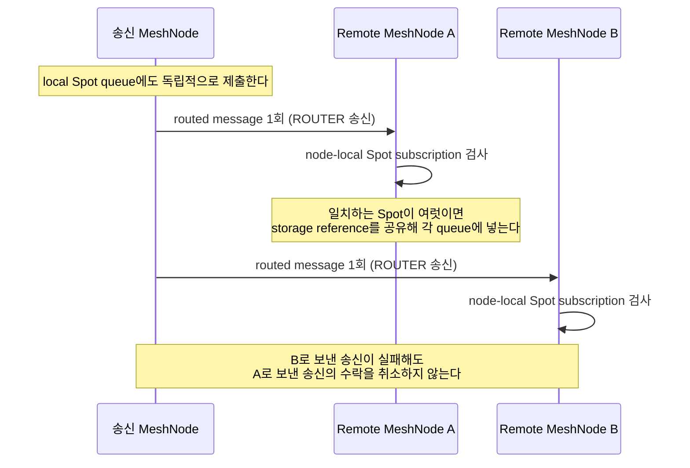

# Framework 개요

[Foundation 주제 목차](README.ko.md) · [스펙 목차](../README.ko.md) · [이전: 02. Framework 메시징 용어집](02-glossary.ko.md) · [다음: 04. 상호작용 모델](04-interaction-model.ko.md)

> Framework가 무엇을 하는 상위 계층인지, mesh와 channel 범위를 식별하는 기본 개념이
> 무엇을 가리키는지, 메시지 대상은 어떻게 정해지고 어떤 실행 owner로 전달되는지를 정의한다.

## 1. Framework가 하는 일

ZLink Framework는 typed message handler, mesh와 channel 메시징, [Spot](02-glossary.ko.md#spot),
ID별 상태와 mailbox를 갖는 [Actor](02-glossary.ko.md#actor), 연결 session, PUB/SUB 방식 broadcast와 location runtime을 application host의
lifecycle과 DI에 연결하는 상위 계층이다.

- **C++·.NET·JVM·Node.js Framework는 service runtime을 각 언어에서 독립적으로 구현한다.** 이
  runtime은 설치된 해당 언어 binding의 public raw socket API만 사용한다.
- **언어가 함께 사용하는 것은 public contract, versioned protocol schema와 검증 fixture이며,
  공통 native runtime이나 service C ABI는 사용하지 않는다.** 각 언어 구현이 서로 다른 바이너리를
  가져도 관찰 가능한 계약은 같아야 하기 때문이다.
- **Java와 Kotlin은 하나의 JVM runtime을 공유한다.**

## 2. MeshName·ChannelName·RouteMesh

[RouteMesh](02-glossary.ko.md#routemesh)는 서로 메시징할 수 있는 물리 mesh와 RID namespace를 식별하는 이름인
[MeshName](02-glossary.ko.md#meshname)을 공유하는 [MeshNode](02-glossary.ko.md#meshnode)의 물리
연결 범위다.

MeshNode 하나는 routing ID 하나와 ROUTER endpoint 하나를 가진다.

Channel handler를
제공하는 MeshNode는 하나 이상의 immutable
[ChannelName](02-glossary.ko.md#channelname) — message를 보낼 Channel 범위를 식별하는 이름 —
에 Server로 참여한다.

호출 전용 또는 MeshName과 target RID를 함께 지정해 특정 MeshNode에
보내는 [Node direct](02-glossary.ko.md#node-direct) 전용 MeshNode는 ChannelName membership
없이 동작할 수 있다.

`MeshName`과 `ChannelName`은 역할이 다르다.

| 이름 | 의미 |
|---|---|
| [MeshName](02-glossary.ko.md#meshname) | 서로 메시징할 수 있는 물리 mesh와 RID namespace |
| [ChannelName](02-glossary.ko.md#channelname) | [RouteMesh](02-glossary.ko.md#routemesh) 또는 ClientServer 송신 경로를 고르는 process-local 논리 주소 |

- **한 process는 서로 다른 MeshName의 MeshNode를 여러 개 가질 수 있다.** 각 mesh는 독립적이며
  자동 relay를 제공하지 않는다.
- **RouteMesh ChannelName을 추가해도 socket이나 endpoint가 추가되지 않는다.** ChannelName은
  process-local 논리 주소일 뿐 물리 연결을 만들지 않기 때문이다.
- **같은 process의 ChannelName 하나는 RouteMesh 또는 ClientServer topology 하나에만
  대응한다.** 호출 역할에서는 그 topology의 송신 경로 하나를 가리킨다.

## 3. 메시지 대상 선택

MeshNode 위의 메시징은 대상 선택 방식으로 구분한다.

- [node direct](02-glossary.ko.md#node-direct)는 같은 MeshName의 RID 하나를 지정한다.
- channel send/request는 ChannelName으로 process-local 송신 경로를 찾고, 그 RouteMesh member
  또는 ClientServer server 가운데 [ready](02-glossary.ko.md#ready) target 하나를 선택한다.
- Spot [Logical Multicast](02-glossary.ko.md#logical-multicast)는 ChannelName의 remote
  MeshNode와 node-local Spot [subscription](02-glossary.ko.md#subscription)을 대상으로 한다.
- Spot과 Actor message는 Spot을 식별하는 전역 논리 주소인
  [Spot ID](02-glossary.ko.md#spot-id) 또는 Actor ID 하나를 지정한다. Framework는 그 ID를 지금
  어느 node가 맡고 있는지 Location Store에 기록된 값에서 찾은 다음, 그 node에 있는 객체의
  mailbox에 message를 넣는다. 이 "지금 누가 맡고 있는가"를 기록한 값을
  [authority](02-glossary.ko.md#authority)라고 한다.
- Spot·Actor 생성(create)과 있으면 반환·없으면 생성(get-or-create)은 application이 manager로
  직접 호출한다. Framework는 object role, 남은 수용 공간, [stable type](02-glossary.ko.md#stable-type)과
  node별 배치 weight를 보고 만들 node를 고른 뒤, 그 객체가 message를 받을 수 있는 상태가 되면
  변경할 수 없는 참조를 돌려준다.

**선택과 submit은 하나의 operation이다.** application은 peer 목록이나 선택된 RID를 받아 별도
send를 반복하지 않는다.

## 4. Logical Multicast와 classic fanout

Spot Logical Multicast는 room, stage, zone처럼 위치가 바뀔 수 있는 logical Spot에 event를
전달한다. 송신 MeshNode는 target channel의 remote MeshNode마다 routed message를 한 번 보내고,
수신 MeshNode가 자기 node의 subscription을 검사한다.

- **같은 node에서 여러 Spot이 일치하면 immutable message storage의 reference를 공유해 각 Spot
  queue에 넣는다.** message 본문을 Spot 수만큼 복제하지 않기 위해서다.
- **remote 송신의 HWM, send timeout과 backpressure는 ROUTER 규칙을 그대로 따른다.** Logical
  Multicast가 별도 흐름 제어 경로를 두지 않기 때문이다.
- **뒤 target의 실패가 앞에서 수락된 target의 제출을 취소하지 않는다.** target마다 독립적으로
  제출하기 때문이다.

[classic fanout](02-glossary.ko.md#classic-fanout)은 연결되어 있고 subscription 준비가 끝난
subscriber에게 event를 보내는 독립 PUB/SUB 기능이다.

- **automatic discovery를 사용하는 publisher는 전용 location descriptor에 실제 endpoint를
  게시하고, automatic subscriber는 같은 ChannelName의 live publisher를 모두 연결한다.**
- **manual endpoint만 사용하는 publisher와 subscriber는 location store 없이 구성할 수 있다.**
  MeshNode나 Spot이 필요하지 않은 host도 이 방식으로 사용할 수 있다.
- **classic fanout은 저장과 replay를 보장하지 않는다.** 연결·구독이 끝난 시점 이후의 event만
  전달한다.

## 5. 실행 owner

Framework는 메시지를 실제 상태를 소유하는 실행 단위로 전달한다.

이 표의 실행 객체와 Location Store authority의 MeshNode [Owner](02-glossary.ko.md#owner)는
다른 단위다. 실행 객체별 FIFO 범위는 [Handler turn과 execution gate §7](../01-execution/02-handler-turn-and-execution-gate.ko.md#execution-lanes)이 소유한다.

| 실행 객체 | 책임 |
|---|---|
| Node | RID direct와 ChannelName handler, node에서 시작한 completion |
| Spot | Global Spot ID 하나로 send·request를 전달하는 [Spot direct](02-glossary.ko.md#spot-direct), Logical Multicast subscription, timer와 Spot 상태. Instance Spot은 direct와 timer만 사용하고 Actor [membership](02-glossary.ko.md#membership)과 Logical Multicast subscription은 사용하지 않는다. |
| Actor | Actor direct message, Actor lifecycle과 Actor별 mailbox |
| [STREAM session](02-glossary.ko.md#stream-session) — STREAM 연결 하나를 수락한 때부터 닫을 때까지 유지하는 서버 실행 단위 | 연결 lifecycle, packet dispatch와 Actor binding ingress |

- **Spot과 Actor message를 Node handler에서 다시 분배하도록 application에 요구하지 않는다.**
  Framework service runtime이 owner별 bounded mailbox를 drain해 등록된 handler 실행 문맥으로
  직접 연결하기 때문이다.
- **transport readiness와 service protocol frame은 application callback에 노출하지 않는다.**
  application이 owner별 실행 상태만으로 처리를 이어갈 수 있게 하기 위해서다.

## 6. 연결 관리

자동 discovery는 [location store](02-glossary.ko.md#location-store)의
[descriptor](02-glossary.ko.md#descriptor)와 lease를 사용한다.

- **RouteMesh는 같은 MeshName의 MeshNode descriptor를 찾고, ClientServer client는 같은
  ChannelName의 전용 server descriptor를 찾는다.** 두 descriptor를 서로 대신 사용하지 않는다.
- **Object Client·Server role이나 분산 discovery를 사용하는 host는 공식 Redis location store
  instance를 명시적으로 등록한다.**

manual peer는 endpoint 또는 expected RID와 endpoint를 application이 제공하는 연결 intent다.

- **manual peer도 자동 discovery peer와 같은 MeshName, RID, ChannelName, generation과 security
  admission을 통과한다.** manual이라는 이유로 message path나 handler 의미가 달라지지 않는다.

[ClientServer Channel](02-glossary.ko.md#clientserver-channel)은 client가 업무 호출을 시작하고
server가 handler와 request reply를 제공하는 별도 service 연결이다. Node direct, Spot, Actor와
Logical Multicast가 필요하지 않은 단방향 service 경계에 사용한다. 자세한 역할과 발견 계약은
[ClientServer Channel](../02-channel-transport/03-client-server-channel.ko.md)이 소유한다.

## 7. Framework가 숨기는 것

Framework는 transport 주소 선택, peer reconnect, multipart framing, packet codec, reply
correlation과 backpressure queue를 내부에서 관리한다. application handler는 typed payload와
context를 사용하며 raw socket 배선을 구성하지 않는다.

외부 edge gateway의 인증, quota, WAF, public API versioning과 billing은 이 framework의 계약
범위가 아니다.

## 8. 검증 요구

공개 messaging API(node direct·channel send/request·Spot Logical Multicast·Spot/Actor message,
classic fanout publish/subscribe, manual peer 등록)만으로 다음을 확인한다.

**대상 선택과 제출**

- 대상 선택과 submit은 한 번의 호출로 끝난다 — caller가 peer 목록이나 선택된 RID를 받아
  별도 send를 반복하지 않는다.
- Spot Logical Multicast에서 뒤 target으로의 송신이 실패해도, 이미 수락된 앞 target의 제출은
  취소되지 않는다.

**Classic fanout**

- Classic fanout subscriber는 연결·구독이 끝난 시점 이후의 event만 받는다 — 그 전에 발행된
  event는 다시 전달되지 않는다.

**연결 admission**

- manual peer도 자동 discovery peer와 같은 MeshName, RID, ChannelName, generation과 security
  admission 검사를 통과해야 연결된다.

---

[Foundation 주제 목차](README.ko.md) · [스펙 목차](../README.ko.md) · [이전: 02. Framework 메시징 용어집](02-glossary.ko.md) · [다음: 04. 상호작용 모델](04-interaction-model.ko.md)
