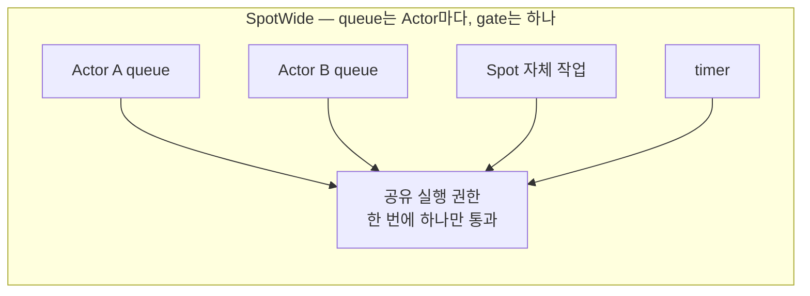
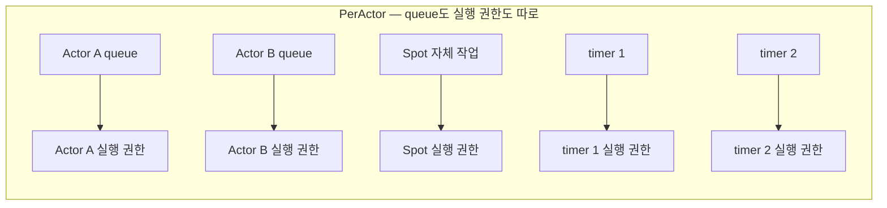
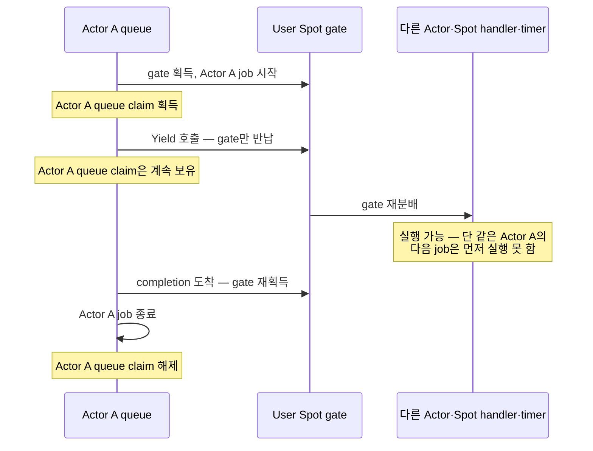
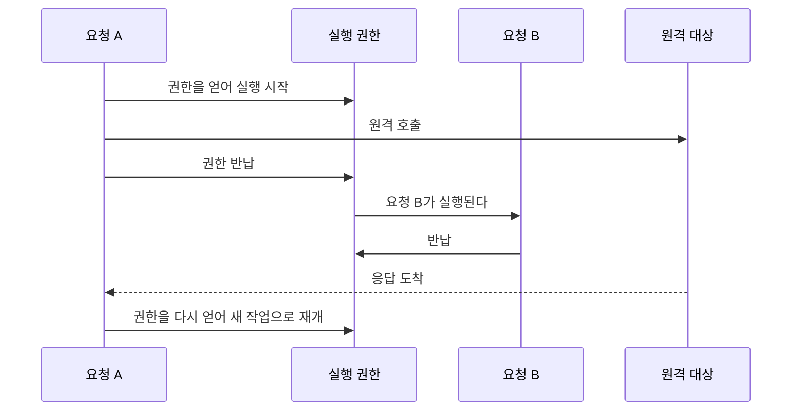
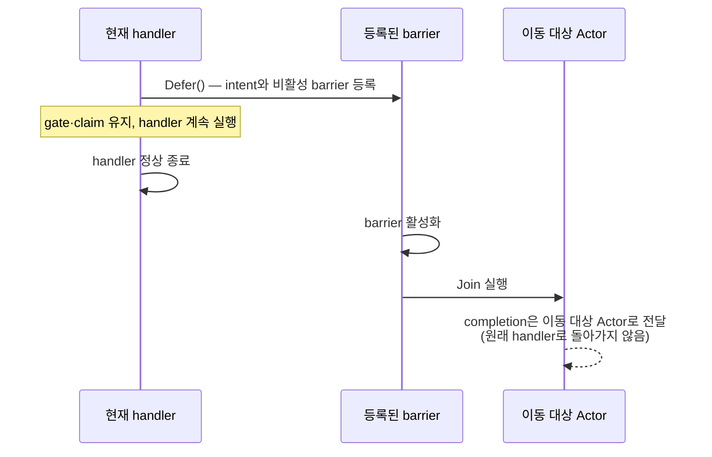

# Handler turn과 execution gate

[Execution 주제 목차](README.ko.md) · [스펙 목차](../README.ko.md) · [이전: 01. Submit과 완료](01-submit-and-completion.ko.md) · [다음: 03. 취소와 종료](03-cancellation-and-shutdown.ko.md)

> 이 문서는 handler의 실행 순서와 실행 mode별 gate 공유 범위, `Yield`의 gate·Actor claim
> 수명, `Defer()`의 완료 경계를 정의한다. Gate·turn은 [§2](#execution-gate), Yield와 Actor
> claim은 [§3](#yield-gate-and-claim)이 소유한다. Spot·Actor·Stage·timer 문서는 각 기능의
> 계약에서 이 실행 규칙을 참조한다.

## 1. Queue와 gate 분리 원칙

Runtime의 작업은 두 축으로 나뉜다. 하나는 "어디에 줄 서는가"(queue)와 "누가 지금 실행할
권한을 갖는가"(동시에 실행할 handler를 제한하는 [execution gate](../00-foundation/02-glossary.ko.md#execution-gate))의 분리이고, 다른 하나는 handler가 실행하는
application 작업과 peer 연결·완료 확정·이동처럼 handler 대기와 무관하게 진행해야 하는
infrastructure 작업의 분리다. 여기서 application 작업은 주소와 상태를 가진 논리 instance인
[Spot](../00-foundation/02-glossary.ko.md#spot)이나 그 안의 Actor가 처리하는 handler 실행을
가리킨다.

| 영역 | 하는 일 | 진행 조건 |
|---|---|---|
| application | handler 실행, Spot·Actor message, timer callback, session callback | §2의 execution gate 순서를 지킨다 |
| infrastructure | peer 수락, binding operation completion, 호출 완료 확정, owner 정보 갱신, 이동 절차, 종료 절차 | application의 대기와 무관하게 진행한다 |

이 표는 이 문서 전체가 참조하는 자리다. [§13](#13-application과-infrastructure-진행-분리)이
application 쪽 진행 규칙을 자세히 다룬다. 이 실행 영역 구분은 [§7](#execution-lanes)의
application·lifecycle FIFO 분류와 다른 축이다. 두 FIFO의 user callback은 모두 application
영역에 속하며, infrastructure 진행은 그 callback의 대기와 분리한다.

같은 executor 안에 infrastructure 전용 자리만 예약해 두는 방식으로는 부족하다 — queue
자리는 남아도 그 자리를 실행할 주체가 없을 수 있다. 그래서 예약이 아니라 진행 영역
자체를 분리한다. 서로 다른 목적의 한도(Core byte HWM, application callback 시작 전까지
보유하는 공유 supply permit queue인
[Application job queue](../00-foundation/02-glossary.ko.md#application-job-queue), owner별
count·byte queue, outbound admission waiter)는 이 분리에서도 합치지 않는다 — 같은 profile
label이나 단위를 쓰더라도 type·계산·error 의미를 공유하지 않는다.

Queue는 대기 중인 payload를 구별하고, gate는 실행 중인 callback의 상태 접근을 직렬화한다.
두 책임을 나누는 실행 규칙은 [§2](#execution-gate)·[§3](#yield-gate-and-claim)이 소유한다.
다음 그림은 두 실행 mode에서 queue와 gate가 연결되는 관계를 보여 준다.

이 구조를 지키지 않으면 다음 두 방향으로 깨진다.

| 잘못된 구조 | 결과 |
|---|---|
| Actor마다 queue를 두면서 실행 권한까지 Actor마다 둔다 | `SpotWide`에서 같은 Spot의 두 Actor handler가 동시에 실행된다. Application은 그 Spot의 상태를 동기화 없이 만지는 중이므로 곧바로 경쟁 상태가 된다 |
| `SpotWide`에서 queue 자체를 하나로 합친다 | Actor 앞 payload가 항상 그 Actor queue에 있어야 한다는 요구를 어긴다. 이동할 때 Actor별로 남은 작업을 갈라내야 하는데 이미 섞여 있어 갈라낼 수 없다 |

## 2. Execution gate — owner 처리 순서

Gate를 얻어 handler를 실행하고 그 권한을 반납하기까지의 실행 구간을
[handler turn](../00-foundation/02-glossary.ko.md#handler-turn)이라고 한다.

- **Actor payload는 실행 mode와 무관하게 해당 Actor queue에 제출한다.** Actor별 대기
  순서와 이동할 때 보관할 작업을 구분하기 위해 queue와 실행 권한을 분리한다.
- **`SpotWide` User Spot과 Instance Spot은 Actor handler·Spot handler·timer·lifecycle
  callback에 shared Spot gate를 적용한다.** 이 callback들이 같은 Spot 상태에 접근하므로
  gate 하나로 실행을 직렬화한다.
- **Entry Spot의 Spot handler·timer·lifecycle callback은 Spot gate를 함께 사용한다.**
  Entry Actor의 gate와 구별하여 Spot 자신이 소유한 상태를 직렬화한다.
- **Entry Spot Actor와 `PerActor` User Spot Actor는 Actor별 gate를 사용한다.**
  서로 다른 Actor의 실행을 독립적으로 진행하기 위한 범위다.
- **`PerActor`의 Spot 작업과 각 timer는 각각 별도 gate를 사용한다.** Timer 두 개를 같은
  gate로 묶으면 서로 다른 timer가 서로를 기다리게 된다.
- **Node handler, [ChannelName](../00-foundation/02-glossary.ko.md#channelname) handler,
  각 Spot과 각 Actor는 자신에게 적용되는 gate의 순서로 record를 처리한다.**
  일반 비동기 terminal은 완료 continuation까지 그 권한을 유지하므로 다음 application
  record가 현재 handler의 상태 접근과 겹치지 않는다.
- **같은 gate의 application turn 두 개를 동시에 실행하지 않는다.** `Yield`의 권한
  이전은 [§3](#yield-gate-and-claim)을 따르며, 실행 mode와 call별 제공 범위는
  [§16](#yield-call-eligibility)에서 확인한다.

## 3. `Yield` 시 gate와 claim

허용된 call의 `Yield`는 결과 대기 동안 shared Spot gate를 반납하고, 완료 continuation을
같은 Spot queue에 재개 record 하나를 넣어 새 turn에서 재개한다. Reply payload를 새 Spot packet으로 dispatch하지 않는다. 이 절은 gate와 claim의 수명을 설명하며,
call별 제공 범위는 [§16](#yield-call-eligibility)이 소유한다. Create·get-or-create는
terminator naming 범위를 넓히지 않는 object execution 특례다.

**`SpotWide` member Actor가 `Yield`하면 shared Spot gate만 반납하고 Actor queue claim은
유지한다.**

- 같은 Actor의 다음 record는 실행하지 않지만 다른 member Actor·Spot handler·timer는
  gate를 넘겨받아 진행할 수 있다.
- Continuation은 gate를 다시 얻은 뒤 현재 Actor record를 끝내고서야 Actor queue claim을
  해제한다.
- 같은 Actor 자신에게 보낸 request도 재진입 호출로 바꾸거나 inline으로 실행하지 않는다
  — [§6](#6-처리-권한-획득의-함정-구현)의 재진입 금지 규칙을 그대로 따른다.
- 대기 전에 읽은 mutable state는 다른 handler가 이미 바꿨을 수 있으므로 다시 확인해야
  한다.

## 4. 같은 turn에서의 대기와 반납

같은 handler turn에서 보낸 request를 기다릴 수 있다.

- Reply completion과 binding operation completion 같은 infrastructure 작업은 application
  turn과 분리되어 진행되므로, 해당 Spot이나 Actor의 다음 application message를 실행하지
  않고도 현재 turn을 재개할 수 있다. RouteMesh ROUTER-ROUTER reply는 별도 [Completion
  connection](../00-foundation/02-glossary.ko.md#completion-connection)으로 이 경계에 도달한다. ClientServer DEALER-ROUTER reply는 infrastructure에서
  처리되지만 single connection의 앞선 DATA와 HWM·PAUSED 뒤에서 늦을 수 있다.
- Channel request의 target이 다른 mesh 그룹이나 ClientServer Channel이어도 이 규칙은
  같다. Framework는 선택한 송신 경로의 completion을 원래 Spot activation과 generation에
  연결한다.
- 일반 비동기 terminal의 turn 유지는 [§2](#execution-gate), Yield continuation은 [§3](#yield-gate-and-claim)을 따른다.

**반납한 뒤 재개할 때는 새 작업으로 재개한다.** 하나의 작업이 대기 구간을 가로질러
유지되지 않는다.

정상 경로만 그렸다. 재개를 기다리는 중 Spot이 종료되거나 그 단위가 이동을 위해
봉인되면 재개하지 않고 실패로 끝난다. 이동이 시작되는 것만으로는 멈추지 않는다 — 봉인
전까지는 기존 message와 timer를 계속 처리한다
([Host relocation §14](../05-location-relocation/05-host-relocation-flow.ko.md#14-shutdown과-relocate의-경쟁)).

"작업 하나가 처음부터 끝까지 끊기지 않는다"는 보장이 아니다. 보장은 "한 실행 권한에서
두 작업이 동시에 실행되지 않는다"뿐이다. 반납 지점을 사이에 둔 코드는 반납 전에 읽은
값이 재개 후에도 유효하다고 가정할 수 없다 — 같은 Spot의 다른 요청이 그 사이에 상태를
바꿨을 수 있다. 이 제약은 구현이 아니라 handler 작성자에게 영향을 준다.

반납은 `SpotWide` User Spot과 Instance Spot에서만 쓸 수 있다. 그 밖의 자리에서
호출하면 원격 요청을 보내기 전에, queue를 바꾸기 전에 실패로 끝낸다. 요청이 나간 뒤에
실패하면 원격에 부작용만 남기고 caller는 실패를 받는다.

## 5. Actor Join과 `Defer()` 완료 경계

Actor Join은 Messaging·Worker terminator naming 대상이 아니다. Handler 안에서 동기
`Defer()`를 한 번 호출해 handler terminal 뒤 실행할 barrier를 등록한다.

### `Defer()`의 성격

`Defer()`는 비동기 operation을 즉시 시작하는 API가 아니다. 현재 handler가 정상적으로
끝난 뒤 Join을 실행하도록 intent와 비활성 queue barrier를 등록하는 동기 terminal이다.
모든 언어에서 결과가 없는 일반 함수이며 awaitable, promise나 coroutine을 반환하지
않는다. Target I/O를 시작하지 않고 Spot gate와 Actor FIFO claim을 반납하지 않는다.

### `Defer()`와 `Yield`의 차이

| 기능 | 호출했을 때 하는 일 | 현재 실행권 |
|---|---|---|
| `Yield` | 비동기 operation을 제출하고 결과를 기다리는 동안 shared Spot gate를 반납한다 | Actor queue claim은 유지하지만 허용된 `SpotWide` gate는 반납한다 |
| `Defer()` | Target 조회나 Store I/O 없이 현재 handler에 Join intent와 비활성 barrier만 등록한다 | Spot gate와 Actor claim을 모두 유지하며 현재 handler를 계속 실행한다 |

SpotWide handler가 먼저 `Yield`했다면 continuation이 gate를 다시 얻고 최종 종료한
시점이 barrier terminal이다. `PerActor`와 Entry에서 `Yield`가 금지되는 기존 규칙도
바뀌지 않는다. Join call에는 일반 비동기 terminal, `Yield`와 one-way terminal을 제공하지
않는다.

### Barrier 활성화와 폐기

- Handler가 `Yield` 전에 또는 `Yield` 뒤 continuation에서 Join을 등록할 수 있다.
- 이 경우에도 마지막 awaited continuation이 정상적으로 끝난 시점에만 barrier를
  활성화한다.
- Handler가 exception, cancellation 또는 reply encoding 실패로 끝나면 그 handler가
  등록한 비활성 barrier를 모두 폐기한다.
- Join 결과는 원래 handler를 재개하는 값으로 반환하지 않고 이동 대상 Actor의 completion
  callback으로 전달한다.

### 호출 가능 범위

Framework는 handler가 열어 둔 registration scope 안에서만 `Defer()`를 허용한다. Scope가
닫힌 뒤 호출하면 `InvalidOperation`이다. Handler가 시작했지만 기다리지 않은 detached
task에서 호출하는 것은 application contract 위반이며, Framework가 모든 언어에서 이
오용을 scope가 닫히기 전에 검출한다고 보장하지 않는다.

### 완료 시점

One-way terminal과 `Defer()`는 모두 single-use지만 완료 시점은 다르다.

- One-way terminal은 source-local outbound admission을 기다린다.
- `Defer()`는 local registration 검증이 끝나면 즉시 반환한다.
- 잘못된 실행 문맥, 제한 초과와 같은 registration 오류는 target I/O 전에 동기적으로
  발생한다.
- Target을 찾지 못한 경우, capacity 부족, relocation policy와 callback 실패는 handler가
  끝난 뒤 Actor completion으로 전달한다.

Actor Join은 [01. Submit과 완료](01-submit-and-completion.ko.md)의 terminator naming
대상이 아니다 — 완료 경계는 이 절이 소유한다.

## 6. 처리 권한 획득의 함정 (구현)

실행 권한은 앞선 작업의 완료에 다음 작업을 잇는 방식으로도, lock과 대기열로도 만들 수
있다. 언어에 맞는 쪽을 쓴다. 다만 구현 방식에 따라오는 제약이 있다.

**가져오기는 배타권 획득을 겸한다.** 한 owner당 처리 권한은 동시에 하나만 존재한다.
처리 권한마다 재사용 없는 번호를 붙여 늦은 완료가 자기 것인지 판단한다 — 이 fencing
번호는 내부 확인 조건이다.

**작업을 thread에 넘겨가며 실행하면 thread에 매인 저장소를 쓸 수 없다.** 실행 권한을
"한 번에 하나"로만 보장하고 어느 thread에서 실행할지는 고정하지 않을 수 있다. 이때
연속된 두 작업이 서로 다른 thread에서 실행되므로, thread에 매인 저장소에 작업 사이의
상태를 두면 그 상태는 사라진다. 이 방식 자체는 문제가 없다 — thread 고정을 전제로 만든
코드를 그대로 옮겨 thread-local에 문맥을 두는 것이 문제다.

**대기열이 가득 찼을 때 그 자리에서 실행하지 않는다.** 제출 실패 대신 그 자리에서 바로
실행하면 이미 실행 중인 작업과 동시에 실행되어 직렬 실행이라는 전제 자체가 무너진다.
결과는 queue admission 방식과 오류 분류를 나누어 참조한다.
Send·one-way·publish의 대기는 [Backpressure §8](04-application-job-queue-and-backpressure.ko.md#8-backpressure-3단계와-한도-종류),
Spot control claim의 제출 경계는 [Spot 메시징 §5.3](../03-spot-actor/02-spot-messaging.ko.md#53-spot-application-queue에-들어가는-작업),
local·remote bounded resource의 오류 선택은 [Framework 오류 모델 §5](../00-foundation/07-framework-error-model.ko.md#5-request-완료와-실패)가 소유한다.
송신 HWM 대기와 binding completion의 경계는 [Backpressure §7](04-application-job-queue-and-backpressure.ko.md#7-send-completion과의-합성)을 따른다.

**대기열 앞쪽에 넣는 새치기 경로를 두지 않는다.** 먼저 처리할 작업이 있으면 별도
대기열을 두고 우선순위를 명시한다. Owner마다 두는 두 FIFO lane의 구체적인 한도와
우선순위 규칙은 [§7](#7-lane-분리와-우선순위-구현)이 소유한다.

**재진입을 허용하지 않는다.** 이미 그 권한 안에서 실행 중이면 대기열을 거치지 않고 그
자리에서 실행하는 우회는 자기 자신을 기다리는 호출의 교착을 피할 수 있지만, 관찰 가능한
의미 차이를 만든다 — 재진입을 허용하면 중첩 호출이 현재 작업의 일부로 실행되어
대기열에 있던 다른 작업보다 먼저 끝난다. 현재 turn을 유지한 채 같은 gate가 필요한 결과를
기다리거나 같은 Actor가 자신에게 보낸 요청을 기다리는 호출은 제출 전에 `InvalidOperation`
으로 거부한다. 허용된 `SpotWide` User Spot 또는 Instance Spot에서 `Yield`를 선택한 call은
현재 shared gate를 먼저 반납하므로 재진입이 아니다.

금지 대상은 public operation이다. 무엇이 금지인지 정확히 나누면 다음과 같다.

| 호출 | 판정 |
|---|---|
| handler가 자기 Actor에 public request를 보내고 결과를 기다린다 | 금지. `Yield` 뒤에도 Actor queue claim을 유지하므로 제출 전에 `InvalidOperation` |
| handler가 현재 turn을 유지하는 terminal로 자기 Spot이나 같은 gate가 필요한 대상을 기다린다 | 금지. 제출 전에 `InvalidOperation` |
| 허용된 `SpotWide`·Instance 문맥에서 request 또는 Actor·Spot create/get-or-create를 `Yield`로 기다린다 | 허용. Shared gate를 반납하고 완료 뒤 queue 뒤의 새 turn에서 재개한다 |
| runtime이 handler를 실행하려고 내부적으로 실행 문맥을 합성한다 | 허용. 새 작업의 제출이 아니다 |
| handler가 결과를 기다리지 않고 자기 대상에 작업을 제출한다 | 허용. 대기열 뒤에 추가한다 |

"제출 전"이 중요하다. 요청이 나간 뒤에 실패하면 원격에 부작용만 남기고 caller는 실패를
받는다.

## 7. Lane 분리와 우선순위 (구현)

**Spot·Actor·Session 등 직렬 실행 객체마다 두 개의 FIFO lane을 둔다.** 이 절의 owner는
그 실행 객체이며, Location Store authority가 가리키는 MeshNode
[Owner](../00-foundation/02-glossary.ko.md#owner)와 다르다. 실행 객체별 용량과 순서를
관리하기 위해 두 단위를 구별한다.

| lane | 담는 것 | 한도 |
|---|---|---|
| [application lane](../00-foundation/02-glossary.ko.md#application-lane) | 업무 payload, timer callback | 건수·byte 두 축 |
| [lifecycle lane](../00-foundation/02-glossary.ko.md#lifecycle-lane) | join·leave·relocation·lifecycle control | application lane과 공유하지 않는 별도 한도 |

기본 admission은 application lane이 1,024건·64 MiB이고 lifecycle lane이 128건·4 MiB다.
Application work의 byte reservation에는 payload와 work당 고정 retained cost 256 byte를
함께 포함한다. 두 lane 모두 work가 queue에서 나와 실행 중이어도 reservation을
유지하며, handler의 terminal completion에서만 반환한다.

turn 경계에서 어느 lane을 실행할지 하나의 원자적 판단으로 정한다. 둘 다 ready이면
lifecycle lane이 먼저다.

**우선순위만으로는 굶주림을 막지 못한다.** 여기에는 서로 다른 두 상한이 관여한다.

| 상한 | 무엇 사이의 공정성인가 | 세는 단위 |
|---|---|---|
| owner 점유 상한 | 서로 다른 owner 사이 | 시간 |
| lifecycle 연속 실행 상한 | 같은 owner의 두 lane 사이 | lifecycle lane을 연속으로 고른 turn 수 |

기본 owner 점유 시간 예산은 10 ms이고, lifecycle lane을 연속으로 고를 수 있는 상한은
8 turn이다. 시간 예산은 handler 하나가 끝난 경계에서 확인하며,
[§9](#9-시간-예산과-batch-처리-구현)의 batch 시간 예산과 같은 값·같은 확인 지점이다.

owner 점유 상한에 걸려 turn을 놓아도, 이 owner에 turn이 돌아왔을 때 두 lane이 여전히
ready이면 같은 우선순위 규칙이 lifecycle을 다시 고른다. 그래서 application turn을 우선할 필요를 나타내는 **[양보 부채](../00-foundation/02-glossary.ko.md#yield-debt)**를 둔다 —
lifecycle lane 연속 선택이 상한에 도달하면 그 owner에 부채를 표시하고, 부채가 있는
동안에는 application lane이 ready인 한 application turn을 한 번 실행할 때까지
lifecycle을 고르지 않는다. 실행하면 부채를 지운다. 부채 표시 자체는 내부 확인 조건이다.

이 규칙으로 lifecycle 작업이 계속 도착해도 handler 경계에서 application turn이 결국
선택된다. 10 ms는 실행 중인 handler를 중단하는 제한이 아니다. Handler 하나가 10 ms를
넘겨 실행될 수 있으므로 application turn의 최대 대기 시간을 보장하지는 않는다.

- **연속 횟수와 양보 부채는 직렬 실행 객체(그 객체의 queue 한 쌍)마다 따로 둔다.** 부채를
  해소하는 application turn은 같은 실행 객체의 application 작업이어야 하기 때문이다. 다른 Actor의
  turn으로 한 Actor의 lifecycle 폭주가 해소된 것처럼 계산하면 그 Actor의 application 작업이
  계속 밀린다. 실행 mode는 gate 공유 범위([§2](#execution-gate))만 바꾸고 부채의 단위는 바꾸지 않는다.

| 상황 | 처리 |
|---|---|
| Lifecycle lane이 비어 application lane을 골랐다 | 연속 횟수를 0으로 되돌린다 |
| 부채가 있는데 application lane이 ready가 아니다 | 부채를 유지한 채 lifecycle lane을 계속 실행한다. Application 작업이 없으면 굶주림도 없다 |
| 점유 상한으로 turn을 놓았다가 돌아왔다 | 부채와 연속 횟수를 그대로 유지한다 |
| 실행 객체가 종료하거나 이동한다 | 부채와 연속 횟수를 함께 버린다 |

각 lane 안의 순서는 수락 순서 그대로다. 어느 lane에도 앞쪽 삽입은 없다.

두 lane은 owner마다 물리적으로 다른 FIFO로 존재하며, 건수·byte reservation과 admission
상태를 서로 공유하지 않는다. Application FIFO가 가득 차도 이미 수락한 lifecycle 작업은
넣고 실행할 수 있다.

## 8. 뒤처리와 turn 경계 (구현)

작업이 끝날 때 미뤄 둔 뒤처리를 다음 순서로 실행하면 다음 turn과 겹칠 수 있다.

1. 실행 중 표시를 내린다.
2. 대기열에 남은 것이 있으면 다음 실행을 예약한다.
3. 잠금을 놓는다.
4. 그 뒤에 미뤄 둔 뒤처리를 실행한다.

2번에서 예약된 다음 작업이 4번의 뒤처리와 동시에 실행될 수 있다. 뒤처리가 그 owner의
상태를 만지면 직렬성이 깨진다.

**뒤처리는 실행 권한을 놓기 전에 끝내거나, 새 작업으로 대기열에 다시 넣는다.** 권한
바깥에서 실행하는 뒤처리는 그 owner의 상태를 만지지 않는 것만 허용한다.

## 9. 시간 예산과 batch 처리 (구현)

한 번 처리 권한을 가져오면 정해진 시간 예산 안에서 여러 건을 이어 처리한다. 한 건이
끝날 때마다 예산을 확인해 남으면 다음 건을, 아니면 권한을 반납한다.

- 건수가 아닌 시간으로 잰다. handler별 처리 시간이 다르기 때문이다.
- 실행 중인 handler는 끊지 않는다.
- Byte 합계는 보조로만 쓴다 — 처리 시간이 payload 크기에 비례할 때만 의미가 있다.

이 시간 예산은 [§7](#execution-lanes)의 점유 상한(기본 10 ms)과 같은 값이며, `PerActor`처럼
실행 단위가 분리된 gate를 가진 경우에도 실행 객체마다 같은 값을 적용한다.

## 10. 실행 자원은 Spot 수에 비례하지 않는다 (구현)

**실행 자원은 Spot 수가 아니라 코어 수에 비례한다.** 실행 권한을 만드는 방법은 자유지만
권한마다 전용 실행 자원을 할당하면 안 된다. Spot마다 worker 두 개를 두면 Spot이 10,000개일
때 worker가 20,000개 필요하다. Worker를 둘씩 두더라도 반납을 기다리는 작업이 같은
worker를 기다리는 구조적 문제만 가릴 뿐, 자원 수가 Spot 수에 비례하는 문제는 남는다.

공유 실행 자원 위에서 권한만 나누면 이 문제가 없다. 권한은 "지금 이 owner의 작업을
실행할 자격"이고, 그 자격을 가진 작업을 어느 자원이 실행할지는 별개다. 반납 대기가 자기
자신을 기다리는 문제는 자원을 늘려서가 아니라, 반납한 작업을 같은 권한의 대기열에 다시
넣어 해결한다.

**자원은 process 하나를 기준으로 배분하고, topology나 Spot 수에 따라 늘리지 않는다.**
infrastructure 작업은 대부분 짧고 대기가 없으므로 application보다 적은 자원으로
충분하다.

**계약은 "전용 thread"가 아니라 "application이 전부 대기 중일 때 infrastructure가
진행한다"이다.** 네 언어의 실행 모델이 다르기 때문이다.

| 언어 | 실행 자원 | 전용을 만족하는 방법 |
|---|---|---|
| C++ | OS worker pool | infrastructure 전용 worker를 둔다 |
| .NET | thread pool 위의 직렬 drain | infrastructure 작업을 별도 lane으로 제출한다 |
| Java | virtual thread per task | infrastructure lane을 별도 executor에 붙인다 |
| Node | event loop 하나 | 물리적 분리가 불가능하다. lane만 분리한다 |

Node는 event loop가 하나이므로 물리적으로 전용 자원을 만들 수 없다. 그래서 계약을
다음과 같이 나눈다.

- **보장한다** — application handler가 await로 양보한 뒤에는 infrastructure 작업이
  진행한다. application 작업 전부가 결과를 기다리는 상태여도 마찬가지다.
- **보장하지 않는다** — application handler가 양보 없이 CPU를 붙잡고 있는 동안의 진행.
  이것은 계약 위반이 아니라 application의 책임이다. 오래 걸리는 동기 계산은 worker로
  옮기라고 안내한다.

`Task`·`Promise`·virtual thread는 모두 이 계약에서 실행 자원으로 인정한다. 판정 기준은
자료형이 아니라 **양보한 뒤 진행하는가**다.

## 11. 두 동기화 지점을 싸게 만든다 (구현)

`SpotWide`에서 Actor message는 두 지점을 거친다 — Actor 대기열에 넣기, 그리고 공유
권한 얻기. 두 지점 모두 없앨 수 없으므로 비용을 낮춘다.

**Actor 대기열에 독립 잠금을 두지 않는다.** `SpotWide`에서는 어차피 한 번에 하나만
실행되므로, 대기열에서 꺼내는 쪽은 이미 권한을 쥐고 있다. 넣는 쪽만 보호하면 된다.

**무경합 시 권한 획득이 원자 연산 하나로 끝나게 한다.** 실행 중인 작업이 없으면 권한
획득은 표시 하나를 바꾸는 것으로 충분하다. 경합이 있을 때만 대기열에 들어간다.

이 두 가지를 하지 않으면 message 하나마다 잠금을 두 번 잡는다. 호출이 많은 Spot에서는
이 잠금 비용이 처리량 상한을 결정한다.

## 12. 넘겨가며 실행할 때 캐시 비용 (구현)

작업을 thread에 넘겨가며 실행하는 방식([§6](#6-처리-권한-획득의-함정-구현))은 정확성 문제가
없지만 비용이 있다. 연속된 두 작업이 다른 실행 자원에서 실행되면, 그 Spot의 상태가
이전 자원의 캐시에만 남아 있다. 한 Spot이 초당 수천 건을 처리하면 cache miss 비용이
계속 누적된다.

| 방식 | 상태 캐시 | 자원 활용 |
|---|---|---|
| 넘겨가며 실행 | 작업마다 잃을 수 있다 | 자원 수만큼 고르게 쓴다 |
| 같은 자원에 고정 | 유지된다 | 뜨거운 Spot이 한 자원에 몰린다 |

**언어별 재량** — 실행 자원 하나에 고정할지는 언어가 제약한다. 이벤트 루프 하나로 도는
언어에는 고를 여지가 없다. 둘 다 계약을 만족하므로 어느 쪽이든 되지만 취향으로 고르지
않는다 — 고를 수 있는 언어라면 뜨거운 Spot이 소수이고 처리량이 중요한 경우 고정 쪽을
택한다. 판정 기준은 관찰 가능한 실행 순서와 완료 의미가 두 방식 모두에서 같다는 것이고,
확인 기준은 어느 쪽을 골랐는지 그 언어의 문서에 기록되어 있는가다 — 성능을 비교할 때
먼저 확인해야 하는 값이다.

## 13. Application과 infrastructure 진행 분리

각 언어 service runtime은 application domain과 infrastructure domain을
[§1](#1-queue와-gate-분리-원칙)의 표대로 독립적으로 진행한다.

- Payload decoding, user callback과 exception mapping은 application turn에서 처리한다.
- Service-wire control과 Core completion의 수신 경계는
  [Application job queue §3](04-application-job-queue-and-backpressure.ko.md#3-ordinary-ingress-permit-순서)을
  따른다. Infrastructure에서 처리한다는 사실은 물리 Completion connection 배정을 뜻하지 않는다.
- Peer connection 상태 변경과 shutdown barrier도 infrastructure task에서 처리한다.
- Application handler가 대기 중이어도 infrastructure task를 진행할 수 있어야 한다.
- Actor·Spot lifecycle처럼 user callback을 호출하는 job은 application turn에 포함한다.

Application/infrastructure 영역과 실행 객체별 FIFO의 관계는 [§1](#1-queue와-gate-분리-원칙)을
따른다. Application·lifecycle FIFO의 작업 분류·한도·우선순위는 [§7](#execution-lanes)이 소유한다.

**실행 중인 영역은 문맥 표시로 확인하고, 잘못된 조합이면 기다리지 않고 실패로 끝낸다.**
application 문맥에서 infrastructure 전용 작업을 부르거나 그 반대가 되면 두 영역을 나눈
의미가 사라진다 — 대기로 처리하면 교착이 되고, 통과시키면 분리가 무너지므로 실패가
맞다.

이 표시를 thread 종류에만 연결하면 Node의 단일 event loop나 thread pool 위에서
실행되는 .NET 경로를 표현할 수 없다. 언어별 실행 수단은 달라도 잘못된 영역 호출은
같은 방식으로 기다리지 않고 실패해야 한다.

문맥 표시 자체와 그 강제는 내부 확인 조건이다.

상태 구독자와 metric 수집기는 어느 영역의 진행 권한도 점유하지 않는다. 느린 구독자가
message 처리를 늦추면, 관측을 켰다는 이유로 서비스가 느려진다. 구독자에게 보내는
자리는 한도를 두고, 넘치면 source별 최신 status로 합쳐서 따라잡는다. 자리가 가득 찼다는
이유로 stream을 끊지 않으며, 반대로 message 처리를 늦추지도 않는다
([Runtime 상태와 운영 진단 「3. 현재 상태 조회와 변화 관찰」](../06-observability/01-runtime-monitoring.ko.md#3-host-상태--한-번에-읽는-값)).

## 14. Object placement와 activation

Object placement와 activation의 처리 규칙은 다음과 같다.

- Infrastructure task에서 처리한다.
- 각 Spot의 현재 owner를 여러 node가 함께 확인하도록 보관하는 저장소인
  [Location Store](../00-foundation/02-glossary.ko.md#location-store) reservation이 확정한
  owner만 [factory](../00-foundation/02-glossary.ko.md#factory)를 실행한다.
- AuthorityOwnerGeneration과 owner lease는 Store와 runtime fencing에만 사용한다.
- ObjectGeneration은 public ref와, 그 incarnation에만 적용하는 mutation·session
  bind에서도 사용한다.

Instance cold activation의 순서는 다음과 같다.

1. durable inbox first record를 확정한다.
2. recovery root·cursor를 포함해, application message를 받을 수 있는 상태인
   [`Ready`](../00-foundation/02-glossary.ko.md#ready)를 commit한다.
3. 현재 Actor나 Spot을 실제로 실행하는 MeshNode인
   [Owner](../00-foundation/02-glossary.ko.md#owner)의 lease에서 계산한 admission deadline을
   적용해 first record를 local queue head로 복원한다.
4. Framework activation barrier를 연다.

## 15. 오류 처리

Handler가 예외를 반환하면 send handler는 application logger·telemetry provider와
metric에 기록한다. Request handler는 같은 request의 framework 오류 reply를 생성한다.
Provider failure는 원래 dispatch 결과를 바꾸지 않으며 별도 public error observer를
제공하지 않는다.

## 16. 검증 요구

다음은 `Yield`·`Defer()` operation과 그 오류(`InvalidOperation`), Actor Join completion
callback, handler 실행 순서를 관찰할 수 있는 side effect, application/infrastructure
진행을 관찰할 수 있는 timeout·종료·peer 수락 이벤트만으로 확인한다. 내부 구조로만
확인할 수 있는 조건(fencing 번호, 양보 부채 표시, FIFO wakeup 방식, thread-local 미사용,
잠금 횟수, 실행 자원과 Spot 수의 독립)은 각 규칙 문단이 "내부 확인 조건"으로 소유하며
여기 적지 않는다.

**Yield와 재진입**

- `SpotWide` User Spot·Instance Spot turn의 Channel·Spot·Actor request와 CPU·I/O worker는
  일반 비동기 terminal과 `Yield`를 제공한다.
- 같은 turn의 Actor·Spot create·get-or-create는 object execution 특례로 일반 비동기
  terminal과 `Yield`를 제공한다.
- Entry Spot·`PerActor`·Entry Actor·Node·Channel handler에서는 위 call에 일반 비동기
  terminal만 제공한다.
- Actor join, send, publish, timer 등록, close와 destroy는 `Yield`를 제공하지 않는다.
- Owner turn 밖의 `Yield` 호출은 submission·queue 변경 전에 `InvalidOperation`으로 끝난다.
- `SpotWide` member Actor가 `Yield`한 뒤에도 같은 Actor의 다음 record는 먼저 실행되지
  않고, 다른 Actor·Spot handler·timer는 실행된다.
- 같은 실행 권한 안에서 자기 자신을 기다리는 호출(자기 Actor에 request를 보내고 대기,
  같은 gate를 기다리는 현재-turn terminal)은 제출 전 `InvalidOperation`으로 끝난다.
- 허용된 문맥에서 `Yield`로 기다린 호출은 완료 뒤 원래 queue 뒤의 새 turn에서 재개한다.

**Actor Join과 `Defer()`**

- `Defer()`는 결과 없는 동기 함수로 반환되며 handler가 정상 종료할 때까지 target I/O를
  시작하지 않는다.
- Handler가 exception·cancellation·reply encoding 실패로 끝나면 그 handler가 등록한
  barrier가 모두 폐기되고 Join이 실행되지 않는다.
- Join 결과는 원래 handler가 아니라 이동 대상 Actor의 completion callback으로 전달된다.
- Registration scope가 닫힌 뒤 `Defer()`를 호출하면 `InvalidOperation`으로 끝난다.

**Handler 순서와 lane**

- `SpotWide` Spot에서 서로 다른 Actor의 handler 두 개가 동시에 실행되지 않고, `PerActor`
  Spot에서는 서로 다른 Actor의 handler가 동시에 실행된다.
- `SpotWide` Spot에서 timer callback이 handler와 동시에 실행되지 않고, `PerActor`
  Spot에서는 서로 다른 timer의 callback이 동시에 실행된다.
- 실행 모드와 무관하게 Actor payload가 그 Actor의 queue에 제출된다.
- 대기열이 가득 찬 상태에서 제출한 작업의 handler가 호출 위치에서 즉시 실행되지 않는다.
  완료 결과는 [Framework 오류 모델 §9](../00-foundation/07-framework-error-model.ko.md#9-검증-요구)와
  [Backpressure §10](04-application-job-queue-and-backpressure.ko.md#10-검증-요구)을 따른다.
- lifecycle lane 작업이 application lane 한도를 함께 소비하지 않고, 두 lane이 함께
  ready이면 lifecycle lane이 먼저 실행된다.
- Lifecycle 작업이 끊임없이 도착해도 application turn이 유한 시간 안에 실행된다.
- 빈 payload를 대량 제출해도 건수 한도에 걸린다.
- 뒤처리가 다음 작업의 실행과 겹치지 않고 owner 상태를 두 번 바꾸지 않는다.

**Application과 infrastructure 진행**

- Application handler를 대기시킨 상태에서 그 호출의 timeout이 발동한다.
- Application handler를 대기시킨 상태에서 종료 절차가 진행된다.
- Application handler를 대기시킨 상태에서 새 peer 연결이 수락된다.
- 느린 상태 구독자가 message 처리 속도를 떨어뜨리지 않는다.
- RouteMesh의 Application handler와 Application Job Queue를 PAUSED로 유지해도 이미 시작한
  cross-node request reply가 ROUTER-ROUTER Completion connection으로 완료된다.
- ClientServer에서 앞선 one-way DATA를 Client가 처리하지 않으면 같은 DEALER-ROUTER connection의
  reply가 늦어 request timeout이 먼저 완료될 수 있으며 late reply는 두 번째 terminal을 만들지 않는다.

---

[Execution 주제 목차](README.ko.md) · [스펙 목차](../README.ko.md) · [이전: 01. Submit과 완료](01-submit-and-completion.ko.md) · [다음: 03. 취소와 종료](03-cancellation-and-shutdown.ko.md)
