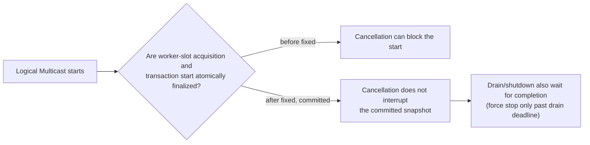

# Cancellation and Shutdown

[Execution topic table of contents](README.en.md) · [Spec table of contents](../README.en.md) · [Previous: 02. Handler Turn and Execution Gate](02-handler-turn-and-execution-gate.en.md) · [Next: 04. Application Job Queue and Backpressure](04-application-job-queue-and-backpressure.en.md)

> This document defines what cancellation can and cannot do to work already
> accepted, what wins when cancellation, timeout, shutdown, and acceptance
> race at the same time, and how a MeshNode cleans up in-flight operations
> when it transitions to `Relocating`/`Draining`. The point where a call
> completes and the structure that finalizes that completion are owned by
> [Submit and Completion](01-submit-and-completion.en.md); handler execution
> order and gate release are owned by
> [Handler Turn and Execution Gate](02-handler-turn-and-execution-gate.en.md).

## 1. Cooperative Cancellation

- Cancellation is a cooperative request.
- An already-completed result is not turned into a cancellation, and delivery
  of an already-accepted one-way message is not cancelled.
- [§3](#3-handling-the-cancellation-race) defines the cancellation ownership boundary between Framework queue waiting and binding operations.
- The per-language surface uses `.NET` `CancellationToken`, Java
  `CompletionStage.toCompletableFuture().cancel(false)`, Kotlin coroutine
  cancellation, and Node.js `AbortSignal`.
- For a stage returned by the Java Framework, `toCompletableFuture()` is tied
  to the cancellation and cleanup of the original pending admission.
- The C++ one-way `async()` terminal provides no separate public cancellation input.
- Not using a C++ task, or simply not holding onto a Java stage, does not by
  itself guarantee the operation was cancelled.

## 2. Pre-Cancelled Call

The rules for a call that arrives already pre-cancelled are:

- The call validates arguments, handles, and one-shot state first.
- `.NET`'s pre-cancelled `CancellationToken` and Node.js's already-aborted
  `AbortSignal` do not start runtime admission for an otherwise valid call —
  they complete with that language's cancelled awaitable.
- Java and Kotlin submit operations have no cancellation input.
- A valid, ordinary JVM call returns the stage to the caller only after its
  first non-blocking admission attempt, so a Java `cancel(false)` the caller
  runs after receiving the stage, or a Kotlin coroutine cancellation that
  awaits that stage, cannot cancel that first attempt.
- If the operation is pending, this cancellation races binding completion and
  clears queue and payload reservations.
- Therefore, the JVM path does not guarantee transport attempt 0 as a result
  of pre-cancellation.

| Language | Cancellation input | Can the first admission attempt be cancelled? |
|---|---|---|
| .NET | `CancellationToken` | A pre-cancelled token does not start runtime admission |
| Node.js | `AbortSignal` | An already-aborted signal completes immediately as a cancelled awaitable |
| Java | `CompletionStage.toCompletableFuture().cancel(false)` | No — the stage is returned only after the first non-blocking attempt, so that attempt cannot be cancelled |
| Kotlin | Coroutine cancellation of the linked stage | No — same reason as Java |
| C++ | No separate public cancellation input | Not applicable — not using the task does not guarantee cancellation |

## 3. Handling the Cancellation Race

- Cancellation is an exceptional completion.
- While a record waits in the Framework queue before Core submit, cancellation, timeout,
  shutdown, and admission race; only the one decided first determines the caller result and
  record handling. The race for this single completion slot is owned by
  [Submit and Completion "10. Operation Identity and Where Completion Happens"](01-submit-and-completion.en.md#10-operation-identity-and-where-completion-happens-implementation).
- **Caller-wait cancellation and late native-completion cleanup for binding operations follow
  [Binding async execution model §6](../../../../../../../bindings/doc/spec/async-execution-model.en.md#6-caller-wait-cancellation).**
  The binding owns native-operation lifetime and its registry, so the Framework does not redefine them.
  The Framework handles cancellation of its own queue waiting before handing work to the binding.
- Cancellation of [Logical Multicast](../00-foundation/02-glossary.en.md#logical-multicast) —
  delivering one message by ChannelName and topic to multiple
  [Spot](../00-foundation/02-glossary.en.md#spot) instances, each a logical instance with an
  address and state, in the same Channel — follows the bounded I/O executor submission and
  commit boundary in §4 below.

## 4. Logical Multicast Cancellation

The rules for Logical Multicast cancellation's bounded I/O executor
submission and commit boundary are as follows. The Framework service runtime
submits the publish operation to a [bounded I/O
executor](../00-foundation/04-interaction-model.en.md#5-spot-logical-multicast),
and that executor starts the publish transaction once it has secured a
worker slot.

- Cancellation can block the operation from starting only until worker-slot
  acquisition and the start of the publish transaction are atomically
  finalized together. After that, cancellation can no longer block it.
- Cancellation after the publish transaction has started does not interrupt
  the committed snapshot operation, and does not return per-target
  observation data or convert that data into publish-specific monitoring values.
- `.NET` `ValueTask` and Node.js `Promise` do not change their completion
  because of a cancellation signal after commit.
- `cancel(false)` on a Java stage, and the linked stage cancellation in
  Kotlin, both return `false` and do not cancel the underlying operation.
- In Kotlin, an already-cancelled caller coroutine keeps its cancelled state,
  but the shared `CompletionStage` and the runtime operation evidence still
  record a final normal completion and monitoring event. This is not
  operation cancellation.
- Drain/shutdown also wait for started transactions to complete, and follow
  the whole runtime's bounded force-stop rule only once the host drain
  deadline is exceeded.

## 5. MeshNode Relocation and Drain

A [MeshNode](../00-foundation/02-glossary.en.md#meshnode) is a runtime node that sends and receives
messages in a RouteMesh. [Host relocation §14](../05-location-relocation/05-host-relocation-flow.en.md#14-the-race-between-shutdown-and-relocate)
owns new-work admission and draining accepted work. Distinguish a Relocate unit seal from the
Shutdown host seal; feature-specific selection, placement, and routing reference
[§15 of that document](../05-location-relocation/05-host-relocation-flow.en.md#15-admission-per-state).

Pending activation produces exactly one terminal completion for the request
and drops the one-way payload at whichever boundary is reached first between
the [drain deadline](../00-foundation/02-glossary.en.md#drain-deadline) and the Framework
activation deadline.

Even if cancellation, timeout, shutdown, and the
activation barrier opening all race, the pending operation and payload
reservation are cleaned up exactly once.

## 6. Verification Requirements

Verify the following using only the public surface — each language's
cancellation input, the returned completion result/error kind, the Logical
Multicast public terminal, and the placement/routing results in which a
MeshNode state transition is observed. Each item leads to one test.

**Cooperative cancellation**

- Requesting cancellation on an already-completed call does not change the
  completion result.
- An already-accepted one-way message is still delivered after a
  cancellation request.
- A call made with a pre-cancelled `.NET` `CancellationToken`, or an
  already-aborted Node.js `AbortSignal`, does not start runtime admission and
  completes with a cancelled awaitable.
- On the JVM, calling `cancel(false)` after the stage is returned does not
  cancel the first admission attempt that already started.

**Handling the race**

- While the Framework queue owns a record, even if cancellation, timeout,
  shutdown, and admission happen at the same time, the caller observes exactly
  one terminal result; if cancellation wins, Core submit does not start.
Binding-operation cancellation observations reference
[Binding async execution model §7](../../../../../../../bindings/doc/spec/async-execution-model.en.md#7-implementation-and-contract-test-verification-requirements).

**Logical Multicast cancellation**

- Cancellation before the publish transaction commits can block the
  operation from starting.
- After the transaction commits, none of `.NET`, Node.js, Java, or Kotlin
  changes its completion because of a cancellation signal, and none exposes
  a per-target individual result as a public value.

**Relocation and drain**

MeshNode selection, placement, and drain observations reference
[Host relocation verification requirements](../05-location-relocation/05-host-relocation-flow.en.md#17-implementation-and-contract-test-verification-requirements).

- Even if the drain deadline and the activation deadline race, a pending
  activation completes as a terminal exactly once.

---

[Execution topic table of contents](README.en.md) · [Spec table of contents](../README.en.md) · [Previous: 02. Handler Turn and Execution Gate](02-handler-turn-and-execution-gate.en.md) · [Next: 04. Application Job Queue and Backpressure](04-application-job-queue-and-backpressure.en.md)
