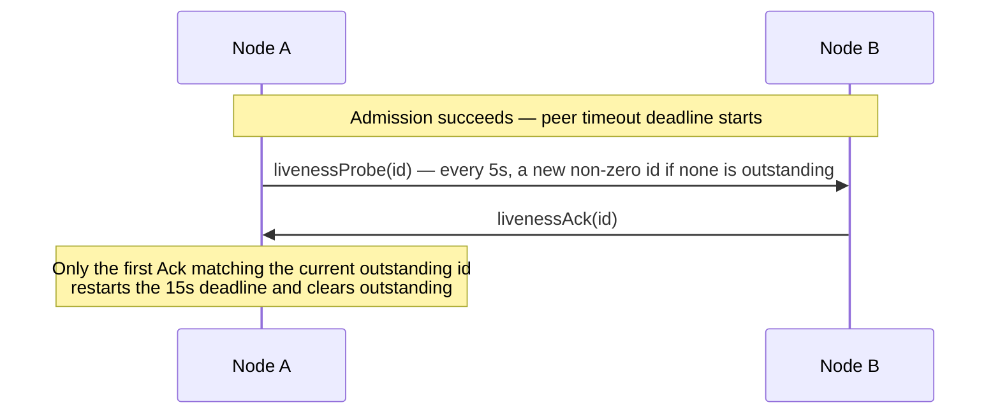

# Service Wire Protocol

[Channel·Transport topic table of contents](README.en.md) · [Spec table of contents](../README.en.md) · [Previous: 05. Transport Liveness](05-transport-liveness.en.md)

> **What this chapter answers** — the byte format and command list exchanged between nodes.
>
> **Contract owner** — `framework/runtime/protocol/service-wire-v1.schema.json` is the sole
> normative authority that fixes command IDs, frame layout, field relationships, and
> validation order. The byte layout other implementations depend on for interoperability
> (frame order, field order, size limits, enum values) is **contract description** in this
> chapter — when it diverges from the schema, this chapter is corrected to match the schema.
> The procedure that produces those bytes (which function reuses a buffer, when a codec is
> generated) is **implementation description** — it follows the schema when the schema
> changes. This chapter does not attach a separate decision/discretion label to every
> sentence, because every command and field rule is a contract the schema owns.
>
> **Related contracts** — [Layer Boundaries and Identifiers](../00-foundation/08-layering.en.md) ·
> [Location runtime](../05-location-relocation/01-location-runtime.en.md) ·
> [Redis Relocation Store](../05-location-relocation/03-relocation-store-redis.en.md) ·
> [Transport Liveness](05-transport-liveness.en.md) ·
> [Relocation Handoff State Transitions](../05-location-relocation/04-relocation-flow.en.md)

| Section | Covers |
|---|---|
| [1. Schema And Generation Boundary](#1-schema-and-generation-boundary) | Normative generated-codec authority, format ownership by layer, schema conventions, validator, and Location Store authority keys |
| [2. Record Framing And Decode](#2-record-framing-and-decode) | Multipart frame layout, decode validation, payload size limits |
| [3. Command Space](#3-command-space) | The list of 53 commands and their roles, Message Follow and session-replacement notifications |
| [4. Admission And Connection Fence](#4-admission-and-connection-fence) | The hello/admit/reject procedure, DescriptorRevision ordering, ClientServer direction |
| [5. Service Liveness](#5-service-liveness) | The livenessProbe/Ack cycle, the Classic fanout beacon, subscriber-ready determination |
| [6. Typed Application Message JSON](#6-typed-application-message-json) | The `framework-json-v1` profile rules |
| [7. Durable Authority And Explicit Creation](#7-durable-authority-and-explicit-creation) | Generation separation, the creation record, factory failure handling |
| [8. Instance Spot Cold Activation Recovery](#8-instance-spot-cold-activation-recovery) | The Missing+Instance intent envelope, first-activation recovery on the same target, User Spot terminal service operations |
| [9. Maintenance Capture And Relocation Envelope](#9-maintenance-capture-and-relocation-envelope) | The Retiring seal, the byte reservation gate, relocation envelope encoding |
| [10. Relocation, Actor Membership, And Ready](#10-relocation-actor-membership-and-ready) | The authority phase state machine, aggregate relocation commit, the moment of Ready |
| [11. Request Terminal Identity](#11-request-terminal-identity) | OperationId/ReplyRouteId, terminal completion tracking, root replacement |
| [12. Verification Requirements](#12-verification-requirements) | The observable results confirmed by the schema self-test, generated codecs, and golden fixtures |

> §7-§11 cover durable authority, cold activation recovery, the relocation manifest/CAS,
> membership and Ready, and terminal identity. Because this content directly overlaps the
> 05-location-relocation and 03-spot-actor topics, whether to relocate it is decided again
> when those topics are rewritten. This chapter performs only sentence-level cleanup and
> does not move any section.

## 1. Schema and Generation Boundary

### Normative Generation Authority

`framework/runtime/protocol/service-wire-v1.schema.json` is the sole normative
wire authority for the Framework service wire. It fixes command IDs, frame and
logical-stream layout, enum values, field bounds, durable formats, and semantic
constraints. Each C++/.NET/JVM/Node.js codec and constant surface MUST be
generated from that schema. Until W-2 completes the generated swap for a
surface, its existing handwritten codec remains the transitional implementation;
new or changed wire surfaces MUST go through generation and MUST NOT add a new
handwritten encode/decode path.

Consequently, a wire divergence is possible only through a reviewed schema
change. A runtime must not fork a layout, add a local compatibility encoding, or
reinterpret a schema field in source. The schema self-test, generated-asset
check, decoder-fixture check, and the schema's golden fixtures are the
cross-language conformance mechanism: every generated codec, and every
transitional handwritten codec until its swap, must accept and produce the same
declared bytes and failures.

### Normative Format by Layer

| Layer | Normative format | Owner and interpretation |
|---|---|---|
| Location Store records | Canonical JSON envelope | [Location runtime §2.4](../05-location-relocation/01-location-runtime.en.md) defines the JSON record's byte layout precisely; the provider treats it as opaque bytes. |
| ClientServer application records | JSON `0xF2` channel envelope | The one-directional service boundary where a Client starts a send/request and a Server runs the handler and reply, the [ClientServer Channel](../00-foundation/02-glossary.en.md#clientserver-channel) ([details](03-client-server-channel.en.md)), owns this envelope's application-record contract and its JSON semantics. |
| Internal mesh commands and relocation direct-transfer stream | `service-wire-v1.schema.json` binary formats | Generated codecs own command frames; `relocation-envelope-v1` is its big-endian logical stream. |
| Application payload bytes | Opaque, application-owned bytes | The Framework validates only the declared envelope boundary and does not assign business meaning to the bytes. |

### Machine-Readable Schema Conventions

The generator input is the existing schema, not a model inferred separately
for each language. Its
`types` array declares named layouts: primitives and enums use `encoding` and
`values`; ordered fixed fields use `kind: "struct"` with declaration-order
`fields`; counted sequences use `kind: "vector"` with `countType` and `item`;
and length-delimited, conditional, and tagged layouts declare their own
`lengthType`, `layout`, `cases`, `fields`, or `encodingOrder`. `$ref` names a
declared type, `$bound` names a declared limit, and `constraints`,
`trailingBytes`, `when`, and `otherwise` state validation required of both
encoders and decoders. Command bodies are declaration-order `body` arrays under
`commands`; durable envelopes are under `durableFormats`; the relocation direct
stream is declared by `relocationLogicalStreamFormat`.

The schema does not yet give every existing layout a uniform generator-ready
lowering rule or per-language output mapping. W-2 must fill those missing
generator-input details, including complete lowering coverage for every layout
kind, conditional/semantic constraint handling, and the generated asset and
fixture mapping. It must extend the schema rather than introduce private syntax
or handwritten codec exceptions.

### Validator

Generators and fixture builders run the validator before producing a file.

```bash
node framework/runtime/protocol/validate-service-wire-schema.mjs \
  --self-test framework/runtime/protocol/service-wire-v1.schema.json
```

The wire major is `1` and the required capability is `framework-service-v13`.
The build stops if the schema and golden fixtures diverge, or if the
validator finds an undefined type, a duplicate ID, or an invalid
enum/bound/conditional field.

### Location Store Authority Key Format

The store that records which node an object currently lives on is called the
[Location Store](../00-foundation/02-glossary.en.md#location-store). The rule for
building the authority key for an Actor and for a
[Spot](../00-foundation/02-glossary.en.md#spot) — a logical instance with an address and
state that stays reachable by the same global ID even if its running node changes — is
fixed by the same schema and golden fixtures.

| Object | Key format |
|---|---|
| Actor | `zla1:a:<byte-length>:<encoded-ActorId>` |
| [Spot](../00-foundation/02-glossary.en.md#spot) | `zla1:s:<byte-length>:<encoded-SpotRid>` |

- MeshName is not part of the key — it is stored only as the authority payload's current placement attribute.
- Percent encoding leaves RFC 3986 unreserved bytes as-is and represents everything else as uppercase hex.

## 2. Record Framing and Decode

### Frame Layout

A ROUTER routing identity is the transport envelope the raw binding
consumes; the service codec does not copy it into the application frame. A
service record is a multipart message in the following order — this order and
each frame's byte layout is contract description that other implementations
depend on verbatim for interoperability, and the procedure that produces those
bytes is implementation description owned by the codec generated from the
schema.

```text
frame 0                     frame 1              next frame
+------------------------+  +----------------+  +------------------------+
| head prefix (5 bytes)  |  | metadata       |  | typed payload envelope |
| + command body         |  | when flag 0x01 |  | when command allows it |
+------------------------+  +----------------+  +------------------------+
       always present           set by flag          set by command
```

The first 5 bytes of frame 0 are the same for every record.

```text
byte    0      1      2         3          4
     +------+------+---------+----------+---------+
     | 0x5A | 0x4D |    1    | command  |  flags  |
     |  'Z' |  'M' |  major  |    ID    | bit set |
     +------+------+---------+----------+---------+
      \___ magic ___/       one byte each
```

The layout of the command body that follows is the declaration order of
`commands[].body` in the schema. Every integer longer than one byte is
big-endian.

Flags determine which additional data follows.

| Bit | Name | When set | When clear |
|---|---|---|---|
| `0x01` | `metadata` | Frame 1 **must be present** as a metadata frame. | A metadata frame is rejected. |
| `0x02` | `boundSession` | A bound-session tail follows the command body. | It does not follow. |
| `0x04` | `sourceSpotId` | A source Spot RID follows in the same tail. | It does not follow. |
| `0x08` | `extension` | An extension follows the command body. | It does not follow. |

These flags can be used only on commands that the schema permits or requires.
An undefined flag, an unexpected frame count, a conditional tail, or a
trailing byte is rejected as a protocol error before application dispatch.

### Decode Validation and Size Limits

- The decoder checks the complete record length, item count, UTF-8 validity, and every bound before allocating.
- A metadata frame cannot exceed 1,024 bytes.
- The application payload's absolute schema limit is `applicationPayloadAbsoluteBytes`, 4,294,966,774 bytes.
- On a [RouteMesh](../00-foundation/02-glossary.en.md#routemesh) — the connection group where
  several runtime nodes find each other by name and exchange messages — ServerServer applies
  only the absolute schema and wire representation bounds; it has no Framework-level
  message-size cap.
- On ClientServer, the actual allowed payload size is whichever is smaller: that absolute limit, or `normalizedEffectiveMaxMessageBytes` minus the real envelope overhead.
- No separate, hidden 16 MiB cap applies to the application payload.

The ClientServer complete-message limit is fixed at startup admission.

- The sender uses the smaller of the local and remote `normalizedEffectiveMaxMessageBytes`, and the receiver uses its own admitted limit.
- This value cannot change during the admitted connection's lifetime, and is applied before allocation.
- If both sides' limits are 32 MiB, a 17 MiB payload is allowed, since the complete message stays within 32 MiB.
- RouteMesh admission doesn't carry this field, and an SS sender or receiver doesn't reject a message because of this value. HWM, mailbox byte budgets, and protocol representation bounds remain separate resource and wire guards.

### Typed Payload Envelope

A typed payload preserves the packet name, contract information, and
serializer payload together in one envelope. Application code is never
exposed to raw frame assembly, codec tables, or maintenance fields.

### Framework Multipart Application Profile

Service messaging commands that carry several Framework message parts as a
single application payload use a common profile for the outer application
envelope. This envelope's packet name is fixed as `ZLinkFrameworkMultipart`
and its content type as `application/x-zlink-multipart`. The actual
application message's bytes are preserved verbatim by part order inside the
envelope's payload. Parts are opaque bytes; this profile does not carry a
per-part packet name or content type on the wire.

Operations where the command itself defines a separate
application-payload envelope, such as Actor creation, are not subject to
this profile — that operation's own contract governs its packet name and
content type.

The payload's byte layout is as follows.

```text
+-------------+  +---------------+------------------+  +---------------+-----+
| part count  |  | part 0 length | part 0 bytes     |  | part 1 length | ... |
| u32 (>= 1)  |  | u32           | opaque for length|  | u32           |     |
+-------------+  +---------------+------------------+  +---------------+-----+
                  \____________ repeated part count times ______________/
```

The part count must be at least 1. Before building the result list, the
decoder confirms the count is representable by the remaining bytes, and
that each length does not exceed the remaining range. It rejects the
record if any bytes remain after all parts are read. The Framework does
not interpret a part's contents for business meaning — it restores the
original bytes into each Message as-is.

The Framework does not recompute this profile's count, lengths, outer
envelope, content-type frame, or Framework metadata as a separate
application byte HWM. Core's byte charge ends when the complete message is
dequeued into the binding/Framework, and the decoded payload follows ordinary
Framework ownership rules. The Framework acquires an application job queue permit
before receive/claim, limiting handler admission by job count.

## 3. Command Space

Wire v1 uses the following IDs. `7..15`, `32`, `35`, `41`, `45`, and `54..255` are
reserved and never reused for another meaning. A previous command name in parentheses
is diagnostic compatibility text, not a command that is decoded or sent.

| ID | Command | Layer | Application payload | Permitted flags | Role |
|---:|---|---|---|---|---|
| 1 | `hello` | infrastructure | none | — | Proposes this connection be accepted by offering its own descriptor |
| 2 | `admit` | infrastructure | none | — | Approves the selected connection |
| 3 | `reject` | infrastructure | none | — | Rejects admission |
| 4 | `update` | infrastructure | none | — | Updates the admitted descriptor revision |
| 5 | `livenessProbe` | infrastructure | none | — | Confirms the current connection's round trip |
| 6 | `livenessAck` | infrastructure | none | — | Responds to the same probe ID |
| 16 | `nodeSend` | application | required | `metadata` | Node one-way |
| 17 | `nodeRequest` | application | required | `metadata` | Node request |
| 18 | `channelSend` | application | required | `metadata` | Channel one-way (RouteMesh connections only) |
| 19 | `channelRequest` | application | required | `metadata` | Channel request (RouteMesh connections only) |
| 20 | `reply` | infrastructure | optional | — | Request terminal result (RouteMesh connections only) |
| 21 | `spotSend` | application | required | `metadata` | Spot one-way |
| 22 | `spotRequest` | application | required | `metadata` | Spot request |
| 23 | `logicalMulticast` | application | required | `metadata` | Logical multicast |
| 24 | `actorSend` | application | required | `metadata` · `boundSession` · `sourceSpotId` | Actor one-way |
| 25 | `actorRequest` | application | required | `metadata` · `boundSession` · `sourceSpotId` | Actor request |
| 26 | `actorLookup` | infrastructure | none | — | Actor route lookup |
| 27 | `actorDestroy` | infrastructure | none | — | Actor destroy coordination |
| 28 | `actorJoin` | infrastructure | optional | — | [Actor membership](../00-foundation/02-glossary.en.md#actor-membership) proposal — which Spot the Actor belongs to |
| 29 | `actorLeft` | infrastructure | none | — | Actor leave commit |
| 30 | `relocationReady` | infrastructure | none | — | Temporary queue, Restore, and relay-reception-ready reply |
| 31 | `relocationData` | infrastructure | none | — | Post-capture ingress-hold relay record transfer |
| 32 | reserved (`relocationAck`) | — | — | — | Removed per-message ACK/numeric-high-water command |
| 33 | `replyRelay` | infrastructure | optional | — | Terminal completion relay |
| 34 | `relocationCutover` | infrastructure | none | — | One-way control reporting all pre-boundary relay sent |
| 35 | reserved (`relocationComplete`) | — | — | — | Removed target-completion-reply command |
| 36 | `boundSessionSend` | application | required | — | Bound egress on a [STREAM session](../00-foundation/02-glossary.en.md#stream-session) — the server execution unit kept from accepting one STREAM client connection until it closes |
| 37 | `actorJoined` | infrastructure | none | — | Actor join commit |
| 38 | `boundSessionBind` | infrastructure | none | — | Session binding commit |
| 39 | `instanceSpot` | application | required | `metadata` | Logical Instance Spot operation |
| 40 | `relocationPrepare` | infrastructure | none | — | Request to install temporary queue, declare the final-stage (and optional base-stage) payload manifest, and prepare relay |
| 41 | reserved (`relocationReserved`) | — | — | — | Removed relocation-specific capacity-reservation ACK |
| 42 | `sessionRelocationSeal` | infrastructure | none | — | Session ingress seal request |
| 43 | `sessionRelocationSealed` | infrastructure | none | — | Session seal response |
| 44 | `sessionRelocationRoute` | infrastructure | none | — | One-way Session-route update control for target route switch or source abort before relay-ready is accepted |
| 45 | reserved (`sessionRelocationRouted`) | — | — | — | Removed Session-route application response command |
| 46 | `replyRelayAck` | infrastructure | none | — | Relayed terminal result ACK |
| 47 | `userSpotCreate` | infrastructure | none | — | Creates a remote User Spot in an already-reserved slot |
| 48 | `userSpotClose` | infrastructure | none | — | Closes only the specified generation's remote User Spot |
| 49 | `actorCreate` | infrastructure | none | — | Creates a remote Actor in an already-reserved slot |
| 50 | `messageFollow` | infrastructure | none | — | The location-cache invalidation notice sent to the source runtime after a successful relay |
| 51 | `boundSessionReplaced` | infrastructure | none | — | Notifies the previous session after the new binding becomes current |
| 52 | `relocationState` | infrastructure | none | — | Direct source-memory-to-target payload chunk transfer (base/final stage) |
| 53 | `relocationFailed` | infrastructure | none | — | Explicit reply to a matching `relocationPrepare` reporting assembly or preparation failure |

The table's Layer, Application payload, and Permitted flags columns reproduce
the schema declarations. **Only application-layer commands enter an
application handler.** Infrastructure commands are exchanged by runtime
components and never enter the application queue. An unknown command, an
infrastructure command going the wrong direction, or a command the current
topology does not allow is likewise never placed on that queue.

Each command's body and direction follow the schema's closed definition.

### 3.1 Message Follow Notification

#### Body Layout

`messageFollow` is an infrastructure record that does not wait for a
response. It allows neither flags nor an application payload — a single
service record carries a body closed by version `1` and its length. The
body carries the source route, the target route, the hop count, the queue
count/bytes at relay time, the original operation ID, and the original
reply route ID. The two queue values are saturating `u32` diagnostic
snapshots. `UINT32_MAX` means the actual count or queued byte size is at
least that value; the snapshot never controls payload admission.

#### Route Validation

- The source and target routes must share the same object kind and object identity.
- Each route carries the object generation, the target node RID and generation, the authority owner generation, and the owner lease generation; the receiver first confirms the source route's target node is a currently admitted peer.
- Only a hop count of 1..8 is allowed. One control envelope is at most 16 MiB. This
  envelope bound and the saturating diagnostic fields do not impose a message-count or
  stored-byte bound on the retained payload queue.
- A record that points at a different object, or whose route fence doesn't match, ends as a protocol error before application dispatch.

#### Suppressing Duplicate Notifications

A runtime that completed a relay may send `messageFollow` to the source runtime. The source
runtime invalidates its current cache entry only when it points at the same route fence
as the source route. It does not erase a newer route. Even if the notification is lost, the
cache lifetime must eventually expire the stale route.

The sender's dedicated suppression registry uses the complete source and target route fences
as its key. Its state moves through `idle → inFlight → sentUntilExpiry`, and only a send
failure returns it from `inFlight` to `idle`. Route-cache expiry or replacement also removes
the marker. The registry does not own the original operation's payload, reply route, or
terminal completion. [45. Target Selection and Route Cache](../03-spot-actor/08-routing.en.md#2-how-to-send-to-a-spotactor-by-global-id)
shows the state flow.

### 3.2 Bound Session Replacement Notification

`boundSessionReplaced` is a one-way infrastructure record sent to the previous session owner after
the new Actor binding becomes current. It carries an Actor-authority source fence and the previous
session owner's lifecycle and binding identity, and uses no flags, application payload, or
acknowledgment. The receiver verifies that the sending node matches the Actor-authority target and
uses the previous session-owner identity as the local target fence. Delivery and the previous owner's
callback or connection close neither delay nor roll back the new bind terminal. The previous owner
applies only a record matching the retired identity. When the previous session is closed
(`100 ms` after the callback terminal) is owned by
[Session and Actor binding §14](../04-session/02-session-actor-binding.en.md).

## 4. Admission and Connection Fence

### Admission Procedure

- RouteMesh and ClientServer approve the current physical connection as a service route via `hello → admit|reject`.
- A manually configured lifecycle token is a non-zero opaque equality token generated by a [CSPRNG](../00-foundation/02-glossary.en.md#csprng), a generator of cryptographically unpredictable random values.
- New values are not judged by numeric magnitude — a previous token is blocked instead by the current physical connection's handover and liveness.
- For a peer whose owner is recorded in the store, the runtime also checks whether that host is still the owner and whether its lease is still valid.

### DescriptorRevision Ordering

- Only `DescriptorRevision` has strictly increasing ordering within the same lifecycle.
- Identical bytes at the same revision are idempotent; different bytes at the same revision, or a lower revision, are a protocol error.
- `update` can only change the existing channel weight, runtime state, placement capacity, and maintenance wave.
- RID, topology, security identity, capability, application version, and the normalized message limit only change by re-admitting the connection.

### Physical Connection Replacement

Admission of a [Descriptor](../00-foundation/02-glossary.en.md#descriptor) — the registration
information a remote runtime publishes so its endpoint, identity, membership, weight, and
status can be discovered — and physical transport replacement use the same fence.
Once descriptor expectations are complete, an endpoint-only manual intent with
generation 0 cannot overwrite them. The runtime requests
termination of the current physical connection at the endpoint level, and does
not create a new connection for the same endpoint before observing that
endpoint's close snapshot or disconnect event. A successful call does not
replace observation of the physical close. The `connection_id` of a monitor
event is for diagnostics and correlation only and is never used as a fence. A
late event from the previous connection is fenced by the descriptor's RID,
security identity, and lifecycle generation together with the observation
order, and cannot change admission or ready state
of the new connection.

### ClientServer Direction

- A ClientServer connection fixes a single application-attached channel name, the [ChannelName](../00-foundation/02-glossary.en.md#channelname), and a client-to-server direction.
- The only service-wire records on a ClientServer connection are the infrastructure commands: the client starts `hello` as a Core request and sends/answers the liveness pair; the server answers `admit`/`reject` only on that hello request's reply leg and pushes `update` and liveness.
- Application records on a ClientServer connection do not use service-wire commands. They ride the channel envelope — the two-frame record `[JSON header (formatMarker 0xF2; kind request/response/command/error), payload]` all four runtimes share for channel messaging. A request rides the Core request envelope and its response/error rides the matching reply leg; a one-way command is a plain send. `channelSend`(18)/`channelRequest`(19) and the command 20 reply travel only on RouteMesh connections.
- Reusing a [RouteMesh](../00-foundation/02-glossary.en.md#routemesh) record — where multiple nodes find each other by name — for a ClientServer connection, or the reverse, is a protocol error.

## 5. Service Liveness

### The Probe/Ack Cycle



- **The timing and judgment rules — the 5-second probe period, the 15-second deadline, one
  outstanding ID resent as is, only the first ACK for the current ID refreshing the deadline, the
  immediate not-ready conditions — are owned by
  [Transport liveness §3 and §10](05-transport-liveness.en.md#3-routemesh-and-clientserver).** This
  section defines only the command schema and the connection epoch those records ride.
- The probe, ACK, and timer are handled by the infrastructure reserve and are not delivered to the application queue or a handler.
- **Both admitted peers probe.** The 5-second probe obligation is bidirectional and begins the moment a connection is admitted, independent of which side dialed. A node that only answers a peer's probe with an ACK but never originates its own probe is non-conforming: the other side would judge it live while it never confirms the reverse direction. The diagram shows one direction for brevity; each admitted peer runs the full probe/ACK cycle toward the other.
- **Probe and ACK ride the admitted physical connection's current epoch, and that epoch is stable for the connection's lifetime.** A `livenessProbe` and its `livenessAck` are addressed to the peer identity and connection generation that admission established (`scope: admitted-physical-connection-lifetime`). A redundant re-dial or a repeated `hello`/`admit` for a peer that is already admitted on a live physical connection is idempotent: it neither supersedes the admitted connection nor rotates its connection generation. Emitting a probe or ACK stamped with a superseded or not-yet-delivered generation — one the peer's live pipe does not recognize — is a defect; the peer silently drops it as "an ACK from a different connection," and neither side's deadline is refreshed. A new connection generation is minted only when a genuinely new physical connection replaces the admitted one (per the duplicate-connection selection in [13. Mesh Node](../03-spot-actor/03-mesh-node.en.md)), not on every inbound admission record for an already-admitted, unchanged descriptor.

### Classic Fanout Beacon

A one-way delivery style where the receiving side never responds is called
[Classic fanout](../00-foundation/02-glossary.en.md#classic-fanout). Since this kind
of publisher can't receive an ACK, it sends a separate beacon every 5
seconds. The beacon is sent periodically, independent of application
publish traffic.

```text
Topic:   01 5A 4C 46 31
Payload: 5A 46 01 01
```

### Determining Subscriber Readiness

- A subscriber uses a dedicated SUB socket per publisher.
- It becomes [Ready](../00-foundation/02-glossary.en.md#ready) — the state where transport
  connection, handshake, and identity checks have all finished so the target can accept a
  message — on the first valid application record, or a beacon from that publisher, and
  switches only that publisher to not-ready once 15 seconds pass since the last valid
  receive.
- An incorrect frame count or payload on the reserved topic is an immediate protocol error.
- If a derived public topic happens to exactly match the reserved topic, that is rejected as an application argument or configuration error, before transport.

## 6. Typed Application Message JSON

### `framework-json-v1` Profile Rules

The public encoding and validation rules for the `framework-json-v1` profile used by default
typed application messages are owned exclusively by
[Message Model §2.3](../00-foundation/05-message-model.en.md#5-the-framework-json-v1-typed-payload-profile). The runtime validates
the payload and converts it to a typed value under that profile. This document defines no second rule
set; parser choice, buffer reuse, and transport delivery of the original UTF-8 bytes remain internal
implementation details.

### Relocation Adapter State Is Outside the Profile

Application state returned by an Actor/Spot relocation adapter is not
subject to this profile. The Framework stores relocation state as opaque
bytes, and does not perform JSON parsing or compare a state contract ID or
an application-specific version.

## 7. Durable Authority and Explicit Creation

### Generation and Authority

- Store-backed authority keeps the provider-issued `StoreVersion`,
  [`ObjectGeneration`](../00-foundation/02-glossary.en.md#objectgeneration) — the number that
  distinguishes different logical incarnations of the same logical ID — and
  [`AuthorityOwnerGeneration`](../00-foundation/02-glossary.en.md#authority-owner-generation) — the
  number that marks the order in which the authority owner changed within the same
  incarnation — separate from the current host's `OwnerId` and
  [`OwnerLeaseGeneration`](../00-foundation/02-glossary.en.md#owner-lease-generation) — the
  provider-issued value that distinguishes the current owner's host process lifecycle.
- The object generation changes only when a new object is created under the same key after a delete.
- The current owner recorded by the store, and its standing, is called [Authority](../00-foundation/02-glossary.en.md#authority); the authority owner generation increases every time that object's owner changes, blocking changes from a stale owner.
- The host owner lease token is shared across the whole process.

### Creation Record

Actor and User Spot manager create, and target-owned Instance activation,
use a generic reservation to create the final object/owner generation and
a `Creating` row.

- A creation record preserves the object kind, global key, stable type, target descriptor, capacity delta, provider-issued fence, and the content reference/hash of a complete request envelope up to 1 MiB.
- This value, preserved in the pending current row, is called the `stored creation intent`. During recovery, this record can be scanned to confirm the fence value and receipt still match exactly, and used to restore state.
- The application code that actually creates the object is called the [Factory](../00-foundation/02-glossary.en.md#factory). Once Factory, initialize, and initial membership finish, the reservation commit and the `Ready` CAS run under the same fence.
- Only target-owned Instance cold activation additionally fixes the [durable activation inbox](../00-foundation/02-glossary.en.md#durable-activation-inbox)'s first record before commit.
- Manager `Find` and ID-only messaging use only `Ready`.
- Entry Spot is published after startup initialization, before the host becomes `Serving`, and is never created by a caller.

### Factory Failure Handling

- A Factory failure seals the local barrier as failed and terminal-processes the waiting request exactly once.
- A one-way operation records a drop event.
- The runtime deletes the row and reconciles an ambiguous result by reading, only if the StoreVersion, object/owner generation, and owner lease it read earlier are all still unchanged.
- The local registry stays failed until `Missing` is confirmed, and only then can a caller start a new `NewObject`.

### Object Role

The `Client` and `Server` object roles require a Location Store. The `None`
object role creates neither authority nor a hidden local runtime.

## 8. Instance Spot Cold Activation Recovery

The recovery scope and caller-visible result are defined by
[Failure Handling and Failover Scope §4.4](../05-location-relocation/06-failure-failover-policy.en.md#44-distinguishing-instance-spot-cold-activation-from-owner-failure).
This section describes only the wire-record, durable-root, and scan structure
that implements that scope.

Recovery in this section is not general owner-loss reactivation. It resumes an operation on the
same target node and lifecycle generation only when the first cold activation published Ready but
didn't finish recording that operation's terminal completion and removing the recovery pointer. A
steady `Ready` owner process termination or owner-lease expiry doesn't use this root, select another
node, or run a factory.

### Missing+Instance Intent Envelope

A normal Instance send/request carries only the global SpotRid and is not a
create command. The target of a Missing+
[Instance intent](../00-foundation/02-glossary.en.md#instance-intent) — the caller's
explicit choice allowing a new Instance Spot to be prepared when no target Spot exists —
stores a complete
`instance-activation-recovery-v1` envelope — one that preserves even
command 39's optional metadata presence/frame — in the
[Relocation Store](../00-foundation/02-glossary.en.md#relocation-store), the store that
holds the activation envelope an Instance Spot cold activation needs and the reply
payload completed after relocation,
and links the receipt to the Reserve. This format, and the durable
activation inbox, are used only for target-owned Instance cold activation,
never for Actor/User Spot generic create.

### Command 39 Route Kind

A command 39 route is a closed union of a first byte and a `u16` body
length.

| Kind | Purpose | Contents |
|---|---|---|
| `1` | Delivers to an existing [Ready](../00-foundation/02-glossary.en.md#ready) authority | The object/owner/lease generation and StoreVersion of a state that can accept new work |
| `2` | Missing cold activation only | The target Mesh/node RID/lifecycle, Spot RID, stable type, descriptor version, and deadline — an authority fence is forbidden |

If a kind `2` route's operation identity or metadata presence/bytes differ
from the ZLIA's target Mesh/stable type/descriptor version/deadline, it is
rejected as a protocol error before reservation.

### Target Host Scan and Recovery

- During the startup first scan and a rate-limited background scan, the target host resumes any Pending record it owns, or a Ready Instance activation recovery root that points to an incomplete first operation. The authority's target node RID and lifecycle generation must exactly match the current host.
- The scan and late control records converge on a single local barrier, keyed by object key, object/owner generation, and owner lease.

The recovery pointer is removed in the following order:

1. Finalize the durable inbox's first record before publishing `Ready`. The barrier blocks the handler.
2. Startup does not publish Serving before restoring the queue head.
3. Durably record the first handler's terminal completion and advance the replay cursor to the inbox sequence.
4. Only then remove the recovery pointer with Preserve CAS. **Queue admission alone does not remove it.**

### Cold Activation Recovery Failure Handling

- A [Cold activation](../00-foundation/02-glossary.en.md#cold-activation) — the process of
  creating and initializing a new Instance Spot when authority is Missing and the caller
  specified Instance intent — recovery failure seals the local barrier, terminal-processes
  the request exactly once, and records a one-way drop event.
- It is then deleted only when the fence value matches, and the deletion result is read back for reconciliation.
- If the process ends before the delete, the target scan can safely re-run the retry-safe factory.
- No new activation starts before `Missing` is confirmed.

### 8.1 User Spot Terminal Service Operation

#### Command 47 — Remote Create

- A User Spot remote create uses command 47.
- After a generic Reserve, the source sends a correlation/operation ID, the source node lifecycle, the global Spot RID/stable type, and the provider-issued reservation fence and deadline to a single specified target.
- The reservation fence preserves the expected StoreVersion, object/owner generation, target node lifecycle/owner lease, and pending capacity together.
- Since the target reads the immutable content of the Pending creation projection from the Location Store, command 47 carries no application payload or metadata.

#### Command 48 — Remote Close

- A User Spot remote close uses command 48.
- Besides the source node lifecycle and operation identity, it sends the `SpotRef` that exactly identifies the target to close, the target node lifecycle, the AuthorityOwnerGeneration, and the StoreVersion.
- Before deciding whether to accept, the target checks the current authority and [Actor membership](../00-foundation/02-glossary.en.md#actor-membership) and the relocation state.
- Both commands are RouteMesh infrastructure commands and allow neither flags nor a payload.

#### Reply Envelope

Both operations return their results in the command 20 reply envelope.

- The success tail for Create is the `Existing`/`Created`/`Rejected` discriminator plus the `SpotRef` that identifies the target; the success tail for Close is a single `closed` bool.
- Create's application reply is forbidden on `Existing`, and only optionally allowed on `Created` or `Rejected`.
- The source operation table guarantees terminal-once by source RID/lifecycle and operation ID.
- Neither Location row polling nor a control message built from an application packet substitutes for a reply.

## 9. Maintenance Capture and Relocation Envelope

### Actor Join Request Envelope

`actorJoin`(28) is sent as `[request]`, and its result returns only on the command 20
reply — this request's `[reply]` leg. `actorJoin`(28)'s request body — correlation, the actor route fence, the `entry` flag,
and the target spot route fence — is the complete cross-language contract for this
operation. No other field travels on the wire for it. In particular, per-transfer
bookkeeping identifiers a runtime uses internally to track an in-flight move (for
example, a transfer id) are language-internal only and never appear in this body; a
runtime that needs such an id generates and keeps it locally, not on the wire.
Sending or receiving command 28 as a one-way record instead of a request/reply pair is
outside this operation's contract; the receiver rejects it as a protocol error before
application dispatch, per the rules in
[2. Record Framing and Decode](#2-record-framing-and-decode).
Receiver-side admission semantics — parking behind an existing preparation and the
later-attempt-wins rule described in
[15. Spot and Actor Model §4.2](../03-spot-actor/05-spot-actor-membership.en.md#42-the-order-for-joining-an-actor-to-a-spot-on-a-different-node) —
key on the actor identity carried in this body, not on any language-internal id.

When the join-accepted reply carries an application reply, the target wraps it in the
[Framework multipart application profile](#framework-multipart-application-profile) on the
reply leg. There is exactly one part, and that part carries the bytes of the application
reply message the handler produced, verbatim. This profile does not carry a per-part
packet name or content type on the wire — the envelope's packet name and content type are
the profile's fixed values, and interpreting the part bytes belongs to the application
layer under the per-layer normative-format principle. When there is no application
reply, no multipart envelope is carried at all. The source unwraps this profile and
delivers the sole part as the application reply, without interpreting the part bytes as
another envelope. The only reply metadata the source exposes to the caller is the
profile's fixed outer content type, or none — it must not reconstruct another value, such
as the request's content type. Framing other than this profile — nesting the part in an
additional envelope, or exposing the still-wrapped inner bytes directly — is outside this
operation's contract.

#### Receiver Stable-Type Resolution

Because the `actorJoin`(28) body deliberately carries no Actor stable type, the receiver
resolves the factory type from the canonical Location Store, not from any wire field or a
prior local record. The Actor's Authority row is the single per-Actor source of truth (its
canonical key is `authority\0actor\0{ActorId}`; see
[21. Location Runtime §2.4](../05-location-relocation/01-location-runtime.en.md)) and already carries
`allocation.stableType`. On admission the receiver MUST read that row for the `ActorId` in
the body and accept the join only when the row exactly matches the actor route fence:

| Value read from the Authority row | Fence value compared | Condition |
|---|---|---|
| `allocation.state` | — | Must be `active`. |
| `allocation.objectKind` | — | Must be `actor`. |
| `objectGeneration` | `ObjectGeneration` | Equal. |
| owner node RID | target node RID | Equal. |
| descriptor lifecycle generation | node generation | Equal. |
| `authorityOwnerGeneration` | `expectedAuthorityOwnerGeneration` | Equal. |
| `ownerLeaseGeneration` | `expectedOwnerLeaseGeneration` | Equal. |

The join is not accepted if any of the seven rows differs.

The factory is then resolved from the row's `allocation.stableType` against the local
factory registry. This is the same Authority-derived stable-type verification the
relocation path already performs on `relocationState`(52) (which likewise omits the type
from its wire object); the 28 admission path extends it to the first target preparation
step rather than trusting a sender-supplied type. Every failure is a typed terminal on the
command 20 reply, never a silent drop: a missing or unreadable row is `Unavailable`
(Store unavailable) or `NotFound` (never created / already retired); any fence field that
does not match is a stale/mismatch protocol terminal; an unknown `stableType` (no local
factory) is a typed rejection. A generation compared here is a bounded generation and is
compared only for equality, never by numeric ordering (§12).

The lease value the source places in the fence's `expectedOwnerLeaseGeneration` is the
Actor's current Location owner lease, not a bound-Session token; an unbound Actor still
carries its owner lease, and a bound Session adds only the seal/route-update legs, so a
receiver MUST NOT require a bound Session to admit a canonical `actorJoin`(28).

### Session Seal and Source Relay

- Before stopping source application dispatch, the relocation coordinator seals a bound
  Session binding with command 42. Command 43 reports the seal result.
- The Session owner validates only current Session identity, binding generation,
  ActorId/ObjectGeneration, and relocation identity. It doesn't create a numeric
  high-water or re-read Actor authority.
- Requests and pushes arriving after the seal are held by the Session owner until route
  change or abort. No relocation-specific record-count or byte bound is added.
- Ordinary server messages arriving on the source object route keep being relayed to the
  target temporary queue. This uses ordering and retransmission of the same TCP
  connection, without a per-message ACK or durable journal.

### Relocation Manifest and Direct Chunk Transfer

- Source sends command 40, `relocationPrepare`, as `[request]` to request temporary-queue
  installation and declare the payload manifest for the transfer that follows. Its body
  carries the object identity, source node RID/generation, and `payloadTotalLength`,
  `payloadChunkCount`, and `payloadChecksumCrc32c` describing the payload. No
  relocation-root pointer or Relocation Store lookup key is
  carried; Prepare fully describes the direct transfer that follows, sourced from source
  memory. Target sends command 30, `relocationReady`, as `[reply]` only after
  temporary-queue installation is ready to receive. This pair negotiates no
  message/byte allowance or participant reservation beyond the declared manifest.
- Source sends the payload as one or more command 52, `relocationState`, `[send]` records
  on the same ordered connection. Each record carries the relocation/target-attempt/
  coordinator fence, the object identity, `senderRole`, and a zero-based `chunkOrdinal`. The
  chunk bytes reuse the existing `relocation-data-chunk-v1` format. Immediate assembly copy and storage lifetime follow
  [Relocation flow §4.3](../05-location-relocation/04-relocation-flow.en.md#43-restore-the-target-without-running-it).
- The target compares the assembled payload's length and CRC-32C against the value Prepare
  declared. A mismatch is an explicit failure; the target never attempts
  partial-assembly restore and never retries transparently on checksum mismatch. On
  failure the target sends command 53, `relocationFailed`, as a reply to the matching
  Prepare, after cleaning its own partial chunks and prepared resources. Only receipt of
  this explicit failure — never a dropped or indeterminate connection — causes the source
  to restore the captured payload from source memory and finish the operation as a
  failure; an indeterminate outcome is not reversible from the source's perspective.
- Command 31, `relocationData`, carries only post-capture ingress-hold application records
  on the same ordered connection. It never carries saved queue work or timers, which
  travel only in command 52 chunks. It contains no saved queue prefix or timers and
  creates no per-record ACK or numeric high-water.
- Source inserts command 34, `relocationCutover`, as `[send]` after the current
  ingress-hold relay prefix. Its body adds `boundaryRecordCount` and
  `boundaryChecksumCrc32c`, describing the precise relayed-record batch the boundary closes
  over. Target sends no response. Reserved IDs 32, 35, and 41 are neither sent nor
  accepted.
- If the source observes that a previously sent cutover did not reach the target
  (connection loss) and the source instance is still live, it opens a new connection and
  retransmits the full pending batch plus a fresh cutover — never only the tail — and the
  target replaces any partial staged batch wholesale rather than appending. The
  retransmission window equals `RelocationCutoverWaitTimeout` (default 1,000 ms,
  configurable). After the window elapses, the existing CAS fallback in the next
  subsection applies with only a Warning and a counter increment, and no further blind
  retry.
- The source stores application state, queue work not yet executed before relocation,
  and timer information for direct transfer. Native timer handles and callback
  continuations aren't encoded.
- The target registers a temporary queue, then runs factory and chunk assembly. It doesn't
  run application handlers until this work finishes.
- After relaying every message received before cutover, the source sends cutover as a
  `[send]` on the same ordered connection. It is the boundary proving that every earlier
  relay on that connection reached the target. It has no reply.
- Ordinary server-to-server `send` adds no relocation-specific application ACK. A
  `request` keeps its existing operation identity, correlation, deadline, and caller
  retry.

### CRC-32C Convention and Capability

- Every checksum listed in `relocationTransferChecksumProfile` (`payloadChecksumCrc32c`,
  `boundaryChecksumCrc32c`, and the chunk/manifest checksums used by
  the retained store paths below) uses the same CRC-32C (Castagnoli) convention:
  polynomial `0x1EDC6F41`, initial value `0xFFFFFFFF`, reflected input and output, XOR
  output `0xFFFFFFFF`, and `check("123456789") == 0xE3069283`.
- The wire major is `1` and the required capability is `framework-service-v13` — bumped
  from v12 for commands 52/53 and the Prepare/Cutover manifest fields, with all four
  runtimes bumped together.
- A target's effective inbound chunk-byte limit is negotiated in the admission-accept
  reply's `receiveChunkLimitBytes` field, or via host preflight where that reply is
  unavailable. Where no negotiation path exists (`JoinEntrySpot`), the effective limit is
  32 KiB — the general Compact data lower bound. This shape and its bounds are pinned by
  the `actor-join-reply-tail` golden fixture
  (`framework/runtime/protocol/golden/actor-join-reply-v1.json`), which all four runtimes
  (cpp, dotnet, java, node) decode identically. **All four runtimes** originate a canonical
  `actorJoin`(28) as `[request]` — wiring `receiveChunkLimitBytes` into the command 20
  reply, this request's `[reply]` leg — once the
  target's canonical capability is observed (an authority fence plus a peer admitted at
  that generation); when it is not, each runtime keeps its language-internal admission path
  (a transitional fallback). The receiver resolves the stable type from the Store Actor
  Authority row per §9, never from the wire. (An earlier revision stated C++ and .NET did
  not originate; now that the Store-backed canonical receiver exists in all four runtimes,
  origination is unified across all four.)

### Target CAS and Retained Store Roles

- After chunk assembly and temporary queue registration finish, receipt of cutover starts
  the target CAS of Location Store owner and membership from source to target. If cutover
  doesn't arrive within `RelocationCutoverWaitTimeout` (default 1,000 ms) after the
  Restore-ready reply, the target records a `cutover_timeout` Warning and starts the same
  CAS. Only the target performs this CAS.
- Neither the source nor the Session owner changes the Location Store based on a timeout,
  local mirror, or Session route result.
- The Relocation Store no longer holds the Actor/Spot relocation payload — the direct
  chunk transfer above is the single handoff path, and the two Stores never used a
  distributed transaction or 2PC for it. The Relocation Store's remaining
  responsibilities are the Instance Spot cold-activation envelope (§8) and the
  relocation-scoped pending-request terminal record; those two paths keep using the
  store's own `relocation-manifest-v1`/`relocation-root-pointer` formats and CAS
  discipline, unchanged by this section.
- If CAS fails, the target doesn't open its queue and retries the same CAS until the
  Restore operation's validity deadline (an absolute deadline on the target, unrelated to
  Relocation Store retention). After an indeterminate response, it first reads the Store
  to determine whether the target itself is already owner. A different valid owner or
  generation makes the relocation stale immediately.
- If the target owner isn't confirmed before that deadline expires, the target records
  a `location_update_failed` Error and removes the prepared Actor or Spot, temporary
  queue, and relocation state. It doesn't update the Session route. A late Store response
  cannot reactivate the terminal `RelocationId`.
- After successful CAS, the move isn't rolled back to the source.

## 10. Relocation, Actor Membership, and Ready

### `RelocationId`

`RelocationId` is a non-zero 128-bit value made by the runtime. It distinguishes
repeated control messages for the same relocation and isn't exposed to the application.

### Authority and Target-Only CAS

Before CAS, the source is owner. The target has only a prepared instance after Restore
while waiting for cutover or the 1,000 ms fallback, and doesn't run application messages. The target
becomes owner when the target-only CAS succeeds. The Actor or Spot's
`ObjectGeneration` stays the same while owner generation increases.

One Actor, a `PerActor` Spot authority, a `SpotWide` aggregate, and an Instance Spot
follow the same rule. When several owners and memberships must change together, the
target changes all or none in one conditional batch. Relocation adds no separate runtime
capacity gate for participant count, relay record count, or bytes. Existing Store
provider and transport frame/page size limits still apply.

### Post-Commit Queue and Ready

After CAS succeeds, the target opens queue and lifecycle in this order.

1. Put saved existing work and timers into the target execution queue.
2. Put work relayed before cutover behind it.
3. Add further work from the temporary queue and switch the dispatch route.
4. Finish required lifecycle callbacks and open application dispatch.
5. Send command 44 route update from the target runtime to the Session owner.

There's no global ordering promise between messages arriving over different TCP
connections. Only order accepted into the target queue is preserved. After the
[Owner](../00-foundation/02-glossary.en.md#owner) — the MeshNode that actually runs the Actor
or Spot and manages its application queue — changes, Message Follow sends messages
arriving at the old address to the target.

After the cutover submission reaches a success or failure terminal, the source
doesn't wait for a target completion response. Only an explicit target failure before relay-ready is
accepted aborts and restores source queue and Session seal. A later submit failure doesn't
restore source. A late or duplicate cutover only records a `late_cutover` Warning and doesn't mutate state
again. When the 1,000 ms fallback opens the queue, the contract doesn't guarantee that
late relay runs before new direct target messages.

### Session Route

- Session route is validated only against the Session owner's current Session and
  binding.
- Command 42 seals the current binding; command 43 returns only the seal-install
  result. Command 43 carries no Session-message sequence or high-water.
- Command 44 is sent by the target runtime for the session-route update and by the source coordinator for an abort
  before relay-ready is accepted. The route update carries relocation identity, current binding generation,
  ActorId/ObjectGeneration, and target route. The Session owner doesn't re-read the
  Location Store or Actor authority mirror.
- The Session owner changes the route and current `ActorRef` snapshot to the target,
  submits messages held during the seal to the target route, and releases the seal.
- Command 44 has no reply, and reserved command 45 is neither sent nor accepted.
- `SessionRelocationSealTimeout` defaults to 3,000 ms. If the matching command 44 doesn't
  arrive in time, the Session owner closes the physical Session and cleans binding,
  held-message, and seal state.
- A late command 44 or an identical duplicate after timeout only records a Warning and doesn't
  change route, seal, or authority again.
- If target explicitly fails before relay-ready is accepted, only the matching seal is
  released and held Session messages are submitted to the source route. A later failure,
  including cutover-submit failure, doesn't reopen source route.

Authenticated peer/node-generation/frame validation in the transport adapter, owner CAS
on the target, and binding-route validation on the Session owner each run once. Actor
join, host relocation, Message Follow, and callback paths don't repeat these decisions.

## 11. Request Terminal Identity

### `OperationId` and `ReplyRouteId`

- `OperationId` is a non-zero identity made of two `u64` words (`high`, `low`).
  `ReplyRouteId` is a separate non-zero `u64`. Both are unique within the source owner's
  lifecycle; wrapping or reusing either is a terminal runtime error.
- The operation ID is a deduplication identity and does not substitute for the reply route.
  Registries and durable records do not reduce `OperationId` to one word.
- Durable terminal identity is the combination of the unchanging `RelocationId`, the fence of the side that started the request, and the `OperationId`.

### Terminal Completion Tracking

- The target writes terminal completion and delivery state to a new immutable relocation root, then updates `TerminalCompletionCount` and `PendingRelayCount` together via an authority CAS.
- `replyRelay` uses the original reply route and the source lease fence that identifies that request.
- The source sends an authenticated `replyRelayAck` after accepting the terminal result, or after confirming it is already terminal.
- A closed physical connection is not evidence of terminal delivery.

### The `Completed` Condition

`Completed` is allowed only when the accepted request count equals the
terminal completion count and pending relay is 0. If the ACK cannot be
confirmed while the source lease is still valid, Retire ends as
`ForceStopped`, preserving the relocation root and reply bytes for the
retention period.

### Root Replacement

- Root replacement verifies a new immutable root's reference/checksum/inventory digest, then links it via an authority CAS.
- A conflict loser root is cleaned up as an orphan.
- Cleanup releases the reference from Location authority, then performs the Relocation Store delete.
- A published reference's permanent missing state, a checksum mismatch, or an inventory digest mismatch is a non-retriable `RelocationDataLost`, and does not roll back a committed owner/membership back to the source.

### `SendReady` Record and Binding Completion

The schema's Framework service-wire `SendReady` record kind `12` is service control. Core 0.13's
per-operation `send_completion` and the binding awaitable are a separate contract that reports
HWM-retry completion. Retiring the binding readiness callback does not remove the service-wire
record or its schema value.

## Wire Records and Shared Capacity

A wire command does not grant bypass; ordinary control and malformed records also use shared permits. [Receive and Dispatch Loop](../01-execution/04-application-job-queue-and-backpressure.en.md) owns pre-classification permits; [Payload Ownership](../01-execution/05-payload-ownership-and-codec.en.md) owns ordinary record-storage lifetime.

## 12. Verification Requirements

The schema self-test, the golden-fixture decode results of the generated codecs, and the
checked-in codec tables alone confirm the following.

**Schema and Codec**
- The generated output and the checked-in codec tables match the schema.
- Every runtime produces the same value and failure from the `framework-json-v1` golden fixture for typed application messages.

**Decode and Admission**
- A record with an incomplete length, item count, UTF-8 validity, enum/flag value, or topology direction is rejected as a protocol error before application dispatch and never reaches the application.
- An `update` with a lower `DescriptorRevision` within the same lifecycle, or with different bytes at the same revision, is rejected as a protocol error; resending the same revision with the same bytes leaves state unchanged (idempotent).
- Inbound traffic other than probe/ACK does not extend the probe round-trip deadline.

**Relocation Transfer and CAS**
- Connection-bound accepted work never ends up in a relocation envelope.
- A checksum mismatch on an assembled `relocationState` stage is an explicit failure — never a blind retry and never a partial-assembly restore.
- If the digest of the participant list the store knows about differs from the list recorded for the relocation, it ends as `RelocationDataLost`.
- Actor relocation commit changes the owner and the target Entry Spot membership atomically.
- Ready is never published before the owner commit, the restore/replay and timer restoration, the queue merge, and the dispatch switch have finished.
- Relocation adapter bytes are never interpreted as JSON or as a typed state contract.

**Terminal Completion**
- For the retained pending-request terminal record path (§11 Root Replacement), a crash before the `Captured` CAS is not treated as durable replay; writing and verifying the top-level record happens before the authority CAS, and the authority releasing that reference happens before the record is deleted.
- Pending relay is never completed by a physical disconnect alone, without a `replyRelayAck`.

---

[Channel·Transport topic table of contents](README.en.md) · [Spec table of contents](../README.en.md) · [Previous: 05. Transport Liveness](05-transport-liveness.en.md)
