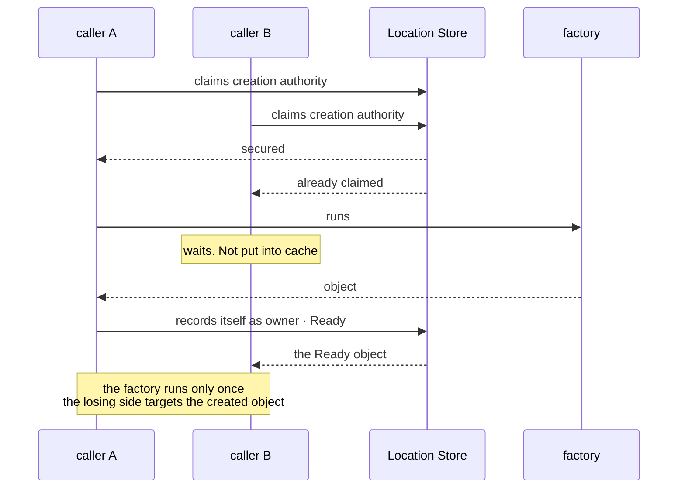
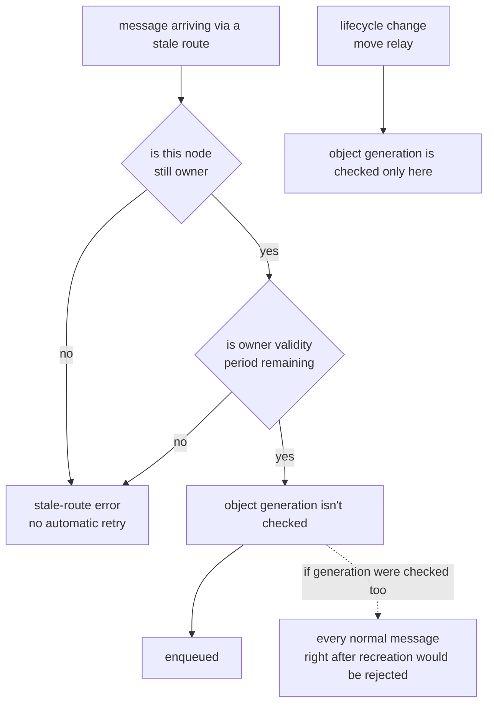

# 09. Object Kind and Activation

[Spot And Actor topic index](README.en.md) · [Spec table of contents](../README.en.md) · [Previous: 08. Spot/Actor Routing](08-routing.en.md) · [Next: 10. Spot Timer](10-spot-timer.en.md)

> [Spot model](01-spot-model.en.md) owns Spot kinds and shutdown reasons;
> [execution contract §2–§3](../01-execution/02-handler-turn-and-execution-gate.en.md#execution-gate) owns gates, turns, and Yield;
> [Spot/Actor routing](08-routing.en.md) owns generation usage;
> [Failure and failover policy](../05-location-relocation/06-failure-failover-policy.en.md) owns outcomes after owner failure.
> This chapter describes implementation structure satisfying those contracts and lifecycle-boundary violations.
> It adds or changes no application-observable behavior.

This chapter covers how, in code, the three kinds of [Spot](../00-foundation/02-glossary.en.md#spot) — the execution
unit holding Actors and handlers — are distinguished, when a missing object is built, and
how a message sent to a stale owner is filtered out.

## 1. Don't Distinguish Kind by a True/False Marker

Spot kind is a closed value set — `Invalid = 0`, `Entry = 1`, `User = 2`, `Instance = 3`
([Glossary](../00-foundation/02-glossary.en.md#spot-kind)). The three kinds behave differently.

| Kind | When it's created | Move |
|---|---|---|
| Entry Spot | One per node when the Object Server starts | **Never** |
| User Spot | When creation is explicitly requested | Yes |
| Instance Spot | When a call explicitly declaring intent to create first arrives | Yes |

`Yield` availability follows [execution contract §16](../01-execution/02-handler-turn-and-execution-gate.en.md#yield-call-eligibility).

**Represent the three kinds as separate types.** Attaching a marker like `entry_spot` or
`instance_spot` to one type means the type can't prevent a combination in which both are true at
once, and rules that differ per kind scatter into conditionals. Rules such as whether
return-wait is allowed are also decided at each kind's type boundary.

Defining three sibling types on a common base collects per-kind differences at the type
boundary.

**Per-language discretion — how to represent it.** Each language may use
inheritance, composition, or a tagged union. The criterion is "can an
impossible combination be constructed."

**Internal confirmation condition.** Representing the three kinds as separate types so
that a value where two kinds are true at once can't be constructed in code is a white-box
condition confirmed only by looking directly at the type definitions.

## 2. What "Entry Spot Doesn't Move" Means

The Entry Spot **instance** belongs to that Object Server's lifecycle, so it doesn't go
into the move-candidate list
([Spot Model 「4.2 Entry Spot's Actor Lifecycle」](01-spot-model.en.md#42-entry-spots-actor-lifecycle)).

A frequent mistake here is to overlook that **an Actor that was on the Entry Spot does move.**
What doesn't move is the Entry Spot itself. If "Actors belonging to an Entry Spot" are
excluded wholesale when picking move candidates, those Actors disappear when the node
goes down.

## 3. When to Build a Missing Object

**An ordinary message never builds a missing object.** Only a Spot-specific call that
explicitly declares intent to create can build a new one; an ordinary message and a lookup
call only target an already-ready object
([Spot/Actor Routing 「2.4 When There's No Object」](08-routing.en.md#24-when-theres-no-object)).

### Pass Spec States into the Activation State Machine

The public behavior is defined by
[Failure And Failover Policy §4.4](../05-location-relocation/06-failure-failover-policy.en.md#44-distinguishing-instance-spot-cold-activation-from-owner-failure).
The resolver converts its result into one of the closed internal states below. These states
include [`Ready`](../00-foundation/02-glossary.en.md#ready), which is reached once Spot
creation/initialization is complete and a record has been written to the
[Location Store](../00-foundation/02-glossary.en.md#location-store) — the store that lets multiple nodes
confirm each Spot's current owner and state together — so the Spot can accept application
messages. The
activation state machine passes that state to exactly one responsible component, so a
later stage doesn't infer the Store result again.

| Internal state | Fence preserved | Next component |
|---|---|---|
| `Missing` | Lookup version proving authority absence | Creation coordinator |
| `Creating` | Attempt and reservation fence | Waiter for the same attempt |
| `Ready` | Route and authority/owner-lease fences | Route admission |
| `Unavailable` | Authority and invalid-owner evidence | Terminal completion adapter |

`Unavailable` means authority remains but the current owner can't be used. It isn't the
same state as `Missing`, which means no authority exists. Only after an explicit `Close`,
`IdleEvicted` cleanup, or another formal lifecycle operation completes authority release
can the resolver produce a new `Missing` input.

Stored creation intent resumes only an incomplete first cold-activation operation on the
same target node and lifecycle. It isn't used for takeover or queue recovery after a
steady `Ready` owner failure.

Without this distinction, one typo builds an object. A message sent with a wrong ID would
create a new object for that ID, and no one would ever clean it up.

### When Multiple Attempt to Create at Once

If several callers try to build the same object at once, **only the caller that secures the
creation authority first** records itself as owner and creates it. The rest target the
already-created object. The factory runs exactly once.

**Don't cache the in-progress-creation state.** Since "being created" is a state about to
change, it isn't put into
[Spot/Actor Routing 「2.2 The Condition For Using A Recent Ready Route」](08-routing.en.md#22-the-condition-for-using-a-recent-ready-route)'s
positive route cache. Caching it would keep showing "being created" for the cache lifetime
even after creation finished.

### The Publication Order of the Ready Record and the Target Route

An Instance Spot requires one more step after `Ready` is recorded in the Location Store.
The target runtime must immediately reflect the same route in the local view used for
application-message admission. This local view is the `instance intent` projection. It
doesn't replace Store authority; it's a value that lets the process look up an
already-validated `Ready` route.

So the order is as follows.

1. The target node commits `Ready` authority to the Location Store.
2. In the same synchronous continuation in which the commit succeeds, the target runtime
   registers the `instance intent`.
3. After that, the activation continuation enqueues the first application message.

If step 2 is delayed, `Ready` exists in the Store while the target runtime has no route.
The first application message arriving during this gap can end in `NotFound` or a
stale-route error. A later continuation may register the same route again to recover an
omission, but that registration must also finish before the first admission. Registering
the same route more than once is handled idempotently so it doesn't create duplicate
execution.

If the losing side caches "being created," the last two lines of this diagram get delayed
by the cache lifetime.

### If Creation Fails Midway

If creation fails midway, the activation state machine must define who cleans up the
leftover record and when. Without that responsibility, a failed creation permanently
occupies that ID.

## 4. Filtering Out a Message Sent to a Stale Owner

Since owner info is cached, the owner the sender knows may have already changed. The
receiving side must filter this out.

**The filtering criterion is owner identity and validity period. Not object generation.**

[ObjectGeneration](../00-foundation/02-glossary.en.md#objectgeneration) is **not** a targeting condition
for an ordinary message
([Spot/Actor Routing 「2.6 Where ObjectGeneration Is Used And Where It's Not」](08-routing.en.md#26-where-objectgeneration-is-used-and-where-its-not)).
Also checking object generation as a condition for ordinary messages would reject every
normal message right after an object is recreated. Object generation is used to filter
lifecycle changes and move relay.

| Checked | What it filters |
|---|---|
| Owner identity | This node is no longer owner |
| Owner validity period | It's owner, but past the deadline |
| Object generation | Applies only to lifecycle change and move relay |

The left axis is the path an ordinary message goes through. The point where you'd want to
add a generation check at `G` is the pitfall, and the right-side `K` is the only path
where generation is checked.

**A filtered message ends in a stale-route error. The runtime doesn't automatically
retry.** Retrying would let the sender see success while the request may actually have executed
twice. The application can start a new call, and at that point the risk of duplicate
execution is judged by the application.

## 5. When to Clean Up an Active Object, and What Bounds It

### Idle Cleanup Targets Only Instance Spots

The runtime's internal object catalog is responsible for cleaning up idle-and-unused
state. The .NET mapping names this owner `ZLinkSpotNodeCatalog`. When
the configured `InstanceSpotIdleTimeout` is positive, the catalog periodically checks
candidates. Each check examines at most 64, and the last check position carries over to
the next cycle, so maintenance work doesn't monopolize application dispatch even with a
large number of Spots.

Candidates are limited to Instance Spots. An activation becomes a candidate only if it has
no Actor membership, isn't participating in relocation or Message Follow, and has no
application work pending. It's accepted as a candidate only after the timeout has elapsed
since the last application work finished.

Once a cleanup transaction starts, the catalog merges it with other close requests for the
same Spot ID. After reconfirming serial quiescence, it calls the closing callback with
reason `IdleEvicted`, disposes the activation, and releases the Spot location in the
Location Store. So no new work is accepted while the callback is running, and the location
isn't cleared before the callback finishes.

If an [Instance intent](../00-foundation/02-glossary.en.md#instance-intent) request — one carrying the
caller's explicit choice to let a new Instance Spot be built when the target Spot is missing —
uses the previous route while the location row is still
being released, the runtime may invalidate the route and re-read until the close
transaction finishes authority release, yielding `Missing`, or until a current `Ready` route is
confirmed. This isn't a retry that resends an already-accepted application request; it's
an owner-route refresh that confirms the result of explicit idle cleanup.

The resolver passes two different tags into the activation state machine: one for completed
idle-cleanup authority release and one for a change only in owner-availability evidence. The
creation coordinator receives only the former tag, while the latter is wired to the
terminal completion adapter. The rule against resubmitting an accepted request is defined
by [Failure And Failover Policy §2](../05-location-relocation/06-failure-failover-policy.en.md#2-common-judgment-criteria).

Language mappings may name the catalog differently, but each implements the same shutdown
conditions and verifies them with independent process evidence. A structural explanation
for one language mapping doesn't substitute for verification evidence from another.

### The Ceiling Applies to Local Activation, Not Just the Placement Stage

The active-object-count ceiling must be applied at **both placement selection and local
activation**. At placement selection, it excludes a node near the ceiling from candidates;
at local activation, it rejects new object creation. If reducing already-created objects
and new activation are treated as separate judgments, a request already pointing at that
node can bypass the ceiling.

**The ceiling is used at two points.**

| Point | What it does |
|---|---|
| Placement selection | Excludes a node near the ceiling from candidates for a new object |
| **Local activation** | If over the ceiling, **rejects activation at that node** |

Blocking only at the placement stage lets a request already pointing at that node, or an
object incoming via a move, simply pass through the ceiling.

### What the Cleanup Criterion Is

**The cleanup targets are Instance Spots only.** The formal spec added `IdleEvicted` as a
shutdown reason limited to Instance Spots ([Spot Model](01-spot-model.en.md)). The reason
User Spot isn't cleaned up is that **an ordinary message doesn't recreate a cleaned-up
User Spot**. Only a call explicitly declaring Instance intent can build a missing object
(§3). Entry Spot belongs to that Object Server's lifecycle, so it's never a target to
begin with (§2).

**The cleanup criterion must satisfy both "elapsed time since last activity" and "no work
currently in progress."** Looking at time alone would delete an object with a
long-waiting operation still on it.

**Framework doesn't preserve application state on cleanup.** State that needs to be kept
is saved by the application itself directly in the shutdown callback
([Spot Model 「6.2 Cleaning Up An Idle Instance Spot」](01-spot-model.en.md#62-cleaning-up-an-idle-instance-spot)).
For Framework to save state on the application's behalf, it would need to know what to
save, and that's the application's job.

## 6. Which Unit Memory Accounting Uses

Process-unit byte accounting and Spot-unit byte accounting are different accounting
units. Process-unit byte accounting bounds pending-receive payload in bytes, and
Spot-unit byte accounting bounds per-lane work count and bytes together. One side's number
isn't reused as the other side's ceiling.

Execution queues keep application and lifecycle work in separate FIFO lanes, each with
count and byte reservations. The application-lane defaults are 1,024 items and 64 MiB; the
lifecycle-lane defaults are 128 items and 4 MiB. Accepted application work reserves its
payload size plus a fixed retained cost of 256 bytes per work item. The reservation is
returned at handler terminal completion. The relocation hold has no relocation-specific
item-count or byte bound.

So the Spot queue can saturate first even when the process HWM isn't exhausted, and
conversely, process inbound admission can stop first even when the Spot queue isn't full.
The two results aren't merged into one `CapacityExceeded` situation — they're
distinguished by the queue whose admission actually failed.

### The Queue Bound Is Set by Accumulated Payload Size

**The execution queue's bound enforces both the count and byte axes, and applies
whichever is hit first.** The formal spec mandates both axes
([Framework API](../00-foundation/06-framework-api.en.md)).

A single axis can be circumvented via the other axis. Count alone lets a few large
payloads fill memory; bytes alone lets empty payloads pile up indefinitely without hitting
the bound.

**Byte accounting doesn't count only payload size.** It includes the envelope, metadata,
and queue node occupied by one pending work item. In a language where this can't be
calculated exactly, use a value with a fixed per-work cost added. Even when the payload is
empty, one work item isn't 0 bytes.

The queue bound exists for two reasons — deciding how much memory stays tied up, and
judging how much work is backed up. Count alone tells you neither.

The same count of 1,024 items is about 100 KB at 100 bytes each, and 1 GiB at 1 MiB each. Memory
differs by 10,000x while the bound triggers the same. The time to drain is the same story
— throughput tracks bytes per second more closely than items per second, so measuring the
backlog requires measuring in bytes.

A count bound is wrong in both directions.

| Situation | Result of a count bound |
|---|---|
| Small messages pile up | Rejects on hitting the bound despite memory headroom |
| Large messages pile up | Doesn't hit the bound while memory runs out |

Process-unit accounting is already in bytes (§6 first paragraph). Applying the same
standard at the Spot unit works, and because both layers use the same unit, the layer that
triggered the bound can also be distinguished.

**Do not use an unbounded execution queue.** Each lane must have both count and byte
reservations ([Framework API](../00-foundation/06-framework-api.en.md)).

The result of exceeding a bound varies by submission family and queue location, so an
implementation must not lump the results together. The [error model §5](../00-foundation/07-framework-error-model.en.md#bounded-queue-failure) owns error selection for Request queues.

Two cases outside the Request queue classification above each result in `CapacityExceeded` — the worker
scheduler queue and batch capacity. The latter is an admission judgment, not queue
saturation.

The relocation hold has no relocation-specific count or byte bound. An
execution-lane reservation for already owned work and transport, deadline, and cancellation
limits aren't reused as a separate relocation-hold ceiling. This is a rule the
formal spec specifies, so it is followed as written
([Complete Host Relocation Flow 「9. Moving Pending Messages, Timers, And Sessions」](../05-location-relocation/05-host-relocation-flow.en.md#12-moving-pending-messages-timers-and-sessions)).

## 7. Boundary with Other Topics

Per-object bounded queues are for order guarantees and owner isolation, and don't replace
the host-shared queue. Permit and fairness are owned by
[Receive And Dispatch Loop](../01-execution/04-application-job-queue-and-backpressure.en.md), and pre-start terminal
lease cleanup is owned by [Payload Ownership](../01-execution/05-payload-ownership-and-codec.en.md).
Admission to the host-shared capacity itself and its backpressure are defined by
[Application Job Queue And Backpressure](../01-execution/04-application-job-queue-and-backpressure.en.md).

## 8. Verification Requirements

Confirm the following using only the explicit creation call, ordinary message send
result, relocation candidate list, idle-cleanup closing callback, and execution-queue
admission result. Each item maps to one test.

**Kind And Creation Target**

- Entry Spot isn't in the relocation candidate list, and an Actor that was on an Entry
  Spot is included in the relocation candidates.
- Sending an ordinary message with a missing ID doesn't build the object; only a call that
  explicitly declares intent to create builds a missing object.

**Concurrent Creation**

- Even if several callers request creation of the same object at the same time, the factory
  runs only once, and the remaining callers target the object it created.
- A message sent right after creation finishes is processed immediately, not delayed by
  the cache lifetime.
- When only the fact that the owner can't be used is confirmed (`Unavailable`), a new
  creation isn't started, and that result is delivered only as the terminal completion of
  the in-progress request.

**Stale Owner Filtering**

- Even right after an object is recreated, an ordinary message isn't rejected for a
  generation mismatch.
- A call sent to a stale owner ends in an error without automatic retry.

**Active-Object Ceiling And Idle Cleanup**

- Once the active-object count reaches the ceiling, new activation is rejected at that
  node.
- Cleanup targets are limited to Instance Spot — Entry Spot and User Spot aren't cleaned
  up.
- An Instance Spot with work in progress isn't cleaned up even after idle time has passed.
- When cleaned up, the closing callback is called with shutdown reason `IdleEvicted`.

**Execution Queue Bound**

- The execution queue is bounded on both the count and byte axes, and whichever is hit
  first applies.
- When large messages pile up, the byte bound is hit before the count bound.
- When empty payloads pile up, the count bound is hit before the byte bound.
- Byte accounting includes a fixed per-work cost, so even an empty payload counts toward
  the bound.
- Every execution lane has both a count and a byte bound — there's no unbounded execution
  queue.

---

[Spot And Actor topic index](README.en.md) · [Spec table of contents](../README.en.md) · [Previous: 08. Spot/Actor Routing](08-routing.en.md) · [Next: 10. Spot Timer](10-spot-timer.en.md)
