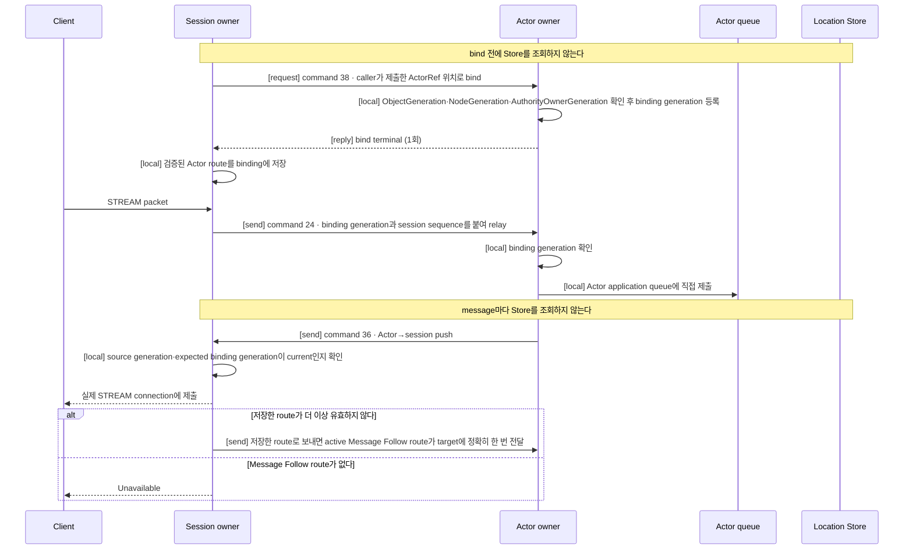
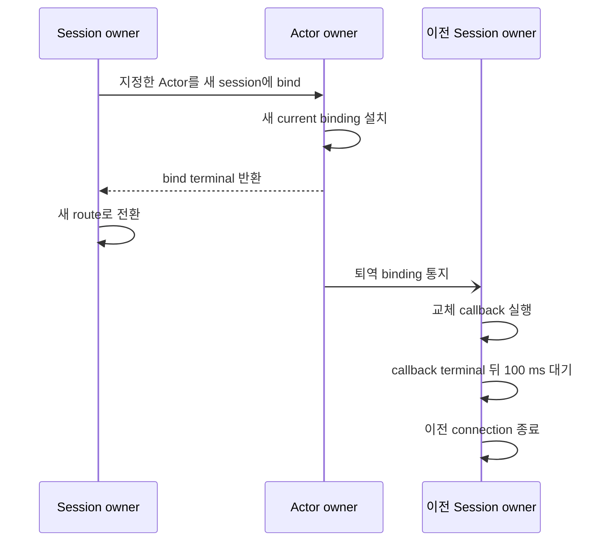
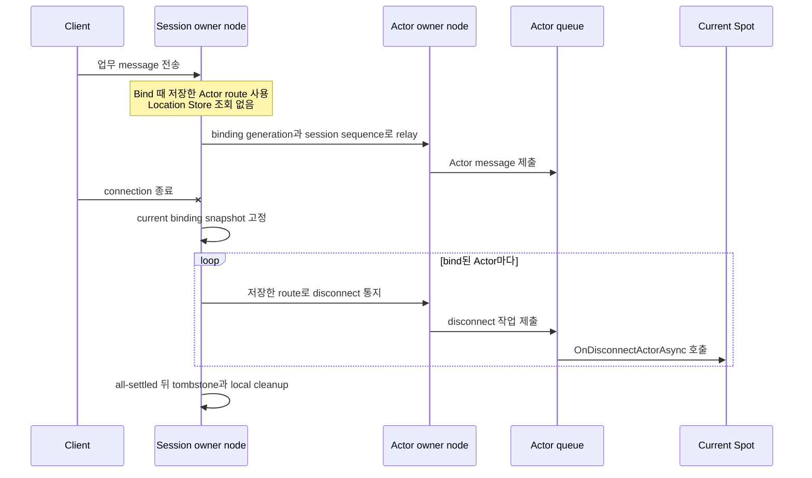
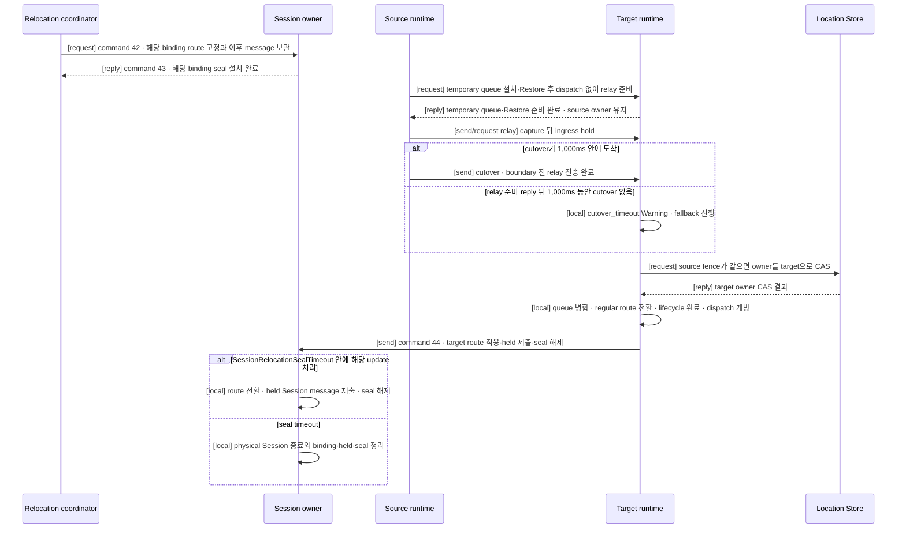

# Session과 Actor binding

[Session 주제 목차](README.ko.md) · [스펙 목차](../README.ko.md) · [이전: 01. STREAM 서버 session](01-stream-session.ko.md)

> 이 문서는 STREAM session과 Actor runtime을 연결하는 typed dispatch, binding, owner
> handoff와 실행 순서를 정의한다. Application·Runtime·Actor owner·relocation runtime의
> 책임 경계, 정상 흐름과 실패 규칙을 caller가 의존하는 계약으로 서술하고, 그 계약을
> 만족시키는 실행 engine 구조와 교체 순서를 모든 언어 runtime이 따라야 하는 구현
> 규칙으로 함께 담는다.

## 1. Session–Actor binding 개요

Application은 session object, `ActorRef`, typed payload·reply와 bound-session API만
사용한다. Node RID, STREAM transport handle, raw relay envelope, request sequence,
[AuthorityOwnerGeneration](../00-foundation/02-glossary.ko.md#authorityownergeneration)과 endpoint를
직접 조립하거나 보관하지 않는다.

이 문서에서 같은 Actor의 서로 다른 incarnation을 구분하는 번호를
[ObjectGeneration](../00-foundation/02-glossary.ko.md#objectgeneration)이라 하며, Actor가
relocation으로 node를 옮겨도 같은 incarnation이면 이 값을 그대로 유지하고, Actor를
destroy한 뒤 같은 ActorId로 새 incarnation을 만들면 새 값을 받아 이전 binding을 무효로
만든다. Actor가 속한 논리 instance는 [Spot](../00-foundation/02-glossary.ko.md#spot)이라
하며, 한 client가 보낸 packet 처리가 그 Spot 전체를 붙잡지 않도록 서로 다른 Actor를
session의 실행 문맥으로 직렬화하지 않는다. Actor 사이의 실행 순서는 Actor 모델의 실행
모드가 정한다. Spot과 Actor의 current owner 위치는
[Location Store](../00-foundation/02-glossary.ko.md#location-store)가 여러 node가 함께 확인할 수
있도록 보관하며, 아래에서 보듯 이 문서의 binding은 message마다 이 저장소를 다시
조회하지 않는다.

전체 흐름은 다음 다섯 단계다.

1. Session callback이 client를 인증하고 domain Actor identity와 type을 정한다.
2. Global ActorId로, 생성과 초기화를 마쳐 message를 받을 수 있는
   [Ready](../00-foundation/02-glossary.ko.md#ready) `ActorRef`를 lookup하거나 application
   정책에 따라 Actor를 명시적으로 생성한다.
3. Session과 Actor를
   [binding token](../00-foundation/02-glossary.ko.md#binding-token)으로 bind한다.
4. Session handler가 typed payload를 current Actor route로 제출한다.
5. Actor handler는 typed reply를 반환하거나 current bound session으로 one-way push를
   보낸다.

| 확인할 질문 | 계약 |
|---|---|
| Session 하나가 bind할 수 있는 Actor 수 | 여러 Actor를 bind할 수 있다. |
| Actor 하나가 동시에 bind할 수 있는 session 수 | 하나다. 새 binding이 확정되면 이전 binding은 무효화한다. |
| Message마다 Actor 위치를 찾는 방법 | Bind 때 확인한 route를 사용한다. Relay할 때 Location Store를 다시 조회하지 않는다. |
| [Actor가 다른 node로 이동한 뒤의 route와 위치](../00-foundation/02-glossary.ko.md#binding-route-ack) | Relocation commit 뒤 Framework가 session에 보관한 해당 Actor route와 bound-session current Actor location snapshot을 target으로 갱신한다. `ActorId`·`ObjectGeneration`은 유지한다. |
| Connection이 끊겼을 때 Actor가 알 수 있는 방법 | Framework가 current binding snapshot의 각 Actor에 자동 통지한다. |

## 2. 역할과 책임

| 주체 | 책임 |
|---|---|
| Application | Session callback에서 domain identity를 정하고 `ActorRef`를 bind한다. Session owner가 보관하는 Actor 전달 경로인 [Binding route](../00-foundation/02-glossary.ko.md#binding-route), Location row나 session 간 global proxy를 직접 만들지 않는다. |
| Session owner | Binding token·route·generation을 보관하고, relay·rebind·disconnect·relocation 중 route 전환을 수행한다. |
| Actor owner | Bind·rebind 요청을 검증해 binding generation을 등록하고 current binding을 하나로 유지한다. |
| Relocation runtime | Actor·Spot 이동의 target 선택, 준비 판정과 Location Store 접근을 수행한다. Session owner에는 seal 설치와 route 적용만 요청한다. |

같은 값을 두 번 검증하면 재시도 중 값이 바뀌는 시점에 언어마다 다른 결과가 나올 수
있다. `SessionBindingAggregate`는 physical Session identity, binding generation,
`ActorId`·`ObjectGeneration`, relocation identity와 route 변경을 하나의 직렬 실행
구간에서 다루는, Session 쪽 검증을 모으는 이름이다. 이 aggregate는 relocation target을
선택하지 않고 Location Store를 읽거나 쓰지 않으며 Actor authority를 다시 검증하지
않는다. 검증 책임은 다음처럼 경계마다 한 번씩만 둔다. 아래 표에 나오는
[Message Follow](../00-foundation/02-glossary.ko.md#message-follow)는 relocation 뒤 이전
owner로 늦게 도착한 message를 새 owner에게 대신 전달하는 동작이며, 이 경계에서도 다시
검증하지 않는다.

| 경계 | 한 번 검증하는 값 | 재검증하지 않는 곳 |
|---|---|---|
| Transport ingress | Authenticated peer RID·node generation, frame 형식 | Target queue, Session owner |
| Target handoff(relocation) | Source owner fence, target fence, Store version, Restore와 cutover 또는 1,000 ms fallback | Source, Message Follow, Session owner |
| Session owner(`SessionBindingAggregate`) | Physical Session identity·SessionRid, binding generation과 그것이 가리키는 `ActorId`·`ObjectGeneration`, relocation identity | Actor Join, host relocation, Message Follow, route cache |

## 3. Startup 조건

`EnableActorDispatch()`는 여러 물리 연결 그룹 중 하나를 식별하는 이름인
[`MeshName`](../00-foundation/02-glossary.ko.md#meshname)을 받지 않고 global object dispatch
capability를 활성화한다. Startup은 같은 process에 Object `Client` 또는 `Server` role과 Location
Store가 하나 이상 구성되어 있는지 확인한다.

여러 Mesh가 구성되어 있어도 오류가 아니다. Global ActorId authority가 current Mesh와
owner를 찾는다. STREAM-only node가 Actor dispatch를 사용하지 않는다면 MeshNode는
필요하지 않다.

| 조건 | 결과 |
|---|---|
| Object `Client`·`Server` role이 없다. | Configuration error로 startup에 실패한다. |
| Location Store가 없다. | Configuration error로 startup에 실패한다. |
| 같은 packet key의 handler를 중복 등록했다. | Configuration error로 startup에 실패한다. |

Object role이 `None`이거나 Location Store가 없으면 Actor dispatch enablement를
startup에서 거부한다. Hidden same-process Actor
[authority](../00-foundation/02-glossary.ko.md#authority)나 local-only binding 의미를 제공하지
않는다.

## 4. Binding이 잇는 값과 보관하는 정보

Binding은 다음 값을 연결하는 runtime 관계다.

- 바인딩한 `ActorRef`의 `ActorId`와 `ObjectGeneration`
- Current `AuthorityOwnerGeneration`과
  [OwnerLeaseGeneration](../00-foundation/02-glossary.ko.md#ownerleasegeneration)
- [STREAM session](../00-foundation/02-glossary.ko.md#stream-session) identity
- Binding generation과 token. Binding generation은 같은 session owner lifecycle에서
  binding이 교체된 순서를 구분한다.

한 Actor는 동시에 session binding 하나만 가진다. Session 하나에는 여러 Actor를 bind할
수 있다. 따라서 session은 Actor별 binding과 route를 각각 보관한다.

Actor direct send/request는 global ActorId가 가리키는 current Ready Actor를 대상으로
하지만, Session relay는 먼저 current binding token을 확인한다. Actor를 destroy하면 해당
incarnation의 binding도 종료한다. 이후 같은 ActorId로 새 incarnation을 만들어도 이전
binding token은 다시 유효해지지 않는다. 늦게 도착한 relay·unbind·disconnect는
`ObjectGeneration`을 application message target으로 비교해서가 아니라 종료되거나
교체된 binding identity이기 때문에 거부한다. Application은 새 `ActorRef`로 bind를 다시
시작해야 한다.

같은 `ObjectGeneration`을 유지하는 Actor relocation의 route와 current location snapshot
갱신은 새 binding identity를 만들지 않으며 rebind가 아니다. Destroy 뒤 같은 ActorId로 새
`ObjectGeneration`이 만들어지면 이전 binding은 유효하지 않으므로 application이 새
`ActorRef`를 명시적으로 bind해야 한다.

Session owner는 Actor마다 다음 정보를 하나의 binding으로 보관한다.

| 정보 | 사용하는 이유 |
|---|---|
| `ActorId`, `ObjectGeneration` | 같은 ID로 다시 만들어진 다른 Actor에게 보내지 않기 위해 사용한다. |
| `MeshName`, owner `NodeRid` | Bind 이후 relay와 disconnect 통지를 보낼 주소로 사용한다. |
| `NodeGeneration`, `AuthorityOwnerGeneration`, `OwnerLeaseGeneration` | 재시작 전 node나 이전 owner에게 보내지 않기 위해 검증한다. |
| Session owner RID와 lifecycle generation, binding generation과 token | 이전 connection이나 교체된 binding의 늦은 message를 거부한다. |
| [Session sequence](../00-foundation/02-glossary.ko.md#session-sequence) | 같은 session에서 수락한 message의 순서를 보존한다. |

Binding identity는 session owner Node RID, 그 node의 lifecycle generation과
owner-local binding generation을 함께 사용한다. Binding generation의 대소 비교는 같은
session owner lifecycle 안에서만 유효하다. 다른 MeshNode가 bind하거나 session owner가
재시작하면 owner-local counter가 이전 값보다 작더라도 새로운 lifecycle identity로
등록할 수 있다.

## 5. Bind와 relay

STREAM packet은 먼저 session의 typed handler registry로 dispatch된다. Handler가 Actor
dispatch를 선택하면 Framework는 다음 값을 internal envelope에 보존한다.

- 원본 request correlation
- 등록된 binding generation. Binding token은 session owner가 local에서 current binding을
  가리키는 handle이며 record에 싣지 않는다.
- Actor `ObjectGeneration`
- `AuthorityOwnerGeneration`
- `OwnerLeaseGeneration`: current owner host process lifecycle을 구분한다.
- Session sequence: 현재 session에서 수락한 message의 순서를 나타낸다.

Bind는 caller가 제출한 `ActorRef`의 위치를 최초 route로 사용해 control request를 한 번
보낸다. Actor와 STREAM session이 서로 다른 MeshNode에 있으면 session owner가
`boundSessionBind(38)` control request를 Actor owner에 보낸다. Actor owner는 Actor
`ObjectGeneration`, target `NodeGeneration`(target node process lifecycle을 식별하는
generation)과 `AuthorityOwnerGeneration`을 모두 확인한 뒤
[binding generation](../00-foundation/02-glossary.ko.md#binding-generation)을 등록하고 terminal
reply를 한 번만 반환한다. **승인 판정은 이 세 값으로만 한다.**
`OwnerLeaseGeneration`은 envelope에 보존하는 값이지 bind 승인 판정의 입력이 아니다 —
caller 측 lookup·projection이 실어 온 lease 사본과 Actor owner의 current lease가
다르다는 이유로 bind를 거부하지 않는다. lease는 route fence
검증([routing](../03-spot-actor/08-routing.ko.md))의 관심사이고, bind 승인에까지 쓰면
파생 사본 불일치가 stale 판정 근거가 되어 §8.1의 판정 권위 원칙과 충돌한다.

Session에서 Actor로 들어가는 payload는 등록된 binding generation과
session sequence를 포함한 `actorSend(24)`
record로 Actor owner에 전달한다. Payload는 local·remote 여부와 관계없이 target Actor
application queue에 직접 추가한다. Current Spot은 authority 검증에 사용하지만 callback
실행 문맥이 아니다. Session callback thread에서 Actor handler를 실행하지 않으며 서로
다른 Actor를 session의 실행 문맥으로 직렬화하지 않는다. Actor 사이의 실행 순서는
[Actor 모델](../03-spot-actor/04-actor-model.ko.md)의 실행 모드(`PerActor`·`SpotWide`)가
정한다 — `SpotWide` User Spot에 속한 Actor들은 그 Spot의 공통 gate를 함께 쓴다.

- **session의 실행 권한과 Actor의 실행 권한은 서로 다른 권한이다.** Session callback을 실행하는 문맥은 Actor
  handler를 실행하지 않는다. 나누지 않으면 한 client가 보낸 packet 처리가 그 Actor가 속한
  Spot 전체를 잡거나, 반대로 Spot이 바쁠 때 그 연결의 keepalive 처리까지 밀린다. 연결
  수명 관리와 업무 처리는 빈도도 지연 요구도 다르다.
- **runtime이 쓰는 제어 record는 application queue에 넣지 않는다.** 연결 유지 신호가 업무 message와 같은 queue에서
  기다리면, 업무가 밀릴 때 연결이 끊긴 것으로 오판할 수 있다.

Actor가 session에 보내는 push는 `boundSessionSend(36)` record로 session owner에
전달한다. Session owner는 source Actor `ObjectGeneration`, source `NodeGeneration`,
`AuthorityOwnerGeneration`과 expected binding generation이 모두 current일 때만 실제
STREAM connection에 제출한다.

**Binding의 완료와 그 인지는 해석의 여지가 없는 두 선형화점으로 정의한다. push의
current 판정에 그 선형화점 밖의 사본을 쓰지 않는다.**

1. **Actor owner 측 완료 — terminal reply 반환 전.** Actor owner는 위 검증을 통과한
   binding 등록을 — 그 노드에서 Actor→session 송신 경로가 참조하는 상태까지 포함해 —
   **terminal reply를 반환하기 전에 하나의 소유 turn 안에서** 끝낸다. reply가 관찰된
   뒤에는 그 노드의 어떤 구성요소도 이 binding을 모르는 상태로 남지 않는다. 따라서
   binding 성립 이후 실행되는 Actor handler(join callback 포함)가 보내는 push는 그
   노드에서 항상 등록된 binding으로 관찰된다.
2. **Session owner 측 완료 = binding 완료의 인지 시점.** Session owner는 reply를 받은 뒤
   registry의 binding commit과, push 판정·STREAM 제출 경로가 참조하는 **모든 파생
   상태(projection·route 사본)를 하나의 선형화점에서 함께 공개한다.** 이 선형화점이
   "binding이 완료되었다"를 인지하는 시점이며, bind caller의 성공 완료는 이 선형화점
   뒤에만 관찰된다. commit이 관찰 가능해진 뒤 도착한 record가 아직 갱신되지 않은 파생
   상태와 대조되는 창을 만들지 않는다.
3. **판정 권위는 하나다.** push의 current 판정은 [§8.1](#81-seal-held-message와-route-전환)이
   열거한 Session owner 검증 항목(위의 네 generation 값)만 사용한다. 파생 사본의
   미갱신·불일치를 binding이 stale하다는 근거로 쓰지 않는다. Source 측도 전송 조건으로
   binding 정체성(SessionRid·binding generation)과 위 열거 항목 외의 field 일치를
   요구하지 않는다 — binding 성립 후 owner lifecycle field가 갱신되어도 같은 binding의
   push는 현행 등록 route로 전송된다.
4. **거절은 조용히 사라지지 않는다.** current가 아니어서 제출을 거절한 push는
   [flow tracing](../06-observability/03-message-flow-tracing.ko.md)의 기존 닫힌
   vocabulary로 기록한다.

이 계약이 요구하지 않는 것 — 전달 확인 응답(ack), 재전송, client delivery 보장.
one-way push의 공개 완료 의미는 [제출과 완료](../01-execution/01-submit-and-completion.ko.md)의
one-way 계약을 그대로 따른다.

정상 경로를 한 그림으로 보면 다음과 같다. 이 그림은 bind·relay·push의 논리 순서와 각
단계의 검증 주체만 보여준다. Node 경계와 physical socket의 위치는
[STREAM 서버 session 「8. Session에서 Actor로」](01-stream-session.ko.md#8-session에서-actor로)의
그림이 보여준다.



Source는 bind 전에 Store에서 current route를 미리 조회하지 않는다. Local Actor
instance를 받는 overload도 제공하지 않는다.

Bind가 성공하면 session owner는 검증된 Actor route를 binding에 저장한다. 이후 relay,
disconnect 통지와 Actor에서 session으로 보내는 push는 이 binding 정보를 사용하며
message를 보낼 때마다 Location Store를 다시 조회하지 않는다. 저장한 route가 더 이상
유효하지 않으면 active Message Follow route로 정확히 한 번 전달하거나 `Unavailable`로
끝낸다. Location Store에서 새 `ActorRef`를 찾아 같은 message를 다른 owner에게 자동으로
다시 보내지 않는다.

저장한 route는 current owner lease와 local admission deadline 안에서만 유효하다.
Location Store가 일시적으로 사용할 수 없더라도 이 lease나 deadline을 연장하지 않는다.
Store 장애가 난 뒤에도 Framework가 새 route를 추측하거나 이전 binding을 무기한 사용하는
동작은 하지 않는다.

Target에 지정한 Actor가 없고 active committed Message Follow route가 있으면 original
bind control request와 reply route를 해당 route의 target으로 relay한다. Message
Follow route가 없거나 만료됐으면 `Unavailable`, 같은 ActorId의 `ObjectGeneration`이
다르면 `InvalidOperation`, relocation pre-commit seal 중이면 `Unavailable`로 끝난다.
Source는 Store에서 새 route를 찾아 같은 bind를 몰래 다시 시도하지 않는다. `BindOrGet`의
Get은 같은 session의 지정한 ActorId·
ObjectGeneration binding만 반환하며 다른
generation이나 directory Actor를 반환하지 않는다.

Binding route는 Framework가 관리한다. Application은 별도 Location row, proxy, session
RID나 endpoint를 만들지 않는다.

Bound-session API는 current binding으로 one-way push를 보내거나 connection close를
요청한다. 임의의 session을 지정하는 global proxy는 제공하지 않는다. Disconnect는
binding을 해제하지만 Actor를 destroy하거나 Spot membership을 바꾸지 않는다.

이 절과 §8.2가 쓰는 control command는 다음과 같다.

| Command | 이름 | 오가는 방향과 용도 | 완료 방식 |
|---|---|---|---|
| 38 | `boundSessionBind` | Session owner → Actor owner: bind 요청 | request/reply, terminal 1회 |
| 24 | `actorSend` | Session owner → Actor owner: session→Actor payload(bound-session tail 포함) | send 또는 request relay — 기존 correlation·deadline 계약 그대로 |
| 36 | `boundSessionSend` | Actor owner → Session owner: Actor→session push | send |
| 51 | `boundSessionReplaced` | Actor owner → 이전 Session owner: binding 교체 통지 | one-way, 최대 1회 |
| 42 | `sessionRelocationSeal` | Relocation coordinator → Session owner: 이동 대상 binding에 seal 설치 요청 | request |
| 43 | `sessionRelocationSealed` | Session owner → Relocation coordinator: seal 설치 결과 | reply |
| 44 | `sessionRelocationRoute` | Target runtime 또는 relocation coordinator → Session owner: route 적용 또는 abort | one-way(send), 응답 없음 |
| 45 | (reserved) | Reserved | 보내지도 수락하지도 않는다 |

Public interface 발췌는 §13에 있다.

## 6. Rebind와 이전 연결 교체

이미 다른 session에 bind된 Actor를 새 session에 연결하면 physical connection 두 개가
잠시 유지될 수 있다. 그러나 Actor owner의 current binding은 항상 하나여야 한다.

- **새 연결을 즉시 확정하고 이전 session에는 one-way로 교체를 통지한다.** 새 identity를 Actor owner에 먼저
  atomic하게 등록하고, 성공 reply를 받은 새 session owner가 새 route를 저장한다. Actor owner의 등록이 끝나는 시점부터
  Actor에는 새 session 하나만 current binding으로 존재한다. 이전 session의 ingress는 이전 binding
  generation이므로 거부하며, Actor에서 session으로 보내는 push는 새 session으로만 전달한다. 새 bind의 terminal은 새
  session owner가 route를 저장하면 반환하며 이전 session의 응답, callback 또는 연결 종료를 기다리지 않는다. 새 bind
  자체가 실패한 경우에만 기존 binding route를 유지한다.



Framework는 교체된 이전 binding에 `boundSessionReplaced(51)` one-way record를
최대 한 번 적용한다. Record는 Actor authority source fence와 이전 session owner의 Node
RID·lifecycle generation·owner ID·owner lease generation·session RID·retired binding
generation을 함께 전달한다. 보내는 node는 record의 Actor authority target과 일치해야
한다. 받는 node는 이전 session owner identity의 모든 값이 현재 교체 대상과 일치할
때만 session의 Actor 중복 연결 callback을 실행한다. Actor authority source fence는
받는 node가 local Actor를 찾는 용도로 사용하지 않는다.

- **연결 관계는 값 하나가 아니라 `(연결 식별자, 교체 순번)` 쌍으로 식별한다.** 교체 중에 이전 연결로 보낸 응답이 늦게 도착할 수 있고, 순번을
  비교해야 그 응답이 지금 연결에 대한 것인지 판단할 수 있다.

Callback은 application이 client에 중복 연결 안내를 보낼 수 있는 마지막 lifecycle
turn이다. Application은 callback에서 연결 종료를 직접 요청하지 않는다. 이전 session은
callback을 시작하기 전에 closing 상태로 전이하여 새로운 inbound application dispatch를
받지 않으며 callback에서 제출하는 outbound send는 허용한다.

Callback이 성공 또는 실패로 terminal이 되면 Framework는 이전 session callback
terminal로부터 `100 ms` 뒤 이전 connection을 종료하는 non-blocking timer를 예약하고
callback turn을 즉시 반환한다. `sleep`, blocking wait 또는 session serial lane·worker
점유로 100 ms를 기다리지 않는다. Timer callback은 예약할 때 저장한 session owner
lifecycle·session RID·retired binding generation이 여전히 교체 대상인지 다시 확인한 뒤
닫는다. Outbound queue가 먼저 비어도 이 시간을 줄이지 않는다. Callback이 정해진 시간 안에 terminal이 되지
않으면 Framework는 그 시점에 이전 connection을 강제로 종료한다. 이 시간은 server 설정
`SessionReplacementCallbackTimeout`이며 기본값은 `30,000 ms`다. Application이 중복 연결
안내를 보내는 데 그보다 오래 걸리는 배포에서는 설정으로 늘리거나 줄인다.

이전 session 통지의 전송 실패, callback 실패와 연결 종료 지연은 제한된 diagnostics로
기록하지만 새 binding을 복원하거나 제거하지 않는다. 이 통지의 전송도 일반 규칙을 따른다 — queue가 가득 차면
send timeout까지 admission을 기다리고, 그때까지 수락되지 않으면 `DeadlineExceeded`로 끝난다.
Framework는 그 위에 별도 재시도를 하지 않으며 bind terminal을 지연시키지도 않는다. 연결이
끊긴 경우의 복구는 Core의 reconnect가 담당한다. 이전 owner에 끝내 도달할 수 없으면 physical close는 해당 owner의 일반
connection liveness와 shutdown에 맡기며 새 binding을 되돌리지 않는다. 통지가
전달되지 않더라도 이전 binding generation의 ingress는 Actor owner에서 계속 거부한다.
늦거나 중복된 `boundSessionReplaced(51)`는 retired identity에만 적용하며 새
session을 종료하지 않는다. Unbind와 일반 disconnect는 callback terminal 뒤
`boundSessionBind(38)`의 tombstone transition으로 정확히 해당하는 이전 identity만
제거한다. 이전 owner lifecycle에서 늦게 도착한 push·ingress·close, 이전 Actor
`ObjectGeneration`, 이전 authority owner와 재시작 전 `NodeGeneration`은 current
binding이나 connection에 적용하지 않는다. 형식이 잘못된 control 및 one-way record는
application queue에 넣지 않으며 one-way record에는 별도 terminal route를 만들지 않는다.

같은 physical session이 이미 current인 binding을 다시 제출하면 idempotent
성공으로 끝내고 `boundSessionReplaced(51)`를 자신에게 보내거나 connection을 닫지
않는다. 이전 session의 connection을 닫을 때는 그 session에 남은 다른 Actor binding도
일반 physical disconnect 절차로 각각 한 번 정리한다. 이 cleanup이 교체된 Actor의 새
binding identity를 제거해서는 안 된다.

다른 owner나 다른 Actor generation으로 rebind할 때도 새 Actor owner는 새 identity를
atomic하게 등록하고 bind terminal reply를 반환한다. 그 뒤 이전 binding route에
`boundSessionReplaced(51)`를 one-way로 보낸다. 이전 owner의 처리 완료를 확인하는 ACK나
request/reply는 만들지 않는다. 같은 owner에서 새 identity가 이전 identity를 이미
대체한 경우에도 늦은 통지나 tombstone이 새 identity를 제거하지 않는다.

## 7. Disconnect 통지

Framework는 physical connection disconnect를 관찰하면 current binding snapshot을
고정하고 각 binding identity에 disconnect를 자동 제출한다. Application의
Session disconnect callback은 bound Actor를 순회하지 않는다. Framework는 binding에
보관한 route와 generation을 검증해 통지를 Actor queue로 전달하며 이 과정에서도
Location Store를 조회하지 않는다.

한 Actor의 제출이나 callback이 실패해도 나머지 Actor 통지와 Session cleanup을 계속하는
all-settled 규칙을 사용한다. Automatic 통지와 public `NotifyDisconnectedAsync(...)`
논리 통지가 경쟁하면 같은 binding identity로 중복을 제거하고 current Spot의 callback은
최대 한 번 실행한다. Automatic 통지는 lifecycle deadline 안에서 callback terminal을
기다린 뒤 tombstone과 local cleanup을 진행하며, deadline 또는 callback failure가
발생해도 나머지 binding cleanup을 계속한다.

Public logical notification도 해당 callback terminal을 기다린 뒤 그 binding을
tombstone으로 제거한다. Callback failure는 diagnostics에 기록하지만 binding을
복원하지 않으며, 같은 identity에 callback을 다시 실행하지 않는다. Physical connection과
Actor·Spot membership은 유지한다.

Actor가 속한 현재 Entry Spot 또는 User Spot은 이 통지를 `OnDisconnectActorAsync(...)`로
받는다. Public `NotifyDisconnectedAsync(...)`는 physical connection이 유지된 상태에서
application이 선택한 Actor 하나에 같은 logical notification을 명시적으로 보내는
operation이다. 이 언어 중립 operation을 `NotifyDisconnected`라 하며 `.NET` interface
문서에서는 `NotifyDisconnectedAsync(...)`로 표현한다.

두 통지는 connection 종료 사실만 알리며 Actor를 destroy하거나 Spot membership을 변경하지 않는다.



## 8. Actor relocation 중 Session의 책임

Actor가 다른 MeshNode로 이동해도 physical STREAM connection과 Session scope는 Session
owner process에 유지된다. Socket, transport handle과 Session callback state를 target
Actor process로 이동하거나 복제하지 않는다. Session의 책임은 이동 중 해당 binding을
닫아 두고, 이동 결과에 맞춰 route를 한 번 바꾼 뒤 다시 여는 것이다. Session은
relocation target을 선택하거나 Actor·Spot의 준비 상태를 판정하지 않으며 Location
Store를 읽거나 변경하지 않는다.

Source·target이 수행하는 temporary queue 설치, Restore, cutover, Location Store CAS와
queue 병합의 전체 순서는
[Actor와 Spot relocation 전체 흐름 「4. 정상 처리 순서」](../05-location-relocation/04-relocation-flow.ko.md#4-정상-처리-순서)가
소유한다. 이 절은 그 흐름에서 Session owner가 담당하는 seal, held message와 route
전환만 정의한다.

- **relocation seal과 retired binding 거부는 서로 다른 전이다.** §6의 retired binding 거부는 current
  binding을 새 session으로 교체한 뒤 이전 generation의 ingress를 막는다. Relocation seal은 같은 binding의
  Actor route를 옮기는 동안 Session message를 보관한다. 두 규칙은 함께 적용되며 서로를 대신하지 않는다.

### 8.1 Seal, held message와 route 전환

Session binding에 관한 검증은 Session owner 한 곳에서만 수행한다. Session owner는
다음 값만 검증한다.

- 현재 physical Session identity와 SessionRid
- 현재 binding generation과 binding이 가리키는 `ActorId`·`ObjectGeneration`
- 같은 relocation인지 구분하는 relocation identity
- seal을 설치한 binding과 route를 바꿀 binding이 같은지 여부

Transport는 authenticated peer와 node generation, frame 형식을 transport 경계에서
검증한다. Target relocation runtime은 준비를 끝낸 뒤 예상 source owner와 generation으로
Location Store CAS를 수행한다. Actor join, host relocation, Message Follow와 Session
owner는 이 두 검증을 반복하거나 서로의 결과를 다시 판단하지 않는다. Session route
변경에는 numeric high-water, message별 ACK journal 또는 relocation 전용 capacity
조건을 사용하지 않는다. Seal 중 도착한 message는 aggregate가 보관하지만 개별 message
크기, transport, deadline과 cancellation 제한은 그대로 적용한다.



Session owner는 seal 설치 시점부터 설정 가능한 `SessionRelocationSealTimeout`을
적용한다. 기본값은 3,000 ms이며 server 설정으로 바꿀 수 있고, seal 설치부터 해당
binding의 command 44 도착까지의 시간에 적용한다. 그 안에 command 44가 오지
않으면 physical Session을 닫고 binding, held message와 seal state를 정리한다. Timeout과
command 44 처리는 같은 직렬 실행 구간에서 먼저 처리된 하나만 유효하다. 뒤늦은 command
44나 다른 relocation의 update는 `late_session_route_update` Warning만 기록하고
무시한다. 같은 update를 다시 받으면 state를 바꾸지 않는 no-op이다.

Cutover와 command 44는 one-way라 response 유실 상태를 만들지 않는다. 짧은 handoff
동안의 server 간 전송은 TCP의 순서와 재전송에 의존한다. `send`는 별도 application
ACK를 추가하지 않으며, `request`는 기존 correlation, deadline과 caller retry 계약을
그대로 사용한다.

Target이 relay-ready reply가 accepted 상태가 되기 전에 명시적으로 실패하면 source가
owner다. Relocation coordinator는 durable abort와 source queue 복원을 먼저 확정한 뒤 command
44 abort를 one-way로 보낸다. Session owner는 matching seal을 해제하고 보관한 Session
message를 source route로 다시 제출하며 reply를 만들지 않는다. Relay-ready reply가
accepted 상태가 된 뒤에는 CAS 또는 cutover submit이 실패해도 source route를 다시 열지
않으며, `SessionRelocationSealTimeout`이 physical Session과 held state를 정리한다.

### 8.2 Control message 42·43·44

Command 42와 43은 Session seal의 설치 request와 reply를 전달한다. Command 43은 seal 설치 결과만 전달하며 Session message sequence나 high-water는 포함하지 않는다.

Command 44는 target runtime의 commit 또는 relocation coordinator의 relay-ready accepted
전 abort를 전달하는 one-way control이다. **Command 44는 response 없이 한 번만 제출하고
application 수준에서 재전송하지 않는다.** Session owner의 seal timeout이 미도착 처리를
소유하므로 별도 response 대기나 재전송 주기를 두지 않는다.

`sessionRelocationRoute` commit에는
relocation identity, ActorId, ObjectGeneration, target MeshName·NodeRid, Session
identity, SessionRid와 binding generation을 넣는다. Session owner는 자신이 소유한
current Session과 binding에 필요한 값만 대조한다. 이를 적용할 때 route와 current
`ActorRef` location snapshot을 한 번에 바꾼다. Route 적용, 보관한 message 제출과 seal
해제는 모두 같은 직렬 실행 구간에서 일어나므로, **보관한 message는 seal이 풀린 뒤 도착한
message보다 먼저 target route에 제출된다.** 이 구간 안에서 셋의 실행 순서는 관찰되지
않으므로 **언어별 재량**이다. Route 갱신은 같은 ObjectGeneration에만 적용하고 rebind가
아니므로 disconnect callback을 실행하지 않는다(§3). 같은 Session에서 relocation 대상이 아닌
다른 Actor의 route와 physical connection은 바꾸지 않는다. 언어별 interface는 공개 ActorRef
조회 타입을 투영하고 route 갱신 절차는 이 절을 참조한다.

Abort에는 matching seal identity와 abort action만 넣는다. Session owner는 matching
seal만 해제하고 보관한 message를 source route로 제출한다.

Command들은 relocation을 조정하기 위한 내부 message이며 Location Store owner를
확정하는 protocol이 아니다. Target authority가 유효한지는 이미 target-only Location
Store CAS가 결정했으므로 Session owner가 Store나 Actor authority mirror를 다시
조회하지 않는다. Reserved command 45는 보내지 않으며 수락하지도 않는다. 각 command의
방향·용도·완료 방식은 §5의 command 표에 있다.

## 9. 재접속과 이동의 구분

이 둘은 겉보기에 비슷하지만 정반대로 처리한다.

| 상황 | 연결 관계 | Application이 할 일 |
|---|---|---|
| client 재접속 | 새로 만든다 | 인증과 연결을 다시 수행한다 |
| Actor가 다른 node로 이동 | 유지한다 | 없다. Runtime이 경로만 갱신한다 |

재접속은 새 session을 만들고, 이전 연결의 응답과 갱신은 새 session에 적용하지 않는다
([장애 대응과 failover 범위 「7. Store 장애」](../05-location-relocation/06-failure-failover-policy.ko.md#7-store-장애)).
재접속 시도 자체는 client 라이브러리의 몫이다.

- **이전 연결 관계를 새 session으로 옮기려 시도하지 않는다.** 이전 연결 정보를 보관했다가 새 session에 복원하면 인증을 거치지 않은 연결이
  이전 권한을 이어받을 수 있고, 정식 계약과도 어긋난다.

이동한 Actor에 연결을 유지하려면 옛 주소로 온 message를 새 owner로 넘기는 경로를
유지해야 한다([이동 중 message 연속성](../05-location-relocation/04-relocation-flow.ko.md)). 그
경로가 없으면 이동 자체는 성공해도 session이 조용히 끊긴다.

이전 owner에서 새 owner로 전환된 뒤 이전 주소로 도착한 server message는 Message Follow가
target에 전달한다.
서로 다른 connection에서 들어온 message 사이의 전역 순서는 보장하지 않는다. Physical
Session disconnect는 relocation 성공이나 실패의 증거가 아니며, Session owner process가
종료되면 connection을 다른 process로 복구하지 않고 닫는다.

## 10. 실행과 수명

같은 session의 handler turn, binding mutation, close와 relocation barrier는 session
owner가 직렬화한다. Actor에 제출한 뒤에는 Actor queue가 순서를 소유한다. Session
turn과 Actor turn을 shared lock이나 callback stack으로 합치지 않는다.

Request와 binding operation completion, binding update, relocation barrier와
disconnect cleanup은 infrastructure task에서 진행한다. Session 또는 Actor application
callback이 비동기 작업을 기다리는 동안에도 진행해야 한다.

Actor owner host의 Relocate는 §8의 barrier를 사용한다. Session owner host의 Relocate와
Shutdown은 신규 session·binding을 거부하고 accepted callback·reply·cleanup을
[deadline](../00-foundation/02-glossary.ko.md#deadline)까지 처리한 뒤 connection을 닫는다. Physical
connection을 다른 process로 이동하지 않는다.

위 규칙의 내부 확인 조건 — 같은 연결의 두 session callback이 동시에 실행되지 않고, session
callback을 실행하는 문맥에서 Actor handler가 실행되지 않는다 — 는 white-box 불변 조건으로
확인한다.

Session application record와 ordinary control이 공유하는 host permit 규칙은
[Application job queue와 backpressure 「3. Ordinary ingress permit 순서」](../01-execution/04-application-job-queue-and-backpressure.ko.md#3-ordinary-ingress-permit-순서)가 소유한다.

## 11. 실행 engine과 lane 정책 타입

Spot, session, Actor 전달과 두 도메인 mailbox마다 직렬 실행 원시 타입을 따로 만들면
순서, admission과 ready set을 관리하는 규칙도 각 타입으로 흩어진다.

- **순서, admission과 ready set을 관리하는 실행 engine은 하나만 둔다.** 타입을 따로 만들면 [Handler turn과 execution gate](../01-execution/02-handler-turn-and-execution-gate.ko.md)의 한도 처리와 ready set 관리를 각 타입에서 다시 구현해야 한다. 그러면
  같은 문제를 여러 곳에서 고쳐야 한다.
- **적용 위치별 차이는 여러 boolean 설정이 아니라 lane 정책 타입으로 표현한다.** 세 lane이 표현해야 하는 상태는 다음과 같다.

| 자리 | 갖는 상태 | 갖지 않는 상태 |
|---|---|---|
| Spot lane | 반납 대기, 이동 봉인 | 연결 닫힘 |
| session lane | 연결 닫힘 | 반납 대기, 이동 봉인 |
| Actor 전달 lane | 없음 | 반납 대기, 이동 봉인, 연결 닫힘 |

참·거짓 두세 개로 표현하면 안 되는 이유는 조합의 대부분이 의미가 없기 때문이다.
"session에서 이동 봉인 켜짐", "Actor 전달에서 반납 대기 켜짐" 같은 조합은 존재할 수
없는 상태인데 타입이 그것을 허용하면 호출하는 쪽이 유효한 조합을 알고 있어야 한다.
봉인·반납 대기·닫힘은 각각 다른 lifecycle과 다른 전이 규칙을 가진 도메인 개념이지
기능 스위치가 아니다.

각 lane에서 유효한 상태만 표현하는 정책 타입을 공통 engine에 넘긴다. **언어별
재량** — 언어에 따라 sealed 계층이든 tagged union이든 상관없다. 판정 기준은 의미
없는 조합을 만들 수 없는가이다. 그 조건을 만족하는 한 관찰 가능한 실행 순서와 lane
상태 전이는 어떤 표현을 쓰든 같다.

내부 확인 조건은 두 가지다. 직렬 실행 원시 타입이 runtime 안에서 하나라는 것은 white-box
불변 조건으로, lane 정책 타입이 표에 없는 조합(예: session lane의 이동 봉인)을 표현할 수 없다는
것은 정적 검사로 확인한다.

이 lane 정책은
[Handler turn과 execution gate](../01-execution/02-handler-turn-and-execution-gate.ko.md)가 정의하는 queue와
execution gate의 분리, [Handler turn과 execution gate](../01-execution/02-handler-turn-and-execution-gate.ko.md)가
정의하는 ready set 관리 위에서 동작한다.

## 12. 실패와 오류

Request reply·error는 original STREAM correlation을 terminal-once로 완료한다. Request를
target Actor route에 제출한 뒤 timeout, cancellation 또는 route failure가 발생하면
target이 이미 업무를 실행했는지 확정하지 못할 수 있다. Framework는 이런 실패 뒤 다른
Actor, 새 owner 또는 다른 [MeshNode](../00-foundation/02-glossary.ko.md#meshnode)를 선택해 같은
request를 자동으로 다시 보내지 않는다. Session이 닫힌 뒤 늦게 도착한 reply도 새
session이나 새 binding의 reply로 사용하지 않는다. 서로 다른 session의 request가 같은
업무 결과를 공유하는 것을 막기 위한 경계다.

| 조건 | 결과 |
|---|---|
| `ActorRef` 위치가 stale하고 Message Follow route도 없다. | `Unavailable`로 끝난다. |
| `ObjectGeneration`이 다르다. | `InvalidOperation`으로 끝난다. |
| Actor가 relocation pre-commit seal 상태다. | `Unavailable`로 끝난다. |
| Actor factory가 없다. | `NotFound`로 끝난다. 등록되지 않은 type이므로 재시도로 해결되지 않는다. |
| Current binding 없이 push 또는 close를 요청했다. | Session-not-bound 오류로 끝난다. Public kind는 `InvalidOperation`이다. 대상이 없는 것이 아니라 binding을 먼저 만들어야 하는 순서 문제이며, binding이 생기면 같은 호출이 성공한다. |
| Actor·owner·binding fence가 stale하다. | `Unavailable`로 끝나며 다른 대상으로 넘어가지 않는다. |

## 13. Public interface 발췌

다음 .NET 발췌는 session이 `ActorRef`를 bind하고 payload를 Actor queue로 relay하는
공개 표면을 보여주는 예시다. 다른 언어에 같은 signature를 요구하지 않으며, 정확한
.NET 계약은
[.NET STREAM session interface](../languages/dotnet/interfaces/07-stream-session.ko.md)가
정의한다.

```csharp
// session object에서 얻는다. 이 session이 가진 Actor binding 전체를 다룬다.
public interface IZLinkSessionActors
{
    // 이 session에 현재 bind된 Actor를 모두 제공한다.
    IReadOnlyCollection<IZLinkSessionActor> Bound { get; }

    // 지정한 ActorRef(ActorId + ObjectGeneration)를 이 session에 bind한다. control request 1회,
    // terminal은 route 저장 시점. 위치가 stale하면 Unavailable, generation이 다르면 InvalidOperation (§5, §12).
    ValueTask<IZLinkSessionActor> BindAsync(
        ActorRef actor,
        CancellationToken cancellationToken = default);
    // 같은 session에 동일 binding이 있으면 그것을 반환하고, 없으면 BindAsync와 같다.
    // 다른 generation이나 directory Actor는 반환하지 않는다.
    ValueTask<IZLinkSessionActor> BindOrGetAsync(
        ActorRef actor,
        CancellationToken cancellationToken = default);

    // Global Actor directory가 아니라 현재 session의 binding만 찾는다. 없으면 null.
    IZLinkSessionActor? Find(string actorId);
}

// binding 하나. bind 때 저장한 route를 쓰며 message마다 Location Store를 조회하지 않는다.
public interface IZLinkSessionActor
{
    // bind한 ActorRef. relocation 뒤에도 ActorId·ObjectGeneration은 같다.
    ActorRef Ref { get; }
    // 원래 request 정보와 session sequence를 보존해 current Actor route로 제출한다 (command 24).
    ValueTask RelayAsync(
        ZLinkSessionDispatchContext dispatch,
        ZLinkMessage payload,
        CancellationToken cancellationToken = default);
    // connection이 유지된 상태에서 이 Actor 하나에 논리적 disconnect 통지를 보낸다.
    // Actor를 destroy하거나 Spot membership을 바꾸지 않는다 (§7).
    ValueTask NotifyDisconnectedAsync(
        CancellationToken cancellationToken = default);
}
```

```csharp
var boundActor = await session.Actors
    .BindAsync(actorRef, cancellationToken); // 이 incarnation과 session을 고정한다.

await boundActor.RelayAsync(
    dispatch,
    payload,
    cancellationToken); // 원래 request 정보와 session sequence를 보존해 제출한다.
```

## 14. 검증 요구

공개 표면(`EnableActorDispatch()`, bind·`BindOrGet`·relay·push·close·`NotifyDisconnected`
operation과 그 `ErrorKind`, Spot의 `OnDisconnectActorAsync(...)` 호출, Location Store provider에
도착하는 조회, client가 관찰하는 connection 상태, node 사이 wire record)만으로 다음을 확인한다.
각 항목은 contract test 하나로 이어진다. 내부 구조로만 확인할 수 있는 조건(실행 engine 하나,
lane 정책 타입, 검증 지점 하나)은 [§10](#10-실행과-수명)·[§11](#11-실행-engine과-lane-정책-타입)이
규칙과 함께 소유하며 여기 적지 않는다.

**Startup과 bind**

- `EnableActorDispatch()`는 `MeshName`을 받지 않는다. Object role 또는 Location Store가 없으면
  startup이 configuration error로 실패한다.
- 한 session에서 Actor 둘을 bind하면 둘 다 bind되고 각각 독립된 route와 binding token으로 relay된다.
- 위치가 stale한 `ActorRef`를 bind하면 Message Follow route가 있을 때 그 route로 한 번 relay되고,
  없으면 `Unavailable`로 끝난다. Store를 다시 읽어 재시도하지 않는다.
- `ObjectGeneration`이 다른 `ActorRef`로 bind하면 `InvalidOperation`으로 끝난다.
- Binding 없이 push 또는 close를 요청하면 `InvalidOperation`(session-not-bound)으로 끝나고, bind
  뒤 같은 호출은 성공한다.

**Relay와 reply**

- Bind 뒤 relay하면 Location Store provider에 조회가 발생하지 않고 payload가 Actor handler에
  도달한다. Spot callback을 거치지 않는다.
- 다른 MeshNode의 Actor에 bind·relay·push하면 node 사이에 command 38, bound-session tail을 포함한
  command 24, command 36 record가 각각 raw ROUTER 경로로 오간다.
- Actor handler가 반환한 reply는 원래 STREAM request correlation으로 정확히 한 번 완료된다.
- Request 제출 뒤 timeout·cancellation이 나도 같은 request가 다른 Actor·owner·MeshNode로 다시
  보내지지 않는다.
- Session이 닫힌 뒤 도착한 reply는 새 session이나 새 binding에 전달되지 않는다.

**Rebind와 교체**

- 이미 bind된 Actor를 새 session에서 bind하면 새 bind는 이전 session의 callback·종료를 기다리지
  않고 완료되고, 이후 push는 새 session으로만 온다.
- 교체 뒤 이전 session의 relay는 거부되고 current binding은 바뀌지 않는다.
- 교체 callback이 terminal이 되면 `100 ms` 뒤 이전 connection이 닫힌다. Outbound queue가 먼저
  비어도 더 빨리 닫히지 않는다.
- 같은 session이 current binding을 다시 bind하면 idempotent 성공으로 끝나고 교체 callback도
  connection 종료도 일어나지 않는다.
- 이전 연결로 늦게 도착한 응답은 현재 connection에 적용되지 않는다.

**Disconnect**

- Actor 둘을 bind한 connection을 끊으면 각 Actor의 current Spot에서 `OnDisconnectActorAsync(...)`가
  정확히 한 번 호출되고, 한 Actor의 callback이 실패해도 다른 Actor는 통지받는다.
- `NotifyDisconnected`와 physical disconnect가 경쟁해도 같은 binding에 대한 callback은 최대 한
  번이다.
- Disconnect 통지 뒤에도 Actor는 destroy되지 않고 Spot membership도 그대로다.
- Client가 재접속하면 이전 binding이 복원되지 않고 새 bind가 필요하다.

**Actor relocation**

- Bound Actor를 다른 node로 relocation하면 client connection은 유지되고, commit 뒤 relay가
  target에서 처리되며, bound-session의 current Actor location snapshot이 target으로 바뀐다.
  `ActorId`·`ObjectGeneration`은 같다.
- Relocation 중 client가 relay한 message는 수락 시점에 따라 saved work 또는 ingress hold에 포함되어
  target에서 처리된다. 유실되거나 두 번 처리되지 않는다.
- Command 44가 `SessionRelocationSealTimeout`(기본 3,000 ms) 안에 오지 않으면 physical session이
  닫히고 그 binding의 held message는 전달되지 않는다.
- Timeout 뒤 또는 중복으로 온 command 44는 route를 다시 바꾸지 않고 Warning만 남긴다.
- Relay-ready 전에 target이 명시적으로 실패하면 held message가 source route로 처리되고 connection은
  유지된다.
- Relay-ready 뒤 CAS 또는 cutover submit이 실패하면 source route로 돌아가지 않고 seal timeout으로
  정리된다.
- Wire에서 command 43에는 sequence·high-water가 없고, command 44에는 응답이 없으며, command 45는
  오가지 않는다.

---

[Session 주제 목차](README.ko.md) · [스펙 목차](../README.ko.md) · [이전: 01. STREAM 서버 session](01-stream-session.ko.md)
