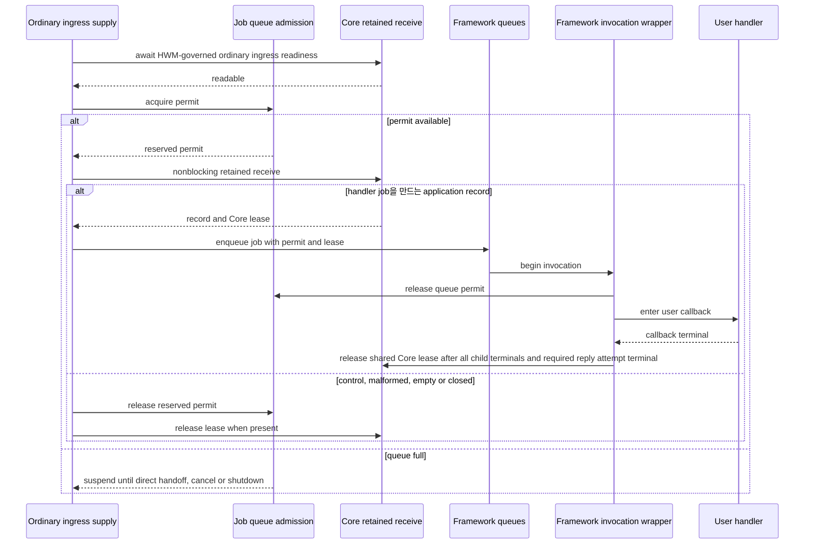

# Framework Application Job Queue HWM 적용 계획

## 문서 상태

- 상태: 설계 방향과 구현용 가 profile 수치 확정, 개발 중 성능 검증·최종 보정 전
- 대상: Framework ordinary ingress supply와 application handler 실행 전 queue
- 범위: C++, .NET, Java·Kotlin, Node.js Framework
- 기본 profile: `Balanced`
- 정식 계약 여부: 이 문서는 구현 계획이며 public contract가 아니다.

`framework/doc/framework/common/spec/`, `framework/doc/framework/common/spec/`,
`framework/doc/framework/common/e2e/`와 `framework/doc/framework/common/sample/`은 보호 경로다.
이 계획은 해당 문서의 적용 범위를 정하지만 직접 수정 승인을 뜻하지 않는다. 작업자는 사용자가
정확한 경로와 범위를 승인한 뒤에만 보호 문서를 수정한다.

관련 계획:

- [Auto HWM memory budget·CCU 재계산 공통 계획](auto-hwm-memory-budget-and-ccu-recalculation-plan.ko.md)
- [Framework Auto HWM 메모리 예산 적용 계획](auto-hwm-memory-budget-framework-plan.ko.md)
- [Bindings Auto HWM 메모리 예산 적용 계획](auto-hwm-memory-budget-bindings-plan.ko.md)
- [Core Auto HWM 메모리 예산 적용 계획](auto-hwm-memory-budget-core-plan.ko.md)
- [Framework relocation·Auto HWM 구현 진행 문서](framework-relocation-auto-hwm-execution.ko.md)

## 1. 결론

Framework에는 Core byte HWM과 별개로 application handler 실행을 기다리는 job 수의 상한이 필요하다.
이 문서에서는 이를 **Application Job Queue HWM**이라 부른다.

- Core HWM은 origin별 전송 message byte와 retained credit을 제한한다.
- Application Job Queue HWM은 Framework host/runtime instance 전체의 queued application job 수를 제한한다.
- Queue가 상한에 도달하면 ordinary ingress supply가 terminal reply·error completion 이외의 새 record를
  수신하지 않고 permit 반환을 기다린다.
- Core receive queue가 누적되면 기존 Core receive·send byte HWM이 sender까지 backpressure를 전달한다.
- Handler가 실제 사용자 callback 실행을 시작하면 queue permit을 반환하고 supply 하나를 재개한다.
- 실행 중 handler, coroutine·Task·Promise의 비동기 대기와 terminal completion은 이 queue HWM에 포함하지 않는다.
- Profile은 성능 시험 전의 자동 초깃값이고, 운영자는 자신의 목표 사용률에서 관측한 queue 크기로
  정확한 수동 HWM을 설정한다.

Application Job Queue HWM은 CPU 사용률 제어기가 아니다. 사용자가 CPU 50%, 60% 또는 다른 운영
목표를 선택하고 그 조건에서 성능 시험할 수 있게 queue를 관측하고 수동 상한을 제공하는 기능이다.

## 2. 기존 Auto HWM 계획과의 관계

기존 Auto HWM 계획은 Framework가 계산하던 별도 payload-byte `ApplicationHwmBytes`와
`ApplicationHwmProfile`을 제거하고 Core retained-credit budget 하나로 수렴한다. 이 결정은 유지한다.

새 계획은 byte HWM을 Framework에 다시 추가하지 않는다. 단위와 반환 시점이 다른 scheduler admission을
추가한다.

| 구분 | Core HWM | Application Job Queue HWM |
|---|---|---|
| Owner | Core context와 origin directional pipe | Framework host/runtime instance |
| 단위 | accounted byte | queued application job 수 |
| 적용 범위 | completion reply·error lane을 제외한 origin별 ordinary send·receive pipe | 모든 ordinary ingress가 공유하는 Framework host/runtime instance 전체 |
| 획득 | Core queue admission | pre-receive에서 terminal reply·error completion으로 식별되지 않은 ordinary record의 receive·claim 직전 |
| 반환 | Physical queue credit은 receiver dequeue에서 반환하고, retained receive lease는 모든 파생 job terminal과 필요한 reply submit attempt terminal 이후 반환 | User handler를 만드는 record는 실제 handler 시작 직전, control·malformed처럼 job을 만들지 않는 record는 유한한 분류·처리 직후 |
| 포화 결과 | 해당 origin ingress·sender 대기 | Framework ordinary ingress supply 대기 |
| Profile | `CoreHwmProfile` | 별도 application job queue profile |

기존 Framework Auto HWM 계획에서 “retained receive는 byte accounting 합계를 늘리지 않으므로 계속
진행한다”는 설명은 Core byte budget에만 적용한다. Job queue permit이 없으면 Framework는 terminal
reply·error completion을 제외한 새 ordinary ingress retained receive를 시작하지 않는다.

## 3. Queue에서 세는 job

### 3.1 Count 경계

Application Job Queue HWM은 최종 사용자 handler turn을 기다리는 job을 센다.

| 상태 | Queue HWM 점유 | 설명 |
|---|---|---|
| `reservedSupply` | 예 | Readiness 확인 뒤 future queued slot 하나를 예약했지만 아직 receive·분류하지 않은 짧은 구간 |
| `queuedApplicationJob` | 예 | Handler 실행 전에 pump, mailbox, serial queue 또는 executor queue에서 대기하는 상태 |
| `activeHandler` | 아니오 | 사용자 callback의 첫 실행을 시작한 상태 |
| `asyncWaitingHandler` | 아니오 | 시작한 callback이 I/O, timer, Store 또는 다른 completion을 기다리는 상태 |
| `terminalCompletion` | 아니오 | Pre-receive completion supply가 전달하는 terminal reply·error completion |

```text
applicationQueuePermitsInUse =
    reservedSupplyCount + queuedApplicationJobCount

0 <= applicationQueuePermitsInUse
  <= effectiveMaxQueuedApplicationJobs
```

`handler 시작`은 executor, event loop, virtual thread 또는 coroutine dispatcher에 task를 제출한 시점이
아니다. Runtime이 사용자 callback의 첫 instruction을 실행하기 직전이다. Executor 내부에서 순서를
기다리는 task도 queued job이며 permit을 유지한다. 공통 invocation wrapper가 callback 진입 직전에
`queued -> started` 전이를 한 번만 확정하고 permit을 반환한다.

Handler가 시작한 뒤 즉시 suspend해도 queue permit은 다시 얻지 않는다. Active handler와 async waiting의
상한이 필요하면 CPU execution policy와 I/O admission이 별도로 소유한다. 이 계획은 이 두 자원을 queue
HWM에 합치거나 새 public concurrency 설정으로 확장하지 않는다.

### 3.2 포함하는 application ingress

다음 경로에서 최종 handler turn 하나당 permit 하나를 사용한다.

- Channel request·send·publish 수신
- RouteMesh를 거치는 Spot·Actor application message
- Spot·Actor serial ordering과 shared execution gate를 기다리는 message
- STREAM과 bound session의 application callback message
- Network message에서 파생된 same-host application dispatch와 relay
- Relocation source에서 아직 실행 책임을 가진 queued application job과, target CAS·dispatch-open 뒤 durable
  backlog에서 live queue로 admission되는 application job. Target의 pre-runnable staged backlog 자체는 세지 않는다.

Multipart envelope 하나가 handler turn 하나를 만들면 job 하나다. 한 record가 여러 local handler turn으로
분기되면 최종 handler turn마다 permit 하나가 필요하다. 최초 reserved permit은 첫 turn으로 이전하고,
추가 turn은 permit을 얻는 순서대로 점진적으로 enqueue한다. 한 record에서 무제한 fanout job을 먼저
만든 뒤 permit을 나중에 맞추지 않는다.

한 record에서 1:N handler turn이 파생되면 retained Core lease는 record-level shared owner가 값으로
소유한다. 최초 child를 enqueue한 뒤 나머지 child permit을 FIFO로 하나씩 얻으며, 모든 child permit을
미리 확보한 채 첫 child의 실행을 막지 않는다. 각 child permit은 해당 child의 actual start 또는 pre-start
terminal에서 반환하고, record-level Core lease는 모든 child terminal과 필요한 record-level reply submit
attempt의 success·failure·cancel terminal이 끝난 뒤 정확히 한 번 반환한다. 일부 child의 acquire·enqueue가
취소되거나 실패해도 이미 만든 child를 중복 취소하지 않고, 아직 만들지 않은 child를 terminal로 정리한 뒤
같은 shared owner가 최종 lease 반환을 수행한다.

Timer callback, 사용자가 명시적으로 제출한 CPU worker·I/O worker와 이미 시작한 handler continuation은
이 message queue HWM에 포함하지 않는다. 해당 경로는 기존 execution·I/O admission을 유지한다.

### 3.3 Reply와 non-application record

Terminal reply, error reply와 completion connection의 infrastructure terminal은 Application Job Queue HWM을
적용하지 않는다. Reply progress는 application queue 포화와 분리한다.

이 예외는 record를 receive·claim한 뒤 payload를 해석해서 만드는 bypass가 아니다. Terminal reply·error
completion은 ordinary ingress receive 전에 completion supply로 식별되어야 한다. Binding이나 protocol이
ordinary ingress와 completion supply를 pre-receive에서 분리하지 못하면 선행 계약·구현 gap이며, Framework가
permit 없이 먼저 drain하거나 임시 queue에 보관하는 방식으로 우회하지 않는다.

그 밖의 ordinary ingress record는 application, control 또는 malformed 여부와 관계없이 receive 전에 같은
reserved permit을 얻는다. Receive 뒤 handler job을 만들지 않는 control·malformed record로 분류하면 즉시
처리하고 permit을 반환한다. Core queue에서 아직 retained receive하지 않은 message는 permit을 소유하지 않는다.

Queue가 포화되면 non-reply control도 다음 permit 반환까지 ordinary ingress supply와 함께 기다릴 수 있다. 이를
위한 별도 bypass lane은 만들지 않는다. 어떤 non-reply control의 처리가 현재 permit을 반환하기 위한 필수
조건이라면 capacity cycle이며 protocol 또는 lifecycle 결함이다. Cap=1 liveness test는 이런 순환대기가 없고
permit wait가 독립적인 handler start, pre-start terminal, cancellation 또는 shutdown cleanup으로 끝나는지
증명한다.

## 4. Permit lifecycle과 supply

### 4.1 기본 순서



Readiness를 기다리는 idle source는 permit을 선점하지 않는다. Readiness 뒤 permit을 얻고 수행하는 retained
receive는 nonblocking attempt여야 한다. Stale readiness, empty receive, decode·validation 실패, enqueue
실패, cancellation과 source close에서는 permit과 Core lease를 각각 정확히 한 번 반환한다.

현재 binding이 readiness와 retained receive를 분리할 수 없어서 permit을 보유한 채 blocking receive해야
한다면 Framework에서 polling이나 별도 unbounded queue로 우회하지 않는다. 필요한 binding 계약과 구현을
선행 gap으로 보고한다.

### 4.2 Batch receive

Batch receive는 admission을 우회하지 않는다.

1. Ready source가 available permit 수와 기존 receive-turn message budget 중 작은 수를 batch quantum으로 얻는다.
2. Retained receive는 획득한 permit 수보다 많은 application job을 만들지 않는다.
3. 실제 receive 수보다 남은 reserved permit은 즉시 반환한다.
4. 한 batch를 처리한 source는 ready waiter tail로 이동해 다른 source가 capacity를 얻을 수 있게 한다.

첫 구현이 안전한 batch API를 제공하지 못하면 quantum 1로 시작하고 focused perf에서 비용을 측정한다.
Permit보다 많은 record를 먼저 drain해 임시 list나 executor queue에 보관하는 구현은 허용하지 않는다.

### 4.3 Wakeup과 fairness

별도 LWM, fixed-delay polling, busy spin과 periodic retry는 사용하지 않는다. Handler start로 permit이
반환되면 가장 오래 기다린 live source에 capacity를 직접 넘긴다.

- Instance에 등록된 supply source마다 outstanding waiter는 하나만 둔다.
- Waiter가 있으면 새 acquire가 앞질러 capacity를 가져가지 못한다.
- Cancellation·source close·shutdown은 waiter를 제거하고 이미 handoff된 permit을 반환한다.
- Batch를 처리한 source는 다시 필요하면 waiter tail에 등록한다.
- Origin, CPU, Channel과 Actor별 고정 quota는 미리 나누지 않는다.

Permit을 기다리는 경로는 같은 authority의 현재 permit이 actual handler start, pre-start terminal 또는
cleanup에 도달하는 데 필요한 owner serial gate, mailbox lock, dispatch-open gate, relocation lifecycle
gate나 executor slot을 보유해서는 안 된다. 이 불변식은 control뿐 아니라 same-host relay, 1:N fanout,
owner ordering과 relocation에도 적용한다. 위반은 bypass lane이나 더 큰 cap으로 숨기지 않고 protocol 또는
lifecycle 결함으로 처리한다.

이 정책은 CPU별 queue를 만든다는 뜻이 아니다. 하나의 shared authority가 여러 source의 permit 요청 순서만
관리한다.

### 4.4 Relocation

Queued job은 현재 실행 책임을 가진 Framework host/runtime instance가 permit을 유지한다. Relocation의
temporary queue와 durable replay backlog는 target dispatch가 열리기 전에는 runnable Framework job이
아니므로 target queued-job permit을 계속 점유하지 않는다. 다만 Restore·relay·temporary ingress의 모든
ordinary record는 공통 규칙대로 shared reserved permit을 얻은 뒤 receive한다. Target은 record를 ordered
durable backlog와 retained-byte owner에 유한하게 handoff한 직후 그 reservation을 반환한다. 메모리에
materialize한 각 payload는 target-side Core retained lease 또는 동일 payload lifetime을 덮는 기존
retained-byte owner를 가진다. Queue permit은 byte ownership을 대신하지 않는다.

```text
source queued permit + source retained-byte owner 유지
  -> target stage/Restore가 ordered backlog와 target retained-byte owner 확보
  -> target relay-ready reply
  -> relay-ready accepted 뒤 source 복구 금지
  -> source가 one-way cutover를 한 번 submit하고 성공 또는 실패 terminal에 source dispatch를 영구 종료
  -> source permit과 source retained-byte owner를 정확히 한 번 정리
  -> target-only CAS 성공과 lifecycle 준비 완료
  -> dispatch-open 뒤 backlog 순서대로 live permit을 lazy acquire하고 runnable queue에 enqueue
```

Target은 relay-ready를 보내기 전에 staged payload의 target-side retained-byte ownership을 확정해야 한다.
Source Core lease는 process 사이로 이동하지 않는다. Relay-ready reply가 accepted 상태가 되기 전 명시적
abort에서만 target staged owner를 정리하고 source permit·lease와 source queue를 그대로 복원한다. Relay-ready
뒤에는 one-way cutover submit의 성공·실패와 관계없이 target completion reply를 기다리지 않으며 source
dispatch와 source job을 복원하지 않는다. Target CAS가 실패하거나
불확정이면 기존 relocation protocol의 exact CAS/read convergence와 terminal cleanup이 target staged owner를
정리한다.

CAS 성공과 required lifecycle 이후 target dispatch가 runnable해지면 ordered durable backlog에서 live
permit을 하나씩 얻어 saved work, pre-cutover relay, temporary ingress 순서를 보존하며 점진적으로 enqueue한다.
Handler start가 permit을 반환하므로 target cap이 transfer batch보다 작아도 진행할 수 있다. 아직 permit을
얻지 못한 durable item은 `queuedApplicationJobCount`나 `reservedSupplyCount`에 포함하지 않으며 target
retained-byte owner가 payload를 계속 소유한다. 별도 relocation record·participant·relay·in-flight-byte cap,
private completion ACK 또는 duplicate temporary runnable queue를 추가하지 않는다.

현재 protocol로 이 순서를 보장하지 못하면 wire command나 unbounded adapter로 우회하지 않고 구현 선행
blocker로 보고한다.

## 5. Public configuration 목표

### 5.1 설정 owner와 이름

새 설정은 기존 Framework `ConfigureDispatch()` 계열의 하위 option으로 두는 방안을 우선한다. 현재
C++, .NET, Java와 Node.js에 이미 dispatch 설정 owner가 있으므로 삭제 중인
`ConfigureInboundDispatch()`를 되살리거나 유사한 root builder를 먼저 추가하지 않는다.

정식 이름은 common spec과 exact interface 승인에서 확정한다. 우선안은 다음과 같다.

| 의미 | 우선 public 이름 |
|---|---|
| 자동 profile | `ApplicationJobQueueProfile` |
| 정확한 수동 상한 | `MaxQueuedApplicationJobs` |
| 실제 적용값 | `EffectiveMaxQueuedApplicationJobs` |

`ApplicationHwmBytes`, `ApplicationHwmProfile`, `ProcessMemoryLimitBytes`와 Framework payload-byte resolver는
되살리지 않는다. `CoreHwmProfile`과 application queue profile은 같은 profile label을 사용하더라도 type,
owner와 계산을 공유하지 않는다.

### 5.2 값 규칙

| 입력 | 결과 |
|---|---|
| Profile 미지정, manual 미지정 | `Balanced` profile로 auto 계산 |
| Profile 지정, manual 미지정 | 지정 profile로 auto 계산 |
| Manual 양수 | Profile 계산보다 우선하는 정확한 instance job 상한 |
| Manual `0`·음수·표현 범위 초과 | Startup configuration error |

Unlimited mode는 제공하지 않는다. 설정은 startup에서 확정하고 runtime TPS나 CPU 측정값을 따라 자동으로
변경하지 않는다. 언어별 public 정수형과 무관하게 공통 의미 범위는 `1..2,147,483,647`이며 이 범위를
벗어난 값은 startup configuration error다. Queue storage를 상한만큼 미리 할당하지 않는다.

Auto 계산의 CPU 입력은 물리 core 수가 아니라 process/container가 사용할 수 있고 application executor가
실제로 배정받은 logical/effective processor 수다. Startup에서 다음 known-positive 후보의 최솟값을 한 번
snapshot한다.

- Runtime의 constrained/available logical processor count
- Process affinity 또는 cpuset에서 허용된 logical processor count
- CPU quota/period의 내림값. 양의 quota가 1 CPU보다 작으면 1로 처리한다.
- Application executor의 명시적인 최대 병렬도

알 수 없는 후보는 제외하고 유효한 후보가 하나도 없으면 1로 처리한다. Runtime 중 하나가 이미 affinity,
cpuset과 quota를 함께 반영하면 같은 제약을 다시 곱하지 않는다. 한 process에서 여러 Framework host가 CPU를
공유하는 구성은 instance별 execution share를 알 수 있을 때 그 값을 후보로 사용한다. 알 수 없으면 각
instance는 process effective count로 계산하되 운영 guide가 manual override를 권고하고 monitoring에 계산
입력값을 노출한다. Runtime 중 TPS나 CPU 사용률 변화로 이 값을 재계산하지 않는다.

### 5.3 Profile의 역할

Profile은 운영값을 대신하는 TPS 보장이 아니라 성능 시험 전의 bootstrap 상한이다.

- `Compact`: queue memory와 burst envelope를 가장 작게 시작한다.
- `LowLatency`: `Balanced`보다 작은 queue로 시작하되 `Compact`보다 burst 여유를 더 둔다. 특정 queue wait나
  `Compact`보다 짧은 latency를 보장하는 profile은 아니다.
- `Balanced`: 별도 정보가 없을 때 사용하는 기본값이다.
- `Throughput`: 더 긴 queue wait와 memory를 허용해 burst 흡수를 우선한다.

개발과 benchmark를 시작하기 위한 가 profile 계수는 다음과 같다. CPU는 물리 core가 아니라 §5.2의
effective processor를 뜻한다.

| Profile | Jobs per effective CPU | 8 effective CPU 적용값 |
|---|---:|---:|
| `Compact` | 32 | 256 |
| `LowLatency` | 64 | 512 |
| `Balanced` | 128 | 1,024 |
| `Throughput` | 256 | 2,048 |

Profile auto 값은 `jobsPerEffectiveCpu * effectiveProcessorCount`다. `Balanced`가 기본이며 positive manual
`MaxQueuedApplicationJobs`가 있으면 계산값을 완전히 대체한다. 곱셈이 표현 범위를 넘으면 startup
configuration error다. 이 값은 구현을 진행하기 위한 baseline이며 §6 성능 시험과 4·8·16 vCPU 검증을
통과한 뒤 같은 개발 작업에서 최종 계약값으로 확정하거나 보정한다.

## 6. Profile 보정과 운영 수동값

### 6.1 대표 서버 매트릭스

현재 개발 PC의 20-core 자연 실행값으로 profile을 정하지 않는다. 일반 web·realtime 배포가 사용하는
여러 크기를 다음처럼 검증한다.

| Effective vCPU | 역할 |
|---:|---|
| 4 | 소형 web·scale-out node와 하한 검증 |
| 8 | realtime profile의 주 보정 기준 |
| 16 | 중형 realtime node와 scaling 검증 |

필요하면 2 vCPU를 최소 환경 검증에 추가한다. 20-core PC에서는 cgroup, container CPU quota 또는 CPU
affinity로 4·8·16 effective CPU를 노출해 1차 시험할 수 있다. CPU 세대, SMT, memory bandwidth와 network가
실제 VM과 다르므로 profile 최종값은 대표 cloud VM 또는 production과 가까운 환경에서 확인한다.

### 6.2 사용자가 선택하는 운영 목표

Framework는 50%나 60% 같은 목표 CPU 사용률을 설정으로 받지 않는다. 사용자가 장애 여유, burst와
scale-out 정책에 따라 목표 사용률을 정한다.

예:

- 장애 전환 여유를 크게 두기 위해 50%에서 운영
- 일반 realtime workload를 60%에서 운영
- 더 높은 밀도를 위해 70%에서 운영하되 queue delay 기준을 엄격히 감시

성능 시험은 사용자가 고른 목표 사용률, production과 같은 payload 분포, handler CPU·I/O 비율,
connection 수와 burst shape를 사용한다.

### 6.3 관측과 수동값 선택

각 시험에서 다음 값을 함께 기록한다.

- Process CPU와 effective CPU
- Sustainable terminal jobs/s
- Handler starts/s와 effective CPU당 handler starts/s
- Current·peak queued application jobs와 reserved supply permits
- `applicationQueuePermitsInUse`의 current·peak와 시간 표본 p50·p95·p99
- Queue wait p50·p95·p99는 perf instrumentation에서만 측정
- Capacity waiter 수, wait count·duration과 supply pause ratio
- Deadline miss, timeout과 drop 수
- Core current·peak accounted bytes와 origin blocked ratio
- RSS, managed heap, allocation rate와 GC pause

Steady load만으로 queue가 거의 0이면 profile을 0에 가깝게 정하지 않는다. Production에서 허용할 burst를
재현하고, 허용 queue delay와 deadline을 지키는 구간에서 queue envelope를 관측한다.

운영자가 주로 보는 queue 크기는 `queuedApplicationJobCount`다. 다만 실제 HWM은 receive 직전의 짧은
reservation도 포함해 overshoot를 막으므로 수동값을 정할 때는
`applicationQueuePermitsInUse = reservedSupplyCount + queuedApplicationJobCount`의 분포를 사용한다.
Reserved와 queued 값도 각각 기록해 reservation이 비정상적으로 오래 유지되는지 구분한다.

운영 manual HWM은 단일 순간값이 아니라 다음 자료로 정한다.

```text
manual queue HWM =
    사용자가 선택한 목표 사용률에서
    허용 latency·deadline을 만족한 permits-in-use high-percentile 또는 accepted burst peak
    + 사용자가 정한 운영 safety margin
```

Safety margin은 Framework 고정 비율이 아니다. 장애 시 traffic 이동량, autoscaling 반응 시간과 workload
변동폭을 반영해 사용자가 정한다. 수동값을 설정하면 profile auto 값보다 우선한다.

### 6.4 Profile 계수 검증과 최종 보정

공용 profile 보정은 개별 운영자의 자율 목표 사용률을 그대로 사용하지 않는다. Benchmark manifest가
대표 realtime workload, 하나 이상의 대표 사용률 구간, accepted burst와 latency·memory pass threshold를
먼저 고정한다. 이 공용 기준은 bootstrap profile을 재현 가능하게 만들기 위한 것이며, 각 운영자는
§6.2~§6.3에 따라 자신의 목표 사용률에서 manual HWM을 다시 정한다.

1. 8 vCPU에서 확정된 0.11.1 계수와 인접 queue limit 후보를 비교한다.
2. Benchmark manifest의 대표 사용률 구간과 accepted burst에서 latency·deadline·memory 기준을 만족하는 envelope를 찾는다.
3. 그 결과를 현재 `Balanced=128 jobs/effective CPU`와 비교한다.
4. 더 작은 memory·latency envelope로 `Compact`, `LowLatency`를 보정한다.
5. 더 큰 accepted burst envelope로 `Throughput`을 보정한다.
6. 4·16 vCPU에서 CPU당 계산이 지나치게 작거나 크게 증가하지 않는지 확인한다.
7. 필요하면 min·max clamp를 perf 근거와 함께 정한다.
8. 결과에 따라 profile 계수와 필요한 clamp를 같은 개발 작업에서 보정하고 4·8·16 vCPU expected matrix를
   public spec에 최종 확정한다.

Profile 보정 pass condition은 모든 후보에서 cap 초과와 permit 누수가 0이어야 한다. 선택된 값은 목표
workload의 accepted burst에서 drop 0, 정한 deadline miss 한도, p99 queue wait 한도와 memory 한도를
동시에 만족해야 한다. 구체적인 latency·RSS 숫자는 workload benchmark manifest가 소유한다.

## 7. Monitoring과 metrics

Framework instance status는 최소한 다음 값을 제공한다. Exact 이름은 spec에서 확정한다.

| 값 | 종류 | reset 의미 |
|---|---|---|
| Configured profile | 설정 | 유지 |
| Configured manual max | 설정 또는 unset | 유지 |
| Effective processor count | 설정 결과 | 유지 |
| Effective max queued jobs | 설정 결과 | 유지 |
| Reserved supply permits | current gauge | 유지 |
| Queued application jobs | current gauge | 유지 |
| Application queue permits in use | current aggregate gauge | 유지 |
| Peak permits in use | epoch peak | current 값으로 재기준화 |
| Capacity waiters | current gauge | 유지 |
| Capacity wait count | epoch counter | 0으로 초기화 |
| Capacity wait duration | epoch duration | 0으로 초기화 |

한 snapshot은 같은 measurement epoch에서 current gauge, peak와 counter를 coherent하게 읽는다. Reset은
configuration과 current gauge를 바꾸지 않고 measurement epoch를 증가시키며, peak는 같은 reset 경계에서
관측한 current 값으로 재기준화하고 count·duration은 0으로 만든다. Reset과 동시에 발생한 acquire, release와
wait event는 이전 epoch나 새 epoch 중 정확히 하나에만 포함되어야 하며 peak가 corresponding current보다
작아져서는 안 된다.

운영자가 수동 HWM을 정할 수 있도록 perf harness는 queued·reserved·permits-in-use의 시간 표본과 queue
wait 분포를 기록한다.
Always-on public metric은 모든 enqueue·dequeue마다 timestamp와 histogram을 만들지 않는다. 기존 runtime
metrics의 hot-path 제한을 유지하며 queue length sampling 또는 명시적으로 켠 perf·tracing을 사용한다.

Metric은 instance aggregate로만 제공한다. Actor ID, Spot ID, session ID, RID, endpoint와 message identity를
label로 추가하지 않는다. Active CPU 사용률은 process·runtime metric으로 관측하고 queue count에서
추정하지 않는다.

## 8. 현재 언어별 상태와 구현 방향

현재 worktree는 Application byte HWM을 Core retained credit으로 옮기는 중간 상태이며 언어별 동작이
일치하지 않는다.

| Runtime | 현재 상태 | 변경 방향 |
|---|---|---|
| C++ | 옛 host-wide payload byte controller가 production에서 끊긴 채 unit test에 남아 있다. Serial pending count는 active·async terminal까지 포함한다. | 옛 byte controller를 job count로 개명하지 않고 instance shared queue admission을 실제 Channel·Mesh·Stream supply에 연결한다. |
| .NET | Channel receive loop별 bounded queue 1,024가 full일 때 reject한다. Serial pending은 terminal까지 센다. | Reject 대신 shared permit을 await하고 실제 callback 시작 wrapper에서 반환한다. |
| Java·Kotlin | Channel `awaitCapacity()`는 no-op이고 serial queue 기본 capacity는 사실상 무제한이다. Kotlin coroutine scheduling은 admission과 분리돼 있다. | JVM Framework host가 shared controller를 소유하고 Java·Kotlin callback 진입 직전 같은 permit을 반환한다. |
| Node.js | Receive loop별 terminal in-flight task 1,024 guard가 Promise terminal까지 유지된다. | Loop-local terminal guard를 instance shared queued-job controller로 교체한다. |

기존 queue counter는 queued-only 의미가 아니므로 새 metric이나 permit authority로 그대로 재사용하지 않는다.
Owner mailbox의 count·byte reservation은 한 Actor·Spot의 memory와 isolation을 보호하는 별도 제한이다.
Global queue HWM은 이를 대체하지 않는다. Owner-specific structural/isolation limit는 해당 owner의 별도
오류로만 pre-start reject할 수 있으며, shared queue capacity 부족을 owner overload로 바꾸거나 global
limit보다 먼저 같은 의미의 reject를 만들 수 없다. Owner reject가 발생하면 global permit을 즉시 반환한다.
기존 per-owner `max_pending`이 shared queue capacity와 같은 의미라면 재사용하지 않고 제거·deprecated
compatibility로 분리한다.

각 runtime은 다음 ingress inventory를 먼저 작성한다.

| Ingress | Readiness | Permit acquire | Retained receive·claim | Final enqueue | Actual handler start | Pre-start terminal |
|---|---|---|---|---|---|---|
| Channel request·send | 확인 필요 | 확인 필요 | 확인 필요 | 확인 필요 | 확인 필요 | 확인 필요 |
| Publish·subscriber | 확인 필요 | 확인 필요 | 확인 필요 | 확인 필요 | 확인 필요 | 확인 필요 |
| Mesh·Spot·Actor | 확인 필요 | 확인 필요 | 확인 필요 | 확인 필요 | 확인 필요 | 확인 필요 |
| STREAM·session | 확인 필요 | 확인 필요 | 확인 필요 | 확인 필요 | 확인 필요 | 확인 필요 |
| Same-host relay | 해당 여부 확인 | 확인 필요 | Core lease 유무 확인 | 확인 필요 | 확인 필요 | 확인 필요 |

한 receive loop에만 cap을 연결한 상태를 완료로 보지 않는다.

## 9. Test 계획

### 9.1 설정과 계산

- `Balanced` default와 manual override 우선순위
- 4·8·16 effective CPU expected matrix와 32/64/128/256 계수
- Effective CPU 감지 실패와 test override
- Manual `0`, 음수, 표현 범위 초과 startup 실패
- Multiple Framework host와 custom executor의 effective CPU 의미

### 9.2 Permit lifecycle

- Limit N에서 queued·reserved 합계가 N을 넘지 않음
- Handler 실제 진입과 pre-start cancel 경쟁에서 단일 반환
- Acquire cancel과 direct handoff 경쟁에서 누수·중복 없음
- Idle source와 readiness waiter가 permit을 점유하지 않음
- Stale readiness, no-data, source error·close에서 reserved permit 반환
- Decode·validation·routing·enqueue 실패에서 permit과 Core lease 단일 반환
- Executor queue에서 기다리는 task가 actual callback start까지 permit 유지
- Handler가 즉시 async suspend하면 queue permit은 반환되고 Core lease는 terminal까지 유지
- Shutdown이 waiter, reserved receive와 queued job을 모두 정리

### 9.3 Shared scope와 batching

- Channel이 cap을 채우면 Mesh·Spot·Actor와 STREAM도 같은 cap을 관찰
- Batch가 acquired permits보다 많은 job을 만들지 않음
- Batch의 unused permit 즉시 반환
- 한 record의 1:N local dispatch가 handler turn마다 permit 하나 사용
- 1:N child를 모두 선예약하지 않고 record-level Core lease를 모든 child terminal까지 정확히 한 번 유지
- 일부 child acquire·enqueue 취소에서 나머지 child permit과 shared lease 누수·중복 없음
- Hot source가 batch 뒤 tail로 이동하고 ready source를 무한히 앞지르지 않음
- Owner isolation reject와 shared-capacity wait가 서로 다른 오류·metric이며 per-owner queue가 global limit보다
  먼저 같은 application overload reject를 만들지 않음

### 9.4 Progress와 relocation

- Cap=1에서 reply·error reply terminal이 permit 없이 progress
- Reply·error completion bypass가 pre-receive completion supply에서만 일어나며 ordinary record를 먼저 drain하지 않음
- Non-reply control·malformed record가 shared reserved permit을 사용하고 처리 직후 반환
- Cap=1 same-host relay·fanout·owner ordering·relocation·shutdown에서 permit 반환에 필요한 gate를 쥔 waiter가 없음
- Target cap이 transfer batch보다 작은 relocation에서 durable backlog를 permit 없이 stage하고 dispatch-open 뒤 점진 실행
- Relay-ready reply가 accepted 상태가 되기 전 abort만 source permit·lease를 보존하고 target staged owner를 정리
- Relay-ready 뒤 one-way cutover submit 성공·실패 terminal에서 target completion ACK 없이 source permit·lease가 단일 정리되고 source rollback 없음
- CAS conflict·불확정·timeout, late·duplicate cutover에서 target staged byte owner와 live permit 누수·중복 없음

### 9.5 Performance

- 8 vCPU profile 후보 보정
- 4·16 vCPU scaling 검증
- 사용자가 선택한 목표 CPU 사용률별 steady·burst 결과
- Queue current·peak·time-sampled distribution, perf-only queue wait
- Throughput, deadline, Core blocked ratio, RSS·heap·GC와 fairness
- Profile과 exact manual HWM 비교

## 10. 정식 문서 적용 계획

### 10.1 보호 문서 승인 gate

다음 common 문서는 사용자가 정확한 파일 범위를 승인한 뒤 common contract와 구현을 같은 변경에서
맞춘다. 승인 전에는 목표 구조를 현재 동작처럼 작성하지 않는다.

#### Common spec와 exact interface

- `common/spec/01-glossary.{ko,en}.md`
  - 기존 payload-byte Application HWM을 제거하고 queued application job, queue permit과 actual handler start를 정의한다.
- `common/spec/05-async-execution-policy.{ko,en}.md`
  - Queue permit, CPU execution slot, async I/O admission과 owner mailbox reservation을 구분한다.
- `common/spec/06-framework-api.{ko,en}.md`
  - Profile, manual count, default, validation, effective CPU, startup-only와 saturation wait를 정의한다.
- `common/spec/19-stream-session.{ko,en}.md`
  - STREAM·session application callback의 global permit, actual-start 반환과 포화 시 receive 중단을 정의한다.
- `common/spec/24-runtime-monitoring.{ko,en}.md`
  - Effective limit, current·peak queue, reserved와 capacity waiter status를 정의한다.
- `common/spec/25-runtime-metrics.{ko,en}.md`
  - Aggregate gauge와 capacity wait counter·duration을 정의하고 per-job hot-path histogram은 추가하지 않는다.
- `common/spec/32-framework-error-model.{ko,en}.md`
  - Invalid manual 값은 startup error, runtime saturation은 error·drop이 아니라 cancellable wait임을 정의한다.
같은 변경에서 다음 exact interface를 갱신한다.

- C++: `common/spec/server/languages/cpp/interfaces/02-configuration-host`, `08-monitoring`
- .NET: `common/spec/server/languages/dotnet/interfaces/03-configuration-topology`, `10-topology-monitoring`
- Java: `common/spec/server/languages/java/interfaces/configuration-host`, `monitoring`
- Kotlin: `common/spec/server/languages/kotlin/interfaces/configuration-host`, `monitoring`
- Node.js: `common/spec/server/languages/node/interfaces/01-foundation-configuration`,
  `03-location-observability`, `07-nestjs-host`

모든 항목은 `{ko,en}.md`를 함께 갱신하고 실제 package export·signature와 대조한다.

#### Common E2E

- `common/e2e/config-1-location-messaging.{ko,en}.md`
- `common/e2e/config-2-spot-service.{ko,en}.md`
- `common/e2e/config-7-monitoring.{ko,en}.md`
- `common/e2e/config-13-submit-admission.{ko,en}.md`

기존 payload-byte Application HWM fixture를 fixed job cap, handler start gate, permit 반환 후 한 job 재개,
무손실 upstream backpressure와 monitoring reset 시나리오로 교체한다.

### 10.2 Internals

구현이 실제 목표 구조에 도달한 뒤 다음 common spec 내부 설계 장을 갱신한다.

| 문서 | 반영 내용 |
|---|---|
| `41-internal-serialization` | Owner memory reservation과 global queued-job permit 수명 분리 |
| `42-internal-progress-isolation` | Core origin byte, Framework queue permit, CPU·I/O resource 분리와 completion progress |
| `43-internal-completion` | Terminal completion이 queue permit을 사용하지 않는다는 cross-reference |
| `44-internal-relocation-continuity` | Source permit·lease, target staged byte owner, one-way cutover와 post-CAS lazy permit 상태 전이 |
| `46-internal-dispatch-loop` | Readiness, acquire, batch, classify, enqueue, actual start, release와 fairness |
| `47-internal-object-lifecycle` | Core retained byte, owner reservation과 global job queue count 분리 |
| `48-internal-session-binding` | Session callback queue의 permit 수명과 application·control record의 liveness 경계 |
| `50-internal-message-ownership` | Queue permit은 start까지, Core lease는 terminal까지 유지 |
| `51-internal-service-wire-protocol` | Multipart envelope와 handler job cardinality, payload-byte HWM 제거 |

모든 경로는 `common/spec/<name>.{ko,en}.md`이며 보호 경로 승인 후 수정한다.

### 10.3 Guide, operations와 perf

- `common/guide/server/04-backpressure.{ko,en}.md`
  - Core byte HWM과 Application Job Queue HWM의 단위·전파 경로를 비교한다.
  - Profile은 bootstrap, manual은 사용자가 목표 사용률에서 관측한 queue envelope임을 설명한다.
- `common/guide/server/12-operations.{ko,en}.md`
  - Effective limit, queue·wait status와 수동 HWM 보정 절차를 설명한다.
- `common/perf/README.{ko,en}.md`
  - 4·8·16 vCPU, 사용자 목표 CPU 사용률, steady·burst와 pass condition을 추가한다.
- 언어별 `guide/server/11-monitoring`
  - C++, .NET, Java, Kotlin과 Node.js에 실제 status를 투영한다.
- 언어별 `guide/server/16-options`
  - C++, .NET, Java와 Node.js에 실제 설정을 투영한다. Kotlin은 별도 파일을 만들지 않고 공유하는 Java
    계약과 Kotlin configuration projection에서 같은 값을 확인한다.
- 언어별 `reference/02-topology-discovery`, `08-observability-diagnostics`
  - 제거된 byte Application HWM 예제를 queue profile·manual HWM과 Core HWM의 독립 설정으로 교체한다.

언어별 `guide/server/04-backpressure`와 `12-operations`는 common 원본을 수정한 뒤
`python3 doc/site/scripts/generate_language_guides.py`로 재생성한다. Generated 파일을 직접 편집하지 않는다.
Public 문서에서 이 `doc/plan` 문서로 링크하지 않는다.

### 10.4 잔존 계약 검사

전환 마지막에는 public Framework 문서와 package export에서 다음 옛 의미가 남지 않았는지 검사한다.

```bash
rg -n "ApplicationHwmBytes|ApplicationHwmProfile|ProcessMemoryLimitBytes|configureInboundDispatch" \
  framework/doc/framework framework/languages
```

Plan·history와 명시적인 migration 설명을 제외한 옛 payload-byte Application HWM 결과는 0이어야 한다.
새 profile 값, default와 manual validation은 한국어·영어 및 모든 언어 projection에서 같아야 한다.

## 11. 구현 순서

1. 기존 Core·Bindings Auto HWM와 retained-credit 작업을 되돌리지 않고 현재 vertical slice를 안정화한다.
2. Runtime별 ingress·control·relocation lifecycle inventory를 §8 표에 채운다.
3. Existing `ConfigureDispatch()` 아래 manual cap, status와 lifecycle 계약을 설계 결정으로 보고하고 보호
   common spec·exact interface·E2E의 정확한 변경 승인을 받는다.
4. Exact manual cap, shared admission controller와 계측에 더해 32/64/128/256 profile auto 계산과
   `Balanced` default를 contract에 확정하고 모든 runtime의 application ingress에 구현한다. 일부만 구현한
   중간 상태는 release 완료로 간주하지 않는다.
5. 가 profile 값으로 8 vCPU 대표 benchmark를 수행하고 4·16 vCPU scaling을 검증한다. Native와 managed
   execution model의 결과 차이도 기록한다.
6. Perf 결과에 따라 이번 개발에서 profile 계수, min·max clamp와 expected matrix를 최종 보정한다.
7. 최종값을 common spec·exact interface와 contract test에 반영하고 모든 runtime의 profile 계산 결과가
   같은지 검증한다.
8. Monitoring reset과 packaged consumer E2E를 수행한다.
9. 구현과 대조해 common spec 내부 설계 장을 갱신한다.
10. Common guide·perf와 언어별 guide·reference를 갱신·재생성한다.
11. Focused test, subsystem suite, packaged E2E와 대표 perf gate를 순서대로 실행한다.

한 runtime의 controller만 추가하거나 Channel receive loop 하나만 제한한 상태를 완료로 보지 않는다.

## 12. 완료 조건

- Core byte HWM과 Framework queued-job HWM이 서로 다른 owner·단위·반환 시점을 가진다.
- Framework host/runtime instance에 shared application queue authority가 하나다.
- Idle source는 permit을 점유하지 않고 batch는 획득 permit을 넘지 않는다.
- Queue cap에 도달하면 reject·drop이 아니라 cancellable supply wait가 발생한다.
- Actual handler start와 모든 pre-start terminal에서 permit이 정확히 한 번 반환된다.
- 1:N record의 Core retained lease는 모든 child terminal과 필요한 reply attempt terminal까지 origin byte credit을
  유지하고 정확히 한 번 반환된다.
- Reply·error completion progress가 application queue 포화와 분리된다.
- Non-reply control은 shared permit을 사용하며 permit 반환과 순환 대기를 만들지 않는다.
- Relocation staged backlog는 runnable permit을 선점하지 않고 target retained-byte owner를 유지하며, one-way
  cutover 뒤 completion ACK 없이 source ownership을 끝내고 CAS 성공·dispatch-open 뒤 lazy permit으로 진행한다.
- Channel, publish, Mesh·Spot·Actor, STREAM·session과 same-host relay inventory 누락이 없다.
- Profile 값은 8 vCPU 보정과 4·16 vCPU scaling 근거를 가진다.
- 사용자가 선택한 목표 사용률의 queue 관측값으로 manual HWM을 설정할 수 있다.
- `Balanced` default, profile auto와 positive manual override 의미가 모든 언어에서 같다.
- Monitoring, reset, contract test, E2E와 perf가 계약을 검증한다.
- 승인된 spec, exact interface, internals와 guide가 구현과 일치한다.
- Public 문서가 plan을 링크하지 않고 옛 payload-byte Application HWM 의미가 남지 않는다.

8 vCPU benchmark 결과와 4·16 vCPU scaling 근거가 없으면 가 profile 값이 구현되어 있어도 이 계획을
완료로 처리하지 않는다.

## 13. 작업자 전달 지침

이 문서를 구현된 public 계약으로 간주하지 않는다. 먼저 현재 Auto HWM 작업의 변경을 보존하고,
Core retained-credit과 Framework queue permit을 합치지 않는다. 32/64/128/256 가 profile 값 외의 수치를
임의로 추가하지 않는다. 최종 profile 수치는 instrumentation과 대표 perf 결과를 같은 개발 작업에서
보고한 뒤 확정한다.

Public API는 기존 `ConfigureDispatch()` owner를 우선 검토한다. 보호 문서와 새 public API는 사용자의
정확한 승인 없이 수정·추가하지 않는다. Control·relocation liveness, readiness-retained receive 분리 또는
1:N dispatch에서 계약을 보장할 수 없으면 private protocol이나 unbounded adapter로 우회하지 말고
file·symbol·최소 재현과 필요한 선행 계약을 보고한다.

현재 dirty worktree의 기존 변경과 untracked 파일은 사용자 작업이다. 요청 범위 밖의 변경을 정리하거나
되돌리지 않는다.
