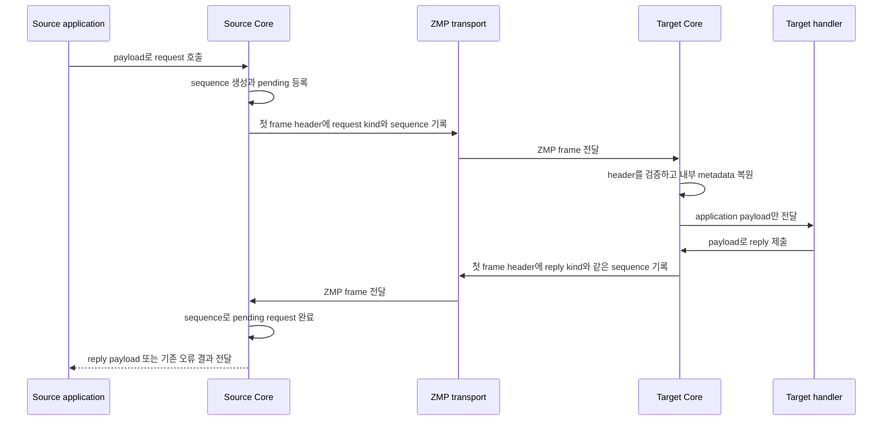

# ZMP request-reply protocol metadata 전환 계획

[문서 목차](../README.ko.md) · [전체 구현 계획](implementation-plan.ko.md)

> 이 문서는 Core의 request-reply wire 구조를 수정할 개발자를 위한 구현 계획이다.
> §3과 §11은 이번 변경에서 구현할 목표 계약이지만 보호된 정식 스펙에 반영되기 전에는
> 공개 계약 문서를 대신하지 않는다. §2는 현재 구현을, §4·§6·§8은 목표 구현을 설명한다.
> 이 문서만 읽은 작업자가 application payload 앞의 protocol envelope를 없애고,
> request 종류와 sequence를 ZMP header로 안전하게 옮길 수 있어야 한다.

관련 계약은 [ZMP 스펙](../../core/doc/spec/core/protocol/01-zmp.ko.md),
[DEALER 스펙](../../core/doc/spec/core/socket/06-dealer.ko.md),
[ROUTER 스펙](../../core/doc/spec/core/socket/07-router.ko.md),
[Proxy 스펙](../../core/doc/spec/core/07-utilities.ko.md)과
[Binding 계약](../../bindings/doc/spec/README.ko.md)이 소유한다. 이 계획은
[스펙 문서 작성 가이드](../principal/documentation/spec-writing-guide.ko.md)를 따른다.

## 1. 전환 개요

Request와 reply를 구분하는 값은 application payload가 아니라 ZMP가 전달한다. 변경 후에는
일반 `send`와 request-reply가 application이 넘긴 part 수와 byte를 그대로 유지한다.

예를 들어 application이 `[payload][empty]`를 넘기면 일반 `send`, request와 reply가 모두
두 application part를 전송한다. Request를 구분하는 `request` kind와 응답을 원래 요청에
연결하는 `request_seq`는 첫 data frame의 ZMP header에만 들어간다. 수신측 ZMP decoder는
이 값을 Core 내부 message 정보로 복원하고, application에는 payload만 전달한다.
이처럼 message의 종류와 연결할 요청을 알려 주되 payload에는 포함하지 않는 protocol 정보를
이 문서에서는 request metadata라고 부른다.

```text
SEND
[ZMP data header][application payload]

REQUEST
[ZMP request header + request sequence][application payload]

REPLY
[ZMP reply header + request sequence][application payload]
```

이 변경에서 각 주체가 맡는 일은 다음과 같다.

| 주체 | 입력과 책임 | 관찰되는 결과 |
|---|---|---|
| Application | 기존 send, request와 reply API에 payload를 넘긴다. | Protocol용 part를 만들거나 해석하지 않는다. |
| Request-reply runtime | 요청마다 sequence를 만들고 pending, timeout과 completion 상태를 관리한다. | 기존 완료·timeout·중복 reply 처리 의미가 유지된다. |
| ZMP encoder·decoder | 첫 data frame에 kind와 sequence를 기록하고 복원한다. | Transport가 달라도 같은 byte 배치를 사용한다. |
| Remote socket runtime | 복원된 kind로 raw message, request, reply와 error reply를 구분한다. | Application payload의 byte나 part 수를 바꾸지 않는다. |

이 작업은 ZMP 상호운용 계약을 호환성 없이 제자리에서 수정한다. 작업명은 `ZMP v2`이지만
wire의 `zmp_version == 0x01`과 제품·패키지 version은 유지한다. 구버전 peer와 협상하는 분기,
기존 envelope를 읽는 fallback과 migration 경로는 만들지 않는다.

- **연결된 모든 peer는 같은 Core revision의 새 wire 배치를 사용한다.** 구버전 decoder는
  새 kind 값을 `EPROTO`로 거부하고, 새 decoder는 kind가 없는 구버전 envelope를 ordinary
  data로 읽으므로 mixed-version connection과 rolling upgrade는 지원하지 않는다.
- **배포는 통신하는 peer를 함께 교체한 뒤 연결한다.** Version negotiation, feature
  capability와 구버전 frame 자동 판별은 이번 변경에 추가하지 않는다.

## 2. 현재 구조의 문제

### 2.1 Application payload로 전송되는 protocol 정보

현재 request-reply runtime은 request 하나를 보낼 때 application payload 앞에 다음 part를
붙인다.

```text
[protocol id: 1 byte]
[version: 1 byte]
[message type: 1 byte]
[request sequence: 8 bytes]
[application payload ...]
```

Application payload가 한 part이면 request는 wire에서 다섯 data frame이 된다. Perf가
`[1024-byte payload][empty]`를 사용하는 경우의 차이는 더 분명하다.

```text
SENDSEND
[1024-byte payload][empty] = 2 data frames

REQREP
[id][version][type][sequence][1024-byte payload][empty] = 6 data frames
```

11바이트의 protocol 정보 때문에 한 방향마다 data frame 네 개가 늘어난다. 각 frame에는
별도의 `msg_t`, ZMP header, multipart 상태 변경과 queue 처리가 필요하다. 따라서 현재
REQREP/SENDSEND 성능 비율에는 request 완료 관리 비용뿐 아니라 불필요한 frame 처리 비용도
함께 들어간다.

이 동작은 다음 source에서 확인할 수 있다.

- `core/src/api/socket/request_reply_protocol_internal.hpp`의
  `control_part_count`, `init_envelope_control_parts()`와 `parse_envelope()`
- `core/src/api/socket/socket_request_reply_submit_api.cpp`의 `combined` message 배열
- `core/src/api/socket/socket_request_reply_runtime_io.cpp`의 송신 배열 구성과 수신 parsing
- `core/src/api/socket/socket_request_reply_dispatch.cpp`의 request-reply 판별

### 2.2 Payload 내용으로 message 종류를 판단하는 문제

현재 `parse_envelope()`는 multipart의 앞부분이 protocol id, version, message type과
0이 아닌 sequence 모양인지 검사한다. 이 part들은 ZMP `CONTROL` frame이 아니라 일반 data
frame이다.

따라서 application이 일반 `send`로 같은 byte 모양을 보내면 수신측이 request나 reply로
잘못 판단할 수 있다. Protocol 정보와 application data가 같은 공간을 사용하기 때문에 생기는
문제다. ZMP header가 message 종류를 전달하면 수신측은 payload 내용을 추측할 필요가 없다.

### 2.3 ZMP header의 빈 kind 자리

현재 ZMP data frame은 8바이트 header를 사용한다. Byte 3은 항상 `0`이어야 하며 decoder는
다른 값을 `EPROTO`로 거부한다.

```text
 Byte:   0         1         2         3         4    5    6    7
      +---------+---------+---------+---------+---------------------+
      |  MAGIC  | VERSION |  FLAGS  |RESERVED |   PAYLOAD SIZE      |
      +---------+---------+---------+---------+---------------------+
```

`FLAGS`의 bit 0~4는 `MORE`, `CONTROL`, `IDENTITY`, `SUBSCRIBE`, `CANCEL`을 나타낸다.
일반 data header를 만드는 코드는 generic encoder와 Asio ZMP engine에 나뉘어 있다. 현행
production WS·WSS도 Asio ZMP engine을 사용한다. 따라서 두 경로가 같은 helper를 사용하게 해,
byte 3과 extension의 배치를 한 곳에서 소유한다.

관련 source는 다음과 같다.

- `core/src/runtime/protocol/zmp_protocol.hpp`
- `core/src/runtime/protocol/zmp_encoder.{hpp,cpp}`
- `core/src/runtime/protocol/zmp_decoder.{hpp,cpp}`
- `core/src/runtime/engine/asio/asio_zmp_engine.{hpp,cpp}`

## 3. 목표 wire 계약

### 3.1 Application에서 관찰하는 결과

Application은 request-reply protocol 정보를 다루지 않는다. 다음 규칙은 구현이 도달해야 할
목표 계약이며, 현재 구현과 다르면 코드를 이 규칙에 맞춘다.

- 일반 `send`에 payload N개를 넘기면 peer는 같은 N개를 받는다.
- Request에 payload N개를 넘기면 request handler는 같은 N개를 받는다.
- Reply에 payload N개를 넘기면 completion callback은 같은 N개를 받는다.
- ZMP metadata는 payload의 byte를 변경하지 않는다.
- Payload 앞 네 part가 protocol id, version, message type과 sequence 모양이어도 request
  payload로 그대로 전달된다.
- Raw send API로 request kind나 sequence를 만드는 public message API는 제공하지 않는다.

Framework의 `ZLinkMessageMetadata`는 application protocol에 속한다. ZMP request metadata는
transport protocol에 속하므로 두 정보를 합치지 않는다. Binding도 ZMP header를 만들지 않고
Core request-reply API에 application payload만 전달한다.

### 3.2 Header byte 배치

Byte 3을 message kind로 사용한다. 일반 data는 기존 8바이트 header를 유지하고,
request-reply의 첫 data frame만 8바이트 sequence를 이어 붙인다.

```text
DATA FRAME
 Byte:   0         1         2         3         4    5    6    7
      +---------+---------+---------+---------+---------------------+
      |  MAGIC  | VERSION |  FLAGS  |  KIND   |   PAYLOAD SIZE      |
      +---------+---------+---------+---------+---------------------+

REQUEST, REPLY OR ERROR REPLY FRAME
 Byte:   0         1         2         3         4    5    6    7
      +---------+---------+---------+---------+---------------------+
      |  MAGIC  | VERSION |  FLAGS  |  KIND   |   PAYLOAD SIZE      |
      +---------+---------+---------+---------+---------------------+
      |                 REQUEST SEQUENCE (64-bit BE)                |
      +-------------------------------------------------------------+
      |                    APPLICATION PAYLOAD ...                  |
      +-------------------------------------------------------------+
```

다음 선언은 wire 값을 설명하는 contract pseudocode다. 실제 public API가 아니다.

```cpp
enum zmp_message_kind : uint8_t
{
    zmp_kind_data = 0x00,        // 일반 data이며 sequence가 없다.
    zmp_kind_request = 0x01,     // 첫 request part이며 0이 아닌 sequence가 필요하다.
    zmp_kind_reply = 0x02,       // 첫 reply part이며 같은 request sequence가 필요하다.
    zmp_kind_error_reply = 0x03  // 기존 errno payload 의미를 유지하는 실패 reply다.
};
```

Payload size는 sequence extension을 제외한 application payload byte 수다. Message 하나의
최대 크기와 queue가 받아들일 수 있는 byte 상한인 HWM도 application payload byte와 기존
`sizeof(msg_t)`를 기준으로 계산한다. Header 자체의 byte 수를 application payload 제한에
더하지 않는다.

### 3.3 Multipart의 kind 위치

Request-reply kind와 sequence는 multipart의 첫 application data frame에만 기록한다.
첫 frame에 `MORE`가 있으면 이어지는 frame은 `kind=data`로 보내고 기존 `MORE` 규칙으로
multipart의 끝을 표시한다.

```text
REQUEST WITH TWO APPLICATION PARTS
[REQUEST + SEQUENCE + MORE][payload-1]
[DATA                    ][payload-2]
```

`IDENTITY`, `CONTROL`, `SUBSCRIBE`와 `CANCEL` frame은 application multipart의 시작으로
계산하지 않으며, 첫 application data frame 전의 기존 유효한 preamble 처리는 유지한다.
그러나 application multipart의 첫 data frame을 받은 뒤 마지막 data frame이 오기 전에 이
네 종류 중 하나가 나타나면 protocol 오류다. 마지막 data frame을 처리하면 decoder는
multipart 상태를 초기화해야 한다.

### 3.4 송수신 흐름

Source runtime은 application이 넘긴 첫 message에 내부 kind와 sequence를 연결한다.
ZMP encoder가 이를 header로 기록하고, target의 decoder가 다시 내부 정보로 복원한다. Socket
runtime은 복원된 kind를 request handler로 보내거나, reply를 pending request에 전달하는 전용
transport 경로인
[completion progress lane](../../core/doc/spec/core/glossary.ko.md#completion-progress-lane)으로
보낸다.



Timeout, disconnect, duplicate reply와 completion callback의 경쟁은 현재 request-reply
runtime이 계속 처리한다. Wire 표현을 바꾸어도 먼저 도착한 최종 결과(terminal result)
하나만 request를 완료하는 의미는 바꾸지 않는다.

### 3.5 잘못된 frame 처리

Decoder는 payload memory를 확보하거나 HWM 수용 여부를 판단하기 전에 header extension을
끝까지 읽고 검증한다.

| 입력 조건 | Decoder 결과 | 남는 상태 |
|---|---|---|
| Kind가 알려진 값이 아니다. | `EPROTO`로 frame을 거부한다. | Multipart와 HWM reservation을 시작하지 않는다. |
| Request-reply kind의 sequence가 `0`이다. | `EPROTO`로 frame을 거부한다. | Pending request를 만들거나 찾지 않는다. |
| Stream read가 sequence extension 1~7바이트에서 끝났다. | 다음 byte를 기다린다. | 읽은 extension byte와 decoder 상태를 유지한다. |
| Connection EOF까지 base header, sequence extension 또는 선언한 payload가 완성되지 않았다. | `EPROTO`로 connection 오류를 보고한다. | 부분 message와 frame reservation을 남기지 않는다. |
| WS binary message가 정확히 한 ZMP frame을 완성한 지점이 아닌 곳에서 끝났다. | `EPROTO`로 connection 오류를 보고한다. | 부분·추가 frame과 reservation을 남기지 않는다. |
| Request-reply kind가 multipart 중간에 나타난다. | `EPROTO`로 frame을 거부한다. | 진행 중 multipart를 정상 message로 제출하지 않는다. |
| Request-reply kind가 `CONTROL`, `IDENTITY`, `SUBSCRIBE` 또는 `CANCEL`과 함께 나타난다. | `EPROTO`로 frame을 거부한다. | 이 frame의 payload를 handler나 reply completion에 전달하지 않는다. |
| Multipart 도중 `IDENTITY`, `CONTROL`, `SUBSCRIBE` 또는 `CANCEL` frame이 나타난다. | `EPROTO`로 frame을 거부한다. | 서로 다른 message의 frame을 합치지 않는다. |

Protocol 오류로 pair가 종료되면 이 frame 자체는 request를 성공 또는 error reply로 완료하지
않는다. 이미 pending인 request는 기존 disconnect terminal 결과로 각각 한 번 완료될 수 있다.

TCP, IPC, TLS, WS와 WSS는 같은 ZMP byte 배치를 사용한다. WebSocket에서는 ZMP extension과
application payload가 같은 RFC 6455 binary message 안에 들어간다. Inproc은 wire codec을
거치지 않지만 같은 `msg_t` metadata와 socket runtime 판별 규칙을 따른다.

### 3.6 Message kind와 처리 경로

다음 표는 첫 application data part에만 적용한다. Session과 socket runtime은 유효한
`IDENTITY`, `CONTROL`, `SUBSCRIBE`, `CANCEL`과 completion progress lane의 receive-flow
control을 기존 순서대로 먼저 처리한다. Special frame의 byte 3이 `data`라고 해서 표의
completion `data` 오류 경로로 보내지 않는다.

첫 application part를 받은 socket runtime은 kind를 다음 경로 중 하나에서만 해석한다.
Application에 message를 반환하기 전에는 필요한 sequence와 reply target을 별도 runtime
상태로 옮기고, 첫 payload part의 내부 request metadata를 지운다.

| Kind | `zlink_dealer_recv_part`·`zlink_router_recv_part(_v2)` | Request completion progress lane | `zlink_recv_part`와 그 밖의 public receive | 내부 pipe·queue |
|---|---|---|---|---|
| `data` | Ordinary message로 payload를 전달한다. | `EPROTO`로 pair를 종료하며 이 frame으로 request를 완료하지 않는다. | 내부 metadata가 없는 payload를 ordinary message로 전달한다. | Message와 multipart 경계를 그대로 전달한다. |
| `request` | Source pipe와 wire sequence를 reply target으로 등록하고 아래 규칙의 sequence 또는 token과 payload를 반환한다. | `EPROTO`로 pair를 종료하며 이 frame으로 pending request를 완료하지 않는다. | Reply target을 등록하지 않고 metadata를 지운 payload를 ordinary message로 전달한다. | Kind와 sequence를 보존해 다음 ZMP encoder가 같은 request를 전달하게 한다. |
| `reply` | `EPROTO`로 pair를 종료하고 payload를 application receive에 반환하지 않는다. | Sequence에 해당하는 pending request 하나를 payload로 완료한다. | Reply 의미를 노출하지 않고 metadata를 지운 payload를 ordinary message로 전달한다. | Kind와 sequence를 보존해 다음 ZMP encoder가 같은 reply를 전달하게 한다. |
| `error_reply` | `EPROTO`로 pair를 종료하고 payload를 application receive에 반환하지 않는다. | 기존 errno payload를 해석해 sequence에 해당하는 pending request 하나를 오류로 완료한다. | Error reply 의미를 노출하지 않고 metadata를 지운 payload를 ordinary message로 전달한다. | Kind와 sequence를 보존해 다음 ZMP encoder가 같은 error reply를 전달하게 한다. |

- **Public `Message`는 request metadata를 보존하지 않는다.** Application이 받은 request나
  reply payload를 raw send API에 다시 넘기면 encoder는 `data` kind를 기록해야 한다.
- **Socket 내부 pipe·queue에서는 request metadata를 보존한다.** Decoder와 socket runtime
  사이에서 copy·move하는 동안 kind와 sequence를 잃으면 올바른 처리 경로를 선택할 수 없기
  때문이다.
- **`zlink_proxy`와 capture는 raw application message만 중계한다.** Proxy가 frame을 반대편
  raw socket이나 capture socket에 보내기 전에 request metadata를 지우므로 application part와
  multipart는 유지되지만 새 ZMP header의 kind는 `data`다.
- **지원하지 않는 kind가 DEALER·ROUTER typed receive나 completion progress lane에 들어오면
  `EPROTO`로 같은 pair를 종료한다.** 이 경우 application delivery, handler와 completion
  reply로 처리하지 않는다. Pair teardown은 이미 pending인 request를 기존 disconnect 결과로
  각각 한 번 완료할 수 있다.

ROUTER request receive는 wire sequence를 source RID와 함께 반환한다. DEALER request receive는
wire sequence를 public token으로 직접 노출하지 않는다. DEALER는 수신마다 0이 아닌 local reply
token을 만들고 `(source pipe, wire sequence)`를 저장해 token을 반환한다. Application이 그
token으로 `zlink_dealer_reply_part`를 호출하면 runtime은 저장한 source pipe로 원래 wire
sequence를 encode한다. 서로 다른 source pipe가 같은 wire sequence를 보내도 local token이
충돌하지 않아야 한다.

`error_reply`는 이번 작업에서 receive-only wire kind다. 첫 application part는 0이 아닌 errno를
담은 4바이트 big-endian 값이다. Core C completion callback에는 이 part를 제외한 나머지 payload와
`request_result_internal::from_errno()`로 매핑한 `zlink_request_result_t`를 전달하며 raw errno를
공개 인자로 추가하지 않는다. 첫 part가 없거나 4바이트가 아니거나 값이 `0`이면 callback result는
`ZLINK_REQUEST_PROTOCOL_ERROR`이고 payload part 수는 `0`이다. 상위 language binding은
`result != ZLINK_REQUEST_OK`를 각 언어의 error 경로로 바꾸고 error-reply payload를 공개하지
않는다. 새 public sender API나 내부 producer는 추가하지 않고 raw wire fixture로 수신 동작을
검증한다. 이 처리 표는 DEALER와 달리 reply·error reply를 direct receive에 노출하던 기존 ROUTER
경로도 `EPROTO`로 통일한다.

Generic proxy는 application lane만 양방향으로 중계하며 completion progress lane의 pending
상태를 연결하지 않는다. 따라서 request-reply를 proxy 너머에서 투명하게 완료하는 기능은 이번
범위에 포함하지 않는다. 이 기능이 필요하면 두 socket의 completion progress lane과 sequence
ownership을 연결하는 별도 공개 계약과 설계를 먼저 확정한다.

## 4. 목표 Core 내부 표현

### 4.1 `msg_t` 크기와 작은 message 저장 공간

Decoder가 읽은 kind와 sequence는 payload가 socket runtime에 도달할 때까지 함께 이동해야
한다. 이 정보를 저장하더라도 `msg_t`는 64바이트를 유지하고, message 안에 직접 저장할 수
있는 최대 payload인 `max_vsm_size`는 29바이트를 유지한다.

일반 data message의 init, copy, move, close와 encode 경로에는 request 전용 heap allocation,
mutex나 map 조회를 추가하지 않는다. Auxiliary가 없는 일반 message의 init과 reset은 첫 byte의
tag만 `none`으로 기록하고 비활성 overlay의 나머지 15바이트를 읽거나 매번 지우지 않는다. 전체
16바이트 `memset`을 일반 경로에 추가하지 않는 이 조건은 ABI와 일반 send 성능을 보호한다.

현재 `msg_t` 끝에는 group 정보를 저장하는 16바이트 `group_t` 영역이 있다. Socket 종류만으로
group과 request metadata의 동시 사용을 막을 수는 없으므로, 이 영역의 첫 byte를 모든 overlay가
공유하는 내부 tag로 바꾼다. Tag 값은 wire kind와 별도 namespace를 사용한다. Wire의
`request == 0x01`을 그대로 쓰면 기존 long-group 표시 값과 충돌할 수 있기 때문이다.

다음 코드는 내부 배치를 설명하는 implementation pseudocode이며 실제 type이나 API가 아니다.
모든 overlay가 byte 0의 tag를 공유하므로 바깥 discriminator를 union 앞에 추가하지 않는다.
바깥 field를 추가하면 pointer alignment 때문에 16바이트 영역이 24바이트로 커진다.

```cpp
enum class message_auxiliary_tag_t : uint8_t
{
    none,          // Auxiliary 값이 없으며 모든 init 경로의 기본값이다.
    group_short,   // Bytes 1~15에 짧은 group 문자열이 있다.
    group_long,    // 기존 pointer 위치에 긴 group record가 있다.
    request_reply  // Byte 1과 bytes 8~15에 wire kind와 sequence가 있다.
};

union message_auxiliary_t
{
    uint8_t bytes[16];

    struct
    {
        message_auxiliary_tag_t tag; // byte 0: 짧은 group임을 나타낸다.
        char value[15];              // 기존 짧은 group 저장 공간이다.
    } group_short;

    struct
    {
        message_auxiliary_tag_t tag; // byte 0: 긴 group임을 나타낸다.
        /* pointer alignment padding and the existing long-group pointer */
    } group_long;

    struct
    {
        message_auxiliary_tag_t tag; // byte 0: request metadata임을 나타낸다.
        uint8_t wire_kind;            // byte 1: request, reply 또는 error_reply다.
        uint8_t reserved[6];
        uint64_t sequence;            // byte 8~15: host-order 내부 값이다.
    } request_reply;
};

static_assert(sizeof(message_auxiliary_t) == 16);
static_assert(std::is_trivially_copyable<message_auxiliary_t>::value);
```

정확한 pointer padding은 지원 architecture의 기존 `group_t` 배치에 맞춘다. 다음 수명 규칙은
message payload 종류와 관계없이 적용한다.

| Operation | Destination auxiliary | Source auxiliary | Resource 처리 |
|---|---|---|---|
| 모든 `init*`, `init_view`, `init_external_storage` | `none`으로 시작한다. | 기존 message를 입력으로 받더라도 metadata를 복사하지 않는다. | 새 long-group 소유권을 만들지 않는다. |
| `copy` | Kind, sequence 또는 group을 보존한다. | 변경하지 않는다. | `group_long`일 때만 기존 refcount를 한 번 늘린다. |
| `move`, public `zlink_msg_adopt` | Source의 auxiliary 값을 보존한다. | 초기화된 `none` 상태가 된다. | Long-group refcount를 늘리지 않고 소유권만 옮긴다. |
| Staged buffer의 raw relocation | 16바이트를 그대로 보존한다. | 이전 storage는 별도 `close` 대상이 아니다. | Constructor·destructor가 없는 trivially-copyable 값만 허용한다. |
| Distributor·queue bitwise fan-out | 살아남은 각 copy가 같은 auxiliary 값을 가진다. | Source의 한 reference는 첫 copy로 이전되고 source는 `none`이 된다. | Payload type과 관계없이 살아남은 `group_long` copy 수만큼 refcount를 맞추고 실패한 write 몫은 반납한다. |
| `close` | Message를 invalid 상태로 만들고 auxiliary를 `none`으로 지운다. | 해당 없음 | `group_long`일 때만 pointer를 한 번 release하며 request metadata를 pointer로 해석하지 않는다. |

- **`group()`은 tag가 `group_short` 또는 `group_long`일 때만 group을 읽는다.** `none`이나
  `request_reply`이면 빈 group을 반환하고 long-group pointer 위치를 역참조하지 않는다.
- **Group과 request metadata는 동시에 설정할 수 없다.** 내부 request setter는 non-empty
  group에서 실패하고, `set_group()`은 request metadata가 있으면 실패한다. Reset helper도
  기존 long-group pointer를 release하지 않은 채 다른 tag로 덮어쓰지 않는다.
- **Auxiliary는 독립 ownership이나 destructor가 없는 16바이트 POD로 유지한다.** Staged
  multipart buffer가 message 배열을 raw relocation하므로 `optional`, owning sidecar와
  별도 heap record를 넣을 수 없다.
- **`sizeof(msg_t) == 64`와 `msg_t::max_vsm_size == 29`를 유지한다.** Auxiliary 크기와
  trivially-copyable 조건까지 static assertion으로 고정해 ABI와 작은 message 저장 한계를
  빌드 단계에서 보호한다.

내부 단위 test는 VSM, LMSG, CMSG와 ZCLMSG에서 위 수명 표를 각각 확인한다. `adopt`, view,
external storage, `add_refs`·`rm_refs`, 여러 pipe distributor fan-out과 inline capacity를 넘는
staged multipart 재할당도 포함한다. Long group과 request metadata가 복사·이동·종료 뒤 서로의
저장 공간을 해석하지 않고, fan-out write 일부가 실패해도 long-group refcount가 살아남은 copy
수와 일치하는지 확인한다. 이 배치를 16바이트 안에서 구현할 수 없으면 sidecar나 VSM 축소로
우회하지 않고 §9의 중단 조건을 따른다.

### 4.2 Encoder와 decoder의 공통 처리

ZMP data header는 allocation 없이 최대 16바이트를 채우는 새 공통 header builder 한 곳에서
만든다. Helper 이름은 구현할 때 기존 naming convention에 맞춰 정한다. Generic encoder와
production WS·WSS를 포함한 Asio ZMP engine이 이 helper를 사용한다. Control frame header는
data metadata를 만들지 않는 별도 helper로 유지할 수 있다.

Decoder는 frame 하나를 다음 상태 순서로 처리한다.

1. **Base header read** — 고정 buffer에 8바이트를 모은 뒤 magic, version, flags, kind와
   application payload 크기를 읽는다.
2. **Extension read** — request-reply kind이면 같은 고정 buffer에 sequence 8바이트를 더
   모은다. Stream read가 1~7바이트에서 끝나면 오류로 만들지 않고 다음 read를 기다린다.
3. **Header validation** — kind, flags, 0이 아닌 sequence와 multipart 위치를 모두 검증한다.
4. **Frame admission** — application payload 크기만으로 max-message-size와 HWM 수용 여부를
   확인한다.
5. **Payload read** — 수용한 `msg_t`의 payload storage를 기존 zero-copy read target으로
   사용하고 내부 kind와 sequence를 기록한다.
6. **Submission** — payload를 socket runtime에 제출한 뒤 frame과 multipart 상태를 다음
   frame에 맞게 초기화한다.

- **Fragmentation은 frame 오류가 아니다.** Base header와 extension이 한 read에 함께 오거나
  base header·extension·payload가 여러 read로 나뉘어도 같은 frame으로 완성한다. Short read를
  WS message 경계로 추측하지 않는다. WS·WSS transport는 Beast의 message-complete 상태를 async와
  speculative read 모두에서 `i_asio_transport`→Asio ZMP engine→decoder로 전달한다. Decoder의
  finalization hook은 stream EOF에서 incomplete base·extension·payload를 거부하고, WS message
  완료 시점에는 정확히 한 frame이 제출됐는지 확인한다.
- **Backpressure 재시도는 header를 다시 읽지 않는다.** `retry_frame_admission()`은 flags,
  kind, sequence, payload 크기와 body 시작 cursor를 보존하고, 재시도 뒤 payload만 읽는다.
  Frame reservation callback은 성공한 frame당 한 번만 확정하며 검증, allocation 또는
  submission이 실패하면 이미 만든 reservation을 즉시 반납한다.
- **Header 확장은 application payload를 복사하지 않는다.** TCP·IPC·TLS gather write와
  WS·WSS header buffer는 기존 고정 공간에서 최대 16바이트만 사용하고, 일반 data는 8바이트
  header와 기존 scatter/gather 경로를 유지한다. Header를 위해 heap buffer나 `vector`를
  만들지 않는다.

### 4.3 송신 message의 ownership

Request submit은 Core가 소유한 첫 application part에 내부 `request` metadata를 설정한다.
Reply submit도 첫 part에 `reply` metadata를 설정한다. `error_reply`는 §3.6에서 정한 대로
receive-only이므로 새 sender 경로를 만들지 않는다.

| 제출 형태 | Metadata를 설정하는 message | 실패 뒤 public source 상태 |
|---|---|---|
| Core single-part | Core 호출이 소비하는 유일한 application part | C part API는 성공과 실패 모두 입력을 소비하므로 빈 초기화 상태이며 metadata도 `none`이다. |
| Core staged multipart | 마지막 part를 받았을 때 staged buffer의 첫 application part | 제출한 C part는 매 호출에서 소비한다. 실패하면 staged message를 모두 정리하고 다음 제출은 새 multipart로 시작한다. |
| Binding aggregate | Binding이 public source에서 만든 Core-owned copy 또는 view의 첫 part | 언어별 public source는 해당 binding의 기존 ownership 계약을 따르며 이 계획이 새 재사용 보장을 만들지 않는다. |

- **마지막 part가 비어 있어도 metadata는 첫 buffered part에 둔다.** `[payload][empty]`에서
  final empty part에 kind를 붙이면 peer가 multipart 중간의 request로 해석하거나 첫 payload를
  ordinary data로 먼저 공개할 수 있기 때문이다.
- **첫 part가 비어 있어도 그 part가 request 시작이다.** `[empty][payload]`와 zero-byte
  single-part request도 terminal raw fast path보다 먼저 kind와 sequence를 처리한다.
- **Core에는 완성된 part 배열을 받는 public request API가 없다.** C++·.NET 등 binding의
  aggregate 호출은 Core part API를 순서대로 호출하므로, Core single-part·staged multipart와
  binding aggregate-to-part-loop 계약을 구분해 구현한다.
- **Metadata는 Core가 소비할 native handle에만 설정한다.** Envelope용 `combined`
  stack·heap 배열과 protocol용 `zlink_msg_t` 네 개는 만들지 않으며, 실패 정리 중에도
  long-group 또는 request metadata가 남은 message를 caller-visible source로 돌려주지 않는다.
- **Group이 있는 part에는 request metadata를 덮어쓰지 않는다.** Attach는 `EINVAL`로 실패하고
  public request API는 `ZLINK_SUBMIT_INVALID_ARGUMENT`를 반환한다. C 입력 part는 기존 계약대로
  소비하고 staged buffer를 전부 정리하며 pending request와 reply target을 등록하지 않는다.

Binding source ownership은
[C++ 표준 인터페이스 규칙](../../bindings/doc/spec/cpp/README.ko.md#표준-인터페이스-규칙)과
[.NET 표준 인터페이스 규칙](../../bindings/doc/spec/dotnet/README.ko.md#표준-인터페이스-규칙)이
각각 소유한다. 이 계획은 native copy·view에 metadata를 붙이는 구현만 바꾸고 public
consumption·rollback 의미는 바꾸지 않는다.

Routed와 non-routed request·reply는 같은 first-part 규칙을 사용한다. ROUTER는 받은 source
RID와 source pipe를 wire sequence와 함께 reply target으로 보존하고, duplicate·standby peer가
있어도 reply를 request를 받은 바로 그 pipe로 보낸다. DEALER는 §3.6의 local reply token과
`(source pipe, wire sequence)` mapping을 유지한다.

### 4.4 수신과 completion 처리

Socket runtime은 §3.6의 처리 경로에 따라 첫 application part의 내부 metadata를 판별한다.
Payload의 앞부분을 읽는 `parse_envelope()`와 protocol part를 건너뛰는 index 계산은 사용하지
않는다.

- **내부 control을 application kind보다 먼저 처리한다.** Completion progress lane의 유효한
  receive-flow control과 session special frame은 기존 handler가 소비한 뒤에만 application
  data kind를 판별한다.
- **Terminal frame fast path보다 kind 판별을 먼저 실행한다.** `MORE`가 없는 single-part와
  zero-byte request도 sequence와 source pipe를 reply target으로 등록한 뒤 application
  payload를 반환해야 한다.
- **Public export 직전에 request metadata를 지운다.** Request receive 결과에는 sequence를
  별도 field로 옮기고, completion에는 pending entry lookup이 끝난 뒤 payload만 넘긴다. Direct
  receive, callback과 TLS view 중 어느 경로에서도 public `Message`가 내부 kind나 sequence를
  보존하지 않는다.
- **Typed receive만 reply target을 등록한다.** `zlink_recv_part(DEALER)`와 그 밖의 raw public
  receive는 request kind도 ordinary payload로 내보내며 local reply token이나 target slot을
  만들지 않는다.
- **Socket 내부 copy·move는 metadata를 보존한다.** Pipe와 queue를 지난 message는 실제
  application receive 경계에서만 metadata를 지운다.
- **Raw proxy는 metadata 해석 경계다.** `zlink_proxy`가 반대편과 capture socket에 copy를
  보내기 전에 metadata를 지워 `data`로 encode하며 completion progress lane은 중계하지 않는다.
- **Error reply는 기존 errno payload를 completion 오류로 바꾼다.** Errno를 ZMP header로
  옮기거나 public error-reply sender를 추가하지 않는다.

Protocol part 네 개를 close·skip하는 loop와 그 수를 전제로 한 index 계산, 상수와 주석은
제거한다. Receive buffer의 inline capacity는 application multipart에도 영향을 주므로 이번
작업에서 추측으로 줄이지 않고 후속 성능 측정에서 정한다.

ROUTER와 DEALER의 multipart 수집, continuation metadata 거부와 실패 시 tail 정리는 같은
internal collector가 소유한다. Reply-target publication은 source RID와 local token 정책이
다르므로 각 socket 역할에 남긴다. Single-part receive는 collector와 frame buffer를 건너뛰어
caller output이나 thread-local public view로 바로 이동한다. 이 전환 뒤 caller가 없는 completion
sender·pending wrapper와 단순 전달만 하던 runtime-I/O helper header는 제거한다.

## 5. 변경 범위와 유지하는 동작

이 작업은 wire에서 request-reply 정보를 표현하고 판별하는 책임만 ZMP로 옮긴다.

| 영역 | 이번 작업에서 바꾸는 내용 | 유지하는 내용 |
|---|---|---|
| ZMP wire | Byte 3의 kind와 request-reply sequence extension | Magic, `zmp_version == 0x01`, 제품 version |
| Application payload | Protocol envelope part를 사용하지 않음 | Application이 넘긴 byte와 part 순서 |
| Request runtime | 첫 message에 내부 metadata 설정 | Sequence 생성, pending map, timeout과 first-completion-wins |
| Reply runtime | ZMP metadata로 pending request 조회, 잘못된 application lane kind 거부 | Callback, errno payload와 first-completion-wins 의미 |
| Transport | TCP·IPC·TLS·WS·WSS가 같은 header helper 사용, inproc가 같은 `msg_t` metadata 사용 | Transport별 framing, zero-copy와 scatter/gather |
| Socket 내부 전달 | Pipe·queue가 metadata를 보존 | 기존 multipart, source RID와 source pipe routing |
| Raw proxy | 반대편·capture 송신 전에 metadata 제거 | Application multipart와 양방향 raw forwarding |
| Framework와 bindings | Core API에 payload만 전달 | Framework application metadata와 public binding API |
| 구조적 성능 | Envelope frame·temporary message·combined buffer 제거 | Pending map, timeout scheduler와 completion callback |

§1의 일괄 전환 조건에 따라 compatibility fallback과 rolling upgrade는 지원하지 않는다.
Public message metadata API, Framework metadata codec 참조와 제품 release version 변경도 범위에
포함하지 않는다. 이 항목이 필요해지면 구현을 우회하지 않고 계획의 범위를 다시 합의한다.

## 6. 구현 순서

### 6.1 Wire 값과 `msg_t` 표현

1. `zmp_protocol.hpp`에 data, request, reply, error reply kind와 sequence 크기를 정의한다.
2. 기존 `group_t`의 첫 byte를 `none`, `group_short`, `group_long`, `request_reply` 통합 tag로
   바꾸고 wire kind와 값 namespace를 분리한다.
3. `msg_t`에 내부 request metadata setter, getter와 reset을 추가하고 group과의 동시 설정을
   거부한다.
4. 모든 `init*`, copy, move, public adopt, close, view, external storage, `add_refs`·`rm_refs`와
   raw relocation을 §4.1 수명 표에 맞춘다.
5. Auxiliary의 16바이트·trivially-copyable 조건, `msg_t` 크기와 VSM 한계를 compile-time
   assertion으로 고정한다.
6. VSM·LMSG·CMSG·ZCLMSG, long-group distributor fan-out과 staged buffer 재할당 단위 test를
   추가한다.

이 단계가 끝나면 request metadata를 설정하고 복사한 뒤 닫는 단위 test가 통과해야 한다.
Long group message도 같은 수명 test를 통과해야 다음 단계로 진행한다.

### 6.2 ZMP encoder와 decoder

1. Data header 생성 코드를 allocation 없는 공통 helper로 모은다.
2. 일반 data에는 8바이트 header, request-reply 첫 frame에는 16바이트 header를 만든다.
3. Decoder를 base-header, extension-read, validation, admission, payload와 submission 상태로
   나누고 EOF의 incomplete extension 정리를 추가한다.
4. WS·WSS transport의 message-complete 상태와 최초 data frame opcode를 Asio ZMP engine과
   decoder까지 전달해 binary message의 base·extension·payload와 정확한 frame 제출 경계를
   검증하고 text message는 ZMP parsing 전에 거부한다.
5. Kind, sequence, flags와 multipart 위치를 검증한 뒤 application payload 크기로 HWM 수용
   여부를 판단한다.
6. Extension fragmentation, backpressure 재시도와 reservation 반납 동작을 추가한다.
7. TCP·IPC·TLS·WS·WSS의 고정 header buffer와 scatter/gather 경로를 확인한다.
8. Inproc copy·move가 encoder·decoder 없이 같은 metadata를 보존하는지 확인한다.
9. Paired passive endpoint는 peer READY를 검증한 뒤 자기 READY의 transport write까지
   완료해야 socket-side lane readiness와 pair admission을 공개한다. WS·WSS의 다음 message
   read 상태는 이미 검증한 READY boundary를 다시 판정하는 근거로 사용하지 않는다.

일반 data golden test는 byte 3이 `0x00`인 기존 8바이트 결과를 유지해야 한다. 모든 encoder가
같은 request-reply golden byte를 만들어야 한다.

### 6.3 Request-reply 송신과 수신

1. `init_envelope_control_parts()`, `parse_envelope()`와 `control_part_count == 4`에 기대는 송수신
   코드를 찾는다.
2. Core single-part와 staged multipart 송신이 첫 application part에 내부 kind와 sequence를
   설정하도록 바꾼다. `[payload][empty]`는 첫 buffered part에 설정한다.
3. Envelope용 `combined` 배열, payload `vector`와 protocol message 생성을 없앤다.
4. C part API는 성공·실패 뒤 입력을 빈 초기화 상태로 두고, binding aggregate는 Core-owned
   copy·view에만 metadata를 설정한다.
5. Group과 request metadata가 충돌하면 `ZLINK_SUBMIT_INVALID_ARGUMENT`로 전체 submission을
   정리하고 pending·reply target을 만들지 않는다.
6. Terminal first frame을 포함한 수신 경로의 payload parsing을 내부 metadata 판별로 바꾼다.
7. 기존 special·receive-flow control을 먼저 처리한 뒤 §3.6의 typed receive·raw
   receive·completion progress lane 정책을 적용한다. Sequence와 source pipe를 옮긴 뒤 public
   export 전에 metadata를 지운다.
8. Pipe·queue forwarding은 metadata를 보존하고 `zlink_proxy`·capture 송신 전에는 metadata를
   지운다. Completion progress lane bridge는 추가하지 않는다.
9. Error reply decoding은 raw fixture로 유지하되 새 producer나 public sender를 만들지 않는다.
10. Protocol part를 close·skip하는 loop와 part 수를 가정한 상수·주석을 정리한다.

각 하위 경로를 한꺼번에 바꾸지 않는다. Core single-part, Core staged multipart, binding의
aggregate-to-part-loop, routed와 non-routed 경로마다 관련 contract test를 먼저 통과시킨 뒤
다음 경로로 넓힌다.

### 6.4 문서 반영

다음 문서는 저장소 규칙이 보호하는 경로다. 구현 결과를 반영하려면 정확한 경로와 변경 범위를
제시하고 사용자 승인을 받은 뒤 수정한다.

- `core/doc/spec/core/protocol/01-zmp.ko.md`
- `core/doc/spec/core/socket/06-dealer.ko.md`
- `core/doc/spec/core/socket/07-router.ko.md`
- `core/doc/spec/core/07-utilities.ko.md`의 raw proxy 경계
- `bindings/doc/spec/README.ko.md`
- 필요한 경우 같은 계약을 소유하는 영문 문서

ZMP 스펙에는 kind byte, sequence extension, multipart 위치, 잘못된 조합과 transport 공통
배치를 기록한다. DEALER·ROUTER 스펙에는 kind별 receive·completion 결과, public export 전
metadata 제거와 C part ownership을 기록한다. Proxy 스펙에는 raw proxy가 request completion
progress lane을 중계하지 않는 경계를 기록한다. Binding 계약에는 binding이 Core API로 payload만
전달하며 wire metadata를 만들지 않는다고 기록한다. 공개 문서에서 이 plan으로 연결하는 링크는
만들지 않는다.

## 7. 검증 실행

### 7.1 Core test 구성

가장 작은 test부터 다음 순서로 넓힌다.

1. 새 `unittest_msg_auxiliary` target
   - 16바이트 auxiliary, trivially-copyable, 64바이트 `msg_t`와 29바이트 VSM assertion
   - VSM·LMSG·CMSG·ZCLMSG의 init, copy, move, adopt, close, view와 external storage
   - Group과 request metadata의 상호 배타 및 long-group refcount
   - `add_refs`·`rm_refs`, 여러 pipe fan-out 실패와 inline capacity를 넘는 relocation 뒤 수명
2. `unittest_zmp_decoder`
   - 8바이트 data header와 16바이트 request-reply header
   - Sequence extension을 1~7바이트 위치마다 나눈 입력과 base·extension을 합친 입력
   - Incomplete base·extension·payload EOF, sequence `0`, 알 수 없는 kind와 금지된 flags
   - Message transport boundary가 base·extension·payload 중간에서 끝난 입력
   - Multipart 중간 kind와 multipart 도중 identity·control·subscribe·cancel frame
   - 마지막 frame 뒤 상태 초기화
   - 검증 실패 시 reservation 반납
   - Extension 뒤 backpressure 재시도에서 payload만 읽고 admission이 한 번 성공함
3. `unittest_zmp_contract_edges`
   - payload size에서 extension 제외
   - 최대 payload와 overflow
   - invalid metadata encode 거부
   - Generic encoder와 production WS·WSS integration의 request·reply·error reply golden byte
   - 일반 data header builder가 request 전용 allocation이나 sidecar를 만들지 않음
4. `test_zmp_request_reply`와 `test_zmp_request_reply_router_recv_surface`
   - §11의 application payload, request 완료, ownership과 kind 처리 요구를 나누어 소유한다.
5. `test_proxy`와 binding contract suite
   - §11의 raw proxy와 C++ ownership 요구를 기존 public contract test에 추가한다.
6. `test_zmp_metadata` raw wire fixture
   - §11의 ZMP wire·오류와 frame 수 요구를 소유한다.
7. `test_zmp_ws_wss`, `test_asio_ws`와 TLS·inproc integration target
   - 지원하는 build feature마다 §11의 transport별 관찰 결과를 같은 fixture로 실행한다.
   - WS·WSS raw fixture는 text HELLO, text data와 fragmented text data가 payload를 공개하지
     않고 연결을 종료하는지 확인한다.
   - ZMP integration은 binary message 하나에 frame이 없거나 둘 이상인 입력을 거부하는지,
     raw STREAM integration은 fragmented message와 gather threshold 이상의 routed send를 기존
     byte-stream 의미로 처리하는지 확인한다.

기존 raw request helper가 application part 네 개로 envelope를 만들면 ZMP header fixture로
바꾼다. Test를 통과시키기 위해 기대 결과를 낮추지 않는다.

### 7.2 GitHub Actions

Core는 로컬에서 build하지 않는다. 사용자가 commit과 push를 지시한 뒤 해당 commit SHA를
대상으로 `.github/workflows/build.yml`의 `workflow_dispatch`를 실행한다. Linux x64 job이
Core test를 실행하고 만든 `libzlink-linux-x64` artifact만 후속 검증에 사용한다.

검증 기록에는 workflow run ID, branch, commit SHA와 artifact 이름을 남긴다. 다른 commit의
artifact나 release asset을 대신 사용하지 않는다. Core build, ZMP unit test,
request-reply integration test와 TCP·IPC·TLS·WS·WSS 및 inproc contract가 모두 성공해야 한다. 해당
workflow에 sanitizer나 protocol 전용 job이 있으면 함께 확인한다.

이번 계획의 완료 조건에는 throughput·latency benchmark 실행을 넣지 않는다. §8의 구조적
변경을 functional·white-box test로 확인하고 실제 성능 수치 비교는 별도 성능 작업에서 수행한다.

## 8. 구조적 성능 개선과 측정 경계

이번 작업에는 protocol envelope를 없애면 실행할 필요가 사라지는 처리만 함께 제거한다.
Throughput·latency 수치의 개선 폭은 보장하지 않으며, benchmark 실행과 수치 판정은 별도 성능
작업이 소유한다.

### 8.1 함께 구현하는 비용 제거

- **Application part 하나당 ZMP data frame 하나만 송수신한다.** Request와 reply마다 만들던
  envelope용 `msg_t` 네 개의 init, move, queue 처리와 close를 제거한다.
- **Envelope와 payload를 합치기 위한 임시 container를 제거한다.** Immediate·staged request,
  routed·non-routed reply에 있던 `combined` stack array, heap array와 payload `vector`를 만들지
  않고 Core가 소유한 첫 application part에 metadata를 설정한다.
- **Staged multipart는 protocol frame 네 개를 먼저 보내지 않는다.** 첫 buffered part부터
  기존 message submission 경로로 보내므로 `[payload][empty]`도 application frame 두 개만
  queue와 encoder를 지난다.
- **수신측은 protocol part를 close하거나 건너뛰지 않는다.** Decoder가 첫 part에 복원한
  metadata를 한 번 판별하고 application part를 그대로 처리한다.
- **Header는 고정 buffer에서 한 번 조립한다.** Ordinary data는 8바이트, request-reply 첫
  frame은 16바이트를 기존 scatter/gather entry에 연결하며 header용 allocation, `vector`와
  payload copy를 추가하지 않는다.
- **Single-part fast path는 metadata를 인식한다.** `MORE`가 없는 data는 기존 terminal 경로로
  진행하고, request·reply는 multipart buffer를 만들기 전에 필요한 target 또는 completion
  상태로 바로 연결한다.
- **Typed DEALER의 single-part 수신은 caller의 terminal 출력에 바로 쓴다.** 유효한 caller
  message slot이 있으면 multipart staging과 추가 move 없이 기존 direct receive 경로로 내보낸다.
- **동기 callback과 receive admission은 바깥 호출의 소유자를 차용한다.** tracked send의 pipe
  observer와 한 record를 받는 admission callback은 호출이 반환하기 전에 끝나므로, socket handle과
  request/reply state의 retain/release atomic 연산을 record마다 추가하지 않는다.
- **ROUTER receive는 실제 routing ID만 보관·복사한다.** 수신 함수가 이미 초기화하는 output을
  전체 zero-fill하지 않고, TLS output을 직접 사용한 경우에는 자신에게 다시 복사하지 않는다.
- **Multipart completion은 연결 ID를 한 번 snapshot한다.** 하나의 logical reply를 구성하는 모든
  part는 completion write 전에 읽은 같은 transport connection ID를 사용한다.
- **Public receive의 metadata 정리는 application part 수와 무관하게 수행한다.** Decoder와
  socket assembler가 continuation의 request/reply metadata를 먼저 거부하므로 public boundary는
  첫 application part만 지운다. Raw STREAM처럼 같은 검증을 거치지 않는 경로는 기존 per-part
  방어를 유지한다.
- **Ordinary data는 request record를 만들지 않는다.** 첫 part의 kind가 `data`이면 새
  reply-target·pending entry나 request metadata sidecar를 만들지 않는다. Concurrent raw
  receive와 request가 공유하는 기존 socket state와 ownership transition은 이번 작업에서
  우회하지 않는다.
- **Request metadata는 16바이트 inline auxiliary에 둔다.** Sidecar allocation이나 별도 queue
  element를 만들지 않고 일반 data encode에는 tag 확인 한 번만 추가한다. Auxiliary가 없는
  message의 init·reset은 tag만 `none`으로 바꾸며 비활성 overlay 전체를 초기화하지 않는다.
- **Decoder의 transport-independent frame count를 제거한다.** Decoder는 base header, sequence
  extension과 payload가 끝났는지만 검증한다. WS·WSS의 binary message당 정확히 한 frame이라는
  cardinality는 실제 transport boundary에서 decoded message를 staging하는 Asio ZMP engine이
  소유한다. 따라서 TCP·IPC·TLS의 모든 frame에 WS 전용 counter 증가와 분기를 추가하지 않는다.
- **WS·WSS connection generation을 한 allocation으로 소유한다.** Beast stream과 read boundary
  snapshot을 같은 shared owner에 두어 연결마다 별도 boundary-state allocation을 만들지 않고,
  async read callback도 generation reference를 한 번만 증감한다. Close 뒤 callback은 자신이
  시작된 stream과 boundary state를 함께 보존한다.
- **Raw STREAM에는 ZMP boundary 정책을 적용하지 않는다.** Message boundary를 노출하는 WS·WSS
  transport라도 `asio_raw_engine_t`는 binary-only 검사, ZMP frame staging과 강제 ZMP gather를
  거치지 않는다. 큰 routed send는 기존 raw encoder fallback을 사용하고 fragmented WebSocket
  message는 STREAM packet assembler가 끝까지 모은다.
- **Compile-only WS ZMP engine을 제거한다.** WS·WSS factory가 generic `asio_zmp_engine_t`로
  수렴한 뒤 생성·include·공개 ABI 참조가 없던 legacy `asio_ws_engine_t`와 CMake source 항목을
  삭제한다. 같은 wire 계약의 production owner를 하나로 줄이고 불필요한 compile·binary 비용을
  없앤다.
- **Pipe 수명 판단은 쓰임새가 아닌 상태를 이름으로 표현한다.** request/reply target 이외의
  attach·dispatch·flow 처리도 같은 lifecycle predicate를 사용하고, 비어 있는 anonymous
  namespace는 제거해 transport 수명 책임을 pipe owner에 남긴다.
- **Proxy는 지원되는 poller 경로 하나만 소유한다.** `ZLINK_HAVE_POLLER == 1`인 지원 build에서
  compile되지 않는 legacy `zlink_poll()` fallback을 제거하고, 내부 transport writability를
  사용하는 implementation만 유지한다.
- **Request-reply submit은 command가 있을 때만 throttle을 우회한다.** Mailbox writer가
  inactive receiver를 깨우는 command batch에 atomic pending hint를 함께 publish한다. Direct
  submit의 commit point는 이 hint가 있을 때 queued bind·flow-state·activate-write를 즉시
  drain하고, hint가 없는 일반 reply 경로는 기존 timestamp throttle을 유지해 매 reply의
  nonblocking mailbox syscall을 피한다. Command가 없는 단순 signal은 hint를 만들지 않는다.

### 8.2 내부 확인 조건

다음 항목은 benchmark가 아니라 source inspection, unit test와 raw wire fixture로 확인한다.

- `init_envelope_control_parts()`, `control_part_count`, `parse_envelope()`와 envelope용
  `combined`·payload `vector` 경로가 request-reply 정상 송수신에서 남지 않는다.
- Ordinary data 경로에서는 새 request metadata allocation failpoint와 reply-target·pending
  entry 생성이 실행되지 않는다.
- Ordinary message의 init·reset 경로는 16바이트 auxiliary 전체를 지우지 않고 `none` tag만
  기록하며, getter와 encoder는 `none`일 때 나머지 overlay byte를 읽지 않는다.
- Header builder는 caller가 제공한 최대 16바이트 고정 buffer만 사용하고 payload pointer와
  scatter/gather 경계를 유지한다.
- Typed DEALER의 유효한 terminal output slot으로 single-part를 받으면 multipart staging이나
  추가 message move 없이 그 slot이 결과가 된다.
- Tracked request send와 typed receive admission의 동기 observer/callback은 바깥 socket handle과
  request/reply state를 차용하며, observer가 반환한 뒤에는 그 차용 참조를 보관하지 않는다.
- ROUTER direct receive는 routing ID output 전체를 미리 zero-fill하지 않고, TLS routing ID를
  직접 쓴 결과를 TLS 자신에게 다시 복사하지 않는다.
- Multipart completion의 각 part에는 completion 시작 때 snapshot한 하나의 transport connection
  ID가 기록된다.
- PAIR·DEALER·ROUTER·XSUB assembler와 ZMP decoder는 첫 application part 뒤의 request/reply
  metadata를 public export 전에 거부하고, public boundary는 첫 part만 O(1)로 정리한다. Raw
  STREAM의 public receive는 모든 part를 계속 정리한다.
- Attach·dispatch·flow 처리의 pipe lifecycle 검사는 같은 상태 predicate를 사용하며, 삭제한
  anonymous namespace를 참조하는 production source가 없다.
- Production proxy source에는 `ZLINK_HAVE_POLLER`의 compile-time 분기와 public
  `zlink_poll(POLLOUT)` fallback이 남지 않는다.
- Direct request-reply submit의 mailbox commit point는 pending-command hint가 있을 때만
  throttle을 우회한다. Hint는 실제 command wake와 함께 publish되고 drain 전에 소비되며,
  command 없는 signal이나 일반 reply마다 mailbox receive syscall을 만들지 않는다.
- Decoder에는 transport message의 decoded frame 수를 세는 상태가 없고, Asio ZMP engine이
  authoritative WS·WSS boundary 전까지만 frame publication을 보류한다.
- WS·WSS transport의 stream과 read boundary state는 같은 connection-generation aggregate에
  있으며 async read callback은 그 owner 하나만 capture한다.
- Raw STREAM/WS·WSS는 ZMP boundary staging이나 invalid ZMP gather 종료 분기로 들어가지 않고,
  fragmented receive와 gather threshold 이상의 routed send를 기존 raw 경로로 처리한다.
- Repository의 production factory, include, 설치 header와 export에는 삭제한
  `asio_ws_engine_t` 참조가 없고 WS·WSS ZMP wire test는 generic Asio ZMP engine을 통과한다.
- §4.1의 auxiliary·`msg_t`·VSM static assertion과 decoder fragmentation·backpressure test가
  통과한다.
- Paired passive endpoint의 READY write가 완료되기 전에는 socket-side ready count와 pair
  admission이 증가하지 않고, write 완료 뒤 정확히 한 번 증가한다. 이미 검증한 WS·WSS READY
  input boundary는 write-completion handshake 재진입에서 다시 검증하지 않는다.

### 8.3 별도 성능 작업

다음 항목은 결과가 workload와 transport에 따라 달라지므로 이번 구현 범위에서 바꾸거나
측정하지 않는다. §8.1의 비용 제거는 throughput·latency의 측정된 개선을 주장하지 않으며,
buffer capacity, HWM과 queue policy를 조정하지 않는다.

- Pending map·mutex, timeout scheduler, completion queue와 callback 최적화
- Generic DEALER receive의 request-state·mutex ownership transition과 kind-aware admission 재설계
- Receive buffer inline capacity를 8에서 2 또는 4로 줄이는 변경
- Multipart receive의 inline frame buffer에서 public thread-local view로 옮기는 두 번째
  container·move를 없애는 storage ownership 재설계
- Asio transport의 message-boundary capability 조회를 engine에 cache하는 변경. 측정 없이
  capability의 두 번째 source of truth를 추가하지 않는다.
- C++ native view·container와 .NET descriptor·`ArrayPool` 최적화
- Gather threshold, batch 크기, HWM과 queue 정책 변경
- C Multi throughput·latency 반복 실행과 baseline 비교

후속 성능 작업은 SENDSEND와 REQREP 모두 `[1024-byte payload][empty]` 두 part를 사용하도록
`PERF_PART_COUNT=2`를 명시하고, 같은 Release Core revision에서 TCP·WSS를 비교한다. Core
revision, payload part 수, 성공·timeout·error 수와 반복별 throughput·latency를 결과에 함께
기록한다. 이 측정 결과는 이번 protocol 변경의 완료 gate가 아니다.

## 9. 작업 중단 조건

다음 상황에서는 우회 구현을 넣지 않고 발견한 source 위치와 필요한 설계 변경을 보고한다.

- `msg_t`를 64바이트보다 키워야만 metadata를 보존할 수 있다.
- `max_vsm_size`를 29바이트보다 낮춰야 한다.
- Group과 request metadata를 구분하는 값을 16바이트 auxiliary storage 안에 둘 수 없다.
- 일반 data frame마다 새 request metadata allocation이나 reply-target·pending entry가 생긴다.
- Data header 생성 경로를 합칠 수 없어 transport마다 wire byte 조립을 중복해야 한다.
- TCP, IPC, TLS, WS와 WSS가 서로 다른 request metadata 배치를 요구한다.
- WS·WSS transport가 binary message 완료 경계를 decoder에 전달할 수 없다.
- Transparent request-reply proxy를 지원하려면 completion progress lane bridge나 새 public
  계약이 필요하다.
- Core가 Framework metadata codec을 참조해야 한다.
- Public message metadata API가 필요하다.
- 구버전 fallback, 제품 version 상승이나 release 작업이 필요하다.
- 보호 문서를 수정해야 하지만 해당 경로의 승인이 없다.
- GitHub Actions artifact가 아닌 로컬 Core build가 필요하다.
- 기존 pending, timeout이나 completion 계약을 바꿔야 wire 변경이 가능하다.

## 10. 별도 세션 작업 지시문

다음 문장을 새 세션의 첫 요청으로 사용할 수 있다.

> `doc/plan/zmp-request-reply-protocol-metadata-plan.ko.md`를 처음부터 끝까지 읽고 구현해줘.
> Request, reply와 error reply의 kind 및 request sequence를 application의 protocol envelope에서
> ZMP header로 옮겨. Application payload의 part 수와 byte는 일반 send와 같게 유지하고,
> `sizeof(msg_t) == 64`와 `max_vsm_size == 29`를 바꾸지 마. `zmp_version == 0x01`과 제품
> version을 유지하고 모든 peer를 같은 revision으로 함께 전환해. Compatibility fallback이나
> public metadata API를 만들지 마. Public receive와 raw proxy·capture 송신 전에 metadata를
> 지우되 socket 내부 pipe·queue에는 보존하고, envelope message·combined buffer·protocol part
> skip과 ordinary data의 새 request record 생성을 제거해. 실제 throughput·latency benchmark는
> §8.2의 구조 조건만 검증해. Core는 로컬에서 build하지 말고, 보호 문서는 정확한 경로와 범위를
> 승인받은 뒤 수정해.

## 11. 구현 및 contract test 검증 요구

Public C API와 binding의 send·request·reply 결과, callback·errno, proxy endpoint와 raw ZMP
wire fixture만으로 다음을 확인한다. 각 항목은 독립된 contract test로 이어진다. `msg_t` 배치,
decoder 상태와 allocation 제거처럼 내부 구조로만 확인할 조건은 §4, §7.1과 §8.2가 소유한다.

**Application payload 보존**

- 일반 send, request와 reply에 같은 multipart를 넘기면 수신측이 모두 같은 part 수, 순서와
  byte를 관찰한다.
- Zero-byte single-part, `[empty][payload]`, `[payload][empty]`와 일반 multipart로
  request-reply를 완료하면 handler와 completion callback이 application이 넘긴 part만
  관찰한다.
- Protocol id, version, message type과 sequence 모양의 네 part를 ordinary send로 보내면
  DEALER와 ROUTER receive가 sequence `0`인 raw message로 payload 전체를 그대로 전달한다.
- 이전 protocol signature와 같은 byte로 시작하는 request payload도 변경 없이 handler에
  전달된다.
- Request receive 결과나 reply callback에서 받은 payload를 raw send에 다시 사용하면 peer가
  `data` kind와 같은 application payload를 관찰한다.

**Request와 reply 완료**

- ROUTER가 request를 받으면 0이 아닌 wire sequence와 payload를 반환하고, 같은 sequence로
  보낸 reply가 원래 request 하나를 완료한다.
- DEALER가 request를 받으면 0이 아닌 local reply token과 payload를 반환하고, 그 token으로
  보낸 reply가 저장된 source pipe에 원래 wire sequence로 전달돼 원래 request 하나를
  완료한다.
- 서로 다른 source pipe 두 개가 같은 wire sequence로 DEALER에 request를 보내면 서로 다른
  local reply token이 반환되고 각 token의 reply가 해당 source request만 완료한다.
- Raw fixture가 `error_reply` kind, 0이 아닌 sequence와 첫 payload part의 0이 아닌 4바이트
  big-endian errno를 보내면 Core C callback이 해당 errno를 매핑한 `zlink_request_result_t`와
  나머지 application payload를 받는다. 첫 part가 없거나 크기·값이 잘못되면 callback은
  `ZLINK_REQUEST_PROTOCOL_ERROR`와 payload part 수 `0`을 받는다. 상위 language binding은
  두 경우의 non-OK payload를 공개하지 않고 해당 언어의 error 경로로 완료한다.
- 같은 sequence의 reply가 중복되거나 timeout·disconnect와 경쟁하면 먼저 확정된 terminal
  결과 하나만 application에 전달된다.
- Explicit RID와 duplicate·standby peer가 있는 ROUTER가 request를 받으면 reply가 같은
  sequence와 request를 전달한 source pipe로 돌아가 원래 request 하나만 완료한다.
- C part submit이 성공하거나 실패하면 입력 message는 길이 0인 초기화 상태이며, 다시
  초기화해 raw send에 사용하면 request metadata가 나타나지 않는다.
- C++ request builder의 native submit이 실패해 `submit_error_t`를 던지면 public
  `message_t`는 호출자에게 남고, 그 message를 raw send에 사용해도 request metadata가
  나타나지 않는다.

**Kind와 처리 경로**

- `zlink_dealer_recv_part`와 `zlink_router_recv_part(_v2)`에 `data`를 보내면 ordinary payload가
  전달되고, `request`를 보내면 §3.6의 local token 또는 wire sequence와 payload가 전달된다.
- `zlink_dealer_recv_part`와 `zlink_router_recv_part(_v2)`에 `reply` 또는 `error_reply`를 보내면
  pair가 protocol 오류로 종료되고 typed receive에는 payload가 전달되지 않는다.
- `zlink_recv_part(DEALER)`에 request·reply·error reply kind를 보내면 reply target이나 local
  token을 만들지 않고 ordinary payload를 전달한다. 여러 번 반복한 뒤에도 후속 typed request를
  수신·reply할 수 있으며, raw receive payload를 다시 보내면 kind는 `data`다.
- Request completion progress lane에 `reply` 또는 `error_reply`를 보내면 sequence에 해당하는 request가
  한 번 완료되고, `data` 또는 `request`를 보내면 pair가 protocol 오류로 종료되며 callback이
  해당 frame의 결과로 호출되지 않는다. Pair teardown 뒤 pending request는 기존 disconnect
  결과로 각각 한 번 완료된다.
- Network와 inproc completion progress lane에 유효한 receive-flow control을 보낸 뒤 정상
  reply를 보내면 pair가 종료되지 않고 원래 request callback이 한 번 완료된다.
- Raw fixture가 request·reply kind를 `zlink_proxy`에 보내면 반대편과 capture socket은 같은
  application multipart를 받고, 그 message를 raw wire로 다시 읽으면 kind는 `data`다.

**ZMP wire와 오류**

- 일반 data를 raw wire로 읽으면 8바이트 header의 kind가 `0x00`이고 application payload가
  바로 뒤에 온다.
- Public request와 reply의 첫 frame을 raw wire로 읽으면 16바이트 header에 해당 kind와
  0이 아닌 big-endian sequence가 있고, payload size는 application payload byte 수와 같다.
- Multipart request-reply의 둘째 frame부터 raw wire kind가 `0x00`이며 `MORE`가 application
  part 경계를 정확히 나타낸다.
- Base header, sequence extension과 payload를 여러 read로 나누어 보낸 뒤 나머지를 보내면
  request가 한 번 전달된다. 이들 중 하나를 끝내지 않은 채 connection을 끝내거나 정확히 한
  ZMP frame 경계가 아닌 위치에서 WS binary message를 끝내면 payload가 전달되지 않고 protocol
  오류로 connection이 종료된다.
- 유효한 HELLO 또는 data frame byte를 WS·WSS text message로 보내면 ZMP parsing 전에 protocol
  오류로 연결이 종료되고 payload가 전달되지 않는다. Fragmented text data도 최초 opcode를
  유지해 같은 결과를 낸다.
- 알 수 없는 kind, sequence `0`, 금지된 flag 조합, multipart 중간의 request-reply kind 또는
  multipart 도중 identity·control·subscribe·cancel frame을 보내면 peer가 payload를 handler나
  reply completion에 전달하지 않고 protocol 오류로 connection을 종료한다. 이 teardown으로
  기존 pending request가 disconnect 결과를 받는 동작은 유지된다.
- TCP, IPC, TLS, WS와 WSS로 같은 request-reply를 보내면 모든 transport에서 같은 ZMP kind와
  sequence 배치가 관찰된다.
- Inproc로 같은 request-reply를 보내면 wire codec 없이도 network transport와 같은 payload,
  sequence, reply 완료와 metadata 제거 결과가 관찰된다.

**Wire frame 수**

- SENDSEND와 REQREP에 같은 application multipart를 넘기면 raw wire에서 두 operation의
  방향별 ZMP data frame 수가 application part 수와 같다.

[문서 목차](../README.ko.md) · [전체 구현 계획](implementation-plan.ko.md)
