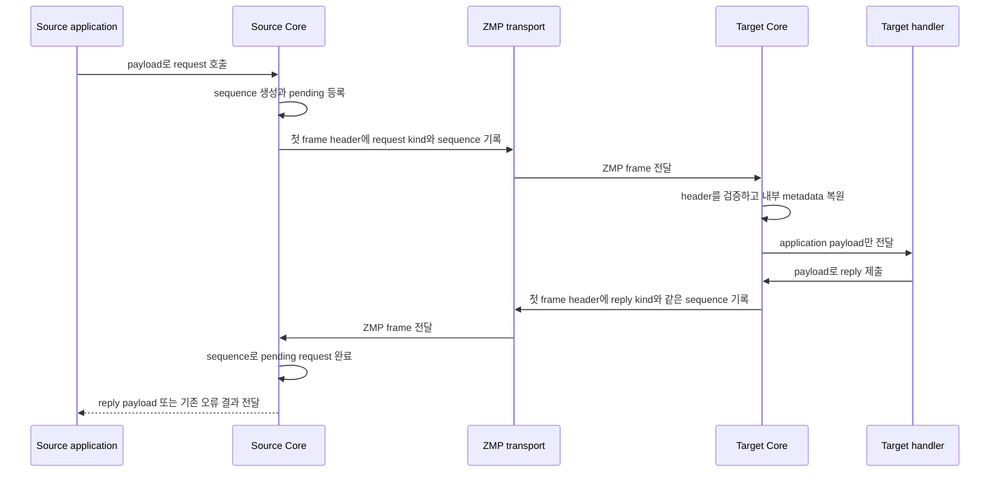

# ZMP request-reply protocol metadata 전환 계획

[ZMP 스펙](../../core/doc/spec/core/protocol/01-zmp.ko.md) ·
[Binding 계약](../../bindings/doc/spec/README.ko.md) ·
[스펙 문서 작성 가이드](../principal/documentation/spec-writing-guide.ko.md)

> 이 문서는 Core의 request-reply wire 구조를 수정할 개발자를 위한 구현 계획이다.
> 공개 계약은 아니며, 아직 구현되지 않은 목표와 현재 구현을 구분해 설명한다.
> 이 문서만 읽은 작업자가 application payload 앞의 protocol envelope를 없애고,
> request 종류와 sequence를 ZMP header로 안전하게 옮길 수 있어야 한다.

## 1. 전환 개요

Request와 reply를 구분하는 값은 application payload가 아니라 ZMP가 전달한다. 변경 후에는
일반 `send`와 request-reply가 application이 넘긴 part 수와 byte를 그대로 유지한다.

예를 들어 application이 `[payload][empty]`를 넘기면 일반 `send`, request와 reply가 모두
두 application part를 전송한다. Request를 구분하는 `request` kind와 응답을 원래 요청에
연결하는 `request_seq`는 첫 data frame의 ZMP header에만 들어간다. 수신측 ZMP decoder는
이 값을 Core 내부 message 정보로 복원하고, application에는 payload만 전달한다.
이처럼 message의 종류와 연결할 요청을 알려 주되 payload에는 포함하지 않는 protocol 정보를
이 문서에서는 request metadata라고 부른다.

```text
SEND
[ZMP data header][application payload]

REQUEST
[ZMP request header + request sequence][application payload]

REPLY
[ZMP reply header + request sequence][application payload]
```

이 변경에서 각 주체가 맡는 일은 다음과 같다.

| 주체 | 입력과 책임 | 관찰되는 결과 |
|---|---|---|
| Application | 기존 send, request와 reply API에 payload를 넘긴다. | Protocol용 part를 만들거나 해석하지 않는다. |
| Request-reply runtime | 요청마다 sequence를 만들고 pending, timeout과 completion 상태를 관리한다. | 기존 완료·timeout·중복 reply 처리 의미가 유지된다. |
| ZMP encoder·decoder | 첫 data frame에 kind와 sequence를 기록하고 복원한다. | Transport가 달라도 같은 byte 배치를 사용한다. |
| Remote socket runtime | 복원된 kind로 raw message, request, reply와 error reply를 구분한다. | Application payload의 byte나 part 수를 바꾸지 않는다. |

이 작업은 미공개 ZMP 계약을 제자리에서 수정한다. 작업명은 `ZMP v2`이지만 wire의
`zmp_version == 0x01`과 제품·패키지 version은 유지한다. 구버전 peer와 협상하는 분기,
기존 envelope를 읽는 fallback과 migration 경로는 만들지 않는다.

## 2. 현재 구조의 문제

### 2.1 Application payload로 전송되는 protocol 정보

현재 request-reply runtime은 request 하나를 보낼 때 application payload 앞에 다음 part를
붙인다.

```text
[protocol id: 1 byte]
[version: 1 byte]
[message type: 1 byte]
[request sequence: 8 bytes]
[application payload ...]
```

Application payload가 한 part이면 request는 wire에서 다섯 data frame이 된다. Perf가
`[1024-byte payload][empty]`를 사용하는 경우의 차이는 더 분명하다.

```text
SENDSEND
[1024-byte payload][empty] = 2 data frames

REQREP
[id][version][type][sequence][1024-byte payload][empty] = 6 data frames
```

11바이트의 protocol 정보 때문에 한 방향마다 data frame 네 개가 늘어난다. 각 frame에는
별도의 `msg_t`, ZMP header, multipart 상태 변경과 queue 처리가 필요하다. 따라서 현재
REQREP/SENDSEND 성능 비율에는 request 완료 관리 비용뿐 아니라 불필요한 frame 처리 비용도
함께 들어간다.

이 동작은 다음 source에서 확인할 수 있다.

- `core/src/api/socket/request_reply_protocol_internal.hpp`의
  `control_part_count`, `init_envelope_control_parts()`와 `parse_envelope()`
- `core/src/api/socket/socket_request_reply_submit_api.cpp`의 `combined` message 배열
- `core/src/api/socket/socket_request_reply_runtime_io.cpp`의 송신 배열 구성과 수신 parsing
- `core/src/api/socket/socket_request_reply_dispatch.cpp`의 request-reply 판별

### 2.2 Payload 내용으로 message 종류를 판단하는 문제

현재 `parse_envelope()`는 multipart의 앞부분이 protocol id, version, message type과
0이 아닌 sequence 모양인지 검사한다. 이 part들은 ZMP `CONTROL` frame이 아니라 일반 data
frame이다.

따라서 application이 일반 `send`로 같은 byte 모양을 보내면 수신측이 request나 reply로
잘못 판단할 수 있다. Protocol 정보와 application data가 같은 공간을 사용하기 때문에 생기는
문제다. ZMP header가 message 종류를 전달하면 수신측은 payload 내용을 추측할 필요가 없다.

### 2.3 ZMP header의 빈 kind 자리

현재 ZMP data frame은 8바이트 header를 사용한다. Byte 3은 항상 `0`이어야 하며 decoder는
다른 값을 `EPROTO`로 거부한다.

```text
 Byte:   0         1         2         3         4    5    6    7
      +---------+---------+---------+---------+---------------------+
      |  MAGIC  | VERSION |  FLAGS  |RESERVED |   PAYLOAD SIZE      |
      +---------+---------+---------+---------+---------------------+
```

`FLAGS`의 bit 0~4는 `MORE`, `CONTROL`, `IDENTITY`, `SUBSCRIBE`, `CANCEL`을 나타낸다.
일반 data header를 만드는 코드가 generic encoder, Asio ZMP engine과 WebSocket engine에
나뉘어 있으므로 byte 3의 의미를 바꿀 때는 공통 helper로 모아야 한다.

관련 source는 다음과 같다.

- `core/src/runtime/protocol/zmp_protocol.hpp`
- `core/src/runtime/protocol/zmp_encoder.{hpp,cpp}`
- `core/src/runtime/protocol/zmp_decoder.{hpp,cpp}`
- `core/src/runtime/engine/asio/asio_zmp_engine.{hpp,cpp}`
- `core/src/runtime/transports/ws/asio_ws_engine.{hpp,cpp}`

## 3. 목표 wire 계약

### 3.1 Application에서 관찰하는 결과

Application은 request-reply protocol 정보를 다루지 않는다. 다음 규칙은 구현이 도달해야 할
목표 계약이며, 현재 구현과 다르면 코드를 이 규칙에 맞춘다.

- 일반 `send`에 payload N개를 넘기면 peer는 같은 N개를 받는다.
- Request에 payload N개를 넘기면 request handler는 같은 N개를 받는다.
- Reply에 payload N개를 넘기면 completion callback은 같은 N개를 받는다.
- ZMP metadata는 payload의 byte를 변경하지 않는다.
- Payload 앞 네 part가 protocol id, version, message type과 sequence 모양이어도 request
  payload로 그대로 전달된다.
- Raw send API로 request kind나 sequence를 만드는 public message API는 제공하지 않는다.

Framework의 `ZLinkMessageMetadata`는 application protocol에 속한다. ZMP request metadata는
transport protocol에 속하므로 두 정보를 합치지 않는다. Binding도 ZMP header를 만들지 않고
Core request-reply API에 application payload만 전달한다.

### 3.2 Header byte 배치

Byte 3을 message kind로 사용한다. 일반 data는 기존 8바이트 header를 유지하고,
request-reply의 첫 data frame만 8바이트 sequence를 이어 붙인다.

```text
DATA FRAME
 Byte:   0         1         2         3         4    5    6    7
      +---------+---------+---------+---------+---------------------+
      |  MAGIC  | VERSION |  FLAGS  |  KIND   |   PAYLOAD SIZE      |
      +---------+---------+---------+---------+---------------------+

REQUEST, REPLY OR ERROR REPLY FRAME
 Byte:   0         1         2         3         4    5    6    7
      +---------+---------+---------+---------+---------------------+
      |  MAGIC  | VERSION |  FLAGS  |  KIND   |   PAYLOAD SIZE      |
      +---------+---------+---------+---------+---------------------+
      |                 REQUEST SEQUENCE (64-bit BE)                |
      +-------------------------------------------------------------+
      |                    APPLICATION PAYLOAD ...                  |
      +-------------------------------------------------------------+
```

다음 선언은 wire 값을 설명하는 contract pseudocode다. 실제 public API가 아니다.

```cpp
enum zmp_message_kind : uint8_t
{
    zmp_kind_data = 0x00,        // 일반 data이며 sequence가 없다.
    zmp_kind_request = 0x01,     // 첫 request part이며 0이 아닌 sequence가 필요하다.
    zmp_kind_reply = 0x02,       // 첫 reply part이며 같은 request sequence가 필요하다.
    zmp_kind_error_reply = 0x03  // 기존 errno payload 의미를 유지하는 실패 reply다.
};
```

Payload size는 sequence extension을 제외한 application payload byte 수다. Message 하나의
최대 크기와 queue가 받아들일 수 있는 byte 상한인 HWM도 application payload byte와 기존
`sizeof(msg_t)`를 기준으로 계산한다. Header 자체의 byte 수를 application payload 제한에
더하지 않는다.

### 3.3 Multipart의 kind 위치

Request-reply kind와 sequence는 multipart의 첫 application data frame에만 기록한다.
첫 frame에 `MORE`가 있으면 이어지는 frame은 `kind=data`로 보내고 기존 `MORE` 규칙으로
multipart의 끝을 표시한다.

```text
REQUEST WITH TWO APPLICATION PARTS
[REQUEST + SEQUENCE + MORE][payload-1]
[DATA                    ][payload-2]
```

`IDENTITY`와 `CONTROL` frame은 application multipart의 시작으로 계산하지 않는다. 그러나
application multipart의 첫 data frame을 받은 뒤 마지막 data frame이 오기 전에
`IDENTITY`나 `CONTROL` frame이 나타나면 protocol 오류다. 마지막 data frame을 처리하면
decoder는 multipart 상태를 초기화해야 한다.

### 3.4 송수신 흐름

Source runtime은 application이 넘긴 첫 message에 내부 kind와 sequence를 연결한다.
ZMP encoder가 이를 header로 기록하고, target의 decoder가 다시 내부 정보로 복원한다.
Socket runtime은 복원된 kind를 사용해 request handler나 completion lane으로 보낸다.



Timeout, disconnect, duplicate reply와 completion callback의 경쟁은 현재 request-reply
runtime이 계속 처리한다. Wire 표현을 바꾸어도 먼저 도착한 최종 결과(terminal result)
하나만 request를 완료하는 의미는 바꾸지 않는다.

### 3.5 잘못된 frame 처리

Decoder는 payload memory를 확보하거나 HWM 수용 여부를 판단하기 전에 header extension을
끝까지 읽고 검증한다.

| 입력 조건 | Decoder 결과 | 남는 상태 |
|---|---|---|
| Kind가 알려진 값이 아니다. | `EPROTO`로 frame을 거부한다. | Multipart와 HWM reservation을 시작하지 않는다. |
| Request-reply kind의 sequence가 `0`이다. | `EPROTO`로 frame을 거부한다. | Pending request를 만들거나 찾지 않는다. |
| Sequence extension이 8바이트보다 짧다. | `EPROTO`로 connection 오류를 보고한다. | 부분 message와 frame reservation을 남기지 않는다. |
| Request-reply kind가 multipart 중간에 나타난다. | `EPROTO`로 frame을 거부한다. | 진행 중 multipart를 정상 message로 제출하지 않는다. |
| Request-reply kind가 `CONTROL`, `IDENTITY`, `SUBSCRIBE` 또는 `CANCEL`과 함께 나타난다. | `EPROTO`로 frame을 거부한다. | Application handler나 completion callback을 호출하지 않는다. |
| Multipart 도중 `IDENTITY`나 `CONTROL` frame이 나타난다. | `EPROTO`로 frame을 거부한다. | 서로 다른 message의 frame을 합치지 않는다. |

TCP, IPC, WS와 WSS는 같은 ZMP byte 배치를 사용한다. WebSocket에서는 ZMP extension과
application payload가 같은 RFC 6455 binary message 안에 들어간다.

## 4. Core 내부 표현

### 4.1 `msg_t` 크기와 작은 message 저장 공간

Decoder가 읽은 kind와 sequence는 payload가 socket runtime에 도달할 때까지 함께 이동해야
한다. 이 정보를 저장하더라도 `msg_t`는 64바이트를 유지하고, message 안에 직접 저장할 수
있는 최대 payload인 `max_vsm_size`는 29바이트를 유지한다.

일반 data message의 init, copy, move, close와 encode 경로에는 request 전용 heap allocation,
mutex나 map 조회를 추가하지 않는다. 이 조건은 ABI와 일반 send 성능을 보호한다.

현재 `msg_t` 끝에는 group 정보를 저장하는 16바이트 `group_t` 영역이 있다. Request-reply를
사용하는 DEALER·ROUTER message와 group을 사용하는 RADIO·DISH message는 같은 message에서
두 정보를 함께 사용하지 않는다. 따라서 이 영역이 무엇을 담고 있는지 먼저 표시한 뒤 group과
request metadata가 나누어 쓰는 방식을 우선 적용한다.

다음 코드는 내부 배치를 설명하는 pseudocode다. 정확한 field 순서와 padding은 구현 단계에서
결정하되 전체 크기는 16바이트를 넘을 수 없다.

```cpp
struct message_auxiliary_t
{
    auxiliary_kind_t kind; // 아래 union을 group과 request 중 무엇으로 읽을지 결정한다.
    union
    {
        group_storage_t group;                  // RADIO/DISH group 정보다.
        request_reply_metadata_t request_reply; // kind와 64-bit sequence를 저장한다.
    } value;
};
```

단순 union만 두면 안 된다. 현재 `msg_t::close()`와 `copy()`는
`group.type == group_type_long`인 값을 pointer로 해석한다. 별도 `auxiliary_kind`가 없으면
request kind의 숫자를 long-group pointer 표시로 잘못 읽어 잘못된 refcount 변경이나 memory
해제가 발생할 수 있다.

이 배치를 채택하려면 다음 내부 조건을 source와 단위 test로 확인한다.

- **`close()`와 `copy()`는 `auxiliary_kind == group`일 때만 long-group pointer를
  처리한다.** Request metadata를 pointer로 해석하면 memory safety가 깨지기 때문이다.
- **Init, copy, move, close, view와 external-storage 경로가 auxiliary kind를 보존하거나
  초기화한다.** Message ownership이 바뀌어도 오래된 sequence가 남지 않아야 한다.
- **Public `group()`은 request metadata를 group으로 읽지 않는다.** 내부 저장 공간 공유가
  기존 RADIO·DISH 동작에 드러나면 안 된다.
- **DEALER·ROUTER request-reply와 RADIO·DISH group metadata의 동시 설정을 거부한다.**
  같은 union을 두 의미로 동시에 사용할 수 없기 때문이다.
- **`sizeof(message_auxiliary_t) <= 16`, `sizeof(msg_t) == 64`와
  `msg_t::max_vsm_size == 29`를 static assertion과 단위 test로 고정한다.** 구조 변경으로
  일반 message 비용이 커지는 회귀를 빌드 단계에서 막기 위해서다.

16바이트 안에서 안전한 discriminator를 둘 수 없으면 decoder나 session이 별도 정보를
보관하는 sidecar를 비교한다. Sidecar가 frame마다 allocation이나 별도 queue element를
만들어야 한다면 채택하지 않는다. Request metadata 때문에 VSM 한계를 낮추는 방식도
채택하지 않는다.

### 4.2 Encoder와 decoder의 공통 처리

ZMP data header는 `build_zmp_data_header()` 계열의 공통 helper 한 곳에서 만든다. Generic
encoder, Asio ZMP engine과 WebSocket engine이 같은 helper를 사용해야 transport마다 kind와
sequence byte 배치가 달라지지 않는다. Control frame header는 data metadata를 만들지 않는
별도 helper로 유지할 수 있다.

Decoder는 다음 순서로 frame을 처리한다.

1. 8바이트 base header에서 magic, version, flags, kind와 application payload 크기를 읽는다.
2. Kind와 flags 조합을 검증한다.
3. Request-reply kind이면 8바이트 sequence를 추가로 읽고 `0`이 아닌지 확인한다.
4. Multipart 위치가 kind와 맞는지 확인한다.
5. Application payload 크기로 max-message-size와 HWM 수용 여부를 확인한다.
6. 수용할 수 있으면 payload memory를 준비하고 kind와 sequence를 `msg_t`에 기록한다.
7. Payload를 읽은 뒤 message를 socket runtime에 제출한다.

HWM 때문에 5단계에서 잠시 멈추면 `retry_frame_admission()`은 kind, sequence, payload 크기와
read cursor를 그대로 유지한다. 다시 시도해 수용에 성공했을 때 frame reservation callback은
한 번만 성공해야 한다. Header 검증이나 memory 준비가 실패하면 만들어진 reservation을
즉시 반납한다.

TCP·IPC gather write와 WS·WSS header buffer는 최대 16바이트 ZMP header를 담아야 한다.
일반 data는 계속 8바이트 header와 기존 gather write 경로를 사용한다.

### 4.3 송신 message의 ownership

Request submit은 Core가 소유권을 넘겨받은 첫 application part에 내부 `request` metadata를
설정한다. Reply와 error reply도 각각 `reply`, `error reply` metadata를 같은 위치에 설정한다.
Multipart를 한 part씩 제출하는 API는 마지막 part가 들어와 전체 message가 완성되는 시점에
첫 part를 표시한다.

목표 구현은 envelope용 `combined` stack·heap 배열과 protocol용 `zlink_msg_t` 네 개를
구성하지 않는다. 가능한 경우 Core가 이미 소유한 staged message에 metadata를 설정한다. 호출자가
아직 소유한 message를 잠시 수정해야 한다면 범위를 벗어날 때 자동으로 되돌리는 guard를
사용한다. Allocation 실패, backpressure나 send 실패 뒤 ownership이 호출자에게 남으면
message는 일반 data 상태와 `request_seq == 0`으로 돌아와야 한다.

다음 송신 형태를 각각 확인한다.

- 즉시 보내는 single-part request
- 한 part씩 모은 뒤 보내는 multipart request
- 완성된 part 배열을 한 번에 보내는 request
- Routed와 non-routed request·reply
- Error reply의 기존 errno payload

### 4.4 수신과 completion 처리

Socket runtime은 첫 application part의 내부 metadata로 raw, request, reply와 error reply를
구분한다. Payload의 앞부분을 읽는 `parse_envelope()`와 protocol part를 건너뛰는 index 계산은
사용하지 않는다.

Request 전용 receive와 handler에는 sequence를 별도 결과로 전달하되 payload에는 application
part만 남긴다. Reply를 받은 completion lane은 내부 sequence로 pending entry를 찾는다.
Error reply의 errno payload 형식과 이를 callback 오류로 바꾸는 동작은 유지한다. Errno를
ZMP header field로 옮기는 일은 이 계획의 범위가 아니다.

일반 receive로 전달하는 public `Message`에는 request kind나 sequence property를 추가하지
않는다. Receive buffer의 inline capacity는 application payload part 수를 기준으로 다시
계산하며, protocol part 네 개를 전제로 한 상수와 주석은 함께 정리한다.

## 5. 변경 범위와 유지하는 동작

이 작업은 wire에서 request-reply 정보를 표현하고 판별하는 책임만 ZMP로 옮긴다.

| 영역 | 이번 작업에서 바꾸는 내용 | 유지하는 내용 |
|---|---|---|
| ZMP wire | Byte 3의 kind와 request-reply sequence extension | Magic, `zmp_version == 0x01`, 제품 version |
| Application payload | Protocol envelope part를 사용하지 않음 | Application이 넘긴 byte와 part 순서 |
| Request runtime | 첫 message에 내부 metadata 설정 | Sequence 생성, pending map, timeout과 first-completion-wins |
| Reply runtime | ZMP metadata로 pending request 조회 | Callback, direct receive와 error completion 의미 |
| Framework와 bindings | Core API에 payload만 전달 | Framework application metadata와 public binding API |
| C perf | 새 Core가 같은 application part 수를 wire로 보냄 | `[1024-byte payload][empty]` 측정 정책 |

Compatibility fallback, public message metadata API, Framework metadata codec 참조와 제품 release
version 변경은 범위에 포함하지 않는다. 이 항목이 필요해지면 구현을 우회하지 않고 계획의
범위를 다시 합의한다.

## 6. 구현 순서

### 6.1 Wire 값과 `msg_t` 표현

1. `zmp_protocol.hpp`에 data, request, reply, error reply kind와 sequence 크기를 정의한다.
2. `msg_t`에 내부 setter, getter와 reset 동작을 추가한다.
3. Auxiliary storage에 discriminator를 두고 group과 request metadata의 동시 사용을 막는다.
4. Init, copy, move, close, view와 external-storage 단위 test를 추가한다.
5. `msg_t` 크기, VSM 한계와 auxiliary storage 크기를 compile-time과 runtime test로 고정한다.

이 단계가 끝나면 request metadata를 설정하고 복사한 뒤 닫는 단위 test가 통과해야 한다.
Long group message도 같은 수명 test를 통과해야 다음 단계로 진행한다.

### 6.2 ZMP encoder와 decoder

1. Data header 생성 코드를 공통 helper로 모은다.
2. 일반 data에는 8바이트 header, request-reply 첫 frame에는 16바이트 header를 만든다.
3. Decoder에 kind, sequence와 multipart 위치 검증을 추가한다.
4. 검증을 마친 application payload 크기로 HWM 수용 여부를 판단한다.
5. Backpressure 재시도와 reservation 반납 동작을 추가한다.
6. TCP, IPC, WS와 WSS의 gather header buffer를 확인한다.

일반 data golden test는 byte 3이 `0x00`인 기존 8바이트 결과를 유지해야 한다. 모든 encoder가
같은 request-reply golden byte를 만들어야 한다.

### 6.3 Request-reply 송신과 수신

1. `init_envelope_control_parts()`와 `control_part_count == 4`에 기대는 코드를 찾는다.
2. 송신 경로가 첫 application part에 내부 kind와 sequence를 설정하도록 바꾼다.
3. Envelope용 `combined` 배열과 protocol message 생성을 없앤다.
4. 실패 시 호출자 소유 message의 metadata를 되돌린다.
5. 수신 경로의 `parse_envelope()`를 내부 metadata 판별로 바꾼다.
6. Handler와 completion lane에 application payload와 sequence를 각각 전달한다.
7. Protocol part 수를 가정한 receive buffer 상수와 주석을 정리한다.

각 하위 경로를 한꺼번에 바꾸지 않는다. Immediate single-part, staged multipart,
complete-array, routed와 non-routed 경로마다 관련 contract test를 먼저 통과시킨 뒤 다음
경로로 넓힌다.

### 6.4 문서 반영

다음 문서는 저장소 규칙이 보호하는 경로다. 구현 결과를 반영하려면 정확한 경로와 변경 범위를
제시하고 사용자 승인을 받은 뒤 수정한다.

- `core/doc/spec/core/protocol/01-zmp.ko.md`
- `bindings/doc/spec/README.ko.md`
- 필요한 경우 같은 계약을 소유하는 영문 문서

ZMP 스펙에는 kind byte, sequence extension, multipart 위치, 잘못된 조합과 transport 공통
배치를 기록한다. Binding 계약에는 binding이 Core API로 payload만 전달하며 wire metadata를
만들지 않는다고 기록한다. 공개 문서에서 이 plan으로 연결하는 링크는 만들지 않는다.

## 7. 검증 실행

### 7.1 Core test 구성

가장 작은 test부터 다음 순서로 넓힌다.

1. `unittest_zmp_decoder`
   - 8바이트 data header와 16바이트 request-reply header
   - 0이거나 잘린 sequence, 알 수 없는 kind와 금지된 flags
   - multipart 중간 kind와 multipart 도중 identity·control frame
   - 마지막 frame 뒤 상태 초기화
   - 검증 실패 시 reservation 반납
   - backpressure 재시도 뒤 metadata 보존과 admission 1회 성공
2. `unittest_zmp_contract_edges`
   - payload size에서 extension 제외
   - 최대 payload와 overflow
   - invalid metadata encode 거부
   - generic, Asio ZMP와 WebSocket encoder의 같은 header byte
3. `test_zmp_request_reply`
   - DEALER→ROUTER와 ROUTER→ROUTER
   - single-part, multipart와 empty payload
   - timeout, duplicate reply, error reply와 disconnect
   - callback과 direct receive
   - 모든 submit 형태와 실패 뒤 message 재사용
4. `test_zmp_request_reply_router_recv_surface`
   - payload part 수 보존
   - raw send와 request 구분
5. WS·WSS protocol test
   - TCP와 같은 ZMP metadata 배치
   - RFC 6455 binary message 안의 header와 payload 경계
6. Raw wire fixture
   - 이전 envelope와 같은 raw multipart가 ordinary message로 전달됨
   - 같은 byte로 시작하는 request payload가 변경되지 않음

기존 raw request helper가 application part 네 개로 envelope를 만들면 ZMP header fixture로
바꾼다. Test를 통과시키기 위해 기대 결과를 낮추지 않는다.

### 7.2 GitHub Actions

Core는 로컬에서 build하지 않는다. 사용자가 commit과 push를 지시한 뒤 해당 commit SHA를
대상으로 `.github/workflows/build.yml`의 `workflow_dispatch`를 실행한다. Linux x64 job이
Core test를 실행하고 만든 `libzlink-linux-x64` artifact만 후속 검증에 사용한다.

검증 기록에는 workflow run ID, branch, commit SHA와 artifact 이름을 남긴다. 다른 commit의
artifact나 release asset을 대신 사용하지 않는다. Core build, ZMP unit test,
request-reply integration test와 TCP·IPC·WS·WSS contract가 모두 성공해야 한다. 해당
workflow에 sanitizer나 protocol 전용 job이 있으면 함께 확인한다.

## 8. 성능 비교

성능 비교의 목적은 application frame 감소가 C Multi request-reply에 미친 영향을 확인하는
것이다. Perf 구현이나 payload 정책을 바꾸어 결과를 맞추지 않는다.

| 비교 조건 | 고정 값 |
|---|---|
| Client 수 | 100 |
| I/O thread 수 | 4 |
| Application payload | `[1024-byte payload][empty]` 두 part |
| Transport | TCP, WSS |
| Build | Release |
| 최종 반복 | Case별 5회 |
| 비교 기준 | 변경 전과 같은 official Core artifact 계열 |

먼저 `DEALER_ROUTER_SENDSEND`, `DEALER_ROUTER_REQREP`,
`ROUTER_ROUTER_SENDSEND`, `ROUTER_ROUTER_REQREP`을 비교한다. 그 뒤 모든 C Multi pattern을
TCP와 WSS, 1024바이트로 한 번씩 실행해 기능 smoke도 확인한다.

결과에는 각 case의 5회 throughput과 중앙값, latency 중앙값과 tail,
REQREP/SENDSEND throughput 비율, 변경 전후 REQREP 변화율, 성공·timeout·error case 수와
사용한 Core artifact revision을 기록한다.

변경 전 기준 파일은
`bindings/c/perf/results/multi/report/perf_c_multi_linux_20260830_022104_final-0146-c-baseline-r5.txt`다.

| Pattern | TCP throughput | WSS throughput |
|---|---:|---:|
| DEALER_ROUTER_SENDSEND | 207.532 Kmsg/s | 142.971 Kmsg/s |
| DEALER_ROUTER_REQREP | 82.207 Kmsg/s | 85.940 Kmsg/s |
| REQREP/SENDSEND | 39.6% | 60.1% |
| ROUTER_ROUTER_SENDSEND | 159.280 Kmsg/s | 165.580 Kmsg/s |
| ROUTER_ROUTER_REQREP | 91.540 Kmsg/s | 86.620 Kmsg/s |
| REQREP/SENDSEND | 57.5% | 52.3% |

Frame 수가 줄어도 특정 throughput을 보장하지 않는다. Pending map, timeout scheduler와
completion callback 비용은 남는다. 다만 wire fixture에서 SENDSEND와 REQREP의 application
frame 수는 같아야 한다. REQREP 처리량이 악화되면 원인을 설명하기 전에는 작업을 완료하지
않는다.

## 9. 작업 중단 조건

다음 상황에서는 우회 구현을 넣지 않고 발견한 source 위치와 필요한 설계 변경을 보고한다.

- `msg_t`를 64바이트보다 키워야만 metadata를 보존할 수 있다.
- `max_vsm_size`를 29바이트보다 낮춰야 한다.
- Group과 request metadata를 구분하는 값을 16바이트 auxiliary storage 안에 둘 수 없다.
- 일반 data frame에도 request 전용 allocation, map 조회나 mutex 비용이 생긴다.
- Data header 생성 경로를 합칠 수 없어 transport마다 wire byte 조립을 중복해야 한다.
- TCP, IPC, WS와 WSS가 서로 다른 request metadata 배치를 요구한다.
- Core가 Framework metadata codec을 참조해야 한다.
- Public message metadata API가 필요하다.
- 구버전 fallback, 제품 version 상승이나 release 작업이 필요하다.
- 보호 문서를 수정해야 하지만 해당 경로의 승인이 없다.
- GitHub Actions artifact가 아닌 로컬 Core build가 필요하다.
- 기존 pending, timeout이나 completion 계약을 바꿔야 wire 변경이 가능하다.

## 10. 별도 세션 작업 지시문

다음 문장을 새 세션의 첫 요청으로 사용할 수 있다.

> `doc/plan/zmp-request-reply-protocol-metadata-plan.ko.md`를 처음부터 끝까지 읽고 구현해줘.
> Request, reply와 error reply의 kind 및 request sequence를 application의 protocol envelope에서
> ZMP header로 옮겨. Application payload의 part 수와 byte는 일반 send와 같게 유지하고,
> `sizeof(msg_t) == 64`와 `max_vsm_size == 29`를 바꾸지 마. `zmp_version == 0x01`과 제품
> version을 유지하고 compatibility fallback이나 public metadata API를 만들지 마. Core는
> 로컬에서 build하지 말고, 보호 문서는 정확한 경로와 범위를 승인받은 뒤 수정해.

## 11. 구현 및 contract test 검증 요구

Public C API의 send·request·reply 결과, callback·errno와 raw ZMP wire fixture만으로 다음을
확인한다. 각 항목은 독립된 contract test로 이어진다. `msg_t` 배치와 helper 공유처럼 내부
구조로만 확인할 조건은 §4와 §7.1의 단위 test가 소유한다.

**Application payload 보존**

- 일반 send, request와 reply에 같은 multipart를 넘기면 수신측이 모두 같은 part 수, 순서와
  byte를 관찰한다.
- Empty, single-part와 multipart payload로 request-reply를 완료하면 handler와 completion
  callback이 application이 넘긴 part만 관찰한다.
- Protocol id, version, message type과 sequence 모양의 네 part를 ordinary send로 보내면
  request로 처리되지 않고 raw payload 전체가 그대로 전달된다.
- 이전 protocol signature와 같은 byte로 시작하는 request payload도 변경 없이 handler에
  전달된다.

**Request와 reply 완료**

- DEALER→ROUTER와 ROUTER→ROUTER request를 보내면 receiver가 0이 아닌 sequence와 payload를
  받고, 같은 sequence로 보낸 reply가 원래 request 하나를 완료한다.
- Error reply를 받으면 기존 errno와 callback 결과가 유지되고 application reply payload가
  기존 규칙대로 전달된다.
- 같은 sequence의 reply가 중복되거나 timeout·disconnect와 경쟁하면 먼저 확정된 terminal
  결과 하나만 application에 전달된다.
- Submit이 실패해 message ownership이 caller에게 남으면 caller가 같은 message를 ordinary
  send에 다시 사용해도 request로 분류되지 않는다.

**ZMP wire와 오류**

- 일반 data를 raw wire로 읽으면 8바이트 header의 kind가 `0x00`이고 application payload가
  바로 뒤에 온다.
- Request, reply와 error reply의 첫 frame을 raw wire로 읽으면 16바이트 header에 해당 kind와
  0이 아닌 big-endian sequence가 있고, payload size는 application payload byte 수와 같다.
- Multipart request-reply의 둘째 frame부터 raw wire kind가 `0x00`이며 `MORE`가 application
  part 경계를 정확히 나타낸다.
- 알 수 없는 kind, sequence `0`, 잘린 sequence, 금지된 flag 조합이나 multipart 중간의
  request-reply kind를 보내면 peer가 payload를 handler나 callback에 전달하지 않고 protocol
  오류로 connection을 종료한다.
- TCP, IPC, WS와 WSS로 같은 request-reply를 보내면 모든 transport에서 같은 ZMP kind와
  sequence 배치가 관찰된다.

**성능 측정 의미**

- C Multi의 SENDSEND와 REQREP에 `[1024-byte payload][empty]`를 넘기면 raw wire에서 두
  operation 모두 왕복 방향마다 application data frame 두 개가 관찰된다.
- 지정한 Release artifact로 TCP와 WSS case를 반복 실행하면 모든 측정 결과가 같은 Core
  revision, 반복별 throughput·latency와 성공·실패 수를 함께 기록한다.

[ZMP 스펙](../../core/doc/spec/core/protocol/01-zmp.ko.md) ·
[Binding 계약](../../bindings/doc/spec/README.ko.md) ·
[스펙 문서 작성 가이드](../principal/documentation/spec-writing-guide.ko.md)
