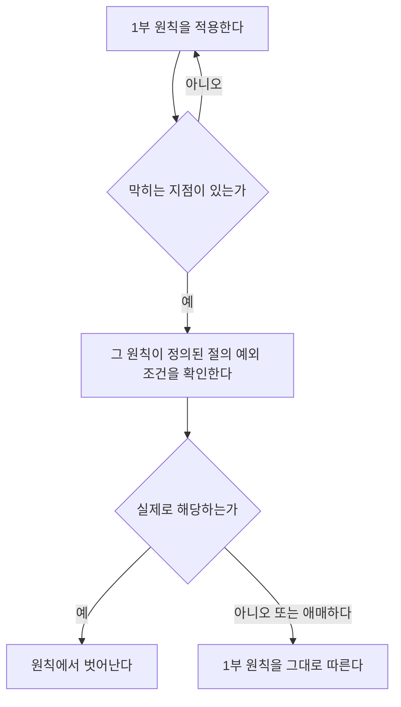

# POSDDD — 소프트웨어 개발 설계 원칙

> 코드를 생성·검토·수정할 때 그대로 적용하는 범용 설계 규칙.
> *A Philosophy of Software Design* (John Ousterhout)과 *Domain-Driven Design*
> (Eric Evans, 2003)의 설계 철학을 하나의 원칙 체계로 담는다. 특정 언어·프레임워크·
> 프로젝트에 묶이지 않는다.
>
> 두 책은 같은 문제를 다른 고도에서 다룬다 — **경계를 어디에 긋고, 그 경계 뒤에
> 무엇을 숨길 것인가.** Ousterhout은 그 경계를 모듈 단위로, Evans는 도메인 의미
> 단위로 본다. 어느 쪽도 혼자서는 완결되지 않는다 — Ousterhout은 경계 뒤에 무엇을
> 숨겨야 좋은지는 알려주지만 경계 자체를 어디서 찾는지는 답하지 않고, DDD는 경계를
> 찾는 절차(이벤트 스토밍, bounded context)는 주지만 그 경계가 구조적으로 잘
> 그어졌는지 채점하는 기준은 안 준다. 이 문서가 둘을 한 체계로 묶는 이유가 그것이다.
> 정확히 어디서 서로의 빈틈을 메우는지는 뒤쪽 "DDD ↔ POSD가 상호보완하는 지점"
> 절에 정리해 뒀다.
>
> **독자**: 코드를 생성·검토·수정하는 개발자(사람 또는 에이전트)이며, "이 설계
> 결정이 지금 맞는 방향인가"라는 질문에 대한 답을 찾는다. 프로젝트나 언어를
> 가리지 않고 적용 가능한 판단 기준이 필요할 때 이 문서를 연다.

이 문서는 다음 부분으로 나뉜다.

- **기본 원칙(1부)** — 대부분의 프로젝트에 그대로 적용한다. POSD의 복잡성 관리
  원칙과 DDD의 경계·언어 원칙이 함께 들어 있고, 깊은 모듈을 실제로 만들어내는
  절차, 원칙에서 벗어나도 되는 조건까지 포함한다.
- **아키텍처 레이아웃 선택(2부)** — 1부에서 찾은 경계를 헥사고날·레이어드 같은
  구체적인 코드 구조로 배치하는 방법. 이 부만 선택지다 — 채택 여부는 프로젝트마다
  다르다.
- **얕은 모듈 스멜 카탈로그** — 코드 리뷰 중 막혔을 때 찾아보는, 이름 붙은 증상·
  처방 목록. 위험 신호 체크리스트가 빠른 스캔용이라면 카탈로그는 각 항목의 상세
  판본이다.
- **DDD ↔ POSD가 상호보완하는 지점** — 두 체계를 왜 하나로 묶었는지, 정확히 어디서
  서로의 빈틈을 메우는지 정리한다.

---

# 1부 — 기본 원칙

## 핵심 전제

**소프트웨어 개발에서 가장 근본적인 문제는 복잡성이다.**
복잡성은 시스템을 이해하기 어렵게, 바꾸기 어렵게 만들고 버그를 부른다.
그래서 모든 설계 결정은 "이게 복잡성을 줄이는가, 늘리는가"를 기준으로 판단한다.

복잡성은 세 가지 증상으로 드러난다:

| 증상 | 설명 |
|---|---|
| **변경 증폭** | 작은 변경 하나가 여러 곳의 수정을 부른다 |
| **인지 부하** | 모듈을 이해하거나 쓰려면 너무 많은 것을 알아야 한다 |
| **미지의 미지** | 무엇을 알아야 하는지조차 모른다 — 셋 중 가장 위험하다 |

복잡성의 뿌리는 둘이다:

- **의존성** — 코드를 따로 떼어 이해하거나 바꿀 수 없다.
- **불명확성** — 정작 중요한 정보가 눈에 안 보인다.

복잡성은 한 방에 생기지 않는다. 작은 군더더기 수백 개가 쌓여서 생긴다.
그래서 **사소한 것도 그냥 넘기지 않는다.**

## 마음가짐: 전술적으로가 아니라 전략적으로

전술적 프로그래밍은 "일단 돌아가게만 만들자"는 태도다. 작업마다 복잡성이 조금씩 붙고,
몇 달이 지나면 코드베이스는 손대기 무서운 상태가 된다. "전술적 토네이도" — 빠르고
생산적으로 보이는 개발자 — 는 관리자 눈엔 영웅이지만, 그 코드를 물려받는 팀원에겐 악몽이다.

전략적 프로그래밍은 "시스템을 계속 키우기 쉽게 만들자"는 태도다.
개발 시간의 **10–20%**를 설계에 쓴다. 이 투자는 6–18개월 뒤 전술적 방식을 추월해,
그 뒤로는 영구적으로 더 빠른 개발 속도를 돌려준다.

**목표는 "동작하는 코드"가 아니다. "동작하면서 잘 설계된 코드"다.**

작업할 때:

- 처음 떠오른 구현을 곧바로 고르지 않는다. 최소 두 가지 설계를 비교한다.
- 마감을 핑계로 복잡성을 추가하지 않는다. 그 비용은 복리로 불어나 나중에 더 크게 돌아온다.
- 기존 코드를 고칠 땐 조금이라도 더 나은 상태로 남긴다. 작업하다 마주친 주변 설계 문제도 함께 손본다.
  단, 변경 반경이 리뷰·롤백을 어렵게 만들 정도로 커지면 별도 변경으로 분리한다.
- 문제를 우회하고 싶을 때일수록 근본 원인을 찾아 고친다.
- 안전 검사나 추상화를 "지름길"이라며 건너뛰지 않는다.

## 깊은 모듈

**이 문서를 통틀어 가장 중요한 개념이다.**

좋은 모듈은 **작은 문 뒤에 큰 방**이 있는 구조다. 문(인터페이스)이 작을수록
드나들기 쉽고, 방(구현)이 클수록 안에서 할 수 있는 일이 많다 — **문은 작게,
방은 크게 짓는다.**

숫자로 옮기면 문의 크기가 인터페이스(비용), 방의 크기가 구현(이득)이다.

> **깊이 = 방 ÷ 문 = 구현 ÷ 인터페이스**

깊은 모듈은 이 비율이 큰 모듈이다 — 문을 좁히거나 방을 넓히거나, 둘 중
하나만 해도 깊어진다. 문만 크고 방은 좁으면 얕은 모듈이다.

| 깊은 모듈 (좋은 예) | 얕은 모듈 (나쁜 예) |
|---|---|
| Unix `open/read/write/close/lseek` — 호출 5개로 모든 I/O 처리 | 여러 단계를 조합해야 기본 동작 하나가 되는 클래스 체인(예: Java `FileInputStream→BufferedInputStream→ObjectInputStream`) |
| 가비지 컬렉터 — 인터페이스 없이 메모리를 조용히 관리 | 모든 필드에 getter와 setter |
| TCP — 패킷 손실·재전송·순서를 전부 숨김 | 아무것도 더하지 않고 그대로 넘기는 위임 래퍼 |

판단 기준은 "여러 클래스로 나뉘었는가"가 아니라, 각 계층이 **실제 책임을 추가하는가**,
아니면 **호출자에게 개념 부담만 늘리는가**다.

"클래스가 많을수록 좋은 설계"라는 잘못된 믿음을 따라가면, 작고 얕은 클래스가 끝없이
늘어나는 병에 걸린다. 클래스 하나하나는 단순해 보이지만, 인터페이스 복잡성을 다 합치면
거대해진다 — 이 병을 **클래시티스(Classitis)**라 부른다. **작은 것이 미덕이 아니다.
깊은 것이 미덕이다.**

규칙:

- 작은 API 여러 개보다, 기능이 강한 API 몇 개를 택한다.
- 인터페이스가 구현만큼 복잡하다면 그 추상화는 값을 못 한다 — 얕은 모듈이다.
- **단순한 인터페이스 > 단순한 구현.** 복잡성은 안에서 흡수하고, 호출자에게는 깔끔한 표면만 준다.
- 기본 동작은 설정 없이도 흔한 경우를 처리해야 한다.

**예외 — 변환이 목적인 코드.** 어댑터·드라이버·anti-corruption layer처럼 존재 목적
자체가 인터페이스 변환인 코드는 얇은 게 정상이다. 이때 판단 기준은 깊이 비율이
아니라 **아래 계층의 세부를 실제로 숨기는가**다. 프로토콜 필드명이 도메인 쪽으로
그대로 넘어가고 있다면 그건 얕은 게 아니라 변환을 안 하고 있는 것이다(스멜
카탈로그 #14 "도메인 침식 어댑터"의 반대 증상).

## 깊은 모듈을 만드는 절차

앞 절이 깊은 모듈이 "무엇"인지 정의했다면, 이 절은 "어떻게 거기 도달하는가"를
다룬다. 정보 은닉 개념의 원형인 Parnas(1972, "On the Criteria to Be Used in
Decomposing Systems into Modules")의 기준이 출발점이다:

> 모듈 경계를 어디에 그을지 모르겠으면, 이 영역에서 **독립적으로 바뀔 수 있는
> 설계 결정이 뭔가**를 먼저 나열한다. 그 목록의 항목 하나하나가 모듈 후보다.

이걸 다섯 단계로 풀면 아래와 같다.

1. **변경 후보를 나열한다.** 인터페이스를 그리기 전에 "이 영역에서 독립적으로
   바뀔 수 있는 결정이 뭔가"를 적는다. 예: "파일 형식이 바뀔 수 있다", "저장
   매체가 바뀔 수 있다", "동시성 정책이 바뀔 수 있다". 항목 하나가 모듈 후보
   하나다.
2. **호출부 지식을 감사한다.** 이 모듈이 없다면 각 호출부가 직접 알아야 할 것을
   적는다 — 매직 바이트, 버전, 락 정책, 재시도 규칙. "이걸 쓰려면 알아야 하는 걸
   다 적으면 몇 줄인가?"라는 사후 진단 질문을 미리 답해 두는 것이다.
3. **지식을 소유자별로 묶는다, 순서별로 묶지 않는다.** 2단계에서 모은 항목을
   1단계의 변경 후보에 대응시켜 클러스터링한다. "읽기→파싱→쓰기"처럼 실행
   순서로 묶이려는 클러스터가 나오면 즉시 기각한다 — 시간적 분해는 사후에
   걸러내는 게 아니라 여기서 만들 때부터 차단한다.
4. **인터페이스는 목표로 설계한다, 단계로 설계하지 않는다.** 각 호출부가 실제로
   원하는 것을 한 문장으로 다시 쓴다. "커서 앞 문자를 지우고 싶다" → "임의
   위치의 텍스트를 지우고 싶다"로 일반화한다. `backspace()/delete()` →
   `insert(pos)/delete(start,end)` 변환(범용 모듈 절)이 이 단계에서 나온다.
5. **숨긴 것과 노출한 것을 나란히 놓고 비교한다.** 2단계의 "감춘 지식 목록"과
   4단계 인터페이스의 "노출된 메서드·파라미터·전제조건 목록"을 나란히 적는다.
   숫자로 나눠 점수를 낼 필요는 없다 — 세는 방식이 사람마다 달라서 계산까지
   하면 없는 정밀함을 있는 것처럼 보이게 만든다. 한쪽이 확연히 많이 감추면서
   적게 노출한다면 그게 더 깊은 후보다. "두 번 설계하기"에서 두 대안을 이렇게
   나란히 놓고 비교하면 타이브레이커가 된다. 단, 노출을 줄이려고 메서드 하나에
   억지로 욱여넣으면 범용 모듈 절의 세 번째 질문("쓰기 여전히 편한가")에서
   걸린다 — 그것도 같이 확인한다.

### 예시: 알림 발송 모듈을 처음부터 만든다면

(알림을 이메일·SMS·푸시로 보내야 하는 모듈을 처음부터 설계한다고 하자.)

1. 변경 후보: "발송 채널이 바뀔 수 있다(이메일↔SMS↔푸시, 채널 추가)", "재시도
   정책이 바뀔 수 있다(즉시 재시도 vs 지수 백오프)", "템플릿 엔진이 바뀔 수
   있다".
2. 호출부(주문 확인 이메일·비밀번호 재설정 SMS·마케팅 푸시)가 알아야 할 것:
   SMTP 서버 주소·인증, SMS 게이트웨이 API 키, 푸시 토큰 관리, 재시도 횟수,
   템플릿 치환 문법.
3. 클러스터: {SMTP 인증·발신자 주소} = 이메일 채널 지식, {게이트웨이 API 키}
   = SMS 채널 지식, {푸시 토큰 관리} = 푸시 채널 지식, {재시도 횟수·백오프} =
   재시도 정책 지식, {치환 문법} = 템플릿 지식. "채널별로 `sendEmail()`,
   `sendSms()`, `sendPush()` 세 메서드를 만들고 호출부가 채널을 고른다"는
   유혹은, 호출부가 몰라도 될 "채널"이라는 지식을 알게 만들므로 여기서
   기각한다.
4. 호출부 목표: 전부 "이 사람에게 이 내용을 알리고 싶다"이지 "이메일을 보내고
   싶다"가 아니다 → `notify(recipient, message)` 하나로 좁힌다. 채널 선택은
   수신자 선호·정책에 따라 모듈 내부가 정한다.
5. 나란히 놓기: 감춘 것 — 채널 3개(SMTP·게이트웨이·푸시 토큰)·재시도 정책·템플릿
   문법. 노출한 것 — 메서드 1개(`notify`). 감춘 목록은 다섯 갈래인데 노출은 하나뿐이니
   확연히 깊은 쪽이다.

**이벤트 스토밍과의 관계.** 도메인이 강하게 얽힌 영역(업무 규칙 위주)에서는
1~2단계를 이벤트 스토밍으로 대체할 수 있다 — "변경 후보"를 "사건·command·정책"
으로 바꿔 부르는 것뿐, 절차의 나머지(3~5단계, 순서가 아니라 소유권으로 묶고
목표로 인터페이스를 설계하고 깊이를 검증하는 것)는 동일하게 적용한다. 자세한
건 "두 번 설계하기" 절을 본다.

규칙:

- 인터페이스를 스케치하기 전에 변경 후보 목록부터 적는다.
- 클러스터링 결과가 실행 순서를 따라가면 즉시 재검토한다.
- 인터페이스는 호출부의 목표 문장에서 나온다, 현재 구현 단계에서 나오지 않는다.
- 감춘 것보다 노출한 게 더 많아 보이는 대안은 "두 번 설계하기"에서 탈락 후보로 우선 검토한다.

## 정보 은닉

각 모듈은 **하나의 설계 결정을 캡슐화**해야 한다 — 호출자에게 완전히 감춰서.

감춰야 할 것: 자료구조, 알고리즘, 프로토콜, 파일 형식, 외부 API, 설정 선택.

하나의 설계 결정이 여러 모듈에 퍼져 있으면, 그 결정을 하나 바꿀 때마다 여러 곳을 같이
고쳐야 한다. 이렇게 새어 나간 상태를 **정보 누출**이라 부른다 — 가장 흔한 설계 오류다.

- **인터페이스 누출** — 설계 결정이 공개 API에 드러난다.
- **back-door 누출** — 두 모듈이 공식 인터페이스 없이 같은 사실을 몰래 공유한다. 인터페이스
  누출은 최소한 API를 보면 드러나지만, back-door 누출은 어디에도 적혀 있지 않아 눈에 안
  보여서 더 나쁘다.

"읽기 → 파싱 → 쓰기"처럼 정보의 소유권이 아니라 **언제 일어나는가**를 기준으로
클래스를 나누면, 각 클래스가 서로 몰라야 할 것까지 각자 다시 알아야 한다. 이렇게
실행 순서를 기준으로 코드를 쪼개는 것을 **시간적 분해**라 부른다 — 가장 흔한 함정이다.

로그 파일 형식이 `[4바이트 매직 "RLOG"][2바이트 버전][레코드 반복: 4바이트 길이 +
페이로드]`라고 하자.

```java
// 나쁜 예: 세 클래스가 각자 파일 형식을 안다
class Reader {
    // 매직 "RLOG", 버전, 레코드마다 4바이트 길이 접두사 — 이 지식을 여기서 하드코딩
    List<byte[]> read(InputStream in) { ... }
}
class Parser {
    // 페이로드의 필드 배치(타임스탬프는 0~8바이트, 메시지는 8바이트~) — 같은 형식 지식을 또 하드코딩
    Record parse(byte[] raw) { ... }
}
class Writer {
    // 직렬화하려면 Reader와 똑같은 매직·버전·길이 접두사, Parser와 똑같은 필드 배치를 다시 알아야 한다
    void write(OutputStream out, List<Record> records) { ... }
}
```

이 형식에 체크섬 필드 하나를 추가한다고 하자. 세 클래스를 전부 고쳐야 한다 —
`Reader`는 길이 계산에 체크섬 바이트를 반영해야 하고, `Parser`는 체크섬을 읽어
검증해야 하고, `Writer`는 체크섬을 계산해 써야 한다. 이게 바로 **변경 증폭**이다.
셋 중 하나라도 놓치면 — 예를 들어 `Writer`만 고치고 `Reader`를 안 고치면 — 파일은
새 형식으로 쓰였는데 읽을 땐 옛 형식을 가정해서, "파일 형식이 문제"라고는 짐작하기
어려운 곳(예: 메시지 내용이 깨져 보이는 증상)에서 실패가 튀어나온다.

```java
// 좋은 예: 형식 지식의 소유자가 하나
class FileHandler {
    // 매직 넘버·버전·필드 배치 — 형식에 대한 지식이 전부 여기 한 곳에 산다
    private static final byte[] MAGIC = ...;
    private static final int VERSION = 2;

    List<Record> read(InputStream in) { ... }
    void write(OutputStream out, List<Record> records) { ... }
}
```

체크섬을 추가할 땐 `FileHandler` 하나만 고치면 된다. 형식을 아는 곳이 하나뿐이니,
읽기와 쓰기가 서로 다른 버전을 가정하는 상태 자체가 생길 수 없다.

**주의할 점 하나.** `FileHandler` 안에서 `readHeader()`, `parseRecord()`,
`writeRecord()` 같은 private 헬퍼로 나누는 건 전혀 문제가 아니다. 문제는 실행
단계(읽기 → 파싱 → 쓰기)를 기준으로 **독립적으로 바뀔 수 있는 클래스**를 나누는
것이다. `Reader`와 `Writer`가 서로 다른 파일·다른 커밋으로 따로 관리되면, 형식이
바뀔 때 둘 중 하나를 빠뜨리는 건 시간 문제다. 반대로 `FileHandler` 내부의 헬퍼
메서드들은 같은 클래스 안에서 같은 상수·같은 필드 배치를 공유하므로, 형식이
바뀌면 놓친 곳이 한 파일 안에서 바로 눈에 띈다.

"언제 일어나는가"로 나누지 않는다. "어떤 정보를 소유하는가"로 나눈다.
내부적으로 Reader/Parser/Writer 헬퍼를 두더라도, 파일 형식이라는 설계 지식의
**소유자는 명확히 하나**여야 한다.

앞서 정보 누출을 판단하는 기준은 "두 모듈이 같은 설계 지식을 공유하는가"였다 —
공유하면 합치고, 아니면 나눈다. DDD는 정확히 같은 기준을 지식 대신 **의미**에
적용한다: 같은 단어(`timeout`, `status`, `owner`)가 두 코드 영역에서 같은 모델(같은
필드, 같은 규칙, 같은 상태 전이)을 가리키면 하나의 경계 안에 있는 것이고, 모델이
실제로 달라지면 그 지점이 경계다. DDD는 의미가 달라지는 이 경계를 **bounded
context**라 부른다.

경계를 무시하고 억지로 하나의 모델로 합치면 무슨 일이 생기는지는 정보 누출 규칙이
이미 답을 준다. 한쪽 문맥의 규칙이 다른 쪽 문맥으로 새어 들어가는 건 **back-door
누출**과 같은 증상이다 — 두 코드가 인터페이스 없이 "이건 같은 개념이다"라는
사실을 몰래 공유하는 것이므로, 하나를 바꾸면 관련 없어 보이는 곳까지 깨진다.
반대로 의미가 같은데 이름만 다르다면, 이건 정보 누출이다: 합친다.

이름 짓기 규칙의 세 번째 일관성 요건도 같은 규칙이다: "목적이 충분히 좁아서,
그 이름을 공유하는 모든 것이 같은 동작을 갖게 한다." `block`이 "물리적 블록"과
"파일 블록"을 동시에 가리키면 버그가 나듯이, `timeout`이 transport 계층과 API
계층에서 실제로 다른 의미인데 같은 이름을 쓰면 같은 사고가 난다. bounded
context는 이 요건을 지키기 위해 "여기서부터 의미가 바뀐다"는 지점에 경계라는
이름을 붙인 것뿐이다.

판단 기준은 계층이 다르다는 사실이 아니라 **모델이 실제로 갈리는지**다.

그 경계 안에서 무엇을 하나의 단위로 다룰지는 두 갈래로 나뉜다:

- **entity** — 식별자가 있고 시간에 따라 상태가 바뀌는 것. "이게 그 객체인가"를
  식별자로 판단한다 (예: 재연결돼도 여전히 같은 커넥션, 값이 바뀌어도 여전히 같은
  주문).
- **value object** — 식별자 없이 값 자체가 의미인 것. "이게 그 값인가"를 내용으로
  판단한다 (예: 좌표, 금액, RoutingId).

둘을 헷갈리면 버그가 난다 — value object를 식별자로 비교하면 같은 값인데 다르다고
판단하고, entity를 값으로 비교하면 다른 개체인데 같다고 판단한다. 이 구분도 정보
은닉의 연장선이다: "이 객체를 언제 같다고 볼 것인가"라는 설계 결정을 그 객체
자신이 캡슐화해야, 호출자마다 다른 비교 기준을 만들어내지 않는다.

**`private` ≠ 정보 은닉.** 필드를 `private`으로 선언해 놓고 getter·setter를 다 열어 주면, 그
필드에 관한 모든 것이 드러난다. 진짜 정보 은닉은 그 필드가 **있다는 사실 자체**를 호출자가
알 필요 없는 상태다.

규칙:

- 두 모듈이 같은 지식을 공유하면, 합치거나 그 지식을 한 모듈로 뽑아낸다.
- 각 클래스는 정확히 하나의 응집된 설계 정보를 소유한다.
- 호출자는 "어떻게 동작하는지"가 아니라 "무엇을 보장하는지"만 알면 되게 한다.
- 내부 표현을 공개 API에 노출하지 않는다. 로컬 변수도 마찬가지다 — 호출부가 필요로 하는
  최소한의 추상화 타입으로 선언한다(대개는 구체 클래스가 아니라 인터페이스/추상 타입).
  구체 타입이 필요한 예외는 드물다.
- 모든 필드에 습관적으로 getter·setter를 붙이지 않는다 — 이건 정보 은닉의 정반대다.
- **가장 좋은 기능은 호출자가 있는 줄도 모르는 기능이다.** 예를 들어 자동 버퍼링(표준
  I/O 라이브러리는 `write()`를 한 바이트씩 수백만 번 불러도, 그 호출들을 내부에서 큰
  덩어리로 모아 뒀다가 한 번에 디스크로 내보낸다)이 그렇다. 호출자는 버퍼가 존재한다는
  사실도, 언제 비워지는지도 몰라도 된다 — 코드는 그대로인데, 시스템 콜 횟수가 줄어드는
  만큼 실행만 빨라진다.
- 같은 단어가 모듈 경계를 넘을 때 의미가 실제로 달라지면 분리한다. 의미가 같은데
  이름만 다르면 합친다.
- 객체를 식별자로 비교할지 값으로 비교할지 결정하고, 그 결정을 객체 자신이
  캡슐화한다 — 호출자마다 다른 비교 기준을 만들게 두지 않는다.

## 범용 모듈

**과한 특수화는 소프트웨어 복잡성의 가장 큰 단일 원인이다.**
범용 코드가 특수 목적 코드보다 단순하고 깔끔하며 이해하기 쉽다.

구현은 오늘의 필요만 채우면 된다. 하지만 **인터페이스**는 여러 쓰임새를 받아들일 만큼
범용적으로 둔다. 인터페이스를 지금 당장의 한 가지 사용 사례에 묶지 않는다.

```java
// 나쁜 예: UI에 종속됨
void backspace(Cursor cursor);
void delete(Cursor cursor);
void deleteSelection(Selection selection);

// 좋은 예: 범용, 임의 범위의 텍스트에 동작한다
void insert(Position position, String newText);
void delete(Position start, Position end);
Position changePosition(Position position, int numChars);
```

범용 인터페이스가 메서드 수도 *더 적고* 쓰기도 *더 쉽다.* "backspace가 어떤 문자를 지우는가"
같은 특수 목적 로직은 그게 속한 UI 계층으로 올라간다.

범용성을 가늠하는 세 가지 질문:

1. 지금 필요를 다 만족하는 가장 단순한 인터페이스는 무엇인가? (메서드가 적을수록 범용적)
2. 이 메서드는 몇 가지 상황에서 쓰일 것인가? (딱 하나뿐이면 너무 특수 목적일 가능성)
3. 이 API는 지금 필요에 쓰기 쉬운가? (쓰는 데 추가 코드가 잔뜩 필요하면 거꾸로 너무 범용적)

특수화는 위로(또는 아래로) 밀어낸다:

- 특수 목적 코드는 그게 필요한 가장 높은 계층에 둔다.
- 또는 범용 인터페이스를 구현하는 드라이버·어댑터 계층으로 아래로 밀어낸다.
- 특수 목적 관심사가 하위의 범용 모듈로 새어 들어가게 두지 않는다.

같은 원리가 도메인 규칙에도 적용된다. 도메인 규칙(업무 의미가 있는 판단)은 범용
쪽에 가깝고, 어댑터(프로토콜·저장소·프레임워크 콜백처럼 특정 외부 기술과 맞닿는
자리)는 특수 목적 쪽에 가깝다. 방향은 같다: 특정 기술의 사정은 그 기술을 다루는
가장자리 코드에 머물러야 하고, 여러 기술을 넘나들며 항상 참인 규칙만 중심에
남는다.

이 원칙이 "도메인 개념을 그대로 반영하라"는 DDD 요구와 충돌한다고 느낄 수 있다.
충돌하지 않는다 — **범용성은 인터페이스의 속성이고, 도메인 충실성은 이름과
개념의 속성이다.** `cancelOrder(reason)`은 도메인 언어이면서 동시에 범용적이다
(`reason`은 어떤 취소 사유든 받는다 — UI 버튼 하나에 묶여 있지 않다). 도메인
개념이 얕아지는 건 그것을 데이터 구조로만 옮겼을 때이지, 도메인을 반영했기
때문이 아니다.

```text
좋은 배치 — 어댑터가 여러 개라도 도메인은 하나, 아무 기술도 모른다

  Protocol A     Storage      Framework callback
      |             |               |
      v             v               v
  +--------+   +--------+      +--------+
  | Adapter|   | Adapter|      | Adapter|
  +--------+   +--------+      +--------+
      |             |               |
      +-------------+---------------+
                    |
                    v
          +-----------------+
          |    도메인 규칙   |   (기술을 모른다 — Protocol A가
          +-----------------+    B로 바뀌어도 이 박스는 안 바뀐다)

나쁜 배치 — 어댑터가 도메인 규칙을 알아서, 기술과 규칙이 한 덩어리다

  Protocol A
      |
      v
  +----------------------------+
  | Adapter + 도메인 규칙       |   (프로토콜 파싱 코드 안에
  | (뒤섞여 분리 불가)          |    업무 판단이 같이 들어있다)
  +----------------------------+
      |
      v
  Protocol A를 B로 바꾸려면
  이 박스 전체를 다시 읽고 고쳐야 한다
```

어댑터가 도메인 규칙을 알기 시작하면, 그 규칙을 이해하려면 어댑터까지 같이
읽어야 하는 결합된 코드가 된다 — 특수 목적과 범용 목적이 뒤섞인 것이다. 위
다이어그램에서 "좋은 배치"는 Protocol A를 B로 바꿔도 해당 Adapter 박스만
새로 쓰면 되지만, "나쁜 배치"는 기술을 바꿀 때마다 도메인 규칙까지 매번
다시 검토해야 한다.

**코드에서 특수 경우를 없앤다.** 특수 경우는 설계 선택 때문에 생긴 `if` 문이다. 개념을 다시
정의하면 특수 경우 자체가 사라지는 경우가 많다.

- 나쁜 예: "selection이 null일 수 있으니 쓰기 전에 확인한다"
- 좋은 예: "selection은 항상 있다. 아무것도 선택 안 됐으면 빈 범위(start == end)다"

이 원칙은 **설계 선택으로 생긴 우연한 특수 경우**에 적용된다. 의미 있는 부재·실패 상태는
없애지 않고 보존한다.

규칙:

- 새 모듈을 만들 땐 인터페이스를 지금 필요보다 조금 더 범용적으로 만든다.
- 비슷한 일을 하는 특수 목적 메서드가 셋 있다면, 셋을 다 처리하는 범용 메서드 하나를 찾는다.
- 범용성 검증: 수정 없이 두 번째 사용 사례를 처리할 수 있는가?
- 특수 목적 로직은 그게 필요한 가장 높은 계층으로 올린다.
- 일반 경로가 엣지까지 처리하도록 개념을 다시 정의해, 코드에서 우연한 특수 경우를 없앤다.
- 도메인 규칙이 어댑터(프로토콜·저장소·프레임워크 콜백) 코드로 새어 들어가지 않게 한다.

## 복잡성을 아래로 끌어내리기

피할 수 없는 복잡성이라면, 호출자가 아니라 **모듈 개발자가** 떠안는다.

> "호출자 100명이 겪는 고통보다, 개발자 한 명의 추가 노력이 낫다."

**설정 파라미터의 함정.** 설정 파라미터를 여는 것은, 풀기 어려운 문제를 호출자에게 떠넘기는
회피인 경우가 많다. 파라미터를 열기 전에 먼저 확인한다 — 호출자가 정말 모듈은 모르는 정보를
쥐고 있는가? 모듈이 스스로 올바른 값을 관찰하고 계산할 수 있다면, 사용자에게 설정하라고
떠넘기지 말고 모듈이 직접 한다.

규칙:

- 합리적인 기본값을 준다. 흔한 경우는 설정 없이도 동작해야 한다.
- 호출자가 떠안아야 할 특수 경우를 모듈이 처리할 수 있다면 아래로 끌어내린다.
- 모듈이 조용히 올바르게 처리할 수 있는 일에 예외를 던지지 않는다.
- 모듈 안에서 해야 할 사전·사후 단계를 호출자에게 시키지 않는다.
- 각 모듈은 자기 문제를 끝까지 푼다. 설정 파라미터가 많다는 건 해결이 덜 됐다는 신호다.

## 다른 계층, 다른 추상화

붙어 있는 두 계층은 같은 추상화를 가지면 안 된다. 같다면 둘 중 하나는 불필요하다.

**패스스루 메서드**는 같은 시그니처를 가진 다른 메서드를 부르기만 할 뿐, 아무것도 더하지
않는다. 이건 클래스 사이의 책임 경계가 불분명하다는 증상이다.

해결 방법 (우선순위 순):
1. 위 클래스를 없애고, 아래 클래스를 호출자에게 직접 노출한다.
2. 두 클래스 사이에 기능을 다시 나눈다.
3. 두 클래스를 합친다.

**패스스루 변수** — 소비자 하나에 도달하려고 여러 메서드 시그니처를 줄줄이 거쳐 가는 변수.
해결 방법: 응집된 컨텍스트 객체를 쓴다 — 공유 상태를 한곳에 모아 두고, 생성 시점에 한 번만
넘긴다. 서로 무관한 필드를 억지로 묶은 상태 가방을 만들지 않는다.

**데코레이터**는 같은 API로 기존 객체를 확장한다. 문제는 데코레이터가 얕아지기 쉽다는 것이다.
만들기 전에 아래 대안을 순서대로 검토한다:
1. 기반 클래스에 직접 추가 — 기능이 범용적이고 대부분의 호출자가 쓴다면.
2. 사용 사례와 합침 — 기능이 한 컨텍스트에만 필요한 특수 목적이라면.
3. 기존 데코레이터와 합침 — 얕은 데코레이터 둘보다 깊은 데코레이터 하나가 낫다.
4. 독립 클래스로 구현 — 기능이 래핑을 필요로 하지 않는다면.

래핑할 클래스를 못 고치는데 인터페이스 적응이 꼭 필요할 때만 데코레이터를 쓴다.

**인터페이스 대 구현.** 내부 표현이 인터페이스와 똑같다면, 그 클래스는 얕다 — 아무것도
숨기지 않으니까. 클래스의 가치는 정확히 **인터페이스와 구현 사이의 간극**에서 나온다.

규칙:

- 각 계층은 아래 계층이 안 주는 것을 변환하거나 새로 제공해야 한다.
- 한 클래스가 다른 클래스에 위임만 한다면, 합치거나 위임자를 없앤다.
- 변수가 소비자에 닿으려고 함수 시그니처를 여러 개 거친다면 컨텍스트 객체를 쓴다.

## 함께 두기, 나누기

함께 둬야 한다는 신호:

- 같은 정보를 공유한다.
- 항상 같이 쓰인다 — 관계가 양방향이다.
- 개념적으로 겹친다 — 둘을 자연스럽게 묶는 상위 범주가 있다.
- 하나를 이해하려면 다른 하나를 읽어야 한다.

합쳐야 할 때: 정보 누출이 사라진다 / 인터페이스가 단순해진다 / 비자명한 로직의 중복이 사라진다.

나눠야 할 때: 범용 코드와 특수 목적 코드가 섞여 있다 / 두 부분이 공유 정보도 없고 의존성도 없다.

**메서드 분리: 길이가 아니라 깊이로.** 메서드가 길다는 이유만으로 쪼개지 않는다. 더 명확한
추상화가 생길 때만 쪼갠다. 쪼개면 인터페이스가 늘고, 간접 참조가 늘고, 문맥 전환이 는다.
단순한 인터페이스를 가진 100줄 메서드 하나가, 같이 읽어야만 이해되는 20줄 메서드 5개보다 낫다.

쪼개야 할 때: 하위 작업이 깔끔히 분리되고, 뽑아낸 메서드가 그 자체로 의미를 가진다 / 다른
호출자도 쓸 만큼 범용적이다 / 쪼갠 뒤 부모와 자식을 서로 안 보고도 이해할 수 있다.

쪼개지 말아야 할 때: 호출자가 두 조각을 순서대로 불러야 한다 / 두 조각이 상태를 너무 많이
공유해 함께 봐야만 이해된다 / 쪼갠 결과가 인터페이스가 구현보다 큰 얕은 메서드가 된다.

> **"깊이가 길이보다 중요하다. 깊이를 길이와 바꾸지 않는다."**

규칙:

- "크다"는 이유로 클래스를 나누지 않는다. 두 가지 별개의 정보를 담고 있을 때 나눈다.
- 따로 이해되고, 호출자가 여럿이거나 여럿이 될 가능성이 있을 때만 헬퍼 메서드를 만든다.
- 반복되는 비자명한 로직은 늘 추출 신호다 — 단, **깊은** 함수로 뽑는다, 얕은 함수가 아니라.
- 긴 메서드를 나누기 전에 자문한다: "각 부분을 따로 이해할 수 있는가?" 아니면 함께 둔다.

## 오류 처리: 오류를 아예 없도록 정의하기

예외 처리는 복잡성의 가장 나쁜 원인 중 하나다. 목표는 **예외를 처리해야 하는 장소의 수를
최소화**하는 것이다.

선호하는 순서대로 본 네 가지 전략:

| 전략 | 언제 쓰나 | 예시 |
|---|---|---|
| **정의로 없애기** | API 의미를 다시 정의해, 그 상황이 더는 오류가 아니게 만든다 | `unset x`는 `x`가 없어도 성공한다; `substring`은 겹치는 범위만 반환한다 |
| **예외 마스킹** | 안에서 처리하고, 호출자는 알 필요가 없다 | TCP는 손실 패킷을 투명하게 재전송한다; NFS는 서버가 살아날 때까지 재시도한다 |
| **예외 집약** | 최상위 핸들러 하나가 관련 오류를 한꺼번에 잡는다 | 웹 서버의 최상위 디스패처가 누락 파라미터 오류를 한곳에서 처리한다 |
| **크래시** | 복구 불가능하고, 계속 실행하면 더 나쁘거나 의미 없다 | 메모리 부족; 내부 불변 조건 위반 |

이 순서는 기본값이지 절대 규칙이 아니다. 데이터 손실·보안·재시도 불가능한 상태 변경이 걸린
오류는 정의로 없애거나 마스킹하지 않는다.

규칙:

- 예외를 던지기 전에 묻는다: "이 연산을 다시 정의해서, 이 상황이 오류가 아니게 만들 수 있는가?"
- 호출자가 어차피 다르게 처리할 수 없는 조건에는 예외를 던지지 않는다.
- 잘게 쪼갠 예외 타입을 여러 개 노출하지 않는다. 의미 있는 경계에서 하나로 모은다.
- 위로 전파할 오류는 최상위에서 한 번 잡는다 — 중간 계층마다 잡지 않는다.
- "전부 감지하고 던져라"는 방어적 프로그래밍이 아니다 — 복잡성 증폭이다.
- 예외가 많은 클래스는 얕은 클래스다. 예외도 인터페이스 비용의 일부다.

## 두 번 설계하기

중요한 설계 결정에서는 **근본적으로 다른 접근 두 가지 이상**을 비교한다.

- 첫 아이디어가 최선인 경우는 드물다.
- 대안을 비교하면 무엇이 중요한지(단순성·범용성·성능) 또렷하게 말할 수 있게 된다.
- 한 대안이 왜 나쁜지 알아내면, 좋은 설계가 무엇을 요구하는지 배우게 된다.
- 똑똑한 사람일수록 이 단계를 건너뛰기 쉽다 — "처음부터 제대로 할 수 있다"가 함정이다.

어떻게:

1. 두세 가지 접근을 **인터페이스 수준**에서 스케치한다 — 끝까지 구현하지 않는다.
2. 각각의 장단점을 적는다: 단순성, 범용성, 효율성, 호출자 부담.
3. 가장 나은 걸 고르거나, 비교에서 배운 것으로 새 설계를 합성한다.

**이벤트 스토밍으로 먼저 사실을 모은다.** 대안을 스케치하기 전에, 무엇이 중요한지
자체가 흐릿하면 두 대안을 비교해도 의미가 없다. 이벤트 스토밍은 이름·인터페이스를
정하기 전에 "무슨 일이 일어나는가"부터 사실 그대로 늘어놓는 DDD의 발견 기법이다.

1. 호출자·사용자가 관찰하는 중요한 사건을 과거형으로 적는다. 클래스·인터페이스
   이름을 먼저 정하지 않는다. 업무 소프트웨어라면 `OrderPlaced`, `PaymentApproved`;
   시스템 소프트웨어라면 `HandleCreated`, `ConnectionClosed`, `ReadTimedOut`처럼
   상태 전이·계약 사건을 적는다.
2. 그 사건을 일으킨 요청(command)과 시작한 주체(actor)를 붙인다. 사건이 다음
   command를 부른다면 그 사이의 규칙(policy)도 적는다.
3. 실패할 수 있으면 실패 사건과 오류 계약도 함께 적는다.

**주의.** 이렇게 모은 사건 목록은 발견용 타임라인이지 모듈 경계가 아니다. 경계는
정보 은닉 절의 기준 — 어떤 지식을 소유하는가 — 으로 다시 긋는다. 타임라인을 그대로
클래스 경계로 옮기면 시간적 분해가 된다: `OrderPlaced → PaymentApproved →
OrderShipped`가 그대로 `OrderService / PaymentService / ShippingService`가 되고,
셋이 "주문 상태 전이 규칙"이라는 지식을 나눠 갖는 식이다(스멜 카탈로그의 "타임라인을
그대로 모듈로" 항목 참고). 사건은 재료이지 설계도가 아니다.

이 목록이 인터페이스 스케치의 재료가 된다. 사건에 좋은 이름을 못 붙이면 개념
자체가 흐릿하다는 신호이므로, 대안을 그리기도 전에 여기서 막힌다 — 그게 정상이다.
좋은 이름이 안 나올 때 설계가 잘못됐다고 의심하는 것과 같은 신호다.

규칙:

- 비자명한 모듈은 첫 줄을 쓰기 전에 인터페이스 설계 두 가지를 초안으로 그린다.
- 비자명한 도메인은 인터페이스를 그리기 전에 이벤트 스토밍으로 사건·command·
  actor·실패 의미를 먼저 적는다.
- 사건 목록·변경 후보 목록을 모듈 경계로 바로 쓰지 않는다 — 정보 은닉 기준으로
  다시 판정한다.
- 첫 설계가 명백히 맞아 보여도, 일부러 대안 하나를 더 만든다.
- 고른 이유를 한 문장으로 남긴다 (주석이나 PR 설명에).

## 이름 짓기

이름은 인지 부하를 줄이는 1차 도구다. 이름은 추상화다 — "얼추 맞다"가 아니라 대상의 본질을
전달해야 한다.

- 이름은 선언부나 문서를 안 봐도 **정확한 심상**을 떠올리게 해야 한다.
- **구체적인 것**을 **포괄적인 것**보다 택한다: `count` 대신 `numActiveConnections`.
- 좋은 이름이 안 나오면, 설계가 잘못됐을 가능성이 크다 — 개념 자체가 흐릿한 것이다.
- **같은 개념 → 같은 이름**, 어디서나, 늘. 같은 걸 가리키는 유의어를 쓰지 않는다.
- **다른 개념 → 다른 이름.** 서로 다른 두 가지에 같은 이름을 재사용하지 않는다.
- 정보를 더하지 않는 군더더기를 뺀다: `fileObject` → `file`.

일관성의 세 요건: (1) 어떤 목적에는 항상 정해진 공통 이름을 쓴다. (2) 그 이름을 다른 목적에는
절대 쓰지 않는다. (3) 목적이 충분히 좁아서, 그 이름을 공유하는 모든 변수가 같은 동작을 갖게
한다. 세 번째를 어기면 버그가 난다 — `block`이 "물리적 블록"과 "파일 블록"을 동시에 가리키면,
하나가 필요한 자리에 다른 하나가 쓰이는 사고가 난다.

"같은 개념 → 같은 이름" 규칙은 한 파일 안에서만 지키면 부족하다. 코드, 문서,
테스트, 리뷰, 회의 전체에서 같은 개념에 항상 같은 단어를 쓰는 관행을 DDD는
**ubiquitous language**라 부른다. 다만 이 관행은 하나의 bounded context 안에서만
성립한다. 경계를 넘으면 같은 단어라도 뜻이
달라질 수 있으므로, 그때는 몰래 재사용하지 않고 **명시적으로 번역한다** — 예를
들어 어댑터 계층에서 외부 프로토콜의 필드명을 도메인 용어로 바꿔 부른다. DDD는
이 번역을 전담하는 계층을 **anti-corruption layer**라 부른다 — 외부 모델의 언어가
도메인 모델로 새어 들어오지 못하게 막는, 번역 지식 자체를 캡슐화한 깊은 모듈이다.
번역 지점을 감추면, 같은 단어인데 문맥마다 동작이 달라지는 세 번째 요건 위반과 같은
사고가 경계를 넘나들며 반복된다.

**거리 규칙:** 이름의 선언부와 사용처가 멀수록, 이름은 길어야 한다. 짧은 루프 변수(`i`, `j`)는
루프 전체가 한 화면에 들어올 때만 괜찮다.

**너무 구체적이어도 문제다.** 텍스트 범위를 지우는 메서드의 인자 이름이 `selection`이면 "현재
UI에서 선택된 것"이어야 한다는 암시를 준다. 그 메서드가 임의의 범위에서 동작한다면 `range`를
쓴다. 과하게 구체적인 이름은 없는 제약을 있는 것처럼 착각하게 만든다.

| 나쁜 예 | 좋은 예 | 이유 |
|---|---|---|
| `tmp`, `data`, `info` | 구체적인 이름 | 아무것도 전달하지 않는다 |
| `handleStuff` | `retransmitLostPacket` | 동작을 정확히 이름 짓는다 |
| `flag`, `flag2` | `isConnected`, `hasError` | 불리언은 술어여야 한다 |
| `block` (두 뜻에 사용) | `fileBlock`, `diskBlock` | 같은 이름, 다른 동작 = 버그 |

## 주석

주석은 **코드가 말할 수 없는 것**을 적는다 — 코드가 이미 말하는 것이 아니라.

쓸 것: **왜**(무엇이 아니라) — 설계 결정, 제약, 비자명한 불변 조건, 트레이드오프 /
**인터페이스 계약** — 호출자가 줘야 할 것, 피호출자가 보장하는 것, 단위, null 의미, 오류 조건,
부작용 / **놀라운 동작** — 유능한 독자도 처음 읽으면 틀릴 만한 모든 것.

쓰지 말 것: 코드만 봐도 바로 아는 것 / 인터페이스 수준 주석에 구현 세부를 끼워 넣는 것 /
코드를 산문으로 그대로 되읊는 것.

**인터페이스 계약 주석은 인터페이스가 선언되는 자리에 둔다** — 호출자가 구현을 안 보고도
계약을 알 수 있어야 하기 때문이다. 언어·빌드 구조에 따라 그 자리가 어디인지는 다르다
(선언과 구현이 파일로 분리된 시스템 소프트웨어의 구체 규칙은 프로젝트별로 정한다).

**주석을 먼저 쓴다.** 인터페이스 주석을 구현보다 **먼저** 쓴다.

1. 클래스 인터페이스 주석을 먼저 쓴다.
2. 공개 메서드 시그니처 + 인터페이스 주석을 쓴다 (본문은 아직 비운다).
3. 추상화가 올바르게 느껴질 때까지 반복한다.
4. 인스턴스 변수 선언 + 주석을 쓴다.
5. 메서드 본문을 채우고, 필요한 곳에 구현 주석을 단다.

주석 쓰기가 어렵다면 인터페이스가 이해하기 어렵다는 뜻이다 — 다시 설계한다.
**주석은 복잡성을 알리는, 광산의 카나리아다.**

**주석은 코드에 둔다, 커밋 로그가 아니라.** 커밋 메시지는 거의 안 읽힌다. 미래의 개발자가
"어떤 결정이 왜 내려졌는지" 알아야 한다면, 코드 옆 주석에 둔다.

**중복 없이.** 각 설계 결정은 정확히 한곳에만 적는다. 여러 곳에서 관련 있다면, 한곳에 적고
다른 곳에는 참조만 단다.

규칙:

- 코드를 되읊는 주석을 쓰지 않는다.
- 인터페이스 주석은 **호출자 관점**에서 동작을 설명한다.
- 비자명한 설계 결정에는 "왜" 한 줄을 단다.
- 코드를 고친 뒤, 옆 주석이 새 동작을 여전히 정확히 설명하는지 확인한다.
- 공개 API의 인터페이스 주석 누락은 리뷰에서 문제로 표시한다.

## 코드 명확성

코드는 쓰이는 횟수보다 읽히는 횟수가 훨씬 많다. **작성자가 아니라 독자를 위해 최적화한다.**

- **빈 줄**로 논리 블록을 나누고, 각 블록 앞에 짧은 주석을 단다.
- 범용 컨테이너(`Pair<A, B>`)를 쓰지 않는다 — 의미 있는 필드명을 가진 명명된 구조체를 정의한다.
- 독자의 기대를 따른다: 생성자가 스레드를 띄운다면 주석에 눈에 띄게 적는다.
- 이벤트 기반 흐름 제어는 꼭 필요할 때만 쓰고, 쓸 땐 각 핸들러가 언제 실행되는지 정확히 주석으로 남긴다.

**일관성.** 관례 하나를 정하고 모든 곳에 적용한다. **로컬 관례를 마음대로 "개선"하지 않는다.**
일관성이 국소적 완벽함보다 중요하다. 기존 관례가 틀렸다면, 모든 곳에서 바꾸거나 그냥 둔다.

**불변 조건.** 변수나 자료구조에서 항상 참인 속성. 예: "텍스트 버퍼의 모든 줄은 개행 문자로
끝난다." 불변 조건이 있으면 자료구조의 모든 사용처를 한 번에 추론할 수 있다 — 배제된 엣지
케이스를 매번 확인하는 코드가 필요 없다. 불변 조건은 한 모듈 안에서 강제한다 — 호출자가
깨뜨리게 두지 않는다.

여러 필드나 여러 객체가 하나의 불변 조건을 함께 지켜야 한다면, DDD는 그 묶음을
**aggregate**라 부른다. aggregate는 정보 은닉의 극단적인 형태다 — 불변 조건을
지키는 유일한 통로(aggregate root)만 공개하고, 내부 구성원은 그 통로를 거치지
않고는 바꿀 수 없게 막는다. 경계를 잘못 그리면 두 가지로 망가진다: 너무 크게
잡으면 서로 무관한 변경들이 하나의 락·트랜잭션에 묶여 변경 증폭이 생기고, 너무
작게 잡으면 불변 조건이 여러 aggregate에 걸쳐 있어 아무도 끝까지 지키는 쪽이 없는
back-door 누출이 된다. 판단 기준은 "이 상태들이 항상 함께 참이어야 하는가"다 —
함께 두기와 나누기를 판단하는 기준과 같다.

## 기존 코드 수정하기

전략적 마음가짐은 새 코드뿐 아니라 수정에도 똑같이 적용된다.

**전략적으로 유지하기.** 목표는 "가장 작은 변경"이 아니다. 목표는 이것이다: **변경이
끝났을 때, 시스템이 처음부터 이 변경을 염두에 두고 설계된 것처럼 보이는 것.** "최소 패치"
본능에 저항한다. 최소 패치 하나하나가 특수 경우·의존성·간접 참조를 더한다.

**주석은 코드 곁에 둔다.** 멀리 떨어진 주석은 코드가 바뀌어도 갱신되지
않는다. 하위 단계 주석은 메서드 맨 위가 아니라 각 하위 단계 바로 위에 둔다. 주석이 추상적일수록
유지하기 쉽다 — 코드 세부가 아니라 전체 의도만 추적하기 때문이다.

**커밋 전 diff 확인.** 커밋하기 전에 바뀐 줄을 전부 훑는다. 옆 주석이 새 동작을 여전히
정확히 반영하는지 확인한다. 실수로 남긴 디버그 코드, 떠도는 TODO, 오타도 같이 잡는다.

규칙:

- 코드에 손댈 때는 조금이라도 더 나은 상태로 남긴다.
- 설계 문제를 발견했지만 지금 못 고친다면, 나중에 처리할 수 있을 만큼 맥락을 담은 TODO를 남긴다.
- 주석은 코드에 둔다. 커밋 로그를 코드 수준 문서의 대체물로 쓰지 않는다.
- 각 설계 결정은 한곳에 적고 다른 곳에서는 참조한다.

## 성능

**단순하고 깊은 코드는 복잡하고 얕은 코드보다 더 빠르게 실행이 되는 경향이 있다.** 우연이 아니다.
복잡한 코드는 대개 중복되거나 불필요한 일을 하고, 얕은 계층은 이득 없이 오버헤드만 더한다.
hot path를 느리게 만드는 "불필요한 일"은 대개 이 세 가지다: **불필요한 할당**(호출마다
새로 만들지 않아도 되는 객체를 매번 할당한다 — 부가 기능(로깅·계측)이 요청마다 할당을
만들면 그 자체는 hot path가 아니어도 누적 비용이 커진다), **불필요한 복사**(소유권 이전이나
빌림으로 충분한 데이터를 매번 복사한다), **불필요한 경합**(병렬로 뛸 수 있는 작업에 필요
이상으로 같은 락을 태워 서로 기다리게 만든다).

- 모든 곳을 마이크로 최적화하지 않는다. **빈번한 경로(hot path)** — 실제로 가장 자주 실행되는
  코드 — 를 찾아 거기서 최적화한다. "임계 경로"라는 말을 쓸 땐 지연에 민감한 경로·측정된
  병목과 혼동하지 않는다.
- 고치기 전에 측정한다. 병목에 대한 직관은 경험 많은 개발자도 못 믿는다.
- 빈번한 경로에서는 특수 경우 확인을 최소화한다. 이상적으로는 맨 위의 단일 확인이 모든
  엣지 케이스를 걸러내고, 빠른 경로는 추가 분기 없이 흐른다.

성능 개선을 언제 되돌릴지는 아래 "성능 개선의 세 갈래"를 본다 — 갈래마다 기준이 다르다.

**성능 개선의 세 갈래.** 성능 개선은 레버리지가 다른 세 갈래로 나뉜다 — 순서대로 시도한다.

1. **깊은 모듈 리팩토링** — 얕은 계층 제거, 중복 확인 제거, 불변 조건 강제. 성능이
   아니라 정보 은닉·깊은 모듈 원칙만으로 이미 정당하다. 알고리즘은 그대로 둔 채로도
   성능이 부수적으로 눈에 띄게 좋아지는 경우가 많지만, 그건 덤이다 — 측정해서 성능이
   안 오른다고 되돌릴 이유는 아니다.
2. **알고리즘·자료구조 개선** — 보통 가장 큰 성능 향상은 여기서 나온다(예: 선형 탐색을
   해시 조회로, 매 요청마다 다시 계산하던 값을 캐싱으로). 레버리지가 가장 크지만 설계
   자체가 바뀌므로 비용과 리스크도 가장 크다 — 병목이 실제로 여기 있다는 게 측정으로
   확인된 다음에만 손대고, "두 번 설계하기"로 대안을 비교한다.
3. **마이크로 최적화** — 성능 말고는 다른 근거가 없는 국소적 변경이다. 반드시 측정해서
   확인하고, 눈에 띄는 개선이 없으면 되돌린다.

순서를 지킨다: 먼저 단순화의 부수 효과를 보고, 그래도 병목이면 알고리즘 자체를 바꿀지
검토하고, 그래도 남는 것만 마이크로 최적화로 좁힌다. 셋을 뒤섞어 한꺼번에 손대면 어떤
변화가 실제로 효과를 냈는지 측정으로도 구분할 수 없다.

## 테스트

테스트는 두 가지 역할을 한다: **버그를 잡는 것**과 **리팩터링을 안전하게 만드는 것.**
이 문서 안에서 중요한 건 후자다 — 정보 은닉·깊은 모듈 원칙을 적용하려면 코드를 계속
고쳐야 하는데, 그때마다 손으로 회귀를 확인할 수는 없다. 테스트가 없으면 "조금이라도
더 나은 상태로 남긴다"(기존 코드 수정하기)는 원칙이 실천 불가능한 구호로 남는다.

- 테스트는 **기능 단위가 아니라 설계 증분 단위**로 늘어난다. 새 기능을 추가할 때가
  아니라, 인터페이스가 바뀔 때마다 그 인터페이스의 계약을 검증하는 테스트를 같이
  놓는다.
- 목표는 커버리지 숫자 자체가 아니라 **위험 경로와 공개 계약**을 덮는 것이다. 생성
  코드, 플랫폼별 연결 코드, 통합·계약 테스트가 라인 커버리지보다 더 적합한 코드는
  목표 미달을 허용한다. 그 외에는 허용하지 않는다.
- 테스트가 인터페이스를 흉내 낸 목(mock)투성이가 된다면, 그건 대개 인터페이스 주석을
  먼저 쓰는 단계(주석 절)를 건너뛰었다는 신호다 — 계약이 불명확하니 테스트가 구현
  세부에 의존하게 된다.

규칙:

- 인터페이스가 바뀌면 그 계약을 검증하는 테스트를 같이 추가한다.
- 라인 커버리지 목표는 위험 경로·공개 계약 커버리지로 대체할 수 있다 — 무조건이
  아니라 위에서 말한 조건(생성 코드·플랫폼별 연결 코드·통합·계약 테스트)에
  해당할 때만.
- 테스트가 구현 세부에 강하게 결합돼 있다면, 인터페이스 계약이 불명확하다는 신호로
  읽는다.

## 중요한 것 결정하기

좋은 설계는 중요한 것과 아닌 것을 가르고, 중요한 것을 중심으로 시스템을 짠다.

**레버리지를 찾는다.** 하나의 결정이 많은 문제를 풀거나, 하나의 지식이 많은 동작을 설명하는
설계 선택을 찾는다. 범용 `insert/delete` 텍스트 API는 백스페이스·삭제·붙여넣기·찾아바꾸기를
다 처리한다 — 레버리지가 높다. `backspace()` 메서드는 백스페이스만 처리한다 — 레버리지가
낮다. **레버리지가 클수록 더 중요하고, 설계에서 더 잘 보여야 한다.**

**투자를 어디에 쏟을지 결정한다.** 레버리지가 크다고 모든 영역에 같은 강도로 설계
시간을 쓸 수는 없다. DDD의 서브도메인 구분이 이 배분을 결정한다:

- **핵심 서브도메인** — 경쟁 우위의 원천, 도메인 전문가와 계속 대화하며 모델이
  바뀌는 영역. 이 문서의 원칙을 전부, 강하게 적용한다 — 두 번 설계하기, 깊은 모듈
  만드는 절차, 이벤트 스토밍까지 전부 동원한다.
- **지원 서브도메인** — 핵심을 돌리는 데 필요하지만 그 자체로 차별화 요소는 아니다.
  원칙은 지키되 계층은 최소로 둔다 — 두 번 설계하기를 생략해도 된다.
- **일반 서브도메인** — 이미 잘 풀린 문제(인증, 결제 게이트웨이, 이메일 발송).
  **직접 만들지 않는다.** 기성품·라이브러리·SaaS를 쓴다. 여기에 설계 시간을 쓰는
  것 자체가 레버리지 낭비다.

이 구분이 없으면 "10–20%를 설계에 쓴다"(마음가짐 절)는 조언이 모든 코드에 균등하게
적용돼, 일반 서브도메인에 불필요한 두 번 설계하기를 하거나 핵심 서브도메인에 설계
시간을 충분히 못 쓰는 결과가 난다.

**중요한 것을 줄인다.** 파라미터를 줄인다 — 흔한 경우에 동작하는 기본값을 고른다. 숨길 수
있는 건 숨긴다. 노출할 수밖에 없는 건 모은다.

**중요한 것을 강조한다.** 두드러짐 — 인터페이스·이름·눈에 띄는 파라미터에 둔다. 중심성 —
가장 중요한 것이 주변 구조를 형성하게 한다.

| 실패 | 증상 | 결과 |
|---|---|---|
| **너무 많은 걸 중요하게 취급** | 호출자가 보는 파라미터 다수, 얕은 클래스, 과한 설정 | 인지 과부하, 복잡성 |
| **중요성을 못 알아봄** | 핵심 정보가 숨겨짐, 필수 기능이 빠짐 | 미지의 미지, 버그, 중복 우회책 |

규칙:

- 묻는다: "이 결정은 레버리지가 높은가 — 이걸 이해하면 다른 많은 것을 설명할 수 있는가?"
- 묻는다: "이 영역은 핵심/지원/일반 서브도메인 중 어디인가?" — 그 답이 설계 투자량을 정한다.
- 레버리지 높은 결정은 눈에 띄는 자리에 둔다: 인터페이스 이름, 최상위 추상화.
- 레버리지 낮은 세부는 구현 안에 숨긴다.
- 거의 안 쓰는 세부를 모든 호출자에게 노출하고 있다면, 아래로 내리거나 선택적으로 만든다.

## 예외를 판단하는 기준

기본 원칙은 대부분의 상황에 그대로 적용한다. 벗어나려면 그 원칙이 정의된 절에
**이미 적힌** 예외 조건에 실제로 해당해야 한다 — 조건 없이 "이번은 특별하니까"로
예외를 만들지 않는다. 애매하면 벗어날 근거가 부족하다는 뜻이니 원칙을 그대로
따른다 — 기본값은 항상 1부다.



**예:** 파일 업로드 API에서 저장 공간이 부족하면 "오류 처리" 절의 예외 조건
(데이터 손실 위험)에 해당하므로 정의로 없애거나 마스킹하지 않고, 원인과 재시도
가능 여부를 호출자에게 표면화한다. 같은 API에서 파일명에 이모지가 들어 있는
경우는 그 절의 어떤 조건에도 해당하지 않으므로 기본값대로 정의로 없앤다(파일명을
정규화해서 저장한다).

**2부는 다르다.** 헥사고날·레이어드 같은 아키텍처 레이아웃은 1부 규칙의 예외가
아니라, 애초에 도입할지 자체가 선택이다. 1부의 경계·불변 조건 원칙은 그
아키텍처를 쓰든 안 쓰든 항상 적용되지만, 별도 디렉터리·계층으로 나눌지는 별개
판단이다.

---

# 2부 — 아키텍처 레이아웃 선택

1부의 도메인 개념 — bounded context, entity/value object, aggregate, ubiquitous
language, 이벤트 스토밍 — 은 경계와 이름을 어떻게 잡을지 알려준다. 여기서는 그
경계를 실제 코드 구조로 어떻게 배치할지를 다룬다. **여기부터가 실제 선택지다.**
같은 도메인 모델도 헥사고날로 배치할 수도, 레이어드로 배치할 수도, 별도 계층 없이
한 모듈에 둘 수도 있다. 도메인 복잡성, 외부 어댑터 수, 코드의 예상 수명이 그
선택을 가른다.

## 배치에 쓰는 용어

- **application use case**: 외부 요청 하나를 처리하려고 여러 aggregate·저장소·
  서비스 호출을 조율하는 흐름. 도메인 규칙을 직접 구현하지 않고 조율만 맡는다.
- **port**: application use case가 외부 자원에 기대하는 능력을 표현한 인터페이스.
  외부 기술의 모양이 아니라 application이 필요로 하는 능력을 기준으로 정의한다.
- **adapter**: 외부 세계와 도메인 사이를 변환하는 가장자리 코드. request decode·
  response encode·framework callback 연결만 맡는다.

## 아키텍처 선택

도메인 경계를 찾았으면, 그 경계를 코드 구조로 배치해야 한다. **아키텍처를 먼저
고르고 도메인을 끼워 맞추지 않는다.** 1부에서 찾은 경계를 가장 단순하게 보호하는
아키텍처를 고른다.

**헥사고날 아키텍처**는 업무 규칙과 use case가 HTTP·queue·database·UI·외부 API보다
오래 살아야 하는 소프트웨어에 적합한 선택지다. 중심에는 domain과 application use
case를 두고, 외부 기술은 adapter로 둔다.

```text
+-----------------------------------+
| Infrastructure                    |
| Messaging, HTTP, Queue, DB, API   |
+-----------------------------------+
              | port
              v
+-----------------------------------+
| Application Use Cases             |
+-----------------------------------+
              |
              v
+-----------------------------------+
| Domain Model                      |
| Aggregate, Entity, Value          |
+-----------------------------------+
```

**레이어드 아키텍처 + public contract/runtime 분리**는 공개 계약을 오래 안정적으로 유지하면서
내부 구현은 자유롭게 바꿔야 하는 시스템 소프트웨어에 적합한 선택지다. public contract는
사용자가 배우고 의존하는 표면이고, runtime은 그 계약을 만족시키려고 내부 복잡성을 흡수하는
구현이다.

```text
+--------------------------------+
| Public Contract                |
| API, ABI, Spec, Bindings       |
+--------------------------------+
              |
              v
+--------------------------------+
| Runtime Boundary               |
| Lifecycle, State, Ownership    |
+--------------------------------+
              |
              v
+--------------------------------+
| Integration Layers             |
| Transport, Codec, Platform     |
+--------------------------------+
```

두 패턴 모두 도메인 복잡성이 낮거나, 외부 어댑터가 하나뿐이거나, 수명이 짧은 코드에는 과할
수 있다. 그럴 땐 계층을 도입하지 않는다.

## 레이아웃이 걸러내야 하는 것

계층 이름을 그럴듯하게 붙였다고 좋은 배치가 되지는 않는다. 헥사고날/레이어드를
택했을 때 흔히 생기는 얕은 배치가 있다 — 1부 "깊은 모듈"과 "패스스루 메서드"를
아키텍처 레이어 단위로 다시 적용하는 것이다.

나쁜 적용:

```text
Controller -> ApplicationService -> DomainService -> Aggregate
```

각 계층이 같은 요청을 전달만 한다면, 이름은 그럴듯해도 배치는 얕다. 계층을
합치거나, 각 계층이 실제로 다른 지식을 소유하도록 책임을 다시 나눈다.

좋은 적용:

- aggregate나 lifecycle owner는 상태 전이와 불변 조건을 직접 지킨다.
- application use case는 여러 aggregate·서비스·저장소 호출을 조율한다.
- adapter는 외부 입력을 application use case나 도메인 객체 호출로 변환하고, framework·transport
  세부를 도메인으로 흘려보내지 않는다.
- public API는 도메인 언어를 드러내고, 내부 자료구조나 프로토콜 세부는 숨긴다.

규칙:

- 아키텍처는 1부에서 찾은 도메인 경계를 배치하는 수단이다. 먼저 고르고 도메인을
  끼워 맞추지 않는다.
- 배치를 도입한 뒤에는 1부 원칙으로 다시 검사한다. 전달만 하는 계층은 없애거나
  책임을 키운다.
- "도메인을 순수하게 유지한다"는 이유만으로 mapper와 class를 무조건 늘리지 않는다.

---

# 위험 신호 체크리스트

코드를 생성하거나 검토할 때 아래 경고 신호를 확인한다. 각 신호는 복리로 쌓이는 설계 부채를 가리킨다.
**모든 질문은 "예"가 위험 신호다.** 상세한 증상·처방은 아래 "얕은 모듈 스멜 카탈로그"를 본다.

| # | 위험 신호 | 진단 질문 |
|---|---|---|
| 1 | **얕은 모듈** | 인터페이스를 배우는 비용이, 구현이 절약해 주는 비용만큼 드는가? |
| 2 | **정보 누출** | 같은 설계 결정이 여러 모듈에 퍼져 있는가? |
| 3 | **시간적 분해** | 구조가 정보 소유권이 아니라 실행 순서를 기준으로 하는가? |
| 4 | **과도한 노출** | 흔한 기능을 쓰려고 거의 안 쓰는 기능까지 알아야 하는가? |
| 5 | **패스스루 메서드** | 메서드가 인자를 전달하는 것 말고는 하는 일이 없는가? |
| 6 | **반복** | 같은 비자명한 로직이 여러 곳에 나타나는가? |
| 7 | **특수-범용 혼합** | 특수 목적 로직이 범용 로직과 엉켜 있는가? |
| 8 | **결합된 메서드** | 메서드 A를 이해하려면 메서드 B를 읽어야 하는가? |
| 9 | **주석이 코드를 반복** | 주석이 코드가 이미 말하는 것과 똑같은 말을 하는가? |
| 10 | **인터페이스 주석에 구현 노출** | 인터페이스 주석이 구현 세부를 드러내는가? |
| 11 | **모호한 이름** | 이름이 정확한 심상을 못 만드는가? |
| 12 | **이름 짓기 어려움** | 좋은 이름을 찾기 어려운가? (개념 자체가 흐릴 수 있다) |
| 13 | **설명하기 어려움** | 인터페이스 주석이 길어야 하는가? (인터페이스가 너무 복잡할 수 있다) |
| 14 | **비자명한 코드** | 유능한 독자가 한 번 읽고 동작을 잘못 짐작할 여지가 있는가? |
| 15 | **도메인 경계 누출** | 도메인 규칙이 adapter·transport·codec·storage 세부와 섞여 있는가? |
| 16 | **DDD 이름을 단 얕은 계층** | 계층 이름은 그럴듯한데 실제로는 요청을 전달만 하는가? |
| 17 | **application 내부 adapter 구현** (2부 레이아웃 채택 시) | application 계층이 외부 기술 구현이나 framework callback 타입을 직접 아는가? |
| 18 | **데이터 클래스** | getter/setter만 있고, 그 필드를 쓰는 판단이 호출부에 반복되는가? |
| 19 | **순서 강제 API** | 정해진 순서로 호출하지 않으면 실패하는가? |

카탈로그와 이름·번호가 정확히 대응하는 항목: 체크리스트 3번은 카탈로그 3번(패스스루
메서드), 체크리스트 15번은 카탈로그 14번(도메인 침식 어댑터), 체크리스트 18번은
카탈로그 4번(데이터 클래스), 체크리스트 19번은 카탈로그 6번(순서 강제 API)이다.
나머지는 카탈로그의 특정 항목 하나에 매이지 않는 일반 원칙 점검이다 — 억지로
짝짓지 않는다.

---

# 얕은 모듈 스멜 카탈로그

앞의 위험 신호 체크리스트가 빠른 스캔용 진단 질문 목록이라면, 이 카탈로그는 이름 붙은
증상과 처방을 갖춘 상세 판본이다. 코드 리뷰 중 "이거 뭔가 이상한데 뭐라고 불러야
할지 모르겠다" 싶을 때 이름부터 찾는다. 이름이 붙으면 리뷰 코멘트로도, PR 설명으로도
쓰기 쉬워진다.

포맷: **이름** — 증상(코드에서 뭐가 보이는가) — 처방(구체적으로 뭘 바꾸는가).

## A. 인터페이스가 구현보다 큰 경우

**1. 클래시티스 (Classitis)**
증상: "클래스는 작을수록 좋다"는 규칙을 기계적으로 따라 얕은 클래스가 대량
생산된다. 개별 클래스는 단순해 보여도 인터페이스 복잡성을 다 합치면 커진다 —
필드 하나마다 별도 Value 클래스, 메서드 하나짜리 Strategy 클래스가 디렉터리를
채운다.
처방: 정보를 공유하거나, 합쳤을 때 인터페이스가 단순해지거나, 중복이 사라지는
경우 합친다. "몇 줄인가"가 아니라 "따로 이해되는가"로 판단한다.

**2. 설정 파라미터 도피 (Configuration Escape Hatch)**
증상: 메서드 본문이 시그니처+주석보다 짧다.

```java
// 주석 5줄 + 시그니처 3줄인데 본문은 1줄
public void setBufferSize(int bytes) { this.bufferSize = bytes; }
```

처방: 지우고 내부에서 합리적인 기본값을 계산하거나 런타임에 적응하게 한다.
정말 튜닝이 필요해지면 그때 노출한다.

**3. 패스스루 메서드 (Pass-Through Method)**
증상: 같은 시그니처로 아래 계층을 부르기만 한다.

```java
class OrderService {
    public Order find(Long id) { return repo.find(id); }   // 이게 전부
}
```

처방: 하위 객체를 직접 노출하고 이 메서드를 제거하거나, 책임을 재분배하거나,
두 클래스를 합친다.
예외: 어댑터·드라이버처럼 목적 자체가 인터페이스 변환인 코드는 이 신호에서
제외한다 — 아래 계층 세부를 실제로 숨기는지로 따로 판단한다("깊은 모듈" 절 참고).

**4. 데이터 클래스 (Data Class)**
증상: getter/setter만 있고 로직은 전부 호출부에 흩어져 있다.

```java
if (account.getStatus() == ACTIVE && account.getBalance() >= amount) {
    account.setBalance(account.getBalance() - amount);
}
```

이 판단 블록이 코드베이스 여러 곳에 반복된다면 `Account`는 껍데기고 진짜
로직은 밖에 있는 것이다.
처방: 호출부에 반복되는 그 판단을 안으로 옮긴다 — `account.withdraw(amount)`
하나로. 잔액이 부족할 때 예외를 던질지 도메인 결과값을 반환할지 결정하는
것까지가 이 모듈의 책임이다.

## B. 지식이 새어나가는 경우

**5. 반복된 준비/뒷정리 (Shotgun Prelude)**
증상: 호출부마다 똑같은 준비/뒷정리 코드가 반복된다.

```java
conn.setTimeout(3000);
conn.setRetry(3);
var res = client.send(req);
if (res.code() == 429) { sleep(...); /* 또 재시도 */ }
```

이 블록이 호출부마다 복붙돼 있다면 재시도 정책이라는 지식이 모듈 밖에
살고 있는 것이다.
처방: 반복 블록 전체를 모듈 안으로 흡수하고 `client.send(req)` 한 줄로
만든다. 호출부 코드를 diff해서 공통된 부분이 보이면 그건 전부 흡수 후보다.

**6. 순서 강제 API (Sequential Coupling)**
증상: 호출 순서를 외워야 한다.

```java
parser.init();
parser.setSource(file);
parser.configure(opts);
parser.parse();          // 순서 틀리면 IllegalStateException
```

처방: 생성자나 정적 팩토리 하나로 완결시킨다 — `Parser.of(file, opts).parse()`.
상태 기계를 API로 노출하면 그 상태 기계 전체가 인터페이스의 일부가 된다.
순서 강제를 없앨 수 없다면 최소한 타입으로 강제한다(빌더가 완성된 후에만
`parse()`가 존재하는 타입 반환).

**7. 플래그 인자 (Flag Argument)**
증상: `save(user, true, false)` 같은 호출. 플래그 하나당 구현 분기가 2배로
늘고, 호출자는 매번 "이게 뭐였지" 하며 시그니처를 열어본다.
처방: 서로 다른 이름의 메서드로 분리한다(`saveDraft()` / `publish()`). 정말
조합이 많으면 의미 있는 옵션 객체로 — 단, 옵션 객체가 그냥 플래그 봉투가
되면 아무것도 해결되지 않는다.

**8. 내부구조 누출 반환값 (Leaky Return Type)**
증상: `Map<String, List<int[]>> getIndex();` 처럼 반환 타입이 내부 자료구조를
그대로 노출한다. 호출자는 이 자료구조의 의미를 알아야 쓸 수 있고, 내부
구조를 바꾸는 순간 전부 깨진다.
처방: 호출자가 그 데이터로 뭘 하는지 보고 그 동작을 메서드로 만든다.
대부분 `Map`을 넘기는 대신 `lookup(term)` 하나면 충분하다.

**9. 예외 그대로 전파 (Exception Leakage)**
증상: `throws SQLException, IOException`이 최상위까지 올라온다 — DB를
쓴다는 사실이 인터페이스에 새어 나온 것이다.
처방: 순서대로 시도한다. 없앨 수 있는가(정의로 없애기 — 없는 키 삭제를
에러로 볼 이유가 있나?) → 감출 수 있는가(일시적 오류는 안에서 재시도로
삼키기) → 모을 수 있는가(요청 최상단 핸들러 한 곳에서) → 그래도 남으면
도메인 예외로 번역해서 던진다.

## C. 분해 자체가 잘못된 경우

**10. 시간적 분해 (Temporal Decomposition)**
증상: Reader/Writer, Parser/Serializer 같은 짝이 같은 지식을 공유한다.
포맷을 바꿀 때 두 파일을 항상 같이 고친다.
처방: 포맷 지식을 가진 클래스 하나로 합치고, 그 안에서 읽기/쓰기 메서드를
제공한다. "실행 순서"가 아니라 "지식 단위"로 자른다.

**11. 층별 동어반복 (Same-Vocabulary Layers)**
증상: 기능 하나 추가에 항상 `Controller → Service → Repository → Entity →
DTO`를 세트로 고친다.
처방: 인접한 두 층의 어휘를 비교한다. 거의 같은 단어를 쓰고 있으면 층
하나를 없앨 후보다.

**12. 패스스루 변수 (Pass-Through Variable)**
증상: `requestId`가 6단계 호출 체인을 그냥 타고 내려간다 — 중간 4개
메서드가 알 필요 없는 것을 알고 있는 것이다.
처방: 컨텍스트 객체로 묶거나, 이미 공유하는 객체에 얹거나, 스레드 로컬
성격의 저장소로 옮긴다. 진짜로 요청 전체를 관통하는 값만 묶는다 — 남용하면
전역 변수가 된다.

## D. 경계(도메인) 관련

**13. 타임라인을 그대로 모듈로 (Timeline-as-Boundary)**
증상: 이벤트 스토밍에서 나온 `OrderPlaced → PaymentApproved → OrderShipped`가
그대로 `OrderService / PaymentService / ShippingService`가 되고, 셋이
"주문 상태 전이 규칙"이라는 지식을 나눠 갖는다.
처방: 사건 목록은 발견용 타임라인이지 모듈 경계가 아니다. 경계는 "어떤
지식을 소유하는가"로 다시 긋는다 — 상태 전이 규칙의 소유자를 하나(예:
`Order` aggregate)로 모으고, 나머지는 그 소유자를 호출하는 조율자로 남긴다.

**14. 도메인 침식 어댑터 (Adapter Domain Creep)**
증상: 어댑터(프로토콜 파싱, HTTP 컨트롤러, DB 매퍼)가 업무 판단까지
한다 — 프로토콜 파싱 코드 안에 "이 주문은 취소 가능한가" 같은 로직이
섞여 있다.
처방: 업무 판단을 도메인 규칙으로 뽑아 아래로 내리고, 어댑터는 변환만
담당하게 한다. 기술을 바꿀 때(Protocol A → B) 어댑터 박스만 새로 쓰면
되는지로 검증한다.

---

# DDD ↔ POSD가 상호보완하는 지점

서문에서 "어느 쪽도 혼자서는 완결되지 않는다"고 했다. 정확히 어디서 그런지를
정리한다.

**경계를 어디에 그을지 vs 얼마나 잘 그었는지.** 깊이는 비율이다(구현/인터페이스)
— 후보 모듈이 이미 있어야 계산이 된다. "정보를 공유하면 합친다"는 사후 판별
기준이지, 애초에 정보 단위가 갈리는 지점을 찾아주는 절차는 아니다. bounded
context가 그 지점 — "같은 단어가 다른 모델을 가리키는 지점" — 을 찾는 절차를
준다. **DDD가 후보를 내고, POSD가 채점한다.**

**설계 투자를 어디에 쏟을지.** POSD는 모든 모듈에 균등하게 깊이를 요구한다.
서브도메인 구분(core/supporting/generic, "중요한 것 결정하기" 절)이 여기에
차등을 준다 — 핵심 도메인엔 전 원칙을 강하게, 일반 도메인엔 아예 안 만들고
기성품을 쓴다. **DDD가 노력의 우선순위를, POSD가 그 노력의 방법을 준다.**

**"함께 두기/나누기"의 가장 어려운 경우를 판정 가능하게 만듦.** "개념적으로
겹친다"는 사람마다 다르게 판단한다. aggregate 규칙은 이걸 하나의 질문으로
좁힌다 — "이 상태들이 항상 함께 참이어야 하는가(트랜잭션 일관성)." 함께
두기 원칙의 특수사례이지만, 유일하게 예/아니오로 답이 나오는 버전이다.

**새는 지점을 고치는 구체적 시공법.** "의미가 갈리면 명시적으로 번역한다"는
원칙만으로는 그 번역 코드를 어디에 두고 어떻게 테스트할지 안 나온다.
anti-corruption layer가 표준 시공 패턴이다 — 번역이라는 지식을 별도 아티팩트로
격리하고, 독립적으로 테스트하고, 도메인 쪽은 외부 프로토콜을 몰라도 되게 만드는
구조다. **POSD가 "왜 필요한가"를, DDD가 "어떻게 짓는가"를 준다.**

**반대 방향 — POSD가 DDD를 구제하는 지점.** DDD만 따라가면 이름과 경계는
맞는데 객체 자체는 얕은 상태(anemic domain model)에 빠지기 쉽다. `Order`
엔티티 이름은 도메인 언어와 맞는데 로직은 `OrderService`에 다 있고 `Order`는
getter/setter만 있는 경우다. DDD 자체엔 이걸 잡는 진단 도구가 없다 —
entity/value object 구분, aggregate root 지정까지 맞게 해도 "이 객체가 실제로
일을 하는가"는 안 물어본다. 스멜 카탈로그의 **데이터 클래스**·**패스스루 메서드**
항목이 정확히 이 결함을 잡는다.

**시점 축.** 네 기법이 한 설계 결정의 타임라인에 순서대로 배열된다.

```text
이벤트 스토밍 / 절차 1~2단계 → 두 번 설계하기(비교) → 깊은 모듈 원칙(구현) → 스멜 카탈로그(검증)
(발견, upstream)                (구조 후보 비교)         (인터페이스는 좁게)     (얕아졌는지 재확인)
"뭐가 있는지 모른다"              "몇 개 대안 중 어느게"                          사후 검증
```

DDD 기법은 타임라인의 앞쪽(모르는 걸 찾기)에, POSD 기법은 뒤쪽(아는 걸 좁히고
검증하기)에 자연스럽게 붙는다.

**스케일 축.** DDD의 **context mapping**은 여러 팀·여러 시스템 사이의 경계를
다룬다 — bounded context 하나짜리 모듈 경계보다 한 단계 위, 팀 조직 자체가
경계가 되는 스케일이다. 두 bounded context가 코드를 그대로 공유하면
**Shared Kernel**, 한쪽 팀이 일방적으로 모델을 정하고 다른 쪽이 거기 맞추면
**Customer-Supplier**, 맞추는 쪽이 저항 없이 상대 모델을 그대로 받아들이면
**Conformist**라 부르는 식이다. POSD의 모듈 개념은 기본적으로 단일
코드베이스 스케일이라 이 위 스케일에 대한 어휘가 없다. 이건 엄밀히는
상호보완이라기보다 DDD가 다루는 범위가 한 단계 넓다는 것에 가깝다 — 참고로
남겨 둔다.

**남는 긴장.** 모든 게 매끄럽게 맞물리진 않는다. "범용 모듈" 절이 요구하는
범용성과 "도메인 개념을 그대로 반영하라"는 DDD 요구는 종종 충돌하는 것처럼
읽힌다. 해당 절에서 이미 다뤘듯 범용성은 인터페이스의 속성이고 도메인
충실성은 이름과 개념의 속성이라 실제로는 충돌하지 않지만, 처음 읽는 사람에겐
마찰처럼 느껴질 수 있다는 점은 남겨 둔다.

---

# 요약

1. 복잡성은 점진적으로 쌓인다 — 사소한 것도 신경 쓴다.
2. 동작하는 코드만으로는 부족하다. 장기를 위해 설계한다.
3. **모듈은 깊어야 한다** — 단순한 인터페이스 뒤에 강력한 기능.
4. 깊은 모듈은 저절로 나오지 않는다 — 변경 후보를 먼저 나열하고, 지식을 소유자별로
   묶고, 목표로 인터페이스를 설계하는 절차를 따른다.
5. **단순한 인터페이스 > 단순한 구현.**
6. **범용 모듈이 더 깊다** — 과한 특수화는 복잡성의 가장 큰 원인이다.
7. 범용 코드와 특수 목적 코드를 분리하고, 특수화는 가장자리로 밀어낸다.
8. 다른 계층은 다른 추상화를 가져야 한다.
9. **복잡성을 아래로 끌어내린다** — 모듈 개발자가 떠안아 호출자가 안 겪게.
10. 가능한 곳에서 **오류를 정의로 없앤다**. 단, 데이터 손실·보안·재시도 불가 상태는 예외다.
11. **두 번 설계한다** — 늘 최소 하나의 대안을 비교한다.
12. 인터페이스가 바뀌면 계약을 검증하는 테스트를 같이 놓는다 — 커버리지 숫자보다
    위험 경로·공개 계약을 덮는다.
13. 주석은 코드가 말할 수 없는 것을 설명한다 — 이미 말하는 것이 아니라.
14. 소프트웨어는 **쓰기 위해서가 아니라 읽히기 위해** 설계한다.
15. **중요한 것을 결정한다.** 강조한다. 안 중요한 것은 줄이고 숨긴다. 어디에 투자할지는
    서브도메인(핵심/지원/일반) 구분이 정한다.
16. **경계는 도메인 의미로도 잡는다.** bounded context·ubiquitous language·aggregate는
    POSD의 경계·이름·불변 조건 원칙을 도메인에 적용한 것이다 — DDD는 부록이 아니라
    같은 원칙의 다른 고도다. 둘이 어디서 서로의 빈틈을 메우는지는 "DDD ↔ POSD가
    상호보완하는 지점" 절에 있다.
17. 원칙에서 벗어나려면 1부 끝의 "예외를 판단하는 기준"을 먼저 확인한다 — "이번은
    특별해서"로 예외를 만들지 않는다.
18. 아키텍처 레이아웃(헥사고날·레이어드)은 선택지다. 채택했다면 1부 원칙으로 얕은 계층을 걸러낸다.
19. 막히면 "얕은 모듈 스멜 카탈로그"에서 이름 붙은 증상을 찾는다 — 위험 신호
    체크리스트가 빠른 스캔용이라면 카탈로그는 상세 처방이다.

---

> "좋은 설계는 소프트웨어를 더 빨리 개발하게 하고, 더 즐겁게 일하게 만든다.
> 투자는 돌아온다 — 생각보다 빨리."
