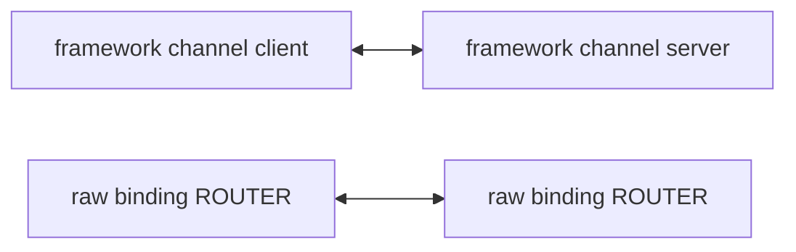

# Messaging Local Bench Specification

This document is the standard for comparing the relative cost of gRPC, the ZLink raw binding, and
the ZLink framework in the same format on a local development machine. The target languages are
the five `dotnet`, `node`, `java`, `kotlin`, and `cpp`, and a reference bench written in C is used
alongside them as the floor value. It doesn't represent a production environment's mesh, TLS, L7
load balancer, multi-node distribution, or network latency.

**This bench is a service-level comparison.** It measures the cost actually paid when the same
task is implemented with each stack. It doesn't ask whether the two stacks use the same mechanism
internally. A difference that arises because a capability exists in only one stack isn't hidden;
it's left in the result as it is. The question this document answers is "implementing this task
with gRPC costs this much, implementing it with ZLink costs this much." "Which side is faster when
the two stacks transmit the same way" isn't this bench's question.

## 1. Comparison Targets

### 1.1 Implementation Names

Three implementations are compared per language. `<lang>` is one of `dotnet`, `node`, `java`,
`kotlin`, `cpp`. The report table and the `RESULT` line use the same names.

| Implementation Name | Meaning |
|-----------|------|
| `grpc-<lang>` | That language's gRPC unary RPC |
| `zlink-<lang>` | The raw binding's ROUTER↔ROUTER TCP path, bypassing the framework |
| `zlink-framework-<lang>` | The client channel and server channel of framework channel messaging |

The default execution order is `grpc-<lang>`, `zlink-<lang>`, `zlink-framework-<lang>`. Since the
three implementations run the same pattern at the same payload size and the same active duration,
the table shows the three implementations side by side under one pattern.

### 1.2 The C Reference Bench

`grpc-c` and `zlink-c` from `bindings/c/bench/with_grpc` are kept alongside as the floor
reference. There's no framework layer in C, so only these two implementations exist there. The
`zlink-c` `request-window` value is the reference value for judging where each language's raw
binding stands (§7.2).

### 1.3 The ZLink Socket Axis

Both ZLink rows use **RouteMesh ROUTER↔ROUTER**. This condition isn't optional; it's the contract
that makes the judgement formula hold.

| Row | Socket Configuration |
|-----|----------------------|
| `zlink-framework-<lang>` | RouteMesh's channel request handler and send handler. RouteMesh connects as ROUTER↔ROUTER |
| `zlink-<lang>` | The raw binding's ROUTER↔ROUTER. The client side also creates a ROUTER and sends by specifying the peer ROUTER's routing id |
| `zlink-c` | The same ROUTER↔ROUTER configuration as the raw binding row above |



This contract is needed because of the judgement formula in §7.2.
`zlink-framework-<lang> / zlink-<lang>` is the ratio for looking at the cost the framework layer
additionally requires. Only when both rows use the same socket pattern does this ratio isolate the
framework layer. If the raw row is DEALER→ROUTER, the division result contains both the framework
layer cost and the socket pattern difference, and that value isn't the framework layer cost.

The current implementation state is recorded alongside. The `.NET` client's raw path and the C
reference bench's client still create a DEALER
(`framework/languages/dotnet/bench/with-grpc/Client/Program.cs:493,512,530`,
`bindings/c/bench/with_grpc/zlink/bench_zlink_client.cpp:530-531`). That change is done in a
separate task. The table above prescribes the configuration to be used for measurement, and a
value obtained before that change completes isn't a value that satisfies this specification.

## 2. Measurement Patterns

The initial scope uses only two payload sizes and three patterns. The default payload sizes are
`1024` and `4096` bytes. The payload size is the full size of the protobuf `bytes body` or the raw
ZLink message body. The first 29 bytes are used as the measurement header, and the rest is filled
as the business payload area. The gRPC HTTP/2 frame, protobuf field overhead, ZLink envelope, and
ZMP header aren't included in this size.

| Pattern Name | gRPC | ZLink raw binding | ZLink framework | Interpretation |
|-----------|------|-------------------|-----------------|------|
| `request-serial` | unary `Echo` RPC | raw request send and reply receive | channel request call | Sends one request and sends the next only after the reply completes |
| `request-window` | unary `Echo` RPC | raw request send and reply receive | channel request call | Keeps up to `request_window` incomplete requests |
| `request-backpressure` | unary `Echo` RPC | raw request send and reply receive | channel request call | Puts no ceiling on incomplete requests. Submits continuously until admission backpressure |
| `send-saturation` | unary `Command` RPC, replying `Empty` | raw one-way send submission | channel send submission | Compares the command path, which has no reply payload |

The API names the three implementations use differ per language, but the contract is the same. In
`.NET`, the framework channel request is `RequestToChannel(...).Async<TReply>()` and the channel
send is `SendToChannel(...).Submit()`. The per-language modules are in §8.

`request-serial`'s throughput is decided by a single request's round-trip latency. This value is
meant to show the cost of a "process one at a time" usage pattern.

`request-window` reflects that a ZLink request can submit the next request without waiting for the
reply. During the active phase, the client keeps up to `request_window` incomplete requests. As
soon as one reply arrives, the next request is sent immediately in that slot. The default
`request_window` is `100`.

`request-backpressure` puts no application ceiling on the number of incomplete requests. Without
waiting for replies, the client submits requests continuously until it meets admission
backpressure, and resumes submitting when it is signalled to. The gRPC side has the same shape: it
submits until its own flow control stops it. Neither side gets an application ceiling.

**In this pattern the incomplete depth is a measurement, not a setting.** The depth a stack reaches
is an outcome its design decides, so it is recorded as part of the result (§5.2).

This loop shape is not new; it is ported from an implementation already in the repository. The
reference implementation is `bindings/node/perf/multi/perf_multi_socket_reqrep.ts`, which submits
async requests continuously without waiting for a reply and then hands the turn to the completion
pump. All six rows use the same shape, and the gRPC side is treated the same way: unary calls are
submitted continuously rather than awaited one at a time.

The two request patterns answer different questions, and neither replaces the other.

| Pattern | The question it answers |
|---|---|
| `request-window` | How does this stack behave when an externally chosen depth is imposed on it |
| `request-backpressure` | What does a service actually get when it submits as fast as the transport allows |

Because `request-window` fixes depth as a condition, a stack that cannot sustain that condition
makes the throughput ratio report the depth reached rather than the per-request cost.
`request-backpressure` removes that fixing, but it does not remove the depth difference. Both
patterns must be read together with the depth metrics of §5.2.

This repository's perf convention already requires that inflight depth not be fixed artificially
and that requests be submitted continuously until admission backpressure (the request/reply client
items in `doc/perf/PERF_MULTI_TEST_POLICY.md`, and the fixed application window item in
`doc/perf/PERF_POLICY.md`). This bench having only `request-window` was a divergence from that
convention, and `request-backpressure` closes the gap.

`send-saturation` isn't averaged together with request/reply. This pattern exists to look at the
command family's relative cost separately.

### 2.1 The gRPC Counterpart for `send-saturation`

The gRPC side of `send-saturation` uses the current unary
`Command(BenchPayload) returns (Empty)` as it is. No client-streaming RPC is added, and no RPC is
added to the proto. The reasons this is the correct comparison for this bench are below.

- In a real service, a call that needs no response is implemented as a unary call with an `Empty`
  reply. Client-streaming is a form meant for uploads and bulk ingestion, and isn't how a service
  sends a single command that needs no response.
- gRPC has no one-way call primitive. So it pays one round trip when handling this task. In a
  service-level comparison that cost is a value that belongs in the result.
- Inserting a different usage form on the gRPC side to even out the comparison would measure an
  implementation that real services don't use.

The reading rule for this cell is fixed alongside. This cell isn't described as a transport-speed
difference. The correct sentence form is below.

```text
When a command needs no response, gRPC pays a unary round trip while ZLink completes with a
one-way send. Under this condition the difference was N times.
```

## 3. Execution Conditions

- Run with 1 client process and 1 server process per comparison target.
- The local runner brings up the gRPC server, ZLink raw binding server, and ZLink framework server
  separately.
- Only a loopback address (`127.0.0.1`) is used. Ports use the per-language bands in §9.
- Runs as a Release build.
- Runs a fixed-duration measured active window after warmup. The warmup length is set per language
  and the value used is recorded in the result (§8.2).
- The default payload size is `1024,4096` bytes.
- The default `request_window` is `100`, and it applies only to the `request-window` pattern.
  The `request-backpressure` pattern has no incomplete-request ceiling setting. In that
  pattern depth is not a condition that is set but a result that is measured and recorded
  (§5.2).
- The default send concurrency is `8`.
- gRPC and ZLink framework use the same protobuf DTO. The ZLink raw binding skips the framework but
  puts the same shape on the wire: two parts, an envelope header part and a protobuf-encoded
  `BenchPayload` part, with the 29-byte measurement header inside that protobuf `bytes body`. This
  shape is not a choice; it is a precondition of the judgement. §7.2 formula 1 divides
  `zlink-<lang>` by `zlink-c`, so two rows with different wire shapes would divide two different
  experiments. The reference implementation is `bindings/c/bench/with_grpc`,
  `bench_zlink_client.cpp:14-16` and `:130-140`.
- ZLink uses a manual endpoint connection with no location store.
- Both ZLink rows use the ROUTER↔ROUTER configuration in §1.3.
- The ZLink raw binding's request echo endpoint and command receive endpoint are separated. In the
  command measurement, if request echo replies mix into the same socket, the one-way receive volume
  with no reply can't be observed correctly.
- TLS, compression, service mesh, gateway, and broker are not used.
- Languages aren't measured at the same time. Only one language is measured at a time.

The two ZLink rows differ in how many endpoints they use. The raw binding row separates its
request echo endpoint from its command endpoint and so uses two, while the framework row uses one
RouteMesh connection that carries both a request handler and a send handler. This difference is
intentional and contaminates no cell, because patterns are measured one at a time. While the
`send-saturation` cell is measured, only send traffic occurs on either row; while a request-family
cell is measured, only request traffic occurs on either row.

This reasoning depends on the premise that only one pattern is measured at a time. If a scenario
that runs two patterns concurrently is added, the premise no longer holds and this endpoint
configuration must be revisited.

The settle between cells follows this contract. After a cell completes, do not wait a fixed time.
Poll the server's received count until it stops advancing, with an upper bound on that wait. If the
count has not stopped advancing within the bound, record that fact and the observed drain time in
the results, and mark the next cell that uses the same server as contaminated, excluding it from the
tables and from every judgement. A contaminated cell is not measured and published. The observed
drain time is recorded per cell in the results. This bound is not a formality; it is load-bearing.
A bound set too small loses cells even on a healthy run, so it must be large enough that a healthy
run never reaches it. The reference value is 30 seconds.

## 4. Output Format

The report table is grouped by pattern, with the implementation name shown on each row. The
example follows the format below.

```text
  > Benchmarking current for request-window...
    Testing local:
      | Implementation          | Size     |       Throughput |    Bandwidth |  Lat.Mean(ms) |   Lat.P95(ms) |   Lat.P99(ms) | Client CPU | Client Mem | Server CPU | Server Mem |
      |-------------------------|----------|------------------|--------------|--------------|--------------|--------------|------------|------------|------------|------------|
      | grpc-dotnet             | 1024B    |       10.00 KOPS |   10.24 MB/s |     1.000 ms |     2.000 ms |     3.000 ms |      10.0% |  100.0 MB |      10.0% |  100.0 MB |
      | zlink-dotnet            | 1024B    |       30.00 KOPS |   30.72 MB/s |     0.300 ms |     0.600 ms |     0.900 ms |      10.0% |  100.0 MB |      10.0% |  100.0 MB |
      | zlink-framework-dotnet  | 1024B    |       20.00 KOPS |   20.48 MB/s |     0.500 ms |     0.900 ms |     1.200 ms |      10.0% |  100.0 MB |      10.0% |  100.0 MB |
```

The report and console output also leave a per-metric `RESULT,current,...` format alongside, for
easier handling by the perf runner. The fields of one row are in the following order.

```text
RESULT,current,<scenario>,local,<payload_size>,<metric>,<value>
```

An example follows.

```text
RESULT,current,grpc-dotnet-request-window,local,1024,throughput,10000.000
RESULT,current,zlink-dotnet-request-window,local,1024,latency,0.300
RESULT,current,zlink-framework-dotnet-request-window,local,1024,latency_p99,1.200
```

`<scenario>` is `<implementation name>-<pattern name>`, so the language is part of the name. For
example, Node's equivalent cell is `zlink-framework-node-request-window`.

The `metric` value uses `throughput`, `bandwidth`, `latency`, `latency_p95`, `latency_p99`,
`client_cpu_percent`, `client_memory_mb`, `server_cpu_percent`, `server_memory_mb`. The raw value
of `throughput` is completions per second, and the table displays it divided into `KOPS` or
`KMSG/s`.

## 5. Metrics

The required output is the metrics below. The throughput unit is separated to match the pattern's
character.

| Metric | Meaning |
|--------|------|
| `Throughput` | Throughput during the measured window. The table shows the value and unit together in one cell, e.g. `10.000 KOPS`, `183.618 KMSG/s` |
| `Bandwidth` | The transfer volume calculated from payload size and throughput. Shown as `MB/s` |
| `Lat.Mean(ms)` | Mean latency. For request/reply this is the client round-trip latency; for send it's the receive latency the server calculates from the header |
| `Lat.P95(ms)` | p95 latency |
| `Lat.P99(ms)` | p99 latency |
| `Client CPU` | The CPU percentage the client process used during the active window |
| `Client Mem` | The client process's working set |
| `Server CPU` | The CPU percentage that implementation's server process used during the active window |
| `Server Mem` | That implementation's server process working set |

`request-serial` and `request-window` calculate `KOPS` based on the number of completions where an
echo reply came back. Here, `1 KOPS` means 1,000 request/reply completions per second.

`send-saturation` calculates `KMSG/s` based on the number of messages the server received during the
active phase. Here, `1 KMSG/s` means 1,000 messages per second. Since a ZLink send doesn't wait for
a reply, throughput isn't calculated from the client's submission call count alone.

### 5.1 The Client Saturation Rule

`Client CPU` is recorded for every cell. It isn't optional. A percentage alone cannot decide
saturation, so **the number of cores used is recorded alongside the percentage.** The percentage is
taken against all of the machine's logical cores. On a machine with 20 logical cores, a
single-threaded client that fully occupies one core still reads 5%, and no fixed percentage
threshold can catch that saturation.

Saturation is judged against **the instrument and the ceiling that each language's harness
declares**. A cell whose declared instrument reaches 0.95 of the declared ceiling is marked as a
saturated cell and is excluded from throughput ranking. In that cell the limit was set by the client
runtime, not by the transport. A saturated cell's throughput is recorded only as "the value observed
with this client configuration."

**A harness declares what it measures, not only the ceiling**, because the right instrument
differs per language. The purpose of the rule is to catch "the client runtime, not the transport, set
this limit", so the instrument has to measure **the execution resource on which user code runs**.

| Language | Declared instrument | Ceiling |
|----------|---------------------|---------|
| `dotnet` | process cores used | the parallelism the harness declares |
| `node` | `performance.eventLoopUtilization()` from `perf_hooks` | `1.0` |
| `java`, `kotlin` | CPU of the submit threads (`ThreadMXBean`, `jvm_thread_cores`) | the submit parallelism the harness declares |
| `cpp` | CPU of the application thread that runs submit and the completion drain (`CLOCK_THREAD_CPUTIME_ID`, `submit_thread_cores`) | `1` |

`dotnet` is the only language that declares process cores used.

Measurement shows why process cores are the wrong instrument for Node. The ZLink binding runs native
I/O threads, so process CPU divided by elapsed time reads **1.3-1.4 cores** on that client, and those
threads run no user code. Against a ceiling of 1 every cell would be marked saturated even with an
idle JS thread, and the mark would carry no information. What actually limits this client is the one
JS thread on which user code runs, and event loop utilization measures exactly that.

**Process CPU is not a usable saturation instrument for a ZLink client.** That is why this section
makes the instrument a per-language declaration. Three languages reached the same conclusion for
three different reasons: in Node process CPU also counted the binding's native I/O threads, in Java
it counted GC and JIT threads, and in C++ it again counted the binding's I/O threads. Four of the
five languages declare something other than process CPU. The problem is not the threshold but
**whether the two rows a judgement divides are commensurate**. Measured in C++,
`zlink-cpp` request-window reads 0.950 on its declared instrument but 1.90 in process cores, while
`grpc-cpp` in the same run reads 0.700 and 0.70 — effectively the same value. Judged on process
cores, that difference reports which row links Core rather than which row was client-bound.

The declared instrument and ceiling differ per language, so **both** are recorded in the cell record
and in the report. A result that declares no instrument or no ceiling cannot have its saturation
judged, and the fact that it could not be judged is recorded in the result. An older result that
declares no instrument is read as having declared process cores used.

### 5.2 Incomplete Depth Is Recorded Per Cell

Request-family cells record the three values below for every cell. The three are not optional.

| Metric | Meaning |
|---|---|
| `peak_in_flight` | The maximum number of incomplete requests observed during the active window |
| Depth | The mean incomplete count calculated as throughput x mean latency (Little's law) |
| `abandoned` | The number of requests that did not complete by the drain bound |

In `request-window` these three decide **whether the stack actually sustained the depth that was
set**. A cell whose `peak_in_flight` never reached the configured value has to be separated into
"the harness could not fill the window" and "the stack only reaches this depth"; without recording
both values, a wrong premise survives.

In `request-backpressure` these three **are the result**. Since no depth is configured, the depth a
stack reaches is an outcome its design decides, and it goes into the table with the same standing
as throughput. Quoting throughput without the depth reached makes values obtained at different
depths read as values from the same condition.

Cells with a nonzero `abandoned` and cells with nonzero errors are not used for throughput
comparison. What such a cell reports is not a speed but the fact that some requests did not
complete. That fact is recorded as a correctness item, not a performance item.

## 6. The Measurement Payload Header

A 29-byte header with the same meaning as `bindings/c/perf`'s metric header is placed at the front
of the measured payload. This header is part of the payload body, going at the front of the
protobuf `bytes body` or the raw ZLink message body.

| Offset | Size | Value |
|--------|------|----|
| 0 | 4 | magic `0x5A4C4E4B` (`ZLNK`) |
| 4 | 4 | run id |
| 8 | 1 | phase (`0` warmup, `1` active) |
| 9 | 4 | payload size |
| 13 | 8 | sequence |
| 21 | 8 | send timestamp ns |

For `request-serial` and `request-window`, the client validates the header that came back in the
reply payload, and calculates `KOPS` from the active-phase reply count. `send-saturation` has the
server read the header to calculate the active-phase message count and server-side receive
latency. This approach puts the measurement value inside the payload so a one-way throughput isn't
overstated by a client stopwatch alone.

This header layout is identical in every language. If a language used a different layout, its
cells couldn't be placed side by side with the others.

## 7. Interpreting Results

This bench is a small local comparison tool.

### 7.1 Information Kept Alongside the Result

To put a performance-superiority statement into a result document or guide, keep the following
information alongside it.

- CPU, OS
- That language's runtime version and gRPC library version
- Commit hash
- Payload size
- Warmup and active duration configuration
- gRPC and ZLink endpoint
- The request window value (`request-window` pattern) or the depth reached
  (`request-backpressure` pattern)
- Per-cell `peak_in_flight`, depth, and `abandoned` (§5.2)
- The send concurrency value
- Client CPU and whether the cell was saturated (§5.1)
- The original result JSON

### 7.2 Judgement Between Layers

Performance judgment compares within the same ZLink layer, not against gRPC. The raw binding is
judged against the `zlink-c` request-window result under the same conditions. If the raw binding
reaches 80% or more of the C result, the binding layer's baseline performance is judged as
passing. The framework is judged against the same language's raw binding result. If the framework
reaches 80% or more of the raw binding result, the framework's added cost is judged as passing.

```text
at each of payload sizes 1024 and 4096:
zlink-<lang> / zlink-c                     >= 0.80   binding layer passes
zlink-framework-<lang> / zlink-<lang>      >= 0.80   framework added cost passes
```

Both formulas are calculated separately per payload size. A language passes only when it satisfies
the criterion at both `1024` and `4096`. A result that satisfies only one size isn't a pass, and
the per-payload values are always recorded as they are. A stack that holds the criterion at `1024`
but degrades at `4096` has a real problem, and since the report shows both sizes anyway, a
per-payload gate exposes that problem at no added cost.

This criterion is applied to patterns where ZLink can send the next request without waiting for the
reply. Such a pattern is the sound judgement cell because gRPC unary `Echo` and a ZLink request
give the same guarantee, namely confirmation that the server processed the message.
`request-serial` is kept as a supplementary metric for looking at the round-trip latency of a
process-one-at-a-time usage pattern.

**The reference pattern for judgement is `request-backpressure`.** Whether a language passes is
decided by that pattern satisfying the criterion at both payload sizes. The same two formulas
computed on `request-window` are calculated separately and recorded alongside, but they do not
decide whether a language passes.

The grounds for choosing the reference pattern this way are below.

- Both formulas are ratios of two rows measured under one condition, so that condition has to be
  one the numerator and the denominator can actually reach. A ratio computed under a condition that
  is not reached reports that condition rather than the layer cost.
- A fixed window is a condition no service imposes on itself. A low ratio under it can mean "the
  per-request cost is high" or "that depth was never reached", and because both causes appear as
  the same number, the ratio alone does not separate them.
- `request-backpressure` computes the ratio with each stack at the depth its own design allows, so
  it compares what a caller submitting normally actually gets. That is what "the binding layer's
  baseline performance" has to mean.

**What this choice does not solve is recorded with it.** `request-backpressure` removes the fixing
of depth, not the difference in depth. A stack that stays at a low depth through its own
backpressure still produces a low ratio in this pattern, and the ratio alone still fails to
separate per-request cost from depth reached. **So for either pattern, a ratio published without
the three depth values of §5.2 beside it is not published at all.**

**Loss and non-completion observed under a fixed window are not superseded by this judgement.** A
stack that produced `abandoned` requests or errors under `request-window` has a defect in the
correctness category, and that defect remains even if the same stack passes the criterion under
`request-backpressure`. The two results are recorded separately so that a performance judgement
does not hide a correctness observation.

The second formula represents the framework layer cost only when the socket configuration in §1.3
is observed.

### 7.3 Cross-Language Reading Rules

Absolute throughput isn't compared across languages. Placing `grpc-node` and `grpc-java` side by
side is a runtime comparison, not a ZLink comparison. If two languages' throughput differs in the
table, the cause is mostly the runtime and the gRPC library, and this bench doesn't separate that
cause out.

What can be read across languages is the ratio. `zlink-framework-<lang> / zlink-<lang>` is a value
each language calculated against itself, so it can answer "which language's framework layer is the
most expensive." A table holding a cross-language comparison places this ratio as its main entry.

### 7.4 Unit Alignment

Section 4 fixes the throughput unit as completions per second. Even when a runner records the value
at a different scale, the shared aggregator (`framework/bench/tools/`) recovers that scale from
`bandwidth` (which section 5 fixes as MB/s) and normalizes it, so comparison and judgement are
always made from the aggregator's output. The table a language client prints for itself is a
convenience for checking a single run directly, not a basis for judgement. Ratios are not calculated
by reading a runner's report directly.

Results are interpreted only as "faster/slower under this condition." No claim of general
production performance or superiority across every payload is made.

## 8. Per-Language Configuration

### 8.1 Modules Used Per Language

| Language | gRPC library and server | Framework module | Raw binding | protobuf codec |
|------|--------------------------|----------------|-------------|----------------|
| `dotnet` | ASP.NET Core gRPC | `framework/languages/dotnet/src/Zlink.Framework` | `bindings/dotnet` | `Zlink.Framework.Codecs.Protobuf` |
| `node` | `@grpc/grpc-js` | `framework/languages/node/packages/framework` | `bindings/node` | `packages/framework-codec-protobuf` |
| `java` | grpc-java | `zlink-framework-core` | `bindings/java` | `zlink-framework-codec-protobuf` |
| `kotlin` | grpc-kotlin coroutine stub | `zlink-framework-kotlin` | `bindings/kotlin` | Uses the same codec as Java |
| `cpp` | system `libgrpc++` and `grpc_cpp_plugin` | `framework/languages/cpp/framework` | `bindings/cpp` | `zlink::framework_codec_protobuf` |

Kotlin uses a suspend interface on the ZLink side, so the gRPC side uses the grpc-kotlin coroutine
stub as well. Only when the coroutine stub can't be used is the grpc-java blocking stub used, and
that reason is recorded in the result.

C++ uses the `libgrpc++` installed on the system. gRPC isn't built through vcpkg. This machine's
version is 1.51.1, and since it's an old version it must be recorded in the result.

### 8.2 Values Set Per Language That Must Be Recorded

The three values below are set differently per language. The goal isn't to make them identical but
to leave the values used in the result.

| Item | Reason |
|------|------|
| Warmup length | The JVM reaches steady state only after JIT warmup finishes. Forcing the same warmup as `.NET` would measure an unwarmed runtime |
| gRPC server configuration | The default server implementation differs per language. The gRPC side is left at each language's default configuration, and that configuration is recorded in the result |
| Runtime and gRPC library version | The SDK version, runtime version, and gRPC library version are recorded in the cell's raw output and in the report |

## 9. Port Bands

A per-language band is fixed so that ports don't collide even when five languages' server
processes exist at the same time. The meaning of an offset within a band is the same in every
language.

| Language | Band | gRPC | gRPC stats | framework endpoint | framework stats | raw request | raw stats | raw command |
|------|------|------|------------|--------------------|-----------------|-------------|-----------|-------------|
| `dotnet` | 5071-5079 | 5071 | 5074 | 5072 | 5073 | 5075 | 5076 | 5077 |
| `node` | 5081-5089 | 5081 | 5084 | 5082 | 5083 | 5085 | 5086 | 5087 |
| `java` | 5091-5099 | 5091 | 5094 | 5092 | 5093 | 5095 | 5096 | 5097 |
| `kotlin` | 5101-5109 | 5101 | 5104 | 5102 | 5103 | 5105 | 5106 | 5107 |
| `cpp` | 5111-5119 | 5111 | 5114 | 5112 | 5113 | 5115 | 5116 | 5117 |
| C reference | 6071-6079 | 6071 | none | none | none | 6075 | none | 6077 |

The last two ports of each band (`+8`, `+9`) are left in reserve.

The `dotnet` row is the set of values
`framework/languages/dotnet/bench/with-grpc/run_local.sh` already uses, and the C reference row is
the set of values the `bindings/c/bench/with_grpc` server and client already use. The C reference
bench has no framework layer and no stats endpoint, and the optional ZMQ comparison server uses
`6079`.

The runner checks that its own band's ports are free before starting a measurement. If one is in
use it stops instead of moving to another port. Moving a port would make the endpoint recorded in
the result disagree with the endpoint actually used.
