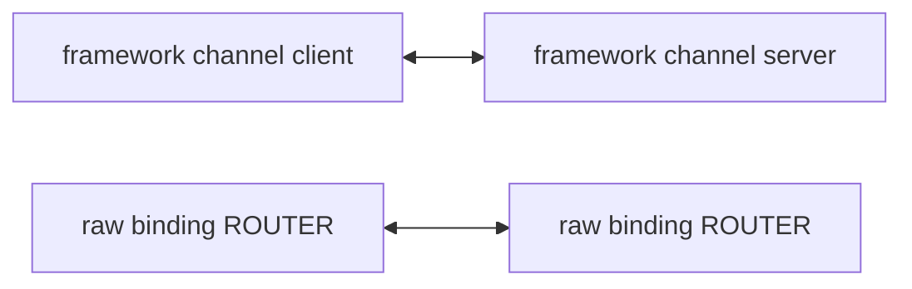

# Messaging local bench 규격

이 문서는 로컬 개발 머신에서 gRPC, ZLink raw binding, ZLink framework의 상대 비용을 같은
형식으로 비교하기 위한 기준이다. 대상 언어는 `dotnet`, `node`, `java`, `kotlin`, `cpp` 다섯
개이고, 여기에 C로 작성한 기준 bench를 바닥 값으로 함께 사용한다. 운영 환경의 mesh, TLS,
L7 load balancer, multi-node 분배, 네트워크 지연을 대표하지 않는다.

**이 bench는 서비스 측면 비교다.** 같은 업무를 각 스택으로 구현했을 때 실제로 치르는 비용을
측정한다. 두 스택이 내부에서 같은 메커니즘을 사용하는지는 묻지 않는다. 한쪽 스택에만 있는
기능 때문에 생기는 차이는 감추지 않고 결과에 그대로 남긴다. 이 문서가 답하는 질문은 "같은
업무를 gRPC로 구현하면 이 비용, ZLink로 구현하면 이 비용"이다. "두 스택이 같은 방식으로
전송했을 때 어느 쪽이 빠른가"는 이 bench의 질문이 아니다.

## 1. 비교 대상

### 1.1 구현 이름

언어 하나마다 세 구현을 비교한다. `<lang>`은 `dotnet`, `node`, `java`, `kotlin`, `cpp` 중
하나다. report 표와 `RESULT` 라인에서도 같은 이름을 사용한다.

| 구현 이름 | 의미 |
|-----------|------|
| `grpc-<lang>` | 해당 언어의 gRPC unary RPC |
| `zlink-<lang>` | framework를 거치지 않는 raw binding의 ROUTER↔ROUTER TCP 경로 |
| `zlink-framework-<lang>` | framework channel messaging의 client channel과 server channel |

기본 실행 순서는 `grpc-<lang>`, `zlink-<lang>`, `zlink-framework-<lang>` 순서다. 같은 payload
크기와 같은 active duration에서 세 구현을 같은 패턴으로 실행하므로, 표에서는 한 패턴 아래에
세 구현이 나란히 출력된다.

### 1.2 C 기준 bench

`bindings/c/bench/with_grpc`의 `grpc-c`와 `zlink-c`를 바닥 기준으로 함께 유지한다. framework
계층은 C에 없으므로 C에는 이 두 구현만 존재한다. `zlink-c`의 `request-window` 값은 각 언어
raw binding의 위치를 판정하는 기준값이다(§7.2).

### 1.3 ZLink 소켓 축

ZLink 쪽 두 행은 모두 **RouteMesh ROUTER↔ROUTER**를 사용한다. 이 조건은 선택 사항이 아니라
판정식이 성립하기 위한 계약이다.

| 행 | 소켓 구성 |
|----|-----------|
| `zlink-framework-<lang>` | RouteMesh의 channel request 처리기와 send 처리기. RouteMesh는 ROUTER↔ROUTER로 연결한다 |
| `zlink-<lang>` | raw binding의 ROUTER↔ROUTER. client 쪽도 ROUTER를 만들고 상대 ROUTER의 routing id를 지정해 전송한다 |
| `zlink-c` | 위 raw binding 행과 같은 ROUTER↔ROUTER 구성 |



이 계약이 필요한 이유는 §7.2의 판정식 때문이다. `zlink-framework-<lang> / zlink-<lang>`는
framework 계층이 추가로 요구하는 비용을 보기 위한 비율이다. 두 행이 같은 소켓 패턴을 사용할
때에만 이 비율이 framework 계층만 남긴 값이 된다. raw 행이 DEALER→ROUTER이면 나눗셈 결과에
framework 계층 비용과 소켓 패턴 차이가 함께 들어가고, 그 값은 framework 계층 비용이 아니다.

현재 구현 상태를 함께 적는다. `.NET` client의 raw 경로와 C 기준 bench의 client는 아직
DEALER를 생성한다(`framework/languages/dotnet/bench/with-grpc/Client/Program.cs:493,512,530`,
`bindings/c/bench/with_grpc/zlink/bench_zlink_client.cpp:530-531`). 이 전환은 별도 작업에서
수행한다. 위 표는 측정에 사용할 구성을 규정한 것이며, 전환이 끝나기 전에 얻은 값은 이 규격을
만족하는 값이 아니다.

## 2. 측정 패턴

처음 범위는 두 payload 크기와 세 패턴만 사용한다. payload 크기는 `1024`, `4096` bytes를
기본값으로 한다. payload 크기는 protobuf `bytes body` 또는 raw ZLink message body의 전체
크기다. 앞 29 bytes는 측정 header로 사용하고, 나머지를 business payload 영역으로 채운다.
gRPC HTTP/2 frame, protobuf field overhead, ZLink envelope, ZMP header는 이 크기에 포함하지
않는다.

| 패턴 이름 | gRPC | ZLink raw binding | ZLink framework | 해석 |
|-----------|------|-------------------|-----------------|------|
| `request-serial` | unary `Echo` RPC | raw request 전송과 reply 수신 | channel request 호출 | 요청 하나를 보내고 reply 완료 뒤 다음 요청을 보낸다 |
| `request-window` | unary `Echo` RPC | raw request 전송과 reply 수신 | channel request 호출 | 최대 `request_window`개의 미완료 request를 유지한다 |
| `send-saturation` | unary `Command` RPC, 응답은 `Empty` | raw 단방향 send 제출 | channel send 제출 | reply payload가 없는 command 경로를 비교한다 |

세 구현이 사용하는 API 이름은 언어마다 다르지만 계약은 같다. `.NET`에서 framework channel
request는 `RequestToChannel(...).Async<TReply>()`이고 channel send는
`SendToChannel(...).Submit()`이다. 언어별 모듈은 §8에 둔다.

`request-serial`은 한 요청의 왕복 지연이 처리량을 결정한다. 이 값은 "한 번에 하나만 처리하는"
사용 패턴의 비용을 보기 위한 값이다.

`request-window`는 ZLink request가 reply를 기다리지 않고 다음 request를 제출할 수 있다는 점을
반영한다. client는 active phase 동안 최대 `request_window`개의 미완료 request를 유지한다.
reply 하나가 도착하면 해당 slot에서 다음 request를 바로 보낸다. 기본 `request_window`는 `100`이다.

`send-saturation`은 request/reply와 섞어 평균 내지 않는다. 이 패턴은 command 계열의 상대
비용을 따로 보기 위한 항목이다.

### 2.1 `send-saturation`의 gRPC 대응물

`send-saturation`의 gRPC 쪽은 현행 unary `Command(BenchPayload) returns (Empty)`를 그대로
사용한다. client-streaming RPC를 추가하지 않고, proto에 RPC를 추가하지 않는다. 이 선택이 이
bench에서 옳은 비교인 이유는 아래와 같다.

- 실제 서비스에서 응답이 필요 없는 호출은 unary 호출과 `Empty` 응답으로 구현한다.
  client-streaming은 업로드와 대량 적재를 위한 형태이며, 서비스가 응답 없는 명령 하나를
  보내는 방식이 아니다.
- gRPC에는 단방향 호출 원시 기능이 없다. 그래서 이 업무를 처리할 때 왕복을 한 번 치른다.
  서비스 측면 비교에서 그 비용은 결과에 포함되어야 하는 값이다.
- 비교를 맞추려고 gRPC 쪽에 다른 사용 형태를 끼워 넣으면, 실제 서비스가 쓰지 않는 구현을
  측정하게 된다.

이 셀의 서술 규칙을 함께 정한다. 이 셀을 전송 속도 차이로 서술하지 않는다. 올바른 문장
형태는 아래와 같다.

```text
응답이 필요 없는 명령을 처리할 때, gRPC는 unary 왕복을 치러야 하고 ZLink는 단방향 send로
끝난다. 이 조건에서 그 차이는 N배로 관찰됐다.
```

## 3. 실행 조건

- client process 1개와 비교 대상별 server process 1개로 실행한다.
- 로컬 runner는 gRPC server, ZLink raw binding server, ZLink framework server를 각각 띄운다.
- loopback 주소(`127.0.0.1`)만 사용한다. 포트는 §9의 언어별 대역을 사용한다.
- Release build로 실행한다.
- warmup 뒤 정해진 시간의 measured active 구간을 실행한다. warmup 길이는 언어마다 다르게
  두고 사용한 값을 결과에 기록한다(§8.2).
- 기본 payload 크기는 `1024,4096` bytes다.
- 기본 `request_window`는 `100`이다.
- 기본 send concurrency는 `8`이다.
- gRPC와 ZLink framework는 같은 protobuf DTO를 사용한다. ZLink raw binding은 framework를
  거치지 않을 뿐 wire 모양은 같다. envelope 헤더 part 하나와 protobuf로 인코딩한
  `BenchPayload` part 하나, 모두 두 part로 보낸다. 측정 header 29 bytes는 그 protobuf
  `bytes body` 안에 들어간다. 이 모양은 선택이 아니라 판정식의 전제다. §7.2 formula 1이
  `zlink-<lang>`을 `zlink-c`로 나누므로 두 행의 wire 모양이 다르면 서로 다른 실험을
  나눈 값이 된다. 기준 구현은 `bindings/c/bench/with_grpc`의
  `bench_zlink_client.cpp:14-16`과 `:130-140`이다.
- ZLink는 location store 없이 manual endpoint 연결을 사용한다.
- ZLink 쪽 두 행은 §1.3의 ROUTER↔ROUTER 구성을 사용한다.
- ZLink raw binding의 request echo endpoint와 command 수신 endpoint는 분리한다. command 측정에서
  reply 없는 단방향 수신량을 보려면 request echo reply가 같은 socket에 섞이면 안 되기 때문이다.
- TLS, compression, service mesh, gateway, broker는 사용하지 않는다.
- 언어를 동시에 측정하지 않는다. 한 번에 한 언어만 측정한다.

ZLink 두 행의 endpoint 개수는 서로 다르다. raw binding 행은 request echo endpoint와 command
endpoint를 분리해 두 개를 사용하고, framework 행은 request 처리기와 send 처리기를 함께 두는
RouteMesh 연결 하나를 사용한다. 이 차이는 의도한 구성이며 어떤 셀도 오염하지 않는다. 패턴을
한 번에 하나씩 측정하기 때문이다. `send-saturation` 셀을 측정하는 동안에는 두 행 모두 send
트래픽만 발생하고, request 계열 셀을 측정하는 동안에는 두 행 모두 request 트래픽만 발생한다.

이 근거는 한 번에 한 패턴만 측정한다는 전제에 의존한다. 두 패턴을 동시에 실행하는 시나리오를
추가하면 이 전제가 성립하지 않으므로, 그때는 이 endpoint 구성을 다시 검토해야 한다.

셀 사이의 settle은 다음 계약을 따른다. 한 셀을 끝낸 뒤에는 고정 시간을 기다리지 않는다.
server가 받은 수를 폴링해 그 값이 더는 증가하지 않을 때까지 기다리고, 이 대기에는 상한을 둔다.
상한 안에 값이 멈추지 않으면 그 사실과 관측한 drain 시간을 결과에 기록하고, 같은 server를 쓰는
다음 셀을 오염된 것으로 표시해 표와 판정에서 제외한다. 오염된 셀은 측정해서 싣지 않는다.
관측한 drain 시간은 셀마다 결과에 기록한다. 이 상한은 형식적인 값이 아니라 측정을 좌우하는
값이다. 상한을 작게 잡으면 정상적인 실행에서도 셀을 잃게 되므로, 건강한 실행이 상한에 닿지
않을 만큼 충분히 크게 잡는다. 기준값은 30초다.

## 4. 출력 형식

report 표는 패턴별로 묶고, 각 행에 구현 이름을 표시한다. 예시는 아래 형식이다.

```text
  > Benchmarking current for request-window...
    Testing local:
      | Implementation          | Size     |       Throughput |    Bandwidth |  Lat.Mean(ms) |   Lat.P95(ms) |   Lat.P99(ms) | Client CPU | Client Mem | Server CPU | Server Mem |
      |-------------------------|----------|------------------|--------------|--------------|--------------|--------------|------------|------------|------------|------------|
      | grpc-dotnet             | 1024B    |       10.00 KOPS |   10.24 MB/s |     1.000 ms |     2.000 ms |     3.000 ms |      10.0% |  100.0 MB |      10.0% |  100.0 MB |
      | zlink-dotnet            | 1024B    |       30.00 KOPS |   30.72 MB/s |     0.300 ms |     0.600 ms |     0.900 ms |      10.0% |  100.0 MB |      10.0% |  100.0 MB |
      | zlink-framework-dotnet  | 1024B    |       20.00 KOPS |   20.48 MB/s |     0.500 ms |     0.900 ms |     1.200 ms |      10.0% |  100.0 MB |      10.0% |  100.0 MB |
```

보고서와 콘솔 출력은 perf runner에서 다루기 쉽게 metric별 `RESULT,current,...` 형식도 같이
남긴다. 한 행의 필드는 아래 순서다.

```text
RESULT,current,<scenario>,local,<payload_size>,<metric>,<value>
```

예시는 아래와 같다.

```text
RESULT,current,grpc-dotnet-request-window,local,1024,throughput,10000.000
RESULT,current,zlink-dotnet-request-window,local,1024,latency,0.300
RESULT,current,zlink-framework-dotnet-request-window,local,1024,latency_p99,1.200
```

`<scenario>`는 `<구현 이름>-<패턴 이름>`이므로 언어가 이름에 포함된다. 예를 들어 Node의 같은
셀은 `zlink-framework-node-request-window`다.

`metric` 값은 `throughput`, `bandwidth`, `latency`, `latency_p95`, `latency_p99`,
`client_cpu_percent`, `client_memory_mb`, `server_cpu_percent`, `server_memory_mb`를 사용한다.
`throughput`의 raw 값은 초당 완료 수이며, 표에서는 `KOPS` 또는 `KMSG/s`로 나누어 표시한다.

## 5. 메트릭

필수 출력은 아래 메트릭이다. 처리량 단위는 패턴 성격에 맞춰 분리한다.

| 메트릭 | 의미 |
|--------|------|
| `Throughput` | measured 구간 처리량. 표에서는 `10.000 KOPS`, `183.618 KMSG/s`처럼 값과 단위를 한 칸에 함께 표시 |
| `Bandwidth` | payload 크기와 처리량으로 계산한 전송량. `MB/s`로 표시 |
| `Lat.Mean(ms)` | 평균 latency. request/reply는 client 왕복 latency, send는 server가 header로 계산한 수신 latency |
| `Lat.P95(ms)` | p95 latency |
| `Lat.P99(ms)` | p99 latency |
| `Client CPU` | client process가 active 구간 동안 사용한 CPU 비율 |
| `Client Mem` | client process working set |
| `Server CPU` | 해당 구현의 server process가 active 구간 동안 사용한 CPU 비율 |
| `Server Mem` | 해당 구현의 server process working set |

`request-serial`과 `request-window`는 echo reply가 돌아온 완료 수를 기준으로 `KOPS`를 계산한다.
여기서 `1 KOPS`는 초당 1,000건의 request/reply 완료를 뜻한다.

`send-saturation`은 server가 active phase에서 받은 메시지 수를 기준으로 `KMSG/s`를 계산한다.
여기서 `1 KMSG/s`는 초당 1,000개 메시지를 뜻한다. ZLink send는 reply를 기다리지 않으므로
client의 제출 호출 수만으로 처리량을 계산하지 않는다.

### 5.1 client 포화 규칙

`Client CPU`는 모든 셀에서 기록한다. 선택 항목이 아니다. 다만 백분율 하나로는 포화를 판정할 수
없으므로 **사용한 core 수를 백분율과 함께 기록한다.** 백분율은 머신의 논리 core 전체에 대한
값이다. 논리 core가 20개인 머신에서 단일 스레드 client가 core 하나를 완전히 사용해도 그 값은
5%이고, 어떤 고정 백분율 기준으로도 그 포화를 잡아낼 수 없다.

포화는 **언어별 harness가 선언한 계측기와 상한**에 대해 판정한다. 선언한 계측기의 값이 선언한
상한의 0.95배에 이른 셀을 포화 셀로 표시하고 처리량 우열 판정에서 제외한다. 그 셀에서 상한을
정한 것은 transport가 아니라 client 런타임이기 때문이다. 포화 셀의 처리량은 "이 client 구성에서
관찰된 값"으로만 기록한다.

**harness는 상한만이 아니라 무엇을 재는지도 함께 선언한다.** 맞는 계측기가 언어마다
다르기 때문이다. 포화 판정의 목적은 "transport가 아니라 client 런타임이 상한이었다"를 잡는
것이므로, 계측기는 **user 코드가 도는 실행 자원**을 재야 한다.

| 언어 | 선언 계측기 | 상한 |
|------|-------------|------|
| `dotnet` | 프로세스 사용 core 수 | harness가 선언한 병렬도 |
| `node` | `perf_hooks`의 `performance.eventLoopUtilization()` | `1.0` |
| `java`·`kotlin` | 제출 스레드의 CPU (`ThreadMXBean`, `jvm_thread_cores`) | harness가 선언한 제출 병렬도 |
| `cpp` | 제출과 완료 드레인을 실행하는 application thread의 CPU (`CLOCK_THREAD_CPUTIME_ID`, `submit_thread_cores`) | `1` |

프로세스 사용 core 수를 쓰는 것은 `dotnet` 하나뿐이다.

Node에 프로세스 core 수를 쓰면 안 되는 이유는 실측이 보여준다. ZLink binding은 native I/O
thread를 돌리므로 프로세스 CPU ÷ 경과 시간이 **1.3~1.4 코어**로 읽히는데, 그 thread들은 user
코드를 실행하지 않는다. 상한 1에 이 값을 대면 JS thread가 한가해도 모든 셀이 포화로 표시되고
표시가 정보를 잃는다. 이 client를 실제로 제한하는 것은 user 코드가 도는 JS thread 하나이고
event loop 사용률이 바로 그것을 잰다.

**프로세스 CPU는 ZLink client의 포화 계측기로 쓸 수 없다.** 이것이 이 절이 계측기를 언어별
선언으로 두는 이유다. 세 언어가 서로 다른 이유로 같은 결론에 도달했다. Node에서는 프로세스
CPU가 binding의 native I/O thread를 함께 셌고, Java에서는 GC와 JIT thread를 셌고, C++에서는
다시 binding의 I/O thread를 셌다. 다섯 언어 중 넷이 프로세스 CPU가 아닌 것을 선언했다.
문제는 임계값이 아니라 **판정식이 나누는 두 행 사이의 비교 가능성**이다. C++ 실측에서
`zlink-cpp` request-window는 선언 계측기로 0.950인데 프로세스 core로는 1.90이고, 같은 run의
`grpc-cpp`는 0.700과 0.70으로 두 값이 사실상 같다. 프로세스 core로 판정하면 그 차이는 client
포화가 아니라 어느 행이 Core를 링크하는지를 보고하게 된다.

선언한 계측기와 상한은 언어마다 다르므로 셀 원본과 보고서에 **둘 다** 기록한다. 계측기나 상한을
선언하지 않은 결과는 포화 여부를 판정할 수 없으며, 판정하지 못했다는 사실을 결과에 남긴다.
계측기를 선언하지 않은 옛 결과는 프로세스 core 수를 선언한 것으로 읽는다.

## 6. 측정 payload header

측정 payload 앞에는 `bindings/c/perf`의 metric header와 같은 의미의 29-byte header를 넣는다.
이 header는 payload 본문 일부이며, protobuf `bytes body` 또는 raw ZLink message body의 앞부분에
들어간다.

| offset | 크기 | 값 |
|--------|------|----|
| 0 | 4 | magic `0x5A4C4E4B` (`ZLNK`) |
| 4 | 4 | run id |
| 8 | 1 | phase (`0` warmup, `1` active) |
| 9 | 4 | payload size |
| 13 | 8 | sequence |
| 21 | 8 | send timestamp ns |

`request-serial`과 `request-window`는 reply payload에 돌아온 header를 client가 검증하고,
active phase reply 수로 `KOPS`를 계산한다. `send-saturation`은 server가 header를 읽어 active
phase message 수와 server-side 수신 latency를 계산한다. 이 방식은 payload 안에 측정 값을 넣어,
client stopwatch만으로 단방향 처리량을 과장하지 않기 위한 기준이다.

이 header layout은 모든 언어에서 동일하다. 언어마다 다른 layout을 사용하면 셀을 나란히 놓을
수 없다.

## 7. 결과 해석

이 bench는 작은 로컬 비교 도구다.

### 7.1 결과와 함께 남기는 정보

결과 문서나 guide에 성능 우위 문장을 넣으려면 아래 정보를 함께 남긴다.

- CPU, OS
- 해당 언어의 런타임 version과 gRPC 라이브러리 version
- commit hash
- payload size
- warmup과 active duration 설정
- gRPC와 ZLink endpoint
- request window 값
- send concurrency 값
- client CPU와 포화 여부(§5.1)
- 결과 JSON 원본

### 7.2 계층 간 판정

성능 판정은 gRPC가 아니라 같은 ZLink 계층끼리 비교한다. raw binding은 같은 조건의 `zlink-c`
request-window 결과를 기준으로 본다. raw binding이 C 결과의 80% 이상이면 binding 계층의 기본
성능은 통과로 판단한다. framework는 같은 언어의 raw binding 결과를 기준으로 본다. framework가
raw binding 결과의 80% 이상이면 framework 추가 비용은 통과로 판단한다.

```text
payload 크기 1024와 4096 각각에서:
zlink-<lang> / zlink-c                     >= 0.80   binding 계층 통과
zlink-framework-<lang> / zlink-<lang>      >= 0.80   framework 추가 비용 통과
```

두 식은 payload 크기마다 따로 계산한다. 한 언어는 `1024`와 `4096` 두 크기에서 모두 기준을
만족할 때에만 통과다. 한 크기만 만족한 결과는 통과가 아니며, payload별 값은 항상 그대로
기록한다. `1024`에서 기준을 유지하다가 `4096`에서 떨어지는 스택에는 실제 문제가 있고, 보고서는
어차피 두 크기를 모두 표시하므로 payload별 판정은 추가 비용 없이 그 문제를 드러낸다.

이 기준은 request-window처럼 ZLink가 reply를 기다리지 않고 다음 request를 보낼 수 있는 패턴을
중심으로 적용한다. `request-window`가 판정에 적합한 셀인 이유는 gRPC unary `Echo`와 ZLink
request가 같은 보장, 곧 서버가 처리했다는 확인을 주기 때문이다. `request-serial`은 한 번에
하나만 처리하는 사용 패턴의 왕복 지연을 보기 위한 보조 지표로 남긴다.

두 번째 식은 §1.3의 소켓 구성을 지켰을 때에만 framework 계층 비용을 나타낸다.

### 7.3 언어를 가로지른 읽기 규칙

절대 처리량은 언어끼리 비교하지 않는다. `grpc-node`와 `grpc-java`를 나란히 놓은 값은 런타임
비교이지 ZLink 비교가 아니다. 표에서 두 언어의 처리량이 다르면 그 차이의 원인은 대부분 런타임과
gRPC 라이브러리이고, 이 bench는 그 원인을 분리하지 않는다.

언어를 가로질러 읽을 수 있는 값은 비율이다. `zlink-framework-<lang> / zlink-<lang>`는 각 언어가
자기 자신을 기준으로 계산한 값이므로, "어느 언어의 framework 계층이 가장 비싼가"에 답할 수
있다. 언어 비교를 담은 표는 이 비율을 주 항목으로 둔다.

### 7.4 단위 정렬

처리량 단위는 §4가 초당 완료 수로 고정한다. runner가 다른 배율로 값을 남기더라도 공용 집계기
(`framework/bench/tools/`)가 `bandwidth`(§5가 MB/s로 고정한다)로부터 배율을 역산해 정규화하므로,
비교와 판정은 언제나 집계기의 출력으로 한다. 언어 client가 스스로 출력하는 표는 run 하나를 바로
확인하기 위한 편의이며 판정의 근거가 아니다. runner의 report를 직접 읽어 비율을 계산하지 않는다.

결과는 "이 조건에서 더 빠르다/느리다"로만 해석한다. 일반적인 운영 성능이나 모든 payload에서의
우위를 주장하지 않는다.

## 8. 언어별 구성

### 8.1 언어별 사용 모듈

| 언어 | gRPC 라이브러리와 server | framework 모듈 | raw binding | protobuf codec |
|------|--------------------------|----------------|-------------|----------------|
| `dotnet` | ASP.NET Core gRPC | `framework/languages/dotnet/src/Zlink.Framework` | `bindings/dotnet` | `Zlink.Framework.Codecs.Protobuf` |
| `node` | `@grpc/grpc-js` | `framework/languages/node/packages/framework` | `bindings/node` | `packages/framework-codec-protobuf` |
| `java` | grpc-java | `zlink-framework-core` | `bindings/java` | `zlink-framework-codec-protobuf` |
| `kotlin` | grpc-kotlin coroutine stub | `zlink-framework-kotlin` | `bindings/kotlin` | Java와 같은 codec을 사용 |
| `cpp` | 시스템 `libgrpc++`와 `grpc_cpp_plugin` | `framework/languages/cpp/framework` | `bindings/cpp` | `zlink::framework_codec_protobuf` |

Kotlin은 ZLink 쪽에서 suspend 인터페이스를 사용하므로 gRPC 쪽도 grpc-kotlin coroutine stub을
사용한다. coroutine stub을 사용할 수 없을 때에만 grpc-java blocking stub을 사용하고, 그 사유를
결과에 기록한다.

C++는 시스템에 설치된 `libgrpc++`를 사용한다. vcpkg로 gRPC를 빌드하지 않는다. 이 머신의
version은 1.51.1이며, 오래된 version이므로 결과에 반드시 기록한다.

### 8.2 언어마다 다르게 두되 반드시 기록하는 값

아래 세 값은 언어마다 다르게 설정한다. 같게 맞추는 것이 목적이 아니라, 사용한 값을 결과에
남기는 것이 목적이다.

| 항목 | 이유 |
|------|------|
| warmup 길이 | JVM은 JIT 예열이 끝난 뒤에 정상 상태가 된다. `.NET`과 같은 warmup을 강요하면 예열되지 않은 런타임을 측정하게 된다 |
| gRPC server 구성 | 언어마다 기본 server 구현이 다르다. gRPC 쪽은 각 언어의 기본 구성으로 두고 그 구성을 결과에 남긴다 |
| 런타임과 gRPC 라이브러리 version | SDK version, 런타임 version, gRPC 라이브러리 version을 셀 원본과 보고서에 함께 남긴다 |

## 9. 포트 대역

언어 다섯 개의 server process가 동시에 존재해도 포트가 겹치지 않도록 언어별 대역을 고정한다.
같은 대역 안의 offset 의미는 모든 언어에서 같다.

| 언어 | 대역 | gRPC | gRPC stats | framework endpoint | framework stats | raw request | raw stats | raw command |
|------|------|------|------------|--------------------|-----------------|-------------|-----------|-------------|
| `dotnet` | 5071-5079 | 5071 | 5074 | 5072 | 5073 | 5075 | 5076 | 5077 |
| `node` | 5081-5089 | 5081 | 5084 | 5082 | 5083 | 5085 | 5086 | 5087 |
| `java` | 5091-5099 | 5091 | 5094 | 5092 | 5093 | 5095 | 5096 | 5097 |
| `kotlin` | 5101-5109 | 5101 | 5104 | 5102 | 5103 | 5105 | 5106 | 5107 |
| `cpp` | 5111-5119 | 5111 | 5114 | 5112 | 5113 | 5115 | 5116 | 5117 |
| C 기준 | 6071-6079 | 6071 | 없음 | 없음 | 없음 | 6075 | 없음 | 6077 |

각 대역의 마지막 두 포트(`+8`, `+9`)는 예비로 남긴다.

`dotnet` 행은 `framework/languages/dotnet/bench/with-grpc/run_local.sh`가 이미 사용하는 값이고,
C 기준 행은 `bindings/c/bench/with_grpc`의 server와 client가 이미 사용하는 값이다. C 기준
bench에는 framework 계층과 stats endpoint가 없고, 선택 항목인 ZMQ 비교 server가 `6079`를
사용한다.

runner는 측정 시작 전에 자기 대역의 포트가 비어 있는지 확인한다. 사용 중이면 다른 포트로
옮기지 않고 중단한다. 포트를 옮기면 결과에 기록된 endpoint와 실제 endpoint가 어긋난다.
