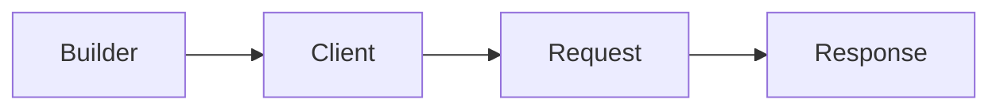

# Installation and the First Request

!!! info "After reading this chapter"

    You can add the HTTP client package to a project, receive a typed GET response through one client,
    and choose a one-shot for a single request.

The HTTP client ships separately from the server framework. A calling process needs only the HTTP client package. The tutorial below creates a client and reads one profile.

## 1. Add the Package

=== "C#/.NET"

    ```bash
    dotnet add package Zlink.HttpClient
    ```

=== "C++"

    ```cmake
    find_package(zlink_http_client_cpp CONFIG REQUIRED)
    target_link_libraries(my_client PRIVATE zlink::http_client)
    ```

=== "Java"

    ```kotlin
    dependencies {
        implementation("systems.zlink:zlink-http-client:<version>")
    }
    ```

=== "Kotlin"

    ```kotlin
    dependencies {
        implementation("systems.zlink:zlink-http-client-kotlin:<version>")
    }
    ```

=== "Node/TypeScript"

    ```bash
    npm install @zlink-systems/http-client
    ```

## 2. Create a Client and Send the First GET Request

A builder holding the base URL and default options creates a client. A request builder is created when a method such as GET or POST is selected from the client. A typed response terminator decodes the JSON body to the requested type and returns the response envelope. An asynchronous terminator does not occupy a thread or event loop while it waits for the result.

<!-- diagram: http-client-first-request -->


=== "C#/.NET"

    ```csharp
    --8<-- "framework/languages/dotnet/tutorial/HttpClient/Program.cs:http-client-create"
    --8<-- "framework/languages/dotnet/tutorial/HttpClient/Program.cs:http-first-request"
    ```

=== "C++"

    ```cpp
    --8<-- "framework/languages/cpp/tutorial/HttpClient/main.cpp:http-client-create"
    --8<-- "framework/languages/cpp/tutorial/HttpClient/main.cpp:http-first-request"
    ```

=== "Java"

    ```java
    --8<-- "framework/languages/java/tutorial/java/HttpClient/src/main/java/systems/zlink/tutorial/httpclient/HttpClientProgram.java:http-client-create"
    --8<-- "framework/languages/java/tutorial/java/HttpClient/src/main/java/systems/zlink/tutorial/httpclient/HttpClientProgram.java:http-first-request"
    ```

=== "Kotlin"

    ```kotlin
    --8<-- "framework/languages/java/tutorial/kotlin/HttpClient/src/main/kotlin/systems/zlink/tutorial/httpclient/HttpClientProgram.kt:http-client-create"
    --8<-- "framework/languages/java/tutorial/kotlin/HttpClient/src/main/kotlin/systems/zlink/tutorial/httpclient/HttpClientProgram.kt:http-first-request"
    ```

=== "Node/TypeScript"

    ```typescript
    --8<-- "framework/languages/node/tutorial/HttpClient/main.ts:http-client-create"
    --8<-- "framework/languages/node/tutorial/HttpClient/main.ts:http-first-request"
    ```

## 3. Result

=== "C#/.NET"

    ```text
    first request: p1 rookie
    ```

=== "C++"

    ```text
    # (#714 will fill this after its fix)
    ```

=== "Java"

    ```text
    first request: p1 rookie
    ```

=== "Kotlin"

    ```text
    first request: p1 rookie
    ```

=== "Node/TypeScript"

    ```text
    first request: p1 rookie
    ```

## 4. A Single Request

A one-shot obtains its request builder directly from the client builder. It closes the client after completion, so it does not reuse a connection pool. A service that calls the same API repeatedly keeps a client as in the preceding section.

## Next Chapter

[Making Requests](03-making-requests.en.md) sets methods, paths, queries, headers, and per-request timeouts. [Handling Responses](05-handling-responses.en.md) chooses a response form, and [Client and Request Lifecycle](08-client-lifecycle.en.md) covers reuse and closing.
