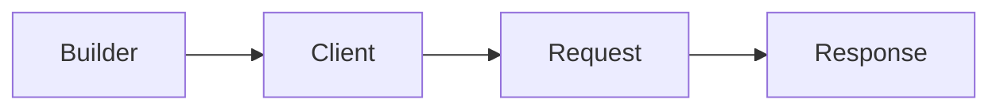

# 설치와 첫 요청

!!! info "이 장을 읽고 나면"

    HTTP client package를 project에 추가하고, client 하나로 typed GET 응답을 받으며,
    한 번뿐인 요청에는 one-shot을 선택할 수 있다.

HTTP client는 서버 framework와 별도로 배포된다. 호출하는 process는 HTTP client package만 참조하면 된다. 아래 tutorial은 client를 만들고 profile을 한 번 읽는다.

## 1. package 추가

=== "C#/.NET"

    ```bash
    dotnet add package Zlink.HttpClient
    ```

=== "C++"

    ```cmake
    find_package(zlink_http_client_cpp CONFIG REQUIRED)
    target_link_libraries(my_client PRIVATE zlink::http_client)
    ```

=== "Java"

    ```kotlin
    dependencies {
        implementation("systems.zlink:zlink-http-client:<version>")
    }
    ```

=== "Kotlin"

    ```kotlin
    dependencies {
        implementation("systems.zlink:zlink-http-client-kotlin:<version>")
    }
    ```

=== "Node/TypeScript"

    ```bash
    npm install @zlink-systems/http-client
    ```

## 2. client를 만들고 첫 GET 요청 보내기

client는 base URL과 기본 옵션을 담는 builder를 완성해 만든다. request builder는 client에서 GET·POST 같은 method를 선택할 때 만들어진다. typed 응답 종결자는 JSON body를 지정한 type으로 해석하고 응답 봉투를 돌려준다. 비동기 종결자는 결과를 기다리는 동안 thread나 event loop를 점유하지 않는다.

<!-- diagram: http-client-first-request -->


=== "C#/.NET"

    ```csharp
    --8<-- "framework/languages/dotnet/tutorial/HttpClient/Program.cs:http-client-create"
    --8<-- "framework/languages/dotnet/tutorial/HttpClient/Program.cs:http-first-request"
    ```

=== "C++"

    ```cpp
    --8<-- "framework/languages/cpp/tutorial/HttpClient/main.cpp:http-client-create"
    --8<-- "framework/languages/cpp/tutorial/HttpClient/main.cpp:http-first-request"
    ```

=== "Java"

    ```java
    --8<-- "framework/languages/java/tutorial/java/HttpClient/src/main/java/systems/zlink/tutorial/httpclient/HttpClientProgram.java:http-client-create"
    --8<-- "framework/languages/java/tutorial/java/HttpClient/src/main/java/systems/zlink/tutorial/httpclient/HttpClientProgram.java:http-first-request"
    ```

=== "Kotlin"

    ```kotlin
    --8<-- "framework/languages/java/tutorial/kotlin/HttpClient/src/main/kotlin/systems/zlink/tutorial/httpclient/HttpClientProgram.kt:http-client-create"
    --8<-- "framework/languages/java/tutorial/kotlin/HttpClient/src/main/kotlin/systems/zlink/tutorial/httpclient/HttpClientProgram.kt:http-first-request"
    ```

=== "Node/TypeScript"

    ```typescript
    --8<-- "framework/languages/node/tutorial/HttpClient/main.ts:http-client-create"
    --8<-- "framework/languages/node/tutorial/HttpClient/main.ts:http-first-request"
    ```

## 3. 실행 결과

=== "C#/.NET"

    ```text
    first request: p1 rookie
    ```

=== "C++"

    ```text
    # (#714 수정 뒤 채운다)
    ```

=== "Java"

    ```text
    first request: p1 rookie
    ```

=== "Kotlin"

    ```text
    first request: p1 rookie
    ```

=== "Node/TypeScript"

    ```text
    first request: p1 rookie
    ```

## 4. 한 번뿐인 요청

one-shot은 builder에서 바로 request builder를 얻는다. 이 경로는 완료 뒤 client를 닫으므로 연결 pool을 재사용하지 않는다. 같은 API를 반복 호출하는 service에는 앞 절처럼 client를 보관한다.

## 다음 장

[요청 만들기](03-making-requests.ko.md)에서 method·path·query·header와 요청별 timeout을 정한다. [응답 받기](05-handling-responses.ko.md)에서 응답 형태를 고르고, [client와 요청의 생애](08-client-lifecycle.ko.md)에서 재사용과 종료 규칙을 확인한다.
