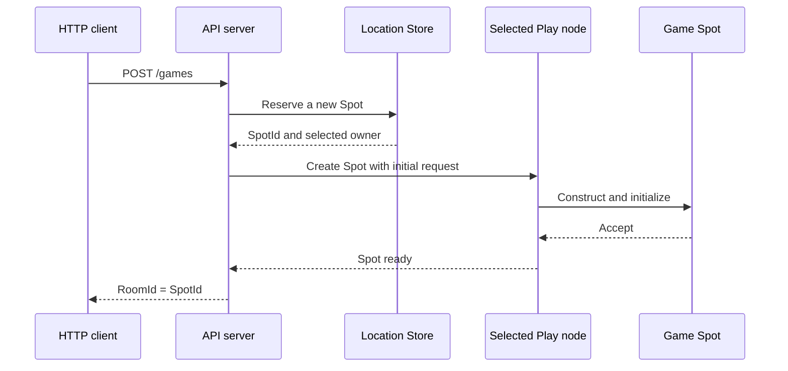

# 2. Getting Started

> **The document that owns this chapter's contract** — none. This is a walkthrough for
> installing and confirming your first working setup.

=== "C#/.NET"

    > First install the package and run a minimal example of two processes calling each
    > other (§1-§2), then follow the actual
    > [TicTacToe sample](../../../../../languages/dotnet/samples/TicTacToe) through the flow
    > of creating one room (§3-§11).

=== "C++"

    > First install the package and run a minimal example of two processes calling each
    > other (§1-§2), then follow the actual
    > [TicTacToe sample](../../../../../languages/cpp/samples/TicTacToe) through the flow of
    > creating one room (§3-§11).

=== "Java"

    > First install the package and run a minimal example of two processes calling each
    > other (§1-§2), then follow the actual
    > [TicTacToe sample](../../../../../languages/java/samples/java/TicTacToe) through the
    > flow of creating one room (§3-§11).

=== "Kotlin"

    > First install the package and run a minimal example of two processes calling each
    > other (§1-§2), then follow the actual
    > [TicTacToe sample](../../../../../languages/java/samples/kotlin/TicTacToe) through the
    > flow of creating one room (§3-§11).

=== "Node/TypeScript"

    > First install the package and run a minimal example of two processes calling each
    > other (§1-§2), then follow the actual
    > [TicTacToe sample](../../../../../languages/node/samples/TicTacToe.Ts) through the flow
    > of creating one room (§3-§11).

## 1. Installation

=== "C#/.NET"

    Get it from NuGet. The minimal combination needed to build one server is these three.

    ```bash
    dotnet add package Systems.Zlink                 # The core messaging engine (.NET binding)
    dotnet add package Zlink.Framework                # The contract and runtime
    dotnet add package Zlink.Framework.AspNetCore     # DI/hosted service registration (AddZLinkFramework)
    ```

    Packages to add when you need them:

    | Package | When to add it |
    | --- | --- |
    | `Zlink.Framework.Locations.Redis` | When using the Redis location store for auto-connect ([10-location](10-location.ko.md)) |
    | `Zlink.Framework.Codecs.Protobuf` · `.MessagePack` | To use instead of the default JSON codec ([05-channel-messaging §7](05-channel-messaging.ko.md#7-직렬화-codec)) |
    | `Systems.Zlink.Stream.Connector` | When building an external client (a game client, mobile) ([09-stream](09-stream.ko.md)) |
    | `Zlink.HttpClient` | When the server calls out over HTTP ([HTTP Client guide](../http-client/README.ko.md)) |

    Framework packages ship starting at **0.9**. `Systems.Zlink` (the core binding) and
    `Zlink.HttpClient` follow their own version tracks, so the three packages' version
    numbers differ. `net8.0` or later is required.

    The license differs by layer — core/binding is MPL-2.0, framework is FSL-1.1-ALv2, and
    `Zlink.HttpClient` is Apache-2.0. There's no cost to building and selling a service
    ([17-alternative §7](17-alternative.ko.md#7-라이선스--쓰는-데-드는-비용)).

=== "C++"

    Get it via a vcpkg manifest or CMake `find_package`. The minimal combination needed to
    build one server is:

    ```cmake
    find_package(zlink CONFIG REQUIRED)
    target_link_libraries(my_server PRIVATE zlink::framework)
    ```

    Targets to add when you need them:

    | Target | When to add it |
    | --- | --- |
    | `zlink::framework_locations_redis` | When using the Redis location store for auto-connect ([10-location](10-location.ko.md)) |
    | `zlink::framework_codec_protobuf` · `_msgpack` | To use instead of the default JSON codec ([05-channel-messaging §7](05-channel-messaging.ko.md#7-직렬화-codec)) |
    | stream connector | When building an external client (a game client, mobile) ([09-stream](09-stream.ko.md)) |
    | `zlink::http_client` | When the server calls out over HTTP ([HTTP Client guide](../http-client/README.ko.md)) |

    It uses C++20 coroutines, so a compiler that supports at least that is required.

    The license differs by layer — core/binding is MPL-2.0, framework is FSL-1.1-ALv2, and
    `zlink::http_client` is Apache-2.0. There's no cost to building and selling a service
    ([17-alternative §7](17-alternative.ko.md#7-라이선스--쓰는-데-드는-비용)).

=== "Java"

    Get it from Maven Central. The minimal combination needed to build one server is these
    two.

    ```kotlin
    implementation("systems.zlink:zlink-framework-core")                // The contract and runtime
    implementation("systems.zlink:zlink-framework-spring-boot-starter") // DI/lifecycle registration
    ```

    Artifacts to add when you need them:

    | Artifact | When to add it |
    | --- | --- |
    | `zlink-framework-locations-redis` | When using the Redis location store for auto-connect ([10-location](10-location.ko.md)) |
    | `zlink-framework-codec-protobuf` · `-codec-msgpack` | To use instead of the default JSON codec ([05-channel-messaging §7](05-channel-messaging.ko.md#7-직렬화-codec)) |
    | `zlink-stream-connector` | When building an external client (a game client, mobile) ([09-stream](09-stream.ko.md)) |
    | `zlink-http-client` | When the server calls out over HTTP ([HTTP Client guide](../http-client/README.ko.md)) |

    JDK 21 or later is required.

    The license differs by layer — core/binding is MPL-2.0, framework is FSL-1.1-ALv2, and
    `zlink-http-client` is Apache-2.0. There's no cost to building and selling a service
    ([17-alternative §7](17-alternative.ko.md#7-라이선스--쓰는-데-드는-비용)).

=== "Kotlin"

    Get it from Maven Central. The minimal combination needed to build one server is these
    three.

    ```kotlin
    implementation("systems.zlink:zlink-framework-core")                // The contract and runtime
    implementation("systems.zlink:zlink-framework-spring-boot-starter") // DI/lifecycle registration
    implementation("systems.zlink:zlink-framework-kotlin")              // Coroutine idiom
    ```

    Artifacts to add when you need them:

    | Artifact | When to add it |
    | --- | --- |
    | `zlink-framework-locations-redis` | When using the Redis location store for auto-connect ([10-location](10-location.ko.md)) |
    | `zlink-framework-codec-protobuf` · `-codec-msgpack` | To use instead of the default JSON codec ([05-channel-messaging §7](05-channel-messaging.ko.md#7-직렬화-codec)) |
    | `zlink-stream-connector` | When building an external client (a game client, mobile) ([09-stream](09-stream.ko.md)) |
    | `zlink-http-client` | When the server calls out over HTTP ([HTTP Client guide](../http-client/README.ko.md)) |

    JDK 21 or later is required.

    The license differs by layer — core/binding is MPL-2.0, framework is FSL-1.1-ALv2, and
    `zlink-http-client` is Apache-2.0. There's no cost to building and selling a service
    ([17-alternative §7](17-alternative.ko.md#7-라이선스--쓰는-데-드는-비용)).

=== "Node/TypeScript"

    Get it from npm. The minimal combination needed to build one server is these two.

    ```bash
    npm install @zlink-systems/framework   # The contract and runtime
    npm install @zlink-systems/nestjs      # DI/module registration
    ```

    Packages to add when you need them:

    | Package | When to add it |
    | --- | --- |
    | `@zlink-systems/framework-locations-redis` | When using the Redis location store for auto-connect ([10-location](10-location.ko.md)) |
    | `@zlink-systems/framework-codec-protobuf` · `-codec-msgpack` | To use instead of the default JSON codec ([05-channel-messaging §7](05-channel-messaging.ko.md#7-직렬화-codec)) |
    | `@zlink-systems/stream-connector` | When building an external client (a game client, mobile) ([09-stream](09-stream.ko.md)) |
    | `@zlink-systems/http-client` | When the server calls out over HTTP ([HTTP Client guide](../http-client/README.ko.md)) |

    Node.js 20 or later is required.

    The license differs by layer — core/binding is MPL-2.0, framework is FSL-1.1-ALv2, and
    `@zlink-systems/http-client` is Apache-2.0. There's no cost to building and selling a
    service ([17-alternative §7](17-alternative.ko.md#7-라이선스--쓰는-데-드는-비용)).

## 2. A Minimal Example — Two Processes Calling Each Other

With no location store and no Redis, try one request/reply over a manual connection where
you write the endpoint directly. This is the point where you confirm "installation is
done."

**The shared contract.** Both processes reference the same record.

=== "C#/.NET"

    ```csharp
    public sealed record Hello(string Name);
    public sealed record Greeting(string Text);
    ```

=== "C++"

    ```cpp
    struct hello_t { std::string name; };
    struct greeting_t { std::string text; };
    ```

=== "Java"

    ```java
    public record Hello(String name) {}
    public record Greeting(String text) {}
    ```

=== "Kotlin"

    ```kotlin
    data class Hello(val name: String)
    data class Greeting(val text: String)
    ```

=== "Node/TypeScript"

    ```typescript
    export interface Hello { readonly name: string; }
    export interface Greeting { readonly text: string; }
    ```

**The server process.** Owns the `greeting` channel and registers a handler.

=== "C#/.NET"

    ```csharp
    var builder = WebApplication.CreateBuilder(args);

    builder.Services.AddZLinkFramework(options =>
    {
        options.AddHandlersFromAssemblyOf<Program>();          // Finds handler types.

        var mesh = options.AddRouteMesh("services")            // Names the mesh.
            .Listen("tcp://0.0.0.0:7101");                     // Its own endpoint for other processes to connect to.
        mesh.Channel("greeting").Server();                     // This process handles "greeting".
    });

    var app = builder.Build();
    await app.RunAsync();

    // A handler that processes one request.
    public sealed class HelloHandler : IZLinkRequestHandler<Hello, Greeting>
    {
        public ValueTask<Greeting> HandleAsync(
            Hello request,
            IZLinkMessageContext context,
            CancellationToken cancellationToken)
            => ValueTask.FromResult(new Greeting($"hello, {request.Name}"));
    }
    ```

=== "C++"

    ```cpp
    int main (int argc, char **argv)
    {
        auto app = zlink::framework::app_t::create ();
        app.add_zlink_framework ([] (zlink_framework_options_t &options) {
            auto mesh = options.add_route_mesh ("services")     // Names the mesh.
              .listen ("tcp://0.0.0.0:7101");                   // Its own endpoint for other processes to connect to.
            mesh.channel_name ("greeting").server ()            // This process handles "greeting".
              .add_request_handler<hello_handler_t, hello_t, greeting_t> ();
        });
        return app.run (argc, argv);
    }

    // A handler that processes one request.
    class hello_handler_t
    {
      public:
        using request_type = hello_t;
        using reply_type = greeting_t;

        greeting_t handle (const hello_t &request)
        {
            return greeting_t{"hello, " + request.name};
        }
    };
    ```

=== "Java"

    ```java
    @EnableZLinkFramework
    @SpringBootApplication
    public class ServerApplication {

        @Bean
        ZLinkFrameworkConfigurer zlink() {
            return options -> {
                options.addHandlersFromPackageOf(ServerApplication.class);  // Finds handler types.

                ZLinkMeshNodeBuilder mesh = options.addRouteMesh("services") // Names the mesh.
                    .listen("tcp://0.0.0.0:7101");                          // Its own endpoint for other processes to connect to.
                mesh.channel("greeting").server()                           // This process handles "greeting".
                    .addRequestHandler(HelloHandler.class, Hello.class, Greeting.class);
            };
        }
    }

    // A handler that processes one request.
    public final class HelloHandler implements ZLinkRequestHandler<Hello, Greeting> {

        @Override
        public CompletionStage<Greeting> handle(Hello request, ZLinkMessageContext context) {
            return CompletableFuture.completedFuture(new Greeting("hello, " + request.name()));
        }
    }
    ```

=== "Kotlin"

    ```kotlin
    @EnableZLinkFramework
    @SpringBootApplication
    class ServerApplication {

        @Bean
        fun zlink(): ZLinkFrameworkConfigurer = ZLinkFrameworkConfigurer { options ->
            options.addHandlersFromPackageOf(ServerApplication::class.java)  // Finds handler types.

            val mesh = options.addRouteMesh("services")                      // Names the mesh.
                .listen("tcp://0.0.0.0:7101")                                // Its own endpoint for other processes to connect to.
            mesh.channel("greeting").server()                                // This process handles "greeting".
                .addRequestHandler(HelloHandler::class.java, Hello::class.java, Greeting::class.java)
        }
    }

    // A handler that processes one request.
    class HelloHandler : ZLinkRequestHandler<Hello, Greeting> {

        override suspend fun handle(request: Hello, context: ZLinkMessageContext): Greeting =
            Greeting("hello, ${request.name}")
    }
    ```

=== "Node/TypeScript"

    ```typescript
    @Module({
      imports: [
        ZLinkModule.forRootFactory({
          useFactory: () => {
            const builder = zlinkFramework();

            const mesh = builder.addRouteMesh('services')   // Names the mesh.
              .listen('tcp://0.0.0.0:7101');                // Its own endpoint for other processes to connect to.
            mesh.channel('greeting').server()               // This process handles "greeting".
              .addRequestHandler(HelloHandler);

            return builder;
          }
        }),
        zlinkModule(__dirname, { })                         // Gathers handlers as providers.
      ]
    })
    export class ServerModule {}

    // A handler that processes one request.
    @zlinkRequestHandler('greeting', PacketNames.hello)
    export class HelloHandler implements ZLinkRequestHandler<Hello, Greeting> {

      async handle(request: Hello): Promise<Greeting> {
        return { text: `hello, ${request.name}` };
      }
    }
    ```

**The client process.** Joins the same mesh and calls `greeting`.

=== "C#/.NET"

    ```csharp
    var builder = WebApplication.CreateBuilder(args);

    builder.Services.AddZLinkFramework(options =>
    {
        var mesh = options.AddRouteMesh("services")
            .Listen("tcp://0.0.0.0:7102");                     // It also needs its own endpoint.
        mesh.Channel("greeting").Client();                     // The call-only side is Client.
        mesh.PeerConnections.Connect("tcp://127.0.0.1:7101");  // Manual connection — write the server endpoint directly.
    });

    var app = builder.Build();

    app.MapGet("/hello/{name}", async (
        string name,
        IZLinkRouteClient route,
        CancellationToken cancellationToken) =>
    {
        // The target is just one ChannelName. Which node handles it isn't specified.
        var reply = await route
            .RequestToChannel("greeting", new Hello(name))
            .Async<Greeting>(cancellationToken);

        return Results.Ok(reply.Text);
    });

    await app.RunAsync();
    ```

=== "C++"

    ```cpp
    app.add_zlink_framework ([] (zlink_framework_options_t &options) {
        auto mesh = options.add_route_mesh ("services")
          .listen ("tcp://0.0.0.0:7102");                       // It also needs its own endpoint.
        mesh.channel_name ("greeting").client ();               // The call-only side is client.
        mesh.peer_connections ().connect ("tcp://127.0.0.1:7101"); // Manual connection — write the server endpoint directly.

        options.http ()
          .listen ("http://0.0.0.0:5000")
          .map_get<hello_http_handler_t> ("/hello/{name}");
    });

    // The target is just one ChannelName. Which node handles it isn't specified.
    task_t<std::string> hello_http_handler_t::handle (const std::string &name)
    {
        auto reply = co_await _route.request_to_channel ("greeting", hello_t{name})
                       .submit<greeting_t> ();
        co_return reply.text;
    }
    ```

=== "Java"

    ```java
    @Bean
    ZLinkFrameworkConfigurer zlink() {
        return options -> {
            ZLinkMeshNodeBuilder mesh = options.addRouteMesh("services")
                .listen("tcp://0.0.0.0:7102");                  // It also needs its own endpoint.
            mesh.channel("greeting").client();                  // The call-only side is Client.
            mesh.peerConnections().connect("tcp://127.0.0.1:7101"); // Manual connection — write the server endpoint directly.
        };
    }

    @RestController
    class HelloController {
        private final ZLinkRouteClient route;

        HelloController(ZLinkRouteClient route) { this.route = route; }

        @GetMapping("/hello/{name}")
        CompletionStage<String> hello(@PathVariable String name) {
            // The target is just one ChannelName. Which node handles it isn't specified.
            return route.requestToChannel("greeting", new Hello(name))
                .submit(Greeting.class)
                .thenApply(Greeting::text);
        }
    }
    ```

=== "Kotlin"

    ```kotlin
    @Bean
    fun zlink(): ZLinkFrameworkConfigurer = ZLinkFrameworkConfigurer { options ->
        val mesh = options.addRouteMesh("services")
            .listen("tcp://0.0.0.0:7102")                       // It also needs its own endpoint.
        mesh.channel("greeting").client()                       // The call-only side is Client.
        mesh.peerConnections().connect("tcp://127.0.0.1:7101")  // Manual connection — write the server endpoint directly.
    }

    @RestController
    class HelloController(private val route: ZLinkRouteClient) {

        @GetMapping("/hello/{name}")
        suspend fun hello(@PathVariable name: String): String =
            // The target is just one ChannelName. Which node handles it isn't specified.
            route.requestToChannel("greeting", Hello(name))
                .submit(Greeting::class.java)
                .await()
                .text
    }
    ```

=== "Node/TypeScript"

    ```typescript
    ZLinkModule.forRootFactory({
      useFactory: () => {
        const builder = zlinkFramework();
        const mesh = builder.addRouteMesh('services')
          .listen('tcp://0.0.0.0:7102');                        // It also needs its own endpoint.
        mesh.channel('greeting').client();                      // The call-only side is client.
        mesh.peerConnections.connect('tcp://127.0.0.1:7101');   // Manual connection — write the server endpoint directly.
        return builder;
      }
    })

    @Controller()
    export class HelloController {
      constructor(@Inject(ZLINK_ROUTE_CLIENT) private readonly route: ZLinkRouteClient) {}

      @Get('/hello/:name')
      async hello(@Param('name') name: string): Promise<string> {
        // The target is just one ChannelName. Which node handles it isn't specified.
        const reply = await this.route
          .requestToChannel('greeting', { name })
          .submit<Greeting>();
        return reply.text;
      }
    }
    ```

Start the server first, then the client, and call `curl http://localhost:5000/hello/world`
— it returns `hello, world`.

Three things are confirmed here — the package is wired up, the two processes are connected
through the mesh, and the call was routed by logical name (`greeting`) alone. This example
has no Redis and no location store. For the calling code to stay the same as servers scale
up and down, you need auto-connect, which is covered by
[10-location](10-location.ko.md).

## 3. TicTacToe — The Flow Of Creating One Room

From here on, we move to an actual sample. The API server doesn't pick a specific Play node
— it only passes the room's stable type and its initial settings. The Framework selects one
of the Object Servers that registered that type, and issues a globally unique `SpotId`.

### 3.1 Execution Flow



The API code never carries the Play node's `NodeRid` or endpoint. The same creation code is
used even as Play nodes are added or replaced.

### 3.2 Sample Locations

=== "C#/.NET"

    | What to check | File |
    | --- | --- |
    | Full run | `samples/TicTacToe/run_sample.sh` |
    | API run project | `samples/TicTacToe/Server/Api/TicTacToe.Server.Api.csproj` |
    | Play run project | `samples/TicTacToe/Server/Play/TicTacToe.Server.Play.csproj` |
    | HTTP handler | `samples/TicTacToe/Server/Api/Handlers/CreateGameHttpHandler.cs` |
    | API Framework config | `samples/TicTacToe/Server/Api/ApiServer.cs` |
    | Play Framework config | `samples/TicTacToe/Server/Play/PlayServer.cs` |
    | Game Spot | `samples/TicTacToe/Server/Play/Infrastructure/ZLink/Spots/TicTacToeGameSpot/TicTacToeGame.cs` |
    | Shared messages | `samples/TicTacToe/Shared/Contracts/Messages.cs` |

    The table's relative paths are rooted at `framework/languages/dotnet`.

=== "C++"

    | What to check | File |
    | --- | --- |
    | Full run | `samples/TicTacToe/run_sample.sh` |
    | API entry point | `samples/TicTacToe/Server/Api/main.cpp` |
    | Play entry point | `samples/TicTacToe/Server/Play/main.cpp` |
    | HTTP handler | `samples/TicTacToe/Server/Api/Handlers/create_game_http_handler.hpp` |
    | Game Spot | `samples/TicTacToe/Server/Play/Infrastructure/ZLink/Spots/TicTacToeGameSpot/tictactoe_game_spot.hpp` |
    | Shared messages | `samples/TicTacToe/Shared/Contracts/messages.hpp` |

    The table's relative paths are rooted at `framework/languages/cpp`.

=== "Java"

    | What to check | File |
    | --- | --- |
    | Full run | `samples/java/TicTacToe/run_sample.sh` |
    | API entry point | `samples/java/TicTacToe/Server/.../api/ApiServer.java` |
    | Play entry point | `samples/java/TicTacToe/Server/.../play/PlayServer.java` |
    | HTTP handler | `samples/java/TicTacToe/Server/.../api/handlers/CreateGameHttpHandler.java` |
    | Game Spot | `samples/java/TicTacToe/Server/.../play/infrastructure/zlink/spots/tictactoegamespot/TicTacToeGame.java` |
    | Shared messages | `samples/java/TicTacToe/Shared/.../contracts/Messages.java` |

    The table's relative paths are rooted at `framework/languages/java`.

=== "Kotlin"

    | What to check | File |
    | --- | --- |
    | Full run | `samples/kotlin/TicTacToe/run_sample.sh` |
    | API entry point | `samples/kotlin/TicTacToe/Server/.../api/ApiServer.kt` |
    | Play entry point | `samples/kotlin/TicTacToe/Server/.../play/PlayServer.kt` |
    | HTTP handler | `samples/kotlin/TicTacToe/Server/.../api/handlers/CreateGameHttpHandler.kt` |
    | Game Spot | `samples/kotlin/TicTacToe/Server/.../play/infrastructure/zlink/spots/tictactoegamespot/TicTacToeGame.kt` |
    | Shared messages | `samples/kotlin/TicTacToe/Shared/.../contracts/Messages.kt` |

    The table's relative paths are rooted at `framework/languages/java`.

=== "Node/TypeScript"

    | What to check | File |
    | --- | --- |
    | Full run | `samples/TicTacToe.Ts/run_sample.sh` |
    | API entry point | `samples/TicTacToe.Ts/Server/Api/main.ts` |
    | Play entry point | `samples/TicTacToe.Ts/Server/Play/main.ts` |
    | HTTP handler | `samples/TicTacToe.Ts/Server/Api/Handlers/create-game-http-handler.ts` |
    | Game Spot | `samples/TicTacToe.Ts/Server/Play/Infrastructure/ZLink/Spots/TicTacToeGameSpot/tictactoe-game-spot.ts` |
    | Shared messages | `samples/TicTacToe.Ts/Shared/Contracts/messages.ts` |

    The table's relative paths are rooted at `framework/languages/node`.

## 4. API Server Configuration

The API server registers a Location Store and an Object Client role. The Object Client role
is used to create or call an Actor and Spot on another Object Server.

=== "C#/.NET"

    ```csharp
    builder.Services.AddZLinkFramework(options =>
    {
        // Registers a shared Store so every process queries the same location information.
        options.AddLocationStore(new ZLinkRedisLocationStore(redis =>
        {
            redis.ConnectionString = settings.RedisEndpoint;
            redis.KeyPrefix = settings.RedisKeyPrefix;
        }));

        var mesh = options.AddRouteMesh(SampleNodes.Mesh)
            .Listen(settings.MeshEndpoint)
            .SetRoutingIdPrefix("tictactoe-api");

        // The API process doesn't hold any Object — it only initiates remote Object calls.
        mesh.Objects().Client();
    });
    ```

=== "C++"

    ```cpp
    app.add_zlink_framework ([&] (zlink_framework_options_t &options) {
        // Registers a shared Store so every process queries the same location information.
        options.add_location_store (
          std::make_shared<redis_location_store_t> (settings.redis_endpoint,
                                                    settings.redis_key_prefix));

        auto mesh = options.add_route_mesh (sample_nodes_t::mesh)
          .listen (settings.mesh_endpoint)
          .set_routing_id (routing_id_t::from ("tictactoe-api-1"));

        // The API process doesn't hold any Object — it only initiates remote Object calls.
        mesh.objects ().client ();
    });
    ```

=== "Java"

    ```java
    return options -> {
        // Registers a shared Store so every process queries the same location information.
        options.addLocationStore(new ZLinkRedisLocationStore(
            settings.redisEndpoint(), settings.redisKeyPrefix()));

        ZLinkMeshNodeBuilder mesh = options.addRouteMesh(SampleNodes.MESH)
            .listen(settings.meshEndpoint())
            .setRoutingIdPrefix("tictactoe-api");

        // The API process doesn't hold any Object — it only initiates remote Object calls.
        mesh.objects().client();
    };
    ```

=== "Kotlin"

    ```kotlin
    ZLinkFrameworkConfigurer { options ->
        // Registers a shared Store so every process queries the same location information.
        options.addLocationStore(
            ZLinkRedisLocationStore(settings.redisEndpoint, settings.redisKeyPrefix))

        val mesh = options.addRouteMesh(SampleNodes.MESH)
            .listen(settings.meshEndpoint)
            .setRoutingIdPrefix("tictactoe-api")

        // The API process doesn't hold any Object — it only initiates remote Object calls.
        mesh.objects().client()
    }
    ```

=== "Node/TypeScript"

    ```typescript
    useFactory: () => {
      const builder = zlinkFramework();
      // Registers a shared Store so every process queries the same location information.
      builder.addLocationStore(new ZLinkRedisLocationStore({
        url: settings.redisEndpoint,
        keyPrefix: settings.redisKeyPrefix
      }));

      const mesh = builder.addRouteMesh(SampleNodes.mesh)
        .listen(settings.meshEndpoint)
        .setRoutingIdPrefix('tictactoe-api');

      // The API process doesn't hold any Object — it only initiates remote Object calls.
      mesh.objects().client();
      return builder;
    }
    ```

The sample reads the peer endpoint from a config file for reproducible local runs. This
endpoint only sets up the connection — it doesn't specify which Play node the new Game Spot
gets placed on.

## 5. Creating A Spot From An HTTP Request

The HTTP handler uses the spot manager it received through DI.

=== "C#/.NET"

    ```csharp
    internal static async Task<IResult> HandleAsync(
        CreateGameHttpReq request,
        IZLinkSpotManager spots,
        SampleSettings settings,
        ILoggerFactory loggerFactory,
        CancellationToken cancellationToken)
    {
        var gameName = !string.IsNullOrWhiteSpace(request.GameName)
            ? request.GameName
            : SampleDefaults.GameName;

        var created = await spots
            .Create(SampleTypes.GameSpot)      // A node that provides this stable type becomes a candidate.
            .InMesh(SampleNodes.Mesh)          // Selects the RouteMesh to create the Object on.
            .Request(new TicTacToeGameCreateReq(
                gameName,
                SampleDefaults.RequiredLevel)) // The initial settings passed to the new Spot's OnCreateAsync.
            .Async(cancellationToken);

        return Results.Ok(new CreateGameHttpRes(
            created.Spot.SpotId,               // Uses the Framework-issued SpotId as the room id.
            settings.PlayEndpoints,
            settings.PlayNodes,
            gameName,
            SampleDefaults.RequiredLevel));
    }
    ```

=== "C++"

    ```cpp
    // The HTTP handler uses the spot manager it received through DI.
    task_t<create_game_http_res_t>
    create_game_http_handler_t::handle (const create_game_http_req_t &request)
    {
        const auto game_name = request.game_name.empty ()
                                 ? std::string (sample_defaults_t::game_name)
                                 : request.game_name;

        auto created = co_await _spots
          .create (sample_types_t::game_spot)     // A node that provides this stable type becomes a candidate.
          .in_mesh (sample_nodes_t::mesh)         // Selects the RouteMesh to create the Object on.
          .creation_request (tictactoe_game_create_req_t{
            game_name, sample_defaults_t::required_level})  // The initial settings passed to the new Spot's on_create.
          .submit ();

        co_return create_game_http_res_t{
          created.spot.spot_id (),                // Uses the Framework-issued SpotId as the room id.
          _settings.play_endpoints,
          _settings.play_nodes,
          game_name,
          sample_defaults_t::required_level};
    }
    ```

=== "Java"

    ```java
    // The HTTP handler uses the ZLinkSpotManager it received through DI.
    @PostMapping("/games")
    public CompletionStage<CreateGameHttpRes> create(@RequestBody CreateGameHttpReq request) {
        String gameName = (request.gameName() == null || request.gameName().isBlank())
            ? SampleDefaults.GAME_NAME
            : request.gameName();

        return spots
            .create(SampleTypes.GAME_SPOT)      // A node that provides this stable type becomes a candidate.
            .inMesh(SampleNodes.MESH)           // Selects the RouteMesh to create the Object on.
            .request(new TicTacToeGameCreateReq(
                gameName,
                SampleDefaults.REQUIRED_LEVEL)) // The initial settings passed to the new Spot's onCreate.
            .submit()
            .thenApply(created -> new CreateGameHttpRes(
                created.spot().spotId(),        // Uses the Framework-issued SpotId as the room id.
                settings.playEndpoints(),
                settings.playNodes(),
                gameName,
                SampleDefaults.REQUIRED_LEVEL));
    }
    ```

=== "Kotlin"

    ```kotlin
    // The HTTP handler uses the ZLinkSpotManager it received through DI.
    @PostMapping("/games")
    suspend fun create(@RequestBody request: CreateGameHttpReq): CreateGameHttpRes {
        val gameName = request.gameName.ifBlank { SampleDefaults.GAME_NAME }

        val created = spots
            .create(SampleTypes.GAME_SPOT)      // A node that provides this stable type becomes a candidate.
            .inMesh(SampleNodes.MESH)           // Selects the RouteMesh to create the Object on.
            .request(TicTacToeGameCreateReq(
                gameName,
                SampleDefaults.REQUIRED_LEVEL)) // The initial settings passed to the new Spot's onCreate.
            .submit()
            .await()

        return CreateGameHttpRes(
            created.spot().spotId(),            // Uses the Framework-issued SpotId as the room id.
            settings.playEndpoints,
            settings.playNodes,
            gameName,
            SampleDefaults.REQUIRED_LEVEL)
    }
    ```

=== "Node/TypeScript"

    ```typescript
    // The HTTP handler uses the injected spot manager.
    @Post('/games')
    async create(@Body() request: CreateGameHttpReq): Promise<CreateGameHttpRes> {
      const gameName = request.gameName?.trim() || SampleDefaults.gameName;

      const created = await this.spots
        .create(SampleTypes.gameSpot)         // A node that provides this stable type becomes a candidate.
        .inMesh(SampleNodes.mesh)             // Selects the RouteMesh to create the Object on.
        .request(tictactoeGameCreateReq(
          gameName,
          SampleDefaults.requiredLevel))      // The initial settings passed to the new Spot's onCreate.
        .submit();

      return createGameHttpRes(
        created.spot.spotId,                  // Uses the Framework-issued SpotId as the room id.
        this.settings.playEndpoints,
        this.settings.playNodes,
        gameName,
        SampleDefaults.requiredLevel);
    }
    ```

Use `Create` for creating a new User Spot where the caller doesn't decide the `SpotId`. To
look up or create the same `SpotId` again, use `GetOrCreate(spotId, spotType)`.

## 6. Registering A Stable Type On The Play Server

The Framework only uses a Serving Object Server that registered the requested stable type as
a creation candidate. The Play server registers the `TicTacToeGame` factory as follows.

=== "C#/.NET"

    ```csharp
    var mesh = options.AddRouteMesh(SampleNodes.Mesh)
        .Listen(settings.MeshEndpoint)
        .SetRoutingIdPrefix("tictactoe-play");

    mesh.Objects().Server()
        .AddSpotFactory<TicTacToeGame>(
            SampleTypes.GameSpot,               // The same stable type the API passed to Create.
            factory => factory.DisableRelocation());
    ```

=== "C++"

    ```cpp
    auto mesh = options.add_route_mesh (sample_nodes_t::mesh)
      .listen (settings.mesh_endpoint)
      .set_routing_id (routing_id_t::from ("tictactoe-play-1"));

    mesh.add_spot_factory<tictactoe_game_t> (
      sample_types_t::game_spot,          // The same stable type the API passed to create.
      [] (spot_context_t context) { return std::make_shared<tictactoe_game_t> (std::move (context)); },
      [] (auto &factory) { factory.disable_relocation (); });
    ```

=== "Java"

    ```java
    ZLinkMeshNodeBuilder mesh = options.addRouteMesh(SampleNodes.MESH)
        .listen(settings.meshEndpoint())
        .setRoutingIdPrefix("tictactoe-play");

    mesh.objects().server()
        .addSpotFactory(
            SampleTypes.GAME_SPOT,          // The same stable type the API passed to create.
            TicTacToeGame.class,
            factory -> factory.disableRelocation());
    ```

=== "Kotlin"

    ```kotlin
    val mesh = options.addRouteMesh(SampleNodes.MESH)
        .listen(settings.meshEndpoint)
        .setRoutingIdPrefix("tictactoe-play")

    mesh.objects().server()
        .addSpotFactory(
            SampleTypes.GAME_SPOT,          // The same stable type the API passed to create.
            TicTacToeGame::class.java
        ) { factory -> factory.disableRelocation() }
    ```

=== "Node/TypeScript"

    ```typescript
    const mesh = builder.addRouteMesh(SampleNodes.mesh)
      .listen(settings.meshEndpoint)
      .setRoutingIdPrefix('tictactoe-play');

    mesh.objects().server()
      .addSpotFactory(
        SampleTypes.gameSpot,               // The same stable type the API passed to create.
        TicTacToeGame,
        factory => factory.disableRelocation());
    ```

There's no sample contract for preferring a specific Play node or placing by `NodeRid`. The
Framework and Location Store decide the placement candidate and capacity.

## 7. Validating The Initial Settings

The selected Play node creates the Spot, then hands the initial request to `OnCreate`. The
Spot validates the settings and returns whether it accepts creation.

=== "C#/.NET"

    ```csharp
    public ValueTask<ZLinkSpotCreateResponse> OnCreateAsync(
        ZLinkMessage request,
        CancellationToken cancellationToken)
    {
        var settings = request.Decode<TicTacToeGameCreateReq>();

        if (string.IsNullOrWhiteSpace(settings.GameName))
            return ValueTask.FromResult(
                ZLinkSpotCreateResponse.Reject("GameName is required."));

        _gameName = settings.GameName;
        _requiredLevel = settings.RequiredLevel;

        // Only after Accept is this Spot published as Ready in the Location Store.
        return ValueTask.FromResult(ZLinkSpotCreateResponse.Accept());
    }
    ```

=== "C++"

    ```cpp
    task_t<spot_create_response_t> tictactoe_game_t::on_create (const message_t &request)
    {
        const auto settings = request.decode<tictactoe_game_create_req_t> ();

        if (settings.game_name.empty ())
            co_return spot_create_response_t::reject ("GameName is required.");

        _game_name = settings.game_name;
        _required_level = settings.required_level;

        // Only after accept is this Spot published as Ready in the Location Store.
        co_return spot_create_response_t::accept ();
    }
    ```

=== "Java"

    ```java
    @Override
    public CompletionStage<ZLinkSpotCreateResponse> onCreate(ZLinkMessage request) {
        TicTacToeGameCreateReq settings = request.decode(TicTacToeGameCreateReq.class);

        if (settings.gameName() == null || settings.gameName().isBlank()) {
            return CompletableFuture.completedFuture(
                ZLinkSpotCreateResponse.reject("GameName is required."));
        }

        this.gameName = settings.gameName();
        this.requiredLevel = settings.requiredLevel();

        // Only after accept is this Spot published as Ready in the Location Store.
        return CompletableFuture.completedFuture(ZLinkSpotCreateResponse.accept());
    }
    ```

=== "Kotlin"

    ```kotlin
    override suspend fun onCreate(request: ZLinkMessage): ZLinkSpotCreateResponse {
        val settings = request.decode(TicTacToeGameCreateReq::class.java)

        if (settings.gameName.isBlank())
            return ZLinkSpotCreateResponse.reject("GameName is required.")

        gameName = settings.gameName
        requiredLevel = settings.requiredLevel

        // Only after accept is this Spot published as Ready in the Location Store.
        return ZLinkSpotCreateResponse.accept()
    }
    ```

=== "Node/TypeScript"

    ```typescript
    async onCreate(request: ZLinkMessage): Promise<ZLinkSpotCreateResponse> {
      const settings = request.decode<TicTacToeGameCreateReq>(Object as never);

      if (!settings.gameName?.trim())
        return ZLinkSpotCreateResponse.reject('GameName is required.');

      this.gameName = settings.gameName;
      this.requiredLevel = settings.requiredLevel;

      // Only after accept is this Spot published as Ready in the Location Store.
      return ZLinkSpotCreateResponse.accept();
    }
    ```

If creation is rejected, that reservation is never published as a Ready Spot. The caller
receives the completion result as a typed failure.

## 8. What The ClientServer Channel Is For

TicTacToe's `tictactoe.api` ClientServer channel is used when a Play session requests user
authentication from the API server. It isn't used for Game Spot creation.

=== "C#/.NET"

    ```csharp
    // API process: handles the authentication request.
    options.AddClientServerChannel(SampleChannels.Api)
        .Server()
        .Listen()
        .AddRequestHandler<
            AuthenticatePlayerHandler,
            AuthenticatePlayerReq,
            AuthenticatePlayerRes>();

    // Play process: sends the authentication request.
    options.AddClientServerChannel(SampleChannels.Api)
        .Client();
    ```

=== "C++"

    ```cpp
    // API process: handles the authentication request.
    options.add_client_server_channel (sample_channels_t::api)
      .server ()
      .listen ()
      .add_request_handler<authenticate_player_handler_t,
                           authenticate_player_req_t,
                           authenticate_player_res_t> ();

    // Play process: sends the authentication request.
    options.add_client_server_channel (sample_channels_t::api)
      .client ();
    ```

=== "Java"

    ```java
    // API process: handles the authentication request.
    options.addClientServerChannel(SampleChannels.API)
        .server()
        .listen()
        .addRequestHandler(
            AuthenticatePlayerHandler.class,
            AuthenticatePlayerReq.class,
            AuthenticatePlayerRes.class);

    // Play process: sends the authentication request.
    options.addClientServerChannel(SampleChannels.API)
        .client();
    ```

=== "Kotlin"

    ```kotlin
    // API process: handles the authentication request.
    options.addClientServerChannel(SampleChannels.API)
        .server()
        .listen()
        .addRequestHandler(
            AuthenticatePlayerHandler::class.java,
            AuthenticatePlayerReq::class.java,
            AuthenticatePlayerRes::class.java)

    // Play process: sends the authentication request.
    options.addClientServerChannel(SampleChannels.API)
        .client()
    ```

=== "Node/TypeScript"

    ```typescript
    // API process: handles the authentication request.
    builder.addClientServerChannel(SampleChannels.api)
      .server()
      .listen()
      .addRequestHandler(AuthenticatePlayerHandler);

    // Play process: sends the authentication request.
    builder.addClientServerChannel(SampleChannels.api)
      .client();
    ```

Object creation and a ClientServer call are different features. No dedicated
room-creation channel or `CreateGameHandler` is added.

## 9. Building And Running

=== "C#/.NET"

    ```bash
    # Build the sample solution first.
    dotnet build framework/languages/dotnet/samples/TicTacToe/TicTacToe.sln

    # Prepares Redis and 4 processes, and verifies the whole scenario.
    framework/languages/dotnet/samples/TicTacToe/run_sample.sh
    ```

=== "C++"

    ```cmake
    # Build the sample first.
    cmake --build framework/languages/cpp/build --target sample_cpp_framework_tictactoe_api

    # Prepares Redis and 4 processes, and verifies the whole scenario.
    framework/languages/cpp/samples/TicTacToe/run_sample.sh
    ```

=== "Java"

    ```bash
    # Build the sample first.
    ./gradlew -p framework/languages/java/samples :java:TicTacToe:build

    # Prepares Redis and 4 processes, and verifies the whole scenario.
    framework/languages/java/samples/java/TicTacToe/run_sample.sh
    ```

=== "Kotlin"

    ```bash
    # Build the sample first.
    ./gradlew -p framework/languages/java/samples :kotlin:TicTacToe:build

    # Prepares Redis and 4 processes, and verifies the whole scenario.
    framework/languages/java/samples/kotlin/TicTacToe/run_sample.sh
    ```

=== "Node/TypeScript"

    ```bash
    # Build the sample first.
    npm --prefix framework/languages/node run build

    # Prepares Redis and 4 processes, and verifies the whole scenario.
    framework/languages/node/samples/TicTacToe.Ts/run_sample.sh
    ```

The runner runs 2 APIs and 2 Plays. After creating a Game Spot, it verifies that
participants connected to different Play endpoints join the same room, and verifies game
messages and end-of-game cleanup.

## 10. What To Check When It Fails

| Symptom | What to check |
| --- | --- |
| No creation candidate | Check whether the Play process registered an Object Server and the `GameSpot` stable type on the same `MeshName`. |
| Startup fails | Check the Redis connection, `MeshName`, listen endpoint, and any duplicate-registration error. |
| Creation is rejected | Check the initial settings `OnCreate` received and the reject reason. |
| The client can't join the room | Check whether the HTTP response's `RoomId` was passed to the Actor join request as-is. |

The next chapters each explain the role of the channel, Spot, Actor, Stream, and Location
Store used here.

---
