# 4. Backpressure — 처리보다 도착이 빠를 때

> **이 장의 계약 소유 문서** — [비동기 실행 정책](../../../common/spec/server/05-async-execution-policy.ko.md)과
> [Framework API](../../../common/spec/server/06-framework-api.ko.md),
> [runtime monitoring](../../../common/spec/server/24-runtime-monitoring.ko.md)과
> [언어별 topology 공개 계약](../../../common/spec/server/languages/README.ko.md)이
> 다룬다. 이 챕터는 그 동작을 개념과 원리로 설명하고 어떤 옵션이 영향을 주는지 다룬다.
> 옵션의 정확한 이름·기본값과 변경 시점은 언어별 `16. Options` 장과 exact interface가 소유한다.

## 0. 처리 능력을 넘는 유입이 발생할 때의 선택지

다음 중 하나가 일어난다.

- **버린다** — 처리량은 유지되지만 message가 사라지고, 무엇이 사라졌는지 확인할 방법도 없다.
- **무한히 쌓는다** — 아무것도 잃지 않지만 memory 사용량이 계속 늘어 결국 process가 종료된다.
- **보내는 쪽을 기다리게 한다** — 받는 쪽의 처리 지연이 보내는 쪽의 송신 지연으로 돌아온다.

ZLink는 세 번째 방식을 사용한다. 이렇게 **받는 쪽의 처리 지연을 보내는 쪽의 송신 대기로
되돌리는 흐름 제어를 backpressure라고 한다.** 한 번 받아들인 application message는 부하를
이유로 버리지 않는다. 따라서 부하가 걸린 상태에서 application에 나타나는 증상은
"message가 사라졌다"가 아니라 "`send`가 느려졌다" 또는 "`DeadlineExceeded`가 발생했다"다.

## 1. Core HWM과 Application job queue

Framework host의 backpressure는 서로 다른 두 자원을 제한한다. Core HWM은 ordinary
send·receive queue가 보유한 accounted byte를 origin별로 제한한다. Framework의 Application job
queue는 handler 실행을 기다리는 job 수를 host instance 전체에서 제한한다. Byte와 job을 같은
상한으로 합치거나 서로 환산하지 않는다.

Core queue가 application record를 binding·Framework에 넘기면 그 record의 Core receive HWM
계상은 끝난다. Application Job Queue permit은 receive·claim 직전에 얻고 실제 사용자 callback의
첫 instruction 직전에 반환한다. Handler가 시작된 뒤 비동기 I/O를 기다리는 동안에는 job queue
permit을 다시 점유하지 않는다. Record payload는 필요한 terminal까지 Framework 쪽 owner가
유지하지만 Core HWM budget을 계속 점유하지 않는다.

```mermaid
%%{init: {'themeVariables': {'edgeLabelBackground':'transparent'}}}%%
flowchart LR
    H1["보내는 handler<br/>SendToChannel(...)"]:::app
    SQ["Core ordinary 송신 queue<br/>accounted byte HWM"]:::queue
    AC(["Application 연결"]):::net
    RQ["Core ordinary 수신 queue<br/>accounted byte HWM"]:::queue
    BUD["Application job queue<br/>reserved + queued permit"]:::budget
    H2["받는 handler"]:::app
    CC(["Completion 연결"]):::net

    H1 --> SQ --> AC --> RQ --> BUD --> H2
    H2 -. "terminal reply · error" .-> CC
    CC -.-> H1

    classDef app fill:#e3f2fd,stroke:#1565c0,color:#0d47a1
    classDef queue fill:#fff3e0,stroke:#e65100,color:#bf360c
    classDef budget fill:#f3e5f5,stroke:#6a1b9a,color:#4a148c
    classDef net fill:#eceff1,stroke:#546e7a,color:#000000
```



Application job queue 상한에 도달하면 receive 전에 terminal reply·error completion으로 식별할 수 있는
record를 제외한 ordinary ingress는 새 receive·claim 전에 permit을 cancellable하게 기다린다. 이미
받아들인 message를 부하 때문에 버리거나 capacity error로 바꾸지 않는다. Core ordinary receive
queue가 차면 origin별 byte HWM이 압력을 sender까지 전달한다.

## 2. 동작 원리

### 2.1 송신 잠금 판단 기준

보내기를 멈출지 여부는 **자기 process 안의 값 하나**로 판단한다. 상대에게 얼마나 보내도
되는지 묻지 않고, 아직 상대가 가져가지 않은 message의 byte 합이 송신 queue의 상한에 닿으면
그 상대로 가는 송신을 잠근다. 상한에 닿는 이유는 여럿이다.

- 짧은 시간에 평소보다 훨씬 많이 보냈다.
- 평소와 같은 건수를 보냈지만 payload가 커서 같은 byte를 더 빨리 채웠다.
- 네트워크가 느려 queue가 평소만큼 비워지지 않는다.
- 받는 쪽이 처리하지 못해 전송 경로가 막혔다.
- 연결이 끊겨 재연결하는 동안 내보낼 곳이 없다.

### 2.2 수신 지연이 송신으로 전파되는 경로

세 단계를 거친다. 앞 두 단계는 받는 쪽 Framework와 Core가 처리하고, 마지막 단계에서 보내는
application이 대기를 겪는다.

**1단계 — Application job queue permit이 찬다.** Handler가 처리하는 속도보다 ordinary ingress가
빠르면 reserved supply와 handler 시작을 기다리는 job이 host instance 상한에 도달한다. Framework는
다음 ordinary record를 receive·claim하기 전에 permit 반환을 기다린다. 포화를 reject·drop이나 별도
임시 queue로 바꾸지 않는다.

**2단계 — Core receive queue가 찬다.** Framework가 ordinary ingress를 더 받지 않으면 Core queue에
accounted byte가 누적된다. Origin별 receive HWM에 도달한 queue는 sender 쪽 흐름을 늦춘다. 다른
origin과 receive 전에 식별할 수 있는 terminal reply·error completion의 진행 경로는 이 queue의
포화와 분리된다.

**3단계 — sender의 Core submit이 대기한다.** 받는 쪽으로 더 보낼 수 없는 동안 sender의
ordinary send queue도 비워지지 않는다. Binding은 선택한 exact target operation을 한 번 제출하고,
Core가 HWM 대기와 재시도를 소유하여 operation별 completion을 완료한다. Framework는 별도 readiness
callback, retry adapter를 설치하거나 대기 중인 operation의 route를 다시 선택하지 않는다. 정해진
deadline까지 완료되지 않거나 target이 detach되면 해당 operation의 terminal 결과로 끝난다.

```text
받는 handler가 처리 속도를 못 맞춤
  → Application job queue permit이 차고 ordinary receive가 기다린다
  → Core ordinary receive queue의 accounted byte가 HWM에 닿는다
  → origin별 backpressure가 sender의 Core queue로 전달된다
  → send가 수용 가능한 상태를 기다린다
```

Sender가 알 수 있는 것은 자기 submit이 수용되지 않았다는 사실뿐이다. Timeout 결과만으로 remote
handler, network 또는 local Core queue 가운데 원인을 구분할 수 없으므로 양쪽의 Core HWM과
Application job queue 상태를 함께 확인한다([12-operations](12-operations.ko.md) §1).

### 2.3 Permit 반환과 대기 재개

Application job queue permit은 queue 게시나 executor task 생성 시점이 아니라 사용자 callback의
첫 instruction 직전에 반환한다. 반환한 permit은 가장 오래 기다린 live ingress source에 직접
넘기며, 새 acquire가 기존 waiter를 앞지르지 않는다. Handler가 시작한 뒤 await에 들어가도 permit을
다시 얻지 않는다.

Receive 전에 식별할 수 있는 terminal reply·error completion은 ordinary ingress permit과 Core
ordinary byte HWM을 사용하지 않는다. Ordinary connection에서 먼저 받은 record는 분류 후 이 bypass를
얻지 않는다. 그 밖의 control·malformed record는 receive 전에 permit을 얻고, handler job을 만들지
않는다고 분류한 직후 반환한다. 이 구분 덕분에 ordinary traffic이 포화되어도 이미 시작한 request의
terminal completion은 계속 진행한다.

### 2.4 Application 연결과 Completion 연결 분리

한 상대와 연결하면 두 개의 경로를 만든다. **Application 연결**은 일반 message와 request뿐 아니라
Framework heartbeat, topology, relocation과 service-wire `SendReady` kind `12`를 나른다. 이
Framework control은 data line FIFO에 남는다. **Completion 연결**은 이미 보낸 request의 terminal
reply와 error reply를 나르며 Framework의 범용 control channel이 아니다.

경로를 나누는 이유는 backlog가 차서 수신을 멈출 때 reply까지 같은 경로에 있으면 이미 보낸
request가 완료되지 못하고 그 handler도 끝나지 못해 backlog가 줄어들 방법이 없어지기
때문이다. Completion 연결은 application 수신이 멈춘 동안에도 계속 읽으므로 진행 중이던
request가 정상적으로 끝나고, 다음 job이 실행을 시작하면서 backlog가 내려간다.

두 경로 사이에는 공통 도착 순서가 없다. 같은 상대가 보낸 것이라도 Completion 연결의 terminal
reply가 Application 연결의 message를 앞지를 수 있으므로, handler는 도착 순서로 선후 관계를
판단하지 않는다.

## 3. API에 드러나는 backpressure

### 3.1 send가 `async`인 이유

send는 응답을 기다리지 않지만, 기다려야 하는 대상이 하나 있다 — **보낼 자리**다.

=== "C#/.NET"

    ```csharp
    await client.SendToChannel("orders", new CancelOrder("order-1042")).Async(ct);
    // 이 await가 끝났다는 것은 "내 runtime이 제출을 받아들였다"까지다.
    // 상대가 받았거나 handler가 끝났다는 뜻이 아니다.
    ```

=== "C++"

    ```cpp
    co_await client.send_to_channel ("orders", cancel_order_t{"order-1042"}).submit ();
    // 이 co_await가 끝났다는 것은 "내 runtime이 제출을 받아들였다"까지다.
    // 상대가 받았거나 handler가 끝났다는 뜻이 아니다.
    ```

=== "Java"

    ```java
    client.sendToChannel("orders", new CancelOrder("order-1042")).submit().toCompletableFuture().join();
    // 이 완료는 "내 runtime이 제출을 받아들였다"까지다.
    // 상대가 받았거나 handler가 끝났다는 뜻이 아니다.
    ```

=== "Kotlin"

    ```kotlin
    client.sendToChannel("orders", CancelOrder("order-1042")).submit().await()
    // 이 await가 끝났다는 것은 "내 runtime이 제출을 받아들였다"까지다.
    // 상대가 받았거나 handler가 끝났다는 뜻이 아니다.
    ```

=== "Node/TypeScript"

    ```typescript
    await client.sendToChannel('orders', cancelOrder('order-1042')).submit();
    // 이 await가 끝났다는 것은 "내 runtime이 제출을 받아들였다"까지다.
    // 상대가 받았거나 handler가 끝났다는 뜻이 아니다.
    ```


Framework는 binding operation 하나만 시작한다. 자리가 없으면 Core가 그 같은 operation의 HWM
대기와 내부 재시도를 소유하고 `DefaultSocketSendTimeout`(기본 1초) 안에 operation별 completion을
완료한다. 자리가 끝까지 생기지 않으면 `DeadlineExceeded` 예외로 끝난다. **Framework는 두 번째
operation을 만들거나 다시 보내지 않는다** — terminal 실패 뒤 새 operation으로 재시도할지, 버릴지,
사용자에게 실패를 알릴지는 application이 정한다.

=== "C#/.NET"

    ```csharp
    try
    {
        await client.SendToChannel("orders", command).Async(ct);
    }
    catch (ZLinkFrameworkException ex)
        when (ex.Kind == ZLinkFrameworkErrorKind.DeadlineExceeded)
    {
        // 이 operation이 DeadlineExceeded로 끝났다는 것만 확실하다. 상대 상태는 알 수 없다.
        // CanSafelyRetry는 command 중복을 허용하는지 확인하는 application 소유 predicate다.
        if (!CanSafelyRetry(command))
            throw;
        _pending.Enqueue(command);
    }
    ```

=== "C++"

    ```cpp
    try {
        co_await client.send_to_channel ("orders", command).submit ();
    } catch (const framework_exception_t &ex) {
        if (ex.kind () != framework_error_kind_t::deadline_exceeded)
            throw;
        // 이 operation이 DeadlineExceeded로 끝났다는 것만 확실하다. 상대 상태는 알 수 없다.
        // can_safely_retry는 command 중복을 허용하는지 확인하는 application 소유 predicate다.
        if (!can_safely_retry (command))
            throw;
        _pending.push_back (command);
    }
    ```

=== "Java"

    ```java
    try {
        client.sendToChannel("orders", command).submit().toCompletableFuture().join();
    } catch (ZLinkFrameworkException ex) {
        if (ex.kind() != ZLinkFrameworkErrorKind.DeadlineExceeded) {
            throw ex;
        }
        // 이 operation이 DeadlineExceeded로 끝났다는 것만 확실하다. 상대 상태는 알 수 없다.
        // canSafelyRetry는 command 중복을 허용하는지 확인하는 application 소유 predicate다.
        if (!canSafelyRetry(command)) {
            throw ex;
        }
        pending.add(command);
    }
    ```

=== "Kotlin"

    ```kotlin
    try {
        client.sendToChannel("orders", command).submit().await()
    } catch (ex: ZLinkFrameworkException) {
        if (ex.kind() != ZLinkFrameworkErrorKind.DEADLINE_EXCEEDED) throw ex
        // 이 operation이 DeadlineExceeded로 끝났다는 것만 확실하다. 상대 상태는 알 수 없다.
        // canSafelyRetry는 command 중복을 허용하는지 확인하는 application 소유 predicate다.
        if (!canSafelyRetry(command)) throw ex
        pending += command
    }
    ```

=== "Node/TypeScript"

    ```typescript
    try {
      await client.sendToChannel('orders', command).submit();
    } catch (ex) {
      if (!(ex instanceof ZLinkFrameworkException)) throw ex;
      if (ex.kind !== ZLinkFrameworkErrorKind.DeadlineExceeded) throw ex;
      // 이 operation이 DeadlineExceeded로 끝났다는 것만 확실하다. 상대 상태는 알 수 없다.
      // canSafelyRetry는 command 중복을 허용하는지 확인하는 application 소유 predicate다.
      if (!canSafelyRetry(command)) throw ex;
      pending.push(command);
    }
    ```


다시 보내도 되는지는 application이 업무 규칙에 따라 판단한다. **같은 명령이 두 번 도착해도
결과가 같을 때만** 재시도가 안전하다 — 주문 취소는 두 번 도착해도 취소된 상태 하나로
끝나지만, 결제 승인은 두 번 승인될 수 있다. 후자라면 재시도 대신 실패를 호출자에게
전달하거나, 명령에 고유 id를 실어 받는 쪽이 중복을 걸러내도록 한 다음에 재시도한다.
재시도하더라도 곧바로 다시 보내면 아직 비워지지 않은 queue에 요청을 다시 쌓아 정체를
키우므로, 재시도 사이에 간격을 둔다.

기다리는 동안 대기하는 것은 그 호출뿐이며, 실행 스레드는 다른 작업을 처리한다
([05-channel-messaging](05-channel-messaging.ko.md#비동기-실행)).

**상한까지 기다리지 않고 즉시 실패하는 경우가 하나 있다.** 자리를 기다리는 호출을 담아 두는
공간까지 모두 찼을 때다. 이때는 payload를 보관하지 않고 바로 `DeadlineExceeded`로 끝낸다.
설정한 상한이 1초인데 send가 즉시 실패했다면 queue가 찬 것이 아니라 **대기하는 호출이
너무 많다**는 뜻이므로, 보내는 쪽 동시성을 먼저 본다.

Target은 binding operation을 시작하기 전에 한 번 확정한다. Node를 직접 지정하거나 Spot · Actor
ID로 보내는 호출은 지정한 exact target을 사용하고, channel 이름으로 보내는 호출은 operation을
시작하기 직전에 그 channel의 현재 후보 하나를 고른다. **Operation을 시작한 뒤 Core가 HWM을
기다리고 재시도하는 동안에는 어느 호출도 target을 다시 선택하지 않는다.** 이후 시작한 새 channel
operation은 그때 바뀐 후보를 고를 수 있다.

### 3.2 request의 timeout 경계

request는 보낼 자리와 상대의 reply를 모두 기다리므로, 정체가 일어난 구간에서는
`Timeout(...)`이 실질적인 상한이다. 특히 **handler 안에서 다시 request를 보내는 흐름에는
유한한 timeout을 반드시 지정한다.**

=== "C#/.NET"

    ```csharp
    public async ValueTask<PlaceOrderReply> HandleAsync(
        PlaceOrder request, IZLinkMessageContext context, CancellationToken ct)
    {
        // handler가 reply를 기다리는 동안 이 handler의 실행 자리는 계속 점유된다.
        // 양쪽 node의 처리가 동시에 지연되면 유한한 timeout이 회복을 시작하는 유일한 지점이다.
        var reserved = await _client
            .RequestToChannel("inventory", new ReserveStock(request.Sku, request.Quantity))
            .Timeout(TimeSpan.FromSeconds(3))
            .Async<StockReserved>(ct);

        return new PlaceOrderReply(request.OrderId, reserved.ReservationId);
    }
    ```

=== "C++"

    ```cpp
    task_t<place_order_reply_t> handle (const place_order_t &request)
    {
        // handler가 reply를 기다리는 동안 이 handler의 실행 자리는 계속 점유된다.
        // 양쪽 node의 처리가 동시에 지연되면 유한한 timeout이 회복을 시작하는 유일한 지점이다.
        auto reserved = co_await _client
                          .request_to_channel ("inventory",
                                               reserve_stock_t{request.sku, request.quantity})
                          .timeout (std::chrono::seconds (3))
                          .submit<stock_reserved_t> ();

        co_return place_order_reply_t{request.order_id, reserved.reservation_id};
    }
    ```

=== "Java"

    ```java
    public CompletionStage<PlaceOrderReply> handle(PlaceOrder request, ZLinkMessageContext context) {
        // handler가 reply를 기다리는 동안 이 handler의 실행 자리는 계속 점유된다.
        // 양쪽 node의 처리가 동시에 지연되면 유한한 timeout이 회복을 시작하는 유일한 지점이다.
        return client
            .requestToChannel("inventory", new ReserveStock(request.sku(), request.quantity()))
            .timeout(Duration.ofSeconds(3))
            .submit(StockReserved.class)
            .thenApply(reserved -> new PlaceOrderReply(request.orderId(), reserved.reservationId()));
    }
    ```

=== "Kotlin"

    ```kotlin
    suspend fun handle(request: PlaceOrder, context: ZLinkMessageContext): PlaceOrderReply {
        // handler가 reply를 기다리는 동안 이 handler의 실행 자리는 계속 점유된다.
        // 양쪽 node의 처리가 동시에 지연되면 유한한 timeout이 회복을 시작하는 유일한 지점이다.
        val reserved = client
            .requestToChannel("inventory", ReserveStock(request.sku, request.quantity))
            .timeout(Duration.ofSeconds(3))
            .submit(StockReserved::class.java)
            .await()

        return PlaceOrderReply(request.orderId, reserved.reservationId)
    }
    ```

=== "Node/TypeScript"

    ```typescript
    async handle(request: PlaceOrder, context: ZLinkMessageContext): Promise<PlaceOrderReply> {
      // handler가 reply를 기다리는 동안 이 handler의 실행 자리는 계속 점유된다.
      // 양쪽 node의 처리가 동시에 지연되면 유한한 timeout이 회복을 시작하는 유일한 지점이다.
      const reserved = await this.client
        .requestToChannel('inventory', reserveStock(request.sku, request.quantity))
        .timeout(3000)
        .submit<StockReserved>();

      return placeOrderReply(request.orderId, reserved.reservationId);
    }
    ```


timeout은 backpressure를 조절하는 수단이 아니라 **더 기다리지 않는 경계**다. 호출자가
timeout으로 끝나도 이미 시작된 remote handler의 실행은 취소되거나 되돌려지지 않는다.

## 4. 영향을 주는 옵션

| 옵션 | 무엇을 정하나 | 설정 자리 |
| --- | --- | --- |
| `DefaultSocketSendTimeout` | 보낼 자리가 없을 때 기다리는 상한(기본 1초) | 루트 옵션 |
| — | 실제로 적용되는 값은 **보내는 경로마다 다르다**(아래) | — |
| `SendHighWaterMark` | 상대별로 **보내려고** 보관할 수 있는 byte. `0`은 무제한 | `ConfigureRouterSocket()` |
| `ReceiveHighWaterMark` | 상대별로 **받아서** 보관할 수 있는 byte. `0`은 무제한 | `ConfigureRouterSocket()` |
| `MaxMessageSize` | 받아들일 message 하나의 최대 크기 | `ConfigureRouterSocket()` |
| `SendHighWaterMark` · `Linger` | pub/sub 발행 소켓의 상한과 종료 시 잔여 발행 대기 | `ConfigureSpotPublisher()` |
| `CoreHwmMemoryLimitBytes` · `CoreHwmBudgetBytes` · `CoreHwmProfile` | Core context의 ordinary queue byte budget | root inbound-dispatch 설정 |
| `ApplicationJobQueueProfile` · `MaxQueuedApplicationJobs` · pause/resume threshold | host instance의 queued application job 상한과 flow 전이 경계 | root inbound-dispatch 설정 |

**"보낼 자리를 기다리는 상한"은 하나의 전역 값이 아니다.** 실제로 쓰이는 값은 그 호출이
사용하는 socket이 소유한다.

| 보내는 경로 | 어느 상한을 쓰나 |
| --- | --- |
| RouteMesh node · channel, Spot, Actor | 고른 MeshNode의 송신 상한. **위치를 찾는 시간까지 포함한다** |
| ClientServer | client 쪽 송신 상한 |
| Logical Multicast | 고른 MeshNode의 송신 상한을 target마다 적용 |
| classic pub/sub | 발행 socket의 송신 상한 |
| session relay · bound session send | Framework socket의 송신 상한 |
| STREAM send · reply | 그 STREAM socket의 송신 상한 |

마지막 줄이 특히 헷갈리는 자리다. **reply에는 호출자가 지정한 request timeout을 쓰지
않는다.** client가 5초를 기다리기로 했다고 해서 서버의 reply 제출이 5초를 기다리지 않는다.
STREAM one-way send는 call별 timeout modifier로 이 대기를 더 짧게 제한할 수 있다. Socket timeout을
연장하지 않고 둘 중 먼저 도달하는 deadline을 사용하며, deadline 뒤에는 late admission이나 replay가 없다.
이 modifier는 reply에 적용하지 않는다.

지정하지 않으면 각 경로가 1초를 쓴다. 값은 millisecond로 올림해 `1` 이상이어야 하며,
`0` · 음수 · 무한대는 **host 시작에서 거부한다** — 조용히 기본값으로 바뀌지 않는다.

두 HWM은 방향만 다를 뿐 성격이 같다. 각각 **자기 node가 들고 있을 byte**를 정하고, 그
한도가 상대 쪽 흐름으로 이어진다. 값을 정할 때는 다음을 확인한다.

- **올리면** 순간 폭주를 더 흡수하고, **내리면** 혼잡이 더 일찍 드러난다.
- **`MaxMessageSize`를 유한하게 둔다.** 무제한이면 message 한 건이 상한을 얼마든지 넘을 수
  있어 queue가 차지할 memory의 최악값을 계산할 수 없다.
- **이 값은 socket 방향별 physical queue에 적용되는 manual 상한이다.** Core context 전체
  budget이나 Application job queue 상한으로 해석하지 않는다.
- **high-water mark를 올리는 것이 기본 대응은 아니다.** 상한을 키우면 혼잡이 memory로
  흡수되어 `DeadlineExceeded`가 늦게 나타나고, 그만큼 원인도 늦게 파악하게 된다. 처리
  지연이 계속된다면 상한이 아니라 처리 쪽(수신 node 수, handler 실행 시간)을 확인한다.

Manual socket HWM을 지정하지 않아도 Framework가 connection 수 구간표를 계산하지 않는다.
Framework root는 Core memory 설정을 같은 Core context에 전달하고, Core가 physical queue census와
방향별 HWM을 계산한다. Application job queue는 이 byte 계산과 별도로 job 수를 제한한다.

### 4.1 Core HWM — Core가 소유하는 byte budget

Root inbound-dispatch 설정에서 다음 값을 지정한다. 정확한 언어별 표기는 `16. Options`와
exact interface에서 확인한다.

| 설정 | 용도 |
| --- | --- |
| `CoreHwmMemoryLimitBytes` | Core budget 계산에 전달할 finite process/runtime memory limit hint |
| `CoreHwmBudgetBytes` | profile 계산보다 우선하는 양수 manual Core budget |
| `CoreHwmProfile` | Core Auto-budget profile. 기본값은 `Balanced` |

Framework와 binding은 profile 비율을 적용하거나 budget을 connection 수로 나누지 않는다. 실제
effective budget, 방향별 queue HWM, accounted byte와 blocked ratio는 Core snapshot을 그대로 읽는다.
`CoreHwmBudgetBytes`는 process RSS hard cap이 아니므로 RSS·managed heap과 allocator overhead는 별도로
관찰한다([runtime monitoring](../../../common/spec/server/24-runtime-monitoring.ko.md)).

운영에서 manual budget을 사용할 때는 production과 같은 payload 분포와 connection 수에서 Core
snapshot의 current·peak accounted byte, blocked ratio, throughput, latency와 process memory를 함께
측정한다. 측정 절차는 [perf §23](../../../common/perf/README.ko.md#23-core-hwm과-application-job-queue-운영값-측정)이
다룬다.

### 4.2 HWM을 직접 지정할 때

`SendHighWaterMark`나 `ReceiveHighWaterMark`는 socket 방향별 manual HWM이다. Core context의
`CoreHwmBudgetBytes`와 단위는 byte로 같지만 owner와 적용 범위가 다르다. Manual socket HWM은
해당 방향의 queue에 적용하고 Core Auto budget을 대신 계산하는 값이 아니다.

- **`0`은 무제한이라는 뜻이다.** 상한을 없애는 설정이므로 "기본값으로 두겠다"는 의미로
  `0`을 쓰지 않는다. Core Auto 계산을 사용하려면 manual 값을 지정하지 않는다.
- **한 방향씩 따로 적용된다.** 한쪽만 지정하면 반대 방향은 Core가 계산한 HWM을 사용한다.
- **Completion lane에는 적용하지 않는다.** Receive 전에 terminal reply·error completion으로 식별할 수
  있는 진행 경로에는 public send·receive HWM을 복사하지 않는다.

### 4.3 Application Job Queue HWM — host 전체 job 상한

Application Job Queue HWM은 handler 시작을 기다리는 job 수를 Framework host instance 전체에서
제한한다. Core HWM과 함께 backpressure를 만들지만 byte나 memory 비율을 세지 않는다.

| | Core HWM | Application Job Queue HWM |
| --- | --- | --- |
| owner | Core context의 origin별 ordinary queue | Framework host instance의 shared queue |
| 단위 | accounted byte | reserved supply와 queued application job 수 |
| 획득 | Core queue admission | ordinary receive·claim 직전 |
| 반환 | Core queue가 frame 소유권을 내놓을 때 | 사용자 callback의 실제 첫 instruction 직전 |
| 포화 결과 | 해당 origin의 sender가 기다린다 | ordinary ingress source가 permit을 기다린다 |
| 설정 | `CoreHwmMemoryLimitBytes` · `CoreHwmBudgetBytes` · `CoreHwmProfile` | `ApplicationJobQueueProfile` · `MaxQueuedApplicationJobs` · `ApplicationJobQueuePauseThresholdPercent` · `ApplicationJobQueueResumeThresholdPercent` |

Manual `MaxQueuedApplicationJobs`는 `1..2,147,483,647` 범위의 정확한 상한이다. `0`은 unlimited가
아니라 startup configuration error다. Manual 값이 없으면 effective processor 수와 profile을 사용해
startup에서 한 번 계산한다.

Framework는 기본적으로 permits in use가 상한의 80%에 도달하면 `paused`, 60% 이하로
회복되면 `running`으로 바꾼다. Pause permit count는 올림, resume permit count는 내림으로
계산한다. `ApplicationJobQueuePauseThresholdPercent`(`1..100`)와
`ApplicationJobQueueResumeThresholdPercent`(`0..99`)로 조정할 수 있지만 resume 값은 pause
값보다 작아야 한다. Pressure 상태 자체는 readiness나 liveness를 바꾸지 않는다.
Receive-flow 연동 대상은 RouteMesh와 ClientServer의 paired DEALER/ROUTER뿐이며 PUB/SUB와
STREAM에는 이 pressure 상태를 적용하지 않는다.

| profile | effective processor 하나당 job |
| --- | ---: |
| `Compact` | 32 |
| `LowLatency` | 64 |
| `Balanced`(기본) | 128 |
| `Throughput` | 256 |

`CoreHwmProfile`과 `ApplicationJobQueueProfile`은 같은 label을 사용하지만 서로 다른 public type과
계산이다. Profile은 benchmark를 시작하기 위한 bootstrap 값이다. 운영에서는 목표 CPU 사용률과
허용 latency에서 `reserved + queued` permit 분포, payload 크기 분포와 process memory를 함께 측정해
manual job 상한을 정한다. 큰 payload를 오래 유지하는 workload에서는 Core profile을 바꾸는 대신
`MaxQueuedApplicationJobs`를 낮춰 Framework가 동시에 소유할 record 수를 줄인다.

상한에 도달하면 새 ordinary ingress는 가장 오래 기다린 source부터 permit 반환을 기다린다. Batch와
1:N local dispatch도 확보한 permit보다 많은 handler job을 먼저 만들지 않는다. Receive 전에 식별할 수
있는 terminal reply·error completion은 이 permit을 사용하지 않으며, `MaxMessageSize`는 두 HWM과
독립된 단일 message 상한이다.

## 5. 정체 발생 확인 방법

=== "C#/.NET"

    ```csharp
    options.ConfigureDispatch().Diagnostics
        .SetLevel(ZLinkDiagnosticsLevel.Errors); // 기본값 — error와 backpressure를 기록한다.
    ```

=== "C++"

    ```cpp
    // C++은 수준을 message flow log mode로 지정한다.
    options.configure_dispatch ()
      .message_flow (message_flow_log_mode_t::errors); // 기본값 — error와 backpressure를 기록한다.
    ```

=== "Java"

    ```java
    // Java는 수준을 message flow log mode로 지정한다.
    options.configureDispatch()
        .messageFlow(ZLinkMessageFlowLogMode.ERRORS); // 기본값 — error와 backpressure를 기록한다.
    ```

=== "Kotlin"

    ```kotlin
    // Kotlin은 Java 표면을 그대로 쓴다.
    options.configureDispatch()
        .messageFlow(ZLinkMessageFlowLogMode.ERRORS) // 기본값 — error와 backpressure를 기록한다.
    ```

=== "Node/TypeScript"

    ```typescript
    // Node는 수준을 message flow log mode로 지정한다.
    builder.configureDispatch()
      .messageFlow("errors"); // 기본값 — error와 backpressure를 기록한다.
    ```


message flow 기록에 `backpressured`가 남았다면 보낼 자리를 기다리는 일이 실제로 일어났다는
뜻이다. 함께 확인하는 메트릭은 `zlink.mesh_node.request.timeouts`(request가
경계에 걸린 횟수)이며, 어느 실행 대상이 지연의 원인인지는 handler 실행 시간과 노드별 처리
지표로 좁힌다(`11. Monitoring` 장 ·
[12-operations](12-operations.ko.md)).

Byte 압력은 `zlink.host.core_hwm.effective_budget`, `applied`, `accounted`와 `blocked_ratio`를
함께 본다. Handler 시작 전 job 압력은 `zlink.host.application_job_queue.limit`, `jobs`,
`capacity_waiters`, `capacity_waits`와 `capacity_wait_duration`을 본다. Metrics reset은 current
gauge를 유지하고 peak를 current로 재기준화하며 현재 epoch의 count·duration만 0으로 만든다.

`zlink.mesh_node.messages.dropped`는 backpressure 지표가 아니다. 이 값이 오르면 부하가
아니라 별도의 확인된 사유로 message가 버려진 것이므로 `reason` attribute를 먼저 본다.

## 6. Framework runtime 적용 범위

이 공통 가이드는 언어별 구현 차이를 열거하지 않는다. 공통 동작은
[Framework API §2.1](../../../common/spec/server/06-framework-api.ko.md#21-core-memory-budget과-application-job-queue를-분리한다),
status와 reset 의미는 [runtime monitoring](../../../common/spec/server/24-runtime-monitoring.ko.md)이
소유한다. 각 언어에서 실제로 사용하는 이름과 호출 형태는 해당 언어의 `16. Options`,
`11. Monitoring`과 [exact interface](../../../common/spec/server/languages/README.ko.md)에서 확인한다.

## 7. 자주 발생하는 문제

- **`send`가 `DeadlineExceeded`로 끝난다** → 보낼 자리가 끝까지 생기지 않았다. 상한을 올리기
  전에 받는 쪽의 Core `blocked_ratio`, Application job queue waiter와 handler 실행 시간을 확인한다.
- **Core accounted byte는 낮은데 수신이 기다린다** → Application job queue permit이 찼을 수 있다.
  `reserved`, `queued`, `in_use`와 capacity waiter를 확인한다.
- **Application job queue의 `queued`가 낮은데 상한에 닿는다** → receive 직전의 `reserved`
  permit도 `in_use`에 포함한다. Manual 상한은 `reserved + queued` 기준으로 정한다.
- **Handler가 시작됐는데 job 수가 줄지 않는다** → executor task 게시가 아니라 사용자 callback의
  실제 첫 instruction에서 permit을 반환한다. 시작 gate가 열렸는지 확인한다.
- **`MaxQueuedApplicationJobs = 0`을 주었더니 시작이 실패한다** → `0`은 unlimited가 아니다.
  Auto 값을 사용하려면 manual 값을 지정하지 않는다.
- **두 profile을 같은 값으로 바꿨는데 byte와 job 상한이 같은 비율로 움직이지 않는다** →
  `CoreHwmProfile`과 `ApplicationJobQueueProfile`은 label만 같고 계산과 단위가 다르다.
- **Application job queue가 포화됐는데 reply는 완료된다** → receive 전에 식별할 수 있는 terminal
  reply·error completion은 shared permit과 ordinary Core HWM을 우회하므로 정상이다.
- **상한을 올렸더니 증상이 늦게 나타난다** → 정상이다. 혼잡이 memory로 흡수되면 실패가 늦게
  드러난다. 빠르게 실패시켜 다른 경로로 전환하려면 상한을 낮추고 `DefaultSocketSendTimeout`을
  줄인다.
- **`Publish`는 정상 완료했는데 구독자가 받지 못했다** → publish의 완료는 보낼 준비가 끝나
  runtime이 제출을 받아들였다는 뜻까지다. 전달·재전송·ack는 제공하지
  않는다([05-channel-messaging](05-channel-messaging.ko.md#13-pubsub의-두-갈래)).
- **handler 안의 request가 오래 멈춘다** → 양쪽 처리가 동시에 지연되면 유한한 timeout이
  회복의 시작점이다. nested request에 `Timeout(...)`을 지정한다.
- **한 node가 느린데 다른 호출까지 늦다** → 송신 queue는 상대별로 따로 있지만, 같은 handler
  안에서 기다리면 그 handler의 실행 자리도 함께 점유된다. 응답이 느린 대상으로 보내는
  호출은 같은 handler에 함께 두지 않는다.

## 8. 관련 문서

- 옵션 기본값과 변경 시점: `16. Options` 장 §3
- one-way submit과 완료 경계의 정식 계약:
  [비동기 실행 정책](../../../common/spec/server/05-async-execution-policy.ko.md)
- Core HWM과 Application job queue 설정:
  [Framework API §2.1](../../../common/spec/server/06-framework-api.ko.md#21-core-memory-budget과-application-job-queue를-분리한다)
- status·metric과 reset 의미:
  [runtime monitoring](../../../common/spec/server/24-runtime-monitoring.ko.md) ·
  [runtime metrics](../../../common/spec/server/25-runtime-metrics.ko.md)
- 소켓 설정 표면: [언어별 topology 공개 계약](../../../common/spec/server/languages/README.ko.md)
- socket option의 byte 단위 계약: [core guide의 socket option](https://zlink-systems.github.io/zlink/ko/guide/12-socket-options/)
- 다음 축: [05-channel-messaging](05-channel-messaging.ko.md)
