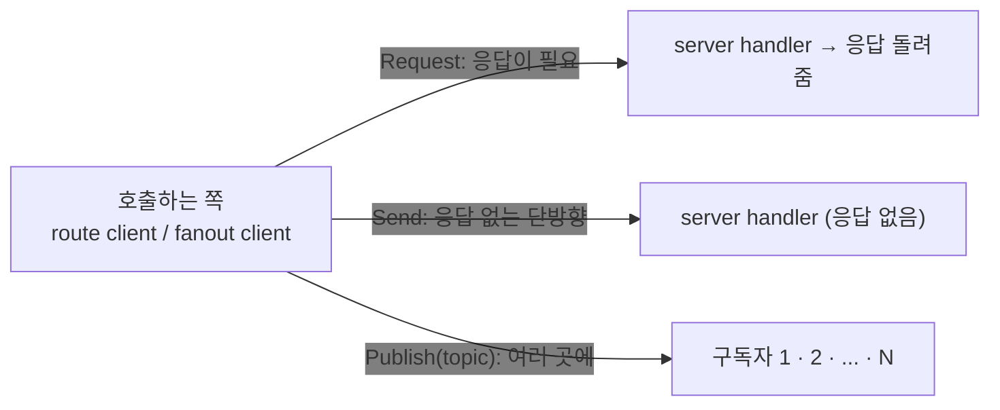
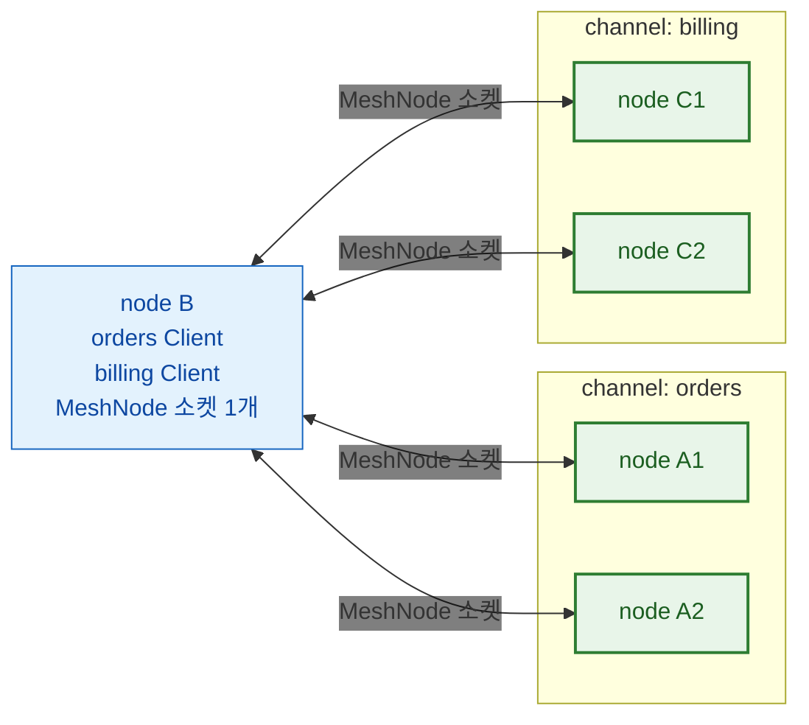
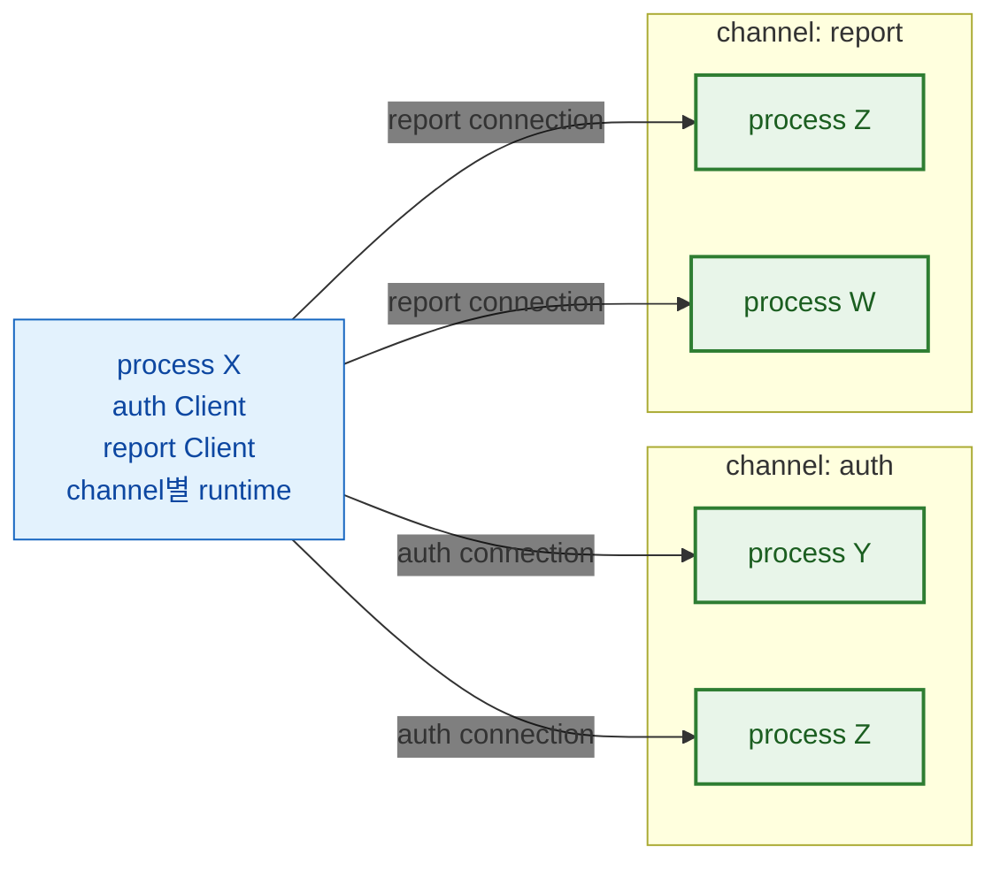
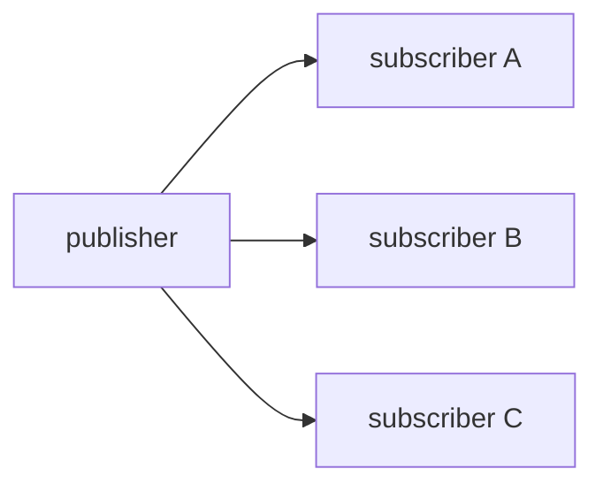
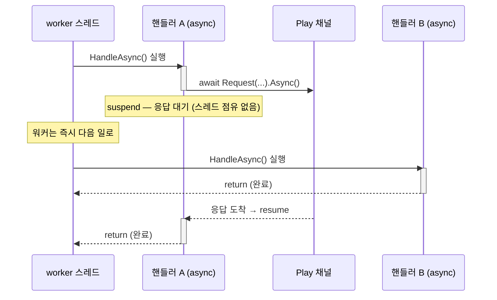
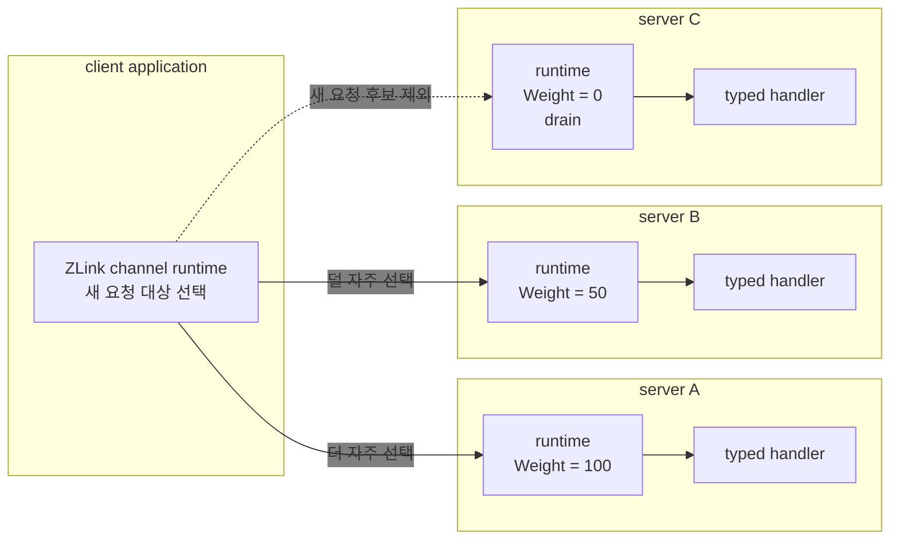
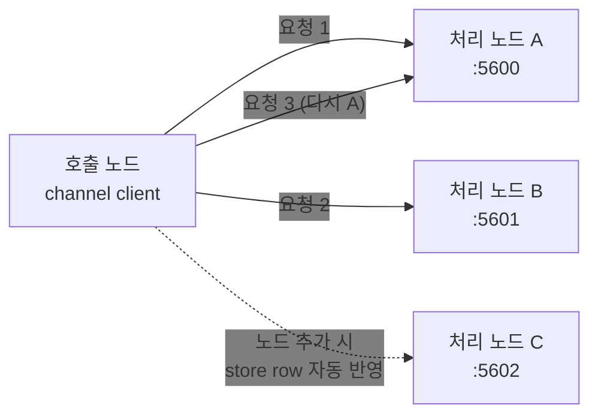
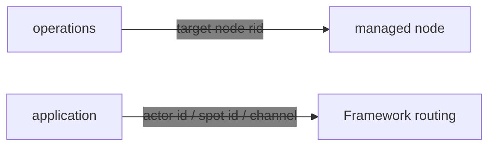

# 5. Channel Messaging — request · send · pub/sub

> **이 장의 계약 소유 문서** — [Channel 메시징](../../../common/spec/08-channel-messaging.ko.md)과
> [ClientServer Channel](../../../common/spec/09-client-server-channel.ko.md)이 동작을,
> [언어별 channel messaging 공개 계약](../../../common/spec/server/languages/README.ko.md)이
> 표면을 소유한다. 이 챕터는 그 표면을 실제로 어떻게 등록하고 호출하는지 사용법 중심으로
> 다룬다.

channel messaging은 framework의 가장 기본 축이다. 다음 상호작용을 다룬다.

- **request/response** — 보낸 뒤 응답을 기다리는 1:1 호출, 예: 가격 조회 (DEALER → ROUTER)
- **one-way send** — 던지고 끝인 단방향 명령, 예: 캐시 무효화 통지 (DEALER → ROUTER)
- **publish/subscribe** — 한 번 보내면 구독한 모두가 받는 이벤트 fan-out, 예: 도메인 이벤트
  전파 (PUB / SUB)

> 🔰 용어(channel·handler·client·codec 등)가 낯설면
> [03-concepts](03-concepts.ko.md)의 개념 설명을 먼저 본다.
> 괄호 안 `DEALER → ROUTER`·`PUB / SUB`는 하부 소켓 종류로, **어플리케이션이 직접 다루지
> 않는다**(framework가 channel 종류에 따라 자동 매핑).



## 0. gRPC를 대체하는 용도

channel messaging은 일반 웹·마이크로서비스 백엔드에서 **서비스 간 gRPC를 대체**하는
용도로 쓴다. 서비스마다 host:port를 알리거나 앞단에 gateway·로드밸런서를 둘 필요 없이,
논리 channel 이름과 location store 자동 연결로 호출을 묶는다. `.proto` IDL·HTTP/2 전용
인프라·코드 생성 없이 DTO(record)와 typed handler만으로 gRPC의 네 가지 호출 형태를 얻는다.

| gRPC 패턴 | ZLink 대체 | 이 가이드 |
|-----------|------------|-----------|
| Unary RPC | request/response | [handler 작성](#2-handler-작성) · [outbound 호출](#4-outbound-호출) |
| Unary `Empty` / fire-and-forget | one-way send | [handler 작성](#2-handler-작성) · [outbound 호출](#4-outbound-호출) |
| Server streaming / 이벤트 피드 | pub/sub fan-out | [outbound 호출](#4-outbound-호출) |
| Client/Bidi streaming | STREAM session | [09-stream](09-stream.ko.md) |
| 서비스 위치 조회(DNS/xDS) | location store 자동 연결 | [10-location](10-location.ko.md) |
| Interceptor | handler filter | [filter](#5-filter--공통-처리) |
| Deadline | request timeout | [outbound 호출](#4-outbound-호출) |

호출 경로는 다음 지점에서 갈린다. gRPC는 stub이 만든 요청을 L7 로드밸런서나 service
mesh sidecar가 받아 scale-out된 서버 중 하나로 보내지만, ZLink는 application이 논리 channel
이름으로 요청하면 framework runtime이 연결된 서버 runtime 중 하나를 직접 고른다. 그래서
application 코드에 남는 것은 endpoint나 프록시 설정이 아니라 **channel 이름과 handler**다.

예를 들어 주문 서비스라면, gRPC `rpc PlaceOrder(...)`가 다음과 같이 바뀐다.

=== "C#/.NET"

    ```csharp
    // 서버: handler 하나 (gRPC service 구현 대신)
    public sealed class PlaceOrderHandler
        : IZLinkRequestHandler<PlaceOrder, OrderPlaced>
    {
        private readonly IOrderStore _orders;
        public PlaceOrderHandler(IOrderStore orders) => _orders = orders;

        public async ValueTask<OrderPlaced> HandleAsync(
            PlaceOrder request, IZLinkMessageContext context, CancellationToken ct)
        {
            await _orders.SaveAsync(request, ct);
            return new OrderPlaced(request.OrderId);
        }
    }

    // 클라이언트: gRPC stub 대신 IZLinkRouteClient 주입
    var placed = await client
        .RequestToChannel("orders",                 // 대상은 ChannelName 하나. 주소도 MeshName도 넣지 않는다.
            new PlaceOrder("order-1042", "acct-77", 18742))
        .Async<OrderPlaced>(ct);
    ```

=== "C++"

    ```cpp
    // 서버: handler 하나 (gRPC service 구현 대신)
    class place_order_handler_t
    {
      public:
        using request_type = place_order_t;
        using reply_type = order_placed_t;
        using dependency_types = dependency_list_t<order_store_t>;
        static constexpr const char *topic_name = "PlaceOrder";

        explicit place_order_handler_t (order_store_t &orders) : _orders (orders) {}

        task_t<order_placed_t> handle (const place_order_t &request)
        {
            co_await _orders.save (request);
            co_return order_placed_t{request.order_id};
        }

      private:
        order_store_t &_orders;
    };

    // 클라이언트: gRPC stub 대신 route_client_t 주입
    auto placed = co_await client
                    // 대상은 ChannelName 하나. 주소도 MeshName도 넣지 않는다.
                    .request_to_channel ("orders",
                                         place_order_t{"order-1042", "acct-77", 18742})
                    .submit<order_placed_t> ();
    ```

=== "Java"

    ```java
    // 서버: handler 하나 (gRPC service 구현 대신)
    public final class PlaceOrderHandler implements ZLinkRequestHandler<PlaceOrder, OrderPlaced> {
        private final OrderStore orders;

        public PlaceOrderHandler(OrderStore orders) {
            this.orders = orders;
        }

        @Override
        public CompletionStage<OrderPlaced> handle(PlaceOrder request, ZLinkMessageContext context) {
            return orders.save(request).thenApply(ignored -> new OrderPlaced(request.orderId()));
        }
    }

    // 클라이언트: gRPC stub 대신 ZLinkRouteClient 주입
    OrderPlaced placed = client
        // 대상은 ChannelName 하나. 주소도 MeshName도 넣지 않는다.
        .requestToChannel("orders", new PlaceOrder("order-1042", "acct-77", 18742))
        .submit(OrderPlaced.class)
        .toCompletableFuture().join();
    ```

=== "Kotlin"

    ```kotlin
    // 서버: handler 하나 (gRPC service 구현 대신)
    class PlaceOrderHandler(private val orders: OrderStore) : ZLinkRequestHandler<PlaceOrder, OrderPlaced> {
        override suspend fun handle(request: PlaceOrder, context: ZLinkMessageContext): OrderPlaced {
            orders.save(request)
            return OrderPlaced(request.orderId)
        }
    }

    // 클라이언트: gRPC stub 대신 ZLinkRouteClient 주입
    val placed = client
        // 대상은 ChannelName 하나. 주소도 MeshName도 넣지 않는다.
        .requestToChannel("orders", PlaceOrder("order-1042", "acct-77", 18742))
        .submit(OrderPlaced::class.java)
        .await()
    ```

=== "Node/TypeScript"

    ```typescript
    // 서버: handler 하나 (gRPC service 구현 대신)
    export class PlaceOrderHandler implements ZLinkRequestHandler<PlaceOrder, OrderPlaced> {
      constructor(private readonly orders: OrderStore) {}

      async handle(request: PlaceOrder, context: ZLinkMessageContext): Promise<OrderPlaced> {
        await this.orders.save(request);
        return orderPlaced(request.orderId);
      }
    }

    // 클라이언트: gRPC stub 대신 ZLinkRouteClient 주입
    const placed = await client
      // 대상은 ChannelName 하나. 주소도 MeshName도 넣지 않는다.
      .requestToChannel('orders', placeOrder('order-1042', 'acct-77', 18742))
      .submit<OrderPlaced>();
    ```


> 배치 구조·호출 경로·인프라 대응을 gRPC 스택과 나란히 놓고 보려면
> [17-alternative](17-alternative.ko.md)가 그 비교를 다룬다. 이 챕터는 그 판단이 끝난
> 뒤의 사용법을 다룬다.

## 1. channel 종류

[channel](03-concepts.ko.md#1-channel--서버-간-연결)은 주소 대신 `"orders"` 같은 논리
이름으로 호출 대상을 고르는 서버 간 연결 단위다. 그 이름을 `ChannelName`이라 하고,
이름을 등록한 node 중 하나가 요청을 받는다.

"channel"이라는 이름을 쓰는 등록은 아래와 같다. 모두 `ChannelName`을 사용하지만, 지원하는
메시징 방식과 소켓을 공유하는지가 다르다. 여기서 **MeshNode**는 한 process가 하나
가지는 서버 간 연결의 기초 단위이며, route mesh channel은 그 소켓 위에 이름만 추가한다.

| 종류 | 등록 | 소켓 | 연결 패턴 |
| --- | --- | --- | --- |
| route mesh channel | `mesh.Channel(name).Server()`/`.Client()` | 이미 열려있는 MeshNode 소켓을 공유한다 | `ChannelName` select-one으로 request/send, Spot 간 publish(Logical Multicast) — RID를 직접 지정하는 Node direct는 별도([관리 대상 노드 직접 호출](#9-route-mesh--관리-대상-노드-직접-호출)) |
| ClientServer channel | `AddClientServerChannel(name)` | MeshNode와 별개인 자기 소켓을 연다(`.Listen()`, 연결은 수동 `.Connect()` 또는 자동 discovery) | Client가 시작한 request/send만 — Server는 그 reply 말고는 먼저 보낼 수 없다 |
| fanout channel | `AddFanoutChannel(name)` | 독자적인 PUB/SUB 소켓을 연다 | publisher → 다수 subscriber |

**route mesh channel은 MeshNode 연결을 공유하는 논리 이름**이고, **ClientServer channel은
transport를 따로 여는 독립 연결 단위**다.

### 1.1 route mesh channel — 연결은 한 번, channel은 그 위의 이름

MeshNode 소켓 하나로 mesh에 연결하고, channel 이름은 그 위에서 "이 요청을 누가
받는가"를 가르는 논리 묶음이다.



상자는 소켓이 아니라 이름으로 묶인 그룹이다. `orders`를 호출하면 select-one이 그 상자
안의 A1·A2 중 하나를 고르고, channel을 열 개 더 등록해도 node B의 소켓은 늘지 않는다.

### 1.2 ClientServer channel — channel별 독립 runtime

ClientServer channel은 RouteMesh transport를 공유하지 않는다. Channel마다 독립
runtime을 만들고, 그 runtime이 Ready Server별 연결을 관리한다.

**연결은 client가 시작한다.** server가 client로 연결을 걸지 않으므로, 방화벽과 보안 그룹은
client → server 한 방향만 열면 된다.

**등록 정보도 서로 나뉜다.** ClientServer의 server 등록 정보에는 MeshName · RouteMesh
membership · Spot·Actor 위치가 들어가지 않는다. 반대로 MeshNode의 등록 정보를 ClientServer
탐색에 쓰지도 않는다 — **두 종류를 서로 대신 쓰지 않는다.**

수동 endpoint만 쓰면 location store가 없어도 된다. **자동 탐색을 켰는데 store가 없으면
listener를 bind하기 전에 시작이 실패한다.**



`auth`와 `report`는 연결 대상과 수명을 서로 공유하지 않는다. 같은 process Z가 양쪽
channel에 모두 참여해도 각 channel runtime이 Z와의 연결을 따로 관리한다.

**같은 process 안의 Server도 다른 Server와 똑같은 후보다.** 같은 process라는 이유로 먼저
고르지도, 빼지도 않는다. 선택되더라도 handler를 그 자리에서 부르지 않고 **실제로
연결을 통해 보낸다** — codec · admission · 상한 · timeout · reply 처리를 건너뛰는 지름길은
없다. 그래서 local 호출이라고 더 빠를 것으로 계산하지 않는다.

방향도 고정이라 Server는 Client가 시작한 요청에만 응답할 수 있다. Server가 먼저 알림을
보내야 한다면 ClientServer가 아니라 RouteMesh를 사용한다. TicTacToe에서 로그인 인증
(`tictactoe.api` ClientServer channel)을 Game Spot 생성(MeshNode의 Object role)과
분리하는 이유다(`02. Getting Started` 장 §7).

### 1.3 pub/sub의 두 갈래

[Spot](03-concepts.ko.md#2-spot--상태를-소유하고-순서대로-처리하는-단위)은 id로 찾는 상태
객체이고 자기 앞으로 온 일을 한 줄로 세워 처리한다. route mesh channel 위에서 그 Spot끼리
이벤트를 주고받는 것을 **Logical Multicast**라 한다.
[앞의 다이어그램](#11-route-mesh-channel--연결은-한-번-channel은-그-위의-이름)처럼 이미 연결된
mesh 소켓을 그대로 사용하므로 별도 소켓이 없고,
받는 쪽은 그 channel에서 같은 topic을 구독한 Spot으로 한정된다.

=== "C#/.NET"

    ```csharp
    // 발행 — TicTacToeGame spot 안에서.
    await Context.Outbound
        .Publish(SampleTopics.PlayerMilestoneChannel,   // 전달 범위를 정하는 ChannelName.
                 SampleTopics.PlayerMilestone,          // 그 안에서 받을 Spot을 고르는 topic.
                 milestoneEvent)
        .Async(cancellationToken);

    // 구독 — PlayEntrySpot이 시작할 때.
    Context.Handlers.AddSubscribe<PlayerWinMilestoneEventHandler>(
        SampleTopics.PlayerMilestoneChannel,            // 발행 쪽과 같은 ChannelName·topic이어야 받는다.
        SampleTopics.PlayerMilestone);
    ```

=== "C++"

    ```cpp
    // 발행 — game spot 안에서.
    co_await _context.outbound ()
      .publish (sample_topics_t::player_milestone_channel, // 전달 범위를 정하는 ChannelName.
                sample_topics_t::player_milestone,         // 그 안에서 받을 Spot을 고르는 topic.
                milestone_event)
      .submit ();

    // 구독 — entry spot이 시작할 때.
    _context.handlers ().add_subscribe<&play_entry_spot_t::on_player_win_milestone> (
      sample_topics_t::player_milestone_channel, // 발행 쪽과 같은 ChannelName·topic이어야 받는다.
      sample_topics_t::player_milestone);
    ```

=== "Java"

    ```java
    // 발행 — TicTacToeGame spot 안에서.
    context.outbound()
        .publish(SampleTopics.PlayerMilestoneChannel, // 전달 범위를 정하는 ChannelName.
                 SampleTopics.PlayerMilestone,        // 그 안에서 받을 Spot을 고르는 topic.
                 milestoneEvent)
        .submit();

    // 구독 — Java는 handler에 annotation으로 topic을 붙이고 등록은 addHandler로 한다.
    @ZLinkSpotSubscription(topic = SampleTopics.PlayerMilestone) // 발행 쪽과 같은 topic이어야 받는다.
    public final class PlayerWinMilestoneEventHandler
        implements ZLinkSpotSubscriptionHandler<PlayEntrySpot, PlayerWinMilestoneEvent> { /* ... */ }

    // PlayEntrySpot이 시작할 때.
    context.handlers().addHandler(PlayerWinMilestoneEventHandler.class);
    ```

=== "Kotlin"

    ```kotlin
    // 발행 — TicTacToeGame spot 안에서.
    context.outbound()
        .publish(SampleTopics.PlayerMilestoneChannel, // 전달 범위를 정하는 ChannelName.
                 SampleTopics.PlayerMilestone,        // 그 안에서 받을 Spot을 고르는 topic.
                 milestoneEvent)
        .submit()
        .await()

    // 구독 — Kotlin도 Java 표면을 쓴다. annotation으로 topic을 붙이고 addHandler로 등록한다.
    @ZLinkSpotSubscription(topic = SampleTopics.PlayerMilestone) // 발행 쪽과 같은 topic이어야 받는다.
    class PlayerWinMilestoneEventHandler :
        ZLinkSpotSubscriptionHandler<PlayEntrySpot, PlayerWinMilestoneEvent> { /* ... */ }

    // PlayEntrySpot이 시작할 때.
    context.handlers().addHandler(PlayerWinMilestoneEventHandler::class.java)
    ```

=== "Node/TypeScript"

    ```typescript
    // 발행 — TicTacToeGame spot 안에서.
    await this.context.outbound
      .publish(SampleTopics.playerMilestoneChannel, // 전달 범위를 정하는 ChannelName.
               SampleTopics.playerMilestone,        // 그 안에서 받을 Spot을 고르는 topic.
               milestoneEvent)
      .submit();

    // 구독 — PlayEntrySpot이 시작할 때.
    this.context.handlers.addSubscribe(
      PlayerWinMilestoneEventHandler,
      SampleTopics.playerMilestoneChannel, // 발행 쪽과 같은 ChannelName·topic이어야 받는다.
      SampleTopics.playerMilestone);
    ```


Spot 밖에서 발행해야 하면 spot publisher client를 주입받아 같은 방식으로 보낸다.

반대로 **fanout channel**(스펙에서는 **Classic fanout**)은 그 자체로 독립된 PUB/SUB
소켓 쌍을 연다. Spot이나 MeshNode와 무관하게 발행자 하나가 연결된 구독자 전원에게
전달한다.



둘 다 **발행 완료가 전달을 보장하지는 않는다.** 발행 호출이 완료됐다는 것은 전송
준비가 로컬에서 접수됐다는 의미이며, 구독자가 그 이벤트를 처리했다는 확인이 아니다.
저장·재전송·ack도 제공하지 않는다.

차이는 **대상 범위**다. Logical Multicast는 그 mesh 안에서 같은 channel·topic을 구독한
Spot으로 한정되고, Classic fanout은 mesh 구성과 무관하게 연결된 구독자 전체로 전달된다.

**손실 규칙도 다르다.** fanout channel은 **손실을 허용하는 전달**이다. 어느 구독자의
수신이 늦어 발행자의 송신 queue가 상한에 닿으면 **그 구독자 몫을 버리고 발행은 성공으로
끝난다.** 나머지 구독자는 영향을 받지 않고, 발행자는 느린 구독자 하나 때문에 멈추지
않는다.

Logical Multicast는 PUB/SUB 소켓을 쓰지 않고 mesh 연결로 각 node에 전달하므로 이 규칙의
대상이 아니다. **손실을 허용할 수 없는 전달에는 fanout channel을 쓰지 않는다.**

## 2. handler 작성

| 종류 | 보내는 호출 | 완료가 뜻하는 것 |
| --- | --- | --- |
| request | channel 이름과 요청을 넘기고 reply를 기다린다 | 상대의 reply가 도착했다 |
| send | channel 이름과 메시지를 넘긴다 | 보내기가 접수됐다 — 상대 처리 결과는 아니다 |
| publish (fanout) | channel · topic · 이벤트를 넘긴다 | 전송 준비가 접수됐다 — 구독자 수신은 아니다 |

**request가 실패해도 다른 서버로 자동 재전송하지 않는다.** 대상을 고르고 보낸 뒤에 연결이
끊기거나 timeout이 나면 그대로 실패로 끝난다. **첫 대상이 이미 처리했는데 reply만 못
돌아온 것일 수 있기 때문**이다. 다시 보내는 것은 application의 새 호출이고, 중복 실행
처리도 그쪽 책임이다.

**payload 내용으로 대상 종류가 바뀌지 않는다.** node를 지정해 보낸 message는 그 node의
handler가 처리한다 — 안에 Spot ID나 Actor ID가 들어 있어도 Framework가 그것을 보고 Spot
message로 바꿔 주지 않는다. Spot이나 Actor에 보내려면 **처음부터 그 전용 호출**을 쓴다.

언어별 호출 형태와 짝이 되는 handler interface는 다음과 같다.

=== "C#/.NET"

    | 종류 | 보내는 호출 | 받는 handler |
    | --- | --- | --- |
    | request | `RequestToChannel(name, req).Async<TReply>(ct)` | `IZLinkRequestHandler<TRequest, TReply>` |
    | send | `SendToChannel(name, msg).Async(ct)` | `IZLinkSendHandler<TMessage>` |
    | publish (fanout) | `Publish(name, topic, evt).Async(ct)` | `IZLinkFanoutHandler<TEvent>` |

=== "C++"

    | 종류 | 보내는 호출 | 받는 handler |
    | --- | --- | --- |
    | request | `request_to_channel (name, req).submit<TReply> ()` | `request_type`·`reply_type`을 선언한 handler class |
    | send | `send_to_channel (name, msg).submit ()` | `request_type`만 선언한 handler class |
    | publish (fanout) | `publish (name, topic, evt).submit ()` | `request_type`만 선언한 fanout handler class |

=== "Java"

    | 종류 | 보내는 호출 | 받는 handler |
    | --- | --- | --- |
    | request | `requestToChannel(name, req).submit(TReply.class)` | `ZLinkRequestHandler<TRequest, TReply>` |
    | send | `sendToChannel(name, msg).submit()` | `ZLinkSendHandler<TMessage>` |
    | publish (fanout) | `publish(name, topic, evt).submit()` | `ZLinkFanoutHandler<TEvent>` |

=== "Kotlin"

    | 종류 | 보내는 호출 | 받는 handler |
    | --- | --- | --- |
    | request | `requestToChannel(name, req).submit(TReply::class.java).await()` | `ZLinkRequestHandler<TRequest, TReply>` |
    | send | `sendToChannel(name, msg).submit().await()` | `ZLinkSendHandler<TMessage>` |
    | publish (fanout) | `publish(name, topic, evt).submit().await()` | `ZLinkFanoutHandler<TEvent>` |

=== "Node/TypeScript"

    | 종류 | 보내는 호출 | 받는 handler |
    | --- | --- | --- |
    | request | `requestToChannel(name, req).submit<TReply>()` | `ZLinkRequestHandler<TRequest, TReply>` |
    | send | `sendToChannel(name, msg).submit()` | `ZLinkSendHandler<TMessage>` |
    | publish (fanout) | `publish(name, topic, evt).submit()` | `ZLinkFanoutHandler<TEvent>` |

channel handler는 독립 class다. 서로 다른 요청이 동시에 실행될 수 있으므로 가변 도메인
상태를 handler 멤버에 두지 않는다. Handler instance와 scoped dependency는 그 dispatch가
끝날 때까지만 유지된다.

> Framework는 HTTP 요청을 처리하지 않는다. 웹 프레임워크의 endpoint·middleware가
> HTTP를 맡고, channel handler는 그와 별개인 서버 간 메시지 dispatch 경로다. class를
> 만들어 DI로 의존성을 받고 등록해 두면 runtime이 호출한다는 **작성 방식**만 controller
> action과 닮았다.

handler는 인터페이스를 구현하고, 결과를 반환값으로 돌려준다.

> **샘플에서 보기 — [TicTacToe](../../../common/sample/tictactoe/README.ko.md).** API 서버가
> 인증 요청을 받아 player 정보를 돌려주는 request handler다. 저장소의 실제 코드다.

=== "C#/.NET"

    ```csharp
    --8<-- "framework/languages/dotnet/samples/TicTacToe/Server/Api/Handlers/AuthenticatePlayerHandler.cs:doc-request-handler"
    ```

=== "C++"

    ```cpp
    --8<-- "framework/languages/cpp/samples/TicTacToe/Server/Api/Handlers/authenticate_player_handler.hpp:doc-request-handler"
    ```

=== "Java"

    ```java
    --8<-- "framework/languages/java/samples/java/TicTacToe/Server/src/main/java/systems/zlink/samples/tictactoe/server/api/handlers/AuthenticatePlayerHandler.java:doc-request-handler"
    ```

=== "Kotlin"

    ```kotlin
    --8<-- "framework/languages/java/samples/kotlin/TicTacToe/Server/src/main/kotlin/systems/zlink/samples/kotlin/tictactoe/server/api/handlers/AuthenticatePlayerHandler.kt:doc-request-handler"
    ```

=== "Node/TypeScript"

    ```typescript
    --8<-- "framework/languages/node/samples/TicTacToe.Ts/Server/Api/Handlers/authenticate-player-handler.ts:doc-request-handler"
    ```

세 갈래를 최소 형태로 보면 이렇다.

=== "C#/.NET"

    ```csharp
    // request-response
    public sealed class GetProfileHandler
        : IZLinkRequestHandler<GetProfileRequest, GetProfileReply>
    {
        private readonly IProfileStore _store;
        public GetProfileHandler(IProfileStore store) => _store = store;

        public async ValueTask<GetProfileReply> HandleAsync(
            GetProfileRequest request,
            IZLinkMessageContext context,
            CancellationToken cancellationToken)
        {
            var profile = await _store.LoadAsync(request.AccountId, cancellationToken);
            return new GetProfileReply(profile.AccountId, profile.Nickname);
        }
    }

    // one-way send (응답 없음)
    public sealed class RefreshCacheHandler
        : IZLinkSendHandler<RefreshCacheCommand>
    {
        public ValueTask HandleAsync(
            RefreshCacheCommand message,
            IZLinkMessageContext context,
            CancellationToken cancellationToken)
        {
            // 캐시 무효화 등. 호출자는 결과를 기다리지 않는다.
            return ValueTask.CompletedTask;
        }
    }

    // publish 수신 (구독자 측)
    public sealed class CacheRefreshedEventHandler
        : IZLinkFanoutHandler<CacheRefreshedEvent>
    {
        public ValueTask HandleAsync(
            CacheRefreshedEvent message,
            CancellationToken cancellationToken)
        {
            // Classic fanout handler는 등록한 event type의 payload만 받는다.
            return ValueTask.CompletedTask;
        }
    }
    ```

=== "C++"

    ```cpp
    // request-response
    class get_profile_handler_t
    {
      public:
        using request_type = get_profile_request_t;
        using reply_type = get_profile_reply_t;
        using dependency_types = dependency_list_t<profile_store_t>;
        static constexpr const char *topic_name = "GetProfile";

        task_t<get_profile_reply_t> handle (const get_profile_request_t &request)
        {
            auto profile = co_await _store.load (request.account_id);
            co_return get_profile_reply_t{profile.account_id, profile.nickname};
        }
    };

    // one-way send (응답 없음)
    class refresh_cache_handler_t
    {
      public:
        using request_type = refresh_cache_command_t;
        static constexpr const char *topic_name = "RefreshCache";

        // 캐시 무효화 등. 호출자는 결과를 기다리지 않는다.
        task_t<void> handle (const refresh_cache_command_t &) { co_return; }
    };

    // publish 수신 (구독자 측)
    class cache_refreshed_event_handler_t
    {
      public:
        using request_type = cache_refreshed_event_t;
        static constexpr const char *topic_name = "CacheRefreshed";

        // Classic fanout handler는 등록한 event type의 payload만 받는다.
        task_t<void> handle (const cache_refreshed_event_t &) { co_return; }
    };
    ```

=== "Java"

    ```java
    // request-response
    public final class GetProfileHandler
        implements ZLinkRequestHandler<GetProfileRequest, GetProfileReply> {
        private final ProfileStore store;

        @Override
        public CompletionStage<GetProfileReply> handle(
            GetProfileRequest request, ZLinkMessageContext context) {
            return store.load(request.accountId())
                .thenApply(profile -> new GetProfileReply(profile.accountId(), profile.nickname()));
        }
    }

    // one-way send (응답 없음)
    public final class RefreshCacheHandler implements ZLinkSendHandler<RefreshCacheCommand> {
        @Override
        public CompletionStage<Void> handle(RefreshCacheCommand message, ZLinkMessageContext context) {
            // 캐시 무효화 등. 호출자는 결과를 기다리지 않는다.
            return CompletableFuture.completedFuture(null);
        }
    }

    // publish 수신 (구독자 측)
    public final class CacheRefreshedEventHandler implements ZLinkFanoutHandler<CacheRefreshedEvent> {
        @Override
        public CompletionStage<Void> handle(CacheRefreshedEvent message) {
            // Classic fanout handler는 등록한 event type의 payload만 받는다.
            return CompletableFuture.completedFuture(null);
        }
    }
    ```

=== "Kotlin"

    ```kotlin
    // request-response
    class GetProfileHandler(private val store: ProfileStore)
        : ZLinkRequestHandler<GetProfileRequest, GetProfileReply> {
        override suspend fun handle(
            request: GetProfileRequest, context: ZLinkMessageContext): GetProfileReply {
            val profile = store.load(request.accountId)
            return GetProfileReply(profile.accountId, profile.nickname)
        }
    }

    // one-way send (응답 없음)
    class RefreshCacheHandler : ZLinkSendHandler<RefreshCacheCommand> {
        override suspend fun handle(message: RefreshCacheCommand, context: ZLinkMessageContext) {
            // 캐시 무효화 등. 호출자는 결과를 기다리지 않는다.
        }
    }

    // publish 수신 (구독자 측)
    class CacheRefreshedEventHandler : ZLinkFanoutHandler<CacheRefreshedEvent> {
        override suspend fun handle(message: CacheRefreshedEvent) {
            // Classic fanout handler는 등록한 event type의 payload만 받는다.
        }
    }
    ```

=== "Node/TypeScript"

    ```typescript
    // request-response
    export class GetProfileHandler
      implements ZLinkRequestHandler<GetProfileRequest, GetProfileReply> {
      constructor(private readonly store: ProfileStore) {}

      async handle(
        request: GetProfileRequest, context: ZLinkMessageContext): Promise<GetProfileReply> {
        const profile = await this.store.load(request.accountId);
        return getProfileReply(profile.accountId, profile.nickname);
      }
    }

    // one-way send (응답 없음)
    export class RefreshCacheHandler implements ZLinkSendHandler<RefreshCacheCommand> {
      async handle(message: RefreshCacheCommand, context: ZLinkMessageContext): Promise<void> {
        // 캐시 무효화 등. 호출자는 결과를 기다리지 않는다.
      }
    }

    // publish 수신 (구독자 측)
    export class CacheRefreshedEventHandler implements ZLinkFanoutHandler<CacheRefreshedEvent> {
      async handle(message: CacheRefreshedEvent): Promise<void> {
        // Classic fanout handler는 등록한 event type의 payload만 받는다.
      }
    }
    ```


- handler 의존성은 **생성자 주입**으로 받는다(`IProfileStore`처럼). context에서
  service를 꺼내는 service locator 패턴은 쓰지 않는다.
- context는 그 dispatch의 메시지 정보(ChannelName, packet 이름, metadata 등)를 읽는
  자리다. **cancellation은 context가 아니라 별도 취소 인자**가 소유한다.
  경로별 context 타입과 전체 필드는
  [언어별 channel messaging 공개 계약](../../../common/spec/server/languages/README.ko.md)이
  다룬다.
- handler class는 dispatch 키가 아니라 **코드 조직 단위**다. 메서드를 한 class에
  주제별로 묶어도, packet마다 class를 따로 둬도 동작은 같다.
- interface 기반 handler는 컴파일 타임 타입 체크가 가장 강하다. `Handle(...)`
  의 payload, context, return 타입이 interface 계약과 맞지 않으면 컴파일이 실패한다.

### attribute 기반 메서드 handler

인터페이스 대신 attribute를 단 메서드로도 같은 handler를 작성할 수 있다. 한
class에 여러 handler 메서드를 둘 때 편하다.

=== "C#/.NET"

    ```csharp
    [ZLinkHandlerGroup("api")]   // 이 class의 메서드들을 "api" group으로 묶는다. 어느 channel에 노출할지는 등록이 정한다.
    public sealed class UserHandlers
    {
        private readonly IZLinkFanoutClient _publisher;
        public UserHandlers(IZLinkFanoutClient publisher) => _publisher = publisher;

        [ZLinkRequest]   // 메서드 attribute가 handler 종류를 정한다(channel 이름은 안 받음)
        public ValueTask<GetUserReply> GetUserAsync(
            GetUserRequest request,            // 인자 순서 = (payload, context?, ct?) — context·토큰은 생략 가능
            IZLinkMessageContext context,
            CancellationToken cancellationToken)
            => ValueTask.FromResult(new GetUserReply(request.AccountId, "alice"));

        [ZLinkSend]   // send handler — 반환이 ValueTask(응답 없음). request의 ValueTask<TReply> 와 대비.
        public async ValueTask RefreshCacheAsync(
            RefreshUserCacheCommand command,
            IZLinkMessageContext context,
            CancellationToken cancellationToken)
        {
            await _publisher
                .Publish("api.events", "user.cache-refreshed",
                    new UserCacheRefreshedEvent(command.AccountId))
                .Async(cancellationToken);
        }
    }
    ```

=== "C++"

    ```cpp
    // C++은 attribute 대신 handler group에 직접 등록한다.
    // 어느 channel에 노출할지는 등록이 정한다.
    options.handlers ().group ("api").add<get_user_handler_t> ();
    options.handlers ().group ("api").add<refresh_cache_handler_t> ();

    class refresh_cache_handler_t
    {
      public:
        using request_type = refresh_user_cache_command_t;
        using dependency_types = dependency_list_t<publisher_t>;
        static constexpr const char *topic_name = "RefreshCache";

        task_t<void> handle (const refresh_user_cache_command_t &command)
        {
            co_await _publisher
              .publish ("api.events", "user.cache-refreshed",
                        user_cache_refreshed_event_t{command.account_id})
              .submit ();
        }

      private:
        publisher_t &_publisher;
    };
    ```

=== "Java"

    ```java
    // 이 class의 메서드들을 "api" group으로 묶는다. 어느 channel에 노출할지는 등록이 정한다.
    @ZLinkHandlerGroup("api")
    public final class UserHandlers {
        private final ZLinkFanoutClient publisher;

        // 메서드 attribute가 handler 종류를 정한다(channel 이름은 안 받음).
        // 인자 순서 = (payload, context?) — context는 생략 가능.
        @ZLinkRequest
        public CompletionStage<GetUserReply> getUser(
            GetUserRequest request, ZLinkMessageContext context) {
            return CompletableFuture.completedFuture(new GetUserReply(request.accountId(), "alice"));
        }

        // send handler — 반환이 CompletionStage<Void>(응답 없음).
        @ZLinkSend
        public CompletionStage<Void> refreshCache(
            RefreshUserCacheCommand command, ZLinkMessageContext context) {
            return publisher
                .publish("api.events", "user.cache-refreshed",
                    new UserCacheRefreshedEvent(command.accountId()))
                .submit();
        }
    }
    ```

=== "Kotlin"

    ```kotlin
    // 이 class의 메서드들을 "api" group으로 묶는다. 어느 channel에 노출할지는 등록이 정한다.
    @ZLinkHandlerGroup("api")
    class UserHandlers(private val publisher: ZLinkFanoutClient) {

        // 메서드 attribute가 handler 종류를 정한다(channel 이름은 안 받음).
        @ZLinkRequest
        suspend fun getUser(request: GetUserRequest, context: ZLinkMessageContext): GetUserReply =
            GetUserReply(request.accountId, "alice")

        // send handler — 반환값이 없다(응답 없음).
        @ZLinkSend
        suspend fun refreshCache(command: RefreshUserCacheCommand, context: ZLinkMessageContext) {
            publisher
                .publish("api.events", "user.cache-refreshed",
                    UserCacheRefreshedEvent(command.accountId))
                .submit()
                .await()
        }
    }
    ```

=== "Node/TypeScript"

    ```typescript
    // 이 class의 메서드들을 "api" group으로 묶는다. 어느 channel에 노출할지는 등록이 정한다.
    @ZLinkHandlerGroup('api')
    export class UserHandlers {
      constructor(private readonly publisher: ZLinkFanoutClient) {}

      // 메서드 decorator가 handler 종류를 정한다(channel 이름은 안 받음).
      @ZLinkRequest()
      async getUser(request: GetUserRequest, context: ZLinkMessageContext): Promise<GetUserReply> {
        return getUserReply(request.accountId, 'alice');
      }

      // send handler — 반환이 Promise<void>(응답 없음).
      @ZLinkSend()
      async refreshCache(
        command: RefreshUserCacheCommand, context: ZLinkMessageContext): Promise<void> {
        await this.publisher
          .publish('api.events', 'user.cache-refreshed',
            userCacheRefreshedEvent(command.accountId))
          .submit();
      }
    }
    ```


- 메서드 시그니처는 `(payload, context?, cancellation?)` 순서이며 context와
  토큰은 생략할 수 있다.
- attribute 기반 handler는 한 class에 여러 request/send/publish 메서드를 묶기
  쉽지만, interface 기반처럼 handler 계약을 컴파일 타임에 강하게 고정하지는 않는다.
  잘못된 context 타입이나 반환 타입은 framework의 scan/validation 또는 실행 단계에서
  드러날 수 있다.
- handler 종류를 표시하는 attribute·annotation·decorator는 **channel 이름을 받지
  않는다.** channel 매핑은 [등록](#3-handler를-channel에-노출하기)이 소유한다.

### 비동기 실행

Framework 전반의 비동기 값은 각 언어의 표준 비동기 타입으로 표현된다. send는 source
runtime이 작업을 제출할 수 있을 때까지 기다리며 target handler 완료는 기다리지 않는다.
Request는 상대 reply가 도착할 때까지 기다린다. 규칙은 하나다 — **런타임(핸들러)
스레드에서는 `await`, blocking(`.Result`/`.GetAwaiter().GetResult()`)은 테스트·클라이언트
시나리오에서만.**

=== "C#/.NET"

    ```csharp
    public async ValueTask<CreateGameReply> HandleAsync(
        CreateGameRequest request, IZLinkMessageContext context, CancellationToken ct)
    {
        // 런타임(핸들러) 스레드 — await로 비운다. blocking(.Result/.GetAwaiter().GetResult())은 금지.
        var room = await _client
            .RequestToChannel("tictactoe.play", new CreateRoomRequest(request.GameName))
            .Timeout(TimeSpan.FromSeconds(5))   // reply를 기다릴 상한.
            .Async<CreateRoomReply>(ct);        // reply가 도착할 때까지 await로 대기하고 그 reply를 받는다.

        return new CreateGameReply(room.RoomId, room.GameName);
    }
    ```

=== "C++"

    ```cpp
    task_t<create_game_reply_t> handle (const create_game_request_t &request)
    {
        // 런타임(핸들러) 스레드 — co_await로 비운다. blocking은 테스트·클라이언트에서만 쓴다.
        auto room = co_await _client
                      .request_to_channel ("tictactoe.play",
                                           create_room_request_t{request.game_name})
                      .timeout (std::chrono::seconds (5)) // reply를 기다릴 상한.
                      .submit<create_room_reply_t> ();    // reply가 도착할 때까지 기다린다.

        co_return create_game_reply_t{room.room_id, room.game_name};
    }
    ```

=== "Java"

    ```java
    public CompletionStage<CreateGameReply> handle(
        CreateGameRequest request, ZLinkMessageContext context) {
        // 런타임(핸들러) 스레드 — CompletionStage를 이어 붙인다. join()으로 막지 않는다.
        return client
            .requestToChannel("tictactoe.play", new CreateRoomRequest(request.gameName()))
            .timeout(Duration.ofSeconds(5))     // reply를 기다릴 상한.
            .submit(CreateRoomReply.class)      // reply가 도착하면 이어지는 단계가 실행된다.
            .thenApply(room -> new CreateGameReply(room.roomId(), room.gameName()));
    }
    ```

=== "Kotlin"

    ```kotlin
    suspend fun handle(request: CreateGameRequest, context: ZLinkMessageContext): CreateGameReply {
        // 런타임(핸들러) 스레드 — await로 비운다. blocking join은 쓰지 않는다.
        val room = client
            .requestToChannel("tictactoe.play", CreateRoomRequest(request.gameName))
            .timeout(Duration.ofSeconds(5))     // reply를 기다릴 상한.
            .submit(CreateRoomReply::class.java)
            .await()                            // reply가 도착할 때까지 기다린다.

        return CreateGameReply(room.roomId, room.gameName)
    }
    ```

=== "Node/TypeScript"

    ```typescript
    async handle(request: CreateGameRequest, context: ZLinkMessageContext): Promise<CreateGameReply> {
      // 런타임(핸들러) 스레드 — await로 비운다. 동기 blocking은 없다.
      const room = await this.client
        .requestToChannel('tictactoe.play', createRoomRequest(request.gameName))
        .timeout(5_000)                     // reply를 기다릴 상한.
        .submit<CreateRoomReply>();         // reply가 도착할 때까지 기다린다.

      return createGameReply(room.roomId, room.gameName);
    }
    ```


Channel handler는 channel별 비동기 수신 루프에서 실행된다. Handler가 대기 지점에 도달하면
그 실행 흐름만 멈추고 스레드는 풀로 돌아가 다른 일을 처리한다.



그래서 콜백 없이 **위에서 아래로 읽히는 코드**로 worker 몇 개가 수많은 동시 요청을
처리한다. `.Result`로 막으면 그 스레드가 계속 점유되므로 핸들러 안에서 금지한다.
실패는 `await` 경로에서 예외로 나온다.

같은 `await` 규칙이 Spot·Actor handler에도 적용되지만, 그쪽은 turn이 handler 완료까지
유지되어 동시 실행 범위가 다르다 —
[06-spot §2.1](06-spot.ko.md#21-실행-모델--동시-실행-범위)이 다룬다.

## 3. handler를 channel에 노출하기

framework는 발견한 handler를 모든 channel에 자동으로 열지 않는다. **발견과
노출은 별개 단계**다.

> `AddHandlersFromAssemblyOf<...>`는 handler type을 발견하고, `Channel(name).Server()`의
> typed registration은 어느 MeshNode의 어느 channel에 노출할지 고정한다.

### RouteMesh와 handler 등록

=== "C#/.NET"

    ```csharp
    builder.Services.AddZLinkFramework(options =>
    {
        options.AddHandlersFromAssemblyOf<Program>(); // handler type 발견
        var mesh = options.AddRouteMesh("services")
            .Listen("tcp://0.0.0.0:7101")
            .SetRoutingId(RoutingId.From("api-1"));
        mesh.Channel("api").Server()                 // Server()가 handler를 받는 역할이다.
            .AddRequestHandler<GetProfileHandler, GetProfileRequest, GetProfileReply>()
            .AddSendHandler<RefreshCacheHandler, RefreshCacheCommand>();
    });
    ```

=== "C++"

    ```cpp
    options.handlers ().group ("api").add<get_profile_handler_t> ();  // handler를 group에 넣는다.
    auto mesh = options.add_route_mesh ("services");
    mesh.listen ("tcp://0.0.0.0:7101")
      .set_routing_id (zlink::routing_id_t::from (std::string ("api-1")));
    mesh.channel_name ("api").server ()      // server ()가 handler를 받는 역할이다.
      .use_handler_group ("api");
    ```

=== "Java"

    ```java
    options.addHandlersFromPackageOf(Program.class); // handler type 발견
    ZLinkMeshNodeBuilder mesh = options.addRouteMesh("services")
        .listen("tcp://0.0.0.0:7101")
        .setRoutingId(RoutingId.from("api-1"));
    mesh.channelName("api").server()                // server()가 handler를 받는 역할이다.
        .addRequestHandler(GetProfileHandler.class, GetProfileRequest.class, GetProfileReply.class)
        .addSendHandler(RefreshCacheHandler.class, RefreshCacheCommand.class);
    ```

=== "Kotlin"

    ```kotlin
    options.addHandlersFromPackageOf(Program::class.java) // handler type 발견
    val mesh = options.addRouteMesh("services")
        .listen("tcp://0.0.0.0:7101")
        .setRoutingId(RoutingId.from("api-1"))
    mesh.channelName("api").server()                     // server()가 handler를 받는 역할이다.
        .addRequestHandler(
            GetProfileHandler::class.java, GetProfileRequest::class.java, GetProfileReply::class.java)
        .addSendHandler(RefreshCacheHandler::class.java, RefreshCacheCommand::class.java)
    ```

=== "Node/TypeScript"

    ```typescript
    const mesh = builder.addRouteMesh('services')
      .listen('tcp://0.0.0.0:7101')
      .setRoutingId(RoutingId.from('api-1'));
    mesh.channel('api').server()                    // server()가 handler를 받는 역할이다.
      .addRequestHandler(GetProfileHandler)
      .addSendHandler(RefreshCacheHandler);
    ```


### 한 MeshNode에 여러 channel 등록

같은 MeshNode 위에 channel을 여러 개 얹을 수 있고, channel마다 역할이 다를 수 있다.

=== "C#/.NET"

    ```csharp
    var mesh = options.AddRouteMesh("services")
        .Listen("tcp://0.0.0.0:7101")
        .SetRoutingId(RoutingId.From("api-1"));

    mesh.Channel("api").Server()                     // 이 node가 처리하는 channel.
        .AddRequestHandler<GetProfileHandler>();     // payload·reply 타입은 handler가 이미 고정한다.
    mesh.Channel("billing").Client();                // 호출만 하는 channel은 Client — handler를 등록하지 않는다.
    ```

=== "C++"

    ```cpp
    auto mesh = options.add_route_mesh ("services");
    mesh.listen ("tcp://0.0.0.0:7101")
      .set_routing_id (zlink::routing_id_t::from (std::string ("api-1")));

    mesh.channel_name ("api").server ()          // 이 node가 처리하는 channel.
      .add_request_handler<get_profile_handler_t, get_profile_request_t, get_profile_reply_t> ();
    mesh.channel_name ("billing").client ();     // 호출만 하는 channel은 client — handler를 등록하지 않는다.
    ```

=== "Java"

    ```java
    ZLinkMeshNodeBuilder mesh = options.addRouteMesh("services")
        .listen("tcp://0.0.0.0:7101")
        .setRoutingId(RoutingId.from("api-1"));

    mesh.channelName("api").server()             // 이 node가 처리하는 channel.
        .addRequestHandler(GetProfileHandler.class, GetProfileRequest.class, GetProfileReply.class);
    mesh.channelName("billing").client();        // 호출만 하는 channel은 client — handler를 등록하지 않는다.
    ```

=== "Kotlin"

    ```kotlin
    val mesh = options.addRouteMesh("services")
        .listen("tcp://0.0.0.0:7101")
        .setRoutingId(RoutingId.from("api-1"))

    mesh.channelName("api").server()             // 이 node가 처리하는 channel.
        .addRequestHandler(
            GetProfileHandler::class.java, GetProfileRequest::class.java, GetProfileReply::class.java)
    mesh.channelName("billing").client()         // 호출만 하는 channel은 client — handler를 등록하지 않는다.
    ```

=== "Node/TypeScript"

    ```typescript
    const mesh = builder.addRouteMesh('services')
      .listen('tcp://0.0.0.0:7101')
      .setRoutingId(RoutingId.from('api-1'));

    mesh.channel('api').server()                 // 이 node가 처리하는 channel.
      .addRequestHandler(GetProfileHandler);
    mesh.channel('billing').client();            // 호출만 하는 channel은 client — handler를 등록하지 않는다.
    ```


fanout channel의 구독 handler는 fanout builder의 `AddHandler<...>()`로 등록한다.

> **샘플에서 보기 — [ZoneWorld](../../../common/sample/zoneworld/README.ko.md).** 한 등록
> 코드 안에서 세 종류가 모두 나온다. 관제 보고는 route mesh channel로, 전 노드 공지는
> fanout channel로 받는다.
>
> ```csharp
> mesh.Channel(ZoneWorldNames.ZoneChannel).Server();    // 이 노드가 처리하는 channel.
> mesh.Channel(ZoneWorldNames.ReportChannel).Client();  // 보고를 보내기만 하는 channel.
>
> options.AddFanoutChannel(ZoneWorldNames.BroadcastChannel)
>     .Connect(shared.BroadcastEndpoint)      // publisher endpoint에 연결한다.
>     .AddHandler<WorldAnnounceSubscriber, WorldAnnounceEvent>()
>     .AddHandler<NodeMaintenanceChangedSubscriber, NodeMaintenanceChangedEvent>();
> ```

**packet 이름 해석 순서:** ① handler 등록의 `packetName` 인자 → ② payload 타입에 붙인
packet 이름 표시 → ③ 둘 다 없으면 타입 이름. packet 이름은 **등록 시
한 번** 확정되고, 호출 call마다 다시 지정하는 표면은 없다.

### 등록 오류의 시작 단계 검증

다음은 첫 호출까지 미루지 않고 **host startup에서 즉시** 설정 오류로 막는다.

- 같은 process에서 같은 MeshName을 두 번 등록하거나, MeshNode에 ChannelName을 하나도
  등록하지 않음.
- 같은 key(MeshName + ChannelName + message kind + packet name) 중복 등록 — 서로 다른
  MeshName이나 ChannelName이면 같은 packet name을 재사용해도 된다.
- local endpoint나 peer 연결 정보가 빠짐.
- 허용되지 않는 handler 반환형.

Fanout handler는 독립 fanout channel builder에 등록하며 RouteMesh handler와 섞지 않는다.

## 4. outbound 호출

### request / send — route client

=== "C#/.NET"

    ```csharp
    public sealed class PriceService(IZLinkRouteClient client)
    {
        public async Task<decimal> GetAsync(string symbol, CancellationToken ct)
        {
            var reply = await client
                .RequestToChannel("price", new PriceRequest(symbol))   // 대상은 ChannelName 하나다.
                .Async<PriceReply>(ct);    // request: reply 타입은 payload가 아니라 .Async<T> 에서 지정
            return reply.Price;
        }

        public async ValueTask RefreshAsync(string accountId, CancellationToken ct)
            => await client
                .SendToChannel("profile", new RefreshCacheCommand(accountId))
                .Async(ct);          // send: 내 runtime이 제출을 받아들일 때까지만 기다린다
    }
    ```

=== "C++"

    ```cpp
    class price_service_t
    {
      public:
        using dependency_types = dependency_list_t<route_client_t>;

        task_t<double> get (const std::string &symbol)
        {
            auto reply = co_await _client
                           // 대상은 ChannelName 하나다. reply 타입은 submit<T>에서 지정한다.
                           .request_to_channel ("price", price_request_t{symbol})
                           .submit<price_reply_t> ();
            co_return reply.price;
        }

        task_t<void> refresh (const std::string &account_id)
        {
            // send: 내 runtime이 제출을 받아들일 때까지만 기다린다.
            co_await _client.send_to_channel ("profile", refresh_cache_command_t{account_id}).submit ();
        }

      private:
        route_client_t &_client;
    };
    ```

=== "Java"

    ```java
    public final class PriceService {
        private final ZLinkRouteClient client;

        public CompletionStage<BigDecimal> get(String symbol) {
            return client
                // 대상은 ChannelName 하나다. reply 타입은 submit(T.class)에서 지정한다.
                .requestToChannel("price", new PriceRequest(symbol))
                .submit(PriceReply.class)
                .thenApply(PriceReply::price);
        }

        public CompletionStage<Void> refresh(String accountId) {
            // send: 내 runtime이 제출을 받아들일 때까지만 기다린다.
            return client.sendToChannel("profile", new RefreshCacheCommand(accountId)).submit();
        }
    }
    ```

=== "Kotlin"

    ```kotlin
    class PriceService(private val client: ZLinkRouteClient) {

        suspend fun get(symbol: String): BigDecimal {
            val reply = client
                // 대상은 ChannelName 하나다. reply 타입은 submit(T::class.java)에서 지정한다.
                .requestToChannel("price", PriceRequest(symbol))
                .submit(PriceReply::class.java)
                .await()
            return reply.price
        }

        suspend fun refresh(accountId: String) {
            // send: 내 runtime이 제출을 받아들일 때까지만 기다린다.
            client.sendToChannel("profile", RefreshCacheCommand(accountId)).submit().await()
        }
    }
    ```

=== "Node/TypeScript"

    ```typescript
    export class PriceService {
      constructor(private readonly client: ZLinkRouteClient) {}

      async get(symbol: string): Promise<number> {
        const reply = await this.client
          // 대상은 ChannelName 하나다. reply 타입은 submit<T>에서 지정한다.
          .requestToChannel('price', priceRequest(symbol))
          .submit<PriceReply>();
        return reply.price;
      }

      async refresh(accountId: string): Promise<void> {
        // send: 내 runtime이 제출을 받아들일 때까지만 기다린다.
        await this.client.sendToChannel('profile', refreshCacheCommand(accountId)).submit();
      }
    }
    ```


- reply 타입은 메시지가 아니라 **`.Async<TReply>(...)`** 에서 지정한다.
- **`Timeout(...)`은 request 전용 선택 종결자다.** reply 대기 시간은 전역 기본
  **30초**이고, 기본과 달라야 할 때만 붙인다(우선순위는 아래 예제 주석 참고).
  `Send`/`Publish`는 응답을 기다리지 않으므로 timeout 표면 자체가 없다.
- packet 이름은 호출 시점에 바꿀 수 없다.
  [등록할 때](#3-handler를-channel에-노출하기) 한 번 확정된다.
- route client는 startup에 등록한 RouteMesh를 사용한다. MeshName이나
  ChannelName이 등록되어 있지 않으면 설정 오류로 실패한다.
- **send가 `async`인 이유는 응답이 아니라 보낼 자리를 기다리기 때문이다.** 받는 쪽이 밀리면
  송신 queue가 비워질 때까지 기다렸다가 제출하고, 끝내 자리가 나지 않으면
  `DeadlineExceeded`로 끝난다. 이 흐름 제어(backpressure)의 동작 원리와 영향을 주는 옵션은
  [04-backpressure](04-backpressure.ko.md)가 다룬다.

기본과 달라야 할 때만 종결자를 붙인다:

=== "C#/.NET"

    ```csharp
    await client
        .RequestToChannel("price", new PriceRequest(symbol))
        .Timeout(TimeSpan.FromSeconds(5))  // 이 호출의 reply 대기 상한을 기본(30초)과 다르게 둘 때만 지정
        .Async<PriceReply>(ct);
    // reply 대기 상한 결정 순서(앞이 우선):
    //   1) 호출별 .Timeout(...)
    //   2) MeshNode builder의 SetDefaultRequestTimeout(...)
    //   3) 전역 options.DefaultRequestTimeout (기본 30초)
    ```

=== "C++"

    ```cpp
    co_await client
      .request_to_channel ("price", price_request_t{symbol})
      // 이 호출의 reply 대기 상한을 기본(30초)과 다르게 둘 때만 지정한다.
      .timeout (std::chrono::seconds (5))
      .submit<price_reply_t> ();
    // reply 대기 상한 결정 순서(앞이 우선):
    //   1) 호출별 .timeout (...)
    //   2) MeshNode builder의 set_default_request_timeout (...)
    //   3) 전역 옵션의 default_request_timeout (기본 30초)
    ```

=== "Java"

    ```java
    client
        .requestToChannel("price", new PriceRequest(symbol))
        // 이 호출의 reply 대기 상한을 기본(30초)과 다르게 둘 때만 지정한다.
        .timeout(Duration.ofSeconds(5))
        .submit(PriceReply.class);
    // reply 대기 상한 결정 순서(앞이 우선):
    //   1) 호출별 .timeout(...)
    //   2) MeshNode builder의 setDefaultRequestTimeout(...)
    //   3) 전역 옵션의 defaultRequestTimeout (기본 30초)
    ```

=== "Kotlin"

    ```kotlin
    client
        .requestToChannel("price", PriceRequest(symbol))
        // 이 호출의 reply 대기 상한을 기본(30초)과 다르게 둘 때만 지정한다.
        .timeout(Duration.ofSeconds(5))
        .submit(PriceReply::class.java)
        .await()
    // reply 대기 상한 결정 순서(앞이 우선):
    //   1) 호출별 .timeout(...)
    //   2) MeshNode builder의 setDefaultRequestTimeout(...)
    //   3) 전역 옵션의 defaultRequestTimeout (기본 30초)
    ```

=== "Node/TypeScript"

    ```typescript
    await client
      .requestToChannel('price', priceRequest(symbol))
      // 이 호출의 reply 대기 상한을 기본(30초)과 다르게 둘 때만 지정한다.
      .timeout(5_000)
      .submit<PriceReply>();
    // reply 대기 상한 결정 순서(앞이 우선):
    //   1) 호출별 .timeout(...)
    //   2) MeshNode builder의 setDefaultRequestTimeout(...)
    //   3) 전역 옵션의 defaultRequestTimeout (기본 30초)
    ```


### publish — fanout client

=== "C#/.NET"

    ```csharp
    public sealed class ProfileService(IZLinkFanoutClient publisher)
    {
        public async ValueTask AnnounceAsync(string accountId, CancellationToken ct)
            => await publisher
                // 인자 = (channel, topic, message). topic("profile.cache-refreshed")이 fan-out 라우팅 키다.
                .Publish("api.events", "profile.cache-refreshed",
                    new ProfileCacheRefreshedEvent(accountId))
                .Async(ct);
    }
    ```

=== "C++"

    ```cpp
    class profile_service_t
    {
      public:
        using dependency_types = dependency_list_t<publisher_t>;

        task_t<void> announce (const std::string &account_id)
        {
            // 인자 = (channel, topic, message). topic이 fan-out 라우팅 키다.
            co_await _publisher
              .publish ("api.events", "profile.cache-refreshed",
                        profile_cache_refreshed_event_t{account_id})
              .submit ();
        }

      private:
        publisher_t &_publisher;
    };
    ```

=== "Java"

    ```java
    public final class ProfileService {
        private final ZLinkFanoutClient publisher;

        public CompletionStage<Void> announce(String accountId) {
            // 인자 = (channel, topic, message). topic이 fan-out 라우팅 키다.
            return publisher
                .publish("api.events", "profile.cache-refreshed",
                    new ProfileCacheRefreshedEvent(accountId))
                .submit();
        }
    }
    ```

=== "Kotlin"

    ```kotlin
    class ProfileService(private val publisher: ZLinkFanoutClient) {

        suspend fun announce(accountId: String) {
            // 인자 = (channel, topic, message). topic이 fan-out 라우팅 키다.
            publisher
                .publish("api.events", "profile.cache-refreshed",
                    ProfileCacheRefreshedEvent(accountId))
                .submit()
                .await()
        }
    }
    ```

=== "Node/TypeScript"

    ```typescript
    export class ProfileService {
      constructor(private readonly publisher: ZLinkFanoutClient) {}

      async announce(accountId: string): Promise<void> {
        // 인자 = (channel, topic, message). topic이 fan-out 라우팅 키다.
        await this.publisher
          .publish('api.events', 'profile.cache-refreshed',
            profileCacheRefreshedEvent(accountId))
          .submit();
      }
    }
    ```


- topic은 선택이다. `Publish(channelName, message)`로 보내면 그 channel의 구독자 전체가
  받고, `Publish(channelName, topic, message)`는 topic을 분류 라벨로 함께 싣는다.
- 구독자는 `AddFanoutChannel(name).Connect(endpoint)`로 publisher endpoint를
  연결한다.
- Classic fanout handler는 등록한 typed event와 취소 신호만 받고 transport
  topic을 handler context로 노출하지 않는다. 업무 분기가 필요하면 event type이나 등록한
  handler를 나눈다.
- `Async(...)`/`Async<T>(...)`의 완료는 transport 위임까지만 보장한다 — remote handler
  완료나 구독자 수신은 보장하지 않는다([pub/sub의 두 갈래](#13-pubsub의-두-갈래)).
- **pub/sub는 replay가 없다.** 구독자가 **아직 연결되기 전**에 publish 된 메시지나
  **연결이 끊긴 동안** 지나간 메시지는 재연결해도 오지 않는다. 놓치면 안 되는 이벤트는
  별도 재동기화(예: 재연결 후 현재 상태를 한 번 request)로 메운다.

> **샘플에서 보기 — [DeliveryDispatch](../../../common/sample/deliverydispatch/README.ko.md).**
> HTTP로 접수한 주문을 channel 호출로 배차 서버에 위임하고, 배송 상태 변화를 fanout
> publish로 관제·고객 push 구독자에 전파한다. request/send/publish 세 표면이 한 업무
> 흐름 안에서 함께 쓰이는 대표 예다.

## 5. filter — 공통 처리

웹 프레임워크의 HTTP middleware는 HTTP 파이프라인 전용이라 ZLink handler에는 적용되지
않는다. 로그·검증·권한 확인·측정처럼 여러 handler에 같은 코드가 반복될 일은 handler
filter로 한곳에 모은다.

=== "C#/.NET"

    ```csharp
    public sealed class AuditFilter(ILogger<AuditFilter> logger)
        : IZLinkHandlerFilter
    {
        public async ValueTask InvokeAsync(
            IZLinkHandlerFilterContext context,   // 이 dispatch의 message 정보 + 어느 경로로 왔는지.
            ZLinkHandlerFilterNext next,          // 인자 없는 delegate — 다음 filter 또는 handler를 실행한다.
            CancellationToken cancellationToken)
        {
            // 운영 명령만 감사 로그로 남기고 일반 업무 요청은 그냥 통과시킨다.
            if (context.DispatchKind == ZLinkHandlerDispatchKind.NodeDirectRequest)
                logger.LogInformation("ops {Packet} on {Mesh}", context.PacketName, context.MeshName);

            await next();                         // 호출하지 않으면 handler가 실행되지 않는다.
        }
    }

    builder.Services.AddZLinkFramework(options =>
    {
        options.UseFilter<AuditFilter>();         // 등록한 순서가 곧 실행 순서다.
        options.UseFilter<ValidationFilter>();
    });
    ```

=== "C++"

    ```cpp
    class audit_filter_t
    {
      public:
        using dependency_types = dependency_list_t<logger_t<audit_filter_t>>;

        task_t<void> invoke (handler_filter_context_t &context, // 이 dispatch의 message 정보.
                             handler_filter_next_t next)        // 다음 filter 또는 handler를 실행한다.
        {
            // 운영 명령만 감사 로그로 남기고 일반 업무 요청은 그냥 통과시킨다.
            if (context.dispatch_kind () == handler_dispatch_kind_t::node_direct_request)
                _logger.info (std::string ("ops ") + context.packet_name ());

            co_await next (); // 호출하지 않으면 handler가 실행되지 않는다.
        }

      private:
        logger_t<audit_filter_t> _logger;
    };

    options.use_filter<audit_filter_t> ();      // 등록한 순서가 곧 실행 순서다.
    options.use_filter<validation_filter_t> ();
    ```

=== "Java"

    ```java
    public final class AuditFilter implements ZLinkHandlerFilter {
        private final Logger logger;

        @Override
        public CompletionStage<Void> invoke(
            ZLinkHandlerFilterContext context, // 이 dispatch의 message 정보 + 어느 경로로 왔는지.
            ZLinkHandlerFilterNext next) {     // 인자 없는 delegate — 다음 filter 또는 handler를 실행한다.
            // 운영 명령만 감사 로그로 남기고 일반 업무 요청은 그냥 통과시킨다.
            if (context.dispatchKind() == ZLinkHandlerDispatchKind.NODE_DIRECT_REQUEST) {
                logger.info("ops {} on {}", context.packetName(), context.meshName());
            }
            return next.invoke(); // 호출하지 않으면 handler가 실행되지 않는다.
        }
    }

    options.useFilter(AuditFilter.class);      // 등록한 순서가 곧 실행 순서다.
    options.useFilter(ValidationFilter.class);
    ```

=== "Kotlin"

    ```kotlin
    class AuditFilter(private val logger: Logger) : ZLinkHandlerFilter {

        override suspend fun invoke(
            context: ZLinkHandlerFilterContext, // 이 dispatch의 message 정보 + 어느 경로로 왔는지.
            next: ZLinkHandlerFilterNext,       // 인자 없는 delegate — 다음 filter 또는 handler를 실행한다.
        ) {
            // 운영 명령만 감사 로그로 남기고 일반 업무 요청은 그냥 통과시킨다.
            if (context.dispatchKind() == ZLinkHandlerDispatchKind.NODE_DIRECT_REQUEST) {
                logger.info("ops {} on {}", context.packetName(), context.meshName())
            }
            next.invoke() // 호출하지 않으면 handler가 실행되지 않는다.
        }
    }

    options.useFilter(AuditFilter::class.java)      // 등록한 순서가 곧 실행 순서다.
    options.useFilter(ValidationFilter::class.java)
    ```

=== "Node/TypeScript"

    ```typescript
    export class AuditFilter implements ZLinkHandlerFilter {
      constructor(private readonly logger: Logger) {}

      async invoke(
        context: ZLinkHandlerFilterContext, // 이 dispatch의 message 정보 + 어느 경로로 왔는지.
        next: ZLinkHandlerFilterNext        // 인자 없는 delegate — 다음 filter 또는 handler를 실행한다.
      ): Promise<void> {
        // 운영 명령만 감사 로그로 남기고 일반 업무 요청은 그냥 통과시킨다.
        if (context.dispatchKind === ZLinkHandlerDispatchKind.NodeDirectRequest) {
          this.logger.log(`ops ${context.packetName} on ${context.meshName}`);
        }
        await next(); // 호출하지 않으면 handler가 실행되지 않는다.
      }
    }

    // Node는 module 등록 옵션의 filters 배열로 넘긴다. 배열 순서가 곧 실행 순서다.
    ZLinkModule.forRootFactory({
      useFactory: () => zlinkFramework(),
      filters: [AuditFilter, ValidationFilter]
    });
    ```


### 적용 범위

filter는 **node가 받는 message**에 적용된다. Spot이나 actor처럼 수명을 가진 객체가
소유한 handler에는 적용되지 않는다 — 그쪽은 자기 실행 순서와 수명을 그대로 쓰고,
공통 처리가 필요하면 그 handler 안에서 한다.

| dispatch | filter |
| --- | --- |
| channel send·request (route mesh channel과 ClientServer channel 모두) | 실행된다 |
| fanout 구독 handler | 실행된다 |
| Node direct route handler([관리 대상 노드 직접 호출](#9-route-mesh--관리-대상-노드-직접-호출)) | 실행된다 |
| Spot handler, actor handler | 실행되지 않는다 |
| Spot이 등록하는 Logical Multicast 구독 | 실행되지 않는다 |
| STREAM session handler | 실행되지 않는다 |

경로별로 다르게 처리하려면 `context.DispatchKind`를 본다. `ChannelSend`·`ChannelRequest`는
route mesh channel과 ClientServer channel을 함께 가리키므로, 둘을 구분해야 하면
`context.MeshName`을 함께 본다 — route mesh channel과 Node direct는 MeshName을 제공하고
ClientServer channel과 fanout은 제공하지 않는다.

### 실행 순서와 중단

등록한 순서대로 handler 앞을 지나고, `next`가 끝나면 반대 순서로 빠져나온다.

```text
AuditFilter 앞부분
  -> ValidationFilter 앞부분
       -> handler
     ValidationFilter 뒷부분
AuditFilter 뒷부분
```

각 filter는 `next`를 최대 한 번 호출한다. 호출하지 않으면 handler를 실행하지 않고
그 dispatch가 끝나는데, 호출한 쪽이 보는 결과는 경로마다 다르다.

| dispatch | 호출한 쪽이 보는 결과 |
| --- | --- |
| send | 그 dispatch만 끝난다. 보낸 쪽은 이미 전송 접수 결과를 받았으므로 달라지는 것이 없다 |
| request | `Rejected` 오류 reply를 받는다. 값이 없다고 `null`이 정상 응답으로 가지 않는다 |
| fanout 구독 | 그 handler 하나만 끝나고 같은 이벤트를 받은 다른 구독 handler는 그대로 실행된다. 발행자에게는 아무것도 전달되지 않는다 |

filter가 응답 값을 직접 만들어 돌려주는 방법은 없다. 요청을 막으려면 `next`를 호출하지
않고, 응답 내용을 바꾸려면 handler에서 처리한다. `next`를 두 번 부르면 handler를 다시
실행하지 않고 오류로 거부한다 — 코드 실수로 분류한다.

### 인스턴스와 의존성

handler 하나를 실행하는 dispatch마다 scope가 새로 열린다. filter와 handler는 그 scope에서
각각 한 번 만들어지고 **같은 `Scoped` 서비스 인스턴스를 공유**한다. filter에서 꺼낸 값을
handler가 그대로 보는 구조이므로, 요청 단위 상태를 scoped 서비스에 담아 넘길 수 있다.
filter type을 DI에 어떤 lifetime으로 등록하든 이 규칙은 바뀌지 않고, `new`가 아니라
DI에서 만들어진다.

fanout은 이벤트 하나가 아니라 **일치한 구독 handler마다** dispatch가 생긴다. 따라서
filter도 그 수만큼 실행되고, 무거운 filter는 구독자가 늘수록 비용이 그만큼 커진다.

## 6. 연결 제어

수동 연결은 MeshNode의 peer 목록에 설정한다.

=== "C#/.NET"

    ```csharp
    var mesh = options.AddRouteMesh("services")
        .Listen("tcp://0.0.0.0:7102")
        .SetRoutingId(RoutingId.From("profile-client-1"));
    mesh.Channel("profile").Client();
    mesh.PeerConnections.Connect("tcp://10.0.10.15:7101");
    mesh.PeerConnections.Connect("tcp://10.0.10.16:7101");
    ```

=== "C++"

    ```cpp
    auto mesh = options.add_route_mesh ("services");
    mesh.listen ("tcp://0.0.0.0:7102")
      .set_routing_id (zlink::routing_id_t::from (std::string ("profile-client-1")));
    mesh.channel_name ("profile").client ();
    mesh.peer_connections ().connect ("tcp://10.0.10.15:7101");
    mesh.peer_connections ().connect ("tcp://10.0.10.16:7101");
    ```

=== "Java"

    ```java
    ZLinkMeshNodeBuilder mesh = options.addRouteMesh("services")
        .listen("tcp://0.0.0.0:7102")
        .setRoutingId(RoutingId.from("profile-client-1"));
    mesh.channelName("profile").client();
    mesh.peerConnections().connect("tcp://10.0.10.15:7101");
    mesh.peerConnections().connect("tcp://10.0.10.16:7101");
    ```

=== "Kotlin"

    ```kotlin
    val mesh = options.addRouteMesh("services")
        .listen("tcp://0.0.0.0:7102")
        .setRoutingId(RoutingId.from("profile-client-1"))
    mesh.channelName("profile").client()
    mesh.peerConnections().connect("tcp://10.0.10.15:7101")
    mesh.peerConnections().connect("tcp://10.0.10.16:7101")
    ```

=== "Node/TypeScript"

    ```typescript
    const mesh = builder.addRouteMesh('services')
      .listen('tcp://0.0.0.0:7102')
      .setRoutingId(RoutingId.from('profile-client-1'));
    mesh.channel('profile').client();
    mesh.peerConnections().connect('tcp://10.0.10.15:7101');
    mesh.peerConnections().connect('tcp://10.0.10.16:7101');
    ```


endpoint 인자는 startup 설정이다. host 시작 뒤 실행 중인 socket을 직접 제어하는
handle이 아니다. **단 하나, 가용성(drain/restore)은 런타임에 바꿀 수 있다 — 아래 참조.**

자동 연결 모드는 peer 목록의 소유권이 location store에 있다. 서버가 새 endpoint로 다시
시작하면 store의 descriptor row가 갱신되고 client 연결도 따라 갱신되므로 별도 조작이
필요 없다. 수동 연결은 설정을 바꾼 뒤 애플리케이션을 다시 시작해야 적용된다.

**store에서 찾았다고 바로 보내지는 않는다.** client는 등록 정보에서 endpoint를 얻은 뒤
**실제 연결에서 신원과 실행 세대를 다시 확인**하고 나서야 그 대상을 쓴다. 수동 연결도
같은 확인을 거친다. 그래서 store에 row가 있는데도 호출이 대상 없음으로 끝날 수 있다 —
그때는 store가 아니라 **연결이 맺어졌는지**를 본다.

**server를 재시작하면 실행 세대가 바뀐다.** endpoint가 같아도 이전 세대의 연결은 새
대상으로 쓰지 않고, client가 새 세대를 준비한 뒤 이전 연결을 걷어낸다. 세대 값은 **숫자
크기로 순서를 판단하지 않는다.**

늦게 도착한 reply는 **원래 요청이 아직 기다리고 있으면 그 결과가 된다** — 이전 세대에서
온 것이어도 그렇다. 반대로 timeout · 취소 · client 재시작으로 그 요청이 사라졌으면 버리고,
**나중에 시작한 다른 요청의 결과로 쓰지 않는다.**

**store가 멈춰도 이미 맺은 연결과 이미 받은 요청은 유지된다.** 장애 동안에는 대상 목록의
추가 · 제거 계산만 멈춘다. 다만 server 쪽이 자기 권한을 갱신하지 못한 채 허용 시간을
넘기면 **새 업무 message를 받지 않는다.** store가 복구되면 최신 등록 정보를 기준으로 목록을
다시 맞춘다.

### 운영 drain / restore (런타임)

유지보수·rolling 재시작·scale-in 직전에, 노드를 종료하거나 store의 descriptor row를 제거하지 않고
**새 요청 수신만 멈추고 싶을 때**가 있다. RouteMesh 런타임 옵션을 주입받아
MeshName과 ChannelName으로 weight를 변경한다.

여기서 쓰는 `Weight`는 drain 전용 플래그가 아니라, ChannelName membership이 새
메시지를 어느 peer로 보낼지 고를 때 참고하는 **peer 가중치**다. 연결된 서버들의
weight가 모두 같으면 새 요청은 균등하게 round-robin으로 분배된다. weight가 서로
다르면 더 큰 값을 가진 서버가 그 비율만큼 더 자주 선택된다. `0`은 "연결은 유지하지만
새 요청 후보에서는 제외"라는 뜻이고, `100`은 기본 정상 serving 값이다.



=== "C#/.NET"

    ```csharp
    // 운영 admin 엔드포인트. "orders"는 등록한 ChannelName이다.
    app.MapPost("/admin/channels/orders/drain",
        (IZLinkRouteMeshRuntimeOptions options) =>
        {
            options.Channel("orders").Weight = 0;  // 이 ChannelName을 새 select-one 대상에서 제외
            return Results.Ok();
        });

    app.MapPost("/admin/channels/orders/restore",
        (IZLinkRouteMeshRuntimeOptions options) =>
        {
            options.Channel("orders").Weight = 100; // 정상 복귀
            return Results.Ok();
        });
    ```

=== "C++"

    ```cpp
    // 운영 admin 경로. "orders"는 등록한 ChannelName이다.
    mesh_options.channel ("orders").weight (0);   // 이 ChannelName을 새 select-one 대상에서 제외
    mesh_options.channel ("orders").weight (100); // 정상 복귀
    ```

=== "Java"

    ```java
    // 운영 admin 엔드포인트. "orders"는 등록한 ChannelName이다.
    meshOptions.channel("orders").setWeight(0);   // 이 ChannelName을 새 select-one 대상에서 제외
    meshOptions.channel("orders").setWeight(100); // 정상 복귀
    ```

=== "Kotlin"

    ```kotlin
    // 운영 admin 엔드포인트. "orders"는 등록한 ChannelName이다.
    meshOptions.channel("orders").setWeight(0)   // 이 ChannelName을 새 select-one 대상에서 제외
    meshOptions.channel("orders").setWeight(100) // 정상 복귀
    ```

=== "Node/TypeScript"

    ```typescript
    // 운영 admin 엔드포인트. "orders"는 등록한 ChannelName이다.
    meshOptions.channel('orders').weight = 0;   // 이 ChannelName을 새 select-one 대상에서 제외
    meshOptions.channel('orders').weight = 100; // 정상 복귀
    ```


- `Weight = 0`(drain)은 serving socket을 **닫지 않는다**. 이미 들어온 in-flight 요청은
  끝까지 처리·reply 하고, peer 들이 그 노드를 새 요청 대상에서만 뺀다. store의
  descriptor row도 그대로 남는다(graceful drain).
- 값의 범위는 `0..10000`, 기본값은 `100`이다. `Weight = 100`이 정상 serving 복귀다.
- drain 신호 전파는 best-effort eventual 이다 — "drain 신호를 보냈다" 까지 보장하고, peer가
  실제로 후보에서 뺀 시점은 peer 상태가 draining인지로 확인한다
  (`11. Monitoring` 장 §2). `drain`/`restore`라는 운영 어휘는 위처럼 앱 admin 레이어가 `Weight = 0`/`= 100`
  에 이름을 붙여 노출한다.

같은 `Weight`를 등록 시점의 초기값으로도 설정한다.

=== "C#/.NET"

    ```csharp
    var mesh = options.AddRouteMesh("services")
        .Listen("tcp://0.0.0.0:7101")
        .SetRoutingId(RoutingId.From("orders-1"));
    mesh.Channel("orders").Server().SetWeight(30); // 이 channel 역할의 시작 weight
    ```

=== "C++"

    ```cpp
    auto mesh = options.add_route_mesh ("services");
    mesh.listen ("tcp://0.0.0.0:7101")
      .set_routing_id (zlink::routing_id_t::from (std::string ("orders-1")));
    mesh.channel_name ("orders").server ().set_weight (30); // 이 channel 역할의 시작 weight
    ```

=== "Java"

    ```java
    ZLinkMeshNodeBuilder mesh = options.addRouteMesh("services")
        .listen("tcp://0.0.0.0:7101")
        .setRoutingId(RoutingId.from("orders-1"));
    mesh.channelName("orders").server().setWeight(30); // 이 channel 역할의 시작 weight
    ```

=== "Kotlin"

    ```kotlin
    val mesh = options.addRouteMesh("services")
        .listen("tcp://0.0.0.0:7101")
        .setRoutingId(RoutingId.from("orders-1"))
    mesh.channelName("orders").server().setWeight(30) // 이 channel 역할의 시작 weight
    ```

=== "Node/TypeScript"

    ```typescript
    const mesh = builder.addRouteMesh('services')
      .listen('tcp://0.0.0.0:7101')
      .setRoutingId(RoutingId.from('orders-1'));
    mesh.channel('orders').server().setWeight(30); // 이 channel 역할의 시작 weight
    ```


## 7. 직렬화 codec

payload 직렬화 codec은 framework 등록에서 활성화한다.

=== "C#/.NET"

    ```csharp
    options.Codecs.Use(ZLinkProtobufCodec.Default);
    options.Codecs.Use(ZLinkMessagePackCodec.Default);
    ```

=== "C++"

    ```cpp
    options.codecs ().use (protobuf_codec_t::default_instance ());
    options.codecs ().use (msgpack_codec_t::default_instance ());
    ```

=== "Java"

    ```java
    options.codecs().use(ZLinkProtobufCodec.getDefault());
    options.codecs().use(ZLinkMessagePackCodec.getDefault());
    ```

=== "Kotlin"

    ```kotlin
    options.codecs().use(ZLinkProtobufCodec.getDefault())
    options.codecs().use(ZLinkMessagePackCodec.getDefault())
    ```

=== "Node/TypeScript"

    ```typescript
    builder.codecs().use(ZLinkProtobufCodec.default);
    builder.codecs().use(ZLinkMessagePackCodec.default);
    ```


payload는 codec이 직렬화할 수 있는 DTO 여야 한다. root/요소 타입이
abstract/interface 면 명시 codec 없이는 설정 오류가 난다.

> **샘플에서 보기 — codec을 명시하는 시점.** 실시간 게임이라 packet 크기와 인코딩 비용을
> 줄여야 하는 [Bingo](../../../common/sample/bingo/README.ko.md)만
> Protobuf codec을 등록하고 `.proto`로 DTO를 정의한다. 나머지
> [샘플](../../../common/sample/README.ko.md)은 codec을 등록하지 않고 기본값을 쓴다 —
> 명시 등록은 필요할 때만 하는 선택이다.

기본 codec 외의 포맷(Avro·Thrift 등)이 필요하면 메시지 serializer를 구현해
content type으로 등록한다. 한 payload 타입에 **둘 이상이 매칭하면** 구성 오류가 난다 —
타입 조건 없이 모든 타입을 받는 fallback serializer는 하나만 두고, 타입 조건을 받는
serializer는 서로 겹치지 않게 여러 개 둘 수 있다.

=== "C#/.NET"

    ```csharp
    public sealed class AvroOrderSerializer : IZLinkMessageSerializer
    {
        private readonly Avro.Schema _schema = Avro.Schema.Parse(SchemaJson);

        // serializer의 책임은 business 객체 ↔ Message(byte payload) 변환뿐. packet name 결정·codec 선택은 framework.
        public Message Serialize(object value, Type type)
        {
            using var buffer = new MemoryStream();
            var writer = new Avro.Generic.GenericWriter<object>(_schema);
            writer.Write(value, new Avro.IO.BinaryEncoder(buffer));
            return Message.From(buffer.ToArray());
        }

        public object? Deserialize(Message message, Type type)
        {
            var reader = new Avro.Generic.GenericReader<object>(_schema, _schema);
            return reader.Read(null!, new Avro.IO.BinaryDecoder(new MemoryStream(message.ToArray())));
        }
    }

    options.Codecs.Use(new AvroCodecExtension()); // extension 내부에서 Avro serializer를 한 번 등록한다.
    ```

=== "C++"

    ```cpp
    // serializer의 책임은 business 객체 ↔ message(byte payload) 변환뿐이다.
    // packet name 결정과 codec 선택은 framework가 한다.
    class avro_order_serializer_t : public message_serializer_t
    {
      public:
        zlink::message_t serialize (const std::any &value) override
        {
            auto bytes = _writer.write (value);
            return zlink::message_t::from (bytes);
        }

        std::any deserialize (const zlink::message_t &message) override
        {
            return _reader.read (message.bytes ());
        }
    };

    // extension 내부에서 Avro serializer를 한 번 등록한다.
    options.codecs ().use (std::make_shared<avro_codec_extension_t> ());
    ```

=== "Java"

    ```java
    // serializer의 책임은 business 객체 ↔ Message(byte payload) 변환뿐이다.
    // packet name 결정과 codec 선택은 framework가 한다.
    public final class AvroOrderSerializer implements ZLinkMessageSerializer {
        private final Schema schema = new Schema.Parser().parse(SCHEMA_JSON);

        @Override
        public ZLinkMessage serialize(Object value, Class<?> type) {
            var buffer = new ByteArrayOutputStream();
            new GenericDatumWriter<>(schema)
                .write(value, EncoderFactory.get().binaryEncoder(buffer, null));
            return ZLinkMessage.from(buffer.toByteArray());
        }

        @Override
        public Object deserialize(ZLinkMessage message, Class<?> type) {
            return new GenericDatumReader<>(schema)
                .read(null, DecoderFactory.get().binaryDecoder(message.toBytes(), null));
        }
    }

    // extension 내부에서 Avro serializer를 한 번 등록한다.
    options.codecs().use(new AvroCodecExtension());
    ```

=== "Kotlin"

    ```kotlin
    // serializer의 책임은 business 객체 ↔ Message(byte payload) 변환뿐이다.
    // packet name 결정과 codec 선택은 framework가 한다.
    class AvroOrderSerializer : ZLinkMessageSerializer {
        private val schema = Schema.Parser().parse(SCHEMA_JSON)

        override fun serialize(value: Any, type: Class<*>): ZLinkMessage {
            val buffer = ByteArrayOutputStream()
            GenericDatumWriter<Any>(schema)
                .write(value, EncoderFactory.get().binaryEncoder(buffer, null))
            return ZLinkMessage.from(buffer.toByteArray())
        }

        override fun deserialize(message: ZLinkMessage, type: Class<*>): Any =
            GenericDatumReader<Any>(schema)
                .read(null, DecoderFactory.get().binaryDecoder(message.toBytes(), null))
    }

    // extension 내부에서 Avro serializer를 한 번 등록한다.
    options.codecs().use(AvroCodecExtension())
    ```

=== "Node/TypeScript"

    ```typescript
    // serializer의 책임은 business 객체 ↔ Message(byte payload) 변환뿐이다.
    // packet name 결정과 codec 선택은 framework가 한다.
    export class AvroOrderSerializer implements ZLinkMessageSerializer {
      private readonly type = avro.Type.forSchema(SCHEMA_JSON);

      serialize(value: unknown): ZLinkMessage {
        return ZLinkMessage.from(this.type.toBuffer(value));
      }

      deserialize(message: ZLinkMessage): unknown {
        return this.type.fromBuffer(Buffer.from(message.toBytes()));
      }
    }

    // extension 내부에서 Avro serializer를 한 번 등록한다.
    builder.codecs().use(new AvroCodecExtension());
    ```


등록 후 high-level 호출은 그대로 업무 객체를 주고받고 직렬화는 Avro로 처리된다.
다른 언어의 등록 표면은 [framework-api §9](../../../common/spec/06-framework-api.ko.md#9-codec) 표를 본다.

## 8. ChannelName 수평 확장

처리량을 늘리려면 같은 MeshName과 ChannelName을 맡은 provider를 여러 개 실행한다. 호출
노드는 location store 자동 연결 또는 `PeerConnections.Connect(...)`로 provider endpoint를
등록한다.

> **샘플에서 보기 — [ShoppingMall](../../../common/sample/event/shoppingmall.ko.md).** `CommerceApi`
> 2개와 `OrderWorkflow` 2개를 동시에 띄워 이 절의 확장을 검증한다. 호출자는 provider가
> 몇 개인지 모르고 channel 이름으로만 부르며, 어느 instance가 요청을 받아도 같은
> `OrderId`는 항상 같은 owner spot으로 도착한다.

=== "C#/.NET"

    ```csharp
    // 처리 노드 A — 같은 ChannelName을 Server로 등록한 node가 후보가 된다.
    var mesh = options.AddRouteMesh("media")
        .Listen("tcp://0.0.0.0:5600")
        .SetRoutingIdPrefix("resize");
    mesh.Channel("image.resize").Server()
        .AddRequestHandler<ResizeHandler, ResizeRequest, ResizeReply>();
    ```

=== "C++"

    ```cpp
    // 처리 노드 A — 같은 ChannelName을 server로 등록한 node가 후보가 된다.
    auto mesh = options.add_route_mesh ("media");
    mesh.listen ("tcp://0.0.0.0:5600")
      .set_routing_id (zlink::routing_id_t::from (std::string ("resize")));
    mesh.channel_name ("image.resize").server ()
      .add_request_handler<resize_handler_t, resize_request_t, resize_reply_t> ();
    ```

=== "Java"

    ```java
    // 처리 노드 A — 같은 ChannelName을 server로 등록한 node가 후보가 된다.
    ZLinkMeshNodeBuilder mesh = options.addRouteMesh("media")
        .listen("tcp://0.0.0.0:5600")
        .setRoutingIdPrefix("resize");
    mesh.channelName("image.resize").server()
        .addRequestHandler(ResizeHandler.class, ResizeRequest.class, ResizeReply.class);
    ```

=== "Kotlin"

    ```kotlin
    // 처리 노드 A — 같은 ChannelName을 server로 등록한 node가 후보가 된다.
    val mesh = options.addRouteMesh("media")
        .listen("tcp://0.0.0.0:5600")
        .setRoutingIdPrefix("resize")
    mesh.channelName("image.resize").server()
        .addRequestHandler(ResizeHandler::class.java, ResizeRequest::class.java, ResizeReply::class.java)
    ```

=== "Node/TypeScript"

    ```typescript
    // 처리 노드 A — 같은 ChannelName을 server로 등록한 node가 후보가 된다.
    const mesh = builder.addRouteMesh('media')
      .listen('tcp://0.0.0.0:5600')
      .setRoutingIdPrefix('resize');
    mesh.channel('image.resize').server()
      .addRequestHandler(ResizeHandler);
    ```

호출 노드는 같은 ChannelName을 Client로 등록하고 처리 노드를 연결한다.

**두 경로에서 "자기 자신"의 취급이 다르다.** 여기서 갈리므로 확장 구성을 잡기 전에
확인한다.

| | route mesh channel | ClientServer channel |
| --- | --- | --- |
| 보내는 node 자신이 그 channel의 Server일 때 | **후보가 아니다** | 다른 Server와 같은 후보다 |
| 그래서 자기 자신만 Server인 node에서 부르면 | **대상 없음으로 실패한다** | 자기 자신이 선택될 수 있다 |
| 후보가 아직 하나도 없을 때 | 즉시 대상 없음으로 실패한다 | **잠깐 기다린 뒤** 실패한다 |

route mesh 경로가 자기 자신을 빼는 이유는 구조에 있다 — channel 등록은 새 socket을 만들지
않고 **이미 있는 peer 연결**을 쓰는데, MeshNode는 자기 자신과 peer 연결을 맺지 않는다.
같은 process에서 처리하고 싶으면 ClientServer 경로를 쓴다.

기다리는 쪽도 이유가 있다. route mesh에서 후보가 없다는 것은 **그 이름을 게시한 peer가
없다**는 뜻이라 기다려도 생기지 않는다. ClientServer에서는 같은 process에 설정이 이미
있고 준비만 안 끝났을 수 있다. 그래서 **호출의 timeout과 5초 중 짧은 쪽**만큼 기다린다 —
startup 직후 호출이 설정이 맞는데도 대상 없음으로 실패하는 것을 막으려는 것이다. 이
대기는 준비를 앞당기지 않고 진행 중인 준비가 끝나기를 기다릴 뿐이다.

**선택 비율은 weight를 따른다.** weight가 `0`인 대상과 drain 중인 대상을 뺀 뒤, 남은
weight 비율로 고른다. 두 후보가 `100`과 `300`이면 길게 보아 약 `1:3`이다 — **호출 하나
하나의 순서를 보장한다는 뜻은 아니다.**

**등록되지 않은 ChannelName은 다른 곳에서 찾아 주지 않는다.** 같은 process에 다른
MeshNode나 ClientServer client가 있어도 그쪽으로 대신 보내지 않는다. 반대로 같은
ChannelName을 물리 송신 경로 둘 이상에 등록하는 것도 **host 시작에서 실패**한다.

=== "C#/.NET"

    ```csharp
    // 호출 노드 — 처리 노드 endpoint를 직접 적는 수동 연결.
    var caller = options.AddRouteMesh("media")
        .Listen("tcp://0.0.0.0:5590")
        .SetRoutingIdPrefix("resize-client");
    caller.Channel("image.resize").Client();          // 호출만 하므로 Client.
    caller.PeerConnections.Connect("tcp://10.30.1.10:5600");
    caller.PeerConnections.Connect("tcp://10.30.1.10:5601");

    // 또는 location store로 자동 발견 — 노드를 추가해도 호출자를 다시 시작하지 않는다.
    options.AddRouteMesh("media")
        .Listen(0)
        .Channel("image.resize").Client();
    ```

=== "C++"

    ```cpp
    // 호출 노드 — 처리 노드 endpoint를 직접 적는 수동 연결.
    auto caller = options.add_route_mesh ("media");
    caller.listen ("tcp://0.0.0.0:5590")
      .set_routing_id (zlink::routing_id_t::from (std::string ("resize-client")));
    caller.channel_name ("image.resize").client ();   // 호출만 하므로 client.
    caller.peer_connections ().connect ("tcp://10.30.1.10:5600");
    caller.peer_connections ().connect ("tcp://10.30.1.10:5601");

    // 또는 location store로 자동 발견 — 노드를 추가해도 호출자를 다시 시작하지 않는다.
    options.add_route_mesh ("media").listen (0).channel_name ("image.resize").client ();
    ```

=== "Java"

    ```java
    // 호출 노드 — 처리 노드 endpoint를 직접 적는 수동 연결.
    ZLinkMeshNodeBuilder caller = options.addRouteMesh("media")
        .listen("tcp://0.0.0.0:5590")
        .setRoutingIdPrefix("resize-client");
    caller.channelName("image.resize").client();     // 호출만 하므로 client.
    caller.peerConnections().connect("tcp://10.30.1.10:5600");
    caller.peerConnections().connect("tcp://10.30.1.10:5601");

    // 또는 location store로 자동 발견 — 노드를 추가해도 호출자를 다시 시작하지 않는다.
    options.addRouteMesh("media").listen(0).channelName("image.resize").client();
    ```

=== "Kotlin"

    ```kotlin
    // 호출 노드 — 처리 노드 endpoint를 직접 적는 수동 연결.
    val caller = options.addRouteMesh("media")
        .listen("tcp://0.0.0.0:5590")
        .setRoutingIdPrefix("resize-client")
    caller.channelName("image.resize").client()      // 호출만 하므로 client.
    caller.peerConnections().connect("tcp://10.30.1.10:5600")
    caller.peerConnections().connect("tcp://10.30.1.10:5601")

    // 또는 location store로 자동 발견 — 노드를 추가해도 호출자를 다시 시작하지 않는다.
    options.addRouteMesh("media").listen(0).channelName("image.resize").client()
    ```

=== "Node/TypeScript"

    ```typescript
    // 호출 노드 — 처리 노드 endpoint를 직접 적는 수동 연결.
    const caller = builder.addRouteMesh('media')
      .listen('tcp://0.0.0.0:5590')
      .setRoutingIdPrefix('resize-client');
    caller.channel('image.resize').client();        // 호출만 하므로 client.
    caller.peerConnections().connect('tcp://10.30.1.10:5600');
    caller.peerConnections().connect('tcp://10.30.1.10:5601');

    // 또는 location store로 자동 발견 — 노드를 추가해도 호출자를 다시 시작하지 않는다.
    builder.addRouteMesh('media').listen(0).channel('image.resize').client();
    ```




특정 엔티티(주문 ID·사용자 ID)를 늘 같은 실행 단위가 처리해야 하면 channel이 아니라
Spot이나 actor를 사용한다([06-spot](06-spot.ko.md)).

> **provider에 안정적 식별자 주기.** `AddRouteMesh(...).SetRoutingId(...)`로
> MeshNode에 고정된 논리 id를 준다. provider가 종료된 뒤 같은 RID로 새 process를 시작해도 location store가 같은
> 논리 id의 새 endpoint로 이어 주므로(same-rid failover), 응답에 어느 노드가 처리했는지(rid)를 실어 보내거나
> 프로세스 교체 후에도 라우팅을 이어 갈 때 쓴다.

## 9. route mesh — 관리 대상 노드 직접 호출

Node direct 호출은 `RoutingId`로 특정 MeshNode 하나를 지정한다. 이 경로는 상태 점검이나
운영 명령처럼 **그 노드 자체**가 대상일 때만 사용한다. Actor·Spot 생성 위치를 고르거나
업무 메시지를 특정 서버에 고정하는 용도로 사용하지 않는다.

=== "C#/.NET"

    ```csharp
    var mesh = options.AddRouteMesh("play")
        .Listen(playRouterEndpoint)
        .SetRoutingId(RoutingId.From(playRouterId));

    // 노드 자체의 운영 상태를 반환하는 handler다.
    mesh.AddRouteRequestHandler<NodeStatusHandler, GetNodeStatus, NodeStatus>(
        "ops.node.status");
    ```

=== "C++"

    ```cpp
    auto mesh = options.add_route_mesh ("play");
    mesh.listen (play_router_endpoint)
      .set_routing_id (zlink::routing_id_t::from (play_router_id));

    // 노드 자체의 운영 상태를 반환하는 handler다.
    mesh.add_route_request_handler<node_status_handler_t, get_node_status_t, node_status_t> (
      "ops.node.status");
    ```

=== "Java"

    ```java
    ZLinkMeshNodeBuilder mesh = options.addRouteMesh("play")
        .listen(playRouterEndpoint)
        .setRoutingId(RoutingId.from(playRouterId));

    // 노드 자체의 운영 상태를 반환하는 handler다.
    mesh.addRouteRequestHandler(
        NodeStatusHandler.class, GetNodeStatus.class, NodeStatus.class, "ops.node.status");
    ```

=== "Kotlin"

    ```kotlin
    val mesh = options.addRouteMesh("play")
        .listen(playRouterEndpoint)
        .setRoutingId(RoutingId.from(playRouterId))

    // 노드 자체의 운영 상태를 반환하는 handler다.
    mesh.addRouteRequestHandler(
        NodeStatusHandler::class.java, GetNodeStatus::class.java, NodeStatus::class.java,
        "ops.node.status")
    ```

=== "Node/TypeScript"

    ```typescript
    const mesh = builder.addRouteMesh('play')
      .listen(playRouterEndpoint)
      .setRoutingId(RoutingId.from(playRouterId));

    // 노드 자체의 운영 상태를 반환하는 handler다.
    mesh.addRouteRequestHandler(NodeStatusHandler, 'ops.node.status');
    ```


호출자는 관리 시스템에서 확인한 Node RID와 MeshName을 함께 전달한다.

=== "C#/.NET"

    ```csharp
    var target = RoutingId.From("play-node-1");

    var status = await routeClient
        // 특정 노드의 운영 상태를 묻기 때문에 Node direct를 사용한다.
        .RequestToNode("play", target, new GetNodeStatus())
        .Async<NodeStatus>(ct);

    public sealed class NodeStatusHandler
        : IZLinkRouteRequestHandler<GetNodeStatus, NodeStatus>
    {
        public ValueTask<NodeStatus> HandleAsync(
            GetNodeStatus request,
            ZLinkRouteMessageContext context,
            CancellationToken cancellationToken)
            => ValueTask.FromResult(NodeStatus.Ready());
    }
    ```

=== "C++"

    ```cpp
    auto target = zlink::routing_id_t::from (std::string ("play-node-1"));

    // 특정 노드의 운영 상태를 묻기 때문에 node direct를 사용한다.
    auto status = co_await route_client
                    .request_to_node ("play", target, get_node_status_t{})
                    .submit<node_status_t> ();

    class node_status_handler_t
    {
      public:
        using request_type = get_node_status_t;
        using reply_type = node_status_t;
        static constexpr const char *topic_name = "ops.node.status";

        node_status_t handle (const get_node_status_t &, route_message_context_t &)
        {
            return node_status_t::ready ();
        }
    };
    ```

=== "Java"

    ```java
    RoutingId target = RoutingId.from("play-node-1");

    // 특정 노드의 운영 상태를 묻기 때문에 Node direct를 사용한다.
    NodeStatus status = routeClient
        .requestToNode("play", target, new GetNodeStatus())
        .submit(NodeStatus.class)
        .toCompletableFuture().join();

    public final class NodeStatusHandler
        implements ZLinkRouteRequestHandler<GetNodeStatus, NodeStatus> {
        @Override
        public CompletionStage<NodeStatus> handle(
            GetNodeStatus request, ZLinkRouteMessageContext context) {
            return CompletableFuture.completedFuture(NodeStatus.ready());
        }
    }
    ```

=== "Kotlin"

    ```kotlin
    val target = RoutingId.from("play-node-1")

    // 특정 노드의 운영 상태를 묻기 때문에 Node direct를 사용한다.
    val status = routeClient
        .requestToNode("play", target, GetNodeStatus())
        .submit(NodeStatus::class.java)
        .await()

    class NodeStatusHandler : ZLinkRouteRequestHandler<GetNodeStatus, NodeStatus> {
        override suspend fun handle(
            request: GetNodeStatus, context: ZLinkRouteMessageContext): NodeStatus =
            NodeStatus.ready()
    }
    ```

=== "Node/TypeScript"

    ```typescript
    const target = RoutingId.from('play-node-1');

    // 특정 노드의 운영 상태를 묻기 때문에 Node direct를 사용한다.
    const status = await routeClient
      .requestToNode('play', target, getNodeStatus())
      .submit<NodeStatus>();

    export class NodeStatusHandler
      implements ZLinkRouteRequestHandler<GetNodeStatus, NodeStatus> {
      async handle(
        request: GetNodeStatus, context: ZLinkRouteMessageContext): Promise<NodeStatus> {
        return nodeStatusReady();
      }
    }
    ```


업무 메시지는 대상의 논리 주소를 사용한다.

- Actor는 actor client와 ActorId로 호출한다.
- Spot은 spot client와 SpotId로 호출한다.
- 서비스 구성원 하나를 선택하려면 `SendToChannel(...)` 또는 `RequestToChannel(...)`을
  사용한다.

Framework가 현재 owner와 eligible node를 선택하므로 application은 Node RID를 보관하지 않는다.



SPOT과의 결합은 [06-spot](06-spot.ko.md)에서 이어진다.

## 10. 통합 예제 — 서버 + outbound + pub/sub

=== "C#/.NET"

    ```csharp
    var builder = WebApplication.CreateBuilder(args);

    builder.Services.AddZLinkFramework(options =>
    {
        options.Codecs.Use(ZLinkProtobufCodec.Default);
        options.AddHandlersFromAssemblyOf<Program>();      // 발견: assembly에서 handler type을 찾는다.

        var mesh = options.AddRouteMesh("services")
            .Listen("tcp://0.0.0.0:7101")
            .SetRoutingId(RoutingId.From("api-1"));
        mesh.Channel("api").Server()
            .AddHandlerGroup("api");                       // 노출: attribute handler group을 이 channel에 연결한다.
        mesh.Channel("account").Client();                  // 호출만 하는 channel.

        options.AddFanoutChannel("api.events")
            .EnablePublisher("tcp://0.0.0.0:7201")         // 이 process가 발행자다.
            .Connect("tcp://127.0.0.1:7201")     // 자기 발행도 구독해 보여 주는 예다.
            .AddHandler<UserCacheRefreshedEventHandler, UserCacheRefreshedEvent>();
    });

    var app = builder.Build();

    app.MapPost("/users/{id}", async (
        string id, IZLinkRouteClient client, CancellationToken ct) =>
    {
        var account = await client
            .RequestToChannel("account", new GetAccountRequest(id))
            .Async<GetAccountReply>(ct);
        return Results.Ok(account);
    });

    app.Run();

    [ZLinkHandlerGroup("api")]
    public sealed class UserHandlers(IZLinkFanoutClient publisher)
    {
        [ZLinkRequest]
        public ValueTask<GetUserReply> GetUserAsync(
            GetUserRequest request, IZLinkMessageContext context, CancellationToken ct)
            => ValueTask.FromResult(new GetUserReply(request.AccountId, "alice"));

        [ZLinkSend]
        public async ValueTask RefreshAsync(
            RefreshUserCacheCommand command, IZLinkMessageContext context, CancellationToken ct)
            => await publisher
                .Publish("api.events", "user.cache-refreshed",
                    new UserCacheRefreshedEvent(command.AccountId))
                .Async(ct);
    }

    [ZLinkHandlerGroup("api.events")]
    public sealed class UserCacheRefreshedEventHandler
        : IZLinkFanoutHandler<UserCacheRefreshedEvent>
    {
        public ValueTask HandleAsync(
            UserCacheRefreshedEvent message, CancellationToken ct)
            => ValueTask.CompletedTask;
    }
    ```

=== "C++"

    ```cpp
    int main (int argc, char **argv)
    {
        auto app = framework::app_t::create ();
        app.add_zlink_framework ([] (zlink_framework_options_t &options) {
            options.codecs ().use (protobuf_codec_t::default_instance ());
            options.handlers ().group ("api").add<user_handlers_t> (); // 노출할 handler group.

            auto mesh = options.add_route_mesh ("services");
            mesh.listen ("tcp://0.0.0.0:7101")
              .set_routing_id (zlink::routing_id_t::from (std::string ("api-1")));
            mesh.channel_name ("api").server ().use_handler_group ("api");
            mesh.channel_name ("account").client ();                   // 호출만 하는 channel.

            options.add_fanout_channel ("api.events")
              .enable_publisher ("tcp://0.0.0.0:7201")                 // 이 process가 발행자다.
              .connect ("tcp://127.0.0.1:7201")             // 자기 발행도 구독해 보여 준다.
              .use_handler_group ("api.events"); // 구독 handler를 group으로 붙인다.

            options.http ()
              .listen ("http://0.0.0.0:8080")
              .map_post<create_user_http_handler_t> ("/users/{id}");
        });
        return app.run (argc, argv);
    }
    ```

=== "Java"

    ```java
    @SpringBootApplication
    public class Program {
        public static void main(String[] args) {
            SpringApplication.run(Program.class, args);
        }

        @Bean
        ZLinkFrameworkConfigurer zlink() {
            return options -> {
                options.codecs().use(ZLinkProtobufCodec.getDefault());
                options.addHandlersFromPackageOf(Program.class);  // 발견: package에서 handler를 찾는다.

                ZLinkMeshNodeBuilder mesh = options.addRouteMesh("services")
                    .listen("tcp://0.0.0.0:7101")
                    .setRoutingId(RoutingId.from("api-1"));
                mesh.channelName("api").server()
                    .addHandlerGroup("api");                     // 노출: handler group을 channel에 연결한다.
                mesh.channelName("account").client();            // 호출만 하는 channel.

                options.addFanoutChannel("api.events")
                    .enablePublisher("tcp://0.0.0.0:7201")       // 이 process가 발행자다.
                    .connect("tcp://127.0.0.1:7201")   // 자기 발행도 구독해 보여 주는 예다.
                    .addHandler(UserCacheRefreshedEventHandler.class, UserCacheRefreshedEvent.class);
            };
        }
    }
    ```

=== "Kotlin"

    ```kotlin
    @SpringBootApplication
    class Program

    fun main(args: Array<String>) {
        runApplication<Program>(*args)
    }

    @Bean
    fun zlink() = ZLinkFrameworkConfigurer { options ->
        options.codecs().use(ZLinkProtobufCodec.getDefault())
        options.addHandlersFromPackageOf(Program::class.java) // 발견: package에서 handler를 찾는다.

        val mesh = options.addRouteMesh("services")
            .listen("tcp://0.0.0.0:7101")
            .setRoutingId(RoutingId.from("api-1"))
        mesh.channelName("api").server()
            .addHandlerGroup("api")                           // 노출: handler group을 channel에 연결한다.
        mesh.channelName("account").client()                  // 호출만 하는 channel.

        options.addFanoutChannel("api.events")
            .enablePublisher("tcp://0.0.0.0:7201")            // 이 process가 발행자다.
            .connect("tcp://127.0.0.1:7201")        // 자기 발행도 구독해 보여 주는 예다.
            .addHandler(
                UserCacheRefreshedEventHandler::class.java, UserCacheRefreshedEvent::class.java)
    }
    ```

=== "Node/TypeScript"

    ```typescript
    @Module({
      imports: [
        ZLinkModule.forRootFactory({
          useFactory: () => {
            const builder = zlinkFramework();
            builder.codecs().use(ZLinkProtobufCodec.default);

            const mesh = builder.addRouteMesh('services')
              .listen('tcp://0.0.0.0:7101')
              .setRoutingId(RoutingId.from('api-1'));
            mesh.channel('api').server()
              .addHandlerGroup('api');                   // 노출: handler group을 channel에 연결한다.
            mesh.channel('account').client();            // 호출만 하는 channel.

            const events = builder.addFanoutChannel('api.events');
            events.enablePublisher('tcp://0.0.0.0:7201'); // 이 process가 발행자다.
            events.connect('tcp://127.0.0.1:7201');       // 자기 발행도 구독해 보여 주는 예다.
            events.addHandlerGroup('api.events');         // 구독 handler를 group으로 붙인다.

            return builder;
          }
        })
      ],
      providers: [UserHandlers, UserCacheRefreshedEventHandler] // 발견: provider로 등록한다.
    })
    export class AppModule {}
    ```


## 11. 자주 발생하는 문제

- **handler가 안 불린다** → `AddHandlersFromAssemblyOf(...)`만으로는 노출되지
  않는다. `Channel(name).Server()`의 typed registration이 필요하다
  ([handler를 channel에 노출하기](#3-handler를-channel에-노출하기)).
- **설정 오류** → channel이 없거나 해당 역할이 없는
  경우. 등록을 확인한다.
- **시작 시 예외** → channel 이름 중복, 같은 channel `kind + packet 이름` 중복,
  client에 연결 경로 없음. fail-fast 다([등록 오류의 시작 단계 검증](#등록-오류의-시작-단계-검증)).
- **`ZLink` vs `Zlink`** → 서버 framework 타입은 전부 `ZLink`(대문자 L)다.
- **handler 없는 packet으로 보냈을 때(런타임)** → **request는 error reply로 실패**(client는
  예외로 받음), **send는 조용히 drop** 된다. drop 은 호출자에게 reply가 없다는 뜻이고
  관측 흔적이 없다는 뜻은 아니다 — message flow 로그/observer를 켜 두면 dispatch 실패가
  marker(`no_handler` / `reply_error`·`drop`)로 남는다(`11. Monitoring` 장).

## 12. 관련 문서

- 이 챕터 계약의 실행 검증 예문(client/handler/filter/codec):
  `13. Interface 카탈로그` 장 §1
- 전체 interface와 handler context:
  [언어별 channel messaging 공개 계약](../../../common/spec/server/languages/README.ko.md)
- topology와 handler 등록:
  [언어별 topology 공개 계약](../../../common/spec/server/languages/README.ko.md)
- 전체 시나리오: [공통 샘플](../../../common/sample/README.ko.md)
- 다음 축: [06-spot](06-spot.ko.md)
