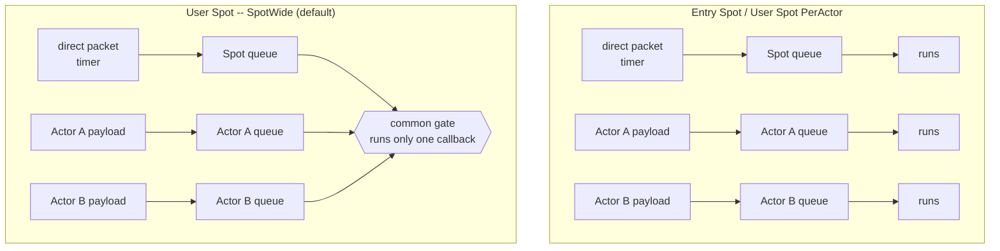

# 6. Spot

> **The document that owns this chapter's contract** — the [Spot model](../../../common/spec/11-spot-model.ko.md)
> and [SPOT messaging](../../../common/spec/12-spot-messaging.ko.md) own the behavior, and
> the [per-language Spot public contract](../../../common/spec/server/languages/README.ko.md)
> owns the exact signatures. Actor and Spot membership are explained in
> [Actor & Spot Hosting](07-actor-spot.en.md).

A Spot is an execution unit found by a string ID, like a room, stage, or zone. `SpotId` is
unique across the whole Location Store and is case-sensitive. The application doesn't
choose or hold onto the `NodeRid` where a Spot lives — the framework looks up its current
location and generation.

## 1. Three Kinds Of Spot

All three kinds are Spots that carry an ID and state and run callbacks in order, but they
differ in when they're created, Actor membership, and their closing contract.

| | Entry Spot | User Spot | Instance Spot |
| --- | --- | --- | --- |
| When it's created | The Framework creates it at Object Server startup | The application creates it explicitly through the spot manager | Created when the first direct message for that ID arrives (cold activation) |
| Spot ID | Issued by the Framework | `Create` — the Framework issues it; `GetOrCreate` — the caller specifies it | The caller specifies it as the message's target ID |
| Stable type | Not registered | Required | Required |
| Actor membership | Supported. The default execution location right after Actor creation | Supported. Actors move in and out via join/leave | Not supported |
| Application close | Not provided | `Close`, or close from a local context | Close from its own handler/timer context |
| Primary use | The default location for an Actor not yet belonging to a User Spot | Room, stage, zone | An ID-based request-processing unit, like a matchmaking worker |

**Which lifecycle callbacks it receives also differs by kind.** The names follow the
language, but the call conditions and order are the same.

| Callback | Entry | User | Instance | When |
| --- | :---: | :---: | :---: | --- |
| `Configure` | O | O | O | The configuration phase where handlers are registered |
| `OnCreate` | X | O | X | Confirms a new User Spot creation request and decides whether to accept it. Not called when an existing Spot was found |
| `OnInitialize` | O | O | O | Initializes the created instance. An Instance Spot receives only this, with no `OnCreate` |
| `OnClosing` | O | O | O | Before a still-valid local instance is cleaned up (see §4.1 below) |
| `OnActorJoin` | X | O※ | X | Approve/reject when an existing Actor tries to come to this User Spot |
| `OnCreateActor` | O※ | X | X | Approve/reject a new Actor's initial Entry Spot membership |
| `OnJoinedActor` | O※ | O※ | X | Notifies **the destination** Spot once the join commit is done |
| `OnLeaveActor` | O※ | O※ | X | Notifies **the origin** Spot after commit. Doesn't mean the Actor is gone |
| `OnDisconnectActor` | O※ | O※ | X | When a connection for an Actor belonging to that Spot drops |

※ Only applies to a Spot that specifies an Actor type and supports Actor membership.

**Membership callbacks run split between the Spot left and the Spot arrived at.** So even
when an Actor that was in a User Spot returns to the Entry Spot, **the Entry Spot's
`OnCreateActor` and `OnActorJoin` are not called** — returning to the Entry Spot is default
membership, so there's no approval step. In both directions, only the arriving side's
`OnJoinedActor` and the leaving side's `OnLeaveActor` run after commit.

User Spot and Instance Spot play different roles. For a User Spot, the caller specifies the
ID or the Framework issues a new one. Instance Spot doesn't use a separate create API — if
you specify the instance type on the first message, the Framework either picks an existing
instance or creates one wherever needed, then processes that same message.

### 1.1 Seeing It In A Real Sample

The [Bingo sample](../../../common/sample/bingo/README.en.md) uses all three kinds. The
Play server registers an Entry Spot and a User Spot to hold rooms; the Matchmaking server
registers an Instance Spot to hold the matching queue.

=== "C#/.NET"

    ```csharp
    // Play server -- an Entry Spot and a User Spot to hold rooms.
    mesh.Objects().Server()
        .AddEntrySpot<BingoEntrySpot>()                 // An Entry Spot has no stable type.
        .AddSpotFactory<BingoRoom>(
            SampleNames.RoomSpotType,                   // Stable type -- selected by this name when creating.
            factory => factory
                .ExecutionMode(ZLinkUserSpotExecutionMode.SpotWide)
                .PreserveStateWith<BingoRoomRelocationAdapter>());

    // Matchmaking server -- an Instance Spot to hold the matching queue.
    options.AddRouteMesh(SampleNames.MatchmakingMeshName)
        .SetRoutingIdPrefix("matchmaking")
        .Listen(configuration.Node.MeshEndpoint)
        .Objects().Server()
        .AddInstanceSpotFactory<BingoMatchmaker>(
            SampleNames.MatchmakerSpotType,
            factory => factory.RecreateOnRelocation());
    ```

=== "C++"

    ```cpp
    // Play server -- an Entry Spot and a User Spot to hold rooms.
    mesh.set_object_role (object_role_t::server)
      .add_entry_spot<bingo_entry_spot_t> (              // An Entry Spot has no stable type.
        [] (entry_spot_context_t c) { return std::make_shared<bingo_entry_spot_t> (std::move (c)); })
      .add_spot_factory<bingo_room_t> (
        sample_names_t::room_spot_type,                  // Stable type -- selected by this name when creating.
        [] (spot_context_t c) { return std::make_shared<bingo_room_t> (std::move (c)); },
        [] (auto &factory) {
            factory.execution_mode (user_spot_execution_mode_t::spot_wide);
            factory.template preserve_state_with<bingo_room_relocation_adapter_t> ();
        });

    // Matchmaking server -- an Instance Spot to hold the matching queue.
    options.add_route_mesh (sample_names_t::matchmaking_mesh_name)
      .set_routing_id (zlink::routing_id_t::from (std::string ("matchmaking")))
      .listen (configuration.node.mesh_endpoint)
      .set_object_role (object_role_t::server)
      .add_instance_spot_factory<bingo_matchmaker_t> (
        sample_names_t::matchmaker_spot_type,
        [] (instance_spot_context_t c) {
            return std::make_shared<bingo_matchmaker_t> (std::move (c));
        },
        [] (auto &factory) { factory.recreate_on_relocation (); });
    ```

=== "Java"

    ```java
    // Play server -- an Entry Spot and a User Spot to hold rooms.
    mesh.objects().server()
        .addEntrySpot(BingoEntrySpot.class)              // An Entry Spot has no stable type.
        .addSpotFactory(
            SampleNames.RoomSpotType,                    // Stable type -- selected by this name when creating.
            BingoRoom.class,
            factory -> factory
                .executionMode(ZLinkUserSpotExecutionMode.SPOT_WIDE)
                .preserveStateWith(BingoRoomRelocationAdapter.class));

    // Matchmaking server -- an Instance Spot to hold the matching queue.
    options.addRouteMesh(SampleNames.MatchmakingMeshName)
        .setRoutingIdPrefix("matchmaking")
        .listen(configuration.node().meshEndpoint())
        .objects().server()
        .addInstanceSpotFactory(
            SampleNames.MatchmakerSpotType,
            BingoMatchmaker.class,
            factory -> factory.recreateOnRelocation());
    ```

=== "Kotlin"

    ```kotlin
    // Play server -- an Entry Spot and a User Spot to hold rooms.
    mesh.objects().server()
        .addEntrySpot(BingoEntrySpot::class.java)          // An Entry Spot has no stable type.
        .addSpotFactory(
            SampleNames.RoomSpotType,                      // Stable type -- selected by this name when creating.
            BingoRoom::class.java,
        ) { factory ->
            factory.executionMode(ZLinkUserSpotExecutionMode.SPOT_WIDE)
                .preserveStateWith(BingoRoomRelocationAdapter::class.java)
        }

    // Matchmaking server -- an Instance Spot to hold the matching queue.
    options.addRouteMesh(SampleNames.MatchmakingMeshName)
        .setRoutingIdPrefix("matchmaking")
        .listen(configuration.node.meshEndpoint)
        .objects().server()
        .addInstanceSpotFactory(
            SampleNames.MatchmakerSpotType,
            BingoMatchmaker::class.java,
        ) { factory -> factory.recreateOnRelocation() }
    ```

=== "Node/TypeScript"

    ```typescript
    // Play server -- an Entry Spot and a User Spot to hold rooms.
    mesh.objects().server()
      .addEntrySpot(BingoEntrySpot)                    // An Entry Spot has no stable type.
      .addSpotFactory(
        SampleNames.roomSpotType,                      // Stable type -- selected by this name when creating.
        BingoRoom,
        (factory) => factory
          .executionMode(ZLinkUserSpotExecutionMode.SpotWide)
          .preserveStateWith(BingoRoomRelocationAdapter));

    // Matchmaking server -- an Instance Spot to hold the matching queue.
    builder.addRouteMesh(SampleNames.matchmakingMeshName)
      .setRoutingIdPrefix('matchmaking')
      .listen(configuration.node.meshEndpoint)
      .objects().server()
      .addInstanceSpotFactory(
        SampleNames.matchmakerSpotType,
        BingoMatchmaker,
        (factory) => factory.recreateOnRelocation());
    ```


The difference shows up **on the calling side.** An Entry Spot isn't a call target (it's
already ready when the server starts), a User Spot has a separate create call, and an
Instance Spot has no such call at all. Bingo's single matchmaking handler shows the latter
two together.

=== "C#/.NET"

    ```csharp
    // Instance Spot -- no create call. Sending to that ID creates it if it's missing.
    var allocated = await spotClient                    // IZLinkSpotClient
        .RequestToSpot($"match:{levelBucket}", new ReserveBingoRoomReq { ... })
        .InstanceSpot(SampleNames.MatchmakerSpotType)   // The intent that creation is OK if it's missing (cold activation).
        .InMesh(SampleNames.MatchmakingMeshName)
        .Async<ReserveBingoRoomRes>(cancellationToken);

    // User Spot -- there's a separate create call.
    var created = await spots                           // IZLinkSpotManager
        .GetOrCreate(allocated.RoomId, SampleNames.RoomSpotType)
        .InMesh(SampleNames.PlayMeshName)
        .Request(allocated.Settings)                    // Delivered to the new Spot's OnCreateAsync.
        .Async(cancellationToken);
    ```

=== "C++"

    ```cpp
    // Instance Spot -- no create call. Sending to that ID creates it if it's missing.
    auto allocated = co_await spot_client
                       .request_to_spot ("match:" + level_bucket, reserve_bingo_room_req_t{})
                       .instance_spot (sample_names_t::matchmaker_spot_type) // The intent that creation is OK if it's missing.
                       .in_mesh (sample_names_t::matchmaking_mesh_name)
                       .submit<reserve_bingo_room_res_t> ();

    // User Spot -- there's a separate create call.
    auto created = co_await spots
                     .get_or_create (allocated.room_id, sample_names_t::room_spot_type)
                     .in_mesh (sample_names_t::play_mesh_name)
                     .request (allocated.settings) // Delivered to the new Spot's on_create.
                     .submit ();
    ```

=== "Java"

    ```java
    // Instance Spot -- no create call. Sending to that ID creates it if it's missing.
    ReserveBingoRoomRes allocated = spotClient
        .requestToSpot("match:" + levelBucket, new ReserveBingoRoomReq())
        .instanceSpot(SampleNames.MatchmakerSpotType) // The intent that creation is OK if it's missing.
        .inMesh(SampleNames.MatchmakingMeshName)
        .submit(ReserveBingoRoomRes.class)
        .toCompletableFuture().join();

    // User Spot -- there's a separate create call.
    ZLinkSpotCreateResult created = spots
        .getOrCreate(allocated.roomId(), SampleNames.RoomSpotType)
        .inMesh(SampleNames.PlayMeshName)
        .request(allocated.settings())   // Delivered to the new Spot's onCreate.
        .submit()
        .toCompletableFuture().join();
    ```

=== "Kotlin"

    ```kotlin
    // Instance Spot -- no create call. Sending to that ID creates it if it's missing.
    val allocated = spotClient
        .requestToSpot("match:$levelBucket", ReserveBingoRoomReq())
        .instanceSpot(SampleNames.MatchmakerSpotType) // The intent that creation is OK if it's missing.
        .inMesh(SampleNames.MatchmakingMeshName)
        .submit(ReserveBingoRoomRes::class.java)
        .await()

    // User Spot -- there's a separate create call.
    val created = spots
        .getOrCreate(allocated.roomId, SampleNames.RoomSpotType)
        .inMesh(SampleNames.PlayMeshName)
        .request(allocated.settings)     // Delivered to the new Spot's onCreate.
        .submit()
        .await()
    ```

=== "Node/TypeScript"

    ```typescript
    // Instance Spot -- no create call. Sending to that ID creates it if it's missing.
    const allocated = await spotClient
      .requestToSpot(`match:${levelBucket}`, reserveBingoRoomReq())
      .instanceSpot(SampleNames.matchmakerSpotType) // The intent that creation is OK if it's missing.
      .inMesh(SampleNames.matchmakingMeshName)
      .submit<ReserveBingoRoomRes>();

    // User Spot -- there's a separate create call.
    const created = await spots
      .getOrCreate(allocated.roomId, SampleNames.roomSpotType)
      .inMesh(SampleNames.playMeshName)
      .request(allocated.settings)      // Delivered to the new Spot's onCreate.
      .submit();
    ```


A User/Instance Spot also specifies its relocation policy in factory registration. It can't
be omitted, and what to choose is covered by [Actor & Spot Hosting](07-actor-spot.en.md).

## 2. Registering With The Object Server

The MeshNode that runs a Spot registers the Object Server role and its factory. Placement
targets aren't chosen with a fixed `NodeRid` — any `Serving` node that registered the same
stable type becomes a placement candidate.

=== "C#/.NET"

    ```csharp
    var mesh = options.AddRouteMesh("play")
        .Listen("tcp://0.0.0.0:9001")
        .SetRoutingIdPrefix("play");

    mesh.Objects().Server()
        .AddEntrySpot<PlayEntrySpot>() // Registers the Entry Spot an Actor is placed in first.
        .AddSpotFactory<GameRoom>(
            "game-room",
            factory => factory
                .ExecutionMode(ZLinkUserSpotExecutionMode.SpotWide)
                .DisableRelocation())
        .AddInstanceSpotFactory<Matchmaker>(
            "matchmaker",
            factory => factory.RecreateOnRelocation());
    ```

=== "C++"

    ```cpp
    auto mesh = options.add_route_mesh ("play");
    mesh.listen ("tcp://0.0.0.0:9001")
      .set_routing_id (zlink::routing_id_t::from (std::string ("play")));

    mesh.set_object_role (object_role_t::server)
      // Registers the Entry Spot an Actor is placed in first.
      .add_entry_spot<play_entry_spot_t> (
        [] (entry_spot_context_t c) { return std::make_shared<play_entry_spot_t> (std::move (c)); })
      .add_spot_factory<game_room_t> (
        "game-room",
        [] (spot_context_t c) { return std::make_shared<game_room_t> (std::move (c)); },
        [] (auto &factory) {
            factory.execution_mode (user_spot_execution_mode_t::spot_wide);
            factory.disable_relocation ();
        })
      .add_instance_spot_factory<matchmaker_t> (
        "matchmaker",
        [] (instance_spot_context_t c) { return std::make_shared<matchmaker_t> (std::move (c)); },
        [] (auto &factory) { factory.recreate_on_relocation (); });
    ```

=== "Java"

    ```java
    ZLinkMeshNodeBuilder mesh = options.addRouteMesh("play")
        .listen("tcp://0.0.0.0:9001")
        .setRoutingIdPrefix("play");

    mesh.objects().server()
        .addEntrySpot(PlayEntrySpot.class) // Registers the Entry Spot an Actor is placed in first.
        .addSpotFactory(
            "game-room",
            GameRoom.class,
            factory -> factory
                .executionMode(ZLinkUserSpotExecutionMode.SPOT_WIDE)
                .disableRelocation())
        .addInstanceSpotFactory(
            "matchmaker",
            Matchmaker.class,
            factory -> factory.recreateOnRelocation());
    ```

=== "Kotlin"

    ```kotlin
    val mesh = options.addRouteMesh("play")
        .listen("tcp://0.0.0.0:9001")
        .setRoutingIdPrefix("play")

    mesh.objects().server()
        .addEntrySpot(PlayEntrySpot::class.java) // Registers the Entry Spot an Actor is placed in first.
        .addSpotFactory("game-room", GameRoom::class.java) { factory ->
            factory.executionMode(ZLinkUserSpotExecutionMode.SPOT_WIDE).disableRelocation()
        }
        .addInstanceSpotFactory("matchmaker", Matchmaker::class.java) { factory ->
            factory.recreateOnRelocation()
        }
    ```

=== "Node/TypeScript"

    ```typescript
    const mesh = builder.addRouteMesh('play')
      .listen('tcp://0.0.0.0:9001')
      .setRoutingIdPrefix('play');

    mesh.objects().server()
      .addEntrySpot(PlayEntrySpot) // Registers the Entry Spot an Actor is placed in first.
      .addSpotFactory('game-room', GameRoom, (factory) => factory
        .executionMode(ZLinkUserSpotExecutionMode.SpotWide)
        .disableRelocation())
      .addInstanceSpotFactory('matchmaker', Matchmaker, (factory) =>
        factory.recreateOnRelocation());
    ```


### 2.1 The Execution Model — Concurrency Scope

Work coming into a Spot waits in one of two queues. Direct packets and timers addressed to
the Spot itself go into the **Spot queue**; payloads addressed to an Actor belonging to that
Spot go into the **Actor queue**. Whether work from different queues can run concurrently is
decided by the Spot kind and its execution mode.

| | Serialization scope | State ownership |
| --- | --- | --- |
| Entry Spot | Serializes the Spot queue and each Actor queue separately. Different queues can run concurrently | Each Actor owns its own. Put state shared between Actors in external storage |
| User Spot `SpotWide` (default) | Serializes the Spot handler, member Actor handlers, timer, and lifecycle callbacks all through one common gate | The Spot instance owns it. No separate synchronization is needed for state shared with Actors either |
| User Spot `PerActor` | Serializes separately per Actor and per Spot lane. Different lanes can run concurrently | Each Actor owns its own. Put state shared across lanes in external storage |
| Instance Spot | Serializes the Spot queue's direct handlers and timer. There's no Actor queue | The Spot instance owns it |



The default is **`SpotWide`**, and most cases use this mode. Because every callback for that
Spot is serialized through one common gate, the Spot instance and its member Actors can
share the same state without any separate synchronization. In relocation too, the Spot and
its member Actors move together as one unit. On the other hand, one slow callback delays
every subsequent callback for that Spot.

Choose **`PerActor`** when you need per-Actor independent execution to get throughput. Treat
the Spot itself as a stateless shell. Because different lanes run concurrently, keep state
that multiple Actors change together, and the Spot-level schedule, in external storage like
Redis or a database with its own synchronization. Only `RecreateOnRelocation()` is available
as the factory relocation approach. **The Entry Spot uses the same model**, so it's under
the same constraint.

Serial execution doesn't mean holding a thread the whole time. When a handler reaches an
`await`, the execution thread can go handle other work, but that turn is held until the
handler completes. Under `SpotWide`, the next callback for the same Spot doesn't start
during that time. If you need to run the next turn while waiting on slow I/O, use the
`Yield` contract from [Timer And Worker](#6-timer-and-worker).

The execution mode is fixed at factory registration and doesn't change while running.

**Which queue each thing goes into is also fixed.** In particular, **a business message
addressed to an Actor goes straight to the Actor queue, bypassing the Spot queue.** It's not
a structure where the Spot callback receives the message and hands it over.

| Queue | Goes in | Doesn't go in |
| --- | --- | --- |
| Spot application queue | Payload addressed to the Spot, matched Logical Multicast payload, timer callback, Actor join/leave and lifecycle callbacks | **Actor business payload** |
| An Instance Spot's queue | Payload addressed to the Spot and timer callback | Everything Actor-related. **Rejected at registration time** |
| Actor queue | Actor business payload | — |

Trying to register Actor membership or a Logical Multicast subscription on an Instance Spot
is rejected **at the time of registration or Spot preparation**, not while running.

## 3. Creating A User Spot

The two calls have different purposes. **`Create` creates a new Spot**, and **`GetOrCreate`
secures a Spot to use under that ID.** Which one to use is decided by "what do you want to
happen if it already exists."

| | `Create` | `GetOrCreate` |
| --- | --- | --- |
| Purpose | Creates one new Spot | Makes the Spot at that ID usable |
| Result `State` | `Created` or `Rejected` | `Existing` / `Created` / `Rejected` |
| When it already exists | N/A, since the Framework always issues a new SpotId | Ends as `Existing`; doesn't run the factory or `OnCreate` |
| SpotId | Issued by the Framework | Specified by the caller |
| On failure | No usable Spot | No usable Spot |

**`Create` — when whether it was created is itself the business result.** Use it where
creation is the point, like opening a new room. The result is one of two: it was created
(`Created`) or the create callback rejected it (`Rejected`).

=== "C#/.NET"

    ```csharp
    ZLinkSpotCreateResult created = await spots
        .Create("game-room") // Selects the factory and placement candidates by the stable type.
        .InMesh("play")
        .Request(new CreateGame("ranked")) // The create request delivered to OnCreateAsync.
        .Timeout(TimeSpan.FromSeconds(10))
        .Async(cancellationToken);

    if (created.State == ZLinkSpotCreateState.Rejected)
        throw new InvalidOperationException("Game creation was rejected.");

    string spotId = created.Spot.SpotId; // Use only the global SpotId for messaging from here on.
    ```

=== "C++"

    ```cpp
    auto created = co_await spots
                     .create ("game-room")            // Selects the factory and placement candidates by the stable type.
                     .in_mesh ("play")
                     .request (create_game_t{"ranked"}) // The create request delivered to on_create.
                     .timeout (std::chrono::seconds (10))
                     .submit ();

    if (created.state == spot_create_state_t::rejected)
        throw std::runtime_error ("Game creation was rejected.");

    auto spot_id = created.spot.spot_id (); // Use only the global SpotId for messaging from here on.
    ```

=== "Java"

    ```java
    ZLinkSpotCreateResult created = spots
        .create("game-room")                  // Selects the factory and placement candidates by the stable type.
        .inMesh("play")
        .request(new CreateGame("ranked"))    // The create request delivered to onCreate.
        .timeout(Duration.ofSeconds(10))
        .submit()
        .toCompletableFuture().join();

    if (created.state() == ZLinkSpotCreateState.REJECTED) {
        throw new IllegalStateException("Game creation was rejected.");
    }

    String spotId = created.spot().spotId(); // Use only the global SpotId for messaging from here on.
    ```

=== "Kotlin"

    ```kotlin
    val created = spots
        .create("game-room")                  // Selects the factory and placement candidates by the stable type.
        .inMesh("play")
        .request(CreateGame("ranked"))        // The create request delivered to onCreate.
        .timeout(Duration.ofSeconds(10))
        .submit()
        .await()

    if (created.state() == ZLinkSpotCreateState.REJECTED) {
        error("Game creation was rejected.")
    }

    val spotId = created.spot().spotId() // Use only the global SpotId for messaging from here on.
    ```

=== "Node/TypeScript"

    ```typescript
    const created = await spots
      .create('game-room')                  // Selects the factory and placement candidates by the stable type.
      .inMesh('play')
      .request(createGame('ranked'))        // The create request delivered to onCreate.
      .timeout(10_000)
      .submit();

    if (created.state === ZLinkSpotCreateState.Rejected) {
      throw new Error('Game creation was rejected.');
    }

    const spotId = created.spot.spotId; // Use only the global SpotId for messaging from here on.
    ```


> **See it in a sample — [TicTacToe](../../../common/sample/tictactoe/README.en.md).** This
> is where the API server receives `POST /games` and creates a room on the Play server.
> Below is that call taken straight from the actual sample in the repository.

=== "C#/.NET"

    ```csharp
    --8<-- "framework/languages/dotnet/samples/TicTacToe/Server/Api/Handlers/CreateGameHttpHandler.cs:doc-create"
    ```

=== "C++"

    ```cpp
    --8<-- "framework/languages/cpp/samples/TicTacToe/Server/Api/Handlers/create_game_http_handler.hpp:doc-create"
    ```

=== "Java"

    ```java
    --8<-- "framework/languages/java/samples/java/TicTacToe/Server/src/main/java/systems/zlink/samples/tictactoe/server/api/handlers/CreateGameHttpHandler.java:doc-create"
    ```

=== "Kotlin"

    ```kotlin
    --8<-- "framework/languages/java/samples/kotlin/TicTacToe/Server/src/main/kotlin/systems/zlink/samples/kotlin/tictactoe/server/api/handlers/CreateGameHttpHandler.kt:doc-create"
    ```

=== "Node/TypeScript"

    ```typescript
    --8<-- "framework/languages/node/samples/TicTacToe.Ts/Server/Api/Handlers/create-game-http-handler.ts:doc-create"
    ```

**`GetOrCreate` — when it's enough that the ID is usable.** Use it where you need "use it if
it exists, create it if not." Whether it already existed (`Existing`) or was just created
(`Created`) can be told apart by the result, and both give you a `SpotRef` ready to use right
away. Even if multiple callers request the same ID at once, the Framework runs the create
attempt only once, so the application doesn't have to guard against the race itself.

=== "C#/.NET"

    ```csharp
    ZLinkSpotCreateResult result = await spots
        .GetOrCreate("lobby-eu-1", "lobby")
        .InMesh("play")
        .Request(new CreateLobby("eu")) // Not delivered if this ends as Existing.
        .Async(cancellationToken);

    switch (result.State)
    {
        case ZLinkSpotCreateState.Existing: // Uses the lobby that already existed, as-is.
        case ZLinkSpotCreateState.Created:  // This call created it.
            break;
        case ZLinkSpotCreateState.Rejected: // The create callback rejected it -- no Ready Spot.
            throw new InvalidOperationException("Lobby creation was rejected.");
    }
    ```

=== "C++"

    ```cpp
    auto result = co_await spots
                    .get_or_create ("lobby-eu-1", "lobby")
                    .in_mesh ("play")
                    .request (create_lobby_t{"eu"}) // Not delivered if this ends as existing.
                    .submit ();

    switch (result.state) {
    case spot_create_state_t::existing: // Uses the lobby that already existed, as-is.
    case spot_create_state_t::created:  // This call created it.
        break;
    case spot_create_state_t::rejected: // The create callback rejected it -- no Ready Spot.
        throw std::runtime_error ("Lobby creation was rejected.");
    }
    ```

=== "Java"

    ```java
    ZLinkSpotCreateResult result = spots
        .getOrCreate("lobby-eu-1", "lobby")
        .inMesh("play")
        .request(new CreateLobby("eu")) // Not delivered if this ends as EXISTING.
        .submit()
        .toCompletableFuture().join();

    switch (result.state()) {
        case EXISTING -> { }  // Uses the lobby that already existed, as-is.
        case CREATED -> { }   // This call created it.
        case REJECTED ->      // The create callback rejected it -- no Ready Spot.
            throw new IllegalStateException("Lobby creation was rejected.");
    }
    ```

=== "Kotlin"

    ```kotlin
    val result = spots
        .getOrCreate("lobby-eu-1", "lobby")
        .inMesh("play")
        .request(CreateLobby("eu")) // Not delivered if this ends as EXISTING.
        .submit()
        .await()

    when (result.state()) {
        ZLinkSpotCreateState.EXISTING -> { }  // Uses the lobby that already existed, as-is.
        ZLinkSpotCreateState.CREATED -> { }   // This call created it.
        // The create callback rejected it -- no Ready Spot.
        ZLinkSpotCreateState.REJECTED -> error("Lobby creation was rejected.")
    }
    ```

=== "Node/TypeScript"

    ```typescript
    const result = await spots
      .getOrCreate('lobby-eu-1', 'lobby')
      .inMesh('play')
      .request(createLobby('eu')) // Not delivered if this ends as Existing.
      .submit();

    switch (result.state) {
      case ZLinkSpotCreateState.Existing: // Uses the lobby that already existed, as-is.
      case ZLinkSpotCreateState.Created:  // This call created it.
        break;
      case ZLinkSpotCreateState.Rejected: // The create callback rejected it -- no Ready Spot.
        throw new Error('Lobby creation was rejected.');
    }
    ```


A `SpotRef` is the exact incarnation at the moment it was looked up. Don't use it for
general messaging -- use it only to close that same incarnation.

=== "C#/.NET"

    ```csharp
    SpotRef? current = await spots.FindAsync("lobby-eu-1", cancellationToken);
    if (current is { } exact)
    {
        await spots.CloseAsync(exact, cancellationToken); // Doesn't accidentally close a different generation.
    }
    ```

=== "C++"

    ```cpp
    auto current = co_await spots.find ("lobby-eu-1");
    if (current) {
        // Doesn't accidentally close a different generation.
        co_await spots.close (current.value ());
    }
    ```

=== "Java"

    ```java
    Optional<SpotRef> current = spots.find("lobby-eu-1").toCompletableFuture().join();
    current.ifPresent(spot ->
        // Doesn't accidentally close a different generation.
        spots.close(spot).toCompletableFuture().join());
    ```

=== "Kotlin"

    ```kotlin
    val current = spots.find("lobby-eu-1").await().orElse(null)
    if (current != null) {
        // Doesn't accidentally close a different generation.
        spots.close(current).await()
    }
    ```

=== "Node/TypeScript"

    ```typescript
    const current = await spots.find('lobby-eu-1');
    if (current !== undefined) {
      // Doesn't accidentally close a different generation.
      await spots.close(current);
    }
    ```


## 4. Writing A Spot

A Spot handler follows different authoring rules than a channel handler in
[05-channel-messaging](05-channel-messaging.en.md). Address, lifetime, execution, and state
all differ.

| Aspect | Channel handler | Spot handler |
| --- | --- | --- |
| Address | `ChannelName` -- one of the nodes that can process it | Spot id -- the one object that owns that state |
| Handler lifetime | Created fresh on every message dispatch | Reuses the same instance for the Spot's whole activation |
| Execution | Different dispatches can run concurrently | Work on the same execution queue runs one at a time |
| Application state | Not kept in a handler field | Owned by the Spot or its member Actor |

A Spot handler is not a method on the Spot class -- it's a **separate class** bound to that
Spot. It takes the target Spot type as its first generic argument, and receives that Spot
instance as `Handle`'s first argument. The Framework creates the handler once per Spot
activation and cleans it up when the Spot closes or relocates. An Actor handler is bound to
its Actor's activation the same way.

### 4.1 Handler Kinds And The Interface To Implement

Which interface to implement depends on what it receives. Whichever it is, it has to match
what was registered in `Configure()`.

Each thing received has one matching interface and one registration call.

| What it receives | Matching registration |
| --- | --- |
| A one-way packet addressed to the Spot | Packet registration |
| A request addressed to the Spot | Packet registration |
| A Logical Multicast subscription event | Subscription registration (specifies channel and topic) |
| A timer tick | Timer registration (specifies name and period, §6.1) |
| A one-way packet addressed to a member Actor | Actor packet registration |
| A request addressed to a member Actor | Actor packet registration |

The interface names and registration methods per language are as follows.

=== "C#/.NET"

    | What it receives | Interface to implement | Registration |
    | --- | --- | --- |
    | A one-way packet addressed to the Spot | `IZLinkSpotPacketHandler<TSpot, TMessage>` | `AddPacket<THandler>()` |
    | A request addressed to the Spot | `IZLinkSpotRequestHandler<TSpot, TRequest, TReply>` | `AddPacket<THandler>()` |
    | A Logical Multicast subscription event | `IZLinkSpotSubscriptionHandler<TSpot, TEvent>` | `AddSubscribe<THandler>(channelName, topic)` |
    | A timer tick | `IZLinkSpotTimerHandler<TSpot>` | `AddTimer<THandler>(name, period, …)` (§6.1) |
    | A one-way packet addressed to a member Actor | `IZLinkSpotActorSendHandler<TSpot, TActor, TMessage>` | `AddActorPacket<THandler, TActor>()` |
    | A request addressed to a member Actor | `IZLinkSpotActorRequestHandler<TSpot, TActor, TRequest, TReply>` | `AddActorPacket<THandler, TActor>()` |

=== "C++"

    C++ registers a Spot member function instead of a handler class. The registration call
    itself is the kind.

    | What it receives | Registration |
    | --- | --- |
    | A one-way packet addressed to the Spot | `add_handler<&TSpot::method> ()` |
    | A request addressed to the Spot | `add_handler<&TSpot::method> ()` (the return value is the reply) |
    | A Logical Multicast subscription event | `add_subscribe<&TSpot::method> (channel_name, topic)` |
    | A timer tick | `add_timer<THandler> (name, period, options)` (§6.1) |
    | A one-way packet addressed to a member Actor | `add_actor_send<&TSpot::method> ()` |
    | A request addressed to a member Actor | `add_actor_request<&TSpot::method> ()` |

=== "Java"

    | What it receives | Interface to implement | Registration |
    | --- | --- | --- |
    | A one-way packet addressed to the Spot | `ZLinkSpotPacketHandler<TSpot, TMessage>` | `addHandler(THandler.class)` |
    | A request addressed to the Spot | `ZLinkSpotRequestHandler<TSpot, TRequest, TReply>` | `addHandler(THandler.class)` |
    | A Logical Multicast subscription event | `ZLinkSpotSubscriptionHandler<TSpot, TEvent>` | `@ZLinkSpotSubscription(topic)` on the handler + `addHandler(THandler.class)` |
    | A timer tick | `ZLinkSpotTimerHandler<TSpot>` | `context.addTimer(name, period, THandler.class, options)` (§6.1) |
    | A one-way packet addressed to a member Actor | `ZLinkSpotActorSendHandler<TSpot, TActor, TMessage>` | `@ZLinkSpotActorSend` on the handler + `addHandler(THandler.class)` |
    | A request addressed to a member Actor | `ZLinkSpotActorRequestHandler<TSpot, TActor, TRequest, TReply>` | `@ZLinkSpotActorRequest` on the handler + `addHandler(THandler.class)` |

    **There's a single registration method, `addHandler`.** What kind of handler it is comes
    from the interface it implements and its annotation. The packet name comes from the
    message type's `@ZLinkPacket`.

=== "Kotlin"

    | What it receives | Interface to implement | Registration |
    | --- | --- | --- |
    | A one-way packet addressed to the Spot | `ZLinkSpotPacketHandler<TSpot, TMessage>` | `addHandler(THandler::class.java)` |
    | A request addressed to the Spot | `ZLinkSpotRequestHandler<TSpot, TRequest, TReply>` | `addHandler(THandler::class.java)` |
    | A Logical Multicast subscription event | `ZLinkSpotSubscriptionHandler<TSpot, TEvent>` | `@ZLinkSpotSubscription(topic)` on the handler + `addHandler(THandler::class.java)` |
    | A timer tick | `ZLinkSpotTimerHandler<TSpot>` | `context.addTimer(name, period, THandler::class.java, options)` (§6.1) |
    | A one-way packet addressed to a member Actor | `ZLinkSpotActorSendHandler<TSpot, TActor, TMessage>` | `@ZLinkSpotActorSend` on the handler + `addHandler(THandler::class.java)` |
    | A request addressed to a member Actor | `ZLinkSpotActorRequestHandler<TSpot, TActor, TRequest, TReply>` | `@ZLinkSpotActorRequest` on the handler + `addHandler(THandler::class.java)` |

    **Uses the Java surface as-is.** There's a single registration method, `addHandler`, and
    what kind of handler it is comes from the interface it implements and its annotation.

=== "Node/TypeScript"

    | What it receives | Interface to implement | Registration |
    | --- | --- | --- |
    | A one-way packet addressed to the Spot | `ZLinkSpotPacketHandler<TSpot, TMessage>` | `addPacket(THandler)` |
    | A request addressed to the Spot | `ZLinkSpotRequestHandler<TSpot, TRequest, TReply>` | `addPacket(THandler)` |
    | A Logical Multicast subscription event | `ZLinkSpotSubscriptionHandler<TSpot, TEvent>` | `addSubscribe(THandler, channelName, topic)` |
    | A timer tick | `ZLinkSpotTimerHandler<TSpot>` | `addTimer(name, periodMs, THandler, options)` (§6.1) |
    | A one-way packet addressed to a member Actor | `ZLinkSpotActorSendHandler<TSpot, TActor, TMessage>` | `addActorPacket(THandler)` |
    | A request addressed to a member Actor | `ZLinkSpotActorRequestHandler<TSpot, TActor, TRequest, TReply>` | `addActorPacket(THandler)` |

A handler takes the target Spot instance as its first argument. It runs inside the Spot, so
it touches state directly, with no lock.

> **See it in a sample — [TicTacToe](../../../common/sample/tictactoe/README.en.md).** The
> handler where the player in the room makes a move. It handles a request addressed to a
> member Actor, receiving the Spot and the Actor together. Actual code from the repository.

=== "C#/.NET"

    ```csharp
    --8<-- "framework/languages/dotnet/samples/TicTacToe/Server/Play/Infrastructure/ZLink/Spots/TicTacToeGameSpot/Handlers/PlayActorPlaceMarkHandler.cs:doc-actor-packet-handler"
    ```

=== "C++"

    ```cpp
    --8<-- "framework/languages/cpp/samples/TicTacToe/Server/Play/Infrastructure/ZLink/Spots/TicTacToeGameSpot/Handlers/play_actor_place_mark_handler.hpp:doc-actor-packet-handler"
    ```

=== "Java"

    ```java
    --8<-- "framework/languages/java/samples/java/TicTacToe/Server/src/main/java/systems/zlink/samples/tictactoe/server/play/infrastructure/zlink/spots/tictactoegamespot/handlers/PlayActorPlaceMarkHandler.java:doc-actor-packet-handler"
    ```

=== "Kotlin"

    ```kotlin
    --8<-- "framework/languages/java/samples/kotlin/TicTacToe/Server/src/main/kotlin/systems/zlink/samples/kotlin/tictactoe/server/play/infrastructure/zlink/spots/tictactoegamespot/handlers/PlayActorPlaceMarkHandler.kt:doc-actor-packet-handler"
    ```

=== "Node/TypeScript"

    ```typescript
    --8<-- "framework/languages/node/samples/TicTacToe.Ts/Server/Play/Infrastructure/ZLink/Spots/TicTacToeGameSpot/Handlers/play-actor-place-mark-handler.ts:doc-actor-packet-handler"
    ```

The four branches in their minimal form look like this.

=== "C#/.NET"

    ```csharp
    // A packet addressed to the Spot -- the first argument is the target Spot instance.
    public sealed class ChatHandler : IZLinkSpotPacketHandler<GameRoom, Chat>
    {
        public ValueTask HandleAsync(
            GameRoom spot,
            Chat message,
            CancellationToken cancellationToken)
        {
            spot.AppendChat(message.Text);  // Touches Spot state directly. No lock needed.
            return ValueTask.CompletedTask;
        }
    }

    // A request addressed to the Spot -- the return value is the reply.
    public sealed class GetRoomStateHandler
        : IZLinkSpotRequestHandler<GameRoom, GetRoomState, RoomState>
    {
        public ValueTask<RoomState> HandleAsync(
            GameRoom spot,
            GetRoomState request,
            CancellationToken cancellationToken)
            => ValueTask.FromResult(spot.Snapshot());
    }

    // A subscription event -- arrives on the channel/topic registered with AddSubscribe.
    public sealed class ScoreHandler : IZLinkSpotSubscriptionHandler<GameRoom, ScoreChanged>
    {
        public ValueTask HandleAsync(
            GameRoom spot,
            ScoreChanged @event,
            CancellationToken cancellationToken)
        {
            spot.ApplyScore(@event);
            return ValueTask.CompletedTask;
        }
    }

    // A packet addressed to a member Actor -- receives the Spot and the Actor together.
    public sealed class PlaceMarkHandler
        : IZLinkSpotActorSendHandler<GameRoom, PlayerActor, PlaceMark>
    {
        public ValueTask HandleAsync(
            GameRoom spot,
            PlayerActor actor,              // The Actor that received this message.
            IZLinkMessageContext messageContext,
            PlaceMark message,
            CancellationToken cancellationToken)
        {
            spot.Place(actor.ActorId, message.Cell);
            return ValueTask.CompletedTask;
        }
    }
    ```

=== "C++"

    ```cpp
    // C++ registers a Spot member function instead of a handler class. The first argument is the target Spot.
    class game_room_t : public spot_t<player_actor_t>
    {
      public:
        // A packet addressed to the Spot.
        task_t<void> chat (const chat_t &message)
        {
            append_chat (message.text); // Touches Spot state directly. No lock needed.
            co_return;
        }

        // A request addressed to the Spot -- the return value is the reply.
        room_state_t get_room_state (const get_room_state_t &) { return snapshot (); }

        // A subscription event -- arrives on the channel/topic registered with add_subscribe.
        task_t<void> score (const score_changed_t &event)
        {
            apply_score (event);
            co_return;
        }

        // A packet addressed to a member Actor -- receives the Spot and the Actor together.
        task_t<void> place_mark (player_actor_t &actor,   // The Actor that received this message.
                                 message_context_t &,
                                 const place_mark_t &message)
        {
            place (actor.actor_id, message.cell);
            co_return;
        }
    };
    ```

=== "Java"

    ```java
    // A packet addressed to the Spot -- the first argument is the target Spot instance.
    public final class ChatHandler implements ZLinkSpotPacketHandler<GameRoom, Chat> {
        @Override
        public CompletionStage<Void> handle(GameRoom spot, Chat message) {
            spot.appendChat(message.text()); // Touches Spot state directly. No lock needed.
            return CompletableFuture.completedFuture(null);
        }
    }

    // A request addressed to the Spot -- the return value is the reply.
    public final class GetRoomStateHandler
        implements ZLinkSpotRequestHandler<GameRoom, GetRoomState, RoomState> {
        @Override
        public CompletionStage<RoomState> handle(GameRoom spot, GetRoomState request) {
            return CompletableFuture.completedFuture(spot.snapshot());
        }
    }

    // A subscription event -- arrives on the topic in @ZLinkSpotSubscription.
    public final class ScoreHandler
        implements ZLinkSpotSubscriptionHandler<GameRoom, ScoreChanged> {
        @Override
        public CompletionStage<Void> handle(GameRoom spot, ScoreChanged event) {
            spot.applyScore(event);
            return CompletableFuture.completedFuture(null);
        }
    }

    // A packet addressed to a member Actor -- receives the Spot and the Actor together.
    public final class PlaceMarkHandler
        implements ZLinkSpotActorSendHandler<GameRoom, PlayerActor, PlaceMark> {
        @Override
        public CompletionStage<Void> handle(
            GameRoom spot,
            PlayerActor actor,              // The Actor that received this message.
            ZLinkMessageContext messageContext,
            PlaceMark message) {
            spot.place(actor.actorId(), message.cell());
            return CompletableFuture.completedFuture(null);
        }
    }
    ```

=== "Kotlin"

    ```kotlin
    // A packet addressed to the Spot -- the first argument is the target Spot instance.
    class ChatHandler : ZLinkSpotPacketHandler<GameRoom, Chat> {
        override suspend fun handle(spot: GameRoom, message: Chat) {
            spot.appendChat(message.text) // Touches Spot state directly. No lock needed.
        }
    }

    // A request addressed to the Spot -- the return value is the reply.
    class GetRoomStateHandler : ZLinkSpotRequestHandler<GameRoom, GetRoomState, RoomState> {
        override suspend fun handle(spot: GameRoom, request: GetRoomState): RoomState = spot.snapshot()
    }

    // A subscription event -- arrives on the topic in @ZLinkSpotSubscription.
    class ScoreHandler : ZLinkSpotSubscriptionHandler<GameRoom, ScoreChanged> {
        override suspend fun handle(spot: GameRoom, event: ScoreChanged) {
            spot.applyScore(event)
        }
    }

    // A packet addressed to a member Actor -- receives the Spot and the Actor together.
    class PlaceMarkHandler : ZLinkSpotActorSendHandler<GameRoom, PlayerActor, PlaceMark> {
        override suspend fun handle(
            spot: GameRoom,
            actor: PlayerActor,             // The Actor that received this message.
            messageContext: ZLinkMessageContext,
            message: PlaceMark,
        ) {
            spot.place(actor.actorId(), message.cell)
        }
    }
    ```

=== "Node/TypeScript"

    ```typescript
    // A packet addressed to the Spot -- the first argument is the target Spot instance.
    export class ChatHandler implements ZLinkSpotPacketHandler<GameRoom, Chat> {
      async handle(spot: GameRoom, message: Chat): Promise<void> {
        spot.appendChat(message.text); // Touches Spot state directly. No lock needed.
      }
    }

    // A request addressed to the Spot -- the return value is the reply.
    export class GetRoomStateHandler
      implements ZLinkSpotRequestHandler<GameRoom, GetRoomState, RoomState> {
      async handle(spot: GameRoom, request: GetRoomState): Promise<RoomState> {
        return spot.snapshot();
      }
    }

    // A subscription event -- arrives on the channel/topic registered with addSubscribe.
    export class ScoreHandler implements ZLinkSpotSubscriptionHandler<GameRoom, ScoreChanged> {
      async handle(spot: GameRoom, event: ScoreChanged): Promise<void> {
        spot.applyScore(event);
      }
    }

    // A packet addressed to a member Actor -- receives the Spot and the Actor together.
    export class PlaceMarkHandler
      implements ZLinkSpotActorSendHandler<GameRoom, PlayerActor, PlaceMark> {
      async handle(
        spot: GameRoom,
        actor: PlayerActor,             // The Actor that received this message.
        messageContext: ZLinkMessageContext,
        message: PlaceMark
      ): Promise<void> {
        spot.place(actor.actorId, message.cell);
      }
    }
    ```


A request addressed to an Actor is an actor request handler and only differs from the same
arguments in that the return value is the reply.

Register handlers in `Configure()` and perform initialization and cleanup in lifecycle
callbacks.

=== "C#/.NET"

    ```csharp
    public sealed class GameRoom(IZLinkSpotContext context) : IZLinkSpot
    {
        public IZLinkSpotContext Context { get; } = context;

        public void Configure()
        {
            Context.Handlers.AddPacket<ChatHandler>(); // Registers the Spot send handler.
            Context.Handlers.AddSubscribe<ScoreHandler>(
                "game-events",
                "score.changed"); // Registers a Logical Multicast subscription.
        }

        public ValueTask<ZLinkSpotCreateResponse> OnCreateAsync(
            ZLinkMessage request,
            CancellationToken cancellationToken)
        {
            var create = request.Decode<CreateGame>();
            return ValueTask.FromResult(
                create.Mode is "ranked" or "casual"
                    ? ZLinkSpotCreateResponse.Accept(new GameCreated(create.Mode))
                    : ZLinkSpotCreateResponse.Reject(new InvalidMode(create.Mode)));
        }

        public ValueTask OnInitializeAsync(CancellationToken cancellationToken)
        {
            // Finishes whatever's needed after creation is approved, before receiving messages.
            return ValueTask.CompletedTask;
        }

        public ValueTask OnClosingAsync(
            ZLinkSpotClosingContext closing,
            CancellationToken cleanupCancellationToken)
        {
            // Cleans up application resources by the deadline.
            return ValueTask.CompletedTask;
        }
    }
    ```

=== "C++"

    ```cpp
    class game_room_t : public spot_t<player_actor_t>
    {
      public:
        spot_context_t &context () noexcept override { return _context; }

        void configure () override
        {
            _context.handlers ().add_handler<&game_room_t::chat> (); // Registers the Spot send handler.
            _context.handlers ().add_subscribe<&game_room_t::score> (
              "game-events", "score.changed"); // Registers a Logical Multicast subscription.
        }

        task_t<spot_create_response_t> on_create (const message_t &request) override
        {
            const auto create = request.decode<create_game_t> ();
            co_return (create.mode == "ranked" || create.mode == "casual")
                      ? spot_create_response_t::accept (game_created_t{create.mode})
                      : spot_create_response_t::reject (invalid_mode_t{create.mode});
        }

        task_t<void> on_initialize () override
        {
            // Finishes whatever's needed after creation is approved, before receiving messages.
            co_return;
        }

        task_t<void> on_closing (const spot_closing_context_t &) override
        {
            // Cleans up application resources by the deadline.
            co_return;
        }

      private:
        spot_context_t _context;
    };
    ```

=== "Java"

    ```java
    public final class GameRoom implements ZLinkSpot {
        private final ZLinkSpotContext context;

        @Override
        public ZLinkSpotContext context() {
            return context;
        }

        @Override
        public void configure() {
            context.handlers().addHandler(ChatHandler.class); // Registers the Spot send handler.
            // The subscription topic is set by @ZLinkSpotSubscription on ScoreHandler.
            context.handlers().addHandler(ScoreHandler.class);
        }

        @Override
        public CompletionStage<ZLinkSpotCreateResponse> onCreate(ZLinkMessage request) {
            CreateGame create = request.decode(CreateGame.class);
            boolean known = "ranked".equals(create.mode()) || "casual".equals(create.mode());
            return CompletableFuture.completedFuture(known
                ? ZLinkSpotCreateResponse.accept(new GameCreated(create.mode()))
                : ZLinkSpotCreateResponse.reject(new InvalidMode(create.mode())));
        }

        @Override
        public CompletionStage<Void> onInitialize() {
            // Finishes whatever's needed after creation is approved, before receiving messages.
            return CompletableFuture.completedFuture(null);
        }

        @Override
        public CompletionStage<Void> onClosing(ZLinkSpotClosingContext closing) {
            // Cleans up application resources by the deadline.
            return CompletableFuture.completedFuture(null);
        }
    }
    ```

=== "Kotlin"

    ```kotlin
    class GameRoom(private val spotContext: ZLinkSpotContext) : ZLinkSpot {

        override fun context(): ZLinkSpotContext = spotContext

        override fun configure() {
            spotContext.handlers().addHandler(ChatHandler::class.java) // Registers the Spot send handler.
            // The subscription topic is set by @ZLinkSpotSubscription on ScoreHandler.
            spotContext.handlers().addHandler(ScoreHandler::class.java)
        }

        override suspend fun onCreate(request: ZLinkMessage): ZLinkSpotCreateResponse {
            val create = request.decode(CreateGame::class.java)
            return if (create.mode in setOf("ranked", "casual"))
                ZLinkSpotCreateResponse.accept(GameCreated(create.mode))
            else ZLinkSpotCreateResponse.reject(InvalidMode(create.mode))
        }

        override suspend fun onInitialize() {
            // Finishes whatever's needed after creation is approved, before receiving messages.
        }

        override suspend fun onClosing(closing: ZLinkSpotClosingContext) {
            // Cleans up application resources by the deadline.
        }
    }
    ```

=== "Node/TypeScript"

    ```typescript
    export class GameRoom implements ZLinkSpot {
      readonly context!: ZLinkSpotContext;

      configure(): void {
        this.context.handlers.addPacket(ChatHandler); // Registers the Spot send handler.
        this.context.handlers.addSubscribe(
          ScoreHandler,
          'game-events',
          'score.changed'); // Registers a Logical Multicast subscription.
      }

      async onCreate(request: ZLinkMessage): Promise<ZLinkSpotCreateResponse> {
        const create = request.decode<CreateGame>(Object as never);
        return create.mode === 'ranked' || create.mode === 'casual'
          ? ZLinkSpotCreateResponse.accept(gameCreated(create.mode))
          : ZLinkSpotCreateResponse.reject(invalidMode(create.mode));
      }

      async onInitialize(): Promise<void> {
        // Finishes whatever's needed after creation is approved, before receiving messages.
      }

      async onClosing(closing: ZLinkSpotClosingContext): Promise<void> {
        // Cleans up application resources by the deadline.
      }
    }
    ```


`OnClosing`'s reason distinguishes explicit close, host shutdown, and relocation out. The
Framework cancels the cleanup token when the `Deadline` runs out.

**Not all three reasons come for every Spot kind.**

| Close reason | Entry | User | Instance | When |
| --- | :---: | :---: | :---: | --- |
| Explicit close | X | O | O | When the application starts a close and the local instance is cleaned up normally |
| Host shutdown | O | O | O | When the host cleans up a local Spot with no relocation |
| Relocation out | X | O | O | After committing the owner to the target, when the source instance is cleaned up |

**Remember two spots where it's not called.**

- **Not called if close fails.** If Actor membership is still left on a User Spot and the
  explicit close ends in failure, `OnClosing` doesn't run. This is why you shouldn't assume
  "it must have been cleaned up" without checking the close result.
- **The Entry Spot doesn't close when an Actor leaves.** One Actor moving to a different
  Entry Spot isn't the Spot instance being terminated, so it doesn't call the Entry Spot's
  `OnClosing`.

**The Entry Spot itself never relocates.** That's why relocation out never happens to an
Entry Spot. When a host relocates, what the Framework moves is **the Actors belonging to the
Entry Spot** -- the destination's Entry Spot is already created with a new ID and lifetime
when that host starts. So state kept in the Entry Spot doesn't follow the host when it moves
-- **state that needs to move belongs on the Actor or User Spot.**

On host shutdown, the callback runs **while Actor membership and the local instance are
still alive.** Cleanup happens after the callback finishes, so code inside it that reads
member Actors is valid.

### 4.2 The Activation Scope Of A Spot And Actor

When the Framework activates a Spot, it creates one DI scope and resolves the Spot body's
and Spot handlers' dependencies within that scope. The scope is cleaned up together when the
Spot closes or moves to another node. So a **service registered as `Scoped` is one instance
for as long as that Spot is alive** -- unlike being created fresh per HTTP request.

An Actor handler uses a separate Actor activation scope. Different Actors don't share
handlers or scoped dependencies. When an Actor leaves/is destroyed or relocates, the source
scope is cleaned up and a new one is created at the target.

Even so, injecting an ORM context like `DbContext` into a Spot's or Spot handler's
constructor causes problems. If one room stays alive for hours, that context lives for hours
too.

| Symptom | Detail |
| --- | --- |
| Growing memory | The change tracker keeps tracking every entity it queried |
| Stale value reads | Querying the same key again returns the previously tracked instance |
| A stuck error state | If a save failure poisons the context, it never recovers for the rest of the Spot's lifetime |

Registering the handler type as `Transient` or `Singleton` doesn't change the lifetime the
Framework sets. The Framework creates the handler and only resolves dependencies within the
activation scope.

**The first choice is not to access storage directly from the Spot.** Ask a service with a
channel handler to save/query, and let the Spot own only in-memory state and execution
order. A channel handler has a scope per dispatch, so it's fine for it to receive an ORM in
its constructor.

=== "C#/.NET"

    ```csharp
    public sealed class SaveScoreHandler(IZLinkSpotContext context)
        : IZLinkSpotRequestHandler<GameRoom, SaveScore, SaveScoreReply>
    {
        public async ValueTask<SaveScoreReply> HandleAsync(
            GameRoom spot, SaveScore request, CancellationToken cancellationToken)
        {
            // Delegates the save to the handler of the channel responsible for it.
            var saved = await spot.Context.Outbound
                .RequestToChannel("score", new PersistScore(spot.Context.SpotId, request.Value))
                .Async<PersistScoreReply>(cancellationToken);

            return new SaveScoreReply(saved.Version);
        }
    }
    ```

=== "C++"

    ```cpp
    // Delegates the save to the handler of the channel responsible for it.
    task_t<save_score_reply_t> game_room_t::save_score (const save_score_t &request)
    {
        auto saved = co_await _context.outbound ()
                       .request_to_channel ("score",
                                            persist_score_t{_context.spot_id (), request.value})
                       .submit<persist_score_reply_t> ();

        co_return save_score_reply_t{saved.version};
    }
    ```

=== "Java"

    ```java
    public final class SaveScoreHandler
        implements ZLinkSpotRequestHandler<GameRoom, SaveScore, SaveScoreReply> {

        @Override
        public CompletionStage<SaveScoreReply> handle(GameRoom spot, SaveScore request) {
            // Delegates the save to the handler of the channel responsible for it.
            return spot.context().outbound()
                .requestToChannel("score", new PersistScore(spot.context().spotId(), request.value()))
                .submit(PersistScoreReply.class)
                .thenApply(saved -> new SaveScoreReply(saved.version()));
        }
    }
    ```

=== "Kotlin"

    ```kotlin
    class SaveScoreHandler : ZLinkSpotRequestHandler<GameRoom, SaveScore, SaveScoreReply> {

        override suspend fun handle(spot: GameRoom, request: SaveScore): SaveScoreReply {
            // Delegates the save to the handler of the channel responsible for it.
            val saved = spot.context().outbound()
                .requestToChannel("score", PersistScore(spot.context().spotId(), request.value))
                .submit(PersistScoreReply::class.java)
                .await()

            return SaveScoreReply(saved.version)
        }
    }
    ```

=== "Node/TypeScript"

    ```typescript
    export class SaveScoreHandler
      implements ZLinkSpotRequestHandler<GameRoom, SaveScore, SaveScoreReply> {

      async handle(spot: GameRoom, request: SaveScore): Promise<SaveScoreReply> {
        // Delegates the save to the handler of the channel responsible for it.
        const saved = await spot.context.outbound
          .requestToChannel('score', persistScore(spot.context.spotId, request.value))
          .submit<PersistScoreReply>();

        return saveScoreReply(saved.version);
      }
    }
    ```


**If you must write directly inside the Spot, open a scope that lives only for that call.**
Instead of constructor injection, take a scope factory and create and close the scope right
where you use it.

**Only C++ looks different.** A Spot packet/request handler isn't a handler class, it's a
Spot member function, and there's no per-call scope surface either. Open and close a
short-lived resource directly inside that function.

=== "C#/.NET"

    ```csharp
    public sealed class SaveScoreHandler(IServiceScopeFactory scopeFactory)
        : IZLinkSpotRequestHandler<GameRoom, SaveScore, SaveScoreReply>
    {
        public async ValueTask<SaveScoreReply> HandleAsync(
            GameRoom spot, SaveScore request, CancellationToken cancellationToken)
        {
            // A scope that lives only for this call. The context is cleaned up together when it ends.
            await using var scope = scopeFactory.CreateAsyncScope();
            var db = scope.ServiceProvider.GetRequiredService<AppDbContext>();

            db.Scores.Add(new ScoreRow(spot.Context.SpotId, request.Value));
            await db.SaveChangesAsync(cancellationToken);

            return new SaveScoreReply(request.Value);
        }
    }
    ```

=== "C++"

    ```cpp
    // C++ has no per-call scope surface. A Spot packet/request handler is a Spot
    // member function, not registered as a DI handler class. Open and close a
    // short-lived resource directly inside this function.
    task_t<save_score_reply_t> game_room_t::save_score (const save_score_t &request)
    {
        auto session = _store.open_session (); // Closed together when this call ends.
        co_await session.append (_context.spot_id (), request.value);
        co_return save_score_reply_t{request.value};
    }
    ```

=== "Java"

    ```java
    public final class SaveScoreHandler
        implements ZLinkSpotRequestHandler<GameRoom, SaveScore, SaveScoreReply> {

        // The handler is created fresh per dispatch, and scoped dependencies live only for that dispatch too.
        private final ScoreRepository repository;

        @Override
        public CompletionStage<SaveScoreReply> handle(GameRoom spot, SaveScore request) {
            repository.append(spot.context().spotId(), request.value());
            return CompletableFuture.completedFuture(new SaveScoreReply(request.value()));
        }
    }
    ```

=== "Kotlin"

    ```kotlin
    class SaveScoreHandler(
        // The handler is created fresh per dispatch, and scoped dependencies live only for that dispatch too.
        private val repository: ScoreRepository,
    ) : ZLinkSpotRequestHandler<GameRoom, SaveScore, SaveScoreReply> {

        override suspend fun handle(spot: GameRoom, request: SaveScore): SaveScoreReply {
            repository.append(spot.context().spotId(), request.value)
            return SaveScoreReply(request.value)
        }
    }
    ```

=== "Node/TypeScript"

    ```typescript
    @Injectable({ scope: Scope.REQUEST })
    export class SaveScoreHandler
      implements ZLinkSpotRequestHandler<GameRoom, SaveScore, SaveScoreReply> {

      // REQUEST scope, so it's kept only for this dispatch.
      constructor(private readonly repository: ScoreRepository) {}

      async handle(spot: GameRoom, request: SaveScore): Promise<SaveScoreReply> {
        await this.repository.append(spot.context.spotId, request.value);
        return saveScoreReply(request.value);
      }
    }
    ```


A dependency that's fine to hold for the Spot's whole lifetime -- config, a singleton
client, a pure computation service -- can be taken via constructor. The test is "is it OK
to hold this dependency until the Spot closes."

Where to put state splits by the same rule. Mutable domain state (a room's seats, score,
etc.) is owned by **the Spot or a member Actor**; unchanging configuration goes in a
singleton service; infrastructure shared by multiple Spots (cache, counter) goes in a
singleton with its own synchronization. A handler field is never the right place to keep
state, in any of these cases.

## 5. Sending A Message To A Spot

Regular User Spot messaging needs only the SpotId. The Framework looks up the location and
generation from the current authority.

=== "C#/.NET"

    ```csharp
    await spotClient
        .SendToSpot("room-42", new Chat("hello"))
        .Async(cancellationToken);

    RoomState state = await spotClient
        .RequestToSpot("room-42", new GetRoomState())
        .Timeout(TimeSpan.FromSeconds(3))
        .Async<RoomState>(cancellationToken);
    ```

=== "C++"

    ```cpp
    co_await spot_outbound.send_to_spot ("room-42", chat_t{"hello"}).submit ();

    auto state = co_await spot_client
                   .request_to_spot ("room-42", get_room_state_t{})
                   .timeout (std::chrono::seconds (3))
                   .submit<room_state_t> ();
    ```

=== "Java"

    ```java
    spotClient.sendToSpot("room-42", new Chat("hello")).submit().toCompletableFuture().join();

    RoomState state = spotClient
        .requestToSpot("room-42", new GetRoomState())
        .timeout(Duration.ofSeconds(3))
        .submit(RoomState.class)
        .toCompletableFuture().join();
    ```

=== "Kotlin"

    ```kotlin
    spotClient.sendToSpot("room-42", Chat("hello")).submit().await()

    val state = spotClient
        .requestToSpot("room-42", GetRoomState())
        .timeout(Duration.ofSeconds(3))
        .submit(RoomState::class.java)
        .await()
    ```

=== "Node/TypeScript"

    ```typescript
    await spotClient.sendToSpot('room-42', chat('hello')).submit();

    const state = await spotClient
      .requestToSpot('room-42', getRoomState())
      .timeout(3_000)
      .submit<RoomState>();
    ```


An Instance Spot adds an intent to the same call surface. The argument to
`InstanceSpot(...)` is **the stable type that chooses which factory to prepare it with.** If
that mesh has multiple Instance Spot types registered, it must be specified; if there's only
one, it can be omitted.

=== "C#/.NET"

    ```csharp
    // A mesh with multiple types registered -- specify the stable type for which factory creates it.
    MatchResult match = await spotClient
        .RequestToSpot("bronze", new FindMatch(playerId))
        .InstanceSpot("matchmaker")   // Prepares it with this stable type's factory if the target is missing.
        .InMesh("matchmaking")        // Picks the mesh for initial placement.
        .Async<MatchResult>(cancellationToken);

    // A mesh with only one type registered -- omit it and the Framework picks that sole type.
    MatchResult single = await spotClient
        .RequestToSpot("bronze", new FindMatch(playerId))
        .InstanceSpot()               // Prepares it with the only type registered on the target node.
        .InMesh("matchmaking")
        .Async<MatchResult>(cancellationToken);
    ```

=== "C++"

    ```cpp
    // A mesh with multiple types registered -- specify the stable type for which factory creates it.
    auto match = co_await spot_client
                   .request_to_spot ("bronze", find_match_t{player_id})
                   .instance_spot ("matchmaker") // Prepares it with this stable type's factory if the target is missing.
                   .in_mesh ("matchmaking")      // Picks the mesh for initial placement.
                   .submit<match_result_t> ();

    // A mesh with only one type registered -- omit it and the Framework picks that sole type.
    auto single = co_await spot_client
                    .request_to_spot ("bronze", find_match_t{player_id})
                    .instance_spot ()            // Prepares it with the only type registered on the target node.
                    .in_mesh ("matchmaking")
                    .submit<match_result_t> ();
    ```

=== "Java"

    ```java
    // A mesh with multiple types registered -- specify the stable type for which factory creates it.
    MatchResult match = spotClient
        .requestToSpot("bronze", new FindMatch(playerId))
        .instanceSpot("matchmaker") // Prepares it with this stable type's factory if the target is missing.
        .inMesh("matchmaking")      // Picks the mesh for initial placement.
        .submit(MatchResult.class)
        .toCompletableFuture().join();

    // A mesh with only one type registered -- omit it and the Framework picks that sole type.
    MatchResult single = spotClient
        .requestToSpot("bronze", new FindMatch(playerId))
        .instanceSpot()             // Prepares it with the only type registered on the target node.
        .inMesh("matchmaking")
        .submit(MatchResult.class)
        .toCompletableFuture().join();
    ```

=== "Kotlin"

    ```kotlin
    // A mesh with multiple types registered -- specify the stable type for which factory creates it.
    val match = spotClient
        .requestToSpot("bronze", FindMatch(playerId))
        .instanceSpot("matchmaker") // Prepares it with this stable type's factory if the target is missing.
        .inMesh("matchmaking")      // Picks the mesh for initial placement.
        .submit(MatchResult::class.java)
        .await()

    // A mesh with only one type registered -- omit it and the Framework picks that sole type.
    val single = spotClient
        .requestToSpot("bronze", FindMatch(playerId))
        .instanceSpot()             // Prepares it with the only type registered on the target node.
        .inMesh("matchmaking")
        .submit(MatchResult::class.java)
        .await()
    ```

=== "Node/TypeScript"

    ```typescript
    // A mesh with multiple types registered -- specify the stable type for which factory creates it.
    const match = await spotClient
      .requestToSpot('bronze', findMatch(playerId))
      .instanceSpot('matchmaker') // Prepares it with this stable type's factory if the target is missing.
      .inMesh('matchmaking')      // Picks the mesh for initial placement.
      .submit<MatchResult>();

    // A mesh with only one type registered -- omit it and the Framework picks that sole type.
    const single = await spotClient
      .requestToSpot('bronze', findMatch(playerId))
      .instanceSpot()             // Prepares it with the only type registered on the target node.
      .inMesh('matchmaking')
      .submit<MatchResult>();
    ```


A call without `InstanceSpot(...)` only looks for an already-running Spot and fails without
creating one if it's missing. `Find` doesn't start creation either. In other words, cold
activation only happens when the caller explicitly allows it through intent.

`SendToSpot` is a one-way operation that only waits for source-local admission. It doesn't
wait for the target handler to complete. `RequestToSpot` waits for a reply or a typed error.

**The first message isn't lost even during cold activation.** A call with intent attached
sends that message together with the activation, and the target durably records it before
opening the handler, then restores it to the front of the queue. **It's processed as-is as
the application payload, without being turned into a separate creation-directive request.**
The sender doesn't send the same message twice.

**On failure, it doesn't auto-resend to a different Spot.** Resending under the same ID or a
different one after receiving a failure result is a new operation for the application. The
previous target may already have run it, so **handling duplicate execution is the sender's
responsibility.**

### 5.1 Calling A Channel From A Spot Handler

A Spot handler or timer can start a channel send/request. **That ChannelName doesn't have to
exist on the MeshNode that owns the Spot** -- as long as one send route with that name is
registered anywhere in the same process, it's usable. It can be a route on a different
RouteMesh, or a ClientServer client's route.

**If it's not in the same process, it ends there.** It's not resolved through a relay on
another process or MeshNode -- it ends with `NotFound`. That's why, when deciding which node
to place a Spot on, you also check **whether a send route for the channels that Spot calls
is registered in the same process.**

## 6. Timer And Worker

Both start from the Spot context but serve different purposes. **A timer registers work to
run periodically,** and **a worker runs a slow one-off task outside the Spot queue.**

### 6.1 Timer -- Periodic Execution

A timer registers a name, period, and handler with the Spot context. The tick goes into that
Spot's execution queue, so the handler can touch Spot state directly, as-is. Registration
returns a timer handle, used later to cancel it.

=== "C#/.NET"

    ```csharp
    // Inside a Spot -- keep the returned IZLinkTimer in a field, used to cancel it later.
    _gameTick = await Context.AddTimer<GameTickHandler>(
        "game-tick",                 // A name unique within the same Spot.
        TimeSpan.FromSeconds(1),     // The period. ZLinkConfigurationException if <= 0.
        new ZLinkTimerOptions
        {
            OverrunPolicy = ZLinkTimerOverrunPolicy.SkipLateTicks,
            MaxCatchUpTicks = 1,
            StopOnUnhandledException = false
        },
        cancellationToken: cancellationToken);

    await _gameTick.CancelAsync();   // When it's no longer needed. The Framework cleans it up together when the Spot closes.
    ```

=== "C++"

    ```cpp
    // Inside a Spot -- keep the returned timer_t in a field, used to cancel it later.
    timer_options_t options;
    options.overrun_policy = timer_overrun_policy_t::skip_late_ticks;
    options.max_catch_up_ticks = 1;
    options.stop_on_unhandled_exception = false;

    // The handler is a separate type from the Spot -- handle (spot, tick) takes two arguments.
    _game_tick = _context.add_timer<game_tick_handler_t> (
      "game-tick",                              // A name unique within the same Spot.
      std::chrono::seconds (1),                 // The period. A configuration error if <= 0.
      options);

    co_await _game_tick.cancel (); // When it's no longer needed. The Framework cleans it up together when the Spot closes.
    ```

=== "Java"

    ```java
    // Inside a Spot -- keep the returned ZLinkTimer in a field, used to cancel it later.
    ZLinkTimerOptions options = new ZLinkTimerOptions()
        .setOverrunPolicy(ZLinkTimerOverrunPolicy.SKIP_LATE_TICKS)
        .setMaxCatchUpTicks(1)
        .setStopOnUnhandledException(false);

    gameTick = context.addTimer(
        "game-tick",                    // A name unique within the same Spot.
        Duration.ofSeconds(1),          // The period. ZLinkConfigurationException if <= 0.
        GameTickHandler.class,
        options).toCompletableFuture().join();

    // When it's no longer needed. The Framework cleans it up together when the Spot closes.
    gameTick.cancel().toCompletableFuture().join();
    ```

=== "Kotlin"

    ```kotlin
    // Inside a Spot -- keep the returned ZLinkTimer in a field, used to cancel it later.
    val options = ZLinkTimerOptions()
        .setOverrunPolicy(ZLinkTimerOverrunPolicy.SKIP_LATE_TICKS)
        .setMaxCatchUpTicks(1)
        .setStopOnUnhandledException(false)

    gameTick = spotContext.addTimer(
        "game-tick",                    // A name unique within the same Spot.
        Duration.ofSeconds(1),          // The period. ZLinkConfigurationException if <= 0.
        GameTickHandler::class.java,
        options).await()

    // When it's no longer needed. The Framework cleans it up together when the Spot closes.
    gameTick.cancel().await()
    ```

=== "Node/TypeScript"

    ```typescript
    // Inside a Spot -- keep the returned ZLinkTimer in a field, used to cancel it later.
    this.gameTick = await this.context.addTimer(
      'game-tick',                     // A name unique within the same Spot.
      1_000,                           // The period (ms). A configuration error if <= 0.
      GameTickHandler,
      {
        overrunPolicy: ZLinkTimerOverrunPolicy.SkipLateTicks,
        maxCatchUpTicks: 1,
        stopOnUnhandledException: false
      });

    // When it's no longer needed. The Framework cleans it up together when the Spot closes.
    await this.gameTick.cancel();
    ```


The handler is a separate class that receives the Spot and tick info.

> **See it in a sample — [TicTacToe](../../../common/sample/tictactoe/README.en.md).** The
> timer handler that advances the board every second. Taken as-is from the actual code in
> the repository.

=== "C#/.NET"

    ```csharp
    --8<-- "framework/languages/dotnet/samples/TicTacToe/Server/Play/Infrastructure/ZLink/Spots/TicTacToeGameSpot/Handlers/TicTacToeGameTimerHandler.cs:doc-timer-handler"
    ```

=== "C++"

    ```cpp
    --8<-- "framework/languages/cpp/samples/TicTacToe/Server/Play/Infrastructure/ZLink/Spots/TicTacToeGameSpot/tictactoe_game_spot.hpp:doc-timer-handler"
    ```

=== "Java"

    ```java
    --8<-- "framework/languages/java/samples/java/TicTacToe/Server/src/main/java/systems/zlink/samples/tictactoe/server/play/infrastructure/zlink/spots/tictactoegamespot/handlers/TicTacToeGameTimerHandler.java:doc-timer-handler"
    ```

=== "Kotlin"

    ```kotlin
    --8<-- "framework/languages/java/samples/kotlin/TicTacToe/Server/src/main/kotlin/systems/zlink/samples/kotlin/tictactoe/server/play/infrastructure/zlink/spots/tictactoegamespot/handlers/TicTacToeGameTimerHandler.kt:doc-timer-handler"
    ```

=== "Node/TypeScript"

    ```typescript
    --8<-- "framework/languages/node/samples/TicTacToe.Ts/Server/Play/Infrastructure/ZLink/Spots/TicTacToeGameSpot/Handlers/tictactoe-game-timer-handler.ts:doc-timer-handler"
    ```

In minimal form, it looks like this.
=== "C#/.NET"

    ```csharp
    public sealed class GameTickHandler : IZLinkSpotTimerHandler<GameRoom>
    {
        public ValueTask HandleAsync(
            GameRoom spot,
            ZLinkTimerTick tick,
            CancellationToken cancellationToken)
            => spot.TickAsync(cancellationToken);
    }
    ```

=== "C++"

    ```cpp
    // A C++ timer handler is a separate class. handle takes the target Spot and the tick together.
    class game_tick_handler_t
    {
      public:
        task_t<void> handle (game_room_t &spot, const timer_tick_t &tick) const
        {
            co_await spot.tick_once ();
        }
    };
    ```

=== "Java"

    ```java
    public final class GameTickHandler implements ZLinkSpotTimerHandler<GameRoom> {
        @Override
        public CompletionStage<Void> handle(GameRoom spot, ZLinkTimerTick tick) {
            return spot.tick();
        }
    }
    ```

=== "Kotlin"

    ```kotlin
    class GameTickHandler : ZLinkSpotTimerHandler<GameRoom> {
        override suspend fun handle(spot: GameRoom, tick: ZLinkTimerTick) {
            spot.tick()
        }
    }
    ```

=== "Node/TypeScript"

    ```typescript
    export class GameTickHandler implements ZLinkSpotTimerHandler<GameRoom> {
      async handle(spot: GameRoom, tick: ZLinkTimerTick): Promise<void> {
        await spot.tick();
      }
    }
    ```


#### The Policy For Handling A Tick Past Its Scheduled Time

If work piles up in the Spot queue or a handler runs long, a tick executes later than its
scheduled time. `OverrunPolicy` decides how a late tick is handled.

| Value | When it's past the scheduled time | Selection criteria |
| --- | --- | --- |
| `SkipLateTicks` (default) | Discards late ticks and delivers **only the one tick matching the current time** | When only the latest state matters -- status broadcast, expiry checks |
| `CatchUpBounded` | Delivers late ticks **up to `MaxCatchUpTicks`** and discards the rest | When the tick count itself matters -- accumulated recovery amount, simulation steps |
| `DelayNextTick` | Doesn't keep a fixed period; recalculates the next schedule as **the previous tick's completion time + period** | When a minimum interval between executions must be guaranteed -- polling an external API |

`MaxCatchUpTicks` is only used with `CatchUpBounded` and defaults to `1`. A value at or below
`0` is a configuration error at registration time. The first two policies keep a fixed rate
based on the timer's start time, so even if one tick runs late, the next tick's scheduled
time doesn't shift.

The tick value a timer handler receives provides fields for delay against schedule and the
number of skipped ticks.

| Field | Meaning |
| --- | --- |
| `Name` | The name given at registration |
| `ScheduledIndex` · `DeliveryIndex` | Which scheduled tick this is / the actual delivery sequence number. The difference between the two is how many ticks have been discarded so far |
| `ScheduledAt` · `StartedAt` | Scheduled time / actual execution start time |
| `ScheduledElapsed` · `StartedElapsed` | Elapsed since the timer started (scheduled basis / actual basis) |
| `Delay` | `StartedElapsed - ScheduledElapsed` -- this tick's delay against schedule |
| `SkippedTicks` | Number of ticks skipped right before this tick |
| `Period` | The registered period |

=== "C#/.NET"

    ```csharp
    public ValueTask HandleAsync(GameRoom spot, ZLinkTimerTick tick, CancellationToken ct)
    {
        if (tick.Delay > TimeSpan.FromMilliseconds(500))
            spot.ReportLag(tick.Delay, tick.SkippedTicks); // Report load if the delay is large.

        return spot.TickAsync(ct);
    }
    ```

=== "C++"

    ```cpp
    task_t<void> game_tick_handler_t::handle (game_room_t &spot,
                                              const timer_tick_t &tick) const
    {
        if (tick.delay > std::chrono::milliseconds (500))
            spot.report_lag (tick.delay, tick.skipped_ticks); // Report load if the delay is large.

        co_await spot.tick_once ();
    }
    ```

=== "Java"

    ```java
    @Override
    public CompletionStage<Void> handle(GameRoom spot, ZLinkTimerTick tick) {
        if (tick.delay().compareTo(Duration.ofMillis(500)) > 0) {
            spot.reportLag(tick.delay(), tick.skippedTicks()); // Report load if the delay is large.
        }
        return spot.tick();
    }
    ```

=== "Kotlin"

    ```kotlin
    override suspend fun handle(spot: GameRoom, tick: ZLinkTimerTick) {
        if (tick.delay() > Duration.ofMillis(500)) {
            spot.reportLag(tick.delay(), tick.skippedTicks()) // Report load if the delay is large.
        }
        spot.tick()
    }
    ```

=== "Node/TypeScript"

    ```typescript
    async handle(spot: GameRoom, tick: ZLinkTimerTick): Promise<void> {
      if (tick.delayMs > 500) {
        spot.reportLag(tick.delayMs, tick.skippedTicks); // Report load if the delay is large.
      }
      await spot.tick();
    }
    ```


#### When A Handler Throws

If `StopOnUnhandledException` is left at its default `false`, only that tick fails and the
timer keeps running. Setting it to `true` stops that timer -- use it when you need to stop
the same failure from repeating every period. Either way, the failure is recorded in
diagnostics, so check it in logs/trace (see chapter `11. Monitoring` §3).

#### Relocation And Timer

When a Spot moves to another node, the Framework moves the timer's name, handler type,
period, timer options, schedule cursor, and any tick not yet executed together. So a
relocation adapter doesn't need to save the timer or re-register it at the target
([§7](#7-signaling-when-relocation-may-begin)).

### 6.2 Worker -- Running Long Work Outside The Spot Queue

A Spot's execution queue runs only one thing at a time. If you wait directly inside a
handler for a heavy computation or external I/O, every other piece of work for that Spot
stops for that whole time. Delegate this kind of work to a worker call.

**Selection criteria.** If the work to delegate is **synchronous code that occupies a
thread,** use `RunCpuWorker`; if it's **asynchronous code that awaits to complete,** use
`RunIoWorker`.

| | `RunCpuWorker` | `RunIoWorker` |
| --- | --- | --- |
| What you pass | A synchronous computation function | An asynchronous call function |
| Where to use it | Work that keeps using the CPU, like serialization, compression, pathfinding, image processing | Work that waits for a response, like a DB, file, or HTTP call |

=== "C#/.NET"

    ```csharp
    // CPU worker -- runs synchronous computation on a worker thread.
    public sealed class BuildSnapshotHandler
        : IZLinkSpotRequestHandler<GameRoom, BuildSnapshot, SnapshotReply>
    {
        public async ValueTask<SnapshotReply> HandleAsync(
            GameRoom spot,
            BuildSnapshot request,
            CancellationToken cancellationToken)
        {
            var board = spot.CopyBoard();          // Copy Spot state first, while still in the turn.

            var packed = await spot.Context
                .RunCpuWorker(ct =>
                {
                    ct.ThrowIfCancellationRequested();
                    return SnapshotCodec.Compress(board); // Heavy synchronous computation.
                })
                .Yield(cancellationToken);

            return new SnapshotReply(packed);
        }
    }
    ```

=== "C++"

    ```cpp
    // CPU worker -- runs synchronous computation on a worker thread.
    task_t<snapshot_reply_t> game_room_t::build_snapshot (const build_snapshot_t &)
    {
        auto board = copy_board (); // Copy Spot state first, while still in the turn.

        auto packed = co_await _context
                        .run_cpu_worker ([board] (std::stop_token) {
                            return snapshot_codec_t::compress (board); // Heavy synchronous computation.
                        })
                        .yield ();

        co_return snapshot_reply_t{packed};
    }
    ```

=== "Java"

    ```java
    public final class BuildSnapshotHandler
        implements ZLinkSpotRequestHandler<GameRoom, BuildSnapshot, SnapshotReply> {

        @Override
        public CompletionStage<SnapshotReply> handle(GameRoom spot, BuildSnapshot request) {
            var board = spot.copyBoard(); // Copy Spot state first, while still in the turn.

            return spot.context()
                .runCpuWorker(cancellation -> SnapshotCodec.compress(board)) // Heavy synchronous computation.
                .yield()
                .thenApply(SnapshotReply::new);
        }
    }
    ```

=== "Kotlin"

    ```kotlin
    class BuildSnapshotHandler : ZLinkSpotRequestHandler<GameRoom, BuildSnapshot, SnapshotReply> {

        override suspend fun handle(spot: GameRoom, request: BuildSnapshot): SnapshotReply {
            val board = spot.copyBoard() // Copy Spot state first, while still in the turn.

            val packed = spot.context()
                .runCpuWorker { SnapshotCodec.compress(board) } // Heavy synchronous computation.
                .yield()
                .await()

            return SnapshotReply(packed)
        }
    }
    ```

=== "Node/TypeScript"

    ```typescript
    export class BuildSnapshotHandler
      implements ZLinkSpotRequestHandler<GameRoom, BuildSnapshot, SnapshotReply> {

      async handle(spot: GameRoom, request: BuildSnapshot): Promise<SnapshotReply> {
        const board = spot.copyBoard(); // Copy Spot state first, while still in the turn.

        const packed = await spot.context
          .runCpuWorker(() => SnapshotCodec.compress(board)) // Heavy synchronous computation.
          .yield();

        return snapshotReply(packed);
      }
    }
    ```

Work that waits on I/O is handed to `RunIoWorker`.

=== "C#/.NET"

    ```csharp
    // I/O worker -- runs an external storage call on a worker.
    public sealed class SaveScoreHandler
        : IZLinkSpotRequestHandler<GameRoom, SaveScore, SaveScoreReply>
    {
        public async ValueTask<SaveScoreReply> HandleAsync(
            GameRoom spot,
            SaveScore request,
            CancellationToken cancellationToken)
        {
            var version = await spot.Context
                .RunIoWorker(async ct => await _store.SaveAsync(request.Value, ct))
                .Timeout(TimeSpan.FromSeconds(3))  // The cap on this worker call.
                .Yield(cancellationToken);

            return new SaveScoreReply(version);
        }
    }
    ```

=== "C++"

    ```cpp
    // I/O worker -- runs an external storage call on a worker.
    task_t<save_score_reply_t> game_room_t::save_score (const save_score_t &request)
    {
        auto version = co_await _context
                         .run_io_worker ([this, request] (std::stop_token token) {
                             return _store.save (request.value, token);
                         })
                         .timeout (std::chrono::seconds (3)) // The cap on this worker call.
                         .yield ();

        co_return save_score_reply_t{version};
    }
    ```

=== "Java"

    ```java
    public final class SaveScoreHandler
        implements ZLinkSpotRequestHandler<GameRoom, SaveScore, SaveScoreReply> {

        @Override
        public CompletionStage<SaveScoreReply> handle(GameRoom spot, SaveScore request) {
            return spot.context()
                .runIoWorker(cancellation -> store.save(request.value()))
                .timeout(Duration.ofSeconds(3)) // The cap on this worker call.
                .yield()
                .thenApply(SaveScoreReply::new);
        }
    }
    ```

=== "Kotlin"

    ```kotlin
    class SaveScoreHandler : ZLinkSpotRequestHandler<GameRoom, SaveScore, SaveScoreReply> {

        override suspend fun handle(spot: GameRoom, request: SaveScore): SaveScoreReply {
            val version = spot.context()
                .runIoWorker { store.save(request.value) }
                .timeout(Duration.ofSeconds(3)) // The cap on this worker call.
                .yield()
                .await()

            return SaveScoreReply(version)
        }
    }
    ```

=== "Node/TypeScript"

    ```typescript
    export class SaveScoreHandler
      implements ZLinkSpotRequestHandler<GameRoom, SaveScore, SaveScoreReply> {

      async handle(spot: GameRoom, request: SaveScore): Promise<SaveScoreReply> {
        const version = await spot.context
          .runIoWorker(async (signal) => this.store.save(request.value, signal))
          .timeout(3_000) // The cap on this worker call.
          .yield();

        return saveScoreReply(version);
      }
    }
    ```


**Three terminals for receiving the result.**

| Terminal | Spot execution rights | Where to use it |
| --- | --- | --- |
| `Yield(ct)` | **Releases** them while waiting | The default choice. Other work for the same Spot runs during that time |
| `Async(ct)` | **Holds** them while waiting | The work is short and Spot state must not change while waiting |
| `Submit(ct)` | Returns immediately | When you just want to submit without waiting for the result |

With `Yield`, other work for the same Spot runs while it's released, so **write your code
assuming Spot state may have changed across the `Yield`.** That's why the CPU worker example
above copies the board first. `Yield` can only be used with a `SpotWide` User Spot or an
Instance Spot -- an Entry Spot or `PerActor` has no shared Spot turn, so there are no
execution rights to release in the first place.

The worker thread pool itself (min/max threads, idle time, queue length) is set on the root
options' `Worker` (chapter `16. Options` §2).

## 7. Signaling When Relocation May Begin

Relocation is the procedure that moves a Spot to another node
([03-concepts](03-concepts.en.md#5-relocation--moving-to-another-node)). The Framework closes
new turn admission at the source, serializes application state through the adapter's
`Capture`, restores it at the target with `Restore`, then commits authority. The moment
`Capture` is called is called the relocation **safe point**, and who decides this moment is
chosen at factory registration.

| Mode | Who decides the safe point | Applies to |
| --- | --- | --- |
| `AnyTurnBoundary` (default) | The Framework -- between a completed turn and the next | Most Spots |
| `ApplicationSignaled` | The application -- the end of the turn that called `Defer()` | A Spot whose state-consistency unit spans multiple turns |

**The condition under which the default mode holds.** The Framework doesn't interrupt a
running turn. `Capture` is only called after one handler and one tick have finished, so if
state changes complete within a single turn, the state serialized at a turn boundary is
always consistent.

**The condition under which the default mode doesn't hold.** If the state-consistency unit
spans multiple turns, the state serialized at a turn boundary can be incomplete. An FPS round
is an example -- a round consists of a start tick, many input packets, and a settlement
tick, and the state in between can't resume the round even if restored. The Framework knows
turn boundaries, but not the consistency unit the application defines. Registering
`ApplicationSignaled` means the Framework doesn't call `Capture` on its own and instead waits
until the point the application signals.

=== "C#/.NET"

    ```csharp
    mesh.Objects().Server()
        .AddSpotFactory<GameRoom>(
            "game-room",
            factory => factory
                .ExecutionMode(ZLinkUserSpotExecutionMode.SpotWide) // Only usable in this mode.
                .RelocationReadiness(
                    ZLinkSpotRelocationReadinessMode.ApplicationSignaled)
                .PreserveStateWith<GameRoomRelocationAdapter>());
    ```

=== "C++"

    ```cpp
    mesh.set_object_role (object_role_t::server)
      .add_spot_factory<game_room_t> (
        "game-room",
        [] (spot_context_t c) { return std::make_shared<game_room_t> (std::move (c)); },
        [] (auto &factory) {
            // Only usable in this mode.
            factory.execution_mode (user_spot_execution_mode_t::spot_wide);
            factory.relocation_readiness (spot_relocation_readiness_mode_t::application_signaled);
            factory.template preserve_state_with<game_room_relocation_adapter_t> ();
        });
    ```

=== "Java"

    ```java
    mesh.objects().server()
        .addSpotFactory(
            "game-room",
            GameRoom.class,
            factory -> factory
                // Only usable in this mode.
                .executionMode(ZLinkUserSpotExecutionMode.SPOT_WIDE)
                .relocationReadiness(ZLinkSpotRelocationReadinessMode.APPLICATION_SIGNALED)
                .preserveStateWith(GameRoomRelocationAdapter.class));
    ```

=== "Kotlin"

    ```kotlin
    mesh.objects().server()
        .addSpotFactory("game-room", GameRoom::class.java) { factory ->
            factory
                // Only usable in this mode.
                .executionMode(ZLinkUserSpotExecutionMode.SPOT_WIDE)
                .relocationReadiness(ZLinkSpotRelocationReadinessMode.APPLICATION_SIGNALED)
                .preserveStateWith(GameRoomRelocationAdapter::class.java)
        }
    ```

=== "Node/TypeScript"

    ```typescript
    mesh.objects().server()
      .addSpotFactory('game-room', GameRoom, (factory) => factory
        // Only usable in this mode.
        .executionMode(ZLinkUserSpotExecutionMode.SpotWide)
        .relocationReadiness(ZLinkSpotRelocationReadinessMode.ApplicationSignaled)
        .preserveStateWith(GameRoomRelocationAdapter));
    ```


The application calls `Defer()` in a turn where state is consistent. This call doesn't
perform relocation on the spot. Once the current turn ends, if there's a pending relocation,
the Framework calls `Capture` at that point.

=== "C#/.NET"

    ```csharp
    public sealed class RoundTickHandler : IZLinkSpotTimerHandler<GameRoom>
    {
        public ValueTask HandleAsync(
            GameRoom spot,
            ZLinkTimerTick tick,
            CancellationToken cancellationToken)
        {
            if (!spot.TryFinishRound())      // Don't signal while a round is still in progress.
                return ValueTask.CompletedTask;

            // The point where the round ended and state was settled. This must be the last Framework call of the turn.
            spot.Context.RelocationReady().Defer();
            return ValueTask.CompletedTask;
        }
    }
    ```

=== "C++"

    ```cpp
    task_t<void> round_tick_handler_t::handle (game_room_t &spot,
                                               const timer_tick_t &) const
    {
        if (!spot.try_finish_round ()) // Don't signal while a round is still in progress.
            co_return;

        // The point where the round ended and state was settled. This must be the last Framework call of the turn.
        spot.context ().relocation_ready ().defer ();
        co_return;
    }
    ```

=== "Java"

    ```java
    public final class RoundTickHandler implements ZLinkSpotTimerHandler<GameRoom> {
        @Override
        public CompletionStage<Void> handle(GameRoom spot, ZLinkTimerTick tick) {
            if (!spot.tryFinishRound()) { // Don't signal while a round is still in progress.
                return CompletableFuture.completedFuture(null);
            }

            // The point where the round ended and state was settled. This must be the last Framework call of the turn.
            spot.context().relocationReady().defer();
            return CompletableFuture.completedFuture(null);
        }
    }
    ```

=== "Kotlin"

    ```kotlin
    class RoundTickHandler : ZLinkSpotTimerHandler<GameRoom> {
        override suspend fun handle(spot: GameRoom, tick: ZLinkTimerTick) {
            if (!spot.tryFinishRound()) return // Don't signal while a round is still in progress.

            // The point where the round ended and state was settled. This must be the last Framework call of the turn.
            spot.context().relocationReady().defer()
        }
    }
    ```

=== "Node/TypeScript"

    ```typescript
    export class RoundTickHandler implements ZLinkSpotTimerHandler<GameRoom> {
      async handle(spot: GameRoom, tick: ZLinkTimerTick): Promise<void> {
        if (!spot.tryFinishRound()) return; // Don't signal while a round is still in progress.

        // The point where the round ended and state was settled. This must be the last Framework call of the turn.
        spot.context.relocationReady().defer();
      }
    }
    ```


What actually happened after signaling comes back through the Spot's
`OnRelocationReadyCompleted`. This callback is called in **both cases**, so put the code that
opens the next round in this one place.

=== "C#/.NET"

    ```csharp
    public ValueTask OnRelocationReadyCompletedAsync(
        ZLinkSpotRelocationReadyCompletion completion,
        CancellationToken cancellationToken)
    {
        // Continued -- there was no pending relocation, or it was aborted before commit. Continue on this node.
        // Relocated -- the move finished, and this callback runs on the new instance at the target node.
        StartNextRound(completion.Outcome == ZLinkSpotRelocationReadyOutcome.Relocated);
        return ValueTask.CompletedTask;
    }
    ```

=== "C++"

    ```cpp
    task_t<void> game_room_t::on_relocation_ready_completed (
      const spot_relocation_ready_completion_t &completion)
    {
        // continued -- there was no pending relocation, or it was aborted before commit. Continue on this node.
        // relocated -- the move finished, and this callback runs on the new instance at the target node.
        start_next_round (completion.outcome == spot_relocation_ready_outcome_t::relocated);
        co_return;
    }
    ```

=== "Java"

    ```java
    @Override
    public CompletionStage<Void> onRelocationReadyCompleted(
        ZLinkSpotRelocationReadyCompletion completion) {
        // CONTINUED -- there was no pending relocation, or it was aborted before commit. Continue on this node.
        // RELOCATED -- the move finished, and this callback runs on the new instance at the target node.
        startNextRound(completion.outcome() == ZLinkSpotRelocationReadyOutcome.RELOCATED);
        return CompletableFuture.completedFuture(null);
    }
    ```

=== "Kotlin"

    ```kotlin
    override suspend fun onRelocationReadyCompleted(
        completion: ZLinkSpotRelocationReadyCompletion) {
        // CONTINUED -- there was no pending relocation, or it was aborted before commit. Continue on this node.
        // RELOCATED -- the move finished, and this callback runs on the new instance at the target node.
        startNextRound(completion.outcome() == ZLinkSpotRelocationReadyOutcome.RELOCATED)
    }
    ```

=== "Node/TypeScript"

    ```typescript
    async onRelocationReadyCompleted(
      completion: ZLinkSpotRelocationReadyCompletion): Promise<void> {
      // Continued -- there was no pending relocation, or it was aborted before commit. Continue on this node.
      // Relocated -- the move finished, and this callback runs on the new instance at the target node.
      this.startNextRound(completion.outcome === ZLinkSpotRelocationReadyOutcome.Relocated);
    }
    ```


Follow these rules.

- **`Defer()` is the last Framework call of that turn.** Starting another Framework
  operation (send, request, close, etc.) in the same turn afterward is an error.
- **Call it only once per turn.** A second `Defer()` in the same turn is an error.
- **It's exclusive to a `SpotWide` User Spot.** It can't be called from an Entry Spot, a
  `PerActor` User Spot, an Instance Spot, or under the default `AnyTurnBoundary` mode.

## 8. Related Documents

- A runnable verification example for this chapter's contract: chapter `13. Interface
  Catalog` §3 -- the verification class `SpotContracts`
- Actor creation and Spot relocation: [Actor & Spot Hosting](07-actor-spot.en.md)
- Session binding: [Session Actor Dispatch](08-actor-session.en.md)
- Location Store configuration: [Location](10-location.en.md)

