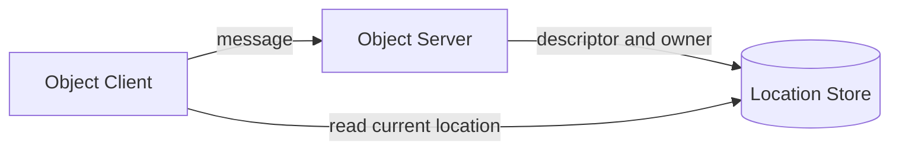

# 10. Location — 자동 연결과 Object 위치

> **이 장의 계약 소유 문서** — [Location runtime](../../../common/spec/21-location-runtime.ko.md),
> [Location Store](../../../common/spec/22-location-store-redis.ko.md)와
> [언어별 location 공개 계약](../../../common/spec/server/languages/README.ko.md)이
> 정의한다. 이 문서는 application에서 Store를 등록하고 상태를 확인하는 방법을 설명한다.

## 0. 제공하는 기능

Location Store는 MeshNode descriptor와 Actor·Spot의 현재 owner를 저장한다. Framework는 이 정보를
사용해 peer를 자동으로 연결하고 논리 ID를 현재 owner로 전달한다.



Store는 위치를 찾을 때만 사용한다. 실제 application message는 선택한 MeshNode로 직접 전송한다.

## 1. Store 등록

공식 Redis extension은 Location Store와 Relocation Store를 별도 class로 제공한다. Location Store는
작은 위치 record의 원자적 변경을 담당한다. Relocation Store는 object 이동에 필요한 immutable payload를
저장한다.

=== "C#/.NET"

    ```csharp
    services.AddZLinkFramework(options =>
    {
        options.AddLocationStore(
            new ZLinkRedisLocationStore(new ZLinkRedisLocationOptions
            {
                ConnectionString = "redis-host:6379",
                KeyPrefix = "game:location"
            }));
            // 현재 owner와 위치를 결정하는 Store를 등록한다.

        options.AddRelocationStore(
            new ZLinkRedisRelocationStore(new ZLinkRedisRelocationOptions
            {
                ConnectionString = "redis-host:6379",
                KeyPrefix = "game:relocation"
            }));
            // 이동할 state·queue·timer payload를 저장하는 Store를 별도로 등록한다.
    });
    ```

=== "C++"

    ```cpp
    // 현재 owner와 위치를 결정하는 Store를 등록한다.
    options.add_location_store (
      std::make_shared<framework::redis::redis_location_store_t> (
        framework::redis::redis_location_options_t{
          .connection_string = "redis-host:6379",
          .key_prefix = "game:location"}));

    // 이동할 state·queue·timer payload를 저장하는 Store를 별도로 등록한다.
    options.add_relocation_store (
      std::make_shared<framework::redis::redis_relocation_store_t> (
        framework::redis::redis_relocation_options_t{
          .connection_string = "redis-host:6379",
          .key_prefix = "game:relocation"}));
    ```

=== "Java"

    ```java
    // 현재 owner와 위치를 결정하는 Store를 등록한다.
    options.addLocationStore(new ZLinkRedisLocationStore(
        new ZLinkRedisLocationOptions()
            .setConnectionString("redis-host:6379")
            .setKeyPrefix("game:location")));

    // 이동할 state·queue·timer payload를 저장하는 Store를 별도로 등록한다.
    options.addRelocationStore(new ZLinkRedisRelocationStore(
        new ZLinkRedisRelocationOptions()
            .setConnectionString("redis-host:6379")
            .setKeyPrefix("game:relocation")));
    ```

=== "Kotlin"

    ```kotlin
    // 현재 owner와 위치를 결정하는 Store를 등록한다.
    options.addLocationStore(
        ZLinkRedisLocationStore(
            ZLinkRedisLocationOptions()
                .setConnectionString("redis-host:6379")
                .setKeyPrefix("game:location")))

    // 이동할 state·queue·timer payload를 저장하는 Store를 별도로 등록한다.
    options.addRelocationStore(
        ZLinkRedisRelocationStore(
            ZLinkRedisRelocationOptions()
                .setConnectionString("redis-host:6379")
                .setKeyPrefix("game:relocation")))
    ```

=== "Node/TypeScript"

    ```typescript
    // 현재 owner와 위치를 결정하는 Store를 등록한다.
    builder.addLocationStore(new ZLinkRedisLocationStore({
      url: 'redis://redis-host:6379',
      keyPrefix: 'game:location'
    }));

    // 이동할 state·queue·timer payload를 저장하는 Store를 별도로 등록한다.
    builder.addRelocationStore(new ZLinkRedisRelocationStore({
      url: 'redis://redis-host:6379',
      keyPrefix: 'game:relocation'
    }));
    ```


두 Store는 같은 Redis deployment를 사용할 수 있다. Key prefix는 서로 다르게 둔다. Framework는
cross-store transaction에 의존하지 않으므로 필요하면 물리 Redis도 분리할 수 있다.

Store를 등록한 뒤 application이 provider operation을 직접 호출하거나 dispose하지 않는다. Framework가
Store 수명과 호출 순서를 관리한다.

**어느 쪽이 필수인지는 구성이 정한다.**

| Store | 언제 필요한가 |
| --- | --- |
| Location Store | Object role이 `Client` 또는 `Server`인 MeshNode에 **필수**. 없으면 socket을 열기 전에 설정 오류로 끝난다 |
| Relocation Store | relocation policy를 가진 factory나 Instance Spot factory가 **하나라도 있으면 필수**. 전부 relocation을 끄고 Instance Spot factory도 없을 때만 없어도 된다 |

**각각 정확히 한 번 등록한다.** 둘을 하나의 등록 함수로 묶는 표면은 없고, 필요한데
누락하거나 둘 이상 등록하면 socket bind 전에 설정 오류다. Store가 없을 때 Framework가
process 안에 대체 Store를 만들어 주지 않는다 — **단일 node로 조용히 동작하지 않고
실패한다.**

## 2. 자동 연결

같은 Location Store를 사용하는 MeshNode는 descriptor를 통해 상대 endpoint와 역할을 확인한다. Automatic
RouteMesh에서는 RID가 더 작은 쪽만 연결을 시작한다. 연결 경합으로 중복 후보가 생기면 handshake와
admission에서 하나만 Ready로 유지한다.

=== "C#/.NET"

    ```csharp
    services.AddZLinkFramework(options =>
    {
        var play = options.AddRouteMesh("play")
            .Listen(5501)
            .SetRoutingIdPrefix("play");

        play.Objects().Server()
            .AddSpotFactory<RoomSpot>(
                "room",
                factory => factory.RecreateOnRelocation());

        play.Channel("play.ops").Server()
            .AddRequestHandler<NodeStatusHandler, GetNodeStatus, NodeStatus>();
    });
    ```

=== "C++"

    ```cpp
    auto play = options.add_route_mesh ("play");
    play.listen ("tcp://0.0.0.0:5501")
      .set_routing_id (zlink::routing_id_t::from (std::string ("play-1")));

    play.set_object_role (object_role_t::server)
      .add_spot_factory<room_spot_t> (
        "room",
        [] (spot_context_t context) { return std::make_shared<room_spot_t> (std::move (context)); },
        [] (auto &factory) { factory.recreate_on_relocation (); });

    play.channel_name ("play.ops").server ()
      .add_request_handler<node_status_handler_t, get_node_status_t, node_status_t> ();
    ```

=== "Java"

    ```java
    ZLinkMeshNodeBuilder play = options.addRouteMesh("play");
    play.listen(5501).setRoutingIdPrefix("play");

    play.objects().server()
        .addSpotFactory("room", RoomSpot.class, factory -> factory.recreateOnRelocation());

    play.channelName("play.ops").server()
        .addRequestHandler(NodeStatusHandler.class, GetNodeStatus.class, NodeStatus.class);
    ```

=== "Kotlin"

    ```kotlin
    val play = options.addRouteMesh("play")
    play.listen(5501).setRoutingIdPrefix("play")

    play.objects().server()
        .addSpotFactory("room", RoomSpot::class.java) { factory -> factory.recreateOnRelocation() }

    play.channelName("play.ops").server()
        .addRequestHandler(NodeStatusHandler::class.java, GetNodeStatus::class.java, NodeStatus::class.java)
    ```

=== "Node/TypeScript"

    ```typescript
    const play = builder.addRouteMesh('play');
    play.listen(5501).setRoutingIdPrefix('play');

    play.objects().server()
      .addSpotFactory('room', RoomSpot, (factory) => factory.recreateOnRelocation());

    play.channel('play.ops').server()
      .addRequestHandler(NodeStatusHandler);
    ```


Application은 Actor·Spot을 생성할 target Node RID나 endpoint를 지정하지 않는다. Framework가 stable type,
Serving 상태, capacity와 placement weight를 확인해 eligible node를 선택한다.

Manual peer를 하나라도 사용한 host에서는 host relocation을 지원하지 않는다. 자동 연결과 수동 연결을
같은 MeshNode에서 섞지 않는다.

## 3. Location 옵션

`ConfigureLocations()`는 lease, route cache와 relocation 실행 상한을 설정한다.

=== "C#/.NET"

    ```csharp
    var location = options.ConfigureLocations();
    location.OwnerLeaseRenewInterval = TimeSpan.FromSeconds(5);
    location.OwnerLeaseTtl = TimeSpan.FromSeconds(15);
    location.MessageFollowDuration = TimeSpan.FromSeconds(30);
    location.MaxActiveOutboundRelocations = 64;
    location.MaxActiveInboundRelocations = 64;
    location.MaxRelocationPayloadInFlightBytes = 256L * 1024 * 1024;
    ```

=== "C++"

    ```cpp
    auto &location = options.configure_locations ();
    location.owner_lease_renew_interval = std::chrono::seconds (5);
    location.owner_lease_ttl = std::chrono::seconds (15);
    location.message_follow_duration = std::chrono::seconds (30);
    location.max_active_outbound_relocations = 64;
    location.max_active_inbound_relocations = 64;
    location.max_relocation_payload_in_flight_bytes = 256LL * 1024 * 1024;
    ```

=== "Java"

    ```java
    ZLinkLocationOptions location = options.configureLocations();
    location.setOwnerLeaseRenewInterval(Duration.ofSeconds(5));
    location.setOwnerLeaseTtl(Duration.ofSeconds(15));
    location.setMessageFollowDuration(Duration.ofSeconds(30));
    location.setMaxActiveOutboundRelocations(64);
    location.setMaxActiveInboundRelocations(64);
    location.setMaxRelocationPayloadInFlightBytes(256L * 1024 * 1024);
    ```

=== "Kotlin"

    ```kotlin
    val location = options.configureLocations()
    location.setOwnerLeaseRenewInterval(Duration.ofSeconds(5))
    location.setOwnerLeaseTtl(Duration.ofSeconds(15))
    location.setMessageFollowDuration(Duration.ofSeconds(30))
    location.setMaxActiveOutboundRelocations(64)
    location.setMaxActiveInboundRelocations(64)
    location.setMaxRelocationPayloadInFlightBytes(256L * 1024 * 1024)
    ```

=== "Node/TypeScript"

    ```typescript
    const location = builder.configureLocations();
    location.ownerLeaseRenewIntervalMs = 5_000;
    location.ownerLeaseTtlMs = 15_000;
    location.messageFollowDurationMs = 30_000;
    location.maxActiveOutboundRelocations = 64;
    location.maxActiveInboundRelocations = 64;
    location.maxRelocationPayloadInFlightBytes = 256 * 1024 * 1024;
    ```


| 옵션 | 기본값 | 의미 |
|---|---:|---|
| `OwnerLeaseRenewInterval` | 5초 | owner lease 갱신 주기 |
| `OwnerLeaseTtl` | 15초 | 갱신이 중단된 owner를 만료로 판단하는 시간 |
| `OwnerLeaseRenewTimeout` | 3초 | 갱신 요청 하나를 기다리는 상한 |
| `OwnerLeaseFencingMargin` | 5초 | 만료 전에 새 작업을 미리 끊는 여유 |
| `PollingInterval` | 1초 | change watch가 없을 때 Store를 다시 읽는 주기 |
| `StoreFailureGrace` | 30초 | Store 장애 중 마지막 route 판단을 유지하는 시간 |
| `RouteCacheMaxAge` | 15초 | cached route를 다시 확인하기 전 최대 시간 |
| `MessageFollowDuration` | 30초 | 이동 전 owner가 새 owner로 메시지를 relay하는 기간 |
| `MaxActiveOutboundRelocations` | 64 | process에서 동시에 내보내는 relocation unit 상한 |
| `MaxActiveInboundRelocations` | 64 | process에서 동시에 복원하는 relocation unit 상한 |
| `MaxRelocationPayloadInFlightBytes` | 256 MiB | process 전체 encoded payload 상한 |

**lease 값 넷은 서로 묶여 있다.** 다음 관계를 어기면 startup error다. 값을 바꿀 때는
넷을 함께 본다.

```text
갱신 주기 + 갱신 timeout < owner lease TTL - fencing margin
```

기본값으로는 `5 + 3 < 15 - 5`가 성립한다. TTL만 줄이거나 갱신 주기만 늘리면 이 부등식이
깨진다. 모든 값은 양수여야 한다.

**Store 장애 중에 일어나는 일은 둘로 갈린다.** `StoreFailureGrace`는 마지막으로 완전히
읽은 node 목록을 유지해 주는 시간이지, **owner 자격을 연장해 주는 시간이 아니다.**

| grace 동안 | 결과 |
| --- | --- |
| 이미 맺은 연결 | 상태 판단을 계속한다 |
| 새 outbound 연결 | 만들지 않는다. grace가 끝나도 node 목록 전체를 같은 시점으로 다시 읽기 전에는 만들지 않는다 |
| owner lease · relocation deadline | **연장되지 않는다** |

lease 갱신이 끊긴 host는 계산해 둔 시각을 넘는 순간 **새 작업을 받지 않는다** — state를
바꾸는 message와 timer 시작, factory·restore 결과 확정, relocation 상태 변경과 수용 공간
확보가 모두 막힌다. 이미 queue에 들어온 작업의 마무리와 정리는 계속한다. 새 owner와 옛
owner가 동시에 쓰는 것을 막는 장치다.

Capture·Restore callback 상한은
[언어별 location option 계약](../../../common/spec/server/languages/README.ko.md)을
따른다.

## 4. readiness와 운영 조회

운영 코드는 location readiness 표면으로 필요한 peer가 Ready인지 확인한다. 전체 상태와 paged
topology는 location runtime query로 조회한다.

=== "C#/.NET"

    ```csharp
    app.MapGet("/ops/location", async (
        IZLinkLocationReadiness readiness,
        IZLinkLocationRuntimeQuery query,
        CancellationToken ct) =>
    {
        var status = await query.GetStatusAsync(ct);
        var page = await query.ListTopologyAsync(
            new ZLinkLocationTopologyFilter(MeshName: "play"),
            new ZLinkPageRequest(PageSize: 100),
            ct);

        var objectPeerReady = await readiness.IsPeerReadyAsync(
            "play",
            ZLinkLocationRole.Spot,
            cancellationToken: ct);

        return Results.Ok(new
        {
            status.StoreHealthy,
            status.OwnerLeaseHealthy,
            objectPeerReady,
            topology = page.Items
        });
    });
    ```

=== "C++"

    ```cpp
    auto status = co_await query.get_status ();
    auto page = co_await query.list_topology (
      location_topology_filter_t{.mesh_name = "play"},
      location_page_request_t{.page_size = 100});

    auto object_peer_ready = co_await readiness.is_peer_ready ("play", location_role_t::spot);

    // status.store_healthy · status.owner_lease_healthy · object_peer_ready · page.items를
    // 운영 endpoint의 응답으로 조립한다.
    ```

=== "Java"

    ```java
    ZLinkLocationRuntimeStatus status = query.getStatus().toCompletableFuture().join();
    ZLinkLocationPage<ZLinkLocationTopologyEntry> page = query
        .listTopology(new ZLinkLocationTopologyFilter("play"), new ZLinkPageRequest(100))
        .toCompletableFuture().join();

    boolean objectPeerReady = readiness
        .isPeerReady("play", ZLinkLocationRole.SPOT, null)
        .toCompletableFuture().join();

    // status.storeHealthy() · status.ownerLeaseHealthy() · objectPeerReady · page.items()를
    // 운영 endpoint의 응답으로 조립한다.
    ```

=== "Kotlin"

    ```kotlin
    val status = query.getStatus().await()
    val page = query
        .listTopology(ZLinkLocationTopologyFilter("play"), ZLinkPageRequest(100))
        .await()

    val objectPeerReady = readiness.isPeerReady("play", ZLinkLocationRole.SPOT, null).await()

    // status.storeHealthy() · status.ownerLeaseHealthy() · objectPeerReady · page.items()를
    // 운영 endpoint의 응답으로 조립한다.
    ```

=== "Node/TypeScript"

    ```typescript
    const status = await query.getStatus();
    const page = await query.listTopology({ meshName: 'play' }, { pageSize: 100 });

    const objectPeerReady = await readiness.isPeerReady('play', ZLinkLocationRole.Spot);

    // status.storeHealthy · status.ownerLeaseHealthy · objectPeerReady · page.items를
    // 운영 endpoint의 응답으로 조립한다.
    ```


운영 query는 health와 사람이 확인할 topology만 반환한다. Store key, authority version, owner token과
relocation record는 Framework 내부 정보이므로 반환하지 않는다. `NodeRid`는 실제 transport node를
운영 정보와 대응할 때만 사용한다.

## 5. Actor와 Spot 조회

업무 코드는 global ActorId와 SpotId를 사용한다. Manager의 `Find(...)`는 현재 Ready object만
반환한다.

=== "C#/.NET"

    ```csharp
    ActorRef? actor = await actorManager.FindAsync("player-1", ct);
    SpotRef? room = await spotManager.FindAsync("room-42", ct);

    if (room is not null)
    {
        await spotClient
            .RequestToSpot(room.Value.SpotId, new GetRoomState())
            .Async<RoomState>(ct);
    }
    ```

=== "C++"

    ```cpp
    auto actor = co_await actor_manager.find ("player-1");
    auto room = co_await spot_manager.find ("room-42");

    if (room) {
        co_await spot_outbound.request_to_spot (room.value ().spot_id (), get_room_state_t{})
          .submit<room_state_t> ();
    }
    ```

=== "Java"

    ```java
    ActorRef actor = actorManager.find("player-1").toCompletableFuture().join();
    SpotRef room = spotManager.find("room-42").toCompletableFuture().join();

    if (room != null) {
        spotClient
            .requestToSpot(room.spotId(), new GetRoomState())
            .submit(RoomState.class)
            .toCompletableFuture().join();
    }
    ```

=== "Kotlin"

    ```kotlin
    val actor = actorManager.find("player-1").await()
    val room = spotManager.find("room-42").await()

    if (room != null) {
        spotClient
            .requestToSpot(room.spotId(), GetRoomState())
            .submit(RoomState::class.java)
            .await()
    }
    ```

=== "Node/TypeScript"

    ```typescript
    const actor = await actorManager.find('player-1');
    const room = await spotManager.find('room-42');

    if (room !== undefined) {
      await spotClient
        .requestToSpot(room.spotId, getRoomState())
        .submit<RoomState>();
    }
    ```


일반 메시징은 `SpotRef.NodeRid`를 target으로 사용하지 않는다. spot client와 actor client가
Location Store에서 current owner를 확인하고 이동 중에는 Message Follow 규칙을
적용한다. `SpotRef`와 `ActorRef`는 exact generation을 닫거나 삭제할 때 사용한다.

## 6. 관련 문서

- 이 챕터 계약의 실행 검증 예문: `13. Interface 카탈로그` 장 §6 — 검증 클래스 `LocationContracts`
- 정식 계약: [Location runtime](../../../common/spec/21-location-runtime.ko.md)
- 자동 연결이 없는 수동 연결: [05-channel-messaging §6](05-channel-messaging.ko.md#6-연결-제어)
- Host relocate와 drain 관측: [12-operations](12-operations.ko.md)
