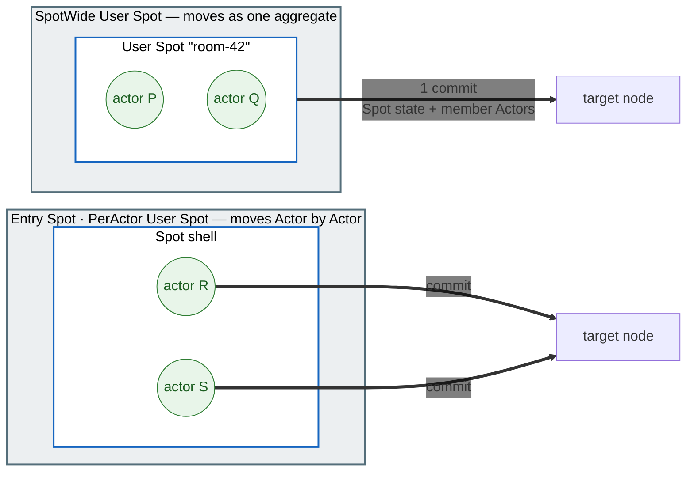
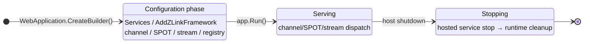

# 12. Operations — Runtime Metrics · Graceful Drain · Readiness

> **The documents that own this chapter's contract** — owned by the common spec
> [Runtime state query and operational diagnostics](../../../common/spec/24-runtime-monitoring.ko.md),
> [Runtime metrics](../../../common/spec/25-runtime-metrics.ko.md), and
> [Graceful Drain & Handoff](../../../common/spec/28-graceful-drain-handoff.ko.md). The
> formal definition of each language's surface is owned by the
> [per-language topology/monitoring public contract](../../../common/spec/server/languages/README.ko.md).
> This chapter focuses on usage — what you actually wire up and declare in an operational
> environment.

## 0. What It Provides

Once a service goes into operation, beyond the event observation covered in the `11.
Monitoring` chapter, you need the following.

1. **Metrics** — see numbers like CCU, queue depth, and request latency on a dashboard.
2. **Graceful drain** — clean up a node being taken down for a deployment or scale-in
   without dropping connected users.
3. **Readiness** — tell the deployment infrastructure "is this node allowed to accept new
   requests."

The framework provides the metric instruments and the drain procedure at host shutdown. The
app wires the meter name into its collection pipeline, and composes the readiness endpoint
the deployment environment calls out of the public runtime query API.

Terms that appear for the first time:

| Term | One-line explanation |
|---|---|
| Meter / instrument | A language-standard metric emission unit. counter, gauge, and histogram are instruments |
| OpenTelemetry (OTel) | The standard for collecting metrics/traces. Exported via Prometheus and other exporters |
| Relocate | The operation that moves a stateful object to a compatible target and puts the host into `Relocated` state |
| Shutdown | The operation that performs bounded cleanup of local resources with no new relocation |
| Readiness probe | The deployment infrastructure's status check asking "is it OK to accept new requests" |

## 1. Runtime Metrics

The framework emits every instrument through one `System.Diagnostics.Metrics.Meter` named
`"zlink.framework"`. The app registers this canonical meter name in its collection pipeline.

=== "C#/.NET"

    ```csharp
    // This one line brings every zlink instrument into the app's OTel pipeline.
    builder.Services.AddOpenTelemetry().WithMetrics(m => m
        .AddMeter("zlink.framework") // The canonical meter name the Framework emits instruments through.
        .AddPrometheusExporter());
    ```

=== "C++"

    ```cpp
    // C++ has no language-standard metrics pipeline, so read directly from the monitoring
    // surface and hand it to the app's exporter. The instrument names match the other languages.
    auto status = runtime.status ();
    // Send status's inbound_dispatch value out through the app's exporter.
    ```

=== "Java"

    ```java
    // Wire the zlink instruments into whatever registry the app uses, such as Micrometer.
    // "zlink.framework" is the canonical meter name the Framework emits instruments through.
    Metrics.addRegistry(prometheusRegistry);
    ```

=== "Kotlin"

    ```kotlin
    // Kotlin uses the same registry as Java.
    // "zlink.framework" is the canonical meter name the Framework emits instruments through.
    Metrics.addRegistry(prometheusRegistry)
    ```

=== "Node/TypeScript"

    ```typescript
    // Wire the zlink meter into the OpenTelemetry Node SDK.
    // "zlink.framework" is the canonical meter name the Framework emits instruments through.
    const meterProvider = new MeterProvider({ readers: [prometheusExporter] });
    meterProvider.getMeter('zlink.framework');
    ```


- There's no zlink-specific metrics API. Each language's standard metrics API is the surface
  as-is. To collect without OTel, subscribe directly to the meter name `"zlink.framework"`
  from a `MeterListener`.
- If no listener is attached at all, an instrument update ends on a minimal-cost inactive
  path. Registering an instrument without turning it on has no effect on messaging
  performance.
- Choosing a dashboard and exporter is the app's job. The framework doesn't bundle a scrape
  server.

The instrument catalog is below. The labels, units, and kinds of the MeshNode,
object/STREAM, and location/fanout instruments are set by
[Runtime Metrics §§3-5](../../../common/spec/25-runtime-metrics.ko.md), and the drain
instruments by
[Host Relocate and Shutdown §13](../../../common/spec/28-graceful-drain-handoff.ko.md#13-관측-정보).

| Instrument | What it measures |
|---|---|
| `zlink.stream.connections.active` | Active STREAM connection count (CCU) |
| `zlink.stream.connections.opened` | Cumulative STREAM connections started |
| `zlink.stream.connections.closed` | Cumulative STREAM connections closed |
| `zlink.spot.count` | Active spot count |
| `zlink.actor.count` | Active Actor count |
| `zlink.relocation.started` | Cumulative Actor/User/Instance Spot relocations started |
| `zlink.relocation.completed` | Cumulative relocation terminal results |
| `zlink.relocation.duration` | Time from prepare to the terminal phase |
| `zlink.relocation.bytes` | Size of the immutable relocation envelope |
| `zlink.instance_spot.activations` | Cumulative Instance Spot activation results |
| `zlink.instance_spot.activation.duration` | Time from first address resolution to Ready or terminal failure |
| `zlink.instance_spot.pending.messages` | Number of messages waiting at the activation barrier |
| `zlink.instance_spot.pending.bytes` | Payload bytes reserved at the activation barrier |
| `zlink.instance_spot.claim.conflicts` | Cumulative Instance location claim conflicts |
| `zlink.mesh_node.peers.configured` | Peer count present in the descriptor |
| `zlink.mesh_node.peers.connected` | Peer count with transport connected |
| `zlink.mesh_node.peers.ready` | Peer count that passed admission and handler readiness |
| `zlink.mesh_node.channels.ready_members` | Member count available for ChannelName select-one |
| `zlink.mesh_node.channel.selection_failures` | Count of times no member was available for select-one |
| `zlink.mesh_node.requests.inflight` | Requests currently waiting for a reply |
| `zlink.mesh_node.request.duration` | Time from request submit to terminal completion |
| `zlink.mesh_node.request.timeouts` | Cumulative request timeouts |
| `zlink.mesh_node.messages.dropped` | Cumulative one-way drops with a cause confirmed by the Framework |
| `zlink.fanout.published` | Cumulative classic fanout publishes |
| `zlink.fanout.received` | Cumulative classic fanout receives |
| `zlink.fanout.dropped` | Cumulative classic fanout drops with a cause confirmed by the Framework |
| `zlink.location.store.errors` | Cumulative Redis read/write/lease failures |
| `zlink.location.owner_lease.renew.failures` | Cumulative owner lease renewal failures |
| `zlink.location.owner_lease.renew.lateness` | Owner lease renewal delay versus the scheduled time |
| `zlink.observability.events.overflow` | Cumulative monitoring/trace observer queue overflows |
| `zlink.host.state` | The current host Framework runtime state |
| `zlink.host.relocation.duration` | Time from starting Host `Relocate` to the terminal result |
| `zlink.host.relocation.blocked` | Count of host `Relocate` calls that ended in `Blocked` |
| `zlink.host.shutdown.duration` | Time from starting Host `Shutdown` to the terminal result |
| `zlink.host.shutdown.forced` | Count of host `Shutdown` calls that ended via bounded teardown |

## 2. Relocate — Moving To Another Host While Keeping State

`Relocate(...)` moves every User Spot, Instance Spot, and Actor alive on this host to another
Serving node. It's an operation that targets the whole host, and the call itself doesn't
terminate the host.

**What's preserved.** This means what the client and other nodes were using stays exactly as
it was after the move.

| What's preserved | Meaning |
| --- | --- |
| SpotId/ActorId and `ObjectGeneration` | The logical ID the caller was using doesn't change. There's no need to re-announce the address |
| A not-yet-executed message and the accepted journal | Work still sitting in the queue at seal time resumes execution on the target |
| Timer registration and pending ticks | The name, period, options, and schedule cursor move together, so the target doesn't re-register them |
| Application state | Moved through the `Capture`/`Restore` of the relocation adapter registered on the factory |
| A bound STREAM session's route | The client session is left alone, and the route is changed to point at the new owner |

The procedure:

1. Preflight confirms every stateful object, target capability/capacity, and the Relocation
   Store. If there's no eligible target, it ends in `Blocked` without changing source
   admission.
2. Publishes the host as `Relocating` and schedules an infrastructure notification on the
   standalone Actor's, Instance Spot's, and User Spot aggregate's execution queue.
3. When the notification reaches a turn boundary, only the currently executing turn finishes
   on the source. Only a ready unit that obtained outbound/inbound, `Capture`/`Restore`, and
   the encoded-payload permit seals its queue. A unit that couldn't obtain the permit keeps
   processing application messages and timers on the source.
4. At seal time, the message that didn't run, the accepted journal, the logical timer
   registration/pending tick, and the optional Snapshot bytes are saved to the immutable
   relocation root. Target factory/`Restore` and journal staging finish before the
   owner/membership commit.
5. A `SpotWide` User Spot and its member Actors change owner/membership together in one
   aggregate commit. An Entry Spot's and a `PerActor` User Spot's Actors are each moved
   individually. Infrastructure relocation doesn't call the application's join/leave
   callbacks.
6. Restores the frozen queue/timer on the target and relays the source hold to the target
   after sealing. Opens target admission once source cleanup, `Completed`, the bound STREAM
   route ACK, and steady normalization finish.
7. Once every unit has detached from source dispatch, the host transitions to `Relocated`.
   Connections and infrastructure stay up until `Shutdown(...)` is called.

A failure before the first relocation commit can restore the source queue and admission.
After the first commit, there's no rollback to the source — target recovery continues, and
exceeding the deadline ends in `ForceStopped`.

### 2.1 Move Unit Per Execution Mode

Even within the same host, what gets bundled into one unit to move differs by Spot kind and
execution mode. A `SpotWide` User Spot is a single aggregate together with its member Actors,
so it commits together. An Entry Spot's and a `PerActor` User Spot's Actors are each an
independent unit, so they move Actor by Actor, and in this case the Spot instance is a shell
that doesn't carry state.



So a `PerActor` User Spot's factory can only use `RecreateOnRelocation()` as its relocation
approach. Each member Actor's factory decides its own policy separately. An Instance Spot has
no Actor, so one Spot is directly the move unit.

## 3. Shutdown — Terminating Without Moving

`Shutdown(...)` terminates this host. Unlike §2, **it doesn't move state to another node.**

Calling it starts no new relocation; work already in progress either finishes within the
given deadline or is settled as a failure. It then notifies the Entry, User, and Instance
Spots' `OnClosing` with the `HostShutdown` reason, and once that callback finishes, cleans up
scope, authority, session, and topology resources. If no deadline is given, it's 30 seconds.

The state of any Spot cleaned up here doesn't survive. If your deployment automation needs to
keep state alive while taking a host down, call `Relocate(...)` first before shutting down,
confirm the result is `Relocated`, and only then move on to this call (the example in §4).

A Spot's lifetime is independent of any request. A User/Instance Spot isn't closed just
because an ordinary request finished. Likewise, preparing a nonexistent Instance Spot never
starts from a separate address or manager create — only from attaching Instance intent to a
SpotId direct call ([06-spot](06-spot.ko.md) §5).

## 4. Wiring Operational Calls And Readiness

The two operations above don't happen automatically. The application calls them directly on
the framework runtime. This interface is a DI singleton that owns host maintenance.

The order used in deployment is "move first, and shut down only if it succeeded."

=== "C#/.NET"

    ```csharp
    var runtime = app.Services.GetRequiredService<IZLinkFrameworkRuntime>();
    var result = await runtime.RelocateAsync(
        new ZLinkFrameworkRelocationOptions
        {
            Mode = ZLinkFrameworkRelocationMode.RollingUpdate,
            TargetApplicationVersion = 12,      // Uses only eligible nodes on the specified new version.
            Deadline = TimeSpan.FromSeconds(25)
        },
        cancellationToken: ct);

    if (result.Outcome == ZLinkFrameworkRelocationOutcome.Relocated)
        await runtime.ShutdownAsync(TimeSpan.FromSeconds(10), ct);
    else
        Console.Error.WriteLine($"host relocation blocked: {result.Reason}");
    ```

=== "C++"

    ```cpp
    relocation_options_t relocation;
    relocation.mode = relocation_mode_t::rolling_update;
    relocation.target_application_version = 12;              // Uses only eligible nodes on the specified new version.
    relocation.deadline = std::chrono::seconds (25);

    auto result = co_await runtime.relocate (relocation);
    if (result.outcome == relocation_outcome_t::relocated)
        co_await runtime.shutdown (std::chrono::seconds (10));
    else
        _logger.error ("host relocation blocked");
    ```

=== "Java"

    ```java
    ZLinkFrameworkRelocationResult result = runtime.relocate(
        new ZLinkFrameworkRelocationOptions(
            ZLinkFrameworkRelocationMode.ROLLING_UPDATE,
            12L,                            // Uses only eligible nodes on the specified new version.
            Duration.ofSeconds(25)))
        .toCompletableFuture().join();

    if (result.outcome() == ZLinkFrameworkRelocationOutcome.RELOCATED) {
        runtime.shutdown(Duration.ofSeconds(10)).toCompletableFuture().join();
    } else {
        logger.error("host relocation blocked: {}", result.reason());
    }
    ```

=== "Kotlin"

    ```kotlin
    val result = runtime.relocate(
        ZLinkFrameworkRelocationOptions(
            ZLinkFrameworkRelocationMode.ROLLING_UPDATE,
            12L,                            // Uses only eligible nodes on the specified new version.
            Duration.ofSeconds(25)))
        .await()

    if (result.outcome() == ZLinkFrameworkRelocationOutcome.RELOCATED) {
        runtime.shutdown(Duration.ofSeconds(10)).await()
    } else {
        logger.error("host relocation blocked: {}", result.reason())
    }
    ```

=== "Node/TypeScript"

    ```typescript
    const result = await runtime.relocate({
      mode: ZLinkFrameworkRelocationMode.RollingUpdate,
      targetApplicationVersion: 12n,   // Uses only eligible nodes on the specified new version.
      deadlineMs: 25_000
    });

    if (result.outcome === ZLinkFrameworkRelocationOutcome.Relocated) {
      await runtime.shutdown({ deadlineMs: 10_000 });
    } else {
      logger.error(`host relocation blocked: ${result.reason}`);
    }
    ```


`PlannedMaintenance` uses only a target on the same application version as the source.
`RollingUpdate` requires a `TargetApplicationVersion` greater than the source's, and uses
only a target exactly at that version. If there's no eligible target, it waits until the
deadline and then returns `Blocked/TargetUnavailable`. Cancellation ends only that waiter —
a shared lifecycle operation that's already started keeps running.

Readiness checks both the host framework runtime's readiness and the readiness of any
business-required component runtime, together, and wires them to an existing HTTP endpoint.

=== "C#/.NET"

    ```csharp
    app.MapGet("/healthz/ready", (IZLinkFrameworkRuntime runtime) =>
        runtime.Status.IsReady
            ? Results.Ok()
            : Results.StatusCode(StatusCodes.Status503ServiceUnavailable));
    ```

=== "C++"

    ```cpp
    // The readiness endpoint looks only at the host runtime's status.
    const bool ready = runtime.status ().is_ready;
    // Respond 503 if ready is false.
    ```

=== "Java"

    ```java
    // The readiness endpoint looks only at the host runtime's status.
    boolean ready = runtime.status().isReady();
    // Respond 503 if ready is false.
    ```

=== "Kotlin"

    ```kotlin
    // The readiness endpoint looks only at the host runtime's status.
    val ready = runtime.status().isReady
    // Respond 503 if ready is false.
    ```

=== "Node/TypeScript"

    ```typescript
    // The readiness endpoint looks only at the host runtime's status.
    const ready = runtime.status.isReady;
    // Respond 503 if ready is false.
    ```


Wired into a Kubernetes deployment, it becomes this concept.

```yaml
# readiness probe → /healthz/ready — excluded from new-traffic targets the moment Draining starts
# preStop hook + terminationGracePeriodSeconds >= drain deadline — secures time for auto-drain to finish
```

### 4.1 Calling It Again Or Overlapping Calls

Deployment automation retries on failure. So **what happens when you make the same call
twice** is defined by contract.

| Situation | Result |
| --- | --- |
| `Relocate` called again with the same mode while one is in flight | Shares the deadline with the first operation. The later call doesn't extend the deadline |
| `Relocate` called again with a different mode while one is in flight | `Blocked` with no wait — meaning an operation is already in progress |
| `Relocate` called again after `Blocked` | `Blocked` isn't stored, so it re-checks the host's condition from scratch. **This is the only result where retrying is meaningful** |
| `Relocate` called again after `Relocated` | Returns the original success result as-is. Doesn't move again |
| `Shutdown` called again while one is in flight | Shares the same operation and stores the terminal result |
| `Shutdown` called again after `Stopped` | Returns the stored result |
| `Relocate` called while starting up, or in an error/stopped state | `Blocked` without touching admission |

**A caller's cancellation ends only that call.** The shared operation itself isn't
cancelled.

**`Shutdown` is never blocked.** It proceeds even with no target, insufficient capacity, or
no Relocation Store. So if `Shutdown` gets confirmed while something is waiting on
`Relocate`, the waiter ends in `Blocked` — this is why you must keep to the order "move
first, confirm success, then shut down."

If `Shutdown` doesn't finish within its deadline, it performs only bounded cleanup and ends
in a forced-termination result. A deadline overrun and a callback failure are distinguished
by different result values.

### 4.2 What Stays Alive During A Transition

`Relocating`, `Relocated`, and `Draining` aren't "accepting nothing" states. **Only starting
something new is blocked — what's already accepted is processed through to completion.**

| | `Relocating` | `Relocated` | `Draining` |
| --- | --- | --- | --- |
| Selection by channel name | Excluded from new selection. The existing owner path is kept | Excluded from new selection | New admission closed |
| A request that directly names a node | Accepted until the unit seals | Not accepted | Ends with the shutdown result |
| Spot/Actor creation and join | Rejected | Rejected | Rejected |
| STREAM | New binding excluded. An existing session is handled via a barrier | New binding excluded | New session not accepted |
| An already-accepted request | Ends **exactly once**, via reply, error, timeout, or shutdown | Same | Same |

**Monitoring or observer callbacks never hold up termination.** Even if code observing
status runs for a long time, maintenance never waits for it.

## 5. MeshNode Runtime Control And Observation

A MeshNode registered with `AddRouteMesh` is operated through two DI singletons.

**Runtime options.** Values that can be changed while serving are below. The remaining
socket options (HWM, timeout) are exclusive to `ConfigureRouterSocket()` before startup.

=== "C#/.NET"

    ```csharp
    var meshOptions = app.Services.GetRequiredService<IZLinkRouteMeshRuntimeOptions>();
    meshOptions.Mesh("game.room").PlacementWeight = 0; // Excludes it from new object placement
    meshOptions.Channel("game.room").Weight = 0;       // Excludes it from new channel select-one
    ```

=== "C++"

    ```cpp
    mesh_options.placement_weight (0);              // Excludes it from new object placement
    mesh_options.channel ("game.room").weight (0);  // Excludes it from new channel select-one
    ```

=== "Java"

    ```java
    meshOptions.mesh("game.room").setPlacementWeight(0); // Excludes it from new object placement
    meshOptions.channel("game.room").setWeight(0);      // Excludes it from new channel select-one
    ```

=== "Kotlin"

    ```kotlin
    meshOptions.mesh("game.room").setPlacementWeight(0) // Excludes it from new object placement
    meshOptions.channel("game.room").setWeight(0)      // Excludes it from new channel select-one
    ```

=== "Node/TypeScript"

    ```typescript
    meshOptions.mesh('game.room').placementWeight = 0; // Excludes it from new object placement
    meshOptions.channel('game.room').weight = 0;       // Excludes it from new channel select-one
    ```


The two weights are independent and take effect on new selections while running. Placement
weight is used only for Actor/Spot create and relocation target selection. Channel weight is
used only for selecting new select-one targets for that server membership. Looking up an
unregistered mesh or membership is a configuration error.

**Status query — RouteMesh runtime.** Provides one consistent snapshot and an ordered
component event stream for one mesh. Host termination is owned by the framework runtime.

=== "C#/.NET"

    ```csharp
    var meshRuntime = app.Services.GetRequiredService<IZLinkRouteMeshRuntime>();

    var status = meshRuntime.GetStatus("game.room"); // The immutable current status of nodes/peers/channels
    var ready = status.IsReady;

    await foreach (var observed in meshRuntime.ObserveAsync("game.room", cancellationToken: ct))
    {
        // observed.Status carries state/peer transitions in Sequence order.
        // observed.Loss is how many this observer missed — see the shared rule in 11-monitoring §2.
    }
    ```

=== "C++"

    ```cpp
    // The immutable current status of nodes/peers/channels
    auto snapshot = mesh_runtime.snapshot ("game.room");
    const bool ready = mesh_runtime.is_ready ("game.room");

    // State/peer transitions arrive in order. A slow observer is skipped past once it exceeds capacity.
    auto observation = mesh_runtime.observe (
      "game.room", 64,
      [] (const observed_status_t<mesh_node_snapshot_t> &observed) {
          record (observed.status);
          //  observed.loss is how many this observer missed.
      });
    ```

=== "Java"

    ```java
    // The immutable current status of nodes/peers/channels
    ZLinkMeshNodeSnapshot snapshot = meshRuntime.snapshot("game.room");
    boolean ready = meshRuntime.isReady("game.room");

    // The subscriber receives a ZLinkObservedStatus<ZLinkMeshNodeSnapshot>.
    // status() carries the transition, loss() the missed count — shared rule in the `11. Monitoring` chapter §2.
    meshRuntime.observe("game.room", 64).subscribe(subscriber);
    ```

=== "Kotlin"

    ```kotlin
    // The immutable current status of nodes/peers/channels
    val snapshot = meshRuntime.snapshot("game.room")
    val ready = meshRuntime.isReady("game.room")

    // The subscriber receives a ZLinkObservedStatus<ZLinkMeshNodeSnapshot>.
    // status() carries the transition, loss() the missed count — shared rule in the `11. Monitoring` chapter §2.
    meshRuntime.observe("game.room", 64).subscribe(subscriber)
    ```

=== "Node/TypeScript"

    ```typescript
    // The immutable current status of nodes/peers/channels
    const snapshot = meshRuntime.snapshot('game.room');
    const ready = meshRuntime.isReady('game.room');

    for await (const observed of meshRuntime.observe('game.room', 64, signal)) {
      // observed.status carries the transition, observed.loss the missed count —
      // see the shared rule in the `11. Monitoring` chapter §2.
    }
    ```


## 6. Host Lifecycle

The Framework runtime is tied to the host's start/stop as its **lifecycle service.** The
channel/SPOT/STREAM runtime is created based on the roles registered at startup, and cleaned
up at shutdown.



- **Configuration phase** — finish every declaration before `app.Run()`. A bad configuration
  is rejected as an exception at host startup.
- **Stopping** — once the host shutdown signal arrives, it goes down in the order hosted
  service `stop()` → channel/SPOT/STREAM runtime cleanup.
- Fold background work into the same lifecycle using the host's standard lifecycle service.

### 6.1 Observing Status

Host `Relocate`/`Shutdown` state transitions are observed through the framework runtime's
bounded status stream. The per-MeshName runtime provides a component snapshot, but doesn't
create a separate termination authority or partial-drain operation.

=== "C#/.NET"

    ```csharp
    var runtime = app.Services.GetRequiredService<IZLinkFrameworkRuntime>();

    await foreach (var observed in runtime.ObserveAsync(cancellationToken: ct))
    {
        // Records the whole-host state, effective intent, and terminal outcome in sequence order.
        var hostEvent = observed.Status;
        logger.LogInformation(
            "host lifecycle: {State} {Relocation} {Termination}",
            hostEvent.State,
            hostEvent.RelocationResult,
            hostEvent.TerminationResult);
    }
    ```

=== "C++"

    ```cpp
    // Records the whole-host state, effective intent, and terminal outcome in order.
    auto observation = runtime.observe (
      64, [&] (const observed_status_t<framework_runtime_status_t> &observed) {
          _logger.info ("host lifecycle state changed");
          //  observed.status is the state, observed.loss the missed count.
      });
    ```

=== "Java"

    ```java
    // Records the whole-host state, effective intent, and terminal outcome in sequence order.
    runtime.observe().subscribe(new Flow.Subscriber<ZLinkObservedStatus<ZLinkFrameworkRuntimeStatus>>() {
        @Override
        public void onNext(ZLinkObservedStatus<ZLinkFrameworkRuntimeStatus> observed) {
            ZLinkFrameworkRuntimeStatus status = observed.status();
            logger.info("host lifecycle: {} {} {}",
                status.state(), status.relocationResult(), status.terminationResult());
        }
        // onSubscribe, onError, onComplete omitted.
    });
    ```

=== "Kotlin"

    ```kotlin
    // Records the whole-host state, effective intent, and terminal outcome in sequence order.
    runtime.observe().asFlow().collect { observed ->
        val status = observed.status()
        logger.info("host lifecycle: {} {} {}",
            status.state(), status.relocationResult(), status.terminationResult())
    }
    ```

=== "Node/TypeScript"

    ```typescript
    for await (const observed of runtime.observe(signal)) {
      // Records the whole-host state, effective intent, and terminal outcome in sequence order.
      const status = observed.status;
      logger.log(
        `host lifecycle: ${status.state} ${status.relocationResult} ${status.terminationResult}`
      );
    }
    ```


Observe the seven host lifecycle states as-is (preparing, serving, relocating, relocated,
draining, stopped, error). The notation follows the language. The status's relocation/
termination results must match that operation's terminal result. To view it as numbers, use
the `zlink.host.*` instruments from §1.

## 7. Related Documents

- Runnable verification examples for this chapter's contract: `13. Interface Catalog`
  chapter §7 — the verification class `FrameworkRuntimeContracts`
- The formal contract:
  [Host Relocate and Shutdown](../../../common/spec/28-graceful-drain-handoff.ko.md) ·
  [Runtime Metrics](../../../common/spec/25-runtime-metrics.ko.md)
- Status observation and diagnostics: the `11. Monitoring` chapter
- The Spot where the application decides the relocation boundary:
  [06-spot §7](06-spot.ko.md#7-relocation을-시작해도-되는-시점-알리기)
