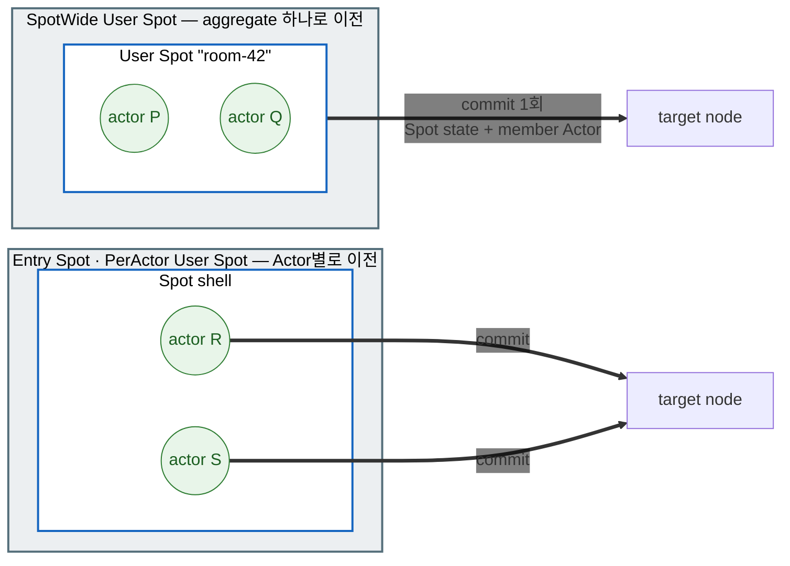
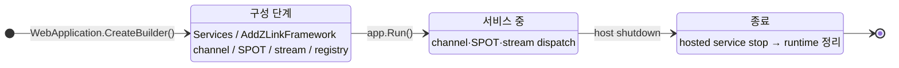

# 12. 운영 — 런타임 메트릭 · graceful drain · readiness

> **이 장의 계약 소유 문서** — 공통 스펙
> [Runtime 상태 조회와 운영 진단](../../../common/spec/24-runtime-monitoring.ko.md),
> [런타임 메트릭](../../../common/spec/25-runtime-metrics.ko.md)과
> [Graceful Drain & Handoff](../../../common/spec/28-graceful-drain-handoff.ko.md)가 소유한다.
> 언어별 표면의 정식 정의는
> [언어별 topology·monitoring 공개 계약](../../../common/spec/server/languages/README.ko.md)이
> 소유한다.
> 이 챕터는 운영 환경에서 실제로 무엇을 붙이고 무엇을 선언하는지 사용법 중심으로 다룬다.

## 0. 제공하는 기능

서비스를 운영에 올리면 `11. Monitoring` 장의 이벤트 관측 외에 다음 항목이
더 필요하다.

1. **메트릭** — CCU, 큐 깊이, 요청 지연 같은 수치를 대시보드로 본다.
2. **graceful drain** — 배포·축소로 노드를 내릴 때 접속 유저를 튕기지 않고 정리한다.
3. **readiness** — "이 노드가 새 요청을 받아도 되는가"를 배포 인프라에 알린다.

framework는 메트릭 계기와 host 종료 시의 drain 절차를 제공한다. 앱은 meter 이름을 수집
파이프라인에 넣고, 배포 환경이 호출할 readiness endpoint를 공개 런타임 조회 API로 구성한다.

처음 나오는 용어는 다음과 같다.

| 용어 | 한 줄 풀이 |
|---|---|
| Meter / 계기(instrument) | 언어 표준 메트릭 방출 단위. counter·gauge·histogram이 계기다 |
| OpenTelemetry(OTel) | 메트릭·트레이스 수집 표준. Prometheus 등 exporter로 내보낸다 |
| Relocate | stateful object를 compatible target으로 이전하고 host를 `Relocated` 상태로 만드는 operation |
| Shutdown | 새 relocation 없이 local resource를 bounded cleanup하는 operation |
| readiness probe | "새 요청을 받아도 되는가"를 묻는 배포 인프라의 상태 확인 |

## 1. 런타임 메트릭

framework는 `"zlink.framework"`라는 이름의 `System.Diagnostics.Metrics.Meter` 하나로
모든 계기를 방출한다. 앱은 이 정식 meter 이름을 수집 파이프라인에 등록한다.

=== "C#/.NET"

    ```csharp
    // 이 한 줄로 zlink 계기 전체가 앱의 OTel 파이프라인에 들어간다.
    builder.Services.AddOpenTelemetry().WithMetrics(m => m
        .AddMeter("zlink.framework") // Framework가 계기를 방출하는 정식 meter 이름이다.
        .AddPrometheusExporter());
    ```

=== "C++"

    ```cpp
    // C++은 언어 표준 메트릭 파이프라인이 없으므로 monitoring 표면에서 직접 읽어
    // 쓰는 exporter에 넘긴다. 계기 이름은 다른 언어와 같다.
    auto status = runtime.status ();
    // status의 inbound_dispatch 값을 앱의 exporter로 내보낸다.
    ```

=== "Java"

    ```java
    // Micrometer 등 앱이 쓰는 registry에 zlink 계기를 연결한다.
    // "zlink.framework"가 Framework가 계기를 방출하는 정식 meter 이름이다.
    Metrics.addRegistry(prometheusRegistry);
    ```

=== "Kotlin"

    ```kotlin
    // Kotlin도 Java와 같은 registry를 쓴다.
    // "zlink.framework"가 Framework가 계기를 방출하는 정식 meter 이름이다.
    Metrics.addRegistry(prometheusRegistry)
    ```

=== "Node/TypeScript"

    ```typescript
    // OpenTelemetry Node SDK에 zlink meter를 연결한다.
    // "zlink.framework"가 Framework가 계기를 방출하는 정식 meter 이름이다.
    const meterProvider = new MeterProvider({ readers: [prometheusExporter] });
    meterProvider.getMeter('zlink.framework');
    ```


- zlink 전용 메트릭 API는 없다. 각 언어의 표준 메트릭 API가 그대로 표면이다.
  OTel 없이 수집하려면 `MeterListener`에서 meter 이름 `"zlink.framework"`를 직접 구독한다.
- 어떤 listener도 붙지 않으면 계기 갱신은 최소 비용의 비활성 경로로 끝난다. 계기를
  등록만 해 두고 켜지 않아도 messaging 성능에 영향이 없다.
- 대시보드와 exporter 선택은 앱 몫이다. framework는 내장 scrape 서버를 두지 않는다.

계기 카탈로그는 다음과 같다. MeshNode, object·STREAM, location·fanout 계기의 라벨·단위·종류는
[Runtime Metrics §§3~5](../../../common/spec/25-runtime-metrics.ko.md)가 정하고, drain 계기는
[Host Relocate와 Shutdown §13](../../../common/spec/28-graceful-drain-handoff.ko.md#13-관측-정보)이 정한다.

| 계기 | 무엇을 재나 |
|---|---|
| `zlink.stream.connections.active` | 활성 STREAM 연결 수(CCU) |
| `zlink.stream.connections.opened` | 누적 STREAM 연결 시작 수 |
| `zlink.stream.connections.closed` | 누적 STREAM 연결 종료 수 |
| `zlink.spot.count` | 활성 spot 수 |
| `zlink.actor.count` | 활성 Actor 수 |
| `zlink.relocation.started` | Actor·User·Instance Spot relocation 시작 누계 |
| `zlink.relocation.completed` | relocation terminal 결과 누계 |
| `zlink.relocation.duration` | prepare부터 terminal phase까지의 시간 |
| `zlink.relocation.bytes` | immutable relocation envelope 크기 |
| `zlink.instance_spot.activations` | Instance Spot activation 결과 누계 |
| `zlink.instance_spot.activation.duration` | 첫 주소 확인부터 Ready 또는 terminal 실패까지의 시간 |
| `zlink.instance_spot.pending.messages` | activation barrier 앞에서 기다리는 message 수 |
| `zlink.instance_spot.pending.bytes` | activation barrier 앞에서 예약한 payload byte 수 |
| `zlink.instance_spot.claim.conflicts` | Instance location claim 충돌 누계 |
| `zlink.mesh_node.peers.configured` | descriptor에 존재하는 peer 수 |
| `zlink.mesh_node.peers.connected` | transport가 연결된 peer 수 |
| `zlink.mesh_node.peers.ready` | admission과 handler readiness를 통과한 peer 수 |
| `zlink.mesh_node.channels.ready_members` | ChannelName select-one에 사용할 수 있는 member 수 |
| `zlink.mesh_node.channel.selection_failures` | Select-one에 사용할 member가 없었던 횟수 |
| `zlink.mesh_node.requests.inflight` | reply를 기다리는 request 수 |
| `zlink.mesh_node.request.duration` | request submit부터 terminal completion까지의 시간 |
| `zlink.mesh_node.request.timeouts` | request timeout 누계 |
| `zlink.mesh_node.messages.dropped` | Framework가 원인을 확인한 one-way drop 누계 |
| `zlink.fanout.published` | classic fanout publish 누계 |
| `zlink.fanout.received` | classic fanout receive 누계 |
| `zlink.fanout.dropped` | Framework가 원인을 확인한 classic fanout drop 누계 |
| `zlink.location.store.errors` | Redis read·write·lease failure 누계 |
| `zlink.location.owner_lease.renew.failures` | owner lease 갱신 실패 누계 |
| `zlink.location.owner_lease.renew.lateness` | 예정 시각 대비 owner lease 갱신 지연 |
| `zlink.observability.events.overflow` | monitoring·trace observer queue overflow 누계 |
| `zlink.host.state` | 현재 host Framework runtime state |
| `zlink.host.relocation.duration` | Host `Relocate` 시작부터 terminal result까지의 시간 |
| `zlink.host.relocation.blocked` | `Blocked`로 끝난 host `Relocate` 수 |
| `zlink.host.shutdown.duration` | Host `Shutdown` 시작부터 terminal result까지의 시간 |
| `zlink.host.shutdown.forced` | Bounded teardown으로 끝난 host `Shutdown` 수 |

## 2. Relocate — 상태를 유지한 채 다른 host로 옮기기

`Relocate(...)`는 이 host에서 살아 있는 User Spot·Instance Spot·Actor를 다른 Serving node로
옮긴다. Host 전체를 대상으로 하는 operation이며, 이 호출 자체가 host를 종료하지는 않는다.

**무엇이 유지되나.** 옮긴 뒤에도 client와 다른 node가 쓰던 것이 그대로 남는다는 뜻이다.

| 유지되는 것 | 의미 |
| --- | --- |
| SpotId · ActorId와 `ObjectGeneration` | 호출하는 쪽이 쓰던 논리 ID가 바뀌지 않는다. 주소를 다시 알릴 필요가 없다 |
| 아직 실행하지 않은 message와 accepted journal | seal 시점에 queue에 남아 있던 작업을 target에서 이어서 실행한다 |
| timer 등록과 pending tick | 이름·주기·옵션·스케줄 커서를 함께 옮기므로 target에서 다시 등록하지 않는다 |
| application state | factory에 등록한 relocation adapter의 `Capture`·`Restore`로 옮긴다 |
| bound STREAM session route | client session은 그대로 두고 route가 새 owner를 가리키도록 바꾼다 |

절차는 다음과 같다.

1. Preflight에서 모든 stateful object, target capability·capacity와 Relocation Store를 확인한다. Eligible
   target이 없으면 source admission을 바꾸지 않고 `Blocked`로 끝난다.
2. Host를 `Relocating`으로 게시하고 standalone Actor, Instance Spot과 User Spot aggregate execution queue에
   infrastructure notification을 예약한다.
3. Notification이 turn boundary에 도달했을 때 현재 실행 중인 turn만 source에서 완료한다. Outbound·inbound,
   `Capture`·`Restore`와 encoded payload permit을 모두 얻은 ready unit만 queue를 seal한다. Permit을 얻지
   못한 unit은 source에서 application message와 timer를 계속 처리한다.
4. Seal 시점에 실행하지 않은 message, accepted journal, logical timer registration·pending tick과 optional
   Snapshot bytes를 immutable relocation root에 저장한다. Target factory·`Restore`와 journal staging은
   owner·membership commit 전에 끝낸다.
5. `SpotWide` User Spot과 member Actor는 하나의 aggregate commit으로 owner·membership을 함께 바꾼다.
   Entry Spot과 `PerActor` User Spot의 Actor는 각각 이전한다. Infrastructure relocation은 application의
   join·leave callback을 호출하지 않는다.
6. Frozen queue·timer를 target에 복원하고 seal 뒤 source hold를 target으로 relay한다. Source cleanup,
   `Completed`, bound STREAM route ACK와 steady normalization을 끝낸 뒤 target admission을 연다.
7. 모든 unit이 source dispatch에서 분리되면 host를 `Relocated`로 전환한다. 연결과 infrastructure는
   `Shutdown(...)`를 호출할 때까지 유지한다.

첫 relocation commit 전 failure는 source queue와 admission을 복원할 수 있다. 첫 commit 뒤에는 source로
rollback하지 않고 target recovery를 계속하며 deadline을 넘기면 `ForceStopped`로 끝낸다.

### 2.1 execution mode별 이전 단위

같은 host 안에서도 무엇을 하나의 단위로 묶어 옮기는지가 Spot 종류와 execution mode에
따라 다르다. `SpotWide` User Spot은 Spot과 member Actor가 하나의 aggregate이므로 함께
commit한다. Entry Spot과 `PerActor` User Spot은 Actor가 각각 독립된 단위이므로 Actor별로
이전하며, 이때 Spot instance는 state를 옮기지 않는 shell이다.



따라서 `PerActor` User Spot의 factory relocation 방식은 `RecreateOnRelocation()`만
사용할 수 있다. Member Actor의 policy는 각 Actor factory가 따로 정한다. Instance Spot은
Actor가 없으므로 Spot 하나가 그대로 이전 단위다.

## 3. Shutdown — 옮기지 않고 종료하기

`Shutdown(...)`는 이 host를 종료한다. §2와 달리 **상태를 다른 node로 옮기지 않는다.**

호출하면 새 relocation을 시작하지 않고, 진행 중인 작업을 주어진 deadline 안에서 끝내거나
실패로 확정한다. 그다음 Entry·User·Instance Spot에 `OnClosing`를 `HostShutdown` reason으로
알리고, 그 callback이 끝난 뒤 scope·authority·session·topology resource를 정리한다. deadline을
주지 않으면 30초다.

여기서 정리되는 Spot의 state는 남지 않는다. 배포 자동화가 상태를 살려서 내려야 한다면 종료
전에 `Relocate(...)`를 먼저 호출하고 그 결과가 `Relocated`인지 확인한 뒤 이 호출로
넘어간다(§4의 예제).

Spot의 수명은 request와 무관하다. 일반 request가 끝났다는 이유만으로 User·Instance Spot을 닫지
않는다. 없는 Instance Spot을 준비시키는 것도 마찬가지로 별도 address나 manager create가 아니라,
SpotId direct 호출에 Instance intent를 붙였을 때만 시작한다([06-spot](06-spot.ko.md) §5).

## 4. 운영 호출과 readiness 연결

앞의 두 operation은 자동으로 일어나지 않는다. Application이 framework runtime으로 직접
호출한다. 이 interface는 host maintenance를 소유하는 DI singleton이다.

배포에서 쓰는 순서는 "먼저 옮기고, 성공했으면 종료한다"다.

=== "C#/.NET"

    ```csharp
    var runtime = app.Services.GetRequiredService<IZLinkFrameworkRuntime>();
    var result = await runtime.RelocateAsync(
        new ZLinkFrameworkRelocationOptions
        {
            Mode = ZLinkFrameworkRelocationMode.RollingUpdate,
            TargetApplicationVersion = 12,      // 지정한 새 버전의 eligible node만 사용한다.
            Deadline = TimeSpan.FromSeconds(25)
        },
        cancellationToken: ct);

    if (result.Outcome == ZLinkFrameworkRelocationOutcome.Relocated)
        await runtime.ShutdownAsync(TimeSpan.FromSeconds(10), ct);
    else
        Console.Error.WriteLine($"host relocation blocked: {result.Reason}");
    ```

=== "C++"

    ```cpp
    relocation_options_t relocation;
    relocation.mode = relocation_mode_t::rolling_update;
    relocation.target_application_version = 12;              // 지정한 새 버전의 eligible node만 사용한다.
    relocation.deadline = std::chrono::seconds (25);

    auto result = co_await runtime.relocate (relocation);
    if (result.outcome == relocation_outcome_t::relocated)
        co_await runtime.shutdown (std::chrono::seconds (10));
    else
        _logger.error ("host relocation blocked");
    ```

=== "Java"

    ```java
    ZLinkFrameworkRelocationResult result = runtime.relocate(
        new ZLinkFrameworkRelocationOptions(
            ZLinkFrameworkRelocationMode.ROLLING_UPDATE,
            12L,                            // 지정한 새 버전의 eligible node만 사용한다.
            Duration.ofSeconds(25)))
        .toCompletableFuture().join();

    if (result.outcome() == ZLinkFrameworkRelocationOutcome.RELOCATED) {
        runtime.shutdown(Duration.ofSeconds(10)).toCompletableFuture().join();
    } else {
        logger.error("host relocation blocked: {}", result.reason());
    }
    ```

=== "Kotlin"

    ```kotlin
    val result = runtime.relocate(
        ZLinkFrameworkRelocationOptions(
            ZLinkFrameworkRelocationMode.ROLLING_UPDATE,
            12L,                            // 지정한 새 버전의 eligible node만 사용한다.
            Duration.ofSeconds(25)))
        .await()

    if (result.outcome() == ZLinkFrameworkRelocationOutcome.RELOCATED) {
        runtime.shutdown(Duration.ofSeconds(10)).await()
    } else {
        logger.error("host relocation blocked: {}", result.reason())
    }
    ```

=== "Node/TypeScript"

    ```typescript
    const result = await runtime.relocate({
      mode: ZLinkFrameworkRelocationMode.RollingUpdate,
      targetApplicationVersion: 12n,   // 지정한 새 버전의 eligible node만 사용한다.
      deadlineMs: 25_000
    });

    if (result.outcome === ZLinkFrameworkRelocationOutcome.Relocated) {
      await runtime.shutdown({ deadlineMs: 10_000 });
    } else {
      logger.error(`host relocation blocked: ${result.reason}`);
    }
    ```


`PlannedMaintenance`는 source와 같은 application version의 target만 사용한다.
`RollingUpdate`는 source보다 큰 `TargetApplicationVersion`을 요구하고 그 version과 정확히 같은 target만
사용한다. Eligible target이 없으면 deadline까지 기다린 뒤 `Blocked/TargetUnavailable`을 반환한다.
Cancellation은 해당 waiter만 끝내며 이미 시작한 shared lifecycle operation은 계속 실행된다.

Readiness는 host framework runtime의 준비 여부와 업무에 필요한 component runtime의 readiness를 함께
확인해 기존 HTTP endpoint에 연결한다.

=== "C#/.NET"

    ```csharp
    app.MapGet("/healthz/ready", (IZLinkFrameworkRuntime runtime) =>
        runtime.Status.IsReady
            ? Results.Ok()
            : Results.StatusCode(StatusCodes.Status503ServiceUnavailable));
    ```

=== "C++"

    ```cpp
    // readiness endpoint는 host runtime의 상태 하나만 본다.
    const bool ready = runtime.status ().is_ready;
    // ready가 false면 503을 응답한다.
    ```

=== "Java"

    ```java
    // readiness endpoint는 host runtime의 상태 하나만 본다.
    boolean ready = runtime.status().isReady();
    // ready가 false면 503을 응답한다.
    ```

=== "Kotlin"

    ```kotlin
    // readiness endpoint는 host runtime의 상태 하나만 본다.
    val ready = runtime.status().isReady
    // ready가 false면 503을 응답한다.
    ```

=== "Node/TypeScript"

    ```typescript
    // readiness endpoint는 host runtime의 상태 하나만 본다.
    const ready = runtime.status.isReady;
    // ready가 false면 503을 응답한다.
    ```


Kubernetes 배포에 연결하면 다음 개념이 된다.

```yaml
# readiness probe → /healthz/ready — Draining 진입 즉시 신규 트래픽 대상에서 제외
# preStop hook + terminationGracePeriodSeconds ≥ drain deadline — 자동 drain이 끝날 시간을 확보
```

### 4.1 다시 부르거나 겹쳐 불렀을 때

배포 자동화는 실패하면 재시도한다. 그래서 **같은 호출을 두 번 하면 어떻게 되는지**가
계약으로 정해져 있다.

| 상황 | 결과 |
| --- | --- |
| 같은 mode로 `Relocate`를 겹쳐 부름 | 최초 operation과 deadline을 공유한다. 뒤의 호출이 deadline을 늘리지 않는다 |
| 다른 mode로 `Relocate`를 겹쳐 부름 | 기다리지 않고 `Blocked` — 진행 중인 operation이 있다는 뜻이다 |
| `Blocked` 뒤에 다시 `Relocate` | `Blocked`는 저장하지 않으므로 host 조건을 처음부터 다시 검사한다. **재시도가 의미 있는 유일한 결과다** |
| `Relocated`에서 다시 `Relocate` | 최초 성공 결과를 그대로 돌려준다. 다시 옮기지 않는다 |
| `Shutdown`을 겹쳐 부름 | 같은 operation을 공유하고 terminal 결과를 저장한다 |
| `Stopped`에서 다시 `Shutdown` | 저장한 결과를 돌려준다 |
| 시작 중이거나 오류·정지 상태에서 `Relocate` | admission을 건드리지 않고 `Blocked`다 |

**호출자 취소는 그 호출만 끝낸다.** 공유하고 있는 operation 자체는 취소되지 않는다.

**`Shutdown`은 막히지 않는다.** target이 없어도, capacity가 부족해도, Relocation Store가
없어도 진행한다. 그래서 `Relocate`를 기다리는 중에 `Shutdown`이 확정되면 기다리던 쪽이
`Blocked`로 끝난다 — **먼저 옮기고 성공을 확인한 뒤 종료한다**는 순서를 지켜야 하는
이유다.

`Shutdown`이 deadline 안에 끝나지 않으면 제한된 정리만 하고 강제 종료 결과로 끝난다.
deadline 초과와 callback 실패는 서로 다른 결과값으로 구분된다.

### 4.2 전이 중에도 살아 있는 것

`Relocating` · `Relocated` · `Draining`은 "아무것도 안 받는 상태"가 아니다. **새로
시작하는 것만 막고 이미 수락한 것은 끝까지 처리한다.**

| | `Relocating` | `Relocated` | `Draining` |
| --- | --- | --- | --- |
| channel 이름으로 고르기 | 새 선택에서 제외. 기존 owner 경로는 유지 | 새 선택에서 제외 | 새 admission 닫음 |
| node를 직접 지정한 요청 | unit seal 전까지 수락 | 받지 않음 | shutdown 결과로 끝냄 |
| Spot · Actor 생성과 join | 거부 | 거부 | 거부 |
| STREAM | 새 binding 제외. 기존 session은 barrier로 처리 | 새 binding 제외 | 새 session 받지 않음 |
| 이미 수락한 request | reply · error · timeout · shutdown 중 하나로 **한 번만** 끝난다 | 〃 | 〃 |

**monitoring이나 observer callback은 종료를 붙잡지 않는다.** 상태를 관찰하는 코드가
오래 돌아도 maintenance가 그것을 기다리지 않는다.

## 5. MeshNode 런타임 제어와 관측

`AddRouteMesh`로 등록한 MeshNode는 두 DI singleton으로 운영한다.

**런타임 옵션.** serving 중에 바꿀 수 있는 값은
다음과 같다. 나머지 소켓 옵션(HWM·timeout)은 시작 전 `ConfigureRouterSocket()`
전용이다.

=== "C#/.NET"

    ```csharp
    var meshOptions = app.Services.GetRequiredService<IZLinkRouteMeshRuntimeOptions>();
    meshOptions.Mesh("game.room").PlacementWeight = 0; // 새 object 배치 대상에서 제외
    meshOptions.Channel("game.room").Weight = 0;       // 새 channel select-one 대상에서 제외
    ```

=== "C++"

    ```cpp
    mesh_options.placement_weight (0);              // 새 object 배치 대상에서 제외
    mesh_options.channel ("game.room").weight (0);  // 새 channel select-one 대상에서 제외
    ```

=== "Java"

    ```java
    meshOptions.mesh("game.room").setPlacementWeight(0); // 새 object 배치 대상에서 제외
    meshOptions.channel("game.room").setWeight(0);      // 새 channel select-one 대상에서 제외
    ```

=== "Kotlin"

    ```kotlin
    meshOptions.mesh("game.room").setPlacementWeight(0) // 새 object 배치 대상에서 제외
    meshOptions.channel("game.room").setWeight(0)      // 새 channel select-one 대상에서 제외
    ```

=== "Node/TypeScript"

    ```typescript
    meshOptions.mesh('game.room').placementWeight = 0; // 새 object 배치 대상에서 제외
    meshOptions.channel('game.room').weight = 0;       // 새 channel select-one 대상에서 제외
    ```


두 weight는 독립적이며 실행 중 새 선택에 반영된다. Placement weight는 Actor·Spot create와 relocation
target 선택에만 사용한다. Channel weight는 해당 server membership의 새 select-one 대상 선택에만
사용한다. 등록되지 않은 mesh나 membership을 조회하면 설정 오류다.

**상태 조회 — RouteMesh 런타임.** Mesh 하나에 대해 일관된 snapshot 한 장과 순서 있는
component 이벤트 스트림을 제공한다. Host termination은 framework runtime이 소유한다.

=== "C#/.NET"

    ```csharp
    var meshRuntime = app.Services.GetRequiredService<IZLinkRouteMeshRuntime>();

    var status = meshRuntime.GetStatus("game.room"); // 노드·peer·channel의 immutable 현재 상태
    var ready = status.IsReady;

    await foreach (var observed in meshRuntime.ObserveAsync("game.room", cancellationToken: ct))
    {
        // observed.Status에 state/peer 전이가 Sequence 순서로 온다.
        // observed.Loss는 이 관찰자가 놓친 개수다 — 공통 규칙은 11-monitoring §2를 참고한다.
    }
    ```

=== "C++"

    ```cpp
    // 노드·peer·channel의 immutable 현재 상태
    auto snapshot = mesh_runtime.snapshot ("game.room");
    const bool ready = mesh_runtime.is_ready ("game.room");

    // state/peer 전이가 순서대로 온다. capacity를 넘기면 느린 관찰자는 건너뛴다.
    auto observation = mesh_runtime.observe (
      "game.room", 64,
      [] (const observed_status_t<mesh_node_snapshot_t> &observed) {
          record (observed.status);
          //  observed.loss가 이 관찰자가 놓친 개수다.
      });
    ```

=== "Java"

    ```java
    // 노드·peer·channel의 immutable 현재 상태
    ZLinkMeshNodeSnapshot snapshot = meshRuntime.snapshot("game.room");
    boolean ready = meshRuntime.isReady("game.room");

    // subscriber는 ZLinkObservedStatus<ZLinkMeshNodeSnapshot>을 받는다.
    // status()에 전이가, loss()에 놓친 개수가 담긴다 — 공통 규칙은 `11. Monitoring` 장 §2.
    meshRuntime.observe("game.room", 64).subscribe(subscriber);
    ```

=== "Kotlin"

    ```kotlin
    // 노드·peer·channel의 immutable 현재 상태
    val snapshot = meshRuntime.snapshot("game.room")
    val ready = meshRuntime.isReady("game.room")

    // subscriber는 ZLinkObservedStatus<ZLinkMeshNodeSnapshot>을 받는다.
    // status()에 전이가, loss()에 놓친 개수가 담긴다 — 공통 규칙은 `11. Monitoring` 장 §2.
    meshRuntime.observe("game.room", 64).subscribe(subscriber)
    ```

=== "Node/TypeScript"

    ```typescript
    // 노드·peer·channel의 immutable 현재 상태
    const snapshot = meshRuntime.snapshot('game.room');
    const ready = meshRuntime.isReady('game.room');

    for await (const observed of meshRuntime.observe('game.room', 64, signal)) {
      // observed.status에 전이가, observed.loss에 놓친 개수가 담긴다 —
      // 공통 규칙은 `11. Monitoring` 장 §2를 참고한다.
    }
    ```


## 6. Host lifecycle

Framework runtime은 host의 **수명주기 서비스**로 시작·종료에 묶인다.
channel·SPOT·STREAM runtime은 startup에서 등록한 역할을 보고 생성되어 shutdown에서
정리된다.



- **구성 단계** — `app.Run()` 전에 모든 선언을 끝낸다. 잘못된 구성은 host
  startup에서 예외로 거부된다.
- **종료** — host shutdown 신호가 오면 hosted service `stop()` → channel/SPOT/STREAM
  runtime 정리 순으로 내려간다.
- 백그라운드 작업은 host의 표준 수명주기 서비스로 같은 수명주기에 편입시킨다.

### 6.1 상태 관측

Host `Relocate`·`Shutdown` 상태 전이는 framework runtime의 bounded status stream에서 관측한다. MeshName별
runtime은 component snapshot을 제공하지만 별도 termination authority나 partial drain operation을 만들지 않는다.

=== "C#/.NET"

    ```csharp
    var runtime = app.Services.GetRequiredService<IZLinkFrameworkRuntime>();

    await foreach (var observed in runtime.ObserveAsync(cancellationToken: ct))
    {
        // Host 전체 state, effective intent와 terminal outcome을 sequence 순서로 기록한다.
        var hostEvent = observed.Status;
        logger.LogInformation(
            "host lifecycle: {State} {Relocation} {Termination}",
            hostEvent.State,
            hostEvent.RelocationResult,
            hostEvent.TerminationResult);
    }
    ```

=== "C++"

    ```cpp
    // Host 전체 state, effective intent와 terminal outcome을 순서대로 기록한다.
    auto observation = runtime.observe (
      64, [&] (const observed_status_t<framework_runtime_status_t> &observed) {
          _logger.info ("host lifecycle state changed");
          //  observed.status가 상태, observed.loss가 놓친 개수다.
      });
    ```

=== "Java"

    ```java
    // Host 전체 state, effective intent와 terminal outcome을 sequence 순서로 기록한다.
    runtime.observe().subscribe(new Flow.Subscriber<ZLinkObservedStatus<ZLinkFrameworkRuntimeStatus>>() {
        @Override
        public void onNext(ZLinkObservedStatus<ZLinkFrameworkRuntimeStatus> observed) {
            ZLinkFrameworkRuntimeStatus status = observed.status();
            logger.info("host lifecycle: {} {} {}",
                status.state(), status.relocationResult(), status.terminationResult());
        }
        // onSubscribe · onError · onComplete는 생략했다.
    });
    ```

=== "Kotlin"

    ```kotlin
    // Host 전체 state, effective intent와 terminal outcome을 sequence 순서로 기록한다.
    runtime.observe().asFlow().collect { observed ->
        val status = observed.status()
        logger.info("host lifecycle: {} {} {}",
            status.state(), status.relocationResult(), status.terminationResult())
    }
    ```

=== "Node/TypeScript"

    ```typescript
    for await (const observed of runtime.observe(signal)) {
      // Host 전체 state, effective intent와 terminal outcome을 sequence 순서로 기록한다.
      const status = observed.status;
      logger.log(
        `host lifecycle: ${status.state} ${status.relocationResult} ${status.terminationResult}`
      );
    }
    ```


host lifecycle 상태 일곱(preparing · serving · relocating · relocated · draining ·
stopped · error)을 그대로 관측한다. 표기는 언어를 따른다. Status의 relocation·termination 결과는 해당 operation의 terminal 결과와 같아야 한다.
수치로 보려면 §1의 `zlink.host.*` 계기를 사용한다.

## 7. 관련 문서

- 이 챕터 계약의 실행 검증 예문: `13. Interface 카탈로그` 장 §7 — 검증 클래스 `FrameworkRuntimeContracts`
- 정식 계약: [Host Relocate와 Shutdown](../../../common/spec/28-graceful-drain-handoff.ko.md) · [Runtime Metrics](../../../common/spec/25-runtime-metrics.ko.md)
- 상태 관측과 진단: `11. Monitoring` 장
- relocation 경계를 application이 정하는 Spot: [06-spot §7](06-spot.ko.md#7-relocation을-시작해도-되는-시점-알리기)
