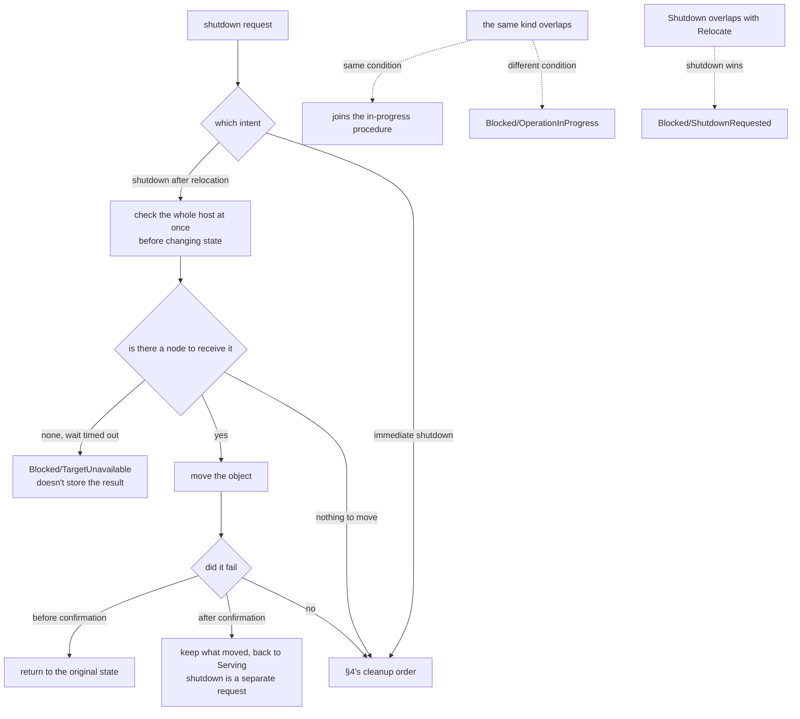
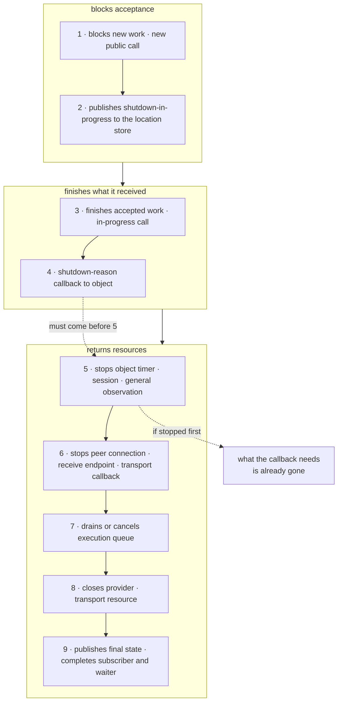

# 1. Layer Boundary And Identifier

[Internal structure table of contents](README.en.md) · [Next: 2. Spot · Actor Execution Serialization — splitting queue and execution gate](02-serialization.en.md)

> **What this chapter answers** — what chunk to split the runtime
> into, and which value must not be merged into one.
>
> **Contract ownership** — the shutdown procedure and order is owned
> by [Host Relocate And Shutdown](../spec/28-graceful-drain-handoff.en.md),
> and the identifier's format and lifetime is owned by the
> [glossary](../spec/01-glossary.en.md).
> This chapter covers the **structure** that satisfies that contract,
> and the mismatch observed across the four implementations.

Covers what chunk to split the runtime into, and which value must not
be merged into one. These two decisions are hardest to change later —
a wrong boundary spreads through the whole codebase, and merged
identifiers make it impossible to ask again "until when is this value
valid."

## 1. Gather The Binding Boundary In One Spot

**Decision.** Put a **contract layer declared in the runtime's own
words** for the socket/context/message behavior the runtime needs, and
put a separate **adapter layer** that moves that contract into that
language's binding call. The binding type name only appears in the
adapter layer.

```text
+-------------------------------------------------------------+
| application handler                                         |
|   only sees the Framework public contract                   |
+-------------------------------------------------------------+
| runtime core                                                |
|   selector · dispatch · execution authority · object · observation |
|   the binding type name must not be here                    |
+-------------------------------------------------------------+
        | contract declared in the runtime's own words (socket · context · message)
        v
+-------------------------------------------------------------+
| adapter                                                     |
|   the only spot a binding type appears                      |
+-------------------------------------------------------------+
| installed binding package                                   |
+-------------------------------------------------------------+
| Core                                                        |
+-------------------------------------------------------------+
```

The arrow between the two layers above and the three layers below is
the boundary this document protects. **The arrow only goes one
direction** — a binding type must not climb up, and the adapter must
not make a runtime decision on its own behalf (see "Two Paths The
Boundary Leaks" and "The Reverse-Direction Pitfall" below).

**Why.** A binding changes on a cycle separate from Framework. If the
boundary is scattered, a trivial binding change becomes a
runtime-wide edit, and worse, **what's a runtime decision and what's
forced by the binding** becomes unreadable.

### Two Paths The Boundary Leaks

The leak path actually observed across the four implementations is
below.

| Leak Form | Result |
|---|---|
| Many runtime headers directly include a binding header | Equivalent to having no boundary at all. Which file depends on the binding can't be counted |
| A contract layer exists, but only a **value type** like message/routing id is taken directly from the binding | The boundary looks like it exists, but the type has leaked out and can't be swapped |

The second is especially easy to miss. Even with a well-built contract
interface, using one type carrying a payload directly from the binding
collapses the boundary.

### The Reverse-Direction Pitfall

Don't stack layers of an interface with **only one implementation**
just because you're making a boundary. In fact, one implementation was
observed to have 11 contract interfaces with only one implementation
each, most of which just forward the call as is. Such a layer fails
to make a boundary, and only gives the reader the wrong expectation
that "something can be swapped out here."

The judgment standard is neither "does an interface exist" nor "is a
type name visible." A name can be hidden behind an alias or conversion
wrapper, and conversely, even if a boundary DTO's name contains
binding terminology, the dependency direction can still be correct.

**There are three judgment standards.**

| Standard | Content |
|---|---|
| Import direction | The runtime core doesn't directly reference a binding package/header |
| Value ownership | The message/routing value the runtime handles is a type the backend port owns |
| Meaning conversion | The adapter converts the binding's lifetime, errno, and readiness state into a runtime result. The runtime doesn't interpret the binding's error code as is |

The canonical document is the **allowed dependency graph**. A type
name search is just an auxiliary means to quickly find a spot that
violates that graph.

### Per-Language Discretion

Whether to express the contract as an interface, abstract class,
protocol, or function bundle, and how many files to split the adapter
into, is free.

## 2. Don't Put Shutdown Per Topology

**Decision.** Put one host runtime per process, and put the
per-topology runtime — such as
[RouteMesh](../spec/01-glossary.en.md#routemesh), ClientServer,
fanout, STREAM — where multiple nodes find each other by name, under
it. **The shutdown order is owned by the host, and the method to close
each resource is owned by the topology that built it.**

Splitting the two responsibilities is the key. If each topology also
decides when to close on its own, the order differs every run.
Conversely, if the host must know how to release a socket, worker, and
subscription, the topology's internals leak into the host. The host
calls the common lifecycle procedure (`stop accepting → drain →
close`) in a fixed order, and each topology closes its own resource on
that call. Calling it repeatedly must give the same result.

**Why.** If each topology closes on its own, the close order differs
every run. If the [Spot](../spec/01-glossary.en.md#spot) side, the
execution unit an Actor belongs to, closes first while a STREAM
session still holds that Actor, the situation can't be reproduced and
which side is at fault can't be judged.

In one implementation, code that **branches by checking the concrete
type** to align the shutdown order is in the shutdown path. This is a
sign the design of "handling topology abstractly" has already broken
— unable to express order with the abstract type, it asked back for
the concrete type.

### Don't Put Shutdown Logic In The Host Integration Layer

In one implementation, a substantial portion of shutdown coordination
is in the web framework integration package. That means the runtime
alone can't clean itself up to the end.

This makes shutdown behave differently, or not happen at all, in a
spot that doesn't use that integration — a console host, a test, a
different framework. The integration layer **only connects the
runtime's start/stop to the host lifecycle**, and what to clean up in
what order is owned by the runtime.

### Don't Implement The Same Protocol Twice

In one implementation, the client connection library has **the same
protocol stack separate from the framework.** Pending request
management, connection keep-alive, and close handling each exist
separately on both sides. A situation where only one side gets fixed
inevitably occurs, and which side is canonical isn't left in the code.

Protocol handling is implemented in one place, and both sides use it.

### Observation Standard

A call individually closing a topology resource doesn't skip the host
shutdown procedure.

## 3. Shutdown Carries Two Intents

A shutdown request carries an intent of a different nature. Merging it
into one makes even an urgent shutdown wait for a move to finish.

| Intent | What It Does | When |
|---|---|---|
| Shutdown after relocation | Moves this node's objects to a different node, then goes down | A planned shutdown, like deployment/scale-down |
| Immediate shutdown | Cleans up only what's in progress with no move, then goes down | An urgent shutdown |

**Decision — if requests of the same kind overlap, join the one
already confirmed; if the conditions differ, reject.** If the mode or
target version matches, join the in-progress procedure. If different,
don't wait — end with `Blocked/OperationInProgress`
([Host Relocate And Shutdown 「6. Concurrent Calls And
Cancellation」](../spec/28-graceful-drain-handoff.en.md#6-concurrent-calls-and-cancellation)).
If two procedures of the same kind run overlapped with different
conditions, which result is final can't be decided.

**A Relocate and Shutdown overlap is handled differently.** Here it's
not a rejection — shutdown wins, and the side waiting for relocation
ends with `Blocked/ShutdownRequested`
([Host Relocate And Shutdown 「11. The Race Between Shutdown And
Relocate」](../spec/28-graceful-drain-handoff.en.md#11-the-race-between-shutdown-and-relocate)).
Since shutdown cleans up everything of this host anyway, there's no
reason to finish the relocation.

**Decision — a shutdown-after-relocation checks the whole host at once
before changing state**
([Host Relocate And Shutdown 「4. Conditions Checked Before Selecting A
Target」](../spec/28-graceful-drain-handoff.en.md#4-conditions-checked-before-selecting-a-target)).
If new work is blocked before this check, that node would have been
stopped for no reason once it learns it can't move
([5. Message Continuity During A Move 「1. The Four
Boundaries」](05-relocation-continuity.en.md#1-four-boundaries)).

It doesn't immediately reject just because there's no node to receive
it right now. **After waiting for target information to spread up to
a set time,** it ends with `Blocked/TargetUnavailable` (`28:288`).
Since the rejected result isn't stored, requesting again checks from
the start (`28:326`).

If there's **not a single** target to move, it succeeds even with no
node to receive it. Here too, the host state transition and new work
blocking is the same as any other relocation (`28:281-285`).

**Decision — failure handling differs before and after confirmation,
but neither ends the host.** A failure before the first relocation is
confirmed returns to the original state. A failure after confirmation
**leaves what's already moved on the receiving node**, reprocesses
only the not-yet-moved work, and **returns to `Serving`** (`28:152`,
`28:274`). Shutdown only happens if the caller separately requests it.

**Decision — an observation subscriber can't hold up shutdown
progress.** Shutdown proceeds even if the subscriber doesn't respond.



**Neither failure branch ends the host.** Shutdown only happens if the
caller separately requests it. §4 below starts from this diagram's
`CLEAN`.

## 4. Fix The Cleanup Order

**Decision — the side that built a resource closes it.** While a
child uses its parent's resource, it keeps a reference guaranteeing
that parent isn't closed yet. An outgoing reference must be checkable
for whether it's already closed and whether the generation matches.

**Decision — cleanup happens in the following order.** Without a fixed
order, a shutdown bug that isn't reproducible arises, differing every
run.

1. Block new application work and new public calls.
2. Publish shutdown-in-progress to the location store so other nodes
   exclude this node from candidates.
3. Finish an already-accepted work item and in-progress call up to a
   set time.
4. **Run the callback notifying the object of the shutdown reason.**
5. Stop the object timer and session connection, and general
   observation emission. Keep a spot for the final notification.
6. Stop the peer connection and receive endpoint, and the transport
   layer callback.
7. Drain the execution queue or cancel it within a set time.
8. Close the provider and transport layer resource.
9. Publish the final state and shutdown notification, and complete
   the observation subscriber and waiter.



**Step 4 coming before step 5 is the key.** The callback receiving the
shutdown reason must run while that object's membership and local
instance are still valid
([Host Relocate And Shutdown 「11. The Race Between Shutdown And
Relocate」](../spec/28-graceful-drain-handoff.en.md#11-the-race-between-shutdown-and-relocate)).
If the timer and session are stopped first, what the callback needs is
already gone.

**Decision — after the final result is published, a new
callback/timer/completion/event isn't started.**

## 5. Registration Declaration Is Validated Only Once, At Start

**Decision — a registration declaration is validated at start, and
doesn't change after passing validation.**

If it could change while running, every lookup point would have to
ask back "is the current value valid." That cost is added per message,
and it becomes impossible to know which point-in-time's configuration
processed which message.

What validation must catch is a **contradiction knowable before
start** — registering the same name twice, a channel with no handler,
a mutually exclusive option combination. Discovering this after start
means some messages have already been processed.

**Decision — if validation fails, don't start.** It doesn't come up
with only part registered.

## 6. Don't Merge Identifiers

**Decision.** A value with a different lifetime and scope is kept as a
different identifier.

| Identifier | Valid Until |
|---|---|
| Mesh name | Fixed exactly as written in configuration |
| Node RID | That node's lifecycle |
| Node lifecycle generation | Increases per restart |
| Channel name | Only meaningful within that process |
| Object ID | The object's lifetime |
| Object generation | Increases every time the same ID is built again |
| In-progress call identifier | Until that call ends |
| Physical connection identifier | Until the connection drops |

### Why Not Make Uniqueness A Single Value

If the in-progress call identifier is kept as a number that only
increases within a process, after a node restarts, the same number
comes up again. A late reply to a call sent before restart can match a
different call after restart.

There's also a way to solve this by making the value itself large, but
**the combination approach is chosen** — uniqueness is secured with a
`(sending node's RID, that node's lifecycle generation, call
identifier)` combination. The value's length and internal format
aren't a public contract, so it can differ per language.

One implementation had **three** in-progress call identifier formats
coexisting. A spot converting between them arose, and following which
path uses which format required tracing the call graph. Keep the
format to one.

### Typing Only Part Leaves The Rest As A String

In one implementation, only node RID has a dedicated type, and mesh
name/object ID/channel name are all plain strings. In a different
implementation, all four are strings. Keeping it this way creates two
problems.

First, **swapping different identifiers still compiles.** The type
doesn't catch the mistake of passing a channel name where an object ID
belongs.

Second, **multiple representations of the same value arise.** One
implementation, when comparing a routing id, builds several
candidates differing in case and hex notation and matches them one by
one. It's a sign the representation split crossing boundaries, and the
comparison cost is added per value.

**Decision — keep each identifier as its own dedicated type, and fix
one representation.** If a spot must handle it as a string, convert
only once at that boundary.

### Watch Out For Name Collision

`OperationId` is already a public term referring to **the value that
handles Actor Join completion without duplication**
([glossary](../spec/01-glossary.en.md#actor-join-operationid)). Using
the same name for the in-progress call identifier mixes the two
concepts in the document and code. internals uses a different name.

### A Value Not Exported

The physical connection identifier, store record version, and the
execution queue's internal sequence number aren't put in a public DTO.
These values are only used by the runtime **to re-confirm the same
target**, and the moment they go outside, the application starts
depending on that value's stability.

## 7. Result To Confirm

- A binding type name isn't found by search in the runtime core code.
- There's no contract layer with only one implementation that just
  forwards the call as is.
- A call individually closing a topology resource doesn't skip the
  host shutdown procedure.
- The shutdown path has no code that branches by checking a concrete
  type.
- If shutdown-after-relocation and immediate shutdown are requested at
  the same time, only one procedure proceeds.
- If judged unable to move, it rejects without changing state.
- The cleanup order is the same every run.
- No new callback/timer/event starts after the final result is
  published.
- A registration declaration is validated at start and doesn't change
  while running.
- If validation fails, it doesn't start with only part registered.
- The runtime finishes the shutdown procedure by itself, with no host
  integration package.
- There's only one set of code handling the same protocol in the
  repository.
- Every identifier has a dedicated type, and there's no code
  comparing multiple representations for a value comparison.
- A call the same node sent after restarting doesn't match a
  pre-restart call by the same identifier.
- The in-progress call identifier format is one within the runtime.

---

[Internal structure table of contents](README.en.md) · [Next: 2. Spot · Actor Execution Serialization](02-serialization.en.md)
