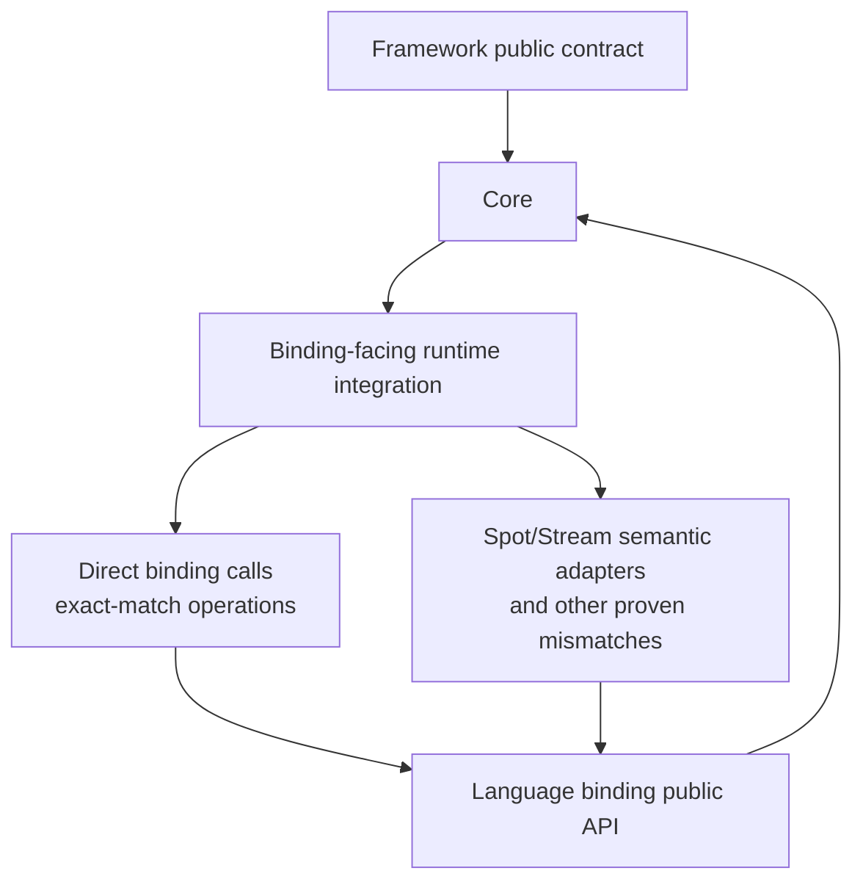
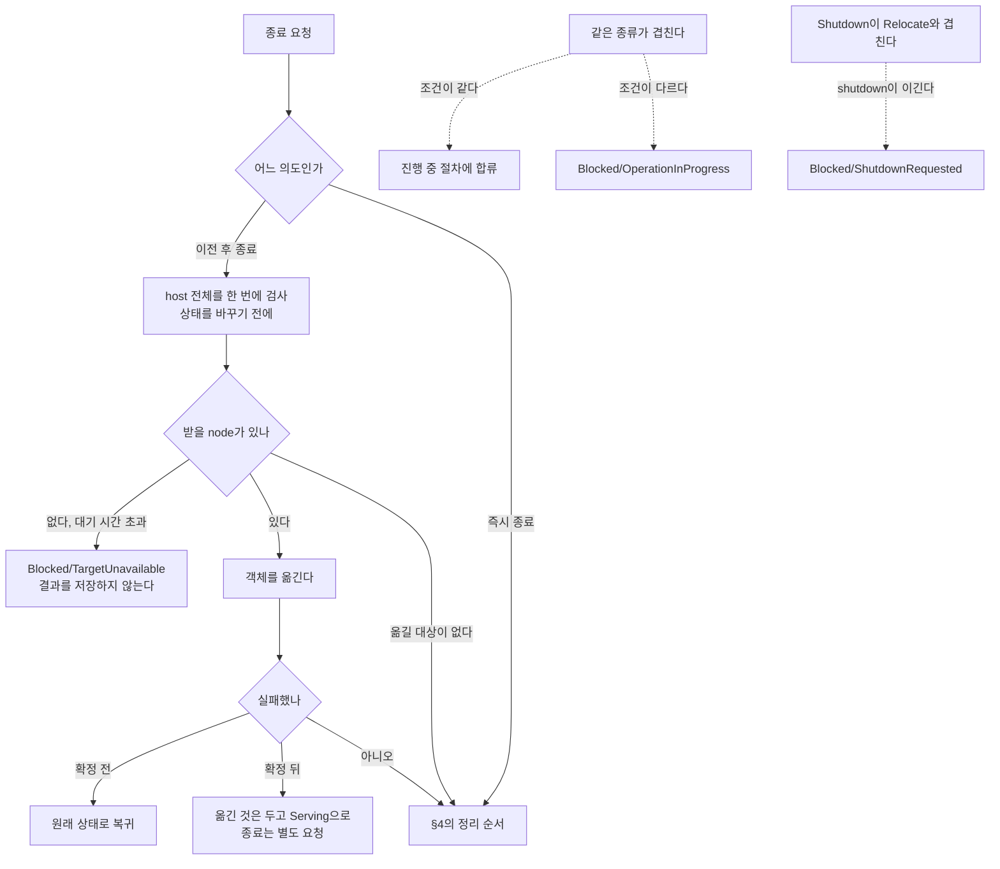
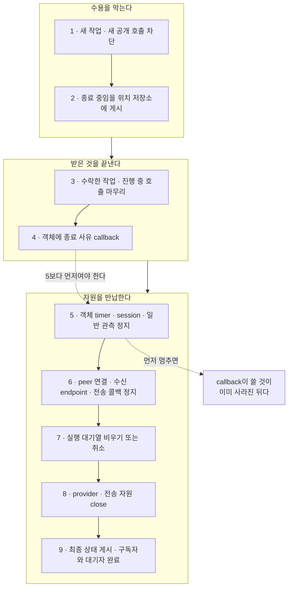

# 1. 계층 경계와 식별자

[내부 구조 목차](README.ko.md) · [다음: 2. Spot·Actor 실행 직렬화 — queue와 execution gate를 나눈다](02-serialization.ko.md)

> **이 장이 답하는 것** — runtime을 어떤 덩어리로 나누고, 어떤 값을 하나로 합치면 안 되는가.
>
> **계약 소유** — 종료 절차와 순서는 [Host Relocate와 Shutdown](../spec/28-graceful-drain-handoff.ko.md)이,
> 식별자의 형식과 수명은 [용어집](../spec/01-glossary.ko.md)이 소유한다.
> 이 장은 그 계약을 만족시키는 **구조**와, 경계를 어겼을 때 나타나는 실패를 다룬다.

이 장은 runtime의 책임을 나누는 경계와, 수명이 다른 식별자를 분리하는 기준을 설명한다.
이 경계가 코드 전체의 의존 방향을 정하므로 나중에 바꾸기 어렵다. 수명이 다른 식별자를
하나로 합치면 어떤 범위와 기간에서 값이 유효한지 판단할 수 없게 된다.

## 1. binding 경계를 의미 기준으로 잡는다

**결정.** 모든 언어 구현은 같은 책임 그래프를 따른다. 이 그래프는 binding의 type 이름,
package 배치 또는 문법이 아니라 의미의 소유와 runtime 비용으로 정의한다.

Framework는 public contract, 의미를 구현하는 runtime core, binding과 연결하는 integration
영역으로 나뉜다. Public contract와 runtime core에는 binding type을 노출하지 않는다.

Integration 영역은 binding 동작의 의미, 소유권, 수명, 준비 상태와 오류가 Framework 계약과
이미 같으면 binding public API를 직접 호출한다. 둘 사이에 차이가 있거나, 여러 binding
object를 하나의 Framework 동작으로 결합해야 할 때만 의미 adapter 또는 port를 둔다.

`SpotNode`와 `Stream`은 이런 결합의 공통 예다. 특별히 면제된 영역이 아니며, 다른 adapter도
아래 POSDDD와 성능 검토를 같은 기준으로 통과해야 한다.

Binding public type은 integration 영역에서만 참조한다. 추상화 계층의 모양을 맞추려고 같은
type을 Framework domain contract에 복사하지 않는다. Adapter도 runtime 구현에 속하므로,
Framework가 정할 동작을 binding package로 옮기지 않는다.

이 경계가 보호하는 대상은 class 개수가 아니라 의미와 소유권이다. 모든 언어 구현은 같은
책임 그래프를 유지한다. 의미가 같으면 binding API를 직접 사용하고, 확인된 차이가 있을
때만 adapter가 그 차이를 한 곳에서 처리한다. 아래의 동작 분류, POSDDD 검토 관문과 성능
관문은 이 선택을 판단하는 기준이다.

**왜.** binding은 Framework와 별개 주기로 바뀐다. binding type과 소유권 규칙이 public
contract에 흩어지면 binding 변경이 API 전체 수정이 된다. 반대로 binding 메서드마다
일대일 class를 만들면 의미를 숨기지 못한 채 이름만 늘어난다.

### type을 추가하기 전에 동작을 분류한다

언어나 binding class가 아니라 동작을 분류한다.

| 질문 | binding 직접 사용 | 의미 adapter 또는 port |
|---|---|---|
| binding 동작이 Framework 계약을 이미 만족하는가 | binding public API를 직접 사용한다 | 동작을 변환하고 차이를 문서화한다 |
| 소유권과 수명이 같은가 | 두 번째 소유자를 만들지 않고 값을 전달한다 | 이전·재사용·반납·보유를 명시적으로 소유한다 |
| 준비 상태와 오류 결과가 같은가 | binding 결과를 유지한다 | Framework 결과로 한 곳에서 변환한다 |
| 동시성 규칙이 같은가 | 추가 gate를 만들지 않는다 | 필요한 직렬화 또는 실행 소유자를 adapter가 관리한다 |
| 하나의 binding object가 전체 동작을 제공하는가 | 직접 호출한다 | 여러 binding object를 하나의 의미 동작으로 결합한다 |

이 표는 모든 언어에 동일하게 적용한다. binding API가 다르다는 사실만으로 Framework
구조를 다르게 만들지 않는다.

adapter는 binding 결과를 Framework 결과로 매핑하거나, 정해진 순서로 resource를 닫거나,
호출자가 넘긴 수신 storage를 재사용하거나, MeshNode와 stream session을 하나의 동작으로
결합하는 결정을 소유할 때 필요하다. binding type이 외부 package에 있다는 사실만으로는
충분한 이유가 아니다.

### POSDDD 검토 관문

adapter를 추가하거나 남기기 전에 POSD와 DDD 관점에서 함께 검토한다.

| 검토 질문 | 필요한 결과 |
|---|---|
| 깊은 모듈인가 | adapter가 작은 Framework 동작 뒤에 binding의 중요한 결정을 숨긴다. binding API를 그대로 복제하지 않는다 |
| 정보 은닉이 되는가 | 소유권·lifecycle·준비 상태·오류 변환·protocol 결정에 owner가 하나이고 호출부로 새지 않는다 |
| 복잡성을 아래로 내리는가 | 호출자가 binding option을 넘기거나 오류를 해석하거나 native storage와 순서를 관리하지 않는다 |
| 오류를 정의로 줄였는가 | 잘못된 조합을 표현할 수 없게 하거나, 남은 실패를 한 곳에서 분류한다 |
| bounded context를 지키는가 | 두 모델을 변환하되 binding 용어가 Framework domain model이 되지 않는다 |
| 두 가지 설계를 검토했는가 | 직접 public binding 사용과 의미 adapter/port를 비교한 뒤 선택한다 |

숨길 중요한 결정이 없는 adapter는 제거한다. test fake, 미래의 backend 가능성 또는 다른
namespace는 충분한 이유가 아니다.

### 성능 관문

공통 구조가 알려진 hot path 비용을 추가하면 작업을 완료한 것으로 보지 않는다. 모든
message 경로와 readiness 경로에서 다음을 확인한다.

- binding이 지원하면 호출자가 제공한 receive storage를 재사용한다.
- 인위적인 계층을 통과시키기 위해 message part를 복사하거나 bytes와 message object를
  두 번 변환하지 않는다.
- 소유권 계약이 요구하지 않는데 message마다 wrapper·collection·task·completion object를
  만들지 않는다.
- binding 동작을 감싸는 두 번째 lock을 추가하지 않는다. 직렬화가 필요하면 하나의 owner나
  하나의 gate로 정의하고 계약을 설명한다.
- poll event storage를 재사용한다. task/future 생성은 일반 message 경로가 아니라 operation과
  lifecycle 경로에 둔다.
- 완료 판정 전에 관련 언어의 throughput, p99 latency, allocation/GC, lock contention을
  측정한다.

ownership이나 protocol 정확성 때문에 필요한 adapter는 비용이 있더라도 유지할 수 있다.
다만 비용을 격리하고 측정하며, 다른 언어 구현에서 같은 비용을 중복하지 않는다.

### 금지하는 구조

다음 구조는 모든 언어에서 설계 오류다.

- binding object와 인자·결과가 같은 `*Wrapper` class
- test나 가상의 backend만을 이유로 실제 대상 하나를 감싸는 `IBackend*` interface
- binding method 이름만 바꾸거나 binding option을 두 번째로 노출하는 facade
- binding public API를 우회하는 reflection, internal member 접근, visibility hack, raw-frame 우회
- 다른 언어에 있는 구현 세부 사항만을 근거로 추가한 언어별 public API

### 언어 간 동일성

언어별 class 이름과 file layout은 같을 필요가 없다. 대신 책임 그래프, public 동작, 소유권
규칙, lifecycle 순서와 성능 기대치는 같아야 한다.

어떤 언어의 binding이 필요한 동작을 표현하지 못하면 의미 차이와 필요한 binding 변경을
기록한다. private wrapper, raw-frame 경로 또는 언어 전용 public contract로 보상하지 않는다.

정본은 **허용 의존 그래프**, POSDDD 검토 관문과 성능 관문을 함께 적용한 결과다. type 이름
검색은 이 기준을 어긴 자리를 빨리 찾는 보조 수단일 뿐이다.

### 언어별 재량

각 언어는 interface·추상 class·protocol·함수 묶음 또는 binding 직접 호출 중 하나를
선택할 수 있다. 의미 adapter를 몇 파일로 나눌지도 자유다. 공통 규칙은 public binding
API만 사용하고, 호출 전달 wrapper를 새로 만들지 않으며, 소유권·의미 변환·측정한 runtime
비용을 명시하는 것이다.

## 2. 종료를 topology마다 두지 않는다

**결정.** process에 host runtime 하나를 두고, node 여럿이 이름으로 서로를 찾는
[RouteMesh](../spec/01-glossary.ko.md#routemesh)·ClientServer·fanout·STREAM 같은
topology별 runtime은 그 아래에 둔다. **종료 순서는 host가 소유하고, 각 resource를 닫는
방법은 그것을 만든 topology가 소유한다.**

두 책임을 나누는 것이 핵심이다. topology가 언제 닫을지까지 각자 정하면 순서가 실행할
때마다 달라진다. 반대로 host가 socket·worker·구독을 어떻게 해제하는지까지 알아야 하면
topology의 내부가 host로 새어 나온다. host는 공통 lifecycle 절차(`수락 중지 → drain →
close`)를 정해진 순서로 부르고, 각 topology는 그 부름에 자기 resource를 닫는다. 여러 번
불러도 결과가 같아야 한다.

**왜.** topology가 각자 닫으면 닫는 순서가 실행할 때마다 달라진다. STREAM session이 아직
Actor reference를 유지하는데 Actor가 속한 실행 단위인 [Spot](../spec/01-glossary.ko.md#spot) 쪽이
먼저 닫히면, 그 상황을 재현할 수도 없고 어느 쪽이
잘못인지 판정할 수도 없다.

종료 경로가 순서를 맞추려고 **구체 타입을 검사해 분기하면**, topology를 추상으로 다루는
경계가 깨진다. 추상 타입만으로 순서를 표현할 수 없으므로 topology를 추가할 때마다 종료
분기가 늘고, 같은 resource도 실행 경로에 따라 다른 순서로 닫힐 수 있다.

### 종료 로직을 host 통합 계층에 두지 않는다

종료 조율을 웹 프레임워크 통합 package에 두면 runtime 자체만으로는 정리를 끝낼 수 없다.
그 통합을 쓰지 않는 자리 — 콘솔 host, 테스트, 다른 프레임워크 — 에서는
종료가 다르게 동작하거나 아예 없다. 통합 계층은 **runtime의 시작·종료를 host 생명주기에
연결만** 하고, 무엇을 어떤 순서로 정리할지는 runtime이 소유한다.

### 같은 프로토콜을 두 번 구현하지 않는다

client 접속 라이브러리와 framework가 **같은 프로토콜 스택을 따로 구현하면**, 대기 중 요청
관리, 연결 유지와 종료 처리의 정본이 둘이 된다. 한쪽의 수정이 다른 쪽에 반영되지 않으면
같은 wire 입력을 서로 다르게 처리한다.

프로토콜 처리는 한 곳에서 구현하고 양쪽이 그것을 쓴다.

### 관찰 기준

topology resource를 개별적으로 닫는 호출이 host 종료 절차를 건너뛰지 않는다.

## 3. 종료에는 두 가지 의도가 있다

종료 요청은 성격이 다른 의도를 담는다. 하나로 합치면 급히 내려야 할 때도 이전이
끝나기를 기다린다.

| 의도 | 하는 일 | 언제 |
|---|---|---|
| 이전 후 종료 | 이 node의 객체를 다른 node로 옮기고 나서 내려간다 | 배포·축소처럼 계획된 종료 |
| 즉시 종료 | 옮기지 않고 진행 중인 것만 정리하고 내려간다 | 급한 종료 |

**결정 — 같은 종류의 요청이 겹치면 먼저 확정된 쪽에 합류하고, 조건이 다르면 거절한다.**
mode나 대상 버전이 같으면 진행 중인 절차에 합류한다. 다르면 기다리지 않고
`Blocked/OperationInProgress`로 끝낸다
([Host Relocate와 Shutdown 「6. Concurrent 호출과 cancellation」](../spec/28-graceful-drain-handoff.ko.md#6-concurrent-호출과-cancellation)). 같은 종류의
두 절차가 서로 다른 조건으로 겹쳐 돌면 어느 쪽 결과가 최종인지 정할 수 없다.

**Relocate와 Shutdown이 겹치는 경우는 다르다.** 이때는 거절이 아니라 shutdown이 이기고,
relocation을 기다리던 쪽이 `Blocked/ShutdownRequested`로 끝난다
([Host Relocate와 Shutdown 「11. Shutdown과 Relocate의 경쟁」](../spec/28-graceful-drain-handoff.ko.md#11-shutdown과-relocate의-경쟁)). Shutdown은
어차피 이 host의 모든 것을 정리하므로 relocation을 마칠 이유가 없다.

**결정 — 이전 후 종료는 상태를 바꾸기 전에 host 전체를 한 번에 검사한다**
([Host Relocate와 Shutdown 「4. Target을 선택하기 전에 확인하는 조건」](../spec/28-graceful-drain-handoff.ko.md#4-target을-선택하기-전에-확인하는-조건)). 이 확인 전에
새 작업을 막으면, 옮기지 못한다는 사실을 알았을 때 그 node는 이유 없이 멈춰 있던 셈이
된다([5. 이동 중 message 연속성 「1. 네 개의 경계」](05-relocation-continuity.ko.md#1-네-개의-경계)).

받을 node가 당장 없다고 바로 거절하지는 않는다. **정해진 시간까지 대상 정보가 퍼지기를
기다린 뒤** `Blocked/TargetUnavailable`로 끝낸다
([Host Relocate와 Shutdown 「5.1 Target이 아직 없을 때」](../spec/28-graceful-drain-handoff.ko.md#51-target이-아직-없을-때)).
거절 결과는 저장하지 않으므로 다시 요청하면 처음부터 다시 검사한다
([Host Relocate와 Shutdown 「6. Concurrent 호출과 cancellation」](../spec/28-graceful-drain-handoff.ko.md#6-concurrent-호출과-cancellation)).

옮길 대상이 **하나도 없으면** 받을 node 없이도 성공으로 끝난다. 이때도 host 상태 전이와
새 작업 차단은 다른 이전과 같다
([Host Relocate와 Shutdown 「5.1 Target이 아직 없을 때」](../spec/28-graceful-drain-handoff.ko.md#51-target이-아직-없을-때)).

**결정 — 확정 전후로 실패 처리가 다르지만, 어느 쪽도 host를 종료시키지 않는다.** 첫
이전이 확정되기 전의 실패는 원래 상태로 복귀한다. 확정된 뒤의 실패는 **이미 옮긴 것은
받은 node에 남기고**, 아직 옮기지 못한 작업만 다시 처리한 뒤 **`Serving`으로 돌아간다**
([Host Relocate와 Shutdown 「10. Relocate 완료와 실패」](../spec/28-graceful-drain-handoff.ko.md#10-relocate-완료와-실패)).
종료는 caller가 별도로 요청해야 일어난다.

**결정 — 관측 구독자는 종료 절차의 진행을 막지 못한다.** 구독자가 응답하지 않아도
종료는 진행한다.

**두 실패 분기 어느 쪽도 host를 종료시키지 않는다.** 종료는 caller가 별도로 요청해야
일어난다. 아래 §4는 이 그림의 `CLEAN`에서 시작한다.

## 4. 정리 순서를 고정한다

**결정 — resource는 만든 쪽이 닫는다.** 자식이 부모의 resource를 쓰는 동안에는 그 부모가
아직 닫히지 않았음을 보장하는 참조를 보관한다. 밖으로 나가는 참조는 이미 닫혔는지, 세대가
맞는지 확인할 수 있어야 한다.

**결정 — 정리는 다음 순서로 한다.** 순서를 정하지 않으면 실행할 때마다 달라져 재현되지
않는 종료 오류가 생긴다.

1. 새 application 작업과 새 공개 호출을 막는다.
2. 종료 중임을 위치 저장소에 게시해 다른 node가 이 node를 후보에서 빼게 한다.
3. 이미 수락한 작업과 진행 중인 호출을 정해진 시간까지 끝낸다.
4. **객체에 종료 사유를 알리는 callback을 실행한다.**
5. 객체 timer와 session 연결, 일반 관측 발신을 멈춘다. 최종 통보용 자리는 남긴다.
6. peer 연결과 수신 endpoint, 전송 계층 콜백을 멈춘다.
7. 실행 대기열을 비우거나 정해진 시간 안에 취소한다.
8. provider와 전송 계층 자원을 닫는다.
9. 마지막 상태와 종료 통보를 게시하고, 관측 구독자와 대기자를 완료시킨다.

**4번이 5번보다 앞서는 것이 핵심이다.** 종료 사유를 받는 callback은 그 객체의 소속과
지역 인스턴스가 아직 유효한 상태에서 실행되어야 한다
([Host Relocate와 Shutdown 「11. Shutdown과 Relocate의 경쟁」](../spec/28-graceful-drain-handoff.ko.md#11-shutdown과-relocate의-경쟁)). timer와
session을 먼저 멈추면 callback이 쓸 것이 이미 사라진 뒤다.

**결정 — 최종 결과를 게시한 뒤에는 callback·timer·완료·이벤트를 새로 시작하지 않는다.**

## 5. 등록 선언은 시작할 때 한 번만 검증한다

**결정 — 등록 선언은 시작 시점에 검증하고, 검증을 통과한 뒤에는 바뀌지 않는다.**

실행 중에 바뀔 수 있으면 모든 조회 지점이 "지금 값이 유효한가"를 되물어야 한다. 그
비용이 message마다 발생하고, 어느 시점의 설정으로 처리된 message인지도 알 수 없게 된다.

검증에서 잡아야 하는 것은 **시작 전에 알 수 있는 모순**이다 — 같은 이름을 두 번 등록,
handler가 없는 channel, 서로 배타적인 옵션 조합. 이런 것을 시작 후에 발견하면 이미 일부
message를 처리한 뒤다.

**결정 — 검증에 실패하면 시작하지 않는다.** 일부만 등록된 채로 뜨지 않는다.

## 6. 식별자를 합치지 않는다

**결정.** 수명과 범위가 다른 값은 서로 다른 식별자로 둔다.

| 식별자 | 언제까지 유효한가 |
|---|---|
| mesh 이름 | 설정에 적은 그대로 고정 |
| node RID | 그 node의 lifecycle |
| node lifecycle generation | 재시작마다 증가 |
| channel 이름 | 그 process 안에서만 의미가 있다 |
| 객체 ID | 객체 수명 |
| 객체 세대 | 같은 ID가 다시 만들어질 때마다 증가 |
| 진행 중 호출 식별자 | 그 호출이 끝날 때까지 |
| 물리 연결 식별자 | 연결이 끊길 때까지 |

### 왜 유일성을 값 하나로 만들지 않는가

진행 중 호출 식별자를 process 안에서만 증가하는 번호로 두면, node가 재시작한 뒤 같은
번호가 다시 나온다. 재시작 전에 보낸 호출의 늦은 응답이 재시작 후의 다른 호출에
매칭될 수 있다.

이 문제를 값 자체를 크게 만들어 푸는 방법도 있지만, **조합으로 푸는 쪽을 택한다** —
유일성은 `(보낸 node의 RID, 그 node의 lifecycle generation, 호출 식별자)` 조합으로
확보한다. 값의 길이와 내부 형식은 공개 계약이 아니므로 언어마다 달라도 된다.

진행 중 호출 식별자 형식을 여러 개 두면 서로 변환하는 코드가 생기고, 어느 경로가 어느
형식을 쓰는지 알려면 호출 그래프를 따라가야 한다. runtime 내부 형식은 하나로 둔다.

### 일부만 타입을 만들면 나머지가 문자열로 남는다

node RID만 전용 타입으로 두거나 모든 식별자를 일반 문자열로 두면 다음 문제가 생긴다.

첫째, **서로 다른 식별자를 바꿔 넣어도 컴파일이 통과한다.** 객체 ID 자리에 channel
이름을 넘기는 실수를 타입이 잡지 못한다.

둘째, **같은 값의 표기가 여러 개 생긴다.** routing id를 비교할 때 대소문자와 16진 표기가
다른 후보를 여러 개 만들어 하나씩 대조해야 한다면, 경계를 넘을 때 표기가 달라졌다는
뜻이다. 값 하나마다 후보를 만드는 비용도 발생한다.

**결정 — 식별자는 각각 전용 타입으로 두고, 표기를 하나로 정한다.** 문자열로 다뤄야
하는 자리가 있으면 그 경계에서 한 번만 변환한다.

### 이름 충돌 주의

`OperationId`는 이미 **Actor Join 완료를 중복 없이 처리하는 값**을 가리키는 공개
용어다([용어집](../spec/01-glossary.ko.md#actor-join-operationid)). 진행 중 호출
식별자에 같은 이름을 쓰면 두 개념이 문서와 코드에서 섞인다. internals에서는 다른
이름을 쓴다.

### 밖으로 내보내지 않는 값

물리 연결 식별자, 저장소 record version, 실행 queue의 내부 순번은 공개 DTO에 넣지
않는다. 이 값들은 runtime이 **같은 대상을 다시 확인할 때**만 쓰는 값이고, 밖으로
나가는 순간 application이 그 값의 안정성에 의존하기 시작한다.

## 7. 확인할 결과

- Framework public contract와 domain contract에 binding type이 없고, binding과 만나는
  코드는 binding public API만 사용한다.
- 실제 대상 하나에 호출을 그대로 넘기기만 하는 계약 층이 없다.
- binding과 만나는 type은 의미와 소유권이 이미 같을 때 직접 사용하거나, 의미 변환을
  소유하는 adapter로 둔다.
- binding surface를 복제하는 호출 전달 wrapper가 없다.
- message마다 실행되는 경로가 재사용 가능한 storage를 보존하고, 불필요한 복사·할당·lock을
  추가하지 않는다.
- 관련 throughput, p99 latency, allocation/GC, lock contention을 기준선과 비교해 측정하고,
  설명되지 않은 성능 저하가 남아 있지 않다.
- topology resource를 개별적으로 닫는 호출이 host 종료 절차를 건너뛰지 않는다.
- 종료 경로에 구체 타입을 검사해 분기하는 코드가 없다.
- 이전 후 종료와 즉시 종료가 동시에 요청되면 하나의 절차만 진행한다.
- 옮길 수 없다고 판정되면 상태를 바꾸지 않고 거절한다.
- 정리 순서가 실행할 때마다 같다.
- 최종 결과 게시 뒤에 새 callback·timer·이벤트가 시작되지 않는다.
- 등록 선언이 시작 시점에 검증되고 실행 중에 바뀌지 않는다.
- 검증에 실패하면 일부만 등록된 채로 시작하지 않는다.
- host 통합 package 없이도 runtime이 스스로 종료 절차를 끝낸다.
- 같은 프로토콜을 처리하는 코드가 저장소에 한 벌만 있다.
- 식별자마다 전용 타입이 있고, 값 비교에 여러 표기를 대조하는 코드가 없다.
- 같은 node가 재시작한 뒤 보낸 호출이 재시작 전 호출과 같은 식별자로 매칭되지 않는다.
- 진행 중 호출 식별자 형식이 runtime 안에서 하나다.

---

[내부 구조 목차](README.ko.md) · [다음: 2. Spot·Actor 실행 직렬화](02-serialization.ko.md)
