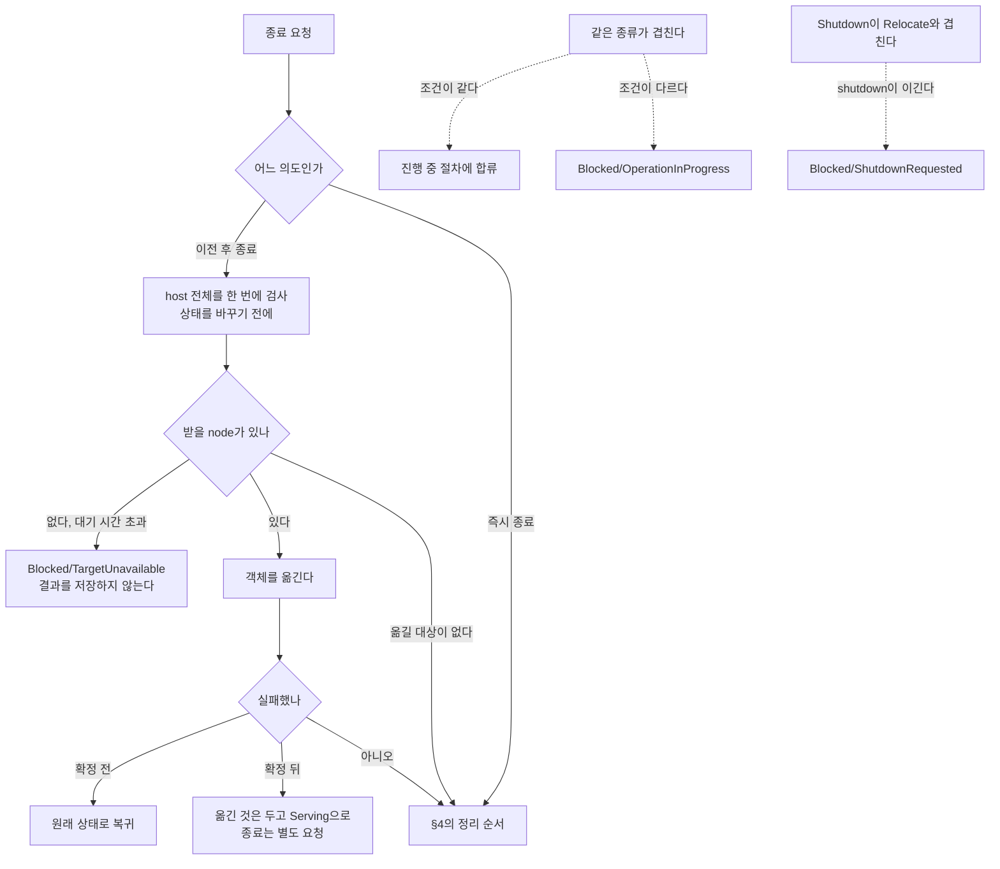
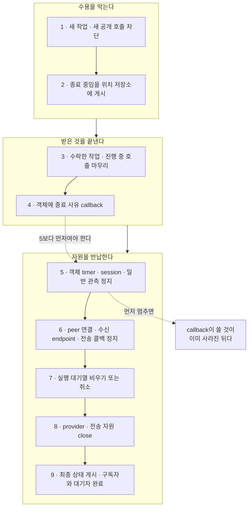

# 1. 계층 경계와 식별자

[내부 구조 목차](README.ko.md) · [다음: 2. Spot·Actor 실행 직렬화 — queue와 execution gate를 나눈다](02-serialization.ko.md)

> **이 장이 답하는 것** — runtime을 어떤 덩어리로 나누고, 어떤 값을 하나로 합치면 안 되는가.
>
> **계약 소유** — 종료 절차와 순서는 [Host Relocate와 Shutdown](../spec/28-graceful-drain-handoff.ko.md)이,
> 식별자의 형식과 수명은 [용어집](../spec/01-glossary.ko.md)이 소유한다.
> 이 장은 그 계약을 만족시키는 **구조**와, 네 구현에서 관찰된 어긋남을 다룬다.

runtime을 어떤 덩어리로 나눌지, 그리고 어떤 값을 하나로 합치면 안 되는지를 다룬다.
이 두 결정은 나중에 바꾸기가 가장 어렵다 — 경계를 잘못 그으면 코드 전체에 퍼지고,
식별자를 합쳐 두면 "이 값이 언제까지 유효한가"를 되물을 수 없게 된다.

## 1. binding 경계를 한 자리에 모은다

**결정.** runtime이 필요로 하는 socket·context·message 동작을 **runtime의 말로 선언한 계약
층**을 두고, 그 계약을 그 언어 binding 호출로 옮기는 **adapter 층**을 따로 둔다.
binding type 이름은 adapter 층에만 나타난다.

```text
+-------------------------------------------------------------+
| application handler                                         |
|   Framework 공개 계약만 본다                                |
+-------------------------------------------------------------+
| runtime 본체                                                |
|   선택기 · dispatch · 실행 권한 · 객체 · 관측               |
|   binding type 이름이 여기 없어야 한다                      |
+-------------------------------------------------------------+
        | runtime의 말로 선언한 계약 (socket · context · message)
        v
+-------------------------------------------------------------+
| adapter                                                     |
|   binding type이 나타나는 유일한 자리                       |
+-------------------------------------------------------------+
| 설치된 binding package                                      |
+-------------------------------------------------------------+
| Core                                                        |
+-------------------------------------------------------------+
```

위 두 층과 아래 세 층 사이의 화살표가 이 문서가 지키려는 경계다. **화살표는 한 방향으로만
간다** — binding type이 위로 올라오면 안 되고, adapter가 runtime의 결정을 대신 내려도 안
된다(아래 「경계가 새는 두 경로」와 「반대 방향의 함정」).

**왜.** binding은 Framework와 별개 주기로 바뀐다. 경계가 흩어져 있으면 binding의 사소한
변경이 runtime 전역 수정이 되고, 더 나쁘게는 **어디까지가 runtime의 결정이고 어디부터가
binding이 강제한 것인지** 읽어낼 수 없게 된다.

### 경계가 새는 두 경로

네 구현에서 실제로 관찰된 누수 경로는 다음과 같다.

| 누수 형태 | 결과 |
|---|---|
| runtime 헤더 다수가 binding 헤더를 직접 포함 | 경계가 존재하지 않는 것과 같다. 어느 파일이 binding에 의존하는지 셀 수 없다 |
| 계약 층은 있는데 message·routing id 같은 **값 타입**만 binding에서 직접 가져다 씀 | 겉보기에는 경계가 있으나 타입이 새어 나가 교체가 불가능하다 |

두 번째가 특히 놓치기 쉽다. 계약 interface를 잘 만들어 놓고도 payload를 담는 타입
하나를 binding에서 그대로 쓰면 경계는 무너진다.

### 반대 방향의 함정

경계를 만든다는 이유로 **구현이 하나뿐인 interface를 층층이 쌓지 않는다.** 실제로
한 구현에서 계약 interface 11개에 구현이 하나뿐이고 대부분이 호출을 그대로 넘기기만
하는 상태가 관찰되었다. 이런 층은 경계를 만들지 못하면서 읽는 사람에게 "여기 무언가
갈아 끼울 수 있다"는 잘못된 기대만 준다.

판단 기준은 "interface가 있는가"도, **type 이름이 보이는가**도 아니다. 이름은 별칭이나
변환 wrapper로 감출 수 있고, 반대로 경계 DTO 이름에 binding 용어가 들어 있어도 의존
방향은 옳을 수 있다.

**판단 기준은 세 가지다.**

| 기준 | 내용 |
|---|---|
| import 방향 | runtime 본체가 binding package·header를 직접 참조하지 않는다 |
| 값의 소유 | runtime이 다루는 message·routing 값은 backend port가 소유한 타입이다 |
| 의미의 변환 | binding의 수명, errno, 준비 상태를 adapter가 runtime 결과로 바꾼다. runtime이 binding의 오류 코드를 그대로 해석하지 않는다 |

정본은 **허용 의존 그래프**다. type 이름 검색은 그 그래프를 어긴 자리를 빨리 찾는 보조
수단일 뿐이다.

### 언어별 재량

계약을 interface·추상 class·protocol·함수 묶음 중 무엇으로 표현할지, adapter를 몇
파일로 나눌지는 자유다.

## 2. 종료를 topology마다 두지 않는다

**결정.** process에 host runtime 하나를 두고, node 여럿이 이름으로 서로를 찾는
[RouteMesh](../spec/01-glossary.ko.md#routemesh)·ClientServer·fanout·STREAM 같은
topology별 runtime은 그 아래에 둔다. **종료 순서는 host가 소유하고, 각 resource를 닫는
방법은 그것을 만든 topology가 소유한다.**

두 책임을 나누는 것이 핵심이다. topology가 언제 닫을지까지 각자 정하면 순서가 실행할
때마다 달라진다. 반대로 host가 socket·worker·구독을 어떻게 해제하는지까지 알아야 하면
topology의 내부가 host로 새어 나온다. host는 공통 lifecycle 절차(`수락 중지 → drain →
close`)를 정해진 순서로 부르고, 각 topology는 그 부름에 자기 resource를 닫는다. 여러 번
불러도 결과가 같아야 한다.

**왜.** topology가 각자 닫으면 닫는 순서가 실행할 때마다 달라진다. STREAM session이 아직
Actor를 붙들고 있는데 Actor가 속한 실행 단위인 [Spot](../spec/01-glossary.ko.md#spot) 쪽이
먼저 닫히면, 그 상황을 재현할 수도 없고 어느 쪽이
잘못인지 판정할 수도 없다.

한 구현에서는 종료 순서를 맞추려고 **구체 타입을 검사해 분기하는** 코드가 종료 경로에
들어가 있다. 이것은 "topology를 추상으로 다룬다"는 설계가 이미 깨졌다는 신호다 —
추상 타입으로 순서를 표현할 수 없으니 구체 타입을 되물은 것이다.

### 종료 로직을 host 통합 계층에 두지 않는다

한 구현은 종료 조율의 상당 부분이 웹 프레임워크 통합 package에 있다. runtime 자체만으로는
스스로를 끝까지 정리하지 못한다는 뜻이다.

이렇게 되면 그 통합을 쓰지 않는 자리 — 콘솔 host, 테스트, 다른 프레임워크 — 에서
종료가 다르게 동작하거나 아예 없다. 통합 계층은 **runtime의 시작·종료를 host 생명주기에
연결만** 하고, 무엇을 어떤 순서로 정리할지는 runtime이 소유한다.

### 같은 프로토콜을 두 번 구현하지 않는다

한 구현은 client 접속 라이브러리가 framework와 **별개로 같은 프로토콜 스택을** 갖고
있다. 대기 중 요청 관리, 연결 유지, 종료 처리가 양쪽에 따로 있다. 한쪽만 고쳐지는
상황이 반드시 생기고, 어느 쪽이 정본인지 코드에 남지 않는다.

프로토콜 처리는 한 곳에서 구현하고 양쪽이 그것을 쓴다.

### 관찰 기준

topology resource를 개별적으로 닫는 호출이 host 종료 절차를 건너뛰지 않는다.

## 3. 종료에는 두 가지 의도가 있다

종료 요청은 성격이 다른 의도를 담는다. 하나로 합치면 급히 내려야 할 때도 이전이
끝나기를 기다린다.

| 의도 | 하는 일 | 언제 |
|---|---|---|
| 이전 후 종료 | 이 node의 객체를 다른 node로 옮기고 나서 내려간다 | 배포·축소처럼 계획된 종료 |
| 즉시 종료 | 옮기지 않고 진행 중인 것만 정리하고 내려간다 | 급한 종료 |

**결정 — 같은 종류의 요청이 겹치면 먼저 확정된 쪽에 합류하고, 조건이 다르면 거절한다.**
mode나 대상 버전이 같으면 진행 중인 절차에 합류한다. 다르면 기다리지 않고
`Blocked/OperationInProgress`로 끝낸다
([Host Relocate와 Shutdown 「6. Concurrent 호출과 cancellation」](../spec/28-graceful-drain-handoff.ko.md#6-concurrent-호출과-cancellation)). 같은 종류의
두 절차가 서로 다른 조건으로 겹쳐 돌면 어느 쪽 결과가 최종인지 정할 수 없다.

**Relocate와 Shutdown이 겹치는 경우는 다르다.** 이때는 거절이 아니라 shutdown이 이기고,
relocation을 기다리던 쪽이 `Blocked/ShutdownRequested`로 끝난다
([Host Relocate와 Shutdown 「11. Shutdown과 Relocate의 경쟁」](../spec/28-graceful-drain-handoff.ko.md#11-shutdown과-relocate의-경쟁)). Shutdown은
어차피 이 host의 모든 것을 정리하므로 relocation을 마칠 이유가 없다.

**결정 — 이전 후 종료는 상태를 바꾸기 전에 host 전체를 한 번에 검사한다**
([Host Relocate와 Shutdown 「4. Target을 선택하기 전에 확인하는 조건」](../spec/28-graceful-drain-handoff.ko.md#4-target을-선택하기-전에-확인하는-조건)). 이 확인 전에
새 작업을 막으면, 옮기지 못한다는 사실을 알았을 때 그 node는 이유 없이 멈춰 있던 셈이
된다([5. 이동 중 message 연속성 「1. 네 개의 경계」](05-relocation-continuity.ko.md#1-네-개의-경계)).

받을 node가 당장 없다고 바로 거절하지는 않는다. **정해진 시간까지 대상 정보가 퍼지기를
기다린 뒤** `Blocked/TargetUnavailable`로 끝낸다(`28:288`). 거절 결과는 저장하지 않으므로
다시 요청하면 처음부터 다시 검사한다(`28:326`).

옮길 대상이 **하나도 없으면** 받을 node 없이도 성공으로 끝난다. 이때도 host 상태 전이와
새 작업 차단은 다른 이전과 같다(`28:281-285`).

**결정 — 확정 전후로 실패 처리가 다르지만, 어느 쪽도 host를 종료시키지 않는다.** 첫
이전이 확정되기 전의 실패는 원래 상태로 복귀한다. 확정된 뒤의 실패는 **이미 옮긴 것은
받은 node에 남기고**, 아직 옮기지 못한 작업만 다시 처리한 뒤 **`Serving`으로 돌아간다**
(`28:152`, `28:274`). 종료는 caller가 별도로 요청해야 일어난다.

**결정 — 관측 구독자는 종료 절차의 진행을 붙잡지 못한다.** 구독자가 응답하지 않아도
종료는 진행한다.



**두 실패 분기 어느 쪽도 host를 종료시키지 않는다.** 종료는 caller가 별도로 요청해야
일어난다. 아래 §4는 이 그림의 `CLEAN`에서 시작한다.

## 4. 정리 순서를 고정한다

**결정 — resource는 만든 쪽이 닫는다.** 자식이 부모의 resource를 쓰는 동안에는 그 부모가
아직 닫히지 않았음을 보장하는 참조를 보관한다. 밖으로 나가는 참조는 이미 닫혔는지, 세대가
맞는지 확인할 수 있어야 한다.

**결정 — 정리는 다음 순서로 한다.** 순서를 정하지 않으면 실행할 때마다 달라져 재현되지
않는 종료 오류가 생긴다.

1. 새 application 작업과 새 공개 호출을 막는다.
2. 종료 중임을 위치 저장소에 게시해 다른 node가 이 node를 후보에서 빼게 한다.
3. 이미 수락한 작업과 진행 중인 호출을 정해진 시간까지 끝낸다.
4. **객체에 종료 사유를 알리는 callback을 실행한다.**
5. 객체 timer와 session 연결, 일반 관측 발신을 멈춘다. 최종 통보용 자리는 남긴다.
6. peer 연결과 수신 endpoint, 전송 계층 콜백을 멈춘다.
7. 실행 대기열을 비우거나 정해진 시간 안에 취소한다.
8. provider와 전송 계층 자원을 닫는다.
9. 마지막 상태와 종료 통보를 게시하고, 관측 구독자와 대기자를 완료시킨다.



**4번이 5번보다 앞서는 것이 핵심이다.** 종료 사유를 받는 callback은 그 객체의 소속과
지역 인스턴스가 아직 유효한 상태에서 실행되어야 한다
([Host Relocate와 Shutdown 「11. Shutdown과 Relocate의 경쟁」](../spec/28-graceful-drain-handoff.ko.md#11-shutdown과-relocate의-경쟁)). timer와
session을 먼저 멈추면 callback이 쓸 것이 이미 사라진 뒤다.

**결정 — 최종 결과를 게시한 뒤에는 callback·timer·완료·이벤트를 새로 시작하지 않는다.**

## 5. 등록 선언은 시작할 때 한 번만 검증한다

**결정 — 등록 선언은 시작 시점에 검증하고, 검증을 통과한 뒤에는 바뀌지 않는다.**

실행 중에 바뀔 수 있으면 모든 조회 지점이 "지금 값이 유효한가"를 되물어야 한다. 그
비용이 message마다 붙고, 어느 시점의 설정으로 처리된 message인지도 알 수 없게 된다.

검증에서 잡아야 하는 것은 **시작 전에 알 수 있는 모순**이다 — 같은 이름을 두 번 등록,
handler가 없는 channel, 서로 배타적인 옵션 조합. 이런 것을 시작 후에 발견하면 이미 일부
message를 처리한 뒤다.

**결정 — 검증에 실패하면 시작하지 않는다.** 일부만 등록된 채로 뜨지 않는다.

## 6. 식별자를 합치지 않는다

**결정.** 수명과 범위가 다른 값은 서로 다른 식별자로 둔다.

| 식별자 | 언제까지 유효한가 |
|---|---|
| mesh 이름 | 설정에 적은 그대로 고정 |
| node RID | 그 node의 lifecycle |
| node lifecycle generation | 재시작마다 증가 |
| channel 이름 | 그 process 안에서만 의미가 있다 |
| 객체 ID | 객체 수명 |
| 객체 세대 | 같은 ID가 다시 만들어질 때마다 증가 |
| 진행 중 호출 식별자 | 그 호출이 끝날 때까지 |
| 물리 연결 식별자 | 연결이 끊길 때까지 |

### 왜 유일성을 값 하나로 만들지 않는가

진행 중 호출 식별자를 process 안에서만 증가하는 번호로 두면, node가 재시작한 뒤 같은
번호가 다시 나온다. 재시작 전에 보낸 호출의 늦은 응답이 재시작 후의 다른 호출에
매칭될 수 있다.

이 문제를 값 자체를 크게 만들어 푸는 방법도 있지만, **조합으로 푸는 쪽을 택한다** —
유일성은 `(보낸 node의 RID, 그 node의 lifecycle generation, 호출 식별자)` 조합으로
확보한다. 값의 길이와 내부 형식은 공개 계약이 아니므로 언어마다 달라도 된다.

한 구현에는 진행 중 호출 식별자 형식이 **세 가지** 공존한다. 서로 변환하는 자리가
생기고, 어느 경로가 어느 형식을 쓰는지 알려면 호출 그래프를 따라가야 한다. 형식은
하나로 둔다.

### 일부만 타입을 만들면 나머지가 문자열로 남는다

한 구현은 node RID만 전용 타입이고 mesh 이름·객체 ID·channel 이름은 전부 일반
문자열이다. 다른 구현은 넷 다 문자열이다. 이렇게 두면 두 가지가 생긴다.

첫째, **서로 다른 식별자를 바꿔 넣어도 컴파일이 통과한다.** 객체 ID 자리에 channel
이름을 넘기는 실수를 타입이 잡지 못한다.

둘째, **같은 값의 표기가 여러 개 생긴다.** 한 구현은 routing id를 비교할 때 대소문자와
16진 표기가 다른 후보 여러 개를 만들어 하나씩 대조한다. 경계를 넘나들며 표기가
갈렸다는 신호이고, 비교 비용이 값 하나마다 붙는다.

**결정 — 식별자는 각각 전용 타입으로 두고, 표기를 하나로 정한다.** 문자열로 다뤄야
하는 자리가 있으면 그 경계에서 한 번만 변환한다.

### 이름 충돌 주의

`OperationId`는 이미 **Actor Join 완료를 중복 없이 처리하는 값**을 가리키는 공개
용어다([용어집](../spec/01-glossary.ko.md#actor-join-operationid)). 진행 중 호출
식별자에 같은 이름을 쓰면 두 개념이 문서와 코드에서 섞인다. internals에서는 다른
이름을 쓴다.

### 밖으로 내보내지 않는 값

물리 연결 식별자, 저장소 record version, 실행 queue의 내부 순번은 공개 DTO에 넣지
않는다. 이 값들은 runtime이 **같은 대상을 다시 확인할 때**만 쓰는 값이고, 밖으로
나가는 순간 application이 그 값의 안정성에 의존하기 시작한다.

## 7. 확인할 결과

- runtime 본체 코드에서 binding type 이름이 검색되지 않는다.
- 구현이 하나뿐이면서 호출을 그대로 넘기기만 하는 계약 층이 없다.
- topology resource를 개별적으로 닫는 호출이 host 종료 절차를 건너뛰지 않는다.
- 종료 경로에 구체 타입을 검사해 분기하는 코드가 없다.
- 이전 후 종료와 즉시 종료가 동시에 요청되면 하나의 절차만 진행한다.
- 옮길 수 없다고 판정되면 상태를 바꾸지 않고 거절한다.
- 정리 순서가 실행할 때마다 같다.
- 최종 결과 게시 뒤에 새 callback·timer·이벤트가 시작되지 않는다.
- 등록 선언이 시작 시점에 검증되고 실행 중에 바뀌지 않는다.
- 검증에 실패하면 일부만 등록된 채로 시작하지 않는다.
- host 통합 package 없이도 runtime이 스스로 종료 절차를 끝낸다.
- 같은 프로토콜을 처리하는 코드가 저장소에 한 벌만 있다.
- 식별자마다 전용 타입이 있고, 값 비교에 여러 표기를 대조하는 코드가 없다.
- 같은 node가 재시작한 뒤 보낸 호출이 재시작 전 호출과 같은 식별자로 매칭되지 않는다.
- 진행 중 호출 식별자 형식이 runtime 안에서 하나다.

---

[내부 구조 목차](README.ko.md) · [다음: 2. Spot·Actor 실행 직렬화](02-serialization.ko.md)
