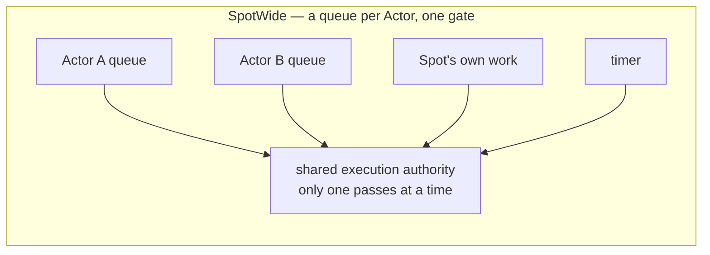
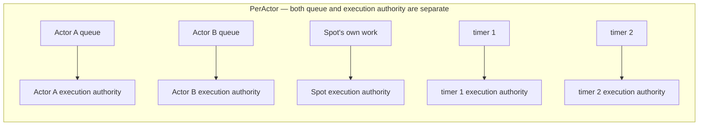
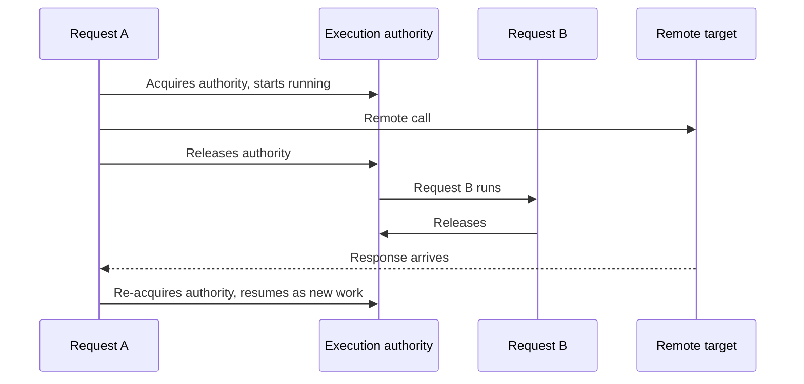

# 2. Spot · Actor Execution Serialization — Splitting Queue And Execution Gate

[Internal structure table of contents](README.en.md) · [Previous: 1. Layer Boundary And Identifier](01-layering.en.md) · [Next: 3. Application And Infrastructure Execution Separation](03-progress-isolation.en.md)

> **What this chapter answers** — the structure that lets an application
> handler get away with having no synchronization code.
>
> **Contract ownership** — the public contract for the queue and the unit
> of execution is owned by [the Actor model](../spec/14-actor-model.en.md)
> and [the Stage wrapper on Spot](../spec/17-stage-wrapper-on-spot.en.md).
> This chapter covers the **structure** that satisfies that contract, and
> the mismatches actually observed across the four implementations.

The structure that lets an application handler get away with having no
synchronization code. It's also the spot that was actually mismatched
most often across the four implementations.

## 1. The Core Decision — Separate Where You Line Up From The Authority To Run

The formal spec requires two different things at once.

- A payload addressed to an Actor is **always submitted to that Actor's
  queue, regardless of execution mode**
  ([Actor Model 「3. Actor Queue」](../spec/14-actor-model.en.md#3-actor-queue)).
- In `SpotWide`, the Actor handler, Spot handler, timer, and lifecycle
  callback of that [Spot](../spec/01-glossary.en.md#spot) — the
  execution unit holding several Actors — run **only one at a time
  across the whole Spot**
  ([Actor Model 「3. Actor Queue」](../spec/14-actor-model.en.md#3-actor-queue)).

The two sentences live in different sections, and only reading them
together produces one structure. **Where you line up (queue) is kept
per Actor; the authority to run (gate) is shared by the Spot.**

### What Happens When This Structure Is Missed

It can go wrong in two directions, and both have actually been
observed.

| Wrong structure | Result |
|---|---|
| A queue per Actor, but the **execution authority is also per Actor** | In `SpotWide`, two Actor handlers of the same Spot run at the same time. The application is touching that Spot's state without synchronization, so it becomes a race condition immediately |
| In `SpotWide`, **the queue itself is merged into one** | This violates the first requirement above. When moving, the remaining work must be split out per Actor, but it's already mixed together and can't be split |

Why the second one is a problem comes up again in
[5. Continuity During A Move](05-relocation-continuity.en.md) — when
the unit of a move is an Actor, only that Actor's remaining work must
be picked out.

### Don't Put A Timer In The Spot Line In PerActor

`PerActor` doesn't stop at splitting by Actor and by Spot — it's also
**per timer**
([Stage Wrapper On Spot 「9. Implementation And Contract-Test Verification Requirements」](../spec/17-stage-wrapper-on-spot.en.md#9-implementation-and-contract-test-verification-requirements)).
Putting two timers together in the Spot line makes different timers
wait on each other.

## 2. The Pitfall When Building Execution Authority

Execution authority can be built either by chaining the next work to
the completion of the previous one, or with a lock and a queue. Use
whichever fits the language. But each implementation approach comes
with its own constraints.

### Pitfall 1 — Handing Work Off Between Threads Rules Out Thread-Bound Storage {#trap-1-thread-local-storage}

It's possible to guarantee execution authority as "only one at a time"
while **not fixing which thread it runs on**. One actual implementation
takes this approach. In this case, two consecutive pieces of work run
on different threads, so any state placed in thread-bound storage
between the two pieces of work disappears.

The approach itself isn't a problem. The problem shows up when another
language's implementation is ported over as-is — if the original
assumed a fixed thread and put context into thread-local storage, the
ported version breaks silently.

### Pitfall 2 — Running In Place When The Queue Is Full Erases Seriality

An actual defect observed in one implementation. When the queue is
full, it must be treated as a submission failure, but **substituting
it with running right there instead** makes it run concurrently with
work already in progress. The premise of serial execution collapses
entirely, and since this path only triggers under high load, it's also
hard to reproduce.

What to do when full differs by queue kind.

**The result is split by submission family, which runtime the queue
lives in, and whether the call's public result has already been
finalized.** The canonical source is
[Spot Messaging 「5.3 Work Put On The Spot Application Queue」](../spec/12-spot-messaging.en.md#53-work-put-on-the-spot-application-queue),
and the gist is as follows.

| Family | Queue location | Result |
|---|---|---|
| Send · one-way | Same runtime | Waits until the send timeout. If even the internal waiting slot is full, `DeadlineExceeded` |
| Send · one-way | Different node | **There's no result.** It has already completed, so it only shows up as an observation |
| Publish (before start) | Same runtime | Waits. If it can't secure a slot, `DeadlineExceeded` |
| Publish (after start) | Local target in the same runtime | **Skips without waiting.** It has already completed |
| Request | Same runtime | Doesn't wait, `CapacityExceeded` |
| Request | Different node | Doesn't wait, `Unavailable` |
| Control claim | Same runtime | A separate bound. Exceeding it gives `CapacityExceeded` |
| Control claim | Different node | `Unavailable` |
| Send-side backpressure | — | Waits for a send-ready notification. This isn't queue saturation but transport-layer flow control |

The standard that splits waiting from finishing immediately is
**whether the caller can receive a result and judge from it**. A
Request can receive one, so it doesn't wait; the send family can't
receive one, so it waits. A failure that happens after an already
completed call has no place to return to, so it's left only as an
observation.

**Running in place is never an option, in any case.**

### Pitfall 3 — Opening A Cut-In Path Makes Order Guarantee Conditional

One implementation has a path that inserts work at the **front** of
the queue. There's only one caller and its use is limited, but the
moment this path exists, the property "what was enqueued first runs
first" stops being unconditional and becomes conditional. A reader
has to check every path for whether it cuts in before they can reason
about order.

**Decision — don't have a cut-in path.** If there's work that must be
handled first, add another queue and state the priority between them
explicitly. Don't use the approach of inserting at front or back of
the same queue.

Concretely, keep **two FIFO lanes** per owner.

| Lane | Holds | Bound |
|---|---|---|
| application lane | Business payload, timer callback | Two axes: count and bytes |
| lifecycle lane | join · leave · relocation · lifecycle control | A separate bound **not shared** with the application lane |

At a turn boundary, which lane to run is decided by a single atomic
judgment. If both are ready, the lifecycle lane goes first
([Actor Model 「3. Actor Queue」](../spec/14-actor-model.en.md#3-actor-queue)).

**Priority alone doesn't prevent starvation.** Two different ceilings
are involved here.

| Ceiling | Fairness between what | Unit counted |
|---|---|---|
| owner occupancy bound | Between different owners | Time |
| lifecycle consecutive-execution bound | Between the two lanes of the same owner | Number of turns the lifecycle lane was picked consecutively |

Even if a turn is given up due to hitting the owner occupancy bound, if
both lanes are still ready when this owner's turn comes back around,
the same priority rule picks lifecycle again. So a **yield debt** is
kept — when the lifecycle lane's consecutive selection hits its bound,
a debt is marked on that owner, and while the debt exists, lifecycle
isn't picked until one application turn has run, as long as the
application lane is ready. Running it clears the debt. The boundary
conditions are defined by
[Actor Model 「3. Actor Queue」](../spec/14-actor-model.en.md#3-actor-queue).

With this rule, even if lifecycle work keeps arriving without a break,
**an application turn eventually gets picked at the handler
boundary.** "Within how many ms" isn't guaranteed yet — the value of
the occupancy bound isn't fixed, and this contract doesn't cover the
case where one running handler goes over the bound.

The order within each lane is exactly the order accepted. **Neither
lane has front insertion.** All four of your implementations currently
fake priority with front insertion or queue reordering, and this
approach makes the order guarantee within the same lane conditional.

### Pitfall 4 — Post-Processing Overlaps The Next Turn

An actual defect observed in one implementation. When work finishes,
deferred post-processing runs, and the order was as follows.

1. Clear the in-progress mark.
2. If anything remains in the queue, **schedule the next run.**
3. Release the lock.
4. **After that**, run the deferred post-processing.

The next work scheduled at step 2 can run concurrently with the
post-processing at step 4. If the post-processing touches that owner's
state, seriality breaks.

**Decision — finish post-processing before releasing execution
authority, or put it back on the queue as new work.**
Post-processing that runs outside the authority is only allowed to
avoid touching that owner's state.

### Pitfall 5 — Decide Reentrancy One Way Or The Other

One implementation **runs right there without going through the queue
if execution is already in progress within that authority.** This is
intentional design — it avoids a deadlock from a call waiting on
itself.

But this is an observable difference in meaning. Allowing reentrancy
lets a nested call run **as part of the current work** and finish
before other work already in the queue. In an implementation that
doesn't allow it, the same code either deadlocks or runs in a
different order.

**Decision — don't allow reentrancy.** This isn't a choice but a spec
rule — a call that waits for a request requiring the same gate, or
waits for a request sent to itself, is **rejected with
`InvalidOperation` before submission**
([Stage Wrapper On Spot 「5. Timer」](../spec/17-stage-wrapper-on-spot.en.md#5-timer)).

**What's prohibited is the public operation.** Split out exactly what's
prohibited as follows.

| Call | Verdict |
|---|---|
| A handler sends a public request to its own Spot · Actor and waits for the result | **Prohibited.** `InvalidOperation` before submission |
| A handler waits on a different target that requires the same gate | **Prohibited.** Same verdict |
| The runtime internally composes an execution context to run a handler | Allowed. This isn't a submission of new work |
| A handler submits work to its own target without waiting for the result | Allowed. It's appended to the back of the queue |

One implementation has a path that runs right there without going
through the queue if execution is already in progress within that
authority. Whether this path touches the first two rows of the table
above needs to be checked exhaustively.

"Before submission" matters. If it fails after the request has gone
out, only a side effect is left remotely and the caller receives a
failure. Letting it pass through via reentrancy makes the nested call
run as part of the current work and finish before other work already
in the queue, so the ordering semantics differ per implementation.

## 3. Execution Resources Mustn't Be Proportional To Spot Count

**Decision — execution resources are proportional to core count, not
Spot count.**

How execution authority is built is free, but **attaching a dedicated
execution resource per authority is not allowed.** One implementation
keeps two dedicated workers per Spot — at least two were needed to
avoid a return-wait blocking on itself. Two per room means 20,000 for
10,000 rooms.

Splitting only the authority over shared execution resources doesn't
have this problem. Authority is "the right to run this owner's work
right now," and which resource runs the work holding that right is a
separate matter.

The problem of a return-wait waiting on itself isn't solved by adding
more resources, but by **putting the returned work back onto the
queue of the same authority.** Then even a single resource has no
deadlock.

## 4. Making The Two Synchronization Points Cheap

In `SpotWide`, an Actor message passes through two points — enqueuing
onto the Actor queue, and acquiring the shared authority. The formal
spec requires both, so they can't be eliminated. Instead, lower the
cost.

**Don't put an independent lock on the Actor queue.** In `SpotWide`,
only one thing runs at a time anyway, so the side dequeuing already
holds the authority. Only the enqueuing side needs protection.

**Make uncontended authority acquisition finish in a single atomic
operation.** If no work is currently running, acquiring authority is
just flipping one mark. Only under contention does it go into a queue.

Without these two, every message grabs a lock twice — in a hot room,
that becomes the throughput ceiling as-is.

## 5. The Cache Cost Of Handing Off Work

The approach explained in [Pitfall 1](#trap-1-thread-local-storage)
has no correctness problem, but it has a cost. When two consecutive
pieces of work run on different execution resources, that Spot's state
is left only in the cache of the previous resource. If one room
handles thousands of operations per second, this cost accumulates.

| Approach | State cache | Resource utilization |
|---|---|---|
| Hand off | Can be lost per work item | Used evenly across resources |
| Pinned to one resource | Retained | A hot Spot piles onto one resource |

**This is a choice the language constrains.** Pinning to one execution
resource requires that language to have something to pin to. A
language that runs on a single event loop has no room to choose.

Both satisfy the contract, so either is fine, but **don't pick by
taste.** In a language where you can choose, if hot Spots are few and
throughput matters, pick pinning. Record which one was chosen in that
language's documentation — it's the first value to check when
comparing performance.

## 6. When Execution Authority Is Released While Waiting

If a handler keeps holding execution authority while waiting for a
remote response, another request to the same Spot is blocked for that
whole time. So there's a way to release and wait.

**On resuming after release, it resumes as new work.** One piece of
work isn't kept alive across the wait span
([Async Execution Policy 「1.1 Submit, Async, and Yield」](../spec/05-async-execution-policy.en.md#11-submit-async-and-yield)).

Only the normal path is drawn. If the Spot shuts down while waiting to
resume, or **the unit gets sealed for a move**, it ends in failure
instead of resuming. A move merely *starting* isn't enough to stop it
— existing messages and timers keep being processed until sealing
([Stage Wrapper On Spot 「5. Timer」](../spec/17-stage-wrapper-on-spot.en.md#5-timer),
[Host Relocate And Shutdown 「12. Admission Per State」](../spec/28-graceful-drain-handoff.en.md#12-admission-per-state)).

### The Design Constraint This Produces

"One piece of work goes from start to finish uninterrupted" is **not
a guarantee.** The only guarantee is "two pieces of work never run
concurrently in one execution authority." So code straddling a release
point can't assume a value read before release is still valid after
resuming. Another request to the same Spot may have changed the state
in between.

This constraint affects **the handler author**, not the
implementation. The per-language guide must explain this point.

### Where You Can't Release

Release can only be used in `SpotWide` User Spots and Instance Spots.
Calling it anywhere else ends in failure **before the remote request
goes out, before the queue changes**
([Async Execution Policy 「1.1 Submit, Async, and Yield」](../spec/05-async-execution-policy.en.md#11-submit-async-and-yield)).
If it fails after the request has gone out, only a side effect is
left remotely and the caller receives a failure.

## 7. Result To Confirm

- In a `SpotWide` Spot, two handlers of different Actors never run at
  the same time.
- Execution resource count doesn't grow proportionally to Spot count.
- Handling one message in `SpotWide` acquires fewer than two locks.
- In a `SpotWide` Spot, a timer callback never runs at the same time
  as a handler.
- In a `PerActor` Spot, handlers of different Actors run at the same
  time.
- In a `PerActor` Spot, callbacks of different timers run at the same
  time.
- An Actor payload is submitted to that Actor's queue regardless of
  execution mode.
- Work submitted while the queue is full doesn't run in place.
- There's no front-insertion path into the queue.
- The lifecycle lane and application lane each have their own bound
  and don't share it.
- When both lanes are ready together, the lifecycle lane runs first.
- Even if lifecycle work keeps arriving without a break, an
  application turn eventually runs.
- When the lifecycle lane is empty and the application lane is picked,
  the consecutive count resets to zero.
- Execution-queue submission reserves both the count and byte axes as
  one operation, and never leaves a state where only one side passed.
- Submitting a large volume of empty payloads still hits the count
  bound.
- Post-processing that runs after work finishes doesn't overlap the
  next piece of work.
- A call that waits on itself within the same execution authority ends
  in failure without a deadlock.
- Work resumed after release runs as new work, and another work item
  under the same authority can run during the wait span.
- Calling from a spot where release isn't allowed fails before the
  remote request goes out.
- In an implementation that hands work off between threads, state
  between pieces of work isn't carried through thread-bound storage.

---

[Internal structure table of contents](README.en.md) · [Previous: 1. Layer Boundary And Identifier](01-layering.en.md) · [Next: 3. Application And Infrastructure Execution Separation](03-progress-isolation.en.md)
