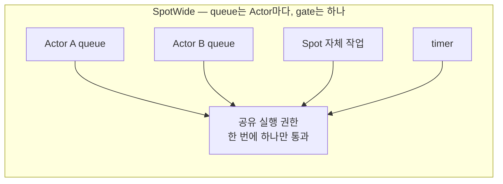
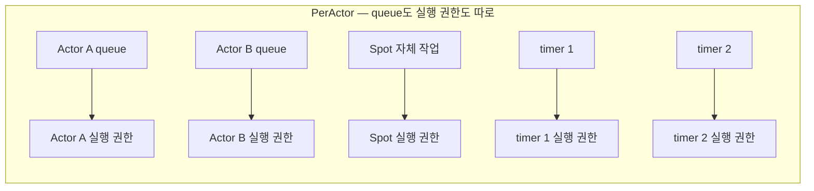
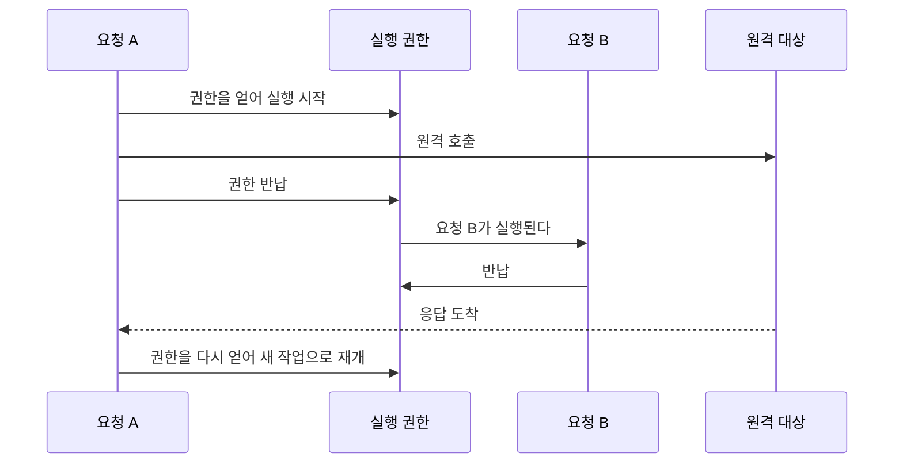

# 2. Spot·Actor 실행 직렬화 — queue와 execution gate를 나눈다

[내부 구조 목차](README.ko.md) · [이전: 1. 계층 경계와 식별자](01-layering.ko.md) · [다음: 3. application과 infrastructure 실행 분리](03-progress-isolation.ko.md)

> **이 장이 답하는 것** — application handler에 동기화 코드가 없어도 되는 이유를 만드는 구조.
>
> **계약 소유** — queue와 실행 단위의 공개 계약은 [Actor 모델](../spec/14-actor-model.ko.md)과
> [Spot 위의 Stage wrapper](../spec/17-stage-wrapper-on-spot.ko.md)가 소유한다.
> 이 장은 그 계약을 만족시키는 **구조**와, 네 구현에서 관찰된 어긋남을 다룬다.

Application handler에 동기화 코드가 없어도 되는 이유를 만드는 구조다. 네 구현 중 실제로
가장 많이 어긋난 자리이기도 하다.

## 1. 핵심 결정 — 줄 서는 곳과 실행 권한을 분리한다

정식 spec은 서로 다른 두 가지를 각각 요구한다.

- Actor 앞으로 온 payload는 **실행 모드와 무관하게 항상 그 Actor의 queue에 제출한다**
  ([Actor 모델 「3. Actor queue」](../spec/14-actor-model.ko.md#3-actor-queue)).
- `SpotWide`에서는 Actor 여럿을 담는 실행 단위인 그 [Spot](../spec/01-glossary.ko.md#spot)의
  Actor handler·Spot handler·timer·lifecycle callback이
  **전체에서 한 번에 하나만** 실행된다
  ([Actor 모델 「3. Actor queue」](../spec/14-actor-model.ko.md#3-actor-queue)).

두 문장은 각각 다른 절에 있고, 함께 읽어야 하나의 구조가 나온다. **줄 서는 곳(queue)은
Actor마다 두고, 실행 권한(gate)은 Spot이 공유한다.**

### 이 구조를 놓치면 생기는 일

두 가지 방향으로 틀릴 수 있고, 실제로 둘 다 관찰되었다.

| 잘못된 구조 | 결과 |
|---|---|
| Actor마다 queue를 두면서 **실행 권한까지 Actor마다** 둔다 | `SpotWide`에서 같은 Spot의 두 Actor handler가 동시에 실행된다. Application은 그 Spot의 상태를 동기화 없이 만지는 중이므로 곧바로 경쟁 상태가 된다 |
| `SpotWide`에서 **queue 자체를 하나로 합친다** | 위 첫 번째 요구를 어긴다. 이동할 때 Actor별로 남은 작업을 갈라내야 하는데 이미 섞여 있어 갈라낼 수 없다 |

두 번째가 왜 문제인지는 [5. 이동 중 연속성](05-relocation-continuity.ko.md)에서 다시
나온다 — 이동 단위가 Actor일 때 그 Actor의 남은 작업만 골라내야 한다.

### PerActor에서 timer를 Spot 줄에 넣지 않는다

`PerActor`는 Actor별·Spot별로 나누는 것으로 끝이 아니라 **timer마다도 따로**다
([Stage wrapper on Spot 「9. 구현 및 contract test 검증 요구」](../spec/17-stage-wrapper-on-spot.ko.md#9-구현-및-contract-test-검증-요구)). timer 두 개를
Spot 줄에 함께 넣으면 서로 다른 timer가 서로를 기다린다.

## 2. 실행 권한을 만들 때의 함정

실행 권한은 앞선 작업의 완료에 다음 작업을 잇는 방식으로도, lock과 대기열로도 만들 수
있다. 언어에 맞는 쪽을 쓴다. 다만 구현 방식에 따라오는 제약이 있다.

### 함정 1 — 작업을 thread에 넘겨가며 실행하면 thread에 매인 저장소를 쓸 수 없다 {#trap-1-thread-local-storage}

실행 권한을 "한 번에 하나"로만 보장하고 **어느 thread에서 실행할지는 고정하지 않는**
구현이 가능하다. 실제로 한 구현이 이 방식이다. 이때 연속된 두 작업이 서로 다른
thread에서 실행되므로, thread에 매인 저장소에 작업 사이의 상태를 두면 그 상태는
사라진다.

이 방식 자체는 문제가 없다. 문제는 다른 언어의 구현을 그대로 옮길 때 생긴다 — 원본이
thread 고정을 전제로 thread-local에 문맥을 넣어 두었다면, 옮긴 쪽에서 조용히 깨진다.

### 함정 2 — 대기열이 가득 찼을 때 그 자리에서 실행하면 직렬성이 사라진다

한 구현에서 실제로 관찰된 결함이다. 대기열이 가득 차면 제출 실패로 처리해야 하는데,
**그 자리에서 바로 실행하는 것으로 대체**하면 이미 실행 중인 작업과 동시에 실행된다.
직렬 실행이라는 전제 자체가 무너지고, 이 경로는 부하가 높을 때만 발생하므로 재현도
어렵다.

가득 찼을 때 무엇을 할지는 대기열 종류마다 다르다.

**결과는 제출 계열, 대기열이 어느 runtime에 있는가, 호출의 public 결과가 이미
확정됐는가로 갈린다.** 정본은
[Spot 메시징 「5.3 Spot application queue에 들어가는 작업」](../spec/12-spot-messaging.ko.md#53-spot-application-queue에-들어가는-작업)이며 요지는 다음과 같다.

| 계열 | 대기열 위치 | 결과 |
|---|---|---|
| Send·one-way | 같은 runtime | send timeout까지 기다린다. 내부 대기 자리까지 차면 `DeadlineExceeded` |
| Send·one-way | 다른 node | **결과가 없다.** 이미 완료했으므로 관측으로만 남는다 |
| Publish (시작 전) | 같은 runtime | 기다린다. 확보 못 하면 `DeadlineExceeded` |
| Publish (시작 후) | 같은 runtime의 local target | **기다리지 않고 건너뛴다.** 이미 완료했다 |
| Request | 같은 runtime | 기다리지 않고 `CapacityExceeded` |
| Request | 다른 node | 기다리지 않고 `Unavailable` |
| Control claim | 같은 runtime | 별도 한도. 넘기면 `CapacityExceeded` |
| Control claim | 다른 node | `Unavailable` |
| 송신 backpressure | — | 송신 준비 알림을 기다린다. 대기열 포화가 아니라 전송 계층의 흐름 제어다 |

기다리는 것과 즉시 끝내는 것을 가르는 기준은 **호출자가 결과를 받아 판단할 수 있는가**다.
Request는 받을 수 있으므로 기다리지 않고, send 계열은 받을 수 없으므로 기다린다. 이미
완료한 호출의 뒤에서 일어난 실패는 돌려줄 자리가 없으므로 관측으로만 남긴다.

**그 자리에서 실행하는 것은 어느 경우에도 선택지가 아니다.**

### 함정 3 — 새치기 경로를 열면 순서 보장이 조건부가 된다

한 구현에는 대기열 **앞쪽에** 작업을 넣는 경로가 있다. 호출자는 하나뿐이고 용도도
한정적이지만, 이 경로가 존재하는 순간 "먼저 넣은 것이 먼저 실행된다"는 성질이
무조건이 아니라 조건부가 된다. 읽는 사람은 어느 경로가 새치기하는지 전부 확인해야
순서를 추론할 수 있다.

**결정 — 새치기 경로를 두지 않는다.** 먼저 처리해야 할 작업이 있으면 대기열을 하나 더
두고 그 사이의 우선순위를 명시한다. 같은 대기열에 앞뒤로 넣는 방식은 쓰지 않는다.

구체적으로 owner마다 **두 개의 FIFO lane**을 둔다.

| lane | 담는 것 | 한도 |
|---|---|---|
| application lane | 업무 payload, timer callback | 건수·byte 두 축 |
| lifecycle lane | join·leave·relocation·lifecycle control | application lane과 **공유하지 않는** 별도 한도 |

turn 경계에서 어느 lane을 실행할지 하나의 원자적 판단으로 정한다. 둘 다 ready이면
lifecycle lane이 먼저다([Actor 모델 「3. Actor queue」](../spec/14-actor-model.ko.md#3-actor-queue)).

**우선순위만으로는 굶주림을 막지 못한다.** 여기에는 서로 다른 두 상한이 관여한다.

| 상한 | 무엇 사이의 공정성인가 | 세는 단위 |
|---|---|---|
| owner 점유 상한 | 서로 다른 owner 사이 | 시간 |
| lifecycle 연속 실행 상한 | 같은 owner의 두 lane 사이 | lifecycle lane을 연속으로 고른 turn 수 |

owner 점유 상한에 걸려 turn을 놓아도, 이 owner에 turn이 돌아왔을 때 두 lane이 여전히
ready이면 같은 우선순위 규칙이 lifecycle을 다시 고른다. 그래서 **양보 부채**를 둔다 —
lifecycle lane 연속 선택이 상한에 도달하면 그 owner에 부채를 표시하고, 부채가 있는 동안에는
application lane이 ready인 한 application turn을 한 번 실행할 때까지 lifecycle을 고르지
않는다. 실행하면 부채를 지운다. 경계 조건은
[Actor 모델 「3. Actor queue」](../spec/14-actor-model.ko.md#3-actor-queue)이 정의한다.

이 규칙으로 lifecycle 작업이 끊임없이 도착해도 **handler 경계에서 application turn이
결국 선택된다.** "몇 ms 안에"는 아직 보장하지 않는다 — 점유 상한의 값이 정해져 있지 않고,
실행 중인 handler 하나가 상한을 넘겨 도는 경우는 이 계약이 다루지 않기 때문이다.

각 lane 안의 순서는 수락 순서 그대로다. **어느 lane에도 앞쪽 삽입은 없다.** 네 구현이
현재 모두 앞쪽 삽입이나 대기열 재구성으로 우선순위를 흉내 내는데, 이 방식은 같은 lane
안의 순서 보장을 조건부로 만든다.

### 함정 4 — 뒤처리 작업이 다음 turn과 겹친다

한 구현에서 실제로 관찰된 결함이다. 작업이 끝날 때 미뤄 둔 뒤처리를 실행하는데, 그
순서가 이렇다.

1. 실행 중 표시를 내린다.
2. 대기열에 남은 것이 있으면 **다음 실행을 예약한다.**
3. 잠금을 놓는다.
4. **그 뒤에** 미뤄 둔 뒤처리를 실행한다.

2번에서 예약된 다음 작업이 4번의 뒤처리와 동시에 실행될 수 있다. 뒤처리가 그 owner의
상태를 만지면 직렬성이 깨진다.

**결정 — 뒤처리는 실행 권한을 놓기 전에 끝내거나, 새 작업으로 대기열에 다시 넣는다.**
권한 바깥에서 실행하는 뒤처리는 그 owner의 상태를 만지지 않는 것만 허용한다.

### 함정 5 — 재진입을 허용할지 한쪽으로 정한다

한 구현은 **이미 그 권한 안에서 실행 중이면 대기열을 거치지 않고 그 자리에서
실행한다.** 의도적인 설계다 — 자기 자신을 기다리는 호출이 교착에 빠지는 것을 피한다.

그러나 이것은 관찰 가능한 의미 차이다. 재진입을 허용하면 중첩 호출이 **현재 작업의
일부로** 실행되어, 대기열에 있던 다른 작업보다 먼저 끝난다. 허용하지 않는 구현에서는
같은 코드가 교착이거나 순서가 다르다.

**결정 — 재진입을 허용하지 않는다.** 이것은 선택이 아니라 spec 규정이다 — 같은 gate가
필요한 요청을 기다리거나 자신에게 보낸 요청을 기다리는 호출은 **제출 전에
`InvalidOperation`으로 거부한다**
([Stage wrapper on Spot 「5. Timer」](../spec/17-stage-wrapper-on-spot.ko.md#5-timer)).

**금지 대상은 public operation이다.** 무엇이 금지인지 정확히 나누면 이렇다.

| 호출 | 판정 |
|---|---|
| handler가 자기 Spot·Actor에 public request를 보내고 결과를 기다린다 | **금지.** 제출 전에 `InvalidOperation` |
| handler가 같은 gate를 요구하는 다른 대상을 기다린다 | **금지.** 같은 판정 |
| runtime이 handler를 실행하려고 내부적으로 실행 문맥을 합성한다 | 허용. 이것은 새 작업의 제출이 아니다 |
| handler가 결과를 기다리지 않고 자기 대상에 작업을 제출한다 | 허용. 대기열 뒤에 붙는다 |

한 구현은 이미 그 권한 안에서 실행 중이면 대기열을 거치지 않고 그 자리에서 실행하는
경로를 갖고 있다. 이 경로가 위 표의 첫 두 줄에 닿는지 전수 확인이 필요하다.

"제출 전"이 중요하다. 요청이 나간 뒤에 실패하면 원격에 부작용만 남기고 caller는 실패를
받는다. 재진입으로 통과시키면 중첩 호출이 현재 작업의 일부로 실행되어 대기열에 있던 다른
작업보다 먼저 끝나므로, 순서 의미가 구현마다 달라진다.

## 3. 실행 자원이 Spot 수에 비례하면 안 된다

**결정 — 실행 자원은 Spot 수가 아니라 코어 수에 비례한다.**

실행 권한을 만드는 방법은 자유지만, **권한마다 전용 실행 자원을 붙이는 것은 안 된다.**
한 구현은 Spot마다 전용 작업자 두 개를 둔다 — 반납 대기가 자기 자신을 기다려 멈추는
것을 피하려면 최소 두 개가 필요했기 때문이다. 방 하나에 두 개면 방 1만 개에 2만 개다.

공유 실행 자원 위에서 권한만 나누면 이 문제가 없다. 권한은 "지금 이 owner의 작업을
실행할 자격"이고, 그 자격을 가진 작업을 어느 자원이 실행할지는 별개다.

반납 대기가 자기 자신을 기다리는 문제는 자원을 늘려 푸는 것이 아니라, 반납한 작업을
**같은 권한의 대기열에 다시 넣어** 푼다. 그러면 자원 하나로도 교착이 없다.

## 4. 두 동기화 지점을 싸게 만든다

`SpotWide`에서 Actor message는 두 지점을 거친다 — Actor 대기열에 넣기, 그리고 공유
권한 얻기. 정식 spec이 둘 다 요구하므로 없앨 수 없다. 대신 비용을 낮춘다.

**Actor 대기열에 독립 잠금을 두지 않는다.** `SpotWide`에서는 어차피 한 번에 하나만
실행되므로, 대기열에서 꺼내는 쪽은 이미 권한을 쥐고 있다. 넣는 쪽만 보호하면 된다.

**무경합 시 권한 획득이 원자 연산 하나로 끝나게 한다.** 실행 중인 작업이 없으면 권한
획득은 표시 하나를 바꾸는 것으로 충분하다. 경합이 있을 때만 대기열에 들어간다.

이 두 가지를 하지 않으면 message 하나마다 잠금을 두 번 잡는다 — 뜨거운 방에서 그대로
처리량 상한이 된다.

## 5. 작업을 넘겨가며 실행할 때의 캐시 비용

[함정 1](#trap-1-thread-local-storage)에서
설명한 방식은 정확성 문제가 없지만 비용이 있다. 연속된 두 작업이 다른 실행 자원에서
실행되면, 그 Spot의 상태가 이전 자원의 캐시에만 남아 있다. 방 하나가 초당 수천 건을
처리하면 이 비용이 누적된다.

| 방식 | 상태 캐시 | 자원 활용 |
|---|---|---|
| 넘겨가며 실행 | 작업마다 잃을 수 있다 | 자원 수만큼 고르게 쓴다 |
| 같은 자원에 고정 | 유지된다 | 뜨거운 Spot이 한 자원에 몰린다 |

**언어가 제약하는 선택이다.** 실행 자원 하나에 고정하려면 그 언어에 고정할 대상이
있어야 한다. 이벤트 루프 하나로 도는 언어에는 고를 여지가 없다.

둘 다 계약을 만족하므로 어느 쪽이든 되지만, **취향으로 고르지 않는다.** 고를 수 있는
언어라면 뜨거운 Spot이 소수이고 처리량이 중요한 경우 고정 쪽을 택한다. 어느 쪽을
골랐는지는 그 언어의 문서에 적는다 — 성능을 비교할 때 먼저 확인해야 하는 값이다.

## 6. 기다릴 때 실행 권한을 반납하는 경우

handler가 원격 응답을 기다리는 동안 실행 권한을 계속 쥐면, 같은 Spot의 다른 요청이 그
시간만큼 막힌다. 그래서 반납하고 기다리는 방법이 있다.

**반납한 뒤 재개할 때는 새 작업으로 재개한다.** 하나의 작업이 대기 구간을 가로질러
유지되지 않는다([비동기 실행 정책 「1.1 Submit, Async와 Yield」](../spec/05-async-execution-policy.ko.md#11-submit-async와-yield)).

정상 경로만 그렸다. 재개를 기다리는 중 Spot이 종료되거나 **그 단위가 이동을 위해 봉인되면**
재개하지 않고 실패로 끝난다. 이동이 *시작*되는 것만으로는 멈추지 않는다 — 봉인 전까지는
기존 message와 timer를 계속 처리한다
([Stage wrapper on Spot 「5. Timer」](../spec/17-stage-wrapper-on-spot.ko.md#5-timer),
[Host Relocate와 Shutdown 「12. State별 admission」](../spec/28-graceful-drain-handoff.ko.md#12-state별-admission)).

### 여기서 나오는 설계 제약

"작업 하나가 처음부터 끝까지 끊기지 않는다"는 **보장이 아니다.** 보장은 "한 실행
권한에서 두 작업이 동시에 실행되지 않는다"뿐이다. 따라서 반납 지점을 사이에 둔 코드는
반납 전에 읽은 값이 재개 후에도 유효하다고 가정할 수 없다. 같은 Spot의 다른 요청이 그
사이에 상태를 바꿨을 수 있다.

이 제약은 구현이 아니라 **handler 작성자에게 영향을 준다.** 언어별 가이드가 이 지점을
설명해야 한다.

### 반납할 수 없는 자리

반납은 `SpotWide` User Spot과 Instance Spot에서만 쓸 수 있다. 그 밖의 자리에서 호출하면
**원격 요청을 보내기 전에, queue를 바꾸기 전에** 실패로 끝낸다
([비동기 실행 정책 「1.1 Submit, Async와 Yield」](../spec/05-async-execution-policy.ko.md#11-submit-async와-yield)). 요청이 나간 뒤에
실패하면 원격에 부작용만 남기고 caller는 실패를 받는다.

## 7. 확인할 결과

- `SpotWide` Spot에서 서로 다른 Actor의 handler 두 개가 동시에 실행되지 않는다.
- 실행 자원 수가 Spot 수에 비례해 늘지 않는다.
- `SpotWide`에서 message 하나를 처리할 때 잡는 잠금이 둘보다 적다.
- `SpotWide` Spot에서 timer callback이 handler와 동시에 실행되지 않는다.
- `PerActor` Spot에서 서로 다른 Actor의 handler가 동시에 실행된다.
- `PerActor` Spot에서 서로 다른 timer의 callback이 동시에 실행된다.
- 실행 모드와 무관하게 Actor payload가 그 Actor의 queue에 제출된다.
- 대기열이 가득 찬 상태에서 제출한 작업이 그 자리에서 실행되지 않는다.
- 대기열 앞쪽에 넣는 경로가 없다.
- lifecycle lane과 application lane이 각각 자기 한도를 가지며 서로 공유하지 않는다.
- 두 lane이 함께 ready이면 lifecycle lane이 먼저 실행된다.
- lifecycle 작업이 끊임없이 도착해도 application turn이 결국 실행된다.
- lifecycle lane이 비어 application lane을 고르면 연속 횟수가 0으로 돌아간다.
- 실행 대기열 제출이 건수와 byte 두 축을 하나의 작업으로 예약하고, 한쪽만 통과한 상태가
  생기지 않는다.
- 빈 payload를 대량 제출해도 건수 한도에 걸린다.
- 작업이 끝난 뒤 실행되는 뒤처리가 다음 작업과 겹치지 않는다.
- 같은 실행 권한 안에서 자기 자신을 기다리는 호출이 교착 없이 실패로 끝난다.
- 반납 후 재개한 작업이 새 작업으로 실행되고, 대기 구간 동안 같은 권한의 다른 작업이
  실행될 수 있다.
- 반납을 허용하지 않는 자리에서 호출하면 원격 요청이 나가기 전에 실패한다.
- 작업을 thread에 넘겨가며 실행하는 구현에서, thread에 매인 저장소로 작업 사이 상태를
  전달하지 않는다.

---

[내부 구조 목차](README.ko.md) · [이전: 1. 계층 경계와 식별자](01-layering.ko.md) · [다음: 3. application과 infrastructure 실행 분리](03-progress-isolation.ko.md)
