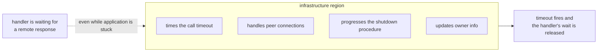
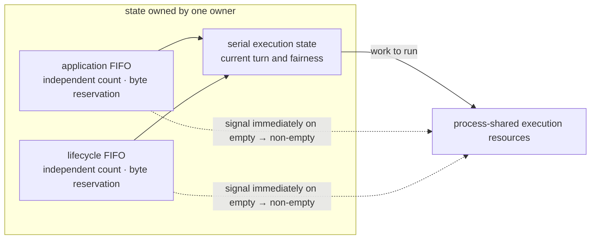

# 3. Application And Infrastructure Execution Separation

[Internal structure table of contents](README.en.md) · [Previous: 2. Spot · Actor Execution Serialization — splitting queue and execution gate](02-serialization.en.md) · [Next: 4. Operation Completion Confirmation — Only One Finalizes](04-completion.en.md)

> **What this chapter answers** — what must keep progressing while a
> handler is stuck.
>
> **Contract ownership** — the receive bound and backpressure contract
> is owned by [the Framework API](../spec/06-framework-api.en.md), and
> the meaning of async completion by
> [the Async Execution Policy](../spec/05-async-execution-policy.en.md).
> This chapter covers the **structure** that satisfies that contract and
> the failures that become visible when execution regions are mixed.

While an application handler is waiting for a remote response, who
times out that call? If the timeout also waits in the same line as
the stuck handler, the call never finishes. This document covers how
to prevent that self-deadlock structurally.

## 1. The Core Decision — Split Into Two Execution Regions

Runtime work splits into two groups of different character.

| Region | What it does | Progress condition |
|---|---|---|
| application | Handler execution, Spot · Actor message, timer callback, session callback | Keeps order per Spot owner |
| infrastructure | Peer accept, send-ready notification, call-completion confirmation, owner-info update, move procedure, shutdown procedure | **Progresses regardless of what application is waiting on** |

The formal spec's requirement is stronger than "progresses
independently" — infrastructure work progresses in **an execution
region the application handler can't occupy**
([Framework API 「8.2 Handler Execution Object And Dependency Lifetime」](../spec/06-framework-api.en.md#82-handler-execution-object-and-dependency-lifetime)).

This diagram is the whole of this document. If the arrow breaks, the
handler ends up blocking the very timeout of the response it's
waiting for.

## 2. Why Separation, Not A Reserved Section

The same queue can reserve "N slots for infrastructure only." This
approach also prevents starvation, but **loses the following
properties.**

First, the bound overlaps across two axes. When submission is
rejected, neither the caller nor the operator can tell "did this hit
the overall bound, or my own share's bound."

Second, and more importantly — a reservation guarantees only a
**slot**, not **progress**. If application work is waiting while
running, that execution resource is still tied up. Even with a slot
free, if there's no one to run it, infrastructure work can't progress.

The way the formal spec solves this problem is also separation, not
reservation — when pending-processing bytes hit the ceiling, **only
new application receiving stops**, while response receiving, runtime
control processing, and send-ready notification keep being processed
([Framework API 「2.1 Keeping Received Payload From Growing Memory Indefinitely」](../spec/06-framework-api.en.md#21-keeping-received-payload-from-growing-memory-indefinitely)).

**Decision — don't set aside a reserved section that pre-carves out
execution slots.** Starvation is prevented by region separation. This
is a part the formal spec left undecided that internals decides.

This doesn't mean "there's only one bound." The spec requires three
bounds with different purposes to coexist: the per-process
pending-processing byte ceiling and the internal response-processing
budget defined by
[Framework API 「2.1 Keeping Received Payload From Growing Memory
Indefinitely」](../spec/06-framework-api.en.md#21-keeping-received-payload-from-growing-memory-indefinitely),
and the send-space waiting-slot bound defined by
[Asynchronous Execution Policy 「1.3 One-Way
Submit」](../spec/05-async-execution-policy.en.md#13-one-way-submit).
Each blocks a different target, so they aren't merged into one. Only
**splitting shares within the same queue** is what's eliminated.

## 3. Observation Doesn't Block Progress

A status subscriber and metric collector **occupy no region's progress
authority.** If a slow subscriber slowed down message processing, the
service would get slower simply because observation was turned on.

The slot sent to a subscriber has a bound, and when it overflows, it
catches up by **coalescing into the latest status per source**. The
stream isn't cut just because the slot filled up
([Runtime Status And Operational Diagnostics 「3. Querying Current State And Observing Changes」](../spec/24-runtime-monitoring.en.md#3-querying-current-state-and-observing-changes)).
Conversely, it doesn't slow down message processing either.

## 4. How Resources Are Split Between The Two Regions

§1 only says the two regions must progress independently. How much
resource to give each is the remaining decision, and both extremes are
a problem.

| Allocation | Problem |
|---|---|
| Only one resource for infrastructure | Completion processing, peer management, and moves all pass through that one resource. As peers grow, this becomes the bottleneck |
| Generous for infrastructure too | Conflicts with [2. Spot · Actor Execution Serialization](02-serialization.en.md)'s resource constraint. Combining both allocations exceeds core count |

**Decision — resources are allocated per process, and don't grow with
topology or [Spot](../spec/01-glossary.en.md#spot) count.**
Infrastructure work is mostly short and non-blocking, so it's covered
by fewer resources than application.

### Dedicated Resource Doesn't Mean A Physical Thread

**Decision — the contract is not "a dedicated thread" but
"infrastructure progresses whenever application is entirely waiting."**
This is because the four languages' execution models differ.

| Language | Execution resource | How dedication is satisfied |
|---|---|---|
| C++ | OS worker pool | Keeps a dedicated worker for infrastructure |
| .NET | Serial drain over a thread pool | Submits infrastructure work to a separate lane |
| Java | Virtual thread per task | Attaches the infrastructure lane to a separate executor |
| Node | **A single event loop** | Physical separation is impossible. Only the lane is separated |

Node can't physically build a dedicated resource since it has a single
event loop. So the contract is split as follows.

- **Guaranteed** — after an application handler yields with `await`,
  infrastructure work progresses. This holds even when every
  application work item is waiting for a result.
- **Not guaranteed** — progress while an application handler holds the
  CPU without yielding. This isn't a contract violation but the
  application's own responsibility. The guidance is to move a
  long-running synchronous computation to a worker.

`Task`, `Promise`, and virtual thread are all recognized as execution
resources under this contract. The criterion isn't the data type but
**whether it progresses after yielding.**

The observation standard for this decision isn't resource count but
§1's progress condition. Put every application work item into a
waiting state (yielded) at once and confirm infrastructure still
progresses.

## 5. How Far Backpressure Propagates Upward

If the boundary for propagating "sending is blocked" is undefined, a
caller cannot predict whether the same situation waits or fails
immediately.

**Decision — these three steps apply only to the send · publish ·
one-way family.**

1. If the first submission is rejected, **wait for send space to open
   up until a fixed time.**
2. If space opens within the time, submit **once.**
3. If the time runs out first, end with `DeadlineExceeded`
   ([Async Execution Policy 「1.3 One-way submit」](../spec/05-async-execution-policy.en.md#13-one-way-submit)).

**The Request family doesn't wait.** If the same runtime's Spot · Actor
queue is full, it ends immediately with `CapacityExceeded`; if it's a
different node's queue, with `Unavailable`
([Spot Messaging 「5.3 Work Put On The Spot Application Queue」](../spec/12-spot-messaging.en.md#53-work-put-on-the-spot-application-queue)).
Request has no reason to wait since the caller can receive a result
and judge whether to retry. The send family, by contrast, has no
result to return, so the caller can't judge, and so it waits.

**These steps apply only to the span before the public result is
finalized.** A failure that happens after an already completed call
doesn't fall here — a skipped local target after publish has started,
a dropped one-way during a move, or a target admission failure of a
completed send are examples. These have no result to return to the
caller, so they're left only as observations.

While waiting, that work must not hold execution authority. Holding it
while waiting blocks another request to the same Spot for as long as
it waits for send space.

**Decision — the waiting slot itself also has a bound.** If the
waiting slots are full, it ends immediately with `DeadlineExceeded`
without waiting
([Asynchronous Execution Policy 「1.3 One-Way
Submit」](../spec/05-async-execution-policy.en.md#13-one-way-submit)).
The fact of being backpressured itself isn't a value the caller receives.
`Backpressured` isn't a public terminal result. Without a bound, when
the peer is slow, this side's memory would keep growing indefinitely,
following the peer's processing speed.

The receive-side bound goes the other direction. When
pending-processing bytes hit the ceiling, **only new application
receiving stops**, while response receiving, runtime control
processing, and send-ready notification keep being processed
([Framework API 「2.1 Keeping Received Payload From Growing Memory Indefinitely」](../spec/06-framework-api.en.md#21-keeping-received-payload-from-growing-memory-indefinitely)).
Stopping receiving altogether would also block the responses mixed in
there, causing a deadlock.

Some multiplexed receive paths use a binding that does not report the complete message
length before `Recv`. Such a path cannot distinguish an application message from a control
message until after the raw `Recv`. To keep control processing available, it must permit a
limited number of raw receives for classification.

Let `M` be `MaxMessageSize` and `R` be the number of raw-receive reservations that may be
held concurrently. The bytes received for classification cannot exceed `HWM + R * M`.
When a record is classified as control, it is not added to application pending bytes and
its reservation is returned immediately. An application record adds its payload bytes and
keeps the reservation until it reaches a terminal state.

The HWM therefore prevents unbounded admission of new application work. Only the finite
classification span required for control progress may extend beyond it. If a binding can
inspect the length in advance, it needs no such span and stops a new application `Recv`
directly at the HWM.

A StreamNode checks its complete client-to-server message separately on
the Core STREAM inbound path. The measured size is header bytes plus
payload bytes, excluding the 6-byte prefix, and the StreamNode default is
`64 KiB`. This cap isn't applied to a server-to-client outbound message.

**Decision — `R` does not grow with load.** The HWM is not an exact cutoff. It signals
that receive-side processing is approaching its limit, and receiving must stop for that
state to propagate to the sender as backpressure
([Framework API 「2.1 Keeping Received Payload From Growing Memory Indefinitely」](../spec/06-framework-api.en.md#21-keeping-received-payload-from-growing-memory-indefinitely)).
If `R` scales with connection count or pending message count, a larger load also permits
more raw receives. That weakens the signal when the strongest backpressure is needed.
`R` is therefore a fixed allowance selected by configuration. The guarantee is not an
exact cutoff; it is that the excess above the HWM does not grow with load.

`R` is a different axis from the count/byte/elapsed-time bounds in
[7. Receive And Dispatch Loop 「6. Read Multiple Items At Once From A Socket」](07-dispatch-loop.en.md#6-read-multiple-items-at-once-from-a-socket).
Those three decide **how much to read from one connection per
wake-up**, while `R` decides **how many raw receives that haven't
finished classification can be outstanding at once.** They aren't
merged into the same value.

## 6. Don't Silently Drop On Exceeding A Bound

**Decision — when a bounded resource such as ordinary execution or
processing cannot admit work, it ends in a result the caller can
observe.** The runtime does not create an unbounded backlog behind that
bounded resource, silently drop the work, or secretly resubmit it later
([Async Execution Policy 「1.3 One-way submit」](../spec/05-async-execution-policy.en.md#13-one-way-submit)).

If a full temporary response slot **drops and cleans up the response,**
the waiting caller receives no notice at all
and hangs until the timeout fires. The cause is "not enough storage
slot," but what the caller sees is "no response" — nearly impossible
to diagnose.

A bound records its scope of application together. Even the same unit
is a different value if the purpose differs.

| Bound | Measured by | Scope |
|---|---|---|
| Execution queue | Two axes: count and bytes (includes fixed per-work cost, counts running work too) | One execution authority |
| Pending processing | Sum of payload bytes | One process's application receiving |
| Pending during a move | No relocation-specific bound | Work accepted before the seal keeps its reservation, but post-seal ingress does not reuse the ordinary execution-lane bound. Transport, deadline, and cancellation limits remain |

Why the bound is measured in bytes rather than count is covered by
[8. Object Kind And Activation 「6. Which Unit Memory Accounting Uses」](08-object-lifecycle.en.md#6-which-unit-memory-accounting-uses).

The basis for not giving pending-during-a-move a separate bound is
[Complete Host Relocation Flow 「9. Moving Pending Messages, Timers, And Sessions」](../spec/30-host-relocation-flow.en.md#9-moving-pending-messages-timers-and-sessions),
and its hold, restore, and relay order is covered by
[5. Continuity During A Move](05-relocation-continuity.en.md).

## 7. The Implementation Constraint This Decision Produces

Splitting into two regions requires being able to **tell which region
is currently executing.** If infrastructure-only work is called from
an application context, or the reverse, the point of splitting them
disappears.

An execution-context marker identifies the active region, and a wrong
combination **ends in failure without waiting**. Treating it as a wait
would deadlock, and letting it pass would break the separation, so
failure is correct.

Each owner keeps the two regions in physically separate FIFOs. The application FIFO and
lifecycle FIFO do not share count/byte reservations or admission state. Already-accepted
lifecycle work must still be enqueued and run when the application FIFO is full. The
priority and starvation-prevention rule between the FIFOs is described in
[2. Spot And Actor Execution Serialization](02-serialization.en.md).

Increasing the number of owners does not create one execution thread or executor per owner.
The owner holds its FIFOs and execution state, while the resources that run work are shared
by the process. The path that puts the first item into an empty FIFO immediately signals or
calls back into the shared execution resource. Starting the next turn therefore does not
depend on periodically scanning owners.

An execution-context marker distinguishes the active region. Tying this marker only to a
thread kind cannot represent Node's single event loop or a .NET path running over a thread
pool. The execution mechanism may differ by language, but a call from the wrong region must
fail without waiting in every runtime.

## 8. Result To Confirm

- With an application handler kept waiting, that call's timeout fires.
- With an application handler kept waiting, the shutdown procedure
  progresses.
- With an application handler kept waiting, a new peer connection is
  accepted.
- A slow status subscriber doesn't slow down message processing speed.
- When pending-processing bytes hit the ceiling, only application
  receiving stops while response receiving continues.
- Work that exceeds a bound within the span before the public result
  is finalized doesn't silently disappear, and ends in a result the
  caller observes.
- A failure after an already completed call (a skip after publish has
  started, a target failure of a completed send) doesn't change the
  caller's result and is left only as an observation.
- Calling infrastructure-only work from an application context fails
  without waiting.
- Infrastructure execution resources don't grow with topology count or
  Spot count.
- Each owner has separate application/lifecycle FIFOs and admission
  reservations.
- The first work entering an empty FIFO wakes execution resources
  without waiting for a periodic scan.
- Work waiting for send space doesn't hold execution authority.
- When the send-wait slot is full, it fails without waiting.

---

[Internal structure table of contents](README.en.md) · [Previous: 2. Spot · Actor Execution Serialization](02-serialization.en.md) · [Next: 4. Operation Completion Confirmation](04-completion.en.md)
