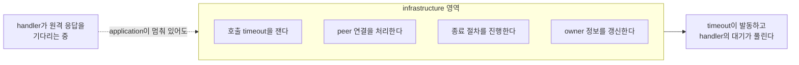

# 3. application과 infrastructure 실행 분리

[내부 구조 목차](README.ko.md) · [이전: 2. Spot·Actor 실행 직렬화 — queue와 execution gate를 나눈다](02-serialization.ko.md) · [다음: 4. operation 완료 확정 — 한 번만 확정한다](04-completion.ko.md)

> **이 장이 답하는 것** — handler가 멈춰 있는 동안 무엇이 계속 진행해야 하는가.
>
> **계약 소유** — 수신 한도와 backpressure 계약은 [Framework API](../spec/06-framework-api.ko.md)가,
> 비동기 완료 의미는 [비동기 실행 정책](../spec/05-async-execution-policy.ko.md)이 소유한다.
> 이 장은 그 계약을 만족시키는 **구조**와, 네 구현에서 관찰된 어긋남을 다룬다.

Application handler가 원격 응답을 기다리는 동안, 그 호출의 timeout은 누가 재는가?
handler가 멈춰 있는데 timeout도 handler와 같은 줄에서 기다린다면 그 호출은 영원히
끝나지 않는다. 이 문서는 그런 자기 교착을 구조로 막는 방법을 다룬다.

## 1. 핵심 결정 — 두 실행 영역을 나눈다

runtime의 작업은 성격이 다른 두 무리로 나뉜다.

| 영역 | 하는 일 | 진행 조건 |
|---|---|---|
| application | handler 실행, Spot·Actor message, timer callback, session callback | Spot 소유자별 순서를 지킨다 |
| infrastructure | peer 수락, 송신 준비 알림, 호출 완료 확정, owner 정보 갱신, 이동 절차, 종료 절차 | **application의 대기와 무관하게 진행한다** |

정식 spec의 요구는 "독립적으로 진행한다"보다 강하다 — infrastructure 작업은
**application handler가 점유할 수 없는 실행 영역**에서 진행한다
([Framework API 「8.2 Handler 실행 객체와 dependency 수명」](../spec/06-framework-api.ko.md#82-handler-실행-객체와-dependency-수명)).

이 그림이 이 문서의 전부다. 화살표가 끊기면 handler는 자기가 기다리는 응답의 timeout을
자기가 막는 상태가 된다.

## 2. 왜 예약 구획이 아니라 분리인가

같은 대기열 안에 "infrastructure 전용 자리 N개"를 예약해 두는 방법도 있다. 실제로 한
구현이 그렇게 한다. 이 방식도 굶주림은 막지만 **두 가지를 잃는다.**

첫째, 한도가 두 축으로 겹친다. 제출이 거절됐을 때 "전체 한도에 걸렸는가, 내 몫의
한도에 걸렸는가"를 caller도 운영자도 구분할 수 없다.

둘째, 그리고 더 중요하게 — 예약은 **자리**를 보장할 뿐 **진행**을 보장하지 않는다.
application 작업이 실행 중에 대기하면 그 실행 자원은 여전히 묶여 있다. 자리가 남아
있어도 실행할 주체가 없으면 infrastructure 작업은 진행하지 못한다.

정식 spec이 이 문제를 푸는 방식도 예약이 아니라 분리다 — 처리 대기 byte가 상한에
도달하면 **새 application 수신만 멈추고**, 응답 수신과 runtime 제어 처리, 송신 준비
알림은 계속 처리한다([Framework API 「2.1 수신 payload가 memory를 계속 늘리지 않게 한다」](../spec/06-framework-api.ko.md#21-수신-payload가-memory를-계속-늘리지-않게-한다)).

**결정 — 실행 자리를 미리 떼어 두는 예약 구획을 두지 않는다.** 굶주림은 영역 분리로
막는다. 이것은 정식 spec이 정하지 않은 부분을 internals가 정한 것이다.

이것이 "한도는 하나뿐"이라는 뜻은 아니다. spec은 목적이 다른 세 한도의 공존을 요구한다 —
process 단위 처리 대기 byte 상한(`06:100-113`), 응답 처리용 내부 예산(`06:115-119`),
그리고 보낼 공간을 기다리는 자리의 한도(`05:69-73`). 각각 막는 대상이 다르므로 하나로
합치지 않는다. 없애는 것은 **같은 대기열 안을 몫으로 쪼개는 방식**뿐이다.

## 3. 관측이 진행을 막지 않는다

상태 구독자와 metric 수집기는 **어느 영역의 진행 권한도 점유하지 않는다.** 느린
구독자가 message 처리를 늦추면, 관측을 켰다는 이유로 서비스가 느려진다.

구독자에게 보내는 자리는 한도를 두고, 넘치면 **source별 최신 status로 합쳐서** 따라잡는다.
자리가 가득 찼다는 이유로 stream을 끊지는 않는다
([Runtime 상태와 운영 진단 「3. 현재 상태 조회와 변화 관찰」](../spec/24-runtime-monitoring.ko.md#3-현재-상태-조회와-변화-관찰)). 반대로
message 처리를 늦추지도 않는다.

## 4. 두 영역에 자원을 어떻게 나누는가

§1은 두 영역이 독립적으로 진행해야 한다고만 말한다. 자원을 얼마나 주는지는 남는
결정이고, 양쪽 극단이 모두 문제다.

| 배분 | 문제 |
|---|---|
| infrastructure에 자원 하나만 | 완료 처리·peer 관리·이동이 전부 그 하나를 통과한다. peer가 늘면 이것이 병목이 된다 |
| infrastructure에도 넉넉히 | [2. Spot·Actor 실행 직렬화](02-serialization.ko.md)의 자원 제약과 충돌한다. 두 배분을 합치면 코어 수를 넘는다 |

**결정 — 자원은 process 하나를 기준으로 배분하고, topology나 [Spot](../spec/01-glossary.ko.md#spot) 수에 따라 늘리지
않는다.** infrastructure 작업은 대부분 짧고 대기가 없으므로 application보다 적은 자원으로
충분하다.

### 전용 자원은 물리 thread를 뜻하지 않는다

**결정 — 계약은 "전용 thread"가 아니라 "application이 전부 대기 중일 때 infrastructure가
진행한다"이다.** 네 언어의 실행 모델이 다르기 때문이다.

| 언어 | 실행 자원 | 전용을 만족하는 방법 |
|---|---|---|
| C++ | OS worker pool | infrastructure 전용 worker를 둔다 |
| .NET | thread pool 위의 직렬 drain | infrastructure 작업을 별도 lane으로 제출한다 |
| Java | virtual thread per task | infrastructure lane을 별도 executor에 붙인다 |
| Node | **event loop 하나** | 물리적 분리가 불가능하다. lane만 분리한다 |

Node는 event loop가 하나이므로 물리적으로 전용 자원을 만들 수 없다. 그래서 계약을 다음과
같이 나눈다.

- **보장한다** — application handler가 `await`로 양보한 뒤에는 infrastructure 작업이
  진행한다. application 작업 전부가 결과를 기다리는 상태여도 마찬가지다.
- **보장하지 않는다** — application handler가 양보 없이 CPU를 붙잡고 있는 동안의 진행.
  이것은 계약 위반이 아니라 application의 책임이다. 오래 걸리는 동기 계산은 worker로
  옮기라고 안내한다.

`Task`·`Promise`·virtual thread는 모두 이 계약에서 실행 자원으로 인정한다. 판정 기준은
자료형이 아니라 **양보한 뒤 진행하는가**이다.

이 결정의 관찰 기준은 자원 개수가 아니라 §1의 진행 조건이다. application 작업 전부를
동시에 (양보한 채) 대기시켜 놓고 infrastructure가 진행하는지 확인한다.

## 5. Backpressure를 어디까지 올려 보내는가

송신이 막혔을 때 그 사실이 어디까지 전달되는지를 정하지 않으면, 같은 상황에서 어떤
구현은 기다리고 어떤 구현은 즉시 실패한다.

**결정 — 이 세 단계는 send·publish·one-way 계열에만 적용한다.**

1. 첫 제출이 거절되면 **정해진 시간까지 보낼 공간이 생기기를 기다린다.**
2. 시간 안에 공간이 생기면 **한 번** 제출한다.
3. 시간이 먼저 끝나면 `DeadlineExceeded`로 끝낸다([비동기 실행 정책 「1.3 One-way submit」](../spec/05-async-execution-policy.ko.md#13-one-way-submit)).

**Request 계열은 기다리지 않는다.** 같은 runtime의 Spot·Actor 대기열이 가득 차면 즉시
`CapacityExceeded`, 다른 node의 대기열이면 `Unavailable`로 끝낸다
([Spot 메시징 「5.3 Spot application queue에 들어가는 작업」](../spec/12-spot-messaging.ko.md#53-spot-application-queue에-들어가는-작업)). Request는 호출자가 결과를 받아
재시도 판단을 할 수 있으므로 기다릴 이유가 없다. 반면 send 계열은 돌려줄 결과가 없어
호출자가 판단할 수 없으므로 기다린다.

**이 단계들은 public 결과가 아직 확정되지 않은 구간에만 적용한다.** 이미 완료된 호출의
뒤에서 일어나는 실패는 여기 해당하지 않는다 — publish가 시작된 뒤의 local target 건너뜀,
이동 중 one-way 버림, 완료된 send의 target admission 실패가 그렇다. 이들은 호출자에게
돌려줄 결과가 없으므로 관측으로만 남긴다.

기다리는 동안 그 작업은 실행 권한을 쥐고 있으면 안 된다. 쥔 채로 기다리면 같은 Spot의
다른 요청이 송신 공간을 기다리는 시간만큼 막힌다.

**결정 — 기다리는 자리도 한도가 있다.** 대기 자리가 가득 차면 기다리지 않고 바로
`DeadlineExceeded`로 끝낸다(`05:72-73`). 밀렸다는 사실 자체는 caller가 받는 값이 아니다 —
`Backpressured`는 public terminal result가 아니다(`05:70`). 한도가 없으면 상대가 느릴 때 이쪽 메모리가 상대의 처리 속도에 따라
무한정 늘어난다.

수신 쪽 한도는 방향이 다르다. 처리 대기 byte가 상한에 도달하면 **새 application 수신만
멈추고**, 응답 수신과 runtime 제어 처리, 송신 준비 알림은 계속 처리한다
([Framework API 「2.1 수신 payload가 memory를 계속 늘리지 않게 한다」](../spec/06-framework-api.ko.md#21-수신-payload가-memory를-계속-늘리지-않게-한다)). 수신을 통째로 멈추면 그
안에 섞여 있던 응답까지 막혀 교착이 된다.

다만 binding이 complete message 길이를 `Recv` 전에 알려 주지 않는 multiplexed receive path는
raw `Recv` 직전에 application인지 control인지 판별할 수 없다. 이 경로는 `MaxMessageSize`를 `M`,
동시 raw receive reservation 수를 `R`로 두고 `HWM + R * M` 범위에서만 분류를 위한 raw receive를
허용한다. control은 application pending byte에 넣지 않고 즉시 reservation을 반환하며,
application은 payload byte를 기록한 뒤 terminal 상태까지 reservation을 유지한다. 따라서 HWM 정책의
의미는 **새 application 작업의 무제한 admission을 막는 것**이고, control progress를 위해 필요한
raw 분류 구간만 유한하게 남는다. 길이를 미리 확인할 수 있는 binding은 이 분류 구간 없이 HWM에서
새 application `Recv`를 바로 멈출 수 있다.

StreamNode는 이 multiplexed receive reservation과 별도로 Core STREAM inbound에서 complete
client→server message의 크기를 검사한다. 이 크기는 6-byte prefix를 제외한 header와 payload의
합이며, StreamNode 기본값은 `64 KiB`다. 이 상한은 server→client outbound message에 적용하지 않는다.

**결정 — `R`은 부하에 따라 늘리지 않는다.** HWM은 정확한 차단선이 아니라 **압력이 올라왔다는
신호**이고, 받기를 멈추는 것이 그 압력을 보내는 쪽까지 되돌리는 유일한 수단이다
([Framework API 「2.1 수신 payload가 memory를 계속 늘리지 않게 한다」](../spec/06-framework-api.ko.md#21-수신-payload가-memory를-계속-늘리지-않게-한다)). `R`을 connection 수나 대기 message
수에 비례시키면 **세게 밀릴수록 더 많이 삼켜서, 정작 압력이 필요한 순간에 신호가 약해진다.**
`R`은 configuration으로 정해지는 고정 여유여야 하며, 이 조항이 요구하는 것은 정확한 회계가
아니라 초과분이 부하와 무관하게 남는 것이다.

`R`은 [7. 수신과 dispatch 루프 「6. 소켓에서 한 번에 여러 건을 읽는다」](07-dispatch-loop.ko.md#6-소켓에서-한-번에-여러-건을-읽는다)의 건수·byte·경과 시간 한도와 다른
축이다. 그 셋은 **한 번 깨어났을 때 한 연결에서 얼마나 읽을지**를 정하고, `R`은 **분류를 마치지
않은 raw receive가 동시에 몇 개나 떠 있을 수 있는지**를 정한다. 같은 값으로 합치지 않는다.

## 6. 한도를 넘었을 때 조용히 버리지 않는다

**결정 — 처리하지 못하는 작업은 caller가 관찰할 수 있는 결과로 끝낸다.** 무한정 쌓아
두지도, 조용히 버리지도, 나중에 몰래 다시 제출하지도 않는다
([비동기 실행 정책 「1.3 One-way submit」](../spec/05-async-execution-policy.ko.md#13-one-way-submit)).

한 구현에서 실제로 관찰된 반례가 있다. 응답을 잠시 보관하는 자리가 가득 차면 **응답을
버리고 정리해 버린다.** 기다리던 caller는 아무 통보도 받지 못하고 timeout이 날 때까지
매달린다. 원인이 "보관 자리 부족"인데 caller가 보는 것은 "응답 없음"이라, 진단이 거의
불가능하다.

한도는 적용 범위를 함께 적는다. 같은 단위라도 목적이 다르면 다른 값이다.

| 한도 | 무엇으로 재는가 | 적용 범위 |
|---|---|---|
| 실행 대기열 | 건수와 byte 두 축(작업당 고정 비용 포함, 실행 중 작업도 셈) | 실행 권한 하나 |
| 처리 대기 | payload byte 합계 | process 하나의 application 수신 |
| 이동 중 보류 | 건수와 byte 둘 다 | 이동 한 건당 1,024건 / 16 MiB |

한도를 건수가 아니라 byte로 재는 이유는
[8. 객체 종류와 활성화 「6. 메모리 회계를 어느 단위로 하는가」](08-object-lifecycle.ko.md#6-메모리-회계를-어느-단위로-하는가)이 다룬다.

이동 중 보류 한도의 근거는
[Host Relocate와 Shutdown 「9. 대기 중인 message, timer와 session을 옮긴다」](../spec/28-graceful-drain-handoff.ko.md#9-대기-중인-message-timer와-session을-옮긴다)이며,
넘겼을 때의 결과는 [5. 이동 중 연속성](05-relocation-continuity.ko.md)이 다룬다.

## 7. 이 결정이 만드는 구현 제약

두 영역을 나누면 **어느 영역에서 실행 중인지 알 수 있어야** 한다. application 문맥에서
infrastructure 전용 작업을 부르거나 그 반대가 되면, 나눈 의미가 사라진다.

한 구현은 이것을 실행 중 문맥 표시로 확인하고, 잘못된 조합이면 **기다리지 않고 실패로
끝낸다.** 대기로 처리하면 교착이 되고, 통과시키면 분리가 무너지므로 실패가 맞다.

**언어별 재량.** 영역을 대기열 두 개로 만들지 우선순위 하나로 만들지, 문맥을 어떻게
표시할지는 자유다. 관찰 기준은 하나다 — application handler를 인위적으로 대기시킨
상태에서 호출 timeout·종료 절차·peer 연결 처리가 진행되는지.

## 8. 확인할 결과

- Application handler를 대기시킨 상태에서 그 호출의 timeout이 발동한다.
- Application handler를 대기시킨 상태에서 종료 절차가 진행된다.
- Application handler를 대기시킨 상태에서 새 peer 연결이 수락된다.
- 느린 상태 구독자가 message 처리 속도를 떨어뜨리지 않는다.
- 처리 대기 byte가 상한에 도달했을 때 application 수신만 멈추고 응답 수신은 계속된다.
- public 결과가 아직 확정되지 않은 구간에서 한도를 넘긴 작업이 조용히 사라지지 않고
  caller가 관찰하는 결과로 끝난다.
- 이미 완료된 호출 뒤의 실패(publish 시작 후 건너뜀, 완료된 send의 target 실패)는 caller
  결과를 바꾸지 않고 관측에만 남는다.
- application 문맥에서 infrastructure 전용 작업을 호출하면 기다리지 않고 실패한다.
- infrastructure 실행 자원이 topology 수나 Spot 수에 따라 늘지 않는다.
- 송신 공간을 기다리는 작업이 실행 권한을 쥐고 있지 않다.
- 송신 대기 자리가 가득 차면 기다리지 않고 실패한다.

---

[내부 구조 목차](README.ko.md) · [이전: 2. Spot·Actor 실행 직렬화](02-serialization.ko.md) · [다음: 4. operation 완료 확정](04-completion.ko.md)
