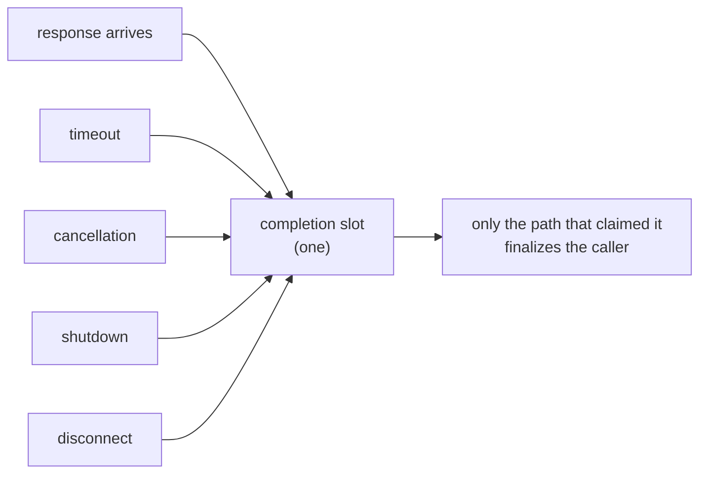
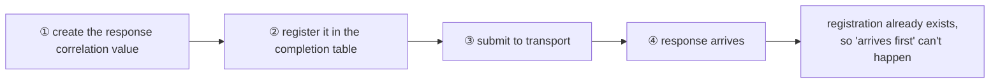

# 4. Operation Completion Confirmation — Only One Finalizes

[Internal structure table of contents](README.en.md) · [Previous: 3. Application And Infrastructure Execution Separation](03-progress-isolation.en.md) · [Next: 5. Message Continuity During A Move](05-relocation-continuity.en.md)

> **What this chapter answers** — when a response, timeout,
> cancellation, shutdown, and disconnect all arrive at once, what
> finalizes the caller.
>
> **Contract ownership** — the error kind is owned by
> [the Framework Error Model](../spec/32-framework-error-model.en.md),
> and the ban on resending after acceptance by
> [Transport Liveness](../spec/29-transport-liveness.en.md). This
> chapter covers the **structure** that satisfies that contract, and
> the mismatches actually observed across the four implementations.

For one call waiting on a response, a response, a timeout, a
cancellation, a shutdown, and a disconnect can all arrive **at the same
time.** This document covers the structure that lets only one of them
finalize the caller, and how not to lose a response along the way.

## 1. The Core Decision — Only The Path That Claims The Completion Slot First Wins

Each call has one completion slot, and several paths compete for it.
Only the path that claims it releases the caller's wait. The losing
paths do nothing.



### The Approach The Implementations Converged On

The four implementations are different languages but arrived at the
same approach — **using the operation of removing an entry from the
in-progress call table itself as the contention point.** The path that
succeeds at removing it holds the completion authority. This is
simpler than keeping a separate marker value and flipping it, and
cleanup finishes at the same moment as removal.

This convergence isn't accidental. Removing from the table is needed
anyway, and once that's already atomic, there's no reason to build a
separate contention point.

One implementation has **three** completion-confirmation approaches
coexisting — removing inside a lock, flipping a separate marker value,
and slot reservation. Even if all three are correct, you have to check
which path uses which approach, and when adding a new path, there's no
way to know which one to follow. Keep it to one approach.

## 2. Don't Call The Handler From Where Completion Was Confirmed

If an application callback runs inside the lock held while confirming
completion, the callback calling back into the runtime requires the
same lock, causing a deadlock. Timer cancellation and payload cleanup
are also done outside it.

The order is — **confirm completion authority → release the lock → run
the callback.**

## 3. Create The Call Identifier First, Register It, Then Send

### The Problem

One implementation's mesh node surface returns the call identifier as
**submit's output.**

```text
Send SubmitResult(..., out call identifier, ...)
```

Since submit returns the identifier, **wait registration can't happen
before submit.** In the gap between sending and receiving the
identifier back to register it, if the target is within the same
process, the response may get processed first. If an unregistered
response is treated as "a response to an unknown call" and dropped,
that call hangs until timeout.

This problem isn't Core's making. Core explicitly states it doesn't
provide request-response correlation
([Core Runtime Boundary 「2」](https://kairos-code-dev.github.io/zlink/spec/core/09-runtime-boundary/)),
and the call identifier and completion table are entirely owned by
Framework. So this order is something Framework can decide.

### The Decision

**The sending side creates the value to match the response first, and
submits only after finishing wait registration.**

The value referred to here is the **response correlation value.** It's
different from the identifier pointing at the operation itself, and
what's registered in the completion table is the former. Treating the
two as one breaks the rule that a new correlation value is created at
every hop
([Request Correlation 「2. The Role Of The Two Identifiers」](../spec/27-flow-correlation.en.md#2-the-role-of-the-two-identifiers)).



With this order, no matter how fast the response is, **it can't arrive
before registration.** A response is only produced after the request
goes out, and the request only goes out after registration.

The substance of this decision is changing the mesh node surface so
the response correlation value is received as submit's **input**
rather than its output. The operation identifier doesn't appear on
this surface.

### What Disappears Together

Once "arrives first" becomes impossible, the following three become
unnecessary altogether.

| What disappears | Cost it currently incurs |
|---|---|
| A slot to hold an early-arrived response | One more map lookup per completion |
| Contention handling between that slot and the wait table | Code that cross-checks both sides |
| The slot's bound and overflow handling | Bound management and its overflow path |

Completion is a hot path. Removing one map lookup here is a rare kind
of improvement — it simplifies the structure and speeds it up at the
same time.

### The Rule Until Then

Until the surface is changed, the holding slot is needed. During that
period, keep the following.

- The holding slot **has a bound.**
- Exceeding the bound **ends in an observable failure.** Since the
  holding slot is a **bounded resource** owned by the source runtime,
  the error kind is `CapacityExceeded`
  ([Framework Error Model 「5. `Request` Completion And Failure」](../spec/32-framework-error-model.en.md#5-request-completion-and-failure)).
  One implementation silently drops the response here, so the waiting
  caller only finds out via timeout.
- Since there are two places — the holding slot and the wait table —
  **the path that observes both is responsible for delivery.** Without
  this rule, a response disappears between the two slots — the side
  putting it in reasons "it's not in the table, so let's hold it,"
  while the side registering reasons "it's not in the holding slot, so
  let's wait," and both hold true at once.

**Don't confuse this with the pending-during-a-move slot.** There, a
request ends in `Unavailable` when the bound is exceeded
([Host Relocate And Shutdown 「9. Moving Pending Messages, Timers, And Sessions」](../spec/28-graceful-drain-handoff.en.md#9-moving-pending-messages-timers-and-sessions)).
The kind differs because the owner differs — the response-holding slot
is held as its own resource by **the runtime that started the call**,
while the pending-during-a-move slot is the affair of **the peer
currently moving.** The caller needs these two distinguished to judge
a retry target.

## 4. Don't Resend After Acceptance

Once transport has accepted a message, **whether the target has
executed it is unknowable.** Resending to a different target in this
state can cause double execution.

**Decision — the runtime never automatically resends after
acceptance.** This holds even if the connection drops
([Transport Liveness 「5. Ready And Failure Determination」](../spec/29-transport-liveness.en.md#5-ready-and-failure-determination)).
The application can start a new call, and at that point the risk of
duplicate execution is judged by the application.

This rule requires distinguishing "failure after sending" from
"failure before sending."

| Failure timing | May it be resent |
|---|---|
| Before transport accepts | Yes. It's certain the target never received it |
| After transport accepts | **No.** Whether it executed is unknowable |

## 5. The Completion Point Of A Call That Doesn't Wait For A Response

A call that doesn't wait for a response completes normally **at the
moment this process's send path accepts the message.** Whether the
remote queue received it or the handler executed it can't be known
from this result
([Framework API 「12. Spot, Actor, And STREAM Owner」](../spec/06-framework-api.en.md#12-spot-actor-and-stream-owner)).

The four implementations already agree on this definition. But the
wording tends to diverge — "local acceptance" and "transport
acceptance" read as if they're different, but in this product the send
path is exactly the socket's send queue, so they're the same event.
Don't mix the two phrasings across docs and code comments.

## 6. Don't Classify Failure By String

The completion path must distinguish cancellation, timeout, and
shutdown. This distinction decides the result the caller receives.

One implementation judges cancellation by **running a regex against
the error message string.** Two things break — if the language or
library changes the message wording, the classification silently
changes, and conversely, a business error whose message happens to
contain "cancel" gets misclassified as a cancellation and swallowed.

**Decision — classify failure by type or a dedicated value.** The
message string is for humans to read, not a branch condition.

## 7. Result To Confirm

- Even if a response, timeout, cancellation, and shutdown occur at the
  same time, the caller completes exactly once.
- A late-arriving response doesn't finalize the caller again.
- The application callback doesn't run inside the lock held while
  confirming completion.
- The call identifier is submit's input, and registration happens
  before submit.
- While the holding slot is kept, a response arriving when it's full
  doesn't silently disappear, and the caller observes a result.
- Even if the connection drops after transport accepted, the runtime
  doesn't resend to a different target.
- There's one completion-confirmation approach within the runtime.
- Cancellation/timeout/shutdown classification doesn't depend on the
  error message string.

---

[Internal structure table of contents](README.en.md) · [Previous: 3. Application And Infrastructure Execution Separation](03-progress-isolation.en.md) · [Next: 5. Message Continuity During A Move](05-relocation-continuity.en.md)
