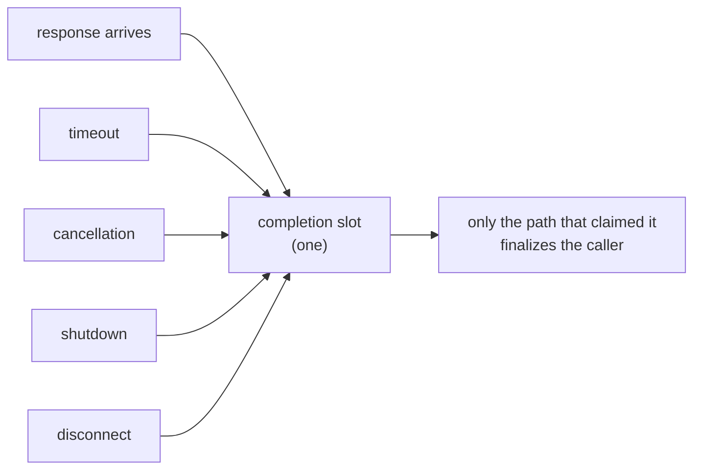
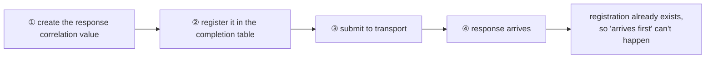

# 4. Operation Completion Confirmation — Only One Finalizes

[Internal structure table of contents](README.en.md) · [Previous: 3. Application And Infrastructure Execution Separation](03-progress-isolation.en.md) · [Next: 5. Message Continuity During A Move](05-relocation-continuity.en.md)

> **What this chapter answers** — when a response, timeout,
> cancellation, shutdown, and disconnect all arrive at once, what
> finalizes the caller.
>
> **Contract ownership** — the error kind is owned by
> [the Framework Error Model](../spec/32-framework-error-model.en.md),
> and the ban on resending after acceptance by
> [Transport Liveness](../spec/29-transport-liveness.en.md). This
> chapter covers the **structure** that satisfies that contract and
> the failures that become visible during completion races.

For one call waiting on a response, a response, a timeout, a
cancellation, a shutdown, and a disconnect can all arrive **at the same
time.** This document covers the structure that lets only one of them
finalize the caller, and how not to lose a response along the way.

## 1. The Core Decision — Only The Path That Claims The Completion Slot First Wins

Each call has one completion slot, and several paths compete for it.
Only the path that claims it releases the caller's wait. The losing
paths do nothing.



<a id="the-approach-the-implementations-converged-on"></a>
### Completion Authority Confirmation

**Decision — atomically taking an entry from the in-progress call table is the
completion contention point.** The response, timeout, cancellation, and shutdown paths
all try to take the same entry. Only the successful path gains completion authority; the
others observe that the call is already complete and stop.

This operation confirms completion authority and removes the in-progress call together.
It therefore needs neither a separate completion marker nor a second slot reservation.
Every completion path uses the same approach so that adding a path cannot introduce a
different contention rule.

<a id="2-dont-call-the-handler-from-where-completion-was-confirmed"></a>
## 2. Completion Callback Execution Turn

If an application callback runs inside the lock held while confirming
completion, the callback calling back into the runtime requires the
same lock, causing a deadlock. Timer cancellation and payload cleanup
are also done outside it.

Releasing the lock and immediately invoking the callback on the same
call stack is still insufficient. It lets application code re-enter the
runtime before the current transport response or timeout handling has
returned. The callback is placed on a process-shared completion dispatcher
and runs on a new execution turn after the current handling returns.

The order is — **confirm completion authority → release the lock → enqueue
the callback on the dispatcher → run the callback on a new execution turn.**

If the terminal winner takes the in-progress table entry and dispatcher admission then
fails, the application completion is lost. The runtime therefore reserves a completion
dispatcher slot when it accepts the operation. That reservation remains until the callback
returns. The combined number of in-progress operations and callbacks waiting or running on
the dispatcher cannot exceed 4,096, so the callback queue cannot grow without a bound.

If no slot can be reserved, the operation is rejected with `CapacityExceeded` before the
request is sent. Once an operation is accepted, completion enqueue has no reject or drop
path. The dispatcher uses a process-shared lane instead of creating a thread per callback,
and shutdown drains every accepted callback. An exception from one callback does not stop
later callbacks from running.

## 3. Create The Call Identifier First, Register It, Then Send

### The Problem

If a mesh node surface returns the call identifier only as
**submit's output,** it forces the following order.

```text
Send SubmitResult(..., out call identifier, ...)
```

Since submit returns the identifier, **wait registration can't happen
before submit.** In the gap between sending and receiving the
identifier back to register it, if the target is within the same
process, the response may get processed first. If an unregistered
response is treated as "a response to an unknown call" and dropped,
that call hangs until timeout.

This problem isn't Core's making. Core explicitly states it doesn't
provide request-response correlation
([Core Runtime Boundary 「2」](https://zlink-systems.github.io/zlink/spec/core/09-runtime-boundary/)),
and the call identifier and completion table are entirely owned by
Framework. So this order is something Framework can decide.

### The Decision

**The sending side creates the value to match the response first, and
submits only after finishing wait registration.**

The value referred to here is the **response correlation value.** It's
different from the identifier pointing at the operation itself, and
what's registered in the completion table is the former. Treating the
two as one breaks the rule that a new correlation value is created at
every hop
([Request Correlation 「2. The Role Of The Two Identifiers」](../spec/27-flow-correlation.en.md#2-the-role-of-the-two-identifiers)).



With this order, no matter how fast the response is, **it can't arrive
before registration.** A response is only produced after the request
goes out, and the request only goes out after registration.

The mesh node surface receives the response correlation value as
submit's **input**, not its output. The operation identifier doesn't
appear on this surface.

<a id="what-disappears-together"></a>
### Additional State Not Needed With Input Correlation

Receiving the response correlation value as input makes "arrives first"
impossible, so the following state is unnecessary.

| Unnecessary state | Additional cost |
|---|---|
| A slot to hold an early-arrived response | One more map lookup per completion |
| Contention handling between that slot and the wait table | Code that cross-checks both sides |
| The slot's bound and overflow handling | Bound management and its overflow path |

Completion is a hot path. Removing one map lookup here is a rare kind
of improvement — it simplifies the structure and speeds it up at the
same time.

<a id="the-rule-until-then"></a>
### Rules Required By An Output-Only Surface

A surface that only returns the response correlation value as output
needs a slot for an early-arriving response. Using that shape requires
all of the following rules, which makes it more complex than the
canonical input form.

- The holding slot **has a bound.**
- Exceeding the bound **ends in an observable failure.** Since the
  holding slot is a **bounded resource** owned by the source runtime,
  the error kind is `CapacityExceeded`
  ([Framework Error Model 「5. `Request` Completion And Failure」](../spec/32-framework-error-model.en.md#5-request-completion-and-failure)).
  Silently dropping the response makes the waiting caller observe a
  timeout instead of the actual cause.
- Since there are two places — the holding slot and the wait table —
  **the path that observes both is responsible for delivery.** Without
  this rule, a response disappears between the two slots — the side
  putting it in reasons "it's not in the table, so let's hold it,"
  while the side registering reasons "it's not in the holding slot, so
  let's wait," and both hold true at once.

The response-holding slot and the pending-during-a-move slot are different resources.
The pending-during-a-move slot has no record-count or byte bound defined by relocation
itself
([Host Relocate And Shutdown 「9. Moving Pending Messages, Timers, And Sessions」](../spec/28-graceful-drain-handoff.en.md#9-moving-pending-messages-timers-and-sessions)).

The **runtime that started the call** owns the response-holding slot as its resource. The
**peer currently moving** manages the pending-during-a-move slot to preserve message
continuity. These resources and their errors remain distinct so that the caller can decide
which target to retry.

## 4. Don't Resend After Acceptance

Once transport has accepted a message, **whether the target has
executed it is unknowable.** Resending to a different target in this
state can cause double execution.

**Decision — the runtime never automatically resends after
acceptance.** This holds even if the connection drops
([Transport Liveness 「5. Ready And Failure Determination」](../spec/29-transport-liveness.en.md#5-ready-and-failure-determination)).
The application can start a new call, and at that point the risk of
duplicate execution is judged by the application.

This rule requires distinguishing "failure after sending" from
"failure before sending."

| Failure timing | May it be resent |
|---|---|
| Before transport accepts | Yes. It's certain the target never received it |
| After transport accepts | **No.** Whether it executed is unknowable |

## 5. The Completion Point Of A Call That Doesn't Wait For A Response

A call that doesn't wait for a response completes normally **at the
moment this process's send path accepts the message.** Whether the
remote queue received it or the handler executed it can't be known
from this result
([Framework API 「12. Spot, Actor, And STREAM Owner」](../spec/06-framework-api.en.md#12-spot-actor-and-stream-owner)).

"Local acceptance" and "transport acceptance" are not separate events.
In this product the send path is the socket's send queue, so both terms
refer to the same completion boundary. Documentation and code comments
use the single term send acceptance.

## 6. Don't Classify Failure By String

The completion path must distinguish cancellation, timeout, and
shutdown. This distinction decides the result the caller receives.

Judging cancellation by **running a regex against the error message
string** makes classification change silently when the language or
library changes the wording. Conversely, a business error whose message
contains "cancel" is misclassified as cancellation and swallowed.

**Decision — classify failure by type or a dedicated value.** The
message string is for humans to read, not a branch condition.

## 7. Result To Confirm

- Even if a response, timeout, cancellation, and shutdown occur at the
  same time, the caller completes exactly once.
- A late-arriving response doesn't finalize the caller again.
- The completion callback runs on a new execution turn outside both the
  confirmation lock and the current transport call stack.
- A dispatcher slot is reserved before operation acceptance, and an
  accepted completion enqueue is neither rejected nor dropped. The
  combined number of in-progress operations and waiting/running
  callbacks doesn't exceed 4,096.
- The dispatcher is a process-shared lane that doesn't create a thread
  per callback, and shutdown drains every accepted callback.
- The call identifier is submit's input, and registration happens
  before submit.
- While the holding slot is kept, a response arriving when it's full
  doesn't silently disappear, and the caller observes a result.
- Even if the connection drops after transport accepted, the runtime
  doesn't resend to a different target.
- There's one completion-confirmation approach within the runtime.
- Cancellation/timeout/shutdown classification doesn't depend on the
  error message string.

---

[Internal structure table of contents](README.en.md) · [Previous: 3. Application And Infrastructure Execution Separation](03-progress-isolation.en.md) · [Next: 5. Message Continuity During A Move](05-relocation-continuity.en.md)
