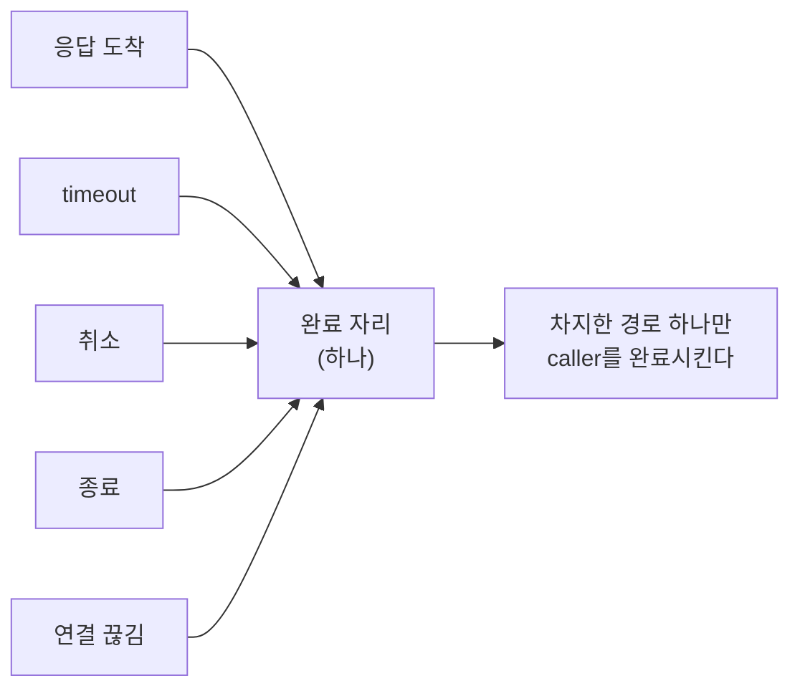
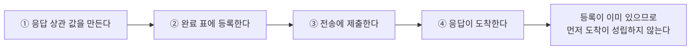

# 4. operation 완료 확정 — 한 번만 확정한다

[내부 구조 목차](README.ko.md) · [이전: 3. application과 infrastructure 실행 분리](03-progress-isolation.ko.md) · [다음: 5. 이동 중 message 연속성](05-relocation-continuity.ko.md)

> **이 장이 답하는 것** — 응답·timeout·취소·종료·연결 끊김이 동시에 도착할 때 무엇이 caller를 완료시키는가.
>
> **계약 소유** — 오류 kind는 [Framework 오류 모델](../spec/32-framework-error-model.ko.md)이,
> 수락 이후 재전송 금지는 [Transport liveness](../spec/29-transport-liveness.ko.md)가 소유한다.
> 이 장은 그 계약을 만족시키는 **구조**와, 네 구현에서 관찰된 어긋남을 다룬다.

응답을 기다리는 호출 하나에 대해 응답·timeout·취소·종료·연결 끊김이 **동시에** 도착할
수 있다. 이 문서는 그중 하나만 caller를 완료시키도록 만드는 구조와, 그 과정에서 응답을
잃지 않는 방법을 다룬다.

## 1. 핵심 결정 — 완료 자리를 먼저 차지한 경로만 이긴다

호출마다 완료 자리를 하나 두고, 여러 경로가 그 자리를 두고 경쟁한다. 차지한 경로만
caller의 대기를 푼다. 진 경로는 아무것도 하지 않는다.



### 구현이 수렴한 방식

네 구현이 서로 다른 언어인데 같은 방식에 도달했다 — **진행 중 호출 표에서 항목을
꺼내는 연산 자체를 경쟁 지점으로 쓴다.** 꺼내기에 성공한 경로가 완료 권한을 가진다.
별도의 표시 값을 두고 그것을 바꾸는 방식보다 단순하고, 꺼내기와 동시에 정리가 끝난다.

이 수렴은 우연이 아니다. 표에서 꺼내는 연산은 어차피 필요하고, 그것이 이미 원자적이면
경쟁 지점을 따로 만들 이유가 없다.

한 구현에는 완료 확정 방식이 **세 가지** 공존한다 — 잠금 안에서 꺼내기, 별도 표시 값
바꾸기, 자리 예약. 셋 다 정확하더라도 어느 경로가 어느 방식을 쓰는지 확인해야 하고,
새 경로를 추가할 때 어느 방식을 따라야 할지 알 수 없다. 방식은 하나로 둔다.

## 2. 완료를 확정한 자리에서 handler를 부르지 않는다

완료를 확정할 때 잡은 잠금 안에서 application callback을 실행하면, callback이 다시
runtime을 호출할 때 같은 잠금을 요구해 교착이 된다. timer 취소와 payload 정리도 그
바깥에서 한다.

순서는 이렇다 — **완료 권한을 확정한다 → 잠금을 놓는다 → callback을 실행한다.**

## 3. 호출 식별자를 먼저 만들고 등록한 뒤 보낸다

### 문제

한 구현의 mesh node 표면은 호출 식별자를 **submit의 출력**으로 돌려준다.

```text
SubmitResult 보내기(..., out 호출식별자, ...)
```

식별자를 submit이 돌려주므로 **submit 전에 대기 등록을 할 수 없다.** 보내고 나서
식별자를 받아 등록하는 사이에, 대상이 같은 process 안이면 응답이 먼저 처리될 수 있다.
등록되지 않은 응답을 "모르는 호출의 응답"으로 보고 버리면 그 호출은 timeout까지
매달린다.

이 문제는 Core가 만든 것이 아니다. Core는 요청·응답 상관을 제공하지 않는다고 명시하고
있으며([Core runtime 경계 「2」](https://kairos-code-dev.github.io/zlink/spec/core/09-runtime-boundary/)),
호출 식별자와 완료 표는 전적으로 Framework가 소유한다. 따라서 이 순서는 Framework가
정할 수 있다.

### 결정

**응답을 맞출 값은 보내는 쪽이 먼저 만들고, 대기 등록을 마친 뒤에 submit한다.**

여기서 말하는 값은 **응답 상관 값**이다. operation 자체를 가리키는 식별자와는 다른
값이며, 완료 표에 등록하는 것은 전자다. 둘을 하나로 다루면 홉을 거칠 때마다 새 상관
값을 만드는 규칙([Request correlation 「2. 두 식별자의 역할」](../spec/27-flow-correlation.ko.md#2-두-식별자의-역할))이 깨진다.



이 순서면 응답이 아무리 빨라도 **등록보다 먼저 도착할 수 없다.** 응답은 요청이 나간
뒤에만 생기고, 요청은 등록 뒤에만 나가기 때문이다.

응답 상관 값을 submit의 출력이 아니라 **입력**으로 받도록 mesh node 표면을 바꾸는 것이
이 결정의 실체다. operation 식별자는 이 표면에 등장하지 않는다.

### 무엇이 함께 사라지는가

먼저 도착이 불가능해지면 다음 세 가지가 통째로 필요 없어진다.

| 사라지는 것 | 지금 드는 비용 |
|---|---|
| 먼저 도착한 응답 보관 자리 | 완료마다 맵 조회가 하나 더 붙는다 |
| 보관 자리와 대기 표 사이의 경쟁 처리 | 양쪽을 교차 확인하는 코드 |
| 보관 자리 한도와 초과 처리 | 한도 관리와 그 초과 경로 |

완료는 hot path다. 여기서 맵 조회 하나를 줄이는 것은 구조를 단순하게 만들면서 동시에
빨라지는, 드문 종류의 개선이다.

### 그때까지의 규칙

표면을 바꾸기 전까지는 보관 자리가 필요하다. 그 기간에는 다음을 지킨다.

- 보관 자리는 **한도를 둔다.**
- 한도를 넘으면 **관찰 가능한 실패로 끝낸다.** 보관 자리는 source runtime이 소유한
  **한도 있는 자원**이므로 오류 kind는 `CapacityExceeded`다
  ([Framework 오류 모델 「5. `Request` 완료와 실패」](../spec/32-framework-error-model.ko.md#5-request-완료와-실패)). 한 구현은 여기서
  응답을 조용히 버려서, 기다리던 caller가 timeout으로만 알게 된다.
- 보관 자리와 대기 표 두 곳이 있으므로 **양쪽을 다 관찰한 경로가 전달을 책임진다.**
  이 규칙이 없으면 응답이 두 자리 사이에서 사라진다 — 넣는 쪽은 "표에 없으니 보관하자",
  등록하는 쪽은 "보관 자리에 없으니 기다리자"가 동시에 성립한다.

**이동 중 보류 자리와 혼동하면 안 된다.** 그쪽은 한도를 넘기면 request가 `Unavailable`로
끝난다([Host Relocate와 Shutdown 「9. 대기 중인 message, timer와 session을 옮긴다」](../spec/28-graceful-drain-handoff.ko.md#9-대기-중인-message-timer와-session을-옮긴다)).
kind가 다른 이유는 소유자가 다르기 때문이다 — 응답 보관 자리는 **호출을 시작한 runtime**이
자기 자원으로 갖고 있고, 이동 보류 자리는 **이동 중인 상대 쪽** 사정이다. 호출자가 재시도
대상을 판단하려면 이 둘이 구분되어야 한다.

## 4. 수락한 뒤에는 다시 보내지 않는다

전송이 message를 수락한 뒤에는 **대상이 실행했는지 알 수 없다.** 이 상태에서 다른
대상으로 다시 보내면 두 번 실행될 수 있다.

**결정 — 수락 이후에는 runtime이 자동으로 다시 보내지 않는다.** 연결이 끊겨도
마찬가지다([Transport liveness 「5. Ready와 장애 판정」](../spec/29-transport-liveness.ko.md#5-ready와-장애-판정)).
Application이 새 호출을 시작할 수는 있으며, 그때 중복 실행 위험은 application이
판단한다.

이 규칙 때문에 "보낸 뒤 실패"와 "보내기 전 실패"를 구분해야 한다.

| 실패 시점 | 다시 보내도 되는가 |
|---|---|
| 전송이 수락하기 전 | 된다. 대상이 받지 않았음이 확실하다 |
| 전송이 수락한 뒤 | **안 된다.** 실행 여부를 알 수 없다 |

## 5. 응답을 기다리지 않는 호출의 완료 지점

응답을 기다리지 않는 호출은 **이 process의 송신 경로가 message를 수락한 시점**에
정상 완료한다. 원격 queue가 받았는지, handler가 실행했는지는 이 결과로 알 수 없다
([Framework API 「12. Spot, Actor와 STREAM owner」](../spec/06-framework-api.ko.md#12-spot-actor와-stream-owner)).

이 정의는 네 구현이 이미 일치한다. 다만 표현이 갈리기 쉽다 — "로컬 수락"과 "전송
수락"이 다른 것처럼 읽히지만, 이 제품에서 송신 경로는 곧 socket의 송신 큐이므로 같은
사건이다. 문서와 코드 주석에서 두 표현을 섞어 쓰지 않는다.

## 6. 실패를 문자열로 분류하지 않는다

완료 경로는 취소·시간 초과·종료를 구분해야 한다. 이 구분이 caller가 받는 결과를
정한다.

한 구현은 **오류 메시지 문자열에 정규식을 걸어** 취소인지 판단한다. 두 가지가 깨진다 —
언어나 라이브러리가 메시지 표현을 바꾸면 분류가 조용히 바뀌고, 반대로 "cancel"이 들어간
업무 오류가 취소로 잘못 분류되어 삼켜진다.

**결정 — 실패는 타입이나 전용 값으로 분류한다.** 메시지 문자열은 사람이 읽는 용도이며
분기 조건이 아니다.

## 7. 확인할 결과

- 응답·timeout·취소·종료가 동시에 발생해도 caller가 정확히 한 번 완료된다.
- 뒤늦게 도착한 응답이 caller를 다시 완료시키지 않는다.
- 완료를 확정한 잠금 안에서 application callback이 실행되지 않는다.
- 호출 식별자가 submit의 입력이며, 등록이 submit보다 먼저 일어난다.
- 보관 자리를 유지하는 동안에는, 가득 찬 상태에서 도착한 응답이 조용히 사라지지 않고
  caller가 결과를 관찰한다.
- 전송이 수락한 뒤 연결이 끊겨도 runtime이 다른 대상에 다시 보내지 않는다.
- 완료 확정 방식이 runtime 안에서 하나다.
- 취소·시간 초과·종료 분류가 오류 메시지 문자열에 의존하지 않는다.

---

[내부 구조 목차](README.ko.md) · [이전: 3. application과 infrastructure 실행 분리](03-progress-isolation.ko.md) · [다음: 5. 이동 중 message 연속성](05-relocation-continuity.ko.md)
