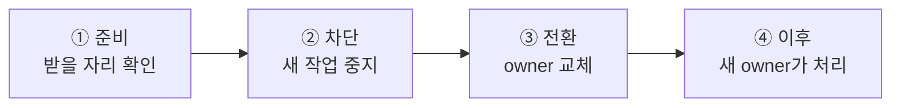

# 5. 이동 중 message 연속성

[내부 구조 목차](README.ko.md) · [이전: 4. operation 완료 확정 — 한 번만 확정한다](04-completion.ko.md) · [다음: 6. target 선택과 route cache](06-routing-and-cache.ko.md)

> **이 장이 답하는 것** — 객체가 다른 node로 옮겨 가는 동안 그 객체로 향하던 message는 어디로 가는가.
>
> **계약 소유** — 이동 절차의 전체 순서는 [Actor와 Spot relocation 전체 흐름](../spec/28-relocation-flow.ko.md),
> host operation은 [Host relocation 전체 흐름](../spec/30-host-relocation-flow.ko.md),
> 저장소 계약은 [Location runtime](../spec/21-location-runtime.ko.md)이 소유한다.
> 이 장은 그 계약을 만족시키는 **구조**와, 이동 경계를 어겼을 때 나타나는 실패를 다룬다.

실행 중인 객체를 다른 node로 옮기는 동안, 그 객체로 향하던 message는 어디로 가는가.
이 문서는 이동 절차 자체보다 **경계마다 message가 어떻게 처리되는지**를 다룬다. 절차의
단계 순서와 저장소 계약은 정식 spec이 소유한다. 네 runtime이 따라야 하는 전체 상태 전이는
[13. Relocation handoff 상태 전이](13-relocation-handoff.ko.md)가 설명한다.

## 1. 네 개의 경계

이동은 message 관점에서 네 구간으로 나뉜다. 도착한 message를 처리하는 방법은 구간마다
다르다.

| 구간 | 도착한 message | 이유 |
|---|---|---|
| ① 준비 | **평소대로 처리** | 받을 자리가 없으면 이동을 시작조차 하지 않는다. 이 확인 전에 막으면 실패했을 때 헛되이 멈춘 시간만 남는다 |
| ② 차단 | **보관했다가 새 owner에게 넘긴다** | 버리면 유실이고, 거절하면 이동이 caller에게 보인다 |
| ③ 전환 | 보관 또는 실패 | 이 구간은 최대한 짧아야 한다 |
| ④ 이후 | **옛 주소로 와도 새 owner에게 전달** | 보낸 쪽은 아직 옛 위치를 알고 있다 |

①의 순서가 설계 결정이다 — **받을 자리를 확인하기 전에는 source의 새 작업을 막지
않는다**([Host relocation 전체 흐름 「8.2 모든 Actor와 Spot이 따르는 공통 순서」](../spec/30-host-relocation-flow.ko.md#82-모든-actor와-spot이-따르는-공통-순서)).
반대로 만들면 자리가 없어 이동이 실패했을 때 그 객체는 아무 이유 없이 멈춰 있던 셈이
된다.

## 2. ② 구간 — 보관과 순서

차단 뒤 도착한 message는 순서를 지켜 보관한다. 건수와 저장 크기에 relocation 전용 상한을
두지 않는다([Host relocation 전체 흐름 「9. 대기 중인 message, timer와 session을 옮긴다」](../spec/30-host-relocation-flow.ko.md#9-대기-중인-message-timer와-session을-옮긴다)).
개별 message 크기, transport, deadline과 cancellation 제한은 그대로 적용한다.

순서에 규칙이 하나 있다 — **복원된 이전 작업이 보관해 둔 message보다 먼저 실행된다**
([Spot 모델 「3.1 Relocation 중에는 temporary queue를 먼저 확인한다」](../spec/11-spot-model.ko.md#31-relocation-중에는-temporary-queue를-먼저-확인한다)). 반대로 하면 이동 전에 이미 큐에
있던 요청이 이동 중에 새로 온 요청보다 뒤에 처리되어, 보낸 순서와 처리 순서가 뒤집힌다.

보장 범위는 **대상별 수락 순서**까지다. 서로 다른 경로에서 온 message 사이의 전역
순서는 보장하지 않는다.

### 실행 직렬화와 만나는 지점

[2. Spot·Actor 실행 직렬화](02-serialization.ko.md)의 구조가 여기서 다시 걸린다.
보관과 복원은 **Actor 단위로 갈라낼 수 있어야** 한다. 이동 단위가 Actor 하나일 때 그
Actor의 남은 작업만 골라내야 하기 때문이다. `SpotWide`라는 이유로 Actor별 queue를
하나로 합쳐 두면 이 지점에서 갈라낼 수 없다 — queue는 Actor마다, 실행 권한만 공유해야
하는 이유가 여기서 다시 나온다.

## 3. ④ 구간 — 옛 주소로 온 message

이동이 끝나도 보낸 쪽은 한동안 옛 위치를 알고 있다. 그 message를 새 owner에게 넘겨
주는 것이 **[Message Follow](../spec/01-glossary.ko.md#message-follow)**이며, 기본 동작 기간은 **30초**다
([Location runtime 「6.3 이전 owner로 도착한 message를 새 owner에게 전달한다」](../spec/21-location-runtime.ko.md#63-이전-owner로-도착한-message를-새-owner에게-전달한다)).

| 제한 | 값과 적용 범위 |
|---|---|
| 동작 기간 | 기본 30초. 이동 한 건 기준 |
| 전달 횟수 | 최대 8번까지 이어서 전달 |
| 전달량 | relocation 전용 상한 없음 |

| 상황 | caller가 관찰하는 결과 |
|---|---|
| 전달 경로가 loop를 이루어 처음 node로 돌아온다 | `Unavailable` |
| 객체 세대가 맞지 않는다 | `InvalidOperation` |

전달할 때 호출 식별자, 객체 세대, payload와 응답 경로를 그대로 유지한다. 유지하지
않으면 [4. operation 완료 확정](04-completion.ko.md)의 완료 자리를 찾지 못해 caller가
timeout까지 완료되지 않는다.

### 이것은 선택 기능이 아니다

**session 연결과 중계가 이 전달 경로에 의존한다**
([Session Actor dispatch 「4. Session이 Actor route를 보관하는 방법」](../spec/20-session-actor-dispatch.ko.md#4-session이-actor-route를-보관하는-방법)).
구현하지 않으면 이동한 Actor에 연결된 session이 정상 동작하지 않는다. 따라서 Message
Follow는 선택적인 성능 최적화가 아니라 session의 동작에 필요한 경로다.

## 4. ③ 구간 — owner 교체 전후의 비대칭

Source는 application dispatch를 멈춘 뒤에도 이전 주소로 들어오는 message를 target에 계속
relay한다. 이 relay는 같은 TCP connection 안에서 순서를 유지한다. Source가 cutover 전까지
받은 message를 모두 보낸 뒤 같은 connection에 cutover를 `[send]`로 넣으므로 target은
cutover보다 앞선 relay가 모두 도착했음을 알 수 있다. Relocation은 이 구간에 message별 ACK, 숫자
high-water, 별도 journal이나 capacity 제한을 추가하지 않는다.

Target은 factory, Restore와 temporary queue 준비 뒤 cutover를 받거나 relay 준비 reply 뒤
1,000 ms가 지나면 Location Store owner를 source에서 target으로 조건부 변경한다. 이 CAS는
target만 실행한다. Source와 Session owner는 timeout이나 local mirror를 근거로 owner를
변경하지 않는다.

CAS 한 번을 기준으로 실패 처리가 달라진다.

| 시점 | 실패하면 |
|---|---|
| Cutover 전 | Source가 그대로 owner다. Target queue를 실행하지 않고 source가 relay 전 원본을 다시 사용한다. |
| Cutover 뒤, CAS 성공 전 | Target object와 queue를 제거하고 source dispatch를 다시 열지 않는다. Session은 자체 seal timeout으로 정리한다. |
| CAS 후 | Source로 되돌리지 않는다. Target queue를 열고 Message Follow가 이전 주소로 늦게 도착한 message를 전달한다. |

Retry 가능한 Store 실패나 불확정 응답이면 target은 Restore 유효시간까지 같은 fence와
`RelocationId`로 CAS와 read를 반복한다. 그 안에 target owner를 확인하지 못하면
`location_update_failed` Error를 기록하고 준비한 Actor 또는 Spot, temporary queue와 relocation
state를 제거한다. Session route update는 보내지 않는다.

Target은 기존 작업, cutover 앞의 relay, temporary queue에 들어온 작업 순서로 target
queue에 넣고 dispatch를 연다. 서로 다른 TCP connection에서 직접 target으로 들어온 message와
source relay 사이의 전역 순서는 보장하지 않는다. Target queue가 수락한 뒤의 순서만 유지한다.

Source는 cutover를 보낸 뒤 target 완료 응답을 기다리지 않고 Message Follow로 전환한다. Target은
CAS와 queue 개방 뒤 bound Actor가 있으면 Session owner에게 route update를 `[send]`로 전달한다.
Cutover나 Session route update에는 reply가 없다. 늦거나 중복된 control은 Warning만 남기며 owner,
route나 queue를 다시 바꾸지 않는다.

### 그래서 CAS 이후 단계는 다시 실행해도 같아야 한다

CAS 뒤 source로 rollback하지 않으므로 target queue 개방과 Session route update는 같은 relocation
identity로 다시 실행해도 현재 상태를 한 번 더 변경하지 않아야 한다. 다만 이 규칙은 모든
message를 durable journal에 기록하거나 application ACK를 추가하라는 뜻이 아니다. 일반
server 간 전송은 TCP에 맡기고, request는 기존 correlation과 deadline으로 완료한다.

## 5. 이동 경로를 여러 갈래로 나누지 않는다

**결정 — 객체나 묶음 하나의 이동은 하나의 상태 전이 규칙이 소유한다.**

정식 spec은 단계 순서와 진행 단계 값만 정하고 컴포넌트 분해는 정하지 않는다. 그러나
갈래를 나누면 §4의 비대칭 처리를 갈래마다 다시 구현하게 되고, 중간에서 실패했을 때
**어느 갈래가 정리 책임을 지는지** 읽어낼 수 없다.

이동 경로를 여러 갈래로 나누고 서로 무관한 단계 값 집합을 두면 같은 전이를 반복해서
구현하게 된다. 객체나 묶음 하나의 이동은 하나의 전이 규칙이 소유한다. 이것은 정식 spec이
정하지 않은 component 경계를 internals에서 고정한 것이다.

## 6. 확인할 결과

- 받을 자리 확인이 끝나기 전에는 source의 새 작업이 막히지 않는다.
- 차단 뒤 도착한 message가 유실되지 않고 새 owner에게 전달된다.
- 복원된 이전 작업이 이동 중 보관한 message보다 먼저 실행된다.
- relocation 전용 record 수·byte 상한 때문에 호출을 거부하지 않는다.
- 이동 직후 옛 주소로 보낸 message가 30초 안에는 새 owner에게 전달되고, 호출 식별자와
  응답 경로가 유지된다.
- 전달이 8번을 넘으면 `Unavailable`로 끝난다.
- owner 교체가 `Conflict`로 끝나면 저장소의 어떤 값도 바뀌지 않는다.
- owner 교체 뒤 실패해도 source가 다시 owner가 되지 않는다.
- 같은 복원 요청을 두 번 받아도 결과가 한 번 받은 것과 같다.
- 이동 단위가 Actor 하나일 때 그 Actor의 남은 작업만 갈라내 옮긴다.

---

[내부 구조 목차](README.ko.md) · [이전: 4. operation 완료 확정](04-completion.ko.md) · [다음: 6. target 선택과 route cache](06-routing-and-cache.ko.md)
