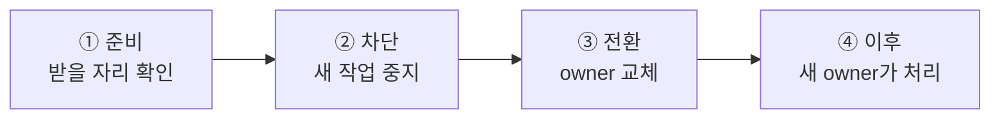

# 5. 이동 중 message 연속성

[내부 구조 목차](README.ko.md) · [이전: 4. operation 완료 확정 — 한 번만 확정한다](04-completion.ko.md) · [다음: 6. target 선택과 route cache](06-routing-and-cache.ko.md)

> **이 장이 답하는 것** — 객체가 다른 node로 옮겨 가는 동안 그 객체로 향하던 message는 어디로 가는가.
>
> **계약 소유** — 이동 절차의 단계와 저장소 계약은 [Host Relocate와 Shutdown](../spec/28-graceful-drain-handoff.ko.md)과
> [Location runtime](../spec/21-location-runtime.ko.md)이 소유한다.
> 이 장은 그 계약을 만족시키는 **구조**와, 네 구현에서 관찰된 어긋남을 다룬다.

실행 중인 객체를 다른 node로 옮기는 동안, 그 객체로 향하던 message는 어디로 가는가.
이 문서는 이동 절차 자체보다 **경계마다 message가 어떻게 처리되는지**를 다룬다. 절차의
단계 순서와 저장소 계약은 정식 spec이 소유한다
([Location runtime](../spec/21-location-runtime.ko.md),
[Host Relocate와 Shutdown](../spec/28-graceful-drain-handoff.ko.md)).

## 1. 네 개의 경계

이동은 message 관점에서 네 구간으로 나뉜다. 각 구간에서 도착한 message의 운명이 다르다.

| 구간 | 도착한 message | 이유 |
|---|---|---|
| ① 준비 | **평소대로 처리** | 받을 자리가 없으면 이동을 시작조차 하지 않는다. 이 확인 전에 막으면 실패했을 때 헛되이 멈춘 시간만 남는다 |
| ② 차단 | **보관했다가 새 owner에게 넘긴다** | 버리면 유실이고, 거절하면 이동이 caller에게 보인다 |
| ③ 전환 | 보관 또는 실패 | 이 구간은 최대한 짧아야 한다 |
| ④ 이후 | **옛 주소로 와도 새 owner에게 전달** | 보낸 쪽은 아직 옛 위치를 알고 있다 |

①의 순서가 설계 결정이다 — **받을 자리를 확인하기 전에는 source의 새 작업을 막지
않는다**([Host Relocate와 Shutdown 「8.2 모든 Actor와 Spot이 따르는 공통 순서」](../spec/28-graceful-drain-handoff.ko.md#82-모든-actor와-spot이-따르는-공통-순서)).
반대로 만들면 자리가 없어 이동이 실패했을 때 그 객체는 아무 이유 없이 멈춰 있던 셈이
된다.

## 2. ② 구간 — 보관과 순서

차단 뒤 도착한 message는 한도 있는 자리에 보관한다. 한도는 **이동 한 건당 1,024건 /
16 MiB**이고, 넘으면 응답을 기다리는 호출은 `Unavailable`, 기다리지 않는 호출은 drop으로
끝낸다([Host Relocate와 Shutdown 「9. 대기 중인 message, timer와 session을 옮긴다」](../spec/28-graceful-drain-handoff.ko.md#9-대기-중인-message-timer와-session을-옮긴다)).

순서에 규칙이 하나 있다 — **복원된 이전 작업이 보관해 둔 message보다 먼저 실행된다**
([Spot 모델 「3.1 Relocation 중에는 temporary queue를 먼저 확인한다」](../spec/11-spot-model.ko.md#31-relocation-중에는-temporary-queue를-먼저-확인한다)). 반대로 하면 이동 전에 이미 큐에
있던 요청이 이동 중에 새로 온 요청보다 뒤에 처리되어, 보낸 순서와 처리 순서가 뒤집힌다.

보장 범위는 **대상별 수락 순서**까지다. 서로 다른 경로에서 온 message 사이의 전역
순서는 보장하지 않는다.

### 실행 직렬화와 만나는 지점

[2. Spot·Actor 실행 직렬화](02-serialization.ko.md)의 구조가 여기서 다시 걸린다.
보관과 복원은 **Actor 단위로 갈라낼 수 있어야** 한다. 이동 단위가 Actor 하나일 때 그
Actor의 남은 작업만 골라내야 하기 때문이다. `SpotWide`라는 이유로 Actor별 queue를
하나로 합쳐 두면 이 지점에서 갈라낼 수 없다 — queue는 Actor마다, 실행 권한만 공유해야
하는 이유가 여기서 다시 나온다.

## 3. ④ 구간 — 옛 주소로 온 message

이동이 끝나도 보낸 쪽은 한동안 옛 위치를 알고 있다. 그 message를 새 owner에게 넘겨
주는 것이 **[Message Follow](../spec/01-glossary.ko.md#message-follow)**이며, 기본 동작 기간은 **30초**다
([Location runtime 「6.3 이전 owner로 도착한 message를 새 owner에게 전달한다」](../spec/21-location-runtime.ko.md#63-이전-owner로-도착한-message를-새-owner에게-전달한다)).

| 제한 | 값과 적용 범위 |
|---|---|
| 동작 기간 | 기본 30초. 이동 한 건 기준 |
| 전달 횟수 | 최대 8번까지 이어서 전달 |
| 전달량 | 이동 한 건당 1,024건 / 16 MiB |

| 상황 | caller가 관찰하는 결과 |
|---|---|
| 전달이 돌고 돌아 제자리로 온다 | `Unavailable` |
| 객체 세대가 맞지 않는다 | `InvalidOperation` |
| 전달량 한도를 넘겼다 | `CapacityExceeded` |

전달할 때 호출 식별자, 객체 세대, payload와 응답 경로를 그대로 유지한다. 유지하지
않으면 [4. operation 완료 확정](04-completion.ko.md)의 완료 자리를 찾지 못해 caller가 timeout까지
매달린다.

### 이것은 선택 기능이 아니다

**session 연결과 중계가 이 전달 경로에 의존한다**
([Session Actor dispatch 「4. Session이 Actor route를 보관하는 방법」](../spec/20-session-actor-dispatch.ko.md#4-session이-actor-route를-보관하는-방법)).
구현하지 않으면 이동한 Actor에 연결된 session이 정상 동작하지 않는다. "있으면 좋은
최적화"로 읽고 뒤로 미루면, 나중에 session 쪽에서 원인을 알 수 없는 실패로 나타난다.

## 4. ③ 구간 — owner 교체 전후의 비대칭

owner 교체는 저장소에 대한 **조건부 변경 한 번**으로 한다. 조건이 하나라도 어긋나면
아무것도 바뀌지 않고 `Conflict`가 돌아온다
([Location Store provider SPI 「4. Conditional atomic batch」](../spec/22-location-store-redis.ko.md#4-conditional-atomic-batch)).

이 한 번을 기준으로 실패 처리가 완전히 달라진다.

| 시점 | 실패하면 |
|---|---|
| 교체 전 | source가 그대로 owner다. 되돌릴 것이 없다 |
| 교체 후 | **source로 되돌리지 않는다.** 같은 target에서 정해진 시간 안에 현재 단계를 다시 시도하고, target이 종료되면 그 객체를 사용할 수 없는 상태로 둔다 |

되돌리지 않는 이유는 이렇다 — 교체가 성공한 시점에 target은 이미 공식 owner이고, 그
사이 다른 참여자가 target을 owner로 보고 message를 보냈을 수 있다. source로 되돌리면
그 message들의 처리 결과가 사라진다.

### 그래서 교체 이후 단계는 다시 실행해도 같아야 한다

되돌릴 수 없으니 앞으로 나아가는 재시도만 남는다. 따라서 교체 이후의 각 단계는 **같은
요청을 다시 받아도 결과가 한 번 받은 것과 같도록** 만든다. 같은 복원 요청을 다시 받으면
새로 시작하지 않고 진행 중이던 상태를 사용한다
([Host Relocate와 Shutdown 「8.2 모든 Actor와 Spot이 따르는 공통 순서」](../spec/28-graceful-drain-handoff.ko.md#82-모든-actor와-spot이-따르는-공통-순서)).

이 구간에서 한 가지만은 중간 상태가 없어야 한다 — **처리를 어느 node가 받을지 전환하는
것**은 한 번에 바뀌어야 한다
([Host Relocate와 Shutdown 「8.2 모든 Actor와 Spot이 따르는 공통 순서」](../spec/28-graceful-drain-handoff.ko.md#82-모든-actor와-spot이-따르는-공통-순서)). 여기에
중간 상태가 있으면 두 node가 동시에 같은 객체를 처리한다.

## 5. 이동 경로를 여러 갈래로 나누지 않는다

**결정 — 객체나 묶음 하나의 이동은 하나의 상태 전이 규칙이 소유한다.**

정식 spec은 단계 순서와 진행 단계 값만 정하고 컴포넌트 분해는 정하지 않는다. 그러나
갈래를 나누면 §4의 비대칭 처리를 갈래마다 다시 구현하게 되고, 중간에서 실패했을 때
**어느 갈래가 정리 책임을 지는지** 읽어낼 수 없다.

한 구현은 이동 경로가 세 갈래로 나뉘어 있고 서로 무관한 단계 값 두 벌을 쓴다. 다른
구현은 하나의 전이 규칙이 소유한다. 후자를 기준으로 삼는다. 이것은 정식 spec이 정하지
않은 부분을 internals가 정한 것이다.

## 6. 확인할 결과

- 받을 자리 확인이 끝나기 전에는 source의 새 작업이 막히지 않는다.
- 차단 뒤 도착한 message가 유실되지 않고 새 owner에게 전달된다.
- 복원된 이전 작업이 이동 중 보관한 message보다 먼저 실행된다.
- 보관 한도를 넘긴 호출이 `Unavailable`로 끝난다.
- 이동 직후 옛 주소로 보낸 message가 30초 안에는 새 owner에게 전달되고, 호출 식별자와
  응답 경로가 유지된다.
- 전달이 8번을 넘거나 전달량 한도를 넘으면 정해진 오류로 끝난다.
- owner 교체가 `Conflict`로 끝나면 저장소의 어떤 값도 바뀌지 않는다.
- owner 교체 뒤 실패해도 source가 다시 owner가 되지 않는다.
- 같은 복원 요청을 두 번 받아도 결과가 한 번 받은 것과 같다.
- 이동 단위가 Actor 하나일 때 그 Actor의 남은 작업만 갈라내 옮긴다.

---

[내부 구조 목차](README.ko.md) · [이전: 4. operation 완료 확정](04-completion.ko.md) · [다음: 6. target 선택과 route cache](06-routing-and-cache.ko.md)
