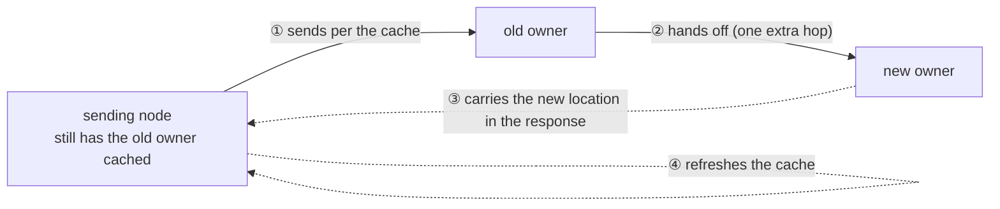
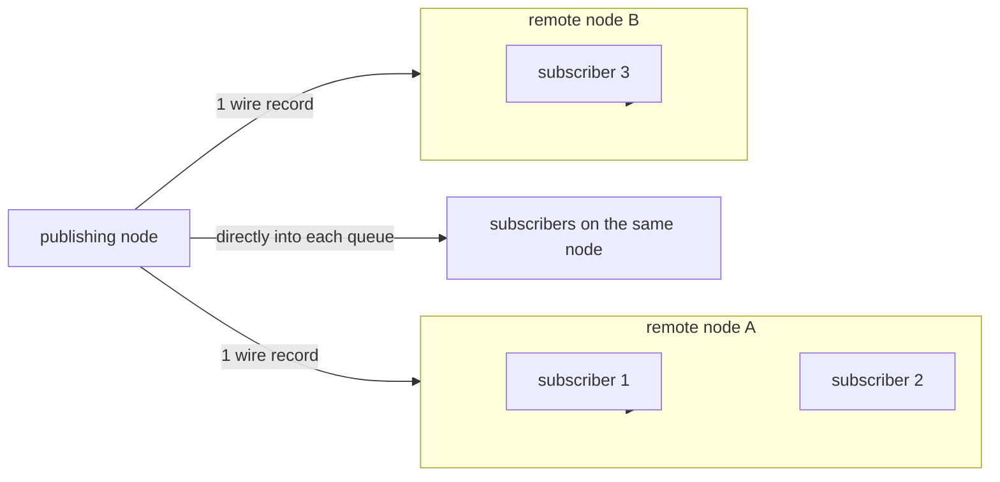

# 6. Target Selection And Route Cache

[Internal structure table of contents](README.en.md) · [Previous: 5. Message Continuity During A Move](05-relocation-continuity.en.md) · [Next: 7. Receive And Dispatch Loop](07-dispatch-loop.en.md)

> **What this chapter answers** — the procedure for picking a target
> from a single name, and how often that location lookup happens.
>
> **Contract ownership** — the selection order and tiebreak are owned
> by [Channel Messaging](../spec/08-channel-messaging.en.md), and the
> cache lifetime and invalidation condition by
> [Spot · Actor Routing](../spec/18-object-routing.en.md). This
> chapter covers the **structure** that satisfies that contract, and
> the mismatches actually observed across the four implementations.

Covers the structure that picks a target from a single name, and how
often that lookup happens. **The performance of location-transparent
messaging is effectively decided by this one cache.**

## 1. Don't Look Up Location Per Message

### The Problem

To send a message by object ID, you need to know which node currently
owns that object. This information is in the Location Store, and the
Store is usually a different process (Redis, etc.). Looking it up per
message means **every call gets a store round trip attached.**

### The Decision

The recently confirmed owner route is kept in the source runtime and
reused. The formal spec defines this as a
[Positive route cache](../spec/01-glossary.en.md#positive-route-cache).

What's kept is the owner route of a ready object and the **fence value
needed for the acceptance judgment.** Caching only the route and
dropping the fence would mean sending to a stale owner without knowing
it.

### What's Not Cached

Failure and in-progress states aren't cached. Object absent, being
created, and store failure are **not positive results, so they aren't
kept.** Caching them would turn a brief failure into an outage lasting
as long as the cache lifetime.

### What Decides The Lifetime

The cache lifetime never exceeds the shortest of three values.

| Ceiling | Why this value is a ceiling |
|---|---|
| `RouteCacheMaxAge` | The cache's own maximum retention time |
| The owner's acceptance deadline | After this time, that owner no longer accepts |
| **At least 5 seconds shorter** than the [Message Follow duration](../spec/01-glossary.en.md#message-follow-duration) | The cache must expire before the detour path closes ([`18:143-145`](../spec/18-object-routing.en.md), [`21:693-695`](../spec/21-location-runtime.en.md)) |

## 2. Where A Move Meets The Cache — A Performance Cliff

When an object moves to a different node, the route left in the cache
points at the old owner. Two things hold true at once here.

- A message that went to the old owner isn't dropped. Message Follow
  hands it to the new owner
  ([5. Continuity During A Move](05-relocation-continuity.en.md)).
- But **while it's being handed off, every message takes one extra
  hop.**

Without invalidating the cache, for the entire Message Follow period
after a move (30 seconds by default), **all traffic to that object
flows through the detour path.** It can chain up to 8 hops, so in an
environment with frequent moves, hops pile up.



**Decision — notify the sending side that a detour happened, and
refresh the cache.** The formal spec includes the relay notification
in the cache-invalidation condition
([Object Routing](../spec/18-object-routing.en.md)). The runtime that
receives the notification clears that cache entry and looks the owner
up again on the next call.

The detour is **a device that bridges the transition until the cache
refreshes**, not the normal path. Without the notification, the detour
continues until the cache lifetime ends.

**The notification record's common wire is fixed in the schema.**
Command 50 `messageFollow` in `service-wire-v1.schema.json` defines
the source/target route fence, hop count, queue accounting at the
relay moment, and the original operation/reply route. Flags and
application payload aren't allowed. But the schema existing alone
doesn't complete each language's relay, receipt, and cache
invalidation. Each runtime must check the source route's
object/authority generation and target node, down to the condition
that a newer cache entry isn't cleared.

**Design candidates — undecided, and don't constrain implementation.**

- Send only once per `(sending runtime, object, owner generation)`
  combination. Attaching a notification to every message on an object
  with traffic piling up right after a move would grow the
  notification record count as much as the business message count.
- If the same notification is already in flight, merge additional
  notifications.
- For a call that has a response, carry it on that response instead of
  making a separate record.
- The notification isn't guaranteed to be resent if lost — it expires
  naturally once the cache lifetime ends.
- Put the duplicate-suppression marker into the existing cache entry
  rather than a separate set, and remove it together when the cache
  entry disappears. A separate set would keep growing state
  proportional to the number of moved objects.

This is why the spec ties the cache lifetime to the Message Follow
period — even if the notification is lost, the cache naturally expires
once that period passes.

## 3. Don't Build The Candidate List Per Call

Picking a target by name requires narrowing candidates first. The
exclusion conditions are targets with zero weight and targets
preparing to shut down
([Channel Messaging 「3.2 ChannelName Select-One」](../spec/08-channel-messaging.en.md#32-channelname-select-one)).

**Decision — build the candidate list at the moment it changes, and
have calls only read it.** When peer state changes, build a new list
and swap it in; don't filter or sort on the call path.

Scanning all peers and checking conditions per call attaches a cost
proportional to peer count to every call. Peer state changes far less
often than message frequency.

## 4. Which Layer Does The Selection

Before deciding the procedure, **who picks** must be decided first. It
differs by channel kind.

| Path | How the target is specified | Layer that picks |
|---|---|---|
| MeshNode (RouteMesh) channel | Picks a logical node, then sends **addressing it directly by its NodeRid** | **framework** |
| ClientServer channel | Picks one of the candidate servers, then submits **on that server's dedicated connection** | **framework** |
| Manual-connection fallback | Announces the candidate endpoints to a single socket and **submits without specifying a target** | **Core** |

**Both formal paths are picked by framework.** MeshNode picks a
NodeRid, and ClientServer picks a candidate server and sends to its
address or dedicated connection, so Core has no room to pick. §5's
procedure is for these two paths.

The third is a **fallback** used only on a channel where no
ClientServer transport is registered. Since multiple connections
attach to one socket and submission has no target, Core's load
balancer picks. On this path, framework has no part in the selection.

### Connection Management Belongs To Core

**Decision — framework doesn't manage, in its place, the set of
connections one socket manages.** What framework tells Core is only
**which endpoints are candidates** and **each candidate's weight**.
When to connect to that endpoint, when to reconnect if it drops, and
which of the connections this message goes out on, is decided by Core.

Crossing this boundary duplicates three things together.

| If framework does it instead | What gets taken on together |
|---|---|
| Target selection | Connection lifetime, reconnect backoff, HWM and send-ready determination |
| One socket per candidate | socket/fd/monitor resources grow proportional to candidate count |
| Inducing selection via connection order | Core promises nothing about connection order |

**Pitfall — don't try to induce Core's selection via connection
order.** One implementation actually does this. It rotates the
candidate list so the winner computed comes first and passes it along,
but the receiving side puts it into a set and erases the order, and
Core doesn't promise order either, so **it has no effect.** Code whose
computed result reaches nowhere is left sitting there.

**A structure with one socket per candidate where framework picks is a
mixed verdict.** On the surface "framework picks" holds, but at the
cost of framework taking on connection lifetime and reconnection.

**The standard isn't "is it substitutable."** Even if it's
substitutable from the application's point of view, it can't be handed
down if the lower layer doesn't know the conditions needed for
selection. The standard is this.

> **Can the lower layer know and enforce all the eligibility
> conditions, weight, and stable identifier at selection time?**

ClientServer can. Server candidates handle the same ChannelName so
they're substitutable, but the conditions needed for selection exist
only on the framework side.

| Needed condition | Where it's decided |
|---|---|
| ready · drain state | The record framework left when admitting the connection |
| descriptor and actual connection identity/generation match | framework verification |
| Manual connection's ChannelName/RID/generation/weight/drain/security verification | framework verification |
| Server RID tiebreak | A value framework knows |

Without a path projecting these conditions to the lower layer, merging
into one socket could **select a connection that isn't yet admitted or
is draining.** So per-server connection and framework selection are
correct for now.

**Merging requires a projection API first.** Either a path for the
lower layer to update per-RID admission/weight/active state, or a send
path where framework specifies the target by the RID it picked, is
needed. Until then, per-server connection and the selector aren't
removed.

### What To Confirm

For framework to satisfy the contract on the path Core picks, **Core
must produce that order.** It can't be closed inside framework. As
long as Core's load balancer doesn't produce §5's procedure, this
path's selection order doesn't satisfy the contract.

## 5. Pinning Down The Selection Algorithm

**Decision — use smooth weighted round-robin.**

The formal spec fixed this procedure as contract
([Channel Messaging §Selection Order](../spec/08-channel-messaging.en.md#selection-order)).
Below is that procedure, and how to lower the per-call cost while
keeping it.

The formal spec requires two things — that the long-run selection
ratio converges to the weight ratio
([Channel Messaging 「3.2 ChannelName Select-One」](../spec/08-channel-messaging.en.md#32-channelname-select-one)),
and that on the ClientServer path, **targets with the same weight
rotate among each other**
([ClientServer Channel 「5. Weight And Target Selection」](../spec/09-client-server-channel.en.md#5-weight-and-target-selection)).

Multiple algorithms satisfy both, and they **produce different orders
while both satisfying them.** When nodes built in different languages
mix in one mesh, sending the same request to the same candidate set
gives a different distribution shape. Since load-balancing results
then can't be reproduced or compared across languages, the algorithm
itself is pinned down.

### The Procedure

Each candidate keeps a fixed `weight` and a mutable `current` value.
`current` starts at 0. Every selection does the following.

1. Add each candidate's own `weight` to its `current`.
2. Pick the candidate with the largest `current`. On a tie, pick the
   one with the smaller **candidate identifier**.
3. Subtract the sum of all candidates' `weight` from the picked
   candidate's `current`.

The `current` values are held continuously by that channel's selector.
When the candidate list changes (§3), only candidates in the new list
are kept and the rest are dropped.

### The Result This Procedure Produces

Sending four consecutive requests to two candidates A and B with
weight 100 and 300 gives `B, A, B, B` (when A's node RID is smaller
than B's — since the first round ties, the sort order decides the
result). The ratio is 1:3, and there's no stretch where the same
target is picked three times in a row. That there's no pile-up like
`A, B, B, B` is what "smooth" means.

Two candidates with the same weight alternate as `A, B, A, B` — the
spec's rotation requirement is automatically satisfied by this
procedure.

### Why Not Use Randomness

Weighted random matches the long-run ratio but **doesn't guarantee
rotation.** Sending ten consecutive requests to two targets with the
same weight could give one of them eight. It fails the spec
requirement above, and since it's not reproducible either, a
load-balancing problem can't be diagnosed.

**Decision — the candidate order is sorted by a per-topology
identifier.** This makes step 2's tiebreak and candidate-list
comparison deterministic.

| topology | Candidate identifier |
|---|---|
| RouteMesh | node RID |
| ClientServer | Server RID |

Using a different value that points at the same target (connection
path, registration source, connection map key) as the identifier makes
the order diverge per implementation. One implementation actually uses
a connection map key.

### How To Lower The Per-Call Cost While Keeping The Procedure

Running the procedure above literally on every call attaches a cost
proportional to candidate count N to **every send**. As candidates
grow, one channel's send throughput bottlenecks at the selector alone.

**Decision — precompute the order when the candidate list changes, and
have each call only move the cursor.** However, there's a condition
for pinning down the cycle.

Since the procedure is deterministic, **when the same cumulative-value
state reappears**, the span between is the cycle. Starting from the
candidate-change moment (the same moment §3 already rebuilds the
list), run the procedure ahead of time, record the states passed
through, and when **a state already seen** reappears, that's one full
lap. The span before that is a lead-in traversed only once, so the
lead-in and the cycle are stored separately. From then on, each call
just reads one array and advances the cursor, and the resulting order
is **exactly identical** to running the procedure every time.

**Two things must not be assumed.**

First, the length `sum of weights ÷ GCD` is only a cycle when the
cumulative values all start at 0. When candidates change, the
remaining candidates' cumulative values are preserved (§Selection
Order), so there's no guarantee that state is a point on a cycle
starting from 0.

Second, **don't wait for a return to the starting state.** Once past
the lead-in and into the cycle, the starting state never reappears.

> With equal-weight A, B, C, picking A once gives cumulative values
> `A=-2, B=1, C=1`. Removing B, the state changes are as follows.
>
> ```
> (A=-2, C=1) → pick C → (-1, 0)
> (-1,  0)    → pick C → ( 0,-1)
> ( 0, -1)    → pick A → (-1, 0)   ← (-1,0) reappeared
> ```
>
> The cycle is `(-1,0) → (0,-1)`, two steps, and `(-2,1)` is the
> lead-in. Waiting for a return to the starting state never finds it.
> Conversely, storing the earlier pair of results `C, C` as the cycle
> gives `C,C,C,C,…`, and A is never picked again.

Cycle search keeps **two ceilings — step count and time.** If a
repeating state isn't found within the ceiling, it falls back to
running the procedure on every call. The search happens on the
candidate-change path, not the send path.

**Decision — cumulative-value state and cursor advance are ordered
into a single sequence.** If candidate replacement and selection
happen at the same time, which state the pick is based on becomes
undetermined. If multiple threads advance a single cursor, that
synchronization cost stays on the send path, so either keep one
selection path per channel or use per-shard independent state. Picking
the latter makes the resulting order differ per shard and fails to
satisfy the contract — so the former is chosen.

**Decision — building the candidate array, sorting, and set
construction don't belong on the call path.** §3's candidate list and
the cycle above are prepared together, and calls only read them. Some
implementation builds a map and sorts it per call — this cost is a
data-structure preparation timing problem, not a selection-algorithm
one.

## 6. A Directly Specified Target Isn't Swapped

| Call form | What the runtime does |
|---|---|
| Name only specified | Builds candidates and picks one |
| Node RID or object ID specified directly | **Doesn't pick a different target instead** |

"The target isn't swapped" and "the call succeeds" are different
guarantees. If a directly specified target isn't ready, that call ends
in failure, and the runtime doesn't move to a different candidate.

## 7. Sending To Several Targets Together

This is the case where one publish goes to multiple subscribers. Unlike
when there's one target, **where "one result" ends** must be defined.

**Decision — the target list is fixed when the publish starts.** Even
if subscribers are added or removed while sending, this publish's
targets don't change. Without fixing it, there's no way to explain why
the same publish reaches some subscribers and not others.

**Decision — send only one message to a remote node, and let that
node distribute it to its own subscribers.**



Sending separately to each subscriber crosses the network with the
same payload multiple times. With 100 subscribers on one node, that's
100x. Having the remote node distribute from its own list makes the
transfer volume proportional to **node count**, not subscriber count.

Subscribers within the same node are put directly into each one's
queue.

**Decision — even if some targets fail, already accepted targets
aren't rolled back.** Results per target are independent of each
other. Rolling back would require cancelling something the handler may
have already run, and there's no way to do that.

**Decision — publish completes with no result value, and doesn't
return a per-target result.** A target that wasn't accepted isn't
counted either in the public result or in monitoring
([Spot Messaging 「4.4 Processing After Publish Has Started」](../spec/12-spot-messaging.en.md#44-processing-after-publish-has-started)).
The completion point is when the sending side secures its own slot.

This pairs with §"even if some targets fail, it isn't rolled back" —
since it's neither rolled back nor notified, publish is a call that
only guarantees "it was sent." For business logic that needs to
confirm per-target delivery, use a call that waits for a response
instead of publish.

## 8. Result To Confirm

- Consecutive calls to the same object don't cause a
  [Location Store](../spec/01-glossary.en.md#location-store) lookup
  per call.
- Object-absent, being-created, and store-failure states aren't left
  in the cache.
- The cache lifetime doesn't exceed the Message Follow period.
- After a call that went through the detour path following a move, the
  sending side's cache is refreshed, so the next call goes directly to
  the new owner.
- While peer state doesn't change, candidate filtering doesn't run on
  the call path.
- Targets with the same weight alternate across consecutive calls.
- Four consecutive calls to two candidates with weight 100 and 300
  select in the order `B, A, B, B`.
- The same candidate set and the same selector state always produce
  the same order.
- The long-run selection ratio of two candidates with weight 100 and
  300 converges to about 1:3.
- On a call with a directly specified target, the runtime doesn't pick
  a different target.
- Even if subscribers change during a publish, that publish's target
  list doesn't change.
- Even with multiple subscribers on one remote node, only one record
  crosses the wire.
- Some targets failing doesn't roll back already accepted targets.
- Per-target acceptance/failure doesn't show up in the publish result,
  nor is it exposed as a publish-specific observability metric.

---

[Internal structure table of contents](README.en.md) · [Previous: 5. Message Continuity During A Move](05-relocation-continuity.en.md) · [Next: 7. Receive And Dispatch Loop](07-dispatch-loop.en.md)
