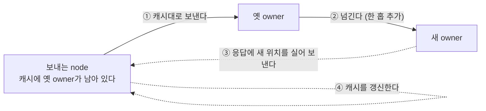
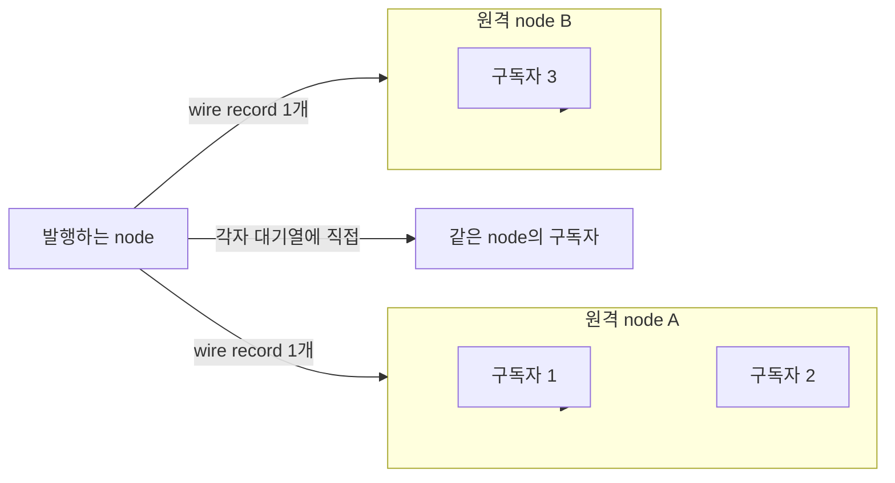

# 6. target 선택과 route cache

[내부 구조 목차](README.ko.md) · [이전: 5. 이동 중 message 연속성](05-relocation-continuity.ko.md) · [다음: 7. 수신과 dispatch 루프](07-dispatch-loop.ko.md)

> **이 장이 답하는 것** — 이름 하나로 대상을 고르는 절차와, 그 위치 조회를 얼마나 자주 하는가.
>
> **계약 소유** — 선택 순서와 tiebreak는 [Channel 메시징](../spec/08-channel-messaging.ko.md)이,
> cache 수명과 무효화 조건은 [Spot·Actor routing](../spec/18-object-routing.ko.md)이 소유한다.
> 이 장은 그 계약을 만족시키는 **구조**와, 네 구현에서 관찰된 어긋남을 다룬다.

이름 하나로 대상을 고르는 구조와, 그 조회를 얼마나 자주 하느냐를 다룬다. **위치 투명
메시징의 성능은 사실상 이 문서의 캐시 하나로 결정된다.**

## 1. 위치 조회를 message마다 하지 않는다

### 문제

객체 ID로 message를 보내려면 지금 어느 node가 그 객체를 맡고 있는지 알아야 한다. 이
정보는 Location Store에 있고, Store는 보통 다른 process(Redis 등)다. message마다
조회하면 **모든 호출에 저장소 왕복이 하나씩 붙는다.**

### 결정

최근에 확인한 owner 경로를 source runtime에 보관했다가 재사용한다. 정식 spec은 이것을
[Positive route cache](../spec/01-glossary.ko.md#positive-route-cache)로 정의한다.

보관하는 것은 준비된 객체의 owner 경로와 **수락 판단에 필요한 fence 값**이다. 경로만
캐시하고 fence를 빼면 낡은 owner에게 보내 놓고 그 사실을 알지 못한다.

### 캐시하지 않는 결과

실패와 진행 중 상태는 캐시하지 않는다. 객체가 없음, 만드는 중, 저장소 실패는
**긍정 결과가 아니므로 보관하지 않는다.** 이것을 캐시하면 잠깐의 실패가 캐시 수명만큼
지속되는 장애가 된다.

### 수명을 무엇이 정하는가

캐시 수명은 세 값 중 가장 짧은 것을 넘지 않는다.

| 상한 | 왜 이 값이 상한인가 |
|---|---|
| `RouteCacheMaxAge` | 캐시 자체의 최대 보관 시간 |
| owner의 수락 기한 | 이 시간이 지나면 그 owner는 더 이상 수락하지 않는다 |
| [Message Follow 기간](../spec/01-glossary.ko.md#message-follow-duration)보다 **최소 5초 짧게** | 우회 경로가 닫히기 전에 캐시가 먼저 만료되어야 한다 ([`18:143-145`](../spec/18-object-routing.ko.md), [`21:693-695`](../spec/21-location-runtime.ko.md)) |

## 2. 이동과 캐시가 만나는 지점 — 성능 절벽

객체가 다른 node로 옮겨 가면 캐시에 남은 경로는 옛 owner를 가리킨다. 이때 두 가지가
동시에 성립한다.

- 옛 owner로 간 message는 버려지지 않는다. Message Follow가 새 owner에게 넘긴다
  ([5. 이동 중 연속성](05-relocation-continuity.ko.md)).
- 그러나 **넘기는 동안 모든 message가 한 홉을 더 거친다.**

캐시를 무효화하지 않으면 이동 후 Message Follow 기간(기본 30초) 내내 그 객체로 가는
**모든 트래픽이 우회 경로로 흐른다.** 최대 8홉까지 이어질 수 있으므로, 이동이 잦은
환경에서는 홉이 쌓인다.



**결정 — 우회로 넘어간 사실을 보낸 쪽에 알려 캐시를 갱신한다.** 정식 spec이 relay
통지를 캐시 무효화 조건에 포함했다
([객체 routing](../spec/18-object-routing.ko.md)). 통지를 받은 runtime은 해당 캐시
항목을 지우고 다음 호출에서 owner를 다시 조회한다.

우회는 **캐시가 갱신될 때까지의 과도기를 메우는 장치**이지 정상 경로가 아니다. 알림이
없으면 캐시 수명이 끝날 때까지 우회가 계속된다.

**통지 record의 공통 wire는 schema에 고정되었다.** `service-wire-v1.schema.json`의 command
50 `messageFollow`가 source·target route fence, hop count, relay 시점의 queue 회계와
원래 operation/reply route를 정의한다. flags와 application payload는 허용하지 않는다.
다만 schema가 있다는 사실만으로 각 언어의 relay·수신·cache 무효화가 완료되는 것은 아니다.
각 runtime은 source route의 object·authority generation과 target node를 확인하고, 더 새로운
cache 항목을 지우지 않는 조건까지 구현해야 한다.

**설계 후보 — 판정 전이며 구현을 구속하지 않는다.**

- `(보낸 runtime, 객체, owner 세대)` 조합마다 처음 한 번만 보낸다. 이동 직후 트래픽이
  몰리는 객체에서 message마다 통지를 붙이면 통지 record가 업무 message만큼 늘어난다.
- 같은 통지가 전송 중이면 추가 통지는 합친다.
- 응답이 있는 호출은 그 응답에 실어 별도 record를 만들지 않는다.
- 통지는 유실되어도 캐시 수명이 끝나면 만료되므로 재전송을 보장하지 않는다.
- 중복 억제 표식은 별도 집합이 아니라 기존 캐시 항목에 넣고, 캐시 항목이 사라질 때 함께
  없앤다. 별도 집합을 두면 이동한 객체 수만큼 상태가 계속 늘어난다.

이것이 spec이 캐시 수명을 Message Follow 기간으로 묶어 둔 이유다 — 알림이 유실되어도
그 기간이 지나면 캐시가 자연히 만료된다.

## 3. 후보 목록을 호출마다 만들지 않는다

이름으로 대상을 고를 때는 후보를 추려야 한다. 제외 조건은 weight가 0인 대상과 종료
준비 중인 대상이다([Channel 메시징 「3.2 ChannelName select-one」](../spec/08-channel-messaging.ko.md#32-channelname-select-one)).

**결정 — 후보 목록은 변경 시점에 만들어 두고 호출은 읽기만 한다.** peer 상태가 바뀔
때 새 목록을 만들어 바꿔 끼우고, 호출 경로에서는 필터링과 정렬을 하지 않는다.

호출마다 전체 peer를 훑어 조건을 확인하면 peer 수에 비례하는 비용이 모든 호출에
붙는다. peer 상태는 message 빈도보다 훨씬 드물게 바뀐다.

## 4. 선택을 어느 계층이 하는가

절차를 정하기 전에 **누가 고르는가**부터 정해야 한다. 채널 종류에 따라 다르다.

| 경로 | 대상 지정 방식 | 고르는 계층 |
|---|---|---|
| MeshNode(RouteMesh) 채널 | 논리 node를 고른 뒤 그 **NodeRid로 직접 지정**해 보낸다 | **framework** |
| ClientServer 채널 | 후보 server 중 하나를 고른 뒤 **그 server 전용 연결로** 제출한다 | **framework** |
| 수동 연결 fallback | 후보 endpoint를 socket 하나에 모두 알리고 **대상 지정 없이 제출**한다 | **Core** |

**정식 경로 둘은 모두 framework가 고른다.** MeshNode는 NodeRid를, ClientServer는 후보
server를 고른 뒤 주소나 전용 연결로 보내므로 Core에는 고를 여지가 없다. §5의 절차는 이 두
경로를 위한 것이다.

세 번째는 ClientServer transport가 등록되지 않은 채널에서만 쓰는 **fallback**이다. socket
하나에 여러 연결이 붙고 제출에 대상이 없으므로 Core의 load balancer가 고른다. 이 경로에서
framework는 선택에 관여하지 않는다.

### 연결 관리는 Core의 몫이다

**결정 — framework는 socket 하나가 관리하는 연결 집합을 대신 관리하지 않는다.** framework가
Core에 알리는 것은 **어떤 endpoint가 후보인가**와 **각 후보의 weight**까지다. 그 endpoint에
언제 연결하고, 끊기면 언제 다시 붙이고, 그중 어느 연결로 이 message를 보낼지는 Core가 정한다.

이 경계를 넘으면 세 가지가 함께 중복된다.

| framework가 대신 하면 | 함께 떠안게 되는 것 |
|---|---|
| 대상 선택 | 연결 수명, 재연결 backoff, HWM과 송신 준비 판정 |
| 후보마다 socket 하나씩 | socket·fd·monitor 자원이 후보 수에 비례해 늘어난다 |
| 연결 순서로 선택 유도 | Core는 연결 순서에 대해 아무것도 약속하지 않는다 |

**함정 — 연결 순서로 Core의 선택을 유도하려 하면 안 된다.** 한 구현이 실제로 이렇게 한다.
후보 목록을 계산한 winner가 맨 앞에 오도록 회전시켜 넘기는데, 받는 쪽이 집합에 넣어 순서를
지우고 Core도 순서를 약속하지 않아 **아무 효과가 없다.** 계산 결과가 어디에도 도달하지 않는
코드가 남아 있는 상태다.

**후보마다 socket을 하나씩 만들어 framework가 고르는 구조는 판정이 갈린다.** 겉보기에
"framework가 고른다"가 성립하지만, 그 대가로 연결 수명과 재연결을 framework가 떠안는다.

**판정 기준은 "대체 가능한가"가 아니다.** application 관점에서 대체 가능하더라도, 선택에
필요한 조건을 하위 계층이 모르면 넘길 수 없다. 기준은 이것이다.

> **하위 계층이 선택 시점에 eligibility 조건·weight·안정적 식별자를 모두 알고 강제할 수
> 있는가?**

ClientServer가 그렇다. server 후보는 같은 ChannelName을 처리하므로 대체 가능하지만, 선택에
필요한 조건이 framework 쪽에만 있다.

| 필요한 조건 | 어디서 정하는가 |
|---|---|
| ready·drain 상태 | framework가 연결을 승인할 때 남긴 기록 |
| descriptor와 실제 연결의 identity·세대 일치 | framework 검증 |
| 수동 연결의 ChannelName·RID·세대·weight·drain·보안 검증 | framework 검증 |
| Server RID tiebreak | framework가 아는 값 |

이 조건들을 하위 계층에 투영하는 경로가 없으면, socket 하나로 합쳤을 때 **아직 승인되지
않았거나 drain 중인 연결이 선택될 수 있다.** 그래서 지금은 per-server 연결과 framework
선택이 맞다.

**합치려면 투영 API가 먼저다.** 하위 계층에 RID별 승인·weight·활성 상태를 갱신하는 경로나,
framework가 고른 RID로 대상을 지정하는 송신 경로 중 하나가 필요하다. 그 전에는 per-server
연결과 선택기를 지우지 않는다.

### 확인할 것

Core가 고르는 경로에서 framework가 계약을 만족시키려면 **Core가 그 순서를 내야 한다.**
framework 안에서는 닫을 수 없다. Core의 load balancer가 §5의 절차를 내지 않는 동안,
이 경로의 선택 순서는 계약을 만족하지 않는다.

## 5. 선택 알고리즘을 지정한다

**결정 — 가중치를 매끄럽게 분산하는 순환(smooth weighted round-robin)을 쓴다.**

정식 spec이 이 절차를 계약으로 고정했다
([Channel 메시징 §선택 순서](../spec/08-channel-messaging.ko.md)). 아래는 그 절차와,
절차를 지키면서 호출 비용을 낮추는 방법이다.

정식 spec은 두 가지를 요구한다 — 장기 선택 비율이 weight 비율에 수렴할 것
([Channel 메시징 「3.2 ChannelName select-one」](../spec/08-channel-messaging.ko.md#32-channelname-select-one)), 그리고 ClientServer
경로에서 **같은 weight를 가진 대상끼리 순환할 것**
([ClientServer Channel 「5. Weight와 target 선택」](../spec/09-client-server-channel.ko.md#5-weight와-target-선택)).

이 둘을 만족하는 알고리즘은 여럿이고, **만족하면서도 서로 다른 순서를 낸다.** 한 mesh에
여러 언어로 만든 node가 섞이면 같은 후보 집합에 같은 요청을 보내도 분포 모양이 달라진다.
부하 분산 결과를 재현하거나 언어 간에 비교할 수 없게 되므로, 알고리즘 자체를 고정한다.

### 절차

후보마다 고정된 `weight`와 가변 `current` 값을 둔다. `current`의 초기값은 0이다.
선택할 때마다 다음을 수행한다.

1. 모든 후보의 `current`에 자기 `weight`를 더한다.
2. `current`가 가장 큰 후보를 고른다. 같으면 **후보 식별자**가 작은 쪽을 고른다.
3. 고른 후보의 `current`에서 후보 전체의 `weight` 합을 뺀다.

`current` 값은 그 channel의 선택기가 계속 들고 있는다. 후보 목록이 바뀌면(§3) 새 목록의
후보만 남기고 나머지는 버린다.

### 이 절차가 내는 결과

weight가 100과 300인 두 후보 A·B에 네 번 연속 요청하면 `B, A, B, B`가 나온다(A의 node
RID가 B보다 작을 때. 1회차가 동점이므로 정렬 순서가 결과를 정한다). 비율은 1:3이고, 같은
대상이 연달아 세 번 선택되는 구간이 없다. `A, B, B, B` 같은 몰림이 생기지 않는다는 것이
"매끄럽다"의 뜻이다.

weight가 같은 두 후보는 `A, B, A, B`로 번갈아 나온다 — spec의 순환 요구가 이 절차에서
자동으로 만족된다.

### 무작위를 쓰지 않는 이유

가중 무작위는 장기 비율은 맞추지만 **순환을 보장하지 않는다.** 같은 weight를 가진 두
대상에 연속으로 열 번 보내면 한쪽에 여덟 번이 갈 수도 있다. 위 spec 요구를 만족하지
못하고, 재현도 되지 않아 부하 분산 문제를 진단할 수 없다.

**결정 — 후보 순서는 topology별 식별자로 정렬해 둔다.** 2번의 동점 처리와 후보 목록
비교가 결정적으로 이루어진다.

| topology | 후보 식별자 |
|---|---|
| RouteMesh | node RID |
| ClientServer | Server RID |

같은 target을 가리키는 다른 값(연결 경로, 등록 출처, 연결 map key)을 식별자로 쓰면
구현마다 순서가 갈린다. 실제로 한 구현이 연결 map key를 쓰고 있다.

### 절차를 지키면서 호출 비용을 낮추는 방법

위 절차를 글자 그대로 호출마다 수행하면 후보 수 N에 비례하는 비용이 **모든 send**에
붙는다. 후보가 늘수록 한 channel의 송신 처리량이 선택기 한 곳에서 막힌다.

**결정 — 후보 목록이 바뀔 때 순서를 미리 계산해 두고, 호출은 cursor만 옮긴다.** 다만
주기를 확정하는 조건이 있다.

절차는 결정적이므로 **같은 누적값 상태가 다시 나타나면** 그 사이가 주기다. 후보 변경
시점(§3에서 이미 목록을 다시 만드는 그 시점)부터 절차를 미리 돌리면서 지나온 상태를
기록하고, **이미 본 상태**가 다시 나오면 거기까지가 한 바퀴다. 그 앞의 구간은 한 번만
지나가는 도입부이므로 도입부와 주기를 나눠 저장한다. 이후 호출은 배열 하나를 읽고
cursor를 증가시키는 것으로 끝나며, 결과 순서는 절차를 매번 수행한 것과 **완전히 같다.**

**두 가지를 단정하면 안 된다.**

첫째, `weight 합 ÷ 최대공약수` 길이는 누적값이 전부 0인 상태에서만 주기다. 후보가 바뀌면
남은 후보의 누적값이 보존되므로(§선택 순서) 그 상태가 0에서 시작한 주기 위의 점이라는
보장이 없다.

둘째, **시작 상태로 돌아오기를 기다리면 안 된다.** 도입부를 지나 주기에 들어가면 시작
상태는 다시 나타나지 않는다.

> 같은 weight의 A·B·C에서 A를 한 번 고르면 누적값은 `A=-2, B=1, C=1`이다. 여기서 B를
> 빼면 상태 변화는 이렇다.
>
> ```
> (A=-2, C=1) → C 선택 → (-1, 0)
> (-1,  0)    → C 선택 → ( 0,-1)
> ( 0, -1)    → A 선택 → (-1, 0)   ← (-1,0)이 다시 나왔다
> ```
>
> 주기는 `(-1,0) → (0,-1)` 두 걸음이고 `(-2,1)`은 도입부다. 시작 상태 복귀를 기다리면
> 영영 찾지 못한다. 반대로 앞의 두 결과 `C, C`를 주기로 저장하면 `C,C,C,C,…`가 되어
> A가 영영 선택되지 않는다.

주기 탐색에는 **걸음 수와 시간 두 상한**을 둔다. 상한 안에 반복 상태를 찾지 못하면 절차를
호출마다 수행하는 방식으로 되돌린다. 탐색은 후보 변경 경로에서 하며 send 경로에서 하지
않는다.

**결정 — 누적값 상태와 cursor 증가는 하나의 순서로 정렬한다.** 후보 교체와 선택이
동시에 일어나면 어느 상태를 기준으로 고른 것인지 정해지지 않는다. 단일 cursor를 여러
스레드가 증가시키는 구조라면 그 동기화 비용이 send 경로에 남으므로, channel별로 선택
경로를 하나로 두거나 shard별 독립 상태를 쓴다. 후자를 고르면 결과 순서가 shard마다
달라지므로 계약을 만족하지 못한다 — 전자를 택한다.

**결정 — 후보 배열·정렬·집합 생성은 호출 경로에 두지 않는다.** §3의 후보 목록과 위
주기를 함께 준비해 두고, 호출은 읽기만 한다. 호출마다 map을 만들고 정렬하는 구현이
있는데, 이 비용은 선택 알고리즘이 아니라 자료구조 준비 시점의 문제다.

## 6. 직접 지정한 대상은 바꾸지 않는다

| 호출 방식 | runtime이 하는 일 |
|---|---|
| 이름만 지정 | 후보를 만들고 하나를 고른다 |
| node RID나 객체 ID를 직접 지정 | **다른 대상을 대신 고르지 않는다** |

"대상을 바꾸지 않는다"와 "호출이 성공한다"는 다른 보장이다. 직접 지정한 대상이
준비되지 않았으면 그 호출은 실패로 끝나며, runtime이 다른 후보로 옮기지 않는다.

## 7. 여러 대상에게 함께 보낼 때

한 번의 발행이 구독자 여럿에게 가는 경우다. 대상이 하나일 때와 달리 **어디까지가 하나의
결과인가**를 정해야 한다.

**결정 — 발행을 시작할 때 대상 목록을 고정한다.** 보내는 도중에 구독자가 늘거나 줄어도
이번 발행의 대상은 바뀌지 않는다. 고정하지 않으면 같은 발행이 어떤 구독자에게는 가고
어떤 구독자에게는 가지 않는 이유를 설명할 수 없다.

**결정 — 원격 node에는 message를 하나만 보내고, 그 node가 자기 구독자에게 나눠 준다.**



구독자마다 따로 보내면 같은 payload가 네트워크를 여러 번 건넌다. 한 node에 구독자가
100개면 100배다. 원격 node가 자기 쪽 목록으로 나눠 주면 전송량이 구독자 수가 아니라
**node 수**에 비례한다.

같은 node 안의 구독자에게는 각자의 대기열에 직접 넣는다.

**결정 — 일부 대상이 실패해도 이미 수락한 대상을 되돌리지 않는다.** 대상별 결과는
서로 독립이다. 되돌리려면 이미 handler가 실행됐을 수도 있는 것을 취소해야 하는데,
그럴 방법이 없다.

**결정 — 발행은 결과값 없이 완료하며 대상별 결과를 돌려주지 않는다.** 수락하지 못한
대상을 public 결과로도 monitoring으로도 집계하지 않는다
([Spot 메시징 「4.4 Publish가 시작된 이후의 처리」](../spec/12-spot-messaging.ko.md#44-publish가-시작된-이후의-처리)). 완료 시점은 보내는 쪽이
자기 자리를 확보한 때다.

이것이 §"일부 대상이 실패해도 되돌리지 않는다"와 짝을 이룬다 — 되돌리지도 않고 알리지도
않으므로, 발행은 "보냈다"까지만 보장하는 호출이다. 대상별 도달을 확인해야 하는 업무라면
발행이 아니라 응답을 기다리는 호출을 쓴다.

## 8. 확인할 결과

- 같은 객체로 연속 호출할 때 [Location Store](../spec/01-glossary.ko.md#location-store) 조회가 호출마다 발생하지 않는다.
- 객체 없음·만드는 중·저장소 실패가 캐시에 남지 않는다.
- 캐시 수명이 Message Follow 기간을 넘지 않는다.
- 이동 후 우회 경로로 넘어간 호출 뒤에는 보낸 쪽 캐시가 갱신되어, 다음 호출이 새
  owner로 직접 간다.
- peer 상태가 바뀌지 않는 동안 호출 경로에서 후보 필터링이 실행되지 않는다.
- 같은 weight를 가진 대상들이 연속 호출에서 번갈아 선택된다.
- weight 100과 300인 두 후보에 네 번 연속 호출하면 `B, A, B, B` 순서로 선택된다.
- 같은 후보 집합과 같은 선택기 상태에서 항상 같은 순서가 나온다.
- weight 100과 300인 두 후보의 장기 선택 비율이 약 1:3에 수렴한다.
- 대상을 직접 지정한 호출에서 runtime이 다른 대상을 고르지 않는다.
- 발행 도중 구독자가 바뀌어도 그 발행의 대상 목록이 바뀌지 않는다.
- 한 원격 node에 구독자가 여럿이어도 wire를 건너는 record가 하나다.
- 일부 대상 실패가 이미 수락한 대상을 되돌리지 않는다.
- 발행 결과에 target별 수락·실패가 드러나지 않는다. 발행 전용 관측 지표로도 노출되지 않는다.

---

[내부 구조 목차](README.ko.md) · [이전: 5. 이동 중 message 연속성](05-relocation-continuity.ko.md) · [다음: 7. 수신과 dispatch 루프](07-dispatch-loop.ko.md)
