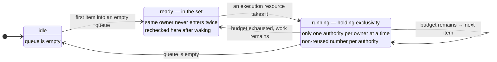
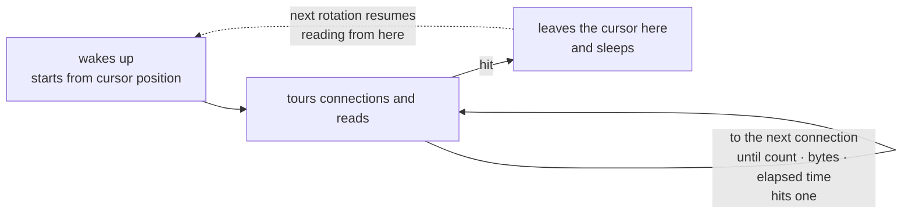

# 7. Receive And Dispatch Loop

[Internal structure table of contents](README.en.md) · [Previous: 6. Target Selection And Route Cache](06-routing-and-cache.en.md) · [Next: 8. Object Kind And Activation](08-object-lifecycle.en.md)

> **What this chapter answers** — the span that carries a received
> message to the execution gate.
>
> **Contract ownership** — receive fairness is owned by
> [Transport Liveness](../spec/29-transport-liveness.en.md), and the
> queue bound by [the Framework API](../spec/06-framework-api.en.md).
> This chapter covers the **structure** that satisfies that contract,
> and the mismatches actually observed across the four implementations.

The span that carries a received message to the execution gate.
Whether to wake per message or batch-process decides throughput, and
what wakes it decides the latency floor.

## 1. Keep The Set Of Ready Owners As State

### The Problem

Waking an execution resource every time a message arrives makes the
wake-up cost proportional to message count. But using a notify-once
approach (notify only at the moment of change) misses a message that
arrives between the notification and processing.

### The Decision

**Keep as state which owners currently have work to do.** This state
represents "this is the current state" rather than a "something
changed" notification, and the same owner never enters it twice.

What must be satisfied is the **result**, not the data structure — a
message that arrived even if the notification was lost eventually gets
processed for an owner with remaining work (no missed wakeup), and the
same owner never goes onto the queue twice. A set, a bitmap, or an
intrusive list all work as long as they satisfy these two. The
explanation below uses a set as the example.

- When the first item goes into an empty queue, put the owner into the
  set.
- An execution resource takes one owner from the set and processes it.
- If work remains after processing, put it back in; if empty, remove
  it.
- **Always recheck this set after waking up.**

The last item is the key. Even if a notification was missed, checking
the set again finds the remaining work. A lost notification doesn't
become a lost message.

## 2. Don't Split The Admission Check From The Enqueue

Deciding which owner's queue to put a message into requires checking
several conditions — whether that owner is still on this node, whether
there's a slot, whether it's sealed for a move.

**Decision — these checks and the actual enqueue finish inside the
same span. The owner doesn't change between checking and enqueuing.**

Splitting them causes this — at check time this node was the owner,
but right before enqueuing, a move finishes and the owner changes. The
message ends up **in the queue of a node that's no longer owner**, and
that queue is processed by no one. The sender waits until timeout.

Within one span, handle the following in order.

1. Is the host and topology currently accepting application work
2. Is the target object on this node and is the owner info valid
3. Is it not sealed for a move / not waiting for creation / not
   waiting for a session connection
4. Is there a queue slot available (the byte bound from
   [8. Object Kind And Activation 「6. Which Unit Memory Accounting Uses」](08-object-lifecycle.en.md#6-which-unit-memory-accounting-uses))
5. Enqueue, and if a previously empty queue is now filled, put it into
   §1's ready set

**Decision — a message that fails a check doesn't appear in the
queue.** It's not built as enqueue-then-remove. Enqueuing then
removing lets it possibly execute in between, and there's no way to
distinguish the removal from observation either. A call waiting for a
response receives the failure reason as its result.

**Per-language discretion.** Whether this span is built with a lock or
another method is free. Since a long span becomes a bottleneck itself,
put **only checking and enqueuing** here — work like deserialization
or handler lookup happens outside this span
([11. Payload Ownership And Copy 「6. When Deserialization Happens」](11-message-ownership.en.md#6-when-deserialization-happens)).

## 3. Acquire Exclusivity Together With Taking Ownership

If two execution resources take the same owner at the same time,
serial execution breaks. So taking ownership **also doubles as
acquiring exclusivity** — only one processing authority for one owner
exists at a time.

There's a pitfall here. Between releasing processing authority and
acquiring it again, a different execution resource can take the same
owner, and after that, a late-arriving completion **can't be
distinguished as belonging to the previous authority or the current
one.** The value looks the same but it's from a different moment.

**Decision — attach a non-reused number to each processing authority.**
A late-arriving completion compares the number it was holding against
the current number to judge whether it's its own.

## 4. Once Taken, Batch-Process

The cost of taking ownership and the cost of acquiring the gate don't
need to be paid once per message.

What this bound aims to block is **one owner holding an execution
resource too long.** So the value to measure is **holding time.**

**Decision — once taken, process several items in a row within a fixed
time budget.** After finishing each item, check if budget remains; if
so, process the next item, and if not, put the remaining work back
into the set and release authority.

Don't use item count as the basis — same reason as
[8. Object Kind And Activation 「6. Which Unit Memory Accounting Uses」](08-object-lifecycle.en.md#6-which-unit-memory-accounting-uses).
Even the same 100 items, some handlers finish in 1 ms and some take a
second. Count can't predict occupancy time.

The time budget can only be checked **at the boundary between
finishing one item.** Since a running handler isn't interrupted
mid-way, if one handler takes longer than the budget, that overage
passes through. This isn't what this bound blocks — that's a handler
authoring problem, and what's blocked here is **several short work
items piling up and one owner staying occupied continuously.**

If reading the clock is a burden, a byte total can be used as a
proxy — only when handler processing time is roughly proportional to
payload size. If handlers where that relationship doesn't hold are
mixed in, bytes can't predict either, so keep it as a proxy only and
don't eliminate the time budget.

### §1–4 In One Picture

The states one owner passes through. **Being in the set** and **holding
processing authority** are different states, and the same owner is
never in both at once.

**`idle → ready` happens inside §2's check-and-enqueue span.** Pulled
outside it, the owner could change between checking and enqueuing, and
a message ends up in the queue of a node that's no longer owner.

**`ready → running` also doubles as acquiring exclusivity (§3).** The
reason for a non-reused number per authority is to tell which
authority a late-arriving completion belongs to after cycling through
`running → ready → running`.

**The `running → ready` arrow is what §4's time budget does.** Without
this arrow, an owner where short work keeps arriving never releases
the execution resource.

## 5. Pick Only One Wake-Up Method

**Decision — don't mix wake-up methods during execution within one
runtime.** Which of the three below to use is per-language discretion,
but if the chosen method changes mid-execution, latency
characteristics differ per span and the cause can't be traced.

| Method | Latency characteristic | Idle cost |
|---|---|---|
| Block and wait | Wakes immediately on arrival | No cost while waiting |
| Wake via callback | Wakes immediately on arrival | No cost while waiting |
| Poll periodically | **Creates a latency floor equal to the period** | Keeps waking even while idle |

Choosing the third creates a latency floor regardless of load. With a
1ms period, it wakes 1,000 times a second even while idle, and the
best-case latency of one message is tied to that period.

**Decision — use a method that wakes immediately on arrival. Use
periodic polling only when that language's receive model allows no
other method.**

This isn't discretion but **a constrained choice.** Since the latency
floor changing is an observable difference, polling isn't chosen for
convenience. Some languages can't block a single event loop and have
no path but polling, and it's allowed only in that case.

If polling is used, record the period in that language's
documentation — since that value is the latency floor itself, it's the
first value to check when comparing performance.

**Decision.** Whichever method is chosen, §1's last rule is the
same — always recheck the ready-owner set after waking up.

## 6. Read Multiple Items At Once From A Socket

§3 was about batch-processing after taking ownership. The step
before that — **pulling from the socket** — has the same problem.

If only one item is read from the socket per wake-up before returning,
waking and reading are repeated as many times as messages piled up.
This runs exactly backwards, since it gets costlier as load rises.

**Decision — read multiple items in a row within a bound on each
wake-up.** The reason a bound is needed is the same as §3. Reading
indefinitely while the peer keeps sending would let one connection
monopolize the receive stage, delaying other connections and
send-ready processing.

**Decision — the bound sets count, bytes, and elapsed time together,
and applies whichever is hit first.** Count alone makes large messages
take too long, and time alone reads the clock too often for small
messages.

**Decision — the next rotation starts from right after the connection
this one stopped at.** Always iterating from the start means earlier
connections keep being processed first, and later connections get
delayed even with a ceiling in place.

This rule applies to **every multi-connection receive path** —
fanout, as well as
[RouteMesh](../spec/01-glossary.ko.md#routemesh) where multiple nodes
find each other by name, ClientServer, service connection, and STREAM
are all targets
([Transport Liveness](../spec/29-transport-liveness.en.md)).

If there's leftover work when the bound is hit, it continues reading
on the next wake-up. §1's rule applies here too — whether anything
remains is known by rechecking the state.

This is the shape of touring a connection set on one wake-up. The key
point of this picture is the rotation cursor remembering **where it
stopped this time.**

It only stops and leaves the cursor once one of the three conditions
(count · bytes · elapsed time) is hit — until then it keeps reading,
moving across connections. **Without leaving a cursor**, the next
rotation always restarts from the earlier connections, and later
connections get delayed even with a ceiling in place.

## 7. Don't Make Timer Resources Proportional To Registration Count

If each Spot has several timers, timers quickly outnumber Spots. With
10,000 rooms and two timers each, that's 20,000.

**Decision — one shared scheduler manages timers. Don't create a
dedicated resource per registration.**

The approaches observed across the four implementations split two
ways.

| Approach | 10,000 Spots × 2 timers |
|---|---|
| A dedicated resource per registration (OS timer, wait loop, deferred call) | That resource is **20,000** |
| **A shared scheduler + a deadline-priority queue** | One thread and 20,000 queue entries |

The second is the standard. The entry count is the same, but the
resource is one. One implementation actually takes this approach, with
one shared scheduler and one core thread handling every Spot's timers.

### The Application Chooses How A Late Tick Is Handled

How to handle a passed tick when execution runs late past the period
is a **public option** — skip and run only the current one, catch up
up to a fixed count, or recompute the next scheduled time from the
completion moment
([Stage Wrapper On Spot 「5. Timer」](../spec/17-stage-wrapper-on-spot.en.md#5-timer)).
All four implementations implement these three, with the same names.

internals doesn't pick and fix one of these. In particular, **"the
next schedule happens after processing completes" is just one of the
three (fixed delay), not a rule that eliminates the fixed period.**

**Decision — the default behavior is to coalesce backed-up ticks into
one.** The spec allows "duplicate expirations may be merged into one
pending record"
([Async Execution Policy 「5. Spot Timer」](../spec/05-async-execution-policy.en.md#5-spot-timer)).
But if the application chose catch-up, **the ceiling is the count that
option defines**, and internals doesn't reduce it to one.

**Decision — don't accumulate tick statistics indefinitely.** One
implementation keeps accumulating delivered-tick and failure records
for the timer's whole lifetime, so a long-running timer keeps eating
memory.

### The Path By Which A Tick Enters Execution Authority

A timer callback runs through that Spot's execution authority. In
`SpotWide`, it uses the shared authority; in `PerActor`, it uses
**authority per timer name**
([2. Spot · Actor Execution Serialization](02-serialization.en.md)).
If a timer can't acquire its own authority, that tick stays in the
holding slot and retries next time.

## 8. Separate Receive Processing From State Change

A receive callback moves ownership of the received data to a
runtime-side value and **returns immediately.** It doesn't call the
handler or change [Spot](../spec/01-glossary.en.md#spot) state inside
it.

The receive context is usually owned by the transport layer, so
lingering here delays other receives on that connection. It also
creates a path that changes state without going through
[2. Spot · Actor Execution Serialization](02-serialization.en.md)'s
execution authority.

Format validation finishes before calling the handler. Malformed input
never reaches the handler — a call waiting for a response ends in
`ProtocolError`
([Framework Error Model 「5. `Request` Completion And Failure」](../spec/32-framework-error-model.en.md#5-request-completion-and-failure)),
and a call not waiting ends with only a record left.

## 9. Result To Confirm

- When messages arrive back-to-back, the wake-up count is fewer than
  the message count.
- A message that failed the check doesn't appear in the queue.
- A message whose owner changed between the check moment and the
  enqueue moment doesn't go into the old owner's queue.
- Only one processing authority for one owner exists at a time.
- After releasing and re-acquiring processing authority, a
  late-arriving completion from the previous authority's moment
  doesn't mix into the current processing.
- When one owner exhausts its time budget, another owner proceeds with
  the remaining work left behind.
- Even with short work items arriving continuously, one owner doesn't
  occupy the execution resource indefinitely.
- Since the ready-owner set is rechecked after waking, a remaining
  message is processed even if a notification was lost.
- On one wake-up, multiple items are read from the socket, and if the
  bound is hit, the rest continues on the next wake-up.
- While one connection keeps sending, another connection's receiving
  still progresses.
- The receive bound cuts off at whichever of count/bytes/elapsed time
  is hit first.
- The next receive rotation starts right after the connection this one
  stopped at.
- When one socket represents multiple peers, accounting is done per
  peer.
- The handler doesn't run inside the receive callback.
- Malformed input doesn't reach the handler.
- Timer resource count doesn't grow proportional to the number of
  registered timers.
- Under the default option, if processing takes longer than the
  period, backed-up ticks are coalesced into one.
- A timer with the catch-up option delivers backed-up ticks up to the
  count that option defines.
- A long-running timer doesn't keep growing memory via tick
  statistics.

---

[Internal structure table of contents](README.en.md) · [Previous: 6. Target Selection And Route Cache](06-routing-and-cache.en.md) · [Next: 8. Object Kind And Activation](08-object-lifecycle.en.md)
