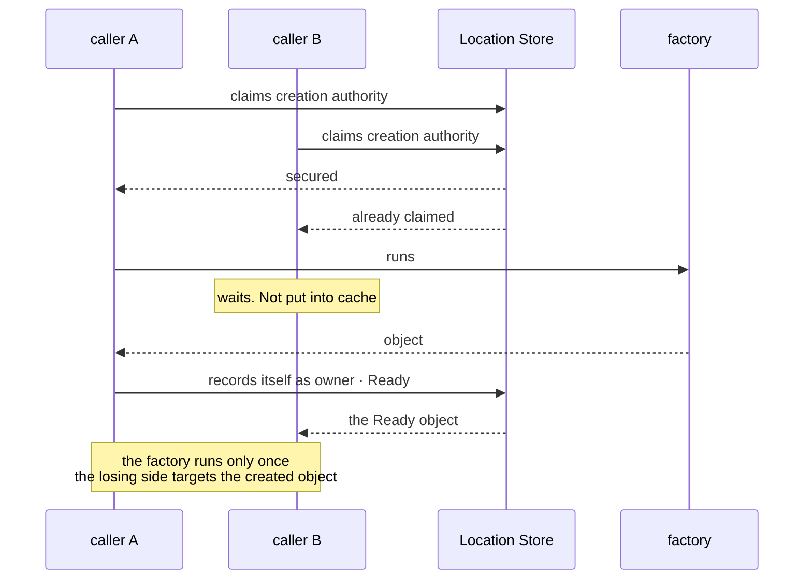
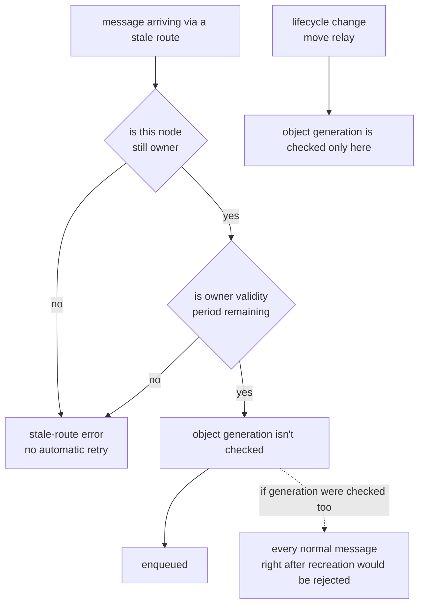

# 8. Object Kind And Activation

[Internal structure table of contents](README.en.md) · [Previous: 7. Receive And Dispatch Loop](07-dispatch-loop.en.md) · [Next: 9. Session And Actor Binding](09-session-binding.en.md)

> **What this chapter answers** — how the three Spot kinds are
> distinguished, when a missing object is built, and how a message
> arriving at a stale owner is filtered out.
>
> **Contract ownership** — the Spot kinds and shutdown reasons are
> owned by [the Spot Model](../spec/11-spot-model.en.md), and where
> generation is used by
> [Spot · Actor Routing](../spec/18-object-routing.en.md). The result
> after owner failure is owned by
> [Failure And Failover Policy](../spec/31-failure-failover-policy.en.md). This
> chapter covers the **structure** that satisfies that contract and
> the failures that become visible when a lifecycle boundary is violated.

Covers how, in code, the three kinds of
[Spot](../spec/01-glossary.en.md#spot) — the execution unit holding
Actors and handlers — are distinguished, when a missing object is
built, and how a message sent to a stale owner is filtered out.

## 1. Don't Distinguish Kind By A True/False Marker

Spot kind is a closed value set — `Invalid = 0`, `Entry = 1`,
`User = 2`, `Instance = 3`
([Glossary](../spec/01-glossary.en.md#spot-kind)). The three kinds
behave differently.

| Kind | When it's created | Move | Return-wait |
|---|---|---|---|
| Entry Spot | One per node when the Object Server starts | **Never** | Can't be used |
| User Spot | When creation is explicitly requested | Yes | Only in `SpotWide` |
| Instance Spot | When a call explicitly declaring intent to create first arrives | Yes | Can be used |

**Decision — represent the three kinds as separate types.** Attaching
a marker like `entry_spot` or `instance_spot` to one type means the
type can't stop a combination where two are true at once, and rules
that differ per kind scatter into conditionals. Rules such as whether
return-wait is allowed are decided at each kind's type boundary.

Putting three sibling types over a common base collects per-kind
differences at the type boundary.

**Per-language discretion.** Whether to express this with inheritance,
composition, or a tagged union is free. The observation standard is
"can an impossible combination be constructed."

## 2. What "Entry Spot Doesn't Move" Means

The Entry Spot **instance** belongs to that Object Server's lifecycle,
so it doesn't go into the move-candidate list
([Spot Model 「4.2 Entry Spot's Actor Lifecycle」](../spec/11-spot-model.en.md#42-entry-spots-actor-lifecycle)).

This is frequently mismatched here — **an Actor that was on the Entry
Spot does move.** What doesn't move is the Entry Spot itself. If
"Actors belonging to an Entry Spot" are excluded wholesale when
picking move candidates, those Actors disappear when the node goes
down.

## 3. When To Build A Missing Object

**An ordinary message never builds a missing object.** Only a
Spot-dedicated call that explicitly declares intent to create can
build a new one; an ordinary message and a lookup call only target an
already-ready object
([Spot · Actor Routing 「2.2 The Condition For Using A Recent Ready Route」](../spec/18-object-routing.en.md#22-the-condition-for-using-a-recent-ready-route)).

### Pass Spec States Into The Activation State Machine

The public behavior is defined by
[Failure Handling And Failover Scope §4.4](../spec/31-failure-failover-policy.en.md#44-distinguishing-instance-spot-cold-activation-from-owner-failure).
The resolver converts its result into one of the closed internal states below. The
activation state machine passes that state to exactly one responsible component, so a
later stage does not infer the Store result again.

| Internal State | Fence Preserved | Next Component |
|---|---|---|
| `Missing` | Lookup version proving authority absence | Creation coordinator |
| `Creating` | Attempt and reservation fence | Waiter for the same attempt |
| `Ready` | Route and authority/owner-lease fences | Route admission |
| `Unavailable` | Authority and invalid-owner evidence | Terminal completion adapter |

`Unavailable` means authority remains but the current owner cannot be used. It is not the
same state as `Missing`, which means no authority exists. Only after an explicit `Close`,
`IdleEvicted` cleanup, or another formal lifecycle operation completes authority release
can the resolver produce a new `Missing` input.

Stored creation intent resumes only an incomplete first cold-activation
operation on the same target node and lifecycle. It isn't used for
takeover or queue recovery after a steady `Ready` owner failure.

Without this distinction, one typo builds an object. A message sent
with a wrong ID would create a new object for that ID, and no one
would ever clean it up.

### When Multiple Attempt To Create At Once

If several callers try to build the same object at once, **only
whichever secures the creation authority first** records itself as
owner and creates it. The rest target the already-created object. The
factory runs exactly once.

**Decision — don't cache the in-progress-creation state.** Since
"being created" is a state about to change, it isn't put into
[6. Target Selection And Route Cache](06-routing-and-cache.en.md)'s
cache. Caching it would keep showing "being created" for the cache
lifetime even after creation finished.

### The Publication Order Of The Ready Record And The Target Route

An Instance Spot requires one more step after `Ready` is recorded in the Location Store.
The target runtime must immediately copy the same route into the local view used for
application-message admission. This local view is the `instance intent` projection. It
does not replace Store authority; it lets the process look up an already-validated
`Ready` route.

So the order is as follows.

1. The target node commits `Ready` authority to the Location Store.
2. In the same synchronous continuation where the commit succeeds, the
   target runtime registers the `instance intent`.
3. After that, the activation continuation enqueues the first
   application message.

If step 2 is delayed, `Ready` exists in the Store while the target runtime has no route.
The first application message can then end in `NotFound` or a stale-route error. A later
continuation may register the same route again to recover an omission, but that
registration must also finish before the first admission. Registration is idempotent, so
repeating it does not create duplicate execution.

If the losing side **caches "being created,"** the last two lines of
this diagram get delayed by the cache lifetime.

### If Creation Fails Midway

If creation fails midway, the activation state machine must define who
cleans up the leftover record and when. Without that responsibility, a
failed creation permanently occupies that ID.

## 4. Filtering Out A Message Sent To A Stale Owner

Since owner info is cached, the owner the sender knows may have
already changed. The receiving side must filter this out.

**Decision — the filtering criterion is owner identity and validity
period. Not object generation.**

[ObjectGeneration](../spec/01-glossary.en.md#objectgeneration) is
**not** a targeting condition for an ordinary message
([Spot · Actor Routing 「2.5 Where ObjectGeneration Is Used And Where It's Not」](../spec/18-object-routing.en.md#25-where-objectgeneration-is-used-and-where-its-not)).
Checking object generation as a condition for ordinary messages too
would reject every normal message right after an object is recreated.
Object generation is used to filter lifecycle changes and move relay.

| Checked | What it filters |
|---|---|
| Owner identity | This node is no longer owner |
| Owner validity period | It's owner, but past the deadline |
| Object generation | Applies only to lifecycle change and move relay |

The left axis is the path an ordinary message goes through. **The spot
where you'd want to add a generation check at `G` is the pitfall**, and
the right-side `K` is the only path where generation is checked.

**Decision — a filtered message ends in a stale-route error. The
runtime doesn't automatically retry.** Retrying would let the sender
see success while it may actually have executed twice. The application
can start a new call, and at that point the risk of duplicate
execution is judged by the application.

## 5. When To Clean Up An Active Object, And What Bounds It

### Idle Cleanup Targets Only Instance Spots

Idle-cleanup state is owned by the runtime's internal object catalog.
The .NET mapping names this owner `ZLinkSpotNodeCatalog`. When the configured
`InstanceSpotIdleTimeout` is positive, the catalog periodically checks
candidates. Each check examines at most 64, and the last check
position carries over to the next cycle, so maintenance work doesn't
monopolize application dispatch even with a large number of Spots.

Candidates are limited to Instance Spots. Only an activation with no
Actor membership, not participating in relocation or Message Follow,
and with no application work pending, becomes a candidate. It's only
accepted as a candidate once the timeout has passed since the last
application work finished.

Once a cleanup transaction starts, the catalog merges it with other
close requests for the same Spot ID. After reconfirming serial
quiescence, it calls the closing callback with reason `IdleEvicted`,
disposes the activation, and releases the Spot location in the
Location Store. So no new work is accepted while the callback is
running, and the location isn't cleared before the callback finishes.

If an Instance-intent request uses the previous route while the
location row is still being released, the runtime may invalidate the
route and re-read until the close transaction finishes authority
release as `Missing`, or until a current `Ready` route is confirmed.
This isn't a retry that resends an already-accepted application
request; it's an owner-route refresh that confirms the result of
explicit idle cleanup.

The resolver passes the result of completed idle-cleanup authority release
and a change in owner-availability evidence as different tags into the
activation state machine. The creation coordinator receives only the former
tag, while the latter is wired to the terminal completion adapter. The rule
against resubmitting an accepted request is defined by
[Failure Handling And Failover Scope §2](../spec/31-failure-failover-policy.en.md#2-common-judgment-criteria).

Language mappings may name the catalog differently, but each implements
the same shutdown conditions and verifies them with independent process
evidence. A structural explanation for one mapping does not substitute
for evidence from another.

### The Ceiling Exists, But Is Used Only At The Placement Stage — Not Enough

The active-object-count ceiling must be applied at **both placement
selection and local activation** — excluding a node near the ceiling
from candidates, or rejecting new object creation. If **reducing**
already-created objects and **new activation** are treated as separate
judgments, a request already pointing at that node can bypass the
ceiling.

**Decision — the ceiling is used at two points.**

| Point | What it does |
|---|---|
| Placement selection | Excludes a node near the ceiling from candidates for a new object |
| **Local activation** | If over the ceiling, **rejects activation at that node** |

Blocking only at the placement stage lets a request already pointing
at that node, or an object incoming via a move, simply pass through
the ceiling.

### What The Cleanup Criterion Is

**Decision — the cleanup target is Instance Spot only.** The formal
spec added the `IdleEvicted` shutdown reason limited to Instance Spot
([Spot Model](../spec/11-spot-model.en.md)). The reason User Spot
isn't cleaned up is that **an ordinary message does not recreate a cleaned-up User
Spot**. Only a call explicitly declaring Instance intent can build a missing object (§3).
Entry Spot belongs to
that Object Server's lifecycle, so it's never a target to begin with
(§2).

**Decision — the cleanup criterion must satisfy both "elapsed time
since last activity" and "no work currently in progress."** Looking at
time alone would delete an object with a long-waiting operation still
on it.

**Decision — Framework doesn't preserve application state on
cleanup.** State that needs to be kept is saved by the application
itself directly in the shutdown callback
([Spot Model 「6.2 Cleaning Up An Idle Instance Spot」](../spec/11-spot-model.en.md#62-cleaning-up-an-idle-instance-spot)).
For Framework to save state on the application's behalf, it would need
to know what to save, and that's the application's job.

## 6. Which Unit Memory Accounting Uses

Process-unit byte accounting and Spot-unit byte accounting are
different accounting units. Process-unit byte accounting bounds
pending-receive payload in bytes, and Spot-unit byte accounting bounds
per-lane work count and bytes together. One side's number isn't
reused as the other side's ceiling.

Execution queues keep application and lifecycle work in separate FIFO lanes, each with
count and byte reservations. The application-lane defaults
are 1,024 items and 64 MiB; the lifecycle-lane defaults are 128 items and 4 MiB. Accepted
application work reserves its payload size plus a fixed retained cost of 256 bytes per
work item. The reservation is returned at handler terminal completion. The relocation
hold has no relocation-specific item-count or byte bound.

So the Spot queue can saturate first even when the process HWM isn't
exhausted, and conversely, process inbound admission can stop first
even when the Spot queue isn't full. The two results are not merged into one
`CapacityExceeded` situation. They are distinguished by the queue whose admission
actually failed.

### The Queue Bound Is Set By Accumulated Payload Size

**Decision — the execution queue's bound enforces both the count and
byte axes, and applies whichever is hit first.** The formal spec
mandates both axes
([Framework API](../spec/06-framework-api.en.md)).

A single axis alone can be routed around via the other axis. Count
alone lets a few large payloads fill memory; bytes alone lets empty
payloads pile up indefinitely without hitting the bound.

**Decision — byte accounting doesn't count only payload size.** It
includes the envelope, metadata, and queue node one pending work item
occupies. In a language where this can't be calculated exactly, use a
value with a fixed per-work cost added. Even an empty payload, one
work item isn't 0 bytes.

The queue bound exists for two reasons — deciding how much memory
stays tied up, and judging how much work is backed up. **Count alone
tells you neither.**

The same 1,024 items is about 100 KB at 100 bytes each, and 1 GiB at 1 MiB
each. Memory differs by 10,000x while the bound triggers the same. The
time to drain is the same story — throughput moves closer to bytes per
second than items per second, so measuring the backlog requires
measuring in bytes.

A count bound is wrong in both directions.

| Situation | Result of a count bound |
|---|---|
| Small messages pile up | Rejects on hitting the bound despite memory headroom |
| Large messages pile up | Doesn't hit the bound while memory runs out |

Process-unit accounting is already in bytes (§6 first paragraph).
Bringing the same standard down to the Spot unit works, and since both
layers use the same unit, which layer triggered is also distinguishable.

**Decision — don't have an unbounded execution queue.** Each lane must
have both count and byte reservations
([Framework API](../spec/06-framework-api.en.md)).

The result on exceeding it **isn't one thing.** It splits by
submission family and queue location, so an implementation must not
lump it into one. The table is in
[2. Spot · Actor Execution Serialization 「2. The Pitfall When Building Execution Authority」](02-serialization.en.md#2-the-pitfall-when-building-execution-authority).

Two non-queue spots aren't in that table and are each
`CapacityExceeded` — the **worker scheduler queue** and **batch
capacity.** The latter is an admission judgment, not queue saturation.

The pending-during-a-move hold has no relocation-specific count or byte bound.
An execution-lane reservation for already owned work and limits owned by transport,
deadline, and cancellation are not reused as a separate relocation-hold ceiling. This is
a rule the formal spec fixed, so it's
followed as-is
([Host Relocate And Shutdown 「9. Moving Pending Messages, Timers, And Sessions」](../spec/28-graceful-drain-handoff.en.md#9-moving-pending-messages-timers-and-sessions)).

## 7. Result To Confirm

- The three Spot kinds are distinct types, and a value where two kinds
  are true at once can't be constructed.
- Entry Spot isn't in the move-candidate list, and an Actor that was
  on an Entry Spot does move.
- Sending an ordinary message with a missing ID doesn't build the
  object.
- A call that explicitly declares intent to create does build a
  missing object.
- Even if several callers request creating the same object at the same
  time, the factory runs only once.
- The "being created" state doesn't stay in the location cache.
- A record from a failed creation is cleaned up at startup.
- A change in owner-availability evidence doesn't invoke the authority-release transition.
- An `Unavailable` resolver tag is passed only to the terminal completion adapter.
- The activation-recovery root and scan key contain authority's target node and lifecycle.
- Even right after an object is recreated, ordinary messages aren't
  rejected for generation mismatch.
- A call sent to a stale owner ends in an error without automatic
  retry.
- Once active-object count hits the ceiling, activation is rejected at
  that node.
- Idle-cleanup targets are limited to Instance Spot. Entry Spot and
  User Spot aren't cleaned up.
- An Instance Spot with work in progress isn't cleaned up even after
  the idle time passes.
- On cleanup, the closing callback is called with shutdown reason
  `IdleEvicted`.
- The execution queue is bounded on both count and byte axes.
- When large messages pile up, the byte bound hits before the count
  bound.
- When empty payloads pile up, the count bound hits before the byte
  bound.
- Byte accounting includes a fixed per-work cost, so even an empty
  payload consumes the bound.
- There's no unbounded execution queue.

---

[Internal structure table of contents](README.en.md) · [Previous: 7. Receive And Dispatch Loop](07-dispatch-loop.en.md) · [Next: 9. Session And Actor Binding](09-session-binding.en.md)
